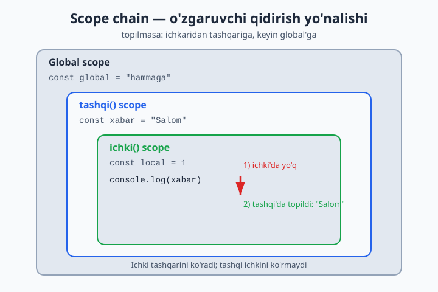
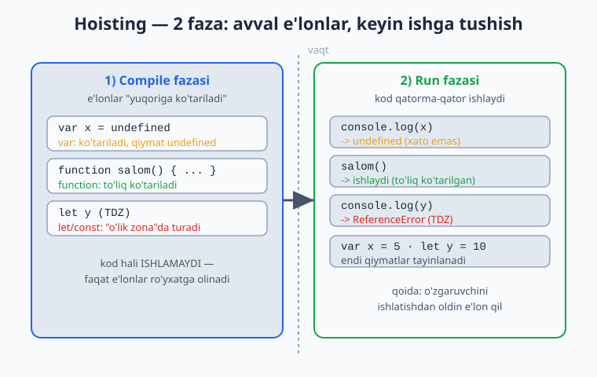
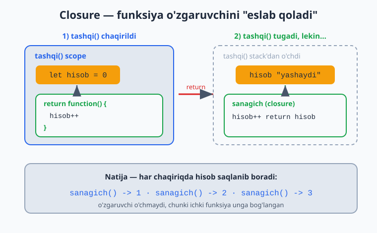
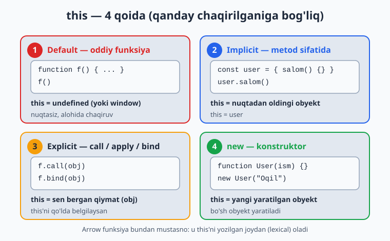
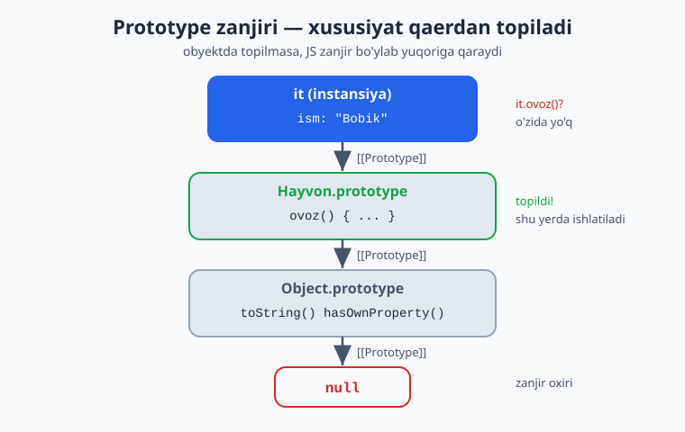

# JavaScript — 0 dan Expertgacha (O'zbek tilida)

📚 [README](./README.md) · [← 4-qism — Asinxron JS](./javascript-qollanma-4-qism.md) · [Keyingi: 5-qism (2-bo'lim) →](./javascript-qollanma-5-qism-2.md)

> **5-QISM: CHUQUR JS — 1-bo'lim (OOP yadrosi)**
> JS'ning "ostki qavati": o'zgaruvchilar qanday yashaydi, `this` nima, obyektlar qanday meros oladi.
> Bu blok — junior'ni middle'dan ajratadigan joy. Har bir moduldan keyin **20 ta masala** (yechimi bilan).

> 5-qism eng katta (7 modul), shuning uchun ikkiga bo'lindi:
> **1-bo'lim** (shu fayl): 17-Scope/Closures/Hoisting · 18-`this` · 19-Prototypes · 20-Classes
> **2-bo'lim** (keyingi): 21-ES6+ modullar · 22-Error handling · 23-Regex

---

# 17-MODUL: Scope, Closures, Hoisting

## Scope (ko'rinish doirasi)

Scope — o'zgaruvchi **qayerdan ko'rinishi** (kirish mumkinligi). 3 xil scope bor:

```js
const global = "hammaga ko'rinadi"; // 1. Global scope

function f() {
  const funksiyaIchi = "faqat f ichida"; // 2. Function scope
  console.log(global);       // ✅ ko'rinadi
  console.log(funksiyaIchi); // ✅ ko'rinadi
}

console.log(funksiyaIchi); // ❌ ReferenceError — tashqarida ko'rinmaydi
```

### Block scope (`let`/`const`) vs `var`

`let`/`const` — **blok** (`{}`) ichida cheklangan. `var` esa — **funksiya** ichida (blokni e'tiborsiz qoldiradi):

```js
if (true) {
  let a = 1;
  var b = 2;
}
console.log(b); // 2  — var blokdan "qochib" chiqdi
console.log(a); // ❌ ReferenceError — let blok ichida qoldi
```

> **Why — `var`ning yana bir muammosi:** `var` blokni hurmat qilmaydi, shuning uchun kutilmagan xatolar keltiradi (4-qismdagi sikl tuzog'ini esla). `let`/`const` aniq: ular faqat o'z `{}` ichida yashaydi. Bu — `var`ni ishlatmaslikning tub sababi.

### Lexical scope (ichki funksiya tashqarini ko'radi)

Funksiya **qayerda yozilganiga** qarab tashqi o'zgaruvchilarni ko'radi:

```js
function tashqi() {
  const xabar = "Salom";
  function ichki() {
    console.log(xabar); // ✅ tashqi o'zgaruvchini ko'radi
  }
  ichki();
}
```

Ichki funksiya tashqi scope'ni ko'radi, lekin tashqi — ichkini ko'rmaydi. Bu zanjir **scope chain** deyiladi: o'zgaruvchi avval o'z scope'ida, topilmasa tashqarida, keyin global'da qidiriladi.



## Hoisting (ko'tarilish)

JS kodni ishga tushirishdan oldin e'lonlarni "yuqoriga ko'taradi". Lekin har xil turlar har xil ko'tariladi:

```js
// var — ko'tariladi, lekin undefined bo'lib:
console.log(x); // undefined (xato emas!)
var x = 5;

// function declaration — to'liq ko'tariladi (e'londan oldin chaqirsa bo'ladi):
salom(); // ✅ "Salom" — ishlaydi
function salom() { console.log("Salom"); }

// let/const — ko'tariladi, lekin "Temporal Dead Zone"da:
console.log(y); // ❌ ReferenceError
let y = 10;
```

> **Why — TDZ (Temporal Dead Zone):** `let`/`const` texnik jihatdan ko'tariladi, lekin e'lon qilingan qatorgacha "o'lik zona"da turadi — ularga murojaat qilsang xato beradi. Bu — yaxshi narsa: `var`dagi `undefined` chalkashligini oldini oladi. Doim o'zgaruvchini **ishlatishdan oldin e'lon qil**.



Diqqat: **function expression** va arrow funksiyalar `var`/`let` qoidasiga bo'ysunadi — ular ko'tarilmaydi:

```js
salom(); // ❌ TypeError — bu function expression
const salom = function() { console.log("Salom"); };
```

## ⭐ Closures (yopilmalar) — eng muhim mavzu

**Closure** — bu funksiya o'zi yaratilgan scope'dagi o'zgaruvchilarni **eslab qoladigan** hodisa. Hatto tashqi funksiya tugab ketgan bo'lsa ham, ichki funksiya o'sha o'zgaruvchilarga kirishda davom etadi.

```js
function tashqi() {
  let hisob = 0; // bu o'zgaruvchi "yashaydi"

  return function() {
    hisob++; // tashqi o'zgaruvchini eslaydi va o'zgartiradi
    return hisob;
  };
}

const sanagich = tashqi(); // tashqi() tugadi, LEKIN hisob yo'qolmadi
console.log(sanagich()); // 1
console.log(sanagich()); // 2
console.log(sanagich()); // 3
```

> **Why bu sehrli:** Odatda funksiya tugagach, uning o'zgaruvchilari o'chadi. Lekin ichki funksiya `hisob`ga "bog'lanib qolgani" uchun, JS uni xotirada saqlaydi. Mana shu — closure. Bu — JS'ning eng kuchli va eng ko'p ishlatiladigan xususiyatlaridan biri.



### Closure foydasi 1: Function Factory (funksiya yasovchi)

Parametrni "eslab qoladigan" funksiyalar yaratish:

```js
function kopaytiruvchi(n) {
  return x => x * n; // n ni eslab qoladi
}

const ikkilik = kopaytiruvchi(2);
const uchlik = kopaytiruvchi(3);

console.log(ikkilik(5)); // 10
console.log(uchlik(5));  // 15
```

### Closure foydasi 2: Private o'zgaruvchi (inkapsulatsiya)

Tashqaridan ko'rinmaydigan, faqat ruxsat etilgan funksiyalar orqali o'zgaradigan ma'lumot:

```js
function hisobYaratuvchi() {
  let balans = 0; // PRIVATE — tashqaridan kirib bo'lmaydi

  return {
    qoshish(summa) { balans += summa; },
    yechish(summa) { balans -= summa; },
    korish() { return balans; },
  };
}

const hisob = hisobYaratuvchi();
hisob.qoshish(100);
hisob.qoshish(50);
console.log(hisob.korish()); // 150
console.log(hisob.balans);   // undefined — to'g'ridan-to'g'ri kira olmaymiz!
```

> **Why — OOP bog'lanishi:** Bu — inkapsulatsiyaning (data hiding) JS'dagi klassik usuli. `balans` himoyalangan; uni faqat `qoshish`/`yechish` orqali o'zgartirish mumkin. Class'lardagi `private` maydonlar (#) chiqquncha, JS'da privatlik aynan shu closure orqali qilingan (20-modulda ko'rasan).

### Closure va sikl tuzog'i (4-qismdan davom)

Eslaysanmi, `let` sikl ichida nega to'g'ri ishlagandi? Chunki `let` **har takrorda yangi binding** (closure) yaratadi:

```js
for (let i = 0; i < 3; i++) {
  setTimeout(() => console.log(i), 100); // 0, 1, 2
}
// Har callback o'zining alohida "i" closure'siga ega.
```

---

## 📝 17-modul masalalari (20 ta)

1. Funksiya ichidagi o'zgaruvchiga tashqaridan kirib bo'lmasligini ko'rsating.
2. `let` blok (`{}`) ichida e'lon qilib, tashqarida ishlatishga urining (xato).
3. `var`ni `if` bloki ichida e'lon qilib, tashqarida ko'rinishini ko'rsating.
4. Lexical scope: ichki funksiya tashqi o'zgaruvchini o'qisin.
5. Hoisting: `console.log(x); var x = 5;` natijasini bashorat qiling.
6. Function declaration'ni e'lonidan **oldin** chaqiring (ishlaydi).
7. TDZ: `let`ni e'lonidan oldin o'qishga urining (xato turini ayting).
8. Function expression hoisting ishlamasligini ko'rsating.
9. Closure: `tashqi()` ichki funksiya qaytarsin, `hisob` saqlansin.
10. Closure bilan sanagich (counter) yarating: `1, 2, 3` chiqarsin.
11. `kopaytiruvchi(n)` factory yozing — `ikkilik(5)` → 10 qaytarsin.
12. `qoshuvchi(n)` factory: `besh = qoshuvchi(5); besh(3)` → 8.
13. Closure bilan private `balans`: `qoshish`/`korish` metodlari bo'lsin.
14. Ikkita mustaqil sanagich yarating — bir-biriga ta'sir qilmasin.
15. Closure bilan "faqat bir marta ishlaydigan" funksiya (`once`) yozing.
16. `setTimeout` + `let` sikli bilan `0, 1, 2` chiqaring.
17. Closure bilan oddiy memoize (kesh): bir xil argument qayta kelsa, hisoblamasin.
18. Funksiya nechta marta chaqirilganini sanaydigan wrapper yozing.
19. IIFE (darhol chaqiriladigan funksiya) bilan private holat yarating (module pattern).
20. **Murakkab:** Bank hisobi — closure bilan `deposit`, `withdraw`, `balans` metodlari; `balans` private bo'lsin, manfiy yechishga ruxsat bermasin.

<details markdown="1">
<summary>► Yechimlar</summary>

```js
// 1
function f1() { const x = 5; }
// console.log(x); // ❌ ReferenceError

// 2
{ let a = 1; }
// console.log(a); // ❌ ReferenceError

// 3
if (true) { var b = 2; }
console.log(b); // 2

// 4
function tashqi4() {
  const xabar = "Salom";
  function ichki() { return xabar; }
  return ichki();
}
console.log(tashqi4()); // "Salom"

// 5 -> undefined
console.log(typeof x5); var x5 = 5; // "undefined"

// 6 -> "Salom"
salom6();
function salom6() { console.log("Salom"); }

// 7 -> ReferenceError
// console.log(y7); let y7 = 10;

// 8 -> TypeError (salom8 hali undefined)
// salom8(); const salom8 = () => {};

// 9
function tashqi9() {
  let hisob = 0;
  return () => ++hisob;
}
const s9 = tashqi9();
console.log(s9(), s9(), s9()); // 1 2 3

// 10
const sanagich = (() => {
  let n = 0;
  return () => ++n;
})();
console.log(sanagich(), sanagich(), sanagich()); // 1 2 3

// 11
const kopaytiruvchi = n => x => x * n;
console.log(kopaytiruvchi(2)(5)); // 10

// 12
const qoshuvchi = n => x => x + n;
const besh = qoshuvchi(5);
console.log(besh(3)); // 8

// 13
function hisob13() {
  let balans = 0;
  return {
    qoshish: s => balans += s,
    korish: () => balans,
  };
}
const h = hisob13();
h.qoshish(100);
console.log(h.korish()); // 100

// 14
function yarat() { let n = 0; return () => ++n; }
const a14 = yarat(), b14 = yarat();
console.log(a14(), a14()); // 1 2
console.log(b14());        // 1 (mustaqil)

// 15
function once(fn) {
  let bajarildi = false;
  return (...args) => {
    if (!bajarildi) { bajarildi = true; return fn(...args); }
  };
}
const init = once(() => console.log("Faqat bir marta"));
init(); init(); // faqat bir marta chiqadi

// 16
for (let i = 0; i < 3; i++) setTimeout(() => console.log(i), 100); // 0,1,2

// 17 — memoize
function memoize(fn) {
  const kesh = {};
  return (n) => {
    if (n in kesh) { console.log("keshdan"); return kesh[n]; }
    const r = fn(n);
    kesh[n] = r;
    return r;
  };
}
const kvadrat = memoize(n => n * n);
console.log(kvadrat(4)); // hisoblanadi -> 16
console.log(kvadrat(4)); // keshdan -> 16

// 18
function sanagichWrapper(fn) {
  let soni = 0;
  return (...args) => {
    soni++;
    console.log(`${soni}-marta chaqirildi`);
    return fn(...args);
  };
}
const f = sanagichWrapper(() => "ish");
f(); f();

// 19 — module pattern (IIFE)
const Modul = (() => {
  let maxfiy = 42;
  return { korish: () => maxfiy };
})();
console.log(Modul.korish()); // 42
// console.log(Modul.maxfiy); // undefined

// 20 — Bank hisobi
function bankHisobi(boshlangich = 0) {
  let balans = boshlangich;
  return {
    deposit(summa) {
      if (summa > 0) balans += summa;
      return balans;
    },
    withdraw(summa) {
      if (summa > balans) { console.log("Mablag' yetarli emas"); return balans; }
      balans -= summa;
      return balans;
    },
    get balans() { return balans; },
  };
}
const hisob20 = bankHisobi(100);
hisob20.deposit(50);   // 150
hisob20.withdraw(200); // "Mablag' yetarli emas", 150
console.log(hisob20.balans); // 150
```
</details>

---

# 18-MODUL: `this`

`this` — JS'ning eng ko'p chalkashtiradigan mavzusi. Lekin bitta qoida hamma narsani ochadi.

## Asosiy qoida

> **`this`ning qiymati funksiya QAYERDA yozilganiga emas, QANDAY CHAQIRILGANIGA bog'liq.** (Arrow funksiyalar bundan mustasno — pastda.)

Funksiya chaqirilishining 4 holati bor:

### 1. Metod sifatida chaqirish — `this` = nuqtadan oldingi obyekt

```js
const user = {
  ism: "Oqil",
  salom() {
    return `Salom, men ${this.ism}`; // this = user
  },
};
console.log(user.salom()); // "Salom, men Oqil"
```

### 2. Oddiy funksiya — `this` = global (yoki `undefined`)

```js
function f() {
  console.log(this);
}
f(); // strict mode'da (modul/class) -> undefined; oddiy script'da -> window
```

### 3. Konstruktor (`new`) — `this` = yangi yaratilgan obyekt

```js
function User(ism) {
  this.ism = ism; // this = yangi obyekt
}
const u = new User("Oqil");
console.log(u.ism); // "Oqil"
```

### 4. Explicit (call/apply/bind) — `this` = sen bergan qiymat (pastda)



## ⚠️ "Yo'qolgan this" muammosi

`this` chaqirilishga bog'liq bo'lgani uchun, metodni nuqtadan **ajratsang**, `this` yo'qoladi:

```js
const user = {
  ism: "Oqil",
  salom() { return this.ism; },
};

const f = user.salom; // metodni ajratib oldik
console.log(f()); // undefined! — endi "user.salom()" emas, shunchaki "f()"
```

Xuddi shu — `setTimeout`, event listener, callback'larda sodir bo'ladi:

```js
const user = {
  ism: "Oqil",
  salom() {
    setTimeout(function() {
      console.log(this.ism); // undefined — this user emas!
    }, 100);
  },
};
user.salom();
```

## ✅ Arrow funksiya — `this`ni "meros" qiladi

Arrow funksiyaning **o'z `this`i yo'q**. U o'zi yozilgan joydan (lexical) `this`ni oladi. Bu — yuqoridagi muammoning yechimi:

```js
const user = {
  ism: "Oqil",
  salom() {
    setTimeout(() => {
      console.log(this.ism); // "Oqil" ✓ — arrow tashqi this'ni (salom'niki) oldi
    }, 100);
  },
};
user.salom(); // "Oqil"
```

> **Why — eng muhim amaliy qoida:** Metod ichidagi callback'larda **arrow funksiya** ishlat — u tashqi `this`ni saqlaydi. Lekin obyekt metodining **o'zini** arrow qilma (pastdagi tuzoq).

## ⚠️ Tuzoq: obyekt metodini arrow qilish

```js
const user = {
  ism: "Oqil",
  salom: () => {
    console.log(this.ism); // undefined! — arrow'ning this'i user emas, tashqi (global)
  },
};
user.salom(); // undefined
```

> Arrow `this`ni **yozilgan joydan** oladi — bu yerda obyekt metodi darajasida `this` global'ga ishora qiladi (obyektga emas). Shuning uchun **obyekt metodlarini oddiy funksiya** qilib yoz, callback'larnigina arrow qil.

## `call`, `apply`, `bind` — `this`ni qo'lda belgilash

```js
function salom(salutatsiya) {
  return `${salutatsiya}, ${this.ism}`;
}
const user = { ism: "Oqil" };

// call — darhol chaqiradi, argumentlar vergul bilan:
console.log(salom.call(user, "Assalom"));  // "Assalom, Oqil"

// apply — darhol chaqiradi, argumentlar massivda:
console.log(salom.apply(user, ["Salom"])); // "Salom, Oqil"

// bind — chaqirmaydi, this BOG'LANGAN yangi funksiya qaytaradi:
const boglangan = salom.bind(user);
console.log(boglangan("Hayrli kun")); // "Hayrli kun, Oqil"
```

| Metod | Darhol chaqiriladimi? | Argumentlar |
|-------|----------------------|-------------|
| `call` | Ha | vergul bilan: `call(this, a, b)` |
| `apply` | Ha | massivda: `apply(this, [a, b])` |
| `bind` | Yo'q (yangi funksiya) | vergul bilan |

> **Why `bind`:** Event listener'da `this`ni saqlash uchun juda foydali — `element.addEventListener("click", obj.metod.bind(obj))`. `bind` `this`ni "muhrlaydi", keyin uni o'zgartirib bo'lmaydi. Arrow funksiyalarda `call`/`apply`/`bind` `this`ni o'zgartira **olmaydi** (ularning `this`i lexical va o'zgarmas).

## Amaliy: metod "qarz olish" (borrowing)

`call`/`apply` bilan bir obyekt metodini boshqasiga qo'llash:

```js
const ali = { ism: "Ali", salom() { return `Men ${this.ism}`; } };
const vali = { ism: "Vali" };

console.log(ali.salom.call(vali)); // "Men Vali" — Vali uchun ishlatdik
```

---

## 📝 18-modul masalalari (20 ta)

1. Obyekt metodida `this.ism`ni qaytaring (`user.salom()`).
2. Metodni ajratib (`const f = user.salom; f()`) `this` yo'qolishini ko'rsating.
3. Oddiy funksiya ichida `this` nima ekanini tekshiring (strict).
4. **Tuzoq:** obyekt metodini arrow qiling — `this` ishlamasligini ko'rsating.
5. `setTimeout` ichida oddiy funksiya bilan `this` yo'qolishini ko'rsating.
6. Xuddi shuni arrow funksiya bilan tuzating.
7. `call` bilan `this` va argument bering.
8. `apply` bilan argumentlarni massivda bering.
9. `bind` bilan yangi bog'langan funksiya yarating.
10. `bind` bilan argumentni oldindan biriktiring (partial application).
11. Metod "qarz olish": bir obyekt metodini `call` bilan boshqasiga qo'llang.
12. Ichma-ich oddiy funksiyada `this` yo'qolishini, arrow bilan tuzalishini ko'rsating.
13. `Math.max.apply(null, [3,9,2])` bilan massivdan eng kattani toping.
14. Konstruktor funksiya: `new User("Oqil")` — `this.ism`ni o'rnating.
15. `bind` bilan event listener uchun `this`ni saqlang (konseptual/DOM).
16. Bir nechta obyektni bitta umumiy funksiya bilan `call` orqali boshqaring.
17. Arrow funksiyada `bind` `this`ni o'zgartira olmasligini ko'rsating.
18. Obyekt metodida ham arrow, ham oddiy funksiyani solishtiring (`this` farqi).
19. `forEach` callback'ida `this`: oddiy yo'qotadi, arrow saqlaydi — ko'rsating.
20. **Murakkab:** obyekt yarating — metodida `this` ishlasin; metod ichidagi `setTimeout` callback'ida ham `this` to'g'ri bo'lsin (arrow); va bitta metodni boshqa obyektga `bind` bilan biriktiring.

<details markdown="1">
<summary>► Yechimlar</summary>

```js
// 1
const user = { ism: "Oqil", salom() { return this.ism; } };
console.log(user.salom()); // "Oqil"

// 2 -> undefined
const f2 = user.salom;
// console.log(f2()); // undefined (this yo'qoldi)

// 3
"use strict";
function f3() { return this; }
console.log(f3()); // undefined (strict) yoki window (script)

// 4 -> undefined
const u4 = { ism: "Oqil", salom: () => this.ism };
console.log(u4.salom()); // undefined (arrow this = tashqi)

// 5
const u5 = {
  ism: "Oqil",
  salom() { setTimeout(function () { console.log(this.ism); }, 50); },
};
u5.salom(); // undefined

// 6
const u6 = {
  ism: "Oqil",
  salom() { setTimeout(() => console.log(this.ism), 50); },
};
u6.salom(); // "Oqil"

// 7
function salom7(s) { return `${s}, ${this.ism}`; }
console.log(salom7.call({ ism: "Oqil" }, "Salom")); // "Salom, Oqil"

// 8
console.log(salom7.apply({ ism: "Ali" }, ["Hey"])); // "Hey, Ali"

// 9
const bog9 = salom7.bind({ ism: "Vali" });
console.log(bog9("Assalom")); // "Assalom, Vali"

// 10
const salomOqil = salom7.bind({ ism: "Oqil" }, "Hayrli tong");
console.log(salomOqil()); // "Hayrli tong, Oqil"

// 11
const ali = { ism: "Ali", tani() { return `Men ${this.ism}`; } };
console.log(ali.tani.call({ ism: "Vali" })); // "Men Vali"

// 12
const u12 = {
  ism: "Oqil",
  test() {
    function ichkiOddiy() { return this?.ism; } // undefined
    const ichkiArrow = () => this.ism;           // "Oqil"
    return [ichkiOddiy(), ichkiArrow()];
  },
};
console.log(u12.test()); // [undefined, "Oqil"]

// 13 -> 9
console.log(Math.max.apply(null, [3, 9, 2]));
// zamonaviy: Math.max(...[3,9,2])

// 14
function User14(ism) { this.ism = ism; }
console.log(new User14("Oqil").ism); // "Oqil"

// 15 (DOM)
// const obj = { ism: "Oqil", bos() { console.log(this.ism); } };
// btn.addEventListener("click", obj.bos.bind(obj)); // this saqlanadi

// 16
function umumiySalom() { return this.ism; }
const obyektlar = [{ ism: "A" }, { ism: "B" }];
obyektlar.forEach(o => console.log(umumiySalom.call(o))); // A, B

// 17
const ar17 = () => this;
console.log(ar17.call({ ism: "X" })); // bind/call ta'sir qilmaydi (lexical this)

// 18
const u18 = {
  ism: "Oqil",
  oddiy() { return this.ism; }, // "Oqil"
  ok: () => this.ism,           // undefined
};
console.log(u18.oddiy(), u18.ok()); // "Oqil" undefined

// 19
const u19 = {
  ism: "Oqil",
  raqamlar: [1, 2],
  oddiyForEach() { this.raqamlar.forEach(function () { console.log(this?.ism); }); }, // undefined
  arrowForEach() { this.raqamlar.forEach(() => console.log(this.ism)); }, // "Oqil"
};
u19.arrowForEach(); // Oqil, Oqil

// 20
const profil = {
  ism: "Oqil",
  salom() {
    console.log(`Men ${this.ism}`);          // metod this
    setTimeout(() => console.log(this.ism), 50); // arrow -> this saqlanadi
  },
};
profil.salom(); // "Men Oqil", keyin "Oqil"
const boshqa = { ism: "Vali" };
profil.salom.bind(boshqa)(); // "Men Vali", keyin "Vali"
```
</details>

---

# 19-MODUL: Prototypes va inheritance

Bu — JS'da obyektlar **qanday ishlashining** asosi. Class'lar (keyingi modul) shuning ustiga qurilgan "shirin qobiq". Buni tushunsang, JS obyekt modelini tushunding.

## Prototype zanjiri

Har bir obyektda yashirin **prototype** (ota-obyekt) havolasi bor. Obyektda xususiyat topilmasa, JS uning prototype'iga qaraydi, keyin prototype'ning prototype'iga — `null`gacha. Bu — **prototype chain**.

```js
const arr = [1, 2, 3];
// Zanjir: arr -> Array.prototype -> Object.prototype -> null
// Shuning uchun arr.map(), arr.toString() ishlaydi — ular Array.prototype'da!

console.log(Object.getPrototypeOf(arr) === Array.prototype); // true
```

> **Why bu muhim:** `[1,2,3].map(...)` nega ishlaydi? `map` massivning o'zida emas — `Array.prototype`da. JS uni zanjir bo'ylab topadi. Demak, barcha massivlar **bitta** `map` nusxasini ulashadi (xotira tejaladi). Mana shu — prototypening kuchi.



## Konstruktor funksiya + `.prototype`

`new` bilan obyekt yasashning eski (class'dan oldingi) usuli:

```js
function Hayvon(ism) {
  this.ism = ism; // har obyektning O'Z xususiyati
}

// Umumiy metod — prototype'ga qo'yamiz (barcha obyektlar ulashadi):
Hayvon.prototype.ovoz = function () {
  return `${this.ism} ovoz chiqaradi`;
};

const it = new Hayvon("Bobik");
const mushuk = new Hayvon("Mosi");

console.log(it.ovoz());    // "Bobik ovoz chiqaradi"
console.log(mushuk.ovoz()); // "Mosi ovoz chiqaradi"

// Ikkalasi ham bitta metodni ulashadi:
console.log(it.ovoz === mushuk.ovoz); // true
```

> **Why prototype'ga qo'yamiz:** Agar `ovoz`ni konstruktor ichida (`this.ovoz = ...`) yozsak, har obyekt **o'z nusxasini** olardi — 1000 obyekt = 1000 nusxa (xotira isrofi). Prototype'da bo'lsa — **bitta** nusxa, hammasi ulashadi. Shuning uchun **ma'lumot** — konstruktorda (`this.ism`), **metodlar** — prototype'da.

## `hasOwnProperty` — o'ziniki vs merosga olingan

```js
const it = new Hayvon("Bobik");

console.log(it.hasOwnProperty("ism"));  // true  — o'zining xususiyati
console.log(it.hasOwnProperty("ovoz")); // false — prototype'dan merosga olingan
console.log("ovoz" in it);              // true  — zanjirda bor (meros ham hisoblanadi)
```

## `instanceof`

Obyekt biror konstruktordan yaratilganmi (zanjirda bormi):

```js
console.log(it instanceof Hayvon); // true
console.log(it instanceof Object); // true (zanjirda Object.prototype ham bor)
```

## `Object.create` — prototype'ni to'g'ridan-to'g'ri berish

```js
const hayvon = {
  ovoz() { return `${this.ism} ovoz chiqaradi`; },
};

const it = Object.create(hayvon); // it'ning prototype'i = hayvon
it.ism = "Bobik";
console.log(it.ovoz()); // "Bobik ovoz chiqaradi"
```

## Inheritance (meros) — class'dan oldingi usul

```js
function Hayvon(ism) {
  this.ism = ism;
}
Hayvon.prototype.ovoz = function () { return `${this.ism}: ovoz`; };

function It(ism, zot) {
  Hayvon.call(this, ism); // ota konstruktorni chaqirish (this bilan)
  this.zot = zot;
}
// Prototype zanjirini ulash:
It.prototype = Object.create(Hayvon.prototype);
It.prototype.constructor = It;

// It'ga o'z metodi:
It.prototype.vovullash = function () { return `${this.ism} vovullaydi`; };

const bobik = new It("Bobik", "Alabay");
console.log(bobik.ovoz());      // "Bobik: ovoz" (merosga olingan)
console.log(bobik.vovullash()); // "Bobik vovullaydi"
console.log(bobik instanceof Hayvon); // true
```

> **Why class'lar yaratilgan:** Bu kod ishlaydi, lekin **ko'p va chalkash** (`Object.create`, `constructor` tuzatish, `.call`). Aynan shu og'riqni kamaytirish uchun ES6'da **class** sintaksisi qo'shilgan — keyingi modulda ko'rasan. Class — aslida shu prototype mexanizmining chiroyli ko'rinishi.

---

## 📝 19-modul masalalari (20 ta)

1. `Object.getPrototypeOf([])` — massiv prototype'ini tekshiring.
2. `[1,2].map` `Array.prototype`da ekanini ko'rsating.
3. Konstruktor `User(ism)` yozing, `new` bilan obyekt yarating.
4. `.prototype`ga `salom` metodini qo'shib, instansiyada chaqiring.
5. Ikki instansiya bitta prototype metodini ulashishini ko'rsating (`===`).
6. `hasOwnProperty` bilan o'z xususiyati va merosni farqlang.
7. `instanceof` bilan obyekt konstruktordan ekanini tekshiring.
8. `Object.create` bilan berilgan prototype'li obyekt yarating.
9. Prototype'ga keyin metod qo'shib, **mavjud** instansiyada ham ishlashini ko'rsating.
10. Instansiyada prototype metodini "ustidan yozish" (shadowing) ni ko'rsating.
11. Prototype'dagi xususiyatni zanjir orqali topilishini ko'rsating.
12. `Hayvon(ism)` konstruktor + `.prototype.ovoz` metodi yozing.
13. Inheritance: `It` konstruktori ota `Hayvon`ni `call` bilan chaqirsin.
14. Prototype zanjirini ulang (`Object.create(Hayvon.prototype)`).
15. `instanceof` meros zanjiri bilan (`It` instansiyasi `Hayvon`ham bo'lsin).
16. `Object.getPrototypeOf`ni zanjir bo'ylab 2 marta chaqiring.
17. `String.prototype`ga maxsus metod qo'shing (ehtiyotkorlik izohi bilan).
18. `in` operatori va `hasOwnProperty` farqini ko'rsating.
19. Konstruktor + prototype: barcha instansiyalar uchun umumiy metod yozing.
20. **Murakkab:** `Hayvon` → `It` merosi quring; `It` o'z metodi (`vovullash`) qo'shsin, ota metodini (`ovoz`) ishlatsin; `instanceof` ikkalasini ham `true` qaytarsin.

<details markdown="1">
<summary>► Yechimlar</summary>

```js
// 1
console.log(Object.getPrototypeOf([]) === Array.prototype); // true

// 2
console.log([1, 2].map === Array.prototype.map); // true

// 3
function User(ism) { this.ism = ism; }
const u = new User("Oqil");
console.log(u.ism); // "Oqil"

// 4
User.prototype.salom = function () { return `Salom, ${this.ism}`; };
console.log(u.salom()); // "Salom, Oqil"

// 5
const u2 = new User("Ali");
console.log(u.salom === u2.salom); // true

// 6
console.log(u.hasOwnProperty("ism"));   // true
console.log(u.hasOwnProperty("salom")); // false

// 7
console.log(u instanceof User); // true

// 8
const proto = { salom() { return `Men ${this.ism}`; } };
const obj = Object.create(proto);
obj.ism = "Vali";
console.log(obj.salom()); // "Men Vali"

// 9
User.prototype.xayr = function () { return "Xayr"; };
console.log(u.xayr()); // "Xayr" (eski instansiyada ham ishlaydi)

// 10
u.salom = () => "O'zimning salom";
console.log(u.salom());  // "O'zimning salom" (shadowing)
console.log(u2.salom()); // prototype'dan (o'zgarmadi)

// 11
function A() {}
A.prototype.x = 10;
console.log(new A().x); // 10 (zanjirdan)

// 12
function Hayvon(ism) { this.ism = ism; }
Hayvon.prototype.ovoz = function () { return `${this.ism}: ovoz`; };

// 13, 14, 15, 20 — Inheritance
function It(ism, zot) {
  Hayvon.call(this, ism); // 13
  this.zot = zot;
}
It.prototype = Object.create(Hayvon.prototype); // 14
It.prototype.constructor = It;
It.prototype.vovullash = function () { return `${this.ism} vovullaydi`; };

const bobik = new It("Bobik", "Alabay");
console.log(bobik.ovoz());            // "Bobik: ovoz" (ota metodi)
console.log(bobik.vovullash());       // "Bobik vovullaydi"
console.log(bobik instanceof It);     // true (15)
console.log(bobik instanceof Hayvon); // true (15)

// 16
console.log(Object.getPrototypeOf(Object.getPrototypeOf(bobik)) === Hayvon.prototype); // true

// 17 — ehtiyot bo'l: built-in prototype'ni o'zgartirish odatda tavsiya etilmaydi
String.prototype.qaytar = function () { return this.split("").reverse().join(""); };
console.log("abc".qaytar()); // "cba"
// (Real loyihada built-in prototype'ni kengaytirma — konfliktga olib keladi)

// 18
console.log("ovoz" in bobik);              // true (meros ham)
console.log(bobik.hasOwnProperty("ovoz")); // false (o'ziniki emas)

// 19
function Doira(r) { this.r = r; }
Doira.prototype.yuza = function () { return Math.PI * this.r ** 2; };
console.log(new Doira(2).yuza().toFixed(2)); // 12.57
```
</details>

---

# 20-MODUL: Classes (ES6)

Class — prototype'larning **zamonaviy, toza sintaksisi**. Ostida xuddi 19-moduldagi mexanizm ishlaydi, lekin yozish ancha qulay. (Oqil — sen Laravel'da OOP/SOLID bilan ishlaysan; bu yerdagi tushunchalar tanish bo'ladi.)

## Class e'lon qilish

```js
class Hayvon {
  constructor(ism) {
    this.ism = ism; // instansiya xususiyati
  }

  ovoz() { // metod — avtomatik prototype'ga tushadi
    return `${this.ism} ovoz chiqaradi`;
  }
}

const it = new Hayvon("Bobik");
console.log(it.ovoz()); // "Bobik ovoz chiqaradi"
```

`constructor` — `new` chaqirilganda ishga tushadigan maxsus metod. Metodlar avtomatik `Hayvon.prototype`ga tushadi (19-moduldagi qo'lda yozishni eslab ko'r — class buni avtomatik qiladi).

## Inheritance: `extends` va `super`

```js
class Hayvon {
  constructor(ism) { this.ism = ism; }
  ovoz() { return `${this.ism}: ovoz`; }
}

class It extends Hayvon {
  constructor(ism, zot) {
    super(ism);     // ota konstruktorni chaqirish (MAJBURIY, this'dan oldin)
    this.zot = zot;
  }

  ovoz() { // override — ota metodini almashtirish
    return `${this.ism} vovullaydi`;
  }

  toliq() {
    return super.ovoz() + ` (${this.zot})`; // ota metodini chaqirish
  }
}

const bobik = new It("Bobik", "Alabay");
console.log(bobik.ovoz());  // "Bobik vovullaydi" (override)
console.log(bobik.toliq()); // "Bobik: ovoz (Alabay)" (super bilan)
```

> **Why `super` muhim:** `super(...)` — ota konstruktorini chaqiradi. `extends` ishlatganda, `this`ga tegishdan oldin **`super()` chaqirilishi shart** (aks holda xato). `super.metod()` esa — ota metodini chaqiradi (override qilingan bo'lsa ham). 19-moduldagi chalkash `Object.create` + `.call` — endi bitta `extends` + `super` bilan hal bo'ldi.

## `static` — instansiyasiz ishlaydigan

`static` metod/xususiyat — class'ning o'ziga tegishli, instansiyaga emas:

```js
class MatYordam {
  static kvadrat(n) { return n * n; }
  static PI = 3.14159;
}

console.log(MatYordam.kvadrat(5)); // 25 — new kerak emas
console.log(MatYordam.PI);         // 3.14159
```

> **Misol:** `Math.max()`, `Array.from()`, `Object.keys()` — hammasi static metodlar. Ular yordamchi (utility) funksiyalar uchun — obyekt holatiga bog'liq emas.

## Getter / Setter

Xususiyatga o'qish/yozishni metod orqali boshqarish (lekin xususiyatdek ishlatiladi):

```js
class Doira {
  constructor(radius) { this._radius = radius; }

  get radius() { return this._radius; }

  set radius(qiymat) {
    if (qiymat <= 0) throw new Error("Radius musbat bo'lsin");
    this._radius = qiymat;
  }

  get yuza() { // hisoblanadigan xususiyat
    return Math.PI * this._radius ** 2;
  }
}

const d = new Doira(5);
console.log(d.radius); // 5 (get — qavssiz!)
console.log(d.yuza.toFixed(2)); // 78.54
d.radius = 10; // set ishlaydi
// d.radius = -1; // ❌ Error
```

> **Why getter/setter:** Tashqaridan oddiy xususiyatdek ko'rinadi (`d.radius`), lekin ichida tekshiruv/hisob bor. `yuza` — har safar radiusga qarab hisoblanadi, alohida saqlash shart emas.

## Private maydonlar (`#`) — ES2022

Haqiqiy private (closure'siz). `#` bilan boshlangan maydon tashqaridan ko'rinmaydi:

```js
class BankHisobi {
  #balans = 0; // PRIVATE

  deposit(summa) {
    if (summa > 0) this.#balans += summa;
  }

  get balans() { return this.#balans; }
}

const hisob = new BankHisobi();
hisob.deposit(100);
console.log(hisob.balans);  // 100
// console.log(hisob.#balans); // ❌ SyntaxError — tashqaridan kira olmaysan
```

> **Why `#` vs closure:** 17-modulda privatlikni closure bilan qilgan eding. Endi class'larda `#` bor — toza va aniq. `#balans`ni faqat class ichidagi metodlar ko'radi. Bu — inkapsulatsiya (OOP'ning asosiy prinsipi).

## Class — bu prototype'ning qobig'i (isbot)

```js
class Test {
  metod() {}
}
console.log(typeof Test);                          // "function" (class — funksiya!)
console.log(Test.prototype.metod);                 // metod prototype'da
console.log(new Test() instanceof Test);           // true
```

> Demak, class — sintaktik shakar. Ostida 19-moduldagi prototype mexanizmi. Lekin yozish va o'qish ancha qulay — shuning uchun zamonaviy kodda class ishlatiladi.

---

## 📝 20-modul masalalari (20 ta)

1. `User` class yozing — `constructor`da `ism` o'rnating.
2. `new User("Oqil")` bilan instansiya yaratib, `ism`ni chiqaring.
3. `salom()` metodi qo'shing — `this.ism` ishlatsin.
4. Ikki instansiya mustaqil ekanini ko'rsating.
5. `Hayvon` class'idan `It` class'ini `extends` qiling.
6. `It` konstruktorida `super(ism)` chaqiring.
7. `It`da `ovoz()` metodini override qiling.
8. `super.ovoz()` bilan ota metodini `It` ichidan chaqiring.
9. `MatYordam` class'iga `static kvadrat(n)` qo'shing.
10. `static` xususiyat (`PI`) qo'shing va instansiyasiz ishlating.
11. `Doira` class'iga `get radius()` getter qo'shing.
12. `set radius(v)` setter qo'shing — manfiy qiymatga xato bersin.
13. `get yuza()` — radiusdan hisoblansin (qavssiz chaqiriladi).
14. `#balans` private maydon bilan `BankHisobi` yozing.
15. `#balans`ga tashqaridan kirib bo'lmasligini ko'rsating.
16. `instanceof` bilan instansiya class va ota class'dan ekanini tekshiring.
17. Class metodi `prototype`da ekanini ko'rsating (`Object.getPrototypeOf`).
18. `toString()` metodini override qiling.
19. `static` "factory" metod yozing (`User.yarat(...)` yangi instansiya qaytarsin).
20. **Murakkab:** `Shakl` bazaviy class (`yuza()` metodi); `Doira` va `Tortburchak` undan meros olsin; massivda turli shakllar bo'lsin va har birining yuzasini chiqaring (polimorfizm).

<details markdown="1">
<summary>► Yechimlar</summary>

```js
// 1, 2, 3, 4
class User {
  constructor(ism) { this.ism = ism; }
  salom() { return `Salom, ${this.ism}`; }
}
const u1 = new User("Oqil");
const u2 = new User("Ali");
console.log(u1.ism);     // "Oqil"
console.log(u1.salom()); // "Salom, Oqil"
console.log(u2.ism);     // "Ali" (mustaqil)

// 5, 6, 7, 8
class Hayvon {
  constructor(ism) { this.ism = ism; }
  ovoz() { return `${this.ism}: ovoz`; }
}
class It extends Hayvon {
  constructor(ism, zot) { super(ism); this.zot = zot; }
  ovoz() { return `${this.ism} vovullaydi`; } // override
  toliq() { return super.ovoz() + ` (${this.zot})`; } // super
}
const bobik = new It("Bobik", "Alabay");
console.log(bobik.ovoz());  // "Bobik vovullaydi"
console.log(bobik.toliq()); // "Bobik: ovoz (Alabay)"

// 9, 10
class MatYordam {
  static kvadrat(n) { return n * n; }
  static PI = 3.14159;
}
console.log(MatYordam.kvadrat(5)); // 25
console.log(MatYordam.PI);         // 3.14159

// 11, 12, 13
class Doira {
  constructor(r) { this._r = r; }
  get radius() { return this._r; }
  set radius(v) { if (v <= 0) throw new Error("Musbat bo'lsin"); this._r = v; }
  get yuza() { return Math.PI * this._r ** 2; }
}
const d = new Doira(5);
console.log(d.radius);          // 5
console.log(d.yuza.toFixed(2)); // 78.54
d.radius = 10;                  // setter
// d.radius = -1;               // Error

// 14, 15
class BankHisobi {
  #balans = 0;
  deposit(s) { if (s > 0) this.#balans += s; }
  get balans() { return this.#balans; }
}
const hisob = new BankHisobi();
hisob.deposit(100);
console.log(hisob.balans); // 100
// console.log(hisob.#balans); // SyntaxError

// 16
console.log(bobik instanceof It);     // true
console.log(bobik instanceof Hayvon); // true

// 17
console.log(Object.getPrototypeOf(u1).salom === User.prototype.salom); // true

// 18
class Pul {
  constructor(miqdor) { this.miqdor = miqdor; }
  toString() { return `${this.miqdor} so'm`; }
}
console.log(`${new Pul(1000)}`); // "1000 so'm"

// 19 — static factory
class User19 {
  constructor(ism) { this.ism = ism; }
  static yarat(ism) { return new User19(ism); }
}
console.log(User19.yarat("Oqil").ism); // "Oqil"

// 20 — Polimorfizm
class Shakl {
  yuza() { return 0; }
}
class Doira20 extends Shakl {
  constructor(r) { super(); this.r = r; }
  yuza() { return Math.PI * this.r ** 2; }
}
class Tortburchak extends Shakl {
  constructor(a, b) { super(); this.a = a; this.b = b; }
  yuza() { return this.a * this.b; }
}
const shakllar = [new Doira20(2), new Tortburchak(3, 4), new Doira20(1)];
shakllar.forEach(s => console.log(s.yuza().toFixed(2)));
// 12.57, 12.00, 3.14 — har biri o'z yuza() metodini ishlatadi
```
</details>

---

## ✅ 5-qism (1-bo'lim) yakuni

Endi sen JS'ning "ostki qavatini" tushunasan — bu junior'ni middle'dan ajratadigan bilim:
- **Scope** — global/function/block, `var`ning yana muammolari, lexical scope
- **Hoisting** — `var` (undefined), function (to'liq), `let`/`const` (TDZ)
- **Closures** — funksiya scope'ni "eslab qoladi"; private ma'lumot, function factory, memoize
- **`this`** — chaqirilishga bog'liq (4 holat); arrow `this`ni meros qiladi; `call`/`apply`/`bind`
- **Prototypes** — JS obyekt modeli; prototype chain; konstruktor + `.prototype`
- **Classes** — prototype ustidagi zamonaviy sintaksis; `extends`/`super`/`static`/getter-setter/`#private`

Eng muhim 3 xulosa:
1. **Closure** — JS'ning eng kuchli vositasi (private state, factories). Buni puxta tushun.
2. **`this`** — "qanday chaqirildi"ga bog'liq. Metod callback'larida **arrow** ishlat, obyekt metodining o'zini emas.
3. **Class — prototype'ning qobig'i.** Ostida bir xil mexanizm.

### Keyingi qadam (5-qism, 2-bo'lim)
- **ES6+ modullar** — `import`/`export`, kodni fayllarga bo'lish (real loyiha strukturasi)
- **Error handling** — `try/catch`, custom error class'lar, `throw`, xatolarni to'g'ri boshqarish
- **Regular expressions** — matn naqshlari (validatsiya, qidirish, almashtirish)

> **Maslahat:** 20-modulning #20-masalasini (polimorfizm) puxta tushun. Class hierarchy + override + bir xil interfeys orqali turli xatti-harakat — bu OOP'ning yuragi. (Keyinchalik Vue/React komponentlari va boshqa freymvorklarda shu g'oya qayta-qayta uchraydi.)

---

📚 [README](./README.md) · [← 4-qism — Asinxron JS](./javascript-qollanma-4-qism.md) · [Keyingi: 5-qism (2-bo'lim) →](./javascript-qollanma-5-qism-2.md)
