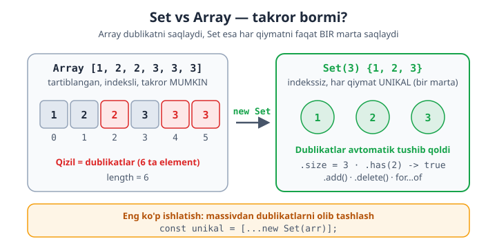
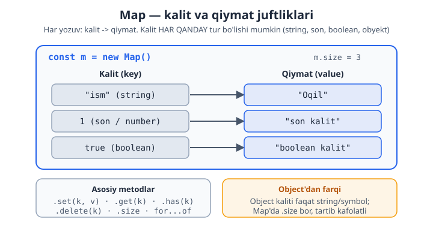
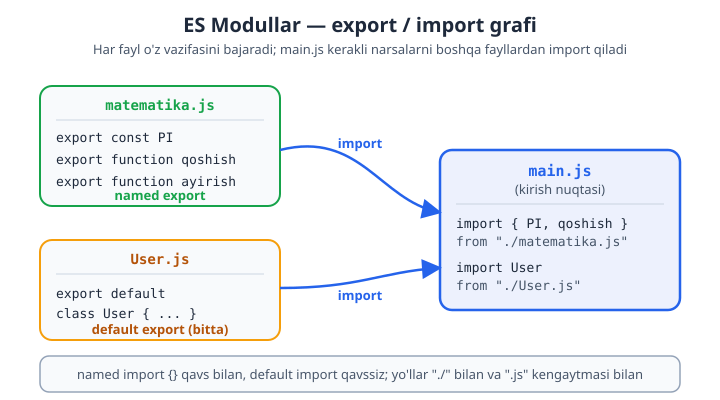
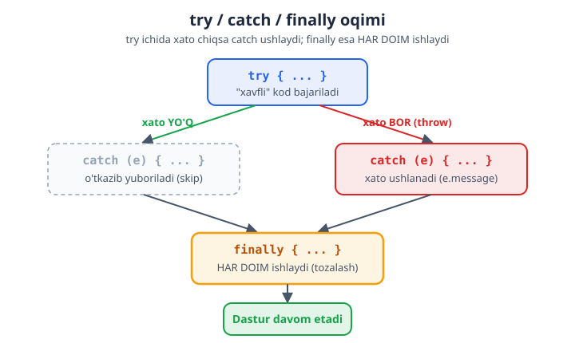

# JavaScript — 0 dan Expertgacha (O'zbek tilida)

📚 [README](./README.md) · [← 5-qism (1-bo'lim)](./javascript-qollanma-5-qism-1.md) · [Keyingi: 6-qism (1-bo'lim) — Expert →](./javascript-qollanma-6-qism-1.md)

> **5-QISM: CHUQUR JS — 2-bo'lim**
> Zamonaviy JS xususiyatlari, modullar, xato boshqaruvi va regex.
> Har bir moduldan keyin **20 ta masala** (yechimi bilan). Bu bo'lim 5-qismni yakunlaydi.

> 1-bo'limda OOP yadrosini (closures, `this`, prototypes, classes) ko'rdik. Endi real loyihaga kerakli zamonaviy vositalar.

---

# 21-MODUL: ES6+ va modullar

## Allaqachon bilganlaring (qisqa takror)

Quyidagilarni oldingi qismlarda ishlatgansan — bular ham ES6+:

```js
let, const                          // 1-modul
`Salom ${ism}`                      // template literal — 1-modul
(a, b) => a + b                     // arrow function — 5-modul
function f(x = 10) {}               // default param — 5-modul
function f(...args) {}              // rest param — 5-modul
const [a, b] = arr;                 // array destructuring — 6-modul
const { x, y } = obj;               // object destructuring — 7-modul
[...arr1, ...arr2]                  // spread — 6/7-modul
obj?.manzil?.shahar                 // optional chaining — 7-modul
```

Endi yangilarini ko'ramiz.

## Nullish coalescing `??` (vs `||`)

`??` — chap tomon `null` yoki `undefined` bo'lsa, o'ng tomonni beradi. `||`dan farqi: `0`, `""`, `false`ni "haqiqiy qiymat" deb hisoblaydi:

```js
const a = 0;

console.log(a || 100); // 100 — chunki 0 falsy
console.log(a ?? 100); // 0   — chunki 0 null/undefined emas!

const ism = "";
console.log(ism || "Mehmon"); // "Mehmon" (bo'sh string falsy)
console.log(ism ?? "Mehmon"); // ""       (bo'sh string mavjud qiymat)
```

> **Why `??`:** `||` har qanday "falsy" qiymatni almashtiradi — bu `0` yoki `""` haqiqiy qiymat bo'lganda muammo (masalan, soni `0` ta mahsulot). `??` faqat `null`/`undefined`ni almashtiradi. Qiymat **yo'qligini** tekshirmoqchi bo'lsang `??`, "falsy"likni tekshirmoqchi bo'lsang `||`.

## Logical assignment (`??=`, `||=`, `&&=`)

```js
let sozlama;
sozlama ??= "default"; // null/undefined bo'lsa tayinlaydi -> "default"

let ism = "";
ism ||= "Mehmon"; // falsy bo'lsa tayinlaydi -> "Mehmon"

let user = { faol: true };
user.faol &&= "ha"; // truthy bo'lsa tayinlaydi -> "ha"
```

## Optional chaining — funksiya va massiv bilan

```js
const obj = {
  salom() { return "Salom"; },
};

console.log(obj.salom?.());   // "Salom" — metod bor, chaqiriladi
console.log(obj.xayr?.());    // undefined — metod yo'q, xato emas

const arr = null;
console.log(arr?.[0]);        // undefined — massiv null, xato emas
```

## `Set` — unikal qiymatlar to'plami

`Set` — takrorlanmaydigan qiymatlar to'plami:

```js
const s = new Set([1, 2, 2, 3, 3, 3]);
console.log(s);      // Set(3) {1, 2, 3} — dublikatlar yo'q

s.add(4);            // qo'shish
console.log(s.has(2));   // true — bormi?
s.delete(1);         // o'chirish
console.log(s.size); // 3 — nechta?

// Bo'ylab aylanish:
for (const el of s) console.log(el);
```

Eng ko'p ishlatiladigan joy — **massivdan dublikatlarni olib tashlash**:

```js
const arr = [1, 1, 2, 3, 3, 4];
const unikal = [...new Set(arr)];
console.log(unikal); // [1, 2, 3, 4]
```



## `Map` — kalit-qiymat to'plami (har qanday kalit)

`Map` — obyektga o'xshash, lekin kalit **har qanday tur** bo'lishi mumkin (obyekt, funksiya, son):

```js
const m = new Map();
m.set("ism", "Oqil");
m.set(1, "son kalit");
m.set(true, "boolean kalit");

console.log(m.get("ism")); // "Oqil"
console.log(m.has(1));     // true
m.delete(true);
console.log(m.size);       // 2

// Bo'ylab aylanish:
for (const [kalit, qiymat] of m) {
  console.log(kalit, qiymat);
}
```

> **Why `Map` vs Object:** (1) Kalit har qanday tur bo'lishi mumkin (Object'da faqat string/symbol). (2) `.size` bor (Object'da `Object.keys().length` kerak). (3) Qo'shilish tartibi kafolatlangan. (4) Prototype kalitlari aralashmaydi. Tez-tez qo'shilib-o'chiriladigan, kalitlari noma'lum bo'lgan ma'lumot uchun `Map` ishlat; sobit strukturali yozuv uchun Object.



## ⭐ ES Modullar — `import` / `export`

Real loyihada kod **bir nechta faylga** bo'linadi. Modullar — bir fayldagi funksiya/o'zgaruvchini boshqa faylda ishlatish imkonini beradi.

### Named export / import

```js
// 📄 matematika.js
export const PI = 3.14159;
export function qoshish(a, b) { return a + b; }
export function ayirish(a, b) { return a - b; }
```
```js
// 📄 main.js
import { PI, qoshish, ayirish } from "./matematika.js";

console.log(qoshish(2, 3)); // 5
console.log(PI);            // 3.14159

// Nom o'zgartirish:
import { qoshish as plus } from "./matematika.js";

// Hammasini namespace sifatida:
import * as mat from "./matematika.js";
console.log(mat.qoshish(1, 2)); // 3
```

### Default export / import

Bir faylda **bitta** default export bo'ladi (asosiy narsa):

```js
// 📄 User.js
export default class User {
  constructor(ism) { this.ism = ism; }
}
```
```js
// 📄 main.js
import User from "./User.js"; // qavssiz, istalgan nom bilan
const u = new User("Oqil");
```

### Ikkalasini birga

```js
// 📄 api.js
export default function fetchData() {}
export const BASE_URL = "https://api.uz";
```
```js
// 📄 main.js
import fetchData, { BASE_URL } from "./api.js";
```

### Brauzerda ishlatish

```html
<script type="module" src="main.js"></script>
```

> **Why modullar:** (1) Kod tartibli — har fayl o'z vazifasini bajaradi (single responsibility). (2) Faqat kerakli narsani import qilasan. (3) Vue/Nuxt, React — hammasi modullar ustiga qurilgan. **Eslatma:** brauzerda `type="module"` kerak, yo'llar `./` bilan va `.js` kengaytmasi bilan yoziladi; Node'da `package.json`da `"type": "module"`. Bundler (Vite) bu tafsilotlarni o'zi hal qiladi.



---

## 📝 21-modul masalalari (20 ta)

1. `0 || 5` va `0 ?? 5` natijalarini taqqoslang.
2. `""  || "X"` va `"" ?? "X"` natijalarini taqqoslang.
3. `??=` bilan `undefined` o'zgaruvchiga default tayinlang.
4. `||=` bilan bo'sh stringga qiymat tayinlang.
5. `obj.metod?.()` — metod bor va yo'q holatlarni sinab ko'ring.
6. `arr?.[0]` — massiv `null` bo'lganda xato bermasligini ko'rsating.
7. `new Set([1,1,2,3,3])` yaratib, natijasini chiqaring.
8. Massiv `[5,5,1,2,2,8]` dan dublikatlarni `Set` bilan olib tashlang.
9. Set: `add`, `has`, `delete`, `size` ni ishlating.
10. Set bo'ylab `for...of` bilan aylaning.
11. `Map` yaratib, `set`/`get` qiling.
12. Map'ga son va boolean kalit qo'shing (har qanday tur).
13. Map: `has`, `delete`, `size` ni ishlating.
14. Map bo'ylab `[kalit, qiymat]` bilan aylaning.
15. `Map` va `Object` farqini bitta misolda ko'rsating.
16. **Modul:** `matematika.js` yozing — `qoshish`, `PI` ni export qiling (named).
17. **Modul:** uni `main.js`da import qilib ishlating.
18. **Modul:** default export'li `User` class yozing va import qiling.
19. **Modul:** `import * as` bilan namespace import yozing.
20. **Murakkab:** kichik loyiha — `utils.js` (bir nechta export), `main.js` (default + named import birga). To'liq strukturani yozing.

<details markdown="1">
<summary>► Yechimlar</summary>

```js
// 1 -> 5 va 0
console.log(0 || 5); // 5
console.log(0 ?? 5); // 0

// 2 -> "X" va ""
console.log("" || "X"); // "X"
console.log("" ?? "X"); // ""

// 3
let s3;
s3 ??= "default";
console.log(s3); // "default"

// 4
let ism4 = "";
ism4 ||= "Mehmon";
console.log(ism4); // "Mehmon"

// 5
const o5 = { salom() { return "Salom"; } };
console.log(o5.salom?.()); // "Salom"
console.log(o5.xayr?.());  // undefined

// 6
const a6 = null;
console.log(a6?.[0]); // undefined

// 7
console.log(new Set([1, 1, 2, 3, 3])); // Set(3) {1,2,3}

// 8
console.log([...new Set([5, 5, 1, 2, 2, 8])]); // [5,1,2,8]

// 9
const s9 = new Set();
s9.add("a"); s9.add("b");
console.log(s9.has("a")); // true
s9.delete("a");
console.log(s9.size);     // 1

// 10
for (const el of new Set([1, 2, 3])) console.log(el);

// 11
const m11 = new Map();
m11.set("ism", "Oqil");
console.log(m11.get("ism")); // "Oqil"

// 12
const m12 = new Map();
m12.set(1, "son"); m12.set(true, "bool");
console.log(m12.get(1), m12.get(true)); // "son" "bool"

// 13
const m13 = new Map([["a", 1], ["b", 2]]);
console.log(m13.has("a")); // true
m13.delete("a");
console.log(m13.size);     // 1

// 14
const m14 = new Map([["x", 10], ["y", 20]]);
for (const [k, v] of m14) console.log(`${k}=${v}`);

// 15
const obj = {}; obj[1] = "a"; obj["1"] = "b"; // son kalit string'ga aylanadi -> bitta kalit
console.log(Object.keys(obj).length); // 1
const map = new Map(); map.set(1, "a"); map.set("1", "b"); // ikki xil kalit
console.log(map.size); // 2

// 16, 17 — named export/import
// 📄 matematika.js
//   export const PI = 3.14159;
//   export function qoshish(a, b) { return a + b; }
// 📄 main.js
//   import { PI, qoshish } from "./matematika.js";
//   console.log(qoshish(2, 3)); // 5

// 18 — default export/import
// 📄 User.js
//   export default class User { constructor(ism){ this.ism = ism; } }
// 📄 main.js
//   import User from "./User.js";
//   const u = new User("Oqil");

// 19 — namespace
// import * as mat from "./matematika.js";
// console.log(mat.qoshish(1, 2)); // 3

// 20 — kichik loyiha
// 📄 utils.js
//   export const APP = "EduCore";
//   export function formatla(son) { return son.toLocaleString(); }
//   export default function log(x) { console.log("[LOG]", x); }
// 📄 main.js
//   import log, { APP, formatla } from "./utils.js";
//   log(APP);              // [LOG] EduCore
//   console.log(formatla(1000000)); // "1,000,000"
```
</details>

---

# 22-MODUL: Error handling (xato boshqaruvi)

Yaxshi dastur — xato chiqqanda **qulamaydigan** dastur. Xatolarni to'g'ri ushlash va boshqarish — professional kodning belgisi.

## `try` / `catch` / `finally`

```js
try {
  // xato chiqishi mumkin bo'lgan kod
  const data = JSON.parse("noto'g'ri json");
} catch (xato) {
  // xato bo'lsa shu ishlaydi
  console.log("Xato yuz berdi:", xato.message);
} finally {
  // har holda ishlaydi (xato bo'lsa ham, bo'lmasa ham)
  console.log("Tugadi");
}
```

- **`try`** — "xavfli" kod.
- **`catch`** — xato bo'lsa ushlaydi (xato obyektini beradi).
- **`finally`** — natijadan qat'i nazar (tozalash uchun: faylni yopish, loading'ni o'chirish).



## `throw` — xato tashlash

Biror narsa noto'g'ri bo'lsa, o'zing xato "tashlashing" mumkin:

```js
function yoshTekshir(yosh) {
  if (yosh < 0) {
    throw new Error("Yosh manfiy bo'lishi mumkin emas");
  }
  return yosh;
}

try {
  yoshTekshir(-5);
} catch (e) {
  console.log(e.message); // "Yosh manfiy bo'lishi mumkin emas"
}
```

> **Why `Error` obyekti, string emas:** `throw "xato"` deb **string tashlama** — `throw new Error("xato")` deb tashla. Sababi: `Error` obyektida `.message`, `.name`, va `.stack` (xato qayerda bo'lganini ko'rsatadigan iz) bo'ladi. String'da bu yo'q — debug qiyinlashadi.

## Error obyektining xususiyatlari

```js
try {
  throw new Error("Nimadir buzildi");
} catch (e) {
  console.log(e.name);    // "Error"
  console.log(e.message); // "Nimadir buzildi"
  console.log(e.stack);   // xato izi (qayerda, qaysi qatorda)
}
```

## Built-in xato turlari

JS'da tayyor xato turlari bor:

```js
// TypeError — noto'g'ri turdagi amal:
null.foo;        // TypeError: Cannot read properties of null

// ReferenceError — mavjud bo'lmagan o'zgaruvchi:
console.log(yoq); // ReferenceError: yoq is not defined

// RangeError — ruxsat etilgan diapazondan tashqari:
new Array(-1);   // RangeError

// SyntaxError — noto'g'ri sintaksis:
JSON.parse("{xato}"); // SyntaxError
```

## Custom error class'lar

O'z xato turlaringni yaratish (20-moduldagi class + `extends`):

```js
class ValidationError extends Error {
  constructor(message, maydon) {
    super(message);
    this.name = "ValidationError";
    this.maydon = maydon; // qo'shimcha ma'lumot
  }
}

try {
  throw new ValidationError("Email noto'g'ri", "email");
} catch (e) {
  console.log(e.name);   // "ValidationError"
  console.log(e.maydon); // "email"
}
```

> **Why custom error:** Turli xil xatolarni **farqlash** uchun. `catch`da `if (e instanceof ValidationError)` deb tekshirib, har xil xatoni har xil boshqarasan. (Laravel'dagi custom Exception class'lar bilan bir xil g'oya — sen buni bilasan.)

## Aniq xatoni ushlash va qayta tashlash

```js
try {
  // ...
} catch (e) {
  if (e instanceof ValidationError) {
    console.log("Validatsiya xatosi:", e.message);
  } else {
    throw e; // noma'lum xatoni qayta tashlaymiz (yashirib qo'ymaymiz)
  }
}
```

> **Why qayta tashlash:** Faqat **boshqara oladigan** xatolarni ushla. Noma'lum xatolarni `catch`da yutib yuborma (`catch {}` bo'sh qoldirma) — ularni qayta tashla yoki log qil. Yashirilgan xato — eng yomon bug.

## Async/await'da xato (4-qismdan davom)

```js
async function malumotOl() {
  try {
    const res = await fetch("https://api.uz/data");
    if (!res.ok) throw new Error(`Server xatosi: ${res.status}`);
    return await res.json();
  } catch (e) {
    console.log("Xato:", e.message);
    return null; // yoki xatoni qayta tashlash
  }
}
```

---

## 📝 22-modul masalalari (20 ta)

1. `try/catch` bilan `JSON.parse("xato")` xatosini ushlang.
2. Ushlangan xatoning `.message`ini chiqaring.
3. `throw new Error(...)` bilan xato tashlang.
4. Funksiya ichida xato tashlab, tashqarida ushlang.
5. `finally` har holda ishlashini ko'rsating (xato bor va yo'q holatda).
6. Xatoning `.name` va `.message`ini ajratib chiqaring.
7. `TypeError`ni ataylab keltirib chiqaring (`null.foo`).
8. `yoshTekshir(yosh)` — manfiy bo'lsa xato tashlasin.
9. Validatsiya funksiyasi: bo'sh string bo'lsa xato tashlasin.
10. **Why:** string tashlash vs `Error` tashlash farqini ko'rsating.
11. Custom `ValidationError` class yozing (`extends Error`).
12. Custom error tashlab, `instanceof` bilan tekshiring.
13. Custom error'ga qo'shimcha xususiyat (`maydon`) qo'shing.
14. Noma'lum xatoni `catch`da qayta tashlang (`throw e`).
15. Ikki xil xatoni (`ValidationError` va boshqa) har xil boshqaring.
16. `async` funksiyada `try/catch` bilan xato ushlang.
17. Custom error'ga `statusCode` qo'shing (HTTP uchun).
18. Ichma-ich `try/catch` yozing.
19. "Xavfsiz" funksiya: `[xato, natija]` ko'rinishida qaytarsin (Go uslubi).
20. **Murakkab:** Validatsiya tizimi — `ValidationError` (maydon bilan); user obyektini tekshiruvchi funksiya (ism, email, yosh); xatolarni ushlab, qaysi maydonda ekanini ko'rsating.

<details markdown="1">
<summary>► Yechimlar</summary>

```js
// 1, 2
try { JSON.parse("xato"); }
catch (e) { console.log(e.message); } // "Unexpected token..."

// 3
try { throw new Error("Buzildi"); }
catch (e) { console.log(e.message); }

// 4
function f4() { throw new Error("Funksiya xatosi"); }
try { f4(); } catch (e) { console.log(e.message); }

// 5
function test5(xatomi) {
  try { if (xatomi) throw new Error("X"); console.log("ok"); }
  catch (e) { console.log("catch"); }
  finally { console.log("finally"); }
}
test5(false); // ok, finally
test5(true);  // catch, finally

// 6
try { throw new Error("Xabar"); }
catch (e) { console.log(e.name, "-", e.message); } // "Error - Xabar"

// 7
try { null.foo; } catch (e) { console.log(e.name); } // "TypeError"

// 8
function yoshTekshir(y) {
  if (y < 0) throw new Error("Yosh manfiy bo'lmasin");
  return y;
}
try { yoshTekshir(-5); } catch (e) { console.log(e.message); }

// 9
function ismTekshir(ism) {
  if (ism.trim() === "") throw new Error("Ism bo'sh bo'lmasin");
  return ism;
}

// 10
// throw "xato" -> e string bo'ladi, .message/.stack yo'q
// throw new Error("xato") -> e obyekt, .message va .stack bor (debug oson)

// 11, 12, 13
class ValidationError extends Error {
  constructor(message, maydon) {
    super(message);
    this.name = "ValidationError";
    this.maydon = maydon;
  }
}
try { throw new ValidationError("Email xato", "email"); }
catch (e) {
  console.log(e instanceof ValidationError); // true
  console.log(e.maydon); // "email"
}

// 14
function f14() {
  try { throw new TypeError("Tur xatosi"); }
  catch (e) {
    if (e instanceof ValidationError) console.log("validatsiya");
    else throw e; // qayta tashlanadi
  }
}
try { f14(); } catch (e) { console.log("Tashqarida:", e.name); } // "TypeError"

// 15
function boshqar(e) {
  if (e instanceof ValidationError) console.log("Validatsiya:", e.message);
  else console.log("Boshqa xato:", e.message);
}

// 16
async function f16() {
  try { await Promise.reject(new Error("Async xato")); }
  catch (e) { console.log(e.message); }
}
f16();

// 17
class ApiError extends Error {
  constructor(message, statusCode) {
    super(message);
    this.name = "ApiError";
    this.statusCode = statusCode;
  }
}
try { throw new ApiError("Topilmadi", 404); }
catch (e) { console.log(e.statusCode); } // 404

// 18
try {
  try { throw new Error("ichki"); }
  catch (e) { throw new Error("tashqi: " + e.message); }
} catch (e) { console.log(e.message); } // "tashqi: ichki"

// 19 — Go uslubi
function xavfsiz(fn) {
  try { return [null, fn()]; }
  catch (e) { return [e, null]; }
}
const [xato, natija] = xavfsiz(() => JSON.parse("{}"));
console.log(xato, natija); // null {}

// 20 — Validatsiya tizimi
class ValError extends Error {
  constructor(msg, maydon) { super(msg); this.name = "ValError"; this.maydon = maydon; }
}
function userTekshir(user) {
  if (!user.ism || user.ism.length < 3) throw new ValError("Ism ≥ 3", "ism");
  if (!/^[^\s@]+@[^\s@]+\.[^\s@]+$/.test(user.email)) throw new ValError("Email xato", "email");
  if (user.yosh < 0 || user.yosh > 150) throw new ValError("Yosh noto'g'ri", "yosh");
  return true;
}
try {
  userTekshir({ ism: "Oqil", email: "xato", yosh: 25 });
} catch (e) {
  console.log(`Xato (${e.maydon}): ${e.message}`); // "Xato (email): Email xato"
}
```
</details>

---

# 23-MODUL: Regular expressions (Regex)

Regex — **matn naqshlari** bilan ishlash vositasi: tekshirish (validatsiya), qidirish, almashtirish. Boshida qo'rqinchli ko'rinadi, lekin asoslarini bilsang juda kuchli.

## Regex yaratish va `test`

```js
const naqsh = /salom/;        // literal (eng ko'p)
const naqsh2 = new RegExp("salom"); // konstruktor (dinamik holatda)

console.log(naqsh.test("salom dunyo")); // true — matnda bormi?
console.log(naqsh.test("xayr"));        // false
```

## Bayroqlar (flags)

```js
/salom/g  // global — barcha mosliklarni topadi (faqat birinchi emas)
/salom/i  // insensitive — katta-kichik harfni farqlamaydi
/salom/m  // multiline — ko'p qatorli matn uchun

const re = /a/gi;
console.log("Apple aA".match(re)); // ["A", "a", "A"]
```

## Maxsus belgilar (character classes)

```js
\d   // har qanday raqam (0-9)
\w   // harf, raqam yoki _ (so'z belgisi)
\s   // bo'sh joy (probel, tab, yangi qator)
.    // har qanday belgi (yangi qatordan tashqari)

\D \W \S  // teskarisi (raqam EMAS, so'z belgisi EMAS, probel EMAS)
```

```js
console.log(/\d/.test("abc5"));   // true — raqam bormi?
console.log("a1b2c3".match(/\d/g)); // ["1","2","3"]
```

## Anchorlar (boshi/oxiri)

```js
^   // matn boshi
$   // matn oxiri

console.log(/^salom/.test("salom dunyo")); // true — "salom" bilan boshlanadimi?
console.log(/dunyo$/.test("salom dunyo")); // true — "dunyo" bilan tugaydimi?
console.log(/^abc$/.test("abc"));          // true — to'liq "abc" mi?
```

## Miqdorlar (quantifiers)

```js
*       // 0 yoki ko'p marta
+       // 1 yoki ko'p marta
?       // 0 yoki 1 marta (ixtiyoriy)
{n}     // aniq n marta
{n,m}   // n dan m gacha
{n,}    // kamida n marta
```

```js
console.log(/\d+/.test("abc"));     // false — kamida 1 raqam yo'q
console.log(/^\d{4}$/.test("2024")); // true — aniq 4 ta raqam
console.log("aaa".match(/a+/));      // ["aaa"]
```

## To'plamlar va guruhlar

```js
[abc]    // a, b yoki c
[a-z]    // a dan z gacha
[0-9]    // raqam (= \d)
[^abc]   // a, b, c EMAS
(...)    // guruh (ushlab oladi)
a|b      // a YOKI b
```

```js
console.log(/[aeiou]/.test("xyz"));  // false — unli yo'q
console.log(/^(ha|yoq)$/.test("ha")); // true
```

## `match`, `replace`, `matchAll`

```js
// match — mosliklarni topadi:
console.log("Narx: 100, 200, 300".match(/\d+/g)); // ["100","200","300"]

// replace — almashtiradi:
console.log("salom dunyo".replace(/dunyo/, "JS")); // "salom JS"
console.log("a-b-c".replace(/-/g, "+"));           // "a+b+c"

// Guruh bilan almashtirish ($1):
console.log("2024-01-15".replace(/(\d{4})-(\d{2})-(\d{2})/, "$3/$2/$1"));
// "15/01/2024" — kun/oy/yil
```

## Amaliy naqshlar

```js
// Email:
const email = /^[^\s@]+@[^\s@]+\.[^\s@]+$/;
console.log(email.test("oqil@mail.uz")); // true

// O'zbek telefon (+998 va 9 ta raqam):
const tel = /^\+998\d{9}$/;
console.log(tel.test("+998901234567")); // true

// Faqat raqamlar:
const faqatSon = /^\d+$/;
console.log(faqatSon.test("12345")); // true

// Matndan barcha sonlarni ajratish:
console.log("3 ta olma, 5 ta uzum".match(/\d+/g)); // ["3","5"]
```

> **Why regex (va ehtiyotkorlik):** Regex — validatsiya, qidirish, ma'lumot ajratishda tengsiz. Lekin (1) murakkab regex'ni o'qish qiyin — izoh yoz; (2) email kabi narsalar uchun haddan tashqari murakkab regex yozma — oddiy `/^[^\s@]+@[^\s@]+\.[^\s@]+$/` 99% holatda yetarli; (3) noma'lum regex'ni regex101.com'da sinab ko'r.

---

## 📝 23-modul masalalari (20 ta)

1. `/salom/` regex yaratib, `test` bilan matnda borligini tekshiring.
2. `i` bayrog'i bilan katta-kichik harfsiz qidiring.
3. `\d` bilan matnda raqam borligini tekshiring.
4. `g` bayrog'i bilan barcha raqamlarni `match` qiling.
5. `\w` va `\s` ni ishlatib ko'ring.
6. `^` va `$` bilan boshlanish/tugashni tekshiring.
7. `+` bilan "kamida bitta raqam" ni tekshiring.
8. `{4}` bilan aniq 4 ta raqamni tekshiring (yil).
9. `{2,4}` bilan 2-4 ta belgini tekshiring.
10. `?` bilan ixtiyoriy belgini tekshiring (`colou?r`).
11. `[aeiou]` bilan unli harf borligini tekshiring.
12. `[^0-9]` bilan raqam bo'lmagan belgi borligini tekshiring.
13. `(ha|yoq)` guruh va alternatsiya bilan tekshiring.
14. `replace` bilan barcha `-` larni `/` ga almashtiring.
15. Guruh `$1` bilan sanani `yyyy-mm-dd` dan `dd/mm/yyyy` ga aylantiring.
16. Matndan barcha sonlarni ajratib oling (`"5 olma, 3 nok"`).
17. Email'ni regex bilan tekshiring.
18. O'zbek telefon raqamini (`+998XXXXXXXXX`) tekshiring.
19. `split` ni regex bilan: bir nechta ajratuvchi (`,` `;` probel) bo'yicha bo'ling.
20. **Murakkab:** parol kuchini tekshiring — kamida 8 belgi, **kamida** 1 katta harf, 1 kichik harf, 1 raqam (har birini alohida regex bilan).

<details markdown="1">
<summary>► Yechimlar</summary>

```js
// 1
console.log(/salom/.test("salom dunyo")); // true

// 2
console.log(/salom/i.test("SALOM")); // true

// 3
console.log(/\d/.test("abc5")); // true

// 4
console.log("a1b2c3".match(/\d/g)); // ["1","2","3"]

// 5
console.log(/\w/.test("_")); // true
console.log(/\s/.test("a b")); // true

// 6
console.log(/^salom/.test("salom dunyo")); // true
console.log(/dunyo$/.test("salom dunyo")); // true

// 7
console.log(/\d+/.test("abc"));   // false
console.log(/\d+/.test("abc1"));  // true

// 8
console.log(/^\d{4}$/.test("2024")); // true
console.log(/^\d{4}$/.test("202"));  // false

// 9
console.log(/^\w{2,4}$/.test("abc")); // true

// 10
console.log(/colou?r/.test("color"));  // true
console.log(/colou?r/.test("colour")); // true

// 11
console.log(/[aeiou]/.test("xyz")); // false
console.log(/[aeiou]/.test("xay")); // true

// 12
console.log(/[^0-9]/.test("12a34")); // true (a raqam emas)

// 13
console.log(/^(ha|yoq)$/.test("ha"));  // true
console.log(/^(ha|yoq)$/.test("balki")); // false

// 14
console.log("2024-01-15".replace(/-/g, "/")); // "2024/01/15"

// 15
console.log("2024-01-15".replace(/(\d{4})-(\d{2})-(\d{2})/, "$3/$2/$1"));
// "15/01/2024"

// 16
console.log("5 olma, 3 nok".match(/\d+/g)); // ["5","3"]

// 17
console.log(/^[^\s@]+@[^\s@]+\.[^\s@]+$/.test("oqil@mail.uz")); // true

// 18
console.log(/^\+998\d{9}$/.test("+998901234567")); // true
console.log(/^\+998\d{9}$/.test("901234567"));     // false

// 19
console.log("a, b; c  d".split(/[,;\s]+/)); // ["a","b","c","d"]

// 20 — parol kuchi
function parolKuchi(parol) {
  const xatolar = [];
  if (parol.length < 8) xatolar.push("kamida 8 belgi");
  if (!/[A-Z]/.test(parol)) xatolar.push("katta harf kerak");
  if (!/[a-z]/.test(parol)) xatolar.push("kichik harf kerak");
  if (!/\d/.test(parol)) xatolar.push("raqam kerak");
  return xatolar.length === 0 ? "Kuchli" : xatolar;
}
console.log(parolKuchi("abc"));      // ["kamida 8 belgi","katta harf kerak","raqam kerak"]
console.log(parolKuchi("Abc12345")); // "Kuchli"
```
</details>

---

## ✅ 5-qism to'liq yakuni (1 + 2 bo'lim)

5-qismni tugatding — endi JS'ni **chuqur** bilasan:

**1-bo'lim (OOP yadrosi):** Scope · Closures · Hoisting · `this` · Prototypes · Classes
**2-bo'lim (zamonaviy vositalar):** ES6+ (`??`, Set, Map) · Modullar (`import`/`export`) · Error handling (custom errors) · Regex

Bu darajada sen:
- Closure va `this`ni tushunasan (junior'ni middle'dan ajratadigan bilim)
- Class hierarchy va polimorfizm yozasan
- Kodni modullarga bo'lasan (real loyiha strukturasi)
- Xatolarni professional boshqarasan
- Regex bilan validatsiya/qidirish qilasan

### Keyingi qadam (6-qism) — EXPERT
Oxirgi qism. Bu yerda "yaxshi dasturchi"ni "expert"dan ajratadigan mavzular:
- **Functional Programming** — pure functions, immutability, composition, currying
- **Iterators & Generators** — `function*`, `yield`, lazy evaluation; Symbols
- **Proxy & Reflect** — obyekt xatti-harakatini ushlab qolish (Vue 3 reaktivligi shu ustiga qurilgan!)
- **Performance & Memory** — debounce/throttle, memoization, memory leaks
- **Design Patterns** — Singleton, Factory, Observer, Module (real arxitektura)
- **Bundlers & Build Tools** — Vite, npm, tree-shaking (konseptual)
- **TypeScript'ga ko'prik** — JS'dan keyingi tabiiy qadam

> **Maslahat:** 6-qismga o'tishdan oldin 22-modul #20 (validatsiya tizimi) va 23-modul #20 (parol kuchi)ni birlashtirib, to'liq forma validatsiya moduli yoz — custom error + regex + class birga. Bu — real loyihada ishlatadigan kod.

---

📚 [README](./README.md) · [← 5-qism (1-bo'lim)](./javascript-qollanma-5-qism-1.md) · [Keyingi: 6-qism (1-bo'lim) — Expert →](./javascript-qollanma-6-qism-1.md)
