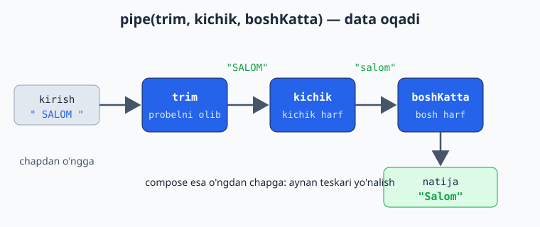
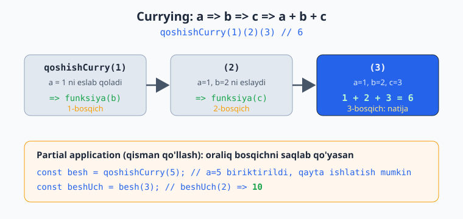
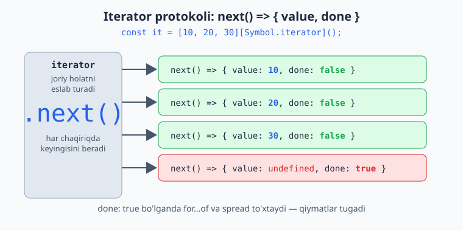
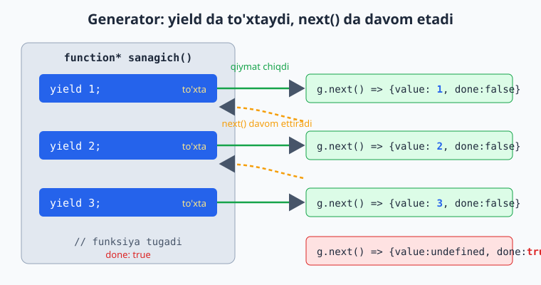
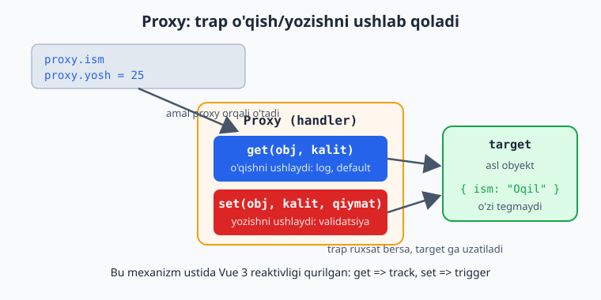

# JavaScript — 0 dan Expertgacha (O'zbek tilida)

📚 [README](./README.md) · [← 5-qism (2-bo'lim)](./javascript-qollanma-5-qism-2.md) · [Keyingi: 6-qism (2-bo'lim) — Yakun →](./javascript-qollanma-6-qism-2.md)

> **6-QISM: EXPERT — 1-bo'lim**
> "Yaxshi dasturchi"ni "expert"dan ajratadigan mavzular: FP, generatorlar, Proxy, performance.
> Har bir moduldan keyin **20 ta masala** (yechimi bilan). Bu — oxirgi qism.

> 6-qism eng katta (7 modul), ikkiga bo'lindi:
> **1-bo'lim** (shu fayl): 24-FP · 25-Generators/Iterators/Symbols · 26-Proxy/Reflect · 27-Performance/Memory
> **2-bo'lim** (keyingi): 28-Design Patterns · 29-Bundlers · 30-TypeScript ko'prigi

---

# 24-MODUL: Functional Programming (FP)

FP — kodni **sof funksiyalar** va **o'zgarmas ma'lumot** orqali qurish uslubi. Bashorat qilinadigan, test qilish oson, kam bug'li kod beradi. (Sening DDD/SOLID foning bilan yaxshi qovushadi.)

## Pure functions (sof funksiyalar) — chuqurroq

Sof funksiya: (1) bir xil kirishga **doim bir xil chiqish**; (2) **side-effect yo'q** (tashqi narsani o'zgartirmaydi).

```js
// ✅ Pure: faqat kirishga bog'liq, tashqarini buzmaydi
const qoshish = (a, b) => a + b;

// ❌ Impure: tashqi o'zgaruvchini o'zgartiradi
let jami = 0;
const qoshImpure = (n) => { jami += n; };

// ❌ Impure: tashqi holatga bog'liq (har safar boshqa natija)
const tasodif = () => Math.random();
```

> **Why pure:** Sof funksiyani test qilish oson (mock kerak emas), qayta ishlatsa bo'ladi, parallel ishlatsa xavfsiz, va keshlash mumkin (memoize). Loyihaning **yadrosini** sof funksiyalardan qur; side-effect'larni (DOM, network, log) chetga sur.

## Immutability (o'zgarmaslik)

Ma'lumotni **o'zgartirma** — o'zgartirilgan **yangi nusxa** qaytar (2-qismdagi spread'ni esla):

```js
const arr = [1, 2, 3];

// ❌ Mutatsiya:
arr.push(4); // asilni buzadi

// ✅ Immutable:
const yangi = [...arr, 4];        // qo'shish
const ochirilgan = arr.filter(x => x !== 2); // o'chirish
const yangilangan = arr.map(x => x === 2 ? 20 : x); // o'zgartirish

const user = { ism: "Oqil", yosh: 25 };
const yangiUser = { ...user, yosh: 26 }; // user buzilmaydi
```

> **Why immutable:** Mutatsiya — kutilmagan bug'lar manbai (boshqa joy o'sha obyektga havola qilgan bo'lishi mumkin). React/Vue state'i aynan shu prinsipga tayanadi: yangi nusxa → o'zgarish aniqlanadi → qayta render. `push`/`splice`/`sort` o'rniga `map`/`filter`/`[...]` ishlat.

## Function Composition (funksiyalarni birlashtirish)

Kichik funksiyalardan kattalarini yig'ish. `pipe` — chapdan o'ngga, `compose` — o'ngdan chapga:

```js
const pipe = (...fns) => (x) => fns.reduce((acc, fn) => fn(acc), x);
const compose = (...fns) => (x) => fns.reduceRight((acc, fn) => fn(acc), x);

const trim = s => s.trim();
const kichik = s => s.toLowerCase();
const boshKatta = s => s[0].toUpperCase() + s.slice(1);

const formatla = pipe(trim, kichik, boshKatta);
console.log(formatla("  SALOM  ")); // "Salom"
// trim -> "SALOM" -> kichik -> "salom" -> boshKatta -> "Salom"
```



> **Why composition:** Murakkab amalni kichik, sinaladigan bo'laklarga bo'lasan, keyin ularni "quvur" qilib ulaysan. Har bo'lak bitta ishni qiladi (single responsibility). Bu — FP'ning yuragi.

## Currying (karrilash)

Ko'p argumentli funksiyani **bittadan argument oluvchi** funksiyalar zanjiriga aylantirish (17-moduldagi closure/factory'ni esla):

```js
// Oddiy:
const qoshish = (a, b, c) => a + b + c;

// Curried:
const qoshishCurry = a => b => c => a + b + c;
console.log(qoshishCurry(1)(2)(3)); // 6

// Foydasi — partial application (qisman qo'llash):
const besh = qoshishCurry(5);
const beshUch = besh(3);
console.log(beshUch(2)); // 10
```



Amaliy misol:
```js
const kopaytir = a => b => a * b;
const ikkilantir = kopaytir(2);
const unlantir = kopaytir(10);

console.log([1, 2, 3].map(ikkilantir)); // [2, 4, 6]
console.log([1, 2, 3].map(unlantir));   // [10, 20, 30]
```

> **Why currying:** Konfiguratsiyani "oldindan biriktirish" imkonini beradi. `kopaytir(2)` — qayta ishlatiladigan "ikkilantiruvchi" funksiya. Mapping/filtering'da juda qulay.

## Declarative vs Imperative

```js
const sonlar = [1, 2, 3, 4, 5, 6];

// ❌ Imperative (QANDAY qilishni aytasan):
let natija = [];
for (let i = 0; i < sonlar.length; i++) {
  if (sonlar[i] % 2 === 0) natija.push(sonlar[i] * 2);
}

// ✅ Declarative (NIMA kerakligini aytasan):
const natija2 = sonlar.filter(n => n % 2 === 0).map(n => n * 2);
```

> **Why declarative:** Niyatni ifodalaydi — "juftlarni olib, ikkilantir". Sikldagi indeks/holat boshqaruvi yo'q, shuning uchun xato kam, o'qish oson.

---

## 📝 24-modul masalalari (20 ta)

1. Sof funksiya yozing (deterministic, side-effect'siz).
2. Impure funksiyani pure qiling (tashqi o'zgaruvchiga tegmasin).
3. Immutable: massivga element qo'shing (`push` emas, spread).
4. Immutable: obyekt xususiyatini yangilang (spread).
5. Immutable: massivdan element o'chiring (`filter`, `splice` emas).
6. `map`/`filter`/`reduce` bilan declarative kod yozing (sikl o'rniga).
7. Ikki funksiyani birlashtiruvchi oddiy `compose` yozing.
8. `compose(...fns)` ni `reduceRight` bilan yozing (ko'p funksiya).
9. `pipe(...fns)` ni `reduce` bilan yozing.
10. `pipe` bilan string'ni quvurdan o'tkazing (trim→kichik→bosh-katta).
11. Currying: `qoshish(a)(b)(c)` yozing.
12. Curried funksiyadan partial application qiling (`besh = qoshish(5)`).
13. `kopaytir(a)(b)` curried funksiya + `ikkilantir = kopaytir(2)`.
14. Higher-order: funksiya qaytaruvchi funksiya yozing.
15. `reduce` bilan `map`ni qayta yozing (reduce universalligi).
16. `reduce` bilan `filter`ni qayta yozing.
17. Composition bilan sonni transformatsiya qiling (`+1` → `*2` → `kvadrat`).
18. Immutable ichma-ich (nested) yangilash (spread ichma-ich).
19. Funksiyalar zanjiri: `kopaytiruvchi(n)` factory bilan turli ko'paytiruvchilar.
20. **Murakkab:** `pipe` bilan ma'lumot pipeline — mahsulotlar massivi → narxi 100+ filterlash → 10% chegirma map → jami `reduce`. Hammasini sof funksiyalardan yig'ing.

<details markdown="1">
<summary>► Yechimlar</summary>

```js
// 1
const qoshish = (a, b) => a + b;

// 2
// Impure: let total=0; const add=n=>total+=n;
// Pure:
const add = (total, n) => total + n; // holatni qaytaradi, o'zgartirmaydi

// 3
const arr = [1, 2, 3];
console.log([...arr, 4]); // [1,2,3,4], arr buzilmadi

// 4
const user = { ism: "Oqil", yosh: 25 };
console.log({ ...user, yosh: 26 }); // user buzilmadi

// 5
console.log([1, 2, 3].filter(x => x !== 2)); // [1,3]

// 6
console.log([1, 2, 3, 4].filter(n => n % 2 === 0).map(n => n * 2)); // [4,8]

// 7
const compose2 = (f, g) => x => f(g(x));
const inc = x => x + 1, dbl = x => x * 2;
console.log(compose2(inc, dbl)(5)); // 11 (5*2+1)

// 8
const compose = (...fns) => x => fns.reduceRight((acc, fn) => fn(acc), x);
console.log(compose(inc, dbl)(5)); // 11

// 9
const pipe = (...fns) => x => fns.reduce((acc, fn) => fn(acc), x);
console.log(pipe(inc, dbl)(5)); // 12 ((5+1)*2)

// 10
const trim = s => s.trim();
const kichik = s => s.toLowerCase();
const boshKatta = s => s[0].toUpperCase() + s.slice(1);
console.log(pipe(trim, kichik, boshKatta)("  SALOM  ")); // "Salom"

// 11
const qoshish3 = a => b => c => a + b + c;
console.log(qoshish3(1)(2)(3)); // 6

// 12
const besh = qoshish3(5);
console.log(besh(3)(2)); // 10

// 13
const kopaytir = a => b => a * b;
const ikkilantir = kopaytir(2);
console.log([1, 2, 3].map(ikkilantir)); // [2,4,6]

// 14
const qoshuvchiYasa = n => x => x + n;
console.log(qoshuvchiYasa(10)(5)); // 15

// 15
const mapReduce = (arr, fn) => arr.reduce((acc, x) => [...acc, fn(x)], []);
console.log(mapReduce([1, 2, 3], x => x * 2)); // [2,4,6]

// 16
const filterReduce = (arr, fn) => arr.reduce((acc, x) => fn(x) ? [...acc, x] : acc, []);
console.log(filterReduce([1, 2, 3, 4], x => x % 2 === 0)); // [2,4]

// 17
const kvadrat = x => x * x;
console.log(pipe(inc, dbl, kvadrat)(3)); // ((3+1)*2)^2 = 64

// 18
const state = { user: { ism: "Oqil", manzil: { shahar: "Toshkent" } } };
const yangi = { ...state, user: { ...state.user, manzil: { ...state.user.manzil, shahar: "Samarqand" } } };
console.log(yangi.user.manzil.shahar); // "Samarqand", state buzilmadi

// 19
const kop = n => x => x * n;
console.log([1, 2, 3].map(kop(3))); // [3,6,9]
console.log([1, 2, 3].map(kop(10))); // [10,20,30]

// 20 — pipeline
const mahsulotlar = [
  { nom: "A", narx: 150 },
  { nom: "B", narx: 50 },
  { nom: "C", narx: 200 },
];
const qimmatlar = arr => arr.filter(m => m.narx >= 100);
const chegirma = arr => arr.map(m => ({ ...m, narx: m.narx * 0.9 }));
const jami = arr => arr.reduce((s, m) => s + m.narx, 0);

const natija = pipe(qimmatlar, chegirma, jami)(mahsulotlar);
console.log(natija); // (150*0.9 + 200*0.9) = 315
```
</details>

---

# 25-MODUL: Iterators, Generators, Symbols

`for...of` qanday ishlaydi, cheksiz ketma-ketliklarni qanday yasash mumkin — bu modul shuni ochadi.

## Iterator protokoli

`for...of` ishlashi uchun obyekt **iterable** bo'lishi kerak — ya'ni `Symbol.iterator` metodiga ega bo'lishi va u `next()` qaytaradigan iterator berishi kerak. `next()` har safar `{ value, done }` qaytaradi:

```js
const arr = [10, 20, 30];
const it = arr[Symbol.iterator](); // massiv iterator beradi

console.log(it.next()); // { value: 10, done: false }
console.log(it.next()); // { value: 20, done: false }
console.log(it.next()); // { value: 30, done: false }
console.log(it.next()); // { value: undefined, done: true }
```



> **Why bu muhim:** `for...of`, spread (`[...x]`), destructuring — hammasi shu protokolga tayanadi. Massiv, string, Set, Map — barchasi iterable (`Symbol.iterator`'ga ega). Obyekt esa **iterable emas** — shuning uchun obyekt ustida `for...of` ishlamaydi (`Object.entries` kerak).

## Custom iterable (o'z obyektingni iterable qilish)

```js
const oraliq = {
  from: 1,
  to: 5,
  [Symbol.iterator]() {
    let joriy = this.from;
    const oxir = this.to;
    return {
      next() {
        return joriy <= oxir
          ? { value: joriy++, done: false }
          : { value: undefined, done: true };
      },
    };
  },
};

console.log([...oraliq]);        // [1, 2, 3, 4, 5]
for (const n of oraliq) console.log(n); // 1,2,3,4,5
```

## Generators (`function*`)

Generator — iterator'ni **avtomatik** yaratadigan funksiya. `function*` bilan e'lon qilinadi, `yield` bilan qiymat "uzatadi" va **to'xtaydi**:

```js
function* sanagich() {
  yield 1;
  yield 2;
  yield 3;
}

const g = sanagich();
console.log(g.next()); // { value: 1, done: false }
console.log(g.next()); // { value: 2, done: false }
console.log(g.next()); // { value: 3, done: false }
console.log(g.next()); // { value: undefined, done: true }

// for...of va spread bilan ham ishlaydi:
console.log([...sanagich()]); // [1, 2, 3]
```

> **Why generators sehrli:** Oddiy funksiya bir marta ishlab tugaydi. Generator esa **to'xtab-davom etadi** — har `yield`da to'xtaydi, `next()`da davom etadi. Bu — holatni saqlab turadigan, "talab bo'yicha" qiymat beradigan funksiya. Iterator'ni qo'lda yozishdan ancha qulay (yuqoridagi `oraliq`ni taqqosla).



## Cheksiz ketma-ketlik (lazy evaluation)

Generator faqat **so'ralganda** hisoblaydi — shuning uchun cheksiz ketma-ketlik ham xavfsiz:

```js
function* cheksizSanagich() {
  let i = 0;
  while (true) {
    yield i++; // hech qachon tugamaydi, lekin faqat so'ralganda ishlaydi
  }
}

const g = cheksizSanagich();
console.log(g.next().value); // 0
console.log(g.next().value); // 1
console.log(g.next().value); // 2
// xotira to'lib ketmaydi — faqat 3 ta qiymat hisoblandi
```

```js
function* fibonachchi() {
  let [a, b] = [0, 1];
  while (true) {
    yield a;
    [a, b] = [b, a + b];
  }
}
const fib = fibonachchi();
console.log(fib.next().value, fib.next().value, fib.next().value); // 0, 1, 1
```

## `yield*` — delegatsiya

Bir generatorni boshqasiga "ulash":

```js
function* abc() { yield "a"; yield "b"; }
function* raqamlar() {
  yield 1;
  yield* abc(); // abc'ning barcha qiymatlarini "uzatadi"
  yield 2;
}
console.log([...raqamlar()]); // [1, "a", "b", 2]
```

## Symbols

`Symbol` — **noyob (unikal)** identifikator. Har bir `Symbol()` butunlay yangi:

```js
const a = Symbol("tavsif");
const b = Symbol("tavsif");
console.log(a === b); // false — tavsif bir xil bo'lsa ham, har biri noyob

// Obyekt kaliti sifatida (nom to'qnashuvidan himoya):
const ID = Symbol("id");
const user = { ism: "Oqil", [ID]: 12345 };
console.log(user[ID]); // 12345
```

> **Why Symbol:** Obyektga "yashirin", to'qnashmaydigan kalit qo'shish uchun. Boshqa kod xuddi shu nomli kalit qo'shsa ham, Symbol noyob bo'lgani uchun konflikt bo'lmaydi. `Symbol.iterator` — eng mashhur "well-known symbol": u obyektni iterable qiladi.

---

## 📝 25-modul masalalari (20 ta)

1. Generator yozing — 3 ta `yield`, `next()` bilan oling.
2. Generator bilan `for...of` aylaning.
3. Generatorni spread bilan massivga aylantiring (`[...gen]`).
4. Massivning iteratorini qo'lda oling (`arr[Symbol.iterator]()`) va `next()` chaqiring.
5. Cheksiz sanagich generator yozing va 3 ta qiymat oling (xotira to'lmasin).
6. `oraliq(from, to)` generator yozing.
7. Fibonachchi generator yozing (birinchi 5 ta son).
8. `yield*` bilan ikki generatorni ulang.
9. Generator'da `return` qiymati nima bo'lishini ko'rsating (`done: true` bilan).
10. Custom iterable: obyektga `[Symbol.iterator]` qo'shing.
11. Shu custom iterable bilan `for...of` aylaning.
12. `Symbol()` noyobligini ko'rsating (`Symbol() !== Symbol()`).
13. Symbol'ni obyekt kaliti sifatida ishlating.
14. Massiv `Symbol.iterator`'ga ega ekanini ko'rsating.
15. Generator bilan lazy evaluation: faqat so'ralgan qiymat hisoblanishini ko'rsating.
16. Generator bilan auto-increment ID yaratuvchi yozing.
17. Generator'ga `next(qiymat)` orqali qiymat uzating (ikki tomonlama).
18. Iterable obyektni destructuring bilan oching (`const [a, b] = obj`).
19. `take(gen, n)` funksiyasi: cheksiz generatordan faqat n ta oling.
20. **Murakkab:** custom `Collection` class yozing — `Symbol.iterator` bilan, `for...of` va spread ishlasin, `add` metodi bo'lsin.

<details markdown="1">
<summary>► Yechimlar</summary>

```js
// 1
function* g1() { yield 1; yield 2; yield 3; }
const it1 = g1();
console.log(it1.next().value, it1.next().value); // 1 2

// 2
for (const x of g1()) console.log(x); // 1,2,3

// 3
console.log([...g1()]); // [1,2,3]

// 4
const it4 = [10, 20][Symbol.iterator]();
console.log(it4.next()); // {value:10, done:false}

// 5
function* cheksiz() { let i = 0; while (true) yield i++; }
const c = cheksiz();
console.log(c.next().value, c.next().value, c.next().value); // 0,1,2

// 6
function* oraliq(from, to) { for (let i = from; i <= to; i++) yield i; }
console.log([...oraliq(2, 5)]); // [2,3,4,5]

// 7
function* fib() { let [a, b] = [0, 1]; while (true) { yield a; [a, b] = [b, a + b]; } }
const f = fib();
console.log([f.next().value, f.next().value, f.next().value, f.next().value, f.next().value]); // [0,1,1,2,3]

// 8
function* abc() { yield "a"; yield "b"; }
function* aralash() { yield 1; yield* abc(); yield 2; }
console.log([...aralash()]); // [1,"a","b",2]

// 9
function* g9() { yield 1; return 99; yield 2; }
const it9 = g9();
console.log(it9.next()); // {value:1, done:false}
console.log(it9.next()); // {value:99, done:true} (return)
console.log(it9.next()); // {value:undefined, done:true}

// 10, 11
const oraliqObj = {
  from: 1, to: 3,
  [Symbol.iterator]() {
    let i = this.from; const oxir = this.to;
    return { next: () => i <= oxir ? { value: i++, done: false } : { value: undefined, done: true } };
  },
};
console.log([...oraliqObj]);            // [1,2,3]
for (const n of oraliqObj) console.log(n); // 1,2,3

// 12
console.log(Symbol("x") === Symbol("x")); // false

// 13
const ID = Symbol("id");
const u13 = { ism: "Oqil", [ID]: 1 };
console.log(u13[ID]); // 1

// 14
console.log(typeof [][Symbol.iterator]); // "function"

// 15
function* lazy() { console.log("hisoblanmoqda"); yield 1; }
const l = lazy(); // hali "hisoblanmoqda" chiqmaydi
l.next(); // endi chiqadi -> lazy

// 16
function* idGen() { let id = 1; while (true) yield id++; }
const gen = idGen();
console.log(gen.next().value, gen.next().value); // 1, 2

// 17
function* ikkiTomon() {
  const ism = yield "Isming?";
  yield `Salom, ${ism}`;
}
const t = ikkiTomon();
console.log(t.next().value);        // "Isming?"
console.log(t.next("Oqil").value);  // "Salom, Oqil"

// 18
console.log([...oraliqObj]); // destructuring uchun:
const [birinchi, ikkinchi] = oraliqObj;
console.log(birinchi, ikkinchi); // 1 2

// 19
function take(gen, n) {
  const r = [];
  for (const x of gen) { if (r.length >= n) break; r.push(x); }
  return r;
}
console.log(take(cheksiz(), 4)); // [0,1,2,3]

// 20
class Collection {
  #items = [];
  add(x) { this.#items.push(x); return this; }
  *[Symbol.iterator]() { yield* this.#items; }
}
const col = new Collection();
col.add(1).add(2).add(3);
console.log([...col]);            // [1,2,3]
for (const x of col) console.log(x); // 1,2,3
```
</details>

---

# 26-MODUL: Proxy va Reflect

Proxy — obyekt ustida amallarni (o'qish, yozish, o'chirish) **ushlab qolish** imkonini beradi. Bu — Vue 3 reaktivligi, validatsiya, log, default qiymatlar ortidagi mexanizm.

## Proxy asoslari

`new Proxy(target, handler)` — `target` obyektni o'rab, `handler`dagi "trap"lar orqali amallarni ushlaydi:

```js
const target = { ism: "Oqil" };

const proxy = new Proxy(target, {
  get(obj, kalit) {
    console.log(`O'qildi: ${kalit}`);
    return obj[kalit];
  },
  set(obj, kalit, qiymat) {
    console.log(`Yozildi: ${kalit} = ${qiymat}`);
    obj[kalit] = qiymat;
    return true; // set MUVAFFAQIYATLI ekanini bildiradi (majburiy)
  },
});

proxy.ism;        // "O'qildi: ism"
proxy.yosh = 25;  // "Yozildi: yosh = 25"
```



## Eng ko'p ishlatiladigan trap'lar

```js
const handler = {
  get(obj, kalit) {},          // o'qish: obj.x
  set(obj, kalit, qiymat) {},  // yozish: obj.x = 1  (true qaytarish kerak)
  has(obj, kalit) {},          // "x" in obj
  deleteProperty(obj, kalit) {}, // delete obj.x
};
```

## Amaliy: default qiymat

```js
const obj = new Proxy({}, {
  get(target, kalit) {
    return kalit in target ? target[kalit] : `"${kalit}" topilmadi`;
  },
});

obj.bor = 1;
console.log(obj.bor);  // 1
console.log(obj.yoq);  // '"yoq" topilmadi' (xato emas!)
```

## Amaliy: validatsiya

```js
const user = new Proxy({}, {
  set(target, kalit, qiymat) {
    if (kalit === "yosh" && (typeof qiymat !== "number" || qiymat < 0)) {
      throw new Error("Yosh musbat son bo'lishi kerak");
    }
    target[kalit] = qiymat;
    return true;
  },
});

user.yosh = 25;   // ✅
// user.yosh = -5; // ❌ Error
```

## Reflect — standart amallarning "rasmiy" versiyasi

`Reflect` — obyekt amallarini bajaradigan metodlar to'plami (`Reflect.get`, `Reflect.set`, `Reflect.has`). Ular Proxy trap'lari ichida ishlatiladi — "standart xatti-harakatni" toza chaqirish uchun:

```js
const proxy = new Proxy({ ism: "Oqil" }, {
  get(target, kalit, receiver) {
    console.log(`O'qildi: ${kalit}`);
    return Reflect.get(target, kalit, receiver); // standart o'qish
  },
  set(target, kalit, qiymat, receiver) {
    return Reflect.set(target, kalit, qiymat, receiver); // standart yozish (true qaytaradi)
  },
});
```

> **Why Reflect:** `target[kalit]` o'rniga `Reflect.get(target, kalit, receiver)` ishlatish — `receiver` (getter/inheritance) holatlarini to'g'ri boshqaradi va `set` avtomatik `true`/`false` qaytaradi. Qoida: Proxy trap ichida standart amalni `Reflect` orqali bajar.

## ⭐ Vue 3 reaktivligi — Proxy ustida qurilgan

Vue 3'ning `reactive()` funksiyasi aynan Proxy ishlatadi: xususiyat **o'qilganda** "qaysi effekt unga bog'liq" deb yozib oladi (track), **o'zgartirilganda** o'sha effektlarni qayta ishga tushiradi (trigger). Mana minimal versiyasi:

```js
let joriyEffekt = null;
const bogliqliklar = new Map(); // kalit -> effektlar to'plami

function effect(fn) {
  joriyEffekt = fn;
  fn();              // birinchi marta ishga tushirib, bog'liqliklarni yig'amiz
  joriyEffekt = null;
}

function reactive(obyekt) {
  return new Proxy(obyekt, {
    get(target, kalit) {
      if (joriyEffekt) {
        if (!bogliqliklar.has(kalit)) bogliqliklar.set(kalit, new Set());
        bogliqliklar.get(kalit).add(joriyEffekt); // track
      }
      return target[kalit];
    },
    set(target, kalit, qiymat) {
      target[kalit] = qiymat;
      bogliqliklar.get(kalit)?.forEach(fn => fn()); // trigger
      return true;
    },
  });
}

// Ishlatish:
const holat = reactive({ son: 0 });

effect(() => {
  console.log("Son:", holat.son); // holat.son o'qiladi -> bog'lanadi
});
// "Son: 0"

holat.son = 5; // o'zgaradi -> effekt avtomatik qayta ishlaydi -> "Son: 5"
holat.son = 10; // "Son: 10"
```

> **Why bu sen uchun muhim:** Sen Vue 3 ishlatasan. `ref`/`reactive` "sehrli" tuyuladi — lekin ostida aynan shu Proxy mexanizmi: o'qishni kuzatadi, o'zgarishda qayta render qiladi. Buni tushunsang, reaktivlikning chegaralarini ham bilasan (masalan, nega yangi xususiyat qo'shilganda ba'zan reaktivlik ishlamaydi — Proxy mavjud kalitlarni kuzatadi).

---

## 📝 26-modul masalalari (20 ta)

1. Proxy yarating — `get` trap bilan o'qishni log qiling.
2. `set` trap bilan yozishni log qiling (`true` qaytaring).
3. `get` trap: mavjud bo'lmagan kalit uchun default qiymat qaytaring.
4. `set` trap: `yosh` manfiy bo'lsa xato tashlasin.
5. `has` trap bilan `in` operatorini ushlang.
6. `deleteProperty` trap bilan o'chirishni ushlang.
7. `Reflect.get` bilan standart o'qishni bajaring.
8. `Reflect.set` bilan standart yozishni bajaring.
9. Proxy + Reflect'ni birga ishlating (toza pattern).
10. Logging proxy: har get va set'ni log qiluvchi.
11. Read-only proxy: `set`ni bloklab, ogohlantirish bersin.
12. Manfiy indeks proxy: `arr[-1]` oxirgi elementni qaytarsin.
13. Default qiymat proxy: har qanday yo'q kalit uchun `0` qaytarsin.
14. Validatsiya proxy: faqat `string` qiymat qabul qilsin.
15. `apply` trap bilan funksiya chaqiruvini ushlang.
16. Minimal `reactive()` yozing (Proxy bilan).
17. `effect()` funksiyasi yozing (track uchun).
18. `reactive` + `effect` bilan avtomatik qayta hisoblashni ko'rsating.
19. Kuzatuvchi (observer) proxy: o'zgarishda callback chaqirsin.
20. **Murakkab:** mini reaktiv tizim — `reactive` obyekt + `effect`; bir nechta xususiyat va effekt; biri o'zgarganda faqat unga bog'liq effekt qayta ishlasin (Vue 3 ruhida).

<details markdown="1">
<summary>► Yechimlar</summary>

```js
// 1, 2
const p = new Proxy({}, {
  get(t, k) { console.log("get:", k); return t[k]; },
  set(t, k, v) { console.log("set:", k, v); t[k] = v; return true; },
});
p.x = 5; // "set: x 5"
p.x;     // "get: x"

// 3
const p3 = new Proxy({}, {
  get(t, k) { return k in t ? t[k] : "yo'q"; },
});
console.log(p3.bor); // "yo'q"

// 4
const p4 = new Proxy({}, {
  set(t, k, v) {
    if (k === "yosh" && v < 0) throw new Error("Manfiy yosh");
    t[k] = v; return true;
  },
});
p4.yosh = 25; // ok

// 5
const p5 = new Proxy({ a: 1 }, {
  has(t, k) { console.log("has:", k); return k in t; },
});
console.log("a" in p5); // "has: a", true

// 6
const p6 = new Proxy({ a: 1 }, {
  deleteProperty(t, k) { console.log("delete:", k); delete t[k]; return true; },
});
delete p6.a; // "delete: a"

// 7, 8, 9
const p9 = new Proxy({ ism: "Oqil" }, {
  get(t, k, r) { return Reflect.get(t, k, r); },
  set(t, k, v, r) { return Reflect.set(t, k, v, r); },
});
console.log(p9.ism); // "Oqil"

// 10
const log = obj => new Proxy(obj, {
  get(t, k) { console.log(`GET ${k}`); return Reflect.get(t, k); },
  set(t, k, v) { console.log(`SET ${k}=${v}`); return Reflect.set(t, k, v); },
});

// 11
const readonly = obj => new Proxy(obj, {
  set() { console.warn("O'zgartirib bo'lmaydi"); return true; },
});
const ro = readonly({ x: 1 });
ro.x = 99; // ogohlantirish; ro.x hali 1

// 12
const manfiyIndeks = arr => new Proxy(arr, {
  get(t, k) {
    const i = Number(k);
    if (i < 0) return t[t.length + i];
    return t[k];
  },
});
const a12 = manfiyIndeks([1, 2, 3]);
console.log(a12[-1]); // 3

// 13
const p13 = new Proxy({}, { get: (t, k) => k in t ? t[k] : 0 });
console.log(p13.istalgan); // 0

// 14
const p14 = new Proxy({}, {
  set(t, k, v) {
    if (typeof v !== "string") throw new TypeError("Faqat string");
    t[k] = v; return true;
  },
});
p14.ism = "Oqil"; // ok

// 15
function f15() { return 42; }
const fp = new Proxy(f15, {
  apply(target, thisArg, args) { console.log("chaqirildi"); return target(...args); },
});
console.log(fp()); // "chaqirildi", 42

// 16-20 — Reaktiv tizim
let joriyEffekt = null;
const bogliqliklar = new Map();

function effect(fn) { joriyEffekt = fn; fn(); joriyEffekt = null; }

function reactive(obyekt) {
  return new Proxy(obyekt, {
    get(t, k) {
      if (joriyEffekt) {
        if (!bogliqliklar.has(k)) bogliqliklar.set(k, new Set());
        bogliqliklar.get(k).add(joriyEffekt);
      }
      return t[k];
    },
    set(t, k, v) {
      t[k] = v;
      bogliqliklar.get(k)?.forEach(fn => fn());
      return true;
    },
  });
}

// 20 — namuna
const holat = reactive({ son: 0, ism: "Oqil" });
effect(() => console.log("Son:", holat.son)); // "Son: 0"
effect(() => console.log("Ism:", holat.ism)); // "Ism: Oqil"

holat.son = 5;     // faqat "Son: 5" (ism effekti tegmaydi)
holat.ism = "Ali"; // faqat "Ism: Ali"
```
</details>

---

# 27-MODUL: Performance va Memory

Kodni tez va xotira-samarali qilish. Bular — frontend'da har kuni ishlatiladigan amaliy texnikalar.

## Debounce — faollik tugaguncha kutish

Foydalanuvchi yozishni to'xtatgandan keyingina amal bajarish (qidiruv, resize):

```js
function debounce(fn, kechikish) {
  let timer;
  return (...args) => {
    clearTimeout(timer);
    timer = setTimeout(() => fn(...args), kechikish);
  };
}

// Ishlatish — qidiruv input'i:
const qidir = debounce((matn) => {
  console.log("Qidirilmoqda:", matn);
}, 500);

// Har bosishda qidir() chaqiriladi, lekin so'rov FAQAT 500ms jim turgandan keyin
```

> **Why debounce:** Foydalanuvchi "salom" deb yozsa, 5 ta harf = 5 ta API so'rovi (isrof). Debounce bilan u yozishni tugatib, 500ms jim turgandagina **bitta** so'rov ketadi. Qidiruv maydonlari, oyna o'lchami o'zgarishi, autosave uchun.

## Throttle — chastotani cheklash

Amalni har N millisekundda **ko'pi bilan bir marta** bajarish (scroll, mousemove):

```js
function throttle(fn, limit) {
  let kutmoqda = false;
  return (...args) => {
    if (!kutmoqda) {
      fn(...args);
      kutmoqda = true;
      setTimeout(() => (kutmoqda = false), limit);
    }
  };
}

// Scroll — soniyada ko'pi bilan ~10 marta:
const scrollHandler = throttle(() => console.log("Scroll!"), 100);
```

> **Why debounce vs throttle:** **Debounce** — "tinchlanguncha kut" (oxirgi holat muhim: qidiruv). **Throttle** — "muntazam, lekin cheklangan" (jarayon davomida kerak: scroll pozitsiyasi, o'yin). Ikkalasi ham ortiqcha ishlashni kamaytiradi.

## Memoization — natijani keshlash

Bir xil kirish uchun qayta hisoblamaslik (17-moduldagi closure'ni esla):

```js
function memoize(fn) {
  const kesh = new Map();
  return (...args) => {
    const kalit = JSON.stringify(args);
    if (kesh.has(kalit)) return kesh.get(kalit);
    const natija = fn(...args);
    kesh.set(kalit, natija);
    return natija;
  };
}

const ogirHisob = memoize((n) => {
  console.log("Hisoblanmoqda...");
  return n * n;
});
ogirHisob(5); // "Hisoblanmoqda...", 25
ogirHisob(5); // 25 (keshdan, qayta hisoblanmaydi)
```

## Algoritm tezligi (Big-O intuitsiyasi)

```js
// O(n²) — SEKIN: ichma-ich sikl
function dublikatlarSekin(arr) {
  for (let i = 0; i < arr.length; i++)
    for (let j = i + 1; j < arr.length; j++)
      if (arr[i] === arr[j]) return true;
  return false;
}

// O(n) — TEZ: Set lookup (O(1))
function dublikatlarTez(arr) {
  const korilgan = new Set();
  for (const x of arr) {
    if (korilgan.has(x)) return true; // Set.has -> O(1)
    korilgan.add(x);
  }
  return false;
}
```

> **Why:** Massiv `includes`/`indexOf` — O(n) (har safar boshidan qidiradi). `Set.has`/`Map.get`/obyekt kaliti — O(1) (darhol). Katta ma'lumotda ichma-ich sikl (O(n²)) o'rniga `Set`/`Map` ishlatib O(n)ga tushir. 1000 element: n² = 1,000,000 amal, n = 1,000 amal.

## Memory leaks (xotira sizishi)

Eng ko'p uchraydigan sabablar:

```js
// ❌ Unutilgan interval — abadiy ishlaydi:
setInterval(() => doSomething(), 1000);
// ✅ Tugatgach to'xtat:
const id = setInterval(() => doSomething(), 1000);
// keyin: clearInterval(id);

// ❌ Unutilgan event listener:
element.addEventListener("click", handler);
// ✅ Kerak bo'lmaganda olib tashla:
element.removeEventListener("click", handler);
```

## `WeakMap` / `WeakSet` — xotira-xavfsiz havolalar

`WeakMap` kalitlari **obyekt** bo'ladi va ularga boshqa havola qolmasa, **avtomatik tozalanadi** (garbage collected). Bu — memory leak'siz keshlash uchun:

```js
const kesh = new WeakMap();

let user = { ism: "Oqil" };
kesh.set(user, "ma'lumot");
console.log(kesh.get(user)); // "ma'lumot"

user = null; // endi user'ga havola yo'q
// kesh ham avtomatik tozalanadi (Map bo'lganda — sizardi)
```

> **Why WeakMap:** Oddiy `Map` kalitni "ushlab turadi" — obyekt kerak bo'lmasa ham xotirada qoladi (leak). `WeakMap` esa kalitni "zaif" ushlaydi — boshqa havola yo'qolsa, GC uni tozalaydi. DOM elementlariga metadata biriktirish kabi holatlarda foydali. (Kamchilik: iteratsiya/`size` yo'q.)

---

## 📝 27-modul masalalari (20 ta)

1. `debounce(fn, delay)` funksiyasini yozing.
2. Debounce'ni qidiruv input'iga qo'llang (konseptual/DOM).
3. `throttle(fn, limit)` funksiyasini yozing.
4. Throttle'ni scroll uchun ishlating (konseptual).
5. `memoize(fn)` yozing (Map keshi bilan).
6. Memoize bilan og'ir hisobni keshlang (ikkinchi chaqiriqda hisoblamasin).
7. Early return bilan funksiyani optimallashtiring.
8. O(n²) (nested sikl) va O(n) (Set) bilan dublikat toping — taqqoslang.
9. `includes` (O(n)) vs `Set.has` (O(1)) ni ko'rsating.
10. `DocumentFragment` bilan DOM'ni batch qiling (konseptual).
11. Unutilgan `setInterval` muammosini ko'rsating va `clearInterval` bilan tuzating.
12. Unutilgan event listener'ni `removeEventListener` bilan tuzating.
13. `WeakMap` yaratib, ishlating.
14. `WeakMap` va `Map` farqini (GC) izohlang.
15. `WeakSet` bilan obyektlarni belgilang (brief).
16. `requestAnimationFrame` bilan oddiy animatsiya (konseptual).
17. Debounce'ga "darhol bir marta" (immediate) varianti qo'shing.
18. Massiv dedup'ni `Set` bilan O(n) qiling.
19. Memoize'ni Fibonachchiga qo'llang (sekin rekursiya vs tez).
20. **Murakkab:** qidiruv komponenti logikasi — `debounce` (500ms) + `memoize` (kesh) birga; bir xil so'rov keshdan, yangi so'rov debounce bilan.

<details markdown="1">
<summary>► Yechimlar</summary>

```js
// 1
function debounce(fn, kechikish) {
  let timer;
  return (...args) => {
    clearTimeout(timer);
    timer = setTimeout(() => fn(...args), kechikish);
  };
}

// 2 (DOM)
// const qidir = debounce(matn => console.log("API:", matn), 500);
// input.addEventListener("input", e => qidir(e.target.value));

// 3
function throttle(fn, limit) {
  let kutmoqda = false;
  return (...args) => {
    if (!kutmoqda) {
      fn(...args); kutmoqda = true;
      setTimeout(() => (kutmoqda = false), limit);
    }
  };
}

// 4 (DOM)
// window.addEventListener("scroll", throttle(() => console.log("scroll"), 100));

// 5
function memoize(fn) {
  const kesh = new Map();
  return (...args) => {
    const k = JSON.stringify(args);
    if (kesh.has(k)) return kesh.get(k);
    const r = fn(...args);
    kesh.set(k, r);
    return r;
  };
}

// 6
const ogir = memoize(n => { console.log("hisob"); return n * 2; });
ogir(5); // "hisob", 10
ogir(5); // 10 (keshdan)

// 7
function topId(users, id) {
  if (!users || users.length === 0) return null; // early return
  return users.find(u => u.id === id) ?? null;
}

// 8
function dubSekin(arr) {
  for (let i = 0; i < arr.length; i++)
    for (let j = i + 1; j < arr.length; j++)
      if (arr[i] === arr[j]) return true;
  return false;
}
function dubTez(arr) {
  const s = new Set();
  for (const x of arr) { if (s.has(x)) return true; s.add(x); }
  return false;
}
console.log(dubTez([1, 2, 3, 2])); // true

// 9
const katta = [/* 10000 element */];
// katta.includes(x) -> O(n), har safar boshidan
const set9 = new Set(katta);
// set9.has(x) -> O(1), darhol

// 10 (DOM)
// const frag = document.createDocumentFragment();
// for (...) frag.appendChild(li);
// ul.appendChild(frag); // bitta DOM operatsiyasi

// 11
const id11 = setInterval(() => console.log("tik"), 1000);
clearInterval(id11); // tuzatildi (aks holda abadiy ishlaydi)

// 12 (DOM)
// const h = () => {};
// el.addEventListener("click", h);
// el.removeEventListener("click", h); // tozalandi

// 13
const wm = new WeakMap();
let obj13 = { id: 1 };
wm.set(obj13, "data");
console.log(wm.get(obj13)); // "data"

// 14
// Map: kalit obyektni ushlab turadi -> GC tozalay olmaydi (leak xavfi)
// WeakMap: kalitni zaif ushlaydi -> havola yo'qolsa GC tozalaydi

// 15
const ws = new WeakSet();
let o15 = {};
ws.add(o15);
console.log(ws.has(o15)); // true

// 16 (DOM)
// function animatsiya() { /* harakat */ requestAnimationFrame(animatsiya); }
// requestAnimationFrame(animatsiya);

// 17
function debounceImmediate(fn, kechikish) {
  let timer;
  return (...args) => {
    const darhol = !timer;
    clearTimeout(timer);
    timer = setTimeout(() => (timer = null), kechikish);
    if (darhol) fn(...args); // birinchisi darhol ishlaydi
  };
}

// 18
console.log([...new Set([1, 1, 2, 3, 3])]); // [1,2,3] - O(n)

// 19
const fibMemo = memoize(function f(n) {
  return n < 2 ? n : f(n - 1) + f(n - 2);
});
console.log(fibMemo(30)); // tez (kesh tufayli)

// 20 — qidiruv komponenti
function qidiruvKomponenti() {
  const kesh = new Map();
  const soxtaApi = matn => `${matn} natijalari`;

  const qidir = debounce((matn) => {
    if (kesh.has(matn)) {
      console.log("Keshdan:", kesh.get(matn));
      return;
    }
    const natija = soxtaApi(matn);
    kesh.set(matn, natija);
    console.log("API:", natija);
  }, 500);

  return qidir;
}
const search = qidiruvKomponenti();
// search("vue"); search("vue"); -> birinchisi API, keshdagisi keshdan
```
</details>

---

## ✅ 6-qism (1-bo'lim) yakuni

Expert darajaga yaqinlashding:
- **Functional Programming** — pure functions, immutability, compose/pipe, currying, declarative
- **Generators & Iterators** — `function*`/`yield`, custom iterable, lazy/cheksiz ketma-ketlik, Symbol
- **Proxy & Reflect** — amallarni ushlash; va **Vue 3 reaktivligini** noldan yasash
- **Performance & Memory** — debounce/throttle, memoize, Big-O intuitsiyasi, memory leaks, WeakMap

Eng muhim xulosalar:
1. **Immutability + pure functions** — bug'siz, test-oson kodning asosi (React/Vue state shu).
2. **Proxy** — Vue 3 `reactive()`ning yuragi. Endi "sehr" sehr emas.
3. **Debounce/throttle** — frontend'da har kuni; `Set`/`Map` bilan O(n²)ni O(n)ga tushir.

### Keyingi qadam (6-qism, 2-bo'lim — qo'llanmaning yakuni)
- **Design Patterns** — Singleton, Factory, Observer, Strategy, Module (real arxitektura)
- **Bundlers & Build Tools** — npm, Vite, tree-shaking, ESM vs CommonJS (konseptual)
- **TypeScript'ga ko'prik** — JS'dan keyingi tabiiy qadam; tiplar nega kerak

> **Maslahat:** 26-modul #20 (reaktiv tizim)ni va 27-modul #20 (qidiruv komponenti)ni puxta o'rgan. Bu ikkisi — Vue/React kabi freymvorklar "ostida" ishlaydigan haqiqiy mexanizm; ularni tushunsang, freymvork "sehr" emas, mantiq bo'lib ko'rinadi.

---

📚 [README](./README.md) · [← 5-qism (2-bo'lim)](./javascript-qollanma-5-qism-2.md) · [Keyingi: 6-qism (2-bo'lim) — Yakun →](./javascript-qollanma-6-qism-2.md)
