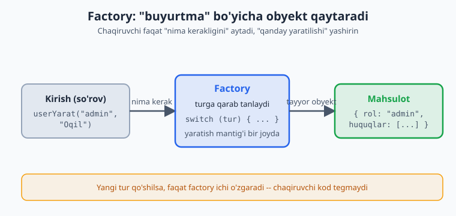
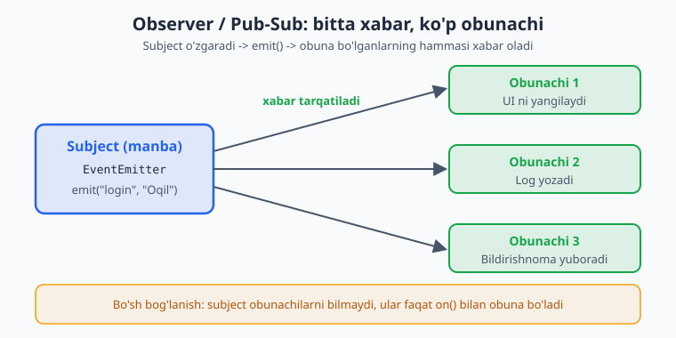
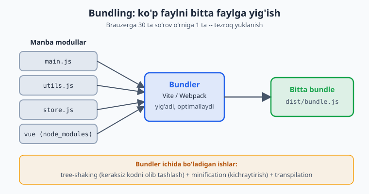
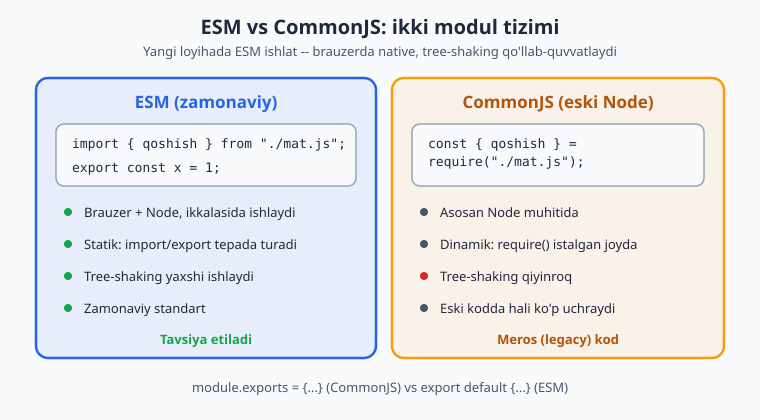

# JavaScript — 0 dan Expertgacha (O'zbek tilida)

📚 [README](./README.md) · [← 6-qism (1-bo'lim)](./javascript-qollanma-6-qism-1.md) · **Yakuniy qism**

> **6-QISM: EXPERT — 2-bo'lim (QO'LLANMA YAKUNI)**
> Design patterns, build tools, TypeScript'ga o'tish. Bu — 30 modulli qo'llanmaning so'nggi bo'limi.
> Har bir moduldan keyin **20 ta masala** (yechimi bilan).

> 1-bo'limda til mexanikasini chuqurlashtirdik (FP, generators, Proxy, performance). Endi — arxitektura va keyingi qadam.

---

# 28-MODUL: Design Patterns

Design pattern — tez-tez uchraydigan muammolarga **tayyor, sinangan yechim**. (Sen Laravel'da OOP/SOLID bilan ishlaysan — bu patternlarning ko'pi tanish bo'ladi, faqat JS sintaksisida.)

## 1. Module Pattern (inkapsulatsiya)

Private holatni yashirib, faqat kerakli interfeysni ochish (17-moduldagi closure'ni esla):

```js
const Hisoblagich = (() => {
  let son = 0; // PRIVATE — tashqaridan ko'rinmaydi

  return {
    oshir() { return ++son; },
    kamaytir() { return --son; },
    qiymat() { return son; },
  };
})();

Hisoblagich.oshir();
Hisoblagich.oshir();
console.log(Hisoblagich.qiymat()); // 2
console.log(Hisoblagich.son);      // undefined — yashirin
```

> Zamonaviy JS'da bu **ES modullar** bilan tabiiy hal bo'ladi (21-modul): faylda export qilinmagan narsa avtomatik private.

## 2. Singleton (yagona nusxa)

Butun ilovada **bitta** nusxasi bo'lishi kerak bo'lgan obyekt (konfiguratsiya, store, DB ulanishi):

```js
class Store {
  static #instance = null;
  #data = {};

  static getInstance() {
    if (!Store.#instance) {
      Store.#instance = new Store();
    }
    return Store.#instance;
  }

  set(kalit, qiymat) { this.#data[kalit] = qiymat; }
  get(kalit) { return this.#data[kalit]; }
}

const a = Store.getInstance();
const b = Store.getInstance();
console.log(a === b); // true — ikkalasi ham AYNAN bir xil nusxa
```

JS'da eng oddiy singleton — **modul orqali bitta nusxa eksport qilish**:

```js
// 📄 store.js
class Store { /* ... */ }
export default new Store(); // bitta nusxa — har import bir xil obyektni oladi
```

> **Why singleton:** Global holat (foydalanuvchi sessiyasi, sozlamalar) bitta manbadan kelishi kerak. Vuex/Pinia store, konfiguratsiya — singleton. Lekin ehtiyot bo'l: haddan ortiq global holat — test va debug'ni qiyinlashtiradi.

## 3. Factory (yaratuvchi)

Obyekt yaratish mantig'ini yashirib, "buyurtma" bo'yicha obyekt qaytaradi:

```js
function userYarat(tur, ism) {
  const asos = { ism, yaratilgan: Date.now() };

  switch (tur) {
    case "admin":
      return { ...asos, rol: "admin", huquqlar: ["o'qish", "yozish", "o'chirish"] };
    case "muharrir":
      return { ...asos, rol: "muharrir", huquqlar: ["o'qish", "yozish"] };
    default:
      return { ...asos, rol: "mehmon", huquqlar: ["o'qish"] };
  }
}

const admin = userYarat("admin", "Oqil");
const mehmon = userYarat("guest", "Ali");
console.log(admin.huquqlar);  // ["o'qish","yozish","o'chirish"]
```

> **Why factory:** Chaqiruvchi "qanday yaratilishini" bilishi shart emas — faqat "nima kerakligini" aytadi. Yaratish mantig'i bir joyda. (Laravel Factory bilan bir g'oya.)



## 4. Observer / Pub-Sub (kuzatuvchi)

Bir obyekt o'zgarganda, unga "obuna bo'lgan"larga xabar berish. Hodisa tizimlari, reaktivlik shu pattern (26-moduldagi Vue 3 reaktivligi — aslida Observer!):

```js
class EventEmitter {
  #tinglovchilar = {};

  on(hodisa, fn) {
    (this.#tinglovchilar[hodisa] ??= []).push(fn); // obuna
    return this; // zanjir uchun
  }

  emit(hodisa, data) {
    this.#tinglovchilar[hodisa]?.forEach(fn => fn(data)); // xabar berish
  }

  off(hodisa, fn) {
    if (this.#tinglovchilar[hodisa]) {
      this.#tinglovchilar[hodisa] = this.#tinglovchilar[hodisa].filter(f => f !== fn);
    }
  }
}

const bus = new EventEmitter();
bus.on("login", (user) => console.log(`${user} kirdi`));
bus.on("login", (user) => console.log(`Log: ${user}`));

bus.emit("login", "Oqil");
// "Oqil kirdi"
// "Log: Oqil"
```

> **Why observer:** Komponentlar bir-birini bilmasdan "gaplashadi" (bo'sh bog'lanish — loose coupling). Tugma bosildi → bir nechta joy reaksiya qiladi. Vue event bus, DOM event'lari, WebSocket — hammasi shu.



## 5. Strategy (almashinadigan algoritmlar)

Bir xil ish uchun har xil "usul"larni almashtirib ishlatish (SOLID'ning Open/Closed prinsipi):

```js
const tolovUsullari = {
  naqd: (summa) => summa,                  // komissiyasiz
  karta: (summa) => summa * 1.02,          // 2% komissiya
  click: (summa) => summa * 1.01,          // 1% komissiya
  payme: (summa) => summa * 1.015,         // 1.5%
};

function tolovHisobla(usul, summa) {
  const strategiya = tolovUsullari[usul];
  if (!strategiya) throw new Error("Noma'lum to'lov usuli");
  return strategiya(summa);
}

console.log(tolovHisobla("karta", 100000)); // 102000
console.log(tolovHisobla("naqd", 100000));  // 100000
```

> **Why strategy:** Yangi usul qo'shish uchun **mavjud kodni o'zgartirmaysan** — shunchaki yangi strategiya qo'shasan (Open/Closed). Katta `if/else` o'rniga toza, kengaytiriladigan struktura. To'lov, saralash, validatsiya, eksport formatlari uchun ideal.

## Bonus: Decorator (o'rab, xatti-harakat qo'shish)

Funksiyani o'zgartirmasdan, uni o'rab qo'shimcha imkoniyat berish:

```js
function logBilan(fn) {
  return (...args) => {
    console.log(`Chaqirildi: ${args}`);
    const natija = fn(...args);
    console.log(`Natija: ${natija}`);
    return natija;
  };
}

const qoshish = (a, b) => a + b;
const qoshishLog = logBilan(qoshish);
qoshishLog(2, 3); // log + natija
```

---

## 📝 28-modul masalalari (20 ta)

1. Module pattern (IIFE) bilan private `son` va `oshir`/`qiymat` yozing.
2. ES modul bilan inkapsulatsiya qiling (export qilinmagan = private) — konseptual.
3. Singleton class yozing (`getInstance`).
4. Ikki `getInstance()` bir xil nusxa ekanini (`===`) ko'rsating.
5. Modul orqali singleton yozing (bitta nusxa export).
6. Factory funksiya: turga qarab user obyekti yarating.
7. Factory: shakl yaratuvchi (`doira`/`tortburchak`).
8. Factory class (`static create`).
9. `EventEmitter` yozing: `on` va `emit`.
10. Bir hodisaga bir nechta tinglovchi qo'shing.
11. `off` bilan obunani bekor qiling.
12. Pub-Sub: `emit`da data uzating, tinglovchi olsin.
13. Strategy: to'lov usullari (komissiya bilan).
14. Strategy: saralash strategiyalari (o'sish/kamayish).
15. Strategy: validatsiya strategiyalari (email/telefon).
16. Decorator: funksiyani o'rab log qo'shing.
17. Decorator: funksiya vaqtini o'lchovchi (timing) yozing.
18. Singleton + Observer birga: global store (`subscribe`/`set`).
19. Factory + Strategy birga ishlating.
20. **Murakkab:** mini state store — Singleton + Observer; `getState`, `setState`, `subscribe`; holat o'zgarganda obunachilarga xabar bersin (Vuex/Pinia ruhida).

<details markdown="1">
<summary>► Yechimlar</summary>

```js
// 1
const Hisoblagich = (() => {
  let son = 0;
  return { oshir: () => ++son, qiymat: () => son };
})();
Hisoblagich.oshir();
console.log(Hisoblagich.qiymat()); // 1

// 2 — ES modul (konseptual)
// 📄 hisoblagich.js
//   let son = 0;                       // private (export qilinmagan)
//   export const oshir = () => ++son;
//   export const qiymat = () => son;

// 3, 4
class Store {
  static #instance = null;
  #data = {};
  static getInstance() {
    if (!Store.#instance) Store.#instance = new Store();
    return Store.#instance;
  }
  set(k, v) { this.#data[k] = v; }
  get(k) { return this.#data[k]; }
}
console.log(Store.getInstance() === Store.getInstance()); // true

// 5 — modul singleton (konseptual)
// 📄 store.js -> export default new Store();

// 6
function userYarat(tur, ism) {
  const asos = { ism };
  if (tur === "admin") return { ...asos, huquqlar: ["all"] };
  return { ...asos, huquqlar: ["read"] };
}
console.log(userYarat("admin", "Oqil"));

// 7
function shaklYarat(tur, ...args) {
  if (tur === "doira") return { tur, r: args[0], yuza: () => Math.PI * args[0] ** 2 };
  if (tur === "tortburchak") return { tur, yuza: () => args[0] * args[1] };
}
console.log(shaklYarat("doira", 5).yuza().toFixed(2)); // 78.54

// 8
class UserFactory {
  static create(ism) { return { ism, id: Date.now() }; }
}
console.log(UserFactory.create("Ali").ism); // "Ali"

// 9, 10, 11, 12
class EventEmitter {
  #t = {};
  on(h, fn) { (this.#t[h] ??= []).push(fn); return this; }
  emit(h, data) { this.#t[h]?.forEach(fn => fn(data)); }
  off(h, fn) { if (this.#t[h]) this.#t[h] = this.#t[h].filter(f => f !== fn); }
}
const bus = new EventEmitter();
const log = u => console.log("Log:", u);
bus.on("login", u => console.log(`${u} kirdi`)).on("login", log);
bus.emit("login", "Oqil"); // ikkala tinglovchi
bus.off("login", log);
bus.emit("login", "Ali");  // faqat birinchisi

// 13
const tolov = {
  naqd: s => s,
  karta: s => s * 1.02,
};
console.log(tolov.karta(100000)); // 102000

// 14
const saralash = {
  osish: arr => [...arr].sort((a, b) => a - b),
  kamayish: arr => [...arr].sort((a, b) => b - a),
};
console.log(saralash.osish([3, 1, 2])); // [1,2,3]

// 15
const validatsiya = {
  email: v => /^[^\s@]+@[^\s@]+\.[^\s@]+$/.test(v),
  telefon: v => /^\+998\d{9}$/.test(v),
};
console.log(validatsiya.email("a@b.uz")); // true

// 16
function logBilan(fn) {
  return (...a) => { console.log("chaqirildi:", a); return fn(...a); };
}
logBilan((a, b) => a + b)(2, 3); // log, 5

// 17
function timing(fn) {
  return (...a) => {
    const start = performance.now();
    const r = fn(...a);
    console.log(`Vaqt: ${(performance.now() - start).toFixed(2)}ms`);
    return r;
  };
}

// 18, 20 — state store (Singleton + Observer)
class StateStore {
  static #instance = null;
  #state = {};
  #obunachilar = [];

  static getInstance() {
    if (!StateStore.#instance) StateStore.#instance = new StateStore();
    return StateStore.#instance;
  }

  getState() { return { ...this.#state }; }

  setState(yangi) {
    this.#state = { ...this.#state, ...yangi };
    this.#obunachilar.forEach(fn => fn(this.#state)); // xabar berish
  }

  subscribe(fn) {
    this.#obunachilar.push(fn);
    return () => { // unsubscribe funksiyasi qaytaramiz
      this.#obunachilar = this.#obunachilar.filter(f => f !== fn);
    };
  }
}

const store = StateStore.getInstance();
const unsub = store.subscribe(s => console.log("O'zgardi:", s));
store.setState({ user: "Oqil" }); // "O'zgardi: {user: 'Oqil'}"
store.setState({ yosh: 25 });      // "O'zgardi: {user: 'Oqil', yosh: 25}"
unsub(); // obunani bekor qilamiz

// 19 — Factory + Strategy
const tolovStrategiyalari = { naqd: s => s, karta: s => s * 1.02 };
function tolovYarat(usul) {
  return { usul, hisobla: summa => tolovStrategiyalari[usul](summa) };
}
console.log(tolovYarat("karta").hisobla(1000)); // 1020
```
</details>

---

# 29-MODUL: Bundlers va build tools

> **Eslatma:** Bu modul ko'proq **tushuncha**lar haqida — kodni ishga tushirish/yetkazish jarayoni. Masalalar amaliy savol-javob ko'rinishida.

## Nega bundler kerak?

Sen 30 ta `.js` faylga bo'lingan loyiha yozding. Brauzerga buni qanday yetkazasan?
- Har faylni alohida yuklasa — sekin (ko'p so'rov).
- Eski brauzerlar ba'zi zamonaviy sintaksisni tushunmaydi.
- Ishlatilmagan kod ham yuklanib, hajm kattalashadi.

**Bundler** (Vite, Webpack) — barcha modullarni **bitta optimallashtirilgan faylga** yig'adi, eski brauzerlarga moslaydi, hajmni kichraytiradi.



## npm va `package.json`

`npm` — JS paketlar menejeri. `package.json` — loyiha "pasporti":

```json
{
  "name": "educore-frontend",
  "version": "1.0.0",
  "scripts": {
    "dev": "vite",
    "build": "vite build"
  },
  "dependencies": {
    "vue": "^3.4.0"
  },
  "devDependencies": {
    "vite": "^5.0.0"
  }
}
```

- **`dependencies`** — ishlab turishi uchun kerak (`vue`, `axios`).
- **`devDependencies`** — faqat ishlab chiqishda kerak (`vite`, `eslint` — build'dan keyin kerak emas).
- **`scripts`** — `npm run dev`, `npm run build` buyruqlari.

```bash
npm init -y              # package.json yaratadi
npm install vue          # dependencies'ga qo'shadi
npm install -D vite      # devDependencies'ga qo'shadi
npm run dev              # scripts'dagi "dev" ni ishga tushiradi
```

## Semver (versiyalash)

`^3.4.0` kabi belgilar versiya yangilanishini boshqaradi:

```
3.4.0  -> MAJOR.MINOR.PATCH
^3.4.0 -> 3.x.x gacha (3.4.0 dan 4.0.0 gacha, 4 kirmaydi)
~3.4.0 -> 3.4.x gacha (faqat patch yangilanishlar)
3.4.0  -> aniq shu versiya
```

## ESM vs CommonJS

JS'da ikki modul tizimi bor:

```js
// ESM (zamonaviy, brauzer + Node) — 21-modulda ko'rdik:
import { qoshish } from "./mat.js";
export const x = 1;

// CommonJS (eski Node):
const { qoshish } = require("./mat.js");
module.exports = { x: 1 };
```

> **Why ESM:** Zamonaviy standart — brauzerda native ishlaydi, **tree-shaking**ni (pastda) qo'llab-quvvatlaydi. CommonJS — eski Node kodida hali ko'p. Yangi loyihada ESM ishlat.



## Build jarayonidagi tushunchalar

- **Tree-shaking** — ishlatilmagan kodni (export qilingan, lekin import qilinmagan) build'dan **olib tashlash**. Hajmni kichraytiradi. (ESM'ning statik tabiati tufayli ishlaydi.)
- **Minification** — bo'shliq, izoh, uzun nomlarni olib tashlab faylni kichraytirish (`hisoblagich` → `a`).
- **Transpilation** (Babel) — zamonaviy sintaksisni eski brauzerlar tushunadigan kodga aylantirish.
- **HMR** (Hot Module Replacement) — ishlab chiqishda kodni o'zgartirsang, sahifa to'liq yangilanmasdan faqat o'zgargan qism almashinadi (tez).
- **Source map** — minify qilingan kodni asl kod bilan bog'laydi (debug uchun).
- **`dist/`** — `npm run build`dan keyingi tayyor (production) fayllar.

## Vite (sening stackingda)

Vue/Nuxt **Vite** ustida ishlaydi. Vite:
- Ishlab chiqishda — **esbuild** bilan juda tez dev server + HMR.
- Production'da — **Rollup** bilan optimallashtirilgan bundle (tree-shaking, minify).

> **Why Vite:** Eski Webpack'dan tez (ayniqsa dev server). Vue/Nuxt/SvelteKit — barchasi Vite'ni standart qilgan. Sen Nuxt ishlatsang, Vite "ostida" ishlaydi — to'g'ridan-to'g'ri sozlash kamdan-kam kerak.

---

## 📝 29-modul masalalari (20 ta)

> Bular amaliy savollar — ba'zilarini terminalda sinab ko'rsang bo'ladi.

1. `npm init -y` nima qiladi?
2. `dependencies` va `devDependencies` farqini ayting.
3. `vue` ni dependencies'ga qo'shuvchi buyruqni yozing.
4. `vite` ni devDependencies'ga qo'shuvchi buyruqni yozing.
5. `package.json`dagi `scripts`dan `dev` ni ishga tushiruvchi buyruq.
6. `^3.4.0` qaysi versiyalarni qabul qiladi?
7. `~3.4.0` qaysi versiyalarni qabul qiladi?
8. `node_modules` nima va nega `.gitignore`ga qo'shiladi?
9. `package-lock.json` nima uchun kerak?
10. Bir modulni ESM va CommonJS'da import qilib yozing.
11. `module.exports` va `export default` farqini yozing.
12. Vite ishlab chiqishda va production'da nima qiladi?
13. Tree-shaking nima va nega faqat ESM'da yaxshi ishlaydi?
14. Minification nima qiladi?
15. Transpilation (Babel) nega kerak?
16. HMR nima va qanday foyda beradi?
17. `dist/` papkasi nima?
18. Source map nima uchun kerak?
19. Nega bundler ko'p faylni bitta qiladi (sabab)?
20. **Murakkab:** kichik Vue loyihasi uchun `package.json` yozing — `scripts` (dev, build), `dependencies` (vue), `devDependencies` (vite).

<details markdown="1">
<summary>► Yechimlar</summary>

```text
1. So'rovsiz (default qiymatlar bilan) package.json fayl yaratadi.

2. dependencies — ilova ISHLASHI uchun kerak (vue, axios), production'da ham.
   devDependencies — faqat ISHLAB CHIQISHDA kerak (vite, eslint, jest);
   tayyor mahsulotga kirmaydi.

3. npm install vue        (yoki: npm i vue)

4. npm install -D vite    (yoki: npm install --save-dev vite)

5. npm run dev

6. ^3.4.0 -> >=3.4.0 va <4.0.0 (3.x.x dagi eng yangi; major o'zgarmaydi)

7. ~3.4.0 -> >=3.4.0 va <3.5.0 (faqat patch yangilanishlar)

8. node_modules — o'rnatilgan paketlar papkasi (juda katta).
   .gitignore'ga qo'shiladi, chunki package.json'dan qayta tiklash mumkin
   (npm install) — git'da saqlash shart emas.

9. package-lock.json — har bir paketning ANIQ versiyasini qayd etadi.
   Shunda hamma jamoa a'zosi va server bir xil versiyalarni oladi
   (reproducible build).

10. // ESM:
    import { qoshish } from "./mat.js";
    // CommonJS:
    const { qoshish } = require("./mat.js");

11. // CommonJS:
    module.exports = funksiya;
    // ESM:
    export default funksiya;

12. Dev: esbuild bilan tez dev server + HMR.
    Production (vite build): Rollup bilan optimallashtirilgan bundle
    (tree-shaking, minification).

13. Tree-shaking — import qilinmagan export'larni build'dan olib tashlaydi.
    ESM statik (import/export tepada, o'zgarmas) bo'lgani uchun bundler
    nima ishlatilmaganini aniq biladi. CommonJS dinamik -> qiyinroq.

14. Bo'shliq, izoh, uzun o'zgaruvchi nomlarini olib tashlab faylni
    kichraytiradi (yuklanish tezlashadi).

15. Zamonaviy JS'ni (optional chaining, ??, class fields) eski brauzerlar
    tushunadigan eskiroq sintaksisga aylantiradi.

16. HMR (Hot Module Replacement) — kod o'zgarganda butun sahifani
    yangilamasdan faqat o'zgargan modulni almashtiradi. Holat saqlanadi,
    ishlab chiqish tezlashadi.

17. dist/ — `npm run build`dan keyingi tayyor (production) fayllar
    (bundled, minified). Serverga shu yuklanadi.

18. Minify qilingan kodni asl kod bilan bog'laydi — brauzerda debug
    qilganda asl qator/o'zgaruvchi nomlarini ko'rasan.

19. Har faylni alohida yuklash ko'p HTTP so'rov = sekin. Bitta (yoki bir
    nechta) bundle — kam so'rov, tezroq yuklanish.

20.
{
  "name": "educore-frontend",
  "version": "1.0.0",
  "type": "module",
  "scripts": {
    "dev": "vite",
    "build": "vite build",
    "preview": "vite preview"
  },
  "dependencies": {
    "vue": "^3.4.0"
  },
  "devDependencies": {
    "vite": "^5.0.0",
    "@vitejs/plugin-vue": "^5.0.0"
  }
}
```
</details>

---

# 30-MODUL: TypeScript'ga ko'prik

> **Eslatma:** TypeScript (TS) brauzerda to'g'ridan-to'g'ri ishlamaydi — u JS'ga **kompilatsiya** qilinadi. Mashqlarni [typescriptlang.org/play](https://www.typescriptlang.org/play) (TS Playground)da sinab ko'r.

## TypeScript nima va nega?

TS — JS'ning **tiplar qo'shilgan** kengaytmasi (superset). Sen yozgan har qanday JS — to'g'ri TS. TS ustiga **tip tizimi** qo'shadi.

```ts
// JS — xato faqat ishga tushganda bilinadi:
function qoshish(a, b) { return a + b; }
qoshish("5", 3); // "53" — kutilmagan, lekin xato bermaydi

// TS — xato YOZAYOTGANDA bilinadi:
function qoshish(a: number, b: number): number { return a + b; }
qoshish("5", 3); // ❌ Kompilyator xatosi: "5" string, number kerak
```

> **Why TS:** (1) Xatolar **kompilatsiya vaqtida** ushlanadi, foydalanuvchida emas. (2) Avtomatik to'ldirish (autocomplete) kuchli. (3) Kod o'zini hujjatlashtiradi (tip = hujjat). (4) Katta loyihada yo'qolib qolmaysan. Vue 3, Nuxt, Angular — hammasi TS'ni qo'llab-quvvatlaydi/tavsiya qiladi.

## Asosiy tip annotatsiyalari

```ts
let ism: string = "Oqil";
let yosh: number = 25;
let faol: boolean = true;
let sonlar: number[] = [1, 2, 3];
let aralash: (string | number)[] = ["a", 1, "b"];

// Funksiya:
function salom(ism: string): string {
  return `Salom, ${ism}`;
}

// Hech narsa qaytarmasa — void:
function log(xabar: string): void {
  console.log(xabar);
}
```

## Obyekt va `interface`

`interface` — obyekt "shaklini" ta'riflaydi:

```ts
interface User {
  ism: string;
  yosh: number;
  email?: string; // ? — ixtiyoriy (bo'lmasligi mumkin)
}

const user: User = { ism: "Oqil", yosh: 25 };
// email bermadik — ixtiyoriy bo'lgani uchun OK

function userKorsat(u: User): string {
  return `${u.ism}, ${u.yosh} yosh`;
}
```

## Union va literal tiplar

```ts
let id: string | number; // string YOKI number
id = "abc"; // OK
id = 123;   // OK

// Literal union — faqat aniq qiymatlar:
type Status = "faol" | "nofaol" | "kutilmoqda";
let holat: Status = "faol"; // OK
// let holat: Status = "boshqa"; // ❌ xato
```

## `type` alias

```ts
type ID = string | number;
type Koordinata = { x: number; y: number };

const nuqta: Koordinata = { x: 10, y: 20 };
```

> **`interface` vs `type`:** Obyekt shakllari uchun ko'pincha `interface` (kengaytiriladi), boshqa holatlarda (union, alias) `type`. Boshlang'ich uchun: obyekt → `interface`, qolgani → `type`.

## Generics (umumiy tiplar)

Turli tip bilan ishlaydigan, lekin tip xavfsizligini saqlaydigan funksiya/struktura:

```ts
function birinchi<T>(arr: T[]): T {
  return arr[0];
}

const s = birinchi(["a", "b"]); // T = string, s: string
const n = birinchi([1, 2, 3]);  // T = number, n: number
```

> **Why generics:** `any` ishlatsang tip xavfsizligini yo'qotasan. Generic — "qanday tur kelsa, o'shani saqla". Massiv, Promise, React/Vue komponentlari — generics ustiga qurilgan (`Array<string>`, `Promise<User>`).

## TS qanday ishlaydi

```
sen.ts  --(tsc kompilyator / Vite)-->  sen.js
```

TS kompilyatori (`tsc`) yoki Vite/Nuxt TS'ni oddiy JS'ga aylantiradi. Tiplar **o'chiriladi** (runtime'da yo'q) — ular faqat yozish va kompilatsiya vaqtidagi tekshiruv uchun. `tsconfig.json` — TS sozlamalari.

---

## 📝 30-modul masalalari (20 ta)

> TS Playground'da sinab ko'ring. Yechimlar — TypeScript kodi.

1. `string`, `number`, `boolean` o'zgaruvchilarni annotatsiya qiling.
2. `number[]` massivni annotatsiya qiling.
3. Tiplangan parametr va qaytish qiymatli funksiya yozing.
4. Obyektni inline annotatsiya qiling (`{ ism: string }`).
5. `User` interface yozing (`ism`, `yosh`).
6. `User`ni tip sifatida ishlating.
7. Ixtiyoriy xususiyat (`email?`) qo'shing.
8. Union tip (`string | number`) yozing.
9. Literal union (`"faol" | "nofaol"`) yozing.
10. `type` alias yozing (`type ID = ...`).
11. `void` qaytaradigan funksiya yozing.
12. Obyektlar massivini tiplang (`User[]`).
13. Ixtiyoriy funksiya parametri (`yosh?: number`).
14. Default + tiplangan parametr (`rol: string = "user"`).
15. Generic funksiya yozing (`birinchi<T>`).
16. `enum` yozing (`Rol { Admin, User }`) — qisqacha.
17. `readonly` xususiyat yozing.
18. Funksiya o'zgaruvchisini tiplang (tip imzosi).
19. JS funksiyani TS'ga aylantiring (annotatsiya qo'shing).
20. **Murakkab:** kichik modul tiping — `Product` interface (`nom`, `narx`); narx bo'yicha filterlovchi tiplangan funksiya; generic yordamchi (`oxirgi<T>`).

<details markdown="1">
<summary>► Yechimlar</summary>

```ts
// 1
let ism: string = "Oqil";
let yosh: number = 25;
let faol: boolean = true;

// 2
let sonlar: number[] = [1, 2, 3];

// 3
function qoshish(a: number, b: number): number { return a + b; }

// 4
const user4: { ism: string; yosh: number } = { ism: "Oqil", yosh: 25 };

// 5, 6
interface User {
  ism: string;
  yosh: number;
}
const user: User = { ism: "Oqil", yosh: 25 };

// 7
interface User7 {
  ism: string;
  email?: string; // ixtiyoriy
}
const u7: User7 = { ism: "Ali" }; // email yo'q — OK

// 8
let id: string | number;
id = "abc"; id = 123;

// 9
type Status = "faol" | "nofaol";
let holat: Status = "faol";

// 10
type ID = string | number;
const x: ID = 5;

// 11
function log(xabar: string): void { console.log(xabar); }

// 12
const users: User[] = [{ ism: "A", yosh: 20 }, { ism: "B", yosh: 30 }];

// 13
function salom(ism: string, yosh?: number): string {
  return yosh ? `${ism}, ${yosh}` : ism;
}

// 14
function user14(ism: string, rol: string = "user"): string {
  return `${ism} (${rol})`;
}

// 15
function birinchi<T>(arr: T[]): T { return arr[0]; }
const s = birinchi(["a", "b"]); // string
const n = birinchi([1, 2]);     // number

// 16
enum Rol { Admin, User, Mehmon }
const rol: Rol = Rol.Admin;

// 17
interface Config {
  readonly apiUrl: string; // o'zgartirib bo'lmaydi
}
const cfg: Config = { apiUrl: "https://api.uz" };
// cfg.apiUrl = "..."; // ❌ xato

// 18
type QoshishFn = (a: number, b: number) => number;
const qosh: QoshishFn = (a, b) => a + b;

// 19
// JS: function kvadrat(n) { return n * n; }
// TS:
function kvadrat(n: number): number { return n * n; }

// 20 — modul tiping
interface Product {
  nom: string;
  narx: number;
}

function qimmatlar(mahsulotlar: Product[], minNarx: number): Product[] {
  return mahsulotlar.filter(m => m.narx >= minNarx);
}

function oxirgi<T>(arr: T[]): T {
  return arr[arr.length - 1];
}

const mahsulotlar: Product[] = [
  { nom: "A", narx: 100 },
  { nom: "B", narx: 50 },
  { nom: "C", narx: 200 },
];
console.log(qimmatlar(mahsulotlar, 100)); // A, C
console.log(oxirgi(mahsulotlar).nom);     // "C"
```
</details>

---

# 🎓 QO'LLANMA YAKUNI — 0 dan Expertgacha

Tabriklayman! Sen 30 modulli, ~600 masalali JavaScript yo'lini bosib o'tding. Mana nimalarni o'rganding:

**1-QISM (Asoslar):** o'zgaruvchilar, operatorlar, shartlar, sikllar
**2-QISM (Strukturalar):** funksiyalar, massivlar (`map`/`filter`/`reduce`), obyektlar, string/number metodlari
**3-QISM (Brauzer):** DOM, events, forms, localStorage — *to'liq Todo-app*
**4-QISM (Async):** Event Loop, callbacks, Promises, async/await, Fetch
**5-QISM (Chuqur JS):** scope/closures, `this`, prototypes, classes, ES6+, modullar, error handling, regex
**6-QISM (Expert):** FP, generators, Proxy/reaktivlik, performance, design patterns, build tools, TypeScript

## Endi nima qilish kerak?

Bilim — **yozib** mustahkamlanadi, o'qib emas. Tavsiyalar:

1. **Loyiha qur.** Eng samarali yo'l. Boshlash uchun: Todo-app (qildik) → ob-havo ilovasi (Fetch) → blog (CRUD + localStorage) → kichik o'yin.
2. **Framework'ga o't.** Sof JS asosini o'zlashtirgan bo'lsang, **Vue 3** tabiiy keyingi qadam (reaktivlik — 26-modulda ko'rgan Proxy!). Nuxt esa to'liq ilova uchun.
3. **TypeScript'ni jiddiy o'rgan.** 30-modul — faqat ko'prik. Real loyihada TS — standart.
4. **Algoritmlarni mashq qil.** LeetCode/Codewars — `map`/`filter`/`reduce` va Big-O intuitsiyangni o'tkirlaydi.
5. **Boshqalarga o'rgat.** Bironta mavzuni junior'ga tushuntira olsang — uni haqiqatan tushunding.

## So'nggi maslahat

> Yaxshi dasturchi hamma narsani yodlamaydi — **qaerda qarashni** va **qanday fikrlashni** biladi. Bu qo'llanma senga JS qanday **ishlashini** o'rgatdi. Sintaksisni unutib qo'ysang — qaytib qara. Lekin **tushunchani** (closure, `this`, async, reaktivlik) o'zlashtirsang, u qoladi.

JS — internetning tili. Endi sen u bilan gaplasha olasan. Omad! 🚀

---

📚 [README / Mundarija](./README.md) · [← 6-qism (1-bo'lim)](./javascript-qollanma-6-qism-1.md)
