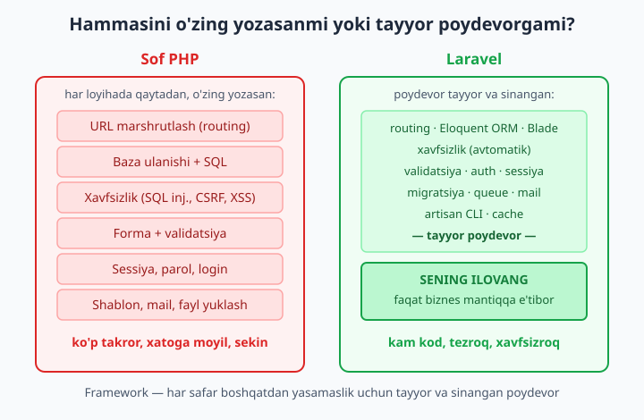
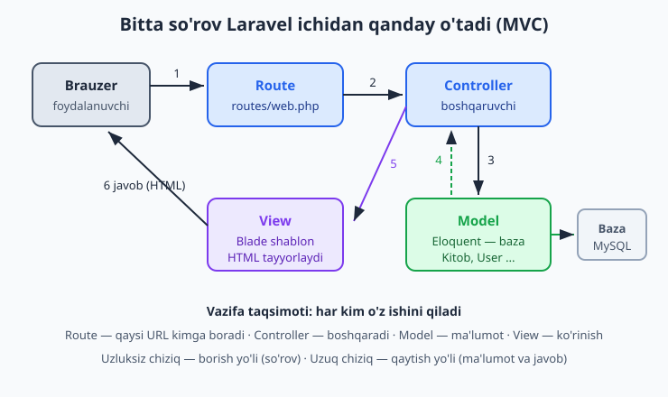
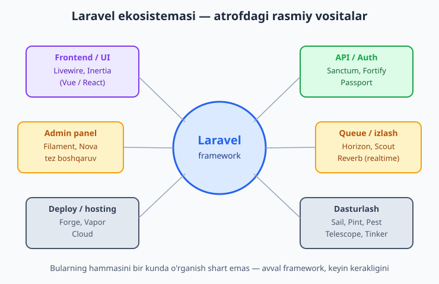

# 1 — Laravel nima va nega kerak?

[🏠 README](./README.md) · [Keyingi: 02 — O'rnatish va muhit ➡️](./02-ornatish-muhit.md)

> **Bu bobda:** sof PHP'da har bir loyihani noldan qurish nega charchatadi va xatoga olib keladi — shuni ko'rib chiqamiz; keyin framework nima ekanini, Laravel qaysi muammolarni hal qilishini, uning yuragi bo'lgan MVC arxitekturasini (so'rov route → controller → model/view → javob), Laravel beradigan tayyor vositalarni (routing, Eloquent, Blade, autentifikatsiya, artisan, migratsiya, queue, mail), "convention over configuration" falsafasini, Laravel 13 (2026) zamonaviy holatini va atrofidagi boy ekosistemani tanishtiramiz. Kod yozishni keyingi boblarda boshlaymiz — bu bob "nega" degan savolga javob beradi.

---

## Muammo

Tasavvur qiling: siz PHP'ni yaxshi bilasiz. OOP, klasslar, massiv, Composer — hammasi qo'lingizdan keladi. Endi maktab uchun kichik sayt yozmoqchisiz: o'quvchilar ro'yxati, ularni qo'shish formasi, login sahifa. Boshlaysiz va birdaniga shu savollar paydo bo'ladi:

- Foydalanuvchi `/oquvchilar/5` deb yozsa, qaysi fayl ishlashi kerak? Demak, URL'larni "yo'naltirish" tizimi yozish kerak.
- Bazaga qanday ulanaman? `mysqli` yoki `PDO` ochaman, har bir so'rovni qo'lda yozaman, natijani massivga aylantiraman.
- Forma yuborilganda — kelgan ma'lumotni tekshirish (`isset`, `trim`, `filter_var`...), SQL'ga xavfsiz qo'yish, XSS'dan himoya qilish.
- Login — parolni `password_hash` bilan saqlash, sessiya ochish, "kim kirgan" ni eslab qolish.

Bularning birortasi ham sizning maktab saytingizga xos emas. Bu — **har bir** veb-loyihada qaytadan kerak bo'ladigan ish. Quyidagi sof PHP'dagi ibtidoiy "router" buni ko'rsatadi:

```php
<?php
// Sof PHP: brauzerdan kelgan yo'lni o'zimiz tahlil qilamiz
$path = parse_url($_SERVER['REQUEST_URI'], PHP_URL_PATH);

if ($_SERVER['REQUEST_METHOD'] === 'GET' && preg_match('#^/kitoblar/(\d+)$#', $path, $m)) {
    $id = (int) $m[1];
    echo "Kitob ko'rsatish, id = {$id}";
} elseif ($_SERVER['REQUEST_METHOD'] === 'GET' && $path === '/kitoblar') {
    echo "Hamma kitoblar ro'yxati";
} else {
    http_response_code(404);
    echo '404 - sahifa topilmadi';
}
```

Bu hali faqat **uchta** yo'l uchun. Saytingizda 50 ta sahifa bo'lsa, bu `if`/`elseif` zanjiri qo'rqinchli bir narsaga aylanadi. Va biz hali bazaga ulanish, forma tekshirish, login — bularning birortasini ham yozmadik.

📌 Muammoning mohiyati shu: har bir loyiha **bir xil poydevorni** talab qiladi. Uni har safar qo'lda qurish — uch tomonlama yo'qotish:

- **Vaqt** — bir xil kodni qayta-qayta yozasiz, asl ishingizga (maktab mantig'i) yetib bormaysiz.
- **Xatolar** — xavfsizlik kodini har gal qo'lda yozsangiz, bir kuni biror joyda `filter` ni unutasiz va SQL inejeksiya teshigi qoladi.
- **Jamoa** — har bir dasturchi o'zicha quradi; kodingiz "o'zimizniki", boshqa odam tushunishi qiyin.



Yechim oddiy: poydevorni **har safar qaytadan qurmaslik**. Kimdir uni allaqachon, ehtiyotkorlik bilan, minglab loyihalarda sinab qurib qo'ygan. Bu — **framework**.

## Framework nima?

**Framework** (o'zbekcha — "ramka", "poydevor") — bu tayyor, tartibli va sinangan kod to'plami. U eng ko'p uchraydigan vazifalarni (routing, bazaga ulanish, xavfsizlik, forma, login) o'zi bajaradi va sizga shunchaki "bu yerga o'z kodingizni yozing" deydigan bo'sh joylar qoldiradi.

Farqni his qilish uchun oddiy o'xshatish:

- **Kutubxona (library)** — siz chaqiradigan vositalar yig'indisi. Masalan, bir tasvirni kichraytiruvchi kutubxona: kerak bo'lganda **siz** uni chaqirasiz. Boshqaruv sizda.
- **Framework** — teskari. Boshqaruv **uning** qo'lida. U sizning kodingizni "tegishli paytda o'zi chaqiradi". Brauzerdan so'rov kelganda, framework uni qabul qiladi, tahlil qiladi, keyin sizning kodingizga "mana, foydalanuvchi `/kitoblar/5` so'radi, endi sen ishla" deb topshiradi.

💡 Buni "Boshqaruvning teskarilanishi" (Inversion of Control) deyishadi: siz frameworkni emas, framework sizni chaqiradi. Aynan shu sababli framework "qoidalar" o'rnatadi: fayllarni qayerga qo'yish, klasslarni qanday nomlash. Bu qoidalarga rioya qilsangiz, hammasi o'zi joyiga tushadi.

📌 Framework — bu PHP o'rniga emas, **PHP ustiga** quriladi. Siz hamon PHP yozasiz: klasslar, metodlar, massivlar. Faqat endi bo'sh sahifadan emas, tayyor poydevordan boshlaysiz. Shuning uchun PHP'ni bilish shart edi — buni siz allaqachon bilasiz.

❌ "Framework — bu dasturlashni osonlashtiradigan sehrli tugma, endi PHP bilmasam ham bo'ladi."
✅ "Framework — bu tajribali dasturchilar yiqqan eng yaxshi amaliyotlar to'plami; PHP'ni qanchalik yaxshi bilsam, undan shunchalik unumli foydalanaman."

## Nega aynan Laravel?

PHP dunyosida bir nechta framework bor (Symfony, CodeIgniter, Yii...), lekin **Laravel** — eng mashhuri. Buning amaliy sabablari bor:

- **Eng katta ekosistema va jamoa.** Muammoga duch kelsangiz, kimdir uni allaqachon hal qilgan: hujjatlar boy, forumlar to'la, video darslar son-sanoqsiz.
- **Eng ko'p vakansiya.** O'zbekistonda ham, xalqaro bozorda ham PHP ish o'rinlarining katta qismi aynan Laravel'ni so'raydi. O'rgangan vaqtingiz to'g'ridan-to'g'ri ish imkoniyatiga aylanadi.
- **O'rganish yoqimli.** Laravel ataylab "dasturchi xursand bo'lsin" tamoyili bilan qurilgan. Kodi o'qiladigan, nomlari mantiqiy, hujjatlari ajoyib.
- **Yagona, butun yechim.** Login, mail, queue, fayl yuklash, test — bularning hammasi bitta uyg'un to'plamda keladi. Har birini alohida izlab, ulashtirib o'tirmaysiz.

💡 "Eng mashhuri" degani — "har doim, har joyda eng to'g'ri tanlov" degani emas. Lekin **o'rganish uchun** mashhurlik juda muhim: ko'p material, ko'p yordam, ko'p ish. Boshlovchi uchun Laravel — eng aqlli birinchi qadam.

## MVC — Laravel'ning yuragi

Laravel (va deyarli barcha zamonaviy framework'lar) **MVC** degan arxitekturaga asoslanadi. Bu — kodni uch xil mas'uliyatga ajratish usuli:

- **Model** — **ma'lumot va biznes mantiq**. Bazadagi jadval bilan ishlaydigan qism. Masalan, `Kitob` modeli — kitoblar jadvalini ifodalaydi: kitob qidirish, saqlash, o'chirish.
- **View** — **ko'rinish**. Foydalanuvchi ko'radigan HTML. Laravel'da bular **Blade** shablonlari. View hech qachon bazaga o'zi murojaat qilmaydi — unga tayyor ma'lumot beriladi, u faqat chiroyli qilib ko'rsatadi.
- **Controller** — **boshqaruvchi, vositachi**. So'rovni qabul qiladi, kerak bo'lsa Model'dan ma'lumot oladi, keyin to'g'ri View'ni tanlab, unga ma'lumotni topshiradi.

Bularni bog'lab turadigan to'rtinchi narsa — **Route** (marshrut): qaysi URL qaysi controllerga borishini belgilaydigan "manzillar jadvali".



Bitta so'rov shu yo'ldan o'tadi:

1. Foydalanuvchi brauzerda `/kitoblar/5` ni ochadi — so'rov Laravel'ga keladi.
2. **Route** "bu URL'ni kim qabul qiladi?" deb qaraydi va mos **Controller** metodini topadi.
3. **Controller** ishga tushadi va kerakli ma'lumotni **Model**'dan so'raydi.
4. **Model** baza bilan gaplashadi va ma'lumotni qaytaradi (5-raqamli kitob).
5. **Controller** ma'lumotni **View** (Blade)'ga beradi; View undan HTML tayyorlaydi.
6. Tayyor HTML brauzerga **javob** sifatida qaytadi.

Hayotiy o'xshatish — restoran:

- **Ofitsiant = Controller.** Sizning buyurtmangizni (so'rov) qabul qiladi, oshxonaga olib boradi, tayyor taomni stolga keltiradi. O'zi ovqat pishirmaydi.
- **Oshpaz = Model.** Mahsulotlar (baza) bilan ishlaydi, taom (ma'lumot) tayyorlaydi.
- **Menyu/likopcha bezagi = View.** Mijoz ko'radigan ko'rinish.
- **Stol raqamlari = Route.** "Qaysi buyurtma qaysi stolga boradi" ni belgilaydi.

📌 MVC'ning butun foydasi — **vazifalar ajralgan**. Dizayni o'zgartirsangiz — faqat View'ga tegasiz. Baza mantig'i buzilsa — Model'ga qaraysiz. Bu tartibsiz "hamma narsa bitta faylda" yondashuvdan ming marta qulayroq: kod o'sgani sayin chalkashmaydi.

💡 Sof PHP'da ham MVC'ni qo'lda qurish mumkin, lekin Laravel buni siz uchun tayyor qilib beradi: papkalar tayyor, nomlash qoidalari aniq, bog'lanish avtomatik. Siz faqat "to'ldirasiz".

## Laravel nima beradi?

Yodingizdami, muammo bo'limida har bir loyihada qaytadan kerak bo'lgan ishlarni sanagan edik. Mana Laravel ularning har biriga tayyor javob beradi:

| Vazifa (sof PHP'da o'zingiz yozardingiz) | Laravel'dagi vositasi |
|---|---|
| URL'larni yo'naltirish | **Routing** — `routes/` papkasidagi sodda qatorlar |
| Baza bilan ishlash | **Eloquent ORM** — SQL o'rniga PHP obyektlari |
| Baza tuzilmasini boshqarish | **Migratsiya** — jadvallarni kod bilan, versiyalab yaratish |
| HTML chiqarish | **Blade** — toza, xavfsiz shablon tili |
| Login / ro'yxatdan o'tish | **Autentifikatsiya** — tayyor starter kit'lar |
| Forma tekshirish | **Validatsiya** — bitta qatorda qoidalar |
| Buyruqlar bilan ishlash | **Artisan CLI** — `php artisan ...` yordamchisi |
| Og'ir ishni keyinga qoldirish | **Queue** (navbat) va **Jobs** |
| Email yuborish | **Mail** va **Notifications** |
| Tezlikni oshirish | **Cache** |

Eng yaxshisi — bularning hammasi bir-biri bilan **uyg'un** ishlaydi. Misol uchun, yuqoridagi ibtidoiy router Laravel'da shunchaki shunday ko'rinadi:

```php
use Illuminate\Support\Facades\Route;
use App\Http\Controllers\KitobController;

Route::get('/kitoblar', [KitobController::class, 'index']);
Route::get('/kitoblar/{id}', [KitobController::class, 'show']);
```

`{id}` — Laravel uni o'zi ajratib oladi va controllerga uzatadi. `preg_match` ham, `parse_url` ham yo'q. Yoki butunlay sodda, controllersiz misol:

```php
Route::get('/salom/{ism}', function (string $ism) {
    return "Assalomu alaykum, {$ism}!";
});
```

📌 Bu kodlarni hozir tushunmasangiz ham xavotir olmang — har birini alohida bobda batafsil ko'ramiz (Routing — 3-bob, Controllers — 4-bob, Eloquent — 8-bob...). Hozir muhimi bitta narsa: **siz yozadigan kod kamayadi, qolgan ish frameworkning zimmasiga o'tadi.**

💡 Sof PHP'da ham SQL injeksiyadan himoya, parol heshlash mumkin — lekin **qo'lda va unutib qo'yish mumkin**. Laravel'da bu himoyalar **standart yoqilgan**: Eloquent so'rovlarni avtomatik xavfsiz qiladi, Blade chiqishni avtomatik ekranlaydi (XSS'dan himoya), formalar CSRF tokeni bilan keladi. Xavfsizlik — "qo'shimcha ish" emas, "standart holat".

## Convention over configuration

Laravel'ning kuchi ko'p qisman bitta falsafadan kelib chiqadi: **convention over configuration** — "sozlashdan ko'ra kelishuv".

Ma'nosi: agar siz **umumiy qabul qilingan qoidalarga** rioya qilsangiz, hech narsani sozlamaysiz — hammasi o'zi ishlaydi. Masalan:

- `Kitob` modeli avtomatik `kitobs` jadvali bilan bog'lanadi (Laravel ko'plikka o'zi aylantiradi).
- `id` ustuni avtomatik birlamchi kalit (primary key) deb qabul qilinadi.
- Controller metodlari ma'lum nomda bo'lsa (`index`, `show`, `store`...), marshrutlar avtomatik moslashadi.

Siz bu kelishuvlarni xohlasangiz o'zgartirishingiz mumkin, lekin **odatda kerak bo'lmaydi** — chunki ular aqlli tanlangan.

📌 Bu nega muhim? Chunki **har bir Laravel loyihasi bir xil ko'rinadi**. Boshqa dasturchining loyihasini ochsangiz, fayllar qayerda turishini, klasslar qanday nomlanishini darrov bilasiz. Jamoada ishlash osonlashadi, yangi loyihaga kirish tezlashadi. Sof PHP loyihada esa har kim o'z tartibini o'ylab topadi — har gal qaytadan o'rganishingizga to'g'ri keladi.

❌ "Har bir narsani o'zimcha sozlayman, shunda nazorat menda bo'ladi."
✅ "Aqlli standartlarga ergashaman, faqat haqiqatan zarur bo'lsa o'zgartiraman — shunda vaqtim biznes mantiqqa ketadi."

## Laravel 13 — bugungi holat (2026)

Bu kitob **Laravel 13** ga asoslanadi (2026-yilning bahorida chiqqan). Eng muhim faktlar:

- **PHP 8.3+ talab qilinadi, PHP 8.4 tavsiya etiladi.** Siz allaqachon zamonaviy PHP'da yozasiz, demak tayyorsiz.
- **Tuzilma soddalashtirilgan ("slim").** Laravel 11 dan boshlab ortiqcha fayllar olib tashlangan. Masalan, eski `app/Http/Kernel.php` endi **yo'q** — middleware sozlamalari `bootstrap/app.php` da turadi. Vazifalarni rejalashtirish (scheduling) `routes/console.php` da yoziladi. Eski darsliklardagi ba'zi fayllarni qidirsangiz topa olmaysiz — chunki ular soddalashtirildi.
- **API uchun alohida o'rnatish.** API marshrutlari kerak bo'lsa, `php artisan install:api` buyrug'i ishlatiladi (u bilan birga Sanctum ham keladi).
- **Test uchun Pest standart.** Laravel'da test yozish uchun **Pest** framework'i default keladi; klassik **PHPUnit** ham mavjud va ishlaydi.

📌 Nega bu ahamiyatli? Internetda Laravel bo'yicha juda ko'p eski material bor (Laravel 5, 8...). Ulardagi ba'zi uslublar (masalan, eski `Kernel.php`, eski auth usullari) bugun eskirgan. Bu kitob — zamonaviy konvensiyaga mos; agar boshqa joyda `app/Http/Kernel.php` haqida o'qisangiz, bu eski versiya ekanini bilib oling.

💡 Versiyalar haqida tashvishlanmang. Asosiy tushunchalar — MVC, routing, Eloquent — versiyadan versiyaga deyarli o'zgarmaydi. Bularni bir marta tushunsangiz, qaysi versiya bo'lishidan qat'i nazar, ishlay olasiz.

## Ekosistema — atrofdagi vositalar

Laravel — bu shunchaki framework emas, butun bir **olam**. Asosiy framework atrofida rasmiy vositalar bor; ular alohida vazifalarni juda osonlashtiradi. Hozir ularni faqat **tanish** bo'lish uchun ko'rib chiqamiz — birortasini ham hozir o'rganish shart emas.



- **Frontend / UI:** **Livewire** (frontend'ni asosan PHP'da yozish), **Inertia** (Vue yoki React bilan toza bog'lanish).
- **API va Auth:** **Sanctum** (oddiy API tokeni va SPA autentifikatsiyasi), **Fortify** (login mantig'i), **Passport** (to'liq OAuth2).
- **Admin panel:** **Filament**, **Nova** — boshqaruv panelini deyarli tayyor holda berishadi.
- **Queue va monitoring:** **Horizon** (navbatlarni kuzatish), **Scout** (qidiruv), **Reverb** (realtime — jonli yangilanish).
- **Deploy / hosting:** **Forge** (server sozlash), **Vapor** (serversiz, AWS'da), **Cloud** (rasmiy hosting).
- **Dasturlash yordamchilari:** **Sail** (Docker bilan muhit), **Pint** (kodni avtomatik formatlash), **Pest** (test), **Telescope** (xatolarni kuzatish), **Tinker** (kodni interaktiv sinash).

📌 Ekosistema — Laravel'ni mashhur qilgan eng katta sabablardan biri. Sizga real loyihada nima kerak bo'lsa — admin panel, to'lov, qidiruv, realtime — ehtimol uchun **rasmiy yoki ommabop tayyor yechim** bordir. Buni har safar noldan yozmaysiz.

💡 Yangi boshlovchi sifatida bu nomlardan **cho'chimang**. Yo'l xaritangiz sodda: avval framework asoslarini (routing, controller, Blade, Eloquent) puxta o'rganing. Ekosistema vositalari keyin, har biriga **haqiqiy ehtiyoj tug'ilganda** keladi. Hammasini birdan o'rganishga urinish — eng tez-tez uchraydigan xato.

## Qachon framework kerak — va qachon kerakmas?

Halol bo'laylik: Laravel har doim ham to'g'ri tanlov emas.

**Framework kerak**, agar:

- Sayt o'sadigan bo'lsa (ko'p sahifa, ko'p funksiya).
- Baza, login, formalar, foydalanuvchilar bilan ishlasangiz.
- Jamoada yoki uzoq muddat saqlanadigan loyiha ustida ishlasangiz.
- Xavfsizlik muhim bo'lsa (deyarli har doim shunday).

**Framework ortiqcha bo'lishi mumkin**, agar:

- Bir betlik oddiy "vizitka" sayt yozayotgan bo'lsangiz (toza HTML yetadi).
- Bittagina mayda skript kerak bo'lsa (masalan, bitta faylni o'qib chiqadigan vosita).
- Dasturlashni endigina o'rganayotgan bo'lsangiz va avval **PHP asoslarini** mustahkamlamoqchi bo'lsangiz.

📌 Mana shu oxirgisi muhim: framework PHP asoslarining o'rnini **bosmaydi**. Aksincha, PHP'ni qanchalik yaxshi bilsangiz, Laravel shunchalik tushunarli bo'ladi. Agar OOP, massiv yoki Composer'da qiynalsangiz, avval [PHP kitobi](../php/README.md) ga qayting — bu kitob siz PHP'ni bilasiz deb hisoblaydi.

💡 Oltin qoida: **takror ish boshlangan paytda** framework kerak. Birinchi loyihangizda routing yozasiz, ikkinchisida yana, uchinchisida yana — ana o'sha "yana" — framework chaqirig'i. Laravel sizni shu takrordan qutqaradi.

## Xulosa

Bu bobda hech qanday Laravel kodi yozmadik, lekin eng muhim narsani tushundik — **nega** Laravel kerakligini:

- Sof PHP'da har loyiha bir xil poydevorni (routing, baza, xavfsizlik, forma, login) qaytadan talab qiladi — bu sekin, xatoga moyil va tartibsiz.
- **Framework** — bu tayyor, sinangan poydevor. U umumiy ishni o'z zimmasiga oladi, sizga biznes mantiqni qoldiradi.
- **Laravel** — PHP'ning eng mashhur framework'i: eng katta ekosistema, eng ko'p vakansiya, eng yoqimli o'rganish.
- **MVC** uning yuragi: Model (ma'lumot), View (ko'rinish), Controller (boshqaruv), Route (manzillar) — har kim o'z ishini qiladi.
- Laravel 13 (2026, PHP 8.4) — zamonaviy, soddalashtirilgan tuzilma; **convention over configuration** bilan kam sozlash, ko'p ish.
- Atrofidagi boy ekosistema real ehtiyojlarni qoplaydi — lekin avval asoslar.

Keyingi bobda nazariyadan amaliyotga o'tamiz: Laravel'ni kompyuterga o'rnatamiz va birinchi loyihani ishga tushiramiz.

[🏠 README](./README.md) · [Keyingi: 02 — O'rnatish va muhit ➡️](./02-ornatish-muhit.md)

## 1-bob mashqlari

Bu bob kontseptual bo'lgani uchun mashqlar ham kod yozishni emas, **tushunishni** tekshiradi. Yozish — daftaringizda yoki o'zingizcha. Yechimlar berilmaydi: maqsad — o'z so'zlaringiz bilan fikrlash.

1. O'z so'zlaringiz bilan "framework nima?" degan savolga 2-3 jumlada javob yozing — kichik ukangizga tushuntirayotgandek qilib.
2. Sof PHP'da yangi sayt qurganingizda qaytadan yozishingizga to'g'ri keladigan **kamida beshta** ishni sanab chiqing (routing'dan boshqa).
3. "Kutubxona (library)" va "framework" o'rtasidagi farqni tushuntiring. "Boshqaruv kimda?" degan savol orqali farqni ko'rsating.
4. MVC ning uch harfini oching va har birining vazifasini bittadan jumlada yozing.
5. Restoran o'xshatishini eslang. Endi **boshqa** hayotiy misol o'ylab toping (masalan: dorixona, pochta, maktab) va unga MVC ning to'rt qismini (Model, View, Controller, Route) moslashtiring.
6. Quyidagi vazifalarni MVC qismlariga ajrating: (a) bazadan barcha o'quvchilarni olish, (b) o'quvchilar ro'yxatini HTML jadval ko'rinishida chiqarish, (c) `/oquvchilar` URL'ini to'g'ri joyga yo'naltirish, (d) so'rovni qabul qilib, ma'lumotni olib, sahifani tanlash.
7. Bitta so'rovning Laravel ichidagi yo'lini (brauzer → route → controller → model → view → javob) o'z so'zlaringiz bilan, qadama-qadam tasvirlang.
8. Nega View bazaga to'g'ridan-to'g'ri murojaat qilmasligi kerak? MVC nuqtai nazaridan tushuntiring.
9. Laravel hal qiladigan kamida **uchta** muammoni ayting va har biri uchun "sof PHP'da buni qanday qilardim?" deb yozing.
10. Quyidagi Laravel vositalarini vazifasi bilan moslang: Eloquent, Blade, Artisan, Migratsiya, Queue — har biri qaysi muammoni hal qiladi?
11. "Xavfsizlik — qo'shimcha ish emas, standart holat" jumlasini Laravel misolida tushuntiring (kamida bitta aniq misol bilan: SQL injeksiya, XSS yoki CSRF).
12. "Convention over configuration" nima degani? Uning bitta amaliy foydasini va `Kitob` modeli misolidagi bitta "kelishuv"ni yozing.
13. Nega ko'p odam Laravel'ni tanlaydi? Kamida uchta sababni yozing va sizning shaxsan o'zingiz uchun qaysi biri eng muhimligini belgilang.
14. Laravel 13 (zamonaviy) bilan eski Laravel orasidagi kamida bitta farqni ayting (masalan, `Kernel.php` ning yo'qligi) va bu nima uchun muhim ekanini tushuntiring.
15. Ekosistema vositalaridan to'rttasini tanlang (Sanctum, Filament, Horizon, Forge, Livewire, Reverb...) va har birining vazifasini bittadan jumlada yozing.
16. Quyidagi real ehtiyojlarni mos ekosistema vositasiga ulang: (a) admin panel kerak, (b) serverni oson sozlash kerak, (c) API tokeni kerak, (d) jonli (realtime) yangilanish kerak.
17. Quyidagi uchta loyiha uchun "framework kerakmi yoki yo'q?" deb qaror qiling va sababini yozing: (a) bir betlik shaxsiy vizitka sayt, (b) onlayn do'kon, (c) bitta fayl nomini o'zgartiruvchi mayda skript.
18. "Framework PHP asoslarining o'rnini bosmaydi" — bu jumlaga rozimisiz? O'z fikringizni misol bilan asoslang.
19. Bir do'stingiz "Men PHP'ni endi o'rganyapman, to'g'ridan-to'g'ri Laravel'dan boshlasam bo'ladimi?" deb so'radi. Unga maslahat yozing va nega shunday deb o'ylashingizni tushuntiring.
20. Ushbu kitobning mundarijasiga (README) qarang. Birinchi **beshta** bobni tanlang va har biri qaysi muammoni hal qilishini bir jumlada bashorat qiling — keyin kitob davomida bashoratlaringiz to'g'ri chiqqanini tekshiring.
