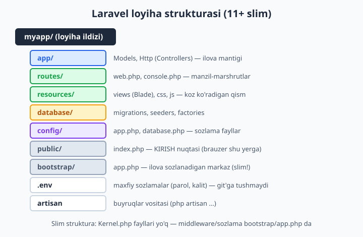
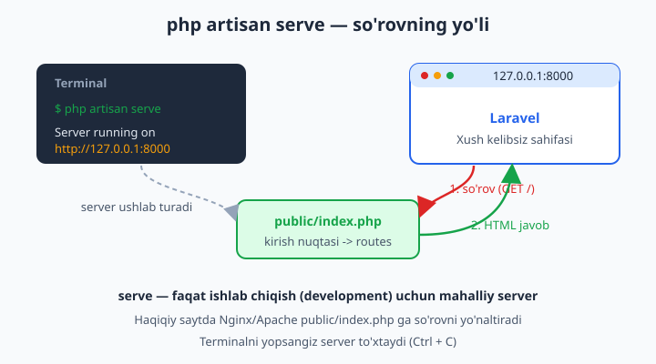
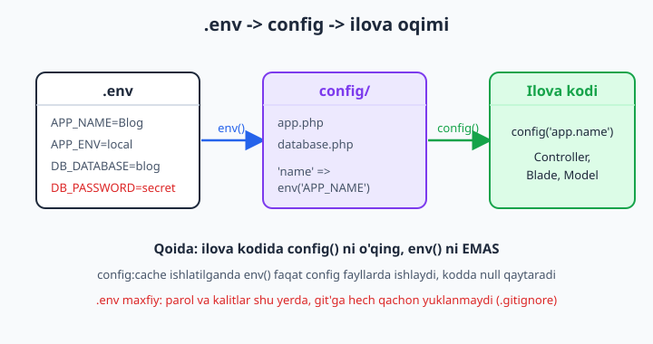

# 2 — O'rnatish va muhit

[⬅️ Oldingi: 01 — Laravel nima va nega kerak?](./01-laravel-nima.md) · [🏠 README](./README.md) · [Keyingi: 03 — Routing — marshrutlash ➡️](./03-routing.md)

> **Bu bobda:** Laravel bilan ishlash uchun kerakli muhitni — PHP 8.4, Composer va bazani tayyorlaymiz; loyihani ikki xil yo'l bilan yaratamiz (`composer create-project` va `laravel new`); `php artisan serve` bilan ishga tushiramiz; slim (11+) loyiha strukturasini papka-papka aylanib chiqamiz; `.env` fayli, `APP_KEY` va sozlamalarning `.env -> config -> ilova` oqimini tushunamiz; `artisan` buyruqlar vositasi bilan tanishamiz va birinchi sahifani o'z qo'limiz bilan o'zgartiramiz.

---

## Muammo

1-bobda Laravel nima ekanini va nega kerakligini bildik. Endi tabiiy savol tug'iladi: **"Yaxshi, qayerdan boshlayman? Qaysi tugmani bosaman?"**

Sof PHP'da hammasi oddiy edi: bitta `index.php` yaratasiz, brauzerda ochasiz — tamom. Laravel'da esa bitta fayl emas, **butun bir tizim** — yuzlab fayl, papkalar, sozlamalar bir-biriga bog'langan. Bu ko'pchilikni qo'rqitadi: "Bu murakkab loyihani qanday o'rnataman? Kompyuterimga nima kerak? Qaysi papka nima uchun?"

Yaxshi xabar: Laravel'ni o'rnatish bitta buyruq. Yomon "xabar" yo'q — sizga faqat uchta narsa kerak: **PHP**, **Composer** (PHP paketlar menejeri — `npm`ning PHP'dagi ukasi) va **baza** (MySQL yoki hatto fayl ko'rinishidagi SQLite). Shu uchtasi tayyor bo'lsa, bitta buyruq yozasiz va ishlaydigan loyiha qo'lingizda paydo bo'ladi.

Bu bobda muhitni nol'dan tayyorlaymiz, loyihani yaratamiz va uning ichini ochib, "qaysi papka nima qiladi"ni tinch ko'ngil bilan o'rganamiz. Bob oxirida sizda ishlaydigan Laravel sayti va uni o'zgartirishga ishonchli qo'l bo'ladi.

## Kerakli vositalar

Laravel 13 (2026) zamonaviy PHP'ga tayanadi. Loyiha boshlashdan oldin uchta narsa kerak:

| Vosita | Nima uchun | Versiya |
|---|---|---|
| **PHP** | Laravel'ning o'zi PHP'da yozilgan | 8.2+ (tavsiya: **8.4**) |
| **Composer** | Laravel va paketlarni yuklab beradi | 2.x |
| **Baza** | Ma'lumot saqlash uchun | MySQL / MariaDB / **SQLite** / PostgreSQL |

Avval ular o'rnatilganini tekshiramiz. Terminal (Windows'da PowerShell yoki Terminal) oching va yozing:

```bash
php --version
composer --version
```

Natija taxminan shunday bo'lishi kerak:

```text
PHP 8.4.0 (cli) (built: ...)
Composer version 2.9.3 ...
```

📌 Agar `php` yoki `composer` "topilmadi" (`command not found`) desa — ular o'rnatilmagan yoki `PATH`ga qo'shilmagan. Eng oson yechim — pastdagi **Laravel Herd** (u PHP'ni ham, Composer'ni ham o'zi bilan olib keladi). PHP'ning o'zini alohida o'rnatish kerak bo'lsa, [PHP kitobidagi o'rnatish bobiga](../php/README.md) qarang — bu yerda PHP asoslarini takrorlamaymiz.

💡 Versiya raqamlari aniq bir xil bo'lishi shart emas. Muhimi: PHP 8.2 dan yuqori, Composer 2.x bo'lsin. Laravel 13 PHP 8.2 ni minimum talab qiladi, lekin 8.4 da eng yangi imkoniyatlardan foydalanasiz.

### Baza haqida: SQLite — eng oson boshlanish

Boshlovchilar ko'pincha "MySQL o'rnatish"da qoqiladi. Yaxshi xabar: Laravel 11+ da **yangi loyiha default'da SQLite ishlatadi**. SQLite — bu alohida server emas, oddiy bitta fayl (`database/database.sqlite`). Hech narsa o'rnatmasangiz ham loyiha ishlayveradi. MySQL'ni keyinroq, 7-bobda baza bilan jiddiy ishlay boshlaganda ulaymiz.

## Lokal muhit variantlari

PHP'ni "qo'lda" o'rnatish o'rniga, hammasini bitta paketda beradigan tayyor vositalar bor. Tanlovni soddalashtiramiz:

| Variant | Kim uchun | Platforma | Izoh |
|---|---|---|---|
| **Laravel Herd** | Boshlovchilar (tavsiya) | Windows, macOS | PHP + Composer + serverni bir bosishda beradi, bepul |
| **Laravel Sail** | Docker yoqtirganlar | Hamma (Docker kerak) | Konteynerlarda izolyatsiya, jamoa uchun bir xil muhit |
| **Laravel Valet** | macOS dasturchilari | faqat macOS | Yengil, tezkor, lekin Mac'ga bog'liq |

💡 **Tavsiya:** Windows yoki Mac'da yangi boshlayotgan bo'lsangiz — **Herd**'ni oling. [herd.laravel.com](https://herd.laravel.com) dan yuklab, o'rnatasiz: u PHP, Composer va `laravel` buyrug'ini avtomatik sozlaydi. Keyin pastdagi buyruqlar darrov ishlaydi.

📌 **Sail** — Docker konteynerida ishlaydi. Uning afzalligi: jamoadagi har bir dasturchida **bir xil** PHP/MySQL versiyasi bo'ladi ("mening kompyuterimda ishlaydi" muammosi yo'qoladi). Lekin Docker'ni bilish kerak — boshlovchi uchun biroz ortiqcha. `laravel new myapp` paytida Sail'ni tanlash mumkin, yoki mavjud loyihaga `php artisan sail:install` bilan qo'shasiz.

📌 **Valet** faqat macOS'da ishlaydi. Engil va tez, lekin Windows foydalanuvchilari uchun emas.



## Loyihani yaratish

Muhit tayyor. Endi ikkita yo'l bor — ikkalasi ham bir xil natija beradi.

### 1-yo'l: `laravel new` (eng qulay)

Herd o'rnatsangiz yoki global Laravel installer'ingiz bo'lsa:

```bash
laravel new blog
```

Bu interaktiv: starter kit kerakmi (auth bilan), qaysi test framework (Pest/PHPUnit), qaysi baza — so'raydi. Boshlash uchun hammasi default ("none" / "SQLite" / "Pest") bo'laversin — keyin istalganini qo'shamiz.

Agar installer bo'lmasa, uni bir marta o'rnatib qo'yasiz:

```bash
composer global require laravel/installer
```

### 2-yo'l: `composer create-project` (har doim ishlaydi)

Faqat Composer bo'lsa kifoya — qo'shimcha hech narsa kerak emas:

```bash
composer create-project laravel/laravel blog
```

Bu buyruq `blog` nomli papka yaratadi, Laravel'ning eng so'nggi barqaror versiyasini yuklaydi, kerakli paketlarni o'rnatadi va `APP_KEY`ni ham avtomatik generatsiya qiladi.

📌 `blog` — bu siz tanlagan papka nomi. Xohlagan nomni qo'ying: `dukon`, `maktab`, `mening-saytim`. Papka bo'sh joysiz, kichik harflarda bo'lgani ma'qul.

💡 Ikkala yo'l ham ortda bir xil ishni qiladi: Composer Laravel'ning "skeletini" (`laravel/laravel`) yuklaydi va `composer install` bilan barcha bog'liqliklarni `vendor/` papkasiga tushiradi. `laravel new` shunchaki ustiga qulayroq interfeys qo'yadi.

O'rnatish tugagach, loyiha papkasiga kiramiz:

```bash
cd blog
```

## Serverni ishga tushirish

Loyiha tayyor. Endi uni brauzerda ko'ramiz. Laravel ishlab chiqish (development) uchun ichki serverni o'zi bilan olib keladi:

```bash
php artisan serve
```

Natija:

```text
   INFO  Server running on [http://127.0.0.1:8000].

  Press Ctrl+C to stop the server
```

Endi brauzerda **http://127.0.0.1:8000** ni oching — Laravel'ning chiroyli "xush kelibsiz" sahifasini ko'rasiz. Tabriklayman, sizning birinchi Laravel saytingiz ishlamoqda!



📌 **Bu nima bo'ldi?** `serve` mahalliy (faqat sizning kompyuteringizda ko'rinadigan) kichik server ishga tushiradi. Brauzer `127.0.0.1:8000` ga so'rov yuboradi, so'rov `public/index.php` ga tushadi — bu Laravel'ning **yagona kirish nuqtasi**. Index.php Laravel'ni "uyg'otadi", so'rovni `routes/web.php` ga uzatadi va javobni qaytaradi.

📌 Terminalni yopsangiz yoki **Ctrl + C** bossangiz — server to'xtaydi va sayt ochilmay qoladi. Ishlash davomida serverni ishlab turishi kerak. Yangi buyruq yozish uchun **ikkinchi** terminal oynasini oching.

💡 **Herd** ishlatsangiz, `serve` ham shart emas: Herd loyihangizni avtomatik `https://blog.test` kabi manzilda ko'rsatadi. Lekin `php artisan serve` hamma joyda, har qanday sozlamada ishlaydi — shuning uchun kitobda asosan shuni ishlatamiz.

❌ "127.0.0.1:8000 javob bermayapti" — ehtimol server ishga tushmagan (terminalga qarang) yoki 8000-port band. Boshqa portda ishga tushiring:

```bash
php artisan serve --port=8080
```

## Loyiha strukturasi (slim 11+)

Endi loyihaning ichini ochamiz. Laravel 11+ da struktura ataylab **soddalashtirilgan** (slim): eski versiyalardagi ko'plab "qoziq" fayllar (mas. `app/Http/Kernel.php`, `app/Console/Kernel.php`) olib tashlangan. Bu boshlovchi uchun ayni muddao — chalg'ituvchi fayllar kamaygan.

Asosiy papka va fayllar, vazifasi bilan:

| Joy | Nima uchun |
|---|---|
| `app/` | Ilovangiz mantig'i: `app/Models/` (Eloquent modellar), `app/Http/Controllers/` (kontrollerlar) |
| `routes/` | Manzil-marshrutlar: `web.php` (sahifalar), `console.php` (artisan buyruqlar, scheduling) |
| `resources/` | Foydalanuvchi ko'radigan qism: `views/` (Blade shablonlar), `css/`, `js/` |
| `database/` | `migrations/` (jadval tuzilmalari), `seeders/`, `factories/` |
| `config/` | Sozlama fayllar: `app.php`, `database.php`, `mail.php` va h.k. |
| `public/` | Brauzer ko'radigan yagona papka. `index.php` — kirish nuqtasi |
| `bootstrap/` | `app.php` — ilova sozlanadigan markaz (routing, middleware, exceptions) |
| `storage/` | Yuklangan fayllar, log'lar, kesh, kompilyatsiya qilingan Blade |
| `tests/` | Avtomatik testlar (Pest/PHPUnit) |
| `vendor/` | Composer yuklab beradigan paketlar (Laravel'ning o'zi shu yerda). Git'ga tushmaydi |
| `.env` | Maxfiy sozlamalar (parol, kalit). Git'ga tushmaydi |
| `artisan` | Buyruqlar vositasi: `php artisan ...` |
| `composer.json` | Loyiha bog'liqliklari ro'yxati |

📌 **Eng muhim qoida — `public/`:** brauzer faqat shu papkaga kira oladi. Qolgan hamma narsa (`.env`, `config/`, `app/`) tashqaridan **ko'rinmaydi**. Shuning uchun parollaringiz `.env`da xavfsiz turadi. Sof PHP'da hamma fayl ochiq turardi — bu yerda xavfsizlik tuzilmaga "tikilgan".

📌 **Slim struktura izohi:** Laravel 8 va eski qo'llanmalarda `app/Http/Kernel.php` da middleware ro'yxatga olinardi. **Laravel 11+ da bu fayl yo'q** — uning o'rniga hammasi `bootstrap/app.php` da. Agar internetda `Kernel.php` haqida o'qisangiz — bu eskirgan ma'lumot, bizning versiyada boshqacha. Middleware'ni 15-bobda shu yerda sozlaymiz.

`bootstrap/app.php` ana shunday ko'rinadi — ilovaning "boshqaruv markazi":

```php
<?php

use Illuminate\Foundation\Application;
use Illuminate\Foundation\Configuration\Exceptions;
use Illuminate\Foundation\Configuration\Middleware;

return Application::configure(basePath: dirname(__DIR__))
    ->withRouting(
        web: __DIR__.'/../routes/web.php',
        commands: __DIR__.'/../routes/console.php',
        health: '/up',
    )
    ->withMiddleware(function (Middleware $middleware) {
        // Bu yerda middleware sozlanadi (15-bob)
    })
    ->withExceptions(function (Exceptions $exceptions) {
        // Bu yerda xatolarni qayta ishlash sozlanadi
    })->create();
```

Hozircha bu kodni o'zgartirmaymiz — faqat "marshrutlar shu yerda ro'yxatga olinadi, middleware shu yerda qo'shiladi" deb eslab qo'ying.

## `.env` fayli va sozlamalar oqimi

Endi loyihaning eng muhim faylidan biri — `.env` ("environment", muhit) bilan tanishamiz. Bu fayl loyiha **ildizida** turadi va unda maxfiy, kompyuterga bog'liq sozlamalar saqlanadi:

```env
APP_NAME=Laravel
APP_ENV=local
APP_KEY=base64:xxxxxxxxxxxxxxxxxxxxxxxxxxxxxxxxxxxxxxxxxxx=
APP_DEBUG=true
APP_URL=http://localhost

DB_CONNECTION=sqlite

MAIL_MAILER=log
```

Har bir qator — `KALIT=qiymat`. Keling, muhimlarini ko'rib chiqamiz:

- **`APP_NAME`** — ilovangiz nomi (sayt sarlavhasi, email'larda ishlatiladi).
- **`APP_ENV`** — muhit: `local` (kompyuteringizda), `production` (haqiqiy serverda).
- **`APP_KEY`** — shifrlash kaliti (pastda batafsil).
- **`APP_DEBUG`** — `true` bo'lsa, xatolar to'liq ko'rsatiladi (ishlab chiqishda qulay). Haqiqiy saytda **doim `false`** — aks holda xato sahifalarida maxfiy ma'lumot ko'rinib qoladi.
- **`DB_CONNECTION`** — qaysi baza (`sqlite`, `mysql`, ...).

📌 **Nega `.env` alohida fayl?** Chunki bu sozlamalar har kompyuterda **boshqacha**: sizning MySQL parolingiz boshqa, serverniki boshqa. Kodni o'zgartirmasdan sozlamalarni almashtirish uchun ular `.env`ga ajratilgan. Shuning uchun `.env` **git'ga yuklanmaydi** (`.gitignore`da). Buning o'rniga `.env.example` — parolsiz namuna fayl — git'da turadi, jamoadagilar undan nusxa olib o'z `.env`larini to'ldiradi.

❌ Parolingizni to'g'ridan-to'g'ri kodga yozmang: `$parol = "secret123";` — bu git'ga tushib, hammaga ochiq bo'lib qoladi.
✅ `.env`ga yozing: `DB_PASSWORD=secret123` — bu fayl maxfiy qoladi.

### `.env -> config -> ilova` oqimi

Endi muhim tushuncha: kodingizda `.env`ni **to'g'ridan-to'g'ri o'qimaysiz**. O'rtada `config/` papkasi turadi. Oqim shunday:

1. `.env` da xom qiymat turadi: `APP_NAME=Blog`.
2. `config/app.php` uni `env()` orqali o'qiydi: `'name' => env('APP_NAME', 'Laravel')`.
3. Ilova kodida esa siz `config()` ni o'qiysiz: `config('app.name')`.



`config/app.php` taxminan shunday ko'rinadi (qisqartirilgan):

```php
<?php

return [
    'name' => env('APP_NAME', 'Laravel'),
    'env' => env('APP_ENV', 'production'),
    'debug' => (bool) env('APP_DEBUG', false),
    'url' => env('APP_URL', 'http://localhost'),
    'timezone' => 'UTC',
    'locale' => env('APP_LOCALE', 'en'),
];
```

`env('APP_NAME', 'Laravel')` ni shunday o'qing: "`.env`dan `APP_NAME`ni ol; agar yo'q bo'lsa, `Laravel`ni ishlat" — ikkinchi argument **standart qiymat** (PHP'dagi `$massiv[$kalit] ?? $default` qolipi bilan bir xil mantiq).

📌 **Oltin qoida:** ilova kodingizda (controller, model, Blade) **doim `config()`** ni chaqiring, **`env()` ni emas**. Sababi: `php artisan config:cache` ishlatilganda Laravel barcha `config` fayllarni bitta keshga "muzlatib" qo'yadi — shundan keyin kod ichidagi `env()` chaqiruvlari `null` qaytaradi. `config()` esa har doim ishlaydi. `env()` faqat `config/` fayllari ichida o'rinli.

💡 Sozlamani test qilish uchun `php artisan tinker` (interaktiv konsol) ochib ko'rishingiz mumkin:

```bash
php artisan tinker
```

So'ng:

```php
config('app.name');   // "Blog" qaytaradi
config('app.timezone'); // "UTC"
```

Tinker — Laravel ichida jonli PHP yozish imkonini beradi. Uni 11-bobda batafsil ishlatamiz.

### `APP_KEY` — shifrlash kaliti

`.env`dagi `APP_KEY` — Laravel sessiyalar, cookie'lar va shifrlangan ma'lumotni himoyalash uchun ishlatadigan maxfiy kalit. `composer create-project` va `laravel new` uni avtomatik yaratib beradi. Agar bo'sh bo'lsa (mas. git'dan klonlangan loyihada), o'zingiz generatsiya qilasiz:

```bash
php artisan key:generate
```

Bu `.env`dagi `APP_KEY` qatorini to'ldiradi: `APP_KEY=base64:...`.

❌ `APP_KEY` bo'sh bo'lsa, ishga tushganda shunday xato chiqadi:

```text
Illuminate\Encryption\MissingAppKeyException
No application encryption key has been specified.
```

✅ Yechim: `php artisan key:generate` ishlating — xato yo'qoladi.

📌 Har loyihada `APP_KEY` **noyob** bo'lishi kerak va uni hech kimga bermang. Bu xuddi uyingiz kaliti: ochiq qoldirsangiz, kimdir sessiyalaringizni "ochib" qo'yishi mumkin.

## `artisan` bilan tanishuv

`artisan` — Laravel'ning buyruq qatori yordamchisi (CLI). U routing'dan tortib jadval yaratishgacha hamma ishni terminaldan bajarib beradi. `php artisan serve` va `php artisan key:generate`ni allaqachon ishlatdik. Endi to'liq ro'yxatni ko'ramiz:

```bash
php artisan list
```

Bu mavjud barcha buyruqlarni guruhlab ko'rsatadi. Eng ko'p ishlatadiganlaringiz:

```bash
php artisan serve              # mahalliy serverni ishga tushirish
php artisan key:generate       # APP_KEY yaratish
php artisan make:controller    # yangi controller fayli yaratish
php artisan make:model         # yangi model yaratish
php artisan migrate            # baza jadvallarini yaratish
php artisan route:list         # barcha marshrutlarni ko'rish
php artisan tinker             # interaktiv PHP konsoli
```

Biror buyruq nima qilishini bilmasangiz, `--help` qo'shing:

```bash
php artisan make:controller --help
```

📌 Diqqat: `make:` bilan boshlanadigan buyruqlar **fayl yaratib beradi** ("scaffolding"). Masalan, `php artisan make:controller SalomController` — `app/Http/Controllers/SalomController.php` faylini tayyor shablon bilan yaratadi. Bularni 4-bobdan boshlab faol ishlatamiz.

💡 **API loyihalar uchun:** Laravel 11+ da yangi loyihada `routes/api.php` default'da **yo'q**. API kerak bo'lsa, bitta buyruq bilan qo'shasiz (u Sanctum'ni ham olib keladi):

```bash
php artisan install:api
```

Buni 17-bobda RESTful API yozganda ishlatamiz — hozircha shunday buyruq borligini bilib qo'ying.

## Composer bilan paket o'rnatish

Laravel'ning kuchi — uning paketlar ekotizimida. Yangi imkoniyat kerakmi? Ko'pincha kimdir uni paket qilib yozib qo'ygan. Paketni o'rnatish — bitta buyruq:

```bash
composer require nom/paket
```

Bu paketni `vendor/` papkasiga yuklaydi va `composer.json`ga qo'shadi. Masalan, kodingizni avtomatik tartiblaydigan Laravel Pint allaqachon yangi loyiha bilan keladi, lekin qo'lda o'rnatish ham shunday:

```bash
composer require laravel/pint --dev
```

📌 `--dev` — "faqat ishlab chiqishda kerak, haqiqiy saytda emas" degani. Test va kod sifati vositalari odatda `--dev` bilan o'rnatiladi. Ular `composer.json`ning `require-dev` bo'limiga tushadi.

📌 `composer.json` — bu loyihaning "ingredientlar ro'yxati". Loyihani boshqa kompyuterga ko'chirganingizda `vendor/`ni nusxalamaysiz — shunchaki `composer install` yozasiz, Composer `composer.json`ga qarab hamma paketni qaytadan yuklab beradi. Shuning uchun `vendor/` git'ga tushmaydi.

💡 Paketlarni [packagist.org](https://packagist.org) dan qidirasiz — bu Composer paketlarining markaziy ombori (`npm`dagi npmjs.com kabi).

## Birinchi o'zgartirish

Nazariya yetarli — endi loyihani o'zgartiramiz. Maqsad: bosh sahifani o'zgartirib, Laravel'ning ishlashini "his qilish".

`routes/web.php` faylini oching. Hozir u shunday ko'rinadi:

```php
<?php

use Illuminate\Support\Facades\Route;

Route::get('/', function () {
    return view('welcome');
});
```

Bu shunday o'qiladi: "kimdir bosh sahifaga (`/`) **GET** so'rov yuborsa, `welcome` Blade shablonini qaytar". Keling, birinchi o'zgartirishni qilamiz — bosh sahifa shunchaki matn qaytarsin. `welcome`ni o'chirib, oddiy satr qaytaramiz:

```php
Route::get('/', function () {
    return 'Salom, dunyo! Bu mening birinchi Laravel saytim.';
});
```

Faylni saqlang va brauzerni yangilang (server ishlab turgan bo'lsa, qo'shimcha hech narsa qilish shart emas — Laravel o'zgarishni darrov ko'radi). Sahifada matningiz chiqadi!

Endi ikkinchi marshrut qo'shamiz — manzilning bir qismini o'zgaruvchi qilib:

```php
<?php

use Illuminate\Support\Facades\Route;

Route::get('/', function () {
    return 'Salom, dunyo! Bu mening birinchi Laravel saytim.';
});

Route::get('/salom/{ism}', function (string $ism) {
    return "Assalomu alaykum, {$ism}!";
});
```

Endi brauzerda **http://127.0.0.1:8000/salom/Oqil** ni oching — "Assalomu alaykum, Oqil!" chiqadi. Manzildagi `{ism}` qismini funksiya argumenti sifatida oldik. Bu marshrutlashning kuchi — keyingi 3-bobda buni chuqur o'rganamiz.

📌 `view('welcome')` — `resources/views/welcome.blade.php` faylini ko'rsatadi. O'sha faylni ochib, ichidagi HTML'ni ham bemalol o'zgartirib ko'ring (mas. `<title>`ni o'zgartiring). Blade shablonlarini 5-bobda batafsil o'rganamiz.

💡 Tabriklayman! Siz endi: muhitni tayyorladingiz, loyiha yaratdingiz, serverni ishga tushirdingiz, strukturani o'rgandingiz, `.env`ni tushundingiz va birinchi marshrutni o'z qo'lingiz bilan yozdingiz. Keyingi bobda marshrutlash (routing) — Laravel'ning yuragi — bilan jiddiy tanishamiz.

## 2-bob mashqlari

Quyidagi mashqlarni o'zingiz bajaring — yechim berilmagan. Har birini kompyuteringizda sinab ko'ring.

1. Terminalda `php --version` va `composer --version` ni ishga tushiring. Versiyalaringizni daftaringizga yozib qo'ying.
2. `composer create-project laravel/laravel mashq-app` buyrug'i bilan `mashq-app` nomli yangi loyiha yarating.
3. Loyiha papkasiga kiring (`cd mashq-app`) va `php artisan serve` bilan ishga tushiring. Brauzerda xush kelibsiz sahifasini oching.
4. Serverni `--port=9000` bilan boshqa portda ishga tushiring va brauzerda `127.0.0.1:9000` ni oching.
5. Serverni **Ctrl + C** bilan to'xtating va brauzerda yangilab, sahifa endi ochilmasligini kuzating. So'ng qayta ishga tushiring.
6. Loyiha ildizidagi `.env` faylini oching. `APP_NAME` qiymatini o'z ismingizga o'zgartiring va saqlang.
7. `.env`dagi `APP_KEY` qatoriga qarang. So'ng `php artisan key:generate` ishlating va kalit o'zgarganini tekshiring.
8. `.env`da `APP_DEBUG=true` ni `false` ga o'zgartiring. `routes/web.php` ichida ataylab xato yozib (mas. `return $yoqfunksiya();`) brauzerda xato sahifasi qanday ko'rinishini taqqoslang (keyin `true`ga qaytaring).
9. `php artisan list` ishlating va chiqqan buyruqlardan kamida 5 tasini daftaringizga ko'chiring.
10. `php artisan route:list` ishlating va loyihada qanday marshrutlar borligini ko'ring.
11. `php artisan serve --help` ishlating va `serve` qanday qo'shimcha sozlamalarni qabul qilishini o'qing.
12. Loyihadagi quyidagi papkalarni oching va ichidagini ko'ring: `app/`, `routes/`, `resources/views/`, `config/`, `database/`. Har biri nima saqlashini bir jumla bilan yozing.
13. `config/app.php` faylini oching. `'timezone'` qatorini toping va uni `'Asia/Tashkent'` ga o'zgartiring.
14. `php artisan tinker` oching va `config('app.name')` hamda `config('app.timezone')` ni chaqiring. `.env`da o'zgartirgan qiymatlaringiz aks etganini tekshiring.
15. `routes/web.php` da bosh sahifani (`/`) o'z ismingizni qaytaradigan oddiy matnga o'zgartiring.
16. `routes/web.php` ga `/bugun` nomli yangi marshrut qo'shing — u joriy sanani qaytarsin (PHP'ning `date()` funksiyasidan foydalaning).
17. `routes/web.php` ga `/qosh/{a}/{b}` marshrutini qo'shing — u ikki sonni qo'shib natijani qaytarsin (`http://127.0.0.1:8000/qosh/3/5` → `8`).
18. `resources/views/welcome.blade.php` faylini oching, `<title>` tegini o'z saytingiz nomiga o'zgartiring va brauzer yorlig'ida (tab) o'zgarishni ko'ring.
19. `composer.json` faylini oching va `require` bo'limida qanday paketlar borligini ko'ring. `laravel/framework` versiyasini toping.
20. Laravel Herd va Laravel Sail haqida [laravel.com](https://laravel.com) hujjatlarini o'qing va o'zingizning ish muhitingiz uchun qaysi biri qulayroq ekanini, kamida 3 sabab bilan, daftaringizga yozing.
