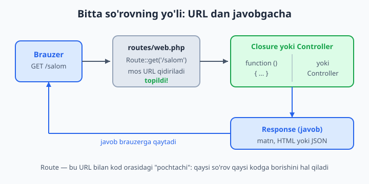
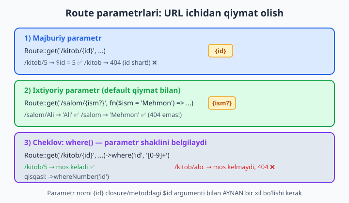
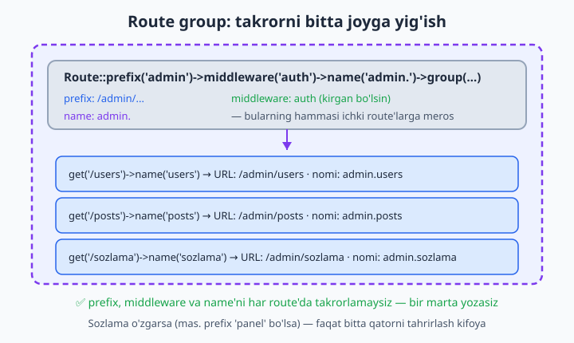

# 3 — Routing — marshrutlash

[⬅️ Oldingi: 02 — O'rnatish va muhit](./02-ornatish-muhit.md) · [🏠 README](./README.md) · [Keyingi: 04 — Controllers (kontrollerlar) ➡️](./04-controllers.md)

> **Bu bobda:** brauzerda yozilgan URL qanday qilib bizning kodimizga "ulanishini" o'rganamiz. `routes/web.php` faylini, `Route::get/post/put/patch/delete` metodlarini, closure va controller farqini, URL ichidan qiymat oladigan parametrlar (`{id}`, ixtiyoriy `{id?}`, `where` cheklovlari)ni, route'ga nom berish (`->name()`) va `route()` helper bilan URL qurish, takrorni yo'qotadigan route guruhlari (prefix, middleware, name), `api.php` ga qisqa kirish, `Route::view`/`Route::redirect`, `route:list` buyrug'i va `fallback`ni ko'rib chiqamiz.

---

## Muammo

Sof PHP'da sayt yasaganingizni eslang. Sizda `index.php`, `about.php`, `kitob.php` kabi fayllar bor edi — har bir URL aslida diskdagi alohida fayl edi. Foydalanuvchi `kitob.php?id=5` deb yozardi, siz esa `$_GET['id']` orqali raqamni ushlab olardingiz. Ishlardi, lekin tez orada chigallasha boshlaydi:

- "Chiroyli" URL (`/kitob/5`) qilish uchun `.htaccess` va `mod_rewrite` bilan kurashishga to'g'ri kelardi.
- Bitta URL'ga ikki xil amal — `GET`'da forma ko'rsatish, `POST`'da uni qabul qilish — kerak bo'lsa, fayl ichi `if ($_SERVER['REQUEST_METHOD'] === 'POST')` shartlari bilan to'lib ketardi.
- Saytdagi hamma manzil qayerda turganini bilish uchun butun papkani ochib ko'rish kerak edi — yagona "manzillar ro'yxati" yo'q edi.

Laravel bu muammoni **routing** (marshrutlash) bilan hal qiladi. G'oya oddiy: barcha URL'lar bitta ro'yxatda — `routes/web.php` faylida — yoziladi. Har bir qator "shu URL kelganda, mana shu kodni ishga tushir" deydi. URL'lar endi fayllar emas, balki **qoidalar**. Mana eng birinchi route:

```php
use Illuminate\Support\Facades\Route;

Route::get('/salom', function () {
    return 'Assalomu alaykum, dunyo!';
});
```

O'qilishi: "kimdir `/salom` manziliga `GET` so'rovi yuborsa, mana bu funksiyani ishga tushir va uning natijasini brauzerga qaytar". Brauzerda `http://localhost:8000/salom` ni ochsangiz — `Assalomu alaykum, dunyo!` chiqadi. `.htaccess` yo'q, `?id=` yo'q, alohida fayl yo'q. Bitta qator.



📌 `route` so'zini "marshrut" yoki "yo'l" deb tushuning: u kelgan so'rovni to'g'ri kodga olib boradigan ko'rsatkich. Biz bu bobda ko'p marta "route yozish" deymiz — bu "URL bilan kod orasiga bog'lanish qoidasini qo'shish" degani.

## `routes/web.php` — saytning manzillar ro'yxati

O'rnatishdan keyin loyihada `routes/` papkasi bor. Bizni hozir eng ko'p qiziqtiradigani — `web.php`. Bu faylga yozilgan har bir route brauzer orqali ochiladigan oddiy veb-sahifaga aylanadi. Fayl boshida `Route` fasadi (Laravel'ning "qisqa yo'l" sinflari) import qilingan bo'ladi:

```php
<?php

use Illuminate\Support\Facades\Route;

Route::get('/', function () {
    return view('welcome');
});

Route::get('/salom', function () {
    return 'Assalomu alaykum, dunyo!';
});

Route::get('/vaqt', function () {
    return 'Hozir soat: ' . date('H:i');
});
```

Birinchi route — `/` (bosh sahifa). Qolganlari — qo'shgan sahifalarimiz. Faylni saqlashning o'zi kifoya: Laravel'ni qayta ishga tushirish shart emas, brauzerni yangilasangiz bo'ldi.

💡 Saytni ishga tushirish uchun loyiha papkasida `php artisan serve` buyrug'ini bering — u `http://localhost:8000` da serverni ko'taradi. Bu kichik bo'lim davomida shu server ochiq tursin.

📌 Bu yerda `view('welcome')` — `resources/views/welcome.blade.php` shablonini ko'rsatadi. Blade shablonlarini 5-bobda batafsil o'rganamiz; hozircha "route view ham qaytara oladi" degan g'oya yetarli.

## HTTP "fe'llari": get, post, put, patch, delete

`Route::get(...)` dagi `get` — bu **HTTP metodi** (yoki "fe'l"). Brauzer manzilni oddiy ochganda har doim `GET` so'rovi yuboradi — "menga shu sahifani ko'rsat". Lekin forma to'ldirilganda yoki API chaqirilganda boshqa metodlar ishlatiladi. Laravel ularning hammasini qo'llab-quvvatlaydi:

```php
Route::get('/maqolalar', fn () => 'royxat');                 // ro'yxatni ko'rsat
Route::post('/maqolalar', fn () => 'yangi qoshildi');        // yangi yaratish
Route::put('/maqolalar/{id}', fn ($id) => "ID {$id} toliq yangilandi");
Route::patch('/maqolalar/{id}', fn ($id) => "ID {$id} qisman yangilandi");
Route::delete('/maqolalar/{id}', fn ($id) => "ID {$id} ochirildi");
```

Har biri nima uchun kerakligini "do'kon" mantiqi bilan eslab qolish oson:

| Metod | Maqsad | Misol |
|---|---|---|
| `GET` | ma'lumotni **olish/ko'rish** | mahsulotlar ro'yxati |
| `POST` | yangi narsa **yaratish** | yangi mahsulot qo'shish |
| `PUT` | mavjudini **to'liq** almashtirish | mahsulotning hamma maydonini yangilash |
| `PATCH` | mavjudini **qisman** o'zgartirish | faqat narxini yangilash |
| `DELETE` | **o'chirish** | mahsulotni o'chirish |

📌 Diqqat: bitta URL (`/maqolalar`) ikki xil route'da turibdi — biri `GET`, biri `POST`. Bu xato emas, balki odatiy hol! Laravel URL **va** metodning ikkalasiga qarab mos route'ni tanlaydi. Sof PHP'dagi `if (REQUEST_METHOD === 'POST')` shartlari endi keraksiz.

📌 Brauzerning manzil qatori faqat `GET` yubora oladi. `POST/PUT/PATCH/DELETE`'ni sinash uchun HTML forma, JavaScript `fetch`, yoki Postman kabi vositadan foydalanasiz. Buni 6-bobda (Request va Response) batafsil ko'ramiz.

💡 Bir xil URL bir nechta metodga ishlasin desangiz, `Route::match(['get', 'post'], '/aloqa', ...)` yozish mumkin. Hamma metodga javob bersin desangiz — `Route::any('/hamma', ...)`. Lekin amalda aniq metodlarni alohida yozish tozaroq va xavfsizroq.

## Closure va controller — kod qayerda turadi?

Yuqorida route'ning ikkinchi argumenti sifatida **closure** (nomsiz funksiya) berdik. Bu o'rganish va kichik sahifalar uchun juda qulay. Lekin sayt o'sgani sayin closure'lar `web.php`ni shishirib yuboradi va kodni qayta ishlatib bo'lmaydi. Shu sababli "asl" Laravel uslubi — logikani **controller** (kontroller — so'rovlarni boshqaruvchi sinf) ichiga ko'chirish:

```php
// ❌ Tez, lekin o'sib boradigan loyihada chalkash:
Route::get('/kitoblar', function () {
    // o'nlab qator logika to'g'ridan-to'g'ri shu yerda...
    return view('kitoblar.index');
});

// ✅ Tartibli: logika controllerda, route faqat "ulagich":
Route::get('/kitoblar', [App\Http\Controllers\KitobController::class, 'index']);
```

Ikkinchi shaklda route ikkinchi argument o'rniga `[Sinf::class, 'metodNomi']` massivini oladi: "shu URL kelsa, `KitobController`ning `index` metodini chaqir". Controllerlarni 4-bobda to'liq yaratamiz va o'rganamiz. Bu bobda esa muhim qoidani yodda tuting:

📌 **Closure** — kichik, bir martalik sahifalar uchun (mas. statik "Biz haqimizda"). **Controller** — bir-biriga bog'liq bir nechta sahifa va jiddiy logika uchun. Ikkalasi ham bir xil ishlaydi — farqi faqat kod qayerda yashashida.

💡 Faylning yuqorisida `use App\Http\Controllers\KitobController;` yozsangiz, route ichida uzun yo'l o'rniga qisqa `[KitobController::class, 'index']` deb yozasiz. Bu odatiy uslub.

## Route parametrlari — URL ichidan qiymat olish

Real saytda `/kitob/1`, `/kitob/2`, `/kitob/999` — minglab kitob bor, lekin har biri uchun alohida route yozmaymiz. Buning o'rniga URL'ning bir qismini **parametr** qilib qoldiramiz — jingalak qavs `{...}` ichiga olamiz:

```php
Route::get('/kitob/{id}', function (string $id) {
    return "Siz {$id}-raqamli kitobni so'radingiz";
});
```

Endi `/kitob/5` ham, `/kitob/42` ham shu route'ga tushadi. URL'dagi qiymat closure'ning `$id` argumentiga avtomatik uzatiladi. Sof PHP'dagi `$_GET['id']` ning o'rnini bu egalladi — ancha toza-ku?

📌 **Eng muhim qoida:** jingalak qavs ichidagi nom (`{id}`) funksiya argumentining nomi (`$id`) bilan **aynan bir xil** bo'lishi shart. `{id}` yozib `$kitobId` qabul qilsangiz — ishlamaydi. Bir nechta parametr bo'lsa, ular URL'da qaysi tartibda yozilgan bo'lsa, argumentlar ham shu tartibda bo'ladi:

```php
Route::get('/post/{post}/izoh/{izoh}', function (string $post, string $izoh) {
    return "Post {$post}, izoh {$izoh}";
});
// /post/7/izoh/3  =>  Post 7, izoh 3
```



### Parametrga cheklov: `where`

Yuqoridagi `{id}` istalgan narsani qabul qiladi: `/kitob/5` ham, `/kitob/abc` ham. Lekin kitob raqami faqat son bo'lishi kerak. Parametr **shaklini** cheklash uchun `->where(...)` ulanadi — u oddiy ifoda (regular expression, "regex" — matn shabloni) qabul qiladi:

```php
Route::get('/kitob/{id}', function (string $id) {
    return "Kitob raqami: {$id}";
})->where('id', '[0-9]+');     // faqat raqamlardan iborat bo'lsin
```

Endi `/kitob/5` ishlaydi, lekin `/kitob/abc` — **404 Not Found** beradi. Eng to'g'risi: Laravel mosini topa olmadi, demak "bunday sahifa yo'q". Eng ko'p ishlatiladigan cheklovlar uchun qisqa yordamchilar bor — regex yodlash shart emas:

```php
Route::get('/kitob/{id}', fn (string $id) => "Kitob {$id}")
    ->whereNumber('id');                          // faqat raqam

Route::get('/foydalanuvchi/{ism}', fn (string $ism) => "Salom, {$ism}")
    ->whereAlpha('ism');                          // faqat harflar

Route::get('/kategoriya/{nom}', fn (string $nom) => "Kategoriya: {$nom}")
    ->whereIn('nom', ['kitob', 'jurnal', 'gazeta']);   // faqat shu ro'yxatdan
```

💡 `whereNumber('id')` — bu `where('id', '[0-9]+')` ning chiroyli, o'qishga oson varianti. Loyihada doim shulardan foydalaning; murakkab regex faqat haqiqatan kerak bo'lganda.

📌 **Tuzoq:** cheklovga mos kelmagan URL **404** beradi, "noto'g'ri qiymat" xatosi emas. Ya'ni `/kitob/abc` Laravel uchun shunchaki "mavjud bo'lmagan manzil"dek. Bu mantiqan to'g'ri: raqam kutilgan joyda harf — bu manzil umuman boshqa narsa.

### Ixtiyoriy parametr: `{id?}`

Ba'zan parametr **bo'lishi ham, bo'lmasligi** ham mumkin. Masalan, `/salom/Ali` — "Salom, Ali", `/salom` — shunchaki "Salom, Mehmon". Buning uchun parametr nomidan keyin `?` qo'yamiz va argumentga **default qiymat** beramiz:

```php
Route::get('/salom/{ism?}', function (string $ism = 'Mehmon') {
    return "Salom, {$ism}!";
});
// /salom/Ali  =>  Salom, Ali!
// /salom      =>  Salom, Mehmon!   (404 emas!)
```

📌 **Tuzoq:** `?` qo'ysangiz, argumentga `= 'biror_qiymat'` default'ini ham berishingiz **shart**. Aks holda PHP "majburiy argument berilmadi" deb xato beradi. Ya'ni `{ism?}` va `string $ism = 'Mehmon'` — har doim juftlikda yuradi.

✅ `Route::get('/salom/{ism?}', fn (string $ism = 'Mehmon') => ...)` — to'g'ri
❌ `Route::get('/salom/{ism?}', fn (string $ism) => ...)` — default yo'q, xato

## Named routes — route'ga nom berish

Tasavvur qiling: saytingizda 50 ta joyda `/admin/kitoblar/{id}/tahrir` manziliga havola bor. Bir kun bu URL'ni `/boshqaruv/kitoblar/{id}/edit` ga o'zgartirmoqchi bo'ldingiz. 50 ta faylni qo'lda tuzatasizmi? Bu — kunlik dahshat. Yechim: route'ga **nom** beramiz va hamma joyda URL o'rniga nomni ishlatamiz.

```php
Route::get('/kitoblar/{id}/tahrir', [KitobController::class, 'edit'])
    ->name('kitoblar.tahrir');
```

Endi havola yasash kerak bo'lganda, manzilni qo'lda yozmaymiz — `route()` helper'iga **nomni** beramiz, u URL'ni o'zi quradi:

```php
$url = route('kitoblar.tahrir', ['id' => 7]);
// natija:  /kitoblar/7/tahrir
```

URL o'zgarsa ham, **nom o'zgarmaydi** — shu sababli kodning birorta joyini tuzatish kerak emas. Faqat route ta'rifidagi bitta qatorni o'zgartirasiz, qolgan hamma joy avtomatik to'g'ri URL beradi.

Blade shablonida ham `route()` ishlatiladi:

```blade
<a href="{{ route('kitoblar.tahrir', ['id' => $kitob->id]) }}">Tahrirlash</a>
```

Controllerdan boshqa sahifaga yo'naltirish (`redirect`) ham nom orqali qilinadi:

```php
return redirect()->route('kitoblar.index');
```

📌 **Konvensiya:** nomlarni `resurs.amal` ko'rinishida bering — `kitoblar.index`, `kitoblar.show`, `kitoblar.tahrir`. Nuqta ("dot") shunchaki nom ichidagi belgi — guruhlash uchun qulay va `route:list`da chiroyli ko'rinadi.

💡 Nima uchun nom URL'dan yaxshiroq? Chunki **URL — dizayn, nom — shartnoma**. Dizayn (URL ko'rinishi) vaqt o'tib o'zgaradi; nom esa kodning ichki "manzili" sifatida barqaror qoladi.

## Route guruhlari — takrorni yo'qotish

Admin paneli yasayapsiz, deylik. Unda o'nlab sahifa bor va ularning hammasi: (1) `/admin/...` bilan boshlanadi, (2) faqat tizimga kirgan foydalanuvchiga ochiq (`auth` middleware), (3) nomlari `admin.` bilan boshlanadi. Har bir route'da bularni takrorlash — zerikarli va xatoga moyil. **Route group** aynan shu uchun: umumiy sozlamalarni bir marta yozasiz, ichidagi hamma route uni meros qilib oladi.

```php
Route::prefix('admin')           // URL oldiga /admin qo'shadi
    ->middleware('auth')         // hamma ichki route faqat kirganlarga
    ->name('admin.')             // nomlar oldiga admin. qo'shadi
    ->group(function () {
        Route::get('/users', [UserController::class, 'index'])->name('users');
        Route::get('/posts', [PostController::class, 'index'])->name('posts');
        Route::get('/sozlama', [SozlamaController::class, 'edit'])->name('sozlama');
    });
```

Natija — har bir ichki route umumiy sozlamalarni "yutadi":

| Yozilgani | Haqiqiy URL | To'liq nomi |
|---|---|---|
| `get('/users')->name('users')` | `/admin/users` | `admin.users` |
| `get('/posts')->name('posts')` | `/admin/posts` | `admin.posts` |
| `get('/sozlama')->name('sozlama')` | `/admin/sozlama` | `admin.sozlama` |



Endi `admin.users` route'iga havola `route('admin.users')` orqali quriladi va `/admin/users` ni beradi. Ertaga prefiksni `/panel` ga o'zgartirmoqchi bo'lsangiz — `prefix('panel')` deb bitta so'zni tahrirlasangiz bas, butun guruh avtomatik yangilanadi.

📌 `middleware` — so'rovni route kodiga yetib bormasdan oldin "tekshiruvdan o'tkazadigan" qatlam (mas. "kirganmi?"). Uni 15-bobda batafsil o'rganamiz. Hozircha `->middleware('auth')` "bu sahifalar faqat tizimga kirganlarga" degani.

💡 Guruhlarni **ichma-ich** ham joylash mumkin: `admin` guruhi ichida yana `kitoblar` guruhi. Unda prefikslar (`/admin/kitoblar`) va nomlar (`admin.kitoblar.`) ketma-ket qo'shilib boradi. Lekin chuqurlikni 2-3 darajadan oshirmang — o'qish qiyinlashadi.

## `routes/api.php` — API uchun alohida fayl (qisqa kirish)

`web.php` brauzer sahifalari uchun. Lekin mobil ilova yoki JavaScript "frontend" sizning serveringiz bilan **JSON** orqali gaplashadi — bunda sessiya, cookie, HTML kerak emas. Shuning uchun Laravel API marshrutlarini alohida faylda — `routes/api.php` da — saqlaydi. Bu fayl Laravel 11+ da default kelmaydi; uni bitta buyruq bilan qo'shasiz:

```bash
php artisan install:api
```

Bu buyruq `routes/api.php` faylini yaratadi va API autentifikatsiyasi uchun **Sanctum** paketini o'rnatadi. `api.php` dagi har bir route avtomatik `/api/...` prefiksini oladi:

```php
// routes/api.php
use Illuminate\Support\Facades\Route;

Route::get('/kitoblar', function () {
    return ['xabar' => 'Bu JSON javob'];   // massiv qaytarsangiz, JSON bo'ladi
});
// Ochiladigan manzil:  /api/kitoblar
```

📌 `web.php` va `api.php` o'rtasidagi asosiy farq: `web` route'larida sessiya/cookie bor (login holatini eslaydi), `api` route'larida esa yo'q — har bir so'rov mustaqil va token bilan tasdiqlanadi. To'liq RESTful API va Sanctum'ni 16- va 17-boblarda quramiz. Hozircha "API uchun alohida fayl bor" degan tushuncha kifoya.

💡 Controller'da yoki closure'da massiv (`array`) qaytarsangiz, Laravel uni avtomatik JSON'ga aylantiradi. Shuning uchun API javoblari ko'pincha shunchaki massiv yoki Eloquent modeli bo'ladi.

## Tayyor "qisqa yo'llar": `Route::view` va `Route::redirect`

Ba'zi route'larda hech qanday logika yo'q — shunchaki shablon ko'rsatish yoki boshqa manzilga yo'naltirish kerak. Bular uchun closure yozish ortiqcha. Laravel ikkita qisqa yo'l beradi.

**`Route::view`** — faqat shablon ko'rsatish uchun (logika yo'q sahifalar: "Biz haqimizda", "Maxfiylik siyosati"):

```php
Route::view('/biz-haqimizda', 'about');                    // about.blade.php
Route::view('/aloqa', 'contact', ['email' => 'info@example.uz']);   // ma'lumot bilan
```

Uchinchi argument (ixtiyoriy) — shablonga uzatiladigan ma'lumotlar massivi.

**`Route::redirect`** — bir manzildan boshqasiga yo'naltirish (mas. eski URL'larni yangisiga):

```php
Route::redirect('/eski-sahifa', '/yangi-sahifa');           // 302 (vaqtinchalik)
Route::redirect('/boshqaruv', '/admin', 301);               // 301 (doimiy)
```

📌 `301` va `302` — HTTP status kodlari. `302` — "vaqtinchalik ko'chdi", `302` default. `301` — "butunlay ko'chdi, qidiruv tizimlari yangi manzilni eslab qolsin". SEO uchun doimiy ko'chirishda `301` ishlating.

## Hamma route'larni ko'rish: `route:list`

Sof PHP'da "saytda qanday manzillar bor?" degan savolga butun papkani ochib ko'rib javob berardingiz. Laravel'da bitta buyruq butun ro'yxatni chiroyli jadval qilib beradi:

```bash
php artisan route:list
```

Natija taxminan shunday ko'rinadi (qisqartirilgan):

```text
  GET|HEAD   /                         ...
  GET|HEAD   salom                     ...
  GET|HEAD   kitoblar ........ kitoblar.index › KitobController@index
  POST       kitoblar ........ kitoblar.store › KitobController@store
  GET|HEAD   admin/users ..... admin.users › UserController@index
```

Bu — loyihaning "manzillar xaritasi": qaysi metod, qaysi URL, qaysi nom va qaysi kodga borishi bir qarashda ko'rinadi. Yangi loyihaga qo'shilganda yoki "bu URL qayerda ta'riflangan?" deb chalkashganda — birinchi murojaat qiladigan buyruq aynan shu.

💡 Foydali filtrlar: `php artisan route:list --path=admin` — faqat `admin` so'zi bor route'lar; `php artisan route:list --method=POST` — faqat `POST` route'lar; `php artisan route:list --except-vendor` — paketlar qo'shgan route'larni yashirib, faqat o'zingiznikini ko'rsatadi.

## Fallback — "boshqa hech qaysi route mos kelmasa"

Foydalanuvchi mavjud bo'lmagan manzilni ochsa (mas. `/qwerty123`), Laravel default "404 Not Found" sahifasini ko'rsatadi. Lekin ba'zan **o'z** javobingizni berishni xohlaysiz — chiroyli "Sahifa topilmadi" sahifasi yoki API'da maxsus JSON. Buning uchun `Route::fallback` ishlatiladi:

```php
Route::fallback(function () {
    return response('Kechirasiz, bunday sahifa topilmadi.', 404);
});
```

📌 **Muhim qoida:** `fallback`ni faylning **eng oxiriga** qo'ying. Laravel route'larni yuqoridan pastga tekshiradi; `fallback` — "hech biri mos kelmadi" degani, shuning uchun u oxirgi bo'lishi mantiqan to'g'ri. Yuqoriga qo'ysangiz ham Laravel uni eng oxirgi qilib qaraydi, lekin o'qish uchun oxirida turgani tushunarliroq.

💡 `fallback` faqat hech qanday route mos kelmaganda ishlaydi. Agar route mos keldi-yu, lekin `where` cheklovidan o'tmadi — bu ham "mos kelmadi" hisoblanadi va `fallback`ga tushadi. Shu sababli `fallback` mavjud bo'lmagan barcha URL'lar uchun yagona "tutqich" bo'lib xizmat qiladi.

## Hammasini birlashtirib: kichik mini-loyiha

Endi bilganlarimizni bitta `web.php` faylida birlashtiraylik — kichik "kutubxona" saytining manzillari:

```php
<?php

use App\Http\Controllers\KitobController;
use Illuminate\Support\Facades\Route;

// Bosh sahifa va statik sahifalar
Route::get('/', fn () => view('welcome'))->name('home');
Route::view('/biz-haqimizda', 'about')->name('about');

// Eski manzilni yangisiga yo'naltirish
Route::redirect('/books', '/kitoblar', 301);

// Kitoblar bo'limi (controller bilan)
Route::get('/kitoblar', [KitobController::class, 'index'])->name('kitoblar.index');
Route::get('/kitoblar/{id}', [KitobController::class, 'show'])
    ->whereNumber('id')
    ->name('kitoblar.show');

// Admin guruhi: umumiy prefix + middleware + name
Route::prefix('admin')
    ->middleware('auth')
    ->name('admin.')
    ->group(function () {
        Route::get('/kitoblar', [KitobController::class, 'manage'])->name('kitoblar');
        Route::post('/kitoblar', [KitobController::class, 'store'])->name('kitoblar.store');
    });

// Hech qaysi route mos kelmasa
Route::fallback(fn () => response('Sahifa topilmadi.', 404));
```

Bu faylda biz o'rgangan deyarli hamma narsa bor: `get`/`post`, closure va controller, parametr + cheklov, named route, `view`, `redirect`, guruh va `fallback`. `php artisan route:list` ni ishga tushirsangiz — bularning barchasi yagona ro'yxatda chiroyli ko'rinadi.

📌 Closure'larda controllerga murojaat qilish uchun fayl yuqorisida `use App\Http\Controllers\KitobController;` turibdi — shuning uchun pastda qisqa `KitobController::class` yozyapmiz. Bu — keyingi boblarda doimiy ko'radigan uslub.

---

## 3-bob mashqlari

Quyidagi mashqlarni `routes/web.php` faylida bajaring. Har birini yozgach, `php artisan serve` bilan serverni ko'tarib, brauzerda yoki `php artisan route:list` orqali tekshiring. Yechimlar berilmagan — o'zingiz yozib ko'ring, chunki routing faqat **yozib** o'rganiladi.

1. `/salom` manziliga `GET` route yozing va u "Assalomu alaykum" matnini qaytarsin.
2. `/vaqt` route'i hozirgi sana va vaqtni qaytarsin (PHP'ning `date()` funksiyasidan foydalaning).
3. Bitta `/maqola` URL'iga ikkita route yozing: `GET` "maqolani ko'rsatish", `POST` "maqola qabul qilindi" matnini qaytarsin. `route:list`da ikkalasini ham toping.
4. `/kitob/{id}` parametrli route yozing — u "Siz {id}-kitobni so'radingiz" matnini qaytarsin.
5. 4-mashqdagi route'ga `whereNumber` cheklovini qo'shing. `/kitob/5` va `/kitob/abc` ni sinab, farqni kuzating.
6. `/profil/{ism}` route'i faqat **harflardan** iborat ismni qabul qilsin (`whereAlpha`). `/profil/Ali` ishlasin, `/profil/123` 404 bersin.
7. `/post/{post}/izoh/{izoh}` — ikki parametrli route yozing va ikkala raqamni bitta matnda chiqaring. Ikkalasiga ham raqam cheklovini qo'ying.
8. `/salom/{ism?}` ixtiyoriy parametrli route yozing: ism berilsa — "Salom, {ism}", berilmasa — "Salom, Mehmon".
9. `/kategoriya/{nom}` route'i faqat `kitob`, `jurnal`, `gazeta` qiymatlarini qabul qilsin (`whereIn`). Boshqa qiymat 404 bersin.
10. Biror route'ga `->name('biz')` orqali nom bering. So'ng boshqa closure ichida `route('biz')` chaqirib, qaytgan URL'ni ekranga chiqaring.
11. `/kitoblar/{id}/tahrir` route'iga `kitoblar.tahrir` nomini bering. Keyin `route('kitoblar.tahrir', ['id' => 7])` natijasini tekshiring — `/kitoblar/7/tahrir` chiqishi kerak.
12. `Route::view` yordamida `/biz-haqimizda` manzilini `about` shabloniga ulang (shablon bo'sh bo'lsa ham bo'ladi — keyin to'ldirasiz).
13. `Route::redirect` bilan `/eski` manzilini `/yangi` ga yo'naltiring. So'ng brauzerda `/eski` ni ochib, manzil qatori `/yangi` ga o'zgarganini kuzating.
14. 13-mashqdagi redirect'ni `301` (doimiy) qilib o'zgartiring va `route:list`da metod/statusni ko'ring.
15. `admin` prefiksli guruh yarating va ichiga `/users` hamda `/sozlama` ikkita route qo'ying. Haqiqiy URL'lar `/admin/users` va `/admin/sozlama` bo'lishini `route:list`da tasdiqlang.
16. 15-mashqdagi guruhga `->name('admin.')` qo'shing. Ichki route'larning to'liq nomlari `admin.users` va `admin.sozlama` bo'lganini tekshiring.
17. Guruhga `->middleware('auth')` qo'shing va `route:list --path=admin` bilan faqat shu guruh route'larini ko'rsating. Middleware ustunida `auth` borligini kuzating.
18. `Route::fallback` yozing — u "Bunday sahifa yo'q" matnini `404` status bilan qaytarsin. Mavjud bo'lmagan URL ochib sinang.
19. `routes/api.php` ni `php artisan install:api` bilan yarating. Ichiga `/holat` route'i qo'shing — u `['holat' => 'ok']` massivini qaytarsin. `/api/holat` ni ochib, JSON kelganini ko'ring.
20. Hammasini birlashtiring: bitta `web.php` da bosh sahifa (`name('home')`), parametrli + cheklovli ko'rsatuv sahifasi, `view` bilan statik sahifa, `redirect`, `name`li admin guruhi va oxirida `fallback` bo'lgan to'liq sayt manzillari to'plamini yozing. `php artisan route:list` natijasini tahlil qiling — hamma qator o'zi kutgandek joyida turibdimi?
