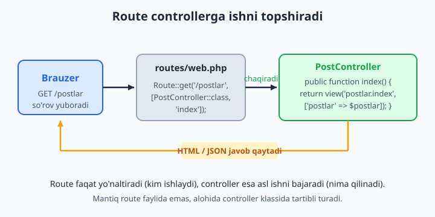
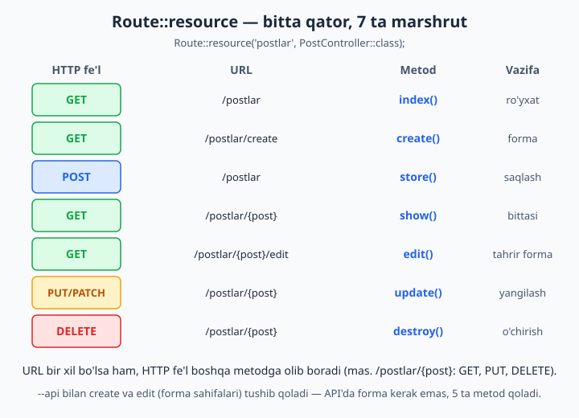
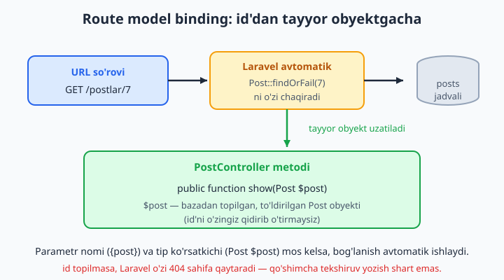

# 4 — Controllers (kontrollerlar)

[⬅️ Oldingi: 03 — Routing — marshrutlash](./03-routing.md) · [🏠 README](./README.md) · [Keyingi: 05 — Blade shablonlari ➡️](./05-blade.md)

> **Bu bobda:** route faylida o'sib ketgan mantiqni tartibli joyga — controllerga (so'rovni qabul qilib, ish bajaradigan klass) ko'chirishni o'rganamiz: `make:controller` bilan controller yaratish, metodni route'ga ulash, 7 ta CRUD metodli resource controller va `Route::resource`, bitta vazifali invokable (`__invoke`) controller, dependency injection (`Request` va servislarni metod yoki konstruktorga avtomatik olish), route model binding (`{post}` -> tayyor `Post $post` obyekti) va `--api` resource controllerni ko'rib chiqamiz.

---

## Muammo

3-bobda route'larni o'rgandik va mantiqni to'g'ridan-to'g'ri `routes/web.php` ichidagi closure'ga (nomsiz funksiya) yozib qo'ydik. Boshida bu qulay. Lekin loyiha o'ssa, `web.php` shunday ko'rinishga keladi:

```php
// routes/web.php — bir necha hafta ishlagandan keyin...
Route::get('/postlar', function () {
    $postlar = Post::where('holat', 'chop_etilgan')
        ->orderBy('created_at', 'desc')
        ->get();

    return view('postlar.index', ['postlar' => $postlar]);
});

Route::get('/postlar/{id}', function ($id) {
    $post = Post::findOrFail($id);
    // ... yana 15 qator mantiq ...
    return view('postlar.show', ['post' => $post]);
});

Route::post('/postlar', function (Request $request) {
    // ... validatsiya, saqlash, yo'naltirish — yana 20 qator ...
});
// va shu zaylda yana 40 ta route...
```

Muammolar ko'zga tashlanadi:

- **Fayl uzun va tartibsiz.** Marshrutlarni (qaysi URL) ham, mantiqni (nima qilinadi) ham bitta joyga tiqishtirdik. URL'ni topish uchun 500 qatorli faylni varaqlash kerak.
- **Qayta ishlatib bo'lmaydi.** "Postni topish" mantiqi bir necha closure'da takrorlanadi.
- **Test yozish qiyin.** Closure'ga nom yo'q — uni alohida chaqirib, sinab ko'rib bo'lmaydi.
- **Jamoada to'qnashuv.** Hamma bitta `web.php` faylini tahrirlaydi — git'da doimiy konflikt.

Yechim — **controller**: so'rovni qabul qilib, kerakli ishni bajaradigan **alohida klass**. Route faqat "kim ishlaydi" deb ko'rsatadi (yo'naltiradi), controller esa "nima qilinadi"ni bajaradi. Bu — MVC me'morchiligidagi "C" (Controller). Route faylimiz bir qatorga qisqaradi, mantiq esa o'ziga xos, nomlangan, sinab ko'rsa bo'ladigan joyga ko'chadi:

```php
// routes/web.php — toza
Route::get('/postlar', [PostController::class, 'index']);
```



📌 Controller — bu oddiy PHP klass, sehr emas. PHP'dagi klass va metodlarni bilasiz (agar yodingizdan chiqqan bo'lsa, [PHP kitobi](../php/php-qollanma.md)ga qarang). Laravel shu klasslar uchun bitta uy (`app/Http/Controllers/`) va ularni route'ga ulashning qulay usulini beradi, xolos.

## Birinchi controllerni yaratish

Controllerni qo'lda yozish o'rniga, Laravel'ning `artisan` buyrug'idan foydalanamiz (`artisan` — Laravel bilan keladigan buyruqlar yordamchisi):

```bash
php artisan make:controller PostController
```

Bu `app/Http/Controllers/PostController.php` faylini yaratadi:

```php
<?php

namespace App\Http\Controllers;

class PostController extends Controller
{
    //
}
```

Hozircha bo'sh. Unga birinchi metodimizni — `index` (postlar ro'yxatini ko'rsatadigan) qo'shamiz:

```php
<?php

namespace App\Http\Controllers;

use App\Models\Post;

class PostController extends Controller
{
    public function index()
    {
        $postlar = Post::latest()->get();

        return view('postlar.index', ['postlar' => $postlar]);
    }
}
```

📌 **Nomlash kelishuvi.** Controller nomi `PascalCase` va odatda `Controller` so'zi bilan tugaydi: `PostController`, `UserController`, `BuyurtmaController`. Fayl nomi klass nomi bilan bir xil: `PostController.php`. Bu shart emas, lekin Laravel jamoasi shunday yozadi — boshqa dasturchilar kodingizni darrov tushunadi.

💡 Metod nimani **qaytarsa** (`return`), o'sha brauzerga javob bo'lib ketadi: `view(...)` — HTML sahifa, massiv yoki Eloquent obyekti — JSON, `redirect(...)` — boshqa sahifaga yo'naltirish. 6-bobda javob turlarini batafsil ko'ramiz.

## Metodni route'ga ulash

Endi route'ga "bu URL kelsa, `PostController`ning `index` metodini chaqir" deb aytamiz. Buning sintaksisi — `[Klass::class, 'metod']` ko'rinishidagi massiv:

```php
<?php

use App\Http\Controllers\PostController;
use Illuminate\Support\Facades\Route;

Route::get('/postlar', [PostController::class, 'index']);
```

Fayl boshidagi `use App\Http\Controllers\PostController;` muhim — usiz `PostController::class` topilmaydi. (Bu sof PHP namespace qoidasi.)

📌 **Eng ko'p uchraydigan xato.** Metod nomi qo'shtirnoq ichida — `'index'` — chunki bu satr (string). Qavslarni unutmang: `[PostController::class, 'index']`. `PostController::class` — bu klassning to'liq nomini bergan satr (`"App\Http\Controllers\PostController"`), `::class`'siz esa Laravel obyekt yaratishni bilmaydi.

❌ Xato — metodni chaqirib qo'ygan (qavs bilan):
```php
Route::get('/postlar', [PostController::class, 'index()']);   // 'index()' — bunday metod yo'q!
```

✅ To'g'ri — metod nomini ber, chaqirishni Laravel'ning o'zi qiladi:
```php
Route::get('/postlar', [PostController::class, 'index']);
```

💡 Bir nechta route bitta controllerga tegishli bo'lsa, `Route::controller()` bilan takrorni kamaytirish mumkin:

```php
Route::controller(PostController::class)->group(function () {
    Route::get('/postlar', 'index');
    Route::get('/postlar/{post}', 'show');
    Route::post('/postlar', 'store');
});
```

## Controllerdan view va data uzatish

Controllerning eng keng tarqalgan vazifasi — ma'lumot tayyorlab, uni view (HTML shablon)ga uzatish. Data uzatishning ikki uslubi bor:

```php
public function index()
{
    $postlar = Post::latest()->get();

    // 1-usul: kalit => qiymat massivi
    return view('postlar.index', ['postlar' => $postlar]);
}
```

```php
public function show(Post $post)
{
    // 2-usul: compact() — o'zgaruvchi nomidan massiv yasaydi
    return view('postlar.show', compact('post'));
}
```

`compact('post')` — bu sof PHP funksiyasi, u `['post' => $post]` massivini qaytaradi. Ikkala usul ham bir xil ishlaydi; `compact` bir nechta o'zgaruvchida qulayroq: `compact('post', 'sharhlar', 'muallif')`.

View ichida bu data oddiy o'zgaruvchi bo'lib chiqadi (Blade'ni 5-bobda o'rganamiz):

```blade
<h1>Postlar</h1>

<ul>
    @foreach ($postlar as $post)
        <li>
            <a href="{{ route('postlar.show', $post) }}">{{ $post->sarlavha }}</a>
        </li>
    @endforeach
</ul>

@if ($postlar->isEmpty())
    <p>Hozircha post yo'q.</p>
@endif
```

📌 `view('postlar.index', ...)` dagi nuqta — bu papka ajratuvchi. Laravel `resources/views/postlar/index.blade.php` faylini qidiradi. Demak nuqta `/` o'rnida.

## Resource controller — CRUD'ni bir buyruq bilan

Veb-ilovalarning aksariyat qismi bir xil ishni qiladi: biror narsani **ko'rsatish, yaratish, tahrirlash, o'chirish** (inglizcha Create-Read-Update-Delete, qisqasi CRUD). Postlar, foydalanuvchilar, mahsulotlar, buyurtmalar — hammasi shu qolipga tushadi. Laravel shu 7 ta standart metodni tayyor yozib beradi:

```bash
php artisan make:controller PostController --resource --model=Post
```

`--resource` bayrog'i (flag) controllerni 7 ta bo'sh metod bilan yaratadi. Har birining aniq vazifasi bor. Bu yerda `--model=Post` ham qo'shdik — shunda Laravel `show`, `edit`, `update`, `destroy` metodlariga model tip-ko'rsatkichini (`Post $post`) o'zi yozib beradi:

```php
<?php

namespace App\Http\Controllers;

use App\Models\Post;
use Illuminate\Http\Request;

class PostController extends Controller
{
    public function index() {}      // GET    /postlar           — hamma postlar ro'yxati
    public function create() {}     // GET    /postlar/create    — yangi post yaratish formasi
    public function store(Request $request) {}   // POST /postlar  — formani saqlash
    public function show(Post $post) {}          // GET /postlar/{post}      — bitta post
    public function edit(Post $post) {}          // GET /postlar/{post}/edit — tahrir formasi
    public function update(Request $request, Post $post) {}  // PUT/PATCH /postlar/{post} — yangilash
    public function destroy(Post $post) {}       // DELETE /postlar/{post}   — o'chirish
}
```

Bu 7 metodni yodda saqlash oson, chunki ular juftlarga bo'linadi:

- `create` (formani **ko'rsatadi**) ↔ `store` (o'sha forma yuborilganda **saqlaydi**)
- `edit` (tahrir formasini **ko'rsatadi**) ↔ `update` (o'sha forma yuborilganda **yangilaydi**)
- `index` (hammasini), `show` (bittasini), `destroy` (o'chiradi) — yakka turadi



📌 Nega `create`/`edit` ham, `store`/`update` ham kerak? Chunki HTML formada ikki bosqich bor: avval foydalanuvchiga **bo'sh formani ko'rsatish** (`create`, GET so'rov), keyin u "Saqlash"ni bosganda **kelgan ma'lumotni qabul qilish** (`store`, POST so'rov). API'da forma sahifasi bo'lmaydi, shuning uchun ularsiz `--api` varianti ham bor — pastda ko'ramiz.

## Route::resource — 7 marshrutni bir qatorda

Yuqoridagi 7 metodni route'ga alohida-alohida ulash zerikarli. `Route::resource` buni bitta qatorda qiladi:

```php
use App\Http\Controllers\PostController;

Route::resource('postlar', PostController::class);
```

Shu bitta qator yuqoridagi jadvaldagi 7 ta marshrutni avtomatik yaratadi. Ularni o'z ko'zingiz bilan ko'rish uchun:

```bash
php artisan route:list
```

```text
GET|HEAD   postlar ............... postlar.index   › PostController@index
POST       postlar ............... postlar.store   › PostController@store
GET|HEAD   postlar/create ........ postlar.create  › PostController@create
GET|HEAD   postlar/{post} ........ postlar.show    › PostController@show
GET|HEAD   postlar/{post}/edit ... postlar.edit    › PostController@edit
PUT|PATCH  postlar/{post} ........ postlar.update  › PostController@update
DELETE     postlar/{post} ........ postlar.destroy › PostController@destroy
```

📌 E'tibor bering: `/postlar/{post}` URL'i uch xil HTTP fe'l bilan keladi — GET (`show`), PUT/PATCH (`update`), DELETE (`destroy`). URL bir xil bo'lsa ham, **HTTP fe'l** Laravel'ni boshqa metodga olib boradi. Shuning uchun route'da fe'l ham, manzil ham muhim.

💡 **Route nomlari avtomatik.** `postlar.index`, `postlar.show` kabi nomlarni Laravel o'zi qo'yadi. Shu nomlar bilan view'da link yasaysiz: `route('postlar.show', $post)`. URL o'zgarsa ham (`/postlar` -> `/blog`), nom o'zgarmaydi — linklar buzilmaydi.

**Faqat ayrim metodlarni kerak bo'lsa** — `only` yoki `except`:

```php
// Faqat ro'yxat va bitta postni ko'rsatish (o'chirish/tahrir yo'q):
Route::resource('postlar', PostController::class)->only(['index', 'show']);

// Hammasi, faqat o'chirishdan tashqari:
Route::resource('postlar', PostController::class)->except(['destroy']);
```

📌 `--model=Post`ni qoldirib, faqat `php artisan make:controller PostController --resource` yozsangiz, Laravel modelni bilmaydi va `show`, `edit`, `update`, `destroy` metodlarini `show(string $id)` ko'rinishida — model tip-ko'rsatkichisiz — yaratadi. U holda `Post $post`ni metod ichiga o'zingiz qo'lda yozasiz. `--model=Post` shu ishni avtomatlashtirib, `use App\Models\Post;`ni ham qo'shib qo'yadi. Modellarni 8-bobda o'rganamiz.

## Single-action controller — invokable

Ba'zan controllerda atigi **bitta** ish bo'ladi: dashboard sahifasi, statistika, bitta hisobot. Buning uchun butun klass yasab, bitta metod yozish ortiqcha tuyuladi. Laravel'da yechim bor — `__invoke` nomli maxsus metod. PHP'da `__invoke` bo'lgan obyektni funksiya kabi chaqirsa bo'ladi; Laravel shundan foydalanadi.

```bash
php artisan make:controller StatistikaController --invokable
```

```php
<?php

namespace App\Http\Controllers;

use App\Models\Post;

class StatistikaController extends Controller
{
    public function __invoke()
    {
        $jami = Post::count();

        return view('statistika', ['jami' => $jami]);
    }
}
```

Route'ga ulashda metod nomini **bermaysiz** — faqat klassni:

```php
use App\Http\Controllers\StatistikaController;

Route::get('/statistika', StatistikaController::class);
```

📌 Farqni payqang: oddiy controllerda `[Klass::class, 'metod']` (massiv), invokable'da esa shunchaki `Klass::class` (metodsiz). Laravel metod yo'qligini ko'rib, `__invoke`ni o'zi chaqiradi.

💡 Qachon invokable ishlatish kerak? Agar controllerda bitta mantiqiy amal bo'lsa va u CRUD qolipiga tushmasa. Masalan: `LogoutController`, `HisobotController`, `IzlashController`. Kod toza va maqsadi aniq bo'ladi.

## Dependency injection — Laravel obyektni o'zi beradi

PHP'da biror obyekt kerak bo'lsa, odatda uni o'zingiz yaratasiz: `$request = new Request();`. Laravel'da esa boshqacha — metod parametrida **tip ko'rsatkichi** (type-hint) yozsangiz, Laravel kerakli obyektni **o'zi yaratib, parametrga uzatadi**. Buni "dependency injection" (bog'liqlikni in'ektsiya qilish) deyiladi.

Eng ko'p uchraydigani — `Request` obyekti (kelgan so'rov ma'lumotlari):

```php
use Illuminate\Http\Request;

public function store(Request $request)
{
    // $request — Laravel o'zi tayyorlab bergan, kelgan so'rov obyekti
    $sarlavha = $request->input('sarlavha');
    $hamma = $request->all();

    // ...
}
```

Siz hech qayerda `new Request()` yozmaysiz. Parametrda `Request $request` deb yozish kifoya — qolganini Laravel qiladi. Request'ni 6-bobda chuqur o'rganamiz.

**Servisni konstruktorda olish.** O'zingiz yozgan yordamchi klass (servis) controllerning **hamma** metodida kerak bo'lsa, uni konstruktorga tip-hint qiling. Laravel uni bir marta yaratib, klassga qo'shib qo'yadi:

```php
<?php

namespace App\Http\Controllers;

use App\Services\TolovService;
use Illuminate\Http\Request;

class TolovController extends Controller
{
    public function __construct(
        protected TolovService $tolov
    ) {}

    public function store(Request $request)
    {
        $natija = $this->tolov->amalga($request->input('summa'));

        return back()->with('xabar', $natija);
    }
}
```

📌 Bu yerda PHP 8 ning "constructor property promotion" imkoniyatidan foydalandik: `protected TolovService $tolov` — konstruktor parametri darhol klass xususiyatiga (property) aylanadi. Endi har metodda `$this->tolov` orqali murojaat qilamiz. Laravel `TolovService` obyektini o'zi yaratib uzatadi — `new TolovService()` yozish shart emas.

💡 Faqat bitta metodda kerak bo'lsa, konstruktor o'rniga o'sha metod parametriga qo'shing — `Request` bilan birga ham bo'laveradi:

```php
public function store(Request $request, TolovService $tolov)
{
    $tolov->amalga($request->input('summa'));
    // ...
}
```

Parametr tartibi muhim emas — Laravel har birini tipiga qarab to'g'ri to'ldiradi.

## Route model binding — id'dan tayyor obyekt

Mana eng ko'p ish tejaydigan imkoniyatlardan biri. Ko'pincha URL'da modelning id'si bo'ladi (`/postlar/7`), va siz o'sha id bo'yicha modelni bazadan topasiz. Qo'lda yozsangiz:

```php
// Qo'lda — har metodda takrorlanadigan zerikarli ish:
public function show($id)
{
    $post = Post::findOrFail($id);   // topilmasa 404

    return view('postlar.show', ['post' => $post]);
}
```

Laravel buni avtomatik qiladi. Parametr nomini route'dagi `{post}` bilan bir xil qiling va tip ko'rsatkichi sifatida modelni yozing:

```php
use App\Models\Post;

// Avtomatik — Laravel id bo'yicha postni o'zi topadi:
public function show(Post $post)
{
    return view('postlar.show', ['post' => $post]);
}
```

`$post` — bu allaqachon bazadan topilgan, to'ldirilgan `Post` obyekti. `findOrFail` yozish shart emas, topilmasa 404 ham avtomatik. Buni **route model binding** deyiladi.



Ishlashi uchun ikki shart bajarilishi kerak:

1. Route parametr nomi va metod parametr nomi **bir xil** bo'lsin:
   ```php
   Route::get('/postlar/{post}', [PostController::class, 'show']);
   //                    ^^^^                                  ^^^^
   public function show(Post $post)   // {post} <-> $post mos
   ```
2. Tip ko'rsatkichi model bo'lsin (`Post`).

📌 **Eng ko'p uchraydigan tuzoq.** Nomlar mos kelmasa, binding ishlamaydi:

❌ Mos emas — `$post` bo'sh keladi (Laravel `{id}`ni izlaydi, topa olmaydi):
```php
Route::get('/postlar/{id}', [PostController::class, 'show']);
public function show(Post $post) { ... }   // {id} != $post
```

✅ Mos — binding ishlaydi:
```php
Route::get('/postlar/{post}', [PostController::class, 'show']);
public function show(Post $post) { ... }   // {post} == $post
```

💡 `Route::resource` ishlatsangiz, parametr nomlari (`{post}`) avtomatik to'g'ri qo'yiladi — binding o'z-o'zidan ishlaydi. Shuning uchun resource controller metodlari (`show`, `edit`, `update`, `destroy`) to'g'ridan-to'g'ri `Post $post` qabul qiladi.

**id o'rniga boshqa ustun bo'yicha topish.** Standart holatda Laravel `id` bo'yicha qidiradi. URL chiroyli bo'lsin desangiz (`/postlar/laravel-darslari`), `slug` bo'yicha bog'lash mumkin:

```php
// Route'da ustun nomini ko'rsatamiz:
Route::get('/postlar/{post:slug}', [PostController::class, 'show']);
```

Endi `/postlar/laravel-darslari` kelsa, Laravel `Post::where('slug', 'laravel-darslari')->firstOrFail()` ni bajaradi.

**Bir nechta model — bog'langan (scoped) binding.** Ikki model bir-biriga tegishli bo'lsa (post va uning sharhi), Laravel sharh aynan **shu** postga tegishli ekanini ham tekshiradi:

```php
// /postlar/7/sharhlar/3 — 3-sharh, faqat 7-postnikidir, deb tekshiradi
Route::get('/postlar/{post}/sharhlar/{sharh}', [SharhController::class, 'show']);

public function show(Post $post, Sharh $sharh)
{
    return view('sharhlar.show', compact('post', 'sharh'));
}
```

Bu xavfsizlik uchun foydali: begona postning sharhiga murojaat qilib bo'lmaydi.

## API resource controller — JSON uchun

Mobil ilova yoki frontend (React/Vue) uchun backend yozsangiz, HTML sahifalar emas, **JSON** qaytarasiz. Bunda forma sahifalari (`create`, `edit`) keraksiz — frontend o'z formasini chizadi. Shuning uchun `--api` bayrog'i bilan controller yarating:

```bash
php artisan make:controller PostController --api
```

Bu 7 emas, **5 ta** metod yaratadi (forma ko'rsatadigan `create` va `edit` tushib qoladi): `index`, `store`, `show`, `update`, `destroy`.

```php
<?php

namespace App\Http\Controllers;

use App\Models\Post;
use Illuminate\Http\Request;

class PostController extends Controller
{
    public function index()
    {
        return Post::latest()->paginate(15);   // massiv -> avtomatik JSON
    }

    public function store(Request $request)
    {
        $post = Post::create($request->validate([
            'sarlavha' => 'required|string',
            'matn' => 'required',
        ]));

        return response()->json($post, 201);   // 201 = "yaratildi"
    }

    public function show(Post $post)
    {
        return response()->json($post);
    }
}
```

📌 Eloquent obyektini yoki massivni `return` qilsangiz, Laravel uni avtomatik JSON'ga aylantiradi — `json_encode` yozish shart emas. `paginate(15)` esa sahifalangan (15 tadan) JSON qaytaradi, ichida `data`, `links`, `total` bilan.

API marshrutlarini ulashda esa `apiResource` ishlatamiz (u ham 5 ta route yaratadi, forma route'larisiz):

```php
use App\Http\Controllers\PostController;

Route::apiResource('postlar', PostController::class);
```

💡 API marshrutlari odatda `routes/api.php` faylida turadi. Yangi Laravel 13 loyihasida bu fayl boshida bo'lmaydi — `php artisan install:api` buyrug'i uni (va Sanctum autentifikatsiyasini) qo'shadi. To'liq RESTful API va Sanctum'ni 16- va 17-boblarda chuqur o'rganamiz; bu yerda faqat controller tomonini ko'rib qo'ydik.

## Hammasini birlashtiramiz

Mana to'liq, real resource controller — bobdagi barcha tushunchalar bir joyda. Route model binding (`Post $post`), dependency injection (`Request $request`), view + data va redirect — hammasi ishlamoqda:

```php
<?php

namespace App\Http\Controllers;

use App\Models\Post;
use Illuminate\Http\Request;

class PostController extends Controller
{
    public function index()
    {
        $postlar = Post::latest()->get();

        return view('postlar.index', ['postlar' => $postlar]);
    }

    public function show(Post $post)            // binding: id -> Post obyekti
    {
        return view('postlar.show', compact('post'));
    }

    public function store(Request $request)     // DI: Request avtomatik
    {
        $data = $request->validate([
            'sarlavha' => 'required|string|max:255',
            'matn' => 'required',
        ]);

        $post = Post::create($data);

        return redirect()->route('postlar.show', $post);   // nomli route'ga yo'naltirish
    }

    public function update(Request $request, Post $post)   // DI + binding birga
    {
        $post->update($request->only(['sarlavha', 'matn']));

        return redirect()->route('postlar.show', $post)
            ->with('xabar', 'Post yangilandi!');
    }

    public function destroy(Post $post)
    {
        $post->delete();

        return redirect()->route('postlar.index');
    }
}
```

Va uni ulash — bitta qator:

```php
Route::resource('postlar', PostController::class);
```

📌 Diqqat qiling: controller **faqat** so'rovni qabul qilib, javob qaytaradi — u "yupqa" (thin) bo'lishi kerak. Murakkab biznes-mantiq (hisob-kitob, tashqi xizmatlar) alohida servis klasslarga chiqariladi. Hozircha controllerni shunchaki "boshqaruvchi" deb tasavvur qiling: so'rovni oladi, kerakli modelga ish topshiradi, view yoki JSON qaytaradi.

💡 **Validatsiyani esda tuting.** Yuqorida `$request->validate([...])` ko'rdik — kelgan ma'lumot to'g'ri ekanini tekshiradi, xato bo'lsa avtomatik orqaga qaytaradi. Validatsiya o'z-o'zidan katta mavzu — uni to'liq 12-bobda o'rganamiz.

## Xulosa

- **Controller** — so'rovni qabul qilib, ish bajaradigan klass; mantiqni route faylidan ajratib, tartibli joyga (`app/Http/Controllers/`) qo'yadi.
- `php artisan make:controller Nom` — controller yaratadi; `--resource` (7 CRUD metod), `--api` (5 metod), `--invokable` (bitta `__invoke`) bayroqlari bor.
- Route'ga ulash: `[Controller::class, 'metod']` (oddiy) yoki `Controller::class` (invokable).
- `Route::resource('nom', Controller::class)` — bitta qatorda 7 ta CRUD marshruti; `apiResource` esa 5 ta.
- **Dependency injection**: metod yoki konstruktor parametriga tip-hint yozsangiz (`Request $request`, `TolovService $tolov`), Laravel obyektni o'zi yaratib beradi.
- **Route model binding**: route parametri `{post}` va metod parametri `Post $post` mos kelsa, Laravel modelni bazadan o'zi topadi (topilmasa 404).
- Controller "yupqa" bo'lsin: ma'lumot tayyorlaydi, view yoki JSON qaytaradi; og'ir mantiq servislarga ko'chadi.

Keyingi bobda controllerdan qaytargan `view(...)`ning ichini — **Blade shablonlari**ni o'rganamiz: ma'lumotni HTML'ga qanday chiroyli joylashtirishni.

## 4-bob mashqlari

Quyidagi mashqlarni o'zingiz bajaring — yechim berilmagan. Har birida controllerni yarating, kodni yozing, `php artisan route:list` bilan tekshiring va brauzerda yoki Postman/`curl` bilan sinab ko'ring. Mashqlar asta-sekin qiyinlashadi.

1. `php artisan make:controller SahifaController` buyrug'i bilan controller yarating va yaratilgan fayl ichidagi kodga qarang. Klass qaysi papkada, qaysi namespace bilan turibdi?

2. `SahifaController`ga `bosh()` nomli metod qo'shing, u `'Assalomu alaykum!'` matnini `return` qilsin. Uni `/` (bosh sahifa) route'iga ulang va brauzerda oching.

3. Yana `haqida()` metodini qo'shing, u `view('haqida')`ni qaytarsin. `/haqida` route'iga ulang. (View faylini yaratish shart emas — xatoni ko'rib, nima yetishmayotganini tushuning.)

4. `bosh()` metodida `view('bosh', ['ism' => 'Oqil'])` qaytaring. View'ga data uzatishning ikkinchi usuli — `compact()` — bilan ham xuddi shuni yozing va ikkalasini taqqoslang.

5. `php artisan make:controller PostController --resource` bilan resource controller yarating. Yaratilgan 7 ta metodning har biri yonidagi izohga qarab, qaysi metod qaysi ishni qilishini daftaringizga yozing.

6. Yuqoridagi `PostController`ni `Route::resource('postlar', PostController::class)` bilan ulang. `php artisan route:list --name=postlar` buyrug'ini ishlatib, yaratilgan 7 ta marshrutni ro'yxatini ko'ring.

7. `route:list` natijasida `/postlar/{post}` URL'i necha marta uchradi va har safar qaysi HTTP fe'l bilan kelganini ayting. Nega bitta URL uch xil metodga olib boradi?

8. `Route::resource('postlar', PostController::class)->only(['index', 'show'])` deb o'zgartiring. Endi `route:list`da nechta marshrut qoldi? `except(['destroy'])` bilan ham sinab ko'ring.

9. `index()` metodini to'ldiring: `Post::latest()->get()` bilan postlarni oling va `view('postlar.index', ...)`ga uzating. (Avval `Post` modeli kerak — `php artisan make:model Post -m` bilan yarating, bu 8-bobda batafsil.)

10. `php artisan make:controller DashboardController --invokable` bilan invokable controller yarating. `__invoke()` metodida `view('dashboard')` qaytaring va `/dashboard` route'iga ulang. Route'ga ulashda metod nomini yozmaganingizga e'tibor bering.

11. Oddiy controller (`[Klass::class, 'metod']`) va invokable controller (`Klass::class`) route'ga ulanishidagi farqni bitta jumlada tushuntiring.

12. `show()` metodiga `Illuminate\Http\Request $request` parametrini qo'shing va `dd($request->all())` bilan kelgan so'rov ma'lumotlarini ekranga chiqaring. URL oxiriga `?test=salom` qo'shib oching — `test` qayerda ko'rinadi?

13. Bir xizmat klass yarating: `app/Services/SalomService.php`, ichida `salom($ism)` metodi `"Salom, $ism!"` qaytarsin. Uni controller metodiga tip-hint qilib oling (`SalomService $salom`) va ishlating. `new SalomService()` yozmaganingizga e'tibor bering.

14. O'sha `SalomService`ni endi metod o'rniga **konstruktorga** ko'chiring (constructor property promotion bilan: `protected SalomService $salom`). Metodda `$this->salom` orqali murojaat qiling. Qachon konstruktor, qachon metod parametri afzal?

15. `Route::get('/postlar/{post}', [PostController::class, 'show'])` route'ini yozing va `show(Post $post)` metodida `dd($post)` qiling. `/postlar/1` ni oching — `$post`da nima turibdi? Bu route model binding.

16. 15-mashqdagi route parametrini ataylab `{id}` deb o'zgartiring (metod hamon `Post $post`). Endi nima bo'ladi? Xatoni o'qing va sababini tushuntiring (nom mos kelmasligi).

17. `/postlar/9999` (mavjud bo'lmagan id) ni oching. Laravel qanday javob beradi? Route model binding `findOrFail`ni avtomatik bajarishini shu orqali tasdiqlang.

18. Modelda `slug` ustuni bor deb faraz qiling. Route'ni `{post:slug}` qilib o'zgartiring va `/postlar/laravel-darslari` ko'rinishidagi URL bilan binding qanday ishlashini izohlang (kodni yozish kifoya, bazani to'liq sozlash shart emas).

19. `php artisan make:controller Api/PostController --api` bilan API controller yarating (papka ichida!). 7 emas, nechta metod yaratildi? Qaysi ikkitasi yo'q va nega API'da ular keraksiz?

20. `Route::apiResource('postlar', Api\PostController::class)` bilan ulang va `index()` metodida `Post::all()`ni to'g'ridan-to'g'ri `return` qiling. `route:list`da nechta marshrut chiqdi? `curl` yoki brauzer bilan ochib, javob HTML emas, JSON ekanini tasdiqlang.
