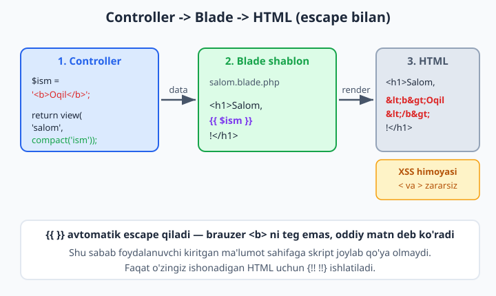
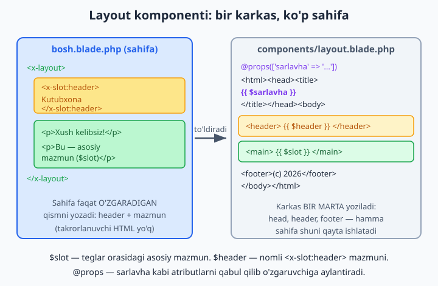
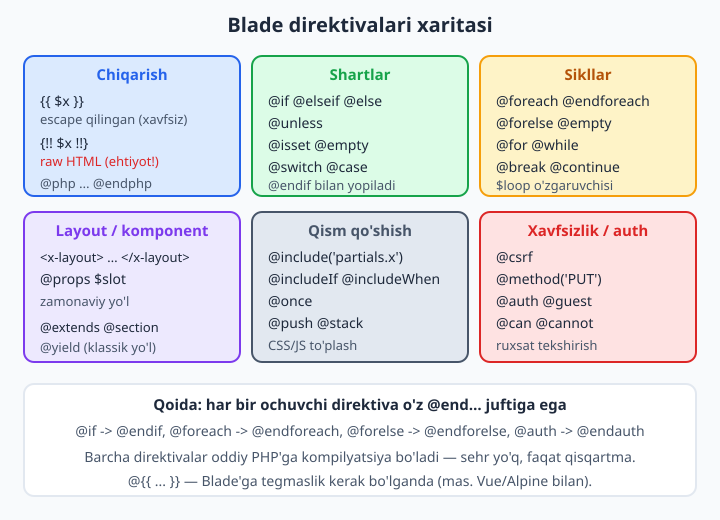

# 5 — Blade shablonlari

[⬅️ Oldingi: 04 — Controllers (kontrollerlar)](./04-controllers.md) · [🏠 README](./README.md) · [Keyingi: 06 — Request va Response ➡️](./06-request-response.md)

> **Bu bobda:** controller'dan kelgan ma'lumotni HTML'ga aylantiruvchi Blade shablon tizimini o'rganamiz: `{{ }}` bilan xavfsiz chiqarish (avtomatik escape — XSS himoyasi) va `{!! !!}` raw chiqarishning xavfi, `@if`/`@foreach`/`@forelse` kabi direktivalar, `$loop` sehrli o'zgaruvchisi, takror HTML'dan qutqaruvchi layout (zamonaviy `<x-layout>` komponenti hamda klassik `@extends/@section/@yield`), qayta ishlatiladigan Blade komponentlari (`@props`, slot), `@include`, `@stack/@push`, `@once` va `@csrf`/`@auth`/`@can` kabi xavfsizlik direktivalari.

---

## Muammo

4-bobda controller `view('kitoblar')` qaytarishni o'rgandik. Lekin `kitoblar.blade.php` ichida nima turishi kerak? Sof PHP bilan yozsak, bunday narsa chiqadi:

```php
<?php foreach ($kitoblar as $kitob): ?>
    <li><?php echo htmlspecialchars($kitob->nomi); ?>
        (<?php echo $kitob->yil; ?>)</li>
<?php endforeach; ?>
```

Buni o'qib bo'ladimi? `<?php ?>` teglari HTML orasida sochilib yotibdi, har bir o'zgaruvchini `htmlspecialchars()` bilan o'rashni unutmaslik kerak (bittasini unutsangiz — xavfsizlik teshigi), va sahifaning umumiy karkasi (`<head>`, menyu, footer) har bir faylda qayta-qayta takrorlanadi. 50 ta sahifali saytda menyuga bitta havola qo'shish — 50 ta faylni tahrirlash demak.

Blade — Laravel'ning shablon tizimi (template engine) — aynan shu uch muammoni hal qiladi: **chiroyli sintaksis**, **avtomatik xavfsizlik** va **takrorni yo'qotish**. Yuqoridagi kod Blade'da shunday ko'rinadi:

```blade
@foreach ($kitoblar as $kitob)
    <li>{{ $kitob->nomi }} ({{ $kitob->yil }})</li>
@endforeach
```

Qisqaroq, tozaroq — va `{{ }}` o'zi avtomatik escape qiladi, ya'ni `htmlspecialchars` haqida o'ylashingiz shart emas. Keling, boshidan boshlaymiz.

📌 Blade fayllari `resources/views/` papkasida `.blade.php` kengaytmasi bilan yashaydi. Nomidagi `.blade` Laravel'ga "bu faylni Blade kompilyatori qayta ishlasin" deb aytadi. Oddiy `.php` fayl ham view bo'la oladi, lekin u holda Blade direktivalari ishlamaydi.

## Blade qanday ishlaydi — "sehr" yo'q

Avval bitta muhim haqiqatni aytib qo'yaylik, chunki ko'pchilik buni noto'g'ri tasavvur qiladi: Blade — alohida til emas. Har bir `.blade.php` fayl oddiy PHP kodga **kompilyatsiya qilinadi** va `storage/framework/views/` ga keshlanadi. `{{ $x }}` aslida `<?php echo e($x); ?>` ga aylanadi, `@if` esa `<?php if(...): ?>` ga. Brauzer hech qachon Blade ko'rmaydi — u faqat tayyor HTML oladi.



Bu nimani anglatadi? Ikki narsani: (1) Blade tez — kompilyatsiya bir marta bo'ladi, keyin keshdan o'qiladi; (2) PHP biladigan kishi uchun Blade'da hech qanday "qora quti" yo'q — har bir direktiva ortida tanish PHP turibdi.

💡 Keshni ko'rib qo'yishni xohlasangiz, `storage/framework/views/` ichidagi fayllarni oching — Blade'ingiz qanday PHP'ga aylanganini o'z ko'zingiz bilan ko'rasiz. Bu Blade'ni chuqur tushunishning eng yaxshi yo'li.

## `{{ }}` — chiqarish va avtomatik escape

Eng ko'p ishlatadigan narsangiz — o'zgaruvchini sahifaga chiqarish. Buning uchun ikki jingalak qavs:

```blade
<h1>{{ $sahifa_nomi }}</h1>
<p>Salom, {{ $foydalanuvchi['ism'] }}!</p>
<p>Narxi: {{ $narx * 2 }} so'm</p>
```

`{{ }}` ichiga istalgan PHP ifodasini yozish mumkin: o'zgaruvchi, massiv elementi, hisob, funksiya chaqiruvi. Natija `echo` qilinadi.

Eng muhimi — `{{ }}` natijani **avtomatik escape qiladi**, ya'ni `e()` funksiyasidan (`htmlspecialchars`) o'tkazadi. Bu nega muhim? Tasavvur qiling, foydalanuvchi o'z ismi sifatida quyidagini kiritdi:

```text
<script>alert('buzildi')</script>
```

Agar buni escape qilmasdan chiqarsangiz, brauzer uni haqiqiy `<script>` deb ishga tushiradi — bu **XSS hujumi** (Cross-Site Scripting). `{{ }}` esa `<` ni `&lt;` ga aylantiradi, shuning uchun brauzer buni teg emas, oddiy matn deb ko'rsatadi. Hujum ishlamaydi.

✅ `{{ $foydalanuvchi_kiritgan_matn }}` — har doim xavfsiz.

📌 Blade'da bo'sh qiymatni nazorat qilish uchun PHP'ning `??` operatori juda qo'l keladi:

```blade
<p>{{ $izoh ?? 'Izoh yozilmagan' }}</p>
```

`$izoh` mavjud bo'lmasa yoki `null` bo'lsa, "Izoh yozilmagan" chiqadi — `Undefined variable` xatosi bermaydi.

💡 Ba'zan `{{ }}` ni Blade qayta ishlamasligini xohlaysiz — masalan, sahifada Vue yoki Alpine.js ishlatsangiz, ular ham `{{ }}` sintaksisidan foydalanadi. U holda oldiga `@` qo'ying: `@{{ buni Blade tegmaydi }}`. Blade `@` ni olib tashlaydi va qolganini brauzerga tegmasdan uzatadi.

## `{!! !!}` — raw chiqarish (ehtiyot bo'ling)

Ba'zan HTML'ni aynan o'zidek, escape qilmasdan chiqarish kerak bo'ladi — masalan, matn muharririda yozilgan va siz ishonadigan HTML. Buning uchun `{!! !!}`:

```blade
<div class="maqola">{!! $maqola->tana_html !!}</div>
```

❌ **Hech qachon** foydalanuvchi kiritgan ma'lumotni `{!! !!}` bilan chiqarmang. Bu to'g'ridan-to'g'ri XSS teshigini ochadi. Faqat o'zingiz to'liq nazorat qiladigan yoki ishonchli kutubxona tozalab bergan HTML uchun ishlating.

📌 Amaliyotda qoida oddiy: **deyarli har doim `{{ }}`**. `{!! !!}` — kamdan-kam, faqat siz "bu yerda HTML bo'lishi kerak va men manbasiga ishonaman" deb aniq bilganingizda.

## Shartlar — `@if`, `@unless`, `@isset`

Blade direktivalari `@` bilan boshlanadi va har biri tanish PHP'ga kompilyatsiya bo'ladi:

```blade
@if ($kitoblar_soni > 10)
    <p>Katta kutubxona!</p>
@elseif ($kitoblar_soni > 0)
    <p>{{ $kitoblar_soni }} ta kitob bor.</p>
@else
    <p>Hozircha kitob yo'q.</p>
@endif
```

`@unless` — `@if (!...)` ning chiroyli ko'rinishi ("agar ... bo'lmasa"):

```blade
@unless (auth()->check())
    <a href="/login">Tizimga kiring</a>
@endunless
```

`@isset` va `@empty` — o'zgaruvchi mavjudligini va bo'shligini tekshiradi:

```blade
@isset($manzil)
    <p>Manzil: {{ $manzil }}</p>
@endisset

@empty($savat)
    <p>Savatingiz bo'sh.</p>
@endempty
```

📌 Har bir ochuvchi direktivaning `@end...` juftini yopishni unutmang: `@if` → `@endif`, `@unless` → `@endunless`. Bu — Blade'dagi eng ko'p uchraydigan xato. Yopuvchini qo'ymasangiz, "unexpected end of file" kabi xato olasiz.

## Sikllar — `@foreach`, `@forelse`, `@for`, `@while`

Ro'yxat chiqarish — eng ko'p ishlatadigan amal:

```blade
<ul>
@foreach ($kitoblar as $kitob)
    <li>{{ $kitob->nomi }} — {{ $kitob->yil }}</li>
@endforeach
</ul>
```

Endi tuzoq: ro'yxat **bo'sh** bo'lsa-chi? `@foreach` hech narsa chiqarmaydi va foydalanuvchi bo'sh sahifa ko'radi. Buni qo'lda tekshirish o'rniga (`@if (count(...)) ... @else ...`), Blade maxsus direktiva beradi — `@forelse`:

```blade
@forelse ($kitoblar as $kitob)
    <li>{{ $kitob->nomi }}</li>
@empty
    <li>Hozircha hech qanday kitob qo'shilmagan.</li>
@endforelse
```

`@forelse` — bu `@foreach` + bo'sh holat uchun `@empty` bloki bitta direktivada. Ro'yxat bo'sh bo'lsa, `@empty` ichidagi qism ko'rsatiladi. Bu juda ko'p ishlatiladi.

💡 Foydalanuvchi har doim biror narsa ko'rishi kerak — bo'sh ro'yxat ham. `@forelse` ni odat qiling: real loyihada bo'sh holatni ("hali ma'lumot yo'q") nazardan qochirmaslik professional ko'rinish beradi.

Sikldan chiqish yoki o'tkazib yuborish uchun `@break` va `@continue` — ularga shart ham berish mumkin:

```blade
@foreach ($mahsulotlar as $mahsulot)
    @continue($mahsulot->yashirin)   {{-- yashirinlarni o'tkazib yubor --}}
    @break($loop->iteration > 10)    {{-- faqat 10 tasini ko'rsat --}}
    <div>{{ $mahsulot->nomi }}</div>
@endforeach
```

`@for` va `@while` ham bor — sof PHP'dagidek ishlaydi:

```blade
@for ($i = 1; $i <= 5; $i++)
    <span class="yulduz">⭐</span>
@endfor
```

📌 Blade'da izoh `{{-- ... --}}` bilan yoziladi. HTML izohi `<!-- -->` dan farqi — Blade izohi render qilingan sahifaga **umuman tushmaydi**, foydalanuvchi uni manba kodida ham ko'rmaydi.

## `$loop` — sikl ichidagi sehrli o'zgaruvchi

Sof PHP'da `foreach` ichida "bu nechanchi element?", "bu oxirgisimi?" degan savollarga javob berish uchun qo'lda hisoblagich tutardingiz. Blade har bir `@foreach` ichida avtomatik ravishda `$loop` obyektini beradi:

```blade
@foreach ($azolar as $azo)
    <tr class="{{ $loop->even ? 'kulrang' : 'oq' }}">
        <td>{{ $loop->iteration }}</td>   {{-- 1, 2, 3... --}}
        <td>{{ $azo->ism }}</td>
        <td>
            @if ($loop->first) (eng yangi) @endif
            @if ($loop->last) (eng eski) @endif
        </td>
    </tr>
@endforeach
```

Eng foydali `$loop` xossalari:

| Xossa | Ma'nosi |
|---|---|
| `$loop->index` | 0 dan boshlanuvchi indeks (0, 1, 2...) |
| `$loop->iteration` | 1 dan boshlanuvchi raqam (1, 2, 3...) |
| `$loop->first` | birinchi elementmi? (`true`/`false`) |
| `$loop->last` | oxirgi elementmi? |
| `$loop->even` / `$loop->odd` | juft / toq pozitsiyami? |
| `$loop->count` | ro'yxatdagi jami elementlar soni |
| `$loop->remaining` | shu elementdan keyin nechta qoldi |

💡 Ichma-ich sikllarda tashqi siklning `$loop`'iga `$loop->parent` orqali yetib borasiz: `{{ $loop->parent->iteration }}`. Masalan, jadval ichidagi jadvalda "tashqi qator raqami"ni ko'rsatish uchun.

📌 `$loop->index` 0 dan, `$loop->iteration` 1 dan boshlanadi — buni adashtirmang. Foydalanuvchiga ko'rsatadigan tartib raqami uchun deyarli har doim `iteration` kerak (odam "0-kitob" emas, "1-kitob" deydi).

## Layout muammosi: takrorlanuvchi HTML

Endi eng katta og'riqqa qaytamiz. Har bir sahifada bir xil karkas takrorlanadi:

```blade
<!DOCTYPE html>
<html lang="uz">
<head>
    <meta charset="utf-8">
    <title>...</title>
    <link rel="stylesheet" href="/css/app.css">
</head>
<body>
    <header>... menyu ...</header>
    <main>
        {{-- FAQAT shu yer har sahifada o'zgaradi --}}
    </main>
    <footer>... (c) 2026 ...</footer>
</body>
</html>
```

`<head>`, menyu, footer — bularning hammasi 50 ta sahifada bir xil. Buni har faylga ko'chirib yozish — texnik qarz. Yechim: **layout** (umumiy karkas) ni bir marta yozib, har sahifa faqat o'zgaradigan qismni unga "to'ldirib qo'yadi".

Laravel'da buning ikki yo'li bor: zamonaviy **komponent** yondashuvi (tavsiya etiladi) va klassik **`@extends`/`@section`** yondashuvi. Avval zamonaviysini ko'ramiz.

## Zamonaviy layout: `<x-layout>` komponenti

G'oya: layout — bu **komponent**. Uni `resources/views/components/layout.blade.php` faylida yaratamiz. Ichida o'zgaradigan joyga `{{ $slot }}` qo'yamiz — bu "sahifa mazmuni shu yerga tushadi" degani:

```blade
{{-- resources/views/components/layout.blade.php --}}
@props(['sarlavha' => 'Kutubxona'])

<!DOCTYPE html>
<html lang="uz">
<head>
    <meta charset="utf-8">
    <title>{{ $sarlavha }}</title>
    <link rel="stylesheet" href="/css/app.css">
</head>
<body>
    <header>{{ $header ?? 'Mening Kutubxonam' }}</header>

    <main>
        {{ $slot }}
    </main>

    <footer>&copy; 2026 Kutubxona</footer>
</body>
</html>
```

Endi har qanday sahifa shu layoutni `<x-layout>` tegi bilan o'raydi:

```blade
{{-- resources/views/kitoblar/index.blade.php --}}
<x-layout sarlavha="Barcha kitoblar">
    <x-slot:header>
        <h1>Kutubxona katalogi</h1>
    </x-slot:header>

    <p>Bizda {{ count($kitoblar) }} ta kitob bor:</p>
    <ul>
        @foreach ($kitoblar as $kitob)
            <li>{{ $kitob->nomi }}</li>
        @endforeach
    </ul>
</x-layout>
```

Bu yerda nima sodir bo'ldi? `<x-layout>` va `</x-layout>` **orasidagi hamma narsa** layoutdagi `{{ $slot }}` ga tushadi. `<x-slot:header>` esa nomli slot — uning mazmuni `{{ $header }}` ga boradi. `sarlavha="..."` atributi esa `@props` orqali `$sarlavha` o'zgaruvchisiga aylanadi.



Endi menyuga havola qo'shish kerakmi? Bitta fayl — `layout.blade.php` — ni tahrirlaysiz, hamma sahifada yangilanadi. Bu — DRY (Don't Repeat Yourself) prinsipining amaldagi ko'rinishi.

📌 `@props(['sarlavha' => 'Kutubxona'])` — komponent qabul qiladigan o'zgaruvchilarni va ularning standart qiymatlarini e'lon qiladi. Sahifa `sarlavha` bermasa, "Kutubxona" ishlatiladi. `$header` ni esa `@props`da emas, `$header ?? '...'` bilan ixtiyoriy qildik — chunki u oddiy o'zgaruvchi emas, slot.

💡 `<x-layout>` qayerdan keldi? Laravel `x-` prefiksini ko'rsa, avtomatik ravishda `resources/views/components/` papkasidan `layout.blade.php` ni qidiradi. `x-` — "bu Blade komponenti" degan belgi. Hech narsa ro'yxatga olish shart emas — fayl yarating va ishlatavering.

## Klassik layout: `@extends`, `@section`, `@yield`

Eski loyihalarda (va hozir ham) ko'p uchraydigan ikkinchi yo'l — `@extends`. Buni bilib qo'yish kerak, chunki internetdagi ko'p qo'llanmalar shunga asoslangan. Avval layout faylida `@yield` bilan "teshik" qoldiramiz:

```blade
{{-- resources/views/layouts/asosiy.blade.php --}}
<!DOCTYPE html>
<html lang="uz">
<head>
    <title>@yield('sarlavha', 'Standart sarlavha')</title>
</head>
<body>
    <header>... menyu ...</header>
    <main>
        @yield('mazmun')
    </main>
    @stack('skriptlar')
</body>
</html>
```

Keyin sahifa `@extends` bilan shu layoutga "ulanadi" va `@section` bilan teshiklarni to'ldiradi:

```blade
{{-- resources/views/kitoblar/index.blade.php --}}
@extends('layouts.asosiy')

@section('sarlavha', 'Kitoblar')

@section('mazmun')
    <h1>Kitoblar ro'yxati</h1>
    <ul>
        @foreach ($kitoblar as $kitob)
            <li>{{ $kitob->nomi }}</li>
        @endforeach
    </ul>
@endsection
```

`@yield('mazmun')` joyiga `@section('mazmun') ... @endsection` ichidagi narsa tushadi. Qisqa sarlavha uchun `@section('sarlavha', 'Kitoblar')` — bir qatorli ko'rinish.

📌 **Ikki yondashuv — bir maqsad.** `<x-layout>` (komponent) va `@extends` (vorislik) ikkalasi ham takrorni yo'qotadi. Farqi: komponentda sahifa layoutni "o'raydi" (`<x-layout> ... </x-layout>`), `@extends`da esa sahifa layoutni "kengaytiradi". Yangi loyihada **komponent yondashuvini tanlang** — u zamonaviyroq, moslashuvchanroq va Laravel'ning rasmiy yo'nalishi. `@extends` ni esa eski kodni o'qiy olish uchun biling.

💡 `@extends` bilan ishlasangiz, bola section ichida ota-layoutdagi shu nomli section mazmunini ham saqlab qolish uchun `@parent` ishlatiladi: `@section('mazmun') @parent <p>qo'shimcha</p> @endsection`.

## Blade komponentlari — qayta ishlatiladigan bo'laklar

Layout — komponentning bir turi. Lekin komponent g'oyasi kengroq: sahifada qayta-qayta uchraydigan **har qanday** bo'lakni (tugma, ogohlantirish qutisi, karta) bir marta yozib, hamma joyda ishlatish mumkin. Ikki xil komponent bor: **anonim** (faqat blade fayl) va **klassli** (blade + PHP klass).

**Anonim komponent** — eng sodda. Faqat bitta fayl yaratasiz, `make:component` ni `--view` bayrog'i bilan chaqirib:

```bash
php artisan make:component alert --view
```

Bu `resources/views/components/alert.blade.php` faylini yaratadi. Ichini to'ldiramiz:

```blade
{{-- resources/views/components/alert.blade.php --}}
@props(['type' => 'info'])

<div class="alert alert-{{ $type }}">
    {{ $slot }}
</div>
```

Ishlatish — yangi HTML tegi yaratgandek:

```blade
<x-alert type="success">
    Kitob muvaffaqiyatli saqlandi!
</x-alert>

<x-alert type="danger">
    Xatolik yuz berdi.
</x-alert>
```

`type="success"` → `$type` o'zgaruvchisi, teglar orasidagi matn → `{{ $slot }}`. Bitta fayldan cheksiz xil ogohlantirish.

**Klassli komponent** — komponentga mantiq (PHP metodlari) kerak bo'lsa ishlatiladi:

```bash
php artisan make:component Alert
```

Bu ikki fayl yaratadi: `app/View/Components/Alert.php` (klass) va `resources/views/components/alert.blade.php` (ko'rinish):

```php
<?php

namespace App\View\Components;

use Illuminate\View\Component;
use Illuminate\Contracts\View\View;

class Alert extends Component
{
    public function __construct(
        public string $type = 'info',
    ) {}

    public function render(): View
    {
        return view('components.alert');
    }

    public function rangKlassi(): string
    {
        return match ($this->type) {
            'success' => 'yashil',
            'danger' => 'qizil',
            default => 'kok',
        };
    }
}
```

Konstruktordagi `public` xossalar (`$type`) avtomatik ravishda blade ichida o'zgaruvchi bo'ladi, metodlar (`rangKlassi()`) esa `{{ $rangKlassi() }}` orqali chaqiriladi. Mana shu — komponentga "aql" qo'shishning yo'li.

📌 Komponent nomi: `<x-alert>` → `Alert` klass / `alert.blade.php` fayl. Ko'p so'zli bo'lsa `<x-user-card>` → `UserCard` klass / `user-card.blade.php`. Blade prefiks va `kebab-case` ni avtomatik moslab oladi.

💡 `{{ $attributes }}` — komponentga berilgan, lekin `@props`da e'lon qilinmagan barcha atributlarni (masalan `class`, `id`) o'tkazib yuborish uchun. `{{ $attributes->merge(['class' => 'p-3']) }}` — standart klassni foydalanuvchi bergani bilan birlashtiradi. Bu komponentni HTML tegidek moslashuvchan qiladi.

## `@include` — bo'lak qo'shish

Komponent — kuchli, lekin ba'zan oddiygina "shu blade faylni shu yerga qo'y" kerak bo'ladi. Buning uchun `@include`:

```blade
@include('partials.menyu')
@include('partials.kitob-karta', ['kitob' => $kitob])
```

Ikkinchi qatorda `@include` ga ma'lumot ham uzatdik — `partials/kitob-karta.blade.php` ichida `$kitob` o'zgaruvchisi mavjud bo'ladi. Shartli variantlari ham bor:

```blade
@includeIf('partials.reklama')         {{-- fayl bo'lsa qo'sh, bo'lmasa jim --}}
@includeWhen($admin, 'partials.panel') {{-- shart rost bo'lsagina qo'sh --}}
```

📌 **`@include` va komponent — qaysi biri?** `@include` qo'shilgan faylga sizning hozirgi o'zgaruvchilaringizni ham beradi (ular umumiy) — bu ba'zan qulay, ba'zan chalkash. Komponent esa **izolyatsiya qilingan**: unga faqat ataylab bergan narsangiz kiradi. Yangi kodda ko'pincha komponentni afzal ko'ring; `@include` ni esa oddiy, ma'lumot uzatmaydigan bo'laklar (statik footer-bo'lak kabi) uchun saqlang.

## `@stack` / `@push` — sahifaga CSS/JS qo'shish

Muammo: ayrim sahifalarga maxsus skript yoki stil kerak, lekin u `<head>` yoki `</body>` oldida — ya'ni layoutda — turishi kerak. Sahifa ichidan layoutning shu joyiga "narsa qo'shish" uchun stack ishlatiladi. Layoutda joy belgilaymiz:

```blade
{{-- layoutda, </body> oldida --}}
@stack('skriptlar')
```

Sahifa esa shu stackka qo'shadi:

```blade
{{-- ixtiyoriy sahifada --}}
@push('skriptlar')
    <script src="/js/grafik.js"></script>
@endpush
```

Natijada `grafik.js` aynan layoutdagi `@stack('skriptlar')` joyiga qo'shiladi — sahifa mazmunining o'rtasida emas. Bir necha `@push` bir-birining ustiga qo'shiladi (to'planadi).

💡 Bir skriptni faqat **bir marta** qo'shishni kafolatlash uchun `@pushOnce` ishlating — komponent bir sahifada 5 marta ishlatilsa ham, uning skripti bir marta qo'shiladi.

## `@once` — faqat bir marta render qilish

Yuqoridagi g'oyaga yaqin: komponent bir sahifada ko'p marta chiqsa, uning ichki stilini har safar takrorlamaslik kerak. `@once` ichidagi narsa, direktiva necha marta uchrashidan qat'i nazar, **bir marta** render qilinadi:

```blade
@once
    <style>
        .alert { padding: 1rem; border-radius: 6px; }
    </style>
@endonce
```

`@once` ni ko'pincha `@push` bilan birga ishlatishadi (`@pushOnce`) — stilni bir marta `<head>` ga jo'natish uchun.

## Xavfsizlik direktivalari: `@csrf`, `@method`, `@auth`, `@can`

Forma yuborish — har bir saytda bor. Laravel formalardagi soxta yuborishlardan (CSRF — Cross-Site Request Forgery) himoyalanish uchun har bir `POST` formaga maxsus token qo'shishni talab qiladi. Buni qo'lda yozish o'rniga `@csrf`:

```blade
<form method="POST" action="/kitoblar">
    @csrf
    <input type="text" name="nomi" placeholder="Kitob nomi">
    <button type="submit">Saqlash</button>
</form>
```

`@csrf` yashirin `<input>` qo'shadi — usiz Laravel formani rad etadi (419 xatosi). Bu sizning saytingizdagi formani boshqa sayt soxta yubora olmasligini kafolatlaydi.

HTML formalar faqat `GET` va `POST` ni biladi. `PUT`, `PATCH`, `DELETE` (tahrirlash/o'chirish) uchun `@method` direktivasi ishlatiladi:

```blade
<form method="POST" action="/kitoblar/5">
    @csrf
    @method('DELETE')
    <button type="submit">O'chirish</button>
</form>
```

`@method('DELETE')` yashirin maydon qo'shadi va Laravel bu so'rovni `DELETE` deb qabul qiladi.

Foydalanuvchi tizimga kirgan-kirmaganiga qarab turli narsa ko'rsatish uchun `@auth` va `@guest`:

```blade
@auth
    <p>Salom, {{ auth()->user()->name }}!</p>
    <a href="/chiqish">Chiqish</a>
@endauth

@guest
    <a href="/login">Kirish</a>
    <a href="/royxat">Ro'yxatdan o'tish</a>
@endguest
```

Aniq bir amalga ruxsat bor-yo'qligini tekshirish uchun `@can` (14-bobdagi avtorizatsiyaga bog'liq):

```blade
@can('update', $kitob)
    <a href="/kitoblar/{{ $kitob->id }}/tahrir">Tahrirlash</a>
@endcan
```

`@can('update', $kitob)` — "joriy foydalanuvchi shu kitobni tahrirlashga haqlimi?" Haqli bo'lsagina tugma ko'rsatiladi. (Buning ortidagi Gate/Policy mantig'ini 14-bobda batafsil ko'ramiz; hozircha shuni biling — ruxsatni blade'da shunday tekshiriladi.)

📌 `@auth`/`@guest`/`@can` faqat **ko'rinishni** boshqaradi — tugmani yashiradi. Bu xavfsizlikning o'zi emas! Haqiqiy himoya har doim controller/route tomonda (middleware, policy) bo'lishi shart. Yomon niyatli foydalanuvchi tugmani ko'rmasa ham URL'ni qo'lda terib kirishi mumkin. Blade'dagi tekshiruv — qulaylik uchun, himoya uchun emas.

## Direktivalar xaritasi

Ko'p direktiva ko'rdik. Mana ularning umumiy xaritasi — kategoriyalar bo'yicha, esda saqlash uchun:



Hammasini yodlash shart emas. Eng ko'p ishlatadiganlaringiz — `{{ }}`, `@if`, `@foreach`/`@forelse`, `<x-layout>`, `@csrf` — tezda qo'lingizga o'rnashib qoladi. Qolganlarini kerak bo'lganda shu xaritadan topasiz.

## View'ga ma'lumot uzatish — eslatma

Blade'dagi har bir o'zgaruvchi controller'dan keladi (4-bobni eslang). Uzatishning bir necha yo'li bor:

```php
// 1. Massiv bilan (eng ko'p ishlatiladi):
return view('kitoblar.index', [
    'kitoblar' => $kitoblar,
    'sarlavha' => 'Barcha kitoblar',
]);

// 2. compact() bilan (o'zgaruvchi nomi = kalit):
return view('kitoblar.index', compact('kitoblar', 'sarlavha'));

// 3. with() bilan (zanjir):
return view('kitoblar.index')->with('kitoblar', $kitoblar);
```

Hamma view'ga umumiy o'zgaruvchi (masalan, sayt nomi) kerak bo'lsa, har controllerda takrorlamasdan, `View::share()` ishlatiladi (odatda `AppServiceProvider`ning `boot()` metodida):

```php
use Illuminate\Support\Facades\View;

View::share('sayt_nomi', 'Mening Kutubxonam');
```

Endi `{{ $sayt_nomi }}` har qanday blade'da ishlaydi.

💡 Controller'siz, faqat statik sahifa (mas. "Biz haqimizda") uchun `Route::view()` to'g'ridan-to'g'ri view qaytaradi: `Route::view('/about', 'about');` — controller yozish shart emas.

## Xulosa

Blade — Laravel'da ko'rinishlarni yozishning sof, xavfsiz va takrorsiz usuli. Eng muhim olib ketadigan fikrlar:

- `{{ }}` avtomatik escape qiladi — foydalanuvchi ma'lumotini har doim shu bilan chiqaring (XSS himoyasi). `{!! !!}` — faqat ishonchli HTML uchun, ehtiyotkorlik bilan.
- `@if`/`@foreach`/`@forelse` va `$loop` — shartlar va sikllarni toza yozish. Bo'sh ro'yxat uchun `@forelse` ni odat qiling.
- Takrorlanuvchi karkasni **layout komponenti** (`<x-layout>` + `$slot` + `@props`) bilan bir joyga jamlang — bu zamonaviy yo'l. `@extends/@section/@yield` — klassik muqobil, eski kodni o'qish uchun bilib qo'ying.
- Qayta ishlatiladigan bo'laklarni **komponent** qiling (`make:component`), oddiy qo'shimchalar uchun `@include`.
- `@csrf`, `@method`, `@auth`, `@can` — formalar va ruxsatlar uchun. Yodda tuting: blade'dagi tekshiruv ko'rinishni boshqaradi, asl himoya — controllerda.

6-bobda forma `POST` qilinganda u ma'lumot controllerga qanday yetib borishini — Request va Response'ni o'rganamiz, va `@csrf`/`@method` ortidagi mexanizmni to'liq ko'ramiz.

## 5-bob mashqlari

Quyidagi mashqlarni `resources/views/` ichida bajaring. Har biri uchun kerak bo'lsa controller'da kichik route yoki test ma'lumot tayyorlang (massiv yetarli — bazaga ulanmasangiz ham bo'ladi). Mashqlar asta-sekin qiyinlashadi.

1. Yangi `salom.blade.php` yarating va controller'dan `$ism` o'zgaruvchisini uzatib, `{{ $ism }}` bilan ekranga chiqaring.
2. Bitta blade'da `$narx` o'zgaruvchisini oling va `{{ $narx * 1.12 }}` orqali 12% soliq qo'shilgan narxni ko'rsating.
3. `$xavfli = "<b>qalin</b>"` o'zgaruvchisini bir joyda `{{ }}` bilan, ikkinchi joyda `{!! !!}` bilan chiqaring va brauzerda farqini ko'ring. Qaysi biri xavfsizroq — izohlab qo'ying.
4. `{{ $izoh ?? 'Izoh mavjud emas' }}` yordamida `$izoh` mavjud bo'lmaganda standart matn chiqaradigan blok yozing.
5. `$ball` o'zgaruvchisiga qarab `@if/@elseif/@else` bilan "A'lo" (90+), "Yaxshi" (70+) yoki "Qoniqarli" baholarini chiqaring.
6. `@unless` direktivasi bilan "agar foydalanuvchi admin BO'LMASA" reklama bloki ko'rsatadigan qism yozing.
7. `$kitoblar` massivini `@foreach` bilan `<ul>` ichida ro'yxat qiling.
8. Shu ro'yxatni `@forelse` ga o'zgartiring va massiv bo'sh bo'lganda "Hozircha kitob yo'q" xabarini ko'rsating (bo'sh massiv bilan sinab ko'ring).
9. `@foreach` ichida `$loop->iteration` bilan har bir kitob oldiga tartib raqamini qo'ying (1., 2., 3....).
10. Jadval qatorlarini `$loop->even ? 'kulrang' : 'oq'` bilan navbatma-navbat rangli qiling (zebra-jadval).
11. `$loop->first` va `$loop->last` bilan ro'yxatdagi birinchi va oxirgi elementga maxsus yorliq ("yangi" / "eski") qo'shing.
12. `resources/views/components/layout.blade.php` anonim layout komponentini yarating: `<head>`, `<header>`, `{{ $slot }}` li `<main>` va `<footer>`dan iborat.
13. Ikki xil sahifa (`bosh.blade.php` va `aloqa.blade.php`) yarating — ikkalasi ham `<x-layout>` ni o'rasin, lekin ichidagi mazmun har xil bo'lsin.
14. Layout komponentiga `@props(['sarlavha'])` qo'shing va har sahifa `<x-layout sarlavha="...">` orqali o'z `<title>`ini bersin.
15. Layoutga `<x-slot:header>` nomli slot qo'shing va sahifalar undan o'z sarlavhasini (h1) joylashtirsin.
16. `php artisan make:component alert --view` bilan anonim `alert` komponenti yarating; `type` propsiga qarab klassi o'zgarsin (`success`/`danger`) va `{{ $slot }}` ichidagi matnni ko'rsatsin. Uni `<x-alert type="success">...</x-alert>` deb ishlating.
17. `partials/menyu.blade.php` faylini yarating va uni `@include('partials.menyu')` bilan layoutga qo'shing.
18. `@include` ga ma'lumot uzatib (`@include('partials.kitob-karta', ['kitob' => $kitob])`) bitta kitob kartasini chizadigan partial yozing va uni `@foreach` ichida ishlating.
19. `<form method="POST">` yarating, ichiga `@csrf` qo'shing va o'chirish formasiga `@method('DELETE')` qo'shing — render qilingan HTML manbasida ular qanday yashirin maydonga aylanganini tekshiring.
20. `@auth` bilan kirgan foydalanuvchiga "Profil" havolasini, `@guest` bilan kirmaganlarga "Kirish/Ro'yxat" havolalarini ko'rsatadigan navigatsiya bloki yozing; yon tarafiga `@can('update', $kitob)` bilan faqat huquqi borlarga ko'rinadigan "Tahrirlash" tugmasini qo'shing.
