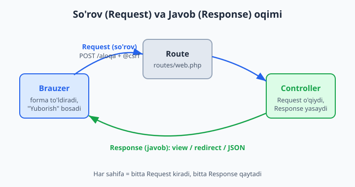
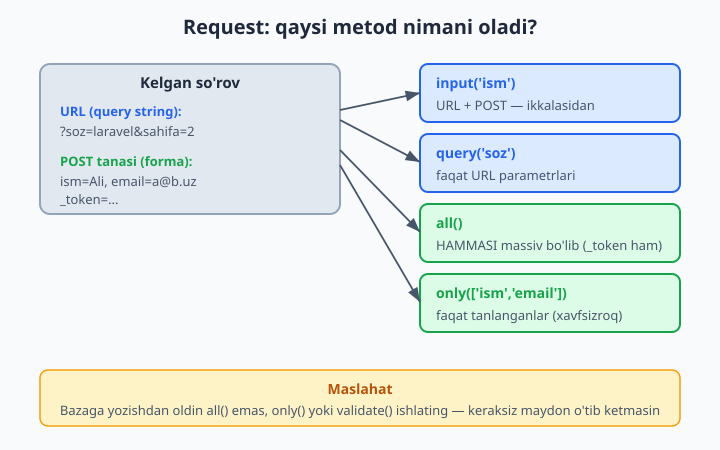
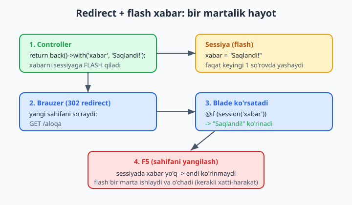

# 6 — Request va Response

[⬅️ Oldingi: 05 — Blade shablonlari](./05-blade.md) · [🏠 README](./README.md) · [Keyingi: 07 — Database va migratsiyalar ➡️](./07-database-migratsiya.md)

> **Bu bobda:** har bir web sahifa ortida turgan ikki narsani — foydalanuvchi yuborgan **so'rov** (request) va biz qaytaradigan **javob** (response) ni o'rganamiz. Forma ma'lumotini olishning to'g'ri yo'llarini (`input()`, `query()`, `all()`, `only()`, `has()`), `@csrf` nega majburiyligini, xatodan keyin formani `old()` bilan qayta to'ldirishni, javob turlarini (view, JSON, redirect), `back()` va `to_route()` farqini, bir martalik **flash** xabarlarni, status kodlarni va `request()` yordamchisini ko'rib chiqamiz.

---

## Muammo

Web ilovaning butun hayoti ikki jumlaga sig'adi: brauzer bir narsa **so'raydi**, server bir narsa **qaytaradi**. Foydalanuvchi forma to'ldirib "Saqlash" bosadi — bu so'rov. Server "saqlandi, mana yangi sahifa" deydi — bu javob. Laravel'da bu ikki narsa ikki obyekt: `Request` va `Response`.

Sof PHP'da forma ma'lumotini `$_POST['ism']` orqali olardingiz. U ishlaydi, lekin muammolari ko'p: kalit yo'q bo'lsa ogohlantirish (warning) chiqadi, ma'lumotni tozalash o'zingizning zimmangizda, xavfsizlik (masalan, soxta forma yuborilishidan himoya) umuman yo'q. Bir misol — ro'yxatdan o'tish formasi:

```php
<?php
// Sof PHP — eski uslub, muammolari bilan
$ism = $_POST['ism'] ?? '';
$email = $_POST['email'] ?? '';
// Forma to'g'ri kelganini qayerdan bilamiz? CSRF himoyasi qani?
// Xato bo'lsa, foydalanuvchi yozganlarini qanday qaytaramiz?
echo "Salom, $ism";
```

Laravel buni bitta toza obyekt — `Request` orqali hal qiladi. Bu obyekt so'rov haqidagi **hamma narsani** biladi: forma maydonlari, URL parametrlari, fayllar, sarlavhalar (headers), foydalanuvchining IP'si. Va u bilan ishlash xavfsiz va sodda:

```php
<?php
// Laravel — bir qatorda, xavfsiz
$ism = $request->input('ism');
```



Bu bob shu ikki obyektni o'rgatadi. Boshlaymiz — eng avval foydalanuvchi yuborgan ma'lumotni qanday olishdan.

## Request obyekti qayerdan keladi?

Laravel har bir controller metodiga `Request` obyektini **o'zi uzatib beradi** — siz faqat uni argument sifatida e'lon qilasiz, qolganini Service Container (Laravel'ning "ichki yetkazib beruvchisi") bajaradi. Buni **dependency injection** (bog'liqlikni avtomatik uzatish) deyiladi:

```php
<?php

namespace App\Http\Controllers;

use Illuminate\Http\Request;

class ProfilController extends Controller
{
    public function saqla(Request $request)
    {
        // $request — tayyor obyekt, foydalanuvchi yuborgan hamma narsa unda
        $ism = $request->input('ism');

        return 'Salom, ' . $ism;
    }
}
```

📌 `use Illuminate\Http\Request;` qatorini unutmang. IDE ko'pincha avtomatik qo'shadi, lekin qo'lda yozsangiz, esda tuting: bu — Laravel'ning `Request` klassi, PHP'ning o'zinikidan emas.

💡 Argument nomi (`$request`) ixtiyoriy, lekin **tipi** (`Request`) muhim. Laravel aynan tipga qarab to'g'ri obyektni topib uzatadi. Shu sabab `Request $request` deb yozish — odat.

## Ma'lumot olish metodlari

Foydalanuvchi yuborgan qiymatlarni olishning bir nechta usuli bor. Hammasini bitta misolda ko'rib chiqamiz.

### `input()` — eng ko'p ishlatiladigani

`input()` GET va POST'ni **bir xil** oladi — maydon qayerdan kelganini bilishingiz shart emas:

```php
<?php
// Bitta maydon:
$ism = $request->input('ism');

// Yo'q bo'lsa — ikkinchi argument default qiymat:
$tur = $request->input('tur', 'oddiy');   // 'tur' yo'q bo'lsa -> 'oddiy'

// Ichma-ich (nested) massiv — nuqta bilan:
$shahar = $request->input('manzil.shahar');
```

📌 `input()` kalit topilmasa **xato bermaydi**, `null` qaytaradi (yoki siz bergan default). Bu `$_POST['ism']`dan asosiy farq — u yerda kalit yo'q bo'lsa "Undefined array key" warning chiqadi.

### `query()` — faqat URL'dan (GET parametrlari)

URL'dagi `?` dan keyingi qism — query string. `query()` faqat shu yerdan oladi:

```php
<?php
// URL: /qidiruv?soz=laravel&sahifa=2
$soz = $request->query('soz');          // 'laravel'
$sahifa = $request->query('sahifa', 1); // 2 (yo'q bo'lsa 1)
```

💡 Qachon `query()`, qachon `input()`? Qidiruv, filtr, sahifalash kabi URL'da turadigan narsalarni `query()` bilan oling — shunda forma POST qilgan maydon bilan adashmaysiz. Oddiy forma maydonlari uchun `input()` yetarli.

### `all()` va `only()` va `except()`

```php
<?php
// Hammasini massiv qilib olish:
$hamma = $request->all();
// ['ism' => 'Ali', 'email' => 'ali@mail.uz', 'parol' => '123', ...]

// Faqat keraklilarini olish (xavfsizroq!):
$malumot = $request->only(['ism', 'email']);

// Bittasidan tashqari hammasini:
$malumot = $request->except(['parol', '_token']);
```

📌 `all()` — qulay, lekin xavfli: foydalanuvchi formangizda **bo'lmagan** maydonni ham qo'shib yuborishi mumkin (masalan, `is_admin=1`). Bazaga yozishdan oldin doim `only()` bilan faqat kutgan maydonlaringizni oling, yoki keyingi bobda ko'radigan validatsiyadan o'tkazing.



### `has()`, `filled()`, `boolean()`

```php
<?php
// Maydon umuman yuborilganmi?
if ($request->has('email')) { /* ... */ }

// Maydon bor VA bo'sh emasmi?
if ($request->filled('email')) { /* ... */ }

// Checkbox uchun: "1", "true", "on", "yes" -> true
$obuna = $request->boolean('obuna');
```

📌 `has()` va `filled()` farqi muhim: foydalanuvchi maydonni bo'sh qoldirsa, `has('email')` baribir `true` qaytaradi (maydon **yuborilgan**, faqat qiymati bo'sh). `filled('email')` esa `false` — chunki ichida hech narsa yo'q. Bo'shligini tekshirmoqchi bo'lsangiz, `filled()` ishlating.

### `request()` yordamchisi

Agar controllerda `$request` argumentini yozishni xohlamasangiz yoki uni boshqa joyda (masalan, Blade'da) ishlatmoqchi bo'lsangiz, global `request()` funksiyasi shu obyektni qaytaradi:

```php
<?php
$ism = request('ism');          // request()->input('ism') ning qisqasi
$hamma = request()->all();
```

💡 `request('ism')` — `request()->input('ism')`ning qisqartmasi. Kichik narsalar uchun qulay, lekin controllerda asosiy uslub baribir `Request $request` argumenti — kod o'qiganda qaysi ma'lumot kayerdan kelayotgani aniq ko'rinadi.

## Forma yuborish: GET, POST va `@csrf`

Endi formani yaratamiz. Avval uni ko'rsatadigan va qabul qiladigan ikkita route kerak:

```php
<?php
// routes/web.php
use App\Http\Controllers\AloqaController;

Route::get('/aloqa', [AloqaController::class, 'forma']);   // formani ko'rsatadi
Route::post('/aloqa', [AloqaController::class, 'yubor']);  // formani qabul qiladi
```

📌 E'tibor bering: **bir xil URL** (`/aloqa`), lekin ikki xil metod. `GET /aloqa` — sahifani ochganda; `POST /aloqa` — "Yuborish" bosilganda. Bu juda keng tarqalgan qolip.

Blade formasi:

```blade
{{-- resources/views/aloqa.blade.php --}}
<form method="POST" action="/aloqa">
    @csrf

    <label>Ismingiz:</label>
    <input type="text" name="ism">

    <label>Xabar:</label>
    <textarea name="xabar"></textarea>

    <button type="submit">Yuborish</button>
</form>
```

`@csrf` — bu yerda eng muhim qator. U formaga yashirin maydon qo'shadi:

```blade
<input type="hidden" name="_token" value="...uzun tasodifiy satr...">
```

**Nega kerak?** CSRF (Cross-Site Request Forgery — "saytlararo so'rovni qalbakilashtirish") — bu hujum turi: yomon niyatli sayt sizning brauzeringiz orqali bizning saytimizga yashirin POST yuborishi mumkin (masalan, "pulni o'tkaz" so'rovi). Token har bir foydalanuvchiga unikal va faqat bizning saytimiz biladi. Shuning uchun begona sayt to'g'ri token yubora olmaydi — Laravel uni rad etadi.

📌 `@csrf`ni **POST, PUT, PATCH, DELETE** formalariga **har doim** qo'ying. Unutsangiz, Laravel `419 | Page Expired` xatosini beradi — bu xatoni ko'rsangiz, birinchi navbatda `@csrf`ni tekshiring. (GET formalariga kerak emas, chunki GET ma'lumotni o'zgartirmasligi kerak.)

💡 PUT/PATCH/DELETE'ni HTML forma to'g'ridan-to'g'ri qo'llab-quvvatlamaydi. Buning uchun `@method('PUT')` yo'riqnomasi bor — u yashirin `_method` maydonini qo'shadi va Laravel so'rovni shunga qarab yo'naltiradi.

Endi qabul qiladigan controller:

```php
<?php

namespace App\Http\Controllers;

use Illuminate\Http\Request;

class AloqaController extends Controller
{
    public function forma()
    {
        return view('aloqa');
    }

    public function yubor(Request $request)
    {
        $malumot = $request->only(['ism', 'xabar']);

        // (haqiqiy ilovada: bazaga saqlash yoki email yuborish)

        return back()->with('xabar', 'Xabaringiz yuborildi, rahmat!');
    }
}
```

## Javob turlari (Response)

Controller **bir narsa qaytarishi shart**. Laravel qaytargan qiymatga qarab to'g'ri HTTP javobini o'zi yasaydi. Asosiy uchta tur bor.

### 1. View qaytarish — HTML sahifa

```php
<?php
public function korsatish()
{
    return view('profil', ['ism' => 'Ali']);
}
```

`view()` — Blade shablonidan to'liq HTML sahifa yasaydi va `200 OK` statusi bilan qaytaradi. Eng ko'p ishlatiladigan javob.

### 2. JSON qaytarish — API uchun

```php
<?php
public function api()
{
    return response()->json([
        'holat' => 'ok',
        'foydalanuvchi' => ['id' => 1, 'ism' => 'Ali'],
    ]);
}
```

📌 Aslida massiv yoki Eloquent modelni to'g'ridan-to'g'ri `return` qilsangiz ham, Laravel uni avtomatik JSON'ga aylantiradi:

```php
<?php
public function royxat()
{
    return ['tillar' => ['PHP', 'JS', 'Python']];  // -> JSON
}
```

Lekin `response()->json()` aniqroq: status kod yoki sarlavha qo'shmoqchi bo'lsangiz, shu yo'l qulay (pastda ko'ramiz). JSON haqida chuqurroq 16-bobda ("API Resources") gaplashamiz.

### 3. Redirect — boshqa sahifaga yo'naltirish

Forma muvaffaqiyatli qabul qilingach, foydalanuvchini **boshqa sahifaga** yuborish kerak — shunda u sahifani yangilaganda (F5) forma takror yuborilmaydi. Bu "Post/Redirect/Get" qolipi:

```php
<?php
// URL bo'yicha:
return redirect('/profil');

// Orqaga (kelgan sahifaga) qaytish:
return back();

// Nomlangan route bo'yicha (eng tavsiya etilgani):
return to_route('profil.korsat');
```

💡 `to_route('profil.korsat')` — nomlangan route'ga yo'naltiradi. Bu URL'ni qo'lda yozishdan yaxshiroq: keyinchalik URL o'zgarsa (`/profil` -> `/mening-profilim`), route nomi o'zgarmagani uchun kodingizni tahrirlash shart bo'lmaydi. (Eski kodda `redirect()->route('...')` ko'rasiz — `to_route()` aynan shuning qisqasi.)



## Flash xabar — bir martalik xabar

Forma yuborilgach, foydalanuvchiga "Saqlandi!" deb ko'rsatmoqchimiz. Lekin redirect qilganimizda — bu yangi so'rov, eski ma'lumot yo'qoladi. Yechim: ma'lumotni sessiyaga **bir martagina** qo'yish — keyingi so'rovda ko'rinadi, undan keyin o'chadi. Bu **flash** xabar:

```php
<?php
return to_route('aloqa.forma')->with('xabar', 'Xabar yuborildi!');
```

`->with('kalit', 'qiymat')` — redirect bilan birga flash ma'lumot qo'yadi. Endi maqsad sahifada uni ko'rsatamiz:

```blade
{{-- Blade'da: --}}
@if (session('xabar'))
    <div class="alert alert-success">
        {{ session('xabar') }}
    </div>
@endif
```

📌 `session('xabar')` flash qiymatni o'qiydi. Sahifani yangilasangiz (F5), xabar **g'oyib bo'ladi** — chunki flash atigi bitta keyingi so'rovda yashaydi. Bu — kerakli xatti-harakat: "Saqlandi!" xabari abadiy turmasligi kerak.

💡 Ko'p loyihalarda muvaffaqiyat va xato xabarlari uchun standart kalitlar ishlatiladi: `success`, `error`, `status`. Masalan `->with('success', '...')`. Keyin asosiy shablonda (layout) bir marta tekshirib, hamma sahifada ishlaydigan qilib qo'yiladi.

## Eski kiritma — `old()` bilan formani qayta to'ldirish

Eng achchiq tajriba: foydalanuvchi uzun formani to'ldiradi, bitta xato qiladi, va... hamma yozganlari yo'qoladi. Laravel buni `old()` bilan hal qiladi.

Validatsiya muvaffaqiyatsiz bo'lganda (keyingi bobda chuqur ko'ramiz), Laravel foydalanuvchi yuborgan ma'lumotni avtomatik flash qiladi. Formada `old()` bilan o'sha qiymatlarni qaytarib qo'yamiz:

```blade
{{-- old('maydon_nomi', 'default') --}}
<input type="text" name="ism" value="{{ old('ism') }}">

<textarea name="xabar">{{ old('xabar') }}</textarea>

{{-- Tanlash uchun (select) ham ishlaydi: --}}
<select name="shahar">
    <option value="toshkent" @selected(old('shahar') == 'toshkent')>Toshkent</option>
    <option value="samarqand" @selected(old('shahar') == 'samarqand')>Samarqand</option>
</select>
```

📌 `old('ism')` — agar oldingi so'rovda `ism` yuborilgan bo'lsa, o'shani qaytaradi; bo'lmasa `null` (yoki ikkinchi argumentdagi default). Forma birinchi marta ochilganda hech narsa flash qilinmagani uchun `old()` bo'sh bo'ladi — bu to'g'ri.

💡 `@selected(...)` va `@checked(...)` — Blade'ning qulay yo'riqnomalari: shart rost bo'lsa, mos atributni (`selected` yoki `checked`) qo'shadi. Checkbox uchun: `<input type="checkbox" name="obuna" @checked(old('obuna'))>`.

❌ Xato: forma sahifasida `old()`ni umuman ishlatmaslik. Unda har bir xatodan keyin foydalanuvchi qaytadan yozadi — yomon tajriba.

✅ To'g'ri: ma'lumot kiritiladigan har bir maydonga `value="{{ old('...') }}"` qo'ying.

## Status kodlar

Har bir HTTP javobning **status kodi** bor — javob qanday tugaganini bildiradigan raqam. Brauzer va boshqa dasturlar shu raqamga qarab ish tutadi.

| Kod | Ma'nosi | Qachon |
|---|---|---|
| 200 | OK | Hammasi joyida (default) |
| 201 | Created | Yangi narsa yaratildi (API) |
| 302 | Found | Redirect (Laravel o'zi qo'yadi) |
| 404 | Not Found | Sahifa/resurs topilmadi |
| 419 | Page Expired | CSRF token yo'q/eskirgan |
| 422 | Unprocessable | Validatsiya o'tmadi |
| 500 | Server Error | Kodda xato bor |

Statusni o'zingiz belgilash:

```php
<?php
// JSON + status:
return response()->json(['xato' => 'Topilmadi'], 404);

// Oddiy matn + status:
return response('Ruxsat yoq', 403);

// 404 sahifani chiqarish (Laravel'ning standart yo'li):
abort(404);
abort(403, 'Bu sahifaga kirish taqiqlangan');
```

📌 `abort(404)` — kodning o'sha yerida ishni to'xtatadi va Laravel'ning 404 sahifasini ko'rsatadi. Masalan, model topilmasa: `$post = Post::find($id); if (! $post) { abort(404); }`. (Keyinchalik buni yanada qisqartiradigan yo'lni ko'ramiz.)

## Sarlavhalar (headers) va cookie — qisqacha

### Headers

Sarlavha — javob bilan birga ketadigan qo'shimcha ma'lumot (qanday tur, qanday kodlash va h.k.). Odatda Laravel uni o'zi to'g'ri qo'yadi, lekin kerak bo'lsa qo'shsa bo'ladi:

```php
<?php
return response('Salom')
    ->header('Content-Type', 'text/plain')
    ->header('X-App-Versiya', '1.0');
```

So'rovning sarlavhasini **o'qish** uchun:

```php
<?php
$turi = $request->header('Accept');      // brauzer qanday javob kutyapti
$agent = $request->userAgent();          // brauzer/qurilma nomi
$ip = $request->ip();                    // foydalanuvchi IP'si
```

### Cookie

Cookie — brauzerda saqlanadigan kichik ma'lumot (keyingi so'rovlarda qaytib keladi). Javobga cookie biriktirish:

```php
<?php
// 60 daqiqaga "til" cookie'si:
return response('Saqlandi')->cookie('til', 'uz', 60);
```

O'qish:

```php
<?php
$til = $request->cookie('til');   // 'uz' yoki null
```

💡 Amalda til, mavzu (qorong'i/yorug'), savatcha kabi narsalar uchun ko'pincha cookie o'rniga **session** ishlatiladi — u serverda saqlanib, xavfsizroq. Cookie esa brauzerda turadi, shuning uchun unga maxfiy ma'lumot yozmang.

## Validatsiyaga kirish

Yuqorida bir necha marta "validatsiya" deb o'tdik. Validatsiya — foydalanuvchi yuborgan ma'lumot **to'g'rimi** (email haqiqiy emailmi, ism bo'sh emasmi) deb tekshirish. Request obyekti buni ham biladi:

```php
<?php
public function yubor(Request $request)
{
    $tekshirilgan = $request->validate([
        'ism' => 'required|min:3',
        'email' => 'required|email',
    ]);

    // Bu yergacha yetib kelsa — hamma narsa to'g'ri.
    // Xato bo'lsa, Laravel avtomatik orqaga qaytaradi va
    // xatolarni hamda old() qiymatlarini o'zi flash qiladi!

    return back()->with('success', 'Qabul qilindi');
}
```

📌 `validate()` o'tmasa, Laravel o'zi: (1) orqaga redirect qiladi, (2) xatolarni flash qiladi (Blade'da `$errors`), (3) eski kiritmani flash qiladi (`old()`). Ya'ni shu bobdagi `old()` va flash mexanizmlari validatsiya bilan birga **avtomatik** ishlaydi. Bu — Laravel'ning kuchli tomoni.

Validatsiya qoidalari, xato xabarlarini ko'rsatish, maxsus xabarlar — bularning hammasini keyingi **12-bob (Validatsiya)** da batafsil o'rganamiz. Hozircha shuni bilsangiz yetarli: Request, `old()` va flash — validatsiyaning poydevori.

## Yakuniy mini-loyiha: aloqa formasi

Hamma narsani bitta ishlaydigan misolda yig'amiz. Aloqa formasi: ko'rsatish, qabul qilish, xato bo'lsa `old()` bilan to'ldirish, muvaffaqiyatda flash.

```php
<?php
// routes/web.php
use App\Http\Controllers\AloqaController;

Route::get('/aloqa', [AloqaController::class, 'forma'])->name('aloqa.forma');
Route::post('/aloqa', [AloqaController::class, 'yubor'])->name('aloqa.yubor');
```

```php
<?php
// app/Http/Controllers/AloqaController.php
namespace App\Http\Controllers;

use Illuminate\Http\Request;

class AloqaController extends Controller
{
    public function forma()
    {
        return view('aloqa');
    }

    public function yubor(Request $request)
    {
        $request->validate([
            'ism' => 'required|min:3',
            'xabar' => 'required|min:10',
        ]);

        // (haqiqiy ilovada bazaga saqlanadi)

        return to_route('aloqa.forma')
            ->with('success', 'Xabaringiz qabul qilindi!');
    }
}
```

```blade
{{-- resources/views/aloqa.blade.php --}}
<h1>Biz bilan bog'laning</h1>

@if (session('success'))
    <p style="color: green">{{ session('success') }}</p>
@endif

<form method="POST" action="{{ route('aloqa.yubor') }}">
    @csrf

    <input type="text" name="ism" value="{{ old('ism') }}" placeholder="Ismingiz">

    <textarea name="xabar" placeholder="Xabaringiz">{{ old('xabar') }}</textarea>

    <button type="submit">Yuborish</button>
</form>
```

Bu kichik misolda butun bob jamlangan: GET/POST route, `@csrf`, `only()`/`validate()`, `to_route()`, `->with()` flash va `old()` bilan qayta to'ldirish. Keyingi bobdan boshlab ma'lumotni **bazaga** saqlashni o'rganamiz — shunda forma haqiqiy ma'noga ega bo'ladi.

## 6-bob mashqlari

Quyidagi mashqlarni yangi (yoki mavjud) Laravel loyihangizda bajaring. Har birini brauzerda sinab ko'ring. Yechim berilmagan — o'zingiz yozasiz.

1. `routes/web.php`da `GET /salom` route yarating: u `request('ism')` orqali URL'dagi `?ism=Ali` ni o'qib, "Salom, Ali" matnini qaytarsin. `?ism=` bermaganda "Salom, mehmon" chiqsin (default qiymat).
2. `GET /qidiruv` route yarating: `query('soz')` va `query('sahifa', 1)` ni o'qib, ularni JSON qilib qaytaring. `/qidiruv?soz=laravel&sahifa=3` ni sinang.
3. `RoyxatController` yarating (`php artisan make:controller`) va unda `forma()` metodi `royxat` view'ini ko'rsatsin. View ichida ism, email, parol maydonli POST forma bo'lsin. `@csrf` ni qo'shing.
4. Formani `@csrf` SIZ yuboring (qo'lda olib tashlang). Brauzerda qanday xato chiqdi (status kodi nechta)? Keyin `@csrf` ni qaytaring.
5. `yubor()` metodida `$request->all()` ni `dd()` bilan chiqaring (`dd($request->all())`). Forma yuborib, qaytgan massivni ko'ring — `_token` ni topdingizmi?
6. O'sha metodda endi `$request->only(['ism', 'email'])` ishlating. `all()` bilan farqini tushuntiring (parol va `_token` qayerda?).
7. `has('email')` va `filled('email')` ni bitta `if` da sinang: email maydonini bo'sh qoldirib yuboring va ikkalasi qanday natija berishini taqqoslang.
8. `boolean('obuna')` ni sinang: formaga `<input type="checkbox" name="obuna">` qo'shing va belgilangan/belgilanmagan holatda qiymatni `dd()` bilan ko'ring.
9. `yubor()` oxirida `back()` bilan orqaga qaytaring. Forma yuborgach, qaysi sahifaga qaytdingiz?
10. Endi `back()` o'rniga `to_route('royxat.forma')` ishlating (route'ga `->name('royxat.forma')` qo'shgan bo'lishingiz kerak). Farqni tushuntiring.
11. Redirect'ga `->with('success', 'Saqlandi!')` qo'shing va forma sahifasida `@if (session('success'))` bilan ko'rsating.
12. Flash xabar ko'ringach, sahifani F5 bilan yangilang. Xabar nima bo'ldi? Nega?
13. Har bir input'ga `value="{{ old('...') }}"` qo'shing. `validate()` ni qo'shib (`'ism' => 'required'`), bo'sh ism bilan yuboring — yozganlaringiz saqlanib qolyaptimi?
14. `<select name="shahar">` qo'shing va `@selected(old('shahar') == '...')` bilan tanlangan shaharni eslab qolishini ta'minlang.
15. `GET /api/tillar` route yarating: u `['PHP', 'Laravel', 'JS']` massivni qaytarsin. Brauzerda ochib, JSON ko'rinishini ko'ring.
16. O'sha javobni `response()->json([...], 201)` ga aylantiring. Brauzerning Network panelida status kodini tekshiring.
17. `GET /yashirin` route yarating: u `abort(404)` chaqirsin. Qanday sahifa ko'rindi?
18. `abort(403, 'Sizga ruxsat yoq')` ni sinab ko'ring va xabar qayerda chiqishini kuzating.
19. `response('Salom')->header('X-App', 'mening-ilovam')` qaytaring. Brauzer Network panelida `X-App` sarlavhasini toping.
20. To'liq aloqa formasini yig'ing: GET ko'rsatadi, POST `validate()` qiladi (`ism: required|min:3`, `xabar: required|min:10`), xato bo'lsa `old()` saqlanadi, muvaffaqiyatda `to_route()` + `->with('success', ...)` flash ishlaydi. Hammasini brauzerda boshidan oxirigacha sinang.

---

[⬅️ Oldingi: 05 — Blade shablonlari](./05-blade.md) · [🏠 README](./README.md) · [Keyingi: 07 — Database va migratsiyalar ➡️](./07-database-migratsiya.md)
