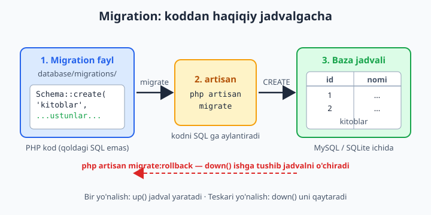
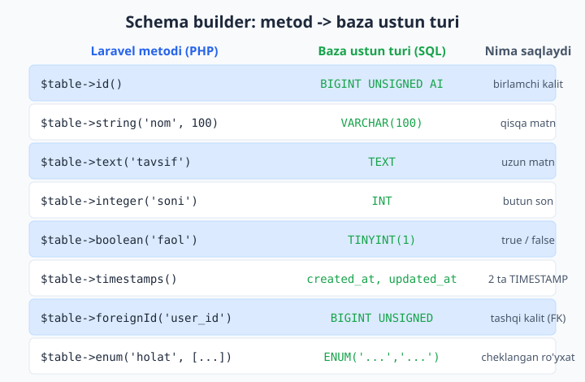
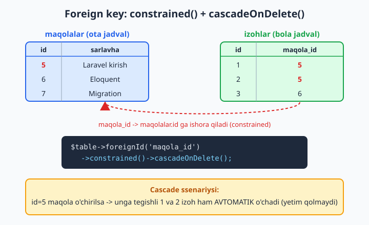

# 7 — Database va migratsiyalar

[⬅️ Oldingi: 06 — Request va Response](./06-request-response.md) · [🏠 README](./README.md) · [Keyingi: 08 — Eloquent ORM — asoslar ➡️](./08-eloquent-asos.md)

> **Bu bobda:** ma'lumotni qayerda saqlaymiz degan savoldan boshlaymiz. `.env` orqali bazani ulashni (tez boshlash uchun SQLite, yoki haqiqiy loyiha uchun MySQL), so'ng asosiy mavzu — **migration**'larni o'rganamiz: baza strukturasini qo'lda SQL yozmasdan, PHP kod bilan, jamoa bilan izchil boshqarishni. `make:migration`, schema builder (ustun turlari, `foreignId`, `enum`), `up()`/`down()` metodlari, `migrate`/`rollback`/`fresh`/`refresh` buyruqlari, tashqi kalitlar (`constrained`, cascade), indekslar (`unique`, `index`) va mavjud jadvalga ustun qo'shish/o'zgartirishni ko'rib chiqamiz.

---

## Muammo

Aytaylik, blog loyihasini yozyapsiz. Sizga `maqolalar` jadvali kerak: sarlavha, matn, chop etilgan-etilmaganligi. Eski usul bo'yicha siz phpMyAdmin'ni ochib, qo'lda SQL yozardingiz:

```sql
CREATE TABLE maqolalar (
    id BIGINT UNSIGNED AUTO_INCREMENT PRIMARY KEY,
    sarlavha VARCHAR(255),
    matn TEXT,
    chop_etilgan TINYINT(1) DEFAULT 0
);
```

Ishladi. Lekin endi haqiqiy hayot boshlanadi:

- Ertaga jamoadosh Dilshod loyihaga qo'shildi. U ham aynan shu jadvalni o'z kompyuterida yaratishi kerak. Siz unga bu SQL'ni qayerdan berasiz? Telegram'dami? Esidan chiqib qolsa-chi?
- Keyingi haftada `korishlar` ustuni kerak bo'ldi. Kim qaysi ustunni qo'shganini, qachon qo'shganini qayerda yozib boriladi?
- Serverga (production) chiqarganda xuddi shu o'zgarishlarni u yerda ham bir-bir takrorlash kerak. Bittasi unutilsa — "column not found" xatosi.

Muammoning ildizi: **baza strukturasi kod emas, shuning uchun u Git'da yo'q, jamoada tarqaladi, esdan chiqadi.** Kod fayllaringiz Git'da versiyalanadi-yu, baza tuzilishi havoda osilib qoladi.

Laravel'ning yechimi — **migration** (migratsiya): baza strukturasini oddiy PHP fayl sifatida yozasiz. Bu fayl Git'da turadi, jamoaning hammasida bir xil bo'ladi, va bitta buyruq bilan har qanday kompyuterda yoki serverda ishga tushadi. Migration — bu **baza uchun versiya nazorati**, xuddi Git fayllar uchun bo'lganidek.



---

## Avval baza: `.env` sozlash

Laravel'ga "qaysi bazaga ulanaman" deb aytishingiz kerak. Bu sozlamalar loyiha ildizidagi `.env` faylida turadi (6-bobda ko'rgan muhit fayli).

### Variant A — SQLite (tez boshlash uchun tavsiya)

SQLite — bu butun bir baza bitta faylda. Hech narsa o'rnatmaysiz, server ishlatmaysiz: shunchaki bitta `.sqlite` fayl. O'rganish va kichik loyihalar uchun ideal. Laravel 11+ da yangi loyiha **default holatda SQLite** bilan keladi:

```env
DB_CONNECTION=sqlite
```

Qolgan `DB_*` qatorlarni (host, port, parol) o'chirib tashlasangiz ham bo'ladi — SQLite'ga ular kerak emas. Baza fayli `database/database.sqlite` da turadi. Agar u hali yo'q bo'lsa, bo'sh fayl sifatida qo'lda yarating:

```bash
touch database/database.sqlite
```

📌 Windows'da `touch` bo'lmasligi mumkin — PowerShell'da `New-Item database/database.sqlite` yoki muharrirda bo'sh `database.sqlite` faylini yarating. Yangi Laravel loyihasini ochishda SQLite tanlasangiz, installer bu faylni o'zi yaratadi — bunda qo'lda yaratish ham shart emas.

### Variant B — MySQL (haqiqiy loyiha uchun)

Agar MySQL o'rnatgan bo'lsangiz (yoki Laravel Herd/Sail ishlatsangiz), `.env` shunday bo'ladi:

```env
DB_CONNECTION=mysql
DB_HOST=127.0.0.1
DB_PORT=3306
DB_DATABASE=blog
DB_USERNAME=root
DB_PASSWORD=
```

📌 `DB_DATABASE` — bu **baza nomi**, va bu bazaning o'zi avval mavjud bo'lishi kerak. Laravel jadvallarni yarata oladi, lekin bo'sh bazani odatda siz qo'lda yaratasiz: MySQL'da `CREATE DATABASE blog;`. (SQLite'da esa bu muammo yo'q — fayl o'zi baza.)

💡 Boshlovchi sifatida bemalol **SQLite**'dan boshlang. Sintaksis va migration'lar ikkalasida ham bir xil — keyinroq `.env` da bitta qatorni o'zgartirib MySQL'ga o'tasiz, kodingizni umuman tegmaysiz. Bu Laravel'ning kuchli tomoni: kodingiz baza turidan deyarli mustaqil.

Ulanish ishlayotganini tekshirish uchun:

```bash
php artisan db:show
```

Agar baza haqida ma'lumot chiqsa — ulanish to'g'ri. Xato chiqsa, `.env` dagi sozlamalarni qayta tekshiring (ko'pincha parol yoki baza nomi).

---

## Migration nima — sekin tushunamiz

Yangi Laravel loyihasini ochsangiz, `database/migrations/` papkasida allaqachon bir nechta fayl turibdi (foydalanuvchilar, cache, jobs uchun). Demak, Laravel'ning o'zi ham migration'lardan foydalanadi.

Migration fayli ikki narsani biladi:

- **`up()`** — "oldinga": jadval yaratadi yoki o'zgartiradi. `php artisan migrate` chaqirilganda shu ishlaydi.
- **`down()`** — "orqaga": `up()` qilgan ishni bekor qiladi (odatda jadvalni o'chiradi). `php artisan migrate:rollback` chaqirilganda shu ishlaydi.

Ya'ni har bir migration — bu ikki tomonlama qadam: ham qo'shadi, ham qaytarib oladi. Bu g'oyani sof PHP'da imitatsiya qilib ko'raylik (Laravel'siz, faqat tushunish uchun):

```php
<?php
abstract class Migration {
    abstract public function up(): void;
    abstract public function down(): void;
}

$baza = [];

$migration = new class($baza) extends Migration {
    public function __construct(private array &$baza) {}
    public function up(): void {
        $this->baza['kitoblar'] = ['id', 'nomi', 'narx'];
        echo "up(): 'kitoblar' jadvali yaratildi\n";
    }
    public function down(): void {
        unset($this->baza['kitoblar']);
        echo "down(): 'kitoblar' jadvali o'chirildi\n";
    }
};

$migration->up();          // 'kitoblar' qo'shildi
$migration->down();        // 'kitoblar' o'chirildi
```

Natija:

```text
up(): 'kitoblar' jadvali yaratildi
down(): 'kitoblar' jadvali o'chirildi
```

Haqiqiy Laravel migration'i aynan shu shaklda: `Migration` klassini meros oladigan **anonim klass** (`return new class extends Migration`), ichida `up()` va `down()`. Faqat massiv o'rniga haqiqiy bazani o'zgartiradi. Siz PHP'dan anonim klassni bilasiz — bu yangi narsa emas.

📌 Nega anonim klass? Migration fayllari ko'p (har biri o'z faylida), va ularga nom (klass nomi) berish shart emas — Laravel ularni fayl nomi orqali biladi. Shuning uchun Laravel 9 dan beri ular nomsiz (anonim) klass sifatida yoziladi.

---

## Birinchi migration: `make:migration`

Endi haqiqiy ish. Blog uchun `maqolalar` jadvalini yaratamiz. Avval bo'sh migration faylini generatsiya qilamiz:

```bash
php artisan make:migration create_maqolalar_table
```

Natija:

```text
INFO  Migration [database/migrations/2026_06_11_100000_create_maqolalar_table.php] created successfully.
```

E'tibor bering:

- Fayl nomi oldida **sana va vaqt** turadi (`2026_06_11_100000`). Bu — migration'larning **tartibi**. Laravel ularni shu sana bo'yicha ketma-ket ishga tushiradi. Shuning uchun "avval `maqolalar`, keyin unga bog'liq `izohlar`" tartibi avtomatik saqlanadi.
- `create_..._table` nomidan Laravel aqlli taxmin qiladi: "bu yangi jadval yaratish" deb, faylga tayyor `Schema::create('maqolalar', ...)` shabloni soladi.

💡 Nom berishda Laravel konvensiyasiga rioya qiling: yangi jadval uchun `create_<jadval>_table`, mavjudini o'zgartirish uchun `add_<ustun>_to_<jadval>_table` yoki `change_..._in_..._table`. Jadval nomi — **ko'plik** va kichik harf (`maqolalar`, `users`), chunki Eloquent (8-bob) shu konvensiyaga tayanadi.

---

## Schema builder: jadvalni kod bilan chizamiz

Yaratilgan faylni ochsak, ichida shunday bo'ladi. Uni to'ldiramiz:

```php
<?php

use Illuminate\Database\Migrations\Migration;
use Illuminate\Database\Schema\Blueprint;
use Illuminate\Support\Facades\Schema;

return new class extends Migration
{
    public function up(): void
    {
        Schema::create('maqolalar', function (Blueprint $table) {
            $table->id();
            $table->string('sarlavha');
            $table->text('matn');
            $table->boolean('chop_etilgan')->default(false);
            $table->integer('korishlar')->default(0);
            $table->timestamp('chop_sana')->nullable();
            $table->timestamps();
        });
    }

    public function down(): void
    {
        Schema::dropIfExists('maqolalar');
    }
};
```

Bu yerda nima bo'lyapti, qator-qator:

- `Schema::create('maqolalar', function (Blueprint $table) { ... })` — "`maqolalar` nomli jadval yarat, uning ustunlarini mana shu funksiya ichida e'lon qilaman". `$table` — bu sizning "qalamingiz", jadvalga ustun chizadigan asbob (`Blueprint`).
- `$table->id()` — `id` nomli avtomatik o'sadigan birlamchi kalit (primary key). Har doim birinchi yoziladi.
- `$table->string('sarlavha')` — `VARCHAR(255)` ustun (qisqa matn). Uzunlikni o'zgartirsangiz: `$table->string('sarlavha', 100)`.
- `$table->text('matn')` — `TEXT` ustun (uzun matn, masalan maqola tanasi).
- `$table->boolean('chop_etilgan')->default(false)` — `true`/`false` ustun, standart qiymati `false`.
- `$table->timestamp('chop_sana')->nullable()` — sana-vaqt ustuni; `nullable()` "bo'sh (NULL) bo'lishi mumkin" degani.
- `$table->timestamps()` — bu bitta chaqiruv **ikkita** ustun yaratadi: `created_at` va `updated_at`. Laravel ularni avtomatik to'ldiradi (yozuv yaratilganda va yangilanganda). Deyarli har jadvalda bo'ladi.

📌 `down()` da nima bo'lishini diqqat bilan o'ylang: `up()` jadval **yaratgan** bo'lsa, `down()` uni **o'chirishi** kerak (`dropIfExists`). Qoida: `down()` har doim `up()` ning teskarisi. Buni to'g'ri yozmasangiz, rollback ishlamaydi.

### Ustun turlari xaritasi

Eng ko'p ishlatiladigan metodlar va ular bazada hosil qiladigan ustun turi:



`enum` — qiymati cheklangan ro'yxatdan biri bo'lishi shart bo'lgan ustun:

```php
$table->enum('holat', ['qoralama', 'tekshiruvda', 'chop_etilgan'])
      ->default('qoralama');
```

Endi bu ustunga faqat shu uch qiymatdan biri yoziladi — boshqasini yozmoqchi bo'lsangiz, baza rad etadi.

💡 Ustunni "majburiy emas" qilish uchun zanjirga `->nullable()` qo'shing; standart qiymat berish uchun `->default(...)`. Bu metodlarni zanjirlash (chaining) mumkin: `$table->string('telefon')->nullable()->default(null)`.

---

## Ishga tushiramiz: `php artisan migrate`

Migration faylini yozdik — lekin bazada hali hech narsa yo'q. Fayl shunchaki "reja". Uni bajarish uchun:

```bash
php artisan migrate
```

Natija:

```text
INFO  Running migrations.

2026_06_11_100000_create_maqolalar_table .................. 24ms DONE
```

Mana endi `maqolalar` jadvali bazada haqiqatan paydo bo'ldi. Laravel sizning PHP kodingizni ichida `CREATE TABLE ...` SQL'iga aylantirib, bazaga yubordi. Siz bironta SQL yozmadingiz.

📌 Laravel qaysi migration'lar allaqachon ishlaganini eslab qoladi — buning uchun u bazada `migrations` nomli maxsus jadval ochadi. Shuning uchun `migrate`'ni qayta chaqirsangiz, eski migration'lar takror ishlamaydi; faqat **yangi** (hali ishlamagan) fayllar bajariladi. Bu jamoada juda muhim: Dilshod loyihani klon qilib `php artisan migrate` desa, bir zumda butun baza strukturasi unda ham paydo bo'ladi — hech qanday qo'lda SQL yo'q.

### Asosiy migration buyruqlari

| Buyruq | Nima qiladi |
|---|---|
| `php artisan migrate` | Hali ishlamagan migration'larni ishga tushiradi (`up()`) |
| `php artisan migrate:rollback` | Eng oxirgi "partiya"ni orqaga qaytaradi (`down()`) |
| `php artisan migrate:rollback --step=1` | Faqat 1 ta oxirgi migration'ni qaytaradi |
| `php artisan migrate:fresh` | HAMMA jadvalni o'chirib, noldan qayta yaratadi |
| `php artisan migrate:refresh` | Hammasini rollback qilib, qaytadan migrate qiladi |
| `php artisan migrate:status` | Qaysi migration ishlagan-ishlamaganini ko'rsatadi |

Ikki muhim farqni ajratamiz:

- **`migrate:rollback`** — `down()` metodlaringizdan foydalanadi (ularni teskari tartibda chaqiradi). Agar `down()` xato yozilgan bo'lsa, rollback ham sinadi.
- **`migrate:fresh`** — `down()` ga umuman qaramaydi. Shunchaki bazadagi **barcha** jadvallarni o'chirib tashlaydi va `up()` larni boshidan yuradi. Tez va ishonchli, lekin **butun ma'lumotni yo'q qiladi**.

⚠️ `migrate:fresh` va `migrate:refresh` butun ma'lumotni o'chiradi. Bu **rivojlanish bosqichida** ajoyib (struktura o'zgardimi — `migrate:fresh` deb noldan tiklaysiz). Lekin **production serverida HECH QACHON** ishlatmang — real foydalanuvchilar ma'lumotini bir lahzada yo'q qiladi.

💡 Rivojlanish paytida migration'ni o'zgartirsangiz (masalan ustun nomini), eng oson yo'l — faylni tahrirlab, `php artisan migrate:fresh` qilish. Allaqachon ishlagan migration faylini tahrirlab, oddiy `migrate` qilsangiz — hech narsa o'zgarmaydi, chunki Laravel "bu fayl ishlagan" deb biladi va uni qayta ishlatmaydi. Yangi boshlovchilar shu yerda ko'p adashadi.

📌 Production'da ma'lumotni saqlab qolib struktura o'zgartirish kerak bo'lsa — `migrate:fresh` emas, **yangi migration** yoziladi (pastdagi "ustun qo'shish" bo'limiga qarang). Bu — to'g'ri yo'l.

---

## Foreign key — jadvallarni bog'lash

Blogimizda endi `izohlar` (kommentariyalar) jadvali kerak. Har bir izoh qaysidir maqolaga tegishli. SQL kursidan (yoki PHP'dagi mantiqdan) bilasiz: bog'lanish **tashqi kalit** (foreign key) orqali bo'ladi — `izohlar` jadvalida `maqola_id` ustuni `maqolalar` jadvalining `id` siga ishora qiladi.

Laravel buni juda chiroyli qiladi:

```bash
php artisan make:migration create_izohlar_table
```

```php
<?php

use Illuminate\Database\Migrations\Migration;
use Illuminate\Database\Schema\Blueprint;
use Illuminate\Support\Facades\Schema;

return new class extends Migration
{
    public function up(): void
    {
        Schema::create('izohlar', function (Blueprint $table) {
            $table->id();
            $table->foreignId('maqola_id')->constrained()->cascadeOnDelete();
            $table->foreignId('user_id')->constrained();
            $table->text('matn');
            $table->timestamps();
        });
    }

    public function down(): void
    {
        Schema::dropIfExists('izohlar');
    }
};
```

Ikkita yangi tushuncha bor:

- **`$table->foreignId('maqola_id')`** — `BIGINT UNSIGNED` ustun yaratadi. Bu — `id()` bilan bir xil tur, chunki u boshqa jadvalning `id` siga mos kelishi kerak.
- **`->constrained()`** — "bu ustunni haqiqiy tashqi kalit qil". Laravel ustun nomidan (`maqola_id`) jadval nomini taxmin qiladi: `maqola` -> ko'plik `maqolalar` -> uning `id` ustuniga bog'la. Sehr emas, qat'iy konvensiya: `<jadval_birlik>_id` -> `<jadvallar>.id`.
- **`->cascadeOnDelete()`** — "agar maqola o'chirilsa, unga tegishli izohlar ham avtomatik o'chsin". Bu **cascade** (zanjirli o'chirish).



📌 **Tartib muhim!** `izohlar` migration'i `maqolalar` migration'idan **keyin** ishlashi shart — chunki bog'lanish uchun `maqolalar` jadvali allaqachon mavjud bo'lishi kerak. Bu o'z-o'zidan to'g'ri bo'ladi: `make:migration`'ni `maqolalar` uchun avval, `izohlar` uchun keyin chaqirgansiz, demak fayl nomidagi sana ham shunday tartibda.

### Agar nom konvensiyaga mos kelmasa

`->constrained()` taxmin qila olmasa (masalan ustun `muallif_id`, lekin jadval `users`), jadval nomini o'zingiz aytasiz:

```php
$table->foreignId('muallif_id')->constrained('users')->cascadeOnDelete();
```

`onDelete` xatti-harakatini boshqa usulda ham yozsa bo'ladi (ikkalasi bir xil):

```php
$table->foreignId('maqola_id')
      ->constrained()
      ->onDelete('cascade');     // = cascadeOnDelete()
```

Boshqa variantlar: `->nullOnDelete()` (ota o'chsa, `maqola_id` ni `NULL` qiladi), `->restrictOnDelete()` (izohi bor maqolani o'chirishga umuman yo'l qo'ymaydi).

💡 Qaysi birini tanlash mantiqqa bog'liq. Izoh maqolasiz mantiqsiz — demak `cascadeOnDelete()`. Lekin, masalan, "buyurtma"ni o'chirsangiz, "mijoz"ni o'chirib bo'lmaydi (mijozning boshqa buyurtmalari bor) — bu yerda `restrictOnDelete()` to'g'riroq.

---

## Indekslar: `unique` va `index`

Ikki muammoni hal qilamiz.

**1-muammo: takrorlanmaslik.** Foydalanuvchilar jadvalida ikki kishi bir xil email bilan ro'yxatdan o'tmasligi kerak. Buni baza darajasida kafolatlash uchun `unique`:

```php
$table->string('email')->unique();
```

Endi baza bir xil email'ni ikki marta yozishga yo'l qo'ymaydi — ikkinchi urinishda xato qaytaradi. Bu validatsiyadan (12-bob) ham kuchliroq himoya, chunki u **baza darajasida**: hatto kodda xato bo'lsa ham, takror yozilmaydi.

**2-muammo: tezlik.** Agar `slug` ustuni bo'yicha tez-tez qidirsangiz (`WHERE slug = '...'`), unga **index** qo'ying — baza qidiruvni tezlashtiradi (kitobning mundarijasi kabi):

```php
$table->string('slug');
$table->index('slug');
```

Bir nechta ustunni birgalikda noyob qilish (kompozit unikal) — masalan bir foydalanuvchi bir maqolaga faqat bir marta ovoz bersin:

```php
$table->unique(['user_id', 'maqola_id']);
```

To'liq misol:

```php
<?php

use Illuminate\Database\Migrations\Migration;
use Illuminate\Database\Schema\Blueprint;
use Illuminate\Support\Facades\Schema;

return new class extends Migration
{
    public function up(): void
    {
        Schema::create('foydalanuvchilar', function (Blueprint $table) {
            $table->id();
            $table->string('email')->unique();
            $table->string('telefon')->nullable();
            $table->string('slug');
            $table->enum('rol', ['admin', 'muharrir', 'oddiy'])->default('oddiy');
            $table->index('slug');
            $table->timestamps();
        });
    }

    public function down(): void
    {
        Schema::dropIfExists('foydalanuvchilar');
    }
};
```

📌 `unique` ham aslida bir turdagi indeks — u ham qidiruvni tezlashtiradi, ham takrorlanishni taqiqlaydi. Farqi: `index` faqat tezlik uchun, takrorlashga ruxsat beradi; `unique` esa qo'shimcha ravishda takrorlashni man qiladi.

---

## Mavjud jadvalga ustun qo'shish va o'zgartirish

Eng tez-tez uchraydigan vaziyat: loyiha ishlab turibdi, baza to'la, va sizga yangi ustun kerak bo'lib qoldi. Eski migration faylini **tahrirlamaysiz** (u allaqachon ishlagan, qaytib ishlamaydi, qolaversa serverdagi ma'lumotni yo'qotib qo'yasiz). To'g'ri yo'l — **yangi** migration:

```bash
php artisan make:migration add_qisqacha_to_maqolalar_table
```

Bu safar `create` emas, `Schema::table` (mavjud jadvalni **o'zgartirish**):

```php
<?php

use Illuminate\Database\Migrations\Migration;
use Illuminate\Database\Schema\Blueprint;
use Illuminate\Support\Facades\Schema;

return new class extends Migration
{
    public function up(): void
    {
        Schema::table('maqolalar', function (Blueprint $table) {
            $table->string('qisqacha', 200)->nullable()->after('sarlavha');
            $table->boolean('tavsiya')->default(false);
        });
    }

    public function down(): void
    {
        Schema::table('maqolalar', function (Blueprint $table) {
            $table->dropColumn(['qisqacha', 'tavsiya']);
        });
    }
};
```

- `Schema::table(...)` — `create` emas: mavjud jadvalga **qo'shimcha** kiritadi.
- `->after('sarlavha')` — yangi ustun qaysi ustundan keyin tursin (MySQL'da; SQLite buni e'tiborsiz qoldiradi).
- `down()` da `dropColumn` bilan qo'shgan ustunlarni olib tashlaymiz — yana o'sha qoida: `down()` = `up()` teskarisi.

So'ng odatdagidek:

```bash
php artisan migrate
```

Faqat shu yangi migration ishlaydi, mavjud ma'lumot saqlanib qoladi, jadvalga ikki yangi ustun qo'shiladi.

### Ustunni o'zgartirish va nomini almashtirish

Mavjud ustun turini o'zgartirish uchun `->change()`, nomini almashtirish uchun `renameColumn`:

```php
public function up(): void
{
    Schema::table('maqolalar', function (Blueprint $table) {
        $table->string('sarlavha', 250)->change();   // 255 -> 250
        $table->renameColumn('matn', 'tana');         // ustun nomi
    });
}
```

📌 `->change()` ustunning **to'liq** yangi ta'rifini talab qiladi. Ya'ni agar ustun avval `nullable` bo'lgan bo'lsa va siz `->change()` da `nullable()` yozmasangiz, u `NOT NULL` ga aylanib qoladi. Shuning uchun `change()` da ustunning hamma xususiyatlarini qayta yozing, faqat o'zgartirmoqchi bo'lgan qismni emas.

💡 `down()` ni ham mos yozing: `change()` da eski turiga qaytaring (`250` -> `255`), `renameColumn` da nomni teskari almashtiring (`tana` -> `matn`). Aks holda rollback bazani noto'g'ri holatga keltiradi.

---

## Hammasini birlashtirib: tipik ish oqimi

Kundalik amalda migration bilan ishlash quyidagicha ko'rinadi:

1. Yangi jadval/ustun kerak bo'ldi -> `php artisan make:migration ...`
2. Faylni ochib, `up()` (va albatta `down()`) ni yozasiz.
3. `php artisan migrate` — bazaga qo'llaysiz.
4. Xato qildingizmi yoki strukturani o'zgartirmoqchimisiz (rivojlanishda) -> `php artisan migrate:rollback` yoki `php artisan migrate:fresh`.
5. Tayyor bo'lsa — migration faylni Git'ga commit qilasiz. Endi butun jamoa va server xuddi shu strukturani bir buyruq bilan oladi.

📌 Migration — bu Eloquent (8-bob) bilan ishlashning poydevori. Migration jadval **strukturasini** yaratadi; Eloquent esa o'sha jadval bilan PHP obyektlari orqali **ma'lumot** almashadi. Avval skelet (migration), keyin jon (Eloquent). 8-bobda aynan shu `maqolalar` jadvalini Eloquent model bilan jonlantiramiz.

✅ To'g'ri: har struktura o'zgarishi uchun yangi migration; `down()` doim yoziladi; jadval nomi ko'plik; FK uchun `foreignId(...)->constrained()`.

❌ Xato: phpMyAdmin'da qo'lda jadval yaratish; ishlagan migration'ni tahrirlash; `down()` ni bo'sh qoldirish; production'da `migrate:fresh`.

---

## 7-bob mashqlari

Quyidagi mashqlarni o'zingiz bajaring — yechimlari berilmagan. Yangi Laravel loyihasida (yoki o'rganish loyihasida) ishlang. Avvalgilari yengil, asta-sekin qiyinlashadi.

1. Yangi Laravel loyihasida `.env` faylini ochib, `DB_CONNECTION=sqlite` qilib sozlang va `touch database/database.sqlite` (yoki Windows'da `New-Item database/database.sqlite`) bilan bo'sh baza faylini yarating. `php artisan migrate` ni ishga tushirib, default jadvallar yaratilganiga ishonch hosil qiling.

2. `.env` da bazani MySQL'ga o'tkazib sozlang (`DB_CONNECTION=mysql` va qolgan `DB_*` qiymatlari). `php artisan db:show` bilan ulanishni tekshiring. (MySQL yo'q bo'lsa, bu mashqni o'qib chiqing va SQLite'da davom eting.)

3. `php artisan make:migration create_kitoblar_table` buyrug'i bilan migration yarating. Yaratilgan faylni toping va fayl nomi oldidagi sana-vaqt nima uchun kerakligini bir jumlada izohlab yozing.

4. `kitoblar` jadvaliga quyidagi ustunlarni qo'shing: `id`, `nomi` (string), `tavsif` (text), `sahifalar` (integer), `mavjud` (boolean, default true), `timestamps`. So'ng `php artisan migrate` qiling.

5. `down()` metodida `Schema::dropIfExists('kitoblar')` borligiga ishonch hosil qiling. So'ng `php artisan migrate:rollback` qilib, jadval o'chganini, qayta `php artisan migrate` qilib, qayta yaratilganini kuzating.

6. `kitoblar` jadvaliga `narx` ustunini `decimal('narx', 8, 2)` sifatida qo'shing (hujjatdan `decimal` metodini izlang). Migration'ni qayta yarating yoki `migrate:fresh` qiling.

7. `nomi` ustunini majburiy emas (`nullable`) qilib, default qiymati `null` bo'ladigan qilib o'zgartiring. Buning uchun yangi migration emas, `migrate:fresh` dan oldin asl migration faylini tahrirlang.

8. Yangi `mualliflar` jadvali yarating: `id`, `ism` (string), `davlat` (string, nullable), `timestamps`.

9. `kitoblar` jadvaliga `muallif_id` ustunini `foreignId(...)->constrained()` bilan qo'shing, shunda u `mualliflar` jadvaliga bog'lansin. Migration tartibiga (qaysi avval ishlashi kerak) e'tibor bering.

10. 9-mashqdagi tashqi kalitga `cascadeOnDelete()` qo'shing. So'ng Tinker'da (`php artisan tinker`) bitta muallif va unga bog'liq kitob yaratib, muallifni o'chirib, kitob ham o'chganini tekshiring.

11. `kitoblar` jadvaliga `isbn` (string) ustunini `unique()` bilan qo'shing. Bir xil ISBN'ni ikki marta kiritishga urinib, baza xato qaytarishini kuzating.

12. `kitoblar` jadvaliga `slug` ustunini qo'shib, unga `index()` qo'ying. Indeks nima uchun kerakligini ikki jumlada izohlang.

13. `kitoblar` jadvaliga `holat` nomli `enum` ustun qo'shing: `['mavjud', 'tugagan', 'buyurtmada']`, default `'mavjud'`. Ro'yxatda yo'q qiymat kiritishga urinib ko'ring.

14. Yangi migration yozib (`add_..._to_kitoblar_table`), `kitoblar` jadvaliga `chegirma` (integer, default 0) ustunini `after('narx')` bilan qo'shing. Faqat shu migration ishlaganini `migrate:status` bilan tasdiqlang.

15. 14-mashqdagi migration uchun `down()` metodini `dropColumn` bilan to'g'ri yozing, so'ng `migrate:rollback --step=1` bilan faqat shu ustunni olib tashlang.

16. `kitoblar` jadvalidagi `nomi` ustunini `renameColumn` orqali `sarlavha` ga o'zgartiruvchi migration yozing. `down()` da teskari almashtirishni ham yozing.

17. `kitoblar` jadvalidagi `nomi` ustun turini `string('nomi', 100)` dan `string('nomi', 250)` ga `->change()` orqali o'zgartiring. `change()` da ustunning barcha xususiyatlarini qayta yozish nega zarurligini izohlang.

18. Ikki ustunli kompozit unikal indeks yarating: yangi `baholar` jadvalida (`foydalanuvchi_id`, `kitob_id`) juftligi takrorlanmasin (`$table->unique([...])`). Bir foydalanuvchi bir kitobga ikki marta baho bera olmasligini ta'minlang.

19. `migrate:rollback` va `migrate:fresh` farqini amalda ko'rsating: ikkalasini ham ishlatib, qaysi biri `down()` ga tayanishini, qaysi biri hamma jadvalni o'chirishini yozma tushuntiring. Nega production'da `migrate:fresh` xavfli ekanini ham qo'shing.

20. To'liq mini-loyiha: `kategoriyalar` (id, nomi) va `mahsulotlar` (id, nomi, narx decimal, `kategoriya_id` -> constrained + cascade, `faol` boolean, `slug` unique, `holat` enum, timestamps) jadvallari uchun ikkita migration yozing. To'g'ri tartibda `migrate` qiling, so'ng `migrate:fresh` bilan butun strukturani noldan qayta tiklang va `migrate:status` bilan hammasini tasdiqlang.
