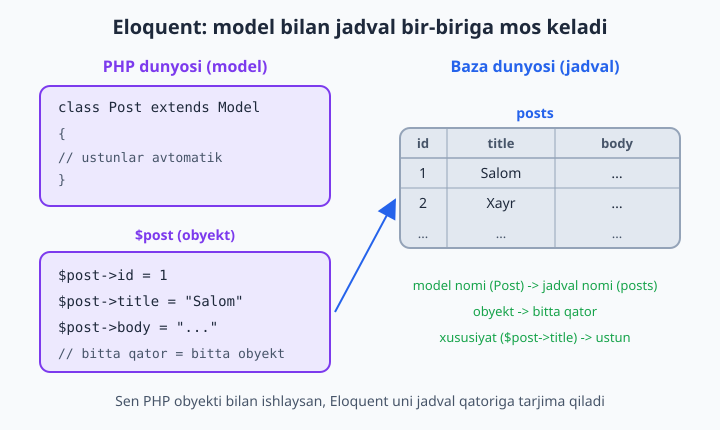
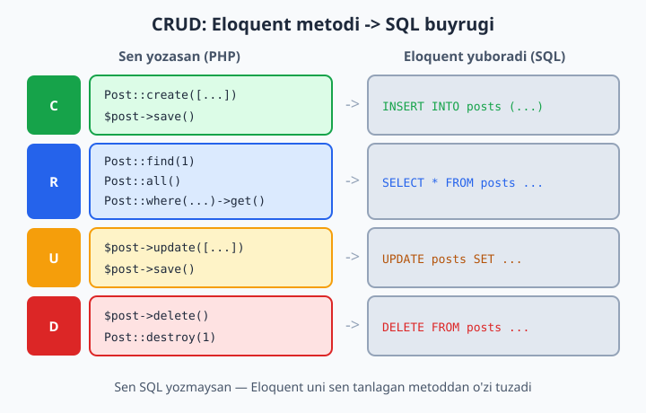
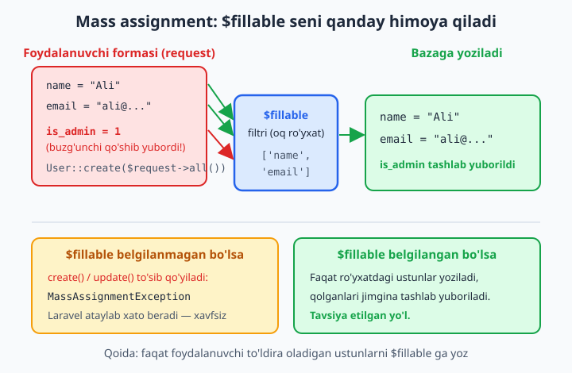

# 8 — Eloquent ORM — asoslar

[⬅️ Oldingi: 07 — Database va migratsiyalar](./07-database-migratsiya.md) · [🏠 README](./README.md) · [Keyingi: 09 — Eloquent munosabatlari ➡️](./09-eloquent-munosabat.md)

> **Bu bobda:** 7-bobda jadval tuzdik, endi unga ma'lumot yozish va o'qishni qo'lda SQL yozmasdan, sof PHP obyektlari orqali o'rganamiz. Eloquent ORM nima ekanini, model bilan jadval qanday bog'lanishini, CRUD'ning to'rt amalini (`create`, `find`/`all`/`where`, `update`/`save`, `delete`) ko'ramiz. Mass assignment xavfini va `$fillable` himoyasini, `firstOrCreate`/`updateOrCreate` qulayliklarini, avtomatik `timestamps`, `$casts` orqali turlarni avtomatik o'girishni, Tinker'da jonli sinashni va `softDeletes` bilan "o'chirgandek qilib" saqlashni o'rganamiz.

---

## Muammo

7-bobda `posts` jadvalini migration bilan yaratdik. Endi unga blog postini yozish kerak. Sof PHP'da (PDO bilan) bu shunday ko'rinardi:

```php
$pdo = new PDO('mysql:host=localhost;dbname=blog', 'root', '');
$stmt = $pdo->prepare(
    'INSERT INTO posts (title, body, created_at, updated_at) VALUES (?, ?, NOW(), NOW())'
);
$stmt->execute(['Birinchi post', 'Salom, dunyo!']);
$id = $pdo->lastInsertId();
```

Bitta qator qo'shish uchun: ulanish, SQL matnini qo'lda yozish, har bir ustunni `?` bilan moslash, sanalarni qo'lda qo'yish... Endi postni o'qish, yangilash, o'chirish kerak bo'lsa — yana uchta uzun SQL. Jadvalga bitta ustun qo'shsangiz, hamma `INSERT` va `UPDATE`'ni qo'lda tuzatasiz. Ustun nomida xato qilsangiz, kod ishga tushgandagina bilasiz.

Laravel buni butunlay boshqacha qiladi. Sen SQL emas, **PHP obyektlari** bilan ishlaysan:

```php
$post = Post::create([
    'title' => 'Birinchi post',
    'body'  => 'Salom, dunyo!',
]);

echo $post->id;   // yangi qatorning id'si tayyor
```

Bitta qator. SQL yo'q, sana yo'q, `?` yo'q. Mana shu sehrning nomi — **Eloquent ORM**.

## Eloquent ORM nima?

**ORM** — *Object-Relational Mapping*, ya'ni "obyekt ↔ jadval xaritalash". Maqsadi: baza jadvalini PHP klassiga, jadval qatorini esa shu klass obyektiga **aylantirish**. Sen `INSERT`/`SELECT` o'rniga `->save()`, `->find()` kabi metodlar chaqirasan; ORM ularni perda ortida SQL'ga tarjima qiladi.

**Eloquent** — Laravel'ning ORM'i. Uning markazida **model** turadi: bitta jadval ustidan ishlaydigan PHP klass. `Post` modeli `posts` jadvalini, model obyekti esa shu jadvaldagi bitta qatorni ifodalaydi.



📌 ORM faqat Laravel'da emas — har tilning o'zining ORM'i bor (Python'da Django ORM, Node'da Prisma). Tushuncha bitta: SQL'ni obyekt ortiga yashirish. Eloquent — eng yoqimli ORM'lardan biri deyiladi, chunki kodi qisqa va o'qish oson.

💡 Eloquent SQL'ni butunlay yashirmaydi — kerak bo'lganda baribir murakkab so'rovlarni yozasan (10-bobda Query Builder'ni ko'ramiz). Eloquent kunlik 90% ishni — oddiy CRUD'ni — chiroyli qiladi.

## Birinchi model yasash

Model — `app/Models` papkasidagi oddiy PHP klass. Uni qo'lda yozish shart emas, `artisan` yasab beradi:

```bash
php artisan make:model Post
```

Bu `app/Models/Post.php` faylini yaratadi:

```php
<?php

namespace App\Models;

use Illuminate\Database\Eloquent\Model;

class Post extends Model
{
    //
}
```

E'tibor ber: klass deyarli bo'sh, lekin allaqachon hamma ishni qiladi. Sababi — u `Model`'dan voris (`extends Model`) bo'lib, `create`, `find`, `where` kabi yuzlab metodni tayyor oladi. Sen PHP'dagi vorislikni bilasan — bu xuddi shu.

**Eng qulay yo'l — model + migration birga.** `-m` (yoki `--migration`) bayrog'i modelni va unga mos migration faylini bir vaqtda yaratadi:

```bash
php artisan make:model Post -m
```

💡 Yana foydali bayroqlar (birga ishlatsa bo'ladi): `-c` controller, `-f` factory, `-s` seeder, `-r` resource controller. Hammasini bittada: `php artisan make:model Post -mcsf`. Eng qisqasi `--all` (yoki `-a`) — model, migration, factory, seeder va controllerni birvarakayiga yasaydi.

📌 Modelni **birlik** (singular) va **bosh harf** bilan nomla: `Post`, `User`, `Category`. Ko'plik (`Posts`) emas. Sababini hozir ko'ramiz.

## Konvensiya: model ↔ jadval nomi

Eloquent'ning "sehri" aslida **konvensiya** (kelishilgan qoida) — Laravel taxmin qiladi, sen takrorlamaysan:

| Model (klass) | Eloquent kutadigan jadval |
|---|---|
| `Post` | `posts` |
| `User` | `users` |
| `Category` | `categories` |
| `BlogComment` | `blog_comments` |

Qoida: **modelning ingliz ko'pligi, snake_case** ko'rinishi — jadval nomi bo'ladi. `Post` → `posts`, `Category` → `categories` (ingliz ko'pligini ham to'g'ri taxmin qiladi).

Yana ikki muhim konvensiya:
- **Primary key** — `id` deb taxmin qilinadi.
- **Timestamps** — `created_at` va `updated_at` ustunlari bor deb taxmin qilinadi (migration'da `$table->timestamps()` shularni yaratadi).

Agar jadvaling nomi konvensiyaga to'g'ri kelmasa (mas. eski bazada `tbl_posts`), modelda aniq ayt:

```php
class Post extends Model
{
    protected $table = 'tbl_posts';     // jadval nomi
    protected $primaryKey = 'post_id';  // boshqa primary key
    public $timestamps = false;         // created_at/updated_at yo'q
}
```

💡 Yangi loyihada konvensiyaga ergashing — shunda bu uchta qatorni hech qachon yozmaysiz. Konvensiya — Laravel falsafasining asosi: "qoidaga yur, kod kamayadi".

## CRUD — to'rt asosiy amal

Baza bilan ishlash aslida to'rt amaldan iborat: **C**reate (yaratish), **R**ead (o'qish), **U**pdate (yangilash), **D**elete (o'chirish). Eloquent har biriga sodda metod beradi.



Quyidagi misollar uchun modelimizga `$fillable` qo'shib qo'yamiz (nega kerakligini "Mass assignment" bo'limida tushuntiramiz):

```php
class Post extends Model
{
    protected $fillable = ['title', 'body'];
}
```

### Create — yaratish

Ikki yo'l bor. Birinchisi — `create()`: massiv beriladi, qator yoziladi, yangi obyekt qaytadi:

```php
use App\Models\Post;

$post = Post::create([
    'title' => 'Birinchi post',
    'body'  => 'Salom, Laravel!',
]);

echo $post->id;          // mas. 1 — baza bergan yangi id
echo $post->created_at;  // avtomatik to'ldirilgan sana
```

Ikkinchisi — yangi obyekt yasab, xususiyatlarni qo'yib, `save()` chaqirish:

```php
$post = new Post();
$post->title = 'Ikkinchi post';
$post->body  = 'Yana bir matn';
$post->save();           // shu yerda INSERT yuboriladi
```

📌 Farq: `create()` bitta qadamda hamma ishni qiladi va `$fillable` filtridan o'tadi (xavfsizroq). `new + save()` esa qadamma-qadam — qiymatlarni alohida-alohida qo'yganingda qulay. `save()` — INSERT ham, UPDATE ham qiladi: yangi obyekt bo'lsa INSERT, mavjud (id'si bor) bo'lsa UPDATE.

### Read — o'qish

`find()` — id bo'yicha bitta qator. Topilmasa `null`:

```php
$post = Post::find(1);

if ($post) {
    echo $post->title;
}
```

`findOrFail()` — xuddi shu, lekin topilmasa `null` emas, **xato** (`ModelNotFoundException`) tashlaydi. Laravel buni avtomatik **404** sahifaga aylantiradi — controllerda juda qulay:

```php
$post = Post::findOrFail(1);   // yo'q bo'lsa -> 404 sahifa
echo $post->title;
```

💡 Qoida: foydalanuvchi URL'idan kelgan id uchun `findOrFail` ishlat — "bunday post yo'q" holatini o'zing tekshirishing shart bo'lmaydi, Laravel 404 ni o'zi chiqaradi.

`all()` — hamma qator (to'plam qaytadi):

```php
$posts = Post::all();

foreach ($posts as $post) {
    echo $post->title . "\n";
}
```

`where()` — shart bilan filtrlash. Oxirida `get()` (ko'p qator) yoki `first()` (birinchisi):

```php
// Barcha e'lon qilingan postlar (ro'yxat):
$published = Post::where('is_published', true)->get();

// Birinchi mos kelgani (bitta obyekt yoki null):
$one = Post::where('title', 'Birinchi post')->first();

// Zanjir: shart + tartib + cheklov
$latest = Post::where('is_published', true)
    ->orderBy('created_at', 'desc')
    ->limit(5)
    ->get();

// Nechta bor?
$count = Post::where('is_published', true)->count();
```

📌 `all()` va `get()` **Collection** (to'plam) qaytaradi — bu oddiy massivdan kuchliroq obyekt: ustidan `foreach` qilsa bo'ladi, lekin `map`, `filter`, `pluck`, `sum` kabi qulay metodlar ham bor. `find()` va `first()` esa **bitta model obyekti** (yoki `null`) qaytaradi — buni adashtirib qo'ymang: Collection ustidan `->title` o'qib bo'lmaydi.

❌ `Post::where('is_published', true)` — `get()`siz natija bermaydi (bu hali "so'rov tayyorlanmoqda" holati).
✅ `Post::where('is_published', true)->get()` — mana endi baza so'roviga aylandi.

### Update — yangilash

Avval qatorni topib olasan, keyin yangilaysan. Ikki yo'l:

```php
// 1-yo'l: update() bilan bir qatorda
$post = Post::findOrFail(1);
$post->update(['title' => 'Yangilangan sarlavha']);

// 2-yo'l: xususiyatni o'zgartirib, save()
$post = Post::findOrFail(1);
$post->title = 'Boshqacha sarlavha';
$post->save();
```

Ikkalasi ham `UPDATE posts SET ... WHERE id = 1` yuboradi va `updated_at` ni avtomatik yangilaydi.

💡 Bir nechta qatorni bittada yangilash (topib o'tirmasdan):

```php
// Hamma qoralamani e'lon qilingan qilamiz:
Post::where('is_published', false)->update(['is_published' => true]);
```

### Delete — o'chirish

```php
// Obyektni topib o'chirish:
$post = Post::findOrFail(1);
$post->delete();

// To'g'ridan-to'g'ri id bo'yicha:
Post::destroy(1);
Post::destroy([1, 2, 3]);   // bir nechtasini birdan

// Shart bo'yicha:
Post::where('is_published', false)->delete();
```

📌 `delete()` — obyekt ustida, `destroy()` — model ustida (statik). `destroy` qulay, lekin qator avval o'qilmaydi — shuning uchun model "o'chirilmoqda" hodisalari (events, 21-bobda) ishlamasligi mumkin. Oddiy holatda ikkalasi ham yaxshi.

## Mass assignment va $fillable — XAVFSIZLIK

Endi `$fillable`ning nega kerakligini tushunamiz — bu bobning eng muhim qismi.

**Mass assignment** ("ommaviy belgilash") — bitta massiv bilan ko'p ustunni birdan to'ldirish, ya'ni aynan `create([...])` va `update([...])` qiladigan ish. Qulay, lekin xavfli bo'lishi mumkin.

Tasavvur qil: ro'yxatdan o'tish formasi bor. Controllerda shunday yozding:

```php
// ❌ XAVFLI: formadan kelgan HAMMA narsa bazaga ketadi
User::create($request->all());
```

Foydalanuvchi formada `name` va `email` to'ldiradi. Lekin buzg'unchi brauzer vositalaridan foydalanib, so'rovga yana bitta maydon qo'shib yuboradi: `is_admin=1`. `$request->all()` uni ham oladi, `create` esa bazaga yozadi — va buzg'unchi o'zini admin qilib oldi. Bu **mass assignment vulnerability** — mashhur xavflardan biri.

Laravel buni oldindan bloklaydi. Sen modelda **qaysi ustunlarni ommaviy to'ldirish mumkinligini** aniq aytishing kerak — bu **oq ro'yxat** (`$fillable`):

```php
class Post extends Model
{
    protected $fillable = ['title', 'body', 'is_published'];
}
```

Endi `is_admin` kabi ro'yxatda yo'q ustun `create`/`update` orqali **hech qachon** yozilmaydi — Eloquent uni jimgina tashlab yuboradi.



📌 Agar `$fillable` (yoki `$guarded`) belgilanmagan bo'lsa, Laravel `create`/`update`ni **butunlay to'sib qo'yadi** va `MassAssignmentException` xatosini beradi. Ya'ni "esimdan chiqdi" deb xavfsiz ustun ochiq qolmaydi — bu ataylab shunday qilingan.

💡 `$fillable`ga qarama-qarshi `$guarded` ham bor — u **qora ro'yxat**: "shulardan boshqa hammasini to'ldirsa bo'ladi".

```php
protected $guarded = ['id', 'is_admin'];   // shulardan tashqari hammasi mumkin
```

Amalda **`$fillable` afzal** — "nimaga ruxsat berilganini" sanab chiqish "nimani taqiqlashni" sanashdan xavfsizroq: yangi ustun qo'shsang, u avtomatik himoyalangan bo'ladi (ro'yxatga qo'shmaguningcha to'ldirilmaydi). `$guarded`da esa yangi ustun avtomatik ochiq qolib ketadi.

✅ `$fillable = ['title', 'body']` — foydalanuvchi to'ldira oladigan ustunlargina.
❌ `$guarded = []` — "hammasi mumkin", himoya o'chiq. Faqat o'zing nazorat qiladigan ma'lumotda ishlat, formada hech qachon.

📌 `id`, `created_at`, `updated_at`ni `$fillable`ga **qo'shma** — ularni Eloquent o'zi boshqaradi.

## firstOrCreate va updateOrCreate

Ko'pincha "bor bo'lsa ol, yo'q bo'lsa yarat" mantiqi kerak bo'ladi. Qo'lda yozsa uch qatorli `if`, Eloquent'da bir qator:

**`firstOrCreate`** — birinchi argument bo'yicha qidiradi; topsa o'shani qaytaradi, topmasa ikkala massivni birlashtirib **yangi yaratadi**:

```php
$post = Post::firstOrCreate(
    ['title' => 'Yagona sarlavha'],   // shu bo'yicha qidiradi
    ['body'  => 'Standart matn']      // yangi yaratilsa, qo'shimcha qiymatlar
);
```

Agar `title = 'Yagona sarlavha'` bo'lgan post bor bo'lsa — o'sha qaytadi, `body` o'zgarmaydi. Yo'q bo'lsa — yangisi yaratiladi.

📌 `firstOrNew` ham bor — u xuddi shunday, lekin **bazaga yozmaydi**: obyektni xotirada tayyorlaydi, `save()`ni o'zing chaqirasan. "Avval obyektni olib, ustida ishlab, keyin saqlash" kerak bo'lganda asqotadi.

**`updateOrCreate`** — topsa **yangilaydi**, topmasa yaratadi. Hisoblagich, sozlama, "kunlik statistika" kabi joylarda zo'r:

```php
$stat = Post::updateOrCreate(
    ['title' => 'Kunlik hisobot'],     // shu bo'yicha qidiradi
    ['body'  => 'Bugungi yangilangan matn']  // topilsa shu bilan yangilanadi
);
```

💡 Bu ikkisi **takror qator** muammosini hal qiladi: bir xil `title`li post ikki marta yaratilib qolmaydi. Lekin haqiqiy kafolat uchun bazada `unique` indeks ham bo'lsin (7-bob) — kod tekshiruvi bilan baza tekshiruvi birga ishlasin.

## Timestamps — avtomatik sanalar

Migration'da `$table->timestamps()` yozgan bo'lsangiz, jadvalda `created_at` va `updated_at` ustunlari bor. Eloquent ularni **o'zi boshqaradi**:

- Qator yaratilganda — ikkalasiga ham hozirgi vaqt yoziladi.
- Qator har yangilanganda — `updated_at` yangi vaqt bilan o'zgaradi (`created_at` tegilmaydi).

```php
$post = Post::create(['title' => 'Test', 'body' => '...']);
echo $post->created_at;   // mas. 2026-06-11 14:30:00
echo $post->updated_at;   // xuddi shu vaqt

sleep(60);
$post->update(['title' => 'Yangi']);
echo $post->updated_at;   // endi bir daqiqa keyingi vaqt
```

📌 `created_at` va `updated_at` oddiy matn emas — Eloquent ularni avtomatik **Carbon** obyektiga aylantiradi (Carbon — sana bilan ishlashning qulay kutubxonasi). Shuning uchun shunday yozsa bo'ladi:

```php
echo $post->created_at->diffForHumans();   // "3 daqiqa oldin"
echo $post->created_at->format('d.m.Y');   // "11.06.2026"
```

💡 Agar jadvalingizda bu ustunlar bo'lmasa, modelda `public $timestamps = false;` deb ayting — aks holda Eloquent yo'q ustunni yangilamoqchi bo'lib xato beradi.

## $casts — turlarni avtomatik o'girish

Bazadan o'qilgan ma'lumot ko'pincha **matn** (string) ko'rinishida keladi: `is_published` ustunidagi `1` aslida `"1"` matni bo'lib qaytadi, JSON ustuni esa matn. Buni har safar qo'lda `(bool)` yoki `json_decode` qilish zerikarli. `casts()` metodi Eloquent'ga "bu ustunni shu turga aylantirib ber" deyishga imkon beradi:

```php
class Post extends Model
{
    protected $fillable = ['title', 'body', 'is_published', 'published_at', 'meta'];

    protected function casts(): array
    {
        return [
            'is_published' => 'boolean',   // 0/1 -> false/true
            'published_at' => 'datetime',  // matn -> Carbon obyekti
            'meta'         => 'array',     // JSON matn -> PHP massiv
        ];
    }
}
```

Endi:

```php
$post = Post::find(1);

var_dump($post->is_published);   // bool(true) — string emas, haqiqiy boolean
echo $post->published_at->format('d.m.Y');  // Carbon metodi ishlaydi

// 'array' cast: massiv bilan ishlaysan, baza JSON saqlaydi
$post->meta = ['rang' => 'qizil', 'tartib' => 3];
$post->save();   // bazaga {"rang":"qizil","tartib":3} yoziladi

echo $post->meta['rang'];   // "qizil" — o'qiganda yana massiv bo'ladi
```

📌 Laravel 11+ da `casts()` — **metod** (`protected function casts(): array`). Eski kitoblarda `protected $casts = [...]` **xususiyat** sifatida ko'rasiz; u hali ishlaydi, lekin yangi loyihada metod usuli tavsiya etiladi.

💡 Ko'p ishlatiladigan castlar: `'integer'`, `'float'`, `'boolean'`, `'string'`, `'array'`, `'object'`, `'datetime'`, `'date'`, `'decimal:2'` (ikki kasrli son). Hatto parolni avtomatik xeshlaydigan `'hashed'` ham bor (13-bobda).

## Tinker bilan jonli sinash

Har bir Eloquent buyrug'ini sinash uchun controller, route va brauzer kerakmi? Yo'q. **Tinker** — Laravel'ning interaktiv konsoli (REPL): terminalda model bilan jonli o'ynaysan, natijani darrov ko'rasan.

```bash
php artisan tinker
```

Ochilgach, xuddi PHP yozgandek buyruq berasan (`>` — Tinker chaqiruvi):

```text
> Post::count()
= 3

> Post::create(['title' => 'Tinker test', 'body' => 'Salom'])
= App\Models\Post {#... id: 4, title: "Tinker test", ...}

> $p = Post::find(4)
> $p->title
= "Tinker test"

> $p->update(['title' => 'Yangilandi'])
= true

> Post::pluck('title')
= Illuminate\Support\Collection { all: ["Birinchi post", "Tinker test", ...] }

> Post::find(4)->delete()
= true
```

Chiqish uchun: `exit` yoki `Ctrl+D`.

💡 Tinker — yangi metodni o'rganishning eng tez yo'li: kodni faylga yozib, route ochib, brauzerni yangilash o'rniga shu yerda bir satrda sinab ko'rasan. Bob davomidagi hamma CRUD misolini avval Tinker'da chopib ko'r — shunda "ishlaydimi?" degan savol qolmaydi.

📌 Tinker `App\Models\Post`ni qisqa `Post` deb ham tushunadi (Laravel modellarni avtomatik import qiladi). Boshqa klasslar uchun to'liq nom kerak bo'lishi mumkin.

## Soft deletes — "o'chirgandek qilib" saqlash

Ba'zan qatorni butunlay o'chirish xavfli: foydalanuvchi hisobini "o'chirdi", lekin keyin tiklash kerak bo'lsa-chi? Yoki tasodifan o'chirilgan postni qaytarish kerak bo'lsa? **Soft delete** ("yumshoq o'chirish") qatorni bazadan olib tashlamaydi — shunchaki `deleted_at` ustuniga vaqt yozadi va shu qatorni odatdagi so'rovlardan **yashiradi**.

Ikki narsa kerak. Birinchisi — migration'da `softDeletes()`:

```php
Schema::create('posts', function (Blueprint $table) {
    $table->id();
    $table->string('title');
    $table->text('body');
    $table->timestamps();
    $table->softDeletes();   // deleted_at ustunini qo'shadi
});
```

Ikkinchisi — modelda `SoftDeletes` trait'i:

```php
<?php

namespace App\Models;

use Illuminate\Database\Eloquent\Model;
use Illuminate\Database\Eloquent\SoftDeletes;

class Post extends Model
{
    use SoftDeletes;

    protected $fillable = ['title', 'body'];
}
```

Endi `delete()` qatorni o'chirmaydi, faqat `deleted_at`ni to'ldiradi:

```php
$post = Post::find(1);
$post->delete();          // qator bazada qoladi, lekin "o'chirilgan" deb belgilanadi

Post::all();              // bu post endi ko'rinmaydi (avtomatik yashirildi)
Post::find(1);            // null — go'yo yo'q
```

"O'chirilgan"larni ko'rish, tiklash yoki butunlay yo'qotish uchun maxsus metodlar bor:

```php
Post::withTrashed()->get();        // o'chirilganlar BILAN birga hammasi
Post::onlyTrashed()->get();        // FAQAT o'chirilganlar

$post = Post::withTrashed()->find(1);
$post->restore();                  // tiklash: deleted_at -> null

$post->forceDelete();              // endi haqiqatan, butunlay o'chirish
```

📌 `$post->trashed()` — `true`/`false` qaytaradi: bu obyekt soft-delete qilinganmi yo'qmi. UI'da "tiklash" tugmasini ko'rsatish uchun qulay.

💡 Soft delete bepul kelmaydi: har bir so'rovga `WHERE deleted_at IS NULL` qo'shiladi va bazada o'chirilgan qatorlar to'planib boradi. Hamma jadvalga emas, faqat **tiklash kerak bo'lishi mumkin** bo'lgan muhim ma'lumotga (foydalanuvchi, buyurtma, post) qo'ying.

## Yakuniy ko'rinish: to'liq model

Bobni jamlasak, real loyihadagi `Post` modeli taxminan shunday bo'ladi:

```php
<?php

namespace App\Models;

use Illuminate\Database\Eloquent\Model;
use Illuminate\Database\Eloquent\SoftDeletes;

class Post extends Model
{
    use SoftDeletes;

    // Ommaviy to'ldirilishi mumkin bo'lgan ustunlar (oq ro'yxat)
    protected $fillable = ['title', 'body', 'is_published', 'published_at', 'meta'];

    // Avtomatik tur o'girish
    protected function casts(): array
    {
        return [
            'is_published' => 'boolean',
            'published_at' => 'datetime',
            'meta'         => 'array',
        ];
    }
}
```

Bu klassda bironta `INSERT`, `SELECT`, `UPDATE`, `DELETE` yo'q — lekin u to'liq CRUD, mass assignment himoyasi, avtomatik sanalar, tur o'girish va soft delete'ni biladi. Eloquent'ning kuchi shunda: **kam yoz, ko'p ol**.

📌 Keyingi bobda (09) modellar **bir-biri bilan** qanday bog'lanishini — `hasMany`, `belongsTo` munosabatlarini ko'ramiz: bitta post bir nechta izohga ega bo'lishi, har izoh bitta postga tegishli bo'lishi kabi. Hozircha bitta modelni mukammal egallab oling.

## 8-bob mashqlari

Quyidagi mashqlarni Tinker'da (`php artisan tinker`) yoki kichik test route'da bajaring. Yechim berilmagan — har birini o'zingiz yozib, natijani ko'ring. 1-mashqdan boshlab modelni 7-bobdagi `posts` jadvali (yoki o'zingiz tuzgan biror jadval) ustida sinang.

1. `php artisan make:model Book -m` bilan `Book` modeli va migration'ini birga yarating. Migration'da `title`, `author`, `pages` (integer), `is_available` (boolean) ustunlarini qo'shing va `migrate` qiling.
2. `Book` modeliga `$fillable` ustunlarini to'g'ri belgilang (faqat foydalanuvchi to'ldira oladigan ustunlar).
3. Tinker'da `Book::create([...])` bilan kamida 3 ta kitob yarating va har birining `id`sini ekranga chiqaring.
4. `new Book()` + xususiyatlarni qo'yib + `save()` yo'li bilan yana bitta kitob qo'shing.
5. `Book::all()` bilan hamma kitobni oling va `foreach`da har birining `title`ini chop eting.
6. `Book::find(2)` bilan id'si 2 bo'lgan kitobni oling; keyin `Book::find(999)`ni sinab, natija nimaga teng ekanini (null) ko'ring.
7. `findOrFail` bilan mavjud bo'lmagan id'ni so'rang va qanday xato (`ModelNotFoundException`) chiqishini kuzating.
8. `where('is_available', true)->get()` bilan faqat mavjud kitoblarni oling.
9. `where(...)->first()` va `where(...)->get()` farqini sinang: birinchisi bitta obyekt, ikkinchisi to'plam qaytishini tekshiring.
10. `where('pages', '>', 200)->orderBy('pages', 'desc')->get()` bilan 200 betdan ko'p kitoblarni betlari bo'yicha kamayish tartibida oling.
11. `where('is_available', true)->count()` bilan mavjud kitoblar sonini hisoblang.
12. Bitta kitobni toping va `update(['author' => 'Yangi muallif'])` bilan muallifini yangilang; `updated_at` o'zgarganini tekshiring.
13. Boshqa kitobni toping, `->title`ni o'zgartirib `->save()` qiling — natija 12-mashqdagidek bo'lishini ko'ring.
14. `where('is_available', false)->update(['is_available' => true])` bilan barcha kitoblarni "mavjud" qiling.
15. Bitta kitobni `->delete()` bilan, boshqasini `Book::destroy(id)` bilan o'chiring.
16. Mass assignment xavfini sinang: Tinker'da `Book::create(['title' => 'X', 'author' => 'Y', 'parol' => '123'])` deb ko'ring (`parol` ustuni yo'q va `$fillable`da emas) — Eloquent qanday javob berishini kuzating.
17. `Book::firstOrCreate(['title' => 'Yagona'], ['author' => 'Anon'])`ni **ikki marta** ketma-ket chaqiring va ikkinchisida yangi qator yaratilmasligini tekshiring.
18. `Book::updateOrCreate(['title' => 'Hisobot'], ['pages' => 100])`ni chaqiring, keyin `pages`ni boshqartirib qayta chaqiring — yangi qator emas, eskisi yangilanganini ko'ring.
19. Modelga `$casts`da `is_available => 'boolean'` qo'shing va bazadan o'qilganda `var_dump($book->is_available)` haqiqiy `bool` ekanini tekshiring.
20. Modelga `SoftDeletes` qo'shing (migration'da `softDeletes()`, modelda trait). Bitta kitobni `delete()` qiling; `Book::all()`da ko'rinmasligini, `withTrashed()->get()`da ko'rinishini va `restore()`dan keyin qaytib kelishini sinang.
