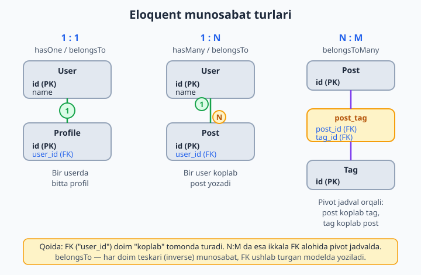
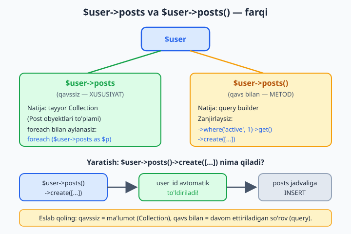
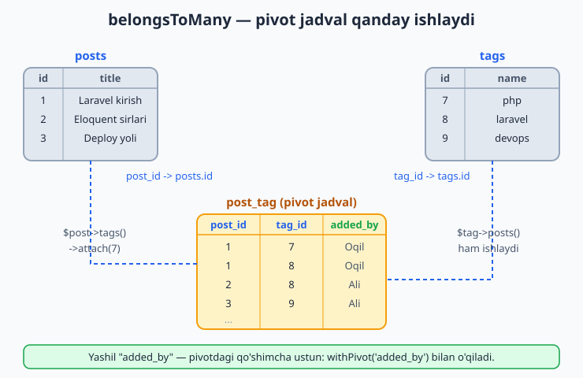

# 9 — Eloquent munosabatlari

[⬅️ Oldingi: 08 — Eloquent ORM — asoslar](./08-eloquent-asos.md) · [🏠 README](./README.md) · [Keyingi: 10 — Query Builder va ilg'or Eloquent ➡️](./10-query-builder-ilgor-eloquent.md)

> **Bu bobda:** ma'lumotni bir necha jadvalga bo'lib saqlaganimizdan keyin Eloquent ularni qanday "bog'lashini" o'rganamiz: bitta user koplab post yozadi (`hasMany`), har post bitta userga tegishli (`belongsTo`), bitta postda koplab tag bo'ladi va bir tag koplab postda uchraydi (`belongsToMany` + pivot jadval). Munosabatni o'qish (`$user->posts`), undan yangi yozuv yaratish (`$user->posts()->create()`), N:M ni `attach`/`detach`/`sync` bilan boshqarish, pivotdagi qo'shimcha ma'lumot (`withPivot`), polimorf munosabatlar (`morphMany`/`morphTo`) va `hasManyThrough` ni ko'rib chiqamiz. Oxirida N+1 muammosiga ham qisqa ishora qilamiz — uni 10-bobda hal qilamiz.

---

## Muammo

8-bobda bitta `Post` modeli bilan ishladik: yaratdik, o'qidik, yangiladik, o'chirdik. Lekin real ilova hech qachon bitta jadvaldan iborat bo'lmaydi. Blog yozmoqchimiz deylik:

- har **post**ni qaysidir **user** yozgan;
- har postda koplab **comment** (izoh) bo'ladi;
- har postga bir nechta **tag** (yorliq: `php`, `laravel`, `devops`) yopishtiriladi va bitta tag koplab postda uchraydi.

Sof SQL bilsangiz, bu sizga tanish: jadvallarni `foreign key` (FK — boshqa jadvalning `id`siga ishora qiluvchi ustun) orqali bog'laysiz, keyin `JOIN` bilan qaytadan yig'asiz. Lekin har safar qo'lda JOIN yozish zerikarli:

```sql
SELECT posts.*, users.name
FROM posts
JOIN users ON users.id = posts.user_id
WHERE users.id = 5;
```

Eloquent buni butunlay yashiradi. Modelga bir marta "post userga tegishli" deb aytib qo'yasiz — keyin shunchaki:

```php
$post = Post::find(1);
echo $post->user->name;   // muallifning ismi

$user = User::find(5);
foreach ($user->posts as $post) {   // shu userning hamma postlari
    echo $post->title;
}
```

JOIN yo'q, `user_id` yo'q, qo'lda `WHERE` yo'q. Siz ob'ektlar tilida gapirasiz: "postning useri", "userning postlari". Eloquent orqa tarafda kerakli SQL'ni o'zi tuzadi. Mana shu — **munosabatlar** (relationships). Bu bobning vazifasi — modelga bu bog'lanishlarni qanday "aytib qo'yishni" o'rgatish.



📌 Munosabat — bu jadvaldagi ustun emas. Bu modeldagi **metod**. Migratsiyada faqat FK ustunini (`user_id`) yaratasiz; munosabat metodi esa Eloquent'ga shu ustunni qanday ishlatishni tushuntiradi. Ikkalasi birga ishlaydi.

## Bir userda koplab post — hasMany va belongsTo

Eng ko'p uchraydigan munosabat — **bir-koplab** (one-to-many). Bitta `user` koplab `post` yozadi, lekin har bir `post` aniq bitta `user`ga tegishli. Avval jadvallarni tayyorlaymiz. 7-bobdan eslang — migratsiyada FK ustunini shunday qo'shamiz:

```php
// database/migrations/..._create_posts_table.php
public function up(): void
{
    Schema::create('posts', function (Blueprint $table) {
        $table->id();
        $table->foreignId('user_id')->constrained()->cascadeOnDelete();
        $table->string('title');
        $table->text('body');
        $table->boolean('published')->default(false);
        $table->timestamps();
    });
}
```

`foreignId('user_id')->constrained()` — bu `user_id` ustunini yaratadi va uni `users` jadvalining `id`siga bog'laydi. `cascadeOnDelete()` — user o'chsa, uning postlari ham o'chadi.

💡 `constrained()` jadval nomini ustun nomidan **taxmin qiladi**: `user_id` -> `users` jadvali. Konvensiyaga amal qilsangiz, hech narsa yozish shart emas. Boshqa jadvalga ishora qilsa, aniq belgilaysiz: `->constrained('authors')`.

Endi modellarga munosabatni yozamiz. `User` modelida:

```php
// app/Models/User.php
namespace App\Models;

use Illuminate\Database\Eloquent\Relations\HasMany;
use Illuminate\Foundation\Auth\User as Authenticatable;

class User extends Authenticatable
{
    public function posts(): HasMany
    {
        return $this->hasMany(Post::class);
    }
}
```

O'qilishi: "userda koplab post bor". Metod nomini **ko'plikda** (`posts`) yozamiz — chunki natija ko'p bo'ladi.

Endi teskari tomon — `Post` modelida:

```php
// app/Models/Post.php
namespace App\Models;

use Illuminate\Database\Eloquent\Model;
use Illuminate\Database\Eloquent\Relations\BelongsTo;

class Post extends Model
{
    protected $fillable = ['user_id', 'title', 'body', 'published'];

    public function user(): BelongsTo
    {
        return $this->belongsTo(User::class);
    }
}
```

O'qilishi: "post bitta userga tegishli". Bu yerda metod nomi **birlikda** (`user`) — chunki natija bitta.

📌 **Inverse relation (teskari munosabat).** `hasMany` va `belongsTo` — bitta bog'lanishning ikki tomoni. `hasMany` FKni **ushlamaydigan** modelda (`User`), `belongsTo` esa FKni **ushlaydigan** modelda (`Post`, chunki `user_id` aynan `posts` jadvalida) yoziladi. Oddiy qoida: FK qaysi jadvalda bo'lsa, o'sha model `belongsTo` yozadi.

### Foreign key konvensiyasi

Eloquent FK nomini o'zi taxmin qiladi: `belongsTo(User::class)` uchun u **`user_id`** ustunini qidiradi (model nomi kichik harfda + `_id`). Agar ustun boshqacha nomlangan bo'lsa (masalan `author_id`), uni aniq ko'rsatasiz:

```php
public function user(): BelongsTo
{
    return $this->belongsTo(User::class, 'author_id');
}
```

✅ Konvensiyaga amal qiling (`user_id`) — hech narsa yozish shart emas.
❌ Ustunni `userId` yoki `usr` deb nomlasangiz, har joyda qo'lda ko'rsatishga to'g'ri keladi.

### Munosabatni o'qish

Endi sehr boshlanadi. Munosabatga **ikki xil** murojaat bor va ular farqi muhim:

```php
$user = User::find(1);

// 1) Xususiyat sifatida (qavssiz) — tayyor natija qaytaradi:
$posts = $user->posts;          // Collection (Post obyektlari to'plami)
echo $posts->count();           // nechta post bor

// 2) Metod sifatida (qavs bilan) — query builder qaytaradi:
$published = $user->posts()      // bu yerda hali so'rov tugamagan
    ->where('published', true)   // shart qo'shamiz
    ->latest()                   // saralash
    ->get();                     // endi bazaga boramiz
```

`$user->posts` (qavssiz) — Eloquent so'rovni darrov bajaradi va `Collection` qaytaradi. `$user->posts()` (qavs bilan) — so'rovni davom ettirishga imkon beradi: `where`, `orderBy`, `count` zanjirlaysiz va oxirida `get()` yoki `first()` bilan yakunlaysiz.



💡 Esda tutish oson: **qavssiz = ma'lumot**, **qavs bilan = davom ettiriladigan so'rov**. Faqat hamma postlar kerak bo'lsa — `$user->posts`. Filtrlash kerak bo'lsa — `$user->posts()->where(...)->get()`.

Teskari tomon ham xuddi shunday ishlaydi:

```php
$post = Post::find(1);
echo $post->user->name;          // postning muallifi ismi
echo $post->user->email;         // bitta so'rov bilan butun user keladi
```

## Munosabat orqali yaratish — ->create() va ->save()

Eng kuchli imkoniyatlardan biri — munosabat orqali **yangi yozuv yaratish**. Postga `user_id` ni qo'lda yozmaysiz; Eloquent uni o'zi to'ldiradi:

```php
$user = User::find(1);

// create() — massivdan yangi post yaratadi va bazaga yozadi:
$post = $user->posts()->create([
    'title' => 'Birinchi postim',
    'body'  => 'Salom, dunyo!',
]);
// user_id => 1 AVTOMATIK qo'yiladi, qo'lda yozish shart emas
```

`$user->posts()->create([...])` `user_id`ni avtomatik `1` qilib qo'yadi — chunki siz allaqachon "userning postlari" kontekstidasiz. Bu sizni xatodan saqlaydi: noto'g'ri `user_id` yozib qo'yolmaysiz.

📌 `create()` ishlashi uchun siz massivda uzatgan ustunlar (`title`, `body`) `Post` modelida `$fillable` ichida bo'lishi shart — buni 8-bobda ko'rgan edik. Aks holda `MassAssignmentException` chiqadi. `user_id`ni esa munosabatning o'zi qo'yadi — u mass-assignment himoyasini chetlab o'tadi, shu sababli uni `$fillable`ga qo'shish shart emas (qo'shsangiz ham zarari yo'q).

`save()` esa allaqachon mavjud obyektni bog'laydi:

```php
$post = new Post(['title' => 'Yangi', 'body' => '...']);
$user->posts()->save($post);     // user_id ni qo'yib, bazaga saqlaydi
```

Bir nechta yozuvni birdan:

```php
$user->posts()->createMany([
    ['title' => 'Post A', 'body' => '...'],
    ['title' => 'Post B', 'body' => '...'],
]);
```

✅ `$user->posts()->create([...])` — toza, FK avtomatik.
❌ `Post::create(['user_id' => 1, ...])` — ishlaydi, lekin `user_id`ni qo'lda yozasiz, xato qilish ehtimoli bor.

## Bitta postda koplab izoh — yana bir hasMany

`hasMany` faqat user-post uchun emas. Post va comment ham aynan shunday: bitta post -> koplab comment. Migratsiya:

```php
// ..._create_comments_table.php
public function up(): void
{
    Schema::create('comments', function (Blueprint $table) {
        $table->id();
        $table->foreignId('post_id')->constrained()->cascadeOnDelete();
        $table->string('author');
        $table->text('body');
        $table->timestamps();
    });
}
```

`Post` modeliga comment munosabatini qo'shamiz:

```php
use Illuminate\Database\Eloquent\Relations\HasMany;

public function comments(): HasMany
{
    return $this->hasMany(Comment::class);
}
```

`Comment` modelida teskari tomon:

```php
// app/Models/Comment.php
namespace App\Models;

use Illuminate\Database\Eloquent\Model;
use Illuminate\Database\Eloquent\Relations\BelongsTo;

class Comment extends Model
{
    protected $fillable = ['post_id', 'author', 'body'];

    public function post(): BelongsTo
    {
        return $this->belongsTo(Post::class);
    }
}
```

Endi izohni post orqali qo'shamiz:

```php
$post = Post::find(1);
$post->comments()->create([
    'author' => 'Oqil',
    'body'   => 'Ajoyib maqola!',
]);

echo $post->comments->count();    // nechta izoh bor
```

## Bir-birga munosabat — hasOne

Goho munosabat **bir-birga** (one-to-one) bo'ladi: bitta userda aniq bitta profil. `hasMany`dan farqi — `hasOne` Collection emas, bitta model (yoki `null`) qaytaradi. Migratsiya FK ni `profiles` jadvaliga qo'yadi:

```php
// ..._create_profiles_table.php
Schema::create('profiles', function (Blueprint $table) {
    $table->id();
    $table->foreignId('user_id')->constrained()->cascadeOnDelete();
    $table->string('bio')->nullable();
    $table->string('website')->nullable();
    $table->timestamps();
});
```

```php
// User modelida:
use Illuminate\Database\Eloquent\Relations\HasOne;

public function profile(): HasOne
{
    return $this->hasOne(Profile::class);
}

// Profile modelida (teskari):
public function user(): BelongsTo
{
    return $this->belongsTo(User::class);
}
```

```php
$user = User::find(1);
echo $user->profile->bio;        // bitta Profile (yoki null)

$user->profile()->create(['bio' => 'Laravel dasturchisi']);
```

📌 Farqni eslang: `hasOne` — bitta obyekt; `hasMany` — Collection. FK ikkalasida ham "narigi" jadvalda (`profiles.user_id`, `posts.user_id`). Faqat nechtaligi farq qiladi.

## Koplab-koplab — belongsToMany va pivot jadval

Eng qiziq munosabat — **koplab-koplab** (many-to-many). Bitta postda koplab tag bor (`php`, `laravel`), va bitta tag koplab postda uchraydi. Bu yerda FKni qayerga qo'yamiz? `posts`gami? Yo'q — bitta postda ko'p tag bo'ladi, bitta ustunga sig'maydi. `tags`gami? U ham bo'lmaydi.

Yechim — **uchinchi jadval**, "pivot jadval" (ko'prik jadval): u faqat ikkita FKdan iborat va "qaysi post qaysi tagga bog'langan"ini saqlaydi. Konvensiya bo'yicha nomi — ikki model nomining **birlik shakli, alifbo tartibida, `_` bilan**: `post_tag`.



Migratsiyalar (uchta jadval: `tags`, va pivot `post_tag`):

```php
// ..._create_tags_table.php
Schema::create('tags', function (Blueprint $table) {
    $table->id();
    $table->string('name')->unique();
    $table->timestamps();
});

// ..._create_post_tag_table.php
Schema::create('post_tag', function (Blueprint $table) {
    $table->foreignId('post_id')->constrained()->cascadeOnDelete();
    $table->foreignId('tag_id')->constrained()->cascadeOnDelete();
    $table->primary(['post_id', 'tag_id']);   // takror juftlikni taqiqlaydi
});
```

Endi ikkala modelda ham `belongsToMany` yozamiz:

```php
// Post modelida:
use Illuminate\Database\Eloquent\Relations\BelongsToMany;

public function tags(): BelongsToMany
{
    return $this->belongsToMany(Tag::class);
}

// Tag modelida:
public function posts(): BelongsToMany
{
    return $this->belongsToMany(Post::class);
}
```

📌 `belongsToMany` ikkala tomonda ham bir xil — chunki munosabat simmetrik. Eloquent pivot jadval nomini (`post_tag`) va ustunlarni (`post_id`, `tag_id`) konvensiyadan o'zi topadi. Boshqa nom ishlatsangiz aniq ko'rsatasiz: `belongsToMany(Tag::class, 'tagging', 'post_id', 'tag_id')`.

### attach, detach, sync — bog'lanishni boshqarish

Many-to-many'da `create()` o'rniga maxsus uchta metod ishlatamiz. Ular **pivot jadval**dagi qatorlarni boshqaradi:

```php
$post = Post::find(1);

// attach — bog'lash (pivotga qator qo'shadi):
$post->tags()->attach(7);                 // id=7 tagni bog'lash
$post->tags()->attach([7, 8, 9]);         // bir nechtasini birdan

// detach — bog'ni uzish (pivotdan qatorni o'chiradi, tagning o'zi qolaveradi):
$post->tags()->detach(7);                 // faqat 7-tagni uzish
$post->tags()->detach();                  // hamma bog'larni uzish

// sync — RO'YXATNI to'liq moslashtirish (qolganlarini uzadi):
$post->tags()->sync([8, 9]);              // endi FAQAT 8 va 9 qoladi
```

`sync` — eng ko'p ishlatiladigani: forma checkbox'laridan kelgan ro'yxatni to'liq moslaydi. Ro'yxatda yo'q taglar uziladi, yangilari bog'lanadi. Mavjudlarini uzmasdan faqat qo'shish kerak bo'lsa:

```php
$post->tags()->syncWithoutDetaching([10]);   // borlarini saqlab, 10 ni qo'shadi
```

💡 `attach` va `sync` farqini eslang: `attach` — "qo'sh" (mavjudlariga tegmaydi, **takror** qo'shishi mumkin), `sync` — "shu ro'yxat bo'lsin" (qolgan hammasini uzadi). Forma uchun deyarli har doim `sync`.

O'qish — `hasMany` kabi:

```php
foreach ($post->tags as $tag) {
    echo $tag->name;             // php, laravel, ...
}

// Teskari tomon ham ishlaydi:
$tag = Tag::where('name', 'laravel')->first();
echo $tag->posts->count();       // bu tag nechta postda
```

### Pivotdagi qo'shimcha ma'lumot — withPivot

Goho pivot jadvalga **qo'shimcha ustun** kerak bo'ladi: tagni kim qo'shgani, qachon qo'shilgani. Migratsiyaga ustun qo'shamiz:

```php
Schema::create('post_tag', function (Blueprint $table) {
    $table->foreignId('post_id')->constrained()->cascadeOnDelete();
    $table->foreignId('tag_id')->constrained()->cascadeOnDelete();
    $table->string('added_by')->nullable();    // qo'shimcha ustun
    $table->timestamps();                       // created_at / updated_at
    $table->primary(['post_id', 'tag_id']);
});
```

Munosabatda bu ustunlarni `withPivot` bilan "ochamiz", `withTimestamps` esa vaqt ustunlarini:

```php
public function tags(): BelongsToMany
{
    return $this->belongsToMany(Tag::class)
        ->withPivot('added_by')
        ->withTimestamps();
}
```

Endi pivot ma'lumotini `pivot` xususiyati orqali o'qiymiz:

```php
foreach ($post->tags as $tag) {
    echo $tag->name;
    echo $tag->pivot->added_by;       // kim qo'shgan
    echo $tag->pivot->created_at;     // qachon
}
```

Pivot ma'lumotini yozish — `attach`ning ikkinchi argumenti orqali:

```php
$post->tags()->attach(7, ['added_by' => 'Oqil']);

// sync bilan ham:
$post->tags()->sync([
    8 => ['added_by' => 'Ali'],
    9 => ['added_by' => 'Vali'],
]);
```

📌 `pivot` so'zini boshqacha nomlamoqchi bo'lsangiz (o'qilishi chiroyli bo'lsin uchun), `->as('tagging')` ishlatasiz — keyin `$tag->tagging->added_by` bo'ladi.

## Uzoq munosabat — hasManyThrough

Goho ikki model **uchinchisi orqali** bog'lanadi. Misol: `Country` (davlat) -> `User` (o'sha davlatdagi userlar) -> `Post` (ularning postlari). Davlatning hamma postlarini bitta munosabatda olishni xohlaymiz, garchi `posts` jadvalida `country_id` umuman yo'q.

Buning ishlashi uchun `users` jadvalida `country_id` FK ustuni bo'lishi kerak (`posts` jadvalida esa `user_id`, allaqachon bor):

```php
// ..._create_users_table.php ichida (yoki alohida migratsiyada):
$table->foreignId('country_id')->constrained()->cascadeOnDelete();
```

```php
// Country modelida:
use Illuminate\Database\Eloquent\Relations\HasManyThrough;

public function posts(): HasManyThrough
{
    // "Country'ning postlari, User orqali"
    return $this->hasManyThrough(Post::class, User::class);
}
```

```php
$country = Country::find(1);
foreach ($country->posts as $post) {     // shu davlatdagi userlarning hamma postlari
    echo $post->title;
}
```

Eloquent zanjirni o'zi quradi: `countries.id` -> `users.country_id` -> `users.id` -> `posts.user_id`. Bu murakkab JOIN'ni qo'lda yozmaslik uchun juda qulay.

💡 `hasManyThrough` kamroq uchraydi, lekin "oralig'idagi modeldan o'tib, narigisiga yetish" kerak bo'lganda eslab qoling — qo'lda ikkita JOIN yozishdan saqlaydi.

## Polimorf munosabat — morphMany va morphTo

Endi qiziq holat. **Comment** (izoh) faqat postga emas, **video**ga ham, **rasm**ga ham yozilishi mumkin. Har biriga alohida `post_comments`, `video_comments` jadvali yaratish — ko'p takror. Yechim — **polimorf munosabat** (polymorphic): bitta `comments` jadvali hamma uchun ishlaydi.

Sir — ikkita maxsus ustunda: `commentable_id` (qaysi yozuvning idsi) va `commentable_type` (qaysi model: `App\Models\Post` yoki `App\Models\Video`).

📌 **Diqqat:** bu bo'limda `comments` jadvalini va `Comment` modelini **polimorf ko'rinishga qayta quramiz** — yuqorida (bir-koplab izoh bo'limida) ular `post_id` + `author` ustunlari bilan tuzilgan edi. Polimorf yondashuvda o'sha `post_id` va `author` o'rniga `commentable_id` + `commentable_type` keladi, `Comment` modelidagi `belongsTo(Post::class)` esa pastdagi `morphTo()` bilan almashadi. Ya'ni quyidagi ikkala variant **bir xil jadvalning ikki xil ko'rinishi** — ketma-ket ikkalasini birga ishlatmang, polimorf kerak bo'lsa shu variantni tanlang.

Migratsiya buni bitta qatorda yaratadi:

```php
Schema::create('comments', function (Blueprint $table) {
    $table->id();
    $table->morphs('commentable');   // commentable_id + commentable_type
    $table->text('body');
    $table->timestamps();
});
```

`Comment` modelini ham polimorf ko'rinishga moslaymiz: eski `belongsTo(Post::class)` o'rniga `morphTo` (teskari, "men kimga tegishliman"), `$fillable` esa endi faqat `body`:

```php
// app/Models/Comment.php
namespace App\Models;

use Illuminate\Database\Eloquent\Model;
use Illuminate\Database\Eloquent\Relations\MorphTo;

class Comment extends Model
{
    protected $fillable = ['body'];

    public function commentable(): MorphTo
    {
        return $this->morphTo();
    }
}
```

`Post` va `Video` modellarida `morphMany`:

```php
// Post modelida:
use Illuminate\Database\Eloquent\Relations\MorphMany;

public function comments(): MorphMany
{
    return $this->morphMany(Comment::class, 'commentable');
}

// Video modelida xuddi shu:
public function comments(): MorphMany
{
    return $this->morphMany(Comment::class, 'commentable');
}
```

Ishlatish — oddiy `hasMany` kabi, lekin orqada `commentable_type` to'ldiriladi:

```php
$post = Post::find(1);
$post->comments()->create(['body' => 'Postga izoh']);

$video = Video::find(1);
$video->comments()->create(['body' => 'Videoga izoh']);

// Teskari: izoh kimga yozilganini bilish (Post yoki Video qaytaradi):
$comment = Comment::find(1);
$owner = $comment->commentable;       // Post obyekti yoki Video obyekti
echo get_class($owner);               // App\Models\Post
```

📌 Bitta `comments` jadvali — istalgancha model uchun. Yangi `Photo` model qo'shsangiz, faqat unga `morphMany` yozasiz; jadvalga tegmaysiz. Mana shuning uchun "polimorf" — bitta munosabat ko'p shaklga kiradi.

## N+1 muammosiga ishora

Munosabatlar shunchalik qulayki, ko'pincha bilmagan holda unumdorlik tuzog'iga tushasiz. 10 ta postni ko'rsatib, har biriga muallif ismini qo'shmoqchimiz:

```php
$posts = Post::all();                 // 1 ta so'rov: hamma post

foreach ($posts as $post) {
    echo $post->user->name;           // HAR aylanishda YANA bitta so'rov!
}
```

Bu yerda 1 (postlar uchun) + 10 (har postning useri uchun) = **11 so'rov** ketadi. Postlar 100 ta bo'lsa — 101 so'rov. Bu **N+1 muammosi**: bittadan boshqasi N marta takrorlanadi.

Yechim — **eager loading** (oldindan yuklash): `with()` bilan munosabatni bitta qo'shimcha so'rovda oldindan olib qo'yamiz:

```php
$posts = Post::with('user')->get();   // 2 ta so'rov: postlar + ularning userlari

foreach ($posts as $post) {
    echo $post->user->name;           // endi bazaga bormaydi, tayyor turibdi
}
```

100 ta post bo'lsa ham — atigi 2 so'rov. Bu — Eloquent'da unumdorlikning eng muhim odati.

💡 Hozircha shuni eslang: `foreach` ichida munosabatga murojaat qilsangiz, `with()` ishlating. To'liq mexanikasi — `with`, `load`, `loadMissing`, `withCount`, `has`, `whereHas` — keyingi 10-bobda batafsil. Hozir faqat "N+1 borligini" his qilib qo'ying.

## Munosabat turlari — qisqacha jadval

| Munosabat | Qayerda | FK qayerda | Natija |
|---|---|---|---|
| `hasOne` | "egasi" modelda | narigi jadvalda | bitta model / null |
| `hasMany` | "egasi" modelda | narigi jadvalda | Collection |
| `belongsTo` | FK ushlagan modelda | shu modelning jadvalida | bitta model / null |
| `belongsToMany` | ikkala tomonda | pivot jadvalda | Collection |
| `hasManyThrough` | "egasi" modelda | oraliq modelda | Collection |
| `morphMany` | "egasi" modelda | `..._id` + `..._type` | Collection |
| `morphTo` | polimorf modelda | shu modelda | har xil model |

📌 Eng muhim qoidani takrorlaymiz: **FK qaysi jadvalda bo'lsa, o'sha model `belongsTo` yozadi**. Qolgan hammasi shu mantiqdan kelib chiqadi.

## 9-bob mashqlari

Quyidagi mashqlarni `blog` nomli yangi Laravel loyihasida (yoki 8-bobdagi loyihada davom ettirib) bajaring. Har mashqda model, migratsiya yoki Tinker (`php artisan tinker`) kerak bo'ladi. Yechimlarni yozmaymiz — o'zingiz qilib o'rganasiz.

1. `User` va `Post` modellarini yarating (`php artisan make:model Post -m`). `posts` migratsiyasiga `foreignId('user_id')->constrained()` qo'shing va migratsiyani ishlating.
2. `User` modeliga `posts()` `hasMany` munosabatini, `Post` modeliga `user()` `belongsTo` munosabatini yozing. Har ikkalasiga to'g'ri qaytarish tipini (`HasMany`, `BelongsTo`) qo'ying.
3. Tinker'da bitta user yarating, keyin `$user->posts` ni chaqiring. Natija nima — bo'sh Collection'mi? Uning `count()` ini chop eting.
4. `$user->posts()->create([...])` orqali shu userga 3 ta post yarating. Bazada `user_id` to'g'ri to'lganini Tinker'da `$user->posts` orqali tekshiring.
5. `Post::find(1)->user->name` ni chop eting. Endi teskari yo'nalish (postdan userga) ishlayotganini ko'ring.
6. `$user->posts` (qavssiz) va `$user->posts()->where('published', true)->get()` (qavs bilan) farqini sinab ko'ring: birinchisi hamma postni, ikkinchisi faqat e'lon qilinganlarini qaytarishini tasdiqlang.
7. `Comment` modeli va `comments` migratsiyasini yarating (`post_id` FK bilan). `Post`ga `comments()` `hasMany`, `Comment`ga `post()` `belongsTo` qo'shing.
8. `$post->comments()->create([...])` bilan bitta postga 2 ta izoh qo'shing va `$post->comments->count()` ni tekshiring.
9. `Profile` modeli va migratsiyasini yarating, `User`ga `profile()` `hasOne` munosabatini qo'shing. `$user->profile` bitta obyekt qaytarishini (Collection emas) tasdiqlang.
10. `$user->profile()->create([...])` bilan profil yarating, keyin `$user->profile->bio` ni o'qing.
11. `Tag` modeli, `tags` migratsiyasi va `post_tag` pivot migratsiyasini (`post_id` + `tag_id`, primary kalit ikkalasiga) yarating.
12. `Post` va `Tag` modellariga `belongsToMany` munosabatini qo'shing (ikkala tomonda). 3 ta tag yarating.
13. `$post->tags()->attach([1, 2])` bilan postga ikkita tag bog'lang, keyin `$post->tags` orqali tekshiring.
14. `$post->tags()->detach(1)` bilan bitta tagni uzing. `post_tag` jadvalida nima o'zgardi — Tinker yoki `php artisan db` orqali ko'ring.
15. `$post->tags()->sync([2, 3])` ni ishlating. Avval bog'langan taglardan qaysilari qoldi, qaysilari uzildi — `sync`ning `attach`dan farqini tushuntirib bering (izoh sifatida yozib qo'ying).
16. `post_tag` jadvaliga `added_by` ustunini qo'shing (yangi migratsiya yoki `tags()` munosabatiga `withPivot('added_by')`). `$post->tags()->attach(2, ['added_by' => 'Oqil'])` qiling.
17. 16-mashqdan keyin `foreach ($post->tags as $tag) { echo $tag->pivot->added_by; }` orqali pivot ma'lumotini o'qing.
18. `Video` modeli yarating va polimorf `comments` migratsiyasini (`$table->morphs('commentable')`) tuzing. `Post` va `Video`ga `morphMany`, `Comment`ga `commentable()` `morphTo` qo'shing.
19. Bitta postga va bitta videoga `comments()->create([...])` bilan izoh qo'shing. `Comment::first()->commentable` qaysi model (Post yoki Video) qaytarishini `get_class()` bilan tekshiring.
20. N+1 ni o'z ko'zingiz bilan ko'ring: `DB::enableQueryLog()` yoqib, avval `Post::all()` + `foreach` ichida `$post->user->name`, keyin `Post::with('user')->get()` bilan bir xil sikl uchun `DB::getQueryLog()` dagi so'rovlar sonini solishtiring.
