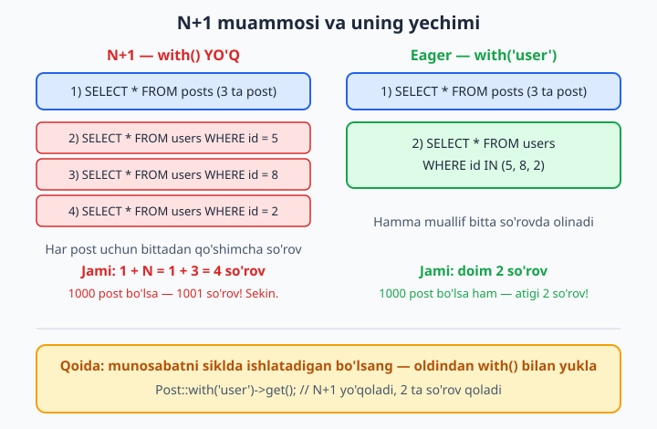
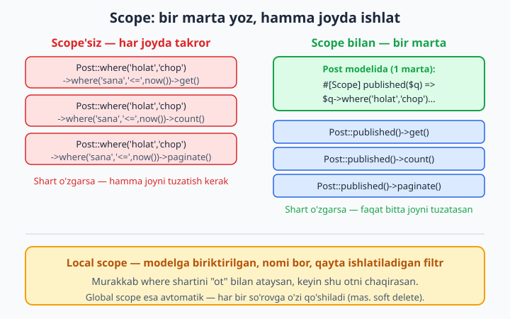
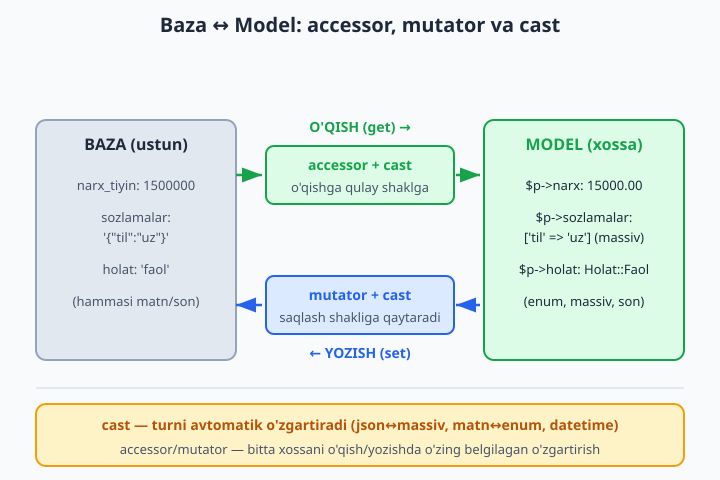

# 10 — Query Builder va ilg'or Eloquent

[⬅️ Oldingi: 09 — Eloquent munosabatlari](./09-eloquent-munosabat.md) · [🏠 README](./README.md) · [Keyingi: 11 — Seeder, Factory va Tinker ➡️](./11-seeder-factory-tinker.md)

> **Bu bobda:** sayt sekinlashganda yoki Eloquent murakkab so'rovga "yetmay" qolganda nima qilishni o'rganamiz. Query Builder (`DB::table`) bilan join/groupBy/having yozamiz, eng mashhur sahna ortidagi sekinlik — **N+1 muammosi**ni tanib, `with()` (eager loading) bilan tuzatamiz, qayta ishlatiladigan filtrlarni **scope**ga aylantiramiz, accessor/mutator va `$casts` orqali bazadagi xom ma'lumotni model darajasida chiroyli shaklga keltiramiz, `withCount`/`whereHas` bilan munosabatlar ustidan so'rov yozamiz va million qatorli jadvalni `chunk`/`cursor` bilan xotirani portlatmasdan qayta ishlaymiz.

---

## Muammo

8- va 9-boblarda Eloquent bilan yozish bir zavq edi: `Post::all()`, `$post->user`, `$user->posts`. Hammasi sodda. Lekin loyiha o'sgani sayin ikki xil og'riq paydo bo'ladi.

**Birinchi og'riq — sekinlik.** Blog bosh sahifasini ochasiz, 50 ta post ro'yxati va har birining yonida muallif ismi. Kod chiroyli ko'rinadi:

```php
$posts = Post::all();                 // 1 ta so'rov
foreach ($posts as $post) {
    echo $post->sarlavha;
    echo $post->user->ism;            // ... va bu yerda har safar yangi so'rov!
}
```

Sahifa "ishlaydi", lekin sekin. Sababini ko'rsangiz hayron qolasiz: bitta sahifa ochilishida bazaga **51 marta** so'rov ketgan. Bu — N+1 muammosi, va u Laravel loyihalaridagi sekinlikning eng ko'p uchraydigan sababi.

**Ikkinchi og'riq — Eloquent yetmay qoladi.** "Har kategoriyada nechta sotilgan mahsulot bor, eng ko'pidan kamiga" yoki "narxni bazada tiyinda saqlab, ekranda so'mda ko'rsat" kabi savollar oddiy `where` bilan hal bo'lmaydi. Mana shu ikki og'riqni — sekinlikni va "yetmaslikni" — bu bobda bartaraf qilamiz. Eloquent ostida nima yotganidan boshlaymiz.

## Query Builder — Eloquent ostidagi dvigatel

Eloquent — bu Query Builder ustiga qurilgan qulay qatlam. `Post::where('holat', 'chop')->get()` yozsangiz, ostida aynan Query Builder ishlaydi. Ba'zan modelsiz, to'g'ridan-to'g'ri jadval bilan ishlash qulayroq — masalan tez hisobot, yoki modeli yo'q jadval. Buning uchun `DB::table()` bor:

```php
use Illuminate\Support\Facades\DB;

// Eng oddiy: butun jadval
$users = DB::table('users')->get();

// where zanjiri + tartiblash + cheklash
$faollar = DB::table('users')
    ->where('holat', 'faol')
    ->where('yosh', '>=', 18)
    ->orderBy('created_at', 'desc')
    ->limit(10)
    ->get();
```

`get()` — barcha qatorlarni qaytaradi (kollektsiya sifatida). Bitta natija kerak bo'lsa:

```php
$user = DB::table('users')->where('id', 1)->first();   // bitta qator (yoki null)
$soni = DB::table('users')->where('holat', 'faol')->count();   // faqat son
$ism  = DB::table('users')->where('id', 1)->value('ism');      // faqat bitta ustun qiymati
```

📌 **Muhim farq:** `DB::table()` sizga oddiy `stdClass` obyektlar qaytaradi — model emas. Ya'ni `$user->user->posts` kabi munosabatlar, accessor, cast — hech biri ishlamaydi. Bularning hammasi faqat **Eloquent model**da bor. Shuning uchun qoida: odatda Eloquent (`Post::...`) ishlating; faqat juda sodda hisobotda yoki tezlik kritik bo'lganda `DB::table()` ga tushing.

### join, groupBy, having

SQL bilan tanish bo'lsangiz (agar yo'q bo'lsa — [SQL kitobi](../sql/12-join.md) ga qarang), bular tanish tuyuladi, faqat sintaksis PHP zanjiri ko'rinishida:

```php
// posts + users ni ulash
$natija = DB::table('posts')
    ->join('users', 'posts.user_id', '=', 'users.id')
    ->select('posts.sarlavha', 'users.ism')
    ->get();

// har user nechta post yozgan (groupBy + aggregate)
$hisobot = DB::table('posts')
    ->select('user_id', DB::raw('COUNT(*) as soni'))
    ->groupBy('user_id')
    ->having('soni', '>', 5)
    ->orderByDesc('soni')
    ->get();
```

`join()` ning argumentlari aynan SQL'dagi `ON posts.user_id = users.id` ning qismlari. `DB::raw()` — Laravel'ga "bu matnni xom SQL sifatida qo'y" deyish (masalan `COUNT(*)`). `having()` — `groupBy`dan keyingi filtr (`where` guruhlashdan oldin, `having` keyin ishlaydi).

💡 `DB::raw()` ichiga **hech qachon** foydalanuvchidan kelgan matnni qo'ymang — bu SQL injection eshigi. Oddiy `where('ustun', $qiymat)` esa avtomatik xavfsiz: qiymat alohida "bog'lanadi" (parametr binding).

O'zgartirish amallari ham bor:

```php
DB::table('users')->insert(['ism' => 'Ali', 'email' => 'ali@example.com']);
DB::table('users')->where('id', 1)->update(['holat' => 'nofaol']);
DB::table('users')->where('id', 99)->delete();
```

## N+1 muammosi va eager loading

Endi bobning yuragiga keldik. Yuqoridagi "51 so'rov" qayerdan chiqdi?

```php
$posts = Post::all();                 // 1) SELECT * FROM posts  — 1 ta so'rov
foreach ($posts as $post) {
    echo $post->user->ism;            // 2,3,4...) har post uchun SELECT * FROM users WHERE id=?
}
```

Eloquent munosabatlar **dangasa (lazy)**: `$post->user` ga birinchi murojaat qilganda, Laravel o'sha lahzada borib bazadan so'raydi. 50 ta postni aylanib chiqsangiz — 50 ta qo'shimcha so'rov, ustiga boshlang'ich 1 ta. Jami **1 + N**. Shuning uchun nomi — N+1.



**Yechim — eager loading:** munosabatni siklda ishlatishingizni oldindan aytib qo'ying. `with()` Laravel'ga "postlarni olishdan oldin ularning hamma mualliflarini ham bitta so'rovda tortib kel" deydi:

```php
$posts = Post::with('user')->get();   // endi atigi 2 ta so'rov:
                                      // SELECT * FROM posts
                                      // SELECT * FROM users WHERE id IN (5, 8, 2, ...)
foreach ($posts as $post) {
    echo $post->user->ism;            // bazaga bormaydi — allaqachon xotirada
}
```

50 post bo'ladimi, 5000 post bo'ladimi — doim **2 ta** so'rov. Mana shu farq sahifani sekundlardan millisekundlarga tushiradi.

`with()` ning ko'p qirralari bor:

```php
// bir nechta munosabat birga
$posts = Post::with(['user', 'comments'])->get();

// ichma-ich (nested) — izohlar va ularning mualliflari
$posts = Post::with('comments.user')->get();

// faqat kerakli ustunlar (id ni doim qo'shing — munosabat shu bilan bog'lanadi)
$posts = Post::with('user:id,ism')->get();
```

📌 **Tuzoq:** `with('user:id,ism')` da munosabat kalitini (`id`) tushirib qoldirmang. Foreign key (masalan `posts.user_id`) ham `select`da bo'lishi shart — bo'lmasa Laravel postlarni mualliflarga ulay olmaydi va `user` `null` bo'lib chiqadi.

### load() — keyin yuklash (lazy eager)

Ba'zan modellar allaqachon olingan, lekin keyin "voy, munosabat ham kerak ekan" deysiz. Qaytadan so'rov yozmang — `load()` bilan keyin yuklang:

```php
$users = User::all();
// ... shartga qarab qaror qilindi ...
$users->load('posts');             // endi bitta qo'shimcha so'rov bilan hammasiga posts yuklandi

$users->loadMissing('posts');      // faqat hali yuklanmaganlarni yuklaydi (ikki marta ishlamaydi)
```

💡 `with()` — so'rovdan **oldin** (model olinmasidan). `load()` — model olingandan **keyin**. Ikkalasi ham N+1 ni bir xil hal qiladi; qaysi biri kodingizga qulay bo'lsa, shuni tanlang.

💡 N+1 ni "ko'z bilan" sezmaslik uchun [Laravel Debugbar](https://github.com/barryvdh/laravel-debugbar) yoki `DB::listen()` so'rovlarni sanab beradi. Bundan tashqari `Model::preventLazyLoading()` (odatda `AppServiceProvider`da, faqat lokal muhitda) — dangasa yuklash sodir bo'lsa darrov xato otadi, shunda N+1 ni unutib qo'ymaysiz.

## Local scope — qayta ishlatiladigan filtr

Loyihada bitta shart qayta-qayta takrorlanadi. "Chop etilgan post" — bu `holat = 'chop'` **va** `chop_sana <= hozir`. Bu shart bosh sahifada ham, RSS'da ham, qidiruv'da ham kerak. Har joyda qo'lda yozsangiz, ertaga ta'rif o'zgarsa — hamma joyni tuzatishingiz kerak.



**Local scope** — shu shartni modelga "ot berib" biriktirish. Laravel 12+ da zamonaviy uslub — `#[Scope]` atributi:

```php
namespace App\Models;

use Illuminate\Database\Eloquent\Builder;
use Illuminate\Database\Eloquent\Model;
use Illuminate\Database\Eloquent\Attributes\Scope;

class Post extends Model
{
    #[Scope]
    protected function chopEtilgan(Builder $query): void
    {
        $query->where('holat', 'chop')
              ->where('chop_sana', '<=', now());
    }

    // parametr ham qabul qiladi
    #[Scope]
    protected function holatBoyicha(Builder $query, string $holat): void
    {
        $query->where('holat', $holat);
    }
}
```

Endi hamma joyda qisqa va aniq:

```php
Post::chopEtilgan()->get();
Post::chopEtilgan()->count();
Post::chopEtilgan()->latest()->paginate(15);
Post::holatBoyicha('qoralama')->get();
```

📌 Eski (lekin hozir ham to'liq ishlaydigan va eng ko'p uchraydigan) konvensiya — metod nomini `scope` bilan boshlash. Atribut yo'q, lekin metod nomi `scope` prefiksli bo'lishi shart, chaqirilganda esa prefikssiz va kichik harf bilan yoziladi:

```php
public function scopeChopEtilgan(Builder $query): Builder
{
    return $query->where('holat', 'chop')
                 ->where('chop_sana', '<=', now());
}
// Chaqirilishi bir xil: Post::chopEtilgan()->get();
```

💡 Eski loyihada `scopeXxx` ni ko'rsangiz hayron bo'lmang — bu o'sha narsa. Yangi kodda `#[Scope]` atributi tavsiya etiladi, chunki metod nomini chiroyli (`scope` prefiksisiz) qoldiradi.

## Global scope — avtomatik qo'shiladigan filtr

Local scope'ni siz chaqirasiz. **Global scope** esa o'zi avtomatik har bir so'rovga qo'shiladi — siz hech narsa yozmaysiz. Klassik misol: faqat "faol" foydalanuvchilar bilan ishlash, o'chirilganini hech qachon ko'rsatmaslik.

```php
namespace App\Models\Scopes;

use Illuminate\Database\Eloquent\Builder;
use Illuminate\Database\Eloquent\Model;
use Illuminate\Database\Eloquent\Scope;

class FaolScope implements Scope
{
    public function apply(Builder $builder, Model $model): void
    {
        $builder->where('holat', 'faol');
    }
}
```

Modelga `#[ScopedBy]` atributi bilan biriktiramiz:

```php
namespace App\Models;

use App\Models\Scopes\FaolScope;
use Illuminate\Database\Eloquent\Attributes\ScopedBy;
use Illuminate\Database\Eloquent\Model;

#[ScopedBy([FaolScope::class])]
class User extends Model
{
    //
}
```

Endi `User::all()` avtomatik `WHERE holat = 'faol'` qo'shadi — siz so'ramasangiz ham. Kerak bo'lganda chetlab o'tish mumkin:

```php
User::all();                                  // faqat faollar
User::withoutGlobalScope(FaolScope::class)->get();   // hammasi
```

📌 **Ehtiyot bo'ling:** global scope kuchli, lekin "sehrli" — yangi dasturchi nega ba'zi qatorlar chiqmayotganini tushunmay qolishi mumkin. Eng mashhur global scope — Laravel'ning o'z **SoftDeletes** ('o'chirilganni yashirish') mexanizmi; uni qo'lda yozish o'rniga tayyor trait'dan foydalaning. O'zingiznikini faqat juda asosli holatda yozing.

## Accessor va Mutator — model darajasidagi o'zgartirish

Bazada ma'lumot "xom" yotadi: narx tiyinda (`1500000`), ism `ALI` deb yozib yuborilgan. Ekranda esa boshqacha kerak: narx so'mda (`15000`), ism `Ali`. Har joyda qo'lda o'zgartirish — takror va xatoga yo'l. **Accessor** (o'qishda o'zgartirish) va **mutator** (yozishda o'zgartirish) buni bir joyda hal qiladi.



Laravel 9+ da zamonaviy uslub — bitta metodda `Attribute::make(get: ..., set: ...)`:

```php
namespace App\Models;

use Illuminate\Database\Eloquent\Casts\Attribute;
use Illuminate\Database\Eloquent\Model;
use Illuminate\Support\Str;

class Product extends Model
{
    // Accessor: faqat o'qishda. narx_tiyin bazada, narx ko'rsatishda so'mda
    protected function narx(): Attribute
    {
        return Attribute::make(
            get: fn (mixed $value, array $attributes) => $attributes['narx_tiyin'] / 100,
            set: fn (float $value) => ['narx_tiyin' => (int) round($value * 100)],
        );
    }

    // Faqat o'qish uchun hosilaviy xossa (bazada ustuni yo'q)
    protected function toliqNom(): Attribute
    {
        return Attribute::make(
            get: fn (mixed $value, array $attributes) =>
                $attributes['nomi'] . ' (' . $attributes['kod'] . ')',
        );
    }
}
```

Ishlatish — oddiy xossa kabi, lekin sahna ortida o'zgartirish ketadi:

```php
$p = Product::find(1);
echo $p->narx;        // 15000  (bazada 1500000, accessor /100 qildi)

$p->narx = 20000;     // mutator *100 qiladi
$p->save();           // bazaga 2000000 yoziladi

echo $p->toliqNom;    // "Daftar (DFT-01)"  — bazada bunday ustun yo'q
```

📌 Metod nomi `camelCase` (`toliqNom`), xossa esa `snake_case` (`$p->toliq_nom`) — ikkalasi ham ishlaydi, Laravel avtomatik moslaydi. Odat: metodni `narx()` deb yozsangiz, `$p->narx` deb o'qiysiz.

💡 `Attribute` — bu Laravel 8 va undan oldingi `getNarxAttribute()` / `setNarxAttribute()` metod juftligining zamonaviy o'rnini bosadigani. Eski kodda o'sha juftlikni ko'rishingiz mumkin; mantiq bir xil, faqat sintaksis ixchamlashgan.

## $casts — turni avtomatik o'zgartirish

Accessor — qo'lda yozadigan o'zgartirish. Lekin eng ko'p uchraydigan o'zgartirishlar (JSON↔massiv, matn↔sana, matn↔enum) uchun qo'lda yozish shart emas — Laravel'da tayyor **cast**lar bor. `casts()` metodida e'lon qilasiz (Laravel 11+ uslubi):

```php
namespace App\Models;

use App\Enums\Holat;
use Illuminate\Database\Eloquent\Model;

class Product extends Model
{
    protected function casts(): array
    {
        return [
            'sozlamalar' => 'array',        // JSON ustun <-> PHP massiv
            'chop_sana'  => 'datetime',     // matn <-> Carbon obyekt
            'narxi'      => 'decimal:2',    // doim 2 xona aniqlik
            'faolmi'     => 'boolean',      // 0/1 <-> true/false
            'holat'      => Holat::class,   // matn <-> enum
            'maxfiy_kod' => 'encrypted',    // bazada shifrlangan saqlanadi
        ];
    }
}
```

Endi turlar avtomatik to'g'ri keladi:

```php
$p = Product::find(1);

$p->sozlamalar['til'];        // massiv — JSON o'zi parse bo'ldi
$p->sozlamalar = ['til' => 'uz', 'tema' => 'tungi'];  // saqlashda o'zi JSON bo'ladi

$p->chop_sana->format('d.m.Y');   // Carbon obyekt — sana metodlari ishlaydi
$p->chop_sana->isPast();

$p->faolmi;                   // bazada 1 bo'lsa ham — bu true (bool), "1" emas
```

### enum cast

PHP'dagi enum (sizga 8.1+ dan tanish) Eloquent bilan ajoyib ishlaydi. Avval enum:

```php
namespace App\Enums;

enum Holat: string
{
    case Faol = 'faol';
    case Nofaol = 'nofaol';
    case Kutilmoqda = 'kutilmoqda';

    public function label(): string
    {
        return match ($this) {
            Holat::Faol       => 'Faol',
            Holat::Nofaol     => 'Nofaol',
            Holat::Kutilmoqda => 'Kutilmoqda',
        };
    }
}
```

`'holat' => Holat::class` cast tufayli bazadagi `'faol'` matni avtomatik `Holat::Faol` obyektiga aylanadi:

```php
$p = Product::find(1);

$p->holat;                    // Holat::Faol (enum, matn emas!)
$p->holat === Holat::Faol;    // true — xavfsiz, terilgan solishtirish
$p->holat->label();           // "Faol"

$p->holat = Holat::Nofaol;    // saqlashda bazaga 'nofaol' yoziladi
$p->save();
```

📌 Enum cast — eng yoqimli yangiliklardan biri. Endi `if ($p->holat == 'fol')` kabi imlo xatosi bilmasdan o'tib ketmaydi: `Holat::Fol` umuman mavjud emas, PHP darrov xato beradi. Matn o'rniga terilgan tip — kamroq xato degani.

✅ `'sozlamalar' => 'array'` — JSON ustunlar uchun deyarli har doim to'g'ri tanlov.
❌ JSON ustunni `array` cast'siz qoldirib, keyin `json_decode($p->sozlamalar, true)` ni qo'lda yozish — eskirgan, takror va xatoga moyil.

## Aggregate va withCount

Sonlar bilan ishlash uchun Eloquent'da tayyor metodlar bor:

```php
$jami      = Order::count();
$summa     = Order::sum('narxi');
$ortacha   = Order::avg('narxi');
$engKatta  = Order::max('narxi');

// shart bilan
$iyunSummasi = Order::where('sana', '>=', '2026-06-01')->sum('narxi');
```

Eng foydalisi — **`withCount()`**: "har userda nechta post bor" degan savolga N+1'siz javob beradi. U `posts` ni yuklamaydi — faqat **sonini** qo'shimcha ustun qilib qaytaradi:

```php
$users = User::withCount('posts')->get();

foreach ($users as $user) {
    echo $user->ism . ': ' . $user->posts_count . ' ta post';
    // ustun nomi: {munosabat}_count
}
```

📌 Agar `User::all()` qilib, keyin har userda `$user->posts->count()` desangiz — bu N+1! Har user uchun butun postlar to'plami yuklanadi, faqat sanash uchun. `withCount('posts')` esa bitta qo'shimcha so'rov bilan faqat sonlarni oladi — ancha arzon.

Shartli sanash ham mumkin:

```php
$users = User::withCount([
    'posts',                                                  // posts_count
    'posts as chop_posts_count' => fn ($q) => $q->where('holat', 'chop'),  // chop_posts_count
])->get();

echo $users->first()->chop_posts_count;
```

💡 `withCount` ning oilaviy a'zolari: `withSum('orders', 'narxi')`, `withAvg`, `withMax`, `withMin`, `withExists`. Hammasi bir xil ishlaydi — `{munosabat}_{amal}_{ustun}` nomli qo'shimcha xossa qo'shadi.

## whereHas, has va whereRelation — munosabat ustidan so'rov

"Kamida bitta posti bor userlar" yoki "chop etilgan posti bor userlar" — bu munosabat **ustidan** filtr. Eloquent uchun maxsus metodlar bor:

```php
// has — kamida bitta posti bor
$users = User::has('posts')->get();

// kamida 3 ta posti bor
$users = User::has('posts', '>=', 3)->get();

// doesntHave — umuman posti yo'qlar (anti-pattern bilan tanish bo'lsangiz — o'sha)
$users = User::doesntHave('posts')->get();

// whereHas — munosabat ichidagi shart bilan
$users = User::whereHas('posts', function ($query) {
    $query->where('holat', 'chop');
})->get();

// whereRelation — sodda whereHas uchun qisqartma
$users = User::whereRelation('posts', 'holat', 'chop')->get();
```

📌 `with()` va `whereHas()` ni adashtirmang — ikki xil ish:
- `with('posts')` — postlarni **yuklaydi** (xotiraga oladi), userlar sonini o'zgartirmaydi.
- `whereHas('posts', ...)` — userlarni **filtrlaydi** (shartga mos posti bor userni qoldiradi), postlarni yuklamaydi.

Ikkisi bir so'rovda birga kelishi mumkin va ko'pincha shunday yoziladi:

```php
// chop etilgan posti bor userlarni ol VA ularning chop postlarini yukla
$users = User::whereHas('posts', fn ($q) => $q->where('holat', 'chop'))
             ->with(['posts' => fn ($q) => $q->where('holat', 'chop')])
             ->get();
```

## Katta ma'lumot: chunk, lazy, cursor

`Post::all()` — 1000 postda zo'r. Lekin 5 million qatorli jadvalga `all()` qilsangiz, hammasini xotiraga tortib, dasturni "o'ldirasiz" (`Allowed memory size exhausted`). Katta hajm uchun ma'lumotni **bo'lib** qayta ishlash kerak.

```php
// chunk — 500 tadan bo'lib o'qiydi, har bo'lakni qayta ishlab tashlaydi
Post::chunk(500, function ($posts) {
    foreach ($posts as $post) {
        // ... qayta ishlash ...
    }
});
```

📌 Agar `chunk` ichida shu jadvalni **yangilab** (`update`/`delete`) borsangiz, oddiy `chunk` qatorlar tartibini buzib, ba'zilarini o'tkazib yuborishi mumkin. Bunday holda `chunkById` ishlating — u `id` bo'yicha xavfsiz harakatlanadi:

```php
Post::where('holat', 'eski')->chunkById(500, function ($posts) {
    foreach ($posts as $post) {
        $post->update(['arxivlandi' => true]);
    }
});
```

`lazy()` va `cursor()` — bir xil maqsad, boshqa qulaylik:

```php
// lazy — kollektsiya kabi yozasiz, orqada o'zi chunk qiladi
foreach (Post::lazy() as $post) {
    // ...
}

// cursor — bitta so'rov, bittadan model (eng kam xotira, lekin bitta so'rov uzoq ochiq turadi)
foreach (Post::cursor() as $post) {
    // ...
}
```

💡 Qaysisini tanlash? Oddiy qoida: **`chunkById`** — ma'lumotni o'zgartirsangiz; **`lazy`** — faqat o'qib, kod chiroyli bo'lsin desangiz; **`cursor`** — xotira juda taqchil, bir martalik o'qish bo'lsa. `all()` esa — faqat jadval kichikligiga ishonchingiz komil bo'lganda.

## Eloquent Collection — natija ustidan ishlash

`get()` qaytargan narsa oddiy massiv emas — bu **Eloquent Collection**, juda boy metodlar to'plami bilan (PHP'dagi massiv funksiyalarining chiroyli, zanjirlanadigan varianti). Ma'lumot **xotiraga olingandan keyin** uni qayta ishlashga juda qulay:

```php
$posts = Post::all();

$sarlavhalar = $posts->pluck('sarlavha');               // faqat sarlavhalar ro'yxati
$guruh       = $posts->groupBy('user_id');              // user_id bo'yicha guruhlangan
$chop        = $posts->where('holat', 'chop');          // xotirada filtr (so'rov emas!)
$jami        = $posts->sum('korishlar');                // umumiy ko'rishlar
$birinchi    = $posts->firstWhere('holat', 'chop');     // birinchi mos
$nomlar      = $posts->map(fn ($p) => $p->sarlavha);    // har birini o'zgartirib yangi to'plam
```

📌 **Muhim farq.** `Post::where('holat', 'chop')->get()` — bazada filtr (so'rov darajasida). `Post::all()->where('holat', 'chop')` — avval HAMMA postni xotiraga oladi, keyin xotirada filtrlaydi. Birinchisi deyarli har doim to'g'ri (faqat keraklini bazadan oladi). Collection metodlari — ma'lumot allaqachon olingach, qo'shimcha so'rovsiz qayta ishlash uchun.

## Hammasini birlashtiramiz

Real misol — "blog bosh sahifasi" so'rovi, bobning hamma g'oyasini bir joyga yig'adi:

```php
$postlar = Post::query()
    ->chopEtilgan()                                    // local scope
    ->with('user:id,ism')                              // N+1 ni oldini olamiz
    ->withCount('comments')                            // har postda nechta izoh
    ->whereHas('user', fn ($q) => $q->where('holat', 'faol'))  // faol muallifniki
    ->latest('chop_sana')
    ->paginate(15);
```

Blade'da esa hammasi tayyor — qo'shimcha so'rov yo'q:

```blade
@foreach ($postlar as $post)
    <article>
        <h2>{{ $post->sarlavha }}</h2>
        <p>Muallif: {{ $post->user->ism }}</p>          {{-- with() tufayli so'rov yo'q --}}
        <p>Izohlar: {{ $post->comments_count }} ta</p>   {{-- withCount tufayli --}}
        <p>Holat: {{ $post->holat->label() }}</p>        {{-- enum cast tufayli --}}
    </article>
@endforeach

{{ $postlar->links() }}
```

Bitta sahifa, ozgina so'rov, toza kod. Mana shu — ilg'or Eloquent'ning maqsadi: tez **va** o'qiladigan.

## 10-bob mashqlari

Quyidagi mashqlarni o'z loyihangizda (blog yoki do'kon) bajaring. Yechimlarini o'zingiz yozing — har biri oldingisidan bir qadam murakkabroq.

1. `DB::table('users')` bilan barcha foydalanuvchilarni `ism` bo'yicha alifbo tartibida oling.
2. `DB::table()` va `where` zanjiri bilan: holati "faol" va yoshi 18 dan katta foydalanuvchilarni, eng yangisidan boshlab, faqat 10 tasini chiqaring.
3. `DB::table()` da `join` ishlatib `posts` va `users` ni ulang, natijada post sarlavhasi va muallif ismini ko'rsating.
4. `DB::table()`, `groupBy` va `DB::raw('COUNT(*)')` bilan: har bir `user_id` nechta post yozganini sanang; `having` bilan faqat 3 tadan ko'p yozganlarni qoldiring.
5. Bilib turib N+1 yarating: `Post::all()` qilib, siklda `$post->user->ism` chiqaring. Debugbar yoki `DB::listen()` bilan necha so'rov ketganini sanang.
6. Xuddi shu kodni `Post::with('user')->get()` ga o'zgartiring va so'rovlar soni nechtaga tushganini tasdiqlang.
7. `with('user:id,ism')` ishlating va faqat kerakli ustunlar yuklanganiga ishonch hosil qiling; foreign key (`user_id`) ni `select`dan tushirib qoldirsangiz nima bo'lishini ko'ring.
8. `comments.user` ichma-ich eager loading bilan postlar, ularning izohlari va izoh mualliflarini bitta zanjirda yuklang.
9. Postlarni avval `all()` bilan oling, keyin `load('user')` bilan keyin yuklang; `with()` bilan farqini tushuntiring (komment sifatida).
10. `Post` modeliga `#[Scope]` atributi bilan `chopEtilgan` local scope yozing (`holat = 'chop'` va `chop_sana <= now`). Uni `get()`, `count()` va `paginate()` bilan chaqiring.
11. Parametr qabul qiladigan `holatBoyicha($q, $holat)` scope yozing va uni turli holatlar bilan chaqiring.
12. Xuddi shu `chopEtilgan` scope'ni eski `scopeChopEtilgan` konvensiyasida ham yozib ko'ring; chaqirilishi o'zgarmasligiga ishonch hosil qiling.
13. `FaolScope` global scope yozib, uni `#[ScopedBy]` bilan modelga biriktiring; oddiy so'rov avtomatik filtrlanishini, `withoutGlobalScope` esa hammasini qaytarishini tekshiring.
14. `Attribute::make(get: ...)` bilan `toliqNom` accessor yozing (ikkita ustunni birlashtirib qaytaradigan, bazada ustuni yo'q xossa).
15. `narx` uchun accessor + mutator yozing: bazada tiyinda saqlansin (`narx_tiyin`), xossada so'mda ko'rinsin va so'mda yozilsin.
16. Modelga `casts()` qo'shing: bitta ustunni `array`, bittasini `datetime`, bittasini `boolean` ga cast qiling va har birini sinab ko'ring.
17. `Holat` nomli string enum yarating (`label()` metodi bilan) va uni `casts()` da `Holat::class` sifatida cast qiling; `$model->holat === Holat::Faol` solishtiruvini sinang.
18. `withCount('posts')` bilan har foydalanuvchining post sonini oling; keyin `withCount(['posts as chop_posts_count' => ...])` bilan faqat chop postlar sonini alohida ustun qiling.
19. `whereHas('posts', ...)` bilan kamida bitta chop etilgan posti bor foydalanuvchilarni filtrlang; `whereRelation` bilan xuddi shuni qisqaroq yozing; `doesntHave('posts')` bilan posti yo'qlarni toping.
20. `chunkById(500, ...)` bilan eski postlarni bo'lib-bo'lib `arxivlandi = true` qilib yangilang; nega oddiy `chunk` emas, `chunkById` kerakligini komment bilan izohlang.
