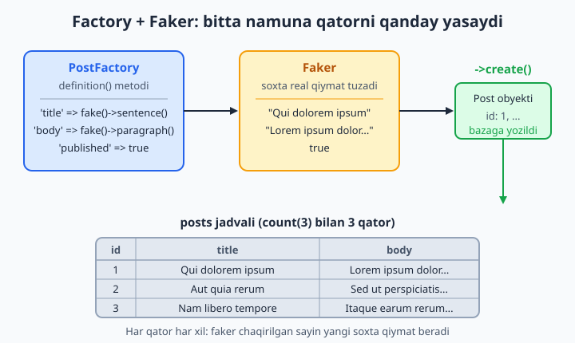
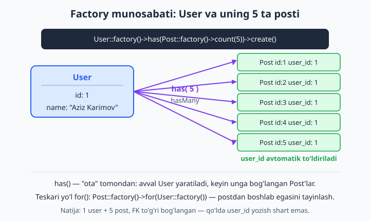
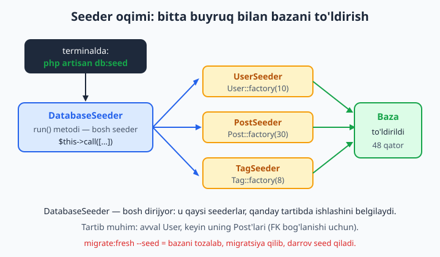

# 11 — Seeder, Factory va Tinker

[⬅️ Oldingi: 10 — Query Builder va ilg'or Eloquent](./10-query-builder-ilgor-eloquent.md) · [🏠 README](./README.md) · [Keyingi: 12 — Validatsiya ➡️](./12-validatsiya.md)

> **Bu bobda:** ishlab chiqish va test uchun kerak bo'ladigan namuna ma'lumotni qo'lda emas, **kod bilan** to'ldirishni o'rganamiz. Seeder ("ekuvchi") nima ekanini, `DatabaseSeeder` qanday dirijyorlik qilishini, Model Factory'ning `definition()` ichida **Faker** orqali soxta-real ma'lumot tuzishni, `factory()->count()->create()` bilan o'nlab qator yaratishni, **state** bilan turli ko'rinishlarni (published/draft), **relation factory** (`has`, `for`, `hasAttached`) bilan bog'langan ma'lumotni, `sequence`, `recycle`, `afterCreating` qulayliklarini, `migrate:fresh --seed` bilan bazani bir buyruqda qayta tiklashni va nihoyat Tinker'da hamma narsani jonli sinashni ko'rib chiqamiz. Oxirida factory'ning test uchun nega muhimligiga ko'prik tashlaymiz (22-bob).

---

## Muammo

10-bobgacha `User`, `Post`, `Comment`, `Tag` modellarini va ular orasidagi munosabatlarni tuzdik. Endi blogni brauzerda ochib, "postlar ro'yxati" sahifasini ko'rmoqchimiz. Lekin baza **bo'sh**. Sahifa qanday ko'rinishini tekshirish uchun ma'lumot kerak: 20-30 ta post, ularning mualliflari, izohlari, taglari.

Sof yo'l — Tinker'da yoki SQL'da qo'lda yozish:

```php
Post::create(['user_id' => 1, 'title' => 'Birinchi post', 'body' => 'Matn...']);
Post::create(['user_id' => 1, 'title' => 'Ikkinchi post', 'body' => 'Yana matn...']);
Post::create(['user_id' => 2, 'title' => 'Uchinchi post', 'body' => '...']);
// ... va shu zaylda yana 27 marta
```

30 ta post uchun 30 qator, har biriga sarlavha va matn o'ylab topish kerak. Sahifalashni (pagination) sinash uchun 100 ta kerak bo'lsa-chi? Jamoadoshingiz loyihani klonlab oldi — uning bazasi yana bo'sh, hammasini boshqatdan yozadi. Bazani tozalab qayta boshlasangiz — yana noldan. Bu **zerikarli, takror va xatoga moyil** ish.

Laravel buni ikki vosita bilan hal qiladi:

- **Factory** ("zavod") — modelning bitta namunaviy nusxasini qanday yasashni biladigan "qolip". Bir marta yozasiz, keyin undan istalgancha nusxa chiqarasiz.
- **Seeder** ("ekuvchi") — shu factory'larni ishga solib, bazaga ma'lumot "ekadigan" sinf. Bitta buyruq — `php artisan db:seed` — va baza to'ladi.

Natijada 100 ta post bitta qatorga sig'adi:

```php
Post::factory()->count(100)->create();
```

Bu bob aynan shu ikki vositani — va ularni sinaydigan Tinker'ni — o'rgatadi.

## Faktorisiz: dastlabki tushuncha

Avval eng sodda holatni ko'ramiz: hech qanday soxta ma'lumotsiz, shunchaki seeder. **Seeder** — `Database\Seeders` papkasidagi oddiy sinf. Yangi Laravel loyihasida bitta tayyor seeder bor — `database/seeders/DatabaseSeeder.php`. Bu **bosh seeder**: `php artisan db:seed` aynan uning `run()` metodini chaqiradi.

Ochib ko'ramiz (yangi loyihada taxminan shunday turadi):

```php
<?php

namespace Database\Seeders;

use App\Models\User;
use Illuminate\Database\Seeder;

class DatabaseSeeder extends Seeder
{
    public function run(): void
    {
        User::factory()->create([
            'name'  => 'Test User',
            'email' => 'test@example.com',
        ]);
    }
}
```

`run()` ichiga oddiy Eloquent kodi yozsa bo'ladi. Masalan, bir nechta tagni qo'lda "ekamiz":

```php
public function run(): void
{
    Tag::create(['name' => 'php']);
    Tag::create(['name' => 'laravel']);
    Tag::create(['name' => 'eloquent']);
}
```

Ishga tushirish:

```bash
php artisan db:seed
```

📌 Seeder — shunchaki "men ishga tushganda quyidagi ma'lumotni bazaga yoz" deydigan joy. Ichida xohlagan Eloquent kodingizni yozasiz. Lekin har bir qatorni qo'lda yozish — yana o'sha eski muammo. Shuning uchun seeder'ning haqiqiy kuchi **factory** bilan birga ochiladi.

💡 `db:seed` bosh `DatabaseSeeder`ni chaqiradi. Boshqa, alohida seederni ishga tushirish uchun `--class` bayrog'i bor:

```bash
php artisan db:seed --class=TagSeeder
```

## Model Factory — namuna qolipi

**Factory** ("zavod, qolip") — modelning bitta soxta nusxasini qanday tuzishni belgilaydigan sinf. U `database/factories` papkasida yashaydi. Yangi Laravel loyihasida bitta tayyor factory bor: `UserFactory`.

Yangi factory yasash:

```bash
php artisan make:factory PostFactory
```

Bu `database/factories/PostFactory.php` faylini yaratadi:

```php
<?php

namespace Database\Factories;

use Illuminate\Database\Eloquent\Factories\Factory;

/**
 * @extends \Illuminate\Database\Eloquent\Factories\Factory<\App\Models\Post>
 */
class PostFactory extends Factory
{
    public function definition(): array
    {
        return [
            //
        ];
    }
}
```

Eng muhim joy — `definition()` metodi. U **bitta qatorning** ustunlarini massiv ko'rinishida qaytaradi. Bu yerni biz to'ldiramiz:

```php
public function definition(): array
{
    return [
        'title'     => fake()->sentence(),
        'body'      => fake()->paragraphs(3, true),
        'published' => fake()->boolean(70),   // 70% ehtimol bilan true
    ];
}
```

O'qilishi: "har safar bitta Post yasalganda — sarlavha sifatida soxta jumla, matn sifatida 3 ta soxta abzas, `published` sifatida 70% ehtimolda `true` qo'y". `fake()` — bu **Faker**, keyingi bo'limning qahramoni.

📌 `definition()` ustunlar uchun **standart** qiymatlarni beradi. Ya'ni "agar boshqacha aytmasang, qator shunday bo'ladi". Yaratishda bu qiymatlarni ustiga yozish mumkin (buni darrov ko'ramiz).

💡 Modelni yasashda `-f` bayrog'i factory'ni ham birga yaratadi: `php artisan make:model Post -mf`. Yoki hammasi birga: `php artisan make:model Post -a` (model, migration, factory, seeder, controller).

### Model factory'ni "ko'rsin" — HasFactory

Factory ishlashi uchun model `HasFactory` trait'ini ishlatishi kerak. Yangi modellarda u odatda allaqachon turadi, lekin tekshirib qo'ying:

```php
<?php

namespace App\Models;

use Illuminate\Database\Eloquent\Factories\HasFactory;
use Illuminate\Database\Eloquent\Model;

class Post extends Model
{
    use HasFactory;

    protected $fillable = ['user_id', 'title', 'body', 'published'];
}
```

📌 `HasFactory` — `Post::factory()` metodini modelga qo'shadigan trait. U bo'lmasa, `Post::factory()` chaqirilganda "method not found" xatosi chiqadi. Konvensiya bo'yicha Eloquent `Post` modeliga `PostFactory` factory'sini o'zi topadi (model nomi + `Factory`).

## Faker — soxta, lekin real ko'rinadigan ma'lumot

`definition()` ichidagi `fake()` — **Faker** kutubxonasi. Uning vazifasi — har xil turdagi **soxta, lekin haqiqatga o'xshash** ma'lumot tuzish: ismlar, email'lar, manzillar, jumlalar, sanalar. `"asdfgh"` yoki `"test123"` emas, balki `"Aziz Karimov"`, `"qui.dolorem@example.org"` kabi ko'rinadigan qiymatlar.

Nega muhim? Soxta ma'lumot **realga o'xshasa**, UI'ni rost sharoitda sinaysiz: uzun ismlar joyiga sig'adimi, uzun matn dizaynni buzmaydimi. `"aaa"` bilan bularning hech birini ko'rmaysiz.



Eng ko'p ishlatiladigan Faker metodlari:

| Chaqiruv | Misol natija |
|---|---|
| `fake()->name()` | Aziz Karimov |
| `fake()->firstName()` | Malika |
| `fake()->email()` | qui.dolorem@example.org |
| `fake()->unique()->safeEmail()` | takrorlanmas, xavfsiz email |
| `fake()->sentence()` | Qui dolorem ipsum quia. |
| `fake()->paragraph()` | bitta abzas matn |
| `fake()->paragraphs(3, true)` | 3 abzas, bitta matn satr sifatida |
| `fake()->text(200)` | 200 belgigacha matn |
| `fake()->word()` | dolorem |
| `fake()->boolean(70)` | 70% ehtimolda true |
| `fake()->numberBetween(1, 100)` | 1..100 oralig'idagi son |
| `fake()->randomElement(['a', 'b', 'c'])` | ro'yxatdan tasodifiy biri |
| `fake()->date()` | 2019-04-12 |
| `fake()->dateTimeBetween('-1 year', 'now')` | o'tgan yil ichidagi vaqt |
| `fake()->imageUrl()` | rasm URL'i |
| `fake()->uuid()` | tasodifiy UUID |

📌 `fake()->unique()` — keyingi metod takrorlanmas qiymat qaytarishini kafolatlaydi. Email yoki nom ustunida `unique` indeks bo'lsa, buni qo'ying — aks holda ikki bir xil email yaratilib, baza xato beradi.

💡 Faker o'zbekcha emas — standart "lorem ipsum" lotincha matn va ko'proq ingliz ismlari beradi. Bu yomon emas: maqsad ma'lumot **realga o'xshashi**, til esa muhim emas (test uchun ekan). Aniq qiymatlar kerak bo'lsa, `randomElement` bilan o'zingiz ro'yxat berasiz:

```php
'city' => fake()->randomElement(['Toshkent', 'Samarqand', 'Buxoro', 'Namangan']),
```

📌 Faker — Laravel'ning ichki qismi emas, alohida kutubxona (`fakerphp/faker`), lekin yangi Laravel loyihasida allaqachon o'rnatilgan turadi. `fake()` yordamchisi shu kutubxonaga qisqa yo'l. Factory ichida `$this->faker` ham ishlaydi, lekin yangi uslubda `fake()` afzal.

## factory()->create() — qatorlarni yaratish

Factory tayyor. Endi undan haqiqiy qatorlar chiqaramiz. Asosiy metod — `create()`: u qatorni **bazaga yozadi** va model obyektini qaytaradi.

```php
// Bitta post (factory standart qiymatlari bilan):
$post = Post::factory()->create();

echo $post->id;       // baza bergan yangi id
echo $post->title;    // faker tuzgan soxta sarlavha
```

Bir nechtasini birdan — `count()`:

```php
// 10 ta post:
$posts = Post::factory()->count(10)->create();

echo $posts->count();    // 10 — Collection qaytadi
```

Har bir post boshqacha bo'ladi, chunki `definition()` har chaqirilganda Faker yangi qiymat beradi.

📌 `make()` — `create()`ning "bazaga yozmaydigan" varianti. U model obyektini xotirada tayyorlaydi, lekin `INSERT` yubormaydi. "Obyekt kerak, lekin saqlash shart emas" holatlarida (ko'pincha testda) asqotadi:

```php
$post = Post::factory()->make();   // obyekt bor, lekin bazada yo'q
$post->id;                          // null — hali saqlanmagan
```

### Standart qiymatlarni ustiga yozish

`definition()` faqat **standart**ni beradi. Yaratishda ayrim ustunlarni o'zingiz belgilashingiz mumkin — `create()` (yoki `make()`) ga massiv berasiz:

```php
// Sarlavhasi aniq, qolgani factory'dan:
$post = Post::factory()->create([
    'title'     => 'Maxsus sarlavha',
    'published' => true,
]);
```

Bu yerda `title` va `published` siz bergan qiymatni oladi, `body` esa factory'ning faker'idan keladi. Bu juda muhim: factory "umumiy holat"ni beradi, siz esa testda kerakli **bitta detalni** aniqlaysiz.

✅ `Post::factory()->create(['published' => true])` — faqat kerakli ustunni belgilang, qolganini factory hal qilsin.
❌ Har bir ustunni qo'lda yozish — factory'ning butun ma'nosini yo'qotadi.

💡 Eng ko'p ishlatiladigan namuna — admin foydalanuvchini aniq email bilan, qolganini faker bilan yaratish:

```php
$admin = User::factory()->create([
    'email' => 'admin@example.com',
]);
```

## State — modelning turli ko'rinishlari

Ko'pincha modelning bir nechta "holati" bo'ladi: post **e'lon qilingan** yoki **qoralama**; user **tasdiqlangan** yoki **tasdiqlanmagan**. Har safar `create(['published' => true])` yozish o'rniga, bu holatlarga **nom** berib qo'yish mumkin — bu **state** ("holat") deb ataladi.

State — factory ichidagi metod. U `definition()` qiymatlarining **bir qismini** ustiga yozadi:

```php
<?php

namespace Database\Factories;

use Illuminate\Database\Eloquent\Factories\Factory;

class PostFactory extends Factory
{
    public function definition(): array
    {
        return [
            'title'     => fake()->sentence(),
            'body'      => fake()->paragraphs(3, true),
            'published' => fake()->boolean(70),
        ];
    }

    // state: e'lon qilingan post
    public function published(): static
    {
        return $this->state(fn (array $attributes) => [
            'published' => true,
        ]);
    }

    // state: qoralama
    public function draft(): static
    {
        return $this->state(fn (array $attributes) => [
            'published' => false,
        ]);
    }
}
```

Endi state'larni metod sifatida zanjirga qo'shasiz:

```php
// 5 ta e'lon qilingan post:
Post::factory()->count(5)->published()->create();

// 3 ta qoralama:
Post::factory()->count(3)->draft()->create();
```

📌 `state()` ga beriladigan funksiya `array $attributes` (joriy qiymatlar) ni oladi va **o'zgartiriladigan qismni** qaytaradi. Bu qism `definition()` ustiga yoziladi (qolgani saqlanadi). Ya'ni `published()` faqat `published` ni o'zgartiradi, `title` va `body` factory'dan kelaveradi.

💡 State'lar **zanjirlanadi**: bir nechta state'ni ketma-ket qo'ysangiz, ular birin-ketin qo'llanadi. State funksiyasi `$attributes`ni olgani uchun, bir ustunni boshqasiga bog'lab ham bo'ladi:

```php
public function published(): static
{
    return $this->state(fn (array $attributes) => [
        'published'    => true,
        'published_at' => now(),     // e'lon qilingan bo'lsa, sanasi ham bor
    ]);
}
```

Quyidagi sof-PHP mantiq state'ning aslida nima qilishini ko'rsatadi — `definition` ustiga `array_merge` bilan state qo'yiladi:

```php
$definition = ['title' => 'fake', 'published' => false];   // standart
$state      = ['published' => true];                        // published() state

$result = array_merge($definition, $state);
// natija: ['title' => 'fake', 'published' => true]
// title saqlandi, published ustiga yozildi
```

✅ `published()`, `draft()`, `unverified()` — takror ishlatiladigan holatlarni nom bilan belgilang.
❌ Har joyda `create(['published' => true])` takrorlash — state aynan shuni yo'qotish uchun bor.

## Relation factory — bog'langan ma'lumot

Eng kuchli imkoniyat — factory'lar **munosabatlar** bilan ishlay oladi. Postning `user_id`si bo'lishi kerak; user'ning postlari bo'lishi mumkin. Buni qo'lda bog'lamaysiz — factory hal qiladi.

### has — "ota" tomondan (hasMany / hasOne)

Bitta user va unga bog'langan 5 ta post yaratamiz. `has()` — "egasi" tomonidan:

```php
// 1 ta user + 5 ta post, har postda user_id avtomatik:
User::factory()
    ->has(Post::factory()->count(5))
    ->create();
```

`user_id`ni hech qayerda yozmadik — `has()` uni o'zi to'ldiradi. Avval User yaratiladi, keyin uning `id`si bilan 5 ta Post.



Munosabat nomi standartdan farq qilsa (yoki aniq aytmoqchi bo'lsangiz), ikkinchi argument bilan ko'rsatasiz:

```php
User::factory()
    ->has(Post::factory()->count(5), 'posts')   // 'posts' — User modelidagi metod nomi
    ->create();
```

📌 `has()` ishlashi uchun `User` modelida `posts()` munosabati (`hasMany`) bo'lishi shart — buni 9-bobda yozgan edik. Factory shu munosabatga qarab `user_id`ni qaysi ustunga qo'yishni biladi.

💡 Qisqaroq sintaksis ham bor — `hasPosts()` (`has` + munosabat nomi bosh harf bilan):

```php
User::factory()->hasPosts(5)->create();   // xuddi shu natija
```

### for — "bola" tomondan (belongsTo)

Teskari yo'l: postdan boshlab, egasini tayinlash. `for()` — `belongsTo` tomonidan:

```php
// 3 ta post, hammasi bitta YANGI userga tegishli:
Post::factory()
    ->count(3)
    ->for(User::factory())
    ->create();
```

`for()` ga mavjud modelni ham berasiz (yangisini yaratmasdan):

```php
$user = User::factory()->create();

Post::factory()->count(3)->for($user)->create();   // shu user'ning postlari
```

📌 `has` va `for` farqi: `has` — "menda quyidagilar bor" (ota → bolalar, bitta-koplab tomon), `for` — "men quyidagiga tegishliman" (bola → ota, FK tomoni). Qaysi biridan boshlash qulayligiga qarab tanlaysiz.

💡 `for()` qisqartmasi ham bor — `forUser()`:

```php
Post::factory()->count(3)->forUser($user)->create();
```

### hasAttached — many-to-many (pivot bilan)

Postga taglarni bog'lash (`belongsToMany`) uchun `hasAttached()`:

```php
$tags = Tag::factory()->count(5)->create();

Post::factory()
    ->count(10)
    ->hasAttached($tags)              // har postga shu taglar bog'lanadi
    ->create();
```

Pivot jadvaliga qo'shimcha ustun (mas. `added_by`) kerak bo'lsa, ikkinchi argumentda berasiz (9-bobdagi `withPivot` eslang):

```php
Post::factory()
    ->hasAttached($tags, ['added_by' => 'Oqil'])
    ->create();
```

📌 `hasAttached`ga factory ham berish mumkin — shunda taglar ham aynan shu yerda yaratiladi:

```php
Post::factory()
    ->hasAttached(Tag::factory()->count(3))
    ->create();
```

## Ilg'or qulayliklar: sequence, recycle, afterCreating

Uchta foydali metod bilan factory yanada kuchayadi.

**`sequence`** — qatorlarga **navbat bilan** har xil qiymat berish. `boolean(70)` tasodifiy, lekin "aniq yarmi published, yarmi draft bo'lsin" desangiz:

```php
Post::factory()
    ->count(4)
    ->sequence(
        ['published' => true],
        ['published' => false],
    )
    ->create();
// 1-post: true, 2-post: false, 3-post: true, 4-post: false (aylanib takrorlanadi)
```

**`recycle`** — mavjud modellarni **qayta ishlatish**. Odatda har bir `for(User::factory())` yangi user yaratadi. 50 ta post yaratayotganda 50 ta yangi user kerak emas — 5 tasini aylantirib ishlatamiz:

```php
$users = User::factory()->count(5)->create();

Post::factory()
    ->count(50)
    ->recycle($users)     // 50 post, lekin faqat shu 5 user orasida taqsimlanadi
    ->create();
```

**`afterCreating`** — qator yaratilgandan **keyin** qo'shimcha ish bajarish:

```php
Post::factory()
    ->afterCreating(function (Post $post) {
        // mas. har post yaratilgach, unga bitta izoh qo'shamiz
        $post->comments()->create([
            'author' => fake()->name(),
            'body'   => fake()->sentence(),
        ]);
    })
    ->create();
```

💡 `afterCreating` ko'pincha factory ichida — `configure()` metodida — joylashtiriladi, shunda har safar avtomatik ishlaydi. Hozircha "yaratilgandan keyin ish bajarish kerak bo'lsa, shu bor" deb eslab qo'ying.

## Seeder + Factory: birga ishlatish

Endi ikkalasini birlashtiramiz — bobning asosiy maqsadi. `DatabaseSeeder`ning `run()` metodida factory'larni ishga solamiz:

```php
<?php

namespace Database\Seeders;

use App\Models\Post;
use App\Models\Tag;
use App\Models\User;
use Illuminate\Database\Seeder;

class DatabaseSeeder extends Seeder
{
    public function run(): void
    {
        // 1) Aniq admin foydalanuvchi (kirish uchun qulay):
        $admin = User::factory()->create([
            'name'  => 'Oqil Imomnazarov',
            'email' => 'admin@example.com',
        ]);

        // 2) 8 ta tag:
        $tags = Tag::factory()->count(8)->create();

        // 3) 10 ta oddiy user, har birida 5 tadan post:
        User::factory()
            ->count(10)
            ->has(Post::factory()->count(5))
            ->create();

        // 4) Admin'ning 20 ta e'lon qilingan posti, har biriga 1-3 tag:
        Post::factory()
            ->count(20)
            ->for($admin)
            ->published()
            ->create()
            ->each(function (Post $post) use ($tags) {
                $post->tags()->attach(
                    $tags->random(rand(1, 3))->pluck('id')->all()
                );
            });
    }
}
```

Ishga tushiramiz:

```bash
php artisan db:seed
```

Bir buyruq bilan: 1 admin + 10 user + (10×5 + 20) = 70 post + 8 tag + minglab pivot bog'lanish. Hammasi soxta-real, ishlatishga tayyor.



### Alohida seederlarga bo'lish

Loyiha o'ssa, hammasini bitta `run()`ga tiqishtirmaymiz — har model uchun alohida seeder yasaymiz:

```bash
php artisan make:seeder UserSeeder
php artisan make:seeder PostSeeder
```

`UserSeeder`:

```php
<?php

namespace Database\Seeders;

use App\Models\User;
use Illuminate\Database\Seeder;

class UserSeeder extends Seeder
{
    public function run(): void
    {
        User::factory()->count(10)->create();
    }
}
```

Keyin `DatabaseSeeder` faqat **dirijyorlik** qiladi — qaysi seederlar, qanday **tartibda** ishlashini `call()` bilan belgilaydi:

```php
public function run(): void
{
    $this->call([
        TagSeeder::class,
        UserSeeder::class,
        PostSeeder::class,
    ]);
}
```

📌 **Tartib muhim!** `PostSeeder` `user_id` ishlatadi, demak undan **oldin** `UserSeeder` ishlashi shart — aks holda postlar bog'lanadigan user topilmaydi va FK xatosi chiqadi. `call()` ro'yxatdagi tartibni saqlaydi: yuqoridan pastga.

✅ Har model — alohida seeder; `DatabaseSeeder` ularni to'g'ri tartibda chaqiradi.
❌ Hammasini bitta ulkan `run()`ga yozish — o'qish va qayta ishlatish qiyinlashadi.

## migrate:fresh --seed — bir buyruqda toza boshlash

Ishlab chiqishda baza ko'pincha "iflos" bo'lib qoladi: sinov qatorlari, o'chirilgan-qo'shilgan ma'lumot. Eng tozasi — bazani **noldan** boshlash. `migrate:fresh` hamma jadvalni **tashlab**, migratsiyalarni qaytadan ishlatadi:

```bash
php artisan migrate:fresh
```

`--seed` bayrog'ini qo'shsangiz, migratsiyadan **darrov keyin** seederlar ham ishlaydi:

```bash
php artisan migrate:fresh --seed
```

Bu — eng ko'p ishlatiladigan buyruqlardan biri. Bitta satr bilan: hamma jadval tozalanadi → qayta yaratiladi → namuna ma'lumot bilan to'ladi. Loyihaga har qaytganingizda toza, to'la baza.

📌 `migrate:fresh` va `migrate:refresh` farqi: `fresh` jadvallarni **DROP** qiladi (butunlay o'chiradi), keyin migratsiyalarni ishlatadi — tez va toza. `refresh` esa har migratsiyaning `down()` (orqaga qaytarish) metodini chaqiradi — sekinroq, lekin `down()` to'g'ri yozilmagan bo'lsa muammo bo'lishi mumkin. Ishlab chiqishda odatda `fresh` qulayroq.

❌ **DIQQAT:** `migrate:fresh` HAMMA ma'lumotni o'chiradi! Buni faqat ishlab chiqish (`local`) bazasida ishlating. Ishlab turgan (`production`) bazada **hech qachon** — foydalanuvchilarning butun ma'lumoti yo'qoladi. Laravel `production`da bu buyruqdan oldin tasdiq so'raydi, lekin baribir ehtiyot bo'ling.

💡 Faqat seederni qayta ishga tushirish (jadvallarga tegmasdan) kerak bo'lsa — yana `php artisan db:seed`. Lekin u mavjud qatorlarga **qo'shadi**, tozalamaydi — shuning uchun ko'pincha `migrate:fresh --seed` afzal.

## Tinker — hamma narsani jonli sinash

8-bobda Tinker bilan tanishdik. Bu bobda u ayniqsa qo'l keladi: factory'lar **bazaga yozadi**, demak natijani darrov ko'rib bo'ladi. **Tinker** — Laravel'ning interaktiv konsoli (REPL): terminalda PHP yozasiz, javobni shu zahoti olasiz.

```bash
php artisan tinker
```

Ochilgach, factory'larni jonli sinaymiz (`>` — Tinker chaqiruvi):

```text
> Post::factory()->make()
= App\Models\Post {#... title: "Qui dolorem ipsum", published: true, ...}

> Post::factory()->count(3)->create()
= Illuminate\Database\Eloquent\Collection {#... all: [ ... 3 ta Post ... ]}

> Post::count()
= 3

> User::factory()->has(Post::factory()->count(2))->create()
= App\Models\User {#... id: 1, ...}

> User::find(1)->posts->count()
= 2

> Post::factory()->published()->create()->published
= true
```

📌 `make()` natijani **darrov ko'rsatadi** lekin bazaga yozmaydi — Tinker'da factory'ni "sinab ko'rish" uchun ideal: qanday qiymatlar chiqishini ko'rasiz, baza iflosanmaydi. Yoqsa — `create()` ga o'tasiz.

💡 Tinker — factory yozayotganda eng tez tekshiruv vositasi. `definition()`ni o'zgartirdingizmi — Tinker'ni qayta ochib (`exit`, keyin `php artisan tinker`), `Post::factory()->make()` deb darrov ko'rasiz. Brauzer, route, controller kerak emas.

📌 Tinker kodni **xotirada** ushlaydi: yangi factory metodini qo'shsangiz, ochiq Tinker uni bilmaydi — chiqib (`Ctrl+D` yoki `exit`) qayta kiring.

## Test uchun factory — keyingi bobga ko'prik

Factory'ning eng katta foydasi seederda emas — **testda**. 22-bobda to'liq ko'ramiz, hozir esa "nega muhimligini" his qilib qo'yamiz.

Tasavvur qiling: "postlar ro'yxati sahifasi faqat e'lon qilingan postlarni ko'rsatadimi?" degan testni yozyapsiz. Test uchun baza holatini **aniq** tayyorlash kerak: 3 ta published, 2 ta draft. Factory buni bir-ikki qatorda qiladi:

```php
<?php

use App\Models\Post;
use App\Models\User;

it('faqat published postlarni qaytaradi', function () {
    Post::factory()->count(3)->published()->create();
    Post::factory()->count(2)->draft()->create();

    $response = $this->get('/posts');

    $response->assertStatus(200);
    expect(Post::where('published', true)->count())->toBe(3);
});
```

Yoki "user o'z postlarini ko'ra oladimi?":

```php
it('user oz postlarini kora oladi', function () {
    $user = User::factory()->has(Post::factory()->count(4))->create();

    expect($user->posts)->toHaveCount(4);
});
```

E'tibor bering — bu yerda **state** (`published`, `draft`) va **relation** (`has`) factory'lar naqadar qo'l kelyapti: testning maqsadini bir qarashda o'qib bo'ladi. Aynan shuning uchun factory'larni puxta yozish — yaxshi test yozishning poydevori.

📌 Har test odatda **toza bazada** boshlanadi (Laravel buni avtomatik qiladi — `RefreshDatabase` trait orqali, 22-bobda). Factory esa har testda kerakli ma'lumotni qaytadan tikadi. Shuning uchun factory test bilan ajralmas juftlik.

💡 Qoida: modelni yaratganingizda factory'sini ham darrov yozing va asosiy state'larini belgilang. Bu seederda qulaylik, testda esa zarurat bo'ladi — keyin pushaymon bo'lmaysiz.

## Yakuniy ko'rinish: to'liq factory

Bobni jamlasak, real loyihadagi `PostFactory` taxminan shunday bo'ladi:

```php
<?php

namespace Database\Factories;

use App\Models\User;
use Illuminate\Database\Eloquent\Factories\Factory;

/**
 * @extends \Illuminate\Database\Eloquent\Factories\Factory<\App\Models\Post>
 */
class PostFactory extends Factory
{
    public function definition(): array
    {
        return [
            'user_id'   => User::factory(),                 // bog'liq user (yo'q bo'lsa yaratiladi)
            'title'     => fake()->sentence(),
            'body'      => fake()->paragraphs(3, true),
            'published' => fake()->boolean(70),
        ];
    }

    public function published(): static
    {
        return $this->state(fn (array $attributes) => [
            'published' => true,
        ]);
    }

    public function draft(): static
    {
        return $this->state(fn (array $attributes) => [
            'published' => false,
        ]);
    }
}
```

📌 `'user_id' => User::factory()` — qiziq nuqta: agar postni `for()`siz yaratasangiz, factory `user_id` uchun yangi user'ni **o'zi yaratadi**. Ya'ni `Post::factory()->create()` deb yozsangiz ham, postning egasi bo'ladi — hech qachon "egasiz" post qolmaydi. `for()` bersangiz esa, bu standart o'sha bilan almashadi.

Bu factory bilan endi: bitta post (`Post::factory()->create()`), yuzta post, faqat published'lar, faqat draft'lar, ma'lum userning postlari, taglar bilan — hammasini bir-ikki qatorda yasaysiz. Seeder bazani to'ldiradi, test bazani tayyorlaydi, Tinker hammasini sinaydi.

📌 Keyingi bobda (12) **validatsiya**ni — foydalanuvchidan kelgan ma'lumotni tekshirishni — o'rganamiz. Hozirgacha ma'lumotni o'zimiz (factory orqali) yaratdik; endi tashqaridan kelgan ma'lumotni ishonchli qilishni ko'ramiz.

## 11-bob mashqlari

Quyidagi mashqlarni 9-10-boblardagi blog loyihasida (`User`, `Post`, `Comment`, `Tag` modellari bilan) bajaring. Har mashqdan keyin natijani Tinker'da (`php artisan tinker`) yoki `php artisan db` orqali tekshiring. Yechim berilmagan — har birini o'zingiz yozib, natijani ko'ring.

1. `php artisan make:factory PostFactory` bilan `Post` uchun factory yarating. `definition()` ichida `title`, `body` ustunlarini `fake()->sentence()` va `fake()->paragraphs(3, true)` bilan to'ldiring.
2. `Post` modelida `use HasFactory` borligini tekshiring. Bo'lmasa qo'shing va `Post::factory()->make()` Tinker'da ishlashini tasdiqlang.
3. Tinker'da `Post::factory()->make()` chaqiring — natija bazaga yozilmasdan faqat ekranda ko'rinishini, `id` `null` ekanini ko'ring.
4. `Post::factory()->create()` bilan bitta post yarating va `Post::count()` orqali bazada haqiqatan paydo bo'lganini tekshiring.
5. `Post::factory()->count(10)->create()` bilan 10 ta post yarating. Har birining `title`i boshqacha ekanini `Post::pluck('title')` bilan tasdiqlang.
6. `Post::factory()->create(['title' => 'Maxsus sarlavha'])` bilan sarlavhasi aniq, qolgani factory'dan bo'lgan post yarating — `title` siz bergan, `body` faker'dan ekanini ko'ring.
7. `PostFactory`ga `published` ustunini `fake()->boolean(70)` bilan qo'shing. 20 ta post yaratib, nechtasi `published = true` chiqqanini `Post::where('published', true)->count()` bilan sanang.
8. `PostFactory`ga `published()` va `draft()` state metodlarini yozing (`$this->state(...)`). `Post::factory()->published()->create()->published` `true` qaytarishini tekshiring.
9. `Post::factory()->count(5)->draft()->create()` bilan 5 ta qoralama yarating; hammasida `published = false` ekanini tasdiqlang.
10. `User` uchun factory'ni tekshiring (yangi loyihada `UserFactory` bor). `User::factory()->count(3)->create()` bilan 3 ta user yarating.
11. `User::factory()->has(Post::factory()->count(5))->create()` bilan bitta user va unga bog'langan 5 ta post yarating. `User::find(1)->posts->count()` `5` qaytarishini ko'ring.
12. Qisqa sintaksis `User::factory()->hasPosts(5)->create()` bilan 11-mashqning natijasini takrorlang.
13. `Post::factory()->count(3)->for(User::factory())->create()` bilan 3 ta postni bitta yangi userga bog'lang. Uchala postning `user_id`si bir xil ekanini tekshiring.
14. Avval `$user = User::factory()->create()`, keyin `Post::factory()->count(4)->for($user)->create()` qiling — postlar **mavjud** userga bog'langanini (yangi user yaratilmaganini) tasdiqlang.
15. `Tag::factory()->count(5)->create()` bilan 5 ta tag yarating (`TagFactory`da `name => fake()->unique()->word()`). Keyin `Post::factory()->hasAttached(Tag::factory()->count(2))->create()` bilan taglari bor post yasang va `$post->tags->count()` ni tekshiring.
16. `Post::factory()->count(4)->sequence(['published' => true], ['published' => false])->create()` bilan navbatma-navbat published/draft postlar yarating. 4 tadan 2 tasi `true`, 2 tasi `false` ekanini ko'ring.
17. `make:seeder PostSeeder` bilan alohida seeder yarating, `run()` ichida 30 ta post yarating. `php artisan db:seed --class=PostSeeder` bilan ishga tushiring.
18. `DatabaseSeeder`ning `run()` ichida `$this->call([UserSeeder::class, PostSeeder::class])` yozing. Tartib nega muhimligini (FK) izoh sifatida yozib qo'ying.
19. `php artisan migrate:fresh --seed` ni ishga tushiring. Bazadagi hamma jadval tozalanib, qayta yaratilib, seederlardan to'lganini `User::count()` va `Post::count()` bilan tasdiqlang.
20. Bitta test yozing (`tests/Feature/PostTest.php`): `Post::factory()->count(3)->published()->create()` va `Post::factory()->count(2)->draft()->create()` qilib, `Post::where('published', true)->count()` aynan `3` ekanini `expect(...)->toBe(3)` bilan tekshiring. `php artisan test` bilan ishlatib ko'ring.
