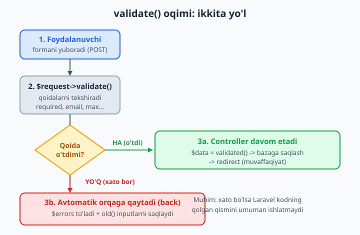
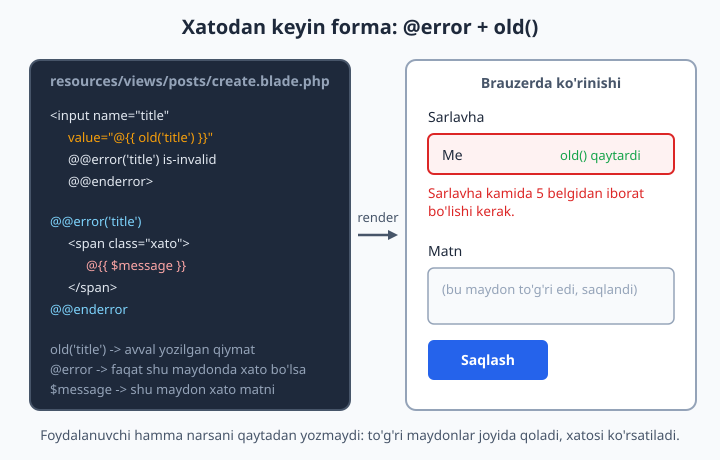
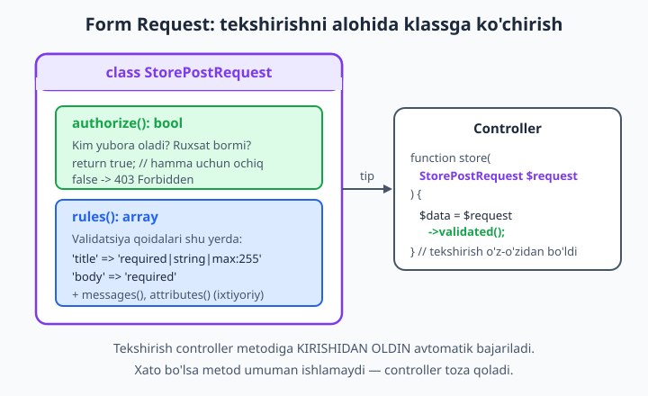

# 12 — Validatsiya

[⬅️ Oldingi: 11 — Seeder, Factory va Tinker](./11-seeder-factory-tinker.md) · [🏠 README](./README.md) · [Keyingi: 13 — Autentifikatsiya ➡️](./13-autentifikatsiya.md)

> **Bu bobda:** foydalanuvchi yuborgan ma'lumotni nega va qanday tekshirishni o'rganamiz. Controllerda `$request->validate([...])` bilan tez tekshirishni, ko'p ishlatiladigan qoidalarni (`required`, `email`, `unique`, `confirmed`, `min`, `max`, `in`, `nullable`, `numeric`, `date`...), xatoni Bladeda `@error` va `$errors` bilan ko'rsatishni, `old()` orqali formani qayta to'ldirishni ko'ramiz. Keyin tekshirishni alohida **Form Request** klassiga ko'chiramiz (`make:request`, `rules()`, `authorize()`), o'z **custom rule**imizni va xabarlarimizni yozamiz, `validated()` bilan faqat toza ma'lumot olamiz va massiv/ichma-ich (nested) maydonlarni tekshiramiz.

---

## Muammo

Oldingi boblarda forma ma'lumotini olishni (`$request->input()`), bazaga saqlashni (`Post::create()`) o'rgandik. Lekin bir narsani e'tiborsiz qoldirdik: **foydalanuvchi yuborgan ma'lumotga ishonib bo'lmaydi**.

Tasavvur qiling, blog post yaratish formasi bor. Foydalanuvchi sarlavhani bo'sh qoldirib "Saqlash" bosadi. Yoki sarlavha o'rniga 50 000 belgili matn yuboradi. Yoki "email" maydoniga `salom` deb yozadi. Sof PHP'da buni har safar qo'lda tekshirardingiz:

```php
<?php
$title = $_POST['title'] ?? '';
$email = $_POST['email'] ?? '';

$xatolar = [];
if (trim($title) === '') {
    $xatolar['title'] = 'Sarlavha bosh bolmasin';
}
if (mb_strlen($title) > 255) {
    $xatolar['title'] = 'Sarlavha juda uzun';
}
if (!filter_var($email, FILTER_VALIDATE_EMAIL)) {
    $xatolar['email'] = 'Email notogri';
}
// ... va yana o'nlab if
```

Har bir forma uchun shu uzun `if`lar. Xato xabarlarini qo'lda to'plash, ularni Bladega uzatish, formani eski qiymatlar bilan qayta chizish... Va eng yomoni — bittasini unutsangiz, ilovangizda **xavfsizlik teshigi** paydo bo'ladi: noto'g'ri yoki zararli ma'lumot to'g'ridan-to'g'ri bazaga tushadi.

Laravel buni bitta qatorga jamlaydi. Siz faqat **qoidalar ro'yxatini** berasiz, qolganini — tekshirish, xatolarni to'plash, foydalanuvchini orqaga qaytarish, eski qiymatlarni saqlash — Laravel o'zi bajaradi:

```php
<?php
$request->validate([
    'title' => 'required|string|max:255',
    'email' => 'required|email',
]);
```

Mana shu bobning yuragi. Boshlaymiz — eng avval shu bitta qator ichida nima bo'lishini ko'rib.

## validate() qanday ishlaydi?

`validate()` — `Request` obyektining metodi. U bitta massiv qabul qiladi: kalit — maydon nomi, qiymat — shu maydonga qo'yiladigan **qoidalar**. Mana eng sodda controller:

```php
<?php

namespace App\Http\Controllers;

use Illuminate\Http\Request;
use App\Models\Post;

class PostController extends Controller
{
    public function store(Request $request)
    {
        $request->validate([
            'title' => 'required|string|max:255',
            'body'  => 'required|string',
        ]);

        // Bu yergacha yetib kelsa — demak hamma narsa to'g'ri:
        Post::create([
            'title' => $request->input('title'),
            'body'  => $request->input('body'),
        ]);

        return redirect('/posts')->with('success', 'Post saqlandi!');
    }
}
```

Diqqat qiling — bu yerda **birorta `if` yo'q**. Mantiq oddiy ikki yo'lga bo'linadi:

- **Hamma qoida o'tsa**, `validate()` jim turadi va kod pastga davom etadi. Saqlash bajariladi.
- **Birorta qoida o'tmasa**, `validate()` *ishni darrov to'xtatadi*: u maxsus istisno (`ValidationException`) "otadi", Laravel uni ushlab oladi va foydalanuvchini **avtomatik orqaga** (oldingi sahifaga) qaytaradi — xatolar va eski qiymatlar bilan birga. `Post::create()` qatori esa **umuman ishlamaydi**.



📌 Eng muhim tushuncha: `validate()`dan keyingi kod **faqat ma'lumot toza bo'lgandagina** ishlaydi. Shu sabab undan keyin xotirjam saqlash yozasiz — noto'g'ri ma'lumot u yergacha yetib kelmaydi.

💡 `validate()` yana bir foydali ish qiladi: u tekshirilgan maydonlar massivini **qaytaradi**. Ya'ni `$data = $request->validate([...])` deb yozsangiz, `$data` ichida faqat siz qoida bergan maydonlar bo'ladi (bu haqda pastda `validated()` bo'limida batafsil).

## Qoidalarni yozishning ikki usuli

Yuqorida qoidalarni **quvur** (`|`) bilan ajratdik: `'required|string|max:255'`. Bu — qisqa, ko'p ishlatiladigan uslub. Ikkinchi usul — har bir qoidani massiv elementi qilib yozish:

```php
<?php
$request->validate([
    'title' => ['required', 'string', 'max:255'],
    'body'  => ['required', 'string'],
]);
```

Ikkalasi **bir xil** ishlaydi. Quvur qisqaroq, lekin massiv ba'zan qulayroq:

📌 Agar qoida ichida `|` belgisi bo'lsa (masalan, `regex` shabloni yoki keyin ko'radigan `Rule` obyektlari), quvur uslubi ishlamaydi — massivdan foydalanish kerak. Shu sabab ko'pchilik loyihalar boshidanoq massiv uslubini tanlaydi.

## Eng ko'p ishlatiladigan qoidalar

Laravelda 90 dan ortiq tayyor qoida bor. Quyida kunlik ishda eng ko'p uchraydiganlari. Hammasi sintaktik to'g'ri va Laravel 13'da mavjud:

```php
<?php
$request->validate([
    // Majburiy maydon (bo'sh bo'lmasin):
    'title'    => 'required',

    // Tur tekshiruvi:
    'title'    => 'string',
    'narx'     => 'numeric',           // son (kasr ham bo'ladi)
    'soni'     => 'integer',           // butun son
    'faol'     => 'boolean',           // true/false, 1/0

    // Uzunlik / chegara:
    'title'    => 'min:5',             // matn uchun: kamida 5 belgi
    'title'    => 'max:255',           // matn uchun: ko'pi 255 belgi
    'narx'     => 'min:0',             // son uchun: kamida 0
    'parol'    => 'between:8,32',      // 8 dan 32 gacha

    // Format:
    'email'    => 'email',             // to'g'ri email shakli
    'sayt'     => 'url',               // to'g'ri URL
    'tugilgan' => 'date',              // to'g'ri sana
    'slug'     => 'alpha_dash',        // harf, raqam, tire, pastki chiziq

    // Ruyxatdan tanlash:
    'holat'    => 'in:qoralama,nashr,arxiv',   // faqat shu uchtadan biri

    // Boshqa maydonga bog'liq:
    'narx'     => 'required_if:turi,tovar',    // turi=tovar bo'lsa majburiy

    // Bazaga bog'liq:
    'email'    => 'unique:users,email',        // users.email da takrorlanmasin
    'role_id'  => 'exists:roles,id',           // roles.id da mavjud bo'lsin

    // Bosh bolishi mumkin:
    'izoh'     => 'nullable|string|max:500',   // bo'sh bo'lsa ham mayli
]);
```

📌 Bir maydonga bir nechta qoidani birlashtirib yozasiz — bu odatiy hol: `'email' => 'required|email|unique:users,email'` degani "majburiy, email shaklida bo'lsin va bazada takrorlanmasin".

💡 `nullable` muhim tuzoqdan saqlaydi. Agar maydon ixtiyoriy bo'lsa-yu, siz `nullable` qo'ymasangiz, Laravel bo'sh qiymatni ham tekshirib, ba'zan kutilmagan xato beradi. Qoida oddiy: **maydon majburiy bo'lmasa — `nullable` qo'ying**, keyin qolgan qoidalar faqat qiymat **kelganida** ishlaydi.

## Muhim qoidalar: unique, confirmed, in

Uchta qoida shunchalik ko'p uchraydiki, alohida ko'rib chiqishga arziydi.

### unique — bazada takrorlanmasin

Ro'yxatdan o'tishda bir email ikki marta ishlatilmasligi kerak. `unique:jadval,ustun` aynan shuni tekshiradi:

```php
<?php
$request->validate([
    'email' => 'required|email|unique:users,email',
]);
```

Bu Laravelni `users` jadvalida shu email bormi-yo'qligini tekshirishga majbur qiladi. Bor bo'lsa — xato.

📌 **Yangilashda** (update) tuzoq bor: foydalanuvchi o'z profilini saqlaganda, uning **o'z** emaili "band" deb sanaladi va xato chiqadi. Yechim — shu foydalanuvchi `id`sini istisno qilish:

```php
<?php
use Illuminate\Validation\Rule;

$request->validate([
    'email' => [
        'required',
        'email',
        Rule::unique('users', 'email')->ignore($user->id),
    ],
]);
```

`Rule::unique(...)->ignore($user->id)` degani: "shu emailni tekshir, lekin `id`si `$user->id` bo'lgan qatorni e'tiborsiz qoldir". Bu yerda quvur uslubi ishlamaydi — shuning uchun massiv ishlatdik.

### confirmed — ikki marta yozdirib tasdiqlash

Parol qo'yganda odatda ikki marta yozdirishadi ("Parol" va "Parolni takrorlang"). `confirmed` shuni avtomatik tekshiradi:

```php
<?php
$request->validate([
    'password' => 'required|confirmed|min:8',
]);
```

`confirmed` qoidasi `password` maydoni `password_confirmation` maydoniga **teng** ekanini tekshiradi. Ya'ni formada ikkinchi maydon nomi aniq `password_confirmation` bo'lishi shart:

```blade
<input type="password" name="password">
<input type="password" name="password_confirmation">
```

💡 Nomi `<maydon>_confirmation` bo'lishi — Laravelning kelishuvi (convention). Agar `password_takror` deb nomlasangiz, `confirmed` uni topa olmaydi.

### in — faqat ruxsat etilgan qiymatlar

`<select>` yoki radio tugmadan kelgan qiymat — foydalanuvchi browser orqali soxtalashtirishi mumkin. Shuning uchun server tomonida ham cheklash kerak:

```php
<?php
$request->validate([
    'holat' => 'required|in:qoralama,nashr,arxiv',
]);
```

Endi `holat` faqat shu uch qiymatdan biri bo'lishi mumkin. Boshqa narsa kelsa — xato. Bu xavfsizlik uchun muhim: foydalanuvchi `<select>`da bo'lmagan qiymatni qo'lda jo'natsa, u o'tmaydi.

📌 Agar variantlar PHP enum'da bo'lsa, `Rule::enum(Holat::class)` ishlatish mumkin — bu enum'dagi barcha qiymatlarni avtomatik ruxsat beradi va ro'yxatni ikki joyda takrorlashdan saqlaydi.

## Xatolarni Bladeda ko'rsatish

Validatsiya o'tmasa, Laravel foydalanuvchini orqaga qaytaradi va xatolarni `$errors` degan maxsus o'zgaruvchiga joylaydi. **Bu o'zgaruvchi har bir Blade ko'rinishida avtomatik mavjud** — siz uni qo'lda uzatishingiz shart emas.

### @error — bitta maydon xatosi

Eng ko'p ishlatiladigan usul — `@error` direktivasi. U "shu maydonda xato bormi?" deb tekshiradi va ichidagi `$message`ga shu maydon xatosini beradi:

```blade
<label>Sarlavha</label>
<input type="text" name="title" value="{{ old('title') }}">

@error('title')
    <span class="xato">{{ $message }}</span>
@enderror
```

Agar `title` maydonida xato bo'lsa — qizil xabar chiqadi. Bo'lmasa — `@error` bloki umuman ko'rinmaydi.



💡 `@error` ko'pincha CSS klass qo'shish uchun ham ishlatiladi — maydonni qizil ramka bilan ajratish uchun:

```blade
<input type="text" name="title"
       class="form-control @error('title') is-invalid @enderror"
       value="{{ old('title') }}">
```

### Hamma xatolarni bir joyda ko'rsatish

Ba'zan barcha xatolarni forma tepasida ro'yxat qilib chiqarish qulay. `$errors` obyektining `any()` va `all()` metodlari shu uchun:

```blade
@if ($errors->any())
    <div class="xatolar-quti">
        <ul>
            @foreach ($errors->all() as $xato)
                <li>{{ $xato }}</li>
            @endforeach
        </ul>
    </div>
@endif
```

📌 `$errors` — oddiy massiv emas, balki `MessageBag` obyekti. Shu sabab unda `any()`, `all()`, `has('title')`, `first('title')` kabi qulay metodlar bor. `$errors->first('email')` — `email` maydonining birinchi xato matnini beradi.

## old() — formani qayta to'ldirish

Xatodan keyin foydalanuvchi to'liq formani **qaytadan** to'ldirishi kerak bo'lsa — bu yomon tajriba. `old('maydon')` shu muammoni hal qiladi: u foydalanuvchi **oldingi** so'rovda yuborgan qiymatni qaytaradi.

```blade
<input type="text" name="title" value="{{ old('title') }}">
<textarea name="body">{{ old('body') }}</textarea>
```

Bu qanday ishlaydi? Validatsiya o'tmaganda Laravel yuborilgan barcha inputlarni sessiyaga **bir martalik** (flash) saqlaydi. Keyingi sahifada `old()` ularni o'qiydi. So'rov muvaffaqiyatli o'tsa — eski qiymatlar tozalanadi.

💡 `<select>` va `checkbox`da `old()`ni biroz boshqacha ishlatasiz — tanlangan variantni solishtirib:

```blade
<select name="holat">
    <option value="qoralama" @selected(old('holat') == 'qoralama')>Qoralama</option>
    <option value="nashr" @selected(old('holat') == 'nashr')>Nashr</option>
</select>

<input type="checkbox" name="faol" value="1" @checked(old('faol'))>
```

`@selected(...)` va `@checked(...)` — Laravelning maxsus direktivalari: ichidagi shart `true` bo'lsa, mos atributni qo'yadi.

📌 `old('maydon', $default)` — ikkinchi argument default qiymat. Yangilash (edit) formasida bu juda qulay: `old('title', $post->title)` degani "agar oldingi qiymat bo'lsa shuni, bo'lmasa bazadagi qiymatni ko'rsat". Shunda forma birinchi marta ochilganda bazadagi qiymat, xatodan keyin esa foydalanuvchi yozgani turadi.

## To'liq misol: forma + controller + ko'rinish

Hammasini bitta ishlaydigan misolda yig'amiz. Avval forma (`resources/views/posts/create.blade.php`):

```blade
<form method="POST" action="/posts">
    @csrf

    <div>
        <label>Sarlavha</label>
        <input type="text" name="title" value="{{ old('title') }}">
        @error('title')
            <span class="xato">{{ $message }}</span>
        @enderror
    </div>

    <div>
        <label>Matn</label>
        <textarea name="body">{{ old('body') }}</textarea>
        @error('body')
            <span class="xato">{{ $message }}</span>
        @enderror
    </div>

    <button type="submit">Saqlash</button>
</form>
```

📌 `@csrf` — majburiy (6-bobda ko'rgandik). Usiz Laravel formani "soxta" deb hisoblab, 419 xato beradi. Bu validatsiya emas, lekin har bir POST formada bo'lishi shart.

Controller esa yuqorida ko'rganimizdek:

```php
<?php

namespace App\Http\Controllers;

use Illuminate\Http\Request;
use App\Models\Post;

class PostController extends Controller
{
    public function store(Request $request)
    {
        $data = $request->validate([
            'title' => 'required|string|min:5|max:255',
            'body'  => 'required|string|min:10',
        ]);

        Post::create($data);

        return redirect('/posts')->with('success', 'Post yaratildi!');
    }
}
```

E'tibor bering — `$data = $request->validate(...)` natijasini to'g'ridan-to'g'ri `Post::create($data)`ga berdik. `$data` ichida faqat `title` va `body` bor (qoida berilgan maydonlar), shu sabab bu xavfsiz. Bu haqda keyingi bo'limda.

## validated() — faqat toza ma'lumot

Nega `$request->all()` emas, balki `validate()` natijasini ishlatdik? Chunki **xavfsizlik**.

`$request->all()` formadan **kelgan hamma narsani** beradi — shu jumladan siz kutmagan maydonlarni ham. Tasavvur qiling, foydalanuvchi formaga yashirincha `is_admin=1` maydonini qo'shib yuboradi. Agar `Post::create($request->all())` deb yozsangiz va modelda himoya bo'lmasa — bu bazaga tushishi mumkin (bu **mass assignment** xavfi, 8-bobda ko'rgandik).

`validate()` (yoki `validated()`) esa **faqat siz qoida bergan maydonlarni** qaytaradi. Boshqa hamma narsa tashlab yuboriladi:

```php
<?php
$data = $request->validate([
    'title' => 'required|string|max:255',
    'body'  => 'required|string',
]);

// $data ichida FAQAT title va body bor.
// Foydalanuvchi 'is_admin' yuborgan bo'lsa ham — u yerda yo'q.

Post::create($data);   // xavfsiz
```

✅ To'g'ri: tekshirilgan ma'lumotni ishlating — `Post::create($data)` yoki `$request->validated()`.

❌ Xato: `Post::create($request->all())` — bu kutilmagan maydonlarni ham o'tkazib yuborishi mumkin.

📌 `$request->validated()` — yuqoridagi `$data` bilan bir xil natija beradi. Farqi: `validate()` tekshiruvni **bajaradi va** natijani qaytaradi; `validated()` esa allaqachon tekshirilgan natijani **qayta oladi** (asosan Form Request bilan ishlatiladi, pastda ko'ramiz).

💡 Faqat ba'zi maydonlarni olishni xohlasangiz: `$request->safe()->only(['title'])` yoki `$request->safe()->except(['body'])` — ikkalasi ham faqat tekshirilgan maydonlar ichidan tanlaydi.

## Form Request — tekshirishni alohida klassga ko'chirish

Controller ichida 10-15 ta qoida yozsangiz, metod uzayib ketadi. Bundan tashqari, xuddi shu qoidalar `update` metodida ham kerak bo'ladi — takrorlashga to'g'ri keladi. Laravel buning uchun chiroyli yechim beradi: **Form Request** — validatsiyani saqlaydigan alohida klass.

Uni `artisan` yasaydi:

```bash
php artisan make:request StorePostRequest
```

Bu `app/Http/Requests/StorePostRequest.php` faylini yaratadi. Ichida ikkita asosiy metod bo'ladi:

```php
<?php

namespace App\Http\Requests;

use Illuminate\Foundation\Http\FormRequest;

class StorePostRequest extends FormRequest
{
    /**
     * Foydalanuvchiga bu sorovni yuborishga ruxsat bormi?
     */
    public function authorize(): bool
    {
        return true;
    }

    /**
     * Validatsiya qoidalari.
     *
     * @return array<string, \Illuminate\Contracts\Validation\ValidationRule|array<mixed>|string>
     */
    public function rules(): array
    {
        return [
            'title' => 'required|string|min:5|max:255',
            'body'  => 'required|string|min:10',
        ];
    }
}
```

Ikkita metod, ikkita vazifa:

- **`rules()`** — validatsiya qoidalarini qaytaradi. Aynan controllerda yozganimiz, lekin endi alohida joyda.
- **`authorize()`** — "bu foydalanuvchiga ruxsat bormi?" degan savolga `true`/`false` qaytaradi. `false` bo'lsa — Laravel `403 Forbidden` beradi va validatsiyaga umuman o'tmaydi. Hozircha `true` qoldiramiz (avtorizatsiyani 14-bobda batafsil ko'ramiz).



📌 Yangi yasalgan Form Requestda `authorize()` `false` qaytaradi (eski Laravel versiyalarida). Hozirgi versiyalarda `true`. Qaysi bo'lsa ham — tekshirib, kerakli qiymatni qo'ying, aks holda hamma so'rov 403 bilan rad etiladi (bu juda ko'p uchraydigan "nega forma ishlamayapti?" sababi).

### Form Requestni controllerda ishlatish

Endi sehr boshlanadi. Controllerda `Request` o'rniga shu yangi klass tipini yozasiz — qolgani avtomatik:

```php
<?php

namespace App\Http\Controllers;

use App\Http\Requests\StorePostRequest;
use App\Models\Post;

class PostController extends Controller
{
    public function store(StorePostRequest $request)
    {
        // Bu yerga yetib kelsa — validatsiya ALLAQACHON o'tgan!
        $data = $request->validated();

        Post::create($data);

        return redirect('/posts')->with('success', 'Post yaratildi!');
    }
}
```

E'tibor bering — controllerda **`validate()` chaqirig'i yo'q**. Laravel `StorePostRequest`ni ko'radi-yu, metod ichiga kirishidan **oldin** validatsiyani o'zi bajaradi. O'tmasa — controllerga umuman kirmaydi, avtomatik orqaga qaytaradi. O'tsa — metod ishga tushadi va `validated()` bilan toza ma'lumotni olasiz.

✅ Foyda: controller toza qoladi; bir xil qoidalarni `store` va `update`da qayta ishlatasiz; tekshirish mantig'i bitta joyda.

💡 Odat: yaratish uchun `StorePostRequest`, yangilash uchun `UpdatePostRequest` yasaladi. Ikkalasining qoidalari biroz farq qilishi mumkin (masalan, `update`da `unique` `ignore` bilan).

## Custom xabar va atribut nomlari

Laravelning standart xato xabarlari inglizcha: "The title field is required." O'zbekcha ko'rsatish uchun ularni o'zgartirasiz.

### messages() — o'z xabaringiz

Form Requestda `messages()` metodini qo'shasiz. Kalit — `maydon.qoida` shaklida:

```php
<?php
public function messages(): array
{
    return [
        'title.required' => 'Sarlavhani kiritish shart.',
        'title.min'      => 'Sarlavha kamida :min belgidan iborat bo\'lsin.',
        'body.required'  => 'Matn bo\'sh bo\'lmasin.',
    ];
}
```

📌 `:min`, `:max`, `:attribute` kabi **joy egalari** (placeholder) xabar ichida ishlaydi — Laravel ularni haqiqiy qiymatga almashtiradi. `:min` -> `5`, `:attribute` -> maydon nomi.

### attributes() — maydon nomlarini chiroyli qilish

Har bir qoidaga xabar yozmasdan, faqat maydon nomlarini o'zbekchalashtirish ham mumkin. Standart xabar "The title field..." o'rniga "Sarlavha maydoni..." bo'ladi:

```php
<?php
public function attributes(): array
{
    return [
        'title' => 'sarlavha',
        'body'  => 'matn',
        'email' => 'elektron pochta',
    ];
}
```

💡 Amalda: butun ilova uchun bir xil tarjima kerak bo'lsa, har bir Form Requestda takrorlamasdan, `lang/uz/validation.php` faylida markazlashtirilgan tarjima qilinadi. Lekin bitta formaga xos maxsus xabarlar uchun `messages()` qulayroq.

📌 Controllerdagi `$request->validate([...])`da ham xabar berish mumkin — `validate()`ning ikkinchi va uchinchi argumenti aynan shu uchun: `$request->validate($rules, $messages, $attributes)`.

## Custom rule — o'z qoidangiz

Tayyor qoidalar yetmasa, o'zingiznikini yozasiz. Masalan, "sarlavhada 'reklama' so'zi bo'lmasin" degan qoida. Eng tez yo'l — yopiq funksiya (closure) sifatida to'g'ridan-to'g'ri qoidalar ichida:

```php
<?php
use Illuminate\Validation\Validator;

$request->validate([
    'title' => [
        'required',
        'string',
        function (string $attribute, mixed $value, \Closure $fail) {
            if (str_contains(strtolower($value), 'reklama')) {
                $fail("Sarlavhada 'reklama' so'zi bo'lmasligi kerak.");
            }
        },
    ],
]);
```

Closure uchta argument oladi: `$attribute` (maydon nomi), `$value` (qiymat), `$fail` (xato chaqiradigan funksiya). Qoida buzilsa — `$fail('xabar')` chaqirasiz. Chaqirmasangiz — qoida o'tdi deb hisoblanadi.

### Qayta ishlatiladigan Rule klassi

Bitta qoida ko'p joyda kerak bo'lsa, uni alohida klassga chiqarasiz. `artisan` yasaydi:

```bash
php artisan make:rule TozaMatn
```

Bu `app/Rules/TozaMatn.php` faylini yaratadi:

```php
<?php

namespace App\Rules;

use Closure;
use Illuminate\Contracts\Validation\ValidationRule;

class TozaMatn implements ValidationRule
{
    public function validate(string $attribute, mixed $value, Closure $fail): void
    {
        $taqiqlangan = ['reklama', 'spam'];

        foreach ($taqiqlangan as $soz) {
            if (str_contains(strtolower($value), $soz)) {
                $fail("Maydonda taqiqlangan so'z bor: {$soz}");
                return;
            }
        }
    }
}
```

Endi uni har qanday qoidalar ichida ishlatasiz:

```php
<?php
use App\Rules\TozaMatn;

$request->validate([
    'title' => ['required', 'string', new TozaMatn()],
    'body'  => ['required', new TozaMatn()],
]);
```

📌 `ValidationRule` interfeysi va `validate()` metodi — Laravel 13'dagi zamonaviy uslub. Eski versiyalarda `passes()` va `message()` ikki metodli edi; yangi uslub bitta `validate()` bilan ancha sodda.

## bail va sometimes — nozik nazorat

Ikkita foydali qoidani alohida eslatib o'tamiz.

### bail — birinchi xatoda to'xta

Odatda Laravel bitta maydonning **barcha** qoidalarini tekshiradi va hamma xatoni to'playdi. `bail` esa "birinchi xato chiqishi bilan shu maydonni to'xtat" deydi:

```php
<?php
$request->validate([
    'title' => 'bail|required|string|max:255',
]);
```

Endi `title` bo'sh bo'lsa, faqat "required" xatosi chiqadi — `string` va `max` tekshirilmaydi. Bu foydalanuvchiga bittadan tushunarli xabar berish uchun qulay.

### sometimes — faqat maydon kelganida tekshir

`sometimes` degani: "bu maydon so'rovda **bor bo'lsa** tekshir, yo'q bo'lsa — tegma". Bu `nullable`dan farq qiladi: `nullable` maydon **bo'sh** bo'lishiga ruxsat beradi, `sometimes` esa maydon umuman **kelmaganida** qoidalarni o'tkazib yuboradi.

```php
<?php
$request->validate([
    'email' => 'sometimes|required|email',
]);
```

Bu API yangilashlarida juda foydali: foydalanuvchi faqat o'zgartirmoqchi bo'lgan maydonlarini yuboradi, qolganlari kelmaydi — `sometimes` ularni e'tiborsiz qoldiradi.

💡 Form Requestda murakkabroq "shartli" qoidalar uchun `withValidator()` yoki `Validator`ning `sometimes()` metodi ham bor, lekin kunlik ishda yuqoridagi qator-ichi `sometimes` ko'pincha yetarli.

## Massiv va ichma-ich (nested) validatsiya

Forma bir nechta bir xil maydon yuborsa-chi? Masalan, bir necha teg yoki bir necha mahsulot qatori. Laravel massivni `*` (yulduzcha) bilan tekshiradi.

### Oddiy massiv

```php
<?php
$request->validate([
    'teglar'   => 'required|array|min:1',     // teglar massiv bo'lsin, kamida 1 ta
    'teglar.*' => 'string|max:30',            // HAR BIR teg matn, ko'pi 30 belgi
]);
```

`teglar` — massivning o'zini tekshiradi (massivmi, nechta element bor). `teglar.*` — massiv ichidagi **har bir** elementni alohida tekshiradi. Forma esa shunday yuboradi:

```blade
<input type="text" name="teglar[]" value="laravel">
<input type="text" name="teglar[]" value="php">
```

### Ichma-ich (nested) massiv

Murakkabroq ma'lumot — masalan, bir necha mahsulot qatori, har birida nom va narx:

```php
<?php
$request->validate([
    'mahsulotlar'          => 'required|array',
    'mahsulotlar.*.nom'    => 'required|string|max:100',
    'mahsulotlar.*.narx'   => 'required|numeric|min:0',
]);
```

Bu shunday ma'lumotni tekshiradi:

```php
<?php
// Forma yuborgan struktura:
$malumot = [
    'mahsulotlar' => [
        ['nom' => 'Olma',  'narx' => 5000],
        ['nom' => 'Banan', 'narx' => 8000],
    ],
];
```

`mahsulotlar.*.narx` degani: "mahsulotlar massividagi **har bir** elementning `narx` maydoni son va manfiy bo'lmasin".

📌 Nested xatoni Bladeda ko'rsatish uchun aniq indeks bilan murojaat qilasiz: `@error('mahsulotlar.0.narx')`. Yoki `$errors->has('mahsulotlar.*.narx')` bilan umumiy tekshiruv.

💡 Massiv elementlariga **maxsus** xabar berishda `*` ishlatasiz: `'mahsulotlar.*.narx.required' => 'Har bir mahsulot narxi shart.'`.

## Validatsiya qayerda ishlaydi — eslatma

Oxirgi muhim fikr. Validatsiya **server tomonida** bo'lishi shart. HTML5'ning `required` atributi yoki JavaScript tekshiruvi — foydalanuvchi tajribasi uchun yaxshi, lekin ular **xavfsizlik emas**: foydalanuvchi JavaScriptni o'chirib yoki so'rovni qo'lda yuborib, ularni chetlab o'tishi mumkin.

📌 Qoida: brauzerdagi tekshiruv — qulaylik uchun; serverdagi `validate()` — haqiqiy himoya. Ikkalasi birga bo'lgani yaxshi, lekin **serverdagisi hech qachon tushib qolmasin**. "Mijozga ishonma, serverda qayta tekshir" — web xavfsizligining asosiy qoidasi.

✅ Server validatsiyasi — har doim, har bir formaga.

❌ Faqat JavaScript validatsiyasi — bu himoya emas, faqat ko'rinish.

## Xulosa

Validatsiya — har bir jiddiy ilovaning poydevori. Asosiy fikrlar:

- Foydalanuvchi ma'lumotiga ishonib bo'lmaydi — har doim tekshiring.
- Eng tez yo'l — controllerda `$request->validate([...])`. O'tmasa, Laravel o'zi orqaga qaytaradi.
- Xatolar `$errors`da, Bladeda `@error` bilan ko'rsatiladi; `old()` formani qayta to'ldiradi.
- Toza ma'lumotni `validated()` bilan oling — `all()` emas (mass assignment xavfi).
- Ko'p qoida bo'lsa — `make:request` bilan **Form Request**ga ko'chiring (`rules()` + `authorize()`).
- O'z qoidangiz uchun closure yoki `make:rule`; xabarlarni `messages()` bilan o'zbekchalashtiring.
- Massivni `array` va `maydon.*` bilan, ichma-ichni `maydon.*.ust` bilan tekshiring.

Keyingi bobda foydalanuvchini **tanib olishni** — autentifikatsiyani (login, ro'yxatdan o'tish) ko'ramiz, va u yerda aynan shu validatsiya ko'nikmalari asqotadi.

## 12-bob mashqlari

Quyidagi mashqlarni o'zingiz bajaring — yechim berilmagan. Soddadan murakkabga qarab boring. Ishni 11-bobdagi `posts` (yoki o'zingiz tanlagan) loyihada davom ettiring.

1. `PostController`ning `store` metodida `$request->validate()` qo'shing: `title` majburiy, matn, ko'pi 255 belgi; `body` majburiy.
2. Yuqoridagi qoidaga `title`ga `min:5`, `body`ga `min:20` qo'shing va formani qisqa matn bilan yuborib, xato chiqishini ko'ring.
3. `posts` formasiga `slug` maydonini qo'shing va unga `required|alpha_dash|unique:posts,slug` qoidasini bering.
4. `users` ro'yxatdan o'tish formasi uchun `email` maydoniga `required|email|unique:users,email` qoidasini yozing.
5. Parol maydoniga `required|confirmed|min:8` qoidasini qo'ying va formaga `password_confirmation` maydonini qo'shing. Parollar mos kelmasa nima bo'lishini kuzating.
6. `holat` maydoniga `in:qoralama,nashr,arxiv` qoidasini bering va `<select>`da uchta variant chiqaring.
7. Bladeda har bir maydon ostida `@error('maydon')` bilan xato xabarini ko'rsating.
8. Formaning tepasida `$errors->any()` va `@foreach ($errors->all() as $xato)` bilan barcha xatolarni ro'yxat qilib chiqaring.
9. Har bir `input` va `textarea`ga `value="{{ old('...') }}"` qo'shib, xatodan keyin forma qiymatlari saqlanishini ta'minlang.
10. `<select>`da `@selected(old('holat') == '...')` bilan tanlangan variant saqlanishini ta'minlang.
11. `php artisan make:request StorePostRequest` bilan Form Request yasang va `rules()`ga qoidalarni ko'chiring.
12. `StorePostRequest`dagi `authorize()`ni `true` qiling va controllerda `Request` o'rniga `StorePostRequest` tipini yozing.
13. Controllerda `$request->validated()` bilan toza ma'lumotni olib, `Post::create($data)` qiling.
14. Form Requestga `messages()` qo'shib, `title.required` va `body.required` uchun o'zbekcha xabar yozing.
15. Form Requestga `attributes()` qo'shib, `title` -> "sarlavha", `body` -> "matn" deb nomlarni o'zbekchalashtiring.
16. `php artisan make:rule TozaMatn` bilan custom rule yasang: matnda "reklama" so'zi bo'lsa xato bersin. Uni `title` qoidasiga ulang.
17. `update` metodi uchun `UpdatePostRequest` yasang va `email`da `Rule::unique('users','email')->ignore($user->id)` ishlating (o'z profilini saqlaganda xato chiqmasligini ta'minlang).
18. `teglar[]` massivini tekshiring: `teglar` -> `array|min:1`, `teglar.*` -> `string|max:30`.
19. Ichma-ich massivni tekshiring: `mahsulotlar.*.nom` -> `required|string`, `mahsulotlar.*.narx` -> `required|numeric|min:0`.
20. Ixtiyoriy maydonni to'g'ri tekshiring: `izoh` -> `nullable|string|max:500`; bo'sh yuborilganda xato chiqmasligini, lekin 500 belgidan oshganda xato chiqishini tekshiring.
