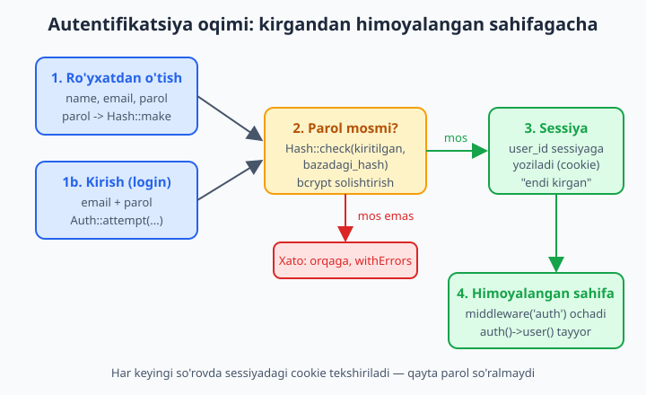
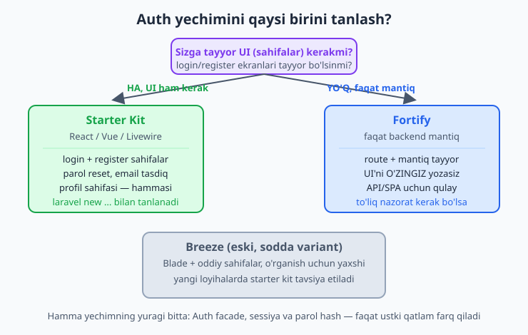
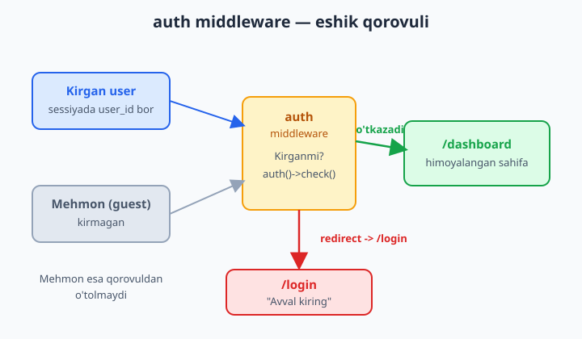

# 13 — Autentifikatsiya

[⬅️ Oldingi: 12 — Validatsiya](./12-validatsiya.md) · [🏠 README](./README.md) · [Keyingi: 14 — Avtorizatsiya (Gates va Policies) ➡️](./14-avtorizatsiya.md)

> **Bu bobda:** har bir jiddiy saytda kerak bo'ladigan narsani — foydalanuvchini tanish, ya'ni **autentifikatsiya**ni o'rganamiz. Login va register tizimini noldan, xavfsiz qurish nega qiyinligini ko'ramiz; Laravel 13 ning tayyor yechimlarini (rasmiy **starter kit**'lar, **Fortify** va eski sodda **Breeze**) taqqoslaymiz; perda ortidagi mexanikani — `Auth` facade, `auth()->user()`, `Auth::attempt`, `Auth::login`/`logout`, parol hash (bcrypt), guard va provider tushunchalarini ochamiz; `auth` middleware bilan sahifani himoyalashni; `@auth`/`@guest` Blade direktivalarini va oxirida hamma sehrni qo'lda takrorlaydigan "manual auth" misolini yozamiz.

---

## Muammo

Tasavvur qiling: blog yoki do'kon sayti tayyor bo'ldi. Endi har kim o'z postini yozsin, har kim o'z buyurtmasini ko'rsin deysiz. Buning uchun saytga **kirish** kerak: foydalanuvchi email va parol bilan ro'yxatdan o'tadi, keyin kiradi, sayt esa uni "eslab qoladi".

Sof PHP'da buni qo'lda yozsangiz, ro'yxat juda uzun va xavfli bo'ladi:

```text
- Parolni bazaga ochiq yozib bo'lmaydi (baza o'g'irlansa hamma parol ochiladi) -> hash kerak
- Hash to'g'ri algoritm bilan, "salt" bilan bo'lishi shart
- Kirgandan keyin "kim ekanini" sessiyada saqlash kerak
- Sessiya cookie'sini o'g'irlashdan himoya (session fixation) kerak
- Har formaga CSRF himoyasi kerak
- Parolni unutganlar uchun reset, emailni tasdiqlash...
```

Bularning har birida bitta xato — butun saytni ochiq qoldiradi. Mana sof PHP'dagi "sodda" login ham aslida tuzoqqa to'la:

```php
// ❌ Xavfli: parol ochiq solishtiriladi, sessiya himoyasi yo'q
$user = $pdo->query("SELECT * FROM users WHERE email='$email'")->fetch();
if ($user && $user['password'] === $password) {   // ochiq parol! SQL injection!
    $_SESSION['user_id'] = $user['id'];
}
```

Laravel bu butun og'irlikni o'z zimmasiga oladi. Asosiy holatlarda siz hatto bitta qator yozmaysiz — tayyor starter kit hammasini beradi. Kerak bo'lsa, mexanikani ham bemalol qo'lda boshqarasiz:

```php
if (Auth::attempt(['email' => $email, 'password' => $password])) {
    // Kirdi! Parol avtomatik hash bilan solishtirildi, sessiya xavfsiz to'ldirildi.
}
```

Mana shu bobda ana shu `attempt` ichida nima sodir bo'lishini boshdan-oyoq ochamiz.



📌 Ikki yaqin so'zni boshidanoq ajratib olaylik. **Autentifikatsiya** (authentication) — "sen kimsan?" degan savol: foydalanuvchini tanish (login). **Avtorizatsiya** (authorization) — "senga ruxsat bormi?" degan savol: kirgan odam aynan shu ishni qila oladimi (mas. faqat o'z postini o'chira oladimi). Bu bobda birinchisini, keyingi 14-bobda ikkinchisini o'rganamiz.

## Laravel 13 da auth: qaysi yechimni tanlash?

2026-yilda Laravel auth uchun bitta emas, bir nechta tayyor yo'l beradi. Ularning **mantig'i bir xil** — faqat ustki qatlam (UI) bilan farq qiladi:

- **Rasmiy starter kit'lar** — `React`, `Vue` yoki `Livewire` variantida keladi. Login, register, parol reset, email tasdiqlash, profil — barcha **sahifalar tayyor**. Yangi loyihani shulardan biri bilan boshlash — bugungi tavsiya etilgan yo'l.
- **Fortify** — faqat **backend mantiq**: route'lar va auth amallari tayyor, lekin UI (sahifalar) yo'q — uni o'zingiz yozasiz. SPA, mobil API yoki to'liq nazorat kerak bo'lganda qulay.
- **Breeze** — eski, juda sodda variant: oddiy Blade sahifalar. Yangi loyihalar uchun starter kit afzal, lekin Breeze **o'rganish uchun** hali ham ajoyib, chunki kodi ochiq va qisqa.



Yangi loyihada starter kit'ni `laravel new` paytida tanlaysiz:

```bash
laravel new myapp
# Starter kit so'raydi: None / React / Vue / Livewire
# Birini tanlasangiz, login/register hammasi tayyor keladi
```

So'ngra odatdagidek paketlarni o'rnatib, bazani tayyorlaysiz:

```bash
composer install
php artisan migrate
npm install && npm run dev
```

💡 `users` jadvali va `User` modeli har bir yangi Laravel loyihasida **standart keladi** — uni yaratish shart emas. `database/migrations` ichida `create_users_table` migratsiyasi allaqachon turadi (`name`, `email`, `password`, `remember_token`...). Shuning uchun `migrate` qilganingiz zahoti ro'yxatdan o'tishga tayyorsiz.

📌 Eski qo'llanmalarda `laravel new myapp --jet` yoki "Jetstream" so'zini uchratasiz. 2026-da rasmiy starter kit'lar uni almashtirdi — yangi loyihada Jetstream'ni qidirmang.

## Parol hash — nega ochiq saqlamaymiz?

Auth'ning yuragi — **parol hash**. Hash — parolni **qaytarib bo'lmaydigan** tarzda "aralashtirib" yuborish: `maxfiy123` dan `$2y$12$Q8....` chiqadi, lekin bu satrdan parolni hech qachon orqaga tiklab bo'lmaydi. Baza o'g'irlansa ham, o'g'ri faqat hash'larni ko'radi, parolni emas.

Laravel default'da **bcrypt** algoritmidan foydalanadi. Sof PHP'da bu shunday ko'rinadi (Laravel aynan shuni o'raydi):

```php
$parol = 'maxfiy123';

$hash = password_hash($parol, PASSWORD_BCRYPT);
// Natija (har safar boshqacha!):
// $2y$12$Q8e3...60 ta belgi

password_verify('maxfiy123', $hash);  // true  - mos
password_verify('boshqa',    $hash);  // false - mos emas
```

Bu kodni ishga tushirib tekshirdik: hash har doim **60 belgi**, har safar **boshqacha** (ichida tasodifiy "salt" bor), lekin `password_verify` baribir to'g'ri tanidi. Laravel'da xuddi shuni ikki metod qiladi:

```php
use Illuminate\Support\Facades\Hash;

$hash = Hash::make('maxfiy123');        // password_hash'ni o'raydi
Hash::check('maxfiy123', $hash);        // true  - password_verify'ni o'raydi
```

📌 **Eng muhim qoida:** parolni `Hash::make` bilan hash qilib saqlang, hech qachon ochiq yozmang. Va hech qachon `$kiritilgan === $bazadagi` deb solishtirmang — doim `Hash::check` ishlating, chunki bazada hash turadi, ochiq parol emas.

💡 Yaxshi yangilik: `User` modelida `password` ustuni `'hashed'` cast bilan keladi (modelda `casts()` metodida). Bu degani `User::create(['password' => 'maxfiy123'])` desangiz, Laravel **avtomatik** `Hash::make` qiladi — siz qo'lda hash qilishni unutib qo'ymaysiz:

```php
protected function casts(): array
{
    return [
        'email_verified_at' => 'datetime',
        'password' => 'hashed',   // create/update'da avtomatik hash qiladi
    ];
}
```

❌ `'password' => bcrypt($parol)` deb yana qo'lda hash qilish — ikki marta hash bo'ladi (hash'ning hash'i), keyin login ishlamaydi.
✅ `'hashed'` cast bo'lsa, ochiq parolni bering, Laravel o'zi hash qiladi.

## Auth facade — kirish, chiqish, tekshirish

`Auth` facade — auth bilan ishlashning markaziy "pulti". Uning bir nechta asosiy metodi bor; deyarli hamma ishingiz shular bilan bitadi:

| Metod | Vazifasi |
|---|---|
| `Auth::attempt($credentials)` | email+parolni tekshiradi; mos kelsa kiritadi, `true` qaytaradi |
| `Auth::login($user)` | tayyor `User` obyektini sessiyaga kiritadi (parol so'ramay) |
| `Auth::user()` | hozir kirgan foydalanuvchini qaytaradi (kirmagan bo'lsa `null`) |
| `Auth::id()` | kirgan foydalanuvchining `id`'si (yoki `null`) |
| `Auth::check()` | kimdir kirganmi? `true`/`false` |
| `Auth::guest()` | mehmonmi (kirmaganmi)? `check()`ning aksi |
| `Auth::logout()` | sessiyadan chiqaradi |

`Auth::` facade o'rniga ko'pincha qisqaroq **`auth()` yordamchi (helper)** funksiyasidan foydalaniladi — ikkalasi bir xil:

```php
Auth::user();        // facade
auth()->user();      // helper - aynan shu narsa, qisqaroq
auth()->id();
auth()->check();
```

💡 Controller ichida kirgan foydalanuvchini olishning yana bir toza yo'li bor — `Request` orqali:

```php
public function dashboard(Request $request)
{
    $user = $request->user();   // auth()->user() bilan bir xil
    return view('dashboard', ['user' => $user]);
}
```

## Kirish (login) — `Auth::attempt`

Endi haqiqiy login controllerini yozamiz. Mantiq oddiy: forma kelganda email va parolni validatsiya qilamiz (12-bob), keyin `Auth::attempt` ga beramiz. U email bo'yicha foydalanuvchini topadi va parolni **hash bilan o'zi solishtiradi** — sizga qo'lda `Hash::check` ham kerak emas:

```php
namespace App\Http\Controllers;

use Illuminate\Http\Request;
use Illuminate\Support\Facades\Auth;

class LoginController extends Controller
{
    public function login(Request $request)
    {
        $credentials = $request->validate([
            'email' => ['required', 'email'],
            'password' => ['required'],
        ]);

        if (Auth::attempt($credentials, $request->boolean('remember'))) {
            $request->session()->regenerate();

            return redirect()->intended('/dashboard');
        }

        return back()->withErrors([
            'email' => 'Email yoki parol noto\'g\'ri.',
        ])->onlyInput('email');
    }
}
```

Bu yerda har bir qator muhim:

- **`$credentials`** — `['email' => ..., 'password' => ...]` massivi. `attempt` aynan shu ikki kalitni kutadi: email bo'yicha qidiradi, `password`ni hash bilan tekshiradi.
- **`$request->boolean('remember')`** — formadagi "Meni eslab qol" belgisi. `true` bo'lsa, brauzer yopilsa ham foydalanuvchi uzoq vaqt kirgan qoladi ("remember me" cookie).
- **`session()->regenerate()`** — kirgandan keyin sessiya ID'sini yangilaydi. Bu *session fixation* hujumidan himoya qiladi (qo'lda yozsangiz buni unutib qolardingiz).
- **`redirect()->intended('/dashboard')`** — agar foydalanuvchi himoyalangan sahifaga kirmoqchi bo'lib login'ga otib yuborilgan bo'lsa, kirgandan keyin uni **o'sha asl sahifaga** qaytaradi; aks holda `/dashboard`ga.
- **Xato bo'lsa** — `back()->withErrors(...)` orqali formaga qaytadi va xato xabarini ko'rsatadi.

📌 Login muvaffaqiyatsiz bo'lganda **"email yoki parol noto'g'ri"** deng — "bu email yo'q" yoki "parol xato" deb aniqlashtirmang. Aks holda hujumchi qaysi email ro'yxatda borligini bilib oladi.

💡 Login formasi qaysi maydon bo'yicha kirishni xohlasangiz, `attempt`'ga shuni bering. Masalan, faqat **faol** (active) foydalanuvchilarni kiritmoqchi bo'lsangiz, qo'shimcha shart yozasiz:

```php
Auth::attempt([
    'email' => $request->email,
    'password' => $request->password,
    'active' => 1,   // qo'shimcha shart: faqat active=1 bo'lganlar kiradi
]);
```

## Ro'yxatdan o'tish (register)

Register controllerida foydalanuvchini **yaratamiz**, keyin darrov **kiritib qo'yamiz** (`Auth::login`), shunda u qaytadan login qilishi shart emas:

```php
namespace App\Http\Controllers;

use App\Models\User;
use Illuminate\Http\Request;
use Illuminate\Support\Facades\Auth;
use Illuminate\Support\Facades\Hash;
use Illuminate\Validation\Rules\Password;

class RegisterController extends Controller
{
    public function store(Request $request)
    {
        $validated = $request->validate([
            'name' => ['required', 'string', 'max:255'],
            'email' => ['required', 'email', 'unique:users,email'],
            'password' => ['required', 'confirmed', Password::defaults()],
        ]);

        $user = User::create([
            'name' => $validated['name'],
            'email' => $validated['email'],
            'password' => Hash::make($validated['password']),
        ]);

        Auth::login($user);

        return redirect('/dashboard');
    }
}
```

Diqqat qilinglar:

- **`'unique:users,email'`** — bir xil email bilan ikki marta ro'yxatdan o'tishni taqiqlaydi (12-bobdagi validatsiya qoidasi).
- **`'confirmed'`** — formada `password` va `password_confirmation` maydonlari bir xil bo'lishini talab qiladi (parolni ikki marta kiritish).
- **`Password::defaults()`** — parol kuchiga oid standart qoidalar (mas. minimal uzunlik). Buni `Illuminate\Validation\Rules\Password` dan import qilamiz.
- **`Hash::make(...)`** — parolni hash qilamiz. (Modelda `'hashed'` cast bo'lsa, buni tushirib qoldirsa ham bo'ladi — lekin ko'rinib turishi uchun yozdik.)

💡 `User` modeli `Authenticatable` klassidan meros oladi va `$fillable` ichida `name`, `email`, `password` bor — bu standart keladi, shuning uchun `User::create([...])` darrov ishlaydi. Modelni o'zgartirish kerak emas.

## Chiqish (logout)

Logout — sessiyani tozalash. Uchta qadam: `Auth::logout()`, sessiyani bekor qilish va CSRF tokenni yangilash. Logout **doim POST** orqali bo'lishi kerak (GET emas), aks holda boshqa sayt sizni bilmagan holda chiqarib yuborishi mumkin (CSRF):

```php
public function logout(Request $request)
{
    Auth::logout();

    $request->session()->invalidate();
    $request->session()->regenerateToken();

    return redirect('/');
}
```

Route'i ham `POST` bo'ladi:

```php
use App\Http\Controllers\LoginController;
use Illuminate\Support\Facades\Route;

Route::post('/logout', [LoginController::class, 'logout'])->name('logout');
```

## `auth` middleware — sahifani himoyalash

Login yozdik, lekin foydalanuvchi `/login`'ga bormay turib to'g'ri `/dashboard`'ga kirsa-chi? Hozircha hech narsa to'smaydi. Bu yerda **middleware** (15-bobda chuqurroq) — "eshik qorovuli" — kerak bo'ladi. `auth` middleware'i sahifaga **faqat kirgan** foydalanuvchini o'tkazadi; mehmonni esa `/login`'ga qaytaradi:

```php
use App\Http\Controllers\DashboardController;
use Illuminate\Support\Facades\Route;

Route::get('/dashboard', [DashboardController::class, 'index'])
    ->middleware('auth')
    ->name('dashboard');
```



Bir nechta route'ni birdan himoyalamoqchi bo'lsangiz — guruhga olasiz:

```php
Route::middleware('auth')->group(function () {
    Route::get('/dashboard', [DashboardController::class, 'index']);
    Route::get('/profile', [ProfileController::class, 'edit']);
    Route::patch('/profile', [ProfileController::class, 'update']);
});
```

📌 Mehmon himoyalangan sahifaga urinsa, Laravel uni qayerga jo'natishni bilishi kerak. Bu **slim struktura**da (Laravel 11+) `bootstrap/app.php` da sozlanadi — eski `app/Http/Kernel.php` **endi yo'q**:

```php
use Illuminate\Foundation\Configuration\Middleware;

->withMiddleware(function (Middleware $middleware): void {
    $middleware->redirectGuestsTo('/login');
})
```

💡 `auth` bilan yonma-yon `verified` middleware'ini ham qo'shsangiz, faqat **emailini tasdiqlagan** foydalanuvchilar o'tadi: `->middleware(['auth', 'verified'])`. Email tasdiqlashni quyiroqda ko'ramiz.

## Blade'da `@auth` va `@guest`

Endi shablonda (5-bob) foydalanuvchi kirgan-kirmaganiga qarab har xil narsa ko'rsatamiz. Buning uchun `@auth` va `@guest` direktivalari bor:

```blade
@auth
    <p>Salom, {{ auth()->user()->name }}!</p>

    <form method="POST" action="/logout">
        @csrf
        <button type="submit">Chiqish</button>
    </form>
@endauth

@guest
    <a href="/login">Kirish</a>
    <a href="/register">Ro'yxatdan o'tish</a>
@endguest
```

- **`@auth ... @endauth`** — faqat kirgan foydalanuvchiga ko'rinadi (header'dagi "Chiqish" tugmasi, ismi).
- **`@guest ... @endguest`** — faqat mehmonga ko'rinadi ("Kirish"/"Ro'yxatdan o'tish" havolalari).
- **`{{ auth()->user()->name }}`** — kirgan foydalanuvchi ismi. `@auth` ichida `user()` hech qachon `null` bo'lmaydi, shuning uchun bemalol `->name` deyish xavfsiz.

Xohlasangiz oddiy `@if` bilan ham yozasiz — bular shunchaki qisqartma:

```blade
@if (auth()->check())
    <p>Email: {{ auth()->user()->email }}</p>
@endif
```

📌 Logout formasida `@csrf` ni unutmang! CSRF himoyasi (12-bob) bo'lmasa, POST forma ishlamaydi — Laravel `419` xatosi beradi.

## Kirgan foydalanuvchi bilan ishlash

Kirgandan keyin foydalanuvchi o'z ma'lumotlari bilan ishlaydi. Eng ko'p uchraydigan qolip — kirgan foydalanuvchiga **bog'langan** yozuv yaratish (mas. o'z postini). `User` va `Post` o'rtasida `hasMany` munosabati bo'lsa (9-bob), bu juda toza chiqadi:

```php
namespace App\Http\Controllers;

use Illuminate\Http\Request;

class PostController extends Controller
{
    public function store(Request $request)
    {
        $validated = $request->validate([
            'title' => ['required', 'string', 'max:255'],
            'body' => ['required', 'string'],
        ]);

        $post = $request->user()->posts()->create($validated);

        return redirect()->route('posts.show', $post);
    }
}
```

`$request->user()->posts()->create(...)` — yangi post avtomatik kirgan foydalanuvchining `id`'si bilan bog'lanadi. `user_id`ni qo'lda yozish shart emas, xato qilish ehtimoli yo'q.

## Manual auth — sehrni qo'lda takrorlash

`Auth::attempt` ichida nima borligini to'liq tushunish uchun, uni **qo'lda** yozib ko'ramiz. Bu kundalik ishda kerak emas (`attempt` bor), lekin mexanikani ko'rsatadi — `attempt` aynan shularni qiladi:

```php
namespace App\Http\Controllers;

use App\Models\User;
use Illuminate\Http\Request;
use Illuminate\Support\Facades\Auth;
use Illuminate\Support\Facades\Hash;

class ManualLoginController extends Controller
{
    public function login(Request $request)
    {
        $data = $request->validate([
            'email' => ['required', 'email'],
            'password' => ['required'],
        ]);

        // 1) Foydalanuvchini email bo'yicha topamiz
        $user = User::where('email', $data['email'])->first();

        // 2) Foydalanuvchi bormi VA parol hashga mosmi?
        if (! $user || ! Hash::check($data['password'], $user->password)) {
            return back()->withErrors([
                'email' => 'Ma\'lumotlar mos kelmadi.',
            ]);
        }

        // 3) Hammasi joyida - sessiyaga kiritamiz
        Auth::login($user);
        $request->session()->regenerate();

        return redirect()->intended('/dashboard');
    }
}
```

Mana `attempt`ning ichi: (1) email bo'yicha topish, (2) `Hash::check` bilan parolni solishtirish, (3) topilsa `Auth::login` bilan sessiyaga yozish. Ko'rib turibsizki, `Auth::attempt($credentials)` bu uch qadamni **bitta qatorga** yig'adi — shuning uchun amalda doim `attempt`'ni ishlatamiz, manualni esa faqat g'ayrioddiy holatlarda.

💡 `Auth::loginUsingId($id)` — agar faqat `id` bo'lsa, parolsiz kiritish (mas. test yoki "boshqa foydalanuvchi sifatida kirish" admin funksiyasi). `Auth::login($user)` esa tayyor model obyektini kiritadi.

## Guard va provider — qisqacha

Ba'zan hujjatlarda **guard** va **provider** so'zlarini uchratasiz. Qisqacha:

- **Provider** — foydalanuvchini *qayerdan* olishni biladi (odatda `users` jadvalidan, Eloquent orqali). "Kim borligini" baza bilan bog'laydi.
- **Guard** — kirgan-kirmaganni *qanday* eslab qolishni biladi. Default guard — **`web`** (sessiya + cookie orqali). 17-bobda API uchun boshqa guard (`sanctum`, token orqali) ishlatamiz.

Bu ikkisi `config/auth.php` da sozlangan va **default holat 99% loyihaga to'g'ri keladi** — odatda umuman tegmaysiz. Bilib qo'yish kifoya: `web` guard sessiya bilan ishlaydi (brauzer sayti), token-asoslangan API uchun esa alohida guard bor.

```php
// config/auth.php (standart, odatda o'zgartirilmaydi)
'defaults' => [
    'guard' => 'web',
    'passwords' => 'users',
],
```

## Email tasdiqlash va parol reset — qisqacha

Ikki ko'p kerak bo'ladigan qo'shimcha funksiya bor; ularning **to'liq mantig'i starter kit / Fortify bilan tayyor keladi**, shuning uchun bu yerda faqat tushunchasini beramiz.

**Email tasdiqlash (email verification):** ro'yxatdan o'tgach, foydalanuvchiga tasdiqlash havolasi yuboriladi; u bosmaguncha email tasdiqlanmagan hisoblanadi. `User` modeli `MustVerifyEmail` interfeysini implement qilsa va route'ga `verified` middleware qo'yilsa, faqat tasdiqlaganlar o'tadi:

```php
Route::get('/dashboard', [DashboardController::class, 'index'])
    ->middleware(['auth', 'verified']);
```

**Parol reset (forgot password):** foydalanuvchi parolini unutsa, emailiga vaqtinchalik havola yuboriladi; u orqali yangi parol qo'yadi. Bu mantiq ham starter kit bilan keladi — o'zingiz yozishingiz shart emas.

📌 Email yuborilishi uchun `.env` da `MAIL_*` sozlamalari to'g'ri bo'lishi kerak (19-bobda Mail'ni o'rganamiz). Lokal sinov uchun `MAIL_MAILER=log` qo'ysangiz, "yuborilgan" email `storage/logs/laravel.log` ga yoziladi — haqiqiy email kerak bo'lmaydi:

```env
MAIL_MAILER=log
```

## Yakuniy xulosa

Autentifikatsiyaning butun mohiyati uch tushunchada:

1. **Parol hash** — `Hash::make`/`Hash::check` (bcrypt). Parol hech qachon ochiq saqlanmaydi.
2. **Sessiya** — kirgandan keyin foydalanuvchi `web` guard orqali sessiyada eslab qolinadi; `Auth::attempt`/`login` kiritadi, `Auth::logout` chiqaradi.
3. **Middleware** — `auth` himoyasi mehmonni sahifaga qo'ymaydi, `/login`'ga qaytaradi.

Amalda yangi loyihada **starter kit**'ni tanlaysiz va bularning hammasi tayyor keladi; lekin endi siz perda ortida nima borligini bilasiz va kerak bo'lganda `attempt`/`login`/`logout`'ni qo'lda ham boshqara olasiz. Keyingi bobda — kirgan foydalanuvchi *nimaga ruxsati bor*ligini hal qiluvchi **avtorizatsiya** (Gates va Policies).

## 13-bob mashqlari

Quyidagi mashqlarni yangi yoki avvalgi boblardagi Laravel loyihasida bajaring. Auth uchun `users` jadvali standart keladi — `php artisan migrate` ni unutmang. Yechimlarni yozmaymiz — o'zingiz qilib o'rganasiz.

1. Yangi loyiha yarating va `laravel new` paytida biror starter kit (yoki Breeze) tanlang. `php artisan migrate` ishlating va brauzerda `/register` sahifasini oching.
2. Starter kit bilan kelgan forma orqali yangi foydalanuvchi sifatida ro'yxatdan o'ting, keyin chiqib, qaytadan kiring. Brauzerni yangilab ko'ring — kirgan holatingiz saqlanib qoladimi?
3. `database/migrations` ichidagi `create_users_table` migratsiyasini oching. Qaysi ustunlar bor (`name`, `email`, `password`, `remember_token`...)? Har birining vazifasini izoh sifatida yozib chiqing.
4. `php artisan tinker` da `App\Models\User::first()` ni chaqiring. `password` ustunida nima turibdi — ochiq parolmi yoki hash? Uzunligini (`strlen`) tekshiring.
5. Tinker'da `Illuminate\Support\Facades\Hash::make('test123')` ni ikki marta chaqiring. Ikkala natija bir xilmi? Nega — izohlab bering.
6. Tinker'da `Hash::check('test123', $hash)` ni to'g'ri va xato parol bilan sinab, `true`/`false` qaytishini ko'ring.
7. `Auth::user()` va `auth()->user()` bir xil natija qaytarishini bitta route ichida ikkalasini chaqirib tasdiqlang. Kirmagan holatda nima qaytadi?
8. Kirgan holatda `auth()->id()` va `auth()->check()` qiymatlarini, keyin chiqib (logout) yana o'sha qiymatlarni chop eting — farqni ko'ring.
9. O'z qo'lingiz bilan `LoginController` yarating va `Auth::attempt(['email' => ..., 'password' => ...])` orqali login mantig'ini yozing. To'g'ri va xato parol bilan sinang.
10. Login formasini Blade'da tuzing: `email`, `password` maydonlari, `@csrf`, va `@error` bilan xato xabarlari. Xato parol kiritib, xabarning chiqishini ko'ring.
11. Login formasiga "Meni eslab qol" (`name="remember"`) checkbox qo'shing va controllerda `$request->boolean('remember')` ni `attempt`ning ikkinchi argumentiga bering. Tarmoq (DevTools) da cookie qancha vaqtga qo'yilganini taqqoslang.
12. `RegisterController@store` yozing: validatsiya (`unique:users,email`, `confirmed`), `User::create`, keyin `Auth::login`. Ro'yxatdan o'tgach to'g'ridan-to'g'ri kirgan holatda bo'lishingizni tasdiqlang.
13. `/dashboard` route'iga `->middleware('auth')` qo'ying. Chiqqan holatda (mehmon) shu manzilga kiring — qayerga otib yuborildingiz?
14. `bootstrap/app.php` da `redirectGuestsTo('/login')` ni sozlang. Endi 13-mashqdagi mehmon aynan `/login`'ga qaytishini tekshiring.
15. Bir nechta route'ni `Route::middleware('auth')->group(...)` bilan birdan himoyalang. Guruh ichidagi va tashqarisidagi sahifalarga mehmon sifatida kirib, farqni ko'ring.
16. `logout` route'ini `POST` qilib yarating va controllerda `Auth::logout()`, `session()->invalidate()`, `session()->regenerateToken()` ni yozing. Header'dagi forma orqali chiqib ko'ring.
17. Layout'da `@auth`/`@guest` bilan menyuni o'zgartiring: kirganga "Profil" va "Chiqish", mehmonga "Kirish"/"Ro'yxatdan o'tish" ko'rsating.
18. `@auth` ichida `{{ auth()->user()->name }}` bilan kirgan foydalanuvchi ismini header'da chiqaring. Boshqa foydalanuvchi sifatida kirib, ismning o'zgarishini ko'ring.
19. "Manual auth" controllerini yozing: `User::where('email', ...)->first()` + `Hash::check(...)` + `Auth::login(...)`. Uni `Auth::attempt` ishlatadigan variant bilan solishtirib, bir xil natija berishini tasdiqlang.
20. `Auth::attempt` ga qo'shimcha shart (`'active' => 1`) qo'shing va bazada bitta foydalanuvchiga `active = 0` qo'ying. Shu foydalanuvchi to'g'ri parol bilan ham kira olmasligini ko'rsating.
