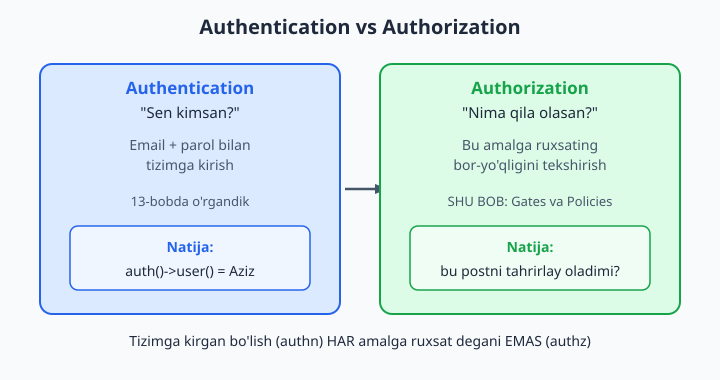
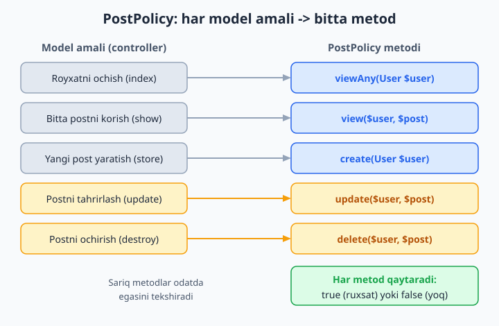
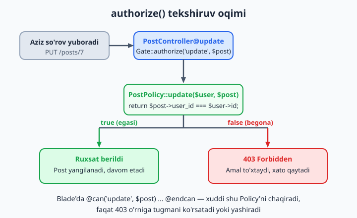

# 14 — Avtorizatsiya (Gates va Policies)

[⬅️ Oldingi: 13 — Autentifikatsiya](./13-autentifikatsiya.md) · [🏠 README](./README.md) · [Keyingi: 15 — Middleware ➡️](./15-middleware.md)

> **Bu bobda:** tizimga kirgan foydalanuvchi HAR amalni qila olmasligini — ya'ni avtorizatsiyani (authorization, "nimaga ruxsating bor?") o'rganamiz. Avval uni autentifikatsiyadan (authentication, "kimsan?") ajratamiz. Keyin oddiy bir martalik huquqlar uchun `Gate`ni (`Gate::define`, `Gate::allows`/`denies`), model amallari uchun `Policy`ni (`make:policy --model`, `viewAny`/`view`/`create`/`update`/`delete` metodlari) ko'rib chiqamiz. Controllerda `Gate::authorize()`, helper `can()`, Blade'da `@can`, `before()` hook (admin hammasini qiladi), resource policy + resource controller, owner-based (faqat egasi) ruxsat va rollar bilan oddiy yondashuvni (oxirida `spatie/laravel-permission`ga qisqa ishora) o'rganamiz.

---

## Muammo

13-bobda foydalanuvchini tizimga kiritdik: endi `auth()->user()` bizga kim so'rov yuborganini aytadi. Lekin bu hali yetarli emas. Blogimizda Aziz ham, Malika ham ro'yxatdan o'tgan. Aziz manzil qatoriga `/posts/7/edit` deb yozadi — bu Malika yozgan post. Hozircha controllerimiz hech narsani tekshirmaydi:

```php
// PostController — hali himoyasiz
public function update(Request $request, Post $post)
{
    $post->update($request->validate([
        'title' => 'required|string|max:255',
        'body' => 'required|string',
    ]));

    return redirect()->route('posts.show', $post);
}
```

Aziz tizimga kirgan — demak `auth` middleware (15-bob) uni o'tkazib yuboradi. Va u Malikaning postini bemalol tahrirlab qo'yadi. Bu — jiddiy xavfsizlik teshigi. **Kirgan bo'lish** (login qilgan) **hamma narsaga ruxsat** degani emas. Kerakli qoida sodda: "postni faqat egasi tahrirlasin".

Bu ikki xil savol:

- **Authentication** (autentifikatsiya): *"Sen kimsan?"* — email va parol bilan kimligingni isbotlaysan. Buni 13-bobda qildik.
- **Authorization** (avtorizatsiya): *"Nima qila olasan?"* — kim ekaning aniqlangach, aynan shu amalga (bu postni tahrirlashga) ruxsating bor-yo'qligini tekshiramiz. Shu bobning mavzusi.



📌 Ikki atamani aralashtirmaslik uchun: **authn** (n — name, kimsan) va **authz** (z — ...orize, ruxsat) deb qisqartirishadi. Avval doim authn, keyin authz: noma'lum odamning huquqini tekshirib bo'lmaydi.

Laravel avtorizatsiya uchun ikkita asbob beradi:

- **Gate** — bitta, modelga bog'liq bo'lmagan huquq uchun ("admin panelni ko'rish"). Yopiq closure.
- **Policy** — bitta model atrofidagi barcha amallar uchun ("postni ko'rish/yaratish/tahrirlash/o'chirish"). Alohida klass.

Aralashib ketmaslik uchun oddiy qoida: **bitta model + uning amallari → Policy; modelsiz yoki bir martalik tekshiruv → Gate.** Avval soddaroq Gate'dan boshlaymiz.

## Gate — bir martalik huquq

Gate (so'zma-so'z "darvoza") — bu nomlangan ruxsat tekshiruvi. Uni odatda `App\Providers\AppServiceProvider`ning `boot()` metodida e'lon qilamiz. `boot()` — ilova ishga tushganda bir marta chaqiriladigan joy (2-bobdan tanish).

```php
// app/Providers/AppServiceProvider.php
namespace App\Providers;

use App\Models\User;
use Illuminate\Support\Facades\Gate;
use Illuminate\Support\ServiceProvider;

class AppServiceProvider extends ServiceProvider
{
    public function boot(): void
    {
        Gate::define('admin-panelni-korish', function (User $user) {
            return $user->role === 'admin';
        });
    }
}
```

`Gate::define('nom', closure)` — birinchi argument huquq nomi (string), ikkinchisi — `true`/`false` qaytaradigan closure. Closure'ning birinchi parametri **doim** joriy foydalanuvchi (`User $user`) — Laravel uni avtomatik uzatadi. Endi istalgan joyda shu nom bilan so'raymiz:

```php
use Illuminate\Support\Facades\Gate;

if (Gate::allows('admin-panelni-korish')) {
    // ruxsat bor — davom etamiz
}

if (Gate::denies('admin-panelni-korish')) {
    // ruxsat yo'q — to'xtatamiz
}
```

`allows` — "ruxsat beradimi?" (true bo'lsa ha), `denies` — uning aksi. Ikkalasiga ham `User`ni qo'lda berishimiz shart emas: Gate joriy kirgan foydalanuvchini o'zi oladi.

Controllerda ko'p hollarda taqiqlanganda darrov 403 qaytaramiz:

```php
// app/Http/Controllers/AdminController.php
namespace App\Http\Controllers;

use Illuminate\Support\Facades\Gate;

class AdminController extends Controller
{
    public function index()
    {
        if (Gate::denies('admin-panelni-korish')) {
            abort(403);
        }

        return view('admin.index');
    }
}
```

`abort(403)` — so'rovni darrov to'xtatib, "403 Forbidden" (taqiqlangan) javobini qaytaradi. 404 ("topilmadi") emas: bu yerda sahifa bor, lekin senga yopiq.

💡 `User` modelida `role` ustuni bor deb faraz qilyapmiz. Migratsiyada `$table->string('role')->default('user');` qo'shib, `User` modelining `$fillable`iga `'role'`ni kiritib qo'ying. 7- va 8-boblardan eslang.

📌 Gate closure'ining birinchi parametri ixtiyoriy bo'lishi mumkin emas deb o'ylamang — agar tekshiruv mehmon (login qilmagan) uchun ham ishlashi kerak bo'lsa, `?User $user` (nullable) qiling. Aks holda mehmonga Gate avtomatik `false` qaytaradi va closure umuman chaqirilmaydi.

### `before` Gate bilan: super-admin

Ba'zan bitta odam (egasi/super-admin) hamma darvozadan o'tishi kerak. Har bir Gate ichida buni qayta yozish o'rniga, bitta global `Gate::before` yozamiz:

```php
Gate::before(function (User $user, string $ability) {
    if ($user->role === 'super-admin') {
        return true;   // hamma tekshiruvdan o'tkazamiz
    }

    return null;       // hech narsa hal qilmadik -> oddiy Gate ishlaydi
});
```

📌 Diqqat: `null` qaytarish — "men qaror qabul qilmayman, davom et" degani. Agar `false` qaytarsangiz, ENG MUHIM xato bo'ladi: hamma tekshiruvni darrov rad etib qo'yasiz. "Qarorsizlik" uchun doim `null`.

## Gate yetmaganda — Policy

Gate bitta huquq uchun yaxshi. Lekin `Post` atrofida amallar ko'p: ko'rish, ro'yxatni ko'rish, yaratish, tahrirlash, o'chirish. Bularning hammasini alohida Gate qilsak, `AppServiceProvider` shishib ketadi va mantiq tarqalib qoladi. **Policy** — bitta model bilan bog'liq barcha avtorizatsiya qoidalarini bitta klassga yig'adi.

Policy yaratamiz — `--model` bayrog'i bilan, shunda Laravel barcha standart metodlarni tayyor skelet qilib beradi:

```bash
php artisan make:policy PostPolicy --model=Post
```

Bu `app/Policies/PostPolicy.php` faylini quyidagicha yaratadi (skeletni o'z qoidalarimiz bilan to'ldiramiz):

```php
// app/Policies/PostPolicy.php
namespace App\Policies;

use App\Models\Post;
use App\Models\User;

class PostPolicy
{
    // Postlar RO'YXATINI ko'rish (index)
    public function viewAny(User $user): bool
    {
        return true;   // har kim ro'yxatni ko'ra oladi
    }

    // BITTA postni ko'rish (show)
    public function view(User $user, Post $post): bool
    {
        return true;
    }

    // Yangi post YARATISH (create/store)
    public function create(User $user): bool
    {
        return true;   // kirgan har kim yoza oladi
    }

    // Postni TAHRIRLASH (edit/update) — faqat egasi
    public function update(User $user, Post $post): bool
    {
        return $post->user_id === $user->id;
    }

    // Postni O'CHIRISH (destroy) — faqat egasi
    public function delete(User $user, Post $post): bool
    {
        return $post->user_id === $user->id;
    }
}
```

Mana shu — muammoning yechimi. `update` va `delete` metodlari postning `user_id`sini joriy foydalanuvchining `id`si bilan solishtiradi. Bir xil bo'lsa — egasi, `true`. Bo'lmasa — begona, `false`. Bu **owner-based** (egasiga asoslangan) avtorizatsiya.



Metodlarning nomlanishida mantiq bor:

| Controller amali | Policy metodi | Argumentlar |
|---|---|---|
| `index` (ro'yxat) | `viewAny` | faqat `User` |
| `show` (bitta) | `view` | `User` + `Post` |
| `create` / `store` | `create` | faqat `User` |
| `edit` / `update` | `update` | `User` + `Post` |
| `destroy` | `delete` | `User` + `Post` |

📌 `viewAny` va `create` metodlariga `Post` obyekt berilmaydi — chunki bu amallar muayyan postga emas, umuman postlarga tegishli. ("Yaratishdan oldin qaysi post?" degan savol mantiqsiz.) Qolgan uchtasi aniq bir post bilan ishlaydi, shuning uchun ikkinchi argument oladi.

📌 Laravel 11+ da policy'lar **avtomatik topiladi** (auto-discovery): `App\Models\Post` modeli uchun `App\Policies\PostPolicy` klassi o'z-o'zidan ulanadi — qo'lda ro'yxatga olish kerak emas. Agar nom konvensiyaga sig'masa (masalan policy boshqa joyda tursa), `Gate::policy(Post::class, PostPolicy::class)` bilan o'zingiz bog'laysiz.

## Policy'ni controllerda chaqirish — `Gate::authorize()`

Endi himoyasiz `update`imizni mustahkamlaymiz. Controllerda `Gate::authorize('amal', $model)` deymiz: ruxsat bo'lsa kod davom etadi, bo'lmasa Laravel avtomatik `403`ni tashlaydi — qo'lda `abort` yozish shart emas.

```php
// app/Http/Controllers/PostController.php
namespace App\Http\Controllers;

use App\Models\Post;
use Illuminate\Http\Request;
use Illuminate\Support\Facades\Gate;

class PostController extends Controller
{
    public function index()
    {
        Gate::authorize('viewAny', Post::class);

        return view('posts.index', ['posts' => Post::all()]);
    }

    public function edit(Post $post)
    {
        Gate::authorize('update', $post);

        return view('posts.edit', ['post' => $post]);
    }

    public function update(Request $request, Post $post)
    {
        Gate::authorize('update', $post);   // <-- himoya shu yerda

        $post->update($request->validate([
            'title' => 'required|string|max:255',
            'body' => 'required|string',
        ]));

        return redirect()->route('posts.show', $post);
    }

    public function destroy(Post $post)
    {
        Gate::authorize('delete', $post);

        $post->delete();

        return redirect()->route('posts.index');
    }
}
```

`Gate::authorize('update', $post)`ni Laravel shunday o'qiydi: "`$post` — `Post` modeli; demak `PostPolicy::update` metodini joriy `User` va shu `$post` bilan chaqir". Agar metod `true` qaytarsa — kod ipdan o'tadi; `false` qaytarsa — so'rov `403` bilan to'xtaydi va `update`ning qolgan qatorlari umuman ishlamaydi.



📌 `viewAny` va `create` kabi modelsiz amallarda obyekt emas, **klass nomini** beramiz: `Gate::authorize('viewAny', Post::class)`. Laravel klass nomidan qaysi policy ekanini tushunadi, lekin metodga `$post` uzatmaydi (chunki yo'q).

📌 Laravel 11+ da bazaviy `App\Http\Controllers\Controller` klassi **bo'sh** — unda hech qanday trait yo'q. Shuning uchun eski qo'llanmalardagi `$this->authorize('update', $post)` shaklini ishlatsangiz, "Call to undefined method ...::authorize()" xatosini olasiz. **Zamonaviy, ishlaydigan yo'l** — yuqoridagidek `Gate` facade'ini ishlatish (`use Illuminate\Support\Facades\Gate;`). Agar baribir `$this->authorize()` qisqaroq shaklini xohlasangiz, bazaviy controllerga qo'lda `use Illuminate\Foundation\Auth\Access\AuthorizesRequests;` trait'ini qo'shishingiz kerak — lekin `Gate::authorize()` hech qanday qo'shimchasiz ishlaydi va rasmiy hujjatlar aynan shuni tavsiya qiladi.

### Boshqa shakllar: `can()` va `cannot()`

`authorize()` taqiqlanganda darrov 403 tashlaydi — ko'pincha aynan shu kerak. Lekin ba'zan natijani tekshirib, o'zimiz qaror qilmoqchimiz. Buning uchun foydalanuvchidagi `can()`/`cannot()` helperlari bor:

```php
$post = Post::find(1);

if (auth()->user()->can('update', $post)) {
    // egasi — tahrir tugmasini ko'rsatamiz
}

if (request()->user()->cannot('update', $post)) {
    abort(403);   // o'zimiz xohlagan reaksiya
}

// Gate facade orqali ham (User'ni o'zi oladi):
use Illuminate\Support\Facades\Gate;

if (Gate::allows('update', $post)) {
    // ...
}
```

✅ `$user->can('update', $post)` — Policy'ni ham, Gate'ni ham bir xil chaqiradi. Laravel argumentga qarab o'zi hal qiladi: `$post` — model, demak Policy; oddiy string — Gate.

❌ `if ($post->user_id == auth()->id())` deb tekshiruvni controller bo'ylab sochib yubormang. Bugun bitta joyda, ertaga o'nta joyda — biri esdan chiqsa teshik ochiladi. Mantiqni Policy'ga jamlang, controllerda faqat `authorize`/`can` deb chaqiring.

## Blade'da `@can` — tugmani ko'rsatish/yashirish

Avtorizatsiya faqat backend'da emas, ko'rinishda ham kerak. Begona postda "Tahrirlash" tugmasini ko'rsatishning ma'nosi yo'q — bossayam baribir 403 oladi. `@can` direktivasi shu tugmani faqat ruxsati borlarga ko'rsatadi:

```blade
{{-- resources/views/posts/show.blade.php --}}
<article>
    <h1>{{ $post->title }}</h1>
    <p>{{ $post->body }}</p>

    @can('update', $post)
        <a href="{{ route('posts.edit', $post) }}">Tahrirlash</a>
    @endcan

    @can('delete', $post)
        <form method="POST" action="{{ route('posts.destroy', $post) }}">
            @csrf
            @method('DELETE')
            <button>O'chirish</button>
        </form>
    @endcan
</article>
```

`@can('update', $post)` ... `@endcan` orasidagi HTML faqat Policy `true` qaytarganda chiqadi. Egasi tugmani ko'radi, begona — yo'q. `@cannot` esa aksini beradi:

```blade
@cannot('update', $post)
    <p>Bu postni faqat muallifi tahrirlay oladi.</p>
@endcannot
```

`@can` ichida `@else` ham bor, hamda bir nechta huquqdan birortasini tekshiradigan `@canany`:

```blade
@can('update', $post)
    <a href="{{ route('posts.edit', $post) }}">Tahrirlash</a>
@else
    <span>Faqat ko'rish mumkin</span>
@endcan

@canany(['update', 'delete'], $post)
    <div class="boshqaruv-paneli">...</div>
@endcanany
```

📌 MUHIM tuzoq: `@can` faqat **ko'rinish**ni boshqaradi — u xavfsizlik chorasi EMAS. Tugmani yashirsangiz ham, ayyor foydalanuvchi to'g'ridan-to'g'ri `PUT /posts/7` so'rovini yuborishi mumkin. Shuning uchun `@can` controllerdagi `authorize()`ni **almashtirmaydi**, balki to'ldiradi. Haqiqiy himoya — har doim backend'da. `@can` — shunchaki foydalanuvchiga keraksiz tugmani ko'rsatmaslik.

## `before()` hook — admin hammasini qiladi

Sayt o'sib, admin paydo bo'ldi. Admin har kimning postini tahrirlashi va o'chirishi kerak. Hozir `update`/`delete` faqat egasiga `true` beradi — admin o'tolmaydi. Har metodga `|| $user->role === 'admin'` qo'shish — takror va xatoga moyil. Policy ichidagi `before()` metodi buni bir joyda hal qiladi: u **boshqa har qanday metoddan oldin** chaqiriladi.

```php
// app/Policies/PostPolicy.php
namespace App\Policies;

use App\Models\Post;
use App\Models\User;

class PostPolicy
{
    // Boshqa hamma metoddan OLDIN ishlaydi
    public function before(User $user, string $ability): ?bool
    {
        if ($user->role === 'admin') {
            return true;   // admin -> hamma amalga ruxsat
        }

        return null;       // admin emas -> oddiy metodlar hal qilsin
    }

    public function update(User $user, Post $post): bool
    {
        return $post->user_id === $user->id;
    }

    public function delete(User $user, Post $post): bool
    {
        return $post->user_id === $user->id;
    }
}
```

`before` uch xil javob beradi:

- `true` — "ruxsat", qolgan metodlar chaqirilmaydi (admin o'tib ketdi);
- `false` — "qat'iy taqiq", metodlar chaqirilmaydi (masalan bloklangan user);
- `null` — "men hal qilmayman", odatdagi metod (`update`, `delete` ...) o'z ishini qiladi.

📌 ENG KO'P UCHRAYDIGAN XATO: admin emas degan holatda `false` qaytarish. Unda admin bo'lmagan HECH KIM hech narsa qila olmaydi — egasi ham o'z postiga kira olmaydi, chunki `before` darrov `false` bilan to'xtatib qo'yadi. "Bu yerda qaror yo'q" uchun doim `null` qaytaring, `false` emas.

💡 Yuqorida pure-PHP'da tekshirib ko'rdik: Aziz o'z postiga `true`, Malika begona postga `false`, admin esa egasidan qat'i nazar `before()` orqali `true` oladi — aynan kutilgan xulq.

## Resource controllerni himoyalash — `can` middleware

4-bobda `Route::resource` bilan 7 ta CRUD route'ni bir qatorda yaratgandik. Endi har metodga qo'lda `Gate::authorize` yozish o'rniga, himoyani **route darajasida** `can` middleware bilan ulashimiz mumkin — Policy'ni controllerga umuman tegmasdan:

```php
use App\Http\Controllers\PostController;
use Illuminate\Support\Facades\Route;

Route::put('/posts/{post}', [PostController::class, 'update'])
    ->middleware('can:update,post');

Route::delete('/posts/{post}', [PostController::class, 'destroy'])
    ->middleware('can:delete,post');
```

`can:update,post` — "shu route'ga kirishdan oldin `update` huquqini `{post}` route parametri ustida tekshir". So'rov controllerga yetishidan oldin `PostPolicy::update` chaqiriladi; ruxsat bo'lmasa 403. Middleware haqida to'liq 15-bobda gaplashamiz.

📌 **Laravel 11+ tuzog'i:** eski qo'llanmalarda controller konstruktorida `$this->authorizeResource(Post::class, 'post')` uchraydi. **U endi to'g'ridan-to'g'ri ishlamaydi** — Laravel 11+ da bazaviy `Controller` klassi bo'sh va konstruktorda middleware ulashning (`$this->middleware()`) o'zi yo'q. Shuning uchun zamonaviy, ishlaydigan yo'l — yo yuqoridagidek **route `can` middleware**, yo har metodda **`Gate::authorize()`** (yuqorida ko'rdik). Ikkalasi ham hech qanday qo'shimcha trait yoki sozlama talab qilmaydi.

## Rollar bilan oddiy yondashuv

Hozirgacha owner-based (egasi) edik. Lekin ko'p loyihada **rollar** kerak: `admin`, `muharrir`, `oddiy`. Eng sodda yo'l — `users` jadvaliga bitta `role` ustuni qo'shish va `User` modeliga kichik yordamchilar yozish:

```php
// app/Models/User.php
namespace App\Models;

use Illuminate\Foundation\Auth\User as Authenticatable;

class User extends Authenticatable
{
    protected $fillable = ['name', 'email', 'password', 'role'];

    public function isAdmin(): bool
    {
        return $this->role === 'admin';
    }

    public function hasRole(string $role): bool
    {
        return $this->role === $role;
    }
}
```

Endi Gate yoki Policy ichida shu metodlarni ishlatamiz:

```php
Gate::define('postni-tasdiqlash', function (User $user) {
    return $user->hasRole('muharrir') || $user->isAdmin();
});
```

✅ Kichik loyiha (2-3 rol, oddiy qoidalar) uchun bu yetarli va tushunarli.

❌ Lekin loyiha o'ssa — `role` ustuni tor bo'lib qoladi: bitta user bir nechta rolga ega bo'lsa-chi? Yoki rolsiz, alohida huquq ("faqat shu bo'limni boshqarish") kerak bo'lsa-chi? Stringli `role` buni ko'tara olmaydi.

💡 Bunday holatda velosipedni qaytadan ixtiro qilmang. `spatie/laravel-permission` paketi — Laravel olamida rol/huquqlar uchun de-fakto standart. U `roles` va `permissions` jadvallarini, ko'p-ko'pga munosabatlarni (9-bob) va `$user->hasRole('admin')`, `$user->can('postlarni-tahrirlash')`, `@role`, `@hasanyrole` kabi qulay helperlarni tayyor beradi. O'rnatish bir buyruq:

```bash
composer require spatie/laravel-permission
```

Eng yaxshisi — uning huquqlarini ham Policy ichidan ishlating: nazorat baribir bitta joyda (Policy'da) qoladi, faqat "egasimi?" o'rniga "shu huquq bormi?" deb so'raysiz. Shunda kichik loyihadan kattasiga o'tish silliq kechadi.

## Hammasini birga — yakuniy manzara

Endi bobni bitta jumlaga jamlaylik. Foydalanuvchi `/posts/7/edit`ga so'rov yuboradi:

1. **auth middleware** (15-bob) tekshiradi: kirib bo'lganmi? Yo'q bo'lsa — login sahifasiga.
2. Controller `edit` metodi `Gate::authorize('update', $post)` deydi.
3. Laravel `PostPolicy::update($user, $post)`ni chaqiradi.
4. Avval `before()` ishlaydi: admin bo'lsa — darrov `true`.
5. Admin bo'lmasa — `update()` "egasimi?"ni tekshiradi.
6. `true` — sahifa ochiladi; `false` — `403 Forbidden`.

Asosiy qoidalar:

- **authn ≠ authz.** Kirgan bo'lish hamma narsaga ruxsat degani emas.
- **Mantiqni jamla.** Tekshiruvni controller bo'ylab sochmang — Gate yoki Policy'ga yig'ing.
- **`@can` — bezak, `authorize` — qalqon.** Tugmani yashirish himoya emas; haqiqiy nazorat backend'da.
- **`before` da `null`.** "Qaror yo'q" uchun `false` emas, `null` qaytaring.
- **Bitta model → Policy, bir martalik → Gate.**

## 14-bob mashqlari

💡 Mashqlarni 8-9-boblardagi blog loyihangizda (`User`, `Post`, `Comment` modellari) bajaring. Kerak bo'lsa `users` jadvaliga `role` ustunini va `posts` jadvaliga `user_id` (egasi) ustunini qo'shing.

1. `AppServiceProvider`ning `boot()` metodida `Gate::define('admin-panelni-korish', ...)` e'lon qiling: faqat `role === 'admin'` bo'lgan userga `true`. `tinker`da `Gate::forUser($user)->allows('admin-panelni-korish')` bilan ikki xil user uchun tekshiring.
2. `AdminController@index` yarating va boshida `Gate::denies(...)` bo'lsa `abort(403)` qiling. Brauzerda oddiy va admin user bilan kirib, farqni ko'ring.
3. Bitta sahifada `@can('admin-panelni-korish')` bilan "Admin panel" havolasini faqat adminlarga ko'rsating.
4. `Gate::before` yozing: `role === 'super-admin'` bo'lgan user HAMMA gate'dan o'tsin. "Qarorsizlik" uchun `null` qaytarishni unutmang.
5. `php artisan make:policy PostPolicy --model=Post` bilan policy yarating. Metodlar ro'yxatini ko'rib chiqing.
6. `PostPolicy::update`ni shunday yozing: faqat post egasi (`$post->user_id === $user->id`) tahrirlay olsin. `delete`ni ham xuddi shunday.
7. `PostController@update`ga `Gate::authorize('update', $post)` qo'shing (`use Illuminate\Support\Facades\Gate;`). Egasi bo'lmagan user bilan tahrir qilib ko'ring — `403` olishingiz kerak.
8. `PostController@edit` va `@destroy`ga ham mos `authorize` chaqiruvlarini qo'shing.
9. `posts/show.blade.php`da "Tahrirlash" tugmasini `@can('update', $post)` ichiga oling. Begona post sahifasida tugma yo'qolishini tasdiqlang.
10. Xuddi shu sahifada `@can('delete', $post)` bilan "O'chirish" formasini (`@method('DELETE')`) yashiring/ko'rsating.
11. `@else` ishlatib: egasiga "Tahrirlash" havolasini, boshqalarga "Faqat ko'rish" matnini chiqaring.
12. `viewAny` metodini yozing (har kim ro'yxatni ko'radi) va `PostController@index`da `Gate::authorize('viewAny', Post::class)` bilan klass nomini berib chaqiring (obyekt emas).
13. `PostPolicy`ga `before()` qo'shing: `role === 'admin'` bo'lsa `true`, aks holda `null`. Admin har kimning postini tahrirlay olishini tekshiring.
14. `before()`da ataylab `null` o'rniga `false` qaytarib ko'ring: endi egasi ham o'z postiga kira olmasligini kuzating, keyin `null`ga qaytaring va nega shunday bo'lganini izohlang.
15. `can()` helper bilan controllerda `if (auth()->user()->cannot('update', $post)) { abort(403); }` shaklini yozing — `authorize()`siz xuddi shu natijaga erishing.
16. `Comment` modeli uchun `CommentPolicy` yarating: izohni faqat yozgan user o'chira olsin (`delete`), lekin post egasi ham o'chira olsin (ikki shartdan biri).
17. Eski qo'llanmalarda uchraydigan `$this->authorizeResource(Post::class, 'post')` konstruktorda Laravel 11+ da nega ishlamasligini (393-qatorga qarang: bazaviy `Controller` bo'sh, konstruktorda `$this->middleware()` yo'q) bir izoh bilan yozing. Keyin resource route'larni **route `can` middleware** bilan himoyalang: `update` route'iga `->middleware('can:update,post')`, `destroy`ga `->middleware('can:delete,post')`. Har metoddagi alohida `authorize` chaqiruvlarini olib tashlab, himoya baribir ishlashini tekshiring.
18. Route faylida `update` route'ini `->middleware('can:update,post')` bilan himoyalang — controllerga tegmasdan. Begona user bilan `403` olinishini tasdiqlang.
19. `User` modeliga `isAdmin()` va `hasRole(string $role)` metodlarini qo'shing va `Gate::define('postni-tasdiqlash', ...)` ichida muharrir yoki admin tekshiruvini ular orqali yozing.
20. `php artisan tinker`da: ikkita user va bitta post yarating; `Gate::forUser($egasi)->allows('update', $post)` va `Gate::forUser($begona)->allows('update', $post)` natijalarini solishtiring — birinchisi `true`, ikkinchisi `false` chiqishi kerak.
