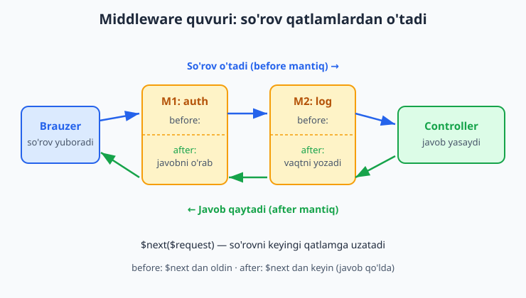
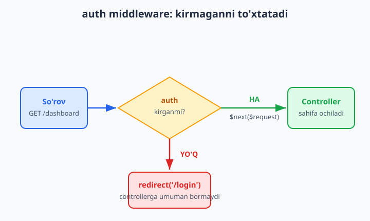
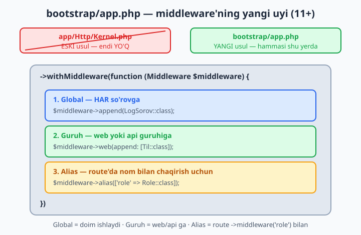

# 15 — Middleware

[⬅️ Oldingi: 14 — Avtorizatsiya (Gates va Policies)](./14-avtorizatsiya.md) · [🏠 README](./README.md) · [Keyingi: 16 — Eloquent API Resources va JSON ➡️](./16-api-resources.md)

> **Bu bobda:** har bir so'rov controllergacha yetib borishdan oldin o'tadigan "qatlamlar" — middleware'ni o'rganamiz. Middleware nimaligini va so'rov quvuri (pipeline) qanday ishlashini, tayyor (built-in) middleware'larni (`auth`, `guest`, `throttle`, `verified`, `signed`), `make:middleware` bilan o'zimizniki yaratishni, `handle()` metodida **before** va **after** mantiqni, ularni **Laravel 11+ da `bootstrap/app.php` da ro'yxatga olishni** (eski `app/Http/Kernel.php` endi yo'q!), route va guruhga ulashni, parametrli middleware (`role:admin`) yozishni, global va route middleware farqini, CSRF himoyasi va `throttle` (rate limiting) ni ko'rib chiqamiz.

---

## Muammo

Tasavvur qiling, do'kon sayti yozyapsiz. Bir nechta sahifa faqat tizimga kirgan foydalanuvchi uchun: profil, buyurtmalar, savatcha. Boshqalari faqat admin uchun: mahsulot qo'shish, foydalanuvchilarni boshqarish. Yana bir nechtasi har kimga ochiq, lekin siz **har bir** so'rovni log faylga yozib qo'ymoqchisiz, foydalanuvchining tilini aniqlamoqchisiz va bir foydalanuvchi bir daqiqada 60 martadan ko'p so'rov yubormasligini ta'minlamoqchisiz.

Bu tekshiruvlarni har bir controller metodi ichida qaytadan yozsangiz, nima bo'ladi? Mana shunday:

```php
<?php
// ❌ Har metodda takror-takror — yomon yo'l
public function buyurtmalar(Request $request)
{
    if (! auth()->check()) {
        return redirect('/login');     // bu qator 20 ta metodda takrorlanadi
    }
    Log::info('So\'rov: ' . $request->path());
    // ... asl ish endi boshlanadi
}
```

Bir sahifada `auth()->check()`, boshqasida `$user->is_admin`, uchinchisida log yozish... Bu kodni **har bir** metodga nusxalash kerak. Bitta joyni o'zgartirsangiz, qolgan 19 tasini ham qo'lda o'zgartirasiz. Bu — qaytariq (takror) va xatolar uyasi.

Laravel'ning yechimi sodda va chiroyli: bu tekshiruvlarni controllerdan **tashqariga**, alohida qatlamga ko'chiramiz. So'rov controllergacha yetib borishdan **oldin** shu qatlamlardan o'tadi. Har qatlam o'z ishini qiladi: "kirganmi?", "admin'mi?", "loglab qo'y", "tilni aniqla". Mana shu qatlamlar — **middleware** (oraliq qatlam, "o'rtadagi dastur").

## Middleware nima — so'rov o'tadigan qatlamlar

Eng yaxshi tashbeh — **aeroportdagi tekshiruv punktlari**. Samolyotga (controller) chiqishdan oldin yo'lovchi (so'rov) bir necha punktdan ketma-ket o'tadi: pasport nazorati, bagaj tekshiruvi, chipta nazorati. Har punkt yo "o'taver" deydi, yo "to'xta, sen o'tolmaysan" deb qaytarib yuboradi. Hamma punktdan o'tgan yo'lovchigina samolyotga chiqadi.

Texnik tilda buni **quvur** (pipeline) deyiladi: so'rov bir uchidan kiradi, qatlamlardan birma-bir o'tadi, controllerga yetadi, controller javob yasaydi va javob **teskari yo'nalishda** yana shu qatlamlardan qaytib chiqadi.



📌 Eng muhim tushuncha: middleware so'rovni **to'xtata oladi**. Agar `auth` middleware "bu odam kirmagan" desa, u so'rovni controllergacha **umuman o'tkazmaydi** — to'g'ridan-to'g'ri login sahifasiga yo'naltiradi. Controller bu so'rov bo'lganini bilmaydi ham. Mana shu — middleware'ning kuchi: ifloslangan yoki ruxsatsiz so'rov controllerga **yetib bormaydi**.

## Tayyor (built-in) middleware'lar

Laravel'da eng kerakli middleware'lar allaqachon yozilgan. Siz ularni faqat route'ga **ulaysiz** — `->middleware('nom')` orqali. Eng ko'p ishlatiladiganlari:

| Nom | Vazifasi |
|---|---|
| `auth` | Faqat tizimga kirgan foydalanuvchini o'tkazadi; aks holda `/login` ga yo'naltiradi |
| `guest` | Aksincha — faqat **kirmagan**ni o'tkazadi (login/ro'yxat sahifalari uchun) |
| `throttle:60,1` | Rate limit — 1 daqiqada ko'pi bilan 60 so'rov |
| `verified` | Emailini tasdiqlagan foydalanuvchinigina o'tkazadi |
| `signed` | Imzolangan (signed) URL — havola buzilmaganini tekshiradi |

Misol — dashboard'ni faqat kirganlar uchun yopamiz:

```php
<?php

use Illuminate\Support\Facades\Route;
use App\Http\Controllers\DashboardController;

Route::get('/dashboard', [DashboardController::class, 'index'])
    ->middleware('auth');
```

Bu bitta qator butun bir muammoni hal qiladi: endi `/dashboard` ga kirgan har qanday so'rov avval `auth` middleware'dan o'tadi. Kirmagan bo'lsa — login sahifasiga uchadi, controller metodi ishga ham tushmaydi.



💡 `guest` — login va "ro'yxatdan o'tish" sahifalari uchun. Mantig'i: agar foydalanuvchi allaqachon kirgan bo'lsa, unga login formasini ko'rsatishning ma'nosi yo'q — uni to'g'ri dashboard'ga yuboramiz. Shuning uchun login route'iga `->middleware('guest')` qo'yiladi.

## O'z middleware'imizni yozamiz — `make:middleware`

Tayyorlari ko'p, lekin ko'pincha o'zimizniki kerak bo'ladi. Misol: har bir so'rovni log faylga yozadigan middleware. Artisan buyrug'i bilan yaratamiz:

```bash
php artisan make:middleware LogSorov
```

Bu `app/Http/Middleware/LogSorov.php` faylini yaratadi. Ichida bitta metod bo'ladi — `handle()`:

```php
<?php

namespace App\Http\Middleware;

use Closure;
use Illuminate\Http\Request;
use Illuminate\Support\Facades\Log;
use Symfony\Component\HttpFoundation\Response;

class LogSorov
{
    public function handle(Request $request, Closure $next): Response
    {
        Log::info('So\'rov keldi: ' . $request->method() . ' ' . $request->path());

        return $next($request);
    }
}
```

Bu eng muhim kod — har bir middleware shu shaklda bo'ladi. Uni qism-qismga ajratamiz.

## `handle()` metodi — qalbidagi mantiq

`handle()` metodi ikkita argument oladi:

- **`$request`** — kelayotgan so'rov obyekti (6-bobdagi `Request`). Uni o'qishingiz, hatto o'zgartirishingiz mumkin.
- **`$next`** — bu **closure** (yopiq funksiya). U "keyingi qatlam"ni anglatadi. `$next($request)` deb chaqirsangiz — so'rovni quvurda **oldinga**, keyingi middleware'ga (yoki oxirgi bo'lsa, controllerga) uzatasiz.

```php
<?php
public function handle(Request $request, Closure $next): Response
{
    // (1) BEFORE — bu yer so'rov controllerga BORISHDAN OLDIN ishlaydi

    $response = $next($request);    // (2) so'rovni oldinga uzatamiz, javob qaytadi

    // (3) AFTER — bu yer javob qaytGANDAN KEYIN ishlaydi

    return $response;               // (4) javobni orqaga, oldingi qatlamga qaytaramiz
}
```

`$next($request)` — kalit nuqta. Undan **oldingi** kod so'rov controllerga ketishidan avval bajariladi (**before** mantiq). `$next($request)` chaqirilgach, so'rov quvurning qolgan qismidan o'tib, controllerga yetadi va javob qaytadi. Undan **keyingi** kod esa javob qo'lga tushgach bajariladi (**after** mantiq).

📌 `$next($request)` ni **chaqirishni unutsangiz** — so'rov quvurda to'xtab qoladi, controller hech qachon ishga tushmaydi va foydalanuvchi bo'sh (yoki noto'g'ri) javob oladi. Bu eng ko'p uchraydigan xato. Agar middleware'ingiz so'rovni o'tkazib yuborishi kerak bo'lsa, `return $next($request);` borligiga ishonch hosil qiling.

### Before mantiq — o'tkazmaslik

Bu — eng keng tarqalgan namuna: bir narsani tekshirib, mos kelmasa so'rovni **to'xtatish**. Misol: faqat ish vaqtida (9:00–18:00) ishlaydigan sahifa.

```php
<?php

namespace App\Http\Middleware;

use Closure;
use Illuminate\Http\Request;
use Symfony\Component\HttpFoundation\Response;

class IshVaqti
{
    public function handle(Request $request, Closure $next): Response
    {
        $soat = (int) date('H');

        if ($soat < 9 || $soat >= 18) {
            return redirect('/yopiq');   // ❌ to'xtatamiz — $next chaqirilmaydi
        }

        return $next($request);          // ✅ ish vaqti — o'tkazamiz
    }
}
```

E'tibor bering: agar shart bajarilsa, biz `$next($request)` ni **umuman chaqirmaymiz** — to'g'ridan-to'g'ri `redirect()` qaytaramiz. So'rov shu yerda "o'ladi", controllerga yetmaydi. Bu — `auth` middleware'ning aynan ishlash usuli.

### After mantiq — javobni o'zgartirish

Ba'zan javob **tayyor bo'lgandan keyin** unga biror narsa qo'shish kerak. Masalan, har bir javobga maxsus header (sarlavha) qo'shamiz:

```php
<?php

namespace App\Http\Middleware;

use Closure;
use Illuminate\Http\Request;
use Symfony\Component\HttpFoundation\Response;

class HeaderQosh
{
    public function handle(Request $request, Closure $next): Response
    {
        $response = $next($request);             // avval javobni olamiz

        $response->headers->set('X-Ilova', 'MeningDokonim');  // keyin unga qo'shamiz

        return $response;
    }
}
```

💡 **Before** va **after**ni shunday eslab qoling: `$next($request)` dan **yuqorida** yozilgan hamma narsa — kirishdagi tekshiruv (before); **pastida** yozilgani — chiqishdagi o'zgartirish (after). Bitta middleware ikkalasini ham qila oladi.

## Middleware'ni ro'yxatga olish — `bootstrap/app.php` (Laravel 11+)

Middleware'ni yozdik. Lekin Laravel hali undan xabarsiz — uni **ro'yxatga olish** kerak. Bu yerda eng muhim zamonaviy o'zgarish bor.

📌 **Eski (Laravel 10 va undan oldingi)** versiyalarda middleware `app/Http/Kernel.php` faylida ro'yxatga olinardi. **Laravel 11+ da bu fayl umuman yo'q!** Endi hammasi bitta joyda — `bootstrap/app.php` faylida, `->withMiddleware(...)` ichida sozlanadi. Agar internetdagi eski qo'llanmada `Kernel.php` ni ko'rsangiz — bilib qo'ying, u eskirgan.



`bootstrap/app.php` ning umumiy ko'rinishi:

```php
<?php

use Illuminate\Foundation\Application;
use Illuminate\Foundation\Configuration\Middleware;

return Application::configure(basePath: dirname(__DIR__))
    ->withRouting(
        web: __DIR__ . '/../routes/web.php',
        commands: __DIR__ . '/../routes/console.php',
        health: '/up',
    )
    ->withMiddleware(function (Middleware $middleware) {
        // ★ middleware shu yerda ro'yxatga olinadi
    })
    ->withExceptions(function ($exceptions) {
        //
    })->create();
```

Ro'yxatga olishning **uch xil usuli** bor — har biri boshqa maqsad uchun.

### 1. Global middleware — har bir so'rovga

Agar middleware **istisnosiz har bir** so'rovda ishlashi kerak bo'lsa (masalan, hamma narsani loglash), uni `append` qilamiz:

```php
<?php
->withMiddleware(function (Middleware $middleware) {
    $middleware->append(\App\Http\Middleware\LogSorov::class);
})
```

`append` — ro'yxat **oxiriga** qo'shadi, `prepend` esa **boshiga** (eng birinchi ishlasin desangiz). Endi `LogSorov` har bir so'rovda, hech qanday route'ga ulashsiz, avtomatik ishlaydi.

### 2. Guruh middleware — `web` yoki `api` ga

Laravel ikkita tayyor guruhga ega: `web` (brauzer sahifalari uchun — sessiya, cookie, CSRF) va `api` (API marshrutlari uchun). O'z middleware'ingizni butun bir guruhga qo'shsangiz, u shu guruhdagi **hamma** route'da ishlaydi:

```php
<?php
->withMiddleware(function (Middleware $middleware) {
    $middleware->web(append: [
        \App\Http\Middleware\Til::class,
    ]);
})
```

Endi `Til` middleware'i `routes/web.php` dagi **barcha** route'larda ishlaydi, lekin `api` route'larida ishlamaydi.

### 3. Alias — route'da nom bilan chaqirish uchun

Eng ko'p kerak bo'ladigan usul. Middleware'ga qisqa **nom** (alias) beramiz, keyin route'ga shu nom bilan ulaymiz. To'liq klass nomini har safar yozib o'tirmaymiz:

```php
<?php
->withMiddleware(function (Middleware $middleware) {
    $middleware->alias([
        'ish_vaqti' => \App\Http\Middleware\IshVaqti::class,
        'role'      => \App\Http\Middleware\Role::class,
    ]);
})
```

Endi route'da shunchaki `->middleware('ish_vaqti')` deb yozasiz. Qisqa va o'qishli.

💡 `auth`, `guest`, `throttle` kabi tayyor nomlar — aynan shunday alias'lar, faqat ularni Laravel oldindan ro'yxatga olib qo'ygan. Demak siz ham xuddi shunday o'zingizniki yaratasiz.

## Route'ga ulash — turli yo'llar

Alias berdik. Endi route'ga ulashning bir necha ko'rinishi:

```php
<?php

// Bitta route'ga, bitta middleware
Route::get('/hisobot', [HisobotController::class, 'index'])
    ->middleware('ish_vaqti');

// Bitta route'ga, bir necha middleware (massiv) — ketma-ket ishlaydi
Route::get('/admin', [AdminController::class, 'index'])
    ->middleware(['auth', 'role:admin']);
```

Bir nechta route'ni birdan o'rashning chiroyli yo'li — **guruh** (`Route::middleware(...)->group(...)`):

```php
<?php

// Bu guruhdagi HAMMA route avval auth'dan o'tadi
Route::middleware('auth')->group(function () {
    Route::get('/profil', [ProfilController::class, 'index']);
    Route::get('/buyurtmalar', [BuyurtmaController::class, 'index']);
    Route::get('/sozlamalar', [SozlamaController::class, 'index']);
});
```

📌 Guruh — DRY (takrorlanmaslik) tamoyilining toza namunasi: `auth` ni har route uchun alohida yozmaymiz, bir marta guruhga qo'yamiz. Ichidagi har bir route avtomatik shu himoyaga ega bo'ladi.

## Parametrli middleware — `role:admin`

Eng kuchli imkoniyatlardan biri — middleware'ga **parametr** uzatish. Misol: `role` middleware'i har xil rolni tekshira olsin — `role:admin`, `role:moderator` va hokazo. Parametr `handle()` ga `$next` dan **keyingi** argument bo'lib keladi:

```php
<?php

namespace App\Http\Middleware;

use Closure;
use Illuminate\Http\Request;
use Symfony\Component\HttpFoundation\Response;

class Role
{
    public function handle(Request $request, Closure $next, string $role): Response
    {
        if ($request->user()?->role !== $role) {
            abort(403, 'Sizda ruxsat yo\'q');   // ❌ rol mos emas — 403
        }

        return $next($request);                  // ✅ rol to'g'ri — o'tkazamiz
    }
}
```

Route'da parametrni **ikki nuqta** (`:`) bilan uzatamiz:

```php
<?php
Route::get('/admin', [AdminController::class, 'index'])
    ->middleware('role:admin');     // 'admin' -> $role argumentiga boradi
```

Bir nechta parametr kerak bo'lsa, vergul bilan ajratiladi: `->middleware('role:admin,moderator')`, va `handle()` da `string ...$roles` deb qabul qilinadi.

💡 `throttle:60,1` ham aynan shunday parametrli middleware: `60` — so'rovlar soni, `1` — daqiqalar. Tagida bir xil mexanizm ishlaydi.

## Global vs route middleware — qaysi birini tanlash?

Bu ikkisini farqlash muhim, chunki noto'g'ri tanlov yo keraksiz ortiqcha ish, yo ochiq teshik beradi.

| | Global middleware | Route middleware (alias/guruh) |
|---|---|---|
| Qachon ishlaydi | **Har** so'rovda, istisnosiz | Faqat **ulangan** route'larda |
| Qayerda yoziladi | `$middleware->append(...)` | `->middleware('nom')` |
| Misol | Loglash, til aniqlash, xavfsizlik header'lari | `auth`, `role`, `throttle` |
| Qoida | Hammaga kerak bo'lsagina | Tanlangan sahifalarga kerak bo'lsa |

✅ **To'g'ri:** "har bir so'rovni loglayman" → global. "faqat admin sahifalarini himoyalayman" → route (alias).

❌ **Xato:** `auth` ni global qilib qo'yish — unda **butun sayt** kirgan foydalanuvchini talab qiladi, hatto bosh sahifa va login ham! Foydalanuvchi hech qachon kira olmaydi (login sahifasining o'zi ham `auth` talab qiladi — yopiq doira).

## CSRF himoyasi

CSRF (Cross-Site Request Forgery — "saytlararo so'rov soxtalashtirishi") — xavfsizlik hujumi: yovuz sayt sizning brauzeringizdan, sizning nomingizdan, asl saytga yashirin forma yuboradi. Laravel bunga qarshi tayyor himoya bilan keladi — bu `web` guruhidagi middleware sifatida **avtomatik** ishlaydi.

Himoya shunday ishlaydi: har bir formaga maxsus yashirin token qo'yiladi, server kelgan so'rovdagi token o'ziniki bilan mosligini tekshiradi. Begona sayt bu tokenni bilolmaydi — demak soxta so'rov rad etiladi. Sizning vazifangiz — har bir `POST`/`PUT`/`DELETE` formaga `@csrf` qo'shish (6-bobdan tanish):

```blade
<form method="POST" action="/buyurtma">
    @csrf
    <input name="mahsulot">
    <button>Buyurtma berish</button>
</form>
```

📌 `@csrf` ni unutsangiz, Laravel `419 Page Expired` xatosi beradi — bu CSRF middleware so'rovni to'xtatgani belgisi. Ko'pchilik boshlovchi shu xatoga duch keladi: yechimi — formaga `@csrf` qo'shish.

💡 Tashqi xizmat (masalan, to'lov tizimi) sizning saytingizga so'rov yuboradigan webhook URL'lar uchun CSRF'ni o'chirish kerak bo'ladi. Buni `bootstrap/app.php` da `$middleware->validateCsrfTokens(except: ['webhook/*'])` orqali qilasiz.

## Throttle — rate limiting (so'rovlar sonini cheklash)

Ba'zan bir foydalanuvchining juda ko'p so'rov yuborishini cheklash kerak: parolni minglab marta terib ko'rishdan (brute-force) himoya, yoki API'ni ortiqcha yuklamaslik. Buni `throttle` middleware bajaradi:

```php
<?php

// 1 daqiqada 60 so'rov; oshib ketsa — 429 xatosi
Route::middleware('throttle:60,1')->group(function () {
    Route::get('/api/mahsulotlar', [MahsulotController::class, 'index']);
});

// Login formasini brute-force'dan himoya: 1 daqiqada 5 urinish
Route::post('/login', [LoginController::class, 'store'])
    ->middleware('throttle:5,1');
```

Cheklov oshib ketsa, foydalanuvchi `429 Too Many Requests` javobini oladi va `Retry-After` header'i orqali qachon qayta urinishni biladi. Bu — hech bir qator kod yozmasdan keladigan himoya.

📌 API uchun nomlangan limiter'lar (named rate limiters) ham bor — ular `routes/api.php` ga ulanadigan `throttle:api` orqali ishlaydi. API marshrutlarini `php artisan install:api` o'rnatganda Laravel buni avtomatik sozlab beradi (17-bobda batafsil).

## Middleware tartibi muhimmi?

Ha, ba'zan juda muhim. Quvurda middleware'lar **yozilgan tartibda** ishlaydi. Misol: `->middleware(['auth', 'role:admin'])` da avval `auth` (kirganmi?), keyin `role` (admin'mi?) ishlaydi — bu mantiqan to'g'ri, chunki rolni tekshirishdan oldin foydalanuvchi umuman borligiga ishonch hosil qilish kerak.

```php
<?php
// ✅ To'g'ri tartib: avval kirgan-kirmaganini, keyin rolini tekshiramiz
Route::get('/admin/users', [UserController::class, 'index'])
    ->middleware(['auth', 'role:admin']);
```

💡 Agar `role` ni `auth` dan oldin qo'ysangiz, `role` middleware'i `$request->user()` ni o'qiganda `null` chiqishi mumkin (chunki hali kirish tasdiqlanmagan) — kutilmagan xato. Shuning uchun mantiqiy tartibga rioya qiling: umumiy tekshiruv (auth) avval, xususiy tekshiruv (role) keyin.

## Yakuniy manzara

Endi bobning boshidagi muammoni qayta ko'raylik. Takror kod va xatolar uyasi o'rniga endi bizda toza tizim bor:

- **Loglash** — global middleware, har so'rovda avtomatik.
- **Kirish talab qilinadigan sahifalar** — `auth` guruhi ichida.
- **Admin sahifalar** — `->middleware(['auth', 'role:admin'])`.
- **Login formasi** — `throttle:5,1` bilan brute-force'dan himoyalangan.
- **Formalar** — `@csrf` orqali soxta so'rovlardan xavfsiz.

Controller endi faqat **o'z ishini** qiladi — ma'lumotni olib, javob qaytaradi. Hamma tekshiruv undan tashqarida, bir joyda, qaytariqsiz. Mana shu — middleware bergan tartib.

## 15-bob mashqlari

> Quyidagi mashqlarni yangi yoki mavjud Laravel 13 loyihasida bajaring. Har bir middleware'ni yaratgandan keyin `bootstrap/app.php` da ro'yxatga olishni unutmang va natijani brauzerda yoki `php artisan route:list` bilan tekshiring.

1. Yangi loyihada `php artisan make:middleware Salom` buyrug'i bilan middleware yarating. Yaratilgan fayl qaysi papkada turganini toping va `handle()` metodini o'qing.

2. `Salom` middleware'ining `handle()` metodida `$next($request)` dan **oldin** `Log::info('Salom keldi')` yozing. So'rov yuborgandan keyin `storage/logs/laravel.log` faylda bu yozuv paydo bo'lganini tekshiring.

3. `Salom` middleware'ini `bootstrap/app.php` da `$middleware->append(...)` bilan **global** ro'yxatga oling. Endi istalgan sahifaga kirib, log yozuvi paydo bo'lishini tasdiqlang.

4. Yangi `FaqatKunduzi` middleware yarating: agar soat 6:00 dan oldin yoki 22:00 dan keyin bo'lsa, `redirect('/tunda-yopiq')` qaytarsin; aks holda so'rovni o'tkazsin.

5. `FaqatKunduzi` middleware'iga `kunduzi` degan **alias** bering (`bootstrap/app.php` da) va uni bitta route'ga `->middleware('kunduzi')` bilan ulang.

6. `make:middleware HeaderQosh` yarating: javob qaytgandan **keyin** (after mantiq) unga `X-Ilova` nomli header qo'shsin. Brauzer dev-tools'ida (Network) bu header'ni ko'ring.

7. Bir route'ga ikkita middleware'ni massiv bilan ulang: `->middleware(['kunduzi', 'header_qosh'])`. Ikkalasi ham ishlayotganini tekshiring.

8. Uchta route'ni `Route::middleware('kunduzi')->group(...)` guruhiga joylang. Guruhdagi har bir route shu middleware'dan o'tishiga ishonch hosil qiling.

9. Tayyor `auth` middleware'ini `/dashboard` route'iga ulang. Tizimga kirmagan holda kirib ko'ring — qayerga yo'naltirilasiz?

10. Login va register sahifalariga `guest` middleware'ini ulang. Tizimga kirgan holda login sahifasini ochib ko'ring — nima bo'ladi?

11. `make:middleware Role` yarating. `handle()` ni shunday yozing: u uchinchi argument sifatida `$role` qabul qilsin va `$request->user()?->role` unga teng bo'lmasa `abort(403)` qaytarsin.

12. `Role` middleware'iga `role` alias berib, bitta route'ga `->middleware('role:admin')` bilan ulang. Parametr `handle()` dagi `$role` ga qanday yetib borishini kuzating.

13. `role` middleware'ini ikkita rol bilan ishlaydigan qiling: `->middleware('role:admin,moderator')`. `handle()` da `string ...$roles` ishlatib, foydalanuvchi shu ikki roldan birortasiga ega bo'lsa o'tkazing.

14. `/admin` route'iga `->middleware(['auth', 'role:admin'])` ni shu tartibda ulang. Endi tartibni teskari qiling (`['role:admin', 'auth']`) va kirmagan holda urinib ko'ring — qanday farq sezasiz?

15. `throttle:5,1` middleware'ini bir route'ga ulang. Sahifani 1 daqiqada 6 marta yangilang — 6-urinishda qanday status kod (xato) olasiz?

16. Login formasini `throttle:3,1` bilan himoyalang. Noto'g'ri parol bilan 4 marta kirishga urinib ko'ring va `429` javobini hamda `Retry-After` header'ini ko'ring.

17. Bir Blade formasi yarating (`method="POST"`), lekin `@csrf` ni **ataylab** qo'ymang. Formani yuboring — qanday xato (status kod) chiqadi? Keyin `@csrf` qo'shib qayta urinib ko'ring.

18. `bootstrap/app.php` da bitta URL (masalan `webhook/*`) uchun CSRF tekshiruvini o'chiring (`validateCsrfTokens(except: [...])`). Shu URL'ga `@csrf`siz POST yuborib, endi `419` chiqmasligini tasdiqlang.

19. `$middleware->web(append: [...])` orqali o'z middleware'ingizni butun `web` guruhiga qo'shing. Keyin `api` guruhidagi route'da u **ishlamasligini** tekshiring (`php artisan install:api` orqali API o'rnatib).

20. Bitta middleware'da **ham** before, **ham** after mantiqni birga yozing: `$next($request)` dan oldin so'rov kelgan vaqtni, keyin javob qaytgan vaqtni loging. Ikki vaqt orasidagi farqni (so'rov necha millisekund ishlaganini) hisoblab, javob header'iga `X-Davomiylik` sifatida qo'shing.
