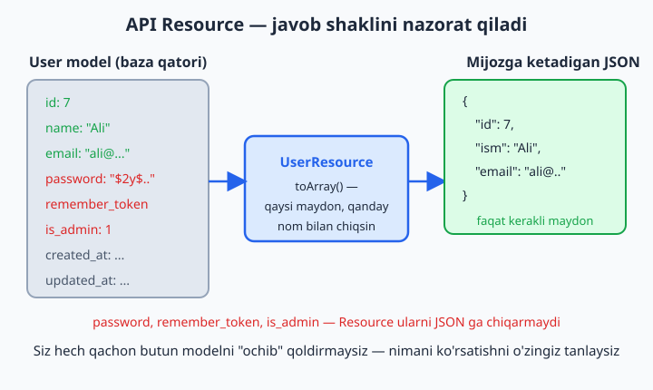
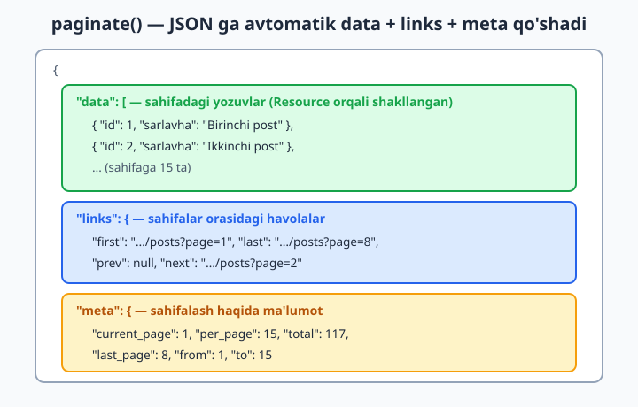
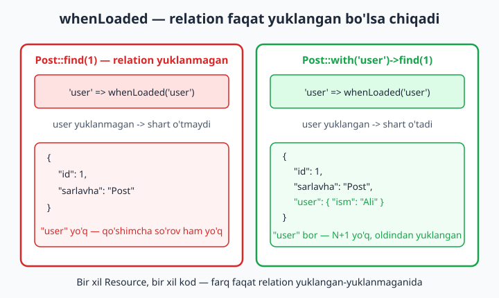

# 16 — Eloquent API Resources va JSON

[⬅️ Oldingi: 15 — Middleware](./15-middleware.md) · [🏠 README](./README.md) · [Keyingi: 17 — RESTful API va Sanctum ➡️](./17-rest-api-sanctum.md)

> **Bu bobda:** modelni JSON sifatida toza, nazorat ostida qaytarishni o'rganamiz. Avval Eloquent'ning "tekin" usuli (`toJson`/`toArray`) nega xavfli ekanini ko'ramiz, keyin **API Resource** (`make:resource`) bilan javobning aniq shaklini boshqaramiz: qaysi maydon chiqadi, uni qayta nomlash, sanani formatlash. So'ng **Resource Collection** orqali ro'yxat qaytarish, `paginate()` bilan JSON'ga avtomatik keladigan `meta`/`links`, shartli maydonlar (`when`, `whenLoaded`), Resource ichida nested relation, javobni `data` ichiga "o'rash" (wrapping) va kollektsiya metodlari (`map`/`filter`/`pluck`) bilan API javobini standartlashtirishni ko'rib chiqamiz.

---

## Muammo

15-bobgacha biz natijani odamga — brauzerga HTML qilib ko'rsatdik (Blade). Lekin endi mobil ilova yoki React frontend bizning serverdan ma'lumotni **JSON** ko'rinishida so'raydi. "Postlar ro'yxatini ber", "ID 7 foydalanuvchini ber" — javob HTML emas, mashina o'qiydigan JSON bo'lishi kerak.

Laravel'da bu juda oson ko'rinadi. Controller'dan modelni shunchaki qaytarsangiz, Laravel uni avtomatik JSON qiladi:

```php
Route::get('/users/{user}', function (User $user) {
    return $user;   // avtomatik JSON!
});
```

Brauzerda ochsangiz:

```json
{
    "id": 7,
    "name": "Ali Valiyev",
    "email": "ali@example.com",
    "email_verified_at": "2026-05-01T10:00:00.000000Z",
    "is_admin": 1,
    "created_at": "2026-04-01T09:00:00.000000Z",
    "updated_at": "2026-06-01T12:00:00.000000Z"
}
```

Ishladi-ku? Lekin yaxshilab qarang. `is_admin` — ichki bayroq, uni tashqi dunyoga ko'rsatish kerakmidi? `email_verified_at`, `updated_at` — mobil ilovaga nima keragi bor? Eng yomoni: ertaga jadvalga `salary` (maosh) yoki `secret_token` ustun qo'shsangiz, ular ham **avtomatik** JSON'ga tushib, butun internetga ochilib qoladi. Siz hatto sezmaysiz ham.

Demak, muammo aniq: **modelni "yalang'och" qaytarish — bu butun jadvalni nazoratsiz ochib qo'yish.** Bizga shunday qatlam kerakki, u "API javobida aynan qaysi maydon, qaysi nom bilan, qanday formatda chiqadi"ni bitta joyda, aniq belgilab bersin. Mana shu qatlam — **API Resource**.



## Birinchi urinish: `$hidden` va `toArray`

Eng tez yechim — modelda `$hidden` ishlatish (8-bobda ko'rgan edingiz):

```php
class User extends Authenticatable
{
    protected $hidden = ['password', 'remember_token', 'is_admin'];
}
```

Endi `password`, `remember_token`, `is_admin` JSON'ga chiqmaydi. `toArray()` ham, `toJson()` ham, avtomatik qaytarish ham — hammasi shu ro'yxatni hurmat qiladi.

```php
$user->toArray();   // massiv (hidden'siz)
$user->toJson();    // JSON satr (hidden'siz)
```

📌 `$hidden` — "qora ro'yxat" (nimani **yashirish**). Aksincha `$visible` — "oq ro'yxat" (faqat shularni **ko'rsatish**). Ikkalasi ham faqat parol kabi maxfiy ustunlardan saqlaydi.

Lekin `$hidden` ikki muhim narsani **qila olmaydi**:

- **Maydonni qayta nomlash** — `name` ni `ism` qilib chiqarish.
- **Javob shaklini boshqarish** — bir API'da `email` kerak, boshqasida kerak emas. Model bitta, talab har xil.

`$hidden` modelga "yopishtirilgan" — u har joyda bir xil ishlaydi. Bizga esa har bir API endpoint uchun alohida shakl kerak. Mana shu yerda API Resource yutadi: u modelni o'zgartirmaydi, balki uning yonida turib "javobni qanday yasashni" hal qiladi.

💡 Qoida: kichik loyihada `$hidden` yetadi. Jiddiy API yozayotgan bo'lsangiz — to'g'ridan-to'g'ri Resource'dan boshlang. Pastda nega ekanini ko'rasiz.

## API Resource yaratish

Resource — bu modelni JSON'ga aylantiruvchi "tarjimon" klass. Artisan bilan yaratamiz:

```bash
php artisan make:resource UserResource
```

Bu `app/Http/Resources/UserResource.php` faylini yaratadi. Ichi shunaqa ko'rinadi (men maydonlarni o'zbekcha javob uchun moslab to'ldirdim):

```php
<?php

namespace App\Http\Resources;

use Illuminate\Http\Request;
use Illuminate\Http\Resources\Json\JsonResource;

class UserResource extends JsonResource
{
    /**
     * @return array<string, mixed>
     */
    public function toArray(Request $request): array
    {
        return [
            'id'        => $this->id,
            'ism'       => $this->name,
            'email'     => $this->email,
            'qoshilgan' => $this->created_at->toDateString(),
        ];
    }
}
```

Diqqat qiling: `toArray()` ichida `$this->id`, `$this->name` deb yozdik — go'yo `$this` modelning o'zi. Aslida Resource modelni "o'rab" oladi va unga yo'naltirib turadi, shuning uchun model ustunlariga to'g'ridan-to'g'ri murojaat qila olasiz. Bu yerda butun nazorat sizda:

- `'ism' => $this->name` — `name` ustunini JSON'da **`ism`** deb chiqaramiz (qayta nomlash).
- `password`, `is_admin` — ro'yxatda umuman **yo'q**, demak JSON'ga chiqmaydi. "Yashirish" ham kerak emas — kiritmasangiz bo'ldi.
- `$this->created_at->toDateString()` — sanani `2026-04-01T09:00:00Z` o'rniga toza `2026-04-01` qilib formatlash.

📌 Resource — **oq ro'yxat** mantig'ida ishlaydi: faqat siz yozgan maydon chiqadi. Bu `$hidden`dan xavfsizroq, chunki jadvalga yangi maxfiy ustun qo'shilsa ham, u `toArray()`da yo'q — avtomatik ochilib qolmaydi.

### Resource'dan foydalanish — bitta model

Controller'da modelni Resource'ga "o'raymiz":

```php
use App\Http\Resources\UserResource;

Route::get('/users/{user}', function (User $user) {
    return new UserResource($user);
});
```

Javob:

```json
{
    "data": {
        "id": 7,
        "ism": "Ali Valiyev",
        "email": "ali@example.com",
        "qoshilgan": "2026-04-01"
    }
}
```

Endi javob aniq nazorat ostida. `is_admin` yo'q, `password` yo'q, `name` o'rniga `ism`, sana toza. Va e'tibor bering — javob `"data"` kalitining ichida. Bu Laravel'ning ataylab qilgan ishi (wrapping), bob oxirida buni boshqarishni ham ko'ramiz.

💡 Nega Resource ichida ham `Request $request` keladi? Chunki ba'zan javobni so'rovga qarab o'zgartirish kerak bo'ladi — masalan, faqat admin so'rasa qo'shimcha maydon qaytarish. `$request` orqali joriy so'rovga (va `auth()` foydalanuvchisiga) yeta olasiz. Buni "shartli maydonlar" bo'limida ishlatamiz.

## Ro'yxat qaytarish: Resource Collection

Bitta model uchun `new UserResource($user)` yozdik. Endi **ro'yxat** kerak: barcha foydalanuvchilar. Eng oddiy yo'l — Resource klassining `collection()` metodi:

```php
use App\Http\Resources\UserResource;

Route::get('/users', function () {
    return UserResource::collection(User::all());
});
```

`collection()` — kollektsiyadagi **har bir** modelni alohida `UserResource` orqali o'tkazadi va natijani massivga yig'adi. Javob:

```json
{
    "data": [
        { "id": 1, "ism": "Ali", "email": "ali@...", "qoshilgan": "2026-01-10" },
        { "id": 2, "ism": "Vali", "email": "vali@...", "qoshilgan": "2026-02-15" }
    ]
}
```

Bitta Resource yozdingiz — ham bitta model, ham ro'yxat uchun ishlaydi. Aksariyat hollarda sizga shuncha kerak.

### Alohida Collection klassi (`--collection`)

Ba'zan butun ro'yxat darajasida qo'shimcha ma'lumot qo'shmoqchi bo'lasiz — masalan "jami nechta", "qaysi versiya". Buning uchun alohida Collection klassi yaratamiz:

```bash
php artisan make:resource UserCollection --collection
```

Bu `app/Http/Resources/UserCollection.php` ni yaratadi:

```php
<?php

namespace App\Http\Resources;

use Illuminate\Http\Request;
use Illuminate\Http\Resources\Json\ResourceCollection;

class UserCollection extends ResourceCollection
{
    /**
     * @return array<int|string, mixed>
     */
    public function toArray(Request $request): array
    {
        return [
            'data' => $this->collection,
            'meta' => [
                'jami_soni' => $this->collection->count(),
                'manba'     => 'kutubxona API',
            ],
        ];
    }
}
```

Foydalanish:

```php
return new UserCollection(User::all());
```

Javob `data` yonida `meta` ham oladi:

```json
{
    "data": [ { "id": 1, "ism": "Ali", ... } ],
    "meta": { "jami_soni": 2, "manba": "kutubxona API" }
}
```

📌 `$this->collection` — Collection ichida modellar to'plamiga ishora qiladi. Laravel uni **avtomatik** har bir element uchun mos Resource'ga (`UserResource`) o'rab beradi, agar nom konvensiyasiga (`User**Collection**` -> `User**Resource**`) mos kelsa. Aniq belgilamoqchi bo'lsangiz, Collection klassida `public $collects = UserResource::class;` yozasiz.

💡 Ko'pchilik loyihalarda alohida Collection klassi **kerak emas** — `UserResource::collection(...)` yetadi. Alohida klass faqat ro'yxat darajasida maxsus `meta` qo'shganda yoki murakkab yig'ish kerak bo'lganda asqotadi.

## Pagination — sahifalash JSON'da

Real API hech qachon 10 000 ta yozuvni bir javobda qaytarmaydi. Sahifalab beramiz: bir sahifaga 15 ta, qolganini `?page=2` orqali. Buning sehri shundaki — Resource bilan paginatsiya **avtomatik** birlashadi.

`all()` o'rniga `paginate()` ishlatamiz, xolos:

```php
Route::get('/users', function () {
    return UserResource::collection(User::paginate(15));
});
```

Va Laravel javobga `links` (sahifalar orasidagi havolalar) va `meta` (joriy sahifa, jami soni) bloklarini **o'zi** qo'shadi:

```json
{
    "data": [
        { "id": 1, "ism": "Ali", "email": "ali@...", "qoshilgan": "2026-01-10" }
    ],
    "links": {
        "first": "http://localhost/api/users?page=1",
        "last":  "http://localhost/api/users?page=8",
        "prev":  null,
        "next":  "http://localhost/api/users?page=2"
    },
    "meta": {
        "current_page": 1,
        "from": 1,
        "last_page": 8,
        "per_page": 15,
        "to": 15,
        "total": 117
    }
}
```

Frontend dasturchi xursand: u `meta.total` dan jami nechta yozuv borligini, `links.next` dan keyingi sahifa manzilini to'g'ridan-to'g'ri oladi. Siz esa hech narsa qo'lda yozmadingiz — `paginate()` va Resource o'zi hal qildi.



📌 **Muhim tuzoq:** Resource bilan paginatsiya ishlashi uchun `paginate()` natijasini `UserResource::collection(...)` ichiga uzating. Agar siz `simplePaginate()` ishlatsangiz, `meta`da `total`/`last_page` bo'lmaydi (u keyingi/oldingi havolalarni bilibgina, jami sonni hisoblamaydi — shu sabab tezroq).

💡 `paginate()` — Eloquent va Query Builder ikkalasida ham bor. Sahifa o'lchamini foydalanuvchi tanlasin desangiz: `User::paginate($request->integer('per_page', 15))`. Lekin yuqori chegara qo'ying (mas. 100), aks holda kimdir `?per_page=999999` bilan serverni cho'ktiradi.

## Shartli maydonlar: `when()`

Hamma maydon har doim chiqishi shart emas. Masalan, foydalanuvchining email manzilini faqat **admin** ko'rsin, oddiy mehmon ko'rmasin. `when()` aynan shuning uchun:

```php
public function toArray(Request $request): array
{
    return [
        'id'    => $this->id,
        'ism'   => $this->name,
        'email' => $this->when($request->user()?->is_admin, $this->email),
    ];
}
```

`when($shart, $qiymat)` — agar `$shart` rost bo'lsa, maydon JSON'ga qo'shiladi; aks holda u **butunlay yo'qoladi** (`null` emas, umuman bo'lmaydi). Admin ko'rsa `email` bor, oddiy foydalanuvchi ko'rsa hatto kaliti ham yo'q.

📌 Farqni his qiling: `'email' => $shart ? $this->email : null` yozsangiz, kalit har doim chiqadi, faqat qiymati `null` bo'ladi. `when()` esa kalitning o'zini olib tashlaydi. API'da bu toza-roq: "yo'q ma'lumot" va "null ma'lumot" — boshqa-boshqa narsa.

💡 Og'ir qiymat (masalan ko'p hisob-kitob talab qiladigan narsa) bo'lsa, ikkinchi argumentni **closure** qiling — u faqat shart rost bo'lgandagina ishga tushadi:

```php
'statistika' => $this->when($request->user()?->is_admin, fn () => $this->ogirHisobKitob()),
```

## Relation faqat yuklangan bo'lsa: `whenLoaded()`

Endi eng muhim — eng ko'p xato qilinadigan joy. Post Resource'iga muallif (`user`) ma'lumotini ham qo'shmoqchisiz:

```php
// ❌ Sodda, lekin xavfli yo'l:
return [
    'id'       => $this->id,
    'sarlavha' => $this->title,
    'muallif'  => new UserResource($this->user),   // har safar relation'ga murojaat
];
```

Bu "ishlaydi", lekin yashirin tuzoq bor. Agar siz controller'da `with('user')` qilmagan bo'lsangiz, `$this->user` har bir post uchun bazaga **alohida so'rov** yuboradi. 50 ta post — 50 ta qo'shimcha so'rov. Bu 10-bobda ko'rgan **N+1 muammosi**, faqat endi u Resource ichida yashiringan.

Yechim — `whenLoaded()`. U relation'ni faqat **oldindan yuklangan** bo'lsa qo'shadi, aks holda umuman tegmaydi:

```php
// ✅ To'g'ri yo'l:
return [
    'id'       => $this->id,
    'sarlavha' => $this->title,
    'muallif'  => new UserResource($this->whenLoaded('user')),
];
```

Endi controller'da relation'ni yuklasangiz — `muallif` JSON'da chiqadi; yuklamasangiz — `muallif` kaliti umuman bo'lmaydi va bazaga ortiqcha so'rov ham ketmaydi:

```php
// muallif bilan:
return PostResource::collection(Post::with('user')->paginate(15));

// muallifsiz (yengilroq javob):
return PostResource::collection(Post::paginate(15));
```

Bitta Resource — ikki xil javob, va N+1 dan himoyalangan. Resource "men relation'ni o'zim yuklab olmayman, agar berilgan bo'lsa qo'shaman" deydi. Bu — to'g'ri mas'uliyat taqsimoti: nimani yuklashni **controller** hal qiladi, qanday ko'rsatishni **Resource**.



📌 Munosabat soni uchun `whenCounted()` ham bor. Controller'da `Post::withCount('comments')` qilsangiz, Resource'da:

```php
'izohlar_soni' => $this->whenCounted('comments'),
```

`comments_count` yuklangan bo'lsa chiqadi, yo'q bo'lsa kaliti ham bo'lmaydi.

## Nested Resource — Resource ichida Resource

Yuqorida `new UserResource($this->whenLoaded('user'))` yozdik — bu **nested** (ichma-ich) Resource. Post Resource'i muallifni `UserResource` orqali, muallif Resource'i esa o'z navbatida boshqa narsalarni o'rashi mumkin. Har bir model o'z Resource'iga ega bo'ladi va ular bir-birini chaqiradi.

Ko'plab relation (`hasMany`) uchun `collection`'dan foydalanamiz:

```php
public function toArray(Request $request): array
{
    return [
        'id'        => $this->id,
        'sarlavha'  => $this->title,
        'muallif'   => new UserResource($this->whenLoaded('user')),
        'izohlar'   => CommentResource::collection($this->whenLoaded('comments')),
    ];
}
```

Controller'da ikkala relation'ni ham yuklaymiz:

```php
return new PostResource(
    Post::with(['user', 'comments'])->findOrFail($id)
);
```

Javob — chiroyli ichma-ich tuzilma:

```json
{
    "data": {
        "id": 1,
        "sarlavha": "Laravel bilan API",
        "muallif": { "id": 7, "ism": "Ali", "email": "ali@..." },
        "izohlar": [
            { "id": 10, "matn": "Zo'r maqola!" },
            { "id": 11, "matn": "Rahmat" }
        ]
    }
}
```

💡 Diqqat: `whenLoaded('comments')` ni `CommentResource::collection(...)` ichiga uzatdik. Bu — to'g'ri qolip. Relation yuklanmagan bo'lsa, `whenLoaded` bo'sh "yo'q" qiymatini qaytaradi va `izohlar` kaliti umuman chiqmaydi; yuklangan bo'lsa, har bir izoh `CommentResource` orqali o'tadi.

## Wrapping — `data` o'rashini boshqarish

Sezgan bo'lsangiz, har bir javob `"data"` kalitining ichida keldi. Bu Laravel'ning standart "o'rash" (wrapping) xatti-harakati. U yaxshi narsa: javob doim bir xil tuzilishda bo'ladi, frontend doim `response.data` ni o'qiydi.

Wrapper nomini o'zgartirmoqchi bo'lsangiz, `AppServiceProvider`ning `boot()` metodida:

```php
use Illuminate\Http\Resources\Json\JsonResource;

public function boot(): void
{
    JsonResource::wrap('natija');   // "data" o'rniga "natija"
}
```

O'rashni butunlay olib tashlash uchun (kamdan-kam kerak bo'ladi):

```php
JsonResource::withoutWrapping();
```

📌 **Muhim nozik nuqta:** o'rashni olib tashlasangiz ham, **paginatsiya** uchun `meta`/`links` ishlashi uchun `data` qatlami baribir kerak bo'ladi — shuning uchun paginatsiya qilingan javoblarda `data` saqlanib qoladi. Amalda standart `data` o'rashini o'z holicha qoldirish eng xavfsiz yo'l: butun loyihada bitta, bashorat qilinadigan shakl.

💡 Maslahat: yangi API boshlaganda wrapping'ni **o'zgartirmang**. Standart `data` shakli butun Laravel ekotizimida kutiladi (mobil SDK, hujjatlar, misollar hammasi shunga moslangan). O'zgartirish — keyinchalik chalkashlik manbai.

## Kollektsiya metodlari bilan javobni shakllash

Resource ichida siz oddiy modeldan tashqari **butun kollektsiya** ustida ham ishlashingiz mumkin — Laravel kollektsiyalari `map`, `filter`, `pluck`, `sum` kabi kuchli metodlarga ega (8-bobda ko'rdik). Bu API javobini moslashda asqotadi.

Masalan, Collection klassida faqat faol foydalanuvchilarni qoldirib, ularning ismlaridan alohida ro'yxat yasaymiz:

```php
public function toArray(Request $request): array
{
    return [
        'foydalanuvchilar' => $this->collection,
        'faollar_ismi'     => $this->collection
            ->where('holat', 'faol')      // filter: faqat faollar
            ->pluck('name')               // pluck: faqat ism ustuni
            ->values(),                   // kalitlarni 0,1,2 ga tiklash
        'umumiy_soni'      => $this->collection->count(),
    ];
}
```

Yoki har bir modeldan qisqartirilgan ko'rinish yasash uchun `map`:

```php
'qisqacha' => $this->collection->map(fn ($user) => [
    'id'  => $user->id,
    'ism' => $user->name,
])->values(),
```

📌 `where`, `pluck`, `map` — bular **SQL emas**, bular xotiradagi kollektsiya ustida ishlaydi. Demak ular allaqachon bazadan olingan yozuvlar ustida bajariladi. Katta ro'yxatni filtrlash kerak bo'lsa, buni bazada (`->where(...)` Eloquent so'rovida) qiling, kollektsiyada emas — aks holda 100 000 qatorni xotiraga olib, keyin filtrlab o'tirasiz.

💡 `values()` ni unutmang: `where`/`filter`'dan keyin kalitlar (`0, 1, 2...`) "teshikli" qolishi mumkin (`0, 3, 7...`), va JSON'da bu **massiv** emas, **obyekt** sifatida chiqib qoladi. `values()` kalitlarni qayta tartiblab, toza massiv beradi.

## Hammasini birlashtirib: standart API javobi

Endi o'rganganlarimizni bitta to'liq misolga yig'amiz. Blog API'sida postlar ro'yxati endpoint'i — paginatsiya, nested muallif, shartli maydon, N+1 himoyasi bilan.

`PostResource`:

```php
<?php

namespace App\Http\Resources;

use Illuminate\Http\Request;
use Illuminate\Http\Resources\Json\JsonResource;

class PostResource extends JsonResource
{
    /**
     * @return array<string, mixed>
     */
    public function toArray(Request $request): array
    {
        return [
            'id'           => $this->id,
            'sarlavha'     => $this->title,
            'qisqa_matn'   => str($this->body)->limit(120)->value(),
            'chop_etilgan' => (bool) $this->is_published,
            'sana'         => $this->created_at->toDateString(),
            'muallif'      => new UserResource($this->whenLoaded('user')),
            'izohlar_soni' => $this->whenCounted('comments'),
            'tahrir_url'   => $this->when(
                $request->user()?->id === $this->user_id,
                fn () => route('posts.edit', $this->id),
            ),
        ];
    }
}
```

Controller (slim struktura, Laravel 11+):

```php
<?php

namespace App\Http\Controllers;

use App\Http\Resources\PostResource;
use App\Models\Post;

class PostController extends Controller
{
    public function index()
    {
        $postlar = Post::query()
            ->with('user')           // N+1 dan saqlaydi (nested muallif uchun)
            ->withCount('comments')  // izohlar_soni uchun
            ->latest()
            ->paginate(15);

        return PostResource::collection($postlar);
    }
}
```

Marshrut (`routes/api.php` — bu fayl `php artisan install:api` dan keyin paydo bo'ladi, 17-bobda batafsil):

```php
use App\Http\Controllers\PostController;

Route::get('/posts', [PostController::class, 'index']);
```

Natija — toza, bashorat qilinadigan, xavfsiz JSON:

```json
{
    "data": [
        {
            "id": 1,
            "sarlavha": "Laravel API'lari",
            "qisqa_matn": "Bu maqolada API Resource...",
            "chop_etilgan": true,
            "sana": "2026-06-10",
            "muallif": { "id": 7, "ism": "Ali", "email": "ali@..." },
            "izohlar_soni": 4
        }
    ],
    "links": { "first": "...", "last": "...", "prev": null, "next": "...?page=2" },
    "meta": { "current_page": 1, "per_page": 15, "total": 117, "last_page": 8 }
}
```

Diqqat qiling: `tahrir_url` faqat postning **egasi** so'rasagina chiqadi (`when`), `muallif` faqat `with('user')` qilingani uchun chiqdi (`whenLoaded`), `izohlar_soni` `withCount` tufayli keldi, va butun javob sahifalangan. Bitta endpoint — barcha tushunchalar birga ishlaydi.

✅ **To'g'ri:** controller nimani yuklashni hal qiladi (`with`, `withCount`, `paginate`), Resource qanday ko'rsatishni hal qiladi.

❌ **Xato:** Resource ichida `Post::with(...)` yoki yangi so'rov yozish. Resource — faqat shakl beruvchi, u ma'lumot **olib kelmasligi** kerak.

## Qachon Resource, qachon yo'q?

- **Resource ishlating:** ommaviy API, mobil ilova backend'i, frontend (React/Vue) bilan ishlaydigan loyiha — qisqasi, JSON tashqariga chiqadigan har qanday joyda.
- **Resource shart emas:** ichki, bir martalik, faqat o'zingiz ishlatadigan tezkor JSON; yoki butunlay HTML qaytaradigan an'anaviy Blade sayt.

💡 Oltin qoida: agar JSON sizning serveringizdan **boshqa birovga** ketsa (mijoz, mobil, frontend) — Resource'siz qoldirmang. Bir kun maxfiy ustun qo'shganingizda u sizni qutqaradi.

## 16-bob mashqlari

Quyidagi mashqlarni o'z loyihangizda (blog yoki do'kon) bajaring. Yechimlarini o'zingiz yozing — har biri oldingisidan bir qadam murakkabroq.

1. Marshrutdan modelni `return $user;` qilib JSON ko'rinishida qaytaring va javobda qaysi maydonlar "ochiq" turganini ro'yxatlang; qaysi biri tashqariga chiqmasligi kerakligini belgilang.
2. `User` modeliga `$hidden` qo'shib, `password` va `remember_token` ni JSON'dan yashiring; keyin `is_admin` ni ham qo'shing va o'zgarishni tekshiring.
3. `php artisan make:resource UserResource` bilan Resource yarating; `toArray`da faqat `id`, `name` (ni `ism` deb), `email` ni qaytaring.
4. Marshrutda `new UserResource($user)` ishlatib, javob `data` kalitining ichida kelishini tasdiqlang.
5. `created_at` ni `->toDateString()` bilan toza sanaga aylantirib `qoshilgan` maydon sifatida chiqaring; format farqini avvalgi xom JSON bilan solishtiring.
6. `UserResource::collection(User::all())` bilan barcha foydalanuvchilar ro'yxatini qaytaring; har bir element bir xil shaklda kelishini tekshiring.
7. `php artisan make:resource UserCollection --collection` bilan alohida Collection klassi yarating va unga `meta` ichida `jami_soni` qo'shing.
8. `User::all()` o'rniga `User::paginate(10)` ishlatib, javobga avtomatik kelgan `links` va `meta` bloklarini ko'ring; `meta.total` va `meta.last_page` qiymatlarini izohlang.
9. Sahifa o'lchamini so'rovdan oling: `User::paginate($request->integer('per_page', 15))`; keyin yuqori chegara (mas. 100) qo'yib, `?per_page=99999` so'rovini xavfsiz qiling.
10. Resource'da `email` maydonini `when($request->user()?->is_admin, $this->email)` bilan shartli qiling; admin va oddiy foydalanuvchi javoblarini solishtiring.
11. `when($shart, $qiymat)` va `$shart ? $qiymat : null` farqini ko'rsatadigan ikki maydon yozing; JSON'da kalitning butunlay yo'qolishi va `null` bo'lib qolishi farqini tushuntiring.
12. Og'ir hisob-kitobli maydonni `when(..., fn () => ...)` closure bilan yozing va u faqat shart rost bo'lgandagina ishga tushishiga ishonch hosil qiling.
13. `PostResource`da `muallif` ni `new UserResource($this->whenLoaded('user'))` bilan qo'shing; controller'da `with('user')` qilgan va qilmagan holatlar javobini solishtiring.
14. Controller'da `Post::all()` qilib siklda muallifga murojaat qilib N+1 yarating; keyin `with('user')` qo'shib so'rovlar soni kamayganini tekshiring (10-bobdagi usul bilan).
15. `withCount('comments')` va Resource'da `whenCounted('comments')` bilan `izohlar_soni` maydonini qo'shing.
16. `CommentResource` yarating va `PostResource`da `izohlar` ni `CommentResource::collection($this->whenLoaded('comments'))` bilan nested qiling.
17. Bitta postni `Post::with(['user', 'comments'])->findOrFail($id)` bilan oling va nested muallif + izohlar bo'lgan to'liq JSON'ni hosil qiling.
18. `AppServiceProvider::boot()`da `JsonResource::wrap('natija')` qilib wrapper nomini o'zgartiring; keyin `withoutWrapping()` ni sinab ko'ring va paginatsiyada `data` baribir saqlanishini kuzating.
19. Collection klassida `$this->collection->where('holat', 'faol')->pluck('name')->values()` bilan faqat faollar ismidan alohida massiv yasang; `values()` ni olib tashlasangiz JSON'da nima o'zgarishini tekshiring.
20. Yakuniy mashq: `paginate`, nested `whenLoaded('user')`, `whenCounted('comments')` va egasi uchun shartli `tahrir_url` (`when`) bo'lgan to'liq `PostResource` + controller yozing; controller'da `with('user')->withCount('comments')` borligiga va Resource ichida hech qanday yangi so'rov yo'qligiga ishonch hosil qiling.
