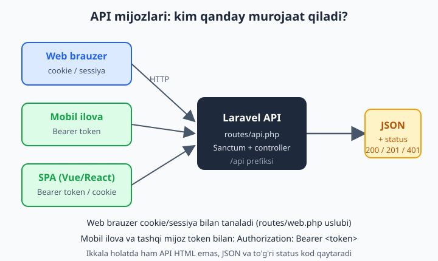
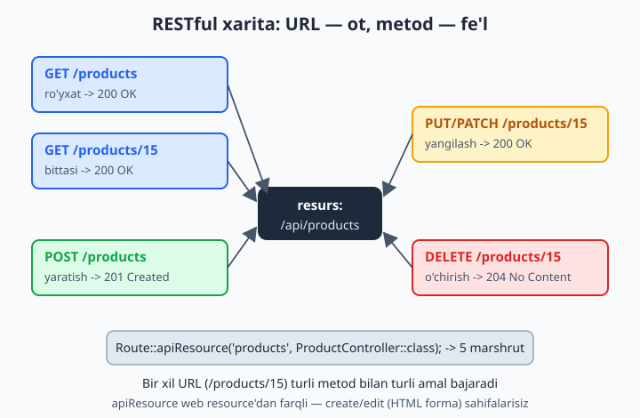
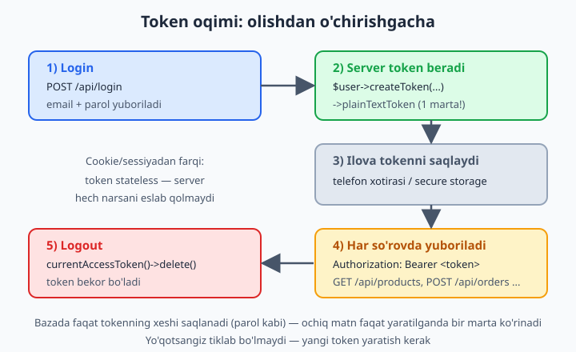
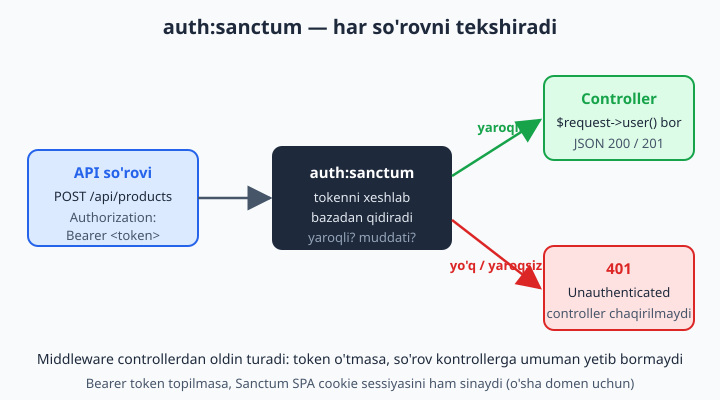

# 17 — RESTful API va Sanctum

[⬅️ Oldingi: 16 — Eloquent API Resources va JSON](./16-api-resources.md) · [🏠 README](./README.md) · [Keyingi: 18 — File storage va upload ➡️](./18-file-storage.md)

> **Bu bobda:** sayt endi faqat brauzer uchun emas — mobil ilova va React/Vue SPA ham bizning ma'lumotimizni so'raydi. Shu ehtiyojdan kelib chiqib token bilan himoyalangan API quramiz: `install:api` bilan `routes/api.php` va **Sanctum**ni o'rnatamiz, RESTful konvensiyani (resurs + JSON + to'g'ri HTTP metod va status) o'rganamiz, `createToken()` bilan token chiqaramiz va `auth:sanctum` middleware bilan endpointni qulflaymiz, SPA cookie auth va API token farqini, `/v1` versiyalashni, `throttle` bilan so'rovni cheklashni, CORS sozlashni va xato javoblarini (401/403/404/422 JSON) ko'rib chiqamiz. Oxirida hammasini `curl` bilan sinab tasdiqlaymiz.

---

## Muammo

13-bobda foydalanuvchini sessiya (cookie) bilan tanigan edik: forma yuborilganda Laravel cookie qo'yadi, keyingi so'rovlarda brauzer cookie'ni avtomatik qaytaradi. Bu **brauzer** uchun zo'r ishlaydi.

Endi tasavvur qiling: do'koningiz uchun **mobil ilova** yozyapsiz (Flutter yoki React Native). Telefon — brauzer emas. Uning cookie idishi yo'q, sessiya yo'q. U shunchaki HTTP so'rov yuboradi va JSON kutadi:

```text
GET /api/products
GET /api/orders/15
POST /api/orders   {"product_id": 3, "soni": 2}
```

Yana bir holat: sayt frontendini Vue yoki React'da alohida **SPA** (Single Page Application) qilib yozdingiz. U ham brauzerda ishlaydi, lekin sahifa qayta yuklanmaydi — JavaScript fonda API'ga so'rov yuboradi.

Ikkala holatda ham bizga kerak:

1. **Ma'lumotni HTML emas, JSON ko'rinishida qaytaradigan** endpointlar.
2. **Stateless** (sessiyasiz) himoya: har so'rovda kim ekanini isbotlaydigan **token**.
3. Aniq **HTTP metod va status kod** (`200`, `201`, `401`, `404`, `422`) — ilova javobni shu kodlarga qarab tushunadi.

Web marshrutlar (`routes/web.php`) bunga to'liq mos kelmaydi: ular sessiya, CSRF va `redirect()` bilan ishlaydi — bular brauzer uchun. API uchun Laravel alohida fayl va alohida autentifikatsiya — **Sanctum** beradi. Shu ikkisidan boshlaymiz.



## install:api — routes/api.php va Sanctum'ni o'rnatish

Laravel 11+ da yangi loyiha **slim** (ixcham) bo'lib keladi: `routes/api.php` fayli boshida **yo'q**. API kerak bo'lganda bitta buyruq bilan qo'shasiz:

```bash
php artisan install:api
```

Bu buyruq uchta ishni qiladi:

1. **Sanctum** paketini o'rnatadi (`laravel/sanctum`).
2. Sanctum'ning `personal_access_tokens` jadvali uchun migratsiya qo'shadi va `php artisan migrate` ni taklif qiladi.
3. `routes/api.php` faylini yaratadi va uni `bootstrap/app.php` da ro'yxatga oladi.

📌 Eski Laravel'da (8 va undan oldin) `routes/api.php` har doim bor edi va `app/Http/Kernel.php` da sozlanardi. Laravel 11+ da `Kernel.php` **yo'q** — hamma sozlash `bootstrap/app.php` da. Eski qo'llanmalarda `api: __DIR__.'/../routes/api.php'` ni qo'lda yozish ko'rsatiladi; `install:api` buni siz uchun avtomatik qiladi.

Buyruqdan keyin `bootstrap/app.php` shunday ko'rinadi (sariq qism qo'shilgan):

```php
<?php

use Illuminate\Foundation\Application;
use Illuminate\Foundation\Configuration\Exceptions;
use Illuminate\Foundation\Configuration\Middleware;

return Application::configure(basePath: dirname(__DIR__))
    ->withRouting(
        web: __DIR__.'/../routes/web.php',
        api: __DIR__.'/../routes/api.php',          // <-- install:api qo'shdi
        commands: __DIR__.'/../routes/console.php',
        health: '/up',
    )
    ->withMiddleware(function (Middleware $middleware): void {
        //
    })
    ->withExceptions(function (Exceptions $exceptions): void {
        //
    })->create();
```

💡 `routes/api.php` dagi barcha marshrutlar avtomatik **`/api` prefiksi** bilan keladi. Ya'ni faylda `Route::get('/products', ...)` yozsangiz, haqiqiy URL — `/api/products` bo'ladi. Buni o'zgartirmoqchi bo'lsangiz, `withRouting`'ga `apiPrefix: 'api/v2'` qo'shasiz, lekin odatda standart `/api` ni qoldirish ma'qul.

Endi migratsiyani ishga tushiramiz:

```bash
php artisan migrate
```

Bu `personal_access_tokens` jadvalini yaratadi — Sanctum tokenlarni shu yerda saqlaydi. `App\Models\User` modelida `HasApiTokens` trait borligiga ishonch hosil qiling (Laravel default `User` da bu allaqachon ulangan):

```php
<?php

namespace App\Models;

use Illuminate\Foundation\Auth\User as Authenticatable;
use Laravel\Sanctum\HasApiTokens;

class User extends Authenticatable
{
    use HasApiTokens;
    // ... fillable, hidden va boshqalar
}
```

📌 `HasApiTokens` aynan `$user->createToken()` va `$user->tokens()` metodlarini modelga qo'shadi. Usiz token yarata olmaysiz va `Method createToken does not exist` xatosi olasiz.

## RESTful konvensiya — bir marta o'rganib, hamma joyda ishlatasiz

RESTful — bu standart emas, **kelishuv**: resurslarni (mahsulot, buyurtma, foydalanuvchi) URL bilan, ular ustidagi amallarni esa **HTTP metod** bilan ifodalash. Mantiq oddiy: URL — **ot** (nima), metod — **fe'l** (nima qilish).

| Amal | HTTP metod | URL | Status (muvaffaqiyat) |
|---|---|---|---|
| Ro'yxat | `GET` | `/api/products` | `200 OK` |
| Bitta element | `GET` | `/api/products/15` | `200 OK` |
| Yangi yaratish | `POST` | `/api/products` | `201 Created` |
| To'liq yangilash | `PUT` | `/api/products/15` | `200 OK` |
| Qisman yangilash | `PATCH` | `/api/products/15` | `200 OK` |
| O'chirish | `DELETE` | `/api/products/15` | `200 OK` yoki `204 No Content` |

💡 Yodda saqlash uchun: **bir xil URL** (`/api/products/15`) turli metodlar bilan turli ish qiladi. "Mahsulot 15" — bu manzil; uni ko'rish (`GET`), yangilash (`PUT`) yoki o'chirish (`DELETE`) — bu amal. Brauzerdagi forma faqat `GET` va `POST` biladi, lekin mobil ilova va SPA `PUT`/`PATCH`/`DELETE` ni to'g'ridan-to'g'ri yubora oladi.



### apiResource — bitta qatorda 5 ta marshrut

16-bobda `Route::resource()` web uchun 7 ta marshrut yaratganini ko'rdik (`create` va `edit` — HTML forma sahifalari). API'da forma sahifasi yo'q (ilova o'z formasini o'zi chizadi), shuning uchun **`apiResource`** ishlatamiz — u aynan o'sha 2 ta sahifa marshrutsiz, 5 ta amal marshruti beradi:

```php
<?php
// routes/api.php

use App\Http\Controllers\Api\ProductController;
use Illuminate\Support\Facades\Route;

Route::apiResource('products', ProductController::class);
```

Bu bitta qator quyidagilarni yaratadi:

```text
GET     /api/products            -> index    (ro'yxat)
POST    /api/products            -> store     (yaratish)
GET     /api/products/{product}  -> show      (bittasi)
PUT     /api/products/{product}  -> update    (yangilash)
PATCH   /api/products/{product}  -> update    (yangilash)
DELETE  /api/products/{product}  -> destroy   (o'chirish)
```

Kontrollerni mos imzo bilan yaratish uchun `--api` flagini bering — u `create`/`edit` metodlarsiz, faqat 5 ta metod bilan keladi:

```bash
php artisan make:controller Api/ProductController --api --model=Product
```

📌 `Api/` prefiksi kontrollerni `app/Http/Controllers/Api/` papkasiga joylaydi. Bu — odat: web va API kontrollerlarini aralashtirmaslik uchun. `--model=Product` esa har metodga avtomatik **route model binding** (3- va 4-boblardan) qo'shadi: `show(Product $product)` to'g'ridan-to'g'ri model oladi, topilmasa Laravel avtomatik `404` qaytaradi.

## JSON javob qaytarish — controllerni yozamiz

API kontrollerining web kontrollerdan asosiy farqi: u `view()` yoki `redirect()` emas, **JSON** qaytaradi. Eng sodda yo'l — model yoki kollektsiyani to'g'ridan-to'g'ri `return` qilish; Laravel uni avtomatik JSON'ga aylantiradi:

```php
<?php

namespace App\Http\Controllers\Api;

use App\Http\Controllers\Controller;
use App\Models\Product;
use Illuminate\Http\Request;

class ProductController extends Controller
{
    // GET /api/products
    public function index()
    {
        return Product::orderBy('id', 'desc')->paginate(15);
    }

    // GET /api/products/{product}
    public function show(Product $product)
    {
        return $product;
    }

    // POST /api/products
    public function store(Request $request)
    {
        $data = $request->validate([
            'nomi'  => ['required', 'string', 'max:255'],
            'narxi' => ['required', 'integer', 'min:0'],
        ]);

        $product = Product::create($data);

        return response()->json($product, 201);   // 201 Created
    }

    // PUT/PATCH /api/products/{product}
    public function update(Request $request, Product $product)
    {
        $data = $request->validate([
            'nomi'  => ['sometimes', 'string', 'max:255'],
            'narxi' => ['sometimes', 'integer', 'min:0'],
        ]);

        $product->update($data);

        return $product;   // 200 OK
    }

    // DELETE /api/products/{product}
    public function destroy(Product $product)
    {
        $product->delete();

        return response()->noContent();   // 204 No Content
    }
}
```

Bu yerda bir nechta muhim nuqta bor:

- **`return $product;`** — Eloquent model `Responsable`/`Arrayable` bo'lgani uchun Laravel uni avtomatik `200` status bilan JSON qiladi. Hech qanday `json_encode` kerak emas.
- **`response()->json($product, 201)`** — yangi resurs yaratilganda RESTful qoidasi `201 Created` ni talab qiladi; ikkinchi argument — status kod.
- **`response()->noContent()`** — `204` status, tana bo'sh. O'chirishdan keyin qaytaradigan ma'lumot yo'q.
- **`paginate(15)`** — API'da `all()` o'rniga deyarli har doim sahifalash ishlating: million qatorni bitta javobda yuborib bo'lmaydi. Laravel `paginate` JSON'ida `data`, `links`, `meta` kalitlarini avtomatik beradi.

💡 Bu yerda modelni to'g'ridan-to'g'ri qaytaryapmiz, sodda bo'lishi uchun. Real loyihada javob shaklini nazorat qilish (qaysi ustun chiqsin, qanday nomlansin) uchun **API Resource** ishlatasiz — buni 16-bobda ko'rdingiz. Resource ham, oddiy model ham JSON'ga aylanadi; resource sizga ko'proq nazorat beradi.

📌 **Modeldan parol va maxfiy ustunni yashiring.** `User` modelida `$hidden = ['password', 'remember_token']` borligiga ishonch hosil qiling — aks holda `return $user;` qilsangiz, JSON'da xeshlangan parol ham ko'rinadi. Bu — eng ko'p uchraydigan API xavfsizlik xatosi.

## Sanctum token — autentifikatsiyaning yuragi

Token — bu uzun, tasodifiy maxfiy satr. Mantiq oddiy:

1. Foydalanuvchi bir marta email/parol bilan kiradi → server unga **token** beradi.
2. Ilova tokenni saqlaydi (telefon xotirasida).
3. Keyingi har bir so'rovda ilova tokenni **`Authorization: Bearer <token>`** sarlavhasida yuboradi.
4. Sanctum tokenni tekshiradi, kim ekanini aniqlaydi va so'rovni o'tkazadi (yoki `401` qaytaradi).

Cookie/sessiyadan farqi: token **stateless** — server hech narsani "eslab qolmaydi", har so'rov tokenni qaytadan tekshiradi. Aynan shu mobil ilovaga mos: telefonda sessiya yo'q, lekin tokenni saqlash oson.



### Login: token yaratish — createToken()

Endi login endpointini yozamiz. U email/parolni tekshiradi va `createToken()` bilan token chiqaradi:

```php
<?php

namespace App\Http\Controllers\Api;

use App\Http\Controllers\Controller;
use App\Models\User;
use Illuminate\Http\Request;
use Illuminate\Support\Facades\Hash;
use Illuminate\Validation\ValidationException;

class AuthController extends Controller
{
    // POST /api/login
    public function login(Request $request)
    {
        $data = $request->validate([
            'email'    => ['required', 'email'],
            'password' => ['required', 'string'],
        ]);

        $user = User::where('email', $data['email'])->first();

        if (! $user || ! Hash::check($data['password'], $user->password)) {
            throw ValidationException::withMessages([
                'email' => ['Email yoki parol noto\'g\'ri.'],
            ]);
        }

        $token = $user->createToken('mobil-ilova')->plainTextToken;

        return response()->json([
            'token' => $token,
            'user'  => $user,
        ]);
    }

    // POST /api/logout  (auth:sanctum bilan himoyalangan)
    public function logout(Request $request)
    {
        $request->user()->currentAccessToken()->delete();

        return response()->json(['message' => 'Chiqildi.']);
    }
}
```

Bu kodning yuragi — bitta qator:

```php
$token = $user->createToken('mobil-ilova')->plainTextToken;
```

- `createToken('mobil-ilova')` — token yaratadi; argument — token **nomi** (qaysi qurilma/ilova uchun ekanini bilish uchun). Bu metod `HasApiTokens` traitidan keladi.
- `->plainTextToken` — tokenning **ochiq matni**. Diqqat: bu satrni faqat **shu yerda, bir marta** ko'rasiz. Sanctum bazada faqat tokenning **xeshini** saqlaydi (xuddi parol kabi). Foydalanuvchiga qaytarmasangiz, qayta tiklab bo'lmaydi.

📌 `ValidationException::withMessages([...])` — login muvaffaqiyatsiz bo'lganda `422` status va JSON xato qaytaradi (`{"message": "...", "errors": {...}}`). Bu — `$request->validate()` xato berganda Laravel chiqaradigan aynan o'sha format. Ya'ni "email/parol noto'g'ri" ni ham validatsiya xatosi sifatida birlashtirib yuboramiz.

💡 `currentAccessToken()->delete()` — chiqishda **faqat shu** so'rov kelgan tokenni o'chiradi. Boshqa qurilmalardagi tokenlar ishlayveradi. Hamma qurilmalardan chiqarish kerak bo'lsa: `$request->user()->tokens()->delete()`.

### auth:sanctum — endpointni qulflash

Token bor — endi uni talab qilamiz. Himoyalanishi kerak bo'lgan marshrutlarni `auth:sanctum` middleware bilan o'raymiz:

```php
<?php
// routes/api.php

use App\Http\Controllers\Api\AuthController;
use App\Http\Controllers\Api\ProductController;
use Illuminate\Http\Request;
use Illuminate\Support\Facades\Route;

// Ochiq marshrutlar (token kerak emas)
Route::post('/login', [AuthController::class, 'login']);
Route::get('/products', [ProductController::class, 'index']);
Route::get('/products/{product}', [ProductController::class, 'show']);

// Himoyalangan marshrutlar (token shart)
Route::middleware('auth:sanctum')->group(function () {
    Route::post('/logout', [AuthController::class, 'logout']);

    // Kim kirgan? Joriy foydalanuvchini qaytaradi
    Route::get('/user', fn (Request $request) => $request->user());

    // Yozish amallari faqat kirganlar uchun
    Route::post('/products', [ProductController::class, 'store']);
    Route::put('/products/{product}', [ProductController::class, 'update']);
    Route::patch('/products/{product}', [ProductController::class, 'update']);
    Route::delete('/products/{product}', [ProductController::class, 'destroy']);
});
```

Endi oqim shunday: tokensiz `POST /api/products` so'rovi `auth:sanctum` ga uriladi va `401 Unauthorized` JSON oladi. To'g'ri token bilan kelganda Sanctum foydalanuvchini topadi, `$request->user()` ishlaydi va so'rov kontrollerga o'tadi.



📌 `auth:sanctum` — bu `auth` middleware'ning `sanctum` **guard**i bilan. U `Authorization: Bearer` sarlavhasidagi token yoki SPA cookie sessiyasini tekshiradi (keyingi bo'limda bu haqda). Ikkalasi ham bo'lmasa yoki yaroqsiz bo'lsa — `401`.

💡 `Route::middleware('auth:sanctum')->group(...)` o'rniga bitta marshrutga ham qo'yish mumkin: `Route::post('/logout', ...)->middleware('auth:sanctum')`. Lekin himoyalangan marshrutlar ko'p bo'lsa, guruhlash toza ko'rinadi.

## SPA cookie auth vs API token — qaysi birini tanlash?

Sanctum **ikki xil** autentifikatsiyani biladi va ko'pchilik shu yerda chalkashadi. Farqni bir marta tushunib oling:

**1. API token (mobil ilova, tashqi mijoz uchun).** Yuqorida ko'rganimiz. Mijoz `createToken()` dan token oladi va har so'rovda `Authorization: Bearer <token>` yuboradi. Stateless, cookie yo'q, CSRF yo'q. Mobil ilova, Postman, boshqa serverdan kelgan so'rov — hammasi shu yo'l bilan.

**2. SPA cookie auth (sizning o'z Vue/React frontendingiz uchun).** Agar SPA **aynan shu Laravel** domeniga tegishli bo'lsa (mas. `app.example.com`, backend `example.com`), tokenni umuman ishlatmaysiz. SPA avval `/sanctum/csrf-cookie` ga so'rov yuboradi, keyin oddiy login qiladi — Sanctum sessiya cookie qo'yadi. Brauzer cookie'ni avtomatik qaytaradi, token saqlash kerak emas. Bu xavfsizroq, chunki token JavaScript'da ko'rinmaydi.

| | API token | SPA cookie |
|---|---|---|
| Kim uchun | mobil ilova, tashqi mijoz | o'z frontend SPA'ngiz |
| Qanday saqlanadi | tokenni ilova saqlaydi | brauzer cookie (avtomatik) |
| Sarlavha | `Authorization: Bearer ...` | cookie + CSRF token |
| Sessiya | yo'q (stateless) | bor (stateful) |
| CSRF himoya | kerak emas | kerak (`/sanctum/csrf-cookie`) |

💡 **Qaysi birini tanlash?** Oddiy qoida: so'rov **brauzerda, sizning domeningizdan** kelsa — SPA cookie. Boshqa hamma holatda (telefon, tashqi server, Postman) — token. Ko'pchilik loyiha faqat tokendan boshlaydi; SPA cookie kerak bo'lsa keyin qo'shasiz.

📌 SPA cookie auth ishlashi uchun `config/sanctum.php` dagi `stateful` ro'yxatiga frontend domeningizni qo'shish kerak (`.env` dagi `SANCTUM_STATEFUL_DOMAINS`). Aks holda Sanctum cookie'ni "ishonchsiz" deb hisoblaydi va token rejimiga o'tadi. Bu bobda biz asosan **token** yo'liga e'tibor beramiz — u universal va sodda.

## API versiyalash — /v1 prefiksi

API chiqarganingizdan keyin uni **buzmasdan** o'zgartirish qiyin: mobil ilova allaqachon eski javob shaklini kutadi. Yechim — versiyalash: yangi javob shakli kerak bo'lsa, `/v2` chiqarasiz, `/v1` esa eski ilovalar uchun ishlab turadi.

Eng oddiy va keng tarqalgan usul — URL prefiksi:

```php
<?php
// routes/api.php

use App\Http\Controllers\Api\V1\ProductController;
use Illuminate\Support\Facades\Route;

Route::prefix('v1')->group(function () {
    Route::apiResource('products', ProductController::class);
    // ... v1 ning boshqa marshrutlari
});
```

Endi URL'lar `/api/v1/products` ko'rinishida bo'ladi. Kontrollerlarni ham versiyaga qarab papkalarga ajratasiz: `app/Http/Controllers/Api/V1/ProductController.php`.

```bash
php artisan make:controller Api/V1/ProductController --api --model=Product
```

💡 V2 kerak bo'lganda eski `V1` papkani **o'zgartirmaysiz** — yangi `Api\V2\ProductController` yaratasiz va `Route::prefix('v2')` qo'shasiz. Shunday qilib eski ilovalar `/v1` da xotirjam ishlayveradi, yangilari `/v2` ga o'tadi.

📌 Versiyalashning boshqa usullari ham bor (sarlavhada `Accept: application/vnd.api.v1+json`, yoki `?version=1` parametri). URL prefiksi — eng ko'rinarli va sinash uchun eng qulayi: URL'ga qarab versiyani ko'rasiz.

## Rate limiting — throttle bilan so'rovni cheklash

API ochiq turibdi — kimdir uni sekundiga ming marta "bombardimon" qilishi mumkin (qasddan yoki xato sikl tufayli). **Rate limiting** har bir mijozga vaqt birligida ruxsat etilgan so'rov sonini cheklaydi.

`routes/api.php` dagi marshrutlar default `api` rate limiterga ega bo'lishi uchun uni `bootstrap/app.php` da yoki `AppServiceProvider` da e'lon qilamiz. Laravel 11+ da `App\Providers\AppServiceProvider` ning `boot()` metodi qulay joy:

```php
<?php

namespace App\Providers;

use Illuminate\Cache\RateLimiting\Limit;
use Illuminate\Http\Request;
use Illuminate\Support\Facades\RateLimiter;
use Illuminate\Support\ServiceProvider;

class AppServiceProvider extends ServiceProvider
{
    public function boot(): void
    {
        RateLimiter::for('api', function (Request $request) {
            return Limit::perMinute(60)->by(
                $request->user()?->id ?: $request->ip()
            );
        });
    }
}
```

Bu — "har foydalanuvchi (yoki IP) daqiqasiga 60 so'rov". So'ng marshrutlarga `throttle:api` middleware'ni qo'yamiz:

```php
<?php
// routes/api.php

Route::middleware('throttle:api')->group(function () {
    Route::apiResource('products', ProductController::class);
});
```

Cheklov oshganda Laravel `429 Too Many Requests` JSON qaytaradi va javobga `Retry-After` sarlavhasini qo'shadi — mijoz qancha kutishni biladi.

📌 Nomli limiter shart emas — `throttle:60,1` deb to'g'ridan-to'g'ri ham yozsa bo'ladi ("daqiqada 60"). Lekin `throttle:api` ko'proq moslashuvchan: limiterni bitta joyda (`AppServiceProvider`) o'zgartirib, hamma joyga ta'sir qilasiz.

💡 Login kabi nozik endpointlarga alohida, qattiqroq limiter qo'ying: `RateLimiter::for('login', fn ($r) => Limit::perMinute(5)->by($r->ip()))` va `->middleware('throttle:login')`. Bu parol "brute-force" hujumini sekinlashtiradi.

## CORS — boshqa domendagi frontend uchun

Brauzer xavfsizlik qoidasiga ko'ra, `app.example.com` dagi JavaScript `api.example.com` ga so'rov yuborsa, server ruxsat berishini **CORS** sarlavhalari bilan bildirishi kerak. Aks holda brauzer javobni bloklaydi (`CORS policy` xatosi konsolda).

Laravel'da CORS allaqachon yoqilgan — sozlamasi `config/cors.php` da. Konfiguratsiya faylini ko'rish kerak bo'lsa, uni nashr qiling:

```bash
php artisan config:publish cors
```

Asosiy sozlama — qaysi domenlardan so'rov qabul qilinishi:

```php
<?php
// config/cors.php

return [
    'paths' => ['api/*', 'sanctum/csrf-cookie'],
    'allowed_methods' => ['*'],
    'allowed_origins' => ['https://app.example.com'],   // frontend domeningiz
    'allowed_headers' => ['*'],
    'supports_credentials' => true,   // SPA cookie auth uchun true bo'lsin
];
```

📌 `'allowed_origins' => ['*']` (hamma domenga ruxsat) — faqat **public, autentifikatsiyasiz** API uchun maqbul. Cookie auth (SPA) ishlatsangiz, `*` ishlamaydi: aniq domen yozish **shart** va `supports_credentials` true bo'lishi kerak. Token auth uchun esa cookie yo'q, shuning uchun `*` xavfsizroq.

💡 CORS — faqat **brauzer** muammosi. Mobil ilova yoki `curl`/Postman CORS qoidasiga bo'ysunmaydi — ular istalgan API'ga so'rov yubora oladi. Shuning uchun "Postman'da ishladi, brauzerda CORS xatosi" — juda keng tarqalgan vaziyat.

## API xato javoblari — to'g'ri status va JSON

Web'da xato bo'lsa `redirect()->back()` qilamiz. API'da bu mantiqsiz — mijoz JSON kutadi va **status kodga** qarab harakat qiladi. Yaxshi xabar: `routes/api.php` dagi marshrutlarda Laravel xatolarni **avtomatik JSON** qiladi. Mijoz `Accept: application/json` yuborsa (yoki marshrut `api` prefiksida bo'lsa), javob ham JSON bo'ladi.

Asosiy status kodlar:

| Status | Qachon | JSON misol |
|---|---|---|
| `401 Unauthorized` | token yo'q yoki yaroqsiz | `{"message": "Unauthenticated."}` |
| `403 Forbidden` | kirgan, lekin ruxsati yo'q | `{"message": "This action is unauthorized."}` |
| `404 Not Found` | resurs topilmadi | `{"message": "No query results for model [Product] 999"}` |
| `422 Unprocessable` | validatsiya xatosi | `{"message": "...", "errors": {"nomi": ["..."]}}` |
| `429 Too Many` | rate limit oshdi | `{"message": "Too Many Attempts."}` |

`422` ni `$request->validate()` o'zi beradi:

```php
$data = $request->validate([
    'nomi'  => ['required', 'string', 'max:255'],
    'narxi' => ['required', 'integer', 'min:0'],
]);
```

Validatsiya o'tmasa, Laravel avtomatik to'xtatadi va shunday JSON qaytaradi:

```json
{
    "message": "The nomi field is required. (and 1 more error)",
    "errors": {
        "nomi": ["The nomi field is required."],
        "narxi": ["The narxi field must be an integer."]
    }
}
```

📌 `route model binding` (`show(Product $product)`) topa olmasa, Laravel `ModelNotFoundException` ni avtomatik `404` JSON'ga aylantiradi. Ya'ni `/api/products/999` (yo'q ID) uchun siz hech narsa yozmaysiz — `404` o'zi keladi.

`403` — avtorizatsiya (14-bob): foydalanuvchi kirgan, lekin bu amalga **huquqi yo'q**:

```php
public function update(Request $request, Product $product)
{
    // Faqat o'z mahsulotini tahrirlay oladi
    if ($product->user_id !== $request->user()->id) {
        abort(403, 'Bu mahsulot sizniki emas.');
    }

    // ... yangilash
}
```

`abort(403)` ham API marshrutida avtomatik JSON bo'ladi: `{"message": "Bu mahsulot sizniki emas."}` status `403` bilan.

💡 Xato javob shaklini butun API uchun bir xil qilish kerak bo'lsa, `bootstrap/app.php` ning `withExceptions` qismida sozlaysiz. Masalan, hamma xatoga `success: false` qo'shish:

```php
->withExceptions(function (Exceptions $exceptions): void {
    $exceptions->render(function (\Throwable $e, Request $request) {
        if ($request->is('api/*')) {
            return response()->json([
                'success' => false,
                'message' => $e->getMessage(),
            ], 500);
        }
    });
})
```

📌 Lekin ehtiyot bo'ling: yuqoridagi sodda misol hamma xatoni `500` qiladi va `401`/`404`/`422` ni "yutib yuboradi". Real loyihada xato turini tekshirib, to'g'ri statusni saqlash kerak. Boshlanishda default xatti-harakatga tegmaganingiz ma'qul — Laravel uni allaqachon to'g'ri qiladi.

## curl bilan to'liq sinov

API yozdik — endi uni `curl` bilan boshdan-oyoq sinaymiz. (Postman ham aynan shuni qulay UI bilan qiladi.) Avval serverni ishga tushiring:

```bash
php artisan serve
```

**1. Ro'yxatni olish (ochiq, token kerak emas):**

```bash
curl http://localhost:8000/api/products \
  -H "Accept: application/json"
```

`-H "Accept: application/json"` — Laravel'ga "menga JSON ber" deb aytadi. Javob — mahsulotlar ro'yxati JSON'da, status `200`.

**2. Login qilib token olish:**

```bash
curl -X POST http://localhost:8000/api/login \
  -H "Accept: application/json" \
  -H "Content-Type: application/json" \
  -d '{"email": "test@example.com", "password": "parol123"}'
```

Javobda token keladi:

```json
{
    "token": "1|aBcD3fGhIjKlMnOpQrStUvWxYz0123456789AbCdEfGh",
    "user": { "id": 1, "name": "Test", "email": "test@example.com" }
}
```

**3. Tokensiz himoyalangan endpointga urinish — 401 kutiladi:**

```bash
curl -X POST http://localhost:8000/api/products \
  -H "Accept: application/json" \
  -H "Content-Type: application/json" \
  -d '{"nomi": "Klaviatura", "narxi": 150000}'
```

```json
{ "message": "Unauthenticated." }
```

Status `401` — to'g'ri. Token yubormadik, Sanctum ichkariga qo'ymadi.

**4. Token bilan yangi mahsulot yaratish — 201 kutiladi:**

```bash
curl -X POST http://localhost:8000/api/products \
  -H "Accept: application/json" \
  -H "Content-Type: application/json" \
  -H "Authorization: Bearer 1|aBcD3fGhIjKlMnOpQrStUvWxYz0123456789AbCdEfGh" \
  -d '{"nomi": "Klaviatura", "narxi": 150000}'
```

Endi token bor — Sanctum ichkariga qo'ydi, mahsulot yaratildi, status `201`.

**5. Validatsiya xatosini ko'rish — 422 kutiladi:**

```bash
curl -X POST http://localhost:8000/api/products \
  -H "Accept: application/json" \
  -H "Content-Type: application/json" \
  -H "Authorization: Bearer 1|aBcD3fGhIjKlMnOpQrStUvWxYz0123456789AbCdEfGh" \
  -d '{"narxi": "qimmat"}'
```

```json
{
    "message": "The nomi field is required. (and 1 more error)",
    "errors": {
        "nomi": ["The nomi field is required."],
        "narxi": ["The narxi field must be an integer."]
    }
}
```

Status `422` — `nomi` yo'q, `narxi` raqam emas. Mijoz `errors` ichidan har maydon xatosini olib formada ko'rsatadi.

💡 `curl`'ga `-i` flagini qo'shsangiz, javob **sarlavhalari** ham ko'rinadi — status kodni va `Retry-After`, `X-RateLimit-Remaining` kabi muhim sarlavhalarni shu yerdan ko'rasiz: `curl -i http://localhost:8000/api/products`.

📌 Token har test orasida o'zgaradi (har login yangi token beradi). Real ishda tokenni o'zgaruvchiga saqlash qulay: `TOKEN=$(curl ... | ...)`. Postman'da esa "environment variable" sifatida bir marta saqlab, hamma so'rovda ishlatasiz.

## Yakuniy oqim — hammasini birga ko'ramiz

Endi to'liq manzara: mobil ilova ishga tushganda nima sodir bo'ladi?

1. Foydalanuvchi ilovaga email/parol kiritadi → `POST /api/login`.
2. Server parolni tekshiradi, `createToken()` bilan token beradi.
3. Ilova tokenni telefon xotirasida saqlaydi.
4. Foydalanuvchi mahsulot ro'yxatini ochadi → `GET /api/v1/products` (`Authorization: Bearer ...` bilan).
5. `throttle:api` so'rov sonini tekshiradi, `auth:sanctum` tokenni tekshiradi → kontroller `paginate` JSON qaytaradi.
6. Foydalanuvchi yangi buyurtma qo'shadi → `POST /api/v1/orders` → validatsiya o'tsa `201`, o'tmasa `422`.
7. Chiqishda → `POST /api/logout` → joriy token o'chiriladi.

Bu yetti qadam — deyarli har bir token-asosli API'ning skeletidir. Endpoint nomlari o'zgaradi, lekin oqim aynan shu. Keyingi bobda foydalanuvchi yuklagan rasm/fayllarni (avatar, hujjat) qanday qabul qilish va saqlashni — **file storage** ni o'rganamiz.

## 17-bob mashqlari

Quyidagi mashqlarni o'z loyihangizda (blog yoki do'kon API'si) bajaring. Yechimlarini o'zingiz yozing — har biri oldingisidan bir qadam murakkabroq. Sinash uchun `curl` yoki Postman ishlating.

1. Toza loyihada `php artisan install:api` ni ishga tushiring va `php artisan migrate` qiling; `personal_access_tokens` jadvali yaratilganini va `routes/api.php` paydo bo'lganini tekshiring.
2. `routes/api.php` ga `Route::get('/salom', fn () => ['xabar' => 'Salom API'])` qo'shing va `curl http://localhost:8000/api/salom` bilan JSON javob kelishini tasdiqlang.
3. `Product` modeli va migratsiyasini yarating (`nomi`, `narxi`), bir nechta yozuvni seed qiling; `apiResource('products', ...)` ni `routes/api.php` ga qo'shing va `php artisan route:list --path=api` bilan 5 ta marshrut chiqqanini ko'ring.
4. `Api/ProductController` ni `--api --model=Product` flaglari bilan yarating; `index` va `show` metodlarini JSON qaytaradigan qilib to'ldiring va `curl` bilan sinang.
5. `store` metodida `$request->validate()` bilan `nomi` va `narxi` ni tekshiring; muvaffaqiyatda `response()->json($product, 201)` qaytaring.
6. `update` da `sometimes` qoidasidan foydalaning (faqat yuborilgan maydon yangilansin), `destroy` da `response()->noContent()` (204) qaytaring; ikkalasini `curl -X PUT` va `curl -X DELETE` bilan sinang.
7. `App\Models\User` da `HasApiTokens` trait ulanganini tekshiring; Tinker'da (`php artisan tinker`) `User::first()->createToken('test')->plainTextToken` bilan token yarating va chiqqan satrni ko'ring.
8. `AuthController` ning `login` metodini yozing: email/parolni tekshiring, mos kelmasa `ValidationException::withMessages` bilan `422` qaytaring, mos kelsa token bering.
9. `/api/login` ga to'g'ri ma'lumot bilan `curl -X POST` yuboring va javobda token kelganini tasdiqlang; noto'g'ri parol bilan yuborib `422` va xato xabarini ko'ring.
10. `Route::middleware('auth:sanctum')->group(...)` bilan `store`, `update`, `destroy` ni himoyalang; tokensiz `POST /api/products` yuborib `401 Unauthenticated` kelishini tasdiqlang.
11. 9-mashqda olgan tokeningiz bilan `Authorization: Bearer <token>` sarlavhasini qo'shib o'sha `POST` ni qayta yuboring va bu safar `201` kelishini ko'ring.
12. `Route::get('/user', fn (Request $r) => $r->user())->middleware('auth:sanctum')` qo'shing (faylga `use Illuminate\Http\Request;` import qo'shilganini tekshiring); token bilan so'rab joriy foydalanuvchi JSON'i kelishini, tokensiz `401` kelishini tekshiring.
13. `logout` metodini yozing (`$request->user()->currentAccessToken()->delete()`); chiqishdan keyin o'sha token bilan `/api/user` ga urinib `401` kelishini tasdiqlang.
14. `User` modelining `$hidden` massiviga `password` borligiga ishonch hosil qiling; `return $user` qilganda JSON'da parol **ko'rinmasligini** tekshiring.
15. Hamma `products` marshrutlarini `Route::prefix('v1')->group(...)` ichiga ko'chiring; URL'lar `/api/v1/products` bo'lganini va eski `/api/products` endi `404` berishini ko'ring.
16. `AppServiceProvider::boot()` da `RateLimiter::for('api', ...)` ni daqiqasiga 5 so'rovga sozlang; `products` ni `throttle:api` bilan o'rang.
17. 16-mashqdagi endpointga ketma-ket 6 marta `curl` yuboring va 6-so'rovda `429 Too Many Requests` kelishini, `Retry-After` sarlavhasi borligini (`curl -i` bilan) tasdiqlang.
18. Login uchun alohida `throttle:login` (daqiqada 5) limiter yarating va `/api/login` ga qo'ying; noto'g'ri parol bilan 6 marta urinib `429` olishingizni tekshiring.
19. `config:publish cors` qiling; `config/cors.php` da `allowed_origins` ni aniq bitta domenga cheklang va `paths` da `api/*` borligini tasdiqlang.
20. To'liq stsenariyni bitta seansda `curl` bilan o'tkazing: login → token olish → token bilan yaratish (`201`) → tokensiz yaratishga urinish (`401`) → yaroqsiz ma'lumot bilan yaratish (`422`) → yo'q ID ni so'rash (`404`) → logout. Har bosqichda status kodni `curl -i` bilan tekshiring.
