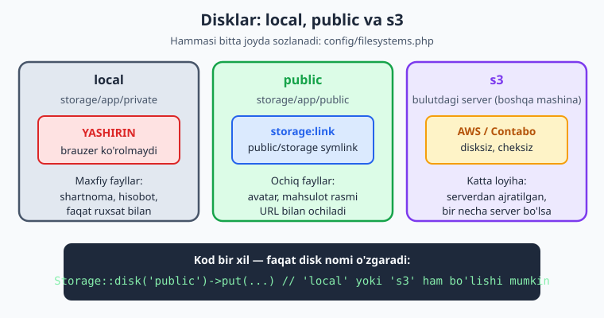
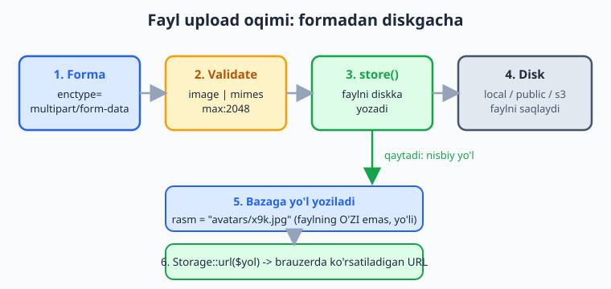
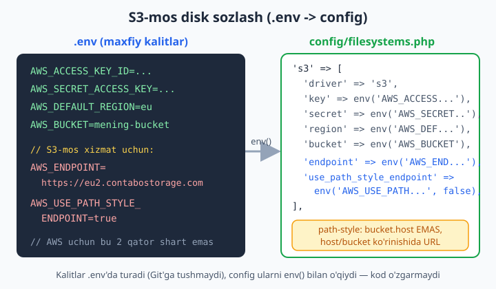

# 18 — File storage va upload

[⬅️ Oldingi: 17 — RESTful API va Sanctum](./17-rest-api-sanctum.md) · [🏠 README](./README.md) · [Keyingi: 19 — Mail va Notifications ➡️](./19-mail-notifications.md)

> **Bu bobda:** foydalanuvchi yuklagan fayllar (avatar, mahsulot rasmi, PDF hujjat) bilan ishlashni o'rganamiz. Fayl upload formasini to'g'ri yozish, yuklangan faylni `image`/`mimes`/`max` bilan validatsiya qilish, `store()` va `storeAs()` orqali xavfsiz saqlash, disklar tizimini (`local`, `public`, `s3`) tushunish, `php artisan storage:link` nima qilishini, `Storage` facade'i bilan fayl o'qish/o'chirish/URL olish, S3-mos object storage (Contabo kabi) ni `endpoint` va `path-style` bilan ulash, hamda public va private (maxfiy) fayllarni farqlab, faylni xavfsiz yuklab berishni ko'rib chiqamiz.

---

## Muammo

Profil sahifasiga "Rasm yuklash" tugmasi qo'ymoqchisiz. Foydalanuvchi rasm tanlaydi, "Saqlash" bosadi — va shu yerda savollar boshlanadi:

- Faylni **qayerga** qo'yamiz? `public/` papkasiga tashlasak, brauzer ko'radi, lekin har qanday odam URL'ni topib, boshqaning hujjatini ko'rib oladi.
- Faylni **qanday nom** bilan saqlaymiz? Ikki foydalanuvchi `rasm.jpg` yuklasa, biri ikkinchisini o'chirib yuboradimi?
- Yuklangan fayl haqiqatan rasm ekanini qanday tekshiramiz? Kimdir `.jpg` deb nomlagan virusni yuklasa-chi?
- Ertaga sayt ikkita serverga bo'linsa, bir serverga yuklangan rasm ikkinchisida ko'rinmay qolsa nima bo'ladi?

Sof PHP'da bularning hammasini `$_FILES`, `move_uploaded_file()`, `pathinfo()` bilan qo'lda yozasiz — har bir loyihada qaytadan, har safar xavfsizlik teshigini qoldirish xavfi bilan. Laravel buni bitta yagona tushuncha — **filesystem (disk)** abstraksiyasi bilan hal qiladi. Siz "qaysi diskka saqla" deysiz, qolganini Laravel qiladi. Ertaga diskni `local`'dan `s3`'ga o'zgartirsangiz — kod o'zgarmaydi. Mana shu sehrni boshidan o'rganamiz.

## Disk degani nima?

Laravel'da **disk** — fayllar saqlanadigan "joy". U serverdagi oddiy papka ham bo'lishi mumkin, AWS S3 yoki Contabo kabi bulutdagi server ham. Hammasi bitta faylda — `config/filesystems.php` da — sozlanadi. Standart Laravel loyihasida uchta muhim disk bor:



- **`local`** — `storage/app/private` ichida. Bu papka brauzerga **ko'rinmaydi**. Maxfiy fayllar: shartnomalar, hisobotlar, faqat ruxsati borlarga beriladigan hujjatlar shu yerda yashaydi.
- **`public`** — `storage/app/public` ichida. Bu fayllar brauzerga ochiq bo'lishi kerak (avatar, mahsulot rasmi). Lekin u ham `storage/` ichida bo'lgani uchun, brauzer to'g'ridan-to'g'ri ko'rolmaydi — buni `storage:link` hal qiladi (pastda).
- **`s3`** — serverdan butunlay ajratilgan, bulutdagi object storage. Loyiha o'sganda yoki bir necha server ishlatganda zarur bo'ladi.

📌 Nega `public/` papkasiga to'g'ridan-to'g'ri qo'ymaymiz? Chunki `public/` — kodingiz bilan birga Git'da yuriydigan papka, foydalanuvchi yuklagan fayllar esa ma'lumot. Ularni aralashtirmaslik, va deploy paytida fayllar yo'qolmasligi uchun, Laravel ularni `storage/` ga ajratadi. Tartib shu: **kod `public/` da, foydalanuvchi fayllari `storage/` da.**

💡 Standart disk `.env` dagi `FILESYSTEM_DISK` bilan belgilanadi. `Storage::put(...)` deb disk nomini yozmasangiz, aynan shu standart disk ishlatiladi. Aniqlik uchun bu bobda biz har doim diskni ochiq yozamiz: `Storage::disk('public')->...`.

## Eng sodda upload: avatar yuklash

Yo'lni boshidan oxirigacha bitta misolda ko'raylik. Foydalanuvchi profilga avatar yuklaydi. Avval forma. Bu yerda bitta narsa **majburiy**: `enctype="multipart/form-data"`. Busiz brauzer faylni jo'natmaydi, server faqat fayl nomini oladi:

```blade
<form action="/avatar" method="POST" enctype="multipart/form-data">
    @csrf
    <input type="file" name="avatar" accept="image/*">

    @error('avatar')
        <p style="color:red">{{ $message }}</p>
    @enderror

    <button type="submit">Yuklash</button>
</form>
```

📌 `@csrf` — har formada bo'lishi kerak (6-bobdan tanish). `accept="image/*"` — bu faqat brauzer darajasidagi qulaylik (fayl tanlash oynasida rasmlarni ko'rsatadi), **xavfsizlik emas**. Haqiqiy tekshiruv serverda, validatsiyada bo'ladi — busiz hech qachon ishonmang.

Endi kontroller. Mana upload oqimining yuragi:

```php
namespace App\Http\Controllers;

use Illuminate\Http\Request;

class AvatarController extends Controller
{
    public function store(Request $request)
    {
        $request->validate([
            'avatar' => ['required', 'image', 'max:2048'],
        ]);

        $yol = $request->file('avatar')->store('avatars', 'public');

        $request->user()->update(['avatar' => $yol]);

        return back()->with('xabar', 'Rasm yuklandi!');
    }
}
```

Uchta qator — uchta ish. Birinchisi tekshiradi, ikkinchisi saqlaydi, uchinchisi bazaga **yo'lni** yozadi. Diqqat: bazaga faylning o'zi emas, uning diskdagi **nisbiy yo'li** (`avatars/x9k3...jpg`) yoziladi. Fayl diskda, baza esa "u qayerdaligini" biladi. Butun oqim mana shunday:



`store('avatars', 'public')` nima qiladi?

1. Faylga **tasodifiy, takrorlanmas nom** beradi (masalan `x9k3lP2mQ.jpg`) — ikki foydalanuvchi bir-birini o'chirib yubormaydi, va asl fayl nomidagi xavfli belgilar (`../`, bo'shliq) yo'qoladi.
2. Uni `public` diskning `avatars/` papkasiga yozadi (ya'ni `storage/app/public/avatars/`).
3. Saqlangan **nisbiy yo'lni qaytaradi** — uni biz bazaga yozamiz.

💡 `->store($papka, $disk)` — birinchi argument papka, ikkinchisi disk. Diskni yozmasangiz, standart disk ishlatiladi. Avatar ochiq ko'rinishi kerak bo'lgani uchun biz `'public'` ni ochiq yozdik.

## Validatsiya: image, mimes, max

Upload xavfsizligi shu yerdan boshlanadi. Eng ko'p ishlatiladigan qoidalar:

```php
$request->validate([
    // Rasm: faqat rasm formatlari, eng ko'pi 2 MB
    'avatar' => ['required', 'image', 'max:2048'],

    // Aniq formatlar: faqat jpg, png, webp
    'rasm' => ['required', 'mimes:jpg,jpeg,png,webp', 'max:4096'],

    // Hujjat: PDF yoki Word, eng ko'pi 5 MB
    'hujjat' => ['required', 'file', 'mimes:pdf,doc,docx', 'max:5120'],

    // Rasm o'lchamlarini ham cheklash mumkin
    'banner' => ['required', 'image', 'dimensions:min_width=800,min_height=400'],
]);
```

📌 **`max` qiymati kilobaytda!** `max:2048` — 2048 KB = 2 MB. Bu ko'p adashtiradigan joy: `max:2` deb yozsangiz, atigi 2 KB ruxsat berasiz va deyarli har rasm rad etiladi.

📌 `image` va `mimes` farqi:
- `image` — fayl umuman rasmmi (jpg, png, gif, webp...) tekshiradi. Diqqat: Laravel 11+ dan boshlab `image` qoidasi SVG'ni standart holda **rad etadi** (XSS xavfi sababli); SVG kerak bo'lsa, `image:allow_svg` deb aniq ruxsat berasiz.
- `mimes:jpg,png` — aniq formatlarni belgilaydi. Laravel buni fayl **mazmuni** (MIME turi) bo'yicha tekshiradi, faqat kengaytma bo'yicha emas. Ya'ni kimdir `virus.exe` ni `rasm.jpg` deb nomlasa, `mimes` baribir uni ushlaydi.

❌ Faqat kengaytmaga ishonish (sof PHP'da ko'p uchraydigan xato):
```php
// Bu yetarli EMAS — kengaytmani har kim o'zgartira oladi:
if (str_ends_with($filename, '.jpg')) { /* ishonib saqlash */ }
```

✅ Laravel validatsiyasiga ishoning — u fayl mazmunini tekshiradi:
```php
$request->validate(['rasm' => ['required', 'image', 'max:2048']]);
```

💡 SVG — texnik jihatdan rasm, lekin ichida JavaScript bo'lishi mumkin (XSS xavfi). Foydalanuvchi avatari uchun SVG'ni ataylab ruxsat bermang: `mimes:jpg,jpeg,png,webp` deb aniq sanang.

## storeAs — faylga o'zingiz nom berasiz

`store()` tasodifiy nom beradi. Ba'zan nomni o'zingiz boshqarishni xohlaysiz — masalan foydalanuvchi ID'si bilan:

```php
$file = $request->file('hujjat');

// Nomni o'zimiz beramiz: papka, nom, disk
$nom = 'user-'.$request->user()->id.'-'.time().'.'.$file->extension();
$yol = $file->storeAs('hujjatlar', $nom, 'local');
```

📌 `storeAs($papka, $nom, $disk)` — uchta argument: papka, fayl nomi, disk. Diqqat: nomni o'zingiz tuzsangiz, **takrorlanmasligiga** o'zingiz javobgarsiz. `time()` yoki `Str::uuid()` qo'shish odat. Shubha bo'lsa — oddiy `store()` ishlating, u bu muammoni o'zi hal qiladi.

Yuklangan fayl haqida boshqa foydali ma'lumotlar:

```php
$file = $request->file('hujjat');

$file->getClientOriginalName();   // foydalanuvchi yuklagan asl nom: "hisobot.pdf"
$file->extension();               // mazmun bo'yicha kengaytma: "pdf"
$file->getSize();                 // hajmi baytda
$file->getMimeType();             // "application/pdf"
$file->hashName();                // tasodifiy nom (store() shuni ishlatadi)
```

💡 `getClientOriginalName()` — bu foydalanuvchi bergan nom, unga **ishonmang** (xavfli belgilar bo'lishi mumkin). Uni faqat ko'rsatish (ekranda "siz hisobot.pdf yukladingiz" deyish) yoki bazada alohida ustunda saqlash uchun ishlating — diskdagi fayl nomi sifatida emas.

## storage:link — public fayllarni brauzerga ochish

Avatar'ni `public` diskka saqladik, lekin u `storage/app/public/` ichida — bu papka brauzerga ko'rinmaydi (faqat haqiqiy `public/` papka ko'rinadi). Ko'prik kerak. Bitta buyruq buni hal qiladi:

```bash
php artisan storage:link
```

Bu `public/storage` nomli **symbolic link** (ramka — bir papkaga ishora qiluvchi yorliq) yaratadi. U `storage/app/public` ga ishora qiladi. Endi `storage/app/public/avatars/x.jpg` fayli brauzerda `https://sayt.uz/storage/avatars/x.jpg` URL orqali ochiladi.

📌 Bu buyruqni har loyihada (va serverga deploy qilganda) **bir marta** ishga tushirish kerak. Unutsangiz, rasmlar saqlanaveradi, lekin brauzerda 404 chiqadi — eng ko'p uchraydigan "rasmim ko'rinmayapti" muammosining sababi shu.

📌 Windows'da symlink yaratish uchun terminalni administrator huquqi bilan ochish kerak bo'lishi mumkin. Ishlamasa, terminalni "Run as administrator" bilan qayta oching.

Endi Blade'da rasmni ko'rsatamiz. Ikki yo'l bor:

```blade
{{-- 1-yo'l: asset() yordamida (eng oddiy) --}}
avatar) }}" alt="Avatar">

{{-- 2-yo'l: Storage::url() (diskni o'zgartirsangiz ham ishlaydi) --}}
avatar) }}" alt="Avatar">
```

💡 `Storage::url()` ni afzal ko'ring. Ertaga diskni `s3` ga o'zgartirsangiz, `asset('storage/...')` noto'g'ri URL beradi, `Storage::url()` esa avtomatik to'g'ri (bulutdagi) URL'ni qaytaradi. Blade ichida `Storage` facade'ini ishlatish uchun yuqorida `use Illuminate\Support\Facades\Storage;` shart emas — Blade kontekstida facade'lar global, lekin kontroller/klass ichida `use` qatori kerak.

## Storage facade — fayllar bilan to'g'ridan-to'g'ri ishlash

`$request->file()->store()` — upload uchun qulay. Lekin fayl bilan keyinchalik (o'qish, o'chirish, tekshirish) ishlash uchun `Storage` facade'i bor. Eng kerakli metodlar:

```php
use Illuminate\Support\Facades\Storage;

// Yozish (matn yoki kontent)
Storage::disk('public')->put('izohlar/eslatma.txt', 'Salom dunyo');

// O'qish
$matn = Storage::disk('public')->get('izohlar/eslatma.txt');

// Bormi?
if (Storage::disk('public')->exists('izohlar/eslatma.txt')) { /* ... */ }

// Hajmi
$hajm = Storage::disk('public')->size('izohlar/eslatma.txt');

// URL olish (public disk uchun)
$url = Storage::disk('public')->url('avatars/x.jpg');

// Nusxalash / ko'chirish
Storage::disk('public')->copy('izohlar/eslatma.txt', 'izohlar/nusxa.txt');
Storage::disk('public')->move('izohlar/nusxa.txt', 'arxiv/nusxa.txt');

// O'chirish
Storage::disk('public')->delete('avatars/eski.jpg');
```

📌 Bu metodlarning **hammasi disk nomidan mustaqil** ishlaydi. `Storage::disk('s3')->put(...)` deb yozsangiz, xuddi shu kod faylni bulutga yozadi — bironta ham qatorni o'zgartirmaysiz. Mana shu — disk abstraksiyasining butun kuchi.

Avatarni yangilaganda eskisini o'chirish — toza odat:

```php
public function update(Request $request)
{
    $request->validate(['avatar' => ['required', 'image', 'max:2048']]);

    $user = $request->user();

    // Eski avatar bo'lsa, uni o'chiramiz (axlat to'planmasin)
    if ($user->avatar) {
        Storage::disk('public')->delete($user->avatar);
    }

    $yol = $request->file('avatar')->store('avatars', 'public');
    $user->update(['avatar' => $yol]);

    return back()->with('xabar', 'Avatar yangilandi');
}
```

💡 `delete()` mavjud bo'lmagan faylga chaqirilsa ham xato bermaydi — shuning uchun `exists()` bilan oldindan tekshirish shart emas. Lekin `$user->avatar` `null` bo'lishi mumkinligini tekshirish kerak (yuqoridagi `if`).

## Private vs public fayl — xavfsizlik chizig'i

Bu bobning eng muhim qismi. Ikki xil fayl bor:

- **Public fayl** — hamma ko'rishi mumkin: avatar, mahsulot rasmi, blog rasmi. `public` diskka saqlanadi, URL orqali ochiladi.
- **Private fayl** — faqat ruxsati borlar ko'rishi kerak: foydalanuvchining shartnomasi, to'lov cheki, shaxsiy hujjat. **Hech qachon `public` diskka qo'ymang.**

Private faylni `local` diskka saqlaymiz (u brauzerga umuman ochiq emas). Foydalanuvchi uni ko'rmoqchi bo'lsa, **kontroller orqali**, ruxsatni tekshirgandan keyin beramiz:

```php
namespace App\Http\Controllers;

use Illuminate\Http\Request;
use Illuminate\Support\Facades\Storage;

class HujjatController extends Controller
{
    // Maxfiy hujjatni yuklab berish (faqat egasi)
    public function download(Request $request, Hujjat $hujjat)
    {
        // 14-bobdan: avtorizatsiya tekshiruvi
        if ($request->user()->isNot($hujjat->user)) {
            abort(403);
        }

        return Storage::disk('local')->download($hujjat->yol, 'hisobot.pdf');
    }
}
```

📌 Mantiq: fayl `local` diskda, ya'ni hech qanday URL bilan tashqaridan ochib bo'lmaydi. Yagona kirish yo'li — shu kontroller. Kontroller esa avval **kim** so'rayotganini tekshiradi (`abort(403)`), keyin faylni beradi. Mana shu — private fayl xavfsizligining butun mohiyati: **fayl yashirin, kirish — faqat tekshiruvdan o'tib.**

`download` va `response` farqi:
- `Storage::disk('local')->download($yol, $nom)` — brauzer faylni **yuklab oladi** (saqlash oynasi chiqadi). Ikkinchi argument — foydalanuvchi ko'radigan fayl nomi.
- `Storage::disk('local')->response($yol)` — fayl brauzerda **ochiladi** (masalan PDF'ni ko'rsatadi, yuklab olmaydi).

```php
// Yuklab olish (Download tugmasi):
return Storage::disk('local')->download($yol, 'shartnoma.pdf');

// Brauzerda ko'rsatish (PDF'ni ochish):
return Storage::disk('local')->response($yol);
```

💡 `download($yol)` da nom bermasangiz, diskdagi tasodifiy nom (`x9k3.pdf`) chiqadi. Foydalanuvchi tushunarli nom ko'rishi uchun ikkinchi argumentni doim bering.

## S3 va S3-mos object storage

Loyiha o'sganda yoki bir nechta serverda ishlatganda, fayllarni serverda saqlash muammo bo'ladi: disk to'ladi, serverlar orasida fayl bo'linmaydi, deploy paytida yo'qoladi. Yechim — **object storage**: AWS S3, yoki uning arzonroq mosi (Contabo, DigitalOcean Spaces, MinIO). Ularning hammasi **S3 protokoli** bilan ishlaydi, demak Laravel uchun bir xil.

Avval S3 paketini o'rnatamiz (standart Laravel'da kelmaydi):

```bash
composer require league/flysystem-aws-s3-v3
```

Keyin `.env` ga kalitlarni yozamiz. AWS uchun:

```env
AWS_ACCESS_KEY_ID=sizning-kalitingiz
AWS_SECRET_ACCESS_KEY=sizning-maxfiy-kalitingiz
AWS_DEFAULT_REGION=eu-central-1
AWS_BUCKET=mening-bucket
```

S3-mos xizmat (masalan Contabo) uchun ikki qator qo'shimcha kerak — `endpoint` va `path-style`:

```env
AWS_ACCESS_KEY_ID=sizning-kalitingiz
AWS_SECRET_ACCESS_KEY=sizning-maxfiy-kalitingiz
AWS_DEFAULT_REGION=eu2
AWS_BUCKET=mening-bucket
AWS_ENDPOINT=https://eu2.contabostorage.com
AWS_USE_PATH_STYLE_ENDPOINT=true
```

Bu kalitlar `config/filesystems.php` dagi `s3` diskga ulanadi (bu disk standart loyihada allaqachon mavjud):

```php
's3' => [
    'driver' => 's3',
    'key' => env('AWS_ACCESS_KEY_ID'),
    'secret' => env('AWS_SECRET_ACCESS_KEY'),
    'region' => env('AWS_DEFAULT_REGION'),
    'bucket' => env('AWS_BUCKET'),
    'endpoint' => env('AWS_ENDPOINT'),
    'use_path_style_endpoint' => env('AWS_USE_PATH_STYLE_ENDPOINT', false),
    'throw' => false,
],
```



📌 Ikki muhim sozlama:
- **`endpoint`** — AWS'da yozmaysiz (Laravel o'zi biladi). Lekin Contabo/MinIO kabi xizmat boshqa manzilda turgani uchun, uning serverini ko'rsatish shart.
- **`use_path_style_endpoint`** — AWS `bucket.s3.amazonaws.com` ko'rinishidagi URL ishlatadi. Ko'p S3-mos xizmatlar esa `endpoint/bucket` ko'rinishini talab qiladi. Buni `true` qilmasangiz, fayllar topilmaydi. Contabo, MinIO uchun deyarli doim `true`.

Endi diskni `s3` ga o'zgartirsangiz — qolgan kod **butunlay o'zgarmaydi**:

```php
// Aynan o'sha store(), faqat disk 's3':
$yol = $request->file('avatar')->store('avatars', 's3');

// Aynan o'sha url():
$url = Storage::disk('s3')->url($yol);
```

💡 Sinab ko'rish uchun lokal kompyuterda **MinIO** (bepul, Docker'da ishga tushadigan S3-mos server) ni o'rnatsangiz, S3 kodini AWS'ga pul to'lamasdan to'liq sinab ko'rasiz — kod bir xil bo'lgani uchun, ishlasa, AWS'da ham ishlaydi.

### Private fayl S3'da — temporaryUrl

S3'dagi private faylga vaqtinchalik (masalan 5 daqiqa amal qiladigan) URL berish mumkin — havola tarqalib ketsa ham, muddati tugagach ishlamay qoladi:

```php
$url = Storage::disk('s3')->temporaryUrl(
    'maxfiy/hisobot.pdf',
    now()->addMinutes(5)
);
```

📌 `temporaryUrl()` — S3 va S3-mos disklarda ishlaydi (`local` diskda emas). Bu private fayllarni samarali ulashishning eng ishonchli usuli: server faylni o'zidan o'tkazmaydi, foydalanuvchi to'g'ridan-to'g'ri bulutdan, lekin faqat muddat ichida oladi.

## Rasm bilan ishlash (qisqacha)

Ko'pincha rasmni saqlashdan oldin uni kichraytirish kerak (avatar 4000px bo'lishi shart emas). Buning uchun mashhur paket — **Intervention Image**:

```bash
composer require intervention/image
```

```php
use Intervention\Image\Laravel\Facades\Image;
use Illuminate\Support\Facades\Storage;

$rasm = Image::read($request->file('avatar'))
    ->scaleDown(width: 400);   // enini 400px ga, nisbatni saqlab

Storage::disk('public')->put(
    'avatars/'.$request->file('avatar')->hashName(),
    (string) $rasm->encode()
);
```

💡 Bu — alohida paket, Laravel yadrosiga kirmaydi. Boshlang'ich loyihada rasmni qayta o'lchamasdan ham saqlasangiz bo'ladi; trafik o'sganda Intervention Image bilan kichraytirishni qo'shasiz. Hozir faqat shunday imkoniyat borligini bilib qo'ying.

## Hammasini birlashtiramiz: to'liq oqim

Mahsulot rasmi yuklash — boshidan oxirigacha. Route:

```php
use App\Http\Controllers\MahsulotController;

Route::get('/mahsulot/{mahsulot}/rasm', [MahsulotController::class, 'edit']);
Route::post('/mahsulot/{mahsulot}/rasm', [MahsulotController::class, 'store']);
```

Kontroller:

```php
namespace App\Http\Controllers;

use App\Models\Mahsulot;
use Illuminate\Http\Request;
use Illuminate\Support\Facades\Storage;

class MahsulotController extends Controller
{
    public function store(Request $request, Mahsulot $mahsulot)
    {
        $request->validate([
            'rasm' => ['required', 'image', 'mimes:jpg,jpeg,png,webp', 'max:4096'],
        ]);

        // Eski rasmni o'chiramiz
        if ($mahsulot->rasm) {
            Storage::disk('public')->delete($mahsulot->rasm);
        }

        // Yangisini saqlaymiz, yo'lni bazaga yozamiz
        $mahsulot->update([
            'rasm' => $request->file('rasm')->store('mahsulotlar', 'public'),
        ]);

        return back()->with('xabar', 'Rasm yangilandi');
    }
}
```

Blade'da ko'rsatish:

```blade
@if ($mahsulot->rasm)
    rasm) }}" alt="{{ $mahsulot->nomi }}">
@else
    
@endif
```

Mana — to'liq, xavfsiz, ko'chiriladigan upload oqimi. Forma faylni jo'natdi, validatsiya tekshirdi, `store()` xavfsiz nom bilan diskka yozdi, bazada yo'l saqlandi, `Storage::url()` ko'rsatdi. Diskni `s3` ga o'zgartirsangiz — bu kodning birorta qatori o'zgarmaydi. Sof PHP'da har biri qo'lda, har loyihada qaytadan yoziladigan ishlarni Laravel bitta abstraksiya bilan hal qildi.

## 18-bob mashqlari

Quyidagi mashqlarni o'z loyihangizda (blog yoki do'kon) bajaring. Yechimlarini o'zingiz yozing — har biri oldingisidan bir qadam murakkabroq.

1. `php artisan storage:link` ni ishga tushiring va `public/storage` ramkasi yaratilganini tekshiring (papkani oching va `storage/app/public` ga ishora qilishini ko'ring).
2. `enctype="multipart/form-data"` va `@csrf` bilan oddiy fayl upload formasi yozing; `enctype` ni olib tashlasangiz nima bo'lishini ko'ring (server faylni olmaydi).
3. Kontrollerda `$request->validate()` bilan `avatar` ustiga `required|image|max:2048` qoidasini qo'ying; 3 MB rasm yuklab, xato xabari chiqishini tasdiqlang.
4. Validatsiya xatosini Blade'da `@error('avatar')` bilan ko'rsating va eski qiymatni saqlash uchun forma holatini tekshiring.
5. `$request->file('avatar')->store('avatars', 'public')` bilan rasmni saqlang va qaytgan nisbiy yo'lni `dd()` bilan ko'ring (tasodifiy nom berilganiga e'tibor bering).
6. Saqlangan yo'lni bazaga (`users.avatar` ustuni) yozing; migratsiya bilan ustun qo'shing va `fillable` ga `avatar` ni qo'shing.
7. Blade'da yuklangan avatarni `Storage::url()` bilan ko'rsating; `asset('storage/'.$yol)` bilan ham ko'rsatib, ikkalasining bir xil URL berishini solishtiring.
8. `storeAs()` bilan faylni o'zingiz tuzgan nom (`user-{id}-{time}.{ext}`) bilan saqlang; `extension()` va `getClientOriginalName()` qiymatlarini `dd()` bilan ko'ring.
9. `mimes:jpg,jpeg,png,webp` qoidasini qo'llang va `.gif` rasm yuklab, rad etilishini tasdiqlang; keyin `image` qoidasi bilan farqini taqqoslang.
10. Hujjat upload qoidasini yozing: `required|file|mimes:pdf,doc,docx|max:5120`; 6 MB PDF yuklab, `max` ishlashini tekshiring.
11. Avatar yangilashda eski faylni `Storage::disk('public')->delete($eski)` bilan o'chiring; o'chirishdan oldin va keyin `Storage::exists()` bilan tekshiring.
12. `Storage::disk('public')->put()`, `get()`, `size()`, `exists()` metodlarini bitta marshrut ichida sinab, natijalarni ekranga chiqaring.
13. `Storage::disk('local')->put()` bilan faylni `local` diskka yozing; uni brauzerda URL orqali ochishga urinib, ko'rinmasligini (yashirinligini) tasdiqlang.
14. Maxfiy hujjatni `download()` orqali beradigan marshrut yozing; ikkinchi argumentda tushunarli fayl nomi (`hisobot.pdf`) bering.
15. Xuddi shu faylni `response()` bilan brauzerda ochadigan ikkinchi marshrut yozing; `download` va `response` farqini o'z ko'zingiz bilan ko'ring.
16. Private hujjatga ruxsat tekshiruvi qo'shing: faqat faylning egasi yuklab olsin, boshqalar `abort(403)` olsin (14-bobdagi avtorizatsiyani eslang).
17. `composer require league/flysystem-aws-s3-v3` ni o'rnating; `.env` ga AWS kalitlarini (yoki MinIO/Contabo kalitlarini) yozing.
18. S3-mos xizmat uchun `.env` ga `AWS_ENDPOINT` va `AWS_USE_PATH_STYLE_ENDPOINT=true` qo'shing; `config/filesystems.php` dagi `s3` diskda bu qiymatlar `env()` orqali o'qilishini tekshiring.
19. Upload kodida diskni `'public'` dan `'s3'` ga o'zgartiring va boshqa kod o'zgarmaganini, faylning bulutga (yoki MinIO'ga) saqlanganini tasdiqlang.
20. S3'dagi private faylga `Storage::disk('s3')->temporaryUrl($yol, now()->addMinutes(5))` bilan vaqtinchalik URL yarating; havolani 5 daqiqadan keyin ochib, ishlamasligini tekshiring.
