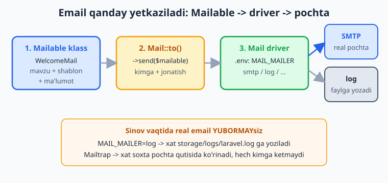
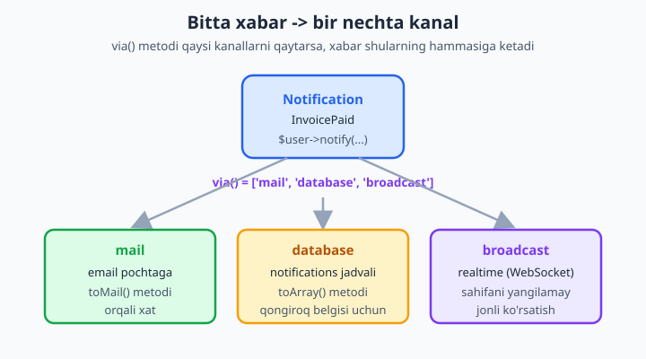
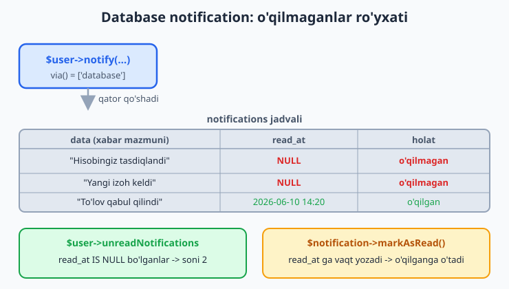

# 19 — Mail va Notifications

[⬅️ Oldingi: 18 — File storage va upload](./18-file-storage.md) · [🏠 README](./README.md) · [Keyingi: 20 — Queues va Jobs ➡️](./20-queues-jobs.md)

> **Bu bobda:** ilovamizdan foydalanuvchiga xabar yetkazishni o'rganamiz. Avval **email** yuborishni ko'ramiz: `make:mail` bilan Mailable klass yasash, xat mazmunini Blade va Markdown shablon orqali berish, `Mail::to(...)->send(...)` bilan jo'natish va sinov vaqtida real pochta yubormaslik uchun mail driver (`.env`: SMTP, Mailtrap, `log`) sozlash. Keyin **Notifications** tizimiga o'tamiz: bitta xabarni `mail`, `database` va `broadcast` kanallariga bir vaqtda tarqatish, `$user->notify(...)`, qo'ng'iroq belgisi uchun "o'qilmagan xabarlar" ro'yxati (database notification), `on-demand` (ro'yxatdan o'tmagan odamga) yuborish va og'ir xatlarni navbatga (queue) tashlab tezlikni saqlash.

---

## Muammo

11-bobda Tinker bilan, 13-bobda ro'yxatdan o'tish (registratsiya) bilan ishladik. Endi tabiiy savol tug'iladi: foydalanuvchi ro'yxatdan o'tdi — unga **"Xush kelibsiz" xati** kerak. Parolini unutdi — **parol tiklash havolasi** kerak. Postiga izoh keldi — **bildirishnoma** kerak. Buyurtma jo'natildi — **email** kerak.

Sof PHP'da bu og'riqli ish edi. Mana shunday yozish kerak bo'lardi:

```php
$to = "user@example.com";
$subject = "Xush kelibsiz";
$message = "Salom, " . $name . "!";
$headers = "From: sayt@example.com\r\n";
$headers .= "MIME-Version: 1.0\r\n";
$headers .= "Content-Type: text/html; charset=UTF-8\r\n";
mail($to, $subject, $message, $headers);   // ishlaydimi? Server sozlanganmi? Spamga tushmaydimi?
```

Bu yerda muammolar to'lib yotibdi: HTML xatni qo'lda yig'asiz, SMTP serverini o'zingiz ulaysiz, sinov paytida real odamlarga email ketib qolish xavfi bor, "izoh keldi"ni esa email + saytdagi qo'ng'iroq belgisi + jonli xabar — uchchalasiga alohida-alohida yozasiz. Laravel bularning hammasini ikki toza tizimga ajratadi: **Mail** (faqat email) va **Notifications** (bir xabar — ko'p kanal). Mail'dan boshlaymiz.

## Mailable — xatni klassga aylantirish

Laravel'da har bir email turi alohida **Mailable** klass bo'ladi: "Xush kelibsiz xati" — bitta klass, "Buyurtma jo'natildi xati" — boshqa klass. Klass ichida ikki narsani aniqlaysiz: xat **sarlavhasi** (envelope) va **mazmuni** (content — qaysi Blade shablon). Yasaymiz:

```bash
php artisan make:mail WelcomeMail
```

Bu `app/Mail/WelcomeMail.php` faylini yaratadi. Mana to'ldirilgan ko'rinishi:

```php
<?php

namespace App\Mail;

use App\Models\User;
use Illuminate\Bus\Queueable;
use Illuminate\Mail\Mailable;
use Illuminate\Mail\Mailables\Content;
use Illuminate\Mail\Mailables\Envelope;
use Illuminate\Queue\SerializesModels;

class WelcomeMail extends Mailable
{
    use Queueable, SerializesModels;

    // Konstruktorga uzatilgan public xossa avtomatik Blade shabloniga uzatiladi
    public function __construct(public User $user) {}

    public function envelope(): Envelope
    {
        return new Envelope(
            subject: 'Xush kelibsiz, ' . $this->user->name . '!',
        );
    }

    public function content(): Content
    {
        return new Content(
            view: 'mail.welcome',   // resources/views/mail/welcome.blade.php
        );
    }

    public function attachments(): array
    {
        return [];   // ilova fayl yo'q
    }
}
```

Uchta metodga e'tibor bering:

- `envelope()` — xat **sarlavhasi** (subject), kimdan kelishi (from), javob manzili (replyTo) — ya'ni "konvertning ustidagi" ma'lumot.
- `content()` — xat **ichi**: qaysi Blade (yoki Markdown) shablon ko'rsatiladi.
- `attachments()` — ilova fayllar (PDF hisob-faktura kabi). Hozircha bo'sh.

📌 **Konstruktor sehri.** `public User $user` deb yozilgan har qanday public xossa shabloningizda avtomatik `$user` nomi bilan ko'rinadi — alohida uzatish shart emas. PHP'ning "constructor property promotion" usuli (klass ichida `$this->user = $user` yozishdan qutqaradi). Agar bu sintaksis yangi bo'lsa — [PHP kitobi](../php/README.md)dagi OOP bobiga qarang.



### Xatning Blade shabloni

Endi xatning ko'rinishini yozamiz. Bu — oddiy Blade fayl, faqat email uchun (HTML email). `resources/views/mail/welcome.blade.php`:

```blade
<!DOCTYPE html>
<html lang="uz">
<head><meta charset="utf-8"></head>
<body style="font-family: sans-serif; line-height: 1.6;">
    <h1>Salom, {{ $user->name }}!</h1>

    <p>Saytimizga xush kelibsiz. Hisobingiz muvaffaqiyatli yaratildi.</p>

    <p>
        <a href="{{ url('/dashboard') }}"
           style="background:#2563eb; color:#fff; padding:10px 18px; border-radius:6px; text-decoration:none;">
            Shaxsiy kabinetga kirish
        </a>
    </p>

    <p>Hurmat bilan, sayt jamoasi.</p>
</body>
</html>
```

📌 Email HTML'i — brauzer HTML'idan farq qiladi. Email mijozlari (Gmail, Outlook) CSS'ning ko'p qismini qo'llab-quvvatlamaydi: tashqi `.css` fayl, `flexbox`, `grid` ko'pincha ishlamaydi. Shuning uchun email'da uslublar odatda `style="..."` ko'rinishida, to'g'ridan-to'g'ri teg ichiga yoziladi. Aynan shu sabab keyingi bo'limdagi **Markdown mail** juda qulay — chiroyli HTML'ni siz uchun Laravel tayyorlaydi.

## Mail::to(...)->send(...) — xatni jo'natish

Mailable tayyor. Endi uni biror joydan jo'natamiz — masalan registratsiya kontrolleridan:

```php
<?php

namespace App\Http\Controllers;

use App\Mail\WelcomeMail;
use App\Models\User;
use Illuminate\Support\Facades\Mail;

class AuthController extends Controller
{
    public function register()
    {
        $user = User::create([
            'name' => request('name'),
            'email' => request('email'),
            'password' => bcrypt(request('password')),
        ]);

        // Eng oddiy: bitta manzilga xat
        Mail::to($user->email)->send(new WelcomeMail($user));

        return redirect('/')->with('xabar', 'Xush kelibsiz xati yuborildi!');
    }
}
```

`Mail::to(...)` — kimga; `->send(new WelcomeMail($user))` — qaysi xat. Tamom. Bir nechta qabul qiluvchi yoki nusxa kerak bo'lsa:

```php
Mail::to($user->email)
    ->cc('admin@sayt.uz')        // nusxa (ko'rinadigan)
    ->bcc('arxiv@sayt.uz')       // yashirin nusxa
    ->send(new WelcomeMail($user));
```

💡 `Mail::to()` ga model'ning o'zini ham berishingiz mumkin: `Mail::to($user)->send(...)`. Laravel `$user->email` ustunini avtomatik topadi. Shart emas, lekin qulay.

## Mail driver — sinovda real email yubormaslik

Mana eng muhim amaliy savol: kodni ishga tushirdingiz, `Mail::to(...)->send(...)` chaqirildi — **xat qayerga ketadi?** Buni `.env` fayldagi `MAIL_MAILER` hal qiladi. Ishlab chiqish (development) paytida hech qachon real pochtaga email yubormaslik kerak — aks holda har test bosishda haqiqiy odamlarga xat ketadi.

Eng oddiy sozlama — `log` driver. Xat **hech qayerga ketmaydi**, balki `storage/logs/laravel.log` fayliga matn ko'rinishida yoziladi:

```env
MAIL_MAILER=log
```

Endi `php artisan serve` ostida registratsiyani sinab ko'ring, so'ng log fayliga qarang — xat to'liq matni o'sha yerda turadi. Hech kimga email ketmaydi, lekin xat to'g'ri yig'ilganini ko'rasiz.

📌 **Mailtrap — yaxshiroq sinov usuli.** `log` xatni faqat matn sifatida ko'rsatadi; HTML qanday chiqishini ko'rmaysiz. [Mailtrap.io](https://mailtrap.io) — bepul "soxta pochta qutisi": xat real odamga **ketmaydi**, lekin Mailtrap saytida xuddi haqiqiy Gmail kabi (HTML, sarlavha, ilovalar bilan) ko'rinadi. Mailtrap'dan SMTP ma'lumotlarini olib `.env`ga qo'yasiz:

```env
MAIL_MAILER=smtp
MAIL_HOST=sandbox.smtp.mailtrap.io
MAIL_PORT=2525
MAIL_USERNAME=sizning_username
MAIL_PASSWORD=sizning_parol
MAIL_FROM_ADDRESS="sayt@example.com"
MAIL_FROM_NAME="Mening saytim"
```

Productionda (real sayt) esa haqiqiy SMTP xizmati ishlatiladi — masalan o'z domeningiz pochtasi, yoki Postmark/Mailgun/Amazon SES kabi xizmatlar.

⚠️ `.env`ni o'zgartirgach `php artisan config:clear` (yoki serverni qayta ishga tushiring) — Laravel konfiguratsiyani keshlashi mumkin, eski qiymat qolib ketmasin.

✅ Sinovda: `MAIL_MAILER=log` yoki Mailtrap.
❌ Sinovda real SMTP bilan o'z do'stlaringizning manziliga test xat yuborish — spamga, e'tiborga, hatto bloklanishga olib keladi.

## Markdown mail — chiroyli email'ni qiynalmasdan

HTML email'ni qo'lda yozish (har `style="..."` bilan) zerikarli. Laravel **Markdown mail** beradi: oddiy Markdown yozasiz, Laravel uni tayyor, chiroyli, responsiv HTML xatga aylantiradi (tugma, panel, footer — hammasi tayyor uslubda). `--markdown` bilan yasaymiz:

```bash
php artisan make:mail OrderShipped --markdown=mail.orders.shipped
```

Bu ikki narsa yaratadi: `app/Mail/OrderShipped.php` klassi va `resources/views/mail/orders/shipped.blade.php` Markdown shabloni. Klass `content()`da `view` o'rniga `markdown` ishlatadi:

```php
<?php

namespace App\Mail;

use App\Models\Order;
use Illuminate\Bus\Queueable;
use Illuminate\Mail\Mailable;
use Illuminate\Mail\Mailables\Content;
use Illuminate\Mail\Mailables\Envelope;
use Illuminate\Queue\SerializesModels;

class OrderShipped extends Mailable
{
    use Queueable, SerializesModels;

    public function __construct(public Order $order) {}

    public function envelope(): Envelope
    {
        return new Envelope(subject: 'Buyurtmangiz yo\'lga chiqdi');
    }

    public function content(): Content
    {
        return new Content(
            markdown: 'mail.orders.shipped',
        );
    }
}
```

Shabloni — Markdown komponentlari bilan:

```blade
<x-mail::message>
# Buyurtmangiz yo'lga chiqdi

Salom! **#{{ $order->id }}** raqamli buyurtmangiz jo'natildi.

Jami summa: {{ $order->total }} so'm.

<x-mail::button :url="$url">
Buyurtmani kuzatish
</x-mail::button>

Rahmat,<br>
{{ config('app.name') }}
</x-mail::message>
```

📌 `<x-mail::message>` va `<x-mail::button>` — Laravel'ning tayyor mail komponentlari. Siz faqat mazmunni yozasiz, tugma rangi, panel chegarasi, footer — barchasi avtomatik chiroyli chiqadi. `:url="$url"` — Blade'ning atributga PHP qiymat berish usuli (oddiy `url="..."` bo'lsa matn, `:` bilan — o'zgaruvchi). `$url`ni Mailable klassida public xossa qilib bering.

💡 Markdown mail har doim ham HTML email'ni qo'lda yozishdan ustun: tezroq yoziladi, barcha email mijozlarda chiroyli ko'rinadi, va o'zgartirish oson. Yangi loyihada email kerak bo'lsa — Markdown'dan boshlang.

## Notifications — bitta xabar, ko'p kanal

Endi muammoning ikkinchi yarmiga keldik. Postga izoh kelganda uchta ish qilish kerak edi:

1. Muallifga **email** yuborish;
2. Saytdagi **qo'ng'iroq belgisi**ga "1 yangi" deb chiqarish (database);
3. Agar muallif hozir saytda bo'lsa — sahifani yangilamasdan **jonli** ko'rsatish (broadcast).

Mail tizimi faqat birinchisini hal qiladi. Ikkinchi va uchinchisi uchun **Notification** tizimi bor: bitta xabarni yozasiz, u esa o'zi belgilangan **kanallar**ga bir vaqtda tarqaladi. Yasaymiz:

```bash
php artisan make:notification NewCommentNotification
```

Bu `app/Notifications/NewCommentNotification.php` faylini yaratadi:

```php
<?php

namespace App\Notifications;

use App\Models\Comment;
use Illuminate\Bus\Queueable;
use Illuminate\Notifications\Messages\MailMessage;
use Illuminate\Notifications\Notification;

class NewCommentNotification extends Notification
{
    use Queueable;

    public function __construct(public Comment $comment) {}

    // Qaysi kanallarga ketsin? Massiv qaytaramiz:
    public function via(object $notifiable): array
    {
        return ['mail', 'database'];
    }

    // 'mail' kanali uchun: email qanday ko'rinadi
    public function toMail(object $notifiable): MailMessage
    {
        return (new MailMessage)
            ->subject('Postingizga yangi izoh')
            ->greeting('Salom, ' . $notifiable->name . '!')
            ->line('Postingizga yangi izoh qoldirildi:')
            ->line('"' . $this->comment->matn . '"')
            ->action('Izohni ko\'rish', url('/posts/' . $this->comment->post_id))
            ->line('Bizni tanlaganingiz uchun rahmat!');
    }

    // 'database' kanali uchun: jadvalga qanday ma'lumot yozilsin
    public function toArray(object $notifiable): array
    {
        return [
            'comment_id' => $this->comment->id,
            'post_id'    => $this->comment->post_id,
            'xabar'      => 'Postingizga yangi izoh keldi',
        ];
    }
}
```

Bu klassning yuragi — `via()` metodi. U **massiv** qaytaradi va shu massivdagi har bir kanal uchun alohida metod ishlaydi: `mail` uchun `toMail()`, `database` uchun `toArray()`, `broadcast` uchun `toBroadcast()` (yoki u ham `toArray()`dan foydalanadi). Bitta xabar — uch joyda.



📌 `MailMessage` — Markdown mail'ning soddaroq akasi: `->greeting()`, `->line()`, `->action()` (tugma) metodlari bilan email'ni zanjir shaklida yig'asiz, alohida Blade fayl yozmasdan. Tez bildirishnomalar uchun ideal. Murakkabroq dizayn kerak bo'lsa — `->markdown('...')` bilan o'zingizning shablonga o'tasiz.

📌 `$notifiable` — xabar **kimga** kelyapti (odatda `User`). `$notifiable->name`, `$notifiable->email` — shu foydalanuvchi ma'lumotlari. Nomi "notifiable" — "xabar yuborilishi mumkin bo'lgan" degani.

## notify() — xabarni yuborish

Notification'ni yuborish uchun foydalanuvchi modelida `Notifiable` trait bo'lishi kerak. Yangi Laravel loyihasida `User` modelida u **allaqachon turadi**:

```php
use Illuminate\Notifications\Notifiable;

class User extends Authenticatable
{
    use Notifiable;   // <- shu trait notify() metodini beradi
    // ...
}
```

Shu trait tufayli har bir `$user`da `notify()` metodi paydo bo'ladi:

```php
$author->notify(new NewCommentNotification($comment));
```

Bitta qator! `via()`da `['mail', 'database']` bo'lgani uchun bu chaqiriq **ham email yuboradi, ham bazaga yozadi**. Bir nechta odamga birdan yuborish kerak bo'lsa, `Notification` fasadidan foydalaning:

```php
use Illuminate\Support\Facades\Notification;

$adminlar = User::where('admin', true)->get();
Notification::send($adminlar, new NewCommentNotification($comment));
```

💡 Mail va Notification orasidagi tanlov: faqat email kerakmi — **Mailable** yetadi. Bir xabar bir nechta joyga (email + sayt qo'ng'irog'i + jonli) ketsinmi — **Notification** ishlating. Notification ichida ham email aslida Mail tizimini chaqiradi, ya'ni bir-birini almashtirmaydi, balki to'ldiradi.

## Database notification — o'qilmagan xabarlar ro'yxati

`database` kanali — eng ko'p ishlatiladigani. U xabarni `notifications` jadvaliga yozadi; siz esa keyin foydalanuvchining "qo'ng'iroq belgisi"da o'qilmaganlarni ko'rsatasiz (xuddi GitHub yoki Telegram'dagi kabi). Buning uchun avval `notifications` jadvalini yaratish kerak:

```bash
php artisan make:notifications-table
php artisan migrate
```

📌 Bu jadval Eloquent o'zining ID'sini `id` ustuniga (oddiy `bigint` emas, **UUID** — uzun matnli ID) yozadi, xabar mazmunini esa `data` (JSON), o'qilgan vaqtini `read_at` ustuniga saqlaydi. Eng muhimi — `read_at`: agar u **NULL** bo'lsa, xabar **o'qilmagan**; vaqt yozilgan bo'lsa — o'qilgan.



Endi `via()` da `'database'` borligi uchun `$author->notify(...)` chaqirilganda jadvalga qator tushadi. O'qishni Laravel oson qiladi — `Notifiable` trait uchta tayyor munosabat beradi:

```php
$user->notifications;          // BARCHA xabar (o'qilgan + o'qilmagan), yangidan eskiga
$user->unreadNotifications;    // faqat O'QILMAGAN (read_at IS NULL)
$user->readNotifications;      // faqat o'qilgan
```

Qo'ng'iroq belgisidagi son — shunchaki:

```php
$soni = $user->unreadNotifications->count();
```

### Saytda ko'rsatish (Blade)

Qo'ng'iroq dropdown'ini Blade'da chizamiz. Har bir xabarning mazmuni `->data` orqali olinadi (bu — `toArray()`da qaytargan massiv):

```blade
<div class="qongiroq">
    <span class="belgi">🔔 {{ auth()->user()->unreadNotifications->count() }}</span>

    <ul class="ochiladigan-royxat">
        @forelse(auth()->user()->unreadNotifications as $notification)
            <li>
                <a href="/posts/{{ $notification->data['post_id'] }}">
                    {{ $notification->data['xabar'] }}
                </a>
                <small>{{ $notification->created_at->diffForHumans() }}</small>
            </li>
        @empty
            <li>Yangi xabar yo'q</li>
        @endforelse
    </ul>
</div>
```

📌 `$notification->data['post_id']` — bu `toArray()`da qaytargan massiv. Laravel uni bazadan JSON sifatida o'qib, avtomatik PHP massiviga aylantiradi. `created_at->diffForHumans()` — "5 daqiqa oldin" kabi o'qishga qulay vaqt (Carbon kutubxonasi, [10-bobda](./10-query-builder-ilgor-eloquent.md) ko'rgan accessor/cast bilan bir oilada).

### O'qilgan deb belgilash

Foydalanuvchi xabarni bosganda uni "o'qilgan" qilamiz — `markAsRead()` `read_at` ustuniga joriy vaqtni yozadi:

```php
// Bitta xabarni o'qilgan qilish
$notification = $user->notifications()->find($id);
$notification->markAsRead();

// Bir vaqtda hammasini o'qilgan qilish ("Hammasini o'qildi" tugmasi)
$user->unreadNotifications->markAsRead();
```

`markAsRead()`dan keyin shu xabar `unreadNotifications`dan tushadi, qo'ng'iroq belgisidagi son kamayadi. Hammasi shu — alohida "o'qilgan" jadvali, bayroq ustuni yozish shart emas, Laravel buni `read_at` orqali boshqaradi.

## On-demand — ro'yxatdan o'tmagan odamga yuborish

Ba'zan xabarni `User`ga emas, shunchaki bir email manzilga yubormoqchisiz — masalan saytdan ro'yxatdan o'tmagan mehmon "narx so'rovi" qoldirdi va unga javob xati kerak. `notify()` chaqirish uchun model kerak, lekin bu yerda model yo'q. Yechim — `Notification::route()` (on-demand notification):

```php
use Illuminate\Support\Facades\Notification;

Notification::route('mail', 'mehmon@example.com')
    ->notify(new PromoNotification());
```

`route('mail', '...')` — "bu kanalga (mail) shu manzilga yubor" degani. Bir nechta kanal bo'lsa zanjirlab ketaverasiz: `->route('mail', $email)->route('vonage', $tel)`. Bu yerda `database` kanali mantiqsiz (qaysi foydalanuvchiga bog'lanadi?), shuning uchun on-demand'da odatda `mail` (yoki SMS) ishlatiladi.

💡 On-demand'ni Mailable bilan ham almashtirish mumkin (`Mail::to('mehmon@example.com')->send(...)`). Notification'ning afzalligi — bitta xabar klassini ham ro'yxatdagi, ham mehmon foydalanuvchiga ishlatasiz.

## Queue bilan yuborish — sayt sekinlashmasin

Mana muhim tezlik masalasi: email yuborish **sekin** — SMTP serveriga ulanish, javob kutish bir necha soniya olishi mumkin. Agar registratsiya kontrolleri xat yuborilguncha kutsa, foydalanuvchi "Ro'yxatdan o'tish" tugmasini bosgandan keyin sahifa qotib turadi. Yechim — xatni **navbatga (queue)** tashlash: kontroller xatni "keyinroq yubor" deb belgilaydi-yu, darhol javob qaytaradi; xat esa fonda yuboriladi.

Buning uchun klassga `ShouldQueue` interfeysini qo'shasiz — boshqa hech nima o'zgartirmasdan:

```php
use Illuminate\Contracts\Queue\ShouldQueue;

class InvoicePaid extends Notification implements ShouldQueue
{
    use Queueable;
    // ... qolgani aynan oldingidek
}
```

Mailable uchun ham xuddi shunday:

```php
class ReportMail extends Mailable implements ShouldQueue
{
    use Queueable, SerializesModels;
    // ...
}
```

`ShouldQueue` borligi uchun `Mail::to(...)->send(...)` va `$user->notify(...)` endi xatni darhol yubormaydi — navbatga qo'yadi. Sahifa bir zumda yuklanadi, xat esa fonda ketadi.

📌 Queue ishlashi uchun fonda `php artisan queue:work` ishlab turishi va `.env`da `QUEUE_CONNECTION` sozlangan bo'lishi kerak. Bularning to'liq tafsiloti — keyingi, [20-bob (Queues va Jobs)](./20-queues-jobs.md)da. Hozircha shuni bilsangiz yetadi: **og'ir email/notification = `ShouldQueue`** — bu eng ko'p ishlatiladigan amaliy qoida.

⚠️ `.env`da `QUEUE_CONNECTION=sync` bo'lsa (yangi loyihada ba'zan shunday), `ShouldQueue` bo'lsa ham xat **darhol** yuboriladi — "navbat" sinxron ishlaydi. Haqiqiy fon ishlashi uchun `database` yoki `redis` connection kerak. Buni 20-bobda sozlaymiz.

## Hammasini birga: registratsiya oqimi

Endi bo'limlarni bitta real misolga yig'amiz. Foydalanuvchi ro'yxatdan o'tdi → unga email, adminlarga esa bildirishnoma:

```php
public function register()
{
    $user = User::create([
        'name'     => request('name'),
        'email'    => request('email'),
        'password' => bcrypt(request('password')),
    ]);

    // 1. Foydalanuvchining o'ziga xush kelibsiz xati (faqat email)
    Mail::to($user->email)->send(new WelcomeMail($user));

    // 2. Adminlarga "yangi foydalanuvchi" bildirishnomasi (email + database)
    $adminlar = User::where('admin', true)->get();
    Notification::send($adminlar, new NewUserNotification($user));

    return redirect('/')->with('xabar', 'Ro\'yxatdan o\'tdingiz! Pochtangizni tekshiring.');
}
```

Sinov uchun `.env`da `MAIL_MAILER=log` qo'ying, registratsiyani bajaring va `storage/logs/laravel.log`ga qarang — xush kelibsiz xati o'sha yerda. Adminlar uchun esa `notifications` jadvalida yangi qatorlar paydo bo'ladi. Tinker'da tekshiring:

```bash
php artisan tinker
```

```php
> App\Models\User::where('admin', true)->first()->unreadNotifications->count();
= 1
```

Mana — email tizimi ham, bildirishnoma tizimi ham ishlamoqda, hammasi toza klasslar ichida, sof PHP'dagi `mail()` va qo'lda HTML yig'ishdan butunlay xalos.

---

## 19-bob mashqlari

💡 Mashqlar uchun sinov rejimida `MAIL_MAILER=log` qo'ying (yoki Mailtrap hisobi oching) — real email yubormang. Yangi Laravel loyihasi va ishlaydigan `User` modeli mavjud deb hisoblanadi.

1. `php artisan make:mail HelloMail` bilan Mailable klass yarating va `envelope()`da subject'ni "Salom!" qiling.
2. `resources/views/mail/hello.blade.php` Blade shablonini yarating, ichida `<h1>Salom, {{ $name }}!</h1>` bo'lsin; Mailable'ning `content()`ida shu view'ni ko'rsating va konstruktordan `$name` uzating.
3. Route yoki Tinker'dan `Mail::to('test@example.com')->send(new HelloMail('Ali'))` chaqiring; `.env`da `MAIL_MAILER=log` qilib, `storage/logs/laravel.log`dan xat matnini toping.
4. `.env`ni Mailtrap SMTP sozlamalariga o'tkazing (`MAIL_MAILER=smtp` + host/port/username/password); xatni qayta yuboring va Mailtrap qutisida ko'ring. `config:clear`ni unutmang.
5. `cc` va `bcc` qo'shing: `Mail::to(...)->cc('a@x.uz')->bcc('b@x.uz')->send(...)`; log'dan uchala manzil ham borligini tasdiqlang.
6. `php artisan make:mail OrderMail --markdown=mail.order` bilan Markdown mailable yarating; shablonga `<x-mail::message>` ichida sarlavha, matn va `<x-mail::button>` qo'shing.
7. Markdown mailable konstruktoriga `$order` (yoki oddiy massiv) uzating va shablonda `{{ $order['id'] }}` kabi qiymatni chiqaring.
8. `php artisan make:notification WelcomeNotification` bilan notification yarating; `via()` faqat `['mail']` qaytarsin va `toMail()`da `->greeting()`, `->line()`, `->action('Kirish', url('/'))` ishlating.
9. Tinker'da `$user->notify(new WelcomeNotification())` chaqiring (avval bitta `User` oling); log'dan email kelganini tekshiring.
10. `via()`ni `['mail', 'database']` qiling; `toArray()` metodini qo'shib unda `['xabar' => 'Xush kelibsiz']` qaytaring.
11. `php artisan make:notifications-table` va `php artisan migrate` bajarib `notifications` jadvalini yarating.
12. `$user->notify(...)`ni qayta chaqiring va `$user->unreadNotifications->count()` orqali o'qilmaganlar soni 1 ekanini Tinker'da tasdiqlang.
13. `$user->notifications` va `$user->unreadNotifications` farqini ko'ring: yana bir marta notify qiling, ikkala ro'yxatning sonini solishtiring.
14. Tinker'da `$user->unreadNotifications->first()->markAsRead()` chaqiring; keyin `unreadNotifications->count()` kamayganini tasdiqlang.
15. `$user->unreadNotifications->markAsRead()` bilan qolgan hammasini o'qilgan qiling; son 0 ga tushganini tekshiring.
16. Blade sahifasida o'qilmagan xabarlar ro'yxatini `@forelse` bilan chiqaring; bo'sh bo'lsa `@empty` shoxida "Yangi xabar yo'q" deb yozing.
17. Har bir xabarda `$notification->data['xabar']` matnini va `$notification->created_at->diffForHumans()` vaqtini ko'rsating.
18. On-demand notification yuboring: `Notification::route('mail', 'mehmon@example.com')->notify(new WelcomeNotification())`; log'dan tasdiqlang.
19. `Notification::send($users, ...)` bilan bir nechta foydalanuvchiga birdan yuboring (`User::all()` oling); har birida o'qilmagan paydo bo'lganini tekshiring.
20. Notification klassiga `implements ShouldQueue` qo'shib uni navbatga moslang; `.env`da `QUEUE_CONNECTION=database` qilib, `php artisan queue:table` + `migrate` + `php artisan queue:work` ishlatib, xat fonda yuborilishini kuzating (20-bobga ko'prik).
