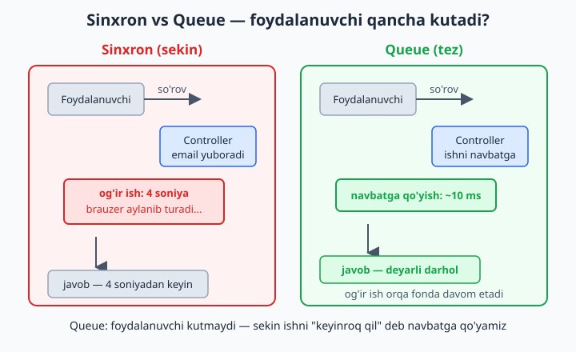
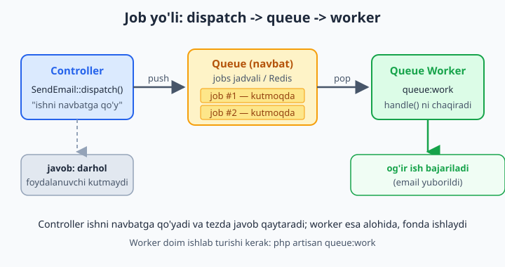
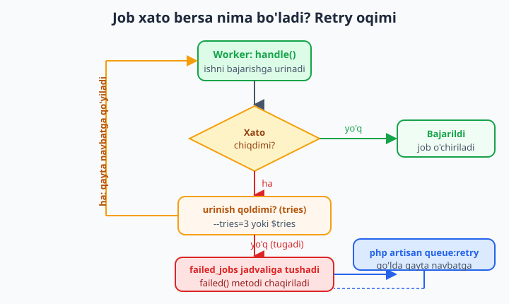

# 20 — Queues va Jobs

[⬅️ Oldingi: 19 — Mail va Notifications](./19-mail-notifications.md) · [🏠 README](./README.md) · [Keyingi: 21 — Events, Listeners va Scheduling ➡️](./21-events-scheduling.md)

> **Bu bobda:** og'ir va sekin ishni (email yuborish, rasm qayta ishlash, hisobot tuzish) foydalanuvchini kutdirmasdan **orqa fonda** bajarishni — queue (navbat) tushunchasini o'rganamiz. Queue nima ekanini va nega kerakligini, queue driver'lar (`sync`, `database`, `redis`) farqini, `make:job` bilan job yaratishni, `ShouldQueue` interfeysi va `handle()` metodini, `dispatch()` bilan ishni navbatga qo'yishni, `php artisan queue:work` worker'ini, kechiktirilgan dispatch (`->delay()`), muvaffaqiyatsiz job'lar (`failed_jobs`, `queue:retry`, `queue:failed`), qayta urinishlar (`$tries`, `backoff`), job batching, mail'ni queue'ga qo'yish va Horizon (Redis monitoring) ni ko'rib chiqamiz.

---

## Muammo

Tasavvur qiling, do'kon saytida foydalanuvchi "Ro'yxatdan o'tish" tugmasini bosadi. Siz unga xush kelibsiz xati yubormoqchisiz, profil rasmini bir necha o'lchamga kichraytirmoqchisiz va admin'ga xabar yubormoqchisiz. Controller'da hammasini ketma-ket yozasiz:

```php
<?php
// ❌ Hammasi so'rov ichida — foydalanuvchi KUTADI
public function store(Request $request)
{
    $user = Foydalanuvchi::create($request->validated());

    Mail::to($user->email)->send(new XushKelibsiz($user->ism)); // ~2 soniya
    $this->rasmlarniKichraytir($user);                           // ~3 soniya
    Mail::to('admin@dokon.uz')->send(new YangiAzo($user));       // ~2 soniya

    return redirect('/profil');
}
```

Bu kod **ishlaydi**, lekin muammosi bor: foydalanuvchi tugmani bosgach, brauzer **7 soniya** aylanib turadi. Nega? Chunki email serveriga ulanish, rasmlarni qayta ishlash — bularning hammasi **sekin**. Foydalanuvchi esa boshqa hech narsa qila olmay, ekranga qarab kutadi. Yomoni — agar email serveri sekin javob bersa yoki rasm juda katta bo'lsa, sahifa "muzlab" qoladi yoki timeout xatosi beradi.

Bu yerda mantiqiy savol tug'iladi: **foydalanuvchiga xush kelibsiz xati to'g'ridan-to'g'ri "Ro'yxatdan o'tish" tugmasi bilan bog'liqmi?** Yo'q. Foydalanuvchiga muhimi — uning hisobi yaratilgani. Xat 2 soniya keyin yetib borsa ham hech narsa o'zgarmaydi. Demak, bu sekin ishlarni so'rovdan **ajratib olib**, keyinroq, alohida bajarsak bo'ladi.

Laravel'ning yechimi — **queue** (navbat). G'oya sodda: sekin ishni darhol bajarmaymiz, balki "buni keyinroq qil" deb bir **ro'yxatga** (navbatga) qo'yamiz. Foydalanuvchi darhol javob oladi, og'ir ish esa orqa fonda, alohida jarayonda bajariladi.



## Queue nima — "keyinroq qilinadigan ishlar ro'yxati"

Eng yaxshi tashbeh — **restoran oshxonasi**. Ofitsiant (controller) buyurtmani oladi va darhol oshpazga (worker) "chek"ni ilib qo'yadi — keyin boshqa mijozlarga xizmat qilishda davom etadi. U har bir taom pishguncha kutib turmaydi. Oshpaz cheklarni **navbat bilan** (kelgan tartibda) oladi va bajaradi. Mijoz ovqatini kutadi, lekin ofitsiant band emas.

Texnik tilda uchta qism bor:

- **Job** (ish) — bajarilishi kerak bo'lgan vazifa. Bizning misolda: "email yubor", "rasmni kichraytir". Bu — alohida PHP klass.
- **Queue** (navbat) — job'lar saqlanadigan ro'yxat. Bu ro'yxat baza jadvalida yoki Redis'da turishi mumkin.
- **Worker** (ishchi) — navbatdan job'larni birma-bir olib bajaradigan, doim ishlab turadigan jarayon.

Oqim shunday: controller job'ni navbatga **qo'yadi** (dispatch), darhol javob qaytaradi; worker esa alohida, fonda navbatni kuzatib turadi va yangi job paydo bo'lishi bilan uni **olib bajaradi**.



📌 Eng muhim tushuncha: **dispatch qilish — ishni bajarish emas, faqat "ro'yxatga yozib qo'yish".** `dispatch()` chaqirilgach, Laravel job'ni navbatga qo'yadi va darhol davom etadi. Job aslida **keyinroq**, worker tomonidan bajariladi. Shuning uchun controller tez javob qaytaradi.

💡 Queue faqat tezlik uchun emas. U **ishonchlilik** ham beradi: agar email serveri vaqtincha ishlamasa, sinxron kodda foydalanuvchi xato olardi. Queue'da esa job navbatda qoladi va keyinroq qayta urinib ko'riladi — foydalanuvchi buni sezmaydi ham.

## Queue driver — navbat qayerda saqlanadi?

Navbatdagi job'lar bir joyda saqlanishi kerak. "Qayerda?" degan savolga **driver** (haydovchi — saqlash usuli) javob beradi. Sozlama `.env` faylida:

```env
QUEUE_CONNECTION=database
```

Asosiy driver'lar:

| Driver | Qayerda saqlaydi | Qachon ishlatiladi |
|---|---|---|
| `sync` | Hech qayerda — **darhol** bajaradi | Standart (default). Test va lokal ishlash uchun |
| `database` | Baza jadvalida (`jobs` jadval) | Kichik/o'rta loyihalar — sodda, qo'shimcha xizmatsiz |
| `redis` | Redis xotirasida | Katta loyihalar — eng tez, Horizon bilan ishlaydi |
| `sqs` | Amazon SQS bulutida | AWS infratuzilmasi |

📌 **Eng katta tuzoq boshlovchilar uchun:** standart driver — `sync`. Bu "navbat" emas! `sync` job'ni **darhol, o'sha so'rov ichida** bajaradi — xuddi queue'siz yozgandek. Ya'ni `dispatch()` yozasiz, lekin foydalanuvchi baribir kutadi. Nega bunday? Chunki `sync` lokal ishlashda qulay: alohida worker ishga tushirmasdan job kodingizni sinab ko'rasiz. Lekin **haqiqiy orqa fon** uchun `database` yoki `redis` ga o'tish shart.

💡 Boshlash uchun `database` eng yaxshi tanlov: Redis o'rnatish shart emas, hammasi baza ichida. Katta yuk paydo bo'lganda `redis` ga o'tasiz — job kodingiz o'zgarmaydi, faqat `.env` dagi bitta qator o'zgaradi.

### `database` driver'ini sozlash

`database` driver navbatni saqlash uchun `jobs` jadvalini talab qiladi. Uni yaratuvchi migration Laravel'da tayyor — bitta artisan buyrug'i bilan keladi:

```bash
php artisan make:queue-table
php artisan migrate
```

📌 Avvalgi Laravel versiyalarida bu buyruq `php artisan queue:table` deb atalardi. Laravel 11+ da `make:queue-table` ishlatiladi (eskisi ham hali ishlaydi). Buyruq `jobs` jadvalini yaratadigan migration faylini hosil qiladi, `migrate` esa uni bazaga qo'llaydi. Endi navbatga qo'yilgan har bir job shu jadvalda bitta qator sifatida turadi.

So'ng `.env` da driver'ni almashtiramiz va config keshini yangilaymiz:

```env
QUEUE_CONNECTION=database
```

```bash
php artisan config:clear
```

## Birinchi Job — `make:job`

Endi haqiqiy job yozamiz. Bobning boshidagi muammoni hal qilaylik: xush kelibsiz xatini orqa fonga ko'chiramiz. Avval job klassini yaratamiz:

```bash
php artisan make:job XushKelibsizYubor
```

Bu `app/Jobs/XushKelibsizYubor.php` faylini yaratadi. Ichi shunday ko'rinadi:

```php
<?php

namespace App\Jobs;

use Illuminate\Contracts\Queue\ShouldQueue;
use Illuminate\Foundation\Queue\Queueable;

class XushKelibsizYubor implements ShouldQueue
{
    use Queueable;

    public function __construct()
    {
        //
    }

    public function handle(): void
    {
        //
    }
}
```

Ikkita asosiy qism bor — bu butun bob bo'yicha eng muhim tushunchalar:

- **`implements ShouldQueue`** — bu interfeys job'ga "meni navbatga qo'y, darhol bajarma" deb aytadi. Aynan shu interfeys job'ni "navbatga tushadigan" qiladi.
- **`handle()`** — bajarilishi kerak bo'lgan **asl ish** shu metod ichida yoziladi. Worker job'ni ishlatganda, aynan `handle()` chaqiriladi.

📌 `Queueable` trait (Laravel 11+ da `Illuminate\Foundation\Queue\Queueable`) — job'ga dispatch, delay, retry kabi barcha imkoniyatlarni qo'shadi. Siz uni qo'lda yozmaysiz, `make:job` avtomatik qo'yib beradi.

## `ShouldQueue` va `handle()` — job ichini to'ldiramiz

Endi job'ni mazmun bilan to'ldiramiz. Job'ga ish uchun kerak bo'lgan ma'lumotni **konstruktor** orqali beramiz, ishning o'zini esa `handle()` ga yozamiz:

```php
<?php

namespace App\Jobs;

use App\Models\Foydalanuvchi;
use App\Mail\XushKelibsiz;
use Illuminate\Contracts\Queue\ShouldQueue;
use Illuminate\Foundation\Queue\Queueable;
use Illuminate\Support\Facades\Mail;

class XushKelibsizYubor implements ShouldQueue
{
    use Queueable;

    public function __construct(
        public Foydalanuvchi $user,
    ) {}

    public function handle(): void
    {
        Mail::to($this->user->email)
            ->send(new XushKelibsiz($this->user->ism));
    }
}
```

E'tibor bering: konstruktorda `public Foydalanuvchi $user` deb yozdik. Bu — job'ga **qaysi foydalanuvchiga** xat yuborishni aytadigan ma'lumot. `handle()` da esa shu `$this->user` orqali asl ishni bajaramiz.

📌 **Muhim qoida — job konstruktoriga oddiy ma'lumot bering.** Eloquent modelni to'g'ridan-to'g'ri uzatsangiz, Laravel uni aqlli tarzda saqlaydi: bazaga faqat model **id**'sini yozadi (`SerializesModels` mexanizmi), worker job'ni bajarganda esa modelni bazadan **yangidan o'qib oladi**. Demak job har doim eng yangi ma'lumot bilan ishlaydi. Lekin shu sababli: job navbatda turganda model bazadan **o'chirilsa**, worker uni topa olmaydi va job xato beradi.

💡 Konstruktorga butun massiv yoki og'ir obyektlarni tiqishtirmang. Job ma'lumoti bazaga (yoki Redis'ga) matn ko'rinishida saqlanadi (serializatsiya). Qancha kam va sodda bo'lsa — shuncha yaxshi. Eng yaxshisi: model yoki bir nechta oddiy qiymat (`id`, `string`, `int`).

## `dispatch()` — ishni navbatga qo'yamiz

Job yozildi. Endi uni controller'da **navbatga qo'yamiz**. Buning uchun `dispatch()` ishlatiladi:

```php
<?php

namespace App\Http\Controllers;

use App\Jobs\XushKelibsizYubor;
use App\Models\Foydalanuvchi;
use Illuminate\Http\Request;

class RoyxatController extends Controller
{
    public function store(Request $request)
    {
        $user = Foydalanuvchi::create($request->validated());

        // ✅ ishni navbatga qo'yamiz — foydalanuvchi kutmaydi
        XushKelibsizYubor::dispatch($user);

        return redirect('/profil')->with('xabar', 'Hisobingiz yaratildi!');
    }
}
```

Bobning boshidagi 7 soniyalik kutish endi **deyarli darhol**ga aylandi. `dispatch($user)` — konstruktorga uzatiladigan argumentni qabul qiladi (bizda `Foydalanuvchi $user`). Laravel job'ni navbatga (`jobs` jadvaliga) qo'yadi va darhol davom etadi. Email aslida keyinroq, worker tomonidan yuboriladi.

📌 `dispatch()` ga bergan argumentlar — to'g'ridan-to'g'ri job **konstruktoriga** boradi. Konstruktorda `Foydalanuvchi $user` bo'lsa, `dispatch($user)` deb chaqirasiz. Ikkita argument bo'lsa — `dispatch($user, $turi)`.

Dispatch qilishning bir necha qulay shakli bor:

```php
<?php
// 1. Asosiy usul
XushKelibsizYubor::dispatch($user);

// 2. Shartli — shart rost bo'lsagina navbatga qo'yadi
XushKelibsizYubor::dispatchIf($user->faol, $user);
XushKelibsizYubor::dispatchUnless($user->bloklangan, $user);

// 3. dispatchSync — queue'siz, DARHOL bajaradi (test/lokal uchun)
XushKelibsizYubor::dispatchSync($user);
```

💡 `dispatchSync()` — job'ni navbatga qo'ymasdan, o'sha yerda darhol bajaradi. Worker ishlamayotgan paytda job kodingizni sinab ko'rish uchun juda qulay: dispatch'ni shunchaki `dispatchSync` ga o'zgartirasiz, natijani ko'rasiz, keyin qaytarasiz.

## Worker — `queue:work`

Job'ni navbatga qo'ydik. Lekin navbatda turgan job'ni **kim bajaradi**? Hech kim — agar worker ishlamasa. Bu eng ko'p uchraydigan "nega email kelmadi?" muammosining sababi.

Worker — navbatni kuzatib turadigan va yangi job paydo bo'lishi bilan uni olib bajaradigan jarayon. Uni ishga tushiramiz:

```bash
php artisan queue:work
```

Bu buyruq terminalda **ishlab turadi** (to'xtamaydi). Har safar navbatga yangi job tushganda, worker uni darhol oladi va `handle()` metodini chaqiradi. Terminalda har bir bajarilgan job log sifatida ko'rinadi:

```text
2026-06-11 10:15:03 App\Jobs\XushKelibsizYubor ... RUNNING
2026-06-11 10:15:04 App\Jobs\XushKelibsizYubor ... DONE
```

📌 **`queue:work` doim ishlab turishi kerak.** Agar uni to'xtatsangiz (yoki kompyuterni o'chirsangiz), navbatga qo'yilgan job'lar bajarilmay, jadvalda kutib qoladi. Worker qayta ishga tushganda esa kutib turgan barcha job'larni bajaradi. Demak: dispatch ishladi, lekin email kelmadimi — birinchi navbatda `queue:work` ishlab turganini tekshiring.

`queue:work` ning ikkita muhim "qardoshi" bor:

```bash
# queue:listen — kod o'zgarsa avtomatik yangilanadi (lokal ishlash uchun qulay)
php artisan queue:listen

# bitta job bajarib to'xtaydi (skript/cron uchun)
php artisan queue:work --once
```

📌 **`queue:work` va `queue:listen` farqi — bu klassik tuzoq.** `queue:work` job kodini **xotiraga bir marta yuklaydi** va shu nusxa bilan ishlaydi — tez, lekin kodni o'zgartirsangiz, worker eski kodni ishlatishda davom etadi. Shuning uchun job kodini o'zgartirgach, `queue:work` ni **qaytadan ishga tushirish** (Ctrl+C va qayta) yoki `php artisan queue:restart` qilish shart. `queue:listen` esa har job uchun kodni yangidan o'qiydi — sekinroq, lekin lokal ishlashda qulay, chunki o'zgarishni darhol ko'rasiz.

💡 Produksiyada (server'da) `queue:work` ni qo'lda emas, **Supervisor** kabi vosita orqali ishga tushiriladi. Supervisor worker'ni kuzatib turadi: agar u biror sababga ko'ra "o'lib qolsa", avtomatik qayta ishga tushiradi. Bu — produksiya uchun majburiy odat.

## Kechiktirilgan dispatch — `->delay()`

Ba'zan ishni darhol emas, **muayyan vaqtdan keyin** bajartirish kerak. Misol: foydalanuvchi ro'yxatdan o'tdi — unga darhol emas, 10 daqiqadan keyin "yordam kerakmi?" xatini yuboramiz. Buni `->delay()` bilan qilamiz:

```php
<?php
use Illuminate\Support\Carbon;

// 10 daqiqadan keyin bajariladi
XushKelibsizYubor::dispatch($user)->delay(now()->addMinutes(10));

// 1 soatdan keyin
HisobotTayyorla::dispatch($buyurtma)->delay(now()->addHour());

// aniq vaqtda — ertaga ertalab 9:00 da
EslatmaYubor::dispatch($user)->delay(Carbon::parse('tomorrow 09:00'));
```

`->delay()` ga `now()->addMinutes(10)` kabi vaqt beriladi (`now()` — hozirgi vaqt, `addMinutes()` ga qo'shadi). Worker bu job'ni ko'radi, lekin vaqti kelguncha **tegmaydi** — faqat belgilangan paytda bajaradi.

📌 `->delay()` — bu "scheduling" (jadval) emas! Scheduling (`->everyMinute()`, cron) — bu **takrorlanadigan** ishlar uchun (21-bobda). `->delay()` esa **bir martalik** kechikish: job bir marta, belgilangan vaqtda bajariladi va tugaydi.

## Failed jobs — job xato berganda

Real hayotda job'lar ba'zan **xato beradi**: email serveri javob bermay qoldi, tashqi API uzildi, ma'lumot noto'g'ri chiqdi. `handle()` ichida istisno (exception) otilsa, Laravel job'ni **muvaffaqiyatsiz** deb belgilaydi.

Standart holatda job bir marta urinib, xato bersa darhol "yiqiladi". Lekin ko'p xatolar **vaqtinchalik**: email serveri 2 soniyadan keyin yana ishlaydi. Shuning uchun job'ni bir necha marta **qayta urinishga** sozlash mumkin — `$tries`:

```php
<?php

namespace App\Jobs;

use App\Models\Buyurtma;
use Illuminate\Contracts\Queue\ShouldQueue;
use Illuminate\Foundation\Queue\Queueable;
use Throwable;

class HisobotTayyorla implements ShouldQueue
{
    use Queueable;

    public int $tries = 3;       // ko'pi bilan 3 marta urinadi

    public int $backoff = 10;    // urinishlar orasida 10 soniya kutadi

    public function __construct(
        public Buyurtma $buyurtma,
    ) {}

    public function handle(): void
    {
        // og'ir ish — agar xato otilsa, qayta urinib ko'riladi
        $this->buyurtma->hisobotYasa();
    }

    public function failed(Throwable $exception): void
    {
        // BARCHA urinishlar tugagach, faqat bir marta chaqiriladi
        logger()->error('Hisobot tayyorlanmadi: ' . $exception->getMessage());
    }
}
```

Mantiq shunday: job xato beradi → Laravel `$tries` (3) marta qayta urinadi, har urinish orasida `$backoff` (10 soniya) kutadi → 3-urinish ham xato bersa, job **failed** deb belgilanadi va `failed_jobs` jadvaliga tushadi. Shu paytda — agar yozgan bo'lsangiz — `failed()` metodi chaqiriladi (xabar yuborish, log yozish uchun).



📌 `failed_jobs` jadvali Laravel loyihasida **standart** mavjud (yangi loyiha migration'larida bor). Agar yo'q bo'lsa, `php artisan make:queue-failed-table` va `migrate` bilan yaratiladi. Bu jadval — "muvaffaqiyatsiz job'lar qabristoni": har bir yiqilgan job, uning ma'lumoti va xato matni shu yerda saqlanadi, shuning uchun siz nima xato bo'lganini ko'rib, tuzatib, qayta urinib ko'rasiz.

💡 `--tries` ni komanda satridan ham berish mumkin: `php artisan queue:work --tries=3`. Job ichidagi `$tries` xususiyati ustun turadi. Hech qaysi berilmasa, standart — 1 (bir marta urinadi).

### `queue:failed` va `queue:retry` — yiqilgan job'larni boshqarish

Failed job'larni terminaldan boshqarasiz:

```bash
# barcha muvaffaqiyatsiz job'lar ro'yxati
php artisan queue:failed

# bitta job'ni id bo'yicha qayta navbatga qo'yish
php artisan queue:retry 5

# HAMMA failed job'ni qayta urinish
php artisan queue:retry all

# bitta failed job'ni o'chirish
php artisan queue:forget 5

# barcha failed job'larni tozalash
php artisan queue:flush
```

Tipik ish jarayoni: email serveri bir soat ishlamadi → o'sha vaqtdagi job'lar `failed_jobs` ga tushdi → server tuzaldi → `php artisan queue:retry all` deysiz → barcha yiqilgan job'lar qaytadan navbatga tushadi va bu safar muvaffaqiyatli bajariladi. Hech bir xat yo'qolmaydi.

📌 `queue:retry` job'ni **darhol bajarmaydi** — uni faqat navbatga **qaytaradi**. Aslida bajarilishi uchun `queue:work` ishlab turishi kerak. Bu mantiqiy: retry — "qaytadan navbatga qo'y" degani, "hozir bajar" emas.

## Mail va Notification'ni queue'ga qo'yish

Job yozish — orqa fon uchun universal usul. Lekin email va notification'lar shunchalik ko'p navbatga qo'yiladiki, Laravel ular uchun **soddaroq yo'l** beradi: alohida job yozish shart emas.

**Mailable'ni queue'ga qo'yish** — Mailable klassiga `implements ShouldQueue` qo'shing (19-bobdagi Mailable'ni eslang):

```php
<?php

namespace App\Mail;

use Illuminate\Bus\Queueable;
use Illuminate\Contracts\Queue\ShouldQueue;
use Illuminate\Mail\Mailable;
use Illuminate\Queue\SerializesModels;

class XushKelibsiz extends Mailable implements ShouldQueue   // ★ shu interfeys
{
    use Queueable, SerializesModels;

    public function __construct(
        public string $ism,
    ) {}

    // envelope(), content() ... 19-bobdagidek
}
```

Endi `Mail::to(...)->send(...)` ni o'zgartirmasdan ham bu xat **avtomatik** navbatga tushadi. Yoki controllerda aniq `queue()` ishlatasiz:

```php
<?php
// Mailable ShouldQueue bo'lsa — avtomatik navbatga
Mail::to($user->email)->send(new XushKelibsiz($user->ism));

// yoki aniq navbatga qo'yish (Mailable ShouldQueue bo'lmasa ham)
Mail::to($user->email)->queue(new XushKelibsiz($user->ism));
```

**Notification'ni queue'ga qo'yish** — bir xil naqsh: Notification klassiga `implements ShouldQueue`:

```php
<?php

namespace App\Notifications;

use Illuminate\Bus\Queueable;
use Illuminate\Contracts\Queue\ShouldQueue;
use Illuminate\Notifications\Messages\MailMessage;
use Illuminate\Notifications\Notification;

class BuyurtmaTayyor extends Notification implements ShouldQueue
{
    use Queueable;

    public function via(object $notifiable): array
    {
        return ['mail'];
    }

    public function toMail(object $notifiable): MailMessage
    {
        return (new MailMessage)
            ->subject('Buyurtmangiz tayyor')
            ->line('Buyurtmangiz tayyor bo\'ldi.');
    }
}
```

`$user->notify(new BuyurtmaTayyor())` chaqirilganda, bu notification endi avtomatik orqa fonda yuboriladi.

💡 **Amaliy maslahat:** deyarli har doim email/notification'ni queue'ga qo'ying. Foydalanuvchi tugmani bosib, email yuborilguncha 2 soniya kutishining hech qanday ma'nosi yo'q. Faqat bitta shart: queue driver `database`/`redis` bo'lishi va worker ishlab turishi kerak — aks holda `sync` da baribir kutadi.

## Job batching — bir guruh job'ni birga kuzatish

Ba'zan ko'p o'xshash job'ni bir guruh sifatida ishga tushirib, **hammasi tugaganini** bilish kerak. Misol: 1000 ta rasmni qayta ishlash va hammasi tugagach foydalanuvchiga "tayyor!" deb xabar berish. Buni qo'lda kuzatish qiyin — Laravel **batch** (to'plam) beradi.

📌 Batch ishlashi uchun job'da `Batchable` trait bo'lishi va `job_batches` jadvali kerak: `php artisan make:queue-batches-table` va `migrate`.

```php
<?php

use App\Jobs\RasmQaytaIshla;
use App\Models\Rasm;
use Illuminate\Bus\Batch;
use Illuminate\Support\Facades\Bus;
use Throwable;

$jobs = Rasm::all()->map(fn ($rasm) => new RasmQaytaIshla($rasm));

$batch = Bus::batch($jobs)
    ->then(function (Batch $batch) {
        // ✅ HAMMA job muvaffaqiyatli tugadi
    })
    ->catch(function (Batch $batch, Throwable $e) {
        // ❌ birortasi xato berdi
    })
    ->finally(function (Batch $batch) {
        // tugadi (muvaffaqiyatli yoki yo'q — har holda)
    })
    ->name('Rasmlarni qayta ishlash')
    ->dispatch();
```

`Bus::batch([...])` — job'lar massivini bir to'plamga jamlaydi. `->then()` — hammasi muvaffaqiyatli tugaganda, `->catch()` — birortasi yiqilganda, `->finally()` — har qanday holatda chaqiriladi. `$batch->id` orqali to'plam holatini (necha job qoldi, necha foiz bajarildi) kuzatasiz — bu progress-bar ko'rsatish uchun juda qulay.

💡 Batch — "1000 ta job'ni jo'natdim, hammasi tugaganda menga xabar ber" muammosining toza yechimi. Aks holda har bir job'ning tugaganini qo'lda sanab o'tirardingiz.

## Chain — job'larni ketma-ket bajarish

Batch — job'larni **parallel** bajaradi (tartib muhim emas). Lekin ba'zan tartib muhim: avval rasmni qayta ishla, **keyin** email yubor. Buning uchun `Bus::chain()` ishlatiladi:

```php
<?php
use Illuminate\Support\Facades\Bus;

Bus::chain([
    new RasmQaytaIshla($buyurtma),
    new EmailYubor($buyurtma),
    new AdmingaXabar($buyurtma),
])->dispatch();
```

Zanjirdagi job'lar **qat'iy tartibda** bajariladi: birinchisi tugamaguncha ikkinchisi boshlanmaydi. Agar zanjirdagi biror job **xato bersa** — qolganlari **bajarilmaydi** (zanjir uziladi). Bu "avval to'lovni amalga oshir, faqat muvaffaqiyatli bo'lsa buyurtmani tasdiqla" kabi mantiqlar uchun ideal.

## Horizon — Redis navbatlarini kuzatish (qisqacha)

Loyiha o'sgach, savol tug'iladi: "hozir nechta job ishlayapti? Qaysilari sekin? Qancha xato berdi?" `queue:work` terminal logidan buni kuzatish noqulay. **Laravel Horizon** — aynan shu uchun: Redis navbatlari uchun chiroyli **veb-panel** (dashboard).

```bash
composer require laravel/horizon
php artisan horizon:install
php artisan horizon
```

So'ng `/horizon` manziliga kirib, real vaqtda ko'rasiz: o'tkazuvchanlik (job/daqiqa), kutish vaqti, muvaffaqiyatsiz job'lar, har bir job'ning ish vaqti. Horizon `queue:work` ni o'rnini bosadi — endi worker'larni o'zi boshqaradi.

📌 Horizon **faqat `redis` driver bilan** ishlaydi (`database` bilan emas). Demak Horizon kerak bo'lsa, `QUEUE_CONNECTION=redis` qilib, serverda Redis o'rnatilgan bo'lishi shart. Kichik loyihalarda Horizon shart emas — `database` driver va oddiy `queue:work` yetarli.

## Yakuniy manzara

Bobning boshidagi 7 soniyalik kutish endi tarix. Yangi tizim:

- **Sekin ishlar** (email, rasm, hisobot) — `make:job` bilan job'ga ko'chirildi.
- **Controller** — `dispatch()` bilan job'ni navbatga qo'yadi va **darhol** javob qaytaradi.
- **Worker** (`queue:work`) — orqa fonda navbatni bo'shatadi.
- **Xato bersa** — `$tries` marta qayta urinadi, baribir yiqilsa `failed_jobs` ga tushadi va `queue:retry` bilan qayta jo'natiladi.
- **Email/notification** — `ShouldQueue` qo'shilib, avtomatik orqa fonga o'tdi.
- **Ko'p job** — `Bus::batch()` (parallel) yoki `Bus::chain()` (ketma-ket) bilan boshqariladi.

Foydalanuvchi tez javob oladi, og'ir ish esa fonda, ishonchli tarzda bajariladi. Mana shu — queue bergan tezlik va xotirjamlik.

## 20-bob mashqlari

> Quyidagi mashqlarni yangi yoki mavjud Laravel 13 loyihasida bajaring. Har bir dispatch'dan keyin natijani ko'rish uchun **alohida terminal**da `php artisan queue:work` ishlab turishi kerakligini unutmang. Har bir job xatti-harakatini `php artisan queue:work` logidan va `storage/logs/laravel.log` faylidan kuzating.

1. `.env` faylida `QUEUE_CONNECTION` ning hozirgi qiymatini toping. Standart qiymat nima va u nega "haqiqiy navbat" emasligini o'z so'zlaringiz bilan izohlang.

2. `php artisan make:queue-table` va `php artisan migrate` ni bajaring. Yaratilgan `jobs` jadvalini bazada ko'ring (qaysi ustunlar bor?). So'ng `.env` da `QUEUE_CONNECTION=database` qiling va `php artisan config:clear` ishlating.

3. `php artisan make:job SalomYoz` buyrug'i bilan job yarating. Yaratilgan fayl qaysi papkada turibdi? Uning `implements ShouldQueue` va `handle()` qismlarini toping va vazifasini tushuntiring.

4. `SalomYoz` job'ining `handle()` metodida `logger()->info('Salom navbatdan!')` yozing. Bu job'ni biror route yoki Tinker'dan `SalomYoz::dispatch()` bilan navbatga qo'ying.

5. `php artisan queue:work` ni ishga tushiring (alohida terminalda). 4-mashqdagi dispatch'ni qayta ishga tushiring va worker terminalida hamda log faylda yozuv paydo bo'lishini tasdiqlang.

6. `queue:work` ni **to'xtating** (Ctrl+C). Job'ni yana dispatch qiling. Endi log yozuvi **paydo bo'lmasligini** ko'ring. So'ng `queue:work` ni qayta ishga tushiring — kutib turgan job darhol bajariladimi?

7. `SalomYoz` ning `handle()` metodi matnini o'zgartiring, lekin `queue:work` ni qayta ishga tushirmang. Job'ni dispatch qiling — log'da eski matn chiqadimi yoki yangi? Bu nima haqida ogohlantiradi? (`queue:restart` ni sinab ko'ring.)

8. Job konstruktoriga `public string $ism` qo'shing. `handle()` da shu ismni log qiling. `SalomYoz::dispatch('Olim')` bilan dispatch qilib, log'da to'g'ri ism chiqishini tekshiring.

9. Bitta Foydalanuvchi modelini job konstruktoriga uzating (`public Foydalanuvchi $user`). `handle()` da `$this->user->email` ni log qiling. Bazada faqat id saqlanishini va `handle()` da to'liq model qaytishini izohlang (`SerializesModels`).

10. `dispatchSync()` ni sinab ko'ring: job'ni `SalomYoz::dispatchSync('Test')` bilan ishga tushiring. Worker ishlamasa ham bajariladimi? Nega? `dispatch()` dan farqini yozing.

11. Job'ni 1 daqiqalik kechikish bilan jo'nating: `SalomYoz::dispatch('Kech')->delay(now()->addMinute())`. `queue:work` log'ida job qachon bajarilishini kuzating — darholmi yoki 1 daqiqadan keyinmi?

12. `RasmKichraytir` nomli yangi job yarating. `handle()` ichida ataylab xato oting: `throw new \Exception('Test xato')`. Uni dispatch qilib, `queue:work` log'ida nima ko'rinishini kuzating.

13. `RasmKichraytir` ga `public int $tries = 3` qo'shing. Xato beruvchi job'ni qayta dispatch qiling. Worker uni necha marta urinib ko'radi? Log'da urinishlarni sanang.

14. Yiqilgan job'lar ro'yxatini `php artisan queue:failed` bilan ko'ring. 12-13-mashqlardagi job'lar shu yerda turibdimi? Qaysi ustunlar (id, xato matni) ko'rinadi?

15. `php artisan queue:retry all` bilan barcha failed job'larni qayta navbatga qo'ying. Job darhol bajariladimi yoki `queue:work` kerakmi? `queue:retry` ning aslida nima qilishini izohlang.

16. `RasmKichraytir` ga `failed(\Throwable $e)` metodini qo'shing: u barcha urinishlar tugagach `logger()->error(...)` yozsin. Xatoni qayta keltirib chiqarib, bu metod **faqat bir marta** (oxirida) chaqirilishini tasdiqlang.

17. Bitta Mailable yarating (`php artisan make:mail TestXat`) va unga `implements ShouldQueue` qo'shing. `Mail::to('test@misol.uz')->send(new TestXat())` bilan jo'nating — xat darhol jo'natiladimi yoki navbatga tushadimi? (`MAIL_MAILER=log` qilib, log'dan tekshiring.)

18. Bitta Notification yarating va unga `implements ShouldQueue` qo'shing. `$user->notify(...)` bilan jo'nating. `queue:work` log'ida bu notification job sifatida ko'rinishini tasdiqlang.

19. `make:queue-batches-table` va `migrate` qiling. `Bus::batch([...])` bilan 3 ta `RasmKichraytir` job'ini bir to'plamda jo'nating. `->then()`, `->catch()`, `->finally()` ga log yozing. Hammasi muvaffaqiyatli tugaganda qaysi callback ishlaydi? Birortasi xato bersa-chi?

20. `Bus::chain([...])` bilan ikkita job'ni ketma-ket jo'nating: birinchisi `logger()->info('1-job')`, ikkinchisi `logger()->info('2-job')`. Log'da tartibni tekshiring. So'ng birinchi job'da ataylab xato oting — ikkinchi job baribir bajariladimi? `chain` va `batch` farqini xulosa qiling.
