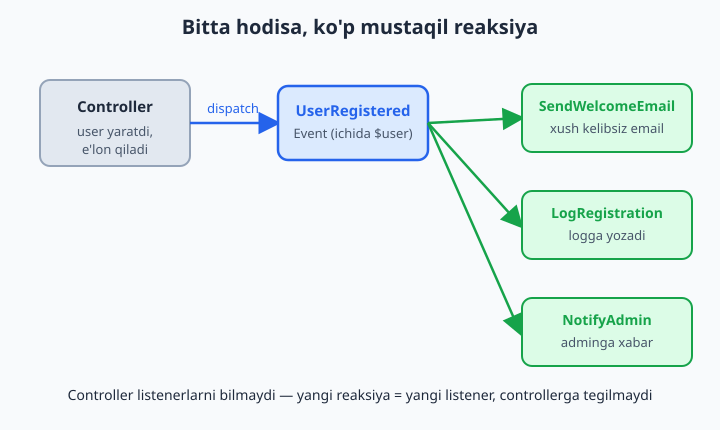
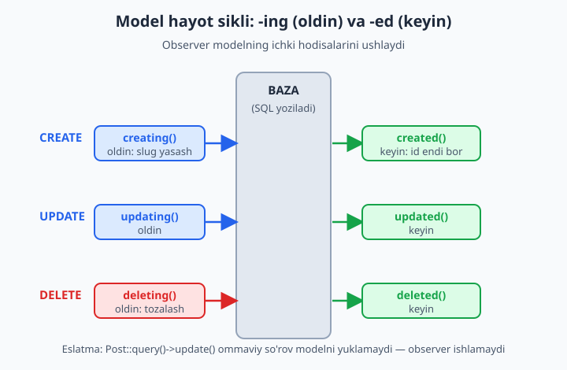
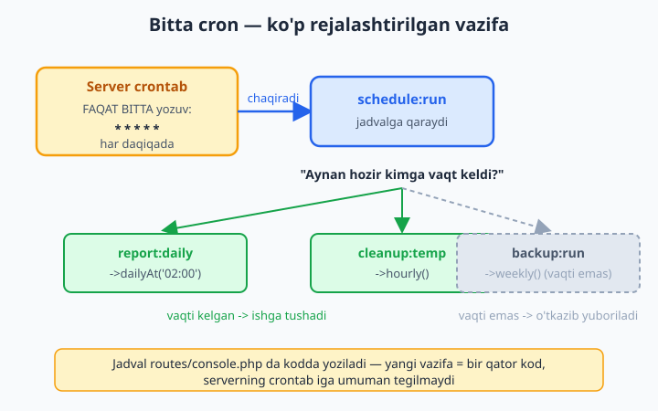

# 21 — Events, Listeners va Scheduling

[⬅️ Oldingi: 20 — Queues va Jobs](./20-queues-jobs.md) · [🏠 README](./README.md) · [Keyingi: 22 — Testing (Pest va PHPUnit) ➡️](./22-testing.md)

> **Bu bobda:** "biror narsa bo'lganda avtomatik reaksiya" va "vaqt bo'yicha avtomatik ish" muammosini yechamiz. Avval **Event** (hodisa) va **Listener** (tinglovchi) bilan kodni ajratishni (decoupling) o'rganamiz: bitta hodisa — bir nechta mustaqil reaksiya, `make:event`/`make:listener`, `event()` dispatch va avtomatik discovery. Keyin **Model Observer** (`make:observer`) bilan modelning hayot siklidagi (`created`/`updated`/`deleting`...) hooklarni ushlaymiz. So'ng **Task Scheduling** (Laravel 11+ uslubi: `routes/console.php` da `Schedule::command(...)->daily()`) — serverda BITTA cron yozuvi bilan hamma rejalashtirilgan vazifani boshqarish, `schedule:list`/`schedule:run`/`schedule:work`. Yo'l-yo'lakay `make:command` bilan o'z artisan buyrug'imizni va listenerni navbatga (queue) qo'yishni ko'rib chiqamiz.

---

## Muammo

Foydalanuvchi ro'yxatdan o'tdi. Endi nima bo'lishi kerak? O'ylab ko'raylik:

1. Unga "Xush kelibsiz" emaili yuborilsin.
2. Logga "yangi user qo'shildi" deb yozilsin.
3. Adminga Telegram/Slack xabar borsin.
4. Statistika `+1` bo'lsin.

PHP biladigan dasturchi sifatida birinchi xayolingizga keladigan yechim — hammasini `register()` controlleri ichiga ketma-ket yozish:

```php
public function register(Request $request)
{
    $user = User::create($request->validated());

    Mail::to($user)->send(new WelcomeMail($user));   // 1
    Log::info('Yangi user: ' . $user->email);        // 2
    Http::post('https://api.telegram.org/...', [...]);  // 3
    Statistika::increment('users');                  // 4

    return redirect('/dashboard');
}
```

Ishlaydi. Lekin muammolar ketma-ket yog'ila boshlaydi:

- **Controller shishadi.** Ro'yxatdan o'tish — bitta gap edi (`User::create`), lekin metod 4 ta begona vazifa bilan to'ldi.
- **Bog'liqlik (coupling).** Endi `RegisterController` Mail'ni ham, Telegram'ni ham, Statistika'ni ham "biladi". Bittasi o'zgarsa, controllerga tegish kerak.
- **Takrorlanish.** Admin user'ni qo'lda yaratadigan boshqa joy bor (`AdminUserController`). U yerda ham xuddi shu 4 qatorni qaytarib yozasizmi? Birini unutsangiz — xush kelibsiz email yubormay qolasiz.
- **Test qiyin.** `register()` ni test qilmoqchisiz — endi haqiqiy email ketib qoladi.

Asl muammo bitta: **"user yaratildi" degan voqea** bilan **"o'sha voqeaga javoban bajariladigan ishlar"** bir-biriga yopishib qolgan. Aslida controller faqat shuni e'lon qilishi kerak: "user ro'yxatdan o'tdi!" — kim eshitsa, o'zi reaksiya qilsin. Mana shu — **Event / Listener** g'oyasi.

Ikkinchi muammo butunlay boshqacha, lekin u ham "avtomatik" haqida: **hech kim tugma bosmasa ham** bajariladigan ishlar bor. Har kecha soat 02:00 da hisobot, har soatda eski fayllarni tozalash, har hafta dushanba kuni adminlarga xulosa email. Buni qo'lda bajarib bo'lmaydi — vaqt kelganda o'zi ishlashi kerak. Bu — **Task Scheduling**.

Ikkalasini ham shu bobda yechamiz.

---

## Event va Listener — voqea va unga javob

Tushunchani ikki qismga bo'lamiz:

- **Event** (hodisa) — "biror narsa bo'ldi" degan e'lon. Bu shunchaki ma'lumotli ob'ekt: `UserRegistered` (ichida `$user` bor). U **hech qanday ish bajarmaydi** — faqat "bu voqea sodir bo'ldi" deb xabar beradi.
- **Listener** (tinglovchi) — o'sha hodisaga **javob beradigan** ish: email yuborish, log yozish. Bitta event'ga bir nechta listener bog'lanishi mumkin.

Aloqa shunday: controller `event(new UserRegistered($user))` deb hodisani **e'lon qiladi** (dispatch). Laravel o'sha event'ga ulangan barcha listenerlarni topib, har birini chaqiradi. Controller listenerlar haqida **hech narsa bilmaydi** — mana shu ajratish (decoupling).



📌 Bu — gazeta e'loni kabi. Controller "user ro'yxatdan o'tdi" deb gazetaga e'lon beradi. Gazetani kim o'qisa (listener), o'zi tegishli ishini qiladi. E'lon beruvchi o'quvchilarning ro'yxatini yuritmaydi.

### Event yaratish

```bash
php artisan make:event UserRegistered
```

Bu `app/Events/UserRegistered.php` faylini yaratadi. Uni shunday to'ldiramiz — ichiga faqat **ma'lumot** qo'yamiz:

```php
<?php

namespace App\Events;

use App\Models\User;
use Illuminate\Foundation\Events\Dispatchable;
use Illuminate\Queue\SerializesModels;

class UserRegistered
{
    use Dispatchable, SerializesModels;

    public function __construct(public User $user)
    {
    }
}
```

💡 `public User $user` — PHP 8 ning constructor property promotion'i (PHP kitobida ko'rgansiz). Listenerlar event ichidagi `$user` ga shu orqali yetadi. `Dispatchable` trait `UserRegistered::dispatch($user)` qisqa yozuvni beradi, `SerializesModels` esa event navbatga tushganda modelni to'g'ri saqlaydi.

### Listener yaratish

```bash
php artisan make:listener SendWelcomeEmail --event=UserRegistered
```

`--event=UserRegistered` bayrog'i listener'ning `handle()` metodiga to'g'ri tip-hint qo'yib beradi. `app/Listeners/SendWelcomeEmail.php`:

```php
<?php

namespace App\Listeners;

use App\Events\UserRegistered;
use Illuminate\Support\Facades\Mail;
use App\Mail\WelcomeMail;

class SendWelcomeEmail
{
    public function handle(UserRegistered $event): void
    {
        Mail::to($event->user)->send(new WelcomeMail($event->user));
    }
}
```

E'tibor bering: `handle()` ga `UserRegistered $event` keladi — undan `$event->user` ni olamiz. Listener faqat **bitta ish** qiladi: email yuboradi. Ikkinchi listener (log) — alohida fayl, alohida mas'uliyat:

```bash
php artisan make:listener LogRegistration --event=UserRegistered
```

```php
<?php

namespace App\Listeners;

use App\Events\UserRegistered;
use Illuminate\Support\Facades\Log;

class LogRegistration
{
    public function handle(UserRegistered $event): void
    {
        Log::info('Yangi user royxatdan otdi: ' . $event->user->email);
    }
}
```

### Hodisani e'lon qilish (dispatch)

Endi controller jonsiz qoladi — faqat user yaratadi va voqeani e'lon qiladi:

```php
public function register(Request $request)
{
    $user = User::create($request->validated());

    UserRegistered::dispatch($user);   // <-- yagona qator

    return redirect('/dashboard');
}
```

`UserRegistered::dispatch($user)` ishlatdik (`Dispatchable` trait shuni beradi). Bir xil ma'noli ikkinchi yo'l — global `event()` yordamchisi:

```php
event(new UserRegistered($user));
```

Ikkalasi bir xil. Endi controller email, log, Telegram haqida **hech narsa bilmaydi**. Yangi reaksiya kerakmi? Yangi listener yozasiz — controllerga **umuman tegmaysiz**. Mana shu ochiq/yopiq tamoyilning (open/closed) amaliy ko'rinishi.

✅ Controller faqat o'z ishini qiladi: user yaratish + "bo'ldi!" deyish.
❌ Controllerni yana 4 ta begona vazifa bilan to'ldirish.

### Laravel listenerni qanday topadi? (avtomatik discovery)

Eski Laravel'da har bir event -> listener bog'lanishini `EventServiceProvider` ning `$listen` massivida qo'lda yozish kerak edi. Laravel 11+ da bu **avtomatik**: Laravel `app/Listeners` papkasini o'zi skanerlaydi va har listenerning `handle()` metodidagi tip-hint (`UserRegistered $event`) ga qarab bog'lanishni o'zi topadi.

Demak, yuqoridagi `SendWelcomeEmail` va `LogRegistration` `handle(UserRegistered $event)` deganligi uchun, ikkalasi ham avtomatik ravishda `UserRegistered` ga ulanadi. **Qo'lda ro'yxatga olish shart emas.**

💡 Bog'lanishlar to'g'ri topilganini ko'rishni xohlasangiz:

```bash
php artisan event:list
```

Bu har bir event va unga ulangan listenerlar ro'yxatini chiqaradi — discovery ishlaganini tasdiqlaydi.

📌 **Discovery faqat tip-hintga qaraydi.** `handle(UserRegistered $event)` da tip-hintni unutib `handle($event)` deb yozsangiz, Laravel qaysi event'ga ulashni bilmaydi va listener jim qoladi — xato ham bermaydi. Listener "ishlamayapti" muammosining eng tez-tez uchraydigan sababi shu.

## Queued Listener — sekin ishni navbatga qo'yish

Email yuborish — sekin ish (SMTP serveriga ulanish kerak). Hozirgi holatda foydalanuvchi `register()` tugmasini bosgach, javob kelishidan oldin email **yuborilib bo'lguncha** kutadi. 20-bobda buni navbat (queue) bilan yechgan edik. Listenerni navbatga qo'yish juda oson: listener `ShouldQueue` interfeysini implement qilsa kifoya:

```php
<?php

namespace App\Listeners;

use App\Events\UserRegistered;
use App\Mail\WelcomeMail;
use Illuminate\Contracts\Queue\ShouldQueue;
use Illuminate\Support\Facades\Mail;

class SendWelcomeEmail implements ShouldQueue
{
    public function handle(UserRegistered $event): void
    {
        Mail::to($event->user)->send(new WelcomeMail($event->user));
    }
}
```

Bitta `implements ShouldQueue` qo'shildi — boshqa hech narsa o'zgarmadi. Endi `UserRegistered::dispatch()` chaqirilganda, Laravel bu listenerni **darhol bajarmaydi** — uni navbatga qo'yadi, va `queue:work` worker'i uni fonda ishlatadi. Foydalanuvchi javobni kutmaydi.

📌 Muhim nozik nuqta: bitta event'ning listenerlaridan **biri** queued (`SendWelcomeEmail`), boshqasi oddiy (`LogRegistration`) bo'lishi mumkin. Log darhol yoziladi, email esa fonda ketadi — har biri o'ziga mos.

💡 Listener queue'da xato berib, qayta urinish (retry) kerak bo'lsa, `$tries` va `backoff` xossalarini Job'dagi kabi qo'shasiz (20-bobni eslang):

```php
class SendWelcomeEmail implements ShouldQueue
{
    public int $tries = 3;
    public int $backoff = 10;   // har urinish orasida 10 soniya
    // ...
}
```

## Model Observer — modelning hayot sikliga ulanish

Event/Listener "men o'zim `dispatch` qilganimda" ishlaydi. Lekin ko'pincha reaksiya bevosita **modelga** bog'liq: "har qachon `Post` yaratilsa", "har qachon `User` o'chirilsa". Bunda har bir `create()`/`update()` joyida qo'lda event tashlash zerikarli va unutiluvchan.

Yechim — **Observer** (kuzatuvchi). Eloquent modeli o'z hayoti davomida ichki hodisalar chiqaradi: `creating`, `created`, `updating`, `updated`, `deleting`, `deleted` va boshqalar. Observer — shu hodisalarni ushlovchi maxsus sinf.



📌 `-ing` va `-ed` farqi muhim:
- **`creating`** — bazaga yozishdan **oldin** (qiymatni o'zgartirib ulgurasiz; `false` qaytarsangiz amalni bekor qiladi).
- **`created`** — bazaga yozilib bo'lgandan **keyin** (endi `$model->id` mavjud).

### Observer yaratish

```bash
php artisan make:observer PostObserver --model=Post
```

`--model=Post` bayrog'i observerni `Post` ga moslab, asosiy metod qoliplarini yozib beradi. `app/Observers/PostObserver.php`:

```php
<?php

namespace App\Observers;

use App\Models\Post;
use Illuminate\Support\Str;

class PostObserver
{
    public function creating(Post $post): void
    {
        // Bazaga yozishdan OLDIN: slug yoq bolsa, sarlavhadan yasaymiz
        if (empty($post->slug)) {
            $post->slug = Str::slug($post->title);
        }
    }

    public function created(Post $post): void
    {
        // Yozilgandan KEYIN: endi $post->id bor
        logger("Yangi post yaratildi, id: {$post->id}");
    }

    public function updated(Post $post): void
    {
        logger("Post #{$post->id} yangilandi");
    }

    public function deleting(Post $post): void
    {
        // O'chirishdan OLDIN: bog'liq fayllarni tozalaymiz
        logger("Post #{$post->id} ochirilmoqda");
    }
}
```

### Observerni ro'yxatga olish

Laravel 11+ da eng toza yo'l — model ustiga `#[ObservedBy]` atributini qo'yish:

```php
<?php

namespace App\Models;

use App\Observers\PostObserver;
use Illuminate\Database\Eloquent\Attributes\ObservedBy;
use Illuminate\Database\Eloquent\Model;

#[ObservedBy([PostObserver::class])]
class Post extends Model
{
    protected $fillable = ['title', 'slug', 'body'];
}
```

Bo'ldi. Endi loyihaning **istalgan** joyida `Post::create([...])` chaqirilsa — controllerda, Tinker'da, seederda, testda — observer o'zi ishga tushadi. Slug avtomatik yasaladi, log yoziladi. Hech bir controllerga tegmadik.

💡 Atribut yoqmasa, muqobil yo'l — `AppServiceProvider` ning `boot()` metodida ro'yxatga olish:

```php
public function boot(): void
{
    Post::observe(PostObserver::class);
}
```

📌 **Tuzoq:** `Post::query()->update([...])` yoki `Post::insert([...])` kabi **ommaviy** (mass) so'rovlar observerni ishga TUSHIRMAYDI — chunki ular modelni yuklamasdan to'g'ridan-to'g'ri SQL bajaradi. Observer faqat model instansi orqali (`$post->save()`, `Post::create()`, `$post->delete()`) yuradi. Bu Eloquent event'larining tabiati — yodda tuting.

### Observer vs Event/Listener — qaysi biri?

| Holat | Tanlov |
|---|---|
| Reaksiya bevosita model hayotiga bog'liq (har `create`/`update`/`delete`) | **Observer** |
| Bitta voqea, lekin modelga bevosita bog'liq emas (to'lov o'tdi, eksport tugadi) | **Event/Listener** |
| Modelni har yaratilganda 1 ta ish (masalan slug) | **Observer** |
| Bitta voqeaga ko'p mustaqil reaksiya, ulardan ba'zilari navbatga ketishi kerak | **Event/Listener** |

Ikkisi raqobatchi emas — turli ehtiyoj uchun. Observer "model nimadir qildi" ga, Event/Listener "biznesda nimadir bo'ldi" ga javob beradi.

## Task Scheduling — vaqt bo'yicha avtomatik ishlar

Endi ikkinchi muammoga o'tamiz: **hech kim tugma bosmasa ham** bajariladigan ishlar. Har kecha hisobot, har soat tozalash, har hafta xulosa.

An'anaviy Linux yo'li — `crontab`. Lekin har vazifa uchun alohida cron yozuvi qo'shsangiz, ular serverda sochilib ketadi: birini o'chirsangiz qaytarib qo'yish qiyin, jadval kodda ko'rinmaydi, `git` da kuzatib bo'lmaydi. Laravel buni teskari qiladi: **butun jadval kodda yoziladi**, serverda esa atigi **bitta** cron yozuvi turadi.



### Jadvalni kodda yozish

Laravel 11+ da jadval `routes/console.php` faylida `Schedule` fasadi orqali yoziladi:

```php
<?php

use Illuminate\Support\Facades\Schedule;

Schedule::command('report:daily')->dailyAt('02:00');

Schedule::command('cleanup:temp')->hourly();
```

📌 **Bu Laravel 11+ uslubi.** Eski qo'llanmalarda jadval `app/Console/Kernel.php` ning `schedule()` metodida ko'rsatiladi. Laravel 11+ da `Kernel.php` **YO'Q** — `routes/console.php` ishlatiladi (yoki istasangiz `bootstrap/app.php` ning `->withSchedule(...)` qismida). Eski namunani ko'rsangiz adashmang.

Faqat artisan buyrug'ini emas, **closure** ni ham rejalashtirish mumkin:

```php
Schedule::call(function () {
    DB::table('sessions')->where('last_activity', '<', now()->subWeek()->getTimestamp())->delete();
})->daily();
```

Yoki Queue Job'ni rejalashtirish (20-bobdagi Job):

```php
Schedule::job(new \App\Jobs\GenerateReport())->dailyAt('03:00');
```

### Chastota (qachon ishlaydi) metodlari

Laravel o'qishga oson, ingliz tilidagi kabi metodlar beradi:

```php
Schedule::command('report:daily')->daily();             // har kuni 00:00
Schedule::command('report:daily')->dailyAt('13:30');    // har kuni 13:30
Schedule::command('cleanup:temp')->hourly();            // har soat
Schedule::command('cleanup:temp')->everyFiveMinutes();  // har 5 daqiqa
Schedule::command('backup:run')->weekly();              // har hafta (yakshanba 00:00)
Schedule::command('backup:run')->weeklyOn(1, '08:00');  // har dushanba 08:00
Schedule::command('invoice:send')->monthlyOn(1, '00:00'); // har oyning 1-sanasi
Schedule::command('report:annual')->yearly();           // yiliga bir
```

Murakkabroq holat uchun to'g'ridan-to'g'ri **cron ifodasi** yozish ham mumkin:

```php
// Har dushanba, chorshanba, juma kunlari soat 09:15 da:
Schedule::command('report:weekday')->cron('15 9 * * 1,3,5');
```

💡 Foydali qo'shimcha cheklovlar zanjirlanadi:

```php
Schedule::command('report:daily')
    ->dailyAt('02:00')
    ->weekdays()                  // faqat ish kunlari (Du-Ju)
    ->timezone('Asia/Tashkent')   // vaqt mintaqasi
    ->withoutOverlapping();       // oldingisi tugamagan bolsa, yangisini boshlamaslik
```

📌 `withoutOverlapping()` — muhim himoya. Agar vazifa 5 daqiqadan ko'p ishlasa va `everyFiveMinutes()` bilan rejalangan bo'lsa, ikkita nusxa bir vaqtda ishlab, bir-biriga xalaqit berishi mumkin. `withoutOverlapping()` buni oldini oladi.

### Serverda BITTA cron yozuvi

Bu hammasining yuragida turgan g'oya. Yuqoridagi jadval qancha vazifadan iborat bo'lmasin, serverning `crontab` iga **faqat bitta** qator qo'shasiz:

```bash
* * * * * cd /path-to-project && php artisan schedule:run >> /dev/null 2>&1
```

O'qilishi: "har daqiqada (`* * * * *`) loyiha papkasiga kir va `php artisan schedule:run` ni ishga tushir". `schedule:run` har daqiqada uyg'onadi, `routes/console.php` dagi jadvalga qaraydi va **aynan shu daqiqada** bajarilishi kerak bo'lgan vazifalarnigina ishga tushiradi. Qolganlarini o'tkazib yuboradi.

Demak, yangi rejalashtirilgan vazifa kerak bo'lsa — `routes/console.php` ga bir qator qo'shasiz va `git push` qilasiz. Serverga, crontab'ga **tegmaysiz**. Mana shu — Laravel scheduler'ining asosiy yutug'i.

### Jadvalni ko'rish va sinash

Hozir jadvalda nima borligini bilish uchun:

```bash
php artisan schedule:list
```

```text
0 2 * * *   php artisan report:daily ....... Next Due: 14 hours from now
0 * * * *   php artisan cleanup:temp ........ Next Due: 23 minutes from now
```

Har vazifa, uning cron ifodasi va keyingi ishga tushish vaqti ko'rinadi.

Lokal mashinada (kompyuteringizda) crontab sozlamasdan jadvalni sinab ko'rish uchun:

```bash
php artisan schedule:work
```

Bu buyruq oldingi planda turadi va `schedule:run` ni har daqiqada o'zi chaqirib turadi — xuddi serverdagi cron kabi, lekin ishlab chiqish (development) uchun qulay. `Ctrl+C` bilan to'xtatasiz.

💡 Bitta vazifani **darhol** sinab ko'rmoqchimisiz, vaqtini kutmasdan? Shunchaki uning buyrug'ini to'g'ridan-to'g'ri ishga tushiring: `php artisan report:daily`. Jadval — faqat "qachon" haqida; vazifaning o'zi oddiy artisan buyrug'i bo'lib qolaveradi.

## Custom Artisan Command — o'z buyrug'ingni yasash

Yuqorida `report:daily` va `cleanup:temp` ni rejaladik — lekin bu buyruqlar qayerdan keldi? Ularni o'zimiz yozamiz. Bu — **custom artisan command**.

```bash
php artisan make:command SendDailyReport
```

`app/Console/Commands/SendDailyReport.php`:

```php
<?php

namespace App\Console\Commands;

use Illuminate\Console\Command;
use App\Models\Order;

class SendDailyReport extends Command
{
    protected $signature = 'report:daily';

    protected $description = 'Har kungi sotuvlar hisobotini tayyorlaydi va yuboradi';

    public function handle(): int
    {
        $bugun = Order::whereDate('created_at', today())->count();

        $this->info("Bugun {$bugun} ta buyurtma boldi.");

        // ... bu yerda hisobotni email qilib yuborasiz

        return self::SUCCESS;
    }
}
```

Ikki muhim xossa:

- **`$signature`** — buyruqning nomi (`report:daily`). Aynan shu nomni `Schedule::command('report:daily')` da va terminalda `php artisan report:daily` deb chaqirasiz.
- **`$description`** — `php artisan list` da ko'rinadigan qisqacha izoh.

`handle()` — buyruq ishi shu yerda. `$this->info()`, `$this->error()`, `$this->line()` bilan terminalga yozasiz. Oxirida `self::SUCCESS` (ya'ni `0`) qaytarish — "muvaffaqiyatli tugadi" degani.

💡 Buyruqqa argument va parametr ham berish mumkin, `$signature` ichida e'lon qilinadi:

```php
protected $signature = 'report:daily {sana?} {--email=}';
```

- `{sana?}` — ixtiyoriy argument (`php artisan report:daily 2026-06-01`). `$this->argument('sana')` bilan olasiz.
- `{--email=}` — qiymatli parametr (`php artisan report:daily --email=admin@example.com`). `$this->option('email')` bilan olasiz.

📌 `make:command` yaratgan buyruq avtomatik ro'yxatga olinadi — `app/Console/Commands` papkasidagi har bir buyruqni Laravel o'zi topadi. Qo'lda hech qayerga yozish shart emas. `php artisan list` da darhol ko'rinadi.

Endi doira yopildi: o'z buyrug'ingizni yozdingiz (`make:command`), uni `routes/console.php` da rejaladingiz (`Schedule::command('report:daily')->dailyAt('02:00')`), va serverdagi bitta cron `schedule:run` har kecha uni o'zi ishga tushiradi. Hech kim tugma bosmaydi — hammasi avtomatik.

## Hammasini birlashtirib

Bu bobda ko'rganlarimiz bitta katta g'oyaga xizmat qiladi: **kodni vaqt va voqeaga qarab ajratish**.

- **Event / Listener** — "biror narsa bo'lganda" reaksiya. Controller voqeani e'lon qiladi, listenerlar mustaqil javob beradi. Bog'liqlik kamayadi, har reaksiya alohida testlanadi.
- **Observer** — modelning o'z hayotiga ulangan, har `create`/`update`/`delete` da avtomatik ishlovchi maxsus listener.
- **Queued Listener** — sekin reaksiyani fonga (navbatga) suradi.
- **Task Scheduling** — "vaqt kelganda" ishlovchi vazifalar; jadval kodda, serverda bitta cron.
- **Custom Command** — o'z artisan buyrug'imiz, ham qo'lda, ham jadval orqali ishlatiladi.

Endi loyihangiz "tirik": foydalanuvchi nimadir qilganda o'zi javob beradi, vaqt o'tganda o'zi ishlaydi — sizning qo'lingizsiz.

---

## 21-bob mashqlari

Quyidagi mashqlarni yangi yoki mavjud Laravel loyihangizda bajaring. Har birida buyruq nomlari va metod imzolari Laravel 11+ (13) konvensiyasiga mos bo'lsin.

1. `make:event` bilan `OrderPlaced` (buyurtma berildi) hodisasini yarating. Konstruktorda `public Order $order` qabul qilsin.
2. `make:listener` bilan `SendOrderConfirmation` listenerini `--event=OrderPlaced` bayrog'i bilan yarating. `handle()` ichida `logger()` orqali buyurtma id sini yozing.
3. Controllerda buyurtma yaratilgandan keyin `OrderPlaced::dispatch($order)` bilan hodisani e'lon qiling. `php artisan event:list` da bog'lanish ko'rinishini tekshiring.
4. Xuddi shu `OrderPlaced` hodisasiga **ikkinchi** listener (`UpdateSalesStats`) qo'shing. Bitta event'ga ikki mustaqil reaksiya ulanganini `event:list` da ko'ring.
5. `SendOrderConfirmation` listenerini `implements ShouldQueue` qiling. `LogRegistration` esa oddiy qolsin — birini queued, birini sinxron qiling.
6. Queued listener uchun `$tries = 3` va `$backoff = 15` xossalarini qo'shing.
7. `event(new OrderPlaced($order))` global yordamchisi bilan dispatch qiling va `OrderPlaced::dispatch($order)` bilan bir xil natija berishini tasdiqlang.
8. `make:observer` bilan `Post` modeli uchun `PostObserver` yarating (`--model=Post`).
9. Observerning `creating()` metodida `slug` bo'sh bo'lsa, `Str::slug($post->title)` dan yasab qo'ying.
10. `created()` metodida `logger()` bilan yangi post id sini yozing va `$post->id` mavjudligini ko'rsating.
11. `#[ObservedBy([PostObserver::class])]` atributi bilan observerni `Post` modeliga ulang.
12. Tinker'da (`php artisan tinker`) `Post::create([...])` qiling va `creating`/`created` ishlaganini logdan tekshiring.
13. `updating()` va `deleting()` hooklarini qo'shib, post yangilanganda va o'chirilganda log yozilishini ko'ring.
14. `Post::query()->update([...])` ommaviy so'rovi observerni ishga **tushirmasligini** tajriba bilan ko'ring va sababini izohlang.
15. `make:command` bilan `report:daily` signatursi va mos `$description` ga ega `SendDailyReport` buyrug'ini yarating; `handle()` da bugungi buyurtmalar sonini chiqaring.
16. Shu buyruqqa `{sana?}` ixtiyoriy argumentini qo'shib, `$this->argument('sana')` orqali aniq sana bo'yicha hisoblang.
17. `routes/console.php` da `Schedule::command('report:daily')->dailyAt('02:00')` deb rejalashtiring.
18. `cleanup:temp` degan ikkinchi buyruq yasab, uni `->hourly()` bilan rejalashtiring; ikkalasini `php artisan schedule:list` da ko'ring.
19. Birinchi vazifaga `->withoutOverlapping()` va `->timezone('Asia/Tashkent')` zanjirini qo'shing.
20. `->cron('15 9 * * 1,3,5')` ifodasi bilan dushanba/chorshanba/juma soat 09:15 ishlaydigan vazifa rejalashtiring, so'ng `php artisan schedule:work` bilan jadval ishlayotganini lokal sinab ko'ring.
