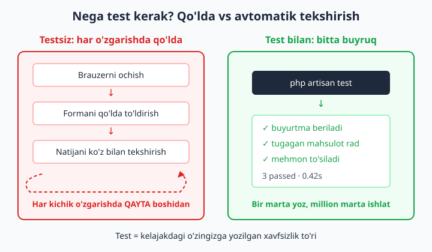
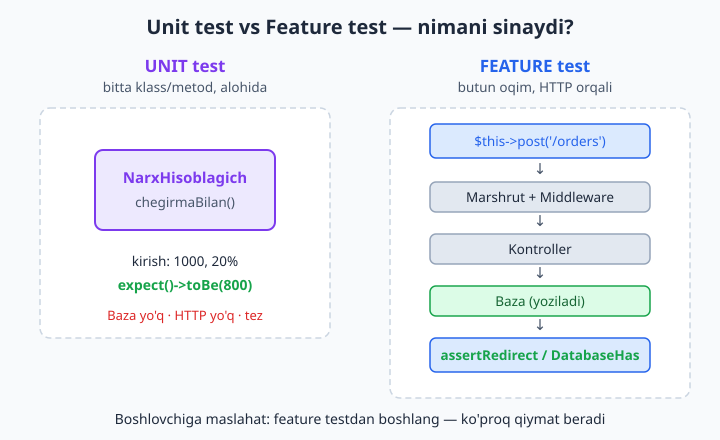
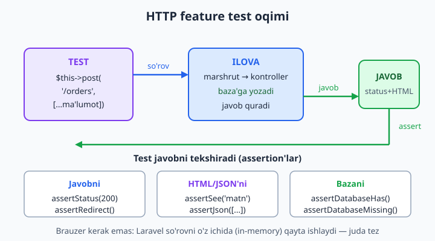
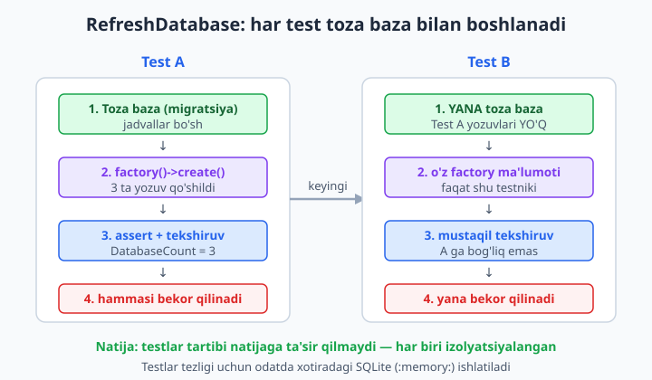

# 22 — Testing (Pest va PHPUnit)

[⬅️ Oldingi: 21 — Events, Listeners va Scheduling](./21-events-scheduling.md) · [🏠 README](./README.md) · [Keyingi: 23 — Caching va performance ➡️](./23-caching-performance.md)

> **Bu bobda:** kod ishlashiga ishonch hosil qilishni va refactoring'ni xavfsiz qilishni o'rganamiz. Avval qo'lda qayta-qayta tekshirishning azobini ko'ramiz, keyin avtomatik test yozamiz: **Pest** (zamonaviy, default sintaksis) va **PHPUnit** bilan tanishamiz, **feature** va **unit** test farqini, `php artisan make:test` ni (`--unit`, `--pest`), HTTP testlarni (`get`/`post`, `assertStatus`, `assertSee`, `assertRedirect`, `assertJson`), `RefreshDatabase` bilan har test uchun toza bazani, factory bilan test ma'lumotini, `actingAs($user)` bilan auth testini, `assertDatabaseHas`/`assertDatabaseMissing` ni, qisqacha mocking'ni, `php artisan test` ni va TDD g'oyasini ko'rib chiqamiz.

---

## Muammo

`OrderController@store` ni yozdingiz: forma keladi, validatsiya o'tadi, baza'ga buyurtma yoziladi, foydalanuvchi `/orders` ga yo'naltiriladi. Ishlayaptimi? Brauzerni ochasiz, formani to'ldirasiz, "Yuborish" bosasiz, sahifani tekshirasiz. Ishladi.

Ertaga `store` ga "agar mahsulot tugagan bo'lsa, xato qaytar" shartini qo'shasiz. Yana brauzer, yana forma, yana qo'lda tekshirish. Ammo endi **eski** xulq-atvor ham buzilmaganiga ishonch kerak: oddiy buyurtma hali ham yoziladimi? Yana qo'lda. Bir oydan keyin loyihada 15 ta kontroller, 40 ta marshrut bo'ladi. Bitta kichik o'zgarish kiritsangiz, **hammasini** qo'lda qayta tekshirish kerakmi?

Bu — har dasturchining tushi. Yechim — **avtomatik test**: kod yozasiz, u sizning ilovangizga xuddi haqiqiy foydalanuvchidek so'rov yuboradi va javobni tekshiradi. Bir marta yozasiz, keyin million marta bir buyruq bilan ishga tushirasiz:

```bash
php artisan test
```

```text
   PASS  Tests\Feature\OrderTest
  ✓ foydalanuvchi buyurtma bera oladi
  ✓ tugagan mahsulotga buyurtma rad etiladi
  ✓ mehmon buyurtma sahifasiga kira olmaydi

  Tests:  3 passed (9 assertions)
  Duration: 0.42s
```

Yashil `PASS` — "hammasi ishlayapti, qo'rqmasdan davom et" degani. Qizil `FAIL` — "nimadir buzildi, mana qaysi joyda". Test — bu sizning kelajakdagi o'zingizga yozgan xavfsizlik to'ri. Laravel test yozishni shu qadar oson qilganki, buni o'rganmaslik — o'zingizga yomonlik.



📌 PHP'ni bilasiz, demak `assert()` g'oyasi tanish: "bu shart ROST bo'lishi kerak, bo'lmasa xato". Test framework xuddi shu g'oyani kengaytiradi — minglab assertion'ni tartibli yozish, ishga tushirish va natijani chiroyli ko'rsatish vositasi.

## Pest va PHPUnit — ikki sintaksis, bitta dvigatel

Laravel'da test yozishning ikki uslubi bor, lekin **ikkalasi ham bir xil dvigatelda** (PHPUnit) ishlaydi:

- **PHPUnit** — klassik, klass-asosli. Har test — `Tests\TestCase` dan meros olgan klassdagi `test`-bilan boshlanadigan metod.
- **Pest** — zamonaviy, funksiya-asosli ustki qatlam. `test()` yoki `it()` funksiyasiga test nomini va closure beradigan ixcham sintaksis. Ostida baribir PHPUnit ishlaydi.

Yangi Laravel loyihalari **Pest** ni default qilib o'rnatadi (`tests/Pest.php` fayli bor). Ikkala uslubni yonma-yon ko'ring — bir xil testni ikki xil yozamiz.

**PHPUnit uslubi** (`tests/Feature/SalomTest.php`):

```php
<?php

namespace Tests\Feature;

use Tests\TestCase;

class SalomTest extends TestCase
{
    public function test_bosh_sahifa_ishlaydi(): void
    {
        $response = $this->get('/');

        $response->assertStatus(200);
    }
}
```

**Pest uslubi** (xuddi shu, lekin sodda):

```php
<?php

test('bosh sahifa ishlaydi', function () {
    $response = $this->get('/');

    $response->assertStatus(200);
});
```

Ko'ryapsizmi — Pest'da klass yo'q, `namespace` yo'q, metod nomi yo'q. Test nomi oddiy o'zbekcha jumla. `$this` — Pest sizga avtomatik beradigan `TestCase` (shuning uchun `$this->get()` ishlaydi). Bu bobda asosan **Pest** dan foydalanamiz (zamonaviy va sodda), lekin PHPUnit ekvivalentini ham eslatib boramiz.

📌 `test('...')` va `it('...')` — bir xil narsa, faqat o'qilish uchun. `it('mehmonni rad etadi', ...)` — "It (ilova) mehmonni rad etadi" deb o'qiladi. Ko'pchilik `it()` ni xulq-atvorni tasvirlash uchun, `test()` ni umumiy holatlar uchun ishlatadi. Tanlov siznida — bu bobda ikkalasini ham ko'rasiz.

💡 Test fayllar `tests/` papkasida ikki katalogga bo'lingan: `tests/Feature/` va `tests/Unit/`. Farqi nimada — keyingi bo'limda.

## Feature vs Unit — qaysi testni qachon yozish

Bu farq boshlovchilarni eng ko'p chalkashtiradigan narsa. Sodda qilib:

- **Unit test** — **bitta** klass yoki metodni alohida, qolgan hammasidan ajratib tekshiradi. Baza yo'q, HTTP yo'q, Laravel'ning katta qismi yuklanmaydi. Tez, lekin tor. Masalan: "narxni 20% chegirma bilan hisoblaydigan metod to'g'ri ishlaydimi?".
- **Feature test** — **butun oqimni** foydalanuvchi nuqtai nazaridan tekshiradi: so'rov keladi → marshrut → middleware → kontroller → baza → javob. Sekinroq, lekin haqiqiy ishlashni isbotlaydi. Masalan: "`POST /orders` haqiqatan ham buyurtma yaratib, foydalanuvchini yo'naltiradimi?".



**Unit test misoli** — toza PHP klassi, Laravel kerak emas:

```php
<?php
// app/Services/NarxHisoblagich.php

namespace App\Services;

class NarxHisoblagich
{
    public function chegirmaBilan(int $narx, int $foiz): int
    {
        return (int) round($narx - ($narx * $foiz / 100));
    }
}
```

Unit testi (`tests/Unit/NarxHisoblagichTest.php`):

```php
<?php

use App\Services\NarxHisoblagich;

test('chegirma narxni to\'g\'ri hisoblaydi', function () {
    $hisoblagich = new NarxHisoblagich();

    expect($hisoblagich->chegirmaBilan(1000, 20))->toBe(800);
});
```

Bu yerda `expect(...)->toBe(...)` — Pest'ning o'qilishi oson **expectation** sintaksisi. "1000 dan 20% chegirma 800 ga teng bo'lishini kutaman". Baza yo'q, so'rov yo'q — shuning uchun tez.

**Feature test misoli** — butun HTTP oqimi:

```php
<?php

test('bosh sahifada xush kelibsiz ko\'rinadi', function () {
    $response = $this->get('/');

    $response->assertStatus(200);
    $response->assertSee('Xush kelibsiz');
});
```

📌 **Qaysi birini ko'proq yozish kerak?** Boshlovchilar uchun maslahat: **feature** testdan boshlang. Ular foydalanuvchi haqiqatan ko'radigan narsani tekshiradi va eng ko'p qiymat beradi. Unit test — murakkab, alohida mantiq (hisob-kitob, format, qoidalar) bo'lganda qo'shing. Aksariyat Laravel loyihalarida feature testlar soni unit testlardan ko'p bo'ladi.

💡 `tests/Unit/` dagi testlar `Tests\TestCase` emas, soddaroq `PHPUnit\Framework\TestCase` dan meros oladi — shuning uchun u yerda `$this->get()` yoki baza ishlamaydi. Agar unit testda baza kerak bo'lsa, demak u aslida feature test — uni `tests/Feature/` ga ko'chiring.

## Birinchi testni yaratish — make:test

Testni qo'lda yozish shart emas — Laravel skeletni yaratib beradi:

```bash
php artisan make:test OrderTest
```

Bu `tests/Feature/OrderTest.php` faylini Pest sintaksisida yaratadi (chunki loyiha Pest'da). Variantlar:

```bash
php artisan make:test NarxTest --unit       # tests/Unit/ ga
php artisan make:test OrderTest --pest       # aniq Pest sintaksisi
php artisan make:test OrderTest --phpunit    # klass-asosli PHPUnit sintaksisi
```

📌 `--unit` faylni `tests/Unit/` ga joylaydi va baza/HTTP ulanmagan soddaroq shablon beradi. `--pest` va `--phpunit` esa sintaksis turini tanlaydi. Hech qaysi flag bermasangiz, loyiha o'rnatilgan default'ni (odatda Pest) ishlatadi.

Yaratilgan fayl shunday ko'rinadi (Pest):

```php
<?php

test('example', function () {
    $response = $this->get('/');

    $response->assertStatus(200);
});
```

`test('example', ...)` ni o'zingizning ma'noli nomingiz va mantiqingizga almashtirasiz. Ishga tushirish:

```bash
php artisan test
```

Yoki faqat bitta faylni:

```bash
php artisan test tests/Feature/OrderTest.php
```

💡 `php artisan test` — aslida `./vendor/bin/pest` (yoki `phpunit`) ustidagi chiroyli o'rovchi. To'g'ridan-to'g'ri `./vendor/bin/pest` ham ishlaydi, lekin `artisan test` Laravel muhitini to'g'ri sozlab beradi — shuni ishlating.

## HTTP testlar — ilovaga so'rov yuborish

Feature testning yuragi — ilovaga **soxta HTTP so'rov** yuborish va javobni tekshirish. Brauzer kerak emas: Laravel so'rovni o'z ichida (in-memory) qayta ishlaydi, juda tez. Asosiy metodlar:

```php
$this->get('/orders');                          // GET so'rov
$this->post('/orders', ['nomi' => 'X']);        // POST so'rov, ma'lumot bilan
$this->put('/orders/1', ['nomi' => 'Yangi']);   // PUT
$this->patch('/orders/1', ['soni' => 5]);       // PATCH
$this->delete('/orders/1');                     // DELETE
```

Har biri **javob obyekti** qaytaradi — uni `assert...` metodlari bilan tekshirasiz:

```php
<?php

test('buyurtmalar sahifasi ishlaydi', function () {
    $response = $this->get('/orders');

    $response->assertStatus(200);            // status kod 200 (OK)
    $response->assertSee('Buyurtmalar');     // HTML'da bu matn bormi
});
```



Eng ko'p ishlatiladigan tekshiruvlar (assertion'lar):

| Assertion | Nimani tekshiradi |
|---|---|
| `assertStatus(200)` | HTTP status kod aniq qiymatda |
| `assertOk()` | Status 200 (qisqartma) |
| `assertSee('matn')` | Javob HTML'ida shu matn bor |
| `assertDontSee('matn')` | Javobda shu matn YO'Q |
| `assertRedirect('/orders')` | Foydalanuvchi shu manzilga yo'naltirildi |
| `assertJson([...])` | JSON javobda shu kalitlar/qiymatlar bor |
| `assertJsonCount(3, 'data')` | JSON'dagi `data` massivida 3 element |
| `assertSessionHasErrors(['nomi'])` | Validatsiya `nomi` uchun xato berdi |

**Redirect testi** (forma yuborilgandan keyin):

```php
<?php

test('buyurtma yaratilgach yo\'naltiradi', function () {
    $response = $this->post('/orders', [
        'mahsulot' => 'Kitob',
        'soni' => 2,
    ]);

    $response->assertRedirect('/orders');
});
```

**JSON API testi**:

```php
<?php

test('api buyurtmani json qaytaradi', function () {
    $response = $this->getJson('/api/orders/1');

    $response->assertStatus(200);
    $response->assertJson([
        'mahsulot' => 'Kitob',
    ]);
});
```

📌 JSON API testlarida `getJson`, `postJson` (oddiy `get`/`post` emas) ishlating: ular `Accept: application/json` sarlavhasini qo'shadi, shuning uchun Laravel xatolarni ham JSON ko'rinishida qaytaradi (HTML redirect emas). API testida `assertJson` va `assertStatus(422)` bilan ishlash ancha qulay.

💡 Bog'lash mumkin (method chaining) — har `assert` o'sha javob obyektini qaytaradi:

```php
$this->get('/orders')
    ->assertOk()
    ->assertSee('Buyurtmalar')
    ->assertDontSee('Xatolik');
```

## RefreshDatabase — har test toza baza bilan

Endi eng muhim qism. Testlar bazaga yozadi (`assertDatabaseHas` ni ko'rasiz). Muammo: agar birinchi test bazaga buyurtma yozsa, ikkinchi test ishga tushganda o'sha buyurtma hali turibdi — testlar bir-biriga **xalal beradi**. Test ketma-ketligi natijaga ta'sir qilsa, bu — yomon test.

Yechim — `RefreshDatabase` trait. U **har bir test boshida** bazani toza holatga qaytaradi: testlarni tranzaksiya ichida bajaradi va test tugagach hammasini bekor qiladi. Natija: har test xuddi yangi, bo'sh bazadan boshlagandek.



**Pest'da** (`tests/Pest.php` da bir marta yoki test boshida):

```php
<?php

use Illuminate\Foundation\Testing\RefreshDatabase;

uses(RefreshDatabase::class);

test('buyurtma bazaga yoziladi', function () {
    $this->post('/orders', [
        'mahsulot' => 'Kitob',
        'soni' => 2,
    ]);

    $this->assertDatabaseHas('orders', [
        'mahsulot' => 'Kitob',
    ]);
});
```

**PHPUnit'da** — `use` qilib trait'ni klassga ulaysiz:

```php
<?php

namespace Tests\Feature;

use Illuminate\Foundation\Testing\RefreshDatabase;
use Tests\TestCase;

class OrderTest extends TestCase
{
    use RefreshDatabase;

    public function test_buyurtma_bazaga_yoziladi(): void
    {
        $this->post('/orders', ['mahsulot' => 'Kitob', 'soni' => 2]);

        $this->assertDatabaseHas('orders', ['mahsulot' => 'Kitob']);
    }
}
```

📌 Testlar **alohida bazada** ishlashi kerak — sizning haqiqiy ma'lumotingizni o'chirmasligi uchun! `phpunit.xml` da odatda `DB_CONNECTION=sqlite` va `DB_DATABASE=:memory:` sozlangan: testlar xotiradagi vaqtinchalik SQLite bazada ishlaydi, juda tez va sizning MySQL bazangizga tegmaydi. `phpunit.xml` ichida shu qatorlar borligini tekshiring:

```text
<env name="DB_CONNECTION" value="sqlite"/>
<env name="DB_DATABASE" value=":memory:"/>
```

💡 `assertDatabaseHas('orders', [...])` — `orders` jadvalida berilgan ustun qiymatlariga mos qator **bormi**. Aksi — `assertDatabaseMissing('orders', [...])` — bunday qator **yo'qmi** (masalan, o'chirilgandan keyin). Yana `assertDatabaseCount('orders', 3)` — jadvalda aniq nechta qator bor.

## Factory bilan test ma'lumoti

Testda ma'lumot kerak: "10 ta buyurtma bo'lsa, sahifada 10 tasi ko'rinishi" kerakligini tekshirmoqchisiz. Har birini qo'lda yozish — azob. 11-bobda o'rgangan **factory** aynan shu uchun:

```php
<?php

use App\Models\Order;

test('sahifada hamma buyurtma ko\'rinadi', function () {
    Order::factory()->count(3)->create();   // 3 ta soxta buyurtma

    $response = $this->get('/orders');

    $response->assertStatus(200);
    $this->assertDatabaseCount('orders', 3);
});
```

`Order::factory()->count(3)->create()` — bazaga 3 ta tasodifiy, lekin to'g'ri tuzilgan buyurtma yozadi. `RefreshDatabase` tufayli bu test tugagach ular yo'qoladi — keyingi testga xalal bermaydi.

Aniq qiymat kerak bo'lsa, `create()` ga massiv bering — u tasodifiylarni ustidan yozadi:

```php
$order = Order::factory()->create([
    'mahsulot' => 'Aniq nom',
    'soni' => 5,
]);

expect($order->soni)->toBe(5);
```

📌 `create()` — bazaga **yozadi** (INSERT). `make()` — obyektni yaratadi, lekin bazaga **yozmaydi** (faqat xotirada). Unit testda baza kerak bo'lmasa `make()`; feature testda odatda `create()`.

💡 Factory'lar bir-biriga bog'lanadi: `Order::factory()->for(User::factory())->create()` — buyurtma uchun avtomatik egasi (user) ham yaratadi. Bu 11-bobda o'rganilgan munosabatli factory'larning kuchi — testda butun bog'liq ma'lumotni bir qatorda quradi.

## Auth testi — actingAs bilan kirgan foydalanuvchi

Ko'p marshrutlar `auth` middleware bilan himoyalangan (15-bob): kirmagan foydalanuvchi `/orders` ga kira olmaydi. Testda har safar haqiqiy login qilish (forma yuborish) noqulay. Laravel `actingAs()` beradi — "bu so'rovni shu foydalanuvchi yuborgandek qil":

```php
<?php

use App\Models\User;

test('kirgan foydalanuvchi buyurtmalarini ko\'radi', function () {
    $user = User::factory()->create();

    $response = $this->actingAs($user)->get('/orders');

    $response->assertStatus(200);
});
```

`actingAs($user)` — keyingi so'rovni shu foydalanuvchi kirgan holda yuboradi. Login formasini yuborish, parol kiritish shart emas.

**Mehmonni tekshirish** (kirmagan foydalanuvchi rad etilishi kerak):

```php
<?php

test('mehmon buyurtmalarga kira olmaydi', function () {
    $response = $this->get('/orders');

    $response->assertRedirect('/login');   // auth middleware login'ga yo'naltiradi
});
```

📌 Bu ikki testning kuchi shunda: birinchisi "ruxsat bor — ishlaydi", ikkinchisi "ruxsat yo'q — to'siladi" ni isbotlaydi. Himoya **ham bor, ham to'g'ri ishlaydi** degan ishonchni faqat shu juftlik beradi. Faqat ijobiy holatni test qilish — yarim ish.

💡 API testlarida (token-asosli, 17-bob) ham `actingAs()` ishlaydi: `$this->actingAs($user, 'sanctum')` — ikkinchi argument guard nomini beradi. Token yaratish/qo'shish bilan ovora bo'lmaysiz.

## Hammasini birlashtirib — to'liq feature test

Endi o'rgangan hamma narsani bitta real testda yig'amiz. "Kirgan foydalanuvchi buyurtma bera oladi va u bazaga yoziladi":

```php
<?php

use App\Models\User;
use Illuminate\Foundation\Testing\RefreshDatabase;

uses(RefreshDatabase::class);

test('foydalanuvchi buyurtma bera oladi', function () {
    $user = User::factory()->create();

    $response = $this->actingAs($user)->post('/orders', [
        'mahsulot' => 'Laravel kitobi',
        'soni' => 1,
    ]);

    $response->assertRedirect('/orders');

    $this->assertDatabaseHas('orders', [
        'user_id' => $user->id,
        'mahsulot' => 'Laravel kitobi',
    ]);
});
```

Bu bitta test to'rt narsani isbotlaydi: (1) kirgan foydalanuvchi marshrutga kira oladi, (2) POST so'rov qabul qilinadi, (3) javob to'g'ri yo'naltiradi, (4) ma'lumot **haqiqatan** bazaga yozildi va to'g'ri foydalanuvchiga bog'landi. Mana shu — feature testning kuchi. Bir marta yozdingiz; endi kontrollerni qancha o'zgartirmang, bu test "buzdingmi yo'qmi" deb bir soniyada javob beradi.

📌 E'tibor bering — biz kontrollerning **ichki** kodini umuman bilmaymiz. Test faqat **tashqi xulq-atvorni** tekshiradi: nima kirdi, nima chiqdi, bazada nima o'zgardi. Shuning uchun kontroller ichini istalgancha refactoring qilsangiz ham (kodni soddalashtirish, tezlashtirish), tashqi natija o'zgarmasa — test yashil qoladi. **Bu refactoring'ni xavfsiz qiladigan asosiy g'oya.**

## Mocking — tashqi xizmatni "soxtalashtirish" (qisqacha)

Ba'zan kod tashqi narsaga bog'liq bo'ladi: email yuboradi, SMS jo'natadi, to'lov tizimiga so'rov yuboradi. Testda **haqiqiy** email yuborishni xohlamaysiz! Yechim — **mock** (soxta): "email yuborilgan deb hisobla, lekin haqiqatan yuborma; faqat yuborilganini tekshir".

Laravel buni ko'p narsa uchun tayyor "fake" bilan beradi. Eng tez-tez kerak bo'ladigani — email:

```php
<?php

use App\Models\User;
use App\Mail\BuyurtmaTasdigi;
use Illuminate\Support\Facades\Mail;

test('buyurtmadan keyin email yuboriladi', function () {
    Mail::fake();   // haqiqiy yuborishni to'xtat, faqat kuzat

    $user = User::factory()->create();

    $this->actingAs($user)->post('/orders', [
        'mahsulot' => 'Kitob',
        'soni' => 1,
    ]);

    Mail::assertSent(BuyurtmaTasdigi::class);   // email yuborildimi
});
```

`Mail::fake()` dan keyin haqiqiy email ketmaydi, lekin `Mail::assertSent()` "yuborilishi kerak edi"ni tasdiqlaydi. Xuddi shunday `Queue::fake()` (job qo'shildimi — 20-bob), `Notification::fake()`, `Event::fake()`, `Storage::fake()` (18-bob — fayl saqlandimi) bor.

💡 Mocking — kuchli, lekin me'yorida ishlating. Qancha ko'p soxtalashtirsangiz, test haqiqiy ilovadan shuncha uzoqlashadi. Qoida: **o'zingiz nazorat qilmaydigan** tashqi xizmatlarni (email serveri, to'lov API, SMS) soxtalashtiring; o'z kodingizni — yo'q.

## TDD — avval test, keyin kod

`PASS`/`FAIL`ni ko'rganingizdan keyin tabiiy savol tug'iladi: testni qachon yozish kerak — kod**dan oldin**mi yoki keyinmi?

**TDD** (Test-Driven Development — test bilan boshqariladigan dasturlash) "avval test" deydi. Sikl uch qadamdan iborat:

1. **Qizil** — hali yo'q xususiyat uchun test yozasiz. U **yiqiladi** (FAIL) — chunki kod yo'q. Bu yaxshi: test haqiqatan biror narsani tekshirayotganini isbotlaydi.
2. **Yashil** — testni o'tkazadigan **eng kam** kodni yozasiz. Endi PASS.
3. **Refactor** — kodni tozalaysiz, soddalashtirasiz. Test yashil qolsa — buzmadingiz.

Keyin keyingi xususiyat uchun yana 1-qadamdan. Afzalligi: kod yozishdan oldin "u nima qilishi kerak"ni aniq o'ylab olasiz va har bir satr kod test bilan qoplangan bo'ladi.

📌 TDD'ni hammasiga majburan qo'llash shart emas. Boshlovchi uchun amaliy maslahat: avval kod yozib, keyin test yozsangiz ham mayli — **muhimi test bo'lsin**. TDD'ni vaqti-vaqti bilan sinab ko'ring (ayniqsa murakkab mantiqda) — ko'pchilik unga vaqt o'tib o'rganadi.

💡 Kuchli TDD odati — **xato topilganda**: avval xatoni ko'rsatadigan test yozing (u yiqiladi), keyin tuzating (test yashil bo'ladi). Shunda o'sha xato **boshqa hech qachon qaytmaydi** — test uni abadiy qo'riqlaydi. Bu "regression testi" deyiladi.

## php artisan test — natijani o'qish

Hamma testlarni ishga tushirish:

```bash
php artisan test
```

Foydali flaglar:

```bash
php artisan test --filter=buyurtma      # nomida "buyurtma" bor testlar
php artisan test tests/Feature/OrderTest.php   # faqat bitta fayl
php artisan test --parallel             # bir nechta yadroda parallel (tez)
php artisan test --coverage             # qancha kod test bilan qoplangani (% da)
```

Natijani o'qish — sodda: yashil `✓` o'tgan testlar, qizil `⨯` yiqilgan testlar. Yiqilganda Laravel **aniq qaysi `assert` yiqilganini va qaysi qatorda ekanini** ko'rsatadi:

```text
   FAIL  Tests\Feature\OrderTest
  ⨯ foydalanuvchi buyurtma bera oladi

  ─── Expected status code 302 but received 200.
  at tests/Feature/OrderTest.php:18
```

Bu xabar deyaplapti: "302 (redirect) kutgan eding, lekin 200 keldi" — demak kontroller yo'naltirmayapti. Test sizga **muammo qayerda** ekanini aytib beradi. Mana shuning uchun test — debugging'ning eng tez yo'li: brauzerni ochib qo'lda tekshirgandan ko'ra, bitta buyruq aniq joyni ko'rsatadi.

📌 CI/CD'da (24-bobda ko'ramiz) `php artisan test` har push'da avtomatik ishga tushadi: agar birorta test yiqilsa, kod asosiy tarmoqqa qo'shilmaydi. Shu tariqa buzuq kod ishlab chiqarishga (production) yetib bormaydi. Test — bu nafaqat sizning, balki butun jamoaning xavfsizlik to'ri.

## Yakuniy maslahat

Test — Laravel'ning eng kam baholangan, lekin eng qaytimli ko'nikmasi. Bir necha amaliy qoida:

- Har yangi marshrut yoki kontroller uchun kamida bitta **feature test** yozing: "ishlaydigan holat" + "rad etiladigan holat".
- `RefreshDatabase` ni feature testlarda har doim ishlating — toza baza muammolarni oldini oladi.
- Ma'lumot kerak bo'lsa **factory** ishlating, qo'lda qatorlar yozmang.
- `actingAs()` bilan auth'ni soddalashtiring.
- Xato topganingizda — **avval testini** yozing, keyin tuzating.
- `php artisan test` ni har o'zgarishdan keyin ishlating; kommit qilishdan oldin albatta.

Keyingi bobda ilovani **tezlashtirishni** — caching va performance optimallashtirishni o'rganamiz. Va, ajablanarlisi, test bu yerda ham asqotadi: tezlashtirish uchun kodni o'zgartirganingizda, testlar "tezlashtirdim, lekin buzmadim"ni isbotlaydi.

## 22-bob mashqlari

Quyidagi mashqlarni o'z loyihangizda (blog yoki do'kon) bajaring. Yechimlarni o'zingiz yozing — har biri oldingisidan bir qadam murakkabroq. Har mashqdan keyin `php artisan test` ni ishga tushirib natijani ko'ring.

1. `php artisan make:test BoshSahifaTest` bilan feature test yarating; yaratilgan fayl `tests/Feature/` da ekanini va Pest sintaksisida (`test('...', function () {...})`) yozilganini tekshiring.
2. Shu testda `$this->get('/')` yuborib `assertStatus(200)` bilan bosh sahifa ishlashini tasdiqlang; `php artisan test` da yashil `PASS` chiqqanini ko'ring.
3. `assertSee('...')` qo'shing: bosh sahifangizdagi haqiqiy matnni (mas. sayt nomi) tekshiring; keyin ataylab noto'g'ri matn yozib testni **yiqitib** ko'ring va xato xabarini o'qing.
4. `php artisan make:test NarxTest --unit` bilan unit test yarating; `tests/Unit/` ga tushganini va u `Tests\TestCase` emas, soddaroq shablon ekanini kuzating.
5. `app/Services/` da chegirma hisoblaydigan kichik klass yozing va uni unit testda `expect(...)->toBe(...)` bilan sinang (baza/HTTP'siz).
6. Yangi feature testga `uses(RefreshDatabase::class)` qo'shing; `phpunit.xml` da `DB_CONNECTION=sqlite` va `:memory:` sozlanganini tekshiring (testlar haqiqiy bazangizga tegmasligi uchun).
7. Bir model uchun factory borligiga ishonch hosil qiling (yo'q bo'lsa `php artisan make:factory`); testda `Model::factory()->count(3)->create()` qilib `assertDatabaseCount(...)` bilan 3 ta yozilganini tasdiqlang.
8. `Model::factory()->create(['ustun' => 'aniq qiymat'])` bilan aniq qiymatli yozuv yarating va `assertDatabaseHas('jadval', ['ustun' => 'aniq qiymat'])` bilan tekshiring.
9. `create()` va `make()` farqini sinang: bittasidan keyin `assertDatabaseCount` 1, ikkinchisidan keyin 0 chiqishini o'z ko'zingiz bilan ko'ring.
10. `it('...', function () {...})` sintaksisida bitta test yozing (`test()` o'rniga) va `php artisan test` natijasida nom qanday ko'rinishini kuzating.
11. `$this->post('/orders', [...])` bilan forma yuboradigan test yozing va `assertRedirect('/orders')` bilan yo'naltirishni tekshiring (kontrolleringiz `store` dan keyin redirect qilsin).
12. Yuqoridagi testga `assertDatabaseHas('orders', [...])` qo'shing: forma yuborilgach ma'lumot **haqiqatan** bazaga yozilganini tasdiqlang.
13. Validatsiya testi yozing: noto'g'ri (bo'sh) forma yuboring va `assertSessionHasErrors(['mahsulot'])` bilan xato qaytganini tekshiring; bazada yangi qator **yo'q**ligini `assertDatabaseMissing` bilan tasdiqlang.
14. `User::factory()->create()` bilan foydalanuvchi yarating; `$this->actingAs($user)->get('/orders')` bilan kirgan foydalanuvchi himoyalangan sahifaga kira olishini sinang.
15. Mehmon (kirmagan) holatini test qiling: `actingAs`'siz `$this->get('/orders')` yuborib `assertRedirect('/login')` kelishini tasdiqlang — himoya ishlayotganini isbotlang.
16. To'liq testni yig'ing: `actingAs` + `post` + `assertRedirect` + `assertDatabaseHas` — kirgan foydalanuvchi buyurtma bergach, u to'g'ri `user_id` bilan yozilganini bitta testda tekshiring.
17. `getJson('/api/...')` bilan API endpointni sinang va `assertJson([...])` hamda `assertStatus(200)` bilan JSON javobni tekshiring (17-bobdagi API'ngizdan foydalaning).
18. API validatsiya testi: yaroqsiz ma'lumot bilan `postJson` yuboring va `assertStatus(422)` hamda `assertJsonValidationErrors(['maydon'])` kelishini tasdiqlang.
19. `Mail::fake()` (yoki `Queue::fake()`) bilan tashqi xizmatni soxtalashtiring; tegishli amaldan keyin `Mail::assertSent(...)` (yoki `Queue::assertPushed(...)`) bilan u "yuborilishi kerak edi"ni tekshiring.
20. TDD'ni amalda sinab ko'ring: avval mavjud bo'lmagan yangi xususiyat uchun test yozing (u **yiqilsin** — qizil), keyin shu testni o'tkazadigan eng kam kodni yozing (yashil), so'ng kodni tozalang (refactor) va test hali yashil ekanini tasdiqlang.
