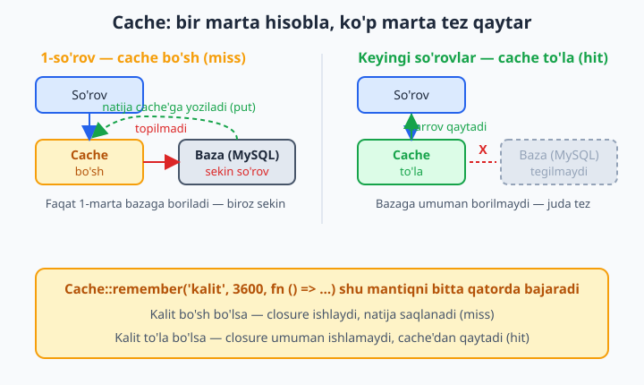
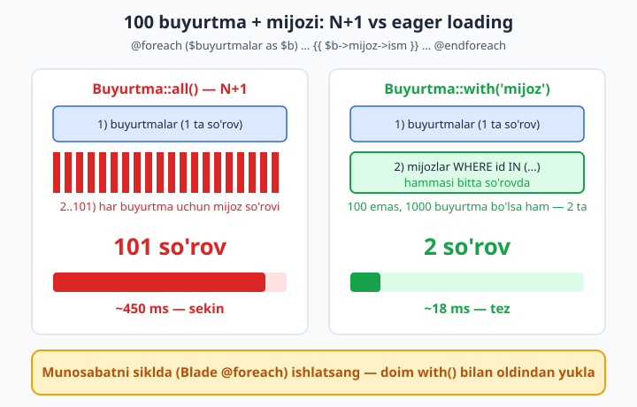
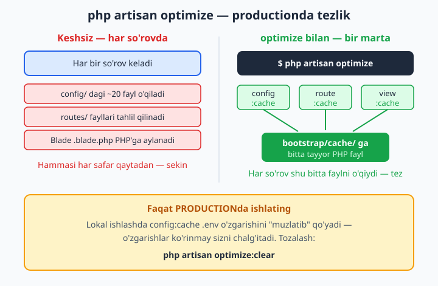

# 23 — Caching va performance

[⬅️ Oldingi: 22 — Testing (Pest va PHPUnit)](./22-testing.md) · [🏠 README](./README.md) · [Keyingi: 24 — Deploy va yakuniy loyiha ➡️](./24-deploy-yakuniy.md)

> **Bu bobda:** ilova foydalanuvchi ko'payganda nega sekinlashishini va uni tezlashtirishning amaliy yo'llarini o'rganamiz. Cache (`Cache::remember`, `get`, `put`, `forget`, `flush`) bilan og'ir hisob-kitobni bir marta bajarib qayta ishlatishni, file/database/Redis driverlarni, productionda `config:cache`/`route:cache`/`view:cache` va bitta `php artisan optimize` buyrug'ini ko'ramiz. So'ng asosiy sekinlik manbai — N+1 muammosini eager loading bilan yo'q qilamiz, `Model::preventLazyLoading` bilan uni dasturlash bosqichida ushlaymiz, database indeksini migratsiyada qo'shamiz, faqat kerakli ustunni `select` qilishni, katta jadvalni `chunk`/`lazy` bilan kichik bo'laklarda qayta ishlashni va `paginate` bilan butun jadvalni xotiraga olmaslikni o'rganamiz. Oxirida Redis'ni cache + session + queue uchun ulaymiz va Telescope bilan so'rovlarni "ko'z bilan" profil qilamiz.

---

## Muammo

Do'koningiz ishga tushdi. Birinchi haftada hammasi yashin tez: bosh sahifa darrov ochiladi, buyurtmalar ro'yxati bir zumda chiqadi. Mahsulotlar 50 ta, buyurtmalar 200 ta.

Olti oydan keyin do'kon o'sdi: 8000 mahsulot, 120 000 buyurtma, kuniga minglab tashrif. Va birdan shikoyatlar keladi — "sayt sekin ochilyapti", "buyurtmalar sahifasi 5 sekund kutadi". Kod o'zgarmadi-ku, nega sekinlashdi?

Sabab oddiy: **kichik ma'lumotda sezilmaydigan samarasizlik, katta ma'lumotda halokatga aylanadi.** Masalan, har so'rovda bazadan og'ir hisobotni qayta hisoblash, yoki har bir buyurtma uchun mijozini alohida-alohida so'rash (N+1), yoki butun jadvalni xotiraga yuklash. 50 qatorda bu hech narsa, 120 000 qatorda — sayt qotadi.

Bu bobda **birinchi qoidani** o'rganamiz: tezlashtirishdan oldin **o'lchang**. Qaysi so'rov sekin, nechta so'rov yuborilayotganini bilmasdan optimallashtirish — qorong'uda o'q otish. Keyin esa tezlashtirishning ikki katta yo'lini ko'ramiz: **takror ishni cache'lash** (bir marta hisoblab saqlash) va **ortiqcha ishni yo'q qilish** (N+1, ortiqcha ustun, butun jadvalni yuklash). Boshlaymiz.

📌 Birinchi maslahat oltin qiymatga ega: **erta optimallashtirmang.** Sekinligi isbotlanmagan kodni "ehtimol kerak bo'lar" deb cache'lab tashlash faqat bug keltiradi (eskirgan ma'lumot ko'rsatish). Avval ishlaydigan, to'g'ri kod yozing; sekinlik paydo bo'lsa — o'lchang, sekin joyni toping, faqat o'shani tuzating.

## Cache nima va `Cache::remember`

Tasavvur qiling, bosh sahifada "eng ko'p sotilgan 10 mahsulot" ko'rsatasiz. Buni hisoblash uchun barcha buyurtma qatorlarini guruhlab, sanab, saralash kerak — og'ir so'rov. Lekin bu ro'yxat har sekundda o'zgarmaydi: bir soatda bir marta yangilansa ham yetadi.

Demak, har tashrifda qayta hisoblash — isrof. Bir marta hisoblab, natijani **tez joyga** (xotira yoki fayl) qo'yib, keyingi so'rovlarda o'sha tayyor natijani qaytarsak — ulkan tejamkorlik. Mana shu **cache**.

Laravel'da eng ko'p ishlatiladigan metod — `Cache::remember`:

```php
use Illuminate\Support\Facades\Cache;
use App\Models\Mahsulot;

$top = Cache::remember('top_mahsulotlar', 3600, function () {
    return Mahsulot::query()
        ->withCount('buyurtmaQatorlari')
        ->orderByDesc('buyurtma_qatorlari_count')
        ->take(10)
        ->get();
});
```

`remember` uch narsa oladi: **kalit** (`'top_mahsulotlar'`), **necha sekund saqlash** (`3600` = 1 soat), va **og'ir ishni bajaradigan closure**. Mantiq:

- Cache'da bu kalit **bor** bo'lsa (hit) — closure umuman ishlamaydi, saqlangan natija darrov qaytadi.
- Cache'da bu kalit **yo'q** bo'lsa (miss) — closure ishlaydi, natijasi cache'ga yoziladi va qaytariladi.



Ya'ni og'ir so'rov soatda **bir marta** ishlaydi, qolgan minglab tashrif tayyor natijani oladi. Closure ichidagi kod faqat miss bo'lganda ishga tushadi — bu juda muhim: cache to'la bo'lsa, bazaga umuman borilmaydi.

💡 Kalit nomi noyob va ma'noli bo'lsin. Ma'lumotga bog'liq cache'da odatda parametrni kalitga qo'shamiz: bitta foydalanuvchi profili uchun `"user_{$id}_profil"`, sahifa bo'yicha `"mahsulotlar_sahifa_{$page}"`. Aks holda har xil ma'lumotni bitta kalit ostiga aralashtirib yuborasiz.

## Cache'ning boshqa metodlari: `get`, `put`, `has`, `forget`, `flush`

`remember` — eng qulay yorliq, lekin ostida oddiy "yoz/o'qi" metodlar turibdi:

```php
// Yozish (3-argument — sekundlar; bermasangiz "abadiy"ga yaqin):
Cache::put('valyuta_kursi', 12650, 600);   // 10 daqiqa saqla

// O'qish (yo'q bo'lsa null yoki 2-argumentdagi default):
$kurs = Cache::get('valyuta_kursi');          // null bo'lishi mumkin
$kurs = Cache::get('valyuta_kursi', 12000);   // yo'q bo'lsa 12000

// Bormi?
if (Cache::has('valyuta_kursi')) {
    // ...
}

// Bittasini o'chirish:
Cache::forget('valyuta_kursi');

// Abadiy saqlash (muddatsiz) va keyin majburan tozalash:
Cache::forever('sayt_sozlamalari', $sozlamalar);
```

📌 `Cache::remember` aslida shu uchtaning birikmasi: `has` bilan tekshiradi, bo'lsa `get`, bo'lmasa closure'ni ishga tushirib `put` qiladi. Ya'ni quyidagi ikki blok bir xil ishni qiladi — lekin `remember` toza va xatosiz:

```php
// ❌ Qo'lda — uzun va xatoga moyil:
if (Cache::has('top_mahsulotlar')) {
    $top = Cache::get('top_mahsulotlar');
} else {
    $top = Mahsulot::query()->take(10)->get();
    Cache::put('top_mahsulotlar', $top, 3600);
}

// ✅ remember bilan — bir qatorda, xuddi shu mantiq:
$top = Cache::remember('top_mahsulotlar', 3600, fn () => Mahsulot::take(10)->get());
```

💡 Hech qachon eskirmasligi kerak bo'lmagan, lekin ma'lumot o'zgarganda yangilansin desangiz — `Cache::rememberForever('kalit', $closure)` ishlating va ma'lumot o'zgarganda `Cache::forget('kalit')` qiling. Buni keyinroq "cache'ni qachon tozalash" bo'limida ko'ramiz.

## Cache invalidatsiya — eng qiyin qism

Dasturlashda mashhur hazil bor: "Kompyuter fanidagi ikki qiyin narsa — cache invalidatsiya va nomlarni tanlash". Cache'ning xavfi shu: **ma'lumot o'zgardi, lekin cache eski qiymatni saqlab turibdi.** Mahsulot narxini o'zgartirdingiz, lekin bosh sahifa hali eskisini ko'rsatyapti.

Yechim: ma'lumotni o'zgartirgan joyda cache'ni ham yangilang. Eng oson — bog'liq kalitni `forget` qilish:

```php
public function update(MahsulotYangilashRequest $request, Mahsulot $mahsulot)
{
    $mahsulot->update($request->validated());

    // Narx o'zgardi — top ro'yxat cache'i endi eski. Tozalaymiz:
    Cache::forget('top_mahsulotlar');

    return redirect()->route('mahsulotlar.show', $mahsulot);
}
```

📌 Eng sof yondashuv — cache'ni Model eventiga bog'lash, shunda qaysi joydan o'zgartirsangiz ham cache avtomatik tozalanadi. Buni `Mahsulot` modelida `booted` orqali qilish mumkin:

```php
protected static function booted(): void
{
    static::saved(fn () => Cache::forget('top_mahsulotlar'));
    static::deleted(fn () => Cache::forget('top_mahsulotlar'));
}
```

💡 Hamma narsani bir zarbada tozalash — `Cache::flush()`. Lekin ehtiyot bo'ling: u **butun** cache'ni (boshqa kalitlarni ham) o'chiradi. Faqat zarur bo'lganda (masalan, deploy paytida) ishlating, oddiy update'da emas.

## Cache driverlari: file, database, Redis

Cache'ni qayerga saqlash kerak? Buni **driver** belgilaydi. `.env`da bitta qator:

```env
CACHE_STORE=file
```

| Driver | Qayerda saqlaydi | Qachon |
|---|---|---|
| `file` | `storage/framework/cache` ichidagi fayllar | Lokal ishlash, kichik bitta serverli sayt. Default. |
| `database` | `cache` jadvali | Redis yo'q bo'lsa, sodda joyda saqlash kerak bo'lsa |
| `redis` | Redis serveri (xotirada) | Production, ko'p server, eng tez. Tavsiya etiladi. |
| `array` | Joriy so'rov xotirasida (so'rov tugashi bilan yo'qoladi) | Faqat test uchun |

`database` driveri uchun avval cache jadvali kerak. Laravel'da tayyor migratsiya bor:

```bash
php artisan make:cache-table
php artisan migrate
```

📌 `array` driveri testlarda juda qulay: har test boshida cache toza bo'ladi, fayl/Redis kerak emas. `phpunit.xml` yoki `.env.testing`da `CACHE_STORE=array` qo'ying.

💡 Eng tez variant — **Redis**. U cache'ni diskka emas, **operativ xotiraga** saqlaydi va shu sababli o'qish/yozish chaqmoqday tez. Ko'p serverli ilovada esa file driver umuman yaramaydi (har server o'z faylini ko'radi), Redis esa hammaga umumiy bo'ladi. Redis'ni bob oxirida ulaymiz.

## Asosiy sekinlik manbai: N+1 muammosi (takror)

Ko'p hollarda sayt sekinligining asosiy aybdori — cache yetishmasligi emas, balki **bitta sahifa yuzlab keraksiz so'rov yuborishi**. Bu N+1 muammosi. 9- va 10-boblarda ko'rgan edik, lekin u shu qadar muhimki, performance bobida takror eslatmasdan bo'lmaydi.

Buyurtmalar ro'yxatini, har birining mijozi bilan ko'rsatamiz:

```php
// ❌ Controllerda:
$buyurtmalar = Buyurtma::latest()->take(100)->get();
```

```blade
{{-- ❌ Blade'da har buyurtma uchun mijoz alohida so'raladi: --}}
@foreach ($buyurtmalar as $buyurtma)
    <li>#{{ $buyurtma->id }} — {{ $buyurtma->mijoz->ism }}</li>
@endforeach
```

`$buyurtma->mijoz` birinchi marta chaqirilganda Laravel bazaga `SELECT * FROM mijozlar WHERE id = ?` so'rovini yuboradi. Sikl 100 marta aylanadi — demak **100 ta qo'shimcha so'rov**, ustiga boshidagi 1 ta. Jami 101 so'rov. 1000 buyurtmada 1001 so'rov!

Yechim — **eager loading**: bog'lanishni oldindan, `with()` bilan yuklash:

```php
// ✅ with() bilan — mijozlar oldindan, bitta so'rovda yuklanadi:
$buyurtmalar = Buyurtma::with('mijoz')->latest()->take(100)->get();
```

Endi Laravel atigi 2 so'rov yuboradi: biri buyurtmalar uchun, ikkinchisi `SELECT * FROM mijozlar WHERE id IN (...)` — barcha kerakli mijozni bir zarbada. 100 ham, 10 000 ham bo'lsin — doim 2 so'rov.



📌 Bir nechta munosabatni birga yuklash mumkin, ichma-ich ham:

```php
// Buyurtma + mijozi + har buyurtmaning qatorlari + ularning mahsuloti:
$buyurtmalar = Buyurtma::with(['mijoz', 'qatorlar.mahsulot'])->get();
```

💡 Faqat sanog'i kerak bo'lsa — butun munosabatni yuklamang, `withCount` ishlating. "Har mijozning nechta buyurtmasi bor" uchun mijozlarning hamma buyurtmasini yuklash isrof:

```php
$mijozlar = Mijoz::withCount('buyurtmalar')->get();
// endi $mijoz->buyurtmalar_count mavjud — qo'shimcha so'rovsiz
```

## N+1'ni dasturlashda ushlash: `preventLazyLoading`

N+1'ning yomon tomoni — u **jim** ishlaydi. Sahifa to'g'ri ko'rinadi, faqat sekin. Kichik ma'lumotda umuman sezmaysiz, productionda ma'lumot o'sgach portlaydi. Buni qanday oldindan ushlash mumkin?

Laravel'da ajoyib himoya bor: **lazy loading'ni butunlay taqiqlash**. Agar kodingiz oldindan yuklamagan munosabatga murojaat qilsa — Laravel jim so'rov yubormaydi, balki **xato tashlaydi**. Shunda N+1'ni darhol ko'rasiz.

Buni `AppServiceProvider`ning `boot` metodida yoqamiz:

```php
use Illuminate\Database\Eloquent\Model;

public function boot(): void
{
    Model::preventLazyLoading(! $this->app->isProduction());
}
```

`! isProduction()` — ya'ni **faqat lokal/test** muhitda yoqiladi, productionda yoqilmaydi (real foydalanuvchiga xato chiqmasligi uchun). Endi `with()`siz munosabatga tegsangiz, lokal ishlashda darrov xato olasiz:

```text
Illuminate\Database\LazyLoadingViolationException:
Attempted to lazy load [mijoz] on model [App\Models\Buyurtma]
but lazy loading is disabled.
```

📌 Bu xato — sizning do'stingiz. U "shu yerda `with('mijoz')` qo'yishni unutding" deb to'g'ridan-to'g'ri aytadi. Dasturlash bosqichida ushlangan N+1 — productionda sekinlikka aylanmaydi.

💡 Ba'zan munosabatni vaqtincha qo'lda yuklash kerak bo'ladi (oldindan yuklamagan bo'lsangiz) — `load()`. Bu N+1 emas, chunki butun to'plamga **bir marta** ishlaydi:

```php
$buyurtmalar = Buyurtma::latest()->get();
// ... shartga qarab kerak bo'lsa:
$buyurtmalar->load('mijoz');   // hammasiga bitta so'rov, N+1 emas
```

## Database indeks — sekin so'rovni tezlashtirish

Cache va eager loading yetmaganda, keyingi qadam — bazaning o'zini tezlashtirish. Eng kuchli vosita — **indeks**.

Tasavvur qiling, 120 000 qatorli `buyurtmalar` jadvalida `WHERE mijoz_id = 5` qidiryapsiz. Indekssiz baza **har bir qatorni** ko'zdan kechiradi (full table scan) — 120 000 tekshiruv. Indeks esa kitobning orqasidagi alifbo ko'rsatkichiga o'xshaydi: bazaga `mijoz_id = 5`ni darrov topishga yordam beradi, hamma qatorni ko'rmasdan.

Qoida: **`WHERE`, `ORDER BY` yoki `JOIN`da tez-tez ishlatadigan ustunga indeks qo'ying.** Foreign key ustunlari (`mijoz_id`, `mahsulot_id`) deyarli har doim indeks talab qiladi.

Migratsiyada indeksni shunday qo'shamiz:

```php
public function up(): void
{
    Schema::table('buyurtmalar', function (Blueprint $table) {
        $table->index('mijoz_id');          // oddiy indeks
        $table->index(['holat', 'created_at']); // birikma indeks
    });
}
```

📌 `foreignId('mijoz_id')->constrained()` bilan ustun yaratganingizda Laravel FK uchun indeksni **avtomatik** qo'shadi — alohida `index()` shart emas. Lekin oddiy `unsignedBigInteger('mijoz_id')` bilan qo'lda yaratsangiz, indeksni o'zingiz qo'shasiz.

💡 Indeks tekin emas: u o'qishni tezlatadi, lekin har `INSERT`/`UPDATE`da yangilanishi kerak — ya'ni yozishni biroz sekinlashtiradi va joy egallaydi. Shuning uchun "har ehtimolga qarshi hamma ustunga indeks" — xato. Faqat haqiqatan tez-tez qidiriladigan ustunga qo'ying. Qaysi so'rov sekinligini bilish uchun keyingi bo'limdagi profil vositalaridan foydalaning.

## Faqat kerakli ustunni oling: `select`

Default holatda Eloquent `SELECT *` qiladi — barcha ustunni. Agar jadvalda og'ir ustunlar bo'lsa (uzun `matn`, `json`, `blob`), lekin sizga faqat `id` va `nomi` kerak bo'lsa — qolganini tortib kelish isrof:

```php
// ❌ Hammasini oladi (og'ir tavsif ustuni ham keladi):
$mahsulotlar = Mahsulot::all();

// ✅ Faqat kerakligini:
$mahsulotlar = Mahsulot::select(['id', 'nomi', 'narx'])->get();
```

📌 Munosabat bilan ishlatganda ehtiyot bo'ling: `select`da foreign key ustunini **qoldirmang**, aks holda munosabat ulanmaydi. Masalan `mijoz` munosabatini yuklamoqchi bo'lsangiz, `mijoz_id` ustuni `select`da bo'lishi shart:

```php
// mijoz munosabati uchun mijoz_id kerak:
Buyurtma::select(['id', 'mijoz_id', 'summa'])->with('mijoz')->get();
```

💡 Faqat bitta ustun ro'yxati kerak bo'lsa — `pluck` undan ham yengil, butun model obyektini yasamaydi:

```php
$nomlar = Mahsulot::pluck('nomi');          // ['Olma', 'Non', ...]
$narxlar = Mahsulot::pluck('narx', 'id');   // [1 => 5000, 2 => 8000, ...]
```

## Katta ma'lumotni bo'lib qayta ishlash: `chunk` va `lazy`

Endi tasavvur qiling, 200 000 mahsulotning hammasiga biror amal qilish kerak (masalan, narxni qayta hisoblash yoki hisobot eksporti). Bunday yozish — falokat:

```php
// ❌ 200 000 modelni BIRDAN xotiraga yuklaydi — xotira tugaydi:
foreach (Mahsulot::all() as $mahsulot) {
    // ...
}
```

`all()` butun jadvalni xotiraga oladi. 200 000 model obyekti — yuzlab megabayt RAM, "Allowed memory size exhausted" xatosi. Yechim — **bo'laklab** ishlash. `chunk` ma'lumotni N tadan olib keladi, har bo'lakdan keyin xotirani bo'shatadi:

```php
// ✅ 500 tadan oladi, har bo'lakni qayta ishlab keyingisiga o'tadi:
Mahsulot::chunk(500, function ($mahsulotlar) {
    foreach ($mahsulotlar as $mahsulot) {
        // har biri bilan ishlash
    }
});
```

📌 Agar sikl ichida **qayta ishlayotgan ustunni o'zgartirsangiz** (masalan, `holat`ni `WHERE holat = 'yangi'` bo'yicha filtrlay turib yangilasangiz), `chunk` qatorlarni o'tkazib yuborishi mumkin. Bunday holda `chunkById` ishlating — u `id` bo'yicha barqaror saralaydi va xavfsiz:

```php
Mahsulot::where('holat', 'yangi')->chunkById(500, function ($mahsulotlar) {
    foreach ($mahsulotlar as $mahsulot) {
        $mahsulot->update(['holat' => 'korildi']);
    }
});
```

💡 Yana toza variant — `lazy()`. U `LazyCollection` qaytaradi: tashqaridan oddiy `foreach`day ko'rinadi, lekin ichida ma'lumotni bo'laklab oladi, butun jadvalni xotiraga olmaydi:

```php
foreach (Mahsulot::lazy() as $mahsulot) {
    // bitta-bitta keladi, xotira to'lmaydi
}
```

## Pagination — butun ro'yxatni yuklamaslik

Foydalanuvchiga 50 000 buyurtmani bitta sahifada ko'rsatmaysiz — hech kim 50 000 qatorni skroll qilmaydi va brauzer ham qotadi. Faqat bir sahifalik (masalan 20 ta) ko'rsatib, qolganiga "keyingi sahifa" havolasi berasiz. Bu — **pagination**, va u performance uchun ham muhim: baza har safar faqat 20 qator oladi.

```php
// Controllerda — get() emas, paginate():
$buyurtmalar = Buyurtma::with('mijoz')->latest()->paginate(20);
```

```blade
{{-- Blade'da ro'yxat + havolalar: --}}
@foreach ($buyurtmalar as $buyurtma)
    <li>#{{ $buyurtma->id }} — {{ $buyurtma->mijoz->ism }}</li>
@endforeach

{{ $buyurtmalar->links() }}
```

`paginate(20)` orqada `LIMIT 20 OFFSET ...` qo'shadi — bazadan faqat 20 qator keladi, butun jadval emas. `links()` esa "1 2 3 ... Keyingi" tugmalarini chizadi.

📌 Juda katta jadvalda (millionlab qator) oddiy `paginate` "jami nechta sahifa" uchun `COUNT(*)` so'rovi yuboradi, bu ham sekin bo'lishi mumkin. Agar "jami soni" kerak bo'lmasa — `simplePaginate(20)` ishlating: u faqat "Oldingi/Keyingi" beradi, `COUNT` so'rovini qilmaydi, demak tezroq.

## Productionda config, route va view cache

Yuqoridagilar — kodingizdagi sekinlikni tuzatadi. Endi **deploy paytidagi** bepul tezlik: Laravel productionda har so'rovda config fayllarni o'qiydi, route'larni tahlil qiladi, Blade shablonlarni PHP'ga aylantiradi. Bularni **oldindan bir marta** keshlab qo'yib, har so'rovda qayta o'qimaslik mumkin.

```bash
php artisan config:cache   # barcha config'ni bitta faylga birlashtiradi
php artisan route:cache    # route'larni keshlaydi
php artisan view:cache     # Blade shablonlarni oldindan kompilyatsiya qiladi
php artisan event:cache    # event-listener xaritasini keshlaydi
```

To'rttasini alohida yozish o'rniga bitta buyruq hammasini qiladi:

```bash
php artisan optimize
```



📌 **Faqat productionda!** `config:cache`ni lokal ishlashda qilsangiz, `.env`dagi o'zgarishlar "muzlab" qoladi: faylni o'zgartirasiz, lekin sayt eski qiymatni ko'rsatib sizni chalg'itadi. Lokal ishlashda bu keshlarni umuman yoqmang.

💡 Keshlarni tozalash — teskari buyruqlar. Hammasini bir zarbada:

```bash
php artisan optimize:clear
```

❌ `config:cache` yoqilgan bo'lsa, kodda `env('BIROR_NARSA')`ni **to'g'ridan-to'g'ri ishlatmang** — config keshlanganda `env()` `null` qaytaradi. Doim `config('xizmat.kalit')` orqali o'qing, `.env` qiymatini esa faqat `config/*.php` fayllari ichida `env()` bilan oling. Bu Laravel'ning qat'iy qoidasi.

```php
// ❌ Controllerda yoki modelda — config:cache bilan buziladi:
$key = env('TOLOV_KALIT');

// ✅ config/services.php ichida env() o'qiladi, kodda config() ishlatiladi:
$key = config('services.tolov.kalit');
```

## Redis — cache, session va queue uchun tez

Productionda eng katta umumiy tezlik — **Redis**ga o'tish. Redis — operativ xotirada ishlaydigan tez ma'lumot ombori. Uni uch joyda ishlatish mumkin: cache, session va queue. Hammasi diskga emas, xotiraga boradi — natijada chaqmoqday tez.

Avval PHP uchun Redis mijozi kerak. Laravel'ning sof PHP varianti — Predis paketi:

```bash
composer require predis/predis
```

So'ng `.env`da driverlarni Redis'ga o'tkazasiz:

```env
CACHE_STORE=redis
SESSION_DRIVER=redis
QUEUE_CONNECTION=redis

REDIS_CLIENT=predis
REDIS_HOST=127.0.0.1
REDIS_PORT=6379
REDIS_PASSWORD=null
```

Tamom — kodingizda hech narsa o'zgarmaydi. `Cache::remember(...)` bir xil, lekin endi natija Redis xotirasiga saqlanadi. Sessiya ham, navbatdagi job'lar ham (20-bobdan) Redis orqali ketadi.

📌 Nega bularning hammasi Redis'da? **Cache** — tez o'qish kerak. **Session** — ko'p serverli ilovada hamma server bir xil sessiyani ko'rishi kerak (file driver buni eplay olmaydi). **Queue** — `database` driver navbatni jadvaldan "so'rab-so'rab" oladi (polling), Redis esa ancha tez va yengil. Uchchalasi uchun Redis — to'g'ri tanlov.

💡 Redis o'rnatilmagan bo'lsa, lokal ishlashda Docker bilan bir buyruqda ko'tarish mumkin: `docker run -p 6379:6379 redis`. Yoki Laravel Sail ishlatsangiz, Redis allaqachon konteynerlar orasida keladi.

## So'rovlarni "ko'z bilan" ko'rish: Debugbar va Telescope

Bularning hammasini qildik — lekin **qaysi sahifa nechta so'rov yuborayotganini** qanday bilamiz? Taxmin qilmaymiz — o'lchaymiz. Ikki mashhur vosita bor.

**Laravel Debugbar** — sahifa pastida panel chiqaradi: nechta so'rov yuborildi, har biri qancha vaqt oldi, qaysi biri takrorlangan. N+1'ni darrov ko'rsatadi (bir xil so'rov 100 marta — qizil bayroq):

```bash
composer require barryvdh/laravel-debugbar --dev
```

`--dev` muhim: bu faqat dasturlash vositasi, productionga hech qachon o'rnatilmasin.

**Laravel Telescope** — kuchliroq panel (`/telescope` sahifasi): har so'rov, har baza so'rovi, job, mail, xato — hammasini yozib boradi va ko'rsatadi:

```bash
composer require laravel/telescope --dev
php artisan telescope:install
php artisan migrate
```

📌 Telescope ham asosan **lokal/staging** uchun. Productionda yoqsangiz, faqat ruxsatli adminlarga ochiq qilib (`TelescopeServiceProvider`dagi `gate`) va ma'lumotni muntazam tozalab turing (`telescope:prune`) — aks holda jurnal jadvali shishadi.

💡 Optimallashtirishning to'g'ri tartibi: **(1) o'lchang** (Debugbar/Telescope bilan sekin so'rovni toping) → **(2) tuzating** (N+1'ni `with` bilan, sekin so'rovni indeks bilan, takror hisobni cache bilan) → **(3) qayta o'lchang** (haqiqatan tezlashganiga ishonch hosil qiling). Taxminga emas, o'lchovga tayaning.

## Yakuniy xulosa — tezlashtirish ketma-ketligi

Sayt sekinlashganda shu tartibda harakat qiling:

1. **O'lchang.** Debugbar/Telescope bilan qaysi sahifa, qaysi so'rov sekinligini aniqlang. Taxmin qilmang.
2. **N+1'ni yo'q qiling.** Eng ko'p uchraydigan muammo. `with()` qo'ying, `preventLazyLoading` bilan oldini oling.
3. **Indeks qo'shing.** `WHERE`/`ORDER BY`/`JOIN`dagi sekin ustunga migratsiyada indeks.
4. **Ortiqcha ma'lumotni kesing.** `select` bilan kerakli ustun, `paginate` bilan sahifalash, katta amalga `chunk`.
5. **Takror og'ir ishni cache'lang.** `Cache::remember`, o'zgarganda `forget`.
6. **Productionda `php artisan optimize`** va imkon bo'lsa **Redis**.

📌 Eng muhim dars: optimallashtirish — bu "hamma joyga cache tashlash" emas. Bu **o'lchash, sekin joyni topish va aniq tuzatish** jarayoni. Toza, to'g'ri kod — birinchi; tezlik — o'lchovga asoslangan ikkinchi qadam.

Keyingi va oxirgi bobda hamma o'rganganlarimizni birlashtirib, ilovani real serverga **deploy** qilamiz va yakuniy loyihani yig'amiz.

## 23-bob mashqlari

Quyidagi mashqlarni o'zingiz bajaring. Aksariyati avvalgi boblardagi do'kon (mahsulotlar, mijozlar, buyurtmalar) loyihasida ishlaydi — agar hali ko'p ma'lumot yo'q bo'lsa, 11-bobdagi factory/seeder bilan minglab qator yarating, shunda sekinlikni va tezlikni o'z ko'zingiz bilan ko'rasiz.

1. `Cache::remember` bilan bosh sahifadagi "eng so'nggi 10 mahsulot" ro'yxatini 10 daqiqaga keshlang. Closure ichiga `logger('bazaga borildi')` qo'ying va sahifani bir necha marta yangilab, log faqat birinchi marta yozilishini tasdiqlang.
2. Bitta valyuta kursini `Cache::put` bilan 600 sekundga saqlang, `Cache::get` bilan o'qing, `Cache::has` bilan borligini tekshiring, so'ng `Cache::forget` bilan o'chiring.
3. `Cache::remember` ishlatadigan kodni faqat `get`/`has`/`put` bilan qo'lda qayta yozing, so'ng teskarisini — qo'lda yozilganni `remember`ga qisqartiring. Ikkalasi bir xil natija berishiga ishonch hosil qiling.
4. Mahsulot narxini o'zgartiradigan `update` metodida tegishli cache kalitini `forget` qiling. Narxni o'zgartirgach, keshlangan ro'yxat darrov yangilanishini tekshiring.
5. `Mahsulot` modelida `booted()` orqali `saved` va `deleted` eventlariga cache tozalashni bog'lang. Endi qaysi joydan o'zgartirsangiz ham cache yangilanishini sinab ko'ring.
6. `.env`da `CACHE_STORE`ni `file`dan `database`ga o'tkazing. `make:cache-table` va `migrate` qilib, cache'ning `cache` jadvalida saqlanishini tekshiring.
7. Buyurtmalar ro'yxatini har birining mijozi bilan, `with()`siz ko'rsatadigan sahifa yozing. Debugbar yoki `DB::getQueryLog()` bilan yuborilgan so'rovlar sonini sanang.
8. Xuddi shu sahifaga `with('mijoz')` qo'shing va so'rovlar soni 2 ga tushganini tasdiqlang. So'rovlar sonidagi farqni yozib qo'ying.
9. Ichma-ich munosabatni eager yuklang: `Buyurtma::with(['mijoz', 'qatorlar.mahsulot'])`. Blade'da hammasini ko'rsating va N+1 yo'qligini tekshiring.
10. "Har mijozning nechta buyurtmasi bor"ni avval munosabatni to'liq yuklab (yomon), so'ng `withCount('buyurtmalar')` bilan (yaxshi) yozing. So'rovlar sonidagi farqni o'lchang.
11. `AppServiceProvider::boot`da `Model::preventLazyLoading(! $this->app->isProduction())`ni yoqing. `with()`siz munosabatga teging va `LazyLoadingViolationException` chiqishini ko'ring, so'ng `with()` qo'shib tuzating.
12. Oldindan yuklamagan to'plamga `->load('mijoz')` ishlatib, uning N+1 emasligini (butun to'plamga bitta so'rov) DB so'rov logi bilan tasdiqlang.
13. `buyurtmalar` jadvalining `mijoz_id` ustuniga migratsiyada `index()` qo'shing. `foreignId(...)->constrained()` allaqachon indeks yaratishini va qo'lda yaratilgan FK indekssiz qolishini taqqoslang.
14. Ko'p ishlatiladigan ikki ustunli filtr uchun birikma indeks qo'shing: `$table->index(['holat', 'created_at'])`. Indeksdan oldin va keyin so'rov tezligini taxminan solishtiring.
15. `Mahsulot::all()`ni `Mahsulot::select(['id', 'nomi', 'narx'])->get()`ga o'zgartiring. So'ng `with('kategoriya')` qo'shganda `kategoriya_id`ni `select`ga kiritishni unutib, munosabat ulanmay qolishini ataylab ko'ring va tuzating.
16. Faqat mahsulot nomlari ro'yxati kerak bo'lganda `pluck('nomi')` ishlating; so'ng `pluck('narx', 'id')` bilan `id => narx` massivini oling.
17. Katta jadvalga `Mahsulot::all()` bilan `foreach` yozib, xotira muammosini his qiling (ko'p ma'lumotda), so'ng uni `chunk(500, ...)`ga o'tkazing.
18. Sikl ichida filtrlangan ustunni yangilaydigan amalni `chunk` bilan yozib, ba'zi qator o'tkazib yuborilishini ko'ring, so'ng `chunkById`ga o'tkazib muammoni hal qiling.
19. Buyurtmalar ro'yxatiga `paginate(20)` va Blade'da `{{ $buyurtmalar->links() }}` qo'shing; so'ng "jami soni" kerak bo'lmagan holatda `simplePaginate(20)`ga o'tib, `COUNT` so'rovi yo'qolganini tekshiring.
20. Laravel Telescope'ni `--dev` bilan o'rnating, `/telescope` ochib eng sekin so'rovni toping va uni shu bobdagi usullardan biri (indeks, `with`, `select` yoki cache) bilan tezlashtiring; oldin va keyingi vaqtni yozib qo'ying.
