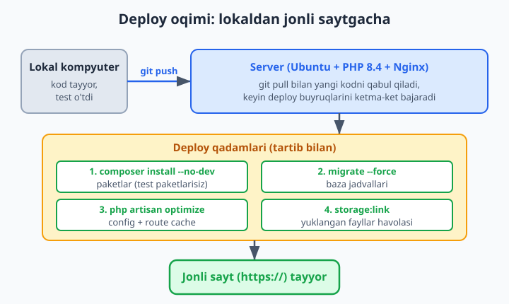
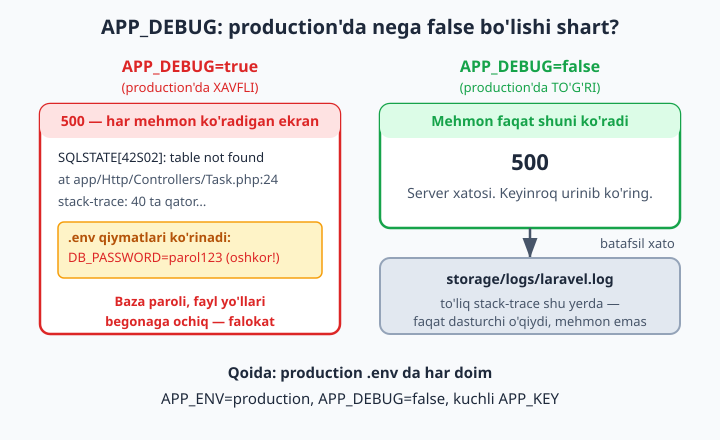
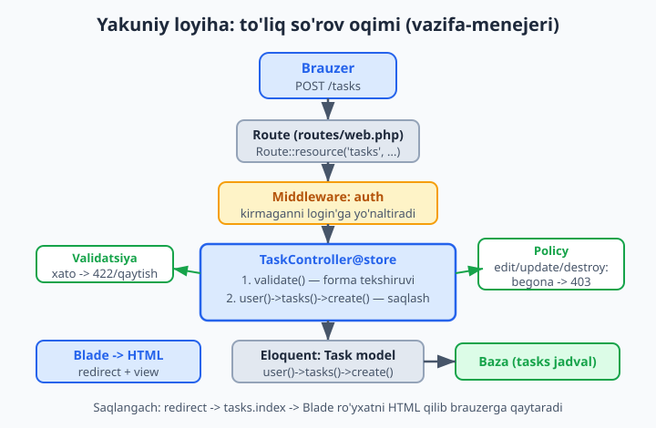

# 24 — Deploy va yakuniy loyiha

[⬅️ Oldingi: 23 — Caching va performance](./23-caching-performance.md) · [🏠 README](./README.md)

> **Bu bobda:** o'rgangan hamma narsani bitta to'liq ilovaga jamlab, uni internetga chiqaramiz. Avval real server talablarini (PHP 8.4, Composer, baza, web server), keyin production uchun xavfsiz `.env` ni (`APP_ENV=production`, `APP_DEBUG=false`, kuchli `APP_KEY`) ko'rib chiqamiz. Keyin deploy qadamlarini — `composer install --no-dev`, `migrate --force`, `optimize`, `storage:link` — birma-bir bajaramiz, Nginx + PHP-FPM ni sozlaymiz va boshqariladigan platformalar (Laravel Forge, Cloud, Vapor) bilan tanishamiz. So'ngra **yakuniy loyiha** — vazifa-menejerini noldan, migration'dan deploy'gacha bosqichma-bosqich quramiz. Oxirida HTTPS, zero-downtime g'oyasi va keyingi yo'l (Livewire, Inertia, Filament, paket yozish) haqida gaplashamiz.

---

## Muammo

Ilovangiz `localhost`da chiroyli ishlayapti. Lekin `php artisan serve` faqat sizning kompyuteringizda, faqat siz ochiq turganda ishlaydi. Do'stingizga ko'rsatmoqchisiz — link bera olmaysiz. Mijoz "sayt qani?" deydi — ko'rsatadigan manzil yo'q.

Internetga chiqarish — **deploy** (joylashtirish) — yangi qiyinchiliklar olib keladi:

- Kompyuteringizda PHP, Composer, baza tayyor turibdi. Serverda esa **hech narsa yo'q** — hammasini siz o'rnatasiz.
- `localhost`da xato chiqsa, butun stack-trace ekranda ko'rinadi — bu qulay. Lekin internetda har bir mehmon shu xatoni, hatto baza parolini ko'rsa — bu falokat.
- `php artisan serve` bitta so'rovni qabul qiladi. Internetda bir vaqtning o'zida yuzlab odam kirishi mumkin — bunga **Nginx + PHP-FPM** kerak.
- Yangi versiya yuklayotganda sayt bir lahza "buzilib" qolmasligi kerak — foydalanuvchi buni sezmasligi lozim.

Sof PHP'da bularning hammasini qo'lda, har loyihada qaytadan yozardingiz. Laravel esa deploy uchun aniq, tartibli qadamlar va tayyor buyruqlar beradi. Bu bob ikki qismdan iborat: avval **qanday deploy qilish**, keyin **nimani deploy qilish** — ya'ni o'rgangan bilimni jamlaydigan to'liq loyiha.



## Server nima talab qiladi?

Laravel 13 ilovasini ishga tushirish uchun serverda quyidagilar bo'lishi shart:

- **PHP 8.4** (Laravel 13 minimal PHP 8.3 talab qiladi, lekin 8.4 tavsiya etiladi) — kerakli kengaytmalar bilan: `pdo`, `mbstring`, `openssl`, `tokenizer`, `xml`, `ctype`, `json`, `bcmath`, `curl`, `fileinfo`.
- **Composer** — paketlarni o'rnatish uchun (1-bobdan tanish).
- **Ma'lumotlar bazasi** — MySQL, PostgreSQL yoki MariaDB. Kichik loyihaga SQLite ham yetadi.
- **Web server** — Nginx (tavsiya) yoki Apache, PHP-FPM bilan birga.

📌 Lokal kompyuteringizda bularning hammasi allaqachon bor (2-bobda o'rnatgansiz). Serverda esa toza Linux (odatda Ubuntu) turadi — siz xuddi shu narsalarni qo'lda yoki Forge kabi vosita orqali o'rnatasiz.

💡 Kerakli PHP kengaytmalari to'liq mavjudligini tekshirish uchun serverda bitta buyruq yetadi:

```bash
php -m
```

Bu PHP'da yoqilgan barcha kengaytmalar ro'yxatini chiqaradi. Ro'yxatda `pdo_mysql`, `mbstring`, `openssl` borligiga ishonch hosil qiling — biror biri yo'q bo'lsa, ilova ishlamaydi.

## Production `.env` — eng muhim fayl

`localhost`da `.env` faylingiz "yumshoq" sozlangan: xatolar ko'rinadi, debug yoqilgan. Internetda esa bu **xavfsizlik teshigi**. Production uchun `.env` butunlay boshqacha bo'lishi kerak:

```env
APP_NAME="Vazifa Menejeri"
APP_ENV=production
APP_KEY=base64:KUCHLI_TASODIFIY_KALIT_BU_YERDA
APP_DEBUG=false
APP_URL=https://mening-saytim.uz

DB_CONNECTION=mysql
DB_HOST=127.0.0.1
DB_PORT=3306
DB_DATABASE=vazifalar
DB_USERNAME=app_user
DB_PASSWORD=juda_kuchli_parol

SESSION_DRIVER=database
CACHE_STORE=database
QUEUE_CONNECTION=database
```

Bu yerda **uchta qator hayot-mamot ahamiyatiga ega**:

📌 **`APP_DEBUG=false`** — eng muhim sozlama. Agar bu `true` qolsa, har qanday xato yuz berganda Laravel butun stack-trace'ni, fayl yo'llarini, hatto `.env` qiymatlarini (baza paroli, API kalitlari) **ekranda har bir mehmonga** ko'rsatadi. Production'da bu doim `false` bo'lishi shart. `false` bo'lganda foydalanuvchi faqat chiroyli "500 — Server Error" sahifasini ko'radi, batafsil xato esa `storage/logs/laravel.log` ga yoziladi.

📌 **`APP_ENV=production`** — Laravel'ga "men jonli serverdaman" deb aytadi. Ba'zi xavfsizlik tekshiruvlari va ogohlantirishlar shunga qarab ishlaydi.

📌 **`APP_KEY`** — sessiya va shifrlangan ma'lumotlarni himoyalaydigan kalit. Bu **bo'sh bo'lmasligi** va kuchli (tasodifiy) bo'lishi kerak. Yangi kalit yaratish:

```bash
php artisan key:generate
```

❌ `.env` faylini **hech qachon** Git'ga qo'ymang. Standart Laravel loyihasida `.gitignore` allaqachon `.env` ni o'z ichiga oladi — buni o'chirmang. Baza paroli va kalitlar Git tarixiga tushib qolsa, ularni butunlay yangilashga to'g'ri keladi.

✅ Buning o'rniga `.env.example` faylini Git'da saqlang — unda qiymatlarsiz, faqat kalit nomlari turadi. Serverda undan nusxa olib (`cp .env.example .env`), haqiqiy qiymatlar bilan to'ldirasiz.



## Deploy qadamlari — birma-bir

Kod serverga yetib bordi (odatda `git clone` yoki `git pull` orqali). Endi uni "tiriltirish" uchun aniq tartibda quyidagi buyruqlar bajariladi. Har birini alohida ko'rib chiqamiz.

### 1-qadam: paketlarni o'rnatish

```bash
composer install --no-dev --optimize-autoloader
```

`composer install` — `composer.json` dagi paketlarni o'rnatadi (lokal'da ham shunday qilgansiz). Lekin production'da ikkita muhim bayroq qo'shamiz:

- **`--no-dev`** — faqat ishlash uchun zarur paketlarni o'rnatadi, test va debug paketlarini (`require-dev` bo'limidagilar — masalan Pest, Faker, Debugbar) **o'tkazib yuboradi**. Serverda test kerak emas, ular faqat joy va xavfsizlik xavfini oshiradi.
- **`--optimize-autoloader`** — Composer'ning klass-qidirish jadvalini oldindan tuzib qo'yadi, shunda har so'rovda klasslar tezroq topiladi.

📌 `--no-dev` bilan o'rnatganingizdan keyin Faker yoki Pest ishlatadigan kodni production'da chaqirsangiz, "class not found" xatosi chiqadi. Shuning uchun seeder'lardagi `fake()` faqat lokal/test uchun — production migratsiyasida ishlatilmaydi.

### 2-qadam: migratsiyalarni bajarish

```bash
php artisan migrate --force
```

Bu baza jadvallarini yaratadi/yangilaydi (7-bobdan tanish). Yangi bayroq:

📌 **`--force`** — production'da (`APP_ENV=production`) Laravel migratsiyani bajarishdan oldin "Rostdan ham? Bu jonli baza!" deb so'raydi, chunki migratsiya ma'lumotni o'zgartirishi mumkin. `--force` bu savolni o'tkazib yuboradi — avtomatik deploy skriptlari uchun zarur, chunki u yerda javob beradigan odam yo'q.

❌ `migrate:fresh` yoki `migrate:refresh` ni production'da **hech qachon** ishlatmang — ular barcha jadvalni o'chirib qaytadan yaratadi, ya'ni hamma real ma'lumot yo'qoladi. Production'da faqat `migrate --force` (yangi migratsiyalarni qo'shadi, eskisiga tegmaydi).

### 3-qadam: optimallashtirish (cache)

```bash
php artisan optimize
```

Bu bitta buyruq bir nechta cache yaratadi: konfiguratsiya (`config:cache`), marshrutlar (`route:cache`), hodisalar (`event:cache`). Natijada Laravel har so'rovda config va route fayllarini qaytadan o'qimaydi — oldindan tuzilgan tezkor nusxani ishlatadi. Bu production'da sezilarli tezlik beradi.

📌 **Diqqat:** `config:cache` ishlaganidan keyin Laravel `.env` ni **boshqa o'qimaydi** — faqat cache'langan config'ni ishlatadi. Shuning uchun `.env` ni o'zgartirsangiz, cache'ni yangilash shart:

```bash
php artisan optimize:clear
php artisan optimize
```

💡 Lokal'da rivojlanayotganda `optimize` ishlatmang — config'ni har o'zgartirganda cache eskirib, "nega o'zgarishim ko'rinmayapti?" degan jumboq paydo bo'ladi. `optimize` — faqat production uchun.

### 4-qadam: storage havolasi

```bash
php artisan storage:link
```

18-bobdan eslang: foydalanuvchi yuklagan fayllar `storage/app/public` da turadi, lekin brauzer faqat `public/` papkani ko'radi. Bu buyruq `public/storage` → `storage/app/public` simvolik havolasini yaratib, fayllarni brauzerga ochadi. Yangi serverda bu havola yo'q — shuning uchun deploy'da bir marta bajariladi.

### Hammasini birga — deploy skripti

Amalda bu qadamlar bitta skriptga jamlanadi. Mana tipik `deploy.sh`:

```bash
#!/bin/bash
set -e   # biror buyruq xato bersa, butun skript to'xtaydi

git pull origin main
composer install --no-dev --optimize-autoloader
php artisan migrate --force
php artisan optimize
php artisan storage:link
php artisan queue:restart   # eski queue worker'larni yangi kod bilan qayta ishga tushirish
```

📌 `set -e` muhim: agar `composer install` xato bersa, skript shu yerda to'xtaydi va buzuq kod bilan `migrate` qilib qo'ymaydi.

📌 `php artisan queue:restart` — 20-bobni eslang: queue worker'lar fon jarayoni sifatida uzluksiz ishlaydi va eski kodni xotirada saqlaydi. Bu buyruq ularga "joriy ishni tugatib, yangi kod bilan qayta tug'iling" signalini beradi.

## Web server: Nginx + PHP-FPM

`php artisan serve` — faqat rivojlanish uchun. Production'da **Nginx** so'rovlarni qabul qiladi va PHP fayllarni **PHP-FPM** ga uzatadi. Tipik Nginx konfiguratsiyasi:

```text
server {
    listen 80;
    server_name mening-saytim.uz;
    root /var/www/vazifalar/public;   # DIQQAT: public/ ga ishora qiladi

    index index.php;

    location / {
        try_files $uri $uri/ /index.php?$query_string;
    }

    location ~ \.php$ {
        fastcgi_pass unix:/var/run/php/php8.4-fpm.sock;
        fastcgi_param SCRIPT_FILENAME $realpath_root$fastcgi_script_name;
        include fastcgi_params;
    }
}
```

📌 **Eng muhim qator: `root .../public`**. Web server ildizi loyiha papkasiga emas, balki uning ichidagi `public/` papkaga ishora qilishi **shart**. Faqat `public/` brauzerga ochiq bo'ladi — `.env`, `app/`, `vendor/` esa yashirin qoladi. Agar `root` ni loyiha ildiziga qo'ysangiz, har kim `mening-saytim.uz/.env` ni ochib baza parolingizni o'qiy oladi — bu jiddiy xato.

📌 **`try_files ... /index.php`** — Laravel'ning "bitta kirish nuqtasi" (single entry point) tamoyili: barcha so'rovlar `public/index.php` orqali o'tadi, u esa marshrutlarga (3-bobdagi `routes/`) yo'naltiradi.

## Boshqariladigan platformalar — osonroq yo'l

Nginx, PHP-FPM, SSL'ni qo'lda sozlash mumkin, lekin bu vaqt va xatolar olib keladi. Laravel jamoasi buni yengillashtiradigan rasmiy vositalar taklif qiladi:

- **Laravel Forge** — siz oddiy VPS server (DigitalOcean, Hetzner va h.k.) berasiz, Forge unga Nginx, PHP, MySQL, SSL'ni o'rnatib, deploy tugmasini beradi. Server siznikida qoladi, sozlash Forge'da.
- **Laravel Cloud** — to'liq boshqariladigan platforma: server umuman ko'rinmaydi, siz faqat kodni push qilasiz, qolganini platforma qiladi (avtomatik masshtablash bilan).
- **Laravel Vapor** — AWS'da "serversiz" (serverless) deploy. Juda katta yuklamaga avtomatik moslashadi, lekin sozlash murakkabroq.

💡 Boshlovchi uchun tartib shunday: avval **qo'lda** (VPS + Nginx) bir marta deploy qilib, ichki mexanikani his qiling. Keyin real loyihalarda **Forge** yoki **Cloud** bilan vaqtni tejang. Sehrni tushunmasdan turib avtomatlashtirishga ishonmaslik kerak.

## HTTPS — majburiy talab

Bugun HTTPS (qulfli yashil "https://") — majburiy. Usiz brauzerlar "Bu sayt xavfsiz emas" ogohlantirishini ko'rsatadi, login parollari shifrlanmagan holda uzatiladi.

Yaxshi yangilik: **bepul**. **Let's Encrypt** sertifikatlari tekin va Forge/Cloud avtomatik o'rnatadi. Qo'lda esa `certbot` vositasi bir buyruqda hal qiladi.

Laravel tomonida bitta sozlash kerak: `.env` da `APP_URL` ni `https://` bilan yozing va `AppServiceProvider` da production'da HTTPS'ni majburlang:

```php
namespace App\Providers;

use Illuminate\Support\Facades\URL;
use Illuminate\Support\ServiceProvider;

class AppServiceProvider extends ServiceProvider
{
    public function boot(): void
    {
        if ($this->app->environment('production')) {
            URL::forceScheme('https');
        }
    }
}
```

📌 `URL::forceScheme('https')` — Laravel yaratadigan barcha havolalar (`route()`, `url()`, asset URL'lar) `https://` bilan boshlanishini kafolatlaydi. Busiz aralash (mixed) kontent muammosi chiqishi mumkin: sahifa HTTPS, lekin ichidagi rasm HTTP — brauzer bloklab qo'yadi.

## Zero-downtime g'oyasi

"Zero-downtime deploy" — yangi versiyani chiqarganda saytning bir lahza ham "o'lmasligi". Oddiy deploy'da `git pull` paytida fayllar yarmi yangi, yarmi eski bo'lib, foydalanuvchi xato ko'rishi mumkin.

Asosiy g'oya — **atomik almashtirish**: yangi versiya butunlay alohida papkaga tayyorlanadi, faqat hammasi tayyor bo'lgach, bitta lahzada "joriy" havolasi yangi papkaga o'tkaziladi:

```text
/var/www/vazifalar/
├── releases/
│   ├── 2026-06-10-153000/   <- eski versiya
│   └── 2026-06-11-100000/   <- yangi versiya (to'liq tayyor)
├── current -> releases/2026-06-11-100000/   <- bitta havola almashadi
└── shared/
    ├── .env                  <- versiyalar orasida umumiy
    └── storage/              <- yuklangan fayllar yo'qolmaydi
```

📌 Forge, Cloud, Vapor va Envoyer kabi vositalar buni avtomatik qiladi. Qo'lda qilish murakkab, shuning uchun boshlovchi uchun: avval oddiy deploy bilan boshlang (kichik sayt uchun bir necha soniya "downtime" katta muammo emas), keyin loyiha o'sganda zero-downtime'ga o'ting.

---

## YAKUNIY LOYIHA: vazifa-menejeri (noldan deploy'gacha)

Endi eng qiziq qism — o'rgangan hamma narsani bitta loyihada birlashtiramiz. Quramiz: oddiy **vazifa-menejeri** (task manager). Har foydalanuvchi tizimga kiradi (auth), o'z vazifalarini qo'shadi, ko'radi, tahrirlaydi, o'chiradi (CRUD), faqat o'zinikini ko'radi (avtorizatsiya), forma tekshiriladi (validatsiya), kodni test bilan tasdiqlaymiz va deploy qilamiz.

Bu — kichraytirilgan, lekin **to'liq** Laravel ilova skeleti. Real loyihalar (blog, do'kon, CRM) aynan shu qatlamlardan iborat.



### 1-bosqich: loyihani yaratish

```bash
laravel new vazifalar
cd vazifalar
php artisan migrate
```

📌 `laravel new` so'raganda autentifikatsiya starter kit'ni (masalan Livewire yoki React) tanlash mumkin — bu bizga tayyor login/register sahifalarini beradi (13-bobdan tanish). Bu yerda mantiqni ko'rsatish uchun starter kit borligini nazarda tutamiz; siz tanlamagan bo'lsangiz, `routes/web.php` da oddiy auth marshrutlari ham yetadi.

### 2-bosqich: migratsiya (jadval tuzilishi)

Vazifalar jadvalini yaratamiz:

```bash
php artisan make:model Task -m
```

`-m` migratsiyani ham yaratadi. Migratsiya faylini to'ldiramiz (7-bobdan tanish):

```php
use Illuminate\Database\Migrations\Migration;
use Illuminate\Database\Schema\Blueprint;
use Illuminate\Support\Facades\Schema;

return new class extends Migration
{
    public function up(): void
    {
        Schema::create('tasks', function (Blueprint $table) {
            $table->id();
            $table->foreignId('user_id')->constrained()->cascadeOnDelete();
            $table->string('title');
            $table->text('description')->nullable();
            $table->boolean('is_done')->default(false);
            $table->timestamps();
        });
    }

    public function down(): void
    {
        Schema::dropIfExists('tasks');
    }
};
```

📌 `foreignId('user_id')->constrained()->cascadeOnDelete()` — har vazifa bitta foydalanuvchiga tegishli; foydalanuvchi o'chsa, uning vazifalari ham o'chadi (9-bobdagi munosabat va 7-bobdagi cascade).

```bash
php artisan migrate
```

### 3-bosqich: model va munosabat

`app/Models/Task.php`:

```php
namespace App\Models;

use Illuminate\Database\Eloquent\Model;
use Illuminate\Database\Eloquent\Relations\BelongsTo;

class Task extends Model
{
    protected $fillable = ['title', 'description', 'is_done'];

    protected function casts(): array
    {
        return ['is_done' => 'boolean'];
    }

    public function user(): BelongsTo
    {
        return $this->belongsTo(User::class);
    }
}
```

`app/Models/User.php` ga teskari munosabatni qo'shamiz:

```php
use Illuminate\Database\Eloquent\Relations\HasMany;

public function tasks(): HasMany
{
    return $this->hasMany(Task::class);
}
```

📌 `$fillable` da `user_id` yo'q — buni ataylab qildik: foydalanuvchi formada `user_id` jo'natib boshqaning vazifasini "egallab" olmasligi uchun (8-bobdagi mass-assignment himoyasi). `user_id` ni kodda, ishonchli manbadan (`$request->user()`) o'rnatamiz.

### 4-bosqich: marshrut va kontroller

```bash
php artisan make:controller TaskController --resource --model=Task
```

`routes/web.php`:

```php
use App\Http\Controllers\TaskController;

Route::resource('tasks', TaskController::class)
    ->middleware('auth');
```

📌 `->middleware('auth')` — barcha vazifa marshrutlari faqat tizimga kirganlarga ochiq (15-bobdagi middleware). Tashqaridan kirmoqchi bo'lgan login sahifasiga yo'naltiriladi.

Kontroller (`app/Http/Controllers/TaskController.php`) — yurakdagi mantiq:

```php
namespace App\Http\Controllers;

use App\Models\Task;
use Illuminate\Http\Request;
use Illuminate\Http\RedirectResponse;
use Illuminate\Support\Facades\Gate;
use Illuminate\View\View;

class TaskController extends Controller
{
    public function index(Request $request): View
    {
        $tasks = $request->user()->tasks()->latest()->get();

        return view('tasks.index', ['tasks' => $tasks]);
    }

    public function create(): View
    {
        return view('tasks.create');
    }

    public function store(Request $request): RedirectResponse
    {
        $data = $request->validate([
            'title' => ['required', 'string', 'max:255'],
            'description' => ['nullable', 'string'],
        ]);

        $request->user()->tasks()->create($data);

        return redirect()->route('tasks.index')
            ->with('status', 'Vazifa qoshildi.');
    }

    public function edit(Task $task): View
    {
        Gate::authorize('update', $task);

        return view('tasks.edit', ['task' => $task]);
    }

    public function update(Request $request, Task $task): RedirectResponse
    {
        Gate::authorize('update', $task);

        $data = $request->validate([
            'title' => ['required', 'string', 'max:255'],
            'description' => ['nullable', 'string'],
            'is_done' => ['boolean'],
        ]);

        $task->update($data);

        return redirect()->route('tasks.index')
            ->with('status', 'Vazifa yangilandi.');
    }

    public function destroy(Task $task): RedirectResponse
    {
        Gate::authorize('delete', $task);

        $task->delete();

        return redirect()->route('tasks.index')
            ->with('status', 'Vazifa ochirildi.');
    }
}
```

📌 `$request->user()->tasks()->create($data)` — vazifa avtomatik joriy foydalanuvchiga bog'lanadi, `user_id` qo'lda yozilmaydi. Bu yondashuv mass-assignment xavfini ham, xatoni ham yo'qotadi.

📌 `$request->user()->tasks()->latest()->get()` — `index` faqat **joriy foydalanuvchining** vazifalarini oladi. Boshqaning vazifasi umuman so'ralmaydi — bu birinchi himoya qatlami.

### 5-bosqich: avtorizatsiya (Policy)

Ikkinchi himoya qatlami — Policy (14-bobdan tanish). U `edit`/`update`/`destroy` da "bu aynan o'sha foydalanuvchimi?" deb tekshiradi:

```bash
php artisan make:policy TaskPolicy --model=Task
```

`app/Policies/TaskPolicy.php`:

```php
namespace App\Policies;

use App\Models\Task;
use App\Models\User;

class TaskPolicy
{
    public function update(User $user, Task $task): bool
    {
        return $user->id === $task->user_id;
    }

    public function delete(User $user, Task $task): bool
    {
        return $user->id === $task->user_id;
    }
}
```

📌 `$user->id === $task->user_id` — vazifa egasi joriy foydalanuvchi bo'lsagina `true`. Kontrollerdagi `Gate::authorize('update', $task)` shu metodni chaqiradi; mos kelmasa Laravel `403 Forbidden` qaytaradi. Shunday qilib, URL'da boshqaning vazifa ID'sini qo'lda yozsa ham (masalan `/tasks/99/edit`), tizim ruxsat bermaydi.

### 6-bosqich: Blade ko'rinishlari

`resources/views/tasks/index.blade.php`:

```blade
@extends('layouts.app')

@section('content')
    <h1>Mening vazifalarim</h1>

    @if (session('status'))
        <p style="color:green">{{ session('status') }}</p>
    @endif

    <a href="{{ route('tasks.create') }}">+ Yangi vazifa</a>

    <ul>
        @forelse ($tasks as $task)
            <li>
                <strong>{{ $task->title }}</strong>
                @if ($task->is_done) (bajarildi) @endif

                <a href="{{ route('tasks.edit', $task) }}">Tahrirlash</a>

                <form action="{{ route('tasks.destroy', $task) }}" method="POST"
                      style="display:inline">
                    @csrf
                    @method('DELETE')
                    <button type="submit">Ochirish</button>
                </form>
            </li>
        @empty
            <li>Hali vazifa yoq. Birinchisini qoshing!</li>
        @endforelse
    </ul>
@endsection
```

`resources/views/tasks/create.blade.php`:

```blade
@extends('layouts.app')

@section('content')
    <h1>Yangi vazifa</h1>

    <form action="{{ route('tasks.store') }}" method="POST">
        @csrf

        <label>Sarlavha</label>
        <input type="text" name="title" value="{{ old('title') }}">
        @error('title')
            <p style="color:red">{{ $message }}</p>
        @enderror

        <label>Tavsif</label>
        <textarea name="description">{{ old('description') }}</textarea>

        <button type="submit">Saqlash</button>
    </form>
@endsection
```

📌 `@method('DELETE')` — HTML formalar faqat GET/POST'ni biladi, shuning uchun DELETE/PUT uchun bu yashirin maydon kerak (5 va 6-boblardan tanish). `@csrf` esa har formada — busiz `419` xatosi chiqadi.

📌 `old('title')` — validatsiya o'tmay forma qaytsa, foydalanuvchi yozgani yo'qolmaydi (12-bobdan tanish).

### 7-bosqich: test

Deploy'dan oldin asosiy oqimni test bilan tasdiqlaymiz (22-bobdan tanish). Pest test:

```php
use App\Models\Task;
use App\Models\User;

test('foydalanuvchi vazifa qosha oladi', function () {
    $user = User::factory()->create();

    $response = $this->actingAs($user)->post('/tasks', [
        'title' => 'Sut sotib olish',
        'description' => 'Magazindan',
    ]);

    $response->assertRedirect('/tasks');

    $this->assertDatabaseHas('tasks', [
        'title' => 'Sut sotib olish',
        'user_id' => $user->id,
    ]);
});

test('foydalanuvchi boshqaning vazifasini ochira olmaydi', function () {
    $egasi = User::factory()->create();
    $begona = User::factory()->create();
    $task = Task::factory()->for($egasi)->create();

    $response = $this->actingAs($begona)->delete("/tasks/{$task->id}");

    $response->assertForbidden();   // 403
    $this->assertDatabaseHas('tasks', ['id' => $task->id]);   // ochirilmagan
});
```

```bash
php artisan test
```

📌 Ikkinchi test — eng muhimi: avtorizatsiya **haqiqatan** ishlashini tasdiqlaydi. Begona foydalanuvchi `403` oladi va vazifa o'chmaydi. Bu testsiz, xavfsizlik teshigini sezmay qolish oson.

### 8-bosqich: deploy

Endi bobning birinchi qismidagi qadamlar bilan loyihani serverga chiqaramiz:

```bash
# Serverda, birinchi marta:
git clone https://github.com/foydalanuvchi/vazifalar.git
cd vazifalar
cp .env.example .env
# .env ni production qiymatlari bilan to'ldiring (APP_DEBUG=false va h.k.)
composer install --no-dev --optimize-autoloader
php artisan key:generate
php artisan migrate --force
php artisan optimize
php artisan storage:link
```

Nginx'ni `public/` ga yo'naltiring, HTTPS'ni yoqing — va sayt jonli! Keyingi har yangilanishda yuqoridagi `deploy.sh` skriptini ishlatasiz.

✅ Tabriklaymiz — siz to'liq Laravel ilovani noldan deploy'gacha qurdingiz: migration -> model -> munosabat -> controller -> validatsiya -> avtorizatsiya -> Blade -> test -> deploy. Bu skelet ustiga endi xohlagan loyihangizni qurishingiz mumkin.

## Keyingi yo'l — bu yer manzil emas, boshlanish

Kitob tugadi, lekin Laravel olami katta. Mana qayerga borish mumkin:

- **Livewire / Inertia.js** — JavaScript yozmasdan (Livewire) yoki Vue/React bilan (Inertia) zamonaviy, "jonli" interfeyslar yaratish. Sahifa qayta yuklanmasdan yangilanadi.
- **Filament** — admin-panel va boshqaruv interfeyslarini deyarli kod yozmasdan quradigan kuchli vosita. CRUD panellar daqiqalarda tayyor bo'ladi.
- **Paket yozish** — o'z kodingizni qayta ishlatiladigan Composer paketiga aylantirib, butun jamiyat bilan ulashish.
- **Chuqurroq mavzular** — Broadcasting (real-time), Octane (juda yuqori tezlik), Horizon (queue boshqaruvi), Pennant (feature flags), Telescope (debug).

💡 Eng yaxshi o'rganish yo'li — **real loyiha qurish**. O'zingizga kerakli bir narsani (shaxsiy blog, byudjet hisoblagich, kichik do'kon) tanlang va uni boshidan oxirigacha quring. Tiqilib qolganingizda rasmiy hujjat (laravel.com/docs) va bu kitobning tegishli bobiga qayting. Omad!

## 24-bob mashqlari

Quyidagi mashqlarni bajaring — birinchilari deploy konfiguratsiyasiga, oxirgilari to'liq loyiha qurishga oid. Har biri oldingisidan bir qadam murakkabroq. Yechimlarini o'zingiz yozing.

1. Yangi loyiha yaratib, `.env` faylidan nusxa oling (`.env.production` deb) va undagi `APP_ENV` ni `production`, `APP_DEBUG` ni `false` qiling; ikki fayl orasidagi farqni o'zingiz uchun ro'yxatlang.
2. Loyihada ataylab xato yarating (masalan kontrollerda mavjud bo'lmagan metod chaqiring). `APP_DEBUG=true` da brauzerda nima ko'rinishini, `APP_DEBUG=false` da nima ko'rinishini solishtiring va farqni yozib qoying.
3. `php artisan key:generate` ni ishlating va `.env` dagi `APP_KEY` o'zgarganini tekshiring; kalit `base64:` bilan boshlanishini tasdiqlang.
4. `.gitignore` faylida `.env` borligini tekshiring; `git status` bajarib `.env` "untracked" ro'yxatida **ko'rinmasligiga** ishonch hosil qiling.
5. `php artisan optimize` ni ishlatib `bootstrap/cache/` ichida config va route cache fayllari paydo bo'lganini ko'ring; keyin `php artisan optimize:clear` bilan ularni tozalang va papka bo'shaganini tekshiring.
6. `config:cache` qilingandan keyin `.env` da `APP_NAME` ni o'zgartiring va saytda o'zgarish **ko'rinmasligini** kuzating; `optimize:clear` dan keyin o'zgarish ko'rinishini tasdiqlang (bu nega muhimligini izohlang).
7. `composer install --no-dev` ni ishlating va `vendor/` ichida `pestphp` yoki `fakerphp` papkalari **yo'qolganini** tekshiring; keyin oddiy `composer install` bilan ular qaytib kelishini ko'ring.
8. Test bazasi yaratib (yoki SQLite), `php artisan migrate --force` ni ishlating; `--force` siz `production` muhitida buyruq tasdiq so'rashini kuzating.
9. `php artisan storage:link` ni ishlating va `public/storage` simvolik havolasi yaratilganini tekshiring; havolani o'chirib qayta yaratib ko'ring.
10. `AppServiceProvider::boot()` da production'da `URL::forceScheme('https')` ni qo'shing; `app('env')` qiymatini o'zgartirib, faqat `production` da bu ishlashini tekshiring.
11. Yuqoridagi `deploy.sh` skriptini yozing, `set -e` qatorini qo'shing va biror buyruqni ataylab xato qilib, skript shu yerda to'xtashini tasdiqlang.
12. Nginx konfiguratsiya namunasini yozing va `root` qatorini loyiha ildiziga (`public/` siz) qo'yib ko'ring — `.env` brauzerda ochilishini (lokal sinov serverida) kuzating, keyin `root` ni `public/` ga qaytaring.
13. Yakuniy loyihani boshlang: `Task` modeli va migratsiyasini `user_id`, `title`, `description`, `is_done` ustunlari bilan yarating va `migrate` qiling.
14. `Task` modeliga `belongsTo(User::class)` va `User` modeliga `hasMany(Task::class)` munosabatlarini qo'shing; Tinker'da `User::first()->tasks` ishlashini tekshiring.
15. `TaskController` ni `--resource --model=Task` bilan yarating va `Route::resource('tasks', ...)->middleware('auth')` ni qo'shing; `php artisan route:list --path=tasks` bilan 7 marshrutni ko'ring.
16. `store` metodida validatsiya (`title` majburiy, `max:255`) qo'shing va `$request->user()->tasks()->create(...)` orqali vazifani joriy foydalanuvchiga bog'lang; brauzerda yangi vazifa qo'shib sinang.
17. `TaskPolicy` yarating, `update` va `delete` metodlarida `$user->id === $task->user_id` tekshiruvini yozing va kontrollerda `Gate::authorize(...)` ni chaqiring (`use Illuminate\Support\Facades\Gate;`); URL'da boshqaning vazifa ID'sini ochib `403` kelishini tasdiqlang.
18. `tasks.index` va `tasks.create` Blade ko'rinishlarini yozing: `@forelse` bilan vazifalar ro'yxati, `@csrf` va `@method('DELETE')` bilan o'chirish formasi, `@error` bilan validatsiya xabarlari.
19. Pest testlarini yozing: (a) foydalanuvchi vazifa qo'sha oladi (`assertDatabaseHas`), (b) begona foydalanuvchi boshqaning vazifasini o'chira olmaydi (`assertForbidden`); `php artisan test` bilan ikkalasi o'tishini tasdiqlang.
20. To'liq loyihani sinov serveriga (yoki bepul platformaga) deploy qiling: `git clone` -> `.env` to'ldirish (`APP_DEBUG=false`) -> `composer install --no-dev` -> `key:generate` -> `migrate --force` -> `optimize` -> `storage:link`; saytni HTTPS bilan brauzerda ochib, vazifa qo'shishni jonli serverda sinang.
