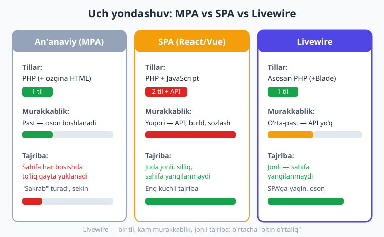
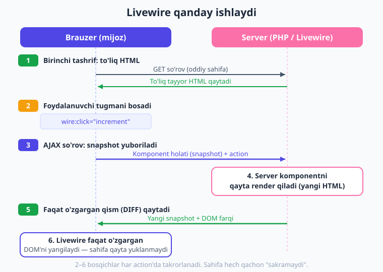
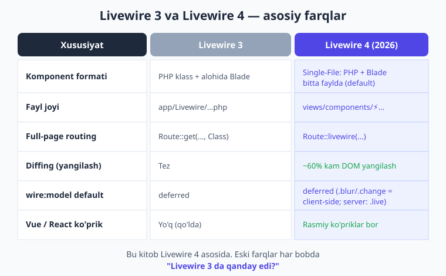

# 01 — Livewire nima va nega kerak?

[🏠 Kitob boshi](./README.md) · [Keyingi: 02 — O'rnatish va birinchi komponent ➡️](./02-ornatish-muhit.md)

> **Bu bobda:** an'anaviy veb-sahifa qanday ishlashidan boshlab, JavaScript va SPA (React/Vue) yondashuvlarining kuchli va zaif tomonlarini ko'rib chiqamiz. Keyin Livewire falsafasini — "PHP bilan reaktivlik"ni — tushunamiz va eng muhimi, Livewire ichkarida **qanday** ishlashini diagramma bilan o'rganamiz. Oxirida Livewire 3 va 4 farqi va kitobning yo'l xaritasi bilan tanishamiz.

---

## Kichik sahna: bir tugma va katta savol

Tasavvur qiling, siz oddiy "yoqdi" (like) tugmasi yasayapsiz. Foydalanuvchi tugmani bosadi — hisob 41 dan 42 ga oshishi kerak. Faqat shu. Lekin bu kichik vazifa ortida butun veb-dasturlashning eng katta savoli yashiringan:

> Foydalanuvchi tugmani bosganda, ekrandagi raqam **qanday** o'zgaradi?

Bu savolga javob berishning bir necha yo'li bor va har birining narxi bor. Keling, eng oddiyidan boshlab, bosqichma-bosqich Livewire'gacha yetib boramiz. Shunda Livewire **nega** kerakligini chinakam his qilasiz.

---

## 1. An'anaviy veb: "qog'oz xat" usuli

> **Hayotiy o'xshatish.** Tasavvur qiling, do'stingiz bilan **oddiy qog'oz xat** orqali yozishyapsiz. Siz savol yozasiz, konvertga solib jo'natasiz, pochtachi olib boradi, do'stingiz **yangi qog'ozga** to'liq javob yozadi va qaytarib jo'natadi. Bitta so'zni o'zgartirmoqchi bo'lsangiz ham — yana **butun xatni** boshqatdan yozish kerak. Eski xatni yirtib tashlaysiz, yangisini olasiz.

An'anaviy veb-sahifa aynan shunday ishlaydi. Bu usul **MPA** (Multi-Page Application — ko'p sahifali ilova) deb ataladi.

Jarayonni bosqichma-bosqich ko'rsak:

1. Siz brauzerga manzil yozasiz, masalan `example.uz/postlar`.
2. Brauzer serverga **so'rov** (request) yuboradi: "Menga shu sahifani ber".
3. Server (PHP) ma'lumotlar bazasidan ma'lumot oladi, **to'liq HTML** sahifani yasaydi va qaytaradi.
4. Brauzer kelgan HTML'ni ekranda chizadi.

Bu yerda muammo yo'q — birinchi marta sahifa shunday ko'rsatilishi **kerak** ham. Muammo keyin boshlanadi. Endi foydalanuvchi sahifadagi biror tugmani bossa nima bo'ladi?

- Brauzer serverga **yana** so'rov yuboradi.
- Server **butun** sahifani **yangidan** yasab qaytaradi.
- Brauzer eski sahifani **butunlay tashlab**, yangisini boshidan chizadi.

Natijada ekran bir lahzaga oqarib ketadi, sahifa "sakraydi", siz qayerda turgan bo'lsangiz — boshiga qaytib ketasiz. Aynan "qog'oz xat" usuli: bitta raqamni o'zgartirish uchun butun sahifa qaytadan yoziladi.

!!! note "Eslatma"
    **HTML** (HyperText Markup Language) — bu veb-sahifaning "skeleti", ya'ni matn, tugma, rasm kabi elementlarni tasvirlaydigan til. **Server** — bu kompyuter dasturi bo'lib, brauzerdan so'rov qabul qiladi va javob qaytaradi. Bizning holatda server ichida **PHP** dasturi ishlaydi (Laravel).

Bu yondashuvning kuchli tomonlari ham bor, ularni e'tibordan chetda qoldirmaylik:

- **Sodda.** Bitta til — PHP. Bitta kod bazasi. O'rganishi oson.
- **Ishonchli va SEO uchun yaxshi.** Server tayyor HTML qaytargani uchun qidiruv tizimlari (Google) sahifani osongina o'qiydi.

Lekin zaif tomoni jiddiy:

- **Sekin va "sakrab" turadigan tajriba.** Har bir kichik amal uchun butun sahifa qayta yuklanadi. Zamonaviy foydalanuvchi bunga toqat qilmaydi — u "jonli", darhol javob beradigan interfeysni kutadi.

---

## 2. JavaScript va AJAX: dinamiklik, lekin ikkita til

> **Hayotiy o'xshatish.** Endi qog'oz xat o'rniga **telefon qo'ng'irog'i** bor deb tasavvur qiling. Endi siz butun suhbatni qaytadan boshlamaysiz — faqat kerakli savolni so'raysiz va faqat kerakli javobni olasiz. Tezroq! Lekin endi sizga **ikkita malaka** kerak: o'z fikringizni gapirish (frontend) va do'stingizning javobini eshitib tushunish (backend).

Muammoni hal qilish uchun dasturchilar **JavaScript** va **AJAX** texnologiyasidan foydalana boshladilar.

!!! note "Eslatma"
    **JavaScript (JS)** — brauzer ichida ishlaydigan dasturlash tili. PHP serverda ishlasa, JS foydalanuvchining brauzerida ishlaydi. **AJAX** — bu JavaScript yordamida sahifani **qayta yuklamasdan** serverga "yashirin" so'rov yuborish usuli (Asynchronous JavaScript And XML).

Endi "yoqdi" tugmasi shunday ishlaydi:

1. Foydalanuvchi tugmani bosadi.
2. **JavaScript** brauzerda ushlaydi va serverga AJAX so'rov yuboradi: "yoqdi sonini oshir".
3. Server faqat yangi raqamni qaytaradi (butun sahifani emas).
4. JavaScript ekrandagi **faqat shu raqamni** o'zgartiradi.

Sahifa qayta yuklanmaydi, tajriba ancha silliq. Bu — katta yutuq. Lekin yangi muammolar paydo bo'ldi:

- **Endi ikkita til.** Backend uchun PHP, frontend uchun JavaScript. Ikkalasini ham bilishingiz kerak.
- **Takrorlanish.** Ko'pincha bir xil mantiqni ikki marta yozasiz: validatsiya (tekshirish) qoidalarini ham PHP'da, ham JS'da. Bir joyda o'zgartirsangiz, ikkinchisini ham unutmaslik kerak.
- **Ikkita kod bazasi murakkablashadi.** Loyiha o'sgan sari ikki tomonni muvofiqlashtirish qiyinlashadi.

Ya'ni tajriba yaxshilandi, lekin **dasturchining ishi murakkablashdi**.

---

## 3. SPA (React, Vue): juda kuchli, lekin "ortiqcha" bo'lishi mumkin

> **Hayotiy o'xshatish.** Endi tasavvur qiling, do'stingiz bilan doimiy ulangan **video qo'ng'iroq**dasiz. Hammasi jonli, darhol, uzilishsiz — eng yaxshi tajriba. Lekin buning uchun kuchli internet, kamera, mikrofon va alohida ilova sozlashingiz kerak. Bitta savol uchun bu — haddan tashqari katta tayyorgarlik.

Keyingi qadam — **SPA** (Single-Page Application — bir sahifali ilova). Bu yerda **React** yoki **Vue** kabi kuchli JavaScript ramkalari (framework) ishlatiladi.

SPA'da butun frontend brauzerda JavaScript bilan quriladi. Server ko'pincha faqat **API** (ma'lumot uchun "xizmat eshigi") rolini bajaradi — u HTML emas, balki "yalang'och" ma'lumot (JSON) qaytaradi, frontend esa shu ma'lumotdan ekranni o'zi yasaydi.

!!! note "Eslatma"
    **Framework (ramka)** — tayyor qoidalar va vositalar to'plami bo'lib, ular ustida ilova quriladi. **API** (Application Programming Interface) — bu ikki dastur o'zaro "gaplashadigan" til/eshik. SPA'da frontend (JS) backend (PHP) bilan API orqali ma'lumot almashadi.

SPA'ning kuchi haqiqatan ham katta:

- **Eng jonli, eng silliq tajriba.** Sahifa hech qachon qayta yuklanmaydi, ilova xuddi telefon ilovasidek tez ishlaydi.
- **Murakkab interfeyslar** (masalan, jonli chat, real-vaqt taxta) uchun ideal.

Lekin narxi ham baland:

- **Alohida katta texnologiyani o'rganish kerak.** React yoki Vue — o'zi katta dunyo.
- **API qurish shart.** Backend va frontend orasida butun "eshik" tizimini yozasiz.
- **Ko'p sozlash (build, paketlar, marshrutlash, holat boshqaruvi).** Boshlang'ich tayyorgarlik uzoq.
- **Ikki til, ikki jamoa, ikki kod bazasi** — yana o'sha murakkablik, lekin yanada kuchaygan.

Katta jamoa va katta loyiha uchun bu narx o'zini oqlaydi. Lekin **kichik va o'rta** loyiha uchun — masalan, admin panel, blog, do'kon, ichki tizim — SPA ko'pincha **"chumchuqqa to'p otish"** bo'lib chiqadi: oddiy ishni bajarish uchun haddan tashqari ko'p mehnat.



Mana shu yerda asosiy ziddiyat ko'rinadi:

| | Til soni | Murakkablik | Tajriba |
|---|---|---|---|
| **An'anaviy (MPA)** | 1 (PHP) | Past | Sekin, "sakraydi" |
| **JS / AJAX** | 2 (PHP + JS) | O'rta-yuqori | Yaxshi |
| **SPA (React/Vue)** | 2 + API | Yuqori | Eng jonli |

Savol tug'iladi: **bitta til bilan, oson, lekin SPA'ga yaqin jonli tajribani olib bo'lmaydimi?** Aynan shu savolga Livewire javob beradi.

---

## 4. Livewire falsafasi: PHP bilan reaktivlik

> **Hayotiy o'xshatish.** Tasavvur qiling, restoranda o'tiribsiz. Siz oshpaz bilan bevosita gaplashmaysiz — **ofitsiant** orqali muloqot qilasiz. Siz unga "yana bir choy" deysiz, u oshxonaga borib keladi, stolingizga choy qo'yib qaytadi. Siz oshxona ichida nima bo'layotganini bilishingiz shart emas. **Livewire — ana shu ofitsiant.** Siz faqat PHP'da "nima bo'lishi kerakligini" aytasiz, qolgan barcha "borib-kelish" (JavaScript, AJAX, DOM yangilash) ishini Livewire siz uchun bajaradi.

**Livewire** — bu Laravel uchun yaratilgan kutubxona (kengaytma). Uning asosiy va'dasi shunday:

> Siz **faqat PHP** (va Blade) bilanoq **reaktiv**, "jonli" interfeys quryapsiz. JavaScript yozish shart emas.

Bu yerda yangi muhim atama — **reaktiv**.

!!! note "Eslatma"
    **Reaktiv** (reactive) — "o'zgarishga **darhol javob beradigan**" degani. Reaktiv interfeys shuni anglatadiki, ma'lumot o'zgarganda ekran **avtomatik** yangilanadi — siz qo'lda "endi ekranni yangila" deb buyurishingiz shart emas. Masalan, hisob `41` dan `42` ga o'zgarsa, ekrandagi raqam o'z-o'zidan yangilanadi.

Livewire'ning markaziy g'oyasi shu: **frontend holatini server boshqaradi.** Boshqacha aytganda, interfeysingizning "miyasi" — brauzerda emas, **serverda** (PHP'da) joylashgan. Brauzer faqat ekranni ko'rsatadi va foydalanuvchi amallarini serverga yetkazadi.

Rasmiy hujjatlarda bu yondashuv shunday nomlanadi: **"server-rendered reactivity"** — ya'ni "server tomonida render qilinadigan reaktivlik". Bu nima degani? Ekrandagi HTML har doim **serverda** (PHP) yasaladi, lekin natija **reaktiv**, ya'ni jonli ko'rinadi.

Demak, Livewire bizga avvalgi taqqoslashdagi eng yaxshi tomonlarni birlashtirib beradi:

- **Bitta til** — PHP/Blade (MPA'dek sodda).
- **API qurish shart emas** — Livewire o'zi "ko'prik" bo'ladi.
- **Jonli, sahifa qayta yuklanmaydigan tajriba** — SPA'ga yaqin.

!!! tip "Maslahat"
    Livewire'ni "JavaScript o'rniga" emas, balki **"JavaScript'ni siz uchun yozadigan yordamchi"** deb tushuning. Aslida brauzerda baribir JavaScript ishlaydi — lekin uni Livewire avtomatik boshqaradi, sizdan esa faqat PHP talab qilinadi. Murakkab joylarda istasangiz o'zingiz ham JavaScript (Alpine.js) qo'shishingiz mumkin — buni 22-bobda o'rganamiz.

---

## 5. Livewire QANDAY ishlaydi? (eng muhim qism)

Bu — butun kitobning eng muhim tushunchasi. Agar shuni yaxshi tushunsangiz, qolgan hamma narsa joyiga tushadi. Shoshilmang, har bosqichni o'qing.

Avval bitta haqiqatni eslab qoling: Livewire ham, oxir-oqibat, server bilan AJAX orqali "gaplashadi". Lekin u buni siz uchun, ko'rinmas tarzda bajaradi. Mana to'liq oqim:

**(a) Birinchi tashrif — to'liq HTML.**
Foydalanuvchi sahifaga birinchi marta kirganda, hammasi an'anaviy veb kabi: server komponentni ishga tushiradi va **to'liq, tayyor HTML** qaytaradi. Sahifa darhol ko'rinadi va qidiruv tizimlari ham uni o'qiy oladi (bu SPA'dan bir afzallik).

**(b) Foydalanuvchi amal (action) qiladi.**
Foydalanuvchi biror narsa qiladi — masalan, tugmani bosadi. Bizning kodimizda bu shunday yoziladi:

```blade
<button wire:click="increment">+</button>
```

Bu yerda `wire:click="increment"` Livewire'ga shunday deydi: "Bu tugma bosilsa, serverdagi `increment` metodini ishga tushir". (`wire:click` haqida 07-bobda batafsil to'xtalamiz.)

**(c) Livewire AJAX so'rov yuboradi — snapshot bilan.**
Tugma bosilganda Livewire jimgina serverga AJAX so'rov yuboradi. Bu so'rov bilan birga u komponentning **hozirgi holatini** — barcha qiymatlarini — yuboradi. Bu holat to'plami **snapshot** ("oniy tasvir", suratga olish kabi) deb ataladi.

!!! note "Eslatma"
    **Snapshot** — komponentning ayni damdagi holatining "fotosurati". Masalan, agar `count = 41` bo'lsa, snapshot ichida shu qiymat bo'ladi. Server bu snapshotni olib, "demak, hozir hisob 41 ekan" deb biladi va shu joydan davom etadi. Shu sababli serverga komponentni "yodida saqlab turish" shart emas — kerakli holat har safar snapshot bilan keladi.

**(d) Server komponentni qayta render qiladi.**
Server snapshotdagi holatni tiklaydi, so'ralgan metodni (`increment`) ishga tushiradi — natijada `count` 41 dan 42 ga oshadi — va komponentni **yangi holat bilan qaytadan render** qiladi. Endi serverda yangi HTML bor (ichida `42`).

**(e) Faqat O'ZGARGAN qism (diff) DOM'ga qo'llanadi.**
Mana eng aqlli qism. Server butun yangi sahifani qaytarmaydi. Livewire eski HTML bilan yangi HTML'ni **solishtiradi** va faqat **farqni** (diff) topadi — bizning misolda bu `41 → 42` o'zgarishi. Faqat shu kichik o'zgarish brauzerdagi sahifaga (DOM'ga) qo'llanadi.

!!! note "Eslatma"
    **DOM** (Document Object Model) — bu brauzerdagi sahifaning "tirik" ko'rinishi, ya'ni hozir ekranda turgan HTML elementlarining ichki tuzilishi. **Diff** — ikki narsa orasidagi "farq" degani. Livewire faqat farqni DOM'ga qo'llagani uchun ekranning qolgan qismi joyida turadi: kursoringiz, skroll holatingiz, formaga yozgan matnlaringiz hech qayoqqa ketmaydi.

**Natijada sahifa qayta yuklanmaydi.** Foydalanuvchi uchun bu xuddi sehrdek: tugmani bosdi, raqam darhol o'zgardi, ekran "sakramadi". Aslida esa ortda ofitsiant (Livewire) jimgina serverga borib keldi.

Quyidagi diagramma butun bu oqimni ko'rsatadi. Uni diqqat bilan ko'rib chiqing — bu kitobdagi eng muhim rasm:



!!! example "Misol — counter komponenti"
    Bu kitobda biz yasaydigan birinchi "tirik" komponent — hisoblagich (counter). Uning to'liq kodi shunday ko'rinadi (3-bobda batafsil tahlil qilamiz):

    ```php
    <?php

    use Livewire\Component;

    new class extends Component
    {
        public int $count = 0;

        public function increment(): void
        {
            $this->count++; // hisobni bittaga oshiramiz
        }
    };
    ?>

    <div>
        <h1>Hisob: {{ $count }}</h1>
        <button wire:click="increment">+</button>
    </div>
    ```

    Diqqat qiling: bu yerda **birorta ham JavaScript qatori yo'q**. Tugma bosilganda raqam jonli o'zgaradi — barcha "sehr"ni Livewire bajaradi. Yuqoridagi oqim aynan shu kod ortida ishlaydi.

!!! tip "Maslahat"
    Yuqoridagi `<div>` — komponentning **bitta ildiz elementi**. Livewire 4 da har bir komponent **aynan bitta** ildiz elementga o'ralishi shart (ichida xohlagancha element bo'lishi mumkin). Buni hozircha shunchaki eslab qo'ying — sababini 04-bobda (komponent anatomiyasi) tushuntiramiz.

---

## 6. Livewire 3 va Livewire 4: nima o'zgardi?

Bu kitob **Livewire 4** (2026-yil yanvarda chiqqan eng so'nggi versiya) asosida yozilgan. Lekin millionlab loyiha hali **Livewire 3** da ishlaydi, shuning uchun muhim farqlarni har bobda `Livewire 3 da qanday edi?` eslatmasi bilan ko'rsatib boramiz. Mana umumiy manzara:



Eng muhim yangiliklar:

- **Single-File Component (SFC) — bitta faylda PHP va Blade.** Livewire 4 ning eng katta yangiligi. Avval komponent ikki faylga bo'linardi: alohida PHP klass va alohida Blade shabloni. Endi ikkalasi **bitta faylda** yashaydi (yuqoridagi counter misolidagidek). Bu kichik komponentlarni yozishni ancha tezlashtiradi.
- **Tezroq diffing.** Livewire 4 yangilanishlarni yanada aqlliroq solishtiradi va o'rtacha **~60% kam DOM yangilanish** qiladi — ya'ni interfeys yanada silliqroq ishlaydi.
- **Vue / React ko'priklari.** Livewire 4 da Vue yoki React komponentlarini Livewire ichida ishlatish uchun rasmiy "ko'priklar" paydo bo'ldi — bu murakkab, alohida ilovalarda foydali.
- **Soddalashtirilgan hooklar va routing.** Ba'zi ichki mexanizmlar (lifecycle hooklar) soddalashdi, full-page komponent uchun esa endi `Route::livewire()` ishlatiladi (02-bobda ko'ramiz).

!!! info "Livewire 3 da qanday edi?"
    Livewire 3 da komponent **doim ikki faylda** edi: PHP klass `app/Livewire/` papkasida, Blade shabloni esa `resources/views/livewire/` da. Livewire 4 da default holatda ikkalasi **bitta** faylga (`resources/views/components/⚡...`) birlashtirilgan. Eski uslubni xohlasangiz, `--class` bayrog'i bilan v3 ko'rinishidagi komponent ham yaratishingiz mumkin.

!!! warning "Ehtiyot bo'ling"
    Internetda Livewire haqida ko'p maqola va video **Livewire 3** (yoki undan eskirog'i) uchun yozilgan. Ular ham foydali, lekin sintaksisda farqlar bo'lishi mumkin (masalan, komponent fayli qayerda turishi, routing qanday yozilishi). Shu sababli noaniqlikka tushganda, avval shu kitobdagi yoki [rasmiy hujjatdagi](https://livewire.laravel.com) **versiyani** tekshiring.

---

## 7. Qachon Livewire, qachon SPA? (halol taqqoslash)

Livewire ajoyib, lekin u "har bir muammoning yechimi" emas. Halol bo'laylik — qachon Livewire to'g'ri tanlov, qachon SPA yaxshiroq:

**Livewire ideal, agar:**

- Siz **Laravel/PHP dasturchisisiz** va frontend uchun yangi katta til o'rganishni xohlamaysiz.
- Loyiha **kichik yoki o'rta**: admin panel, blog, do'kon, ichki boshqaruv tizimi, dashboard.
- Sizga "jonli" tajriba kerak (jonli qidiruv, formalar, modal oynalar, real-vaqt yangilanish), lekin butun frontendni qaytadan qurishni istamaysiz.
- **Tezlik bilan ishlab chiqish** muhim — bir o'zingiz yoki kichik jamoa bilan.

**SPA (React/Vue) yaxshiroq, agar:**

- Interfeys **juda murakkab va og'ir interaktiv** (masalan, onlayn grafik muharrir, murakkab real-vaqt o'yin, oflayn ishlaydigan ilova).
- Sizda **alohida frontend jamoa** bor va backend'dan to'liq ajratilgan ishlash kerak.
- Bitta backend'ga **bir nechta turli mijoz** (veb + mobil ilova) ulanadi — unda baribir API kerak bo'ladi.

!!! tip "Maslahat"
    Ko'pchilik haqiqiy biznes loyihalari (ayniqsa Laravel dunyosida) — aslida kichik va o'rta. Aynan shu sababli Livewire keyingi yillarda nihoyatda mashhur bo'ldi: u "yetarlicha jonli" tajribani "minimal mehnat" bilan beradi. Ikkilanmang — agar Laravel bilan ishlasangiz va SPA aniq talab qilinmasa, Livewire deyarli har doim yaxshi boshlang'ich tanlov.

!!! question "Tekshirib ko'ring"
    O'zingiz ishlamoqchi bo'lgan (yoki orzu qilgan) bitta loyihani o'ylab ko'ring. U Livewire'ga mosmi yoki SPA talab qiladimi? Nima uchun? Javobingizni yuqoridagi ikki ro'yxatga tayanib asoslang.

---

## 8. Kitobning yo'l xaritasi

Bu kitob sizni 0 dan ekspertgacha bosqichma-bosqich olib boradi. Mana qisqacha xarita — qaysi qismda nima:

- **I qism (01–04) — Kirish va asoslar.** Hozir o'qiyotgan bobimiz; keyin Livewire'ni o'rnatamiz, birinchi komponent (hisoblagich)ni yasaymiz va komponent tuzilishini o'rganamiz.
- **II qism (05–08) — Holat, bog'lanish va amallar.** Komponent holati (`properties`), `wire:model` bilan ma'lumot bog'lash, `wire:click` kabi amallar va komponent hayot sikli (lifecycle).
- **III qism (09–12) — Formalar.** Formalar, validatsiya (tekshirish), Form Objects va fayl yuklash.
- **IV qism (13–16) — Ro'yxatlar va CRUD.** Ma'lumot ko'rsatish, pagination va jonli qidiruv, computed properties va to'liq CRUD ilova (yaratish/o'qish/yangilash/o'chirish).
- **V qism (17–19) — Komponentlar aloqasi.** Ichma-ich (nested) komponentlar, events (hodisalar) bilan muloqot va URL/query string.
- **VI qism (20–22) — Dinamik UI va tezlik.** Loading holatlari, lazy/polling/SPA-navigatsiya va Alpine.js integratsiyasi.
- **VII qism (23–25) — Professional daraja.** Xavfsizlik, testlash va tezlik (performance) hamda deploy.
- **VIII qism (26) — Kapston.** Hamma bilimni birlashtirib, to'liq **real-vaqt vazifa boshqaruvchi** ilovani noldan quramiz.

Keyingi bobda esa nazariyadan amaliyotga o'tamiz: Laravel 12 + Livewire 4 muhitini o'rnatamiz va birinchi komponentimizni yaratamiz.

---

## Xulosa

- **An'anaviy veb (MPA)** sodda, lekin har amalda butun sahifa qayta yuklanadi — sekin va "sakraydigan" tajriba ("qog'oz xat" usuli).
- **JavaScript/AJAX** tajribani yaxshilaydi, lekin endi **ikki til** (PHP + JS), takrorlanish va ikki kod bazasi — murakkablik ortadi.
- **SPA (React/Vue)** eng jonli tajribani beradi, lekin alohida til, API qurish va ko'p sozlash talab qiladi — kichik/o'rta loyihaga ko'pincha ortiqcha.
- **Livewire** — "oltin o'rtaliq": **faqat PHP/Blade** bilan jonli, reaktiv interfeys. API qurish shart emas, sahifa qayta yuklanmaydi.
- Livewire falsafasi — **"server tomonida render qilinadigan reaktivlik"**: interfeys holatini **server** boshqaradi, brauzer faqat ko'rsatadi.
- Livewire ish oqimi: (1) birinchi to'liq HTML → (2) foydalanuvchi action → (3) AJAX + **snapshot** → (4) server qayta render → (5) faqat **diff** DOM'ga qo'llanadi. Sahifa hech qachon to'liq qayta yuklanmaydi.
- **Livewire 4** ning asosiy yangiligi — **Single-File Component** (bitta faylda PHP + Blade), tezroq diffing va Vue/React ko'priklari. Bu kitob v4 asosida, v3 farqlari ko'rsatib boriladi.
- Livewire kichik/o'rta Laravel loyihalari uchun ideal; juda murakkab, og'ir interaktiv yoki ko'p-mijozli tizimlar uchun SPA mosroq bo'lishi mumkin.

## Amaliy mashqlar

Bu bob nazariy bo'lgani uchun mashqlar ham fikrlashga qaratilgan. Kod yozish keyingi boblarda boshlanadi.

1. **(Oson)** O'z so'zlaringiz bilan tushuntiring: an'anaviy veb-sahifa "qog'oz xat"ga, Livewire esa "ofitsiant"ga nega o'xshatildi? Har bir o'xshatishda kim qaysi rolni o'ynaydi (siz, brauzer, server)?

2. **(Oson)** "Reaktiv", "snapshot" va "diff" atamalarini har birini bitta jumlada, do'stingizga tushuntirayotgandek izohlang.

3. **(O'rta)** Livewire ish oqimining 5 bosqichini (a–e) yodingizdan, tartibi bilan yozib chiqing. Keyin diagramma bilan solishtiring — qaysi bosqichni unutgan bo'lsangiz, qayta o'qing.

4. **(O'rta)** Quyidagi uchta loyiha uchun: (a) kichik blog admin paneli, (b) onlayn rasm muharriri (Photoshop'ga o'xshash), (c) restoran uchun mahsulot ro'yxati va buyurtma sahifasi — har biri uchun Livewire yoki SPA tanlardingizmi? Tanlovingizni asoslang.

5. **(Qiyin)** "Frontend holatini server boshqaradi" iborasini chuqurroq o'ylab ko'ring. Sizningcha, bu yondashuvning **kuchli** tomoni nima (masalan, xavfsizlik, soddalik nuqtai nazaridan) va qanday **zaif** tomoni bo'lishi mumkin (masalan, internet aloqasi yoki server yuki nuqtai nazaridan)? Hech bo'lmaganda bittadan misol keltiring.

---

[🏠 Kitob boshi](./README.md) · [Keyingi: 02 — O'rnatish va birinchi komponent ➡️](./02-ornatish-muhit.md)
