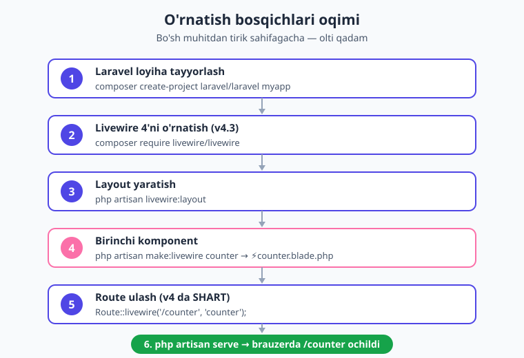
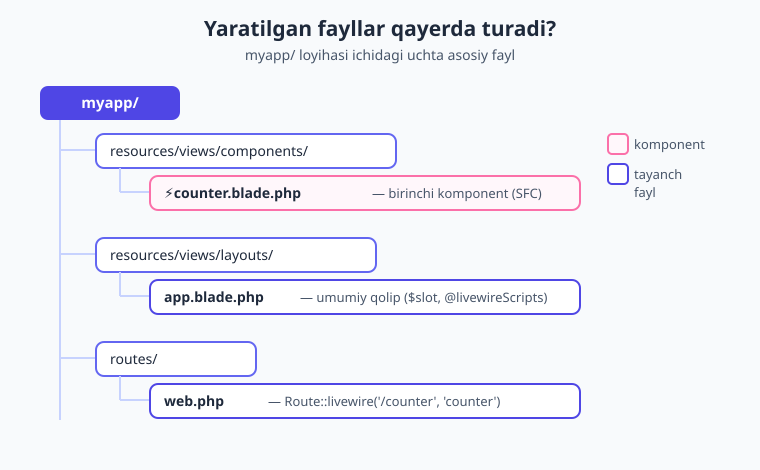
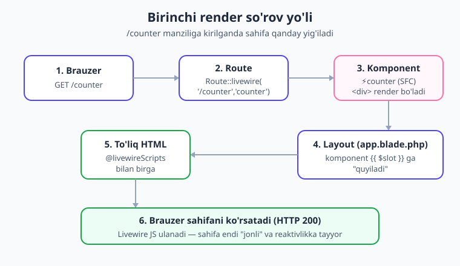

# 02 — O'rnatish va birinchi komponent

[⬅️ Oldingi: 01 — Livewire nima](./01-livewire-nima.md) · [🏠 Kitob boshi](./README.md) · [Keyingi: 03 — Birinchi komponent ➡️](./03-birinchi-komponent.md)

> **Bu bobda:** kompyuteringizni Livewire'ga tayyorlaymiz — kerakli dasturlar (PHP, Composer, Node, Laravel)ni tekshiramiz, yangi Laravel loyiha ochib, unga Livewire 4'ni o'rnatamiz. So'ngra birinchi `counter` komponentini yaratamiz, uni manzilga (route) ulaymiz va brauzerda ochib ko'ramiz. Bobning oxirida sizning kompyuteringizda ishlaydigan, tirik Livewire sahifasi paydo bo'ladi.

---

## Kirish: ustaxonani tayyorlash

Tasavvur qiling, siz non yopmoqchisiz. Avval oshxonada un, suv, xamirturush borligini tekshirasiz, keyin xamir qorasiz, undan keyin tandirni qizdirasiz — va faqat shundan so'ng birinchi nonni yopasiz. Dasturlashda ham xuddi shunday: avval **muhitni** (ustaxonani) tayyorlaymiz, keyin **loyiha**ni qoramiz, va eng oxirida birinchi **komponent**ni "yopamiz".

Bu bob aynan shu tartibda boradi. Hech narsani o'tkazib yubormang — har bir qadam keyingisining poydevori. Oxirida brauzeringizda "+" tugmasini bosib turadigan, lekin sahifa qayta yuklanmaydigan, tirik bir narsa ko'rasiz. Aynan shu — Livewire "sehri"ning birinchi uchqunidir.

!!! note "Eslatma"
    Bu bobda komponentni faqat **ishga tushiramiz** — uning ichidagi `wire:click`, `wire:model` va reaktivlik qanday ishlashini [03-bobda](./03-birinchi-komponent.md) chuqur o'rganamiz. Hozircha maqsad: "ishlayapti!" degan birinchi quvonchni his qilish.

---

## 1. Talablar: nima kerak?

Livewire — Laravel'ning ustiga o'rnatiladigan paket (qo'shimcha). Demak, avval Laravel ishlaydigan muhit kerak. Quyidagilar bo'lishi shart:

| Dastur | Kerakli versiya | Nima uchun |
|---|---|---|
| **PHP** | 8.4 yoki yuqori | Livewire kodi PHP'da ishlaydi (server tili). |
| **Composer** | 2.x | PHP paketlarini (jumladan Livewire'ni) o'rnatadi. |
| **Node.js** | 18 yoki yuqori (biz 24'da tekshirdik) | CSS/JS fayllarini "build" qilish uchun (Vite). |
| **Laravel** | 12 | Livewire 4 shu versiya bilan to'liq mos. |

> **Hayotiy o'xshatish.** PHP — bu pishirish tili, Composer — ingredientlar do'koni (kerakli paketni keltirib beradi), Node esa — bezatish bo'limi (interfeysning ko'rinishini "yig'adi"). Laravel — butun oshxonaning o'zi.

### Versiyalarni tekshirish

Terminal (Windows'da PowerShell yoki Terminal, macOS/Linux'da Terminal) oching va quyidagilarni bittama-bitta tering:

```bash
php -v
```

Natijada `PHP 8.4.x` ko'rinishidagi qator chiqishi kerak. Agar `8.4` dan past bo'lsa, PHP'ni yangilang.

```bash
composer --version
```

`Composer version 2.x` chiqsa, hammasi joyida.

```bash
node -v
```

`v18.x` yoki yuqori bo'lsa yetarli.

!!! warning "Ehtiyot bo'ling"
    Agar bu komandalarning birortasi "command not found" (yoki "tanilmadi") desa, demak o'sha dastur o'rnatilmagan yoki tizim yo'liga (PATH) qo'shilmagan. Davom etishdan oldin uni o'rnating. Eng oson yo'l — **[Laravel Herd](https://herd.laravel.com)** (Windows va macOS uchun bepul): u PHP, Composer va Node'ni birdaniga keltiradi.

!!! tip "Maslahat"
    Bu kitob davomida biz aniq versiyalardan foydalanamiz: **Laravel 12, Livewire v4.3, PHP 8.4, Node 24**. Bularning hammasi tirik loyihada ishlatib tekshirilgan. Agar versiyalaringiz biroz farq qilsa ham xavotir olmang — asosiy g'oyalar bir xil.

---

## 2. Laravel loyihasini tayyorlash

Livewire'ni o'rnatish uchun avval bo'sh Laravel loyihasi kerak. Bu kitob siz Laravel asoslarini bilasiz deb taxmin qiladi — agar yangi bo'lsangiz yoki esingizga tushirmoqchi bo'lsangiz, avval [Laravel kitobini](../laravel/README.md) ko'rib chiqing.

Yangi loyiha yaratishning ikki yo'li bor. **Birinchisi** — Composer orqali:

```bash
composer create-project laravel/laravel myapp
```

**Ikkinchisi** — Laravel'ning o'z o'rnatuvchisi orqali (agar `laravel` komandasi o'rnatilgan bo'lsa):

```bash
laravel new myapp
```

Ikkalasi ham `myapp` nomli papka ichida to'liq Laravel loyihasini yaratadi. Yaratilgach, shu papkaga kiring:

```bash
cd myapp
```

> **Hayotiy o'xshatish.** `create-project` — yangi kvartiraga ko'chish kabi: devorlar, eshiklar, asosiy jihozlar (Laravel'ning standart tuzilmasi) tayyor holda topshiriladi. Bizning vazifamiz — uni "jonli" qilish.

!!! note "Eslatma"
    Bu kitobda biz Laravel loyiha qurishni uzundan-uzoq tushuntirmaymiz — bu Livewire kitobi. Loyiha tayyor bo'lgach, e'tiborimizni to'liq Livewire'ga qaratamiz.

---

## 3. Livewire 4'ni o'rnatish

Endi eng asosiy qadam. Loyiha papkasi ichida turib, bitta komandani tering:

```bash
composer require livewire/livewire
```

Bu komanda Livewire'ning eng so'nggi barqaror versiyasini (hozir **v4.3**) yuklab oladi va loyihangizga ulaydi. Composer kerakli barcha qo'shimcha paketlarni ham o'zi keltiradi — siz hech narsa qilishingiz shart emas.

> **Hayotiy o'xshatish.** `composer require` — do'kondan tayyor mahsulot buyurtma qilish kabi. Siz faqat nomini aytasiz (`livewire/livewire`), Composer esa uni topib, qutidan chiqarib, kerakli joyga qo'yib beradi.

O'rnatish tugagach, haqiqatan o'rnatilganini va versiyasini tekshirib ko'rishingiz mumkin:

```bash
composer show livewire/livewire
```

Natijada paket haqida ma'lumot, jumladan `versions : * v4.3.x` qatori chiqadi. Mana, Livewire endi loyihangizda yashaydi!

!!! info "Livewire 3 da qanday edi?"
    Livewire 3'da ham o'rnatish komandasi xuddi shu — `composer require livewire/livewire` edi. Faqat o'sha paytda v3 o'rnatilardi. Bugun esa shu komanda avtomatik **v4** keltiradi. O'rnatishdan keyin esa eng katta farqlar boshlanadi: v4'da komponent fayllari, layout va routing biroz boshqacha — buni quyida ko'rasiz.

---

## 4. Layout (umumiy qolip) yaratish

Livewire'ning **to'liq sahifali** (full-page) komponentlari bir "qolip" ichida ko'rinadi. Bu qolip — har bir sahifaning umumiy ramkasi: `<html>`, `<head>`, `<body>` teglari, sayt sarlavhasi, umumiy CSS va shu kabilar. Komponentingiz esa shu ramkaning o'rtasiga "joylashadi".

> **Hayotiy o'xshatish.** Layout — bu fotosurat ramkasi. Ramka har doim bir xil (chiroyli chegara, devorga ilinadigan ilgak), lekin ichidagi rasm har xil bo'ladi. Sizning komponentingiz — ramka ichidagi rasm.

Quyidagi komanda standart layout faylini yaratadi:

```bash
php artisan livewire:layout
```

Bu komanda `resources/views/layouts/app.blade.php` faylini hosil qiladi. Uning soddalashtirilgan ko'rinishi shunday:

```blade
{{-- resources/views/layouts/app.blade.php --}}
<!DOCTYPE html>
<html lang="uz">
<head>
    <meta charset="utf-8">
    <title>{{ $title ?? 'Livewire' }}</title>
    @livewireStyles
</head>
<body>
    {{ $slot }}
    @livewireScripts
</body>
</html>
```

Bu yerdagi to'rt asosiy "sehrli" qismni tushunib olaylik:

- **`@livewireStyles`** — `<head>` ichiga qo'yiladi. U Livewire'ga kerakli CSS uslublarini sahifaga ulaydi (masalan, yuklanish indikatorlari uchun).
- **`{{ $slot }}`** — bu **eng muhim joy**. Sizning komponentingiz aynan shu yerga "quyiladi". `$slot` — bo'sh o'rin, komponent mazmuni bilan to'ldiriladigan teshik. (Ramka ichidagi rasm o'rni esingizdami?)
- **`@livewireScripts`** — `<body>` oxiriga qo'yiladi. U Livewire'ning brauzer tomonidagi JavaScript "miya"sini ulaydi — aynan shu JS tugma bosilganda serverga so'rov yuboradi va sahifani yangilaydi.
- **`@vite([...])`** — ba'zi standart layout'larda bu qatorni ham ko'rasiz. U sizning shaxsiy CSS/JS fayllaringizni "build" qilib ulaydi.

!!! warning "Ehtiyot bo'ling: `@vite` xatosi"
    Agar layout'da `@vite([...])` qatori bo'lsa va siz assetlarni hali build qilmagan bo'lsangiz, sahifa "Vite manifest not found" degan xato berishi mumkin. Buning ikki yechimi bor:

    1. **Tezkor demo uchun:** `@vite([...])` qatorini vaqtincha olib tashlang (yoki izohga oling). Livewire `@livewireStyles`/`@livewireScripts` bilan o'zicha to'liq ishlayveradi.
    2. **To'g'ri yo'l:** assetlarni build qiling:
       ```bash
       npm install
       npm run build
       ```
    Bu kitobdagi misollarni tezda sinash uchun 1-yo'l yetarli. Real loyihada esa, albatta, 2-yo'lni tanlang.

---

## 5. Birinchi komponent: `counter`

Hammasi tayyor. Endi tarixiy lahza — birinchi Livewire komponentini yaratamiz. An'anaga ko'ra, birinchi komponent har doim **hisoblagich** (counter) bo'ladi.

```bash
php artisan make:livewire counter
```

Bu komanda **aynan bitta fayl** yaratadi:

```text
resources/views/components/⚡counter.blade.php
```

Ha, ko'zingiz aldamayapti — fayl nomi oldida chinakam **⚡ (chaqmoq)** emojisi bor!

### ⚡ chaqmoq nimaligi?

> **Hayotiy o'xshatish.** ⚡ — bu fayl peshonasidagi maxsus belgi, xuddi do'kon eshigidagi "Bu yer — kafe" degan yorliq kabi. Loyihangizda yuzlab Blade fayllar bo'lishi mumkin; chaqmoqli fayllar darhol ko'rinadi: "Mana bular — Livewire komponentlari!".

Livewire 4 har bir komponent faylini ⚡ emojisi bilan belgilaydi. Bu — toza tartib: oddiy Blade fayllar va Livewire komponentlarini bir qarashda ajratib olasiz. Bu belgi faqat **vizual yorliq** — uning hech qanday texnik vazifasi yo'q, fayl baribir oddiy `.blade.php`.

!!! tip "Maslahat: emojini o'chirish"
    Agar fayl nomida emoji yoqmasa (masalan, ba'zi muharrirlar yoki tizimlarda noqulay bo'lsa), uni o'chirib qo'yishingiz mumkin. `config/livewire.php` faylida quyidagini sozlang:

    ```php
    'make_command' => [
        'emoji' => false,
    ],
    ```
    Shundan keyin yangi komponentlar oddiy `counter.blade.php` nomi bilan yaratiladi. (Config faylini qanday chiqarish — quyida 8-bo'limda.)

### Bo'sh komponent qanday ko'rinadi?

Yaratilgan faylni ochsangiz, ichida shunday "bo'sh qolip" turadi:

```php
{{-- resources/views/components/⚡counter.blade.php --}}
<?php

use Livewire\Component;

new class extends Component
{
    //
};
?>

<div>
    {{-- ... --}}
</div>
```

Bu — **Single-File Component (SFC)**, ya'ni "bitta fayldagi komponent" — Livewire 4'ning yangi va asosiy formati. Bitta faylda ikki narsa birga turadi:

1. **Yuqori qism** — `<?php ... ?>` orasidagi PHP "miya": komponentning ma'lumotlari va amallari. E'tibor bering: bu yerda **anonim klass** ishlatiladi — `new class extends Component { ... };`. Oxiridagi **nuqta-vergul (`;`) shart** — uni unutmang!
2. **Pastki qism** — Blade markup, ya'ni komponentning **ko'rinishi** (HTML). U albatta **bitta ildiz element** (bu yerda `<div>`) ichida bo'lishi kerak.

> **Hayotiy o'xshatish.** SFC — bu bir konvertdagi xat va uning javobi kabi. Bir joyda ham mantiq (PHP), ham ko'rinish (HTML) yashaydi. Avval ularni ikki alohida faylda saqlash kerak edi; endi bittada — qulay va ixcham.

!!! info "Livewire 3 da qanday edi?"
    Livewire 3'da har bir komponent **ikkita** alohida fayl edi: `app/Livewire/Counter.php` (PHP klass) va `resources/views/livewire/counter.blade.php` (ko'rinish). Livewire 4'da esa ikkalasi **bitta faylga** (SFC) birlashtirildi. Eski uslub hali ham mavjud — keyinroq ko'rasiz (`--class` formati), lekin yangi standart — SFC.

Hozircha bo'sh komponentga tegmaymiz — ichini to'ldirishni [03-bobga](./03-birinchi-komponent.md) qoldiramiz. Lekin uni brauzerda ko'rsatish uchun unga manzil (route) berishimiz kerak.

---

## 6. Route (manzil) ulash

Komponentni brauzerda ochish uchun unga URL-manzil berishimiz kerak. Bu `routes/web.php` faylida qilinadi:

```php
{{-- routes/web.php --}}
<?php

use Illuminate\Support\Facades\Route;

Route::livewire('/counter', 'counter');
```

Bu qator shuni bildiradi: "Kimdir `/counter` manziliga kirsa, `counter` komponentini ko'rsat".

!!! warning "Ehtiyot bo'ling: `Route::livewire()` SHART"
    Livewire 4'da to'liq sahifali komponentni manzilga ulash uchun **albatta `Route::livewire()`** ishlating. Bu — v4'ning muhim talabi. Oddiy `Route::get('/counter', ...)` bilan komponentni to'g'ridan-to'g'ri qaytarib bo'lmaydi — komponent layout ichida to'g'ri render bo'lishi uchun `Route::livewire()` zarur.

!!! info "Livewire 3 da qanday edi?"
    Livewire 3'da komponentni manzilga ulash uchun `Route::get('/counter', Counter::class);` yozilardi (komponent klassini to'g'ridan-to'g'ri uzatib). Livewire 4'da esa maxsus `Route::livewire('/counter', 'counter')` metodi kiritildi — birinchi argument URL, ikkinchisi komponent nomi (satr ko'rinishida).

Manzilga nom ham berish mumkin (keyinroq `route('...')` orqali murojaat qilish uchun):

```php
Route::livewire('/counter', 'counter')->name('counter');
```

---

## 7. Brauzerda ochish

Endi loyihani ishga tushiramiz. Terminalda:

```bash
php artisan serve
```

Bu Laravel'ning ichki veb-serverini ishga tushiradi va sizga manzil beradi, odatda:

```text
INFO  Server running on [http://127.0.0.1:8000].
```

Brauzerni oching va manzilga `/counter` qo'shing:

```text
http://127.0.0.1:8000/counter
```

Nimani ko'rasiz? Hozircha komponent **bo'sh** (`<div>` ichi quruq), shuning uchun sahifa ham bo'm-bo'sh ko'rinadi — bu **mutlaqo normal**! Muhimi: sahifa **xatosiz ochildi** (HTTP 200). Bu degani — Livewire o'rnatildi, layout ishladi, route to'g'ri ishladi va komponent layout ichiga muvaffaqiyatli "quyildi". Ustaxona ishlayapti!

!!! question "Tekshirib ko'ring"
    Sahifa ochilgach, brauzerda "View Source" (sahifa manbasini ko'rish) qiling. HTML ichida `wire:id="..."` kabi atributlarni va Livewire skript ulanishini ko'rasizmi? Agar ko'rsangiz — Livewire haqiqatan ishlayapti. Keyingi bobda shu bo'sh `<div>`ni jonli hisoblagichga aylantiramiz.

!!! tip "Maslahat"
    `php artisan serve` ishlab turganda terminalni **yopmang** — server o'sha derazada yashaydi. Kodingizni o'zgartirsangiz, brauzerni yangilash (F5) kifoya — qayta ishga tushirish shart emas. Serverni to'xtatish uchun terminalda `Ctrl + C` bosing.

---

## 8. `config/livewire.php` bilan tanishuv

Livewire ko'p sozlamalarni o'zicha, yashirin holda boshqaradi — siz hech narsa qilishingiz shart emas. Lekin xohlasangiz, bu sozlamalarni o'zingiz boshqarishingiz mumkin. Buning uchun avval **config faylini chiqarish** (publish) kerak:

```bash
php artisan livewire:config
```

Bu `config/livewire.php` faylini yaratadi. Endi siz uni ochib, Livewire'ning xulq-atvorini sozlashingiz mumkin. Eng ko'p ishlatiladigan sozlamalar:

- **Layout** — full-page komponentlar uchun standart qolip qaysi fayl ekani (standart: `layouts.app`). Agar layout'ingiz boshqa nomda bo'lsa, shu yerda ko'rsatasiz.
- **`make_command.emoji`** — `make:livewire` yangi komponentlar nomida ⚡ emojisini ishlatsinmi yoki yo'q (yuqorida ko'rdik).
- **Komponentlar joyi** — komponentlar va ularning ko'rinishlari qaysi papkada saqlanishi.

!!! note "Eslatma"
    Boshlang'ich daraja uchun config faylini o'zgartirish **shart emas** — Livewire standart sozlamalar bilan ajoyib ishlaydi. Bu faylni faqat aniq ehtiyoj tug'ilganda (masalan, emojini o'chirish yoki layout nomini almashtirish) ochasiz.

---

## 9. `make:livewire`ning boshqa formatlari

`php artisan make:livewire counter` standart holatda **SFC** (bitta fayl) yaratadi. Lekin komponentni boshqacha tuzilmada ham yaratish mumkin. Hozircha faqat **bilib qo'ying** — ularni batafsil [04-bobda (Komponent anatomiyasi)](./04-komponent-anatomiyasi.md) o'rganamiz:

```bash
php artisan make:livewire create-post --mfc
```

`--mfc` — **Multi-File Component** (ko'p-fayl): PHP, Blade (va xohlasangiz JS/CSS) alohida fayllarga bo'linadi, lekin bitta papkada turadi. Yirik komponentlar uchun qulay.

```bash
php artisan make:livewire ClassPost --class
```

`--class` — **eski v3 uslubi**: PHP klassi `app/Livewire/` da, ko'rinish esa `resources/views/livewire/` da alohida turadi.

!!! note "Eslatma"
    Komponent nomida nuqta ishlatib, uni papkalarga ham bo'lish mumkin. Masalan `php artisan make:livewire post.create` `resources/views/components/post/⚡create.blade.php` faylini yaratadi — ya'ni `post` papkasi ichida `create` komponenti. Bu komponentlarni tartibli saqlash uchun foydali.

Bu uch formatning farqi va qachon qaysi birini ishlatish kerakligi — alohida katta mavzu. Hozircha standart **SFC** bilan davom etamiz, chunki u — Livewire 4'ning eng oson va eng tavsiya etiladigan yo'li.

---

## Hammasi bir oqimda

Quyidagi diagramma biz bajargan barcha qadamlarni bir ko'rinishda jamlaydi — o'rnatishdan brauzergacha:



Yaratilgan fayllar loyihada qayerda joylashganini ham ko'rib chiqaylik:



Va nihoyat — brauzer `/counter` manziliga kirganda, so'rov qaysi yo'l bilan harakat qilib, sahifa qanday yig'iladi:



---

## Xulosa

- Livewire ishlashi uchun avval to'g'ri **muhit** kerak: **PHP 8.4+, Composer, Node 18+, Laravel 12**. Ularni `php -v`, `composer --version`, `node -v` bilan tekshiriladi.
- Livewire — Laravel'ning ustiga o'rnatiladigan paket: bitta `composer require livewire/livewire` komandasi **v4.3**ni keltiradi. Tekshirish: `composer show livewire/livewire`.
- `php artisan livewire:layout` umumiy **layout** (`resources/views/layouts/app.blade.php`) yaratadi. Uning yuragi: `@livewireStyles`, `{{ $slot }}`, `@livewireScripts`. `@vite` build qilinmagan bo'lsa demo uchun olib turish mumkin.
- `php artisan make:livewire counter` standart holatda **SFC** — bitta `resources/views/components/⚡counter.blade.php` faylini yaratadi. ⚡ emojisi — Livewire komponentlarining vizual yorlig'i (config bilan o'chsa bo'ladi).
- SFC ichida `<?php ... ?>` (anonim klass, oxirida `;`) + bitta ildiz `<div>`dagi Blade markup birga yashaydi.
- Livewire 4'da to'liq sahifa komponentini manzilga ulash uchun **`Route::livewire('/counter', 'counter')` SHART**.
- `php artisan serve` serverni ishga tushiradi; `/counter` xatosiz ochilsa — o'rnatish muvaffaqiyatli.
- `php artisan livewire:config` config faylini chiqaradi; `--mfc` va `--class` formatlari [04-bobda](./04-komponent-anatomiyasi.md) ochib beriladi.

## Amaliy mashqlar

1. **(Oson)** O'z kompyuteringizda yangi Laravel 12 loyiha yarating va unga Livewire 4'ni o'rnating. `composer show livewire/livewire` bilan o'rnatilgan versiyani tasdiqlang — `v4.3.x` chiqishi kerak.

2. **(Oson)** `php artisan livewire:layout` bilan layout yarating va `resources/views/layouts/app.blade.php` faylini oching. Undagi `@livewireStyles`, `{{ $slot }}`, `@livewireScripts` qatorlarini toping va har birining vazifasini o'z so'zlaringiz bilan izohlab ko'ring.

3. **(O'rta)** `salom` nomli yangi komponent yarating (`php artisan make:livewire salom`). Yaratilgan `⚡salom.blade.php` faylining `<div>` ichiga shunchaki `<h1>Salom, dunyo!</h1>` deb yozing. Unga `/salom` manzilini bering va brauzerda ochib, matnni ko'ring.

4. **(O'rta)** `config/livewire.php` faylini chiqaring (`php artisan livewire:config`) va `make_command.emoji` sozlamasini `false` qiling. Keyin yangi komponent yarating — endi fayl nomida ⚡ bo'lmasligini tekshiring. So'ng sozlamani qaytarib `true` qilib qo'ying.

5. **(Qiyin)** `php artisan make:livewire profil --mfc` komandasini bajaring va yaratilgan papkani oching. Standart SFC (bitta fayl) bilan bu `--mfc` (ko'p fayl) qanday farq qilishini kuzating: nechta fayl yaratildi va ular nima vazifa bajaradi deb o'ylaysiz? (Javobini [04-bobdan](./04-komponent-anatomiyasi.md) topasiz.)

---

[⬅️ Oldingi: 01 — Livewire nima](./01-livewire-nima.md) · [🏠 Kitob boshi](./README.md) · [Keyingi: 03 — Birinchi komponent ➡️](./03-birinchi-komponent.md)
