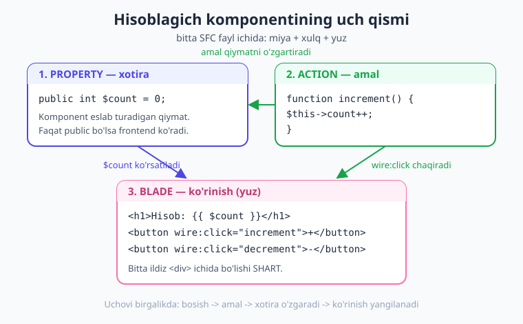
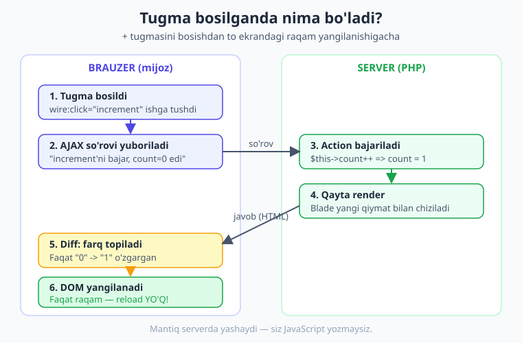
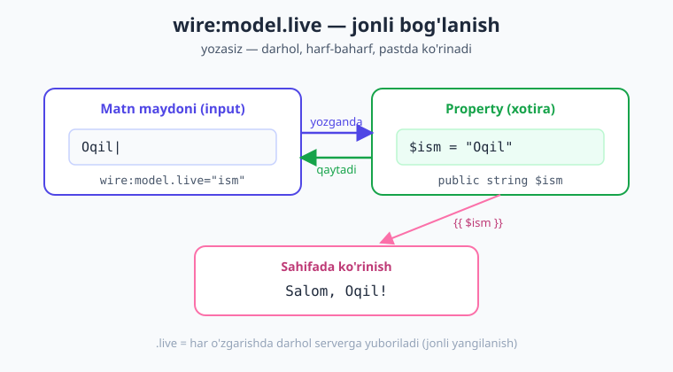

# 03 — Birinchi komponent: hisoblagich (counter)

[⬅️ Oldingi: 02 — O'rnatish](./02-ornatish-muhit.md) · [🏠 Kitob boshi](./README.md) · [Keyingi: 04 — Komponent anatomiyasi ➡️](./04-komponent-anatomiyasi.md)

> **Bu bobda:** birinchi haqiqiy Livewire komponentini — jonli hisoblagichni (counter) — qadam-baqadam quramiz. Tugmani bosganda raqam o'zgaradi, sahifa esa qayta yuklanmaydi. Eng muhimi: bularning hammasini **bironta ham JavaScript yozmasdan** qilamiz. Yo'l-yo'lakay `wire:click`, `wire:model` va reaktivlik "sehri"ning ichki mexanizmi bilan tanishamiz.

---

## Nima quramiz va nega aynan hisoblagich?

Tasavvur qiling: ekranda katta raqam turibdi, yonida ikkita tugma — **+** va **−**. **+** ni bossangiz raqam bittaga oshadi, **−** ni bossangiz bittaga kamayadi. Hammasi shu zahoti, ko'z oldingizda. Sahifa miltillamaydi, qayta yuklanmaydi.

Bu — dasturlash olamining "Salom, dunyo!"i. Soddaligi aldamasin: shu mitti misol ichida Livewire'ning butun falsafasi yashiringan. Uni tushunsangiz, qolgan hamma narsa — formalar, ro'yxatlar, qidiruv, hatto to'liq CRUD — xuddi shu g'oyaning kattaroq ko'rinishi ekanligini ko'rasiz.

> **Hayotiy o'xshatish.** Hisoblagichni do'kondagi **mexanik sanagich** (klikker) deb tasavvur qiling — qo'riqchi kirgan odamlarni shu bilan sanaydi. Tugmani bosasiz — ichidagi g'ildirakcha aylanadi va oynachada yangi raqam ko'rinadi. Siz g'ildirakni o'zingiz aylantirmaysiz; faqat tugmani bosasiz, mexanizmning ichki ishi sizdan yashirin. Livewire hisoblagichi ham aynan shunday: siz tugmani bosasiz, **sanash ishi serverda** bo'ladi, natija esa ekranda paydo bo'ladi.

Eng hayratlanarli jihat — biz bu loyihada **bitta qator ham JavaScript yozmaymiz**. Odatda jonli sahifa uchun JavaScript kerak: tugmaga hodisa biriktirish, raqamni o'zgartirish, DOM'ni yangilash... Livewire bularning barchasini siz uchun qiladi. Siz faqat oddiy **PHP** yozasiz.

!!! note "Eslatma: SFC nima edi?"
    Oldingi bobda **SFC** (Single-File Component — bitta faylli komponent) bilan tanishgan edingiz: bir `.blade.php` faylning yuqorisida PHP "miya"si, pastida Blade "yuzi" turadi. Livewire 4 da komponentlar **default holda aynan shu formatda** yaratiladi. Shu bobda birinchi marta uni to'ldiramiz.

---

## 1-qadam: komponentni yaratish

Avvalo bo'sh hisoblagich komponentini hosil qilamiz. Buni qo'lda fayl yaratib emas, Artisan buyrug'i orqali qilamiz — shunda Livewire to'g'ri joyga, to'g'ri shablonda fayl qo'yadi.

Terminalda loyiha papkasida turib quyidagini yozing:

```bash
php artisan make:livewire counter
```

Bu buyruq quyidagi faylni yaratadi:

```text
resources/views/components/⚡counter.blade.php
```

> **Diqqat — fayl nomidagi ⚡ (chaqmoq) ehtiyot bo'lib qarang.** Bu xato emas, terminal g'alati ishlayotgani ham emas. Livewire 4 o'zining komponent fayllarini boshqa oddiy Blade fayllaridan ajratish uchun nomning oldiga **chaqmoq emojisi** qo'yadi. Ya'ni fayl nomi haqiqatan ham `⚡counter.blade.php`. Bu — "bu fayl jonli, reaktiv komponent" degan vizual belgi.

!!! tip "Emojisiz ishlashni xohlasangiz"
    Agar fayl nomidagi emoji muharriringizda yoki tizimingizda noqulaylik tug'dirsa, uni butunlay o'chirib qo'yishingiz mumkin. `config/livewire.php` faylida:

    ```php
    'make_command' => [
        'emoji' => false,
    ],
    ```

    Shundan keyin yangi komponentlar oddiy `counter.blade.php` nomi bilan yaratiladi. Kitobda biz default holatni — emojili nomni — saqlaymiz.

Endi shu faylni muharrirda ochsangiz, ichida shunday "qoliplangan" bo'sh komponent turibdi:

```php
{{-- resources/views/components/⚡counter.blade.php --}}
<?php

use Livewire\Component;

new class extends Component
{
    //
};
?>

<div>
    {{-- ... --}}
</div>
```

Bu — komponentning skeleti. Hozir u hech nima qilmaydi: PHP qismida `//` (bo'sh joy), Blade qismida esa bo'sh `<div>` turibdi. Vazifamiz — shu skeletni jonli hisoblagichga aylantirish.

---

## 2-qadam: property — komponentning xotirasi

Hisoblagich biror raqamni **eslab turishi** kerak: hozir nechta? Bu raqamni qayerda saqlaymiz?

Livewire'da komponent o'z ma'lumotini **property** (xususiyat) deb ataladigan oddiy PHP o'zgaruvchilarida saqlaydi. Property — bu komponentning **xotirasi**.

> **Hayotiy o'xshatish.** Property — bu komponentning **doskasiga yozilgan raqam** kabi. Ofitsiant stolingiz raqamini eslab qolish uchun bloknotiga yozadi; xizmat davomida shu raqamga qarab turadi. Hisoblagichimiz uchun "doska"ga yozilgan narsa — hozirgi hisob.

Bo'sh komponentdagi `//` ni olib tashlab, o'rniga bitta property qo'shamiz:

```php
new class extends Component
{
    public int $count = 0;
};
```

Buni qator-qator o'qib chiqamiz:

- `public` — bu eng muhim kalit so'z. **Faqat `public` propertylar** Blade shablonida ko'rinadi va brauzer bilan sinxronlanadi. Agar `private` yoki `protected` qilsangiz, Livewire uni "ko'rmaydi".
- `int` — property turi: butun son. Bu majburiy emas, lekin yozilgani ma'qul: u qiymat har doim son bo'lishini kafolatlaydi.
- `$count` — propertyning nomi. Hisob shu yerda saqlanadi.
- `= 0` — boshlang'ich qiymat. Hisoblagich noldan boshlanadi.

!!! warning "Faqat `public` ishlaydi"
    Yangi boshlovchilar tez-tez `private $count` deb yozib, keyin "nega Blade'da ko'rinmayapti?" deb hayron bo'lishadi. Eslab qoling: frontend bilan bog'lanadigan har bir property **`public`** bo'lishi shart. Bu haqda 05-bobda batafsil gaplashamiz.

---

## 3-qadam: action — serverda bajariladigan amal

Endi hisobni **o'zgartiradigan** mexanizm kerak. Livewire'da komponentdagi metodlar (funksiyalar) **action** (amal) deb ataladi. Action — bu foydalanuvchi tugma bosganda **serverda** ishga tushadigan PHP funksiyasi.

> **Hayotiy o'xshatish.** Property — doskadagi raqam bo'lsa, action — **"raqamni o'zgartir" degan buyruq**. Ofitsiantga "yana bitta stol band bo'ldi" desangiz, u doskadagi sonni bittaga oshiradi. `increment()` ham xuddi shunday buyruq: "hisobni bittaga oshir".

Komponentga ikkita action qo'shamiz — biri oshiradi, biri kamaytiradi:

```php
new class extends Component
{
    public int $count = 0;

    public function increment(): void
    {
        $this->count++;   // hisobni bittaga oshiramiz
    }

    public function decrement(): void
    {
        $this->count--;   // hisobni bittaga kamaytiramiz
    }
};
```

Bu yerda yangi ikkita narsa bor:

- `$this->count` — komponentning o'z propertysiga murojaat. `$this` — "shu komponentning o'zi" degani. Ya'ni `$this->count` — "shu komponentning `count` propertysi". Uni o'qishimiz ham, o'zgartirishimiz ham mumkin.
- `$this->count++` — bu PHP'da "qiymatni bittaga oshir" degani (`$this->count = $this->count + 1` ning qisqa shakli). `--` esa — bittaga kamaytir.

`increment` so'zi inglizcha "oshirish", `decrement` esa "kamaytirish" degani — bu Livewire jamoasi orasida keng tarqalgan nomlar. Lekin metodingizni xohlagan nom bilan atashingiz mumkin: `oshir()`, `kamaytir()` ham ishlaydi. Biz an'anaviy nomlarni saqlaymiz.

!!! note "Action — bu oddiy metod"
    Hech qanday maxsus sintaksis, atribut yoki "sehrli" belgi yo'q. Action — bu shunchaki komponent klassidagi `public` metod. Livewire'ning ishi shu metodni **kerakli paytda, serverda** chaqirib berishdir.

---

## 4-qadam: Blade qismi — komponentning "yuzi"

Endi komponentning ko'rinadigan qismini — Blade markup'ini yozamiz. Faylning pastki, `?>` dan keyingi qismi shu.

```blade
<div>
    <h1>Hisob: {{ $count }}</h1>
    <button wire:click="increment">+</button>
    <button wire:click="decrement">-</button>
</div>
```

Har bir bo'lakni ko'rib chiqaylik:

- `{{ $count }}` — Blade'ning ekranga chiqarish sintaksisi. `count` propertysining hozirgi qiymatini shu yerga yozadi. Diqqat: PHP qismida `$this->count` deb yozardik, Blade qismida esa to'g'ridan-to'g'ri `{{ $count }}` — `$this->` shart emas. Livewire public propertylarni Blade'da o'zgaruvchi sifatida "ochib" beradi.
- `wire:click="increment"` — bu Livewire'ning yuragi. Bu atribut tugmaga shunday deydi: "agar bossalar, serverdagi `increment` action'ini ishga tushir". Diqqat: `wire:click="increment"` deb yozamiz, `increment()` deb emas — qavslarsiz.
- Xuddi shunday `wire:click="decrement"` ikkinchi tugmani `decrement` action'iga bog'laydi.

!!! danger "Bitta ildiz element SHART"
    Komponentning Blade qismida **eng tashqi (ildiz) element bitta** bo'lishi kerak — bizda bu `<div>`. Agar ikkita yonma-yon element qo'ysangiz:

    ```blade
    <h1>Hisob: {{ $count }}</h1>   {{-- XATO: ildiz element yo'q --}}
    <button wire:click="increment">+</button>
    ```

    Livewire xato beradi. Sababi: Livewire o'zgarishlarni kuzatish uchun komponentni **bitta** elementga "biriktiradi". Hammasini bitta o'rab turuvchi `<div>` ichiga oling — bu eng keng tarqalgan birinchi xatolardan biri.

---

## 5-qadam: to'liq komponent

Mana, hammasini birlashtirsak, hisoblagich komponentimizning to'liq, ishlaydigan kodi shunday bo'ladi:

```php
{{-- resources/views/components/⚡counter.blade.php --}}
<?php

use Livewire\Component;

new class extends Component
{
    public int $count = 0;

    public function increment(): void
    {
        $this->count++;   // hisobni bittaga oshiramiz
    }

    public function decrement(): void
    {
        $this->count--;   // hisobni bittaga kamaytiramiz
    }
};
?>

<div>
    <h1>Hisob: {{ $count }}</h1>
    <button wire:click="increment">+</button>
    <button wire:click="decrement">-</button>
</div>
```

Atigi 25 qator. Bunda:

- Yuqori (PHP) qismi — **"miya"**: ma'lumot (`$count`) va xulq (`increment`, `decrement`).
- Pastki (Blade) qismi — **"yuz"**: foydalanuvchi ko'radigan va bosadigan narsa.

Bu ikkalasi bitta faylda yashashi — Livewire 4 ning kuchli tomoni. Bog'liq narsalar bir joyda turadi, narigi papkalarni titkilashga hojat yo'q.

> **Hayotiy o'xshatish — SFC bir faylda.** Bu xuddi **retsept kartochkasi** kabi: bir tomonida masalliqlar ro'yxati (property — `$count`), ikkinchi tomonida tayyorlash bosqichlari (action — `increment`), pastida esa tayyor taom rasmi (Blade — ko'rinish). Hammasi bitta kartochkada, qo'l ostingizda.

---

## 6-qadam: route qo'shish va brauzerda ochish

Komponent tayyor, lekin uni brauzerda ko'rish uchun unga **manzil (URL)** berishimiz kerak. Livewire 4 da buni `Route::livewire()` orqali qilamiz.

`routes/web.php` faylini ochib, quyidagini qo'shing:

```php
{{-- routes/web.php --}}
<?php

use Illuminate\Support\Facades\Route;

Route::livewire('/counter', 'counter');
```

Bu qator shunday deydi: "kimdir `/counter` manziliga kirsa, `counter` komponentini to'liq sahifa sifatida ko'rsat".

> **Livewire 3 dan farqi.** Avvalgi versiyalarda full-page komponentni odatdagi `Route::get('/counter', Counter::class)` bilan ulardik. Livewire 4 da SFC/MFC komponentlar uchun **`Route::livewire()`** ishlatiladi — bu yangi va tavsiya etilgan usul.

!!! info "Livewire 3 da qanday edi?"
    Livewire 3 da route odatda `Route::get('/counter', Counter::class);` ko'rinishida bo'lar va komponent alohida klass faylida turardi. Livewire 4 da komponent — bitta faylli (SFC), route esa `Route::livewire('/counter', 'counter');` — komponentga klass orqali emas, **nomi** (`'counter'`) orqali murojaat qilinadi.

Endi dasturni ishga tushiring (agar hali ishlamayotgan bo'lsa):

```bash
php artisan serve
```

Brauzerda **`http://127.0.0.1:8000/counter`** manzilini oching. Ekranda ko'rasiz:

```text
Hisob: 0
[+]  [-]
```

Endi **+** tugmasini bosing. Raqam `1` ga aylandi. Yana bosing — `2`. **−** ni bossangiz — kamayadi. **Va eng muhimi: sahifa qayta yuklanmadi, miltillamadi.** Brauzer tabidagi yuklanish indikatori ham aylanmadi. Raqam shunchaki, sehrli tarzda, o'zgardi.

Tabriklaymiz — bu sizning birinchi jonli Livewire komponentingiz! Endi keling, shu "sehr" aslida qanday ishlashini ochib beraylik.



---

## Eng muhim qism: tugmani bosganda nima sodir bo'ladi?

Bu — butun bobning yuragi. Buni tushunsangiz, Livewire'ni **tushungan** bo'lasiz. Tushunmasangiz — har doim "sehr" bo'lib qoladi. Shuning uchun sekin, qadam-baqadam boramiz.

> **Hayotiy o'xshatish — ofitsiant va oshxona.** Restoranda siz (brauzer) menyudan taom buyurasiz. Ofitsiant (Livewire'ning JavaScript qismi) buyurtmani **oshxonaga** (server) olib boradi. Oshpaz (sizning PHP action'ingiz) taomni tayyorlaydi. Ofitsiant tayyor taomni qaytarib keladi va **faqat o'sha taomni** stolingizga qo'yadi — butun stolni qaytadan tuzmaydi, faqat yangi tovoqni. Siz stoldan turmaysiz, restorandan chiqib qayta kirmaysiz. Hamma o'zgarish stolingizda, joyida bo'ladi.

Endi shu jarayonni texnik tilda, qadam-baqadam:

1. **Tugma bosildi.** Siz **+** tugmasini bosasiz. Tugmada `wire:click="increment"` bor, shuning uchun Livewire'ning brauzerdagi qismi (kichik JavaScript) bu bosishni "eshitadi".

2. **Livewire serverga so'rov yuboradi (AJAX).** Sahifani qayta yuklamasdan, fonda jimgina serverga kichik bir xabar yuboriladi: "counter komponentida `increment` action'ini ishga tushir. Ayni paytda `count` ning qiymati `0` edi". Bu fon so'rovi **AJAX** deb ataladi (ya'ni sahifani qayta yuklamasdan ma'lumot almashish).

3. **Server action'ni ishga tushiradi.** Serverda Livewire counter komponentini "tiriltiradi" (count = 0 holatini tiklaydi), so'ng `increment()` metodini chaqiradi. Metod ichida `$this->count++` ishlaydi va `count` endi `1` bo'ladi.

4. **Komponent qayta render bo'ladi.** Action tugagach, Livewire komponentning Blade qismini **yangi qiymat bilan qaytadan chizadi**. Endi `{{ $count }}` o'rnida `1` turadi. Natija — yangilangan HTML.

5. **Livewire "farq"ni topadi (diff).** Bu — eng aqlli qadam. Livewire eski HTML bilan yangi HTML'ni **solishtiradi** va faqat **nima o'zgarganini** aniqlaydi. Bizning holatda faqat `Hisob: 0` → `Hisob: 1` o'zgardi. Tugmalar, sarlavha tuzilishi — hammasi o'sha-o'sha.

6. **Faqat o'zgargan joy yangilanadi.** Brauzer butun sahifani emas, **faqat o'sha bitta raqamni** yangilaydi. Shuning uchun sahifa miltillamaydi, scroll joyida qoladi, fokus yo'qolmaydi. Ko'zingizga "sehr" bo'lib ko'rinadigan narsa — aslida shu aniq, tartibli almashinuv.



!!! note "Demak, har bosish — serverga safar"
    Diqqat qilgan bo'lsangiz: har bir bosish serverga kichik so'rov yuboradi. Bu Livewire'ning asosiy g'oyasi — **mantiq serverda, PHP'da yashaydi**. Bu juda qulay (JavaScript yozish shart emas), lekin shuni bilib qo'ying: har bosish tarmoq orqali boradi-keladi. Yaxshi internetda bu millisekundlarda bo'ladi va sezilmaydi. Ko'p sonli, juda tez-tez yangilanadigan holatlar uchun keyinroq (22-bobda) Alpine.js bilan ba'zi ishlarni brauzerning o'zida qilishni o'rganamiz.

!!! tip "O'zingiz tekshirib ko'ring"
    Brauzerda dasturchi vositalarini oching (`F12`), **Network** (Tarmoq) bo'limiga o'ting va tugmani bir necha marta bosing. Har bosishda yangi bir so'rov paydo bo'lganini ko'rasiz — manzili `/livewire-...` bilan boshlanadi. Mana o'sha "ofitsiant"ning oshxonaga qatnashi! Javobni ochib qarasangiz, faqat o'zgargan kichik bo'lakni qaytarayotganini ko'rasiz.

---

## `wire:model` bilan tanishuv: jonli salomlashish

Hisoblagichda biz **tugma → action** bog'lanishini ko'rdik. Endi boshqa, undan ham hayratlanarli bog'lanishni ko'raylik: **matn maydoni → property**. Foydalanuvchi nimadir yozadi — va u darhol, harf-baharf, ekranning boshqa joyida paydo bo'ladi.

Buni `wire:click` emas, balki **`wire:model`** atributi bilan qilamiz. `wire:model` matn maydonini (input) bevosita biror property bilan **bog'laydi** — ikkalasi doim bir xil qiymatni tutadi.

> **Hayotiy o'xshatish.** `wire:model` — bu **ikkita oyna o'rtasidagi ko'zgu** kabi. Bitta oynaga (input) nima yozsangiz, ikkinchi oynada (sahifaning boshqa joyi) aks etadi. Birini o'zgartirasiz — ikkinchisi darhol unga moslashadi.

Komponentimizga yangi property va Blade bo'lagini qo'shamiz:

```php
{{-- resources/views/components/⚡counter.blade.php --}}
<?php

use Livewire\Component;

new class extends Component
{
    public int $count = 0;
    public string $ism = '';   // foydalanuvchi ismini saqlaydi

    public function increment(): void
    {
        $this->count++;
    }

    public function decrement(): void
    {
        $this->count--;
    }
};
?>

<div>
    <h1>Hisob: {{ $count }}</h1>
    <button wire:click="increment">+</button>
    <button wire:click="decrement">-</button>

    <hr>

    <input type="text" wire:model.live="ism" placeholder="Ismingizni yozing">
    <p>Salom, {{ $ism }}!</p>
</div>
```

Endi sahifani yangilab, matn maydoniga ismingizni yozing. Har harf bosganingizda pastdagi "Salom, ...!" yozuvi **darhol** yangilanadi: `Salom, !` → `Salom, O!` → `Salom, Oq!` → `Salom, Oqil!`. Siz hech qanday tugma bosmaysiz — yozayotganingiz bilan o'zi yangilanaveradi.

Bu yerda asosiy ish — `wire:model.live="ism"`:

- `wire:model` — bu maydonni `ism` propertysiga bog'laydi.
- `.live` — "har o'zgarishda serverga darhol yubor" degani. Aynan shu modifikator "jonli", harf-baharf yangilanishni ta'minlaydi.

!!! warning "Nega `.live` kerak? `.live`siz nima bo'ladi?"
    Livewire 4 da oddiy `wire:model="ism"` (modifikatorlarsiz) **darhol** serverga yubormaydi — qiymat brauzerda saqlanib turadi va faqat keyingi action (masalan, tugma bosish) bilan serverga boradi. Bu — **deferred** (kechiktirilgan) xulq, va u tarmoq so'rovlarini tejaydi. Agar pastdagi "Salom"ni har harfda jonli yangilashni xohlasangiz, `.live` shart. Bu farq haqida 06-bobda batafsil gaplashamiz — hozircha shuni eslab qoling: **jonli yangilanish kerak bo'lsa — `.live`**.

---

## `count` ni nolga qaytarish: reset tugmasi

Hisoblagich kattalashib ketdi, uni qayta noldan boshlamoqchimiz. Buning uchun "Tozalash" tugmasi qo'shamiz. Buning ikkita oson yo'li bor.

**1-yo'l: `$set` sehrli amali.** Livewire'da ba'zi tayyor "sehrli amallar" (magic actions) bor — ular uchun komponentda metod yozish shart emas. `$set` ulardan biri: u biror propertyni to'g'ridan-to'g'ri Blade'dan o'rnatadi.

```blade
<button wire:click="$set('count', 0)">Tozalash</button>
```

Bu tugma bosilganda `count` ni darhol `0` ga o'rnatadi — buning uchun komponentda alohida metod yozmadik ham. `$set('property_nomi', qiymat)` — "shu propertyni shu qiymatga o'rnat" degani.

**2-yo'l: `$reset()` metodi.** Agar propertyni uning **dastlabki qiymatiga** (e'lon qilingandagi qiymatga) qaytarmoqchi bo'lsangiz, komponent metodida `$this->reset()` ishlatasiz:

```php
public function tozalash(): void
{
    $this->reset('count');   // count ni dastlabki qiymatiga (0) qaytaradi
}
```

```blade
<button wire:click="tozalash">Tozalash</button>
```

`$this->reset('count')` — `count` ni e'lon qilinganidagi qiymatga (`= 0`) qaytaradi. Bir nechta propertyni birvarakayiga tozalash ham mumkin: `$this->reset(['count', 'ism'])`, yoki barchasini: `$this->reset()`.

!!! tip "Qaysi birini tanlash kerak?"
    Oddiy, bitta qiymatni aniq bir songa o'rnatish uchun — `$set` qulay va metodsiz ishlaydi. Bir nechta propertyni boshlang'ich holatga "ag'darish" yoki murakkabroq tozalash uchun — `$reset()` toza ko'rinadi. Sehrli amallar (`$set`, `$toggle`, `$refresh` va boshqalar) haqida 07-bobda to'liq gaplashamiz.

> **Mini-mashq (o'qish davomida bajaring).** Komponentga "Tozalash" tugmasini qo'shing va ishlatib ko'ring. Avval `$set('count', 0)` bilan, keyin esa `tozalash()` metodi + `$this->reset('count')` bilan. Ikkalasi ham bir xil natija berishini ko'ring.

---

## Jonli bog'lanishni ko'z oldingizga keltiring

`wire:model.live` ning ikki tomonlama "ko'zgu" effektini quyidagi diagramma yaxshi tushuntiradi: siz inputga yozasiz — qiymat property'ga boradi — property esa sahifaning boshqa joyida darhol ko'rinadi.



---

## "Qadam" qo'shish mashqi

Hozir hisoblagichimiz har doim bittaga oshadi. Lekin ba'zan **beshtadan**, yoki **o'ntadan** oshirish kerak bo'ladi (masalan, ovoz balandligini sozlash). Keling, hisoblagichga **qadam (step)** qo'shamiz.

G'oyasi oddiy: yangi property `$step` qo'shamiz va `increment`/`decrement` ichida `1` o'rniga `$step` ni ishlatamiz.

```php
public int $count = 0;
public int $step = 1;   // har bosishda qancha o'zgarishi

public function increment(): void
{
    $this->count += $this->step;   // bittaga emas, "step" qadamga oshiramiz
}
```

Blade'da esa foydalanuvchi qadamni o'zi tanlay olsin:

```blade
<input type="number" wire:model.live="step" min="1">
<p>Har bosishda {{ $step }} taga o'zgaradi</p>
```

Endi qadamni `5` qilib, **+** ni bossangiz — hisob beshtadan oshadi. Bu — siz bir bobda o'rgangan ikki narsani (`wire:click` action va `wire:model` bog'lanish) birlashtirib, mustaqil **yangi xususiyat** qurganingiz! Quyida, "Amaliy mashqlar"da buni yanada rivojlantirasiz.

> **Question — o'zingizni sinang.** `$this->count += $this->step` qatorida `+=` nimani anglatadi? (Maslahat: `$this->count = $this->count + $this->step` ning qisqa shakli.)

---

## Xulosa

- **Komponent — Livewire'ning qurilish g'ishti.** Hisoblagich kichik bo'lsa-da, ichida butun falsafa bor: ma'lumot (property), xulq (action), ko'rinish (Blade) — bir faylda.
- **Property — komponentning xotirasi.** Faqat `public` propertylar frontend bilan sinxronlanadi va Blade'da `{{ $count }}` sifatida ko'rinadi.
- **Action — serverda bajariladigan amal.** `wire:click="increment"` tugmani komponentdagi `increment()` metodiga bog'laydi. Maxsus sintaksis yo'q — bu oddiy `public` metod.
- **Bitta ildiz element shart.** Blade qismida hamma narsa bitta `<div>` ichida bo'lishi kerak.
- **Bosishning to'liq sikli:** bosish → AJAX so'rovi → server action'ni bajaradi → komponent qayta render bo'ladi → Livewire farqni (diff) topadi → faqat o'zgargan joy DOM'da yangilanadi. **Sahifa qayta yuklanmaydi.**
- **`wire:model.live`** matn maydonini property bilan jonli, ikki tomonlama bog'laydi — yozasiz, darhol ko'rinadi. `.live` modifikatori jonli yangilanish uchun kerak.
- **Tozalash:** `wire:click="$set('count', 0)"` (sehrli amal) yoki metod ichida `$this->reset('count')`.
- **Eng muhimi:** bularning hammasini **JavaScript yozmasdan**, sof PHP bilan qildik.

## Amaliy mashqlar

1. **Manfiyga tushmasin (oson).** Hisoblagichni shunday o'zgartiringki, hisob `0` dan pastga **tusha olmasin**. Ya'ni hisob `0` bo'lganda **−** tugmasini bossangiz, `−1` bo'lib ketmasin, `0` da qolsin. (Maslahat: `decrement()` ichida `if` shartidan foydalaning — kamaytirishdan oldin `$this->count > 0` ekanini tekshiring.)

2. **Ikkilantirish tugmasi (oson).** "x2" degan yangi tugma qo'shing: bosilganda hisobni **ikki baravar** qiladi. (Maslahat: yangi `double()` action yozing, ichida `$this->count *= 2`. Blade'da `wire:click="double"`.)

3. **Sozlanadigan qadam (o'rta).** Yuqorida boshlagan "step" mashqini to'liq qiling: foydalanuvchi `wire:model.live` bog'langan maydonda qadamni tanlay olsin (1, 5, 10...), `increment` va `decrement` esa shu qadamga oshirsin/kamaytirsin. Qadam `0` yoki manfiy bo'lib qolmasligini ham o'ylab ko'ring.

4. **Salom + harflar soni (o'rta).** `wire:model.live="ism"` misolini kengaytiring: ism yozilganda, pastda nafaqat "Salom, ...!" balki **"Ismingizda {{ ... }} ta harf bor"** ham ko'rinsin. (Maslahat: Blade'da `{{ strlen($ism) }}` yoki `{{ mb_strlen($ism) }}` ishlatib ko'ring — o'zbekcha harflar uchun qaysi biri to'g'riroq, taqqoslab ko'ring.)

5. **Reset tugmasini takomillashtir (qiyin).** Bitta "Hammasini tozalash" tugmasi qo'shing: u bir bosishda **ham** `count` ni `0` ga, **ham** `ism` ni bo'sh satrga qaytarsin. (Maslahat: `$this->reset(['count', 'ism'])` yoki argumentsiz `$this->reset()`.) Ikki usulni ham sinab ko'ring va qaysi biri qulayroq ekanini o'zingizga ayting.

---

[⬅️ Oldingi: 02 — O'rnatish](./02-ornatish-muhit.md) · [🏠 Kitob boshi](./README.md) · [Keyingi: 04 — Komponent anatomiyasi ➡️](./04-komponent-anatomiyasi.md)
