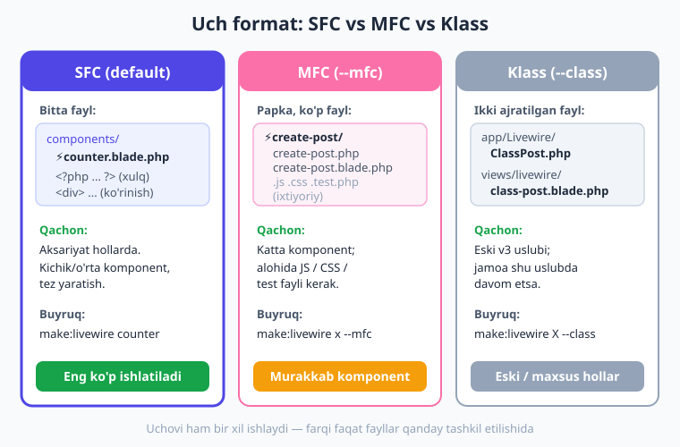
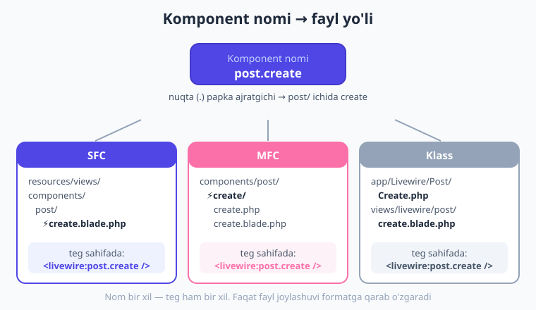
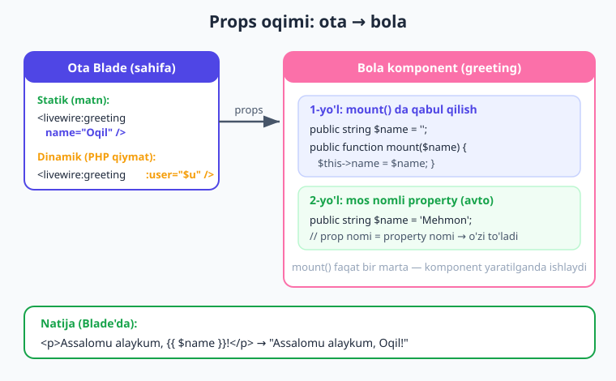

# 04 — Komponent anatomiyasi

[⬅️ Oldingi: 03 — Birinchi komponent](./03-birinchi-komponent.md) · [🏠 Kitob boshi](./README.md) · [Keyingi: 05 — Properties ➡️](./05-properties-holat.md)

> **Bu bobda:** Livewire komponenti aslida nimadan tashkil topganini "ichidan" ko'rib chiqamiz: holat, ko'rinish va xulq. Komponentni yaratishning uch formatini (SFC, MFC, klass) real generatsiya natijalari bilan o'rganamiz, fayl nomidagi ⚡ emoji sirini ochamiz, `render()` qanday ishlashini, nega bitta ildiz element shartligini tushunamiz va komponentni boshqa sahifaga joylab, unga props (parametr) uzatamiz.

---

## Komponent aslida nima?

3-bobda biz birinchi hisoblagichni yasadik va u "sehrli" ishladi. Endi bir qadam orqaga chekinib, savol beramiz: **komponent o'zi nima?**

> **Hayotiy o'xshatish.** Komponentni kichkina **mini-ilova** deb tasavvur qiling. Aytaylik, qovurg'a (uy) ichidagi **kir yuvish mashinasi**. Uning uchta qismi bor:
>
> - **Holati** — hozir qancha suv bor, qaysi rejim tanlangan, necha daqiqa qoldi. Bular mashinaning "xotirasi".
> - **Ko'rinishi** — old paneli: tugmalar, ekrancha, chiroqlar. Siz ko'radigan va bosadigan narsa.
> - **Xulqi** — "Start" tugmasini bossangiz nima bo'ladi, eshik ochilsa nima bo'ladi. Mashinaning "harakatlari".
>
> Kir mashinasi mustaqil: uni boshqa uyga ko'chirsangiz ham xuddi shunday ishlaydi. Va bitta uyda bir nechta bo'lishi mumkin (kir + idish yuvish mashinasi). Livewire komponenti ham shunaqa.

Texnik tilda aytsak, **Livewire komponenti** — bu uch narsaning birlashmasi:

| Qism | Inglizcha | Livewire'da nima |
|---|---|---|
| **Holat** | state / properties | `public` xususiyatlar (`public int $count`) |
| **Ko'rinish** | view / Blade | Blade shabloni (`<div> ... </div>`) |
| **Xulq** | actions | metodlar (`public function increment()`) |

Komponent **mustaqil** (o'zicha ishlaydi), **qayta ishlatiladigan** (bir necha joyda qo'yish mumkin) blokdir. Xuddi LEGO bo'lakchasidek: bittasini yasaysiz, keyin uni istagancha joyga ulaysiz.

!!! note "Eslatma: reaktivlik"
    Komponent **reaktiv** (ya'ni o'zgarishga darhol javob beradigan). Holat o'zgarsa — masalan `$count` bittaga oshsa — ko'rinish avtomatik yangilanadi. Siz "ekranni qo'lda yangila" deb buyruq bermaysiz; Livewire buni o'zi qiladi. Buning ichki mexanizmini [01-bobda](./01-livewire-nima.md) ko'rgan edingiz.

---

## Komponent yaratishning uch formati

Livewire 4 da bitta komponentni **uch xil ko'rinishda** yaratish mumkin. Uchovi ham bir xil ishlaydi — farqi faqat **fayllar qanday tashkil etilishida**. Avval umumiy manzarani ko'rib chiqaylik, keyin har birini alohida yasab tekshiramiz.



### 1-format: SFC (Single-File Component) — asosiy, default

**SFC** (Single-File Component, ya'ni "bitta fayldagi komponent") — Livewire 4 ning eng katta yangiligi va **standart** (default) formati. Holat, xulq va ko'rinish — hammasi **bitta** `.blade.php` faylida turadi.

Quyidagi buyruqni terib ko'ring:

```bash
php artisan make:livewire counter
```

Natija (jonli loyihada tasdiqlangan):

```text
resources/views/components/⚡counter.blade.php
```

Yangi yaratilgan bo'sh SFC fayli **aynan** shunday ko'rinadi:

```php
{{-- resources/views/components/⚡counter.blade.php --}}
<?php

use Livewire\Component;

new class extends Component
{
    //
};
?>

<div>
    {{-- ... --}}
</div>
```

Fayl ikki qismdan iborat:

1. **PHP bloki** (`<?php ... ?>`) — bu yerda holat (xususiyatlar) va xulq (metodlar) yashaydi. E'tibor bering: bu **anonim klass**: `new class extends Component { ... };`. Oxiridagi nuqta-vergul (`;`) **shart** — uni tushirib qoldirsangiz PHP xato beradi.
2. **Blade markup** — komponentning ko'rinishi. Bitta `<div>` ichida.

Mana to'liq ishlaydigan misol (bu jonli Laravel 12 + Livewire 4 loyihada brauzerda render qilinib, HTTP 200 qaytargan):

```php
{{-- resources/views/components/⚡counter.blade.php --}}
<?php

use Livewire\Component;

new class extends Component
{
    public int $count = 0;          // holat

    public function increment(): void  // xulq
    {
        $this->count++;             // hisobni bittaga oshiramiz
    }
};
?>

<div>
    <h1>Hisob: {{ $count }}</h1>    {{-- ko'rinish --}}
    <button wire:click="increment">+</button>
</div>
```

E'tibor bering: public xususiyat (`$count`) Blade'da to'g'ridan-to'g'ri `{{ $count }}` sifatida ko'rinadi — `$this->count` deb yozish shart emas.

!!! tip "Qachon SFC ishlatiladi?"
    **Aksariyat hollarda.** Kichik va o'rta komponentlar uchun SFC eng qulay: kod bir joyda, fayllar orasida sakrab yurish shart emas. Shubhalansangiz — SFC tanlang. Kitobning ko'p qismi shu formatda boradi.

### 2-format: MFC (Multi-File Component) — `--mfc`

Komponent kattalashib, unga **alohida JavaScript, CSS yoki test** kerak bo'lsa, hammasini bitta faylga tiqishtirish noqulay bo'ladi. Shu holda **MFC** (Multi-File Component, "ko'p fayldagi komponent") yordamga keladi: komponent **papka**ga aylanadi va har qism alohida faylda yashaydi.

```bash
php artisan make:livewire create-post --mfc
```

Natija — fayl emas, **papka** yaratiladi:

```text
resources/views/components/⚡create-post/
    create-post.php           # PHP klass (holat + xulq)
    create-post.blade.php     # Blade shablon (ko'rinish)
```

Papka ichidagi `create-post.php` ham xuddi SFC dagidek anonim klass:

```php
{{-- resources/views/components/⚡create-post/create-post.php --}}
<?php

use Livewire\Component;

new class extends Component
{
    //
};
```

Agar JS, CSS yoki test fayllari ham kerak bo'lsa, ularni qo'shimcha bayroqlar bilan so'rashingiz mumkin:

```bash
php artisan make:livewire blog-post --mfc --js --css --test
```

Bu safar papka ichida besh fayl paydo bo'ladi (tasdiqlangan natija):

```text
resources/views/components/⚡blog-post/
    blog-post.php          # PHP klass
    blog-post.blade.php    # Blade shablon
    blog-post.js           # komponentga xos JavaScript
    blog-post.css          # komponentga xos uslublar
    blog-post.test.php     # komponent testi
```

!!! tip "Qachon MFC ishlatiladi?"
    Komponent **kattalashganda** yoki unga **alohida JS/CSS/test** kerak bo'lganda. Masalan, murakkab kalendar yoki rich-text muharrir uchun. Boshlanishida SFC bilan ishlayverib, keyin kerak bo'lsa MFC ga o'tasiz — buni keyingi bo'limda ko'ramiz.

### 3-format: Klass komponent — `--class`

Bu — Livewire 3 dagi **eski uslub**: PHP klassi va Blade shabloni **ikki alohida faylda**, butunlay boshqa papkalarda turadi.

```bash
php artisan make:livewire ClassPost --class
```

Natija — ikki fayl, ikki joyda:

```text
app/Livewire/ClassPost.php                       # PHP klass
resources/views/livewire/class-post.blade.php    # Blade shablon
```

PHP klassi to'liq, nomlangan klass (anonim emas) va `render()` metodi **qo'lda** yoziladi:

```php
// app/Livewire/ClassPost.php
<?php

namespace App\Livewire;

use Livewire\Component;

class ClassPost extends Component
{
    public function render()
    {
        return view('livewire.class-post');
    }
}
```

Blade shabloni esa alohida faylda:

```blade
{{-- resources/views/livewire/class-post.blade.php --}}
<div>
    {{-- ... --}}
</div>
```

!!! info "Livewire 3 da qanday edi?"
    Livewire 3 da **faqat** shu klass formati bor edi — har komponent ikki fayldan iborat bo'lardi. Livewire 4 da SFC asosiy formatga aylandi, lekin klass formati hali ham qo'llab-quvvatlanadi. Eski v3 loyihangiz buzilmaydi, va agar jamoangiz shu uslubda ishlab kelayotgan bo'lsa, davom etishingiz mumkin.

### SFC ↔ MFC: formatni almashtirish

Komponent o'sib ketdimi va endi SFC siqib qo'ydimi? Yoki aksincha, MFC papkasi ortiqcha bo'lib qoldimi? `livewire:convert` buyrug'i komponentni bir formatdan boshqasiga **avtomatik** o'tkazadi:

```bash
php artisan livewire:convert counter
```

Bu buyruq SFC ni MFC ga (yoki teskari) aylantiradi — kodingizni qo'lda ko'chirib o'tirishingiz shart emas. Komponentni har doim SFC dan boshlab, faqat zarurat tug'ilganda MFC ga o'tkazish — juda qulay ish uslubi.

!!! note "Default formatni sozlash"
    Agar jamoangiz doim MFC yoki klass ishlatmoqchi bo'lsa, har safar bayroq yozish shart emas. `config/livewire.php` faylidagi `make_command` sozlamasi orqali default formatni belgilab qo'yishingiz mumkin:
    ```php
    'make_command' => [
        'type' => 'sfc',   // 'sfc', 'mfc' yoki 'class'
        'emoji' => true,   // ⚡ prefiks
    ],
    ```

---

## ⚡ emoji: bu nima va nega bor?

SFC va MFC fayllarining nomi oldida turgan **⚡ (chaqmoq) emoji**ni payqagandirsiz: `⚡counter.blade.php`. Bu **xato emas** va tasodif ham emas — bu **haqiqiy belgi**, fayl nomining bir qismi.

> **Hayotiy o'xshatish.** Tasavvur qiling, papkangizda yuzlab `.blade.php` fayl bor: bir qismi oddiy Blade shablonlar, bir qismi Livewire komponentlari. Qaysi biri "jonli" (reaktiv) ekanini darrov ajratish qiyin. ⚡ emoji — xuddi kitob javonida muhim kitoblarga yopishtirilgan **rangli stiker** kabi: faylga qarashingiz bilanoq "bu Livewire komponenti!" deb tushunasiz.

Livewire 4 komponent fayllarini shu chaqmoq emojisi bilan belgilaydi — bu Blade shablonlarini oddiy partial'lardan vizual ravishda farqlash uchun.

!!! warning "Emoji haqiqiy fayl nomida"
    ⚡ — fayl nomining **rostakam qismi**. Faylni qo'lda ochsangiz yoki Git'da ko'rsangiz, u shu emoji bilan turadi. Komponent **nomida** esa (`<livewire:counter />`, `make:livewire counter`) emoji **yo'q** — siz har doim `counter` deb yozasiz, emojisiz. Emoji faqat diskdagi fayl nomida.

Agar emoji sizga yoqmasa yoki muhitingizda muammo tug'dirsa, uni o'chirib tashlash juda oson. `config/livewire.php` faylida:

```php
// config/livewire.php
'make_command' => [
    'type' => 'sfc',
    'emoji' => false,   // ⚡ ni o'chiramiz — fayl nomi oddiy "counter.blade.php" bo'ladi
],
```

Endi yangi yaratilgan komponentlar emojisiz bo'ladi: `counter.blade.php`.

!!! note "Config faylini chiqarish"
    `config/livewire.php` fayli boshida mavjud bo'lmasligi mumkin. Uni quyidagi buyruq bilan loyihangizga chiqarib oling:
    ```bash
    php artisan livewire:config
    ```

---

## Komponent nomi ↔ fayl yo'li

Komponentlarni papkalarga ajratish uchun nomda **nuqta (`.`)** ishlatiladi. Nuqta — papka ajratgichi. Masalan, `post.create` nomi "`post` papkasi ichidagi `create` komponenti" degani.

```bash
php artisan make:livewire post.create
```

Bu SFC formatida quyidagi faylni yaratadi (tasdiqlangan):

```text
resources/views/components/post/⚡create.blade.php
```

Eng muhimi: **komponent nomi har uch formatda bir xil** (`post.create`), va sahifaga qo'yish tegi ham bir xil (`<livewire:post.create />`). Faqat **fayl qayerda joylashishi** formatga qarab o'zgaradi. Quyidagi diagrammada `post.create` nomi uch formatda qaysi fayllarga to'g'ri kelishini ko'rasiz:



Jadval ko'rinishida:

| Format | Fayl yo'li | Sahifadagi teg |
|---|---|---|
| **SFC** | `resources/views/components/post/⚡create.blade.php` | `<livewire:post.create />` |
| **MFC** | `resources/views/components/post/⚡create/create.php` (+ `.blade.php`) | `<livewire:post.create />` |
| **Klass** | `app/Livewire/Post/Create.php` (+ `resources/views/livewire/post/create.blade.php`) | `<livewire:post.create />` |

!!! tip "Maslahat"
    Komponentlarni mantiqiy papkalarga guruhlang: `admin.users.table`, `shop.cart`, `blog.post.create`. Bu loyiha kattalashganda fayllarni topishni osonlashtiradi va tegda ham mantiq saqlanadi.

---

## `render()` qanday ishlaydi?

Har bir Livewire komponentining qalbida **`render()`** metodi turadi. Uning vazifasi — komponentning Blade shablonini olib, hozirgi holatga ko'ra HTML hosil qilish.

> **Hayotiy o'xshatish.** `render()` — bu **fotograf** kabi. Komponentning hozirgi holatiga (xususiyatlar qiymatiga) qarab "surat oladi" — ya'ni HTML hosil qiladi. Holat har o'zgarganda, fotograf yangi surat oladi.

Yaxshi xabar: **SFC va klass formatlarida `render()` ni odatda yozishingiz shart emas** — Livewire uni avtomatik aniqlaydi.

- **SFC va MFC** da: faylning Blade qismi (yoki `.blade.php` fayli) o'zi shablon vazifasini bajaradi. Livewire uni o'zi topadi va render qiladi.
- **Klass** komponentda: `render()` ni qo'lda yozasiz va Blade shablonni qaytarasiz:

```php
public function render()
{
    return view('livewire.class-post');
}
```

Klass komponentda Blade'ga qo'shimcha ma'lumot uzatish kerak bo'lsa, ikki yo'l bor:

```php
// Yo'l 1: klassik view() helper
public function render()
{
    return view('livewire.class-post', ['author' => $this->author]);
}

// Yo'l 2: Livewire'ning $this->view() metodi
public function render()
{
    return $this->view(['author' => $this->author]);
}
```

!!! warning "render() har yangilanishda ishlaydi — og'ir ish qilmang!"
    Bu juda muhim. `render()` komponent **har yangilanganda qaytadan ishlaydi** — har tugma bosilganda, har input o'zgarganda. Demak, `render()` ichida **og'ir** ishlar (katta ma'lumotlar bazasi so'rovi, tashqi API chaqiruvi) qilsangiz, ular **har safar** takrorlanib, ilovani sekinlashtiradi.
    
    Bunday og'ir so'rovlarni **computed property** (hisoblanadigan xususiyat) ga ko'chirish kerak — u natijani keshlaydi va har safar qayta hisoblamaydi. Bu haqda batafsil [15-bobda (Computed properties)](./15-computed-properties.md) o'rganamiz.

---

## Bitta ildiz element qoidasi

Bu — yangi boshlovchilar tez-tez qoqiladigan qoida, lekin tushunsangiz oddiy. **Komponentning Blade qismi bitta ildiz (root) elementga ega bo'lishi SHART.**

To'g'ri (bitta `<div>` hammasini o'rab turibdi):

```blade
<div>
    <h1>Hisob: {{ $count }}</h1>
    <button wire:click="increment">+</button>
</div>
```

Noto'g'ri (ikki element yonma-yon, ularni o'rab turuvchi yo'q):

```blade
<h1>Hisob: {{ $count }}</h1>      {{-- ❌ ikki alohida ildiz --}}
<button wire:click="increment">+</button>
```

> **Hayotiy o'xshatish.** Pochta jo'natayotganda xatlarni **bitta konvert**ga solasiz. Konvertsiz to'rt varaq qog'ozni alohida tashlasangiz, pochtachi qaysi biri qaysiga tegishli ekanini bilmaydi va adashadi. Livewire ham xuddi shunday: komponentning butun mazmunini bitta "konvert" (ildiz element) ichida ko'rishi kerak.

**Nega shart?** Livewire sahifani har yangilaganda butun HTML ni qaytadan chizmaydi — bu sekin bo'lardi. Buning o'rniga u **DOM diffing** (ya'ni eski va yangi HTML ni solishtirib, faqat o'zgargan joyini almashtirish) qiladi. Buning uchun Livewire'ga komponentni **bitta tugun** (DOM node) sifatida ushlab turishi kerak — qaysi qismni kuzatishi aniq bo'lishi uchun. Bir nechta ildiz bo'lsa, Livewire qaysi birini "komponent chegarasi" deb hisoblashni bilmaydi.

!!! warning "Buzilsa nima bo'ladi?"
    Bir nechta ildiz element qo'ysangiz, Livewire **faqat birinchisini** komponent deb hisoblaydi. Natijada qolgan elementlar yangilanmaydi yoki butunlay yo'qoladi, `wire:click` ishlamaydi va xatolar paydo bo'ladi. Agar bir nechta elementni yonma-yon qo'yish kerak bo'lsa, ularni bitta `<div>` ichiga o'rab oling.

!!! tip "Sharhlar va @php joiz"
    Bitta ildiz element qoidasi **ko'rinadigan** elementlar haqida. Blade sharhlari (`{{-- ... --}}`) yoki `@php ... @endphp` bloklarini ildiz elementdan oldin qo'ysangiz muammo bo'lmaydi — ular HTML chiqarmaydi.

---

## Komponentni boshqa sahifaga joylash

Komponentni yasab oldik — endi uni biror Blade sahifaga **qo'yamiz**. Livewire 4 da buning asosiy yo'li — **teg sintaksisi**:

```blade
<livewire:counter />
```

Bu — oddiy HTML tegiga o'xshaydi, lekin `livewire:` prefiksi bilan. Komponent nomi `counter` (emojisiz, nuqtasiz).

!!! warning "Teg O'ZINI YOPISHI shart (v4 talabi)"
    Livewire 4 da teg **o'zini yopishi** kerak — oxiridagi `/` belgisini unutmang:
    ```blade
    <livewire:counter />     {{-- ✅ to'g'ri: o'zini yopadi --}}
    <livewire:counter>       {{-- ❌ xato: yopilmagan --}}
    ```
    Bu — v4 da kuchaytirilgan qoida. Yopuvchi `/` bo'lmasa, Livewire tegni tanimaydi.

Papkadagi (namespace'li) komponentni qo'yish uchun nuqta ishlatiladi — xuddi nomdagidek:

```blade
<livewire:post.create />
<livewire:admin.users.table />
```

Eski (lekin hali ishlaydigan) **direktiva** sintaksisi ham mavjud:

```blade
@livewire('counter')
@livewire('post.create')
```

!!! tip "Qaysi birini tanlash?"
    Yangi loyihalarda **teg sintaksisini** (`<livewire:counter />`) ishlating — u zamonaviyroq, HTML'ga o'xshashi tufayli o'qish osonroq va props uzatish ham qulayroq. `@livewire(...)` direktivasini asosan eski kodda uchratasiz.

---

## Props uzatish: komponentga ma'lumot berish

Komponentlar — qayta ishlatiladigan bloklar. Lekin bir xil komponentni har joyda **boshqacha** ko'rsatish kerak bo'ladi. Masalan, bitta `greeting` (salomlashish) komponenti bir joyda "Oqil"ga, boshqa joyda "Aziza"ga salom bersin. Buning uchun komponentga **props** (parametr) uzatamiz.

> **Hayotiy o'xshatish.** Props — ofitsiantga aytadigan **buyurtma** kabi. Oshxona (komponent) bitta, lekin siz "manga issiq choy" yoki "manga sovuq sharbat" deb aytasiz. Bir xil oshxona, har xil buyurtma — har xil natija. Props ham komponentga "qanday ma'lumot bilan ishlashini" aytadi.

Quyidagi diagramma props oqimining to'liq manzarasini ko'rsatadi — ota komponentdan props yuborilishi, bola komponentda qabul qilinishi va natija:



### Statik props (matn qiymat)

Eng oddiy holat — props sifatida **matn** (yoki son) uzatish. Bu HTML atributiga juda o'xshaydi:

```blade
<livewire:greeting name="Oqil" />
```

Bu yerda `name="Oqil"` — statik prop. Qiymat tirnoq ichida, oddiy matn.

### Dinamik props (PHP qiymat)

Agar prop qiymati o'zgaruvchi yoki obyekt bo'lsa (masalan, `$user` modeli yoki `$count` o'zgaruvchisi), atribut oldiga **ikki nuqta (`:`)** qo'yiladi:

```blade
<livewire:greeting :name="$user->name" />
<livewire:greeting :user="$user" />
```

Ikki nuqta Livewire'ga: "tirnoq ichidagini matn deb emas, **PHP ifoda** deb hisobla" deydi. `:name="$user->name"` — bu `$user->name` ning qiymatini uzatadi, "`$user->name`" matnini emas.

!!! warning "Statik va dinamikni adashtirmang"
    ```blade
    <livewire:greeting name="$user->name" />    {{-- ❌ "$user->name" MATNINI uzatadi --}}
    <livewire:greeting :name="$user->name" />   {{-- ✅ $user->name QIYMATINI uzatadi --}}
    ```
    Birinchisi so'zma-so'z `$user->name` matnini ko'rsatadi. Ikki nuqta — kichkina belgi, lekin katta farq.

### Bola komponentda props'ni qabul qilish

Komponent props'ni qanday "ushlab oladi"? Ikki yo'l bor.

**1-yo'l: mos nomli public property (avtomatik).** Eng oddiy: agar komponentda prop nomi bilan **bir xil nomli** public xususiyat bo'lsa, Livewire qiymatni avtomatik o'sha xususiyatga soladi. Hech narsa yozish shart emas:

```php
{{-- resources/views/components/⚡greeting.blade.php --}}
<?php

use Livewire\Component;

new class extends Component
{
    public string $name = 'Mehmon';   // prop nomi = property nomi -> o'zi to'ladi
};
?>

<div>
    <p>Assalomu alaykum, {{ $name }}!</p>
</div>
```

Endi:

- `<livewire:greeting name="Oqil" />` → "Assalomu alaykum, **Oqil**!"
- `<livewire:greeting />` (props'siz) → "Assalomu alaykum, **Mehmon**!" (default qiymat ishlaydi)

!!! example "Jonli tasdiq"
    Bu komponent jonli Laravel 12 + Livewire 4 loyihada sahifaga qo'yilib, brauzerda tekshirildi. `name="Oqil"` bilan "Assalomu alaykum, Oqil!" chiqdi; props'siz qo'yilganda default "Mehmon" ishladi. HTTP javob: **200**.

**2-yo'l: `mount()` metodida qabul qilish.** Agar prop'ni saqlashdan oldin uni o'zgartirish yoki tekshirish kerak bo'lsa, `mount()` metodidan foydalaning. Bu metod komponent **birinchi marta yaratilganda** ishlaydi (xuddi konstruktor kabi):

```php
{{-- resources/views/components/⚡greeting.blade.php --}}
<?php

use Livewire\Component;

new class extends Component
{
    public string $name;

    public function mount($name = 'Mehmon')
    {
        // qiymatni qabul qilamiz va, masalan, bosh harfini katta qilamiz
        $this->name = ucfirst($name);
    }
};
?>

<div>
    <p>Assalomu alaykum, {{ $name }}!</p>
</div>
```

`mount($name)` metodining parametri prop nomiga mos kelishi kerak. Livewire `name="oqil"` prop'ini `mount()` ning `$name` parametriga uzatadi, biz esa uni qayta ishlab (`ucfirst`) xususiyatga saqlaymiz.

!!! note "Eslatma: mount() faqat bir marta"
    `mount()` komponent **yaratilganda bir martagina** ishlaydi — keyingi yangilanishlarda (tugma bosilganda va h.k.) qayta chaqirilmaydi. Shuning uchun u boshlang'ich holatni o'rnatish uchun ideal joy. Properties va `mount()` haqida chuqurroq [05-bobda (Properties)](./05-properties-holat.md) gaplashamiz.

!!! danger "Xavfsizlik: public xususiyat mijozga ochiq"
    Esda tuting: props avtomatik tushadigan **public** xususiyatlar mijoz (brauzer) tomonidan **ko'rinadi va o'zgartirilishi mumkin**. Demak, maxfiy ma'lumotni (parol, ichki ID) shunchaki props orqali public xususiyatga uzatish xavfli. Bu mavzuni [23-bobda (Xavfsizlik)](./23-xavfsizlik.md) batafsil ko'ramiz — hozircha shuni eslab qoling.

---

## Xulosa

- **Komponent** — uch qismdan iborat mini-ilova: **holat** (public xususiyatlar), **ko'rinish** (Blade) va **xulq** (metodlar). U mustaqil va qayta ishlatiladigan blok.
- Livewire 4 da komponentni **uch formatda** yaratish mumkin: **SFC** (bitta fayl, default — aksariyat hollarda), **MFC** (papka, alohida JS/CSS/test kerak bo'lganda) va **Klass** (eski v3 uslubi). `livewire:convert` SFC ↔ MFC almashtiradi.
- Fayl nomidagi **⚡ emoji haqiqiy** — Livewire komponentlarini belgilaydi; `config/livewire.php` da `'emoji' => false` bilan o'chiriladi. Komponent **nomida** emoji yo'q.
- Komponent **nomi** (`post.create`) va sahifadagi **teg** (`<livewire:post.create />`) har uch formatda bir xil; faqat fayl joylashuvi farq qiladi. Nuqta — papka ajratgichi.
- **`render()`** har yangilanishda ishlaydi (SFC da avtomatik); shuning uchun og'ir so'rovlarni computed property'ga ko'chiring.
- Komponentning Blade qismida **bitta ildiz element** bo'lishi shart — Livewire DOM diffing uchun bitta tugun ko'rishi kerak. Buzilsa, komponent yangilanmaydi.
- Komponentni sahifaga **`<livewire:counter />`** tegi bilan qo'yiladi (v4 da teg **o'zini yopishi** shart). Eski `@livewire('counter')` ham bor.
- **Props**: statik `name="Oqil"`, dinamik `:user="$user"`. Mos nomli public property avtomatik to'ladi yoki `mount($name)` da qabul qilinadi.

## Amaliy mashqlar

1. **(Oson)** `make:livewire profile` buyrug'i bilan SFC yarating. Yaratilgan faylni oching va uning ikki qismini — PHP bloki va Blade markup — toping. Fayl nomida ⚡ emoji borligini tasdiqlang.

2. **(Oson)** Bitta komponentni uch formatda ham yarating: `make:livewire box` (SFC), `make:livewire panel --mfc` (MFC) va `make:livewire CardBox --class` (klass). Har biri qaysi papkada, qanday fayl(lar) hosil qilganini taqqoslang. Uchovida ham nomda emoji bor-yo'qligiga e'tibor bering.

3. **(O'rta)** `greeting` komponentini yarating: u `name` prop'ini qabul qilib, "Salom, {ism}!" deb chiqarsin. Default qiymatni "Do'st" qiling. Keyin uni boshqa Blade sahifaga ikki marta qo'ying: biri `name="Oqil"` bilan, ikkinchisi props'siz. Brauzerda ikkala natijani ko'ring.

4. **(O'rta)** 3-mashqdagi `greeting` komponentiga `mount()` metodi qo'shing. Unda `name` ni `Str::title()` yoki `ucfirst()` bilan boshlang'ich harfini katta qiling. `name="aziza"` uzatib, natija "Salom, Aziza!" bo'lishini tekshiring.

5. **(Qiyin)** Bilib turib komponentingizning Blade qismida **ikkita** ildiz element qoldiring (bitta `<div>` ichiga o'ramasdan). Sahifani brauzerda oching va nima xato bo'lishini kuzating (konsol/sahifada). Keyin ularni bitta `<div>` ichiga o'rab, muammo yo'qolganini ko'ring — bu "bitta ildiz element" qoidasini his qilishning eng yaxshi yo'li.

---

[⬅️ Oldingi: 03 — Birinchi komponent](./03-birinchi-komponent.md) · [🏠 Kitob boshi](./README.md) · [Keyingi: 05 — Properties ➡️](./05-properties-holat.md)
