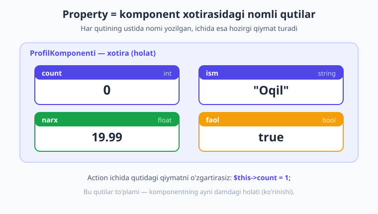
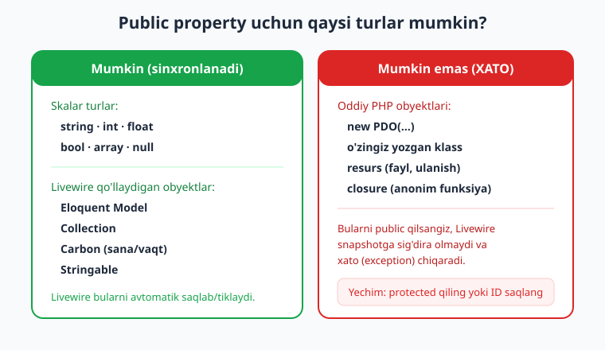
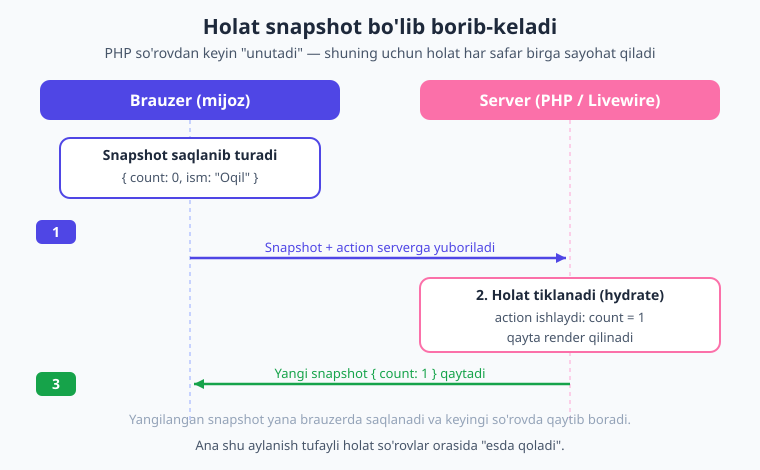

# 05 — Properties: komponent holati

[⬅️ Oldingi: 04 — Komponent anatomiyasi](./04-komponent-anatomiyasi.md) · [🏠 Kitob boshi](./README.md) · [Keyingi: 06 — Data binding ➡️](./06-data-binding.md)

> **Bu bobda:** komponentning "xotirasi" — ya'ni **property** (xususiyat) — bilan tanishasiz. Nega xususiyatlar `public` bo'lishi kerakligini, ularga qaysi turlarni qo'yish mumkinligini, boshlang'ich qiymatni `mount()` orqali qanday berishni va holat so'rovlar orasida qanday saqlanib qolishini o'rganasiz. Oxirida juda muhim bir xavfsizlik qoidasini ham aytib o'tamiz.

---

## Property nima?

Oldingi bobda komponentning ikki qismi borligini ko'rdik: PHP klassi (miya) va Blade shabloni (yuz). Ammo komponent biror narsani **eslab qolishi** kerak — masalan, hisoblagich nechtaga yetganini yoki foydalanuvchi formaga nima yozganini. Ana shu "eslab qolinadigan" qiymatlar **property** (xususiyat) deb ataladi.

> **Hayotiy o'xshatish.** Tasavvur qiling, sizning ish stolingizda bir nechta nomli quti turibdi. Bir qutining ustida "hisob" deb yozilgan, ichida `0` raqami yotibdi. Boshqasida "ism" deb yozilgan, ichida `"Oqil"` qog'ozchasi bor. Siz istalgan paytda qutini ochib, ichidagi qiymatni o'qiysiz yoki yangisiga almashtirasiz. Komponentning property'lari — aynan shu nomli qutilar. Har birining **nomi** (masalan `count`) va **ichidagi qiymati** (masalan `0`) bor.

Texnik tilda aytganda, property — bu PHP klassidagi oddiy o'zgaruvchi (xususiyat). Lekin Livewire'da uning sehrli tomoni shundaki, bu o'zgaruvchining qiymati **server va brauzer o'rtasida avtomatik sinxronlanadi** (ya'ni doim bir xil bo'lib turadi).



Komponentning shu paytdagi barcha property qiymatlari birlashib uning **holatini** (state) tashkil qiladi. Holat — bu komponentning **ayni damdagi ko'rinishi**: hisob nechta, qaysi tab ochiq, forma to'ldirilganmi yoki yo'qmi. Holat o'zgarsa, ekrandagi ko'rinish ham o'zgaradi. Shuning uchun Livewire bilan ishlash, aslida, **holatni boshqarish** demakdir.

> **Holat (state)** — komponentning hozirgi paytdagi to'liq tasviri, ya'ni barcha property qiymatlari yig'indisi. "Holatni o'zgartirish" — ekrandagi natijani o'zgartirish degani.

Quyida hisoblagich komponenti — bitta property (`$count`) va uni o'zgartiruvchi bitta action (`increment`):

```php
{{-- resources/views/components/⚡counter.blade.php --}}
<?php

use Livewire\Component;

new class extends Component
{
    public int $count = 0;   // property: komponentning xotirasi

    public function increment(): void
    {
        $this->count++;      // qutidagi qiymatni o'zgartiramiz
    }
};
?>

<div>
    <h1>Hisob: {{ $count }}</h1>
    <button wire:click="increment">+</button>
</div>
```

Bu yerda `$count` — property. Uni Blade ichida shunchaki `{{ $count }}` deb chaqirdik (oldida `$this` kerak emas — Livewire avtomatik uzatadi). Action ichida esa `$this->count` orqali murojaat qildik.

## Nega xususiyatlar `public` bo'lishi kerak?

E'tibor bering, biz yuqorida `public int $count` deb yozdik — `public` so'zi bejiz emas. PHP'da xususiyatlar uch xil "ko'rinish darajasi"ga ega bo'lishi mumkin:

- **`public`** — hammaga ochiq;
- **`protected`** — faqat shu klass va vorislari uchun;
- **`private`** — faqat shu klassning o'zi uchun.

Livewire'da bu farqning juda muhim oqibati bor:

> **Hayotiy o'xshatish.** `public` xususiyat — bu deraza oldidagi vitrina. Do'kon ichidagi mahsulot vitrinada turibdi: o'tkinchi uni ko'radi va hatto qo'l cho'zib o'zgartira oladi. `protected`/`private` xususiyat esa — orqa xonadagi ombor: faqat sotuvchi (server) ko'radi, mijoz (brauzer) unga umuman tegolmaydi.

Texnik qoida sodda:

!!! note "Asosiy qoida"
    **Faqat `public` xususiyatlar frontend bilan sinxronlanadi.** Ya'ni faqat ular Blade'da ko'rinadi, brauzerga yuboriladi va u yerdan qaytib keladi. `protected` va `private` xususiyatlar esa faqat **serverda** qoladi — Blade ularni ko'rmaydi, brauzer ulardan bexabar.

Demak, agar qiymatni ekranda ko'rsatmoqchi yoki `wire:model` bilan bog'lamoqchi bo'lsangiz, u **albatta `public`** bo'lishi shart. Agar qiymat faqat server ichida kerak bo'lsa (masalan, ichki hisob-kitob uchun) va uni mijozga ko'rsatmaslik kerak bo'lsa — `protected` qiling.

```php
new class extends Component
{
    public string $ism = 'Oqil';      // Blade'da ko'rinadi, sinxronlanadi
    protected string $maxfiyKalit = 'abc123';  // faqat serverda, brauzer ko'rmaydi
};
```

## Qaysi turlarni qo'yish mumkin?

Property'ga istalgan narsani qo'yib bo'lmaydi. Sababi: Livewire har so'rovda property qiymatlarini brauzerga **JSON ko'rinishida** yuborishi kerak (buni keyingi bo'limda batafsil ko'ramiz). JSON esa faqat ma'lum turlarni "tushunadi".



**Ruxsat etilgan turlar** ikki guruhga bo'linadi:

1. **Skalar (oddiy) turlar:** `string`, `int`, `float`, `bool`, `array`, `null`. Bular muammosiz ishlaydi.
2. **Livewire maxsus qo'llab-quvvatlaydigan obyektlar:** Eloquent `Model`, `Collection`, `Carbon` (sana/vaqt), `Stringable`. Livewire bularni **avtomatik saqlaydi va tiklaydi** (ya'ni JSON'ga aylantiradi, keyin qaytaradi).

```php
new class extends Component
{
    public string $ism = 'Oqil';
    public int $yosh = 25;
    public float $balans = 19.99;
    public bool $faol = true;
    public array $teglar = ['php', 'livewire'];
    public ?string $izoh = null;          // null ham mumkin
};
```

Boshqa **har qanday obyekt** (masalan, o'zingiz yozgan oddiy klass, `PDO` ulanishi, fayl resursi yoki closure) property'ga qo'yilsa — Livewire uni snapshotga sig'dira olmaydi va **xato (exception)** chiqaradi.

!!! warning "Ehtiyot bo'ling"
    Quyidagi kod **xato beradi**, chunki oddiy obyektni Livewire serialize qila olmaydi:

    ```php
    public $ulanish;   // ...

    public function mount()
    {
        $this->ulanish = new \PDO(...);   // XATO: bunday obyekt mumkin emas
    }
    ```

    Agar serverda biror obyekt kerak bo'lsa, uni **`protected`** xususiyatda saqlang yoki har so'rovda qaytadan yarating. Modelni butunligicha saqlash o'rniga, ko'pincha faqat uning **ID**'sini (`int`) public property'da saqlash yetarli.

> **Hayotiy o'xshatish.** Snapshot — bu pochta orqali yuboriladigan posilka. Ichiga qog'oz (matn), raqam, ro'yxat solsangiz — posilka muammosiz ketadi. Lekin ichiga tirik baliq (jonli ulanish, ochiq fayl) solsangiz — pochta uni qabul qilmaydi. Skalar turlar — "qog'ozli" narsalar; jonli obyektlar — "baliq".

## Boshlang'ich qiymat: ikki yo'l

Property'ga dastlabki qiymatni ikki usulda berish mumkin.

**1-usul — to'g'ridan-to'g'ri e'lon paytida** (qiymat oldindan ma'lum bo'lsa):

```php
public int $count = 0;
public string $holat = 'yangi';
public array $ranglar = ['qizil', 'yashil'];
```

**2-usul — `mount()` metodi ichida** (qiymatni dinamik hisoblash yoki tashqaridan olish kerak bo'lsa):

```php
public string $bugun;

public function mount(): void
{
    $this->bugun = now()->format('d.m.Y');   // qiymatni dinamik o'rnatamiz
}
```

Bu yerda `now()` har komponent ochilganda joriy sanani beradi — buni e'lon paytida yozib bo'lmaydi, shuning uchun `mount()` ichida o'rnatamiz.

## `mount()` — konstruktor o'rnida

`mount()` — bu Livewire komponentidagi eng muhim metodlardan biri. U **komponent birinchi marta yaratilganda BIR MARTA** ishlaydi.

> **Hayotiy o'xshatish.** `mount()` — yangi tikilgan kostyumning birinchi o'lchovi. Tikuvchi sizni faqat bir marta o'lchaydi va kostyumni shu o'lchovga moslab tikadi. Keyin har kiyganingizda qaytadan o'lchamaydi. `mount()` ham xuddi shunday: komponent "tikilganda" bir marta ishlaydi, holatni dastlabki sozlaydi, keyingi har bir tugma bosishida esa qaytadan chaqirilmaydi.

!!! info "Nega konstruktor emas, `mount()`?"
    PHP'da odatda obyektni `__construct()` konstruktor sozlaydi. Lekin Livewire komponenti har so'rovda qaytadan yaratilib turadi, shuning uchun konstruktor bu yerda mos kelmaydi. Livewire buning o'rniga **`mount()`** ni faqat birinchi (eng birinchi) yaratishda chaqiradi. Demak, "boshlang'ich sozlash" kodini doim `mount()` ichiga yozing.

`mount()` ning yana bir kuchi — u **parametr qabul qila oladi**. Bu parametrlar komponentga tashqaridan, teg orqali uzatiladigan **props** (xususiyatlar). Masalan, blogda har bir maqola sahifasiga shu maqola obyektini uzatamiz:

```php
<?php

use App\Models\Post;
use Livewire\Component;

new class extends Component
{
    public string $title;
    public string $content;

    public function mount(Post $post): void
    {
        // tashqaridan kelgan $post'dan kerakli maydonlarni olamiz
        $this->title = $post->title;
        $this->content = $post->content;
    }
};
?>

<div>
    <h1>{{ $title }}</h1>
    <p>{{ $content }}</p>
</div>
```

Komponentni chaqirganda `$post`ni teg orqali uzatamiz (oldida `:` dinamik qiymat belgisi):

```blade
<livewire:post.show :post="$post" />
```

!!! tip "Maslahat"
    `mount()` ga uzatilgan parametr nomi (`$post`) teg atributining nomiga (`:post`) **aynan mos** bo'lishi kerak. Agar tip-belgi (`Post $post`) qo'ysangiz va faqat ID uzatsangiz, Laravel route-model-binding orqali Eloquent modelini avtomatik topib beradi.

## Holat qanday saqlanadi?

Mana eng "sehrli" tuyuladigan savol: agar PHP har so'rovdan keyin hamma narsani unutsa (PHP "stateless" — eslab qolmaydi), holat qanday qilib bir tugma bosishidan ikkinchisiga saqlanib qoladi?

Javob — **snapshot** (holat surati) mexanizmida.

> **Hayotiy o'xshatish.** Tasavvur qiling, siz unutuvchan, lekin ishchan kotib bilan ishlayapsiz. Har safar uning oldiga kirganingizda u sizni tanimaydi — chunki chiqib ketishingiz bilan hammasini unutadi. Shuning uchun siz har kirganda qo'lingizga bir varaq qog'oz olib kirasiz: unda "hozirgi holat: hisob = 5" deb yozilgan. Kotib qog'ozni o'qiydi, ishni bajaradi, qog'ozga yangi holatni yozib (`hisob = 6`) sizga qaytaradi. Siz bu qog'ozni saqlab qo'yasiz va keyingi safar yana olib kirasiz. **Snapshot — aynan shu qog'oz.**

Texnik jihatdan jarayon shunday kechadi:

1. Komponentning barcha public property qiymatlari **snapshot** (JSON) ko'rinishida brauzerda saqlanadi.
2. Foydalanuvchi tugmani bosganda, brauzer bu snapshotni action bilan birga **serverga yuboradi**.
3. Server snapshotdan komponent holatini **tiklaydi** (hydrate), action'ni bajaradi, holatni yangilaydi.
4. Server **yangi snapshotni** brauzerga qaytaradi, brauzer uni saqlab qo'yadi.



Mana shu aylanish tufayli holat so'rovlar orasida saqlanib qoladi. Bu — Livewire'ni tushunishdagi eng muhim g'oya.

!!! note "Eslatma"
    Aynan shuning uchun property qiymatlari **yengil va sodda** bo'lishi kerak. Snapshot har so'rovda tarmoq orqali borib-keladi, shuning uchun unga juda katta massiv yoki minglab yozuvni solib qo'ymang — bu so'rovni og'irlashtiradi. Katta ro'yxatlarni keyinroq, [computed property](./15-computed-properties.md) bilan, snapshotga solmasdan ko'rsatishni o'rganamiz.

## Holatni o'zgartirish

Holatni o'zgartirishning ikki yo'li bor:

**1. Action ichida — server tomonida.** Metod ichida `$this->property = ...` deb yozasiz:

```php
public function increment(): void
{
    $this->count++;            // hisobni bittaga oshiramiz
}

public function nomTayinla(): void
{
    $this->ism = 'Yangi ism';  // ism qutisini yangilaymiz
}
```

**2. `wire:model` orqali — brauzer tomonidan.** Foydalanuvchi input maydoniga yozganda, property avtomatik yangilanadi. Bu juda muhim mavzu, shuning uchun unga **keyingi [06-bob](./06-data-binding.md)** to'liq bag'ishlanadi:

```blade
<input type="text" wire:model="ism">
```

Hozircha shuni bilish kifoya: holatni yo PHP kodi (action), yo foydalanuvchi (forma) o'zgartiradi va Livewire har ikkisini ham avtomatik sinxronlaydi.

## Holatni boshlang'ich qiymatga qaytarish: `reset()`

Ko'pincha forma yuborilgandan keyin yoki "Bekor qilish" tugmasi bosilganda, property'larni dastlabki holatiga qaytarish kerak bo'ladi. Buning uchun `reset()` metodi bor.

> **Hayotiy o'xshatish.** `reset()` — kalkulyatordagi "C" (clear) tugmasi. Bosasiz — hamma narsa boshlang'ich `0` holatiga qaytadi.

`reset()` property'ni **boshlang'ich qiymatiga** (e'lon paytida berilgan qiymatga) qaytaradi:

```php
public string $ism = '';
public string $email = '';
public int $count = 0;

public function tozala(): void
{
    $this->reset();                  // BARCHA property'larni boshlang'ich holatiga qaytaradi
}

public function faqatIsmni(): void
{
    $this->reset('ism');             // faqat bitta property
}

public function ikkitasini(): void
{
    $this->reset(['ism', 'email']);  // bir nechta property
}
```

Yana bir foydali metod — `pull()`. U property qiymatini **qaytaradi va shu zahoti tozalaydi** (boshlang'ich holatga qaytaradi). Ya'ni "ol va bo'shat":

```php
public function saqla(): void
{
    $ism = $this->pull('ism');   // 'ism' qiymatini olamiz VA uni tozalaymiz
    // $ism bilan biror ish qilamiz, masalan bazaga yozamiz...
}
```

!!! tip "Maslahat"
    `reset()` property'ni **e'lon paytidagi** qiymatga qaytaradi, `mount()` da o'rnatilgan dinamik qiymatga emas. Agar `mount()` da murakkab boshlang'ich holat o'rnatgan bo'lsangiz va aynan o'shanga qaytmoqchi bo'lsangiz, "tozalash" kodini alohida metodda yozib, uni `mount()` dan ham, kerakli action'dan ham chaqirgan ma'qul.

## ⚠️ Xavfsizlik: public xususiyat — ochiq eshik

Endi eng muhim ogohlantirish. Yuqorida public xususiyat "vitrina"ga o'xshatildi: mijoz uni nafaqat **ko'radi**, balki **o'zgartira ham oladi**.

!!! danger "Xavfsizlik"
    **Public property qiymati brauzerga (mijozga) yuboriladi va u yerda O'ZGARTIRILISHI mumkin.** Tajribali foydalanuvchi brauzerdagi snapshotni qo'lda tahrirlab, property qiymatini o'zi xohlagancha o'zgartirib serverga yuborishi mumkin. Demak:

    - **Maxfiy ma'lumotni** (parol, maxfiy kalit, boshqa foydalanuvchining ma'lumoti) **hech qachon public property'da saqlamang.** Uni `protected` qiling.
    - **Ishonchsiz ma'lumotga tayanmang.** Masalan, narxni public property'da saqlab, foydalanuvchidan kelgan qiymatga ishonib to'lov hisoblamang — foydalanuvchi narxni `0` ga o'zgartirishi mumkin.

Misol uchun, quyidagi kod **xavfli**, chunki `$narx` public va foydalanuvchi uni o'zgartira oladi:

```php
public float $narx = 100.0;   // XAVFLI: mijoz narxni o'zgartirib yuborishi mumkin

public function tolov(): void
{
    // foydalanuvchi $narx ni 0 ga o'zgartirib yuborgan bo'lishi mumkin!
    Tolov::create(['summa' => $this->narx]);
}
```

Bunday holatda narxni **serverda qaytadan, ishonchli manbadan** (masalan bazadan, mahsulot ID'si bo'yicha) olish kerak.

Livewire bu muammoning yechimini ham beradi — **`#[Locked]`** atributi. U property'ni frontend tomonidan o'zgartirishdan himoyalaydi (mijoz uni ko'radi, lekin o'zgartira olmaydi):

```php
use Livewire\Attributes\Locked;

#[Locked]
public int $userId;   // mijoz buni o'zgartira olmaydi
```

Bu mavzuni — `#[Locked]`, avtorizatsiya va mass-assignment himoyasini — to'liq **[23-bobda (Xavfsizlik)](./23-xavfsizlik.md)** ko'rib chiqamiz. Hozircha shu qoidani esda tuting: **public = ochiq eshik. Maxfiy narsani u yerga qo'ymang.**

## Property'ga muqobil yondashuvlar (qisqacha)

Property — holatni saqlashning asosiy, lekin yagona yo'li emas. Ikki muqobilni qisqacha eslatib o'tamiz (har biri o'z bobida batafsil bo'ladi):

- **Computed property** — saqlanadigan emas, balki **hisoblanadigan** holat. Masalan, "to'liq ism" `$ism` va `$familiya` dan har safar hisoblansa, uni alohida property'da saqlash shart emas — `#[Computed]` bilan hisoblab beruvchi metod yozasiz. Bu snapshotni yengillashtiradi. Batafsil — [15-bob](./15-computed-properties.md).
- **`protected` xususiyat** — serverda qoladigan, sinxronlanmaydigan yordamchi qiymat. Mijozga ko'rsatilmasligi kerak bo'lgan yoki snapshotga sig'maydigan obyektlar uchun.

Qaysi birini tanlash kerakligi sodda mantiqqa bo'ysunadi: **mijozga ko'rinishi va o'zgarishi kerakmi → `public`; faqat serverda kerakmi → `protected`; har safar hisoblansa bo'ladimi → computed.**

## Xulosa

- **Property** — komponentning xotirasidagi nomli "qutilar"; ularning yig'indisi komponentning **holatini** (state) tashkil qiladi, ya'ni uning ayni damdagi ko'rinishini.
- Faqat **`public`** xususiyatlar frontend bilan sinxronlanadi (Blade'da ko'rinadi, brauzerga boradi). `protected`/`private` — faqat serverda qoladi.
- Property'ga **skalar turlar** (`string`, `int`, `float`, `bool`, `array`, `null`) va Livewire qo'llaydigan obyektlar (`Model`, `Collection`, `Carbon`, `Stringable`) qo'yish mumkin. Boshqa obyektlar **xato** beradi.
- Boshlang'ich qiymat — e'lon paytida (`public int $count = 0;`) yoki **`mount()`** ichida dinamik beriladi.
- **`mount()`** — konstruktor o'rnida ishlovchi, faqat **bir marta** (komponent yaratilganda) chaqiriladigan metod; tashqaridan **props** qabul qiladi.
- Holat har so'rovda **snapshot** bo'lib server bilan brauzer orasida borib-keladi — shuning uchun u so'rovlar orasida saqlanadi va shuning uchun yengil bo'lishi kerak.
- Holatni action ichida `$this->...` bilan yoki `wire:model` orqali o'zgartirasiz; `reset()` / `pull()` boshlang'ich qiymatga qaytaradi.
- **Public property mijoz tomonidan ko'rinadi va o'zgartirilishi mumkin** — maxfiy yoki ishonchsiz ma'lumotni public qilmang; himoya uchun `#[Locked]` bor (23-bob).

## Amaliy mashqlar

1. **Sodda profil.** `⚡profil` nomli SFC komponent yarating. Unga uchta public property qo'ying: `$ism` (string), `$yosh` (int), `$faol` (bool). Boshlang'ich qiymatlarni e'lon paytida bering va Blade'da ularni chiroyli ko'rsating. Brauzerda ochib, qiymatlar ko'rinayotganini tekshiring.

2. **`mount()` bilan dinamik boshlash.** Yuqoridagi profil komponentiga `$royxatgaOlingan` (string) property qo'shing va uni `mount()` ichida `now()->format('d.m.Y')` bilan o'rnating. Nega bu qiymatni e'lon paytida emas, `mount()` da berish kerakligini bir-ikki jumlada izohlang.

3. **Turli turdagi qutilar.** Profilga `$qiziqishlar` (array, masalan `['kitob', 'sport']`) va `$balans` (float) property qo'shing. Blade'da `$qiziqishlar` ni `@foreach` bilan ro'yxat qilib chiqaring. Keyin atayin oddiy obyekt (masalan `new \stdClass()`) ni public property'ga `mount()` da qo'yib ko'ring — Livewire qanday xato berishini kuzating va nega ekanini tushuntiring.

4. **Reset tugmasi.** Profil komponentiga "Boshlang'ichga qaytar" tugmasini qo'shing. Avval bir nechta property qiymatini action orqali o'zgartiradigan tugmalar yarating (masalan, `$yosh` ni oshiruvchi), so'ng `reset()` chaqiruvchi tugma bilan hammasini dastlabki holatga qaytaring. Bonus: faqat `$yosh` ni qaytaradigan alohida tugma yasang (`reset('yosh')`).

5. **Xavfsizlik mulohazasi (yozma).** Faraz qiling, internet-do'kon komponentida `public float $chegirma` property bor va to'lov shu chegirmaga asosan hisoblanadi. Bu nega xavfli ekanini va uni qanday tuzatish kerakligini (qiymatni qayerdan olish kerak) 3-4 jumlada yozing. `#[Locked]` bu yerda yetarli yechimmi yoki yo'qmi — fikringizni bildiring.

---

[⬅️ Oldingi: 04 — Komponent anatomiyasi](./04-komponent-anatomiyasi.md) · [🏠 Kitob boshi](./README.md) · [Keyingi: 06 — Data binding ➡️](./06-data-binding.md)
