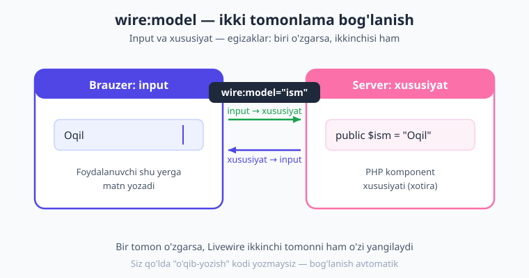
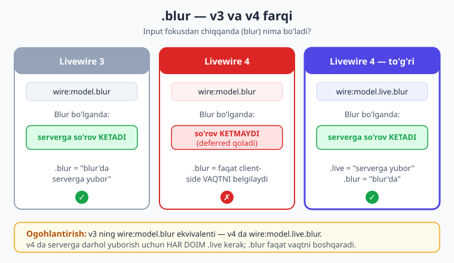
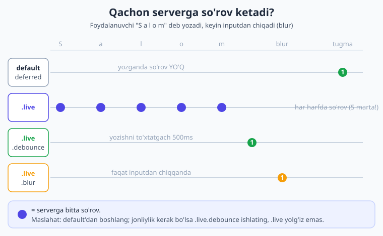

# 06 — Data binding: wire:model

[⬅️ Oldingi: 05 — Properties](./05-properties-holat.md) · [🏠 Kitob boshi](./README.md) · [Keyingi: 07 — Actions ➡️](./07-actions.md)

> **Bu bobda:** input maydoni bilan komponent xususiyatini bir-biriga "egiz" qilib bog'lashni — ya'ni `wire:model`'ni — o'rganamiz. Livewire 4 da bu bog'lanish semantikasi **jiddiy o'zgardi**: endi u **kechiktirilgan** (deferred) bo'lib, faqat keyingi action'da serverga boradi. Biz `.live`, `.blur`, `.debounce`, `.throttle`, `.number`, `.lazy`, `.deep` kabi modifikatorlarni va ularni qachon ishlatishni puxta o'rganamiz. Eng asosiysi — `.live`'ni har joyda ishlatib ilovani sekinlashtirish xatosidan qochishni.

---

## Data binding nima?

Oldingi bobda biz komponent **xususiyatlari** (properties) bilan tanishdik — bular komponentning "xotirasi", ya'ni server tomonida saqlanadigan o'zgaruvchilar. Endi savol tug'iladi: foydalanuvchi brauzerda biror inputga matn yozganda, bu matn qanday qilib server tomonidagi xususiyatga "yetib boradi"?

Javob — **data binding** (ma'lumotni bog'lash).

> **Hayotiy o'xshatish — egizaklar.** Tasavvur qiling, ikki nafar bir xil egizak bor. Ulardan biri sochini kalta qildirsa, ikkinchisining ham sochi xuddi shunday "o'zi-o'zidan" o'zgaradi (xayoliy egizaklar-da!). Data binding ham aynan shunday: **input** va **xususiyat** — egizaklar. Input ichidagi matn o'zgarsa, xususiyat ham o'sha qiymatga aylanadi. Aksincha, server xususiyatni o'zgartirsa, inputda ham yangi qiymat ko'rinadi. Ular **ikki tomonlama** (two-way) bog'langan.

Texnik tilda aytsak: **data binding — bu input (HTML maydoni) bilan komponent xususiyatining ikki tomonlama, avtomatik sinxronlanishi.** Siz qo'lda "qiymatni o'qib olib, o'zgaruvchiga yozish" kabi kod yozmaysiz. Livewire buni o'zi qiladi. Buning uchun bizga atigi bitta atribut kerak: `wire:model`.



Eng oddiy misol — SFC (Single-File Component) shaklida:

```php
{{-- resources/views/components/⚡salom.blade.php --}}
<?php

use Livewire\Component;

new class extends Component
{
    public string $ism = '';   // xususiyat — "egizakning" server tomoni
};
?>

<div>
    {{-- input va $ism xususiyati bir-biriga bog'landi --}}
    <input type="text" wire:model="ism" placeholder="Ismingizni yozing">

    <p>Salom, {{ $ism }}!</p>
</div>
```

Bu yerda `wire:model="ism"` degani: "shu input maydonini `$ism` xususiyati bilan egizak qil". Foydalanuvchi inputga "Oqil" deb yozsa, `$ism` ham `"Oqil"`ga aylanadi.

> **Lekin diqqat!** Yuqoridagi misolda siz yozayotganingizda `<p>Salom, {{ $ism }}!</p>` qatori **darhol yangilanmaydi**. Nega? Chunki Livewire 4 da `wire:model` default holatda **kechiktirilgan** ishlaydi. Buni endi batafsil tushuntiramiz — bu bobning eng muhim qismi.

---

## `wire:model` — default **deferred** (kechiktirilgan)

Livewire 4 da quyidagicha yozsangiz:

```blade
<input type="text" wire:model="title">
```

bu **kechiktirilgan** (deferred) bog'lanish bo'ladi. "Kechiktirilgan" degani:

- Foydalanuvchi har harf yozganda **serverga so'rov yuborilmaydi.** Qiymat brauzerda (mijoz tomonida) ushlab turiladi.
- Server tomondagi `$title` xususiyati **faqat keyingi action sodir bo'lganda** (masalan, foydalanuvchi tugmani bosganda yoki formani yuborganda) yangilanadi.

> **Hayotiy o'xshatish — savatcha va kassa.** Do'konda mahsulot olganingizda har bir narsa uchun alohida pul to'lab yugurmaysiz. Hammasini **savatchaga** yig'ib, oxirida bir marta **kassada** to'laysiz. `wire:model` (deferred) ham shunday: yozgan harflaringiz "savatchada" to'planadi, keyin biror action bo'lganda hammasi bir marta serverga "kassaga" boradi.

### Nega bu default?

Sababi bitta so'z bilan: **tezlik.**

Tasavvur qiling, foydalanuvchi 50 belgili sarlavha yozyapti. Agar har harf serverga so'rov yuborsa — bu **50 ta tarmoq so'rovi** bo'ladi! Bu:

- Serverni ortiqcha yuklaydi (har so'rov komponentni qaytadan render qiladi).
- Sekin internetda inputni "qotib qolgan", "kechikadigan" qiladi.
- Ortiqcha trafik sarflaydi.

Aksariyat hollarda sizga foydalanuvchi yozayotgan **har bir harf** server tomonida darhol kerak emas — sizga faqat **yakuniy qiymat** (formani yuborganda) kerak. Shuning uchun Livewire 4 deferred'ni default qildi: tabiiy, tez, isrofgarchiliksiz.

!!! info "Livewire 3 da qanday edi?"
    Livewire 3 da `wire:model` default holatda **deferred** edi, va darhol yangilash uchun `wire:model.live` ishlatilardi — bu jihatdan o'xshash. Ammo `.blur` va `.change` modifikatorlarining ma'nosi Livewire 4 da o'zgardi (bu haqda quyida `!!! warning` blokida batafsil). Shuning uchun Livewire 3 dan ko'chayotgan bo'lsangiz, eski `.blur`/`.change` kodlaringizni qayta ko'rib chiqish kerak bo'ladi.

```php
{{-- resources/views/components/⚡maqola.blade.php --}}
<?php

use Livewire\Component;

new class extends Component
{
    public string $title = '';

    public function save(): void
    {
        // Bu yerda $title YOZILGAN yakuniy qiymatga ega bo'ladi.
        // Har harf uchun emas, faqat shu tugma bosilganda server yangilandi.
    }
};
?>

<div>
    <input type="text" wire:model="title" placeholder="Sarlavha">

    {{-- "Saqlash" bosilguncha server $title'ni bilmaydi --}}
    <button wire:click="save">Saqlash</button>
</div>
```

---

## `wire:model.live` — darhol (real-vaqt)

Ba'zan sizga aksincha kerak bo'ladi: foydalanuvchi yozayotgan **har bir o'zgarishda darhol serverga** xabar berish. Buning uchun `.live` modifikatorini qo'shamiz:

```blade
<input type="text" wire:model.live="search">
```

Endi har bir bosilgan tugma (harf) serverga so'rov yuboradi va komponent qayta render bo'ladi. Bu **real-vaqt** (real-time) bog'lanish.

### Qachon `.live` kerak?

`.live` aynan o'sha holatlar uchun: server natijasi yozayotganingiz bilan **birga** yangilanishi kerak bo'lganda.

- **Jonli qidiruv** — foydalanuvchi har harf yozganda natijalar ro'yxati darhol filtrlanadi.
- **Jonli oldindan ko'rish (preview)** — Markdown yoki izoh yozayotganda pastda darhol natija ko'rinadi.
- **Belgilar sanagichi** — "qoldi: 137 ta belgi" kabi tirik hisoblagich.
- **Bir-biriga bog'liq maydonlar** — viloyat tanlanganda tuman ro'yxati yangilanadi.

```php
{{-- resources/views/components/⚡jonli-qidiruv.blade.php --}}
<?php

use Livewire\Component;
use App\Models\Post;

new class extends Component
{
    public string $search = '';

    public function with(): array
    {
        // $search har o'zgarishda yangilanadi, natija ham darhol filtrlanadi
        return [
            'posts' => Post::where('title', 'like', "%{$this->search}%")->get(),
        ];
    }
};
?>

<div>
    <input type="text" wire:model.live="search" placeholder="Qidirish...">

    <ul>
        @foreach ($posts as $post)
            <li>{{ $post->title }}</li>
        @endforeach
    </ul>
</div>
```

### `.live`'ning narxi

`.live` qulay, lekin u **bepul emas**. Har bir o'zgarish = bitta tarmoq so'rovi + bitta to'liq qayta render. Agar foydalanuvchi tez yozsa, server "so'rovlar yomg'iri" ostida qoladi. Shuning uchun `.live`'ni o'ylab ishlating va keyinroq ko'radigan `.debounce` bilan birga qo'llang (qidiruvda deyarli har doim shunday qilinadi).

> **Oddiy qoida.** "Server natijani yozayotganim bilan birga ko'rsatishi shartmi?" — agar **ha** bo'lsa, `.live`. Agar **yo'q** (formani yuborganda yetadi) bo'lsa, default deferred.

---

## v4 yangiligi: `.blur` va `.change` (eng muhim qism!)

Bu — Livewire 3 dan ko'chayotganlar uchun eng ko'p chalkashlik keltiradigan o'zgarish. Diqqat bilan o'qing.

!!! warning "Ehtiyot bo'ling — v4 da `.blur` va `.change` ma'nosi o'zgardi!"
    Livewire 4 da `wire:model.blur` va `wire:model.change` endi **client-side (brauzer tomonidagi) sinxronlanish vaqtini** boshqaradi — ya'ni qiymat **qachon** ushlab olinishini, **tarmoqqa so'rov yuborilishini emas.**

    Bu degani: `wire:model.blur="title"` **o'z-o'zidan serverga so'rov yubormaydi.** U faqat "input fokusdan chiqqanda (blur) qiymatni ushlab ol" deydi — lekin baribir **deferred** (keyingi action'gacha serverga bormaydi).

    Livewire 3 dagidek "fokusdan chiqqanda **serverga** yubor" xulqi uchun siz `.live`'ni **ham qo'shishingiz** kerak:

    ```blade
    wire:model.live.blur="title"
    ```

Buni aniq taqqoslama bilan ko'raylik. Quyidagi jadval har bir variant **qachon serverga so'rov yuborishini** ko'rsatadi:

| Yozuv | Qiymat qachon ushlanadi | Serverga so'rov qachon ketadi |
|---|---|---|
| `wire:model="title"` | Har o'zgarishda (mijoz xotirasida) | Faqat keyingi action'da (deferred) |
| `wire:model.blur="title"` | Input fokusdan chiqqanda | Faqat keyingi action'da (deferred) |
| `wire:model.live="title"` | Har o'zgarishda | **Darhol, har o'zgarishda** |
| `wire:model.live.blur="title"` | Input fokusdan chiqqanda | **Fokusdan chiqqanda darhol** |

Ya'ni `.blur` o'zicha "qachon" so'rog'iga javob beradi, `.live` esa "umuman darhol serverga ketsinmi?" degan savolga javob beradi. Ikkalasi birlashganda — "fokusdan chiqqanda serverga yubor" hosil bo'ladi.



!!! info "Livewire 3 da qanday edi?"
    Livewire 3 da `wire:model.blur` to'g'ridan-to'g'ri "input fokusdan chiqqanda **serverga yubor**" degani edi. Livewire 4 da bu mas'uliyat ajratildi: `.blur` faqat **vaqtni** belgilaydi, serverga yuborishni esa `.live` hal qiladi. Demak Livewire 3 ning `wire:model.blur` ekvivalenti Livewire 4 da `wire:model.live.blur` bo'ladi.

> **Nega bunday qilindi?** Bu o'zgarish Livewire xulqini yanada izchil (predictable) qildi. Endi bitta savol — "serverga darhol boradimi?" — har doim **bitta** modifikator (`.live`) bilan hal qilinadi. `.blur`, `.change`, `.debounce` kabi modifikatorlar esa faqat **vaqtni** sozlaydi. Ikki tushuncha aralashib ketmaydi.

---

## Boshqa modifikatorlar

`wire:model`'ga qo'shimcha modifikatorlar qo'shib, uning xulqini moslashtirishimiz mumkin. Quyida eng kerakli modifikatorlar.

### `.debounce.500ms` — yozishni to'xtatgandan keyin

`.debounce` (talaffuzi: "dibauns") — "to'xtab kut" degani. Foydalanuvchi yozishni **to'xtatib**, ko'rsatilgan vaqt (masalan, 500 millisekund) o'tgandan keyingina so'rov yuboriladi.

```blade
<input type="text" wire:model.live.debounce.500ms="search">
```

> **Hayotiy o'xshatish — lift eshigi.** Liftga kirganingizda eshik darhol yopilmaydi — bir necha soniya "kutadi". Agar shu vaqt ichida yana kimdir kirsa, taymer qaytadan boshlanadi. `.debounce` ham shunday: har yangi harf taymerni qaytadan boshlaydi; faqat yozishni butunlay to'xtatganingizda so'rov ketadi.

Bu jonli qidiruv uchun **ajralmas**: `.live` bilan birga qo'llanib, har harfda emas, balki foydalanuvchi yozib bo'lgandan keyin server bilan gaplashadi. Natijada qulaylik ham, tezlik ham saqlanadi.

### `.throttle.500ms` — vaqt oralig'ida bir marta

`.throttle` (talaffuzi: "throttl") — "tezlikni cheklash" degani. `.debounce`dan farqi: u so'rovni **kechiktirmaydi**, balki belgilangan vaqt oralig'ida **ko'pi bilan bir marta** so'rov yuborishga ruxsat beradi.

```blade
<input type="text" wire:model.live.throttle.500ms="search">
```

> **Farqi.** `.debounce` — "yozishni to'xtatguningcha kutaman". `.throttle` — "yozsang ham, har yarim soniyada faqat bir marta yuboraman". Uzluksiz tez yozadigan holatlarda `.throttle` natijani ko'proq "tirik" tutadi.

### `.number` — raqamga aylantirish

HTML inputlari **har doim matn (string)** qaytaradi — hatto `type="number"` bo'lsa ham. `.number` modifikatori qiymatni avtomatik **son**ga (int yoki float) aylantiradi.

```blade
<input type="number" wire:model="yosh">      {{-- $yosh = "25" (matn) --}}
<input type="number" wire:model.number="yosh"> {{-- $yosh = 25 (son) --}}
```

Bu, ayniqsa, xususiyat turi `int` yoki `float` bo'lganda muhim: matematik amallar va validatsiya to'g'ri ishlashi uchun.

### `.boolean` — mantiqiy qiymatga aylantirish

`.boolean` qiymatni `true`/`false`ga aylantiradi. Bu, masalan, "ha/yo'q" qiymatini select orqali olganda foydali:

```blade
<select wire:model.boolean="faol">
    <option value="1">Faol</option>
    <option value="0">Faol emas</option>
</select>
```

### `.fill` — boshlang'ich qiymatni HTML'dan olish

`.fill` Livewire'ga "input HTML'da allaqachon turgan qiymatni boshlang'ich holat sifatida qabul qil" deydi. Bu, masalan, server tomonida `value` bilan oldindan to'ldirilgan inputni xususiyatga "qabul qildirish" uchun ishlatiladi.

```blade
<input type="text" wire:model.fill="title" value="Oldindan to'ldirilgan">
```

### `.lazy` — deferred bilan bir xil

`.lazy` — Livewire 3 dagi nom. U bilan `wire:model.lazy` aynan default `wire:model` bilan **bir xil** ishlaydi (deferred). Yangi kodda alohida `.lazy` yozishga hojat yo'q — default'ning o'zi shu. U faqat eski kod va o'qish qulayligi uchun saqlangan.

```blade
<input type="text" wire:model.lazy="title">   {{-- = wire:model="title" --}}
```

### `.deep` — massiv/ichki o'zgarishlarni kuzatish

!!! warning "v4 yangiligi — massiv ichidagi o'zgarishlar default e'tiborsiz qoldiriladi"
    Livewire 4 da, agar xususiyat **massiv** bo'lsa va siz uning **ichidagi** bir elementni o'zgartirsangiz, bu o'zgarish default holatda `updating`/`updated` hooklariga **e'tiborsiz** qoldiriladi (ya'ni "bola hodisalari" tinglanmaydi). Eski (Livewire 3) xulqni — ichki o'zgarishlarni ham kuzatishni — tiklash uchun `.deep` modifikatorini qo'shing:

    ```blade
    <input type="text" wire:model.deep="filtrlar.0.qiymat">
    ```

Buni hozircha esda saqlab qo'ying — massivlar bilan ishlaganda (ro'yxatlar bobida) kerak bo'ladi.

---

## Modifikatorlarni birlashtirish

Modifikatorlarni **zanjir** qilib ulashingiz mumkin. Tartibi muhim emas, lekin odatda `.live` birinchi yoziladi:

```blade
{{-- har o'zgarishda, lekin 300ms yozishni to'xtatgandan keyin serverga --}}
<input type="text" wire:model.live.debounce.300ms="search">

{{-- fokusdan chiqqanda darhol serverga --}}
<input type="text" wire:model.live.blur="email">

{{-- raqamga aylantirib, fokusdan chiqqanda serverga --}}
<input type="number" wire:model.live.blur.number="narx">
```

Birinchisi — jonli qidiruvning "oltin formulasi": qulay (jonli) lekin tejamkor (300ms kutadi).



---

## Turli input turlari bilan ishlash

`wire:model` faqat oddiy matn inputida emas — deyarli barcha HTML form elementlarida ishlaydi. Livewire input turini o'zi aniqlaydi va to'g'ri ishlaydi.

### Matn (text) va parol (password)

```php
{{-- resources/views/components/⚡matn-misol.blade.php --}}
<?php
use Livewire\Component;
new class extends Component
{
    public string $ism = '';
    public string $parol = '';
};
?>
<div>
    <input type="text" wire:model="ism">
    <input type="password" wire:model="parol">
</div>
```

### Textarea (uzun matn)

`<textarea>`da `wire:model`'ni **ochilish tegida** yozasiz (HTML qoidasiga ko'ra `value` atributi yo'q):

```blade
<textarea wire:model="izoh" rows="4"></textarea>
```

### Select (tanlash ro'yxati)

`<select>`da ham `wire:model`'ni ochilish tegida yozasiz. Tanlangan `<option>`ning `value`si xususiyatga yoziladi:

```php
{{-- resources/views/components/⚡select-misol.blade.php --}}
<?php
use Livewire\Component;
new class extends Component
{
    public string $shahar = 'toshkent';
};
?>
<div>
    <select wire:model.live="shahar">
        <option value="toshkent">Toshkent</option>
        <option value="samarqand">Samarqand</option>
        <option value="buxoro">Buxoro</option>
    </select>

    <p>Tanlangan: {{ $shahar }}</p>
</div>
```

!!! tip "Bo'sh (placeholder) variant"
    Ko'pincha birinchi `<option>`ni "Tanlang..." deb qo'yish kerak bo'ladi. Buning uchun unga `value=""` bering va `disabled` qiling:
    ```blade
    <select wire:model.live="shahar">
        <option value="" disabled>Shaharni tanlang...</option>
        <option value="toshkent">Toshkent</option>
    </select>
    ```

### Checkbox (belgilash katakchasi)

Checkbox ikki xil ishlaydi — bu juda muhim farq:

**1) Bitta checkbox + `bool` xususiyat** — belgilangan/belgilanmagan holat:

```php
{{-- resources/views/components/⚡checkbox-bool.blade.php --}}
<?php
use Livewire\Component;
new class extends Component
{
    public bool $shartlarga_roziman = false;
};
?>
<div>
    <label>
        <input type="checkbox" wire:model="shartlarga_roziman">
        Shartlarga roziman
    </label>
</div>
```

Bu yerda checkbox belgilansa `$shartlarga_roziman = true`, aks holda `false` bo'ladi.

**2) Bir nechta checkbox + `array` xususiyat** — bir necha qiymatni tanlash:

```php
{{-- resources/views/components/⚡checkbox-massiv.blade.php --}}
<?php
use Livewire\Component;
new class extends Component
{
    public array $tanlangan_tillar = [];   // massiv bo'lishi SHART
};
?>
<div>
    <label><input type="checkbox" value="php"    wire:model="tanlangan_tillar"> PHP</label>
    <label><input type="checkbox" value="js"     wire:model="tanlangan_tillar"> JavaScript</label>
    <label><input type="checkbox" value="python" wire:model="tanlangan_tillar"> Python</label>
</div>
```

Bir xil `wire:model="tanlangan_tillar"`ga bog'langan har bir belgilangan checkbox o'z `value`sini massivga qo'shadi. Masalan, PHP va Python belgilansa: `$tanlangan_tillar = ['php', 'python']`.

> **Eslatma.** Massiv-checkbox uchun xususiyat **albatta `array` turida** bo'lishi va boshlang'ich qiymati `[]` bo'lishi kerak — aks holda xato chiqadi.

### Radio (yagona tanlov)

Radio tugmalar — bir guruhdan **faqat bittasini** tanlash uchun. Hammasi bir xil `wire:model`ga bog'lanadi:

```php
{{-- resources/views/components/⚡radio-misol.blade.php --}}
<?php
use Livewire\Component;
new class extends Component
{
    public string $jins = '';
};
?>
<div>
    <label><input type="radio" value="erkak" wire:model="jins"> Erkak</label>
    <label><input type="radio" value="ayol"  wire:model="jins"> Ayol</label>
</div>
```

Tanlangan radio'ning `value`si `$jins`ga yoziladi (faqat bittasi).

---

## Qaysi qachon — amaliy maslahat jadvali

Bu — bobning "shpargalkasi" (esda tutib qoladigan jadvali). Vaziyatga qarab qaysi modifikatorni tanlash kerak:

| Vaziyat | Tavsiya etiladigan yozuv | Nega |
|---|---|---|
| Oddiy forma maydoni (saqlashda yetarli) | `wire:model="title"` | Deferred — tez, isrofsiz |
| Jonli qidiruv | `wire:model.live.debounce.300ms="search"` | Jonli, lekin har harfda emas |
| Jonli oldindan ko'rish (preview) | `wire:model.live.debounce.500ms="content"` | Yozib bo'lgach yangilanadi |
| Maydonni fokusdan chiqqanda tekshirish | `wire:model.live.blur="email"` | Yozib bo'lgach bir marta tekshir |
| Raqamli maydon | `wire:model.number="narx"` | Son turiga to'g'ri aylantirish |
| Darhol bog'liq select (viloyat→tuman) | `wire:model.live="viloyat"` | Tanlash zudlik bilan kerak |
| Belgilangan/belgilanmagan (bool) | `wire:model="roziman"` | Saqlashda yetadi |

> **Asosiy tamoyil.** Default'dan boshlang (`wire:model`). Faqat **server natijasi yozish bilan birga kerak bo'lganda** `.live` qo'shing. `.live` qo'shsangiz, qidiruv kabi tez-tez yoziladigan maydonlarda **deyarli har doim** `.debounce` bilan birga ishlating.

---

## Keng tarqalgan xato

!!! warning "Ehtiyot bo'ling — hamma joyda `.live` ishlatmang!"
    Eng ko'p uchraydigan boshlovchi xatosi — **har bir inputga `.live` qo'yib chiqish.** Ko'pincha buni "shunda darhol ishlaydi" deb o'ylab qiladilar. Natija — har bir input har harfda serverga so'rov yuboradi:

    - Forma "qotib qoladi", sust va kechikadigan bo'ladi (ayniqsa sekin internetda).
    - Server keraksiz so'rovlar ostida ezilib qoladi.
    - Render og'ir bo'lsa (ko'p so'rovli), ilova butunlay sekinlashadi.

    **To'g'ri yondashuv:** maydonlarning aksariyatini **default (deferred)** qoldiring. `.live`'ni faqat **chinakam jonlilik kerak** bo'lgan joylarga (qidiruv, preview) qo'ying — va o'sha joyda ham `.debounce` bilan jilovlang.

```blade
{{-- ❌ YOMON: har maydon har harfda serverga boradi --}}
<input wire:model.live="ism">
<input wire:model.live="familiya">
<input wire:model.live="email">
<input wire:model.live="telefon">

{{-- ✅ YAXSHI: hammasi deferred, faqat saqlashda serverga --}}
<input wire:model="ism">
<input wire:model="familiya">
<input wire:model="email">
<input wire:model="telefon">
<button wire:click="save">Saqlash</button>
```

---

## Xulosa

- **Data binding** — input bilan komponent xususiyatini **ikki tomonlama, avtomatik** sinxronlash. "Egizaklar": biri o'zgarsa, ikkinchisi ham.
- `wire:model="title"` — Livewire 4 da **default deferred** (kechiktirilgan): server faqat keyingi action'da yangilanadi. Sababi — **tezlik** (har harf uchun so'rov yubormaslik).
- `wire:model.live="title"` — **har o'zgarishda darhol** serverga. Jonli qidiruv va jonli preview uchun. Lekin narxi bor — har o'zgarish bitta so'rov.
- **v4 da `.blur` va `.change`** endi faqat **client-side vaqtni** boshqaradi, serverga yuborishni emas. Livewire 3 dagidek serverga bog'lash uchun `.live` ham qo'shing: `wire:model.live.blur="title"`.
- Boshqa modifikatorlar: `.debounce.500ms` (yozishni to'xtatgach), `.throttle.500ms` (oraliqda bir marta), `.number`, `.boolean`, `.fill`, `.lazy` (= deferred), `.deep` (massiv ichki o'zgarishi).
- Modifikatorlarni birlashtiring: `wire:model.live.debounce.300ms="search"` — jonli qidiruvning oltin formulasi.
- `wire:model` matn, textarea, select, checkbox (bitta `bool` yoki ko'p `array`), radio bilan ishlaydi. Checkbox-massiv uchun xususiyat `array` bo'lishi shart.
- **Eng katta xato — hamma joyda `.live`.** Default'dan boshlang, `.live`'ni faqat kerakli joyda va `.debounce` bilan ishlating.

---

## Amaliy mashqlar

1. **Jonli salom (oson).** Bir SFC komponent yarating: matn inputi va pastida `<h2>Salom, {{ $ism }}!</h2>`. Avval `wire:model` (default) bilan yozing va brauzerda his qiling — yozayotganda sarlavha yangilanmaydi. Keyin `.live` qo'shing va farqni kuzating: endi har harfda yangilanadi. Default va live farqini **his qiling.**

2. **Jonli qidiruv maydoni (o'rta).** `$search` xususiyati va `wire:model.live.debounce.300ms="search"` bog'langan input yarating. Komponentda bir massiv mevalar ro'yxatini saqlang (masalan `['olma', 'anor', 'banan', 'gilos']`) va `$search`ga mos kelganlarini `@foreach` bilan ko'rsating. Endi `.debounce`ni olib tashlab, `.live` qoldiring — sezilarli farqni payqab ko'ring (har harfda render).

3. **Select bilan filtr (o'rta).** Mahsulotlar ro'yxatini saqlang, har biriga toifa (`oziq-ovqat`/`texnika`/`kiyim`) bering. `wire:model.live="toifa"` bog'langan `<select>` qo'ying (birinchi variant `value=""` — "Hammasi"). Tanlangan toifaga ko'ra ro'yxatni filtrlang. "Hammasi" tanlanganda barcha mahsulot ko'rinsin.

4. **Ko'p-tanlovli savol (qiyin).** Bir nechta checkbox (`array` xususiyatga bog'langan) bilan "Qaysi tillarni bilasiz?" savolini yasang. Pastida tanlanganlar sonini va ro'yxatini ko'rsating. Keyin alohida `bool` checkbox qo'shing: "Tanlovni tasdiqlayman". `array`-checkbox bilan `bool`-checkbox farqini amaliyotda ko'ring.

5. **Modifikator-detektivi (qiyin).** Bitta forma, uchta input: birida `wire:model`, ikkinchisida `wire:model.blur`, uchinchisida `wire:model.live.blur`. `updated` hookini qo'shib, har bir o'zgarishda server tomonida nimadir log qiling (yoki ekranga "Server yangilandi: {qiymat}" chiqaring). Har bir inputni sinab, **qaysi biri qachon serverga so'rov yuborishini** o'zingiz isbotlang. Bu — v4 ning eng muhim farqini chuqur tushunish mashqi.

---

[⬅️ Oldingi: 05 — Properties](./05-properties-holat.md) · [🏠 Kitob boshi](./README.md) · [Keyingi: 07 — Actions ➡️](./07-actions.md)
