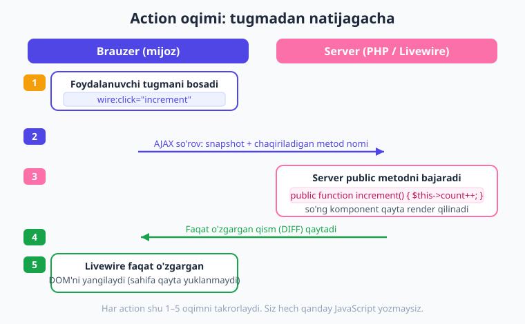
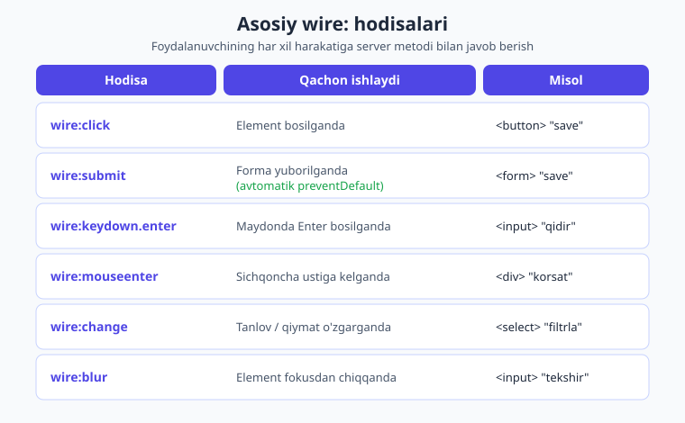
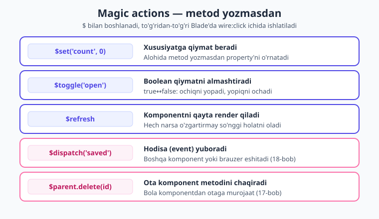

# 07 — Actions: amallar va hodisalar

[⬅️ Oldingi: 06 — Data binding](./06-data-binding.md) · [🏠 Kitob boshi](./README.md) · [Keyingi: 08 — Lifecycle ➡️](./08-lifecycle.md)

> **Bu bobda:** foydalanuvchi biror narsa qilganda — tugmani bossa, formani yuborsa, klavishani bossa — serverdagi PHP metodini chaqirishni o'rganamiz. Bu Livewire'ning ikkinchi yarmi: oldingi bobda ma'lumotni komponentga **bog'ladik** (`wire:model`), endi esa o'sha ma'lumot ustida **amal** bajaramiz. `wire:click`, parametr uzatish, hodisa turlari, modifikatorlar, "sehrli" (magic) amallar va tasdiqlash oynasi — barchasi bitta bobda.

---

## Action nima?

Avvalgi boblarda biz **property** (xususiyat) bilan tanishdik — bu komponentning xotirasi, ma'lumoti. Lekin ma'lumotning o'zi yetarli emas: foydalanuvchi u bilan **biror ish qilishi** kerak. Tugmani bosadi, formani to'ldirib yuboradi, ro'yxatdan bir elementni o'chiradi. Mana shu "ish bajarish" — **action** (amal) deyiladi.

> **Hayotiy o'xshatish — qo'ng'iroq tugmasi.** Eshik oldidagi qo'ng'iroq tugmasini tasavvur qiling. Siz tugmani **bosasiz** (mijoz tomonida), lekin ovoz **uy ichida** chiqadi (server tomonida). Tugma — bu shunchaki signal yuboruvchi: asl ish boshqa joyda bajariladi. Livewire'da `wire:click` ham aynan shunday — siz brauzerda tugmani bosasiz, lekin metod **serverda**, PHP'da ishlaydi. Siz hech qanday JavaScript yozmaysiz: Livewire bosishni eshitadi, serverga signal yuboradi, server metodni bajaradi va natijani qaytaradi.

Texnik ta'rif bilan aytganda: **action — foydalanuvchi hodisasiga (event) javoban komponentingizdagi `public` metodni chaqirish.** Brauzer hodisani aniqlaydi → Livewire serverga AJAX so'rov yuboradi → server metodingizni ishga soladi → komponent qayta render bo'ladi → faqat o'zgargan qism (diff) brauzer DOM'iga qo'llanadi. Sahifa hech qachon to'liq qayta yuklanmaydi.



> **Eslab qoling:** action — bu oddiy PHP metod. Hech qanday sehr yo'q. Siz `public function increment()` deb yozasiz, Blade'da `wire:click="increment"` deysiz — tamom. Metod ichida nima yozsangiz, bosilganda server o'sha ishni bajaradi.

---

## `wire:click` — eng asosiy amal

Eng ko'p ishlatiladigan action — tugma bosish. Buning uchun `wire:click` atributiga **metod nomini** beramiz:

```php
{{-- resources/views/components/⚡counter.blade.php --}}
<?php

use Livewire\Component;

new class extends Component
{
    public int $count = 0;

    public function increment(): void   // public bo'lishi SHART!
    {
        $this->count++;                 // hisobni bittaga oshiramiz
    }
};
?>

<div>
    <h1>Hisob: {{ $count }}</h1>
    <button wire:click="increment">+</button>
</div>
```

Bu yerda nima bo'ladi: foydalanuvchi `+` tugmasini bosadi → Livewire serverga `increment` metodini chaqirishni so'raydi → server `$this->count` ni 1 ga oshiradi → komponent qayta render qilinadi → ekrandagi raqam yangilanadi. Sahifa qayta yuklanmaydi.

!!! warning "Ehtiyot bo'ling — metod `public` bo'lsin"
    Livewire faqat **`public`** metodlarni frontend'dan chaqira oladi. Agar metodingiz `private` yoki `protected` bo'lsa, `wire:click` uni topa olmaydi va "method not found" xatosi chiqadi. Faqat tashqaridan chaqirilishi kerak bo'lgan metodlarni `public` qiling, ichki yordamchi metodlarni `protected` qoldiring.

!!! tip "Maslahat — qavs kerak emas (parametrsiz)"
    Parametrsiz metodni chaqirganda qavs yozmang: `wire:click="increment"`, `wire:click="increment()"` emas. Ikkinchisi ham ishlaydi, lekin birinchisi toza va odatiy uslub.

---

## Boshqa hodisalar: faqat bosish emas

Tugma bosish — eng keng tarqalgani, lekin foydalanuvchi boshqa ham ko'p narsa qiladi: forma yuboradi, klavishani bosadi, sichqonchani element ustiga olib boradi. Livewire'da deyarli **har bir DOM hodisasini** `wire:` bilan tinglash mumkin: `wire:click`, `wire:submit`, `wire:keydown`, `wire:mouseenter` va hokazo.



Mana eng ko'p ishlatiladigan hodisalar:

| Hodisa | Qachon ishlaydi | Namuna |
|---|---|---|
| `wire:click` | Element bosilganda | `<button wire:click="save">` |
| `wire:submit` | Forma yuborilganda (avtomatik `preventDefault`) | `<form wire:submit="save">` |
| `wire:keydown.enter` | Maydonda **Enter** bosilganda | `<input wire:keydown.enter="qidir">` |
| `wire:keydown.escape` | **Esc** bosilganda | `<input wire:keydown.escape="bekorQil">` |
| `wire:mouseenter` | Sichqoncha element ustiga kelganda | `<div wire:mouseenter="korsat">` |
| `wire:change` | Tanlov/qiymat o'zgarib bo'lganda | `<select wire:change="filtrla">` |
| `wire:blur` | Element fokusdan chiqqanda | `<input wire:blur="tekshir">` |

### `wire:submit` — formalar uchun

Forma yuborishda alohida ahamiyat bor. Oddiy HTML formasi yuborilganda brauzer sahifani **to'liq qayta yuklaydi** — bu bizga kerak emas. Shuning uchun `wire:submit` **avtomatik ravishda** `preventDefault` qiladi: sahifa qayta yuklanmaydi, faqat metodingiz ishlaydi.

```php
{{-- resources/views/components/⚡fikr-form.blade.php --}}
<?php

use Livewire\Component;

new class extends Component
{
    public string $fikr = '';
    public string $natija = '';

    public function save(): void
    {
        $this->natija = "Saqlandi: {$this->fikr}";
        $this->fikr = '';                 // maydonni tozalaymiz
    }
};
?>

<div>
    <form wire:submit="save">
        <input type="text" wire:model="fikr">
        <button type="submit">Yuborish</button>
    </form>

    <p>{{ $natija }}</p>
</div>
```

Bu yerda foydalanuvchi maydonni to'ldirib **Enter** bosadi yoki tugmani bosadi → `save` metodi ishlaydi → sahifa "sakramaydi". Forma uchun har doim `wire:submit` ishlating, `wire:click` ni tugmaga emas.

### Klaviatura hodisalari

Klavisha bosilganda biror amal qilish uchun `wire:keydown` dan keyin **klavisha nomini** nuqta bilan qo'shamiz. Bu jonli qidiruv yoki tezkor amallar uchun juda qulay:

```blade
{{-- Enter bosilsa qidiradi, Esc bosilsa tozalaydi --}}
<input
    type="text"
    wire:model="qidiruv"
    wire:keydown.enter="qidir"
    wire:keydown.escape="$set('qidiruv', '')"
>
```

Ishlatish mumkin bo'lgan klavishalar: `.enter`, `.escape`, `.tab`, `.space`, `.arrow-up`, `.arrow-down`, `.arrow-left`, `.arrow-right` va boshqalar.

---

## Parametr uzatish — metodga ma'lumot berish

Ko'pincha metod **qaysi** element bilan ishlashini bilishi kerak: qaysi postni o'chirish, qaysi filtrni qo'llash. Buning uchun metodga **parametr** uzatamiz — xuddi oddiy PHP funksiyasi kabi, qavs ichida:

```php
{{-- resources/views/components/⚡postlar.blade.php --}}
<?php

use Livewire\Component;

new class extends Component
{
    public array $postlar = [
        ['id' => 1, 'sarlavha' => 'Birinchi post'],
        ['id' => 2, 'sarlavha' => 'Ikkinchi post'],
    ];

    public function delete(int $id): void
    {
        // berilgan id ga teng bo'lmaganlarini qoldiramiz
        $this->postlar = array_values(
            array_filter($this->postlar, fn ($p) => $p['id'] !== $id)
        );
    }
};
?>

<div>
    @foreach ($postlar as $post)
        <div wire:key="post-{{ $post['id'] }}">
            {{ $post['sarlavha'] }}
            <button wire:click="delete({{ $post['id'] }})">O'chir</button>
        </div>
    @endforeach
</div>
```

Bu yerda har bir tugma **o'z postining `id`** sini metodga uzatadi: `wire:click="delete(1)"`, `wire:click="delete(2)"` va hokazo. Blade `{{ $post['id'] }}` ni render paytida raqamga aylantiradi.

**String (matn) parametr** uzatish uchun bir tirnoq ishlating:

```blade
{{-- filtrni o'rnatish: matn parametr bir tirnoq ichida --}}
<button wire:click="setFilter('active')">Faol</button>
<button wire:click="setFilter('done')">Bajarilgan</button>
<button wire:click="setFilter('all')">Hammasi</button>
```

```php
public string $filter = 'all';

public function setFilter(string $name): void
{
    $this->filter = $name;          // 'active', 'done' yoki 'all'
}
```

**Bir nechta parametr** ham bemalol uzatiladi, vergul bilan ajratamiz:

```blade
<button wire:click="move({{ $task->id }}, 'done')">Bajarildi deb belgila</button>
```

```php
public function move(int $id, string $status): void { /* ... */ }
```

!!! danger "Xavfsizlik — parametrlar mijozdan keladi, ishonmang!"
    `wire:click="delete({{ $post->id }})"` da `id` qiymati **brauzerda** turadi. Yomon niyatli foydalanuvchi brauzer konsolida o'zi xohlagan har qanday `id` bilan `delete` ni chaqirishi mumkin — masalan **boshqa odamning** postini o'chirishga urinishi. Shuning uchun metod ichida **hech qachon** parametrga ko'r-ko'rona ishonmang:

    ```php
    public function delete(int $id): void
    {
        $post = Post::findOrFail($id);
        $this->authorize('delete', $post);   // bu foydalanuvchi o'chira oladimi?
        $post->delete();
    }
    ```

    Avtorizatsiya (`$this->authorize(...)`) bilan to'liq [23 — Xavfsizlik](./23-xavfsizlik.md) bobida tanishamiz. Hozircha qoidani eslab qoling: **mijozdan kelgan har qanday ma'lumotni tekshiring va ruxsatni nazorat qiling.**

---

## Modifikatorlar — hodisani nozik sozlash

Hodisalarga **modifikator** qo'shib, ularning xulqini o'zgartirish mumkin. Modifikator — bu hodisa nomidan keyin nuqta bilan qo'shiladigan qo'shimcha buyruq. Mana eng foydalilari:

| Modifikator | Vazifasi |
|---|---|
| `.prevent` | Brauzerning standart xatti-harakatini to'xtatadi (`preventDefault`) |
| `.stop` | Hodisaning yuqoriga (ota elementga) tarqalishini to'xtatadi (`stopPropagation`) |
| `.self` | Faqat **aynan shu** element bosilganda ishlaydi, bolasi emas |
| `.debounce.300ms` | Foydalanuvchi to'xtaganidan 300ms keyin bir marta yuboradi |
| `.throttle.500ms` | Har 500ms da ko'pi bilan bir marta yuboradi |
| `.enter` / `.escape` / `.shift.enter` | Klaviatura: qaysi klavisha (yoki kombinatsiya) bosilganini cheklaydi |

Bir nechta misol:

```blade
{{-- Havola: brauzer sahifani ochmasin, faqat metod ishlasin --}}
<a href="#" wire:click.prevent="open">Ochish</a>

{{-- Ota element ham wire:click ga ega bo'lsa, bola bosilganda ota ishlamasin --}}
<div wire:click="otaAmal">
    <button wire:click.stop="bolaAmal">Faqat men</button>
</div>

{{-- Faqat fon (overlay) bosilganda yopilsin, ichidagi modal bosilganda emas --}}
<div wire:click.self="close" class="overlay">
    <div class="modal">...</div>
</div>
```

> **Hayotiy o'xshatish — `.debounce`.** Qidiruv maydonchasini tasavvur qiling. Agar har bir harf bosilganda serverga so'rov yuborsangiz, "olma" so'zi uchun **4 ta** so'rov ketadi — bu isrof. `.debounce.300ms` foydalanuvchi yozishni **to'xtatguncha** kutadi va keyin bir marta yuboradi. Xuddi liftdagi tugma kabi: bir necha kishi bossa ham, lift bir marta keladi.

```blade
{{-- Tez-tez bosilishi mumkin bo'lgan tugmani jilovlash --}}
<button wire:click.debounce.500ms="refresh">Yangilash</button>
```

`.shift.enter` kabi **kombinatsiyalar** ham mumkin — masalan, chatda "Enter — yuborish, Shift+Enter — yangi qator":

```blade
<textarea wire:keydown.enter.prevent="send"></textarea>
```

---

## Magic actions — yozmasdan ishlatiladigan amallar

Ba'zan oddiygina ishlar uchun (xususiyatni o'zgartirish, ochiq/yopiqni almashtirish) alohida metod yozish ortiqcha. Livewire bunday holatlar uchun **magic actions** ("sehrli amallar") beradi — bular `$` belgisi bilan boshlanadigan, **metod yozmasdan to'g'ridan-to'g'ri Blade'da** ishlatiladigan tayyor amallar.



Eng muhimlari:

### `$set('property', value)` — xususiyatni o'rnatish

Metod yozmasdan bevosita biror xususiyatga qiymat beradi:

```blade
{{-- Hisobni nolga qaytarish — alohida reset() metodi shart emas --}}
<button wire:click="$set('count', 0)">Nollash</button>

{{-- Modal ochish --}}
<button wire:click="$set('modalOchiq', true)">Ochish</button>
```

### `$toggle('property')` — almashtirish

Boolean (true/false) xususiyatni teskarisiga aylantiradi — ochiqni yopadi, yopiqni ochadi:

```blade
{{-- Menyuni ochish/yopish bitta tugma bilan --}}
<button wire:click="$toggle('showMenu')">Menyu</button>

@if ($showMenu)
    <nav>... menyu ...</nav>
@endif
```

### `$refresh` — qayta render

Hech narsani o'zgartirmasdan komponentni qaytadan render qiladi (so'nggi holatni serverdan oladi):

```blade
<button wire:click="$refresh">Yangilash</button>
```

### `$dispatch('event')` — hodisa yuborish

Boshqa komponentlarga yoki brauzerga hodisa (event) yuboradi. To'liq mexanizmni [18 — Events](./18-events.md) bobida o'rganamiz, hozircha shaklini ko'rib qo'ying:

```blade
<button wire:click="$dispatch('post-created')">E'lon qil</button>
```

### `$parent.metod()` — ota komponent metodi

Ichma-ich (nested) komponentlarda bola komponentdan **ota** komponentning metodini chaqiradi. Bu mavzu [17 — Nested komponentlar](./17-nested-komponentlar.md) bobida:

```blade
<button wire:click="$parent.removeTask({{ $id }})">O'chir</button>
```

!!! tip "Maslahat — qachon magic, qachon metod?"
    Bitta qatorlik oddiy o'zgarish bo'lsa (`$set`, `$toggle`) — magic action ishlating, kod toza bo'ladi. Lekin amal ichida **validatsiya, avtorizatsiya, bir nechta qadam** bo'lsa — albatta alohida `public` metod yozing. Mantiq metodda bo'lsa, uni testlash ham oson.

---

## `wire:confirm` — amal oldidan tasdiqlash

Xavfli amallar (o'chirish, bekor qilish) oldidan foydalanuvchidan "Rostdan ham?" deb so'rash kerak. Livewire buni `wire:confirm` bilan **bir qatorda** hal qiladi — JavaScript yozish shart emas:

```blade
<button
    wire:click="delete({{ $post->id }})"
    wire:confirm="Rostdan o'chirilsinmi? Bu amalni qaytarib bo'lmaydi."
>
    O'chirish
</button>
```

Foydalanuvchi tugmani bosganda brauzer **tasdiqlash oynasi** chiqaradi. Agar "OK" bossa — `delete` metodi ishlaydi. "Bekor qilish" bossa — hech narsa bo'lmaydi, metod umuman chaqirilmaydi. Oddiy va ishonchli himoya qatlami.

!!! note "Eslatma"
    `wire:confirm` faqat **vizual** ogohlantirish. Bu xavfsizlik chorasi emas! Yomon niyatli foydalanuvchi konsoldan oynani aylanib o'tib metodni baribir chaqira oladi. Shuning uchun haqiqiy himoya — metod ichidagi avtorizatsiya ([23-bob](./23-xavfsizlik.md)). `wire:confirm` — bu tasodifiy bosishdan asraydigan qulaylik.

---

## Loading bilan bog'liqlik

Action serverga borib qaytguncha qisqa vaqt o'tadi (tarmoq kechikishi). Shu vaqt ichida foydalanuvchiga "ishlayapman, kuting" deb ko'rsatish yaxshi tajriba hisoblanadi. Buning uchun `wire:loading` ishlatamiz — u **so'rov davom etayotgan paytda** ko'rinadi:

```blade
<button wire:click="save">
    Saqlash
</button>

{{-- Faqat so'rov ketayotganda ko'rinadi --}}
<span wire:loading>Saqlanmoqda...</span>
```

Bu yerda foydalanuvchi "Saqlash" ni bossa, server javob qaytarguncha "Saqlanmoqda..." matni ko'rinadi, keyin yo'qoladi. Loading holatlari (skeleton ekran, tugmani o'chirish, `wire:target` bilan aniq amalni belgilash) to'liq [20 — Loading va progress holatlari](./20-loading-holatlar.md) bobida ko'rib chiqiladi.

---

## Xavfsizlik: har bir `public` metod ochiq eshik

Bu bobning eng muhim ogohlantirishi — uni hech qachon unutmang.

!!! danger "Xavfsizlik — har public metod frontend'dan chaqirilishi mumkin"
    Livewire komponentingizdagi **HAR BIR `public` metod** brauzerdan chaqirilishi mumkin — siz uni Blade'da `wire:click` ga qo'ymagan bo'lsangiz ham. Yomon niyatli foydalanuvchi brauzer konsolida `$wire.deleteEverything()` deb yozib, sizning maxfiy metodingizni ishga tushira oladi.

    Bundan kelib chiqadigan qoidalar:

    1. **Faqat tashqaridan chaqirilishi kerak bo'lgan metodlarnigina `public` qiling.** Ichki yordamchi mantiqni `protected` yoki `private` qiling.
    2. **Maxfiy yoki xavfli amalda avtorizatsiyani tekshiring:** `$this->authorize('update', $post);`.
    3. **Parametrlarga ishonmang** — ular mijozdan keladi: `validate`, `findOrFail`, ruxsatni tekshirish.

    To'liq xavfsizlik amaliyoti — `#[Locked]` xususiyatlar, policy va avtorizatsiya — [23 — Xavfsizlik](./23-xavfsizlik.md) bobida.

---

## Hammasi birga — kichik amaliy komponent

Quyidagi komponent bu bobning asosiy g'oyalarini bitta joyda jamlaydi: oddiy action, parametrli action, magic action, va `wire:confirm`. Bu kod jonli **Laravel 12 + Livewire 4.3** loyihada render qilinib (HTTP 200) va Livewire test API bilan tekshirilgan.

```php
{{-- resources/views/components/⚡actions-demo.blade.php --}}
<?php

use Livewire\Component;

new class extends Component
{
    public int $count = 0;
    public bool $showMenu = false;
    public string $filter = 'all';
    public array $items = ['Olma', 'Anor', 'Banan'];

    public function increment(): void          // oddiy action
    {
        $this->count++;
    }

    public function setFilter(string $name): void   // parametrli action
    {
        $this->filter = $name;
    }

    public function delete(int $index): void        // parametrli action
    {
        unset($this->items[$index]);
        $this->items = array_values($this->items);  // kalitlarni qayta tartiblash
    }
};
?>

<div>
    <h1>Hisob: {{ $count }}</h1>
    <button wire:click="increment">+</button>
    <button wire:click="$set('count', 0)">Nollash</button>   {{-- magic --}}
    <button wire:click="$toggle('showMenu')">Menyu</button>  {{-- magic --}}

    @if ($showMenu)
        <p>Menyu ochiq</p>
    @endif

    <p>Filtr: {{ $filter }}</p>
    <button wire:click="setFilter('active')">Faol</button>
    <button wire:click="setFilter('all')">Hammasi</button>

    <ul>
        @foreach ($items as $i => $item)
            <li wire:key="item-{{ $i }}">
                {{ $item }}
                <button
                    wire:click="delete({{ $i }})"
                    wire:confirm="Rostdan o'chirilsinmi?"
                >O'chir</button>
            </li>
        @endforeach
    </ul>
</div>
```

!!! example "Tekshirib ko'ring"
    Bu komponentni o'z loyihangizda yarating (`php artisan make:livewire actions-demo`), `routes/web.php` ga `Route::livewire('/actions-demo', 'actions-demo');` qo'shing va `/actions-demo` manzilini brauzerda oching. `+` ni bosing, "Menyu" ni bosib menyuni ochib-yoping, "Faol" tugmasini bosing va filtr matni o'zgarishini kuzating, "O'chir" ni bosib tasdiqlash oynasini ko'ring.

---

## Xulosa

- **Action — foydalanuvchi hodisasiga javoban serverdagi `public` metodni chaqirish.** Qo'ng'iroq tugmasi kabi: bosish mijozda, ish serverda.
- Eng asosiysi — **`wire:click="metodNomi"`**. Metod komponentda **`public`** bo'lishi shart.
- Boshqa hodisalar: **`wire:submit`** (forma — avtomatik `preventDefault`), **`wire:keydown.enter`/`.escape`**, **`wire:mouseenter`**, **`wire:change`**, **`wire:blur`**.
- **Parametr uzatish:** `wire:click="delete({{ $post->id }})"` (raqam), `wire:click="setFilter('active')"` (matn, bir tirnoqda), bir nechta parametr vergul bilan.
- **Modifikatorlar:** `.prevent`, `.stop`, `.self`, `.debounce.300ms`, `.throttle`, klaviatura modifikatorlari (`.enter`, `.escape`, `.shift.enter`).
- **Magic actions** metod yozmasdan ishlatiladi: `$set('open', true)`, `$toggle('open')`, `$refresh`, `$dispatch('event')`, `$parent.metod()`.
- **`wire:confirm="..."`** — xavfli amal oldidan tasdiqlash oynasi (vizual himoya, xavfsizlik chorasi emas).
- **`wire:loading`** — so'rov davomida "kuting" ko'rsatadi ([20-bob](./20-loading-holatlar.md)).
- ⚠️ **Eng muhimi:** har bir `public` metod frontend'dan chaqirilishi mumkin. Maxfiy/xavfli amalda **avtorizatsiya shart** (`$this->authorize(...)`, [23-bob](./23-xavfsizlik.md)), parametrlarga ishonmang.

## Amaliy mashqlar

1. **Toggle menyu (oson).** `showMenu` nomli `bool` xususiyat va bitta tugma yarating. Tugma bosilganda menyu ochilib-yopilsin. Avval alohida `toggleMenu()` metodi bilan yozing, keyin uni `wire:click="$toggle('showMenu')"` magic action bilan almashtirib, kodingiz qisqarganini ko'ring.

2. **Filtr tugmalari (oson–o'rta).** `filter` nomli xususiyat va uchta tugma yarating: "Hammasi", "Faol", "Bajarilgan". Har biri `setFilter('all')`, `setFilter('active')`, `setFilter('done')` ni chaqirsin. Joriy tanlangan filtr nomini ekranda ko'rsating. *Yo'naltirish:* metodga string parametr bir tirnoq ichida uzatiladi.

3. **`wire:confirm` bilan o'chirish (o'rta).** Matnlardan iborat massiv (`$items`) va har bir element yonida "O'chir" tugmasini ro'yxatda chiqaring. Tugmaga `wire:confirm` qo'shing — foydalanuvchi tasdiqlamaguncha element o'chmasin. *Yo'naltirish:* `wire:key` ni unutmang va `delete($index)` ga to'g'ri indeksni uzating; o'chirgandan keyin `array_values()` bilan kalitlarni qayta tartiblang.

4. **Klaviatura bilan qidiruv (o'rta–qiyin).** Matn maydoni yarating. **Enter** bosilganda `qidir` metodi ishlasin, **Esc** bosilganda maydon `$set` magic action bilan tozalansin. *Yo'naltirish:* `wire:keydown.enter` va `wire:keydown.escape`.

5. **Himoyalangan o'chirish (qiyin — fikrlash uchun).** 3-mashqdagi o'chirish metodini xavfsizroq qiling: agar elementlar soni 1 ta bo'lsa, oxirgisini o'chirishga ruxsat bermang (metod ichida tekshiring va hech narsa qilmasdan qaytib chiqing). Nima uchun bu tekshiruvni **server** metodida qilish kerak, `wire:confirm` da emas? (Maslahat: bu bobning xavfsizlik bo'limini qayta o'qing.)

---

[⬅️ Oldingi: 06 — Data binding](./06-data-binding.md) · [🏠 Kitob boshi](./README.md) · [Keyingi: 08 — Lifecycle ➡️](./08-lifecycle.md)
