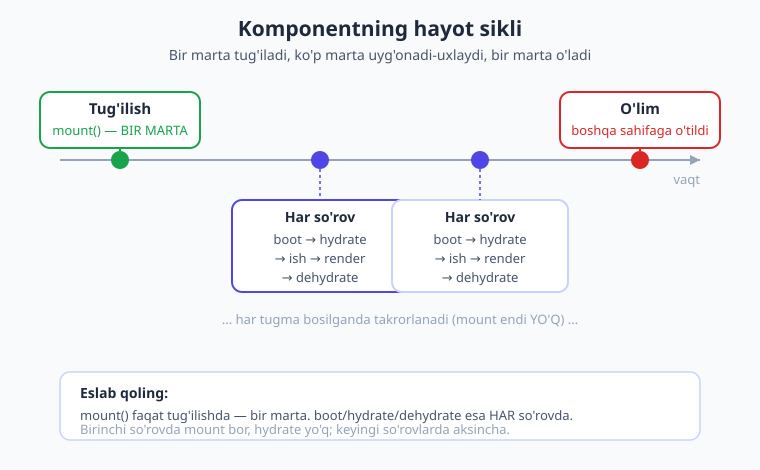
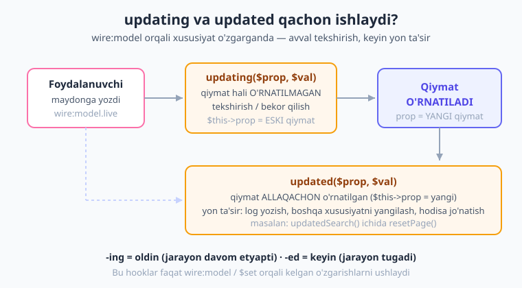
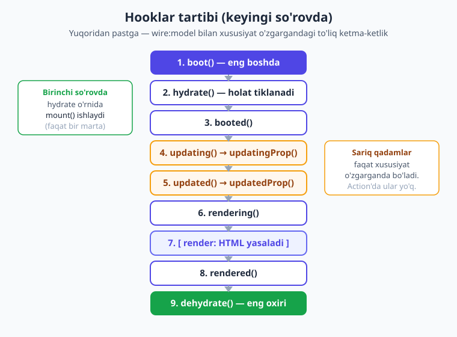

# 08 — Lifecycle hooks: hayot sikli

[⬅️ Oldingi: 07 — Actions](./07-actions.md) · [🏠 Kitob boshi](./README.md) · [Keyingi: 09 — Formalar ➡️](./09-formalar.md)

> **Bu bobda:** Livewire komponenti "tug'ilishidan o'limigacha" qanday bosqichlardan o'tishini va har bosqichga o'z kodingizni ulashga imkon beruvchi **lifecycle hooklar** (hayot sikli ilmoqlari) — `mount()`, `boot()`, `hydrate()`, `updating()`, `updated()`, `rendering()`, `rendered()` va boshqalar — bilan tanishasiz. Qaysi hook qachon, necha marta ishlashini va amalda nimaga ishlatilishini misollar bilan o'rganamiz.

---

## Bir kun — bir hayot

Tasavvur qiling, har kuningiz qanday o'tadi? Ertalab uyg'onasiz, yuvinasiz, nonushta qilasiz, ishga borasiz, ishlaysiz, uyga qaytasiz va uxlaysiz. Bularning hammasi — **bosqichlar**. Va har bir bosqichda siz biror ish qilishingiz mumkin: uyg'onganingizdan keyin gimnastika qilasiz, nonushtadan oldin qo'lingizni yuvasiz, uyqudan oldin tishingizni tozalaysiz.

Livewire komponenti ham xuddi shunday "yashaydi". U **tug'iladi** (birinchi marta sahifaga chiqadi), bir necha bor **uyg'onadi va uxlaydi** (har bir tugma bosilganda serverga borib-keladi), va nihoyat **o'ladi** (foydalanuvchi boshqa sahifaga o'tadi). Bu bosqichlarning har biriga Livewire sizga maxsus "tutqich" — **hook** beradi. Hook — bu komponent hayotining ma'lum bir nuqtasida avtomatik ishga tushadigan metod.

> **Hayotiy o'xshatish.** O'simlikni eslang: urug' ekiladi (mount) → har kuni suv beriladi (har so'rov) → o'sadi, gullaydi → bir kun quriydi (o'lim). Bog'bon har bosqichda biror ish qiladi: ekkanda go'ng soladi, har kuni sug'oradi, quriganda yulib tashlaydi. **Hooklar — sizning "bog'bon ishlaringiz".** Komponent o'z hayotining ma'lum nuqtasiga yetganda, Livewire sizga "mana endi seniki" deb signal beradi.

**Hook (ilmoq, tutqich)** — bu Livewire siz uchun avtomatik chaqiradigan, oldindan belgilangan nomli metod. Siz uni komponentingizga yozsangiz, Livewire kerakli vaqtda uni ishga soladi. Yozmasangiz — hech narsa bo'lmaydi, Livewire shunchaki o'tib ketadi. Ya'ni hooklar **ixtiyoriy**: faqat kerak bo'lganini yozasiz.



---

## Avval bitta muhim haqiqatni eslaylik

5-bobda ([Properties va holat](./05-properties-holat.md)) ko'rgandik: **PHP so'rov tugashi bilan hamma narsani "unutadi".** Har bir tugma bosilishi — bu serverga yangi so'rov. Server komponentni noldan tiklaydi, ishni bajaradi, javobni qaytaradi va **yana hammasini unutadi**.

Aynan shu sabab hayot siklini tushunish muhim. Komponent bir marta yaratilmaydi va xotirada turmaydi. Aksincha, **har so'rovda u qaytadan "yig'iladi"**, holati (snapshot) brauzerdan kelib "tiriltiriladi", keyin yana "qadoqlanib" brauzerga qaytariladi. Hooklar — aynan shu yig'ilish va tarqalish jarayonining muayyan nuqtalari.

> **Hayotiy o'xshatish.** Komponent — har kecha xotirasini o'chiradigan, lekin daftariga yozib qo'yadigan odam. Ertalab daftarni o'qib (hydrate) o'zini "eslaydi", kun davomida ishlaydi, kechqurun daftarga yangi holatni yozib (dehydrate) uxlaydi. Daftar — bu **snapshot**. Hooklar — bu daftarni o'qish va yozishning aniq lahzalari.

---

## So'rov ikki xil bo'ladi

Hooklar tartibini tushunish uchun avval **so'rov turlarini** ajratish kerak. Livewire'da ikki xil so'rov bor:

1. **Birinchi (initial) render** — komponent sahifaga birinchi marta chiqayotgan paytdagi so'rov. Bu odatdagi HTTP so'rovning bir qismi (sahifa to'liq yuklanmoqda). Komponent shu yerda **tug'iladi**.

2. **Keyingi (subsequent) yangilanishlar** — komponent allaqachon sahifada bor, foydalanuvchi tugma bosdi yoki maydonga yozdi. Livewire orqa fonda serverga AJAX so'rov yuboradi. Komponent **uyg'onadi va yana uxlaydi**.

Bu farq juda muhim, chunki **ayrim hooklar faqat birinchi so'rovda, ayrimlari esa har so'rovda** ishlaydi. Quyida shu farqni batafsil ko'ramiz.

> **Hayotiy o'xshatish.** Birinchi render — bu yangi xodimning ishga birinchi kuni: u hujjat to'ldiradi, joy tanlaydi, tanishadi (mount). Keyingi so'rovlar — uning oddiy ish kunlari: keladi, ishlaydi, ketadi. Ish kunlari takrorlanadi, lekin "birinchi kun" faqat bir marta bo'ladi.

---

## `mount()` — tug'ilish lahzasi

`mount()` — eng ko'p ishlatiladigan va eng muhim hook. U **faqat bitta marta** — komponent birinchi marta yaratilganda ishlaydi. Bu xuddi PHP klassidagi **konstruktor** kabi: boshlang'ich tayyorgarlik shu yerda bajariladi.

`mount()` ichida odatda:

- boshlang'ich ma'lumotni o'rnatasiz,
- ota-komponentdan kelgan **propslarni** (kirish parametrlarini) qabul qilasiz,
- ma'lumotlar bazasidan dastlabki yozuvni yuklaysiz.

Eng oddiy misol — komponentga ID berib, ma'lumotni bazadan yuklash:

```php
{{-- resources/views/components/⚡post-show.blade.php --}}
<?php

use Livewire\Component;
use App\Models\Post;

new class extends Component
{
    public Post $post;
    public string $sarlavha = '';

    // mount() faqat BIR MARTA — komponent yaratilganda ishlaydi
    public function mount(Post $post): void
    {
        // ota-komponentdan kelgan post obyektini saqlaymiz
        $this->post = $post;
        // boshlang'ich qiymatni o'rnatamiz
        $this->sarlavha = $post->title;
    }
};
?>

<div>
    <h1>{{ $sarlavha }}</h1>
    <p>{{ $post->body }}</p>
</div>
```

Bu komponentni sahifaga shunday qo'yamiz va `post` propsini uzatamiz:

```blade
<livewire:post-show :post="$post" />
```

`mount()` parametrlari **avtomatik** to'ldiriladi: teg ichida `:post="$post"` deb yozsangiz, Livewire uni `mount(Post $post)` ga uzatadi. Bu — propslarni qabul qilishning asosiy yo'li.

!!! warning "Ehtiyot bo'ling: `mount()` faqat BIR MARTA ishlaydi"
    Eng keng tarqalgan xato — `mount()` ni har so'rovda ishlaydi deb o'ylash. **Yo'q!** U faqat komponent tug'ilganda, ya'ni birinchi renderning o'zida ishlaydi. Keyin foydalanuvchi 100 marta tugma bossa ham, `mount()` boshqa **hech qachon** chaqirilmaydi.

    Demak, har so'rovda bajarilishi kerak bo'lgan ishni `mount()` ga yozmang — u faqat bir marta ishlaydi va keyingi so'rovlarda e'tiborsiz qoladi. Har so'rov uchun pastdagi `boot()` dan foydalaning.

!!! tip "Maslahat: og'ir yuklamani `mount()` ga emas, computed property'ga"
    Agar `mount()` da ma'lumotlar bazasidan og'ir ro'yxat yuklasangiz, u faqat bir marta yuklanadi — bu yaxshi. Lekin ba'zan ma'lumot **har so'rovda yangilanib turishi** kerak bo'ladi. Bunday holatda `mount()` emas, **computed property** ([15-bob](./15-computed-properties.md)) to'g'riroq tanlovdir.

---

## `boot()` va `booted()` — har uyg'onishda

`mount()` faqat bir marta ishlasa, `boot()` esa **har so'rovda** — ham birinchi renderda, ham keyingi har bir yangilanishda — ishlaydi. Va u **eng boshda**, komponent yig'ilishining boshida chaqiriladi.

- `boot()` — komponent "yig'ila boshlaganda", **eng dastlab** ishlaydi (holat tiklanishidan ham oldin).
- `booted()` — yig'ilish tugab, holat tiklanib bo'lgach ishlaydi.

`boot()` odatda **har so'rovda kerak bo'ladigan umumiy tayyorgarlik** uchun ishlatiladi. Masalan, har so'rovda biror servis yoki repozitoriyni "ulash" (inject qilish), yoki har so'rovda ishlaydigan boshlang'ich sozlamani o'rnatish.

```php
{{-- resources/views/components/⚡posts-list.blade.php --}}
<?php

use Livewire\Component;
use App\Repositories\PostRepository;

new class extends Component
{
    // bu xususiyat HAR so'rovda qaytadan tayyorlanadi
    protected PostRepository $repository;

    // boot() HAR so'rovda eng boshda ishlaydi
    public function boot(PostRepository $repository): void
    {
        // har so'rovda repozitoriyni "ulaymiz"
        $this->repository = $repository;
    }

    public function render()
    {
        return $this->view([
            'posts' => $this->repository->latest(),
        ]);
    }
};
?>

<div>
    @foreach ($posts as $post)
        <p>{{ $post->title }}</p>
    @endforeach
</div>
```

Bu yerda nega `mount()` emas, `boot()`? Chunki `$repository` — bu serializatsiya qilib bo'lmaydigan obyekt (uni snapshot'ga solib brauzerga jo'natib bo'lmaydi). Shuning uchun uni **har so'rovda qaytadan** ulash kerak. `boot()` aynan shuni qiladi.

> **Hayotiy o'xshatish.** `mount()` — uyga birinchi ko'chib kelganda mebel qo'yish (bir marta). `boot()` — har kuni ertalab uyni ochib, chiroqlarni yoqish (har kuni). Mebel joyida turaveradi, lekin chiroqni har kuni qaytadan yoqish kerak.

!!! note "Eslatma: `mount()` va `boot()` farqi qisqacha"
    | | `mount()` | `boot()` |
    |---|---|---|
    | Necha marta? | **Bir marta** (tug'ilishda) | **Har so'rovda** |
    | Qachon? | Faqat birinchi render | Har so'rov boshida |
    | Nimaga? | Boshlang'ich holat, props | Serislanmaydigan narsalarni qayta ulash |

---

## `hydrate()` va `dehydrate()` — uyg'onish va uxlash

Endi eng "sehrli" qism. Eslang: har so'rovda komponent holati (snapshot) brauzerdan serverga keladi, server uni "tiriltirib" ishlatadi, keyin yangilangan holatni yana brauzerga jo'natadi.

- **`hydrate()`** — snapshot serverga kelganda, holat "tiriltirilayotganda" ishlaydi. *Hydrate* — "suv quyib jonlantirish" degani. Brauzerdan kelgan oddiy ma'lumotlar (massiv, matn) yana to'laqonli PHP holatiga aylantiriladi.
- **`dehydrate()`** — javob brauzerga jo'natilishidan oldin, holat "qadoqlanayotganda" ishlaydi. *Dehydrate* — "suvini olib quritish" degani. To'laqonli PHP holati brauzerga jo'natish uchun oddiy ma'lumotga aylantiriladi.

Muhim nuqta: **`hydrate()` faqat keyingi so'rovlarda ishlaydi**, birinchi renderda emas. Sababi oddiy — birinchi renderda hali brauzerda hech qanday snapshot yo'q, demak "tiriltiriladigan" narsa ham yo'q. `dehydrate()` esa **har so'rovda** (birinchi renderda ham) ishlaydi, chunki har so'rov oxirida holat brauzerga jo'natiladi.

```php
new class extends Component
{
    public array $sozlamalar = [];

    // hydrate() — snapshot serverga kelganda (faqat keyingi so'rovlarda)
    public function hydrate(): void
    {
        // masalan, kelgan ma'lumotni qo'shimcha tekshirishdan o'tkazish
        logger('Holat tiklandi (hydrate)');
    }

    // dehydrate() — javob jo'natilishidan oldin (har so'rovda)
    public function dehydrate(): void
    {
        logger('Holat qadoqlanmoqda (dehydrate)');
    }
};
```

> **Hayotiy o'xshatish.** Snapshot — quritilgan choy. Brauzerdan serverga **quruq choy** (oddiy ma'lumot) keladi. `hydrate()` — unga **issiq suv quyish** (to'laqonli holatga aylantirish). Ishni bajargandan keyin choyni yana **quritib** (`dehydrate()`) qaytarib jo'natamiz. Keyingi so'rovda yana issiq suv quyiladi.

!!! info "Livewire 3 da qanday edi?"
    `hydrate()` va `dehydrate()` hooklari Livewire 3 da ham xuddi shu nom va shu ma'noda mavjud edi. Livewire 4 da ularning ishlash printsipi o'zgarmadi — snapshot mexanizmi bir xil. Shuning uchun bu bilim ikkala versiyada ham amal qiladi.

Bu ikki hook kundalik ishda **kamdan-kam** kerak bo'ladi. Ular ko'proq murakkab holatlarda — masalan, holatni o'zgacha formatda saqlash-tiklash, yoki har serializatsiya/deserializatsiyada qo'shimcha o'zgartirish kiritish kerak bo'lganda ishlatiladi. Boshlovchi uchun ularning **mavjudligini bilish va nima qilishini tushunish** yetarli.

---

## `updating()` va `updated()` — xususiyat o'zgarayotganda

Mana bu ikki hook esa **juda tez-tez** ishlatiladi. Ular foydalanuvchi `wire:model` orqali biror xususiyatni o'zgartirganda ishga tushadi:

- **`updating($prop, $val)`** — xususiyat o'zgar*ayotganda*, ya'ni yangi qiymat **o'rnatilishidan oldin** ishlaydi. `$prop` — o'zgarayotgan xususiyat nomi, `$val` — yangi (kelayotgan) qiymat. Bu yerda siz qiymatni **tekshirishingiz** yoki hatto o'zgarishni **bekor qilishingiz** mumkin.
- **`updated($prop, $val)`** — xususiyat o'zgar*gandan keyin*, ya'ni yangi qiymat **o'rnatilgach** ishlaydi. Bu yerda **yon ta'sir** (side effect) qilasiz — masalan, log yozish, boshqa xususiyatni yangilash, hodisa jo'natish.

```php
new class extends Component
{
    public string $email = '';

    // updating: qiymat O'RNATILISHIDAN OLDIN
    public function updating($prop, $val): void
    {
        logger("'$prop' o'zgaryapti, yangi qiymat: $val");
    }

    // updated: qiymat O'RNATILGACH
    public function updated($prop, $val): void
    {
        logger("'$prop' o'zgardi, hozirgi qiymat: " . $this->{$prop});
    }
};
```

`updating` va `updated` farqini eslab qolish oson: **-ing** = jarayon davom etyapti (hali bo'lmadi), **-ed** = jarayon tugadi (allaqachon bo'ldi). O'zbekchada: `updating` = "o'zgar*ayotganda*", `updated` = "o'zgar*gach*".



> **Hayotiy o'xshatish.** Posilkani qabul qilishni tasavvur qiling. `updating()` — posilka kelganda, uni ochishdan **oldin** tekshirish (kimdan kelgan? zararlimi?). Agar shubhali bo'lsa, qabul qilmasligingiz mumkin. `updated()` — posilka allaqachon ochilib, narsa joyiga qo'yilgach, do'stga "keldi!" deb xabar berish (yon ta'sir).

!!! warning "Ehtiyot bo'ling: `updating`/`updated` faqat `wire:model` o'zgarishlarini ushlaydi"
    Bu hooklar **xususiyat frontend orqali o'zgarganda** (ya'ni `wire:model` orqali yoki `$set` magic action bilan) ishlaydi. Agar siz xususiyatni komponent ichidagi metodda o'zgartirsangiz (masalan `$this->count++`), bu hooklar **chaqirilmaydi**. Ular faqat tashqaridan (foydalanuvchidan) kelgan o'zgarishlarni kuzatadi.

---

## Xususiyatga xos hooklar: `updatedTitle()`

Ba'zan sizga **barcha** xususiyatlarni emas, faqat **bittasini** kuzatish kerak bo'ladi. Bunda har safar `if ($prop === 'title')` deb tekshirish noqulay. Livewire buni soddalashtiradi: hook nomiga xususiyat nomini qo'shasiz.

- `updatingTitle($val)` — faqat `title` xususiyati o'zgar*ayotganda*.
- `updatedTitle($val)` — faqat `title` xususiyati o'zgar*gach*.

Nomlanish qoidasi: `updated` + xususiyat nomi **bosh harf bilan**. `title` → `updatedTitle`, `search` → `updatedSearch`, `email` → `updatedEmail`.

Klassik amaliy misol — qidiruv maydonida har yozilganda **sahifa raqamini birinchiga qaytarish** (pagination bilan ishlaganda zarur):

```php
{{-- resources/views/components/⚡posts-search.blade.php --}}
<?php

use Livewire\Component;
use Livewire\WithPagination;
use App\Models\Post;

new class extends Component
{
    use WithPagination;

    public string $search = '';

    // FAQAT $search o'zgarganda ishlaydi
    public function updatedSearch($val): void
    {
        // qidiruv o'zgarsa — birinchi sahifaga qaytamiz
        $this->resetPage();
    }

    public function render()
    {
        return $this->view([
            'posts' => Post::where('title', 'like', "%{$this->search}%")
                ->paginate(10),
        ]);
    }
};
?>

<div>
    <input type="text" wire:model.live="search" placeholder="Qidirish...">

    @foreach ($posts as $post)
        <p>{{ $post->title }}</p>
    @endforeach

    {{ $posts->links() }}
</div>
```

Nega bu kerak? Tasavvur qiling, foydalanuvchi 5-sahifada turibdi va qidiruv yozadi. Agar sahifa raqami 5 bo'lib qolsa, yangi natijalarning 5-sahifasi bo'sh bo'lishi mumkin. `resetPage()` har qidiruvda 1-sahifaga qaytarib, bu muammoni hal qiladi. (Pagination haqida batafsil — [14-bobda](./14-pagination-qidiruv.md).)

!!! tip "Maslahat: `wire:model.live` shart"
    Yuqoridagi misolda `wire:model.live="search"` ishlatilgan — `.live` modifikatorisiz `wire:model` **deferred** (kechiktirilgan) bo'ladi va har bosishda serverga bormaydi, demak `updatedSearch()` ham har harf yozilganda ishlamaydi. Jonli qidiruv uchun `.live` kerak. (Buni [06-bobda](./06-data-binding.md) ko'rgansiz.)

---

## `rendering()` va `rendered()` — render atrofida

Bu juftlik komponentning HTML'ga aylantirilishi (render) atrofida ishlaydi:

- **`rendering()`** — `render()` metodi ishga tushishidan **oldin**.
- **`rendered($view, $html)`** — `render()` tugab, HTML tayyor bo'lgach. `$html` — tayyor HTML matni.

Bular ham kamdan-kam kerak bo'ladi. `rendered()` ko'pincha tayyor HTML bilan biror ish qilish kerak bo'lganda yoki render bo'lgach biror JavaScript hodisasini tetiklamoqchi bo'lganda ishlatiladi.

```php
new class extends Component
{
    public function rendering(): void
    {
        logger('Render boshlanmoqda');
    }

    public function rendered($view, $html): void
    {
        logger('Render tugadi, HTML uzunligi: ' . strlen($html));
    }
};
```

---

## To'liq tartib: hooklar qaysi ketma-ketlikda ishlaydi?

Endi eng muhim qism — **hooklar aniq qanday tartibda ishlaydi?** Bu tartib so'rov turiga bog'liq. Quyidagi ketma-ketlik jonli Livewire 4 loyihada **haqiqatdan ham ishlatib tasdiqlangan**.



### Birinchi (initial) render

Komponent birinchi marta sahifaga chiqqanda:

```text
boot()        →  har so'rov boshida
mount()       →  faqat birinchi renderda (tug'ilish!)
booted()      →  yig'ilish tugagach
rendering()   →  render oldidan
[render]      →  HTML yasaladi
rendered()    →  render tugagach
dehydrate()   →  javob jo'natilishidan oldin
```

Diqqat: birinchi renderda **`hydrate()` YO'Q** (tiriltiradigan snapshot hali yo'q), lekin **`mount()` BOR** (komponent endi tug'ilyapti).

### Keyingi (subsequent) so'rov — xususiyat o'zgarishi

Foydalanuvchi `wire:model.live` maydoniga yozganda:

```text
boot()           →  har so'rov boshida
hydrate()        →  snapshot tiriltiriladi
booted()         →  yig'ilish tugagach
updating()       →  qiymat o'rnatilishidan oldin
updatingSearch() →  shu xususiyatga xos (oldin)
updated()        →  qiymat o'rnatilgach
updatedSearch()  →  shu xususiyatga xos (keyin)
rendering()      →  render oldidan
[render]         →  HTML yasaladi
rendered()       →  render tugagach
dehydrate()      →  javob jo'natilishidan oldin
```

Diqqat: keyingi so'rovda **`mount()` YO'Q** (komponent allaqachon tug'ilgan), lekin **`hydrate()` BOR** (snapshet tiriltiriladi). Va `updating`/`updated` faqat xususiyat o'zgarganda paydo bo'ladi.

### Keyingi so'rov — action (tugma bosish)

Foydalanuvchi tugma bosganda (xususiyat o'zgarmaydi):

```text
boot()       →  har so'rov boshida
hydrate()    →  snapshot tiriltiriladi
booted()     →  yig'ilish tugagach
[action]     →  bosilgan metod ishlaydi (masalan increment)
rendering()  →  render oldidan
[render]     →  HTML yasaladi
rendered()   →  render tugagach
dehydrate()  →  javob jo'natilishidan oldin
```

Bu yerda `updating`/`updated` **yo'q**, chunki hech qaysi xususiyat `wire:model` orqali o'zgarmadi — shunchaki action ishladi.

!!! note "Eslatma: eng muhim 3 ta xulosa"
    1. `boot()` har doim **eng birinchi**, `dehydrate()` har doim **eng oxiri**.
    2. `mount()` faqat **birinchi renderda** (`hydrate` o'rnida), `hydrate()` faqat **keyingi so'rovlarda** (`mount` o'rnida).
    3. `updating`/`updated` faqat **xususiyat o'zgarganda** paydo bo'ladi va `render` dan **oldin** ishlaydi.

---

## Amaliy misollar: hooklarni ishda ko'ramiz

Endi uchta keng tarqalgan amaliy stsenariyni birga ko'rib chiqamiz.

### 1-misol: `mount()` bilan ma'lumotni yuklash

Eng ko'p uchraydigan vazifa — komponent ochilganda ma'lumotlar bazasidan ma'lumot yuklash:

```php
{{-- resources/views/components/⚡user-profile.blade.php --}}
<?php

use Livewire\Component;
use App\Models\User;

new class extends Component
{
    public User $user;
    public int $postsCount = 0;

    // mount() da boshlang'ich ma'lumotni yuklaymiz (bir marta)
    public function mount(int $userId): void
    {
        $this->user = User::findOrFail($userId);
        $this->postsCount = $this->user->posts()->count();
    }
};
?>

<div>
    <h2>{{ $user->name }}</h2>
    <p>Maqolalar soni: {{ $postsCount }}</p>
</div>
```

Komponentga ID uzatamiz, `mount()` esa uni qabul qilib, foydalanuvchini bazadan topadi:

```blade
<livewire:user-profile :user-id="5" />
```

### 2-misol: `updatedSearch()` bilan qidiruvda sahifani tiklash

Bu misolni yuqorida ko'rdik — qidiruv har o'zgarganda `resetPage()` chaqiriladi. Bu xususiyatga xos hookning eng klassik qo'llanishi. Yana bir bor takrorlasak, gap shundaki: faqat `search` o'zgarganda biror ish bajarish kerak bo'lsa, butun `updated()` da `if` yozish o'rniga to'g'ridan-to'g'ri `updatedSearch()` yozasiz — toza va aniq.

### 3-misol: `updated()` bilan audit log (yon ta'sir)

Tasavvur qiling, sizga foydalanuvchi qaysi maydonlarni o'zgartirganini **kuzatish** (audit) kerak. `updated()` aynan shu uchun:

```php
new class extends Component
{
    public string $name = '';
    public string $email = '';

    // har qanday xususiyat o'zgargach — log yozamiz
    public function updated($prop, $val): void
    {
        logger("Foydalanuvchi '$prop' maydonini o'zgartirdi", [
            'yangi_qiymat' => $val,
            'vaqt' => now(),
        ]);
    }
};
```

Bu yerda `updated()` ning kuchi shundaki, u **barcha** xususiyatlar uchun bir joyda ishlaydi — har biriga alohida kod yozish shart emas.

> **Hayotiy o'xshatish.** `updated()` — do'kondagi xavfsizlik kamerasi: har qanday harakat (xususiyat o'zgarishi) sodir bo'lsa, avtomatik yozib oladi. Sotuvchi har bir mijozni alohida kuzatmaydi — kamera hammasini bir joyda yozadi.

---

## Hooklarni o'z ko'zingiz bilan ko'ring

Hooklar tartibini eng yaxshi **o'zingiz sinab ko'rib** tushunasiz. Quyidagi komponentni yarating va `php artisan make:livewire hooks-test` bilan loyihaga qo'shing. So'ng har hookni log qiling va tugmani bosib, `storage/logs/laravel.log` faylida tartibni kuzating:

```php
{{-- resources/views/components/⚡hooks-test.blade.php --}}
<?php

use Livewire\Component;

new class extends Component
{
    public string $matn = '';
    public int $hisob = 0;

    public function boot(): void      { logger('1. boot'); }
    public function mount(): void     { logger('2. mount'); }
    public function booted(): void    { logger('3. booted'); }
    public function hydrate(): void   { logger('* hydrate'); }
    public function updating($p, $v): void { logger("* updating ($p)"); }
    public function updated($p, $v): void  { logger("* updated ($p)"); }
    public function rendering(): void { logger('4. rendering'); }
    public function rendered($view, $html): void { logger('5. rendered'); }
    public function dehydrate(): void { logger('6. dehydrate'); }

    public function oshir(): void { $this->hisob++; }
};
?>

<div>
    <h1>Hisob: {{ $hisob }}</h1>
    <input type="text" wire:model.live="matn">
    <button wire:click="oshir">+1</button>
</div>
```

Sahifani ochib, keyin maydonga yozib, so'ng tugmani bosing va har safar logda hooklar qaysi tartibda chiqishini taqqoslang. Bu — hayot siklini eslab qolishning eng samarali usuli.

!!! question "Tekshirib ko'ring"
    Yuqoridagi komponentni sahifaga birinchi marta yuklaganingizda logda qaysi hooklar paydo bo'ladi? Maydonga bitta harf yozganingizda-chi? Tugmani bosganingizda-chi? Uchala holatni taqqoslang va `mount` bilan `hydrate` qaysi holatda chiqishini aniqlang.

---

## Xulosa

- **Hayot sikli** — komponentning tug'ilishidan o'limigacha bo'lgan bosqichlar. Har bosqichga **hook** (ilmoq) orqali o'z kodingizni ulashingiz mumkin. Hooklar ixtiyoriy — faqat kerakligini yozasiz.
- So'rov ikki xil: **birinchi (initial) render** (komponent tug'iladi) va **keyingi (subsequent) yangilanishlar** (komponent uyg'onadi va uxlaydi). Hooklar tartibi shu turga bog'liq.
- **`mount()`** — faqat **bir marta**, tug'ilishda. Boshlang'ich holat, props va dastlabki ma'lumot yuklash uchun. Eng ko'p ishlatiladigan hook.
- **`boot()` / `booted()`** — **har so'rovda**, eng boshda. Serializatsiya qilib bo'lmaydigan narsalarni (servis, repozitoriy) qayta ulash uchun.
- **`hydrate()` / `dehydrate()`** — snapshot tiriltirilganda / qadoqlanganda. `hydrate` faqat keyingi so'rovlarda, `dehydrate` har so'rovda. Kundalik ishda kam, lekin mexanizmni tushunish muhim.
- **`updating()` / `updated()`** — `wire:model` orqali xususiyat o'zgar**ayotganda** / o'zgar**gach**. `updating` = tekshirish/bekor qilish, `updated` = yon ta'sir (log, hodisa).
- **Xususiyatga xos hooklar** (`updatedSearch()`) faqat bitta xususiyat uchun ishlaydi. Klassik misol — `updatedSearch()` ichida `resetPage()`.
- Eng muhim qoida: **`mount()` faqat bir marta ishlaydi** — uni har so'rovda ishlaydi deb o'ylash keng tarqalgan xato.

## Amaliy mashqlar

1. **(Oson)** `mount()` bilan ma'lumot yuklash. `product-show` nomli komponent yarating. U `mount(int $productId)` orqali ID qabul qilsin va mahsulot nomi bilan narxini ko'rsatsin. (Hozircha bazasiz, oddiy massivdan ham olsangiz bo'ladi.) Sahifaga `:product-id="1"` bilan qo'ying.

2. **(Oson)** `updated()` bilan yon ta'sir. Bitta `email` xususiyatli komponent yarating. `updated()` hookida har o'zgarishni `logger()` bilan logga yozing. `wire:model.live="email"` ishlatib, maydonga yozing va `storage/logs/laravel.log` da yozuvlar paydo bo'lishini kuzating.

3. **(O'rta)** Hooklar tartibini kuzating. "Hooklarni o'z ko'zingiz bilan ko'ring" bo'limidagi `hooks-test` komponentini yarating, sahifaga qo'ying va: (a) birinchi yuklash, (b) maydonga yozish, (c) tugma bosish — uchala holatda hooklar tartibini logdan yozib oling va taqqoslang. `mount` va `hydrate` qaysi holatda chiqishini aniqlang.

4. **(O'rta)** Xususiyatga xos hook. Qidiruv maydoni va sodda ro'yxat (massiv) bo'lgan komponent yarating. `updatedSearch()` hookida har qidiruv o'zgarganda ro'yxatni filtrlang. Faqat `search` o'zgarganda ishlashiga e'tibor bering.

5. **(Qiyin)** `updating` bilan bekor qilish g'oyasi. `updating($prop, $val)` hookida tushgan qiymatni tekshiring: agar `title` xususiyatiga 50 belgidan uzun matn kelsa, `$this->title` ni eski qiymatda qoldiring (yangi qiymatni qabul qilmang). Maslahat: hook chaqirilgan paytda `$this->{$prop}` hali **eski** qiymatni saqlab turadi — shundan foydalaning.

---

[⬅️ Oldingi: 07 — Actions](./07-actions.md) · [🏠 Kitob boshi](./README.md) · [Keyingi: 09 — Formalar ➡️](./09-formalar.md)
