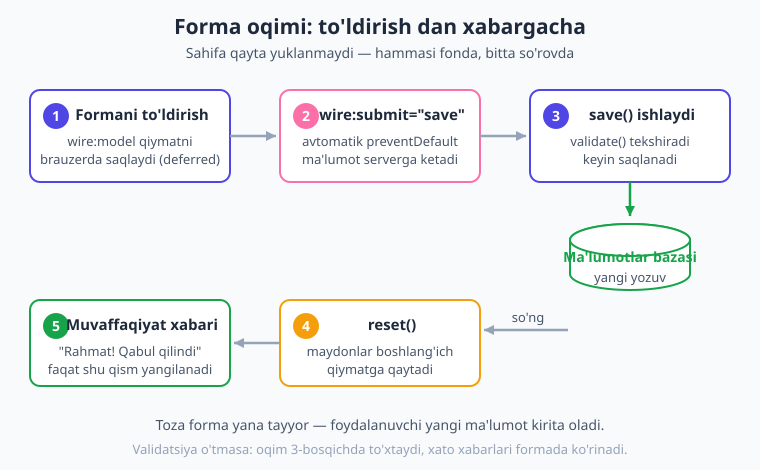
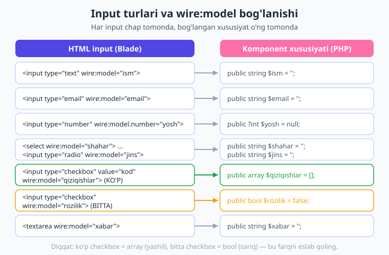
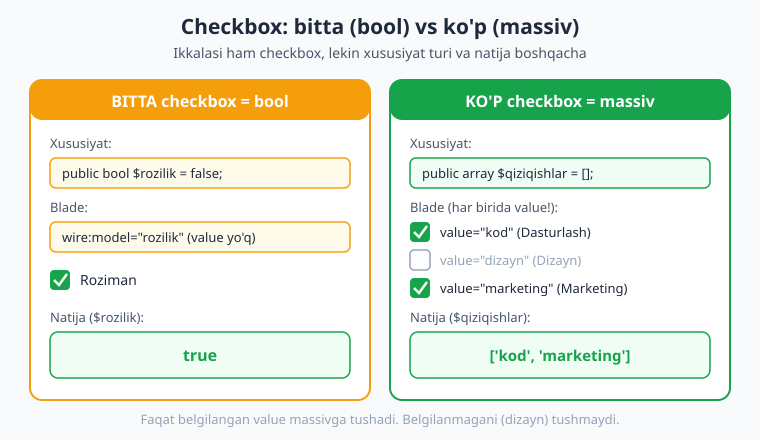

# 09 — Formalar bilan ishlash

[⬅️ Oldingi: 08 — Lifecycle](./08-lifecycle.md) · [🏠 Kitob boshi](./README.md) · [Keyingi: 10 — Validatsiya ➡️](./10-validatsiya.md)

> **Bu bobda:** foydalanuvchidan ma'lumot yig'ishni — formalarni — Livewire usulida o'rganamiz. `wire:submit` bilan forma yuborish, barcha input turlarini (matn, email, parol, raqam, `select`, `checkbox`, `radio`, `textarea`) `wire:model` bilan bog'lash, submit'da ma'lumotni qabul qilib saqlash, so'ng `reset()` bilan formani tozalash va muvaffaqiyat xabarini ko'rsatishni amalda ko'ramiz. Oxirida to'liq "fikr qoldirish" formasini yig'amiz.

---

## Forma nima?

> **Hayotiy o'xshatish.** Pochta bo'limiga borib jo'natma to'ldirayotganingizni tasavvur qiling. Sizga blank (varaqa) berishadi: bir joyga ismingizni, boshqasiga manzilni, yana bir katakka telefon raqamingizni yozasiz, kerakli joyiga belgi qo'yasiz va oxirida "Topshirish" tugmasini bosasiz. O'sha blank — **forma**. Siz to'ldirgan kataklar — **input'lar**, "Topshirish" tugmasi esa — **submit** (yuborish).

Texnik tilda **forma** — bu foydalanuvchidan ma'lumot yig'ish vositasi. Ro'yxatdan o'tish, kirish (login), fikr qoldirish, mahsulot qo'shish, sozlamalarni o'zgartirish — bularning hammasi orqasida forma turadi. Web'da har bir dastur, ertami-kechmi, formaga muhtoj bo'ladi.

An'anaviy (klassik) PHP'da forma quyidagicha ishlardi: `<form action="/saqlash" method="POST">` deb yozasiz, foydalanuvchi tugmani bosadi, brauzer **butun sahifani** serverga yuboradi, server javob qaytaradi va **sahifa boshidan qayta yuklanadi**. Bu — sekin va silliq emas.

Livewire'da esa forma uch oddiy qismdan iborat bo'ladi:

1. **Properties (xususiyatlar)** — har bir input qiymati uchun bitta public xususiyat ([05-bob](./05-properties-holat.md)).
2. **`wire:model`** — har bir input'ni o'sha xususiyatga bog'laydi ([06-bob](./06-data-binding.md)).
3. **Submit action** — forma yuborilganda ishlaydigan metod ([07-bob](./07-actions.md)).

Ya'ni siz bobning hammasini allaqachon qismlarda ko'rdingiz — endi ularni birlashtirib, to'liq forma yasaymiz. Sahifa **umuman qayta yuklanmaydi**: foydalanuvchi tugmani bosadi, Livewire ma'lumotni jimgina serverga yuboradi, ishlov beradi va faqat kerakli qismni yangilaydi.



---

## `wire:submit` — formani yuborish

Forma "Topshirish" tugmasi bosilganda nimadir sodir bo'lishi kerak. Livewire'da buni **`wire:submit`** atributi hal qiladi: u `<form>` tegiga qo'yiladi va forma yuborilganda qaysi metod ishlashini aytadi.

```blade
{{-- resources/views/components/⚡salom-form.blade.php --}}
<form wire:submit="save">
    {{-- input'lar shu yerda --}}
    <button type="submit">Yuborish</button>
</form>
```

Bu yerda eng muhim narsa — **Livewire avtomatik `preventDefault` qiladi**. Ya'ni brauzerning odatiy xatti-harakati (butun sahifani serverga yuborib qayta yuklash) **to'xtatiladi**. Buning o'rniga Livewire ma'lumotni fonda (AJAX orqali) yuboradi, `save` metodi ishlaydi va sahifa joyida qoladi.

!!! note "Eslatma"
    `wire:submit` faqat `<form>` tegida ishlaydi va forma haqiqatan yuborilganda (Enter tugmasi yoki `type="submit"` tugmasi) ishga tushadi. Tugma uchun alohida `wire:click` yozish shart emas — `wire:submit` butun formani qamrab oladi.

!!! info "Livewire 3 da qanday edi?"
    Livewire 3 da ham `wire:submit="save"` shu ko'rinishda ishlardi va avtomatik `preventDefault` qilardi. Livewire 4 da bu xatti-harakat o'zgarmagan — siz oldin o'rgangan bilim shu yerda ham to'g'ri. Asosiy farqlar `wire:model` modifikatorlarida (pastda ko'ramiz).

Quyida eng oddiy, lekin to'liq ishlaydigan forma. Bitta matn maydoni, bitta tugma:

```php
{{-- resources/views/components/⚡salom-form.blade.php --}}
<?php

use Livewire\Component;

new class extends Component
{
    public string $ism = '';     // input qiymati shu yerda saqlanadi
    public string $salom = '';   // natija

    public function save(): void
    {
        // hozircha shunchaki salomlashamiz
        $this->salom = "Salom, {$this->ism}!";
    }
};
?>

<div>
    <form wire:submit="save">
        <input type="text" wire:model="ism" placeholder="Ismingiz">
        <button type="submit">Yuborish</button>
    </form>

    @if ($salom)
        <p>{{ $salom }}</p>
    @endif
</div>
```

Foydalanuvchi ismini yozib, tugmani bosadi — sahifa qayta yuklanmaydi, lekin "Salom, ..." paydo bo'ladi. Mana shu — Livewire formasining "sehri".

> **Hayotiy o'xshatish.** Klassik forma — xat yozib, pochtaga olib borib, javobni kutib uyga qaytishdek. Livewire formasi — telefonda yozishib, javobni o'sha onda o'qishdek. Bir xil ma'lumot, lekin tezroq va silliqroq.

---

## Input turlari va `wire:model`

Har bir input turi — matn, email, parol, raqam, textarea — `wire:model` orqali bitta public xususiyatga bog'lanadi. Quyida har biriga alohida e'tibor beramiz.



### Matn maydoni (text)

Eng oddiy input. Foydalanuvchi harf, so'z, jumla yozadi:

```blade
<input type="text" wire:model="ism">
```

Komponentda:

```php
public string $ism = '';
```

### Email

Brauzer email formatini ozgina tekshiradi (ichida `@` borligini), lekin asl validatsiya serverda bo'ladi ([10-bob](./10-validatsiya.md)):

```blade
<input type="email" wire:model="email">
```

### Parol (password)

Yozilgan belgilar yulduzcha bo'lib ko'rinadi:

```blade
<input type="password" wire:model="parol">
```

!!! danger "Xavfsizlik"
    Parolni public xususiyatda saqlash xavfli emas — u serverda ishlanadi. Lekin uni **hech qachon ochiq matn ko'rinishida bazaga yozmang**. Doim `Hash::make($this->parol)` bilan shifrlang. Public xususiyatlarning mijozga ko'rinishi haqida [23-bobda](./23-xavfsizlik.md) batafsil o'qiysiz.

### Raqam (number)

Faqat raqam kiritish uchun. Qiymatni butun son sifatida olishni xohlasangiz `.number` modifikatorini qo'shing:

```blade
<input type="number" wire:model="yosh">
<input type="number" wire:model.number="narx">  {{-- qiymat son sifatida olinadi --}}
```

```php
public ?int $yosh = null;
public float $narx = 0;
```

### Textarea (ko'p qatorli matn)

Uzun matn — izoh, fikr, tavsif uchun:

```blade
<textarea wire:model="xabar" rows="4"></textarea>
```

```php
public string $xabar = '';
```

### Muhim: formada `wire:model` default **deferred**

Bu yerda [06-bobdan](./06-data-binding.md) bir muhim narsani eslatib o'tamiz. Livewire 4 da oddiy `wire:model` **deferred** (kechiktirilgan) ishlaydi: foydalanuvchi har harf yozganda serverga so'rov **yubormaydi**. Qiymat brauzerda to'planib turadi va faqat keyingi action'da (masalan, `wire:submit`) serverga boradi.

**Formalar uchun bu aynan kerakli xatti-harakat!** Tasavvur qiling, foydalanuvchi 10 harfli ismni yozadi — agar har harfda server so'rovi ketsa, bu 10 ta keraksiz so'rov bo'lardi. Deferred bilan esa hammasi bitta "Yuborish" bosilganda, bitta so'rovda boradi. Tez va tejamkor.

!!! info "Tarix: deferred qachondan default bo'lgan?"
    **Livewire 2** da `wire:model` default **real-time** edi — har bosishda serverga yuborardi va siz tejash uchun `wire:model.defer` yozardingiz. **Livewire 3** dan boshlab bu **teskari** bo'ldi: oddiy `wire:model` deferred, real-time kerak bo'lsa `wire:model.live`. Livewire 4 ham shu xatti-harakatni saqlaydi (deferred default) — faqat `.blur`/`.change` modifikatorlari semantikasini biroz o'zgartirdi ([06-bobga](./06-data-binding.md) qarang). Demak formalar uchun deferred — uzoq vaqtdan beri to'g'ri tanlov.

!!! tip "Maslahat"
    Jonli (real-time) qiymat faqat alohida holatlarda kerak — masalan, "qancha belgi qoldi" hisoblagichi yoki jonli qidiruv ([14-bob](./14-pagination-qidiruv.md)). Oddiy formada deferred yetarli va eng yaxshi tanlov.

---

## `select` — ro'yxatdan tanlash

> **Hayotiy o'xshatish.** Restoranda ofitsiant menyuni keltiradi: "Choy, qahva yoki sharbat?". Siz bittasini tanlaysiz. `select` — aynan shu menyu: tayyor variantlardan birini tanlash.

Oddiy `select`:

```blade
<select wire:model="shahar">
    <option value="">Shaharni tanlang</option>
    <option value="toshkent">Toshkent</option>
    <option value="samarqand">Samarqand</option>
    <option value="buxoro">Buxoro</option>
</select>
```

```php
public string $shahar = '';
```

Diqqat qiling: birinchi `<option>` ataylab **bo'sh** (`value=""`) va "Shaharni tanlang" deb yozilgan. Bu foydalanuvchiga "hali tanlamadim" holatini beradi va validatsiyada "tanlash shart" deyishga imkon qoladi.

### Dinamik options (`@foreach`)

Ko'pincha variantlar bazadan keladi (masalan, barcha viloyatlar). Ularni qo'lda yozish o'rniga `@foreach` bilan aylanamiz:

```php
public string $viloyat = '';

// bu massiv bazadan ham kelishi mumkin
public array $viloyatlar = ['Toshkent', 'Samarqand', 'Buxoro', 'Andijon'];
```

```blade
<select wire:model="viloyat">
    <option value="">Viloyatni tanlang</option>
    @foreach ($viloyatlar as $v)
        <option value="{{ $v }}">{{ $v }}</option>
    @endforeach
</select>
```

!!! note "Eslatma"
    `select`'da odatda `.live` shart emas — foydalanuvchi tanlaydi, qiymat brauzerda saqlanadi va submit'da boradi. Lekin agar tanlovga qarab boshqa qismni darhol yangilamoqchi bo'lsangiz (masalan, viloyat tanlangach tumanlarni ko'rsatish), unda `wire:model.live="viloyat"` ishlatasiz.

---

## `checkbox` — belgilash katakchasi

Checkbox ikki xil ishlatiladi: **bitta** (ha/yo'q holati) va **ko'p** (massivga to'plash). Bu farqni yaxshi tushunib oling — bu ko'p boshlovchilarni adashtiradigan joy.



### Bitta checkbox — bool (ha/yo'q)

Bitta belgilash katakchasi **`true` yoki `false`** beradi. Masalan, "Shartlarga roziman" yoki "Yangiliklarga obuna bo'laman":

```blade
<input type="checkbox" wire:model="rozilik"> Shartlarga roziman
```

```php
public bool $rozilik = false;   // belgilansa true, bo'lmasa false
```

Foydalanuvchi belgilasa `$rozilik` `true` bo'ladi, olib tashlasa — `false`. Oddiy.

### Ko'p checkbox — massiv

Endi qiziqarli qismi. Agar bir nechta katakchani belgilash kerak bo'lsa (masalan, "Qaysi mavzular sizni qiziqtiradi?"), barchasini **bitta massiv** xususiyatga bog'laymiz va har biriga `value` beramiz:

```blade
<label><input type="checkbox" wire:model="qiziqishlar" value="kod"> Dasturlash</label>
<label><input type="checkbox" wire:model="qiziqishlar" value="dizayn"> Dizayn</label>
<label><input type="checkbox" wire:model="qiziqishlar" value="marketing"> Marketing</label>
```

```php
public array $qiziqishlar = [];   // belgilangan value'lar shu yerga tushadi
```

Endi foydalanuvchi "Dasturlash" va "Marketing"ni belgilasa, `$qiziqishlar` quyidagicha bo'ladi:

```php
['kod', 'marketing']
```

Ya'ni faqat **belgilangan** input'larning `value`'lari massivga tushadi. Bu juda qulay — bitta xususiyatda barcha tanlovni saqlaysiz.

!!! warning "Ehtiyot bo'ling"
    Ko'p checkbox uchun xususiyat **albatta `array`** (massiv) bo'lishi shart va har bir input'da **`value` bo'lishi shart**. Agar `value` yozmasangiz yoki xususiyatni `bool` qilib qo'ysangiz, kutilmagan natija olasiz. Bitta checkbox = `bool`, ko'p checkbox = `array` — shu qoidani esda saqlang.

---

## `radio` — bittasini tanlash

> **Hayotiy o'xshatish.** Radio tugmalari — eski radiopriyomnikning kanallari kabi: bittasini bossangiz, qolganlari avtomatik chiqib ketadi. Faqat **bitta** variant tanlanadi.

Radio tugmalari bir guruh bo'lib, **bitta** xususiyatga bog'lanadi. Har biriga alohida `value` beriladi:

```blade
<label><input type="radio" wire:model="jins" value="erkak"> Erkak</label>
<label><input type="radio" wire:model="jins" value="ayol"> Ayol</label>
```

```php
public string $jins = '';
```

Foydalanuvchi "Erkak"ni tanlasa `$jins = 'erkak'`, keyin "Ayol"ni bossa — avtomatik `$jins = 'ayol'` bo'ladi. Ikkalasi birga tanlanmaydi, chunki ikkalasi ham bir xil `wire:model="jins"`ga bog'langan.

!!! note "checkbox va radio farqi"
    **checkbox** — bir nechta variantni belgilash mumkin (yoki bitta ha/yo'q). **radio** — bir guruhdan faqat bittasini. Tanlovingiz "ko'pini belgilash mumkinmi?" degan savolga bog'liq: ha bo'lsa checkbox-massiv, yo'q bo'lsa radio.

---

## Submit metodi — ma'lumotni qabul qilib ishlash

Forma to'ldirildi, tugma bosildi — endi `save` metodi ishlaydi. Bu yerda siz ma'lumotni olasiz (`$this->ism`, `$this->email` ...) va u bilan nimadir qilasiz: bazaga saqlaysiz, email yuborasiz, hisoblaysiz.

```php
public function save(): void
{
    // 1. (ixtiyoriy hozircha) validatsiya
    $this->validate([
        'ism' => 'required|min:2',
        'email' => 'required|email',
    ]);

    // 2. bazaga saqlash (Eloquent model orqali)
    Fikr::create([
        'ism' => $this->ism,
        'email' => $this->email,
        'xabar' => $this->xabar,
    ]);

    // 3. keyinroq: formani tozalash va xabar berish
}
```

### Validatsiya — bu yerda qisqacha, batafsil keyingi bobda

`$this->validate(...)` — bu kiritilgan ma'lumotni tekshiradi: ism bo'shmi, email to'g'ri formatdami va h.k. Agar tekshirish o'tmasa, metod **shu yerda to'xtaydi** va xato xabarlari avtomatik formada ko'rsatiladi (bazaga noto'g'ri ma'lumot yozilmaydi).

Validatsiya — alohida katta mavzu, shuning uchun unga butun bir bob bag'ishlangan: qoidalar, maxsus xabarlar, jonli (real-time) tekshirish, `#[Validate]` atributi — bularning hammasini [10-bobda](./10-validatsiya.md) o'rganasiz. Hozir shuni biling: **submit'da har doim validatsiya bo'lishi kerak**, hattoki bu yerda biz uni qisqa ko'rsatdik.

!!! tip "Maslahat"
    Validatsiyasiz forma — qulfsiz eshik. Foydalanuvchi bo'sh, noto'g'ri yoki zararli ma'lumot yuborishi mumkin. Doim `$this->validate()` bilan boshlang, keyin saqlang. 10-bobda buni mukammal o'rganamiz.

---

## `reset()` — formani tozalash

Ma'lumot muvaffaqiyatli saqlangach, formani bo'shatish kerak — toki foydalanuvchi yangi ma'lumot kirita olsin (yoki "yana yubormoqchimisiz?" degandek toza forma ko'rsin).

Livewire buni juda oson qiladi — **`$this->reset()`**:

```php
public function save(): void
{
    $this->validate([
        'ism' => 'required|min:2',
        'email' => 'required|email',
    ]);

    Fikr::create([
        'ism' => $this->ism,
        'email' => $this->email,
        'xabar' => $this->xabar,
    ]);

    $this->reset();   // BARCHA xususiyatlarni boshlang'ich qiymatga qaytaradi
}
```

`reset()` har bir public xususiyatni **siz e'lon qilgan boshlang'ich qiymatiga** qaytaradi (`''`, `0`, `[]`, `false` va h.k.). Ya'ni `public string $ism = '';` bo'lsa, `reset()` dan keyin `$ism` yana `''` bo'ladi.

### Faqat ba'zi maydonlarni tozalash

Ba'zan hamma narsani emas, faqat ayrim maydonlarni tozalashni xohlaysiz (masalan, muvaffaqiyat xabarini saqlab qolib, kiritish maydonlarinigina tozalash):

```php
$this->reset(['ism', 'email', 'xabar']);   // faqat shu uchtasi tozalanadi
```

!!! warning "Ehtiyot bo'ling"
    `$this->reset()` ni **xabar (natija) xususiyatidan oldin** yoki uni ro'yxatdan tashqarida qoldiring. Agar siz "Muvaffaqiyatli saqlandi!" xabarini bir xususiyatga yozib, keyin to'liq `reset()` qilsangiz, o'sha xabar ham o'chib ketadi. Shuning uchun ko'pincha aniq ro'yxat berib tozalash xavfsizroq.

---

## Submit paytida tugmani bloklash

So'rov serverga ketib, javob kelguncha bir necha lahza o'tishi mumkin. Bu paytda foydalanuvchi tugmani **takror-takror** bosib yuborishi mumkin — natijada bir xil ma'lumot ikki-uch marta saqlanib qoladi. Buni oldini olish uchun so'rov davomida tugmani **o'chirib qo'yamiz**:

```blade
<button type="submit" wire:loading.attr="disabled">
    Yuborish
</button>
```

`wire:loading.attr="disabled"` — so'rov ketayotgan paytda tugmaga `disabled` atributini qo'shadi, javob kelganda olib tashlaydi. Oddiy va samarali.

Yana yaxshiroq tajriba uchun tugma matnini ham almashtirsa bo'ladi:

```blade
<button type="submit" wire:loading.attr="disabled">
    <span wire:loading.remove>Yuborish</span>
    <span wire:loading>Yuborilmoqda...</span>
</button>
```

`wire:loading.remove` — so'rov paytida yashiradi, `wire:loading` — so'rov paytida ko'rsatadi. Natijada tugma "Yuborish" → "Yuborilmoqda..." → "Yuborish" bo'lib o'zgaradi.

!!! tip "Maslahat"
    Yuklanish holatlari — `wire:loading`, `wire:target`, spinnerlar, "iltimos kuting" effektlari — alohida bir bobning mavzusi. Bu yerda eng kerakli minimumni ko'rdik. To'liq imkoniyatlarni [20-bobda](./20-loading-holatlar.md) o'rganasiz.

---

## To'liq misol: "Fikr qoldirish" formasi

Endi hamma narsani birlashtiramiz. Quyidagi forma barcha input turlarini o'z ichiga oladi: matn, email, `select`, bitta `checkbox` (rozilik), ko'p `checkbox` (qiziqishlar), `radio` (jins) va `textarea`. Submit'da validatsiya qiladi, "saqlaydi" (bu yerda namoyish uchun natijani matn qilib ko'rsatamiz), formani tozalaydi va muvaffaqiyat xabarini chiqaradi.

> Bu komponent jonli **Laravel 12 + Livewire v4.3.1** loyihada yaratilib, brauzerda **HTTP 200** bilan render qilindi va testlar (checkbox-massiv bog'lanishi, validatsiya, `reset`) muvaffaqiyatli o'tdi.

```php
{{-- resources/views/components/⚡fikr-form.blade.php --}}
<?php

use Livewire\Component;

new class extends Component
{
    // --- har bir input uchun bitta xususiyat ---
    public string $ism = '';
    public string $email = '';
    public string $shahar = '';
    public bool $rozilik = false;       // bitta checkbox -> bool
    public string $jins = '';           // radio -> string
    public array $qiziqishlar = [];     // ko'p checkbox -> array
    public string $xabar = '';

    // natija/muvaffaqiyat xabari
    public string $natija = '';

    public function save(): void
    {
        // 1. validatsiya (batafsil: 10-bob)
        $this->validate([
            'ism' => 'required|min:2',
            'email' => 'required|email',
            'shahar' => 'required',
            'rozilik' => 'accepted',          // belgilanishi shart
            'xabar' => 'required|min:5',
        ]);

        // 2. saqlash — real loyihada: Fikr::create([...])
        //    bu yerda namoyish uchun natijani yig'amiz
        $this->natija = "Rahmat, {$this->ism}! Fikringiz qabul qilindi.";

        // 3. kirish maydonlarini tozalash (natijani saqlab qolamiz)
        $this->reset(['ism', 'email', 'shahar', 'rozilik', 'jins', 'qiziqishlar', 'xabar']);
    }
};
?>

<div>
    <form wire:submit="save">
        {{-- matn --}}
        <label>Ism</label>
        <input type="text" wire:model="ism" placeholder="Ismingiz">

        {{-- email --}}
        <label>Email</label>
        <input type="email" wire:model="email" placeholder="email@misol.uz">

        {{-- select --}}
        <label>Shahar</label>
        <select wire:model="shahar">
            <option value="">Shaharni tanlang</option>
            <option value="toshkent">Toshkent</option>
            <option value="samarqand">Samarqand</option>
            <option value="buxoro">Buxoro</option>
        </select>

        {{-- radio --}}
        <label>Jins</label>
        <label><input type="radio" wire:model="jins" value="erkak"> Erkak</label>
        <label><input type="radio" wire:model="jins" value="ayol"> Ayol</label>

        {{-- ko'p checkbox (massiv) --}}
        <label>Qiziqishlaringiz</label>
        <label><input type="checkbox" wire:model="qiziqishlar" value="kod"> Dasturlash</label>
        <label><input type="checkbox" wire:model="qiziqishlar" value="dizayn"> Dizayn</label>
        <label><input type="checkbox" wire:model="qiziqishlar" value="marketing"> Marketing</label>

        {{-- textarea --}}
        <label>Fikringiz</label>
        <textarea wire:model="xabar" rows="4" placeholder="Bu yerga yozing..."></textarea>

        {{-- bitta checkbox (bool) --}}
        <label>
            <input type="checkbox" wire:model="rozilik">
            Shaxsiy ma'lumotlarim qayta ishlanishiga roziman
        </label>

        {{-- submit tugmasi: so'rov paytida bloklanadi --}}
        <button type="submit" wire:loading.attr="disabled">
            <span wire:loading.remove>Yuborish</span>
            <span wire:loading>Yuborilmoqda...</span>
        </button>
    </form>

    {{-- muvaffaqiyat xabari --}}
    @if ($natija)
        <p style="color:#16a34a">{{ $natija }}</p>
    @endif
</div>
```

Va uni sahifaga qo'yish uchun route ([04-bobdan](./04-komponent-anatomiyasi.md)):

```php
// routes/web.php
use Illuminate\Support\Facades\Route;

Route::livewire('/fikr', 'fikr-form');
```

Bu formada siz ushbu bobning **hamma** bilimini ko'rasiz:

- Har input — `wire:model` orqali xususiyatga bog'langan (default deferred, formaga ideal).
- `wire:submit="save"` — sahifani qayta yuklamasdan submit.
- `select` da birinchi bo'sh "Tanlang" varianti.
- `radio` — bir guruh, bitta `string` xususiyat.
- Ko'p `checkbox` — bitta `array` xususiyat, har birida `value`.
- Bitta `checkbox` — `bool` (rozilik).
- `save()` da: validatsiya → saqlash → `reset()` → xabar.
- Tugma so'rov paytida bloklanadi.

!!! example "Sinab ko'ring"
    Formani to'ldirib, "Dasturlash" va "Marketing"ni belgilang, "Yuborish"ni bosing. So'ng `dd($this->qiziqishlar)` ni `save()` boshiga vaqtincha qo'yib, massiv `['kod', 'marketing']` ko'rinishida kelishini o'z ko'zingiz bilan ko'ring. Keyin uni olib tashlang.

---

## Xulosa

- **Forma** — foydalanuvchidan ma'lumot yig'ish vositasi. Livewire'da forma uch qismdan iborat: **properties** (har input uchun xususiyat) + **`wire:model`** (bog'lanish) + **submit action**.
- **`wire:submit="save"`** formani yuboradi va **avtomatik `preventDefault`** qiladi — sahifa qayta yuklanmaydi, ma'lumot fonda boradi.
- Barcha input turlari `wire:model` bilan xususiyatga bog'lanadi: `text`, `email`, `password`, `number`, `textarea`, `select`, `checkbox`, `radio`.
- Formada `wire:model` **default deferred** — har harfda emas, submit'da bir martada yuboradi. Bu formalar uchun ideal.
- **`select`** da birinchi `<option>` ni bo'sh "Tanlang" qiling. Variantlarni `@foreach` bilan dinamik chiqarish mumkin.
- **`checkbox` ikki xil:** bitta = `bool` (ha/yo'q), ko'p = `array` + har birida `value` (belgilangan qiymatlar massivga tushadi).
- **`radio`** — bir guruhdan faqat bittasini tanlaydi, bitta `string` xususiyatga bog'lanadi.
- Submit metodida: **validatsiya** (10-bob), keyin **saqlash**, keyin **`reset()`** bilan tozalash va muvaffaqiyat xabari.
- **`wire:loading.attr="disabled"`** so'rov paytida tugmani bloklab, takror yuborishni oldini oladi (batafsil — 20-bob).

## Amaliy mashqlar

1. **Aloqa formasi (oson).** Uch maydonli forma yarating: `ism` (text), `email` (email), `xabar` (textarea). `wire:submit="yubor"` bilan submit'da `$this->natija = "Xabaringiz yuborildi!"` qiling va formani `reset()` qiling. Natijani `@if` bilan ko'rsating.

2. **Ko'p checkbox bilan qiziqishlar (o'rta).** Foydalanuvchiga 5 ta qiziqish variantini ko'rsating (sport, kitob, sayohat, musiqa, oshpazlik). Hammasini bitta `array` xususiyatga bog'lang. Submit'dan keyin "Siz N ta qiziqish tanladingiz" deb tanlangan sonni ko'rsating (`count($this->qiziqishlar)` dan foydalaning).

3. **`select` bilan shahar (o'rta).** Shaharlar ro'yxatini bitta `array` xususiyatda saqlab, `@foreach` bilan `select` ichiga dinamik chiqaring. Birinchi variant bo'sh "Shaharni tanlang" bo'lsin. Submit'da tanlangan shaharni xabar sifatida ko'rsating.

4. **Hamma birga (qiyin).** Bobdagi to'liq "Fikr qoldirish" formasini o'zingiz noldan terib, jonli loyihangizda brauzerda ishlatib ko'ring. Submit tugmasiga `wire:loading` matn almashinuvini qo'shing va `radio`, bitta `checkbox`, ko'p `checkbox`, `select` — barchasi to'g'ri ishlayotganini tekshiring.

5. **Tozalash mantig'i (qiyin).** Formani shunday qiling: muvaffaqiyatli saqlangach **faqat kirish maydonlari** tozalansin (`$this->reset([...])` aniq ro'yxat bilan), lekin "saqlangan fikrlar soni" hisoblagichi (har submit'da `$this->jami++`) o'chmasdan, oshib borsin. To'liq `reset()` nima uchun bu yerda noto'g'ri bo'lishini o'ylab ko'ring.

---

[⬅️ Oldingi: 08 — Lifecycle](./08-lifecycle.md) · [🏠 Kitob boshi](./README.md) · [Keyingi: 10 — Validatsiya ➡️](./10-validatsiya.md)
