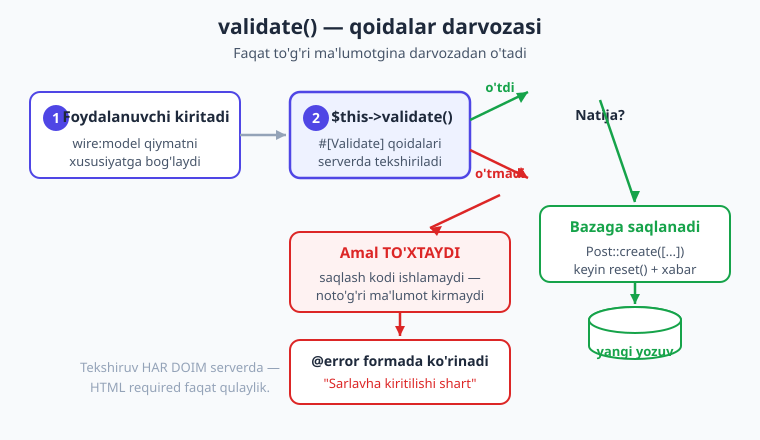
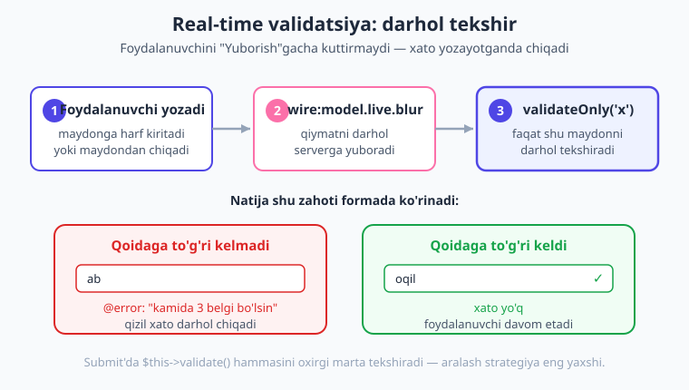
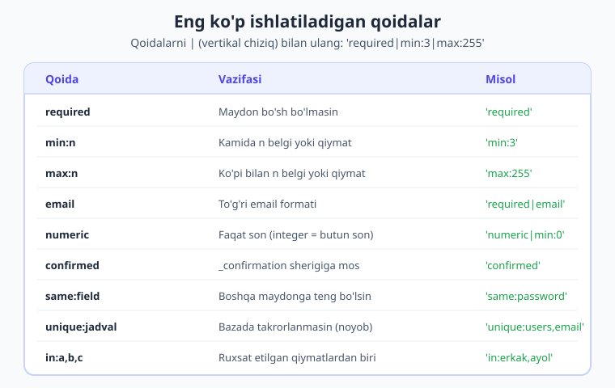

# 10 — Validatsiya

[⬅️ Oldingi: 09 — Formalar](./09-formalar.md) · [🏠 Kitob boshi](./README.md) · [Keyingi: 11 — Form Objects ➡️](./11-form-objects.md)

> **Bu bobda:** foydalanuvchi kiritgan ma'lumotni tekshirishni — **validatsiya**ni — to'liq o'rganamiz. `#[Validate]` atributi bilan eng oddiy yo'lni, `$this->validate()` metodini, Blade'da xatolarni `@error` orqali ko'rsatishni, o'zbekcha maxsus xabarlarni, murakkab holatlar uchun `rules()` va `messages()` metodlarini, yozayotgan paytda darhol tekshiradigan **real-time validatsiya**ni va eng muhimi — validatsiya nega doim serverda bo'lishini ko'ramiz. Oxirida to'liq tekshiriladigan "ro'yxatdan o'tish" formasini yig'amiz.

---

## Validatsiya nega kerak?

> **Hayotiy o'xshatish.** Tasavvur qiling, siz kechki tadbirga eshik qorovuli (fays-kontrol) qo'ydingiz. Uning vazifasi — kirayotganlarni tekshirish: chiptasi bormi, ismi ro'yxatdami, yoshi yetadimi. Qorovul bo'lmasa, ichkariga xohlagan odam — chiptasizlar ham, ro'yxatda yo'qlar ham — bemalol kirib ketadi va tadbirni buzadi. **Validatsiya** — sizning dasturingiz eshigidagi aynan shu qorovul. U foydalanuvchi kiritgan ma'lumotni ichkariga (bazaga) qo'yishdan oldin tekshiradi.

Texnik tilda **validatsiya** — bu foydalanuvchi yuborgan ma'lumot **to'g'ri va xavfsiz**ligini tekshirish jarayoni. Bu nima uchun shu qadar muhim? Chunki bitta oddiy haqiqat bor:

> **Foydalanuvchi kiritgan ma'lumotga HECH QACHON ishonib bo'lmaydi.**

Buni doim yodda tuting. Foydalanuvchi:

- maydonni **bo'sh** qoldirishi mumkin (ism yozmasdan "Yuborish"ni bosadi);
- **noto'g'ri** ma'lumot kiritishi mumkin (email o'rniga "salom" deb yozadi, yoshi o'rniga "-5");
- bilmasdan **xato** qilishi mumkin (parolni ikki marta boshqacha teradi);
- ataylab **zararli** ma'lumot yuborishi mumkin (skript, juda uzun matn, soxta qiymat).

Validatsiyasiz forma — qulfsiz eshik kabi. Tekshiruvsiz bazaga noto'g'ri yoki zararli ma'lumot tushib qoladi, dastur sinadi yoki xavfsizlik teshigi paydo bo'ladi. Shuning uchun **har bir forma orqasida validatsiya turishi shart**.



[09-bobda](./09-formalar.md) biz formalar yasagandik va `$this->validate([...])` ni qisqacha ko'rgandik. Endi unga to'liq sho'ng'iymiz: Livewire bu vazifani qanday qilib hayratlanarli darajada oson qilishini ko'rasiz.

!!! note "Laravel validatsiyasi ustiga qurilgan"
    Livewire validatsiyasi mustaqil narsa emas — u Laravel'ning kuchli validatsiya tizimidan foydalanadi. Ya'ni siz Laravel'da biladigan barcha qoidalar (`required`, `min`, `max`, `email`, `unique` va boshqa o'nlab qoida) Livewire'da ham aynan shunday ishlaydi. Livewire faqat ularni komponentga qulay bog'laydi.

---

## Eng oddiy yo'l: `#[Validate]` atributi

Livewire 4 da validatsiyaning eng oddiy va eng ko'p ishlatiladigan yo'li — xususiyat ustiga **`#[Validate]` atributi** qo'yish. Atribut — bu xususiyat haqidagi "yorliq", unga "bu maydon shu qoidalarga bo'ysunadi" deb belgi qo'yamiz.

Avvalo atribut sinfini ulashni unutmang:

```php
use Livewire\Attributes\Validate;
```

So'ng xususiyat ustiga qoidani yozamiz:

```php
#[Validate('required|min:3')]
public $title = '';
```

Bu yer shuni anglatadi: `$title` maydoni **majburiy** (`required`) va **kamida 3 belgi** (`min:3`) bo'lishi shart. Qoidalar bir-biridan **`|` (vertikal chiziq)** bilan ajratiladi.

> **Hayotiy o'xshatish.** `#[Validate('required|min:3')]` — bu maydonga yopishtirilgan kichik chipta kabi: "Bo'sh bo'lmasin, kamida 3 harf bo'lsin". Qorovul (validatsiya) shu chiptani o'qib, qoidaga rioya qilinganini tekshiradi.

Atribut o'zi hech narsa qilmaydi — u faqat **qoidani e'lon qiladi**. Qoidani haqiqatan ishga tushirish uchun action ichida `$this->validate()` ni chaqirishimiz kerak (pastda ko'ramiz).

!!! info "Livewire 3 da qanday edi?"
    Livewire 3 da ham `#[Validate]` atributi bor edi va deyarli bir xil ishlardi. Livewire 4 da bu yondashuv asosiy va tavsiya etilgan yo'l bo'lib qoldi. Eski `protected $rules = [...]` massiv usuli ham hali ishlaydi, lekin atribut — toza va o'qishga qulay.

---

## `$this->validate()` — qoidalarni ishga tushirish

Atribut qoidani e'lon qildi, endi uni **ishga solish** kerak. Buni action ichida `$this->validate()` ni chaqirib qilamiz. U **barcha** `#[Validate]` qoidalarini bir vaqtda tekshiradi.

Mantiq juda sodda:

- Agar **hamma qoida o'tsa** — `validate()` qiymatlarni qaytaradi va kod davom etadi (saqlash sodir bo'ladi).
- Agar **birorta qoida o'tmasa** — metod aynan shu yerda **to'xtaydi**, pastdagi kodlar (masalan, bazaga saqlash) **umuman ishlamaydi**, va xato xabarlari avtomatik ravishda Blade'ga uzatiladi.

```php
{{-- resources/views/components/⚡post-form.blade.php --}}
<?php

use Livewire\Component;
use Livewire\Attributes\Validate;

new class extends Component
{
    #[Validate('required|min:3')]
    public $title = '';

    public $saqlandi = false;

    public function save(): void
    {
        $this->validate();   // <- shu yerda barcha qoida tekshiriladi

        // BU YERGA faqat validatsiya O'TGAN bo'lsa keladi
        // real loyihada: Post::create(['title' => $this->title]);
        $this->saqlandi = true;
    }
};
?>

<div>
    <form wire:submit="save">
        <input type="text" wire:model="title">
        <button type="submit">Saqlash</button>
    </form>

    @if ($saqlandi)
        <p>Muvaffaqiyatli saqlandi!</p>
    @endif
</div>
```

Bu yerdagi eng muhim tushuncha — **`validate()` "darvoza" vazifasini bajaradi**. Agar `$title` bo'sh yoki 3 belgidan qisqa bo'lsa, `validate()` chiziqdan o'tkazmaydi: `$saqlandi = true` qatori **bajarilmaydi**, "Saqlandi" xabari ko'rinmaydi, foydalanuvchi esa xatosini ko'radi.

> **Bu komponent jonli Laravel + Livewire v4.3.1 loyihada yaratilib, testdan o'tkazildi:** bo'sh maydonda `required` xatosi, qisqa matnda `min` xatosi chiqdi; to'g'ri qiymatda esa xatosiz saqlandi.

!!! tip "Validatsiya har doim action boshida"
    Odatiy tartib shunday: action **boshida** `$this->validate()`, keyin saqlash, keyin tozalash/xabar. Validatsiyani oxiriga qoldirsangiz, noto'g'ri ma'lumot allaqachon bazaga yozilib bo'lgan bo'ladi — bu jiddiy xato.

---

## Blade'da xatoni ko'rsatish: `@error`

Validatsiya o'tmaganda Livewire xato xabarlarini avtomatik tayyorlaydi. Endi ularni foydalanuvchiga ko'rsatishimiz kerak — aks holda u nima xato qilganini bilmaydi. Buning uchun Blade'da **`@error` direktivasi** ishlatamiz:

```blade
<input type="text" wire:model="title">

@error('title')
    <span style="color:#dc2626">{{ $message }}</span>
@enderror
```

`@error('title')` shuni anglatadi: "agar `title` maydonida xato bo'lsa, quyidagini ko'rsat". Ichidagi **`$message`** o'zgaruvchisi — o'sha maydonga tegishli xato matni (masalan, "The title field is required.").

> **Hayotiy o'xshatish.** `@error` — bu maydon yonidagi kichik chiroq. Hamma narsa joyida bo'lsa, chiroq o'chiq turadi. Maydon noto'g'ri bo'lsa, qizil chiroq yonadi va "bu yerda muammo bor" deydi.

Har bir maydon uchun alohida `@error` qo'yiladi:

```blade
<form wire:submit="save">
    <label>Sarlavha</label>
    <input type="text" wire:model="title">
    @error('title') <span style="color:#dc2626">{{ $message }}</span> @enderror

    <label>Matn</label>
    <textarea wire:model="content"></textarea>
    @error('content') <span style="color:#dc2626">{{ $message }}</span> @enderror

    <button type="submit">Saqlash</button>
</form>
```

### Barcha xatolarni birdaniga ko'rsatish

Ba'zan har bir maydon yonida emas, balki formaning yuqorisida **barcha xatolar ro'yxatini** ko'rsatish qulayroq. Buning uchun `$errors` o'zgaruvchisidan foydalanamiz (u har bir Livewire view'da avtomatik mavjud):

```blade
@if ($errors->any())
    <div style="color:#dc2626">
        <p>Quyidagi xatolarni to'g'rilang:</p>
        <ul>
            @foreach ($errors->all() as $xato)
                <li>{{ $xato }}</li>
            @endforeach
        </ul>
    </div>
@endif
```

`$errors->any()` — umuman xato bormi degan savol, `$errors->all()` — barcha xato matnlari massivi. Ikki uslubni birlashtirib ham ishlatish mumkin: yuqorida umumiy ro'yxat, har maydon yonida aniq `@error`.

!!! note "Eslatma"
    `@error` va `$errors` — bular Laravel'ning standart Blade vositalari. Livewire ularni o'zgartirmaydi, shuning uchun agar siz oddiy Laravel formalarini bilsangiz, bu yerda yangi narsa o'rganishingiz shart emas.

---

## Bir maydonga bir nechta qoida va bir nechta atribut

Bitta maydonga istalgancha qoida berish mumkin — ularni `|` bilan ulang:

```php
#[Validate('required|string|min:3|max:255')]
public $title = '';
```

Bu `$title` ni: majburiy, matn turida, kamida 3, ko'pi bilan 255 belgi bo'lishini talab qiladi.

Yana bir usul — **bir nechta `#[Validate]` atributini** ustma-ust qo'yish. Bu, ayniqsa, har bir qoidaga **alohida xabar** bermoqchi bo'lganda foydali:

```php
#[Validate('required', message: 'Ism kiritilishi shart')]
#[Validate('min:2', message: 'Ism juda qisqa')]
public $name = '';
```

Endi maydon bo'sh bo'lsa "Ism kiritilishi shart", qisqa bo'lsa "Ism juda qisqa" chiqadi. Har bir atribut o'z qoidasi va o'z xabarini olib yuradi.

!!! tip "Maslahat"
    Bitta `#[Validate('required|min:2')]` ham, ustma-ust ikkita atribut ham bir xil tekshiruvni qiladi. Farqi — **xabarlarda**. Agar har bir qoidaga boshqacha o'zbekcha matn kerak bo'lsa, ustma-ust atribut qulay; aks holda bitta atributda `|` bilan birlashtiring.

---

## Maxsus (o'zbekcha) xabarlar va maydon nomlari

Standart Livewire xatolari **inglizcha** bo'ladi: "The title field is required." O'zbekcha kitob uchun bu yaxshi emas. Buni ikki xil tuzatamiz.

### 1. Maydon nomini o'zbekchalashtirish — `as:`

`as:` parametri xato matnidagi maydon nomini almashtiradi. Standart xabar "The title ..." emas, "sarlavha ..." bo'ladi:

```php
#[Validate('required|min:3', as: 'sarlavha')]
public $title = '';
```

Endi xato matni "sarlavha"ni ishlatadi, lekin qolgan matn ( "is required") hali inglizcha bo'lishi mumkin. `as:` — eng oson, lekin yarim yo'l.

### 2. To'liq maxsus xabar — `message:`

`message:` butun xato matnini siz yozgan matn bilan almashtiradi — to'liq o'zbekcha:

```php
#[Validate('required', message: 'Sarlavha kiritilishi shart')]
public $title = '';
```

Endi maydon bo'sh bo'lsa, aynan "Sarlavha kiritilishi shart" chiqadi.

> Bir maydonda ham `as:`, ham `message:` ishlatish mumkin; lekin to'liq nazorat uchun `message:` (yoki pastdagi `messages()` metodi) eng yaxshi tanlov.

!!! example "Misol — to'liq o'zbekcha forma"
    ```php
    #[Validate('required', message: 'Ism kiritilishi shart')]
    #[Validate('min:2', message: 'Ism kamida 2 belgidan iborat bo\'lsin')]
    public $name = '';

    #[Validate('required|email', message: 'To\'g\'ri email manzil kiriting')]
    public $email = '';
    ```
    Bu yerda har bir xato to'liq o'zbekcha, foydalanuvchiga aniq tushunarli.

> **Bu xabarlar jonli loyihada tekshirildi:** maydon bo'sh bo'lganda aynan o'zbekcha matn render qilindi va `@error` orqali ko'rindi.

---

## Murakkab qoidalar uchun: `rules()` va `messages()` metodlari

Atribut — soddalik uchun ajoyib. Lekin ba'zi holatlarda qoida **dinamik** bo'lishi kerak: u boshqa qiymatga bog'liq, yoki Laravel'ning **`Rule` obyektlari**ni talab qiladi (masalan, "bu email bazada takrorlanmasin, lekin tahrir paytida o'zinikini hisobga olma"). Bunday hollarda atribut o'rniga **`rules()` metodi** ishlatiladi.

`rules()` — bu komponentga qo'shiladigan metod bo'lib, qoidalar massivini qaytaradi:

```php
protected function rules(): array
{
    return [
        'title' => 'required|min:3',
        'email' => ['required', 'email'],
    ];
}
```

Diqqat qiling: qoidani **matn** (`'required|min:3'`) sifatida ham, **massiv** (`['required', 'email']`) sifatida ham yozish mumkin. `Rule` obyektlari kerak bo'lganda massiv shakli ishlatiladi:

```php
use Illuminate\Validation\Rule;

protected function rules(): array
{
    return [
        // email bazada takrorlanmasin (yangi yozuv uchun)
        'email' => ['required', 'email', Rule::unique('users', 'email')],
    ];
}
```

Tahrir (edit) paytida esa foydalanuvchining **o'z** emaili "takror" deb hisoblanmasligi kerak — buning uchun `->ignore(...)`:

```php
protected function rules(): array
{
    return [
        'email' => [
            'required',
            'email',
            Rule::unique('users', 'email')->ignore($this->userId),
        ],
    ];
}
```

Xabarlarni esa **`messages()` metodi** beradi. Uning kalitlari `maydon.qoida` ko'rinishida (nuqta bilan):

```php
protected function messages(): array
{
    return [
        'title.required' => 'Sarlavha kiritilishi shart',
        'title.min' => 'Sarlavha kamida 3 belgidan iborat bo\'lsin',
        'email.required' => 'Email kiritilishi shart',
        'email.email' => 'To\'g\'ri email manzil kiriting',
    ];
}
```

> **Bu `rules()` + `messages()` juftligi jonli loyihada tekshirildi:** `save()` da `$this->validate()` ikkala qoidani ham ishlatdi va `messages()` dagi aynan o'zbekcha matn ("Sarlavha kiritilishi shart") xato sifatida qaytdi.

### Qachon atribut, qachon metod?

| Holat | Tanlov |
|---|---|
| Oddiy, qat'iy qoidalar | `#[Validate]` atributi |
| Bir nechta soddagina o'zbekcha xabar | atribut + `message:` |
| Dinamik qoida (boshqa qiymatga bog'liq) | `rules()` metodi |
| `Rule::unique()`, `Rule::in()` kabi obyektlar | `rules()` metodi |
| Murakkab/ko'p maydonli o'zbekcha xabarlar | `messages()` metodi |

!!! warning "Ehtiyot bo'ling"
    `rules()` metodini e'lon qilsangiz, `#[Validate]` atributlari **e'tiborga olinmaydi** — Livewire `rules()` ni ustun ko'radi. Ya'ni ikkalasini bitta maydon uchun aralashtirmang; biri yoki ikkinchisini tanlang.

---

## Real-time (jonli) validatsiya

Hozirgacha biz faqat **submit paytida** tekshirdik. Lekin yaxshi forma foydalanuvchini "Yuborish"ni bosguncha kuttirmaydi — u **yozayotgan paytdayoq** xatoni ko'rsatadi. Buni **real-time validatsiya** deymiz.

> **Hayotiy o'xshatish.** Imtihon topshiriqlarini yozib bo'lgach baho olish — bu submit-validatsiya. O'qituvchi yelkangiz osha qarab turib, har bir jumlada "bu yerda xato bor" deb darhol aytib turishi — bu real-time validatsiya. Ikkinchisi foydalanuvchiga yoqimliroq: u xatosini darhol bilib, darhol tuzatadi.



Buning uchun ikki narsa kerak: maydonda **`#[Validate]`** qoidasi (boriga ega bo'lishi) va Blade'da **`wire:model.live`** (yozayotganda serverga yuborish).

[06-bobdan](./06-data-binding.md) eslang: Livewire 4 da oddiy `wire:model` **deferred** (faqat keyingi action'da yuboradi). Real-time tekshiruv uchun esa qiymat darhol serverga borishi kerak, shuning uchun **`.live`** qo'shamiz:

```blade
<input type="text" wire:model.live="title">
@error('title') <span style="color:#dc2626">{{ $message }}</span> @enderror
```

Endi foydalanuvchi har harf yozganda qiymat serverga boradi. Lekin xato tekshiruvini ham ishga tushirish kerak. Buni ikki usulda qilamiz.

### 1-usul: `wire:model.live.blur` + atribut (eng oson)

`wire:model.live.blur` — qiymat foydalanuvchi maydondan **chiqqanda** (boshqa joyga bosganda) yuboriladi. Bu real-time tajriba beradi, lekin har harfda emas — shuning uchun serverga kamroq yuk:

```blade
<input type="text" wire:model.live.blur="title">
@error('title') <span style="color:#dc2626">{{ $message }}</span> @enderror
```

Livewire 4 da `#[Validate]` qoidasiga ega maydon `.live` bilan yangilanganda, validatsiya **avtomatik** ishlaydi va o'sha maydonning xatosi darhol ko'rinadi.

### 2-usul: `updatedXxx()` hook + `validateOnly()` (aniq nazorat)

Agar har bir maydon yangilanganda **faqat o'sha maydonni** tekshirmoqchi bo'lsangiz, [08-bobdan](./08-lifecycle.md) bilgan `updated`-hookdan foydalaning. `updatedTitle()` — `$title` o'zgarganda avtomatik chaqiriladigan metod:

```php
public function updatedTitle(): void
{
    $this->validateOnly('title');   // faqat 'title' ni tekshiradi
}
```

Bu yerda muhim farq bor:

- **`$this->validate()`** — **barcha** maydonlarni tekshiradi. Submit paytida ideal.
- **`$this->validateOnly('title')`** — **faqat bitta** maydonni tekshiradi. Real-time paytida ideal — chunki foydalanuvchi hali "Email"ni to'ldirmagan bo'lsa ham, faqat hozir yozayotgan "Sarlavha"sigina tekshirilsin, qolgan bo'sh maydonlar uchun xato chiqmasin.

> **Hayotiy o'xshatish.** `validate()` — butun blankni tekshiruvchi qorovul. `validateOnly('title')` — faqat bitta katakka qaragan tekshiruvchi. Foydalanuvchi hali ikkinchi katakka yetmaganida birinchisinigina baholash adolatliroq.

> **Bu jonli loyihada tekshirildi:** `wire:model.live.blur` bilan bog'langan maydonga 2 belgili qisqa qiymat kiritilganda, `updatedUsername()` ichidagi `validateOnly()` darhol `min` xatosini chiqardi — submit kutmasdan.

!!! tip "Aralash strategiya — eng yaxshi tajriba"
    Amaliyotda eng yoqimli forma ikkalasini birlashtiradi: har maydon `wire:model.live.blur` bilan **yozayotganda** tekshiriladi, "Yuborish" tugmasi esa `$this->validate()` bilan **hamma narsani oxirgi marta** tekshiradi. Shunda foydalanuvchi xatosini erta ko'radi, lekin hech narsa nazoratdan chetda qolmaydi.

---

## `resetValidation()` — xatolarni tozalash

Ba'zan xato xabarlarini **qo'lda o'chirib tashlash** kerak bo'ladi. Masalan, foydalanuvchi "Bekor qilish" tugmasini bossa yoki formani yangidan boshlasa, eski qizil xatolar ekranda osilib qolmasligi kerak. Buning uchun **`$this->resetValidation()`**:

```php
public function bekorQil(): void
{
    $this->reset();             // maydon qiymatlarini boshlang'ich holatga
    $this->resetValidation();   // xato xabarlarini ham tozalaydi
}
```

E'tibor bering: [09-bobdan](./09-formalar.md) bilgan `$this->reset()` faqat **qiymatlarni** tozalaydi, ekrandagi **xato xabarlarini emas**. Shuning uchun ko'pincha ikkalasi birga ishlatiladi.

`resetValidation()` ni argumentsiz chaqirsangiz, **barcha** xatolarni tozalaydi; bitta maydon nomini bersangiz — faqat o'shanikini:

```php
$this->resetValidation('email');   // faqat email xatosini o'chiradi
```

> **Bu jonli loyihada tekshirildi:** `save()` xato bergach ekranda xato bor edi; `resetValidation()` chaqirilgach `assertHasNoErrors()` — ya'ni xatolar tozalandi.

!!! note "validate() vs validateOnly() vs resetValidation()"
    - **`validate()`** — barchasini tekshir (submit'da).
    - **`validateOnly('x')`** — faqat bittasini tekshir (real-time'da).
    - **`resetValidation()`** — tekshirma, mavjud xatolarni o'chir (bekor qilish/qayta boshlashda).

---

## Xavfsizlik: validatsiya HAR DOIM serverda

Bu bo'lim — butun bobning eng muhim qoidasi. Diqqat bilan o'qing.

!!! danger "Xavfsizlik — buni hech qachon unutmang"
    Validatsiya **har doim serverda** bo'lishi shart. HTML'dagi `required`, `maxlength`, `type="email"` kabi **mijoz tomonidagi (client-side)** tekshiruvlar faqat **qulaylik** uchun — ular **himoya emas**.

Nega? Chunki HTML tekshiruvlari faqat brauzerda ishlaydi, brauzerni esa foydalanuvchi **to'liq nazorat qiladi**. Tajribali (yoki yomon niyatli) odam:

- brauzer "Developer Tools" orqali `required` atributini bir soniyada o'chirib tashlashi;
- formani umuman ochmasdan, to'g'ridan-to'g'ri serverga so'rov yuborishi;
- JavaScript'ni o'chirib qo'yishi mumkin.

Ya'ni HTML validatsiyasi — eshikdagi "Iltimos, taqillating" yozuvi kabi: xushmuomala odamlar rioya qiladi, lekin u eshikni **qulflamaydi**. Server validatsiyasi esa — haqiqiy qulf. Livewire'da `$this->validate()` aynan **serverda** ishlaganligi uchun u ishonchli himoya beradi.

> **Hayotiy o'xshatish.** HTML `required` — do'kon eshigidagi "Yoshingiz 18 dan oshganmi?" degan yozuv. Server validatsiyasi — kassada hujjatni tekshiradigan sotuvchi. Yozuvni hamma ham o'qimaydi yoki rost javob bermaydi; kassadagi tekshiruvni esa chetlab o'tib bo'lmaydi.

Demak, qoida sodda: HTML tekshiruvlarini **qulaylik uchun** qo'shing (foydalanuvchiga yordam beradi), lekin **hech qachon ularga ishonmang** — haqiqiy himoya doim `$this->validate()` orqali serverda bo'ladi. Xavfsizlik mavzusini [23-bobda](./23-xavfsizlik.md) yanada chuqurroq ko'rasiz.

---

## Keng ishlatiladigan qoidalar

Laravel'da o'nlab qoida bor, lekin amalda eng ko'p ishlatiladigani — bir hovuch. Quyida ularning jadvali:



| Qoida | Vazifasi | Misol |
|---|---|---|
| `required` | Maydon bo'sh bo'lmasin | `'required'` |
| `nullable` | Bo'sh bo'lishi mumkin (ixtiyoriy) | `'nullable\|email'` |
| `min:n` | Kamida n belgi/qiymat | `'min:3'` |
| `max:n` | Ko'pi bilan n belgi/qiymat | `'max:255'` |
| `email` | To'g'ri email formati | `'required\|email'` |
| `numeric` | Faqat son | `'numeric'` |
| `integer` | Butun son | `'integer\|min:0'` |
| `string` | Matn turida | `'string\|max:100'` |
| `confirmed` | Tasdiq maydoniga mos kelsin | `'confirmed'` |
| `same:field` | Boshqa maydonga teng | `'same:password'` |
| `unique:jadval` | Bazada takrorlanmasin | `'unique:users,email'` |
| `in:a,b,c` | Ruxsat etilgan qiymatlardan biri | `'in:erkak,ayol'` |
| `url` | To'g'ri URL | `'nullable\|url'` |
| `image` | Rasm fayli | `'image\|max:1024'` |

> **`confirmed` qoidasi jonli loyihada tekshirildi:** `#[Validate('required\|confirmed')] public $password` qoidasi `$password_confirmation` maydoni bilan solishtirildi — qiymatlar har xil bo'lsa `confirmed` xatosi, teng bo'lsa xatosiz o'tdi.

!!! note "`confirmed` qanday ishlaydi?"
    `confirmed` qoidasi maydon nomiga `_confirmation` qo'shilgan **sherik maydon**ni qidiradi. Ya'ni `password` uchun `password_confirmation` xususiyati bo'lishi kerak. Agar nomlar mos kelmasa, `same:password` qoidasidan foydalaning. To'liq qoidalar ro'yxati Laravel hujjatlarida — bu jadval eng kerakli minimumdir.

---

## To'liq misol: ro'yxatdan o'tish formasi

Endi hamma narsani birlashtiramiz: real-time tekshiruv (`.live.blur`), submit validatsiyasi (`validate()`), o'zbekcha xabarlar, `confirmed` qoidasi va `@error`. Bu — haqiqiy loyihalarda ishlatiladigan to'liq ro'yxatdan o'tish formasi.

> **Bu komponent jonli Laravel + Livewire v4.3.1 loyihada yaratilib, test bilan tekshirildi:** bo'sh maydonlarda `required` xatolari, qisqa nomda `min`, mos kelmagan parolda `confirmed`/`same` xatosi chiqdi; barcha maydon to'g'ri bo'lganda esa xatosiz "saqlandi". Real-time paytida `validateOnly()` darhol ishladi.

```php
{{-- resources/views/components/⚡royxat-form.blade.php --}}
<?php

use Livewire\Component;
use Livewire\Attributes\Validate;

new class extends Component
{
    #[Validate('required|min:3', as: 'foydalanuvchi nomi')]
    public $username = '';

    #[Validate('required|email')]
    public $email = '';

    #[Validate('required|min:6')]
    public $password = '';

    #[Validate('required|same:password', message: 'Parol tasdig\'i mos kelmadi')]
    public $password_confirmation = '';

    public $tugatildi = false;

    // real-time: foydalanuvchi nomini yozayotganda darhol tekshir
    public function updatedUsername(): void
    {
        $this->validateOnly('username');
    }

    public function save(): void
    {
        // submit: HAMMA maydonni oxirgi marta tekshir
        $this->validate();

        // real loyihada: User::create([... Hash::make($this->password) ...]);
        // (parolni HECH QACHON ochiq saqlamang — 09 va 23-bobga qarang)

        $this->reset();             // qiymatlarni tozala
        $this->resetValidation();   // xatolarni ham tozala
        $this->tugatildi = true;
    }
};
?>

<div>
    <form wire:submit="save">
        {{-- foydalanuvchi nomi: real-time (.live.blur) --}}
        <label>Foydalanuvchi nomi</label>
        <input type="text" wire:model.live.blur="username">
        @error('username') <span style="color:#dc2626">{{ $message }}</span> @enderror

        {{-- email: submit'da tekshiriladi (deferred) --}}
        <label>Email</label>
        <input type="email" wire:model="email">
        @error('email') <span style="color:#dc2626">{{ $message }}</span> @enderror

        {{-- parol --}}
        <label>Parol</label>
        <input type="password" wire:model="password">
        @error('password') <span style="color:#dc2626">{{ $message }}</span> @enderror

        {{-- parol tasdig'i: same:password --}}
        <label>Parolni takrorlang</label>
        <input type="password" wire:model="password_confirmation">
        @error('password_confirmation') <span style="color:#dc2626">{{ $message }}</span> @enderror

        <button type="submit" wire:loading.attr="disabled">
            <span wire:loading.remove>Ro'yxatdan o'tish</span>
            <span wire:loading>Tekshirilmoqda...</span>
        </button>
    </form>

    @if ($tugatildi)
        <p style="color:#16a34a">Tabriklaymiz! Siz ro'yxatdan o'tdingiz.</p>
    @endif
</div>
```

Uni sahifaga qo'yish uchun route ([04-bobdan](./04-komponent-anatomiyasi.md)):

```php
// routes/web.php
use Illuminate\Support\Facades\Route;

Route::livewire('/royxat', 'royxat-form');
```

Bu formada siz bobning **hamma** bilimini ko'rasiz:

- **`#[Validate]`** atributlari — har maydon o'z qoidasi bilan.
- **`as:`** (maydon nomi) va **`message:`** (to'liq o'zbekcha xabar).
- **`same:password`** — parol tasdig'i ([`confirmed`] o'rnida aniq maydonga ko'rsatish).
- **Real-time:** `wire:model.live.blur` + `updatedUsername()` ichida `validateOnly()`.
- **Submit:** `$this->validate()` hammasini tekshiradi — darvoza vazifasi.
- **Tozalash:** `reset()` + `resetValidation()` birga.
- **`@error`** — har maydon yonida xato matni.
- **`wire:loading`** — so'rov paytida tugma "Tekshirilmoqda..." bo'ladi (batafsil — [20-bob](./20-loading-holatlar.md)).

!!! question "Tekshirib ko'ring"
    Bu formani jonli loyihangizda ishga tushiring. Avval hamma maydonni bo'sh qoldirib "Ro'yxatdan o'tish"ni bosing — barcha xatolarni ko'ring. So'ng "Foydalanuvchi nomi"ga 2 ta harf yozib boshqa joyga bosing (blur) — `min` xatosi darhol chiqishini kuzating. Oxirida hammasini to'g'ri to'ldirib, parollarni har xil yozing — `same` xatosi qanday ishlashini tekshiring.

---

## Xulosa

- **Validatsiya** — foydalanuvchi ma'lumotini bazaga qo'yishdan oldin tekshirish. Foydalanuvchi kiritgan ma'lumotga **hech qachon ishonib bo'lmaydi** (bo'sh, noto'g'ri, zararli bo'lishi mumkin).
- Eng oddiy yo'l — xususiyat ustiga **`#[Validate('required|min:3')]`** atributi (`use Livewire\Attributes\Validate;`).
- Action ichida **`$this->validate()`** barcha qoidalarni ishga soladi: o'tmasa metod **to'xtaydi**, xatolar Blade'ga uzatiladi — bu "darvoza" vazifasi.
- Blade'da xatolar **`@error('maydon') {{ $message }} @enderror`** bilan, barchasi esa **`$errors->all()`** orqali ko'rsatiladi.
- O'zbekcha xabar uchun **`as:`** (maydon nomi) va **`message:`** (to'liq xabar); murakkab/ko'p holatda **`messages()`** metodi.
- Dinamik qoidalar va **`Rule::unique(...)->ignore(...)`** kabi obyektlar uchun **`rules()`** metodi ishlatiladi (atributni almashtiradi).
- **Real-time validatsiya:** `wire:model.live` / `.live.blur` + qoida; `updatedXxx()` ichida **`$this->validateOnly('x')`** faqat o'sha maydonni tekshiradi.
- **`resetValidation()`** xato xabarlarini tozalaydi (`reset()` faqat qiymatlarni tozalaydi — ikkalasi ko'pincha birga).
- **Eng muhimi:** validatsiya **har doim serverda**. HTML `required` faqat qulaylik, **himoya emas** — haqiqiy himoya doim `$this->validate()`.

## Amaliy mashqlar

1. **Oddiy izoh formasi (oson).** Bitta `textarea` (`xabar`) maydonli forma yarating. Unga `#[Validate('required|min:10')]` qo'ying. Submit'da `validate()` chaqiring va `@error` bilan xatoni ko'rsating. Bo'sh va qisqa matn kiritib, xatolar to'g'ri chiqishini tekshiring.

2. **O'zbekcha xabarlar (oson).** 1-mashqdagi formaga `message:` parametri orqali to'liq o'zbekcha xato matnlari qo'shing ("Izoh kiritilishi shart", "Izoh kamida 10 belgidan iborat bo'lsin"). Standart inglizcha xabar o'rniga sizning matningiz chiqishini ko'ring.

3. **Parol tasdig'i — `confirmed` (o'rta).** Ikki parol maydonli forma yarating: `password` (`required|min:6|confirmed`) va `password_confirmation`. Parollarni har xil kiriting va `confirmed` xatosi chiqishini, keyin bir xil kiritib xato yo'qolishini tekshiring. `_confirmation` sherik maydon nomi qoidasini eslang.

4. **Real-time tekshiruv (o'rta).** `username` maydoniga `#[Validate('required|min:3')]` va `wire:model.live.blur` qo'ying. `updatedUsername()` hookida `validateOnly('username')` chaqiring. Maydonga 2 ta harf yozib boshqa joyga bosing — xato darhol chiqishini, 3 belgidan ko'p yozsangiz yo'qolishini kuzating.

5. **Email noyobligi — `rules()` + `Rule::unique` (qiyin).** Ro'yxatdan o'tish formasida `rules()` metodi yozing va emailga `Rule::unique('users', 'email')` qoidasini qo'ying (`use Illuminate\Validation\Rule;`). Bazada allaqachon mavjud emailni kiritib, "bu email band" xatosi chiqishini tekshiring. So'ng `messages()` metodi bilan bu xatoni o'zbekchalashtiring.

---

[⬅️ Oldingi: 09 — Formalar](./09-formalar.md) · [🏠 Kitob boshi](./README.md) · [Keyingi: 11 — Form Objects ➡️](./11-form-objects.md)
