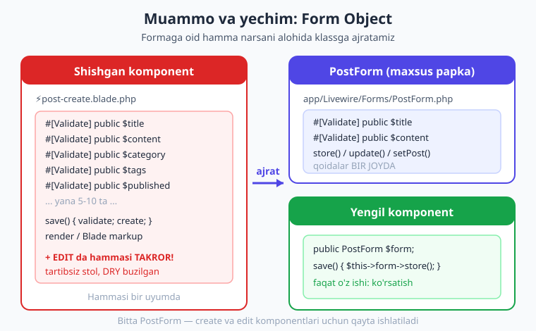
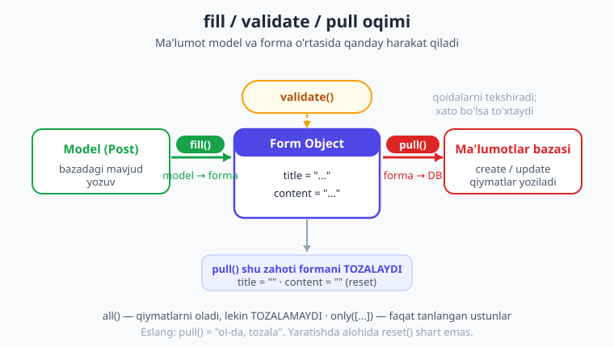
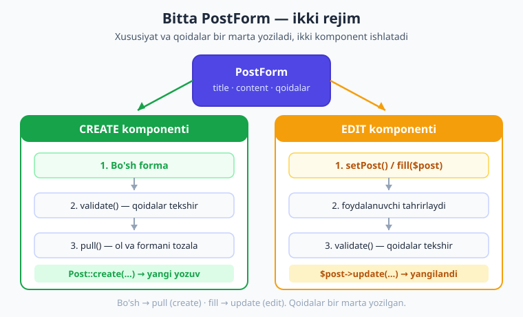

# 11 — Form Objects: forma obyektlari

[⬅️ Oldingi: 10 — Validatsiya](./10-validatsiya.md) · [🏠 Kitob boshi](./README.md) · [Keyingi: 12 — Fayl yuklash ➡️](./12-fayl-yuklash.md)

> **Bu bobda:** katta forma komponentni qanday "shishirib" yuborishini ko'ramiz va uni davolaymiz — formaga oid hamma narsani (xususiyatlar, validatsiya qoidalari, to'ldirish va tozalash mantig'i) alohida **Form Object** klassiga ajratamiz. `php artisan livewire:form` bilan yaratishni, `fill()`, `validate()`, `pull()`, `reset()` metodlarini va eng muhimi — **bitta forma obyektini ham yaratish (create), ham tahrirlash (edit) uchun qayta ishlatishni** to'liq misolda o'rganamiz.

---

## Komponent qanday "shishadi"

[09-bobda](./09-formalar.md) forma yasashni, [10-bobda](./10-validatsiya.md) uni tekshirishni o'rgandik. U yerda formalar kichik edi: ikki-uch maydon, bir-ikki qoida. Lekin haqiqiy loyihalarda forma kattalashib boradi. Tasavvur qiling, blog uchun "Maqola yaratish" formasi: sarlavha, qisqa tavsif, asosiy matn, kategoriya, teglar, muqova rasmi, chop etish sanasi, holati (qoralama yoki nashr)... O'nlab maydon.

Endi bularning hammasi bitta komponentda yashasa, komponent qanday ko'rinadi? Har maydon uchun bitta `public` xususiyat. Har biriga `#[Validate(...)]` qoidasi. Saqlash metodi. Tozalash mantig'i. Va agar siz "tahrirlash" formasini ham qilsangiz — o'sha xususiyatlar, o'sha qoidalar yana **takrorlanadi** ikkinchi komponentda.

> **Hayotiy o'xshatish.** Tasavvur qiling, ish stolingizda hamma narsa — qalamlar, hujjatlar, hisob-kitoblar, ovqat, telefon — bitta uyumda yotibdi. Boshida arzimas tuyuladi, lekin uyum o'sib boradi va bir kun keladiki, kerakli qog'ozni topish uchun yarim soat ag'darasiz. Komponent ham xuddi shunday: hammasi bir joyga to'planganda, dastlab qulay, keyin **tartibsiz stol**ga aylanadi.

Mana shu "shishgan" komponent qanday ko'rinishini bir qarab chiqaylik:

```php
{{-- resources/views/components/⚡post-create.blade.php (SHISHGAN variant) --}}
<?php

use App\Models\Post;
use Livewire\Attributes\Validate;
use Livewire\Component;

new class extends Component
{
    #[Validate('required|min:5')]
    public string $title = '';

    #[Validate('required')]
    public string $content = '';

    #[Validate('required')]
    public string $category = '';

    #[Validate('nullable')]
    public array $tags = [];

    #[Validate('boolean')]
    public bool $published = false;

    // ... yana 5-10 ta xususiyat va qoida ...

    public function save(): void
    {
        $this->validate();

        Post::create([
            'title' => $this->title,
            'content' => $this->content,
            'category' => $this->category,
            'tags' => $this->tags,
            'published' => $this->published,
            // ... yana 5-10 ta ...
        ]);

        $this->reset();
    }
};
?>

<div>
    {{-- 10+ input, har biri wire:model bilan --}}
</div>
```

Ko'ryapsizmi? Komponentning **asosiy vazifasi** (sahifada nimani ko'rsatish, foydalanuvchi bilan muloqot) formaning mayda-chuyda tafsilotlari orasida ko'rinmay qoldi. Bu yerda ikki muammo bor:

1. **Komponent shishadi.** Faqat formaning o'zi 50-100 qator joy egallaydi.
2. **Takrorlanish.** "Maqola yaratish" va "Maqola tahrirlash" deyarli bir xil formaga muhtoj, lekin siz o'sha 10 ta xususiyat va 10 ta qoidani **ikki marta** yozasiz. Birini o'zgartirsangiz, ikkinchisini ham eslab o'zgartirishingiz kerak — bu xatolarning manbai.

!!! warning "Ehtiyot bo'ling"
    Kod takrorlanishi (DRY tamoyilining buzilishi — "Don't Repeat Yourself", ya'ni "o'zingni takrorlama") — dasturlashda eng keng tarqalgan muammolardan biri. Bugun ikki joyda bir xil qoida yozasiz, ertaga uchinchisini qo'shasiz, keyin birini yangilab, qolganlarini unutasiz — va dastur "ba'zi joyda ishlaydi, ba'zi joyda yo'q" bo'lib qoladi.

---

## Yechim: Form Object

Livewire bu muammoga aniq yechim beradi — **Form Object** (forma obyekti). Bu — formaga oid **hamma narsani** (xususiyatlar, validatsiya qoidalari, to'ldirish va tozalash mantig'i) saqlovchi alohida klass. Komponent esa faqat o'z ishi — sahifani ko'rsatish va foydalanuvchi bilan muloqot — bilan shug'ullanadi.

> **Hayotiy o'xshatish.** Tartibsiz stolni eslang. Yechim oddiy: hujjatlar uchun **maxsus papka** olasiz va shu formaga oid hamma qog'ozni o'sha papkaga solasiz. Endi stol toza, kerakli hujjat bir joyda, va eng yaxshisi — o'sha papkani olib boshqa stolga (boshqa komponentga) ham olib o'tishingiz mumkin. Form Object — aynan shu **maxsus papka**: formaning hamma "qog'ozi" bir joyda, tartibli va ko'chiriladigan.

Texnik tilda Form Object — bu `Livewire\Form` klassidan meros oladigan oddiy PHP klass. Uning ichida formaning xususiyatlari va qoidalari yashaydi. Komponent esa shu klassdan bitta nusxa (instance) ushlab turadi.



Bu ajratish bizga uch foyda beradi:

- **Komponent yengillashadi** — faqat o'z vazifasiga e'tibor qaratadi.
- **Formaga oid hamma narsa bir joyda** — qidirish, o'zgartirish oson.
- **Qayta ishlatish** — bitta forma obyektini bir nechta komponentda (create, edit) ishlatasiz.

---

## Form Object yaratish

Form Object'ni qo'lda yozish shart emas — Livewire'ning maxsus Artisan komandasi bor:

```bash
php artisan livewire:form PostForm
```

Bu komanda quyidagi faylni yaratadi:

```text
app/Livewire/Forms/PostForm.php
```

Diqqat qiling: Form Object **`app/Livewire/Forms/`** papkasiga joylashadi — komponentlardan (`resources/views/components/`) alohida. Bu mantiqiy: forma obyekti — Blade shabloni emas, sof PHP klass.

Generatsiya qilingan bo'sh fayl aynan shunday ko'rinadi:

```php
<?php

namespace App\Livewire\Forms;

use Livewire\Attributes\Validate;
use Livewire\Form;

class PostForm extends Form
{
    //
}
```

Bu yerda ikki muhim narsa bor:

- Klass **`Livewire\Form`** dan meros oladi (`extends Form`) — komponentlardan farqli (ular `Livewire\Component` dan meros oladi). Aynan shu `Form` bazaviy klassi bizga `fill()`, `validate()`, `pull()`, `reset()` kabi tayyor metodlarni beradi.
- `Validate` atributi allaqachon import qilingan — chunki validatsiya qoidalari endi shu yerda yashaydi.

!!! note "Eslatma"
    `Livewire\Form` bazaviy klassi `Livewire\Component` dan meros olmaydi. Form Object — bu komponent emas, balki komponent ichida yashovchi yordamchi obyekt. Uning o'z `render()` metodi yo'q, o'z Blade shabloni yo'q. U faqat ma'lumotni va validatsiyani saqlaydi.

---

## Forma klassini to'ldirish

Endi bo'sh `PostForm`ni to'ldiramiz. Komponentdan ko'chirib olamiz: har bir forma maydoni uchun `public` xususiyat va uning ustiga `#[Validate(...)]` qoidasi:

```php
{{-- app/Livewire/Forms/PostForm.php --}}
<?php

namespace App\Livewire\Forms;

use Livewire\Attributes\Validate;
use Livewire\Form;

class PostForm extends Form
{
    #[Validate('required|min:5')]
    public string $title = '';

    #[Validate('required')]
    public string $content = '';
}
```

Ko'ryapsizmi — bu deyarli oddiy komponentdagi xususiyatlardek. Farqi shundaki, ular endi alohida "papka"da. **Validatsiya qoidalari ham formada yashaydi** — bu juda muhim: maydon va uning qoidasi har doim birga turadi, bir-biridan ajralmaydi.

[10-bobda](./10-validatsiya.md) o'rgangan hamma narsa shu yerda ishlaydi: `as:` bilan maydon nomini o'zgartirish, `message:` bilan maxsus xabar, murakkab holatlarda `rules()` metodi:

```php
#[Validate('required|min:5', as: 'sarlavha')]
public string $title = '';

#[Validate('required', message: 'Maqola matni bo\'sh bo\'lishi mumkin emas')]
public string $content = '';
```

!!! tip "Maslahat"
    Xususiyatga PHP turini belgilash (`public string $title = '';`) yaxshi odat. Bu kod o'qishni osonlashtiradi va xatoni erta tutadi. Lekin boshlang'ich qiymatni ham bering (`= ''`) — chunki `reset()` aynan shu boshlang'ich qiymatga qaytaradi.

---

## Komponentda Form Object'dan foydalanish

Form Object tayyor. Endi uni komponentga ulaymiz. Komponentda **tip-belgili public xususiyat** e'lon qilamiz:

```php
<?php

use App\Livewire\Forms\PostForm;
use Livewire\Component;

new class extends Component
{
    public PostForm $form;     // <-- tip-belgili: Livewire avtomatik to'ldiradi
};
?>
```

Bu yerdagi **`public PostForm $form;`** — sehrli joy. Siz xususiyatga `PostForm` turini belgilaysiz, va Livewire avtomatik ravishda komponent yaratilganda shu klassdan bitta nusxa yaratib, `$form`ga soladi. Siz `new PostForm()` deb yozishingiz shart emas — Livewire o'zi qiladi.

> **Hayotiy o'xshatish.** Yangi ishchiga stol berishganda, ustida allaqachon kerakli papka tayyor turadi — ishchi uni o'zi sotib olishi shart emas. `public PostForm $form;` ham xuddi shunday: siz "menga shu turdagi papka kerak" deysiz, Livewire uni tayyorlab beradi.

Endi Blade tomonida. Avval oddiy formada `wire:model="title"` yozardik. Endi xususiyat formaning ichida bo'lgani uchun, **nuqta orqali** murojaat qilamiz: `wire:model="form.title"`:

```blade
<div>
    <form wire:submit="save">
        <input type="text" wire:model="form.title">
        @error('form.title') <span>{{ $message }}</span> @enderror

        <textarea wire:model="form.content"></textarea>
        @error('form.content') <span>{{ $message }}</span> @enderror

        <button type="submit">Saqlash</button>
    </form>
</div>
```

Diqqat qiling: `@error` da ham xato kaliti endi **`form.title`** (nuqta bilan), oddiy `title` emas. Chunki xususiyat formaning ichida.

---

## Saqlash: `validate()` va `pull()`

Endi `save()` metodini yozamiz. Bu yerda Form Object'ning chiroyli metodlari ishga tushadi:

```php
public function save(): void
{
    $this->form->validate();              // 1. forma qoidalarini tekshir

    Post::create($this->form->pull());    // 2. qiymatlarni ol va bazaga yoz
}
```

Ikki qadam, juda toza. Buni qismlarga ajratamiz:

**1-qadam — `$this->form->validate()`.** Bu forma ichidagi barcha `#[Validate]` qoidalarini ishga soladi. Agar biror qoida buzilsa, metod **shu yerda to'xtaydi** va xatolar Blade'da `@error('form.title')` orqali ko'rinadi. Saqlashga o'tilmaydi.

**2-qadam — `$this->form->pull()`.** Bu eng qiziq metod. `pull()` ikki ishni **birato'la** bajaradi:

- Formadagi barcha xususiyatlarni **massiv** ko'rinishida qaytaradi: `['title' => '...', 'content' => '...']`.
- Shu zahoti formani **tozalaydi** (`reset` qiladi) — ya'ni `title` va `content` yana bo'sh `''` bo'ladi.

Ya'ni `pull()` — "ol-da, tozala" degani. Mana shuning uchun saqlashdan keyin formani alohida `reset()` qilish shart emas — `pull()` buni o'zi qiladi.



!!! note "pull() va all() farqi"
    Agar formani **tozalamasdan** faqat qiymatlarni olmoqchi bo'lsangiz, `pull()` o'rniga **`$this->form->all()`** ishlatasiz — u ham massiv qaytaradi, lekin formani bo'shatmaydi. Masalan, tahrirlashda (pastda ko'ramiz) ko'pincha `all()` qulayroq: yangilagandan keyin forma toza bo'lib qolishi shart emas. Ba'zi qiymatlargina kerak bo'lsa — `$this->form->only(['title'])`.

Mana to'liq "Maqola yaratish" komponenti — endi yengil va toza:

```php
{{-- resources/views/components/post/⚡create.blade.php --}}
<?php

use App\Livewire\Forms\PostForm;
use Livewire\Component;

new class extends Component
{
    public PostForm $form;

    public function save(): void
    {
        $this->form->validate();

        Post::create($this->form->pull());

        session()->flash('status', 'Maqola yaratildi!');
    }
};
?>

<div>
    <form wire:submit="save">
        <input type="text" wire:model="form.title" placeholder="Sarlavha">
        @error('form.title') <span>{{ $message }}</span> @enderror

        <textarea wire:model="form.content" placeholder="Matn"></textarea>
        @error('form.content') <span>{{ $message }}</span> @enderror

        <button type="submit">Saqlash</button>
    </form>

    @if (session('status'))
        <p style="color:#16a34a">{{ session('status') }}</p>
    @endif
</div>
```

Komponentda bor-yo'g'i bitta xususiyat (`$form`) va bitta metod (`save`). Hamma "og'irlik" — Form Object ichida. Mana shu — toza komponent.

> Bu bobdagi Form Object mexanizmi (yaratish, `validate`, `pull`, `fill`, `reset`, create va edit oqimi) jonli **Laravel 12 + Livewire v4.3.1** loyihada `Livewire::test(...)` testlari bilan ishga solib tekshirildi: validatsiya xatolarni ushladi, `pull()` post yaratib formani tozaladi, `fill()` formani mavjud post bilan to'ldirdi, `update()` esa o'zgarishni bazaga yozdi — barcha tasdiqlar (14 ta) muvaffaqiyatli o'tdi.

---

## Tahrirlash: `fill()` bilan formani to'ldirish

Yaratish — bo'sh formadan boshlanadi. Tahrirlash esa **teskari**: avval mavjud maqolani formaga **yuklash** kerak, foydalanuvchi uni ko'rsin va o'zgartirsin.

Buning uchun **`fill()`** metodi bor. U mavjud modeldan (yoki massivdan) formaning xususiyatlarini to'ldiradi:

```php
public function mount(Post $post): void
{
    $this->form->fill($post);   // postdagi qiymatlarni formaga ko'chiradi
}
```

`fill($post)` modelning maydonlarini (`title`, `content`) oladi va forma xususiyatlariga joylaydi. Endi `wire:model="form.title"` bog'langan input avtomatik ravishda eski sarlavhani ko'rsatadi.

> **Hayotiy o'xshatish.** `fill()` — papkaga eski hujjatlarning nusxasini solib qo'yishdek. Foydalanuvchi toza varaqdan boshlamaydi: oldida allaqachon to'ldirilgan blank turadi, u faqat kerakli joyini tahrirlaydi.

### Maxsus metod: `setPost()`

Ko'pincha shunchaki `fill()` yetarli. Lekin ba'zan formada **modelning o'zini ham eslab qolish** kerak bo'ladi — masalan, keyin uni yangilash uchun (`$post->update(...)`). Bunda Form Object ichiga maxsus metod yozamiz:

```php
{{-- app/Livewire/Forms/PostForm.php --}}
<?php

namespace App\Livewire\Forms;

use App\Models\Post;
use Livewire\Attributes\Validate;
use Livewire\Form;

class PostForm extends Form
{
    public ?Post $post = null;     // qaysi postni tahrirlayapmiz

    #[Validate('required|min:5')]
    public string $title = '';

    #[Validate('required')]
    public string $content = '';

    // tahrirlash uchun: formani mavjud post bilan to'ldiramiz
    public function setPost(Post $post): void
    {
        $this->post = $post;            // modelni eslab qolamiz
        $this->title = $post->title;
        $this->content = $post->content;
    }
}
```

`setPost()` ikki ish qiladi: modelni `$this->post`ga saqlaydi (keyin yangilash uchun kerak) va xususiyatlarni qo'lda to'ldiradi. Komponentda esa:

```php
public function mount(Post $post): void
{
    $this->form->setPost($post);
}
```

!!! tip "Maslahat"
    `fill($post)` — tezkor yo'l: faqat xususiyatlarni to'ldiradi. `setPost($post)` — to'liqroq yo'l: xususiyatlarni to'ldiradi **va** modelning o'zini eslab qoladi. Agar tahrirdan keyin `$this->post->update(...)` qilmoqchi bo'lsangiz, `setPost()` (yoki modelni o'zingiz saqlashingiz) kerak. Faqat ko'rsatish/yangidan yaratish uchun `fill()` yetarli.

---

## `reset()` — formani tozalash

Form Object'ning ham o'z `reset()` metodi bor — komponentnikiga o'xshash, lekin faqat formaning xususiyatlarini tozalaydi:

```php
$this->form->reset();              // formadagi BARCHA xususiyat boshlang'ich qiymatga
$this->form->reset('title');       // faqat title tozalanadi
$this->form->reset('title', 'content');   // bir nechta nom
```

`reset()` har bir xususiyatni siz e'lon qilgan boshlang'ich qiymatiga (`''`, `0`, `[]`) qaytaradi. Yodda tuting: `pull()` saqlashdan keyin **avtomatik** `reset()` qiladi — shuning uchun yaratishda alohida `reset()` chaqirish shart emas. Lekin bekor qilish tugmasi yoki "tozalash" tugmasi uchun qo'l keladi:

```blade
<button type="button" wire:click="form.reset">Tozalash</button>
```

---

## ENG KUCHLISI: bitta forma — create ham, edit ham

Endi Form Object'ning eng katta foydasiga keldik. Eslang, boshida muammo nimada edi? "Yaratish" va "Tahrirlash" formalari deyarli bir xil, lekin biz xususiyat va qoidalarni **ikki marta** yozardik.

Form Object bilan bu muammo yo'qoladi: **bitta `PostForm`** ikkala komponentda ishlatiladi. Qoidalar bir joyda, takror yo'q. Faqat saqlash mantig'i farq qiladi: biri `create`, ikkinchisi `update`.



Buni yanada qulayroq qilish uchun saqlash mantig'ini ham **Form Object ichiga** ko'chiramiz. Bitta `save()` metodi yozamiz: agar `$post` bor bo'lsa — yangilaydi, bo'lmasa — yaratadi:

```php
{{-- app/Livewire/Forms/PostForm.php --}}
<?php

namespace App\Livewire\Forms;

use App\Models\Post;
use Livewire\Attributes\Validate;
use Livewire\Form;

class PostForm extends Form
{
    public ?Post $post = null;

    #[Validate('required|min:5')]
    public string $title = '';

    #[Validate('required')]
    public string $content = '';

    // tahrirlash uchun formani to'ldirish
    public function setPost(Post $post): void
    {
        $this->post = $post;
        $this->title = $post->title;
        $this->content = $post->content;
    }

    // yangi yozuv yaratish
    public function store(): void
    {
        $this->validate();
        Post::create($this->only(['title', 'content']));
        $this->reset();
    }

    // mavjud yozuvni yangilash
    public function update(): void
    {
        $this->validate();
        $this->post->update($this->only(['title', 'content']));
    }
}
```

Bu yerda Form Object ichida `$this->validate()`, `$this->only([...])`, `$this->reset()` deb yozayotganimizga e'tibor bering — Form Object o'z metodlarini **`$this`** orqali chaqiradi (komponentdan `$this->form->...` deb chaqirardik, lekin forma ichida `$this`). `only([...])` esa faqat ko'rsatilgan xususiyatlarni massiv qilib beradi — `$this->post` modelni bazaga yozmaslik uchun aynan kerakli ustunlarni ajratamiz.

Endi ikkala komponent ham juda yupqa bo'ladi. **Yaratish komponenti:**

```php
{{-- resources/views/components/post/⚡create.blade.php --}}
<?php

use App\Livewire\Forms\PostForm;
use Livewire\Component;

new class extends Component
{
    public PostForm $form;

    public function save(): void
    {
        $this->form->store();        // forma o'zi yaratadi va tozalaydi
        session()->flash('status', 'Maqola yaratildi!');
    }
};
?>

<div>
    <form wire:submit="save">
        <input type="text" wire:model="form.title" placeholder="Sarlavha">
        @error('form.title') <span>{{ $message }}</span> @enderror

        <textarea wire:model="form.content" placeholder="Matn"></textarea>
        @error('form.content') <span>{{ $message }}</span> @enderror

        <button type="submit">Yaratish</button>
    </form>

    @if (session('status')) <p style="color:#16a34a">{{ session('status') }}</p> @endif
</div>
```

**Tahrirlash komponenti** — deyarli aynan o'sha, faqat `mount()` da formani to'ldiradi va `update()` chaqiradi:

```php
{{-- resources/views/components/post/⚡edit.blade.php --}}
<?php

use App\Livewire\Forms\PostForm;
use App\Models\Post;
use Livewire\Component;

new class extends Component
{
    public PostForm $form;

    public function mount(Post $post): void
    {
        $this->form->setPost($post);     // formani mavjud post bilan to'ldiramiz
    }

    public function save(): void
    {
        $this->form->update();           // forma o'zi yangilaydi
        session()->flash('status', 'Maqola yangilandi!');
    }
};
?>

<div>
    <form wire:submit="save">
        <input type="text" wire:model="form.title" placeholder="Sarlavha">
        @error('form.title') <span>{{ $message }}</span> @enderror

        <textarea wire:model="form.content" placeholder="Matn"></textarea>
        @error('form.content') <span>{{ $message }}</span> @enderror

        <button type="submit">Yangilash</button>
    </form>

    @if (session('status')) <p style="color:#16a34a">{{ session('status') }}</p> @endif
</div>
```

Solishtirib ko'ring: Blade qismi **deyarli bir xil**, lekin biz xususiyatlarni va qoidalarni **bir marta ham** takrorlamadik! Hammasi `PostForm` ichida. Ertaga `category` maydoni qo'shsangiz — faqat `PostForm`ga qo'shasiz, ikkala komponent ham avtomatik undan foydalanadi.

Va sahifaga route orqali ulaymiz ([04-bobdan](./04-komponent-anatomiyasi.md)):

```php
// routes/web.php
use Illuminate\Support\Facades\Route;

Route::livewire('/maqola/yangi', 'post.create')->name('posts.create');
Route::livewire('/maqola/{post}/tahrir', 'post.edit')->name('posts.edit');
```

Tahrirlash route'idagi `{post}` — Laravel'ning **route-model binding**i: URL'dagi ID avtomatik `Post` modelga aylanadi va `mount(Post $post)`ga keladi. Bu Laravel imkoniyati — batafsil [Laravel kitobida](../laravel/README.md).

!!! example "Misol"
    `/maqola/yangi`ga kirsangiz — bo'sh forma. `/maqola/7/tahrir`ga kirsangiz — 7-maqola allaqachon to'ldirilgan forma. Ikkalasi ham bitta `PostForm`dan ovqatlanadi. Bitta qoida — ikki joyda ishlaydi.

---

## Qachon Form Object ishlatish kerak?

Form Object — kuchli, lekin har formaga shart emas. Bitta-ikkita maydonli kichik forma uchun u ortiqcha bo'lishi mumkin (komponentda to'g'ridan-to'g'ri yozgan soddaroq).

!!! tip "Qachon Form Object ishlatasiz"
    Form Object'ni quyidagi hollarda ishlating:

    - **3  va undan ko'p maydonli** formalar — komponent shisha boshlaganda.
    - **Qayta ishlatiladigan** formalar — bir formaga ham yaratish, ham tahrirlash kerak bo'lsa (eng kuchli foyda shu).
    - **Murakkab validatsiya** — ko'p qoidali formalar, ularni komponentdan ajratish toza ko'rinish beradi.

    Bitta input (masalan, qidiruv maydoni) yoki ikki maydonli login formasi uchun Form Object shart emas — to'g'ridan-to'g'ri komponentda yozavering.

!!! info "Livewire 3 da qanday edi?"
    Form Object'lar Livewire 3 da ham bor edi va `Livewire\Form` klassi, `php artisan livewire:form` komandasi, `fill()`/`validate()`/`pull()`/`reset()` metodlari xuddi shunday ishlardi. Livewire 4 da bu mexanizm o'zgarmagan — siz bu bobda o'rgangan bilim ikkala versiyada ham to'g'ri. Asosiy umumiy farq — komponentlardagi `wire:model` ning default deferred bo'lishi ([06-bob](./06-data-binding.md)), bu formaga ham tegishli.

---

## Xulosa

- **Form Object** — formaga oid hamma narsani (xususiyatlar + validatsiya qoidalari + to'ldirish/tozalash mantig'i) saqlovchi alohida klass. U komponentni "shishish" va takrorlanishdan qutqaradi.
- `php artisan livewire:form PostForm` komandasi **`app/Livewire/Forms/PostForm.php`** faylini yaratadi; klass **`Livewire\Form`** dan meros oladi.
- Xususiyatlar va `#[Validate(...)]` qoidalari endi forma klassida yashaydi — maydon va qoidasi har doim birga.
- Komponentda tip-belgili **`public PostForm $form;`** e'lon qilasiz; Livewire avtomatik nusxa yaratadi. Blade'da **`wire:model="form.title"`** va **`@error('form.title')`** (nuqta bilan).
- Saqlash: **`$this->form->validate()`** keyin **`Post::create($this->form->pull())`**. `pull()` qiymatlarni oladi **va** formani tozalaydi (`all()` esa tozalamaydi).
- Tahrirlash: **`$this->form->fill($post)`** yoki maxsus **`setPost($post)`** (model + qiymatlar). Tozalash: **`$this->form->reset()`** yoki `reset('title')`.
- **Eng kuchli foyda:** bitta Form Object'ni ham `create`, ham `edit` komponentida ishlatish — qoidalar bir joyda, takror yo'q (DRY). Saqlash mantig'ini (`store()`, `update()`) forma ichiga ko'chirish komponentlarni juda yupqa qiladi.
- Form Object'ni **3+ maydonli** yoki **qayta ishlatiladigan** formalar uchun ishlating; kichik formaga shart emas.

## Amaliy mashqlar

1. **ContactForm yaratish (oson).** `php artisan livewire:form ContactForm` bilan forma obyekti yarating. Ichida `name`, `email`, `message` xususiyatlarini va ularga mos `#[Validate]` qoidalarini (`required`, `email`, `min:10`) yozing. So'ng `⚡contact` komponentida `public ContactForm $form;` e'lon qilib, Blade'da `wire:model="form.name"` bilan bog'lab ko'ring.

2. **`pull()` bilan saqlash (oson).** 1-mashqdagi komponentga `save()` metodi qo'shing: `$this->form->validate()` keyin (namoyish uchun) `dd($this->form->pull())`. Formani to'ldirib yuboring va `pull()` qaytargan massivni hamda undan keyin forma bo'shab qolganini o'z ko'zingiz bilan ko'ring. Keyin `dd`ni olib tashlang.

3. **Bitta forma — create + edit (o'rta).** `PostForm` yarating (`title`, `content`). Ikkita komponent yasang: `⚡post.create` (bo'sh formadan `store()`) va `⚡post.edit` (`mount`da `setPost()`, keyin `update()`). Ikkala route'ni `routes/web.php`ga qo'shing va brauzerda ikkalasini ham sinab ko'ring. Diqqat: xususiyat va qoidalarni faqat **bir marta** — `PostForm`da yozganingizga ishonch hosil qiling.

4. **`fill` bilan tahrirlash (o'rta).** 3-mashqdagi edit komponentida, `setPost()` o'rniga oddiy `$this->form->fill($post)` ishlatib ko'ring va farqni o'ylab toping: `update()` ishlashi uchun nima yetishmaydi? (Maslahat: forma modelning o'zini eslab qolishi kerak.)

5. **Form Object'ga maxsus metod (qiyin).** `PostForm`ga `isEditing(): bool` metodini qo'shing (`return $this->post !== null;`). Komponent Blade'sida bu metodga qarab tugma matnini almashtiring: tahrirlash bo'lsa "Yangilash", aks holda "Yaratish". Maslahat: Blade'da `$form->isEditing()` deb chaqirasiz. Bu bitta komponentni ham create, ham edit uchun ishlatishga ham yo'l ochadi.

---

[⬅️ Oldingi: 10 — Validatsiya](./10-validatsiya.md) · [🏠 Kitob boshi](./README.md) · [Keyingi: 12 — Fayl yuklash ➡️](./12-fayl-yuklash.md)
