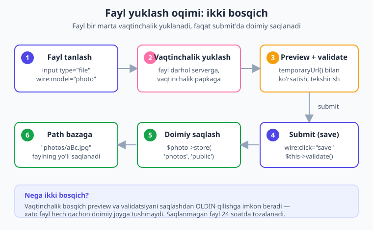
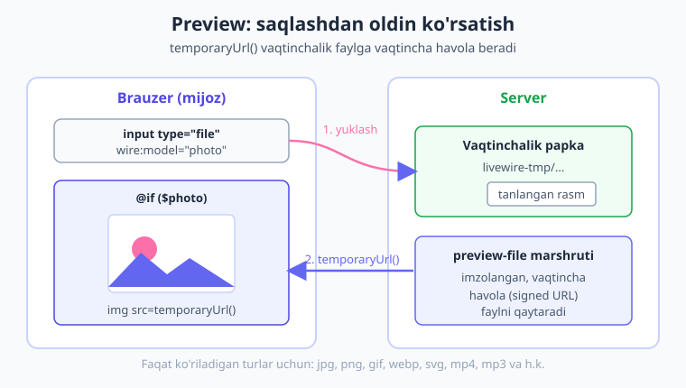
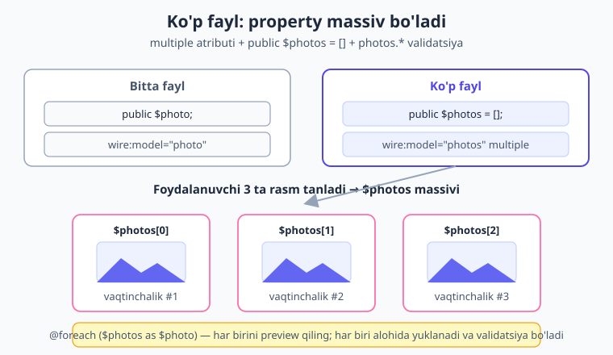

# 12 — Fayl yuklash

[⬅️ Oldingi: 11 — Form Objects](./11-form-objects.md) · [🏠 Kitob boshi](./README.md) · [Keyingi: 13 — Ro'yxatlar ➡️](./13-royxatlar.md)

> **Bu bobda:** foydalanuvchidan fayl — rasm, hujjat, avatar — qabul qilishni Livewire usulida o'rganamiz. `WithFileUploads` trait'i, `wire:model` bilan `<input type="file">` ni bog'lash, vaqtinchalik yuklash (temporary upload) mexanizmi nima va nega ikki bosqichda ishlashi, saqlashdan oldin `temporaryUrl()` bilan rasmni ko'rsatish (preview), `#[Validate]` bilan tur va hajmni tekshirish, faylni `store()` bilan doimiy saqlash, ko'p fayl yuklash, yuklash jarayonini foiz bilan ko'rsatish va — eng muhimi — xavfsizlik qoidalarini ko'ramiz. Oxirida to'liq avatar yuklash komponentini yig'amiz.

---

## Nega fayl yuklash maxsus?

> **Hayotiy o'xshatish.** Tasavvur qiling, do'stingizga xat yozayapsiz. Oddiy gaplarni — "salom", "yaxshimisan" — bitta konvertga solib jo'natasiz, bu oson. Lekin unga **katta albom** (yuzlab rasm) jo'natmoqchi bo'lsangiz-chi? Albomni konvertga sig'dira olmaysiz. Avval pochtaga olib borasiz, ular albomni alohida **omborga** qo'yadi, sizga **kvitansiya** beradi, keyin albom manzilga yetkaziladi. Faylar ham xuddi shunday: ular oddiy so'zlar emas, ular **og'ir yuk** — alohida muomalani talab qiladi.

Avvalgi boblarda biz `wire:model` bilan matn, raqam, checkbox kabi oddiy qiymatlarni server bilan bog'ladik ([06-bob](./06-data-binding.md)). Bu qiymatlar har so'rovda **snapshot** ichida (JSON sifatida) oldinma-ketin yuradi: brauzerdan serverga va orqaga. Bu yengil qiymatlar uchun ajoyib ishlaydi.

Lekin **fayl** — bu oddiy qiymat emas. Fayl bir necha megabayt bo'lishi mumkin. Uni JSON snapshot ichiga "tiqib" har bir kichik o'zgarishda u yoq-bu yoqqa tashib bo'lmaydi — bu sekin va isrofgarchilik bo'lar edi. Shu sababli Livewire faylni boshqacha boshqaradi.

> Texnik tilda aytganda: oddiy `public` xususiyatlar har so'rovda (de)serialize qilinadi, fayl esa **bir marta** vaqtinchalik serverga yuklanadi va keyin faqat uning **kalit (identifikator)** snapshot ichida yuradi. Asl og'ir fayl serverda kutib turadi.

Bu jarayonni **vaqtinchalik yuklash** (temporary upload) deb ataymiz va u shu bobning yuragi. Avval shu mexanizmni tushunamiz, keyin kod yozamiz.

---

## Vaqtinchalik yuklash mexanizmi

Foydalanuvchi fayl tanlaganda, Livewire uni **darhol** serverga yuklaydi — lekin doimiy joyga emas, **vaqtinchalik papkaga**. Faqat foydalanuvchi "Saqlash" tugmasini bosgandagina fayl o'sha vaqtinchalik papkadan **doimiy** joyga (masalan `storage/app/public/photos`) ko'chiriladi.

Nega ikki bosqich? Sababi oddiy va aqlli:

1. **Validatsiya saqlashdan oldin.** Fayl vaqtinchalik joyda turganida uni tekshirib ko'ramiz: rasmmi? hajmi me'yordami? Agar xato bo'lsa — uni doimiy joyga umuman saqlamaymiz.
2. **Preview (oldindan ko'rish).** Vaqtinchalik faylga maxsus havola (`temporaryUrl()`) bersa bo'ladi — foydalanuvchi rasmni saqlashdan **oldin** ko'radi. "Mana shu rasmni tanladingizmi?" degandek.
3. **Tejamkorlik.** Forma to'ldirilayotganda boshqa maydonlar (ism, izoh) o'zgaradi — har gal og'ir faylni qayta yubormaslik kerak. Fayl bir marta yuklanadi, qolgani snapshot orqali yengil yuradi.

Quyidagi diagramma butun yo'lni — tanlashdan to doimiy saqlashgacha — ko'rsatadi:



!!! note "Eslatma"
    Vaqtinchalik fayllar abadiy turmaydi. Livewire ularni belgilangan vaqtdan (sukut bo'yicha 24 soat) keyin avtomatik tozalaydi. Ya'ni foydalanuvchi faylni tanlab, lekin "Saqlash"ni bosmasa, fayl bir kun ichida o'chib ketadi — server axlatga to'lmaydi.

---

## `WithFileUploads` trait'i

Fayl yuklashni yoqish uchun komponentga **bitta** trait qo'shamiz: `Livewire\WithFileUploads`. Trait — bu komponentga "qo'shimcha qobiliyat" beradigan tayyor kod to'plami. Aynan shu trait yuqorida tushuntirgan butun vaqtinchalik yuklash mexanizmini ortda yoqib beradi.

SFC (Single-File Component) formatida u shunday yoziladi:

```php
{{-- resources/views/components/⚡avatar-upload.blade.php --}}
<?php

use Livewire\Component;
use Livewire\WithFileUploads;   // 1) trait'ni import qilamiz

new class extends Component
{
    use WithFileUploads;        // 2) anonim klass ichida ulaymiz

    public $photo;              // 3) fayl shu xususiyatda turadi
};
?>

<div>
    {{-- ... --}}
</div>
```

E'tibor bering: `use Livewire\WithFileUploads;` faylning yuqorisida (import), `use WithFileUploads;` esa anonim klassning **ichida** (ulash) yoziladi. Ikkalasi ham kerak.

!!! warning "Ehtiyot bo'ling"
    Agar `use WithFileUploads;` ni klass ichiga qo'yishni unutsangiz, fayl yuklashga urinilganda Livewire `MissingFileUploadsTraitException` xatosini beradi. Bu — eng tez-tez uchraydigan boshlang'ich xato. Xato matni o'zi sizga trait'ni qo'shishni eslatadi.

---

## Birinchi fayl input'i

Endi faylni qabul qiladigan property va Blade input'ni qo'shamiz. Property oddiy `public $photo;` — boshlang'ich qiymati bo'sh (`null`). Blade tomonda esa odatiy HTML fayl input'iga `wire:model="photo"` qo'shamiz:

```php
{{-- resources/views/components/⚡avatar-upload.blade.php --}}
<?php

use Livewire\Component;
use Livewire\WithFileUploads;

new class extends Component
{
    use WithFileUploads;

    public $photo;            // tanlangan fayl shu yerda saqlanadi
};
?>

<div>
    <input type="file" wire:model="photo">
</div>
```

Mana shu — bor-yo'g'i. Foydalanuvchi fayl tanlagan zahoti Livewire **avtomatik** faylni vaqtinchalik papkaga yuklaydi. Hech qanday tugma bosish shart emas — `wire:model` tanlovni sezadi va yuklashni boshlaydi.

> Texnik jihatdan, `$photo` xususiyati endi oddiy matn emas. Yuklangandan keyin u maxsus obyekt — `TemporaryUploadedFile` — bo'ladi. Bu obyekt asl faylning nomi, hajmi, turi va vaqtinchalik joydagi yo'lini biladi. Biz bu obyektning metodlaridan (`temporaryUrl()`, `store()`, `getClientOriginalName()`) foydalanamiz.

!!! info "Livewire 3 da qanday edi?"
    `WithFileUploads`, `wire:model` bilan fayl input, `temporaryUrl()` va `store()` — bularning hammasi Livewire 3 da ham aynan shu nomlar bilan ishlardi. Fayl yuklash mexanizmida 4-versiyada tub o'zgarish bo'lmadi: oldin o'rgangan bilimingiz bu yerda to'liq to'g'ri.

---

## Preview — saqlashdan oldin ko'rsatish

Foydalanuvchi avatar tanladi. Uni saqlashdan **oldin** ko'rsatib qo'ysak yaxshi bo'lardi — "siz tanlagan rasm shu, to'g'rimi?" Aynan shu yerda vaqtinchalik yuklashning kuchi ko'rinadi: fayl allaqachon serverda turibdi, demak unga havola berish mumkin.

`temporaryUrl()` metodi vaqtinchalik faylga maxsus, vaqtincha amal qiladigan havola qaytaradi. Uni rasm tegida ishlatamiz:

```php
{{-- resources/views/components/⚡avatar-upload.blade.php --}}
<div>
    <input type="file" wire:model="photo">

    {{-- $photo bo'lsa (ya'ni fayl tanlangan bo'lsa) — preview ko'rsatamiz --}}
    @if ($photo)
        temporaryUrl() }}" width="120" alt="Tanlangan rasm">
    @endif
</div>
```

`@if ($photo)` sharti muhim: fayl hali tanlanmaganida `$photo` `null` bo'ladi va `temporaryUrl()` ni chaqirib bo'lmaydi. Fayl tanlangach `@if` rost bo'ladi va rasm ko'rinadi.

Quyidagi diagramma preview qanday ishlashini — vaqtinchalik fayl serverda turishi va brauzer unga havola orqali murojaat qilishini ko'rsatadi:



!!! warning "Faqat ko'rish mumkin bo'lgan turlar"
    `temporaryUrl()` faqat **ko'rish mumkin** (previewable) bo'lgan fayllarda ishlaydi: rasmlar (`jpg`, `png`, `gif`, `webp`, `svg`), shuningdek ba'zi audio/video. PDF yoki `.docx` kabi hujjat uchun `temporaryUrl()` xato beradi — chunki brauzer ularni rasm sifatida ko'rsata olmaydi. Hujjatlar uchun preview o'rniga oddiygina fayl nomini ko'rsating (pastda ko'ramiz).

---

## Validatsiya — har doim tekshiring

Endi eng muhim qismga keldik: **validatsiya**. Foydalanuvchi yuklagan faylga **hech qachon ishonib bo'lmaydi**. U rasm o'rniga zararli skript yuklashga, yoki 500 MB li ulkan fayl bilan serverni bo'g'ishga urinishi mumkin. Shuning uchun har bir fayl yuklashda turini va hajmini tekshirish **majburiy**.

Validatsiyani [10-bobda](./10-validatsiya.md) o'rgangan `#[Validate]` atributi bilan qo'yamiz. Fayl uchun eng ko'p ishlatiladigan qoidalar:

| Qoida | Ma'nosi |
| --- | --- |
| `image` | Fayl rasm bo'lishi shart (jpg, png, gif, webp, ...) |
| `mimes:pdf,docx` | Fayl turi ro'yxatdagilardan biri bo'lishi shart |
| `max:1024` | Maksimal hajm — **kilobaytda** (1024 KB = 1 MB) |
| `required` | Fayl tanlangan bo'lishi shart |

```php
{{-- resources/views/components/⚡avatar-upload.blade.php --}}
<?php

use Livewire\Component;
use Livewire\WithFileUploads;
use Livewire\Attributes\Validate;

new class extends Component
{
    use WithFileUploads;

    #[Validate('image|max:1024')]   // rasm bo'lsin va 1 MB dan oshmasin
    public $photo;
};
?>

<div>
    <input type="file" wire:model="photo">

    {{-- xato xabari (masalan, "rasm 1 MB dan katta") shu yerda chiqadi --}}
    @error('photo') <span style="color:#dc2626">{{ $message }}</span> @enderror
</div>
```

`max` qoidasidagi son **kilobayt** ekanini yodda tuting: `max:1024` = 1 MB, `max:5120` = 5 MB. Bu eng ko'p qiladigan adashuvlardan biri.

!!! tip "Maslahat"
    `wire:model="photo"` faylni **darhol** yuklaganligi uchun, Livewire fayl yuklangan zahoti uni avtomatik validatsiya qiladi — agar siz xususiyatga `#[Validate]` qo'ygan bo'lsangiz. Ya'ni foydalanuvchi 10 MB li rasm tanlasa, "Saqlash"ni bosishidan oldin xato ko'rinadi. Bu yoqimli, tez fikr-mulohaza beradi.

---

## Doimiy saqlash — `store()`

Validatsiyadan o'tdik, preview ko'rsatdik. Endi foydalanuvchi "Saqlash" tugmasini bosganda faylni **doimiy** joyga ko'chiramiz. Buni `store()` metodi qiladi:

```php
public function save()
{
    $this->validate();   // 1) avval qoidalarni qayta tekshiramiz (xavfsizlik)

    // 2) faylni doimiy diskka ko'chiramiz va qaytgan yo'lni olamiz
    $path = $this->photo->store('photos', 'public');

    // $path endi: "photos/aBc123...jpg" — shuni bazaga saqlaymiz
}
```

`store()` ikkita argument oladi:

- **Birinchi** — papka nomi (`'photos'`). Fayl shu papka ichiga saqlanadi.
- **Ikkinchi** — disk nomi (`'public'`). `public` disk `storage/app/public` ga ishora qiladi va veb orqali ochiq bo'ladi.

`store()` qaytaradigan qiymat — faylning **yangi yo'li** (masalan `photos/aBc123XyZ.jpg`). Asl fayl nomini Livewire xavfsizlik uchun tasodifiy nomga almashtiradi. **Aynan shu yo'lni bazaga saqlaysiz** — keyin rasmni ko'rsatish uchun shundan foydalanasiz.

Bir nechta foydali variant bor:

```php
// 'public' diskka public ko'rinishda saqlash (yuqoridagining qisqasi):
$path = $this->photo->storePublicly('photos');

// o'z nomingiz bilan saqlash (avtomatik tasodifiy nom o'rniga):
$path = $this->photo->storeAs('photos', 'avatar-' . auth()->id() . '.jpg', 'public');
```

!!! warning "`public/storage` havolasi"
    `public` diskdagi fayllar veb orqali ko'rinishi uchun bir martalik ulanish kerak: terminalda `php artisan storage:link` buyrug'ini ishga tushiring. Bu `public/storage` papkasini `storage/app/public` ga bog'laydi. Buni unutsangiz, rasm saqlanadi-yu, lekin brauzerda 404 bo'lib ko'rinmaydi.

### Path'ni bazaga saqlash

Real ilovada saqlangan yo'lni odatda foydalanuvchining (yoki postning) yozuviga yozamiz:

```php
public function save()
{
    $this->validate();

    $path = $this->photo->store('avatarlar', 'public');

    // tizimga kirgan foydalanuvchining avatar ustunini yangilaymiz
    auth()->user()->update(['avatar' => $path]);

    $this->reset('photo');         // formani tozalaymiz
    $this->dispatch('avatar-yangilandi');   // boshqalarga xabar (18-bob)
}
```

Bazada faqat **yo'l** (qisqa matn) saqlanadi, faylning o'zi emas. Rasmni ko'rsatganda esa shunday yozamiz:

```blade
user()->avatar) }}" alt="Avatar">
```

---

## Ko'p fayl yuklash

Ba'zan bir nechta fayl kerak — galereya, mahsulot rasmlari, ilova fayllari. Bunda property **massiv** bo'ladi va input'ga `multiple` atributini qo'shamiz:

```php
{{-- resources/views/components/⚡galereya.blade.php --}}
<?php

use Livewire\Component;
use Livewire\WithFileUploads;
use Livewire\Attributes\Validate;

new class extends Component
{
    use WithFileUploads;

    #[Validate(['photos.*' => 'image|max:1024'])]   // HAR BIR element tekshiriladi
    public $photos = [];     // massiv — bo'sh boshlanadi

    public function save()
    {
        $this->validate();

        foreach ($this->photos as $photo) {
            $photo->store('galereya', 'public');   // har birini saqlaymiz
        }
    }
};
?>

<div>
    {{-- multiple — bir nechta fayl tanlash imkonini beradi --}}
    <input type="file" wire:model="photos" multiple>

    {{-- har bir tanlangan rasmni preview qilamiz --}}
    <div>
        @foreach ($photos as $photo)
            temporaryUrl() }}" width="80" alt="Tanlangan rasm">
        @endforeach
    </div>

    <button wire:click="save">Hammasini saqlash</button>
</div>
```

Bu yerda ikkita yangilik bor:

1. **Validatsiya `photos.*`** — yulduzcha (`*`) "massivdagi har bir element" degani. Ya'ni har bir tanlangan rasm alohida tekshiriladi.
2. **`@foreach` bilan preview** — `$photos` massiv bo'lgani uchun tsikl bilan har birini ko'rsatamiz.

Quyidagi diagramma bitta fayl va ko'p fayl orasidagi farqni — property massiv bo'lishi va har bir element alohida vaqtinchalik yuklanishini — ko'rsatadi:



!!! note "Eslatma"
    Ko'p fayl bilan ishlaganda foydalanuvchi tanlovni ikki marta qilsa, ikkinchi tanlov birinchisining ustiga **yozilmaydi** — Livewire `wire:model` xulqiga bog'liq. Galereyaga "qo'shib borish" kabi murakkab xulq kerak bo'lsa, faylarni saqlagandan keyin `$this->reset('photos')` bilan tozalab, navbatma-navbat qo'shing.

---

## Yuklash jarayonini ko'rsatish

Katta fayl yuklanayotganda foydalanuvchi "nimadir bo'lyaptimi?" deb hayron bo'lmasligi kerak. Livewire fayl yuklash davomida ishlatish uchun ikki vosita beradi.

Birinchisi — siz [keyingi boblarda](./20-loading-holatlar.md) chuqurroq o'rganadigan `wire:loading`. Fayl yuklanayotganda biror belgini ko'rsatadi:

```blade
<input type="file" wire:model="photo">

{{-- fayl serverga yuklanayotganda ko'rinadi, tugagach yo'qoladi --}}
<div wire:loading wire:target="photo">Yuklanmoqda, kuting...</div>
```

`wire:target="photo"` muhim: u "faqat `photo` xususiyati yuklanayotganda ko'rsat" deydi, boshqa har qanday so'rovda emas.

Ikkinchisi — aniq **foiz** kerak bo'lsa, Livewire maxsus brauzer hodisasi tarqatadi: `livewire-upload-progress`. Uni Alpine bilan ushlab, jonli progress-bar yasash mumkin:

```blade
<div
    x-data="{ progress: 0, yuklanmoqda: false }"
    x-on:livewire-upload-start="yuklanmoqda = true"
    x-on:livewire-upload-finish="yuklanmoqda = false"
    x-on:livewire-upload-error="yuklanmoqda = false"
    x-on:livewire-upload-progress="progress = $event.detail.progress"
>
    <input type="file" wire:model="photo">

    {{-- progress — 0 dan 100 gacha foiz --}}
    <div x-show="yuklanmoqda">
        Yuklanmoqda: <span x-text="progress"></span>%
    </div>
</div>
```

Bu yerda `$event.detail.progress` — Livewire bergan foiz (0–100). Alpine ([22-bob](./22-alpine-js.md)) buni `x-text` orqali ekranda yangilab turadi. Katta fayllar bilan ishlaydigan ilovalarda bu — yaxshi tajriba.

---

## Hujjat (PDF, docx) yuklash

Rasm emas, hujjat — masalan PDF rezyume yoki Word fayli — yuklash deyarli bir xil. Farqi: validatsiyada `image` o'rniga `mimes:...` ishlatamiz va preview o'rniga fayl **nomini** ko'rsatamiz (chunki PDF ni `` bilan ko'rsatib bo'lmaydi).

```php
<?php

use Livewire\Component;
use Livewire\WithFileUploads;
use Livewire\Attributes\Validate;

new class extends Component
{
    use WithFileUploads;

    #[Validate('mimes:pdf,docx|max:5120')]   // PDF yoki docx, eng ko'pi 5 MB
    public $hujjat;

    public function save()
    {
        $this->validate();
        $path = $this->hujjat->store('hujjatlar', 'public');
        // $path ni bazaga saqlang
    }
};
?>

<div>
    <input type="file" wire:model="hujjat">

    {{-- preview emas — faqat tanlangan fayl nomini ko'rsatamiz --}}
    @if ($hujjat)
        <p>Tanlangan fayl: {{ $hujjat->getClientOriginalName() }}</p>
    @endif

    @error('hujjat') <span style="color:#dc2626">{{ $message }}</span> @enderror

    <button wire:click="save">Saqlash</button>
</div>
```

`getClientOriginalName()` — foydalanuvchi tanlagan faylning **asl nomini** qaytaradi (masalan `rezyume.pdf`). Eslatib o'tamiz: bu nomni faqat **ko'rsatish** uchun ishlating; faylni saqlaganda Livewire baribir xavfsiz tasodifiy nom beradi.

---

## S3 (bulut omborida) saqlash

Loyiha o'sganda fayllarni o'z serveringizda emas, Amazon S3 kabi bulut omborida saqlash kerak bo'lishi mumkin. Yaxshi yangilik: kodingiz deyarli o'zgarmaydi — faqat disk nomini `'s3'` qilasiz:

```php
$path = $this->photo->store('photos', 's3');   // 'public' o'rniga 's3'
```

S3 ni `config/filesystems.php` da sozlaganingizdan so'ng, qolgan hammasi avvalgidek ishlaydi.

!!! note "S3 vaqtinchalik fayllarni tozalash"
    S3 ishlatganda vaqtinchalik fayllar ham S3 ga yuklanadi. Ular o'z-o'zidan o'chmaydi — buni sozlash kerak. Livewire'da maxsus buyruq bor: `php artisan livewire:configure-s3-upload-cleanup`. U S3 bucket'ingizga "24 soatdan keyin vaqtinchalik fayllarni avtomatik o'chir" qoidasini o'rnatadi. Aks holda bucket ortiqcha vaqtinchalik fayllarga to'lib ketadi.

---

## Xavfsizlik — eng muhim qism

Fayl yuklash — ilovaning eng **xavfli** nuqtalaridan biri. Tashqaridan keladigan fayl — bu sizning serveringizga begona tomonidan qo'yiladigan narsa. Quyidagilarni hech qachon unutmang.

!!! danger "Xavfsizlik — har doim validate qiling"
    1. **Har bir fayl yuklashga `#[Validate]` qo'ying.** Hech bir fayl tekshiruvsiz o'tmasligi kerak. Turini (`image`, `mimes:...`) va hajmini (`max:...`) chegaralang.
    2. **Foydalanuvchi bergan fayl nomiga ishonmang.** Ism ichida `../../../etc/passwd` kabi xavfli yo'l bo'lishi mumkin. Shuning uchun `store()` ni ishlatib, Livewire'ga xavfsiz tasodifiy nom berishga ruxsat bering — `getClientOriginalName()` ni faqat ekranda ko'rsatish uchun ishlating, hech qachon saqlash yo'li sifatida emas.
    3. **Hajmni cheklang.** `max` qoidasisiz foydalanuvchi ulkan fayl bilan serveringizni "bo'g'ib" qo'yishi (DoS) mumkin. PHP ning `upload_max_filesize` sozlamasini ham tekshiring.
    4. **Faqat kutilgan turlarni qabul qiling.** Avatar uchun `image` — `php`, `exe`, `sh` kabi bajariladigan fayllarni hech qachon qabul qilmang.
    5. **Avtorizatsiya.** Faylni boshqa birovning yozuviga biriktirayotgan bo'lsangiz, `$this->authorize(...)` bilan ruxsatni tekshiring ([23-bob](./23-xavfsizlik.md)).

Esda tuting: validatsiya — bu shunchaki "to'g'ri ishlashi uchun" emas, bu **himoya devori**. Uni o'tkazib yuborish — ilovangizni ochiq qoldirish demak.

---

## To'liq misol: avatar yuklash

Endi bilganlarimizni birlashtiramiz. Quyida — preview, validatsiya, doimiy saqlash, formani tozalash va muvaffaqiyat xabarini o'z ichiga olgan **to'liq** avatar yuklash komponenti. Bu kod jonli Livewire 4 loyihada ishga tushirilib tekshirilgan.

```php
{{-- resources/views/components/⚡avatar-upload.blade.php --}}
<?php

use Livewire\Component;
use Livewire\WithFileUploads;
use Livewire\Attributes\Validate;

new class extends Component
{
    use WithFileUploads;

    #[Validate('image|max:1024')]   // rasm, eng ko'pi 1 MB
    public $photo;

    public ?string $saqlangan = null;   // saqlangan rasm yo'li

    public function save(): void
    {
        // 1) qoidalarni tekshiramiz (xavfsizlik devori)
        $this->validate();

        // 2) faylni doimiy 'public' diskka ko'chiramiz
        $this->saqlangan = $this->photo->store('avatarlar', 'public');

        // 3) real ilovada bu yo'lni bazaga yozasiz:
        // auth()->user()->update(['avatar' => $this->saqlangan]);

        // 4) formani tozalaymiz
        $this->reset('photo');
    }
};
?>

<div style="max-width:360px">
    <h2>Profil rasmi</h2>

    {{-- fayl tanlash --}}
    <input type="file" wire:model="photo" accept="image/*">

    {{-- yuklash jarayoni --}}
    <div wire:loading wire:target="photo">Yuklanmoqda...</div>

    {{-- saqlashdan oldin preview --}}
    @if ($photo)
        <div>
            <p>Oldindan ko'rish:</p>
            temporaryUrl() }}" width="120" alt="Tanlangan avatar">
        </div>
    @endif

    {{-- validatsiya xatosi --}}
    @error('photo')
        <p style="color:#dc2626">{{ $message }}</p>
    @enderror

    {{-- saqlash tugmasi --}}
    <button wire:click="save">Saqlash</button>

    {{-- muvaffaqiyat --}}
    @if ($saqlangan)
        <p style="color:#16a34a">Avatar saqlandi: {{ $saqlangan }}</p>
    @endif
</div>
```

Bu komponentni sahifaga qo'yish uchun marshrut yozamiz ([04-bob](./04-komponent-anatomiyasi.md) da ko'rganimizdek):

```php
// routes/web.php
Route::livewire('/avatar', 'avatar-upload');
```

Endi `/avatar` manziliga kirib, rasm tanlasangiz: u darhol yuklanib preview ko'rinadi, "Saqlash"ni bosganingizda esa `storage/app/public/avatarlar` ichiga ko'chadi va yashil "saqlandi" xabari chiqadi. `accept="image/*"` esa brauzer fayl tanlash oynasida faqat rasmlarni ko'rsatadi — yana bir kichik qulaylik.

!!! example "Tekshirib ko'ring"
    Yuqoridagi komponentni yarating, marshrutni qo'shing, `php artisan storage:link` ni bir marta ishga tushiring va `/avatar` ga kiring. Avval kichik rasm tanlang — preview ko'rinadimi? Keyin 2 MB dan katta rasm tanlab ko'ring — `max:1024` xato xabarini berishi kerak.

---

## Xulosa

- **Fayl oddiy property emas** — u og'ir, shuning uchun Livewire uni har so'rovda emas, **bir marta vaqtinchalik yuklaydi**, keyin faqat kalitini snapshot orqali tashiydi.
- Fayl yuklashni yoqish uchun komponentga `use Livewire\WithFileUploads;` trait'ini qo'shing (import + klass ichida `use`).
- `<input type="file" wire:model="photo">` — fayl tanlangan zahoti **avtomatik** vaqtinchalik papkaga yuklanadi.
- **Vaqtinchalik yuklash ikki bosqichli**: avval vaqtinchalik joyga (preview + validatsiya uchun), keyin "Saqlash"da doimiy joyga. Vaqtinchalik fayllar 24 soatda avtomatik tozalanadi.
- **Preview**: `@if ($photo) temporaryUrl() }}"> @endif` — faqat rasm/ko'riladigan turlar uchun.
- **Validatsiya majburiy**: `#[Validate('image|max:1024')]` (hajm **kilobaytda**), `mimes:pdf,docx`, ko'p fayl uchun `photos.*`.
- **Doimiy saqlash**: `$path = $this->photo->store('papka', 'public');` — qaytgan **yo'lni bazaga** saqlang, faylni emas.
- **Ko'p fayl**: `public $photos = [];` + `wire:model="photos" multiple` + `@foreach` preview.
- **Xavfsizlik**: har doim validate qiling, foydalanuvchi fayl nomiga ishonmang, hajmni cheklang, faqat kutilgan turlarni qabul qiling.

## Amaliy mashqlar

1. **Avatar (oson).** `WithFileUploads` ishlatib, bitta rasm qabul qiladigan komponent yozing. `#[Validate('image|max:1024')]` qo'ying, `temporaryUrl()` bilan preview ko'rsating va "Saqlash"da `store('avatarlar', 'public')` bilan saqlang. Saqlangan yo'lni ekranda chiqaring.

2. **PDF hujjat (o'rta).** Endi rasm emas, PDF qabul qiladigan komponent yozing: `#[Validate('mimes:pdf|max:5120')]`. Preview o'rniga `getClientOriginalName()` bilan tanlangan fayl nomini ko'rsating. Noto'g'ri tur (masalan `.jpg`) tanlanganda chiqadigan xato xabarini kuzating.

3. **Ko'p rasmli galereya (o'rta).** `public $photos = []` va `wire:model="photos" multiple` bilan bir nechta rasm qabul qiling. `#[Validate(['photos.*' => 'image|max:1024'])]` qo'ying, `@foreach` bilan barcha previewlarni ko'rsating va "Saqlash"da tsikl bilan har birini saqlang.

4. **Progress-bar (qiyin).** 1-mashqdagi avatar komponentiga Alpine bilan jonli yuklash foizini qo'shing: `x-on:livewire-upload-progress="progress = $event.detail.progress"` ishlatib, katta rasm yuklanayotganda 0 dan 100 gacha foizni ko'rsating.

5. **Avatarni almashtirish (qiyin).** 1-mashqni kengaytiring: foydalanuvchining eski avatari bo'lsa, yangisini saqlashdan oldin eskisini diskdan o'chiring (`Storage::disk('public')->delete($eskiYol)`). Yangi yo'lni bazaga yozing. Eski faylni o'chirmasdan oldin u haqiqatan mavjudligini tekshirishni unutmang.

---

[⬅️ Oldingi: 11 — Form Objects](./11-form-objects.md) · [🏠 Kitob boshi](./README.md) · [Keyingi: 13 — Ro'yxatlar ➡️](./13-royxatlar.md)
