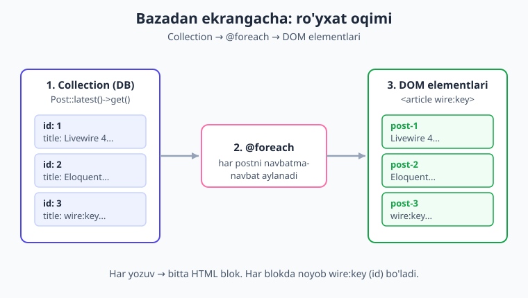
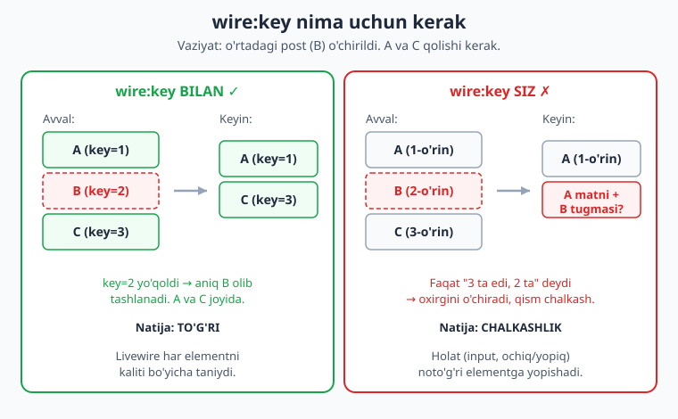
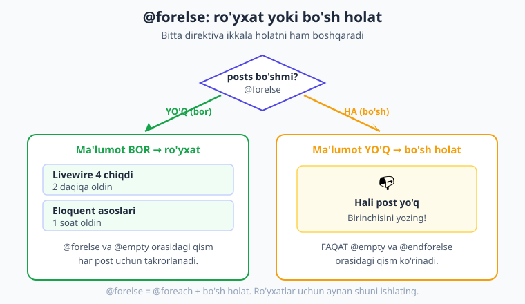

# 13 — Ma'lumot ko'rsatish va ro'yxatlar

[⬅️ Oldingi: 12 — Fayl yuklash](./12-fayl-yuklash.md) · [🏠 Kitob boshi](./README.md) · [Keyingi: 14 — Pagination va qidiruv ➡️](./14-pagination-qidiruv.md)

> **Bu bobda:** bazadagi ma'lumotni — masalan postlarni — Livewire komponentida **ro'yxat** qilib ko'rsatishni o'rganamiz. Ma'lumotni komponentga olib kirishning ikki usulini (`render` orqali uzatish va `#[Computed]` xususiyat), Blade'da `@foreach` bilan aylanishni, eng muhimi — **`wire:key`** nima uchun shartligini diagramma bilan, `@forelse` orqali **bo'sh holatni** ko'rsatishni va har bir element uchun **o'chirish tugmasini** to'g'ri (xavfsiz `wire:key` bilan) yasashni amalda ko'ramiz. Oxirida to'liq "postlar ro'yxati"ni yig'amiz.

---

## Maqsad: ma'lumotni ro'yxat qilib ko'rsatish

> **Hayotiy o'xshatish.** Kutubxonaga kirsangiz, kitoblar javonda tartib bilan terib qo'yilgan: har biri o'z muqovasi, sarlavhasi va raqami bilan. Siz javon bo'ylab yurib, har bir kitobni ko'rasiz. Web sahifadagi **ro'yxat** ham xuddi shunday: bazadagi har bir yozuv (post, mahsulot, foydalanuvchi) — alohida "kitob", siz esa ularni ekranda tartib bilan ko'rsatasiz.

Shu paytgacha biz asosan **bitta** ma'lumot bilan ishladik: bitta hisoblagich, bitta forma, bitta fayl. Lekin real dasturlarning yarmi — bu **ro'yxatlar**: blogdagi postlar, do'kondagi mahsulotlar, vazifalar (to-do) ro'yxati, izohlar. Bu bobda biz aynan shuni — **ko'p ma'lumotni jadval/ro'yxat ko'rinishida ko'rsatishni** o'rganamiz.

Buning uchun bizga ikki narsa kerak bo'ladi:

1. **Ma'lumot manbai** — bazadan yozuvlarni olib kelish (Eloquent model orqali).
2. **Blade'da aylanish** — har bir yozuvni alohida HTML element qilib chiqarish (`@foreach`).

!!! note "Eloquent bu yerda yordamchi, asosiy mavzu emas"
    Bu bobda biz Eloquent (Laravel'ning bazaviy model tizimi) bilan ishlaymiz, lekin uni faqat **ma'lumot manbai** sifatida ishlatamiz. Model va migratsiyani qisqa ko'rsatamiz — chuqurini esa [Laravel kitobida](../laravel/README.md) o'rganasiz. Bizning diqqatimiz — **Livewire'da ro'yxatni qanday ko'rsatishda**.

---

## Qisqa tayyorgarlik: model va migratsiya

Misol uchun **postlar** ro'yxatini ko'rsatamiz. Har bir postda sarlavha (`title`), matn (`body`) va yaratilgan sana bo'lsin. Avval baza jadvalini tayyorlaymiz.

Model va migratsiyani bitta komanda bilan yaratamiz:

```bash
php artisan make:model Post -m
```

`-m` bayrog'i model bilan birga **migratsiya** ham yaratadi. Migratsiyaga ustunlarni qo'shamiz:

```php
// database/migrations/...._create_posts_table.php
public function up(): void
{
    Schema::create('posts', function (Blueprint $table) {
        $table->id();                 // avtomatik raqamli ID
        $table->string('title');      // sarlavha
        $table->text('body');         // matn
        $table->timestamps();         // created_at va updated_at
    });
}
```

Modelda esa qaysi maydonlarni ommaviy to'ldirishga (`create`) ruxsat berishni belgilaymiz:

```php
// app/Models/Post.php
namespace App\Models;

use Illuminate\Database\Eloquent\Model;

class Post extends Model
{
    protected $fillable = ['title', 'body'];
}
```

Migratsiyani ishga tushiramiz:

```bash
php artisan migrate
```

Endi `posts` jadvali tayyor. Sinash uchun bir nechta post qo'shib qo'ysangiz bo'ladi (masalan `php artisan tinker` ichida `Post::create([...])`). Tayyorgarlik shu yerda tugadi — endi asosiy ishga, Livewire qismiga o'tamiz.

!!! tip "Maslahat"
    Bu bobning maqsadi — ro'yxatni ko'rsatish. To'liq CRUD (yaratish + o'qish + tahrirlash + o'chirish) ni esa [16-bobda](./16-toliq-crud.md) yig'amiz. Hozir asosan **o'qish** (ro'yxat) va biroz **o'chirish** bilan shug'ullanamiz.

---

## Ma'lumotni komponentga olib kirishning ikki usuli

Postlarni ekranda ko'rsatishdan oldin, ularni Blade shabloniga **yetkazib berish** kerak. Livewire'da buning ikki asosiy usuli bor. Ikkalasini ham ko'rib chiqamiz va qachon qaysi birini ishlatishni bilib olamiz.



### 1-usul: `render` orqali ma'lumot uzatish

Birinchi usul — ma'lumotni `render` bosqichida Blade'ga **uzatish**. Klass komponentida buni `$this->view([...])` bilan qilamiz: bazadan postlarni olamiz va shablonga `posts` nomi bilan beramiz.

```php
{{-- resources/views/components/⚡post-list.blade.php --}}
<?php

use App\Models\Post;
use Livewire\Component;

new class extends Component
{
    public function render()
    {
        // bazadan barcha postlarni eng yangisidan boshlab olamiz
        return $this->view([
            'posts' => Post::latest()->get(),
        ]);
    }
};
?>

<div>
    {{-- $posts shu yerda mavjud --}}
</div>
```

Bu yerda nima bo'lyapti:

- `Post::latest()->get()` — bazadan barcha postlarni oladi, eng yangisi (`created_at` bo'yicha) eng tepada bo'ladi. Natija — `Collection` (ya'ni postlar to'plami).
- `$this->view(['posts' => ...])` — o'sha to'plamni Blade shabloniga `posts` o'zgaruvchisi sifatida yuboradi.
- Endi Blade ichida `$posts` to'g'ridan-to'g'ri ishlatiladi.

!!! note "SFC'da `render` yozish shart emas edi-ku?"
    To'g'ri — [04-bobda](./04-komponent-anatomiyasi.md) ko'rganimizdek, SFC (Single-File Component) `render` ni avtomatik aniqlaydi va siz uni yozmasangiz ham bo'ladi. Lekin shablonga **qo'shimcha ma'lumot uzatmoqchi** bo'lsangiz (bu yerdagidek `posts`), `render` metodini o'zingiz yozib, `$this->view([...])` orqali uzatasiz.

### 2-usul: Computed property (`#[Computed]`)

Ikkinchi, ko'pincha **afzalroq** usul — ma'lumotni **computed property** (hisoblanadigan xususiyat) sifatida e'lon qilish. Buning uchun metod ustiga `#[Computed]` atributini qo'yamiz:

```php
{{-- resources/views/components/⚡post-list.blade.php --}}
<?php

use App\Models\Post;
use Livewire\Attributes\Computed;
use Livewire\Component;

new class extends Component
{
    #[Computed]
    public function posts()
    {
        return Post::latest()->get();
    }
};
?>

<div>
    {{-- $this->posts bilan murojaat qilamiz (qavssiz!) --}}
</div>
```

Diqqat qiling: computed property'ga murojaat qilganda **qavs qo'ymaysiz** — `$this->posts` (xuddi oddiy xususiyatdek), `$this->posts()` emas. Livewire metodni avtomatik chaqirib, natijani beradi.

> **Hayotiy o'xshatish.** Computed property — kalkulyatordagi "javob" tugmasidek. Siz sonlarni kiritasiz, "=" bossangiz natija chiqadi. Lekin agar bir savobni qayta-qayta so'rasangiz, kalkulyator har safar yangidan hisoblamaydi — javob esda turibdi. Computed property ham xuddi shunday: **bir so'rov ichida** bir marta hisoblanadi va keshlanadi, qayta murojaatda esa tayyor natijani beradi.

Computed property'ning afzalligi — u **bir so'rov (request) ichida keshlanadi**. Ya'ni siz `$this->posts` ga Blade'da bir necha marta murojaat qilsangiz (masalan, sonni ko'rsatish uchun va ro'yxat uchun), baza **faqat bir marta** so'roviladi.

!!! tip "Qaysi usulni tanlash?"
    Ikkalasi ham to'g'ri ishlaydi. Amaliyotda **`#[Computed]`** ko'pincha yaxshiroq: kodingiz toza bo'ladi, keshlash avtomatik, va ma'lumotga komponentning istalgan metodidan `$this->posts` deb murojaat qilasiz. Computed property'larni to'liq, chuqur [15-bobda](./15-computed-properties.md) o'rganamiz — hozir uni shu yerda amalda ishlatib ko'ramiz.

!!! warning "Og'ir so'rovni `render` da takror-takror chaqirmang"
    Esda tuting: **`render` har yangilanishda qayta ishlaydi**. Agar bazadan ma'lumot olishni to'g'ridan-to'g'ri `render` ichiga yozsangiz, har bosishda baza so'roviladi. `#[Computed]` esa buni bir so'rovda bir marta qilib keshlaydi — shuning uchun ham u afzal.

---

## Blade'da ro'yxat: `@foreach`

Ma'lumot komponentga keldi. Endi uni ekranda ko'rsatish — har bir postni alohida HTML blokka aylantirish kerak. Buni Blade'ning **`@foreach`** direktivasi bajaradi: u to'plam bo'ylab aylanib, har bir element uchun ichidagi HTML'ni takrorlaydi.

> **Hayotiy o'xshatish.** `@foreach` — konveyer lentasidek. Lentaga postlar birin-ketin keladi, har biri uchun siz bir xil "qadoq" (HTML blok) tayyorlaysiz: sarlavhani qo'yasiz, matnni qo'yasiz, sanani qo'yasiz. Lenta tugaguncha shu ish takrorlanadi.

Computed property bilan ishlaganimiz uchun `$this->posts` deb murojaat qilamiz:

```blade
<div>
    <h1>Postlar</h1>

    @foreach ($this->posts as $post)
        <article>
            <h2>{{ $post->title }}</h2>
            <p>{{ $post->body }}</p>
            <small>{{ $post->created_at->diffForHumans() }}</small>
        </article>
    @endforeach
</div>
```

Bu yerda:

- `@foreach ($this->posts as $post)` — har bir postni navbatma-navbat `$post` o'zgaruvchisiga oladi.
- `$post->title`, `$post->body` — post maydonlari (ustunlari).
- `$post->created_at->diffForHumans()` — sanani "5 daqiqa oldin", "2 kun oldin" ko'rinishida chiqaradi (Laravel'ning qulay funksiyasi).
- `@endforeach` — aylanish shu yerda tugaydi.

`render`-usulda yozgan bo'lsangiz, faqat `$this->posts` o'rniga `$posts` yozasiz — qolgani bir xil.

!!! note "Matnni qisqartirish"
    Uzun matnni to'liq ko'rsatish o'rniga, ro'yxatda ko'pincha qisqa parcha (anons) beriladi. Buning uchun `Str::limit`:
    ```blade
    <p>{{ Str::limit($post->body, 100) }}</p>
    ```
    Bu matnni 100 belgida kesib, oxiriga "..." qo'shadi.

---

## `wire:key` — eng muhim qoida

Endi bobning **eng muhim** qismiga keldik. Ro'yxat haqida gap ketganda Livewire'da bitta qoida bor, uni hech qachon unutmaslik kerak: **`@foreach` ichidagi har bir elementga `wire:key` qo'ying.**

> **Hayotiy o'xshatish.** Tasavvur qiling, sinfda 30 ta o'quvchi bir xil formada o'tiribdi. O'qituvchi "uchinchi qatordagi bolakay" deb chaqirsa, kim turishini bilib bo'lmaydi — chunki ular bir-biriga o'xshash. Lekin har biriga **ism-familiya** (noyob nom) berilsa, o'qituvchi aniq kerakli o'quvchini chaqira oladi. `wire:key` — aynan shu **noyob nom**: u Livewire'ga har bir DOM elementining "kim" ekanligini aytadi.

### Nima uchun kerak?

Livewire komponent yangilanganda (masalan, bitta post o'chirilganda), u **butun ro'yxatni boshqatdan yasamaydi** — bu sekin bo'lardi. Buning o'rniga Livewire eski va yangi holatni **taqqoslab**, faqat **o'zgargan** qismni yangilaydi. Bunga "DOM diffing" (farqlash) deyiladi.

Lekin diffing ishlashi uchun Livewire har bir elementni **tanib olishi** kerak. `wire:key` bo'lmasa, u elementlarni faqat **tartibi** bo'yicha taqqoslaydi — bu esa ro'yxat o'zgarganda chalkashlikka olib keladi.



### Misol: nima yomon bo'ladi?

Faraz qilaylik, ekranda 3 ta post bor: **A**, **B**, **C**. Foydalanuvchi o'rtadagi **B** ni o'chiradi. Endi ro'yxatda **A** va **C** qolishi kerak.

- **`wire:key` BILAN:** Livewire har elementning kalitini biladi (`A`, `B`, `C`). U `B` kaliti yo'qolganini ko'radi va **aniq B** elementini olib tashlaydi. A va C joyida qoladi. To'g'ri.
- **`wire:key` SIZ:** Livewire faqat "uchta element bor edi, endi ikkita" deydi va **tartib bo'yicha** taqqoslaydi. U birinchi va ikkinchi elementni qoldirib, **oxirgisini** o'chiradi. Natijada ekranda noto'g'ri narsa — masalan, A ning sarlavhasi lekin C ning tugmasi — chalkashib qolishi mumkin.

Ayniqsa har element ichida holat bo'lsa (input maydoni, ochilgan/yopilgan holat, tahrirlash rejimi), keysiz ro'yxatda bu holat **noto'g'ri elementga** "yopishib" qoladi.

### Qanday yoziladi?

`wire:key` ga **barqaror va noyob** qiymat beriladi. Eng yaxshi tanlov — yozuvning bazaviy **ID** si:

```blade
@foreach ($this->posts as $post)
    <article wire:key="post-{{ $post->id }}">
        <h2>{{ $post->title }}</h2>
        <p>{{ Str::limit($post->body, 100) }}</p>
    </article>
@endforeach
```

Bu yerda `wire:key="post-{{ $post->id }}"` — masalan `post-1`, `post-2`, `post-3`. Har bir post o'zining ID si bilan **bir umrga** belgilanadi — uni hech narsa o'zgartirmaydi.

!!! tip "Prefiks qo'shish odat"
    Biz `post-` prefiksini qo'shdik (`post-{{ $post->id }}`). Bu shart emas, lekin foydali: agar bir sahifada bir nechta ro'yxat bo'lsa (masalan postlar va izohlar), `post-1` va `comment-1` to'qnashmaydi. Sof `{{ $post->id }}` ham ishlaydi, lekin prefiksli yozuv xavfsizroq odat.

---

## `@forelse` — bo'sh holatni ham hisobga olish

Ro'yxat har doim ham to'la bo'lavermaydi. Yangi foydalanuvchining hali birorta posti yo'q. Baza endigina yaratilgan. Qidiruv hech nima topmadi. Bunday paytda **bo'sh ekran** ko'rsatish — yomon tajriba. Foydalanuvchi "buzilibdimi?" deb o'ylaydi.

Blade buning uchun maxsus, juda qulay direktiva beradi — **`@forelse`**. U `@foreach` kabi aylanadi, lekin agar to'plam **bo'sh** bo'lsa, `@empty` qismidagi narsani ko'rsatadi:



```blade
@forelse ($this->posts as $post)
    {{-- ro'yxatda kamida bitta post bo'lsa, bu qism har post uchun takrorlanadi --}}
    <article wire:key="post-{{ $post->id }}">
        <h2>{{ $post->title }}</h2>
        <p>{{ Str::limit($post->body, 100) }}</p>
    </article>
@empty
    {{-- ro'yxat butunlay bo'sh bo'lsa, FAQAT bu qism ko'rinadi --}}
    <p>Hali birorta post yo'q.</p>
@endforelse
```

`@forelse` mantig'i oddiy:

- To'plamda **kamida bitta** element bor → `@forelse` va `@empty` orasidagi qism har element uchun takrorlanadi.
- To'plam **bo'sh** → faqat `@empty` va `@endforelse` orasidagi qism ko'rsatiladi.

Bu — `@if (count(...) > 0)` ... `@else` ... ni qo'lda yozishdan ancha qisqa va toza.

!!! info "`@if`, `@empty` va `@forelse` farqi"
    Uchta o'xshash narsa bor, chalkashmang:

    - **`@if ($posts->isEmpty())`** — shartni o'zingiz qo'lda tekshirasiz.
    - **`@empty($qiymat)`** — bitta o'zgaruvchi bo'shmi-yo'qmi (Blade direktivasi, `@foreach` bilan bog'liq emas).
    - **`@forelse ... @empty ... @endforelse`** — aylanish + bo'sh holat birga. **Ro'yxatlar uchun aynan shuni ishlating** — eng qulayi.

---

## Bo'sh holat (empty state) dizayni

`@empty` qismida shunchaki "Post yo'q" deb yozish — minimum. Yaxshi dastur esa bo'sh holatni **foydalanuvchini yo'naltirish** uchun ishlatadi: "hali hech nima yo'q, lekin mana, boshlash juda oson!"

> **Hayotiy o'xshatish.** Yangi ochilgan do'konga kirsangiz, javonlar bo'sh — lekin eshikda "Tez orada to'lamiz, birinchi mijoz bo'ling!" degan yozuv bo'lsa, kayfiyatingiz boshqacha bo'ladi. Bo'sh ekran o'rniga **ilhomlantiruvchi xabar** — aynan shu.

Yaxshi bo'sh holatda uch narsa bo'ladi:

1. **Tushunarli xabar** — nima uchun bo'sh ("Hali post yozmadingiz").
2. **Yo'naltirish** — keyin nima qilish kerak ("Birinchi postingizni yozing").
3. **Harakat** — to'g'ridan-to'g'ri tugma yoki havola.

```blade
@forelse ($this->posts as $post)
    <article wire:key="post-{{ $post->id }}">
        <h2>{{ $post->title }}</h2>
        <p>{{ Str::limit($post->body, 100) }}</p>
    </article>
@empty
    <div class="bosh-holat">
        <p>📭 Hali birorta post yo'q.</p>
        <p>Birinchi postingizni yozib, boshlang!</p>
        <a href="/postlar/yangi" wire:navigate>Yangi post yozish</a>
    </div>
@endforelse
```

!!! tip "Maslahat"
    Bo'sh holatni hisobga olmaslik — boshlovchilar uchun keng tarqalgan xato. Komponentingizni har doim **ikki holatda** sinab ko'ring: ma'lumot bor paytda va ma'lumot **umuman yo'q** paytda. Ikkalasi ham chiroyli ko'rinishi kerak.

---

## Ro'yxat ichida amallar: o'chirish tugmasi

Ro'yxat shunchaki ko'rsatish uchun emas — ko'pincha har bir element bilan **biror amal** qilish kerak: o'chirish, tahrirlash, belgilash. Bu yerda `wire:key` ning ahamiyati yana ham oshadi.

Eng keng tarqalgan amal — **o'chirish**. Har bir postga "O'chirish" tugmasi qo'yamiz va unga **qaysi post** ekanligini bildiramiz:

```blade
@forelse ($this->posts as $post)
    <article wire:key="post-{{ $post->id }}">
        <h2>{{ $post->title }}</h2>
        <p>{{ Str::limit($post->body, 100) }}</p>
        <button wire:click="delete({{ $post->id }})">O'chirish</button>
    </article>
@empty
    <p>Hali post yo'q.</p>
@endforelse
```

E'tibor bering: `wire:click="delete({{ $post->id }})"` — bu yerda biz `delete` metodiga **post ID sini parametr** sifatida uzatyapmiz ([07-bobda](./07-actions.md) ko'rgan parametr uzatish). Har tugma o'zining postini biladi.

Komponentda esa `delete` metodi shu ID bo'yicha postni topib, o'chiradi:

```php
use App\Models\Post;
use Livewire\Attributes\Computed;
use Livewire\Component;

new class extends Component
{
    #[Computed]
    public function posts()
    {
        return Post::latest()->get();
    }

    public function delete(int $id): void
    {
        Post::find($id)?->delete();   // ID bo'yicha topib, o'chiramiz
        unset($this->posts);          // computed keshini tozalaymiz
    }
};
```

Bu yerda ikkita muhim nuqta bor:

- `Post::find($id)?->delete()` — ID bo'yicha postni topadi va o'chiradi. `?->` (xavfsiz murojaat) — agar post topilmasa (allaqachon o'chirilgan bo'lsa) xato chiqarmaydi.
- `unset($this->posts)` — computed property keshini **tozalaydi**. Aks holda Livewire eski (o'chirilgan postni hali ham o'z ichiga olgan) keshlangan natijani ko'rsatib qolardi. `unset` dan keyin keyingi murojaatda `posts()` qaytadan ishlaydi va yangi (qisqargan) ro'yxatni beradi.

Mana shu yerda **`wire:key` o'z ishini ko'rsatadi**: post o'chirilgach, Livewire kalitlarni taqqoslaydi, o'sha postning kaliti yo'qolganini ko'radi va **aniq o'sha** elementni DOM'dan olib tashlaydi. Qolgan postlar joyida, hech qanday chalkashliksiz qoladi.

!!! warning "Ehtiyot bo'ling: `render`-usulda kesh tozalash shart emas"
    Agar siz `#[Computed]` o'rniga `render` ichida `Post::latest()->get()` ishlatsangiz, `unset` shart emas — chunki `render` har yangilanishda baza so'rovini qaytadan bajaradi. Lekin computed bilan **`unset($this->posts)`** ni unutmang, aks holda o'chirilgan post ekrandan ketmaydi.

!!! danger "Xavfsizlik: o'chirishdan oldin ruxsatni tekshiring"
    `delete($id)` metodiga ID **mijozdan** keladi — ya'ni unga ishonib bo'lmaydi. Real loyihada har doim avtorizatsiya qiling: foydalanuvchi aynan **o'zining** postini o'chirayotganini tekshiring.
    ```php
    public function delete(int $id): void
    {
        $post = Post::findOrFail($id);
        $this->authorize('delete', $post);   // ruxsat bormi?
        $post->delete();
        unset($this->posts);
    }
    ```
    Xavfsizlik haqida to'liq [23-bobda](./23-xavfsizlik.md) o'qiysiz.

---

## Filtrlangan va saralangan ro'yxat (oddiy misol)

Ro'yxatni har doim "boridek" ko'rsatish shart emas — uni **saralash** (tartiblash) yoki **filtrlash** (ayrimlarini ko'rsatish) mumkin. Bu Eloquent darajasida, ro'yxatni komponentga olishda hal qilinadi.

**Saralash** — qaysi tartibda:

```php
#[Computed]
public function posts()
{
    return Post::latest()->get();           // eng yangisi tepada (created_at bo'yicha)
    // return Post::oldest()->get();         // eng eskisi tepada
    // return Post::orderBy('title')->get();  // sarlavha bo'yicha alifbo tartibida
}
```

**Filtrlash** — masalan, faqat sarlavhasida biror so'z bor postlarni ko'rsatish. Buni odatda foydalanuvchi kiritadigan qidiruv so'zi bilan bog'laymiz:

```php
public string $qidiruv = '';

#[Computed]
public function posts()
{
    return Post::query()
        ->when($this->qidiruv, function ($q) {
            // qidiruv bo'sh bo'lmasa, sarlavha bo'yicha filtrlaymiz
            $q->where('title', 'like', '%' . $this->qidiruv . '%');
        })
        ->latest()
        ->get();
}
```

`when($this->qidiruv, ...)` — agar `$qidiruv` bo'sh bo'lmasa, ichidagi filtr qo'shiladi; bo'sh bo'lsa — barcha postlar qaytadi. Bu — jonli qidiruvning yuragi.

!!! note "Bu yerda qisqacha, batafsil keyingi bobda"
    Qidiruv (real-time), saralash tugmalari va **pagination** (sahifalarga bo'lish) — ro'yxatlarning katta mavzusi. Bu yerda faqat tamoyilni ko'rsatdik. To'liq qidiruv + sahifalashni [14-bobda](./14-pagination-qidiruv.md) chuqur o'rganasiz.

---

## To'liq misol: postlar ro'yxati

Endi hamma narsani birlashtiramiz. Quyidagi komponent: postlarni eng yangisidan ko'rsatadi (sarlavha, qisqa matn, sana), har biriga o'chirish tugmasi qo'yadi (`wire:key` bilan to'g'ri ishlaydi), va ro'yxat bo'sh bo'lsa chiroyli **bo'sh holat** ko'rsatadi.

> Bu komponent jonli **Laravel 12 + Livewire v4.3.1** loyihada yaratilib, brauzerda **HTTP 200** bilan render qilindi: postlar `latest()` tartibida chiqdi, har element `wire:key="post-1"`, `wire:key="post-2"`, `wire:key="post-3"` bilan belgilandi, `delete` + `unset` orqali o'chirish va `@empty` bo'sh holat tekshirildi.

```php
{{-- resources/views/components/⚡post-list.blade.php --}}
<?php

use App\Models\Post;
use Livewire\Attributes\Computed;
use Livewire\Component;

new class extends Component
{
    // postlarni eng yangisidan boshlab, keshlab beradi
    #[Computed]
    public function posts()
    {
        return Post::latest()->get();
    }

    // ID bo'yicha postni o'chiradi
    public function delete(int $id): void
    {
        Post::find($id)?->delete();
        unset($this->posts);   // kesh tozalanadi -> yangi ro'yxat
    }
};
?>

<div>
    <h1>Postlar ({{ $this->posts->count() }})</h1>

    @forelse ($this->posts as $post)
        <article wire:key="post-{{ $post->id }}"
                 style="border:1px solid #e2e8f0; border-radius:8px; padding:12px; margin-bottom:10px;">
            <h2>{{ $post->title }}</h2>
            <p>{{ Str::limit($post->body, 120) }}</p>
            <small style="color:#94a3b8">{{ $post->created_at->diffForHumans() }}</small>

            <button wire:click="delete({{ $post->id }})"
                    wire:confirm="Rostdan o'chirilsinmi?"
                    style="color:#dc2626">
                O'chirish
            </button>
        </article>
    @empty
        <div style="text-align:center; padding:40px; color:#475569">
            <p style="font-size:18px">📭 Hali birorta post yo'q.</p>
            <p>Birinchi postingizni yozib, boshlang!</p>
        </div>
    @endforelse
</div>
```

Va uni sahifaga qo'yish uchun route ([04-bobdan](./04-komponent-anatomiyasi.md)):

```php
// routes/web.php
use Illuminate\Support\Facades\Route;

Route::livewire('/postlar', 'post-list');
```

Bu misolda siz bobning **hamma** bilimini ko'rasiz:

- `#[Computed] posts()` — ma'lumot manbai, bir so'rovda keshlangan.
- `$this->posts->count()` — sonni ko'rsatish (kesh tufayli baza qayta so'rovilmaydi).
- `@forelse ... @empty ... @endforelse` — ro'yxat **va** bo'sh holat birga.
- `wire:key="post-{{ $post->id }}"` — har elementga barqaror, noyob kalit.
- `Str::limit` — uzun matnni qisqartirish.
- `diffForHumans()` — sanani odam o'qiydigan ko'rinishda.
- `wire:click="delete({{ $post->id }})"` — har element uchun amal, ID parametri bilan.
- `unset($this->posts)` — o'chirgandan keyin keshni yangilash.

!!! note "Bonus: `wire:confirm`"
    Misolda `wire:confirm="Rostdan o'chirilsinmi?"` ham bor — bu tugma bosilganda brauzer **tasdiqlash oynasini** chiqaradi. Foydalanuvchi "OK" desa amal bajariladi, "Bekor" desa to'xtaydi. O'chirish kabi qaytarib bo'lmaydigan amallar uchun juda foydali kichik qo'shimcha.

!!! example "Sinab ko'ring"
    Komponentni jonli loyihangizda oching. Avval bir nechta post qo'shib, ro'yxat to'g'ri chiqishini ko'ring. So'ng o'rtadagi postni o'chiring — **qolganlari joyida turishiga** e'tibor bering (bu `wire:key` ning ishi). Keyin barcha postlarni o'chirib, **bo'sh holat** chiqishini tekshiring.

---

## Xulosa

- Real dasturlarning katta qismi — **ro'yxatlar**: postlar, mahsulotlar, vazifalar. Livewire'da ularni ko'rsatish ikki qadam: ma'lumotni olish + Blade'da aylanish.
- Ma'lumotni komponentga olishning ikki usuli: **`render`** orqali `$this->view(['posts' => ...])` bilan uzatish, yoki **`#[Computed]`** xususiyat. Computed afzalroq — bir so'rovda keshlanadi va `render` ni og'irlashtirmaydi.
- Blade'da ro'yxat **`@foreach`** (yoki yaxshiroq — `@forelse`) bilan chiqariladi. Maydonlar `$post->title`, sana `$post->created_at->diffForHumans()`, qisqa matn `Str::limit(...)`.
- **`wire:key` — ENG MUHIM qoida.** Har bir element uchun **barqaror va noyob** kalit (`wire:key="post-{{ $post->id }}"`) qo'ying. U Livewire'ga DOM'ni yangilaganda har elementni aniq tanish imkonini beradi.
- **`wire:key` siz** ro'yxat o'zgarganda (ayniqsa o'chirishda) Livewire elementlarni tartibi bo'yicha chalkashtirib yuborishi mumkin — noto'g'ri element yangilanadi yoki holat noto'g'ri joyga "yopishadi".
- **Kalit sifatida ID ishlating, loop indeks (`$loop->index`) EMAS** — indeks ro'yxat o'zgarganda siljiydi, ID esa hech qachon o'zgarmaydi.
- **`@forelse ... @empty ... @endforelse`** — ro'yxat va **bo'sh holatni** birga boshqaradi. Bo'sh holatni har doim hisobga oling va uni foydalanuvchini yo'naltirish uchun ishlating.
- Ro'yxat ichida amal (`wire:click="delete({{ $post->id }})"`) ID parametri bilan ishlaydi. Computed ishlatsangiz, amaldan keyin **`unset($this->posts)`** bilan keshni yangilang. O'chirishdan oldin **avtorizatsiya** qiling (23-bob).

## Amaliy mashqlar

1. **Mahsulotlar ro'yxati (oson).** `Product` modeli yarating (`name`, `price` maydonlari). Komponentda `#[Computed]` bilan barcha mahsulotlarni `latest()` tartibida oling va `@forelse` bilan ro'yxat qiling. Har mahsulot uchun nomi va narxini ko'rsating. Ro'yxat bo'sh bo'lsa "Hali mahsulot yo'q" deb chiqaring. Har elementga `wire:key` qo'yishni unutmang.

2. **Bo'sh holat dizayni (oson).** Yuqoridagi ro'yxatning `@empty` qismini yaxshilang: shunchaki "yo'q" emas, balki tushunarli xabar + foydalanuvchini yo'naltiruvchi jumla + havola (yoki tugma) qo'shing. Komponentni mahsulot bor va mahsulot yo'q — ikki holatda sinab ko'ring.

3. **O'chirish tugmasi (o'rta).** Har mahsulotga "O'chirish" tugmasi qo'shing: `wire:click="delete({{ $product->id }})"`. Komponentda `delete($id)` metodini yozing — mahsulotni topib o'chirsin va computed keshini `unset` qilsin. O'rtadagi mahsulotni o'chirib, qolganlari joyida turishini tekshiring. Tugmaga `wire:confirm` qo'shib ham ko'ring.

4. **Saralash tugmasi (o'rta).** Komponentga `public string $tartib = 'yangi';` xususiyatini qo'shing va ikki tugma yasang: "Yangi avval" (`wire:click="$set('tartib', 'yangi')"`) va "Eski avval" (`wire:click="$set('tartib', 'eski')"`). Computed `products()` metodida `$this->tartib` qiymatiga qarab `latest()` yoki `oldest()` ishlating. (Maslahat: computed `$this->tartib` o'zgarganda avtomatik yangilanadi.)

5. **Indeks vs ID tajribasi (qiyin).** Ataylab `wire:key="{{ $loop->index }}"` (loop indeks) bilan yozilgan ro'yxat yasang, har elementga bitta input maydoni qo'shing va biror matn yozing. So'ng birinchi elementni o'chiring. Inputdagi matn **noto'g'ri elementga** ko'chib qolishini o'z ko'zingiz bilan ko'ring. Keyin `wire:key` ni `{{ $item->id }}` ga o'zgartirib, muammo yo'qolishini kuzating. Nima uchun ID barqaror, indeks esa barqaror emasligini bir-ikki jumlada izohlang.

---

[⬅️ Oldingi: 12 — Fayl yuklash](./12-fayl-yuklash.md) · [🏠 Kitob boshi](./README.md) · [Keyingi: 14 — Pagination va qidiruv ➡️](./14-pagination-qidiruv.md)
