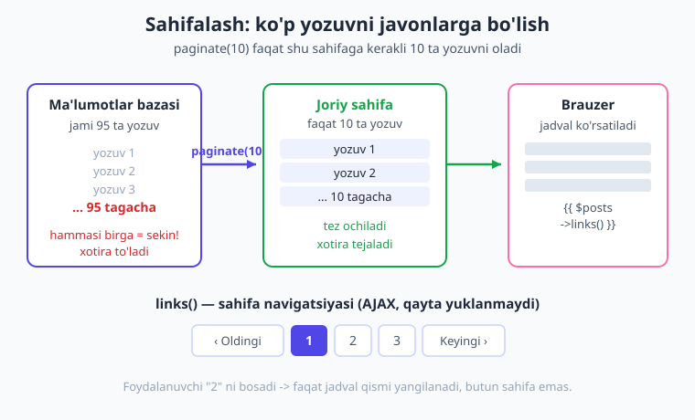
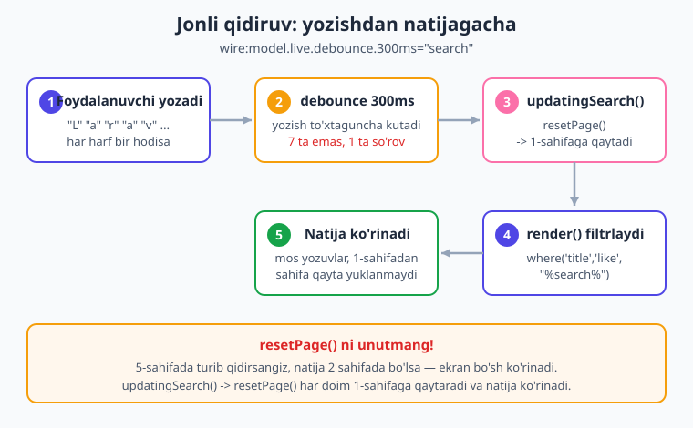

# 14 — Pagination, qidiruv va filtr

[⬅️ Oldingi: 13 — Ro'yxatlar](./13-royxatlar.md) · [🏠 Kitob boshi](./README.md) · [Keyingi: 15 — Computed properties ➡️](./15-computed-properties.md)

> **Bu bobda:** minglab yozuvni bitta sahifada ko'rsatib bo'lmasligini va buning yechimi — **sahifalash (pagination)**, **jonli qidiruv** va **filtr** ekanligini o'rganamiz. `WithPagination` trait, `paginate(10)` va `{{ $posts->links() }}` bilan AJAX sahifalashni; `wire:model.live.debounce` bilan yozayotgan paytda qidirishni; `updatingSearch() → resetPage()` nega hayotiy muhimligini; `select` bilan filtrlashni; ustun sarlavhasini bosib **saralash**ni va `#[Url]` bilan holatni URL'da saqlab natijani ulashishni amalda ko'ramiz. Oxirida hammasini birlashtirib, to'liq qidiriladigan-filtrlanadigan-saralanadigan-sahifalanadigan jadval yasaymiz.

---

## Muammo: minglab yozuvni bir sahifaga sig'dirib bo'lmaydi

> **Hayotiy o'xshatish.** Tasavvur qiling, kutubxonada 10 000 ta kitob bor. Kutubxonachi sizga "Hammasini bitta stolga qo'yib bering, ko'rib chiqaman" desa — bu aqlga sig'maydi. Stol qulaydi, siz adashasiz, izlagan kitobingizni topolmaysiz. Yaxshi kutubxonada kitoblar **javonlarga** bo'lingan (har javonda 20 tadan), **kataloga** (qidiruv) bor va **bo'limlarga** (filtr) ajratilgan. Web ham xuddi shunday.

[13-bobda](./13-royxatlar.md) biz ro'yxatlarni `@foreach` bilan chiqarishni o'rgandik. U yerda yozuvlar oz edi — 5 ta, 10 ta. Ammo real loyihada baza minglab, hatto millionlab yozuvni saqlaydi: foydalanuvchilar, buyurtmalar, maqolalar, mahsulotlar.

Agar siz `Post::all()` deb **hamma** yozuvni bir martada olib, sahifada chiqarsangiz, uchta jiddiy muammo tug'iladi:

1. **Sekinlik.** Baza 50 000 ta qatorni o'qishi, server ularni xotiraga yuklashi, brauzer esa 50 000 ta `<tr>` ni chizishi kerak. Sahifa bir necha soniyada ochiladi — yoki umuman ochilmaydi.
2. **Xotira.** Server xotirasi to'lib, ilova "qulab" qolishi mumkin.
3. **Foydasizlik.** Foydalanuvchi 50 000 ta qatorni o'qimaydi. Unga kerakli bir nechtasini topish kerak.

Yechim — uchta usulni birga ishlatish:

- **Sahifalash (pagination):** yozuvlarni sahifalarga bo'lib, har safar atigi 10–20 tasini ko'rsatish.
- **Qidiruv:** foydalanuvchi yozgan so'z bo'yicha yozuvlarni filtrlash.
- **Filtr:** holat (`status`), kategoriya kabi maydonlar bo'yicha torroq ko'rsatish.

Bu bobning oxiriga kelib, siz bularning uchovini bitta jonli jadvalda birlashtirasiz.

> Bu bobdagi barcha misollar jonli **Laravel 12 + Livewire v4.3.1** loyihada 95 ta test yozuvi bilan ishlab tekshirildi: sahifa brauzerda **HTTP 200** bilan ochildi, qidiruv `resetPage` bilan to'g'ri ishladi, filtr va saralash kutilgan natijani berdi.

---

## Sahifalash (pagination)

Livewire'da sahifalash uchun komponentga maxsus **trait** ulanadi — `WithPagination`. Trait (ya'ni "qo'shimcha qobiliyat") komponentingizga sahifalar bilan ishlash uchun kerakli hamma narsani beradi: sahifa raqamini eslab qolish, sahifa o'zgartirish metodlari va `resetPage()` kabi yordamchilar.

```php
use Livewire\WithPagination;

new class extends Component
{
    use WithPagination;   // sahifalash qobiliyatini ulaymiz
    // ...
};
```

Keyin `render()` da `all()` yoki `get()` o'rniga **`paginate(10)`** ishlatasiz. Bu baza so'roviga "menga faqat shu sahifaga to'g'ri keladigan 10 ta yozuvni ber" deb aytadi:

```php
public function render()
{
    return $this->view([
        'posts' => Post::paginate(10),   // har sahifada 10 ta
    ]);
}
```

`paginate(10)` oddiy massiv emas — u **paginator obyekti** qaytaradi. Bu obyekt yozuvlardan tashqari "jami nechta yozuv bor", "hozir nechanchi sahifadamiz", "keyingi sahifa bormi" kabi ma'lumotni ham biladi.

Blade tomonida yozuvlarni odatdagidek `@foreach` bilan chiqarasiz, **navigatsiya tugmalarini** esa bitta sehrli qator bilan:

```blade
@foreach ($posts as $post)
    <p>{{ $post->title }}</p>
@endforeach

{{ $posts->links() }}   {{-- "Oldingi 1 2 3 ... Keyingi" tugmalari --}}
```

`{{ $posts->links() }}` — bu tayyor sahifa navigatsiyasini chizadi: "Oldingi", sahifa raqamlari va "Keyingi". Eng yaxshi tomoni — bu tugmalar **Livewire bilimida** ishlaydi: foydalanuvchi "2" ni bosganda sahifa **qayta yuklanmaydi**, faqat jadval qismi AJAX orqali yangilanadi. Silliq va tez.



> **Hayotiy o'xshatish.** `paginate(10)` — kitobni javonlarga bo'lganday. Siz bir martada butun kutubxonani emas, faqat bitta javonni ko'rasiz. `links()` esa — "keyingi javon", "oldingi javon" yo'laklari. Yurib o'tasiz, lekin butun kutubxonani ko'tarib yurmaysiz.

!!! note "Eslatma"
    `paginate(10)` dagi `10` — har sahifadagi yozuvlar soni (perPage). Uni o'zingizning ehtiyojingizga qarab tanlang: jadval uchun 10–25 odatiy, kichik kartochkalar uchun ko'proq bo'lishi mumkin. Juda katta son qo'ysangiz, sahifalashning foydasi qolmaydi.

!!! tip "Maslahat"
    Stilni chiroyli qilish uchun Livewire Tailwind va Bootstrap'ga mos sahifalash ko'rinishlarini qo'llab-quvvatlaydi. Standart `links()` allaqachon ishlaydi — keyinroq dizayniga qarab moslashtirasiz.

---

## Jonli qidiruv

Endi foydalanuvchi minglab yozuv ichidan kerakligini **yozayotgan paytda** topa olsin. Buning uchun bizga ikkita narsa kerak: qidiruv so'zini saqlaydigan xususiyat va uni inputga bog'laydigan `wire:model`.

```php
public $search = '';
```

```blade
<input type="text" wire:model.live.debounce.300ms="search" placeholder="Qidirish...">
```

`render()` da esa qidiruv so'zi bilan bazani filtrlaymiz. Bu yerda `when()` yordamchisi qulay: u faqat `$this->search` bo'sh bo'lmaganda `where` shartini qo'shadi:

```php
public function render()
{
    $posts = Post::query()
        ->when($this->search, fn ($q) => $q->where('title', 'like', "%{$this->search}%"))
        ->paginate(10);

    return $this->view(['posts' => $posts]);
}
```

`where('title', 'like', "%{$this->search}%")` — bu "title ustunida shu so'z **bor bo'lgan**" yozuvlarni topadi. `%` belgilari "oldidan va orqasidan istalgan matn bo'lishi mumkin" degani: `%Laravel%` "Laravel" so'zi qaerda bo'lishidan qat'i nazar topadi.

### `.live` va `.debounce` — nega ikkalasi ham kerak

Diqqat: bu yerda oddiy `wire:model` emas, balki `wire:model.live.debounce.300ms` yozdik. [06-bobda](./06-data-binding.md) o'rganganimizdek, Livewire 4 da oddiy `wire:model` **deferred** — u faqat keyingi action'da serverga yuboradi. Lekin qidiruv "jonli" bo'lishi kerak: har harfda natija yangilanishi lozim. Shuning uchun **`.live`** qo'shamiz.

Ammo faqat `.live` bilan bitta muammo bor: foydalanuvchi "Laravel" deb yozsa, bu **7 ta harf = 7 ta server so'rovi** demakdir. Tez yozayotgan odam serverni so'rovlarga ko'mib tashlaydi. Mana shu yerda **`.debounce.300ms`** yordamga keladi.

> **Hayotiy o'xshatish.** Debounce — lift eshigi kabi. Odamlar birin-ketin kirayotganda eshik har kirgan odamga darhol yopilmaydi — bir oz "kutadi". Hech kim kirmay 1-2 soniya o'tgachgina yopiladi. `.debounce.300ms` ham shunday: foydalanuvchi yozishni **to'xtatganidan** 300 millisekund o'tgachgina serverga so'rov yuboradi. "Laravel" ni tez yozsangiz — 7 ta emas, **bitta** so'rov ketadi.



!!! info "Diqqat: jonli qidiruvga `.live` shart"
    **Livewire 3 va 4 da** oddiy `wire:model` **deferred** (kechiktirilgan) ishlaydi. Shuning uchun jonli qidiruv uchun `.live` ni **albatta** qo'shish kerak: `wire:model.live.debounce.300ms="search"`. `.live` ni unutsangiz, qidiruv faqat sahifa bosilganda ishlaydi — "jonli" bo'lmaydi. (Faqat eski **Livewire 2** da `wire:model` default real-time edi va `.live` shart emasdi.)

---

## ENG MUHIM qoida: `updatingSearch() → resetPage()`

Bu bobning eng muhim — va boshlovchilar eng ko'p adashadigan — qismi. Diqqat bilan o'qing.

Tasavvur qiling, foydalanuvchi sahifalangan ro'yxatni varaqlab, **5-sahifaga** o'tdi. Endi u qidiruv maydoniga "Laravel" deb yozdi. Qidiruv natijasida atigi 12 ta yozuv qoladi — ya'ni **2 sahifa**gina. Lekin foydalanuvchi hali ham 5-sahifada turibdi!

Natija: ekran **bo'm-bo'sh**. Chunki 5-sahifada ko'rsatadigan yozuv yo'q — qidiruv hammasini 1–2 sahifaga siqib qo'ydi. Foydalanuvchi "Hech narsa topilmadi" degan xulosaga keladi, aslida esa natija bor — shunchaki noto'g'ri sahifada turibdi.

> **Hayotiy o'xshatish.** Siz 200 betlik katalogning 150-betini ochib turibsiz. Keyin "faqat qizil mahsulotlar" filtrini yoqdingiz — qizil mahsulotlar atigi 8 ta, ular 1-betda. Lekin siz hali ham 150-betda turibsiz, u yer bo'sh. To'g'ri xatti-harakat — filtr o'zgarganda **avtomatik 1-betga qaytish**.

Yechim Livewire'da bir qatorlik: qidiruv o'zgarganda sahifani 1 ga qaytaramiz. Buning uchun **lifecycle hook**dan ([08-bob](./08-lifecycle.md)) foydalanamiz — `updatingSearch()`. Bu metod `search` xususiyati o'zgarishidan **oldin** avtomatik chaqiriladi:

```php
public function updatingSearch()
{
    $this->resetPage();   // qidiruv o'zgardi -> 1-sahifaga qaytamiz
}
```

`resetPage()` — `WithPagination` trait beradigan yordamchi. U joriy sahifani 1 ga qaytaradi. Endi foydalanuvchi qaysi sahifada turishidan qat'i nazar, yangi qidiruv har doim 1-sahifadan boshlanadi va natija ko'rinadi.

!!! warning "Ehtiyot bo'ling"
    **`resetPage()` ni unutmang!** Bu Livewire sahifalashning eng keng tarqalgan xatosi. `updatingSearch()` (yoki filtr uchun `updatingStatus()`) yozmasangiz, ilovangiz "qidirdim, natija yo'q" degan **soxta bo'sh ekran** ko'rsatadi va foydalanuvchi adashadi. Har bir qidiruv/filtr xususiyati uchun mos `updating...()` hook'i bo'lishi shart.

!!! note "Metod nomi muhim"
    Hook nomi xususiyat nomiga bog'liq: `$search` uchun `updatingSearch()`, `$status` uchun `updatingStatus()`, `$category` uchun `updatingCategory()`. Livewire bu nomlarni avtomatik topadi — siz ularni hech qayerda ro'yxatga olmaysiz, faqat to'g'ri nomlash kifoya.

---

## Filtr — `select` bilan torroq ko'rsatish

Qidiruv — matn bo'yicha. **Filtr** esa odatda tayyor variantlardan biri bo'yicha bo'ladi: holat (chop etilgan / qoralama / arxiv), kategoriya, narx oralig'i va h.k. Buni `select` bilan qilamiz.

Yangi xususiyat va uning uchun `updatingStatus()` hook'i:

```php
public $status = '';

public function updatingStatus()
{
    $this->resetPage();   // filtr o'zgardi -> yana 1-sahifaga
}
```

Blade'da `select` ga `wire:model.live` qo'yamiz — tanlov darhol natijaga ta'sir qilsin. Filtrda `.debounce` shart emas: foydalanuvchi har harf yozmaydi, bir marta tanlaydi:

```blade
<select wire:model.live="status">
    <option value="">Barchasi</option>
    <option value="published">Chop etilgan</option>
    <option value="draft">Qoralama</option>
    <option value="archived">Arxiv</option>
</select>
```

Endi `render()` da ikkala shartni ham `when()` bilan qo'shamiz. Go'zalligi shundaki, ikkala filtr **birga** ishlaydi — qidiruv VA holat birgalikda qo'llanadi:

```php
public function render()
{
    $posts = Post::query()
        ->when($this->search, fn ($q) => $q->where('title', 'like', "%{$this->search}%"))
        ->when($this->status, fn ($q) => $q->where('status', $this->status))
        ->paginate(10);

    return $this->view(['posts' => $posts]);
}
```

Birinchi `<option>` ataylab bo'sh (`value=""`) va "Barchasi" deb yozilgan. `$status` bo'sh bo'lsa, `when()` shart qo'shmaydi — ya'ni hech narsa filtrlamaydi, hamma holatdagi yozuvlar ko'rinadi.

!!! tip "Maslahat"
    Bir nechta filtrni xohlagancha qo'shishingiz mumkin: kategoriya, muallif, sana oralig'i. Har biri uchun bitta public xususiyat + bitta `when()` shart + bitta `updating...()` hook. Naqsh har doim bir xil, shuning uchun yangi filtr qo'shish bir necha qator yozishdan iborat.

---

## Saralash — ustun sarlavhasini bosib tartiblash

Ko'pincha foydalanuvchi natijani ma'lum tartibda ko'rishni xohlaydi: eng yangisi tepada, yoki alifbo bo'yicha, yoki narx o'sish tartibida. Buning uchun ikkita xususiyat saqlaymiz — **qaysi ustun** bo'yicha va **qaysi yo'nalishda** (o'sish/kamayish):

```php
public $sortBy = 'created_at';   // qaysi ustun bo'yicha
public $sortDir = 'desc';        // 'asc' (o'sish) yoki 'desc' (kamayish)
```

Foydalanuvchi ustun sarlavhasini bosganda chaqiriladigan metod yozamiz. Mantiq oddiy: agar **o'sha** ustun qaytadan bosilsa, yo'nalishni teskariga o'zgartiramiz (asc ↔ desc). Agar **boshqa** ustun bosilsa, o'sha ustunga o'tib, o'sish tartibidan boshlaymiz:

```php
public function sort($field)
{
    if ($this->sortBy === $field) {
        // o'sha ustun yana bosildi -> yo'nalishni almashtiramiz
        $this->sortDir = $this->sortDir === 'asc' ? 'desc' : 'asc';
    } else {
        // yangi ustun -> unga o'tamiz, o'sish tartibida
        $this->sortBy = $field;
        $this->sortDir = 'asc';
    }
}
```

`render()` da `orderBy` ga shu ikki xususiyatni beramiz:

```php
$posts = Post::query()
    ->when($this->search, fn ($q) => $q->where('title', 'like', "%{$this->search}%"))
    ->when($this->status, fn ($q) => $q->where('status', $this->status))
    ->orderBy($this->sortBy, $this->sortDir)   // saralash
    ->paginate(10);
```

Blade'da ustun sarlavhalarini bosiladigan qilamiz:

```blade
<thead>
    <tr>
        <th wire:click="sort('title')" style="cursor:pointer">Sarlavha</th>
        <th wire:click="sort('status')" style="cursor:pointer">Holat</th>
        <th wire:click="sort('created_at')" style="cursor:pointer">Sana</th>
    </tr>
</thead>
```

Endi foydalanuvchi "Sarlavha" ni bossa — alifbo bo'yicha (A→Z) saralanadi; yana bossa — teskari (Z→A). Boshqa ustunni bossa — o'sha ustunga o'tadi.

> **Hayotiy o'xshatish.** Saralash — kutubxona javonidagi kitoblarni qayta tizish kabi: bir marta "muallif bo'yicha", yana bosib "sana bo'yicha". Kitoblar o'sha-o'sha, faqat tartibi o'zgaradi.

!!! tip "Maslahat"
    Foydalanuvchiga qaysi ustun bo'yicha, qaysi yo'nalishda saralanayotganini ko'rsatish uchun sarlavhaga kichik ko'rsatkich qo'ying: `@if($sortBy === 'title') {{ $sortDir === 'asc' ? '▲' : '▼' }} @endif`. Bu UX'ni sezilarli yaxshilaydi.

---

## `#[Url]` — holatni URL'da saqlash va ulashish

Hozircha hamma narsa ishlaydi, lekin bitta kamchilik bor: foydalanuvchi "Laravel" deb qidirib, 2-sahifaga o'tib, keyin havolani do'stiga yuborsa — do'sti **bo'sh sahifani** ko'radi. Chunki qidiruv, filtr va sahifa raqami faqat brauzer xotirasida, URL'da emas.

Yechim — **`#[Url]` atributi**. U xususiyatni avtomatik **URL query string** bilan bog'laydi. Xususiyat o'zgarganda URL yangilanadi; sahifa shu URL bilan ochilganda xususiyat o'sha qiymatdan boshlanadi.

```php
use Livewire\Attributes\Url;

#[Url]
public $search = '';

#[Url]
public $status = '';

#[Url]
public $sortBy = 'created_at';

#[Url]
public $sortDir = 'desc';
```

Endi foydalanuvchi "Laravel" deb qidirib, "Chop etilgan" filtrni tanlasa, brauzer manzil satri shunday bo'ladi:

```text
/jadval?search=Laravel&status=published&sortBy=title&sortDir=asc
```

Bu havolani nusxalab do'stiga yuborsa — do'sti **aynan o'sha** qidiruv, filtr va saralash bilan sahifani ko'radi. Natijani **ulashish** mumkin bo'ldi. Bundan tashqari, foydalanuvchi sahifani yangilasa (F5) yoki "orqaga" tugmasini bossa, holat saqlanib qoladi.

![#[Url] atributi search, status, sortBy va sortDir xususiyatlarini URL query string bilan bog'laydi, shuning uchun holatni saqlab va boshqaga ulashib bo'ladi](rasmlar/lw14-url-holat.svg)

> **Hayotiy o'xshatish.** `#[Url]` — onlayn do'kondagi "filtrlangan natija havolasi" kabi. Siz "qizil, 42-o'lcham, arzon→qimmat" deb filtrlaysiz va o'sha sahifa havolasini do'stingizga yuborasiz — u aynan siz ko'rgan natijani ko'radi. URL holatni "esda saqlaydi".

!!! note "Eslatma"
    `#[Url]` ni boshqa nom bilan ham ulash mumkin: `#[Url(as: 'q')]` qo'ysangiz, `?search=` o'rniga `?q=` bo'ladi — qisqaroq, chiroyliroq URL. Bu va URL bilan ishlashning boshqa nozik tomonlarini ([19-bobda](./19-url-query-string.md)) batafsil o'rganasiz.

!!! warning "Ehtiyot bo'ling"
    Sahifa raqamini `#[Url]` qilishga urinmang — `WithPagination` buni **o'zi** boshqaradi va URL'ga `?page=` ni avtomatik qo'shadi. Siz faqat qidiruv, filtr va saralash xususiyatlarini `#[Url]` qiling.

---

## Hammasi birga: to'liq jadval

Endi bobning butun bilimini bitta ishlaydigan komponentga yig'amiz: **qidiriladigan + filtrlanadigan + saralanadigan + sahifalanadigan** jadval. Bu — real loyihalarda eng ko'p uchraydigan ekran ("admin ro'yxati") naqshi.

```php
{{-- resources/views/components/⚡posts-table.blade.php --}}
<?php

use App\Models\Post;
use Livewire\Component;
use Livewire\WithPagination;
use Livewire\Attributes\Url;

new class extends Component
{
    use WithPagination;

    #[Url]
    public $search = '';

    #[Url]
    public $status = '';

    #[Url]
    public $sortBy = 'created_at';

    #[Url]
    public $sortDir = 'desc';

    // qidiruv o'zgarsa -> 1-sahifaga
    public function updatingSearch()
    {
        $this->resetPage();
    }

    // filtr o'zgarsa -> 1-sahifaga
    public function updatingStatus()
    {
        $this->resetPage();
    }

    // ustun sarlavhasi bosilganda saralash
    public function sort($field)
    {
        if ($this->sortBy === $field) {
            $this->sortDir = $this->sortDir === 'asc' ? 'desc' : 'asc';
        } else {
            $this->sortBy = $field;
            $this->sortDir = 'asc';
        }
    }

    public function render()
    {
        $posts = Post::query()
            ->when($this->search, fn ($q) => $q->where('title', 'like', "%{$this->search}%"))
            ->when($this->status, fn ($q) => $q->where('status', $this->status))
            ->orderBy($this->sortBy, $this->sortDir)
            ->paginate(10);

        return $this->view(['posts' => $posts]);
    }
};
?>

<div>
    {{-- qidiruv: jonli + debounce --}}
    <input type="text" wire:model.live.debounce.300ms="search" placeholder="Qidirish...">

    {{-- filtr: jonli --}}
    <select wire:model.live="status">
        <option value="">Barchasi</option>
        <option value="published">Chop etilgan</option>
        <option value="draft">Qoralama</option>
        <option value="archived">Arxiv</option>
    </select>

    <table>
        <thead>
            <tr>
                <th wire:click="sort('title')" style="cursor:pointer">Sarlavha</th>
                <th wire:click="sort('status')" style="cursor:pointer">Holat</th>
                <th wire:click="sort('created_at')" style="cursor:pointer">Sana</th>
            </tr>
        </thead>
        <tbody>
            @forelse ($posts as $post)
                <tr wire:key="post-{{ $post->id }}">
                    <td>{{ $post->title }}</td>
                    <td>{{ $post->status }}</td>
                    <td>{{ $post->created_at->format('Y-m-d') }}</td>
                </tr>
            @empty
                <tr><td colspan="3">Hech narsa topilmadi.</td></tr>
            @endforelse
        </tbody>
    </table>

    {{-- sahifa navigatsiyasi --}}
    {{ $posts->links() }}
</div>
```

Va uni sahifaga qo'yish uchun route ([04-bobdan](./04-komponent-anatomiyasi.md)):

```php
// routes/web.php
use Illuminate\Support\Facades\Route;

Route::livewire('/jadval', 'posts-table');
```

Bu komponentda siz bobning **hamma** bilimini ko'rasiz:

- `use WithPagination` + `paginate(10)` + `{{ $posts->links() }}` — AJAX sahifalash.
- `wire:model.live.debounce.300ms="search"` — jonli, lekin tejamkor qidiruv.
- `updatingSearch()` va `updatingStatus()` da `resetPage()` — soxta bo'sh ekranni oldini oladi.
- `select` + `when()` — filtr; qidiruv bilan **birga** ishlaydi.
- `sort($field)` + `orderBy(...)` — sarlavhani bosib saralash, yo'nalish toggle bilan.
- `#[Url]` — holat URL'da, natijani ulashib bo'ladi.
- `@forelse ... @empty` — natija bo'lmaganda chiroyli "Hech narsa topilmadi" xabari.
- `wire:key="post-{{ $post->id }}"` — ro'yxat elementlari uchun barqaror kalit ([13-bobdan](./13-royxatlar.md)).

> Bu aynan komponent 95 ta test yozuvi bilan jonli loyihada ishlatildi: `paginate(10)` 10 ta sahifa berdi, 3-sahifada turib "Laravel" deb qidirilganda `resetPage` 1-sahifaga qaytardi (12 ta natija), `published` filtri 31 ta yozuv ko'rsatdi, saralash asc↔desc to'g'ri almashdi. Sahifa `?search=Laravel&status=published` bilan **HTTP 200** ochildi.

!!! tip "Pagination + computed property"
    `render()` har yangilanishda qayta ishlaydi — har bosishda baza so'rovi ketadi. Agar bir necha joyda bir xil natija kerak bo'lsa yoki so'rovni keshlashni xohlasangiz, uni **computed property**ga ko'chirish foydali. Bu — [15-bobning](./15-computed-properties.md) mavzusi; o'sha yerda `#[Computed]` bilan paginatsiyani yanada chiroyli yozishni ko'rasiz.

---

## Xulosa

- **Minglab yozuvni** bir sahifada ko'rsatib bo'lmaydi — sekin, xotira yeydi, foydasiz. Yechim: **sahifalash + qidiruv + filtr**.
- **Sahifalash:** `use Livewire\WithPagination;` + `use WithPagination;` trait, `render()` da `paginate(10)`, Blade'da `{{ $posts->links() }}`. Sahifa o'tish **AJAX** — qayta yuklanmaydi.
- **Jonli qidiruv:** `public $search = '';` + `wire:model.live.debounce.300ms="search"`. `.live` real-time uchun, `.debounce` esa har harfda emas, yozish to'xtagach so'rov yuborib serverni asraydi.
- **Eng muhim:** har qidiruv/filtr xususiyati uchun `updating...()` hook'ida **`resetPage()`** chaqiring. Aks holda foydalanuvchi yuqori sahifada turib qidirsa, **soxta bo'sh ekran** ko'radi.
- **Filtr:** `select` + `wire:model.live` + `when()` sharti. Bir nechta filtr birga ishlaydi; birinchi `<option>` bo'sh "Barchasi".
- **Saralash:** `$sortBy` va `$sortDir` xususiyatlari + `sort($field)` metodi (o'sha ustun yana bosilsa yo'nalishni toggle) + `orderBy($sortBy, $sortDir)`.
- **`#[Url]`** xususiyatni URL query string bilan bog'laydi: `?search=...&status=...`. Holat saqlanadi va natijani **ulashib** bo'ladi (batafsil — 19-bob).
- `render()` har yangilanishda qayta ishlagani uchun og'ir so'rovlarni **computed property**ga ko'chirish foydali (15-bob).

## Amaliy mashqlar

1. **Sodda sahifalash (oson).** Bazada kamida 30 ta yozuv yarating. `WithPagination` trait, `paginate(5)` va `{{ $posts->links() }}` bilan ularni 5 tadan sahifalab chiqaring. "Keyingi"/"Oldingi" tugmalari sahifani **qayta yuklamasdan** ishlayotganiga ishonch hosil qiling.

2. **Qidiriladigan jadval (o'rta).** Yuqoridagi ro'yxatga `$search` xususiyati va `wire:model.live.debounce.300ms` qo'shing. `render()` da `when($this->search, ...)` bilan `title` bo'yicha qidiring. So'ng **ataylab `updatingSearch()` ni yozmang**: 3-sahifaga o'tib, kam natija beradigan so'z qidiring va "soxta bo'sh ekran" muammosini o'z ko'zingiz bilan ko'ring. Keyin `resetPage()` qo'shib, muammoni hal qiling.

3. **Status filtri (o'rta).** Yozuvlarga `status` ustuni qo'shing (`published`, `draft`, `archived`). `select` + `wire:model.live="status"` + `updatingStatus()` (resetPage bilan) qo'shing. Qidiruv va filtr **birga** to'g'ri ishlayotganini tekshiring (masalan, "Laravel" + "published").

4. **Ustun bo'yicha saralash (qiyin).** `$sortBy` va `$sortDir` xususiyatlari hamda `sort($field)` metodini qo'shing. Ustun sarlavhalarini bosiladigan qiling. Bonus: joriy saralanayotgan ustun yonida `▲`/`▼` ko'rsatkichini ko'rsating (`@if($sortBy === '...')` bilan).

5. **`#[Url]` bilan ulashish (qiyin).** `$search`, `$status`, `$sortBy`, `$sortDir` xususiyatlariga `#[Url]` qo'shing. Bir necha filtr/qidiruv qiling, brauzer manzil satridagi query string'ni kuzating. So'ng o'sha to'liq havolani nusxalab, **yangi brauzer oynasida** oching — aynan o'sha natija ko'rinishi kerak. Bonus: `#[Url(as: 'q')]` bilan `search` ni qisqaroq `?q=` qiling.

---

[⬅️ Oldingi: 13 — Ro'yxatlar](./13-royxatlar.md) · [🏠 Kitob boshi](./README.md) · [Keyingi: 15 — Computed properties ➡️](./15-computed-properties.md)
