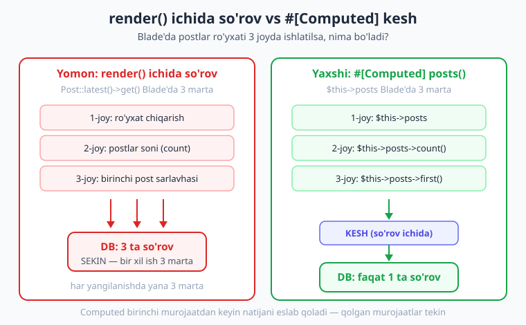
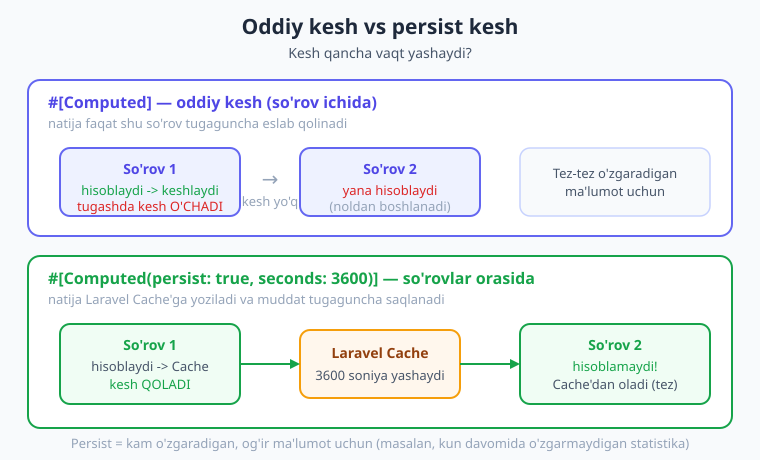
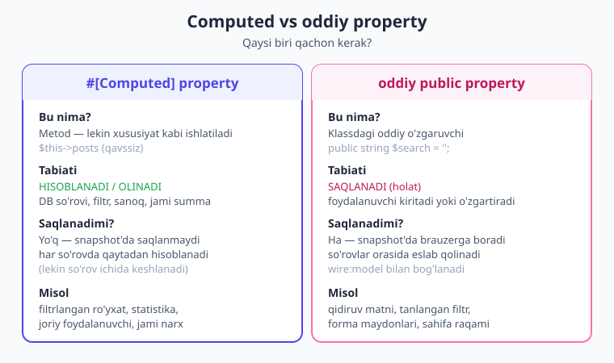

# 15 — Computed properties: hisoblanadigan xususiyatlar

[⬅️ Oldingi: 14 — Pagination va qidiruv](./14-pagination-qidiruv.md) · [🏠 Kitob boshi](./README.md) · [Keyingi: 16 — To'liq CRUD ➡️](./16-toliq-crud.md)

> **Bu bobda:** komponentingizni keraksiz, takroriy ishdan qutqaradigan **computed properties** (hisoblanadigan xususiyatlar) bilan tanishasiz. `#[Computed]` atributi ma'lumotni bir marta hisoblab, **bitta so'rov ichida keshlab** qo'yadi — shuning uchun bir xil og'ir DB so'rovi bir necha marta takrorlanmaydi. Keshni tozalashni (`unset`), so'rovlar orasida saqlashni (`persist`) va computed'ni oddiy property hamda `render()` ma'lumotidan qachon afzal ko'rishni o'rganamiz.

---

## Bir muammodan boshlaylik

Tasavvur qiling, oshpazga uchta odam bir xil savol berdi: "Bugun nechta osh sotildi?" Oshpaz har gal omborga borib, daftarni varaqlab, qo'lda sanab keladi — **uch marta bir xil ish**. Holbuki u bir marta sanab, javobni yodda saqlab qo'yganida, qolgan ikki kishiga shartta aytib berardi.

Livewire komponentida ham xuddi shunday holat tez-tez uchraydi. 8-bobda ([Lifecycle hooks](./08-lifecycle.md)) ko'rgan edik: komponentning **`render()` metodi har bir yangilanishda qaytadan ishlaydi.** Foydalanuvchi tugma bossa — `render()` ishlaydi. Maydonga harf yozsa — `render()` ishlaydi. Va agar siz og'ir ish (masalan, katta DB so'rovi) aynan shu yerda qilsangiz, u **har safar takrorlanadi**.

Yana bir muammo: ba'zan siz bir hisobni Blade shablonida **bir necha joyda** ishlatasiz. Masalan, postlar ro'yxatini chiqarasiz, keyin ularning sonini ko'rsatasiz, keyin birinchi postning sarlavhasini ko'rsatasiz. Agar har safar `Post::latest()->get()` deb yozsangiz — DB ga **uch marta** boriladi, vaholanki ma'lumot bir xil.

> **Hayotiy o'xshatish.** Bu — har savol berilganda do'konga yugurib borib, bir xil mahsulot narxini qayta-qayta so'rab kelishga o'xshaydi. Aqlli odam bir marta so'rab, narxni daftariga yozib qo'yadi va keyingi savollarga daftardan javob beradi. **Computed property — aynan o'sha "aqlli yordamchi":** bir marta hisoblaydi, natijani eslab qoladi va keyingi murojaatlarda DB ga bormay, tayyor javobni beradi.

Quyidagi diagramma muammoni va yechimni yonma-yon ko'rsatadi:



---

## Yomon yo'l: og'ir ishni Blade'da takrorlash

Avval muammoni "o'z ko'zimiz bilan" ko'raylik. Quyidagi komponentda postlar ro'yxatini har gal qaytadan olamiz:

```php
{{-- resources/views/components/⚡post-royxat.blade.php --}}
<?php

use Livewire\Component;
use App\Models\Post;

new class extends Component
{
    //
};
?>

<div>
    <h1>Postlar ({{ App\Models\Post::count() }} ta)</h1>

    {{-- 1-marta: ro'yxat --}}
    @foreach (App\Models\Post::latest()->get() as $post)
        <p>{{ $post->title }}</p>
    @endforeach

    {{-- 2-marta: birinchi post --}}
    <small>Eng yangi: {{ App\Models\Post::latest()->first()->title }}</small>
</div>
```

Bu kod **ishlaydi**, lekin u DB ga uch xil so'rov yuboradi (`count()`, `get()`, `first()`), ustiga-ustak Blade ichida model nomini to'g'ridan-to'g'ri yozish — yomon odat (mantiq shablonga aralashib ketadi). Har yangilanishda bu uch so'rov yana takrorlanadi. Ko'p foydalanuvchili ilovada bu sezilarli sekinlikka olib keladi.

!!! warning "Ehtiyot bo'ling"
    `render()` metodi yoki Blade shabloni ichida og'ir ish (katta DB so'rovi, murakkab hisob, tashqi API chaqiruvi) qilmang. Bu kod **har bir yangilanishda** qaytadan ishlaydi. Og'ir ishni computed property'ga ko'chiring — u natijani keshlab, takrorlanishning oldini oladi.

---

## Yechim: `#[Computed]` atributi

Livewire'da hisoblanadigan xususiyat — bu **oddiy metod**, ustiga `#[Computed]` atributi qo'yilgan. Ammo siz uni metod kabi emas, **xususiyat kabi** (qavssiz!) ishlatasiz.

Avvalo atributni import qilamiz:

```php
use Livewire\Attributes\Computed;
```

Endi metodni e'lon qilamiz:

```php
#[Computed]
public function posts()
{
    return Post::latest()->get();   // og'ir so'rov shu yerda
}
```

Diqqat qiling — metod nomi `posts()`, lekin uni ishlatayotganda **qavs qo'ymaymiz**:

```php
$this->posts        // <-- TO'G'RI (xususiyat kabi)
$this->posts()      // <-- NOTO'G'RI (Livewire xato beradi)
```

Bu sintaksis avval g'alati tuyulishi mumkin: "metod bor, lekin qavssiz chaqiramizmi?" Ha. `#[Computed]` atributi PHP ga "bu metodga xususiyat kabi murojaat qilinsa, uni avtomatik ishga tushir" deb aytadi. Bu — PHP ning "sehrli getter" (magic getter) mexanizmiga o'xshaydi.

> **Hayotiy o'xshatish.** Bu xuddi avtomatik chiroq kabi: siz tugmani bosmaysiz (`posts()`), shunchaki xonaga kirasiz (`$this->posts`) va chiroq o'zi yonadi. Murakkablik yashiringan — sizga faqat natija ko'rinadi.

---

## To'liq ishlaydigan misol

Yuqoridagi yomon kodni computed bilan qayta yozamiz:

```php
{{-- resources/views/components/⚡post-royxat.blade.php --}}
<?php

use Livewire\Component;
use Livewire\Attributes\Computed;
use App\Models\Post;

new class extends Component
{
    #[Computed]
    public function posts()
    {
        // og'ir so'rov — lekin bir so'rov ichida faqat BIR MARTA ishlaydi
        return Post::latest()->get();
    }
};
?>

<div>
    <h1>Postlar ({{ $this->posts->count() }} ta)</h1>

    @foreach ($this->posts as $post)
        <p>{{ $post->title }}</p>
    @endforeach

    <small>Eng yangi: {{ $this->posts->first()?->title }}</small>
</div>
```

Bu yerda biz `$this->posts` ga **uch marta** murojaat qildik: `count()` uchun, `@foreach` uchun va `first()` uchun. Lekin DB ga **faqat bir marta** boriladi! Birinchi murojaatda `posts()` metodi ishlaydi, natija keshga yoziladi, qolgan ikki murojaat esa keshdan o'qiydi.

!!! note "Eslatma"
    `$this->posts` qaytargan natija — bu oddiy Eloquent `Collection`. Demak unda `count()`, `first()`, `where()`, `map()` kabi barcha Collection metodlaridan foydalanishingiz mumkin — go'yo siz so'rovni o'zingiz yozgandek.

---

## Kesh qanday ishlaydi?

Eng muhim tushuncha shu: **computed property natijasi bitta so'rov davomida keshlanadi.**

Buni amalda tekshirib ko'rdik. Quyidagi soddalashtirilgan misolni eslang — har haqiqiy hisoblashda hisoblagichni oshiramiz:

```php
#[Computed]
public function hisob()
{
    logger('hisob() haqiqatan ishladi!');   // necha marta yozilishini kuzating
    return Post::count();
}
```

Agar bitta so'rov ichida `$this->hisob` ga uch marta murojaat qilsangiz:

```php
$a = $this->hisob;   // 1-murojaat: metod ISHLAYDI, log yoziladi
$b = $this->hisob;   // 2-murojaat: keshdan olinadi, log YOZILMAYDI
$c = $this->hisob;   // 3-murojaat: keshdan olinadi, log YOZILMAYDI
```

Log faylga `"hisob() haqiqatan ishladi!"` **faqat bir marta** yoziladi. Ya'ni DB ga ham bir marta boriladi. Bu — bizning oshpaz misolimizning aynan o'zi: bir marta sanaydi, qolganiga yoddan aytadi.

!!! tip "Maslahat"
    Agar Blade shablonida bir hisobni (DB so'rovi, summa, filtr) **bir martadan ko'p** ishlatsangiz — uni computed property qiling. Hatto bitta murojaat bo'lsa-da, og'ir ishni computed'ga ko'chirish kodingizni tartibli va o'qishga oson qiladi.

> **Hayotiy o'xshatish.** Kesh — bu kalkulyator ekranidagi natija. Siz `2 + 2` ni bir marta hisoblaysiz, ekranda `4` turadi. Yana o'sha javob kerak bo'lsa, qaytadan tugma bosmaysiz — ekranga qaraysiz. Computed kesh ham shunday: bir marta hisoblangan natija "ekranda" turadi.

---

## Kesh qachon yangilanadi? `unset` bilan tozalash

Kesh bir so'rov ichida yashaydi. Demak **har yangi so'rovda** (har tugma bosilishida) computed qaytadan hisoblanadi. Bu ko'pincha aynan biz xohlagan narsa: foydalanuvchi yangi post qo'shsa, keyingi so'rovda ro'yxat avtomatik yangilanadi.

Lekin ba'zan **bir so'rovning o'zida** keshni majburan tozalash kerak bo'ladi. Masalan: foydalanuvchi yangi post qo'shdi va siz darhol shu so'rov ichida yangilangan ro'yxatni ko'rsatmoqchisiz. Buning uchun PHP ning oddiy `unset()` funksiyasidan foydalanamiz:

```php
public function postQoshish()
{
    Post::create(['title' => $this->yangiSarlavha]);

    unset($this->posts);   // keshni tozalaymiz -> keyingi murojaatda qayta hisoblanadi

    $this->yangiSarlavha = '';
}
```

`unset($this->posts)` dan keyin `$this->posts` ga keyingi murojaat metodni **qaytadan** ishga tushiradi va yangi postni ham o'z ichiga olgan ro'yxatni qaytaradi.

Biz buni jonli loyihada tekshirdik: `unset` dan oldin va keyin `$this->hisob` ga murojaat qilinganda, metod **ikki marta** ishladi (kesh tozalangani uchun). `unset` bo'lmasa — bir marta ishlardi.

!!! note "Eslatma"
    `unset($this->posts)` — bu xususiyatni "o'chirib tashlash" emas. U faqat **keshni** tozalaydi. Keyingi murojaatda metod qaytadan hisoblaydi va yangi natija beradi. Computed metodning o'zi joyida qoladi.

---

## So'rovlar orasida saqlash: `persist`

Yuqoridagi oddiy kesh faqat **bitta so'rov ichida** yashaydi. So'rov tugadimi — kesh yo'qoladi, keyingi so'rovda computed qaytadan hisoblanadi. Aksariyat holatlarda bu to'g'ri xulq.

Ammo ba'zan ma'lumot **kam o'zgaradi va olishga og'ir** bo'ladi. Masalan: kun davomida deyarli o'zgarmaydigan statistika, og'ir hisobot, sekin tashqi API javobi. Bunday natijani **har so'rovda** qaytadan olish isrofgarchilik. Mana shu yerda `persist` yordam beradi:

```php
use Livewire\Attributes\Computed;

#[Computed(persist: true, seconds: 3600)]
public function ogirStatistika()
{
    // bu og'ir hisob 1 soatda faqat bir marta bajariladi
    return Post::selectRaw('count(*) as soni, avg(views) as ortacha')->first();
}
```

`persist: true` natijani **Laravel Cache** tizimiga yozadi va u **so'rovlar orasida** ham saqlanadi. `seconds: 3600` — kesh muddati (bu yerda 1 soat; bu standart qiymat). Muddat tugaguncha har qanday so'rov (hatto boshqa foydalanuvchidan kelgan bo'lsa ham, agar kalit bir xil bo'lsa) tayyor natijani Cache'dan oladi — DB ga bormaydi.

Quyidagi diagramma oddiy kesh va persist kesh farqini ko'rsatadi:



`#[Computed(cache: true)]` ham mavjud — u ham natijani Cache'ga yozadi. `persist` bilan farqi: `persist` kesh kaliti **shu komponentning o'ziga** bog'lanadi (har komponent nusxasi alohida kesh), `cache` esa kalitni metod nomi bo'yicha global qiladi (barcha nusxalar bitta keshni baham ko'radi).

```php
#[Computed(cache: true, key: 'barcha-postlar', seconds: 600)]
public function barchaPostlar()
{
    return Post::all();   // 10 daqiqaga global keshlanadi
}
```

`key` parametri bilan kesh kalitini o'zingiz belgilashingiz mumkin.

Persist keshini ham `unset($this->ogirStatistika)` bilan tozalashingiz mumkin — bu Cache'dagi yozuvni ham o'chiradi (`Cache::forget`). Demak ma'lumot o'zgarganda keshni qo'lda yangilash imkoni bor.

!!! warning "Ehtiyot bo'ling"
    `persist` faqat **kam o'zgaradigan** ma'lumot uchun. Agar natija foydalanuvchining har amalida o'zgarishi kerak bo'lsa (masalan, filtrlangan ro'yxat) — `persist` ishlatmang, aks holda foydalanuvchi eski (eskirgan) natijani ko'radi. Bunday hollarda oddiy `#[Computed]` ishlatib, kerak bo'lganda `unset` qiling.

---

## Computed vs oddiy property vs render() ma'lumoti

Endi eng muhim savol: qaysi vositani qachon ishlataman? Uchta yo'l bor, va ularni adashtirmaslik kerak.

| Xususiyat | Tabiati | Saqlanadimi? | Qachon ishlatiladi |
|---|---|---|---|
| **Oddiy public property** | Holat — saqlanadi | Ha, snapshot'da brauzerga boradi va so'rovlar orasida eslab qolinadi | Foydalanuvchi **kiritadigan** yoki o'zgartiradigan qiymat: qidiruv matni, tanlangan filtr, forma maydonlari, sahifa raqami |
| **`#[Computed]` property** | Hisoblanadi/olinadi — keshlanadi | Yo'q (so'rov ichida keshlanadi, lekin snapshot'da saqlanmaydi) | **Olinadigan/hisoblanadigan** qiymat: DB so'rovi, filtrlangan ro'yxat, statistika, jami summa, joriy foydalanuvchi |
| **`render()` ma'lumoti** | Har so'rovda uzatiladi | Yo'q | Faqat shablon uchun kerakli, **bir marta** ishlatiladigan oddiy ma'lumot (computed shart bo'lmagan holat) |

Oddiy qoida:

- Foydalanuvchi **kiritadigan** narsa — **oddiy property** (`public $search = ''`).
- DB dan **olinadigan** yoki **hisoblanadigan** narsa — **computed** (`#[Computed] public function posts()`).
- Shablonga **bir marta** uzatiladigan, takrorlanmaydigan narsa — **render() ma'lumoti** (`return $this->view(['x' => ...])`).

Quyidagi diagramma computed va oddiy property farqini batafsil taqqoslaydi:



> **Hayotiy o'xshatish.** Oddiy property — bu daftaringizga **o'zingiz yozadigan** narsa (xarid ro'yxati). Computed — bu kalkulyator **hisoblab beradigan** narsa (ro'yxatdagi narxlar jami). Birinchisini siz o'zgartirasiz va u saqlanadi; ikkinchisi har gal yangidan hisoblanadi.

---

## Computed bilan filtr va qidiruv (14-bob bilan bog'lash)

Computed property'ning eng kuchli tarafi — **filtrlangan ro'yxatlar** bilan ishlashda namoyon bo'ladi. 14-bobda ([Pagination va qidiruv](./14-pagination-qidiruv.md)) qidiruv va sahifalashni ko'rgan edik. U yerda qidiruv natijasini odatda `render()` ichida yoki bevosita olamiz. Computed bu vazifani ancha tozaroq qiladi.

G'oya oddiy: foydalanuvchi kiritadigan qidiruv matni — **oddiy property** (`$search`), shu matnga asoslangan filtrlangan ro'yxat esa — **computed**. Foydalanuvchi yozgan har harfda `render()` ishlaydi, lekin filtr faqat bir marta hisoblanadi (chunki computed keshlangan), va kodimiz ikki vazifani toza ajratadi.

```php
{{-- resources/views/components/⚡post-qidiruv.blade.php --}}
<?php

use Livewire\Component;
use Livewire\Attributes\Computed;
use Livewire\WithPagination;
use App\Models\Post;

new class extends Component
{
    use WithPagination;

    public string $search = '';   // foydalanuvchi kiritadi -> oddiy property

    public function updatingSearch()
    {
        $this->resetPage();        // qidiruv o'zgarsa, 1-sahifaga qaytamiz
    }

    #[Computed]
    public function filtrlanganPostlar()
    {
        return Post::query()
            ->when($this->search, fn ($q) =>
                $q->where('title', 'like', "%{$this->search}%"))
            ->latest()
            ->paginate(10);        // filtrlangan + sahifalangan -> computed
    }
};
?>

<div>
    <input type="text" wire:model.live.debounce.300ms="search"
           placeholder="Post qidirish...">

    @forelse ($this->filtrlanganPostlar as $post)
        <p>{{ $post->title }}</p>
    @empty
        <p>Hech narsa topilmadi.</p>
    @endforelse

    {{ $this->filtrlanganPostlar->links() }}
</div>
```

E'tibor bering: `$this->filtrlanganPostlar` Blade'da **ikki marta** ishlatildi — `@forelse` da va `links()` da. Computed tufayli DB ga **faqat bir marta** boriladi. Agar computed ishlatmasangiz, `paginate()` ni ikki marta chaqirish kerak bo'lardi (yoki o'zgaruvchiga saqlash kerak edi).

---

## Bir computed'dan statistika ham olish

Computed'ning yana bir foydasi: **bir manbadan bir necha xil natija** olish. Filtrlangan ro'yxatdan ham elementlarni, ham ularning sonini (statistikani) ko'rsatishimiz mumkin — qo'shimcha so'rovsiz.

Quyidagi misolda biz bitta computed'dan postlar ro'yxatini ham, jami sonini ham olamiz:

```php
{{-- resources/views/components/⚡post-statistika.blade.php --}}
<?php

use Livewire\Component;
use Livewire\Attributes\Computed;
use App\Models\Post;

new class extends Component
{
    public string $search = '';

    #[Computed]
    public function natijalar()
    {
        return Post::query()
            ->when($this->search, fn ($q) =>
                $q->where('title', 'like', "%{$this->search}%"))
            ->latest()
            ->get();
    }
};
?>

<div>
    <input type="text" wire:model.live.debounce.300ms="search" placeholder="Qidirish...">

    {{-- statistika — bir xil computed'dan, qo'shimcha so'rovsiz --}}
    <p><strong>{{ $this->natijalar->count() }}</strong> ta post topildi</p>

    {{-- ro'yxat — yana o'sha computed --}}
    @foreach ($this->natijalar as $post)
        <p>{{ $post->title }}</p>
    @endforeach
</div>
```

Bu yerda `$this->natijalar` ikki marta ishlatildi (`count()` va `@foreach`), lekin DB ga bir marta boriladi. Statistika va ro'yxat **bitta manbadan** — ular doim mos keladi va tezligi yuqori.

!!! example "Misol"
    Internet-do'kon savatini tasavvur qiling. Bir computed `$this->savatMahsulotlari` mahsulotlar ro'yxatini qaytarsin. Shu computed'dan: ro'yxatni chiqarasiz (`@foreach`), mahsulotlar sonini ko'rsatasiz (`->count()`) va jami narxni hisoblaysiz (`->sum('narx')`). Uchala natija ham bitta keshlangan so'rovdan keladi — tez va izchil.

---

## `$wire` orqali Alpine'dan ham foydalanish mumkin

Computed property'lar Blade va PHP'dan tashqari, Alpine.js ichidan ham ko'rinadi. 22-bobda ([Alpine.js](./22-alpine-js.md)) buni batafsil ko'ramiz, hozircha shuni biling: `$wire.posts` orqali Alpine ichidan computed natijasiga murojaat qilish mumkin (lekin u oddiy public property'lardek reaktiv emas — faqat o'qish uchun qulay).

---

## Keng tarqalgan xatolar

Computed bilan ishlashda boshlovchilar tez-tez yo'l qo'yadigan xatolar:

1. **Qavs qo'yib chaqirish.** `$this->posts()` emas, `$this->posts` yozing. Qavs bilan chaqirsangiz Livewire xato beradi (computed metodni to'g'ridan-to'g'ri chaqirib bo'lmaydi).

2. **Computed ichida holatni o'zgartirish.** Computed metod **faqat hisoblashi** kerak — u yerda `$this->biror = ...` deb xususiyat o'zgartirmang yoki DB ga yozmang. Computed "sof" (toza) bo'lsin: kiritsa — chiqaradi, yon ta'sirsiz.

3. **`unset` ni unutish.** Yangi yozuv qo'shgach ro'yxat yangilanmasa — ehtimol siz keshni tozalashni unutgansiz. Shu so'rov ichida yangilangan natija kerak bo'lsa, `unset($this->posts)` qiling.

4. **Tez o'zgaradigan ma'lumotga `persist` qo'yish.** Filtr natijasiga `persist` qo'ysangiz, foydalanuvchi eski natijani ko'radi. `persist` faqat kam o'zgaradigan og'ir ma'lumot uchun.

!!! info "Livewire 3 da qanday edi?"
    Livewire 3 da ham `#[Computed]` atributi bor edi va sintaksisi deyarli bir xil. Eng katta farq — Livewire 4 da single-file komponentlar (SFC) asosiy format bo'lgani uchun, siz computed metodni `new class extends Component { ... }` bloki ichida yozasiz. Atributning o'zi (`persist`, `seconds`, `cache`, `key`) o'zgarmagan.

---

## Xulosa

- **`render()` har yangilanishda ishlaydi** — og'ir DB so'rovini yoki murakkab hisobni u yerda yoki Blade'da qoldirmang, computed property'ga ko'chiring.
- **`#[Computed]`** — bu metod, lekin **xususiyat kabi** (qavssiz, `$this->posts`) ishlatiladi. Import: `use Livewire\Attributes\Computed;`.
- Computed natijasi **bitta so'rov ichida keshlanadi**: bir necha murojaat bo'lsa ham, og'ir ish **faqat bir marta** bajariladi.
- **`unset($this->posts)`** — keshni tozalaydi; keyingi murojaatda computed qaytadan hisoblanadi (masalan, yangi yozuv qo'shilgach).
- **`#[Computed(persist: true, seconds: 3600)]`** natijani so'rovlar orasida ham Laravel Cache'da saqlaydi — kam o'zgaradigan, og'ir ma'lumot uchun. `cache: true` va `key` ham mavjud.
- **Computed = hisoblanadigan/olinadigan** (DB, filtr, statistika); **oddiy property = foydalanuvchi kiritadigan holat** (qidiruv, forma). Bularni adashtirmang.
- Bir computed'dan bir necha natija (ro'yxat + son + summa) olib, qo'shimcha so'rovlarning oldini olish mumkin.

## Amaliy mashqlar

1. **(Oson)** Bir komponent yarating, unda `#[Computed]` bilan `vaqt()` metodi joriy vaqtni (`now()->format('H:i:s')`) qaytarsin. Uni Blade'da `$this->vaqt` orqali **ikki marta** ko'rsating. Ikkala joyda bir xil vaqt chiqishini kuzating (chunki keshlangan — bir so'rovda bir marta hisoblanadi). Keyin tugma qo'shib, har bosishda vaqt yangilanishini tekshiring.

2. **(Oson-o'rta)** Postlar ro'yxatini computed qiling (`#[Computed] public function posts()`). "Yangi post qo'shish" tugmasini bosganda yangi post yarating va `unset($this->posts)` bilan keshni tozalang. `unset` ni olib tashlab, ro'yxat **shu so'rovda** yangilanmasligini ham ko'ring — farqni his qiling.

3. **(O'rta)** 14-bobdagi qidiruv komponentini computed yordamida qayta yozing: `$search` — oddiy property, `filtrlanganPostlar()` — computed (`paginate` bilan). Computed'ni Blade'da `@forelse` va `links()` da, ya'ni ikki joyda ishlating. `wire:model.live.debounce.300ms` ulang.

4. **(O'rta-qiyin)** Bir computed'dan **uchta** natija oling: filtrlangan mahsulotlar ro'yxati (`@foreach`), ularning soni (`->count()`) va jami narxi (`->sum('narx')`). Uchchalasi ham **bitta** keshlangan so'rovdan kelishini tasdiqlang (masalan, `logger()` bilan metod necha marta ishlaganini kuzating).

5. **(Qiyin)** Og'ir statistika hisobini (masalan, `Post::selectRaw('count(*) as soni, avg(views) as ortacha')->first()`) `#[Computed(persist: true, seconds: 60)]` bilan keshlang. Sahifani bir necha marta yangilab, hisob **faqat bir marta** ishlashini (`logger()` orqali) tasdiqlang. So'ng ma'lumot o'zgarganda keshni `unset` bilan qanday yangilashni o'ylab toping.

---

[⬅️ Oldingi: 14 — Pagination va qidiruv](./14-pagination-qidiruv.md) · [🏠 Kitob boshi](./README.md) · [Keyingi: 16 — To'liq CRUD ➡️](./16-toliq-crud.md)
