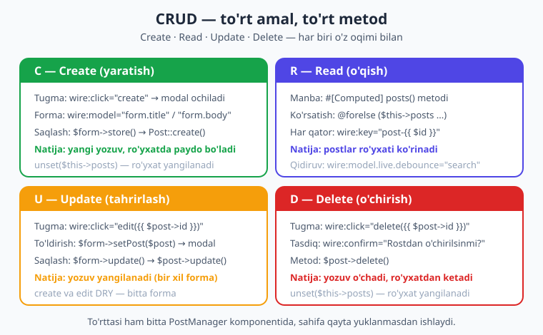
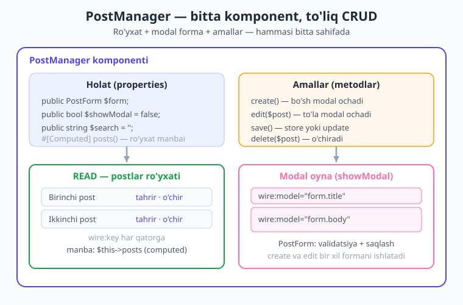
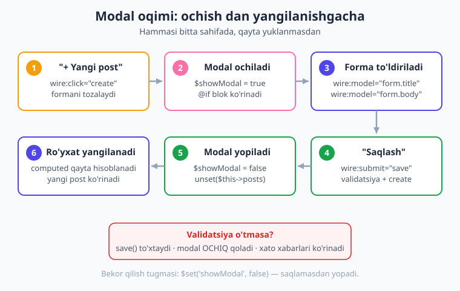

# 16 — To'liq CRUD ilova

[⬅️ Oldingi: 15 — Computed properties](./15-computed-properties.md) · [🏠 Kitob boshi](./README.md) · [Keyingi: 17 — Nested komponentlar ➡️](./17-nested-komponentlar.md)

> **Bu bobda:** 9–15-boblardagi barcha bilimni bitta real ilovaga birlashtiramiz — **"Postlar boshqaruvchisi"**. Postlarni ro'yxat qilish (Read), modal oyna orqali qo'shish (Create), bir xil formada tahrirlash (Update) va tasdiq so'rab o'chirish (Delete) — hammasi bitta sahifada, qayta yuklanmasdan. Form Object, computed property, `wire:key`, `wire:confirm` va flash xabarni jonli ishlatamiz.

---

## CRUD nima va nega muhim?

> **Hayotiy o'xshatish.** Telefon kontaktlaringizni tasavvur qiling. Yangi tanishni **qo'shasiz**, ro'yxatdan kontaktlarni **ko'rasiz**, raqami o'zgarsa **tahrirlaysiz**, kerak bo'lmaganini **o'chirasiz**. Mana shu to'rt ish — qo'shish, ko'rish, tahrirlash, o'chirish — deyarli har bir dasturning yuragida turadi.

Texnik tilda bu to'rt amal **CRUD** deb ataladi:

- **C — Create** (yaratish): yangi yozuv qo'shish.
- **R — Read** (o'qish): yozuvlarni ko'rish/ro'yxat qilish.
- **U — Update** (yangilash): mavjud yozuvni tahrirlash.
- **D — Delete** (o'chirish): yozuvni o'chirish.

Blog postlari, mahsulotlar, foydalanuvchilar, vazifalar, izohlar — bularning hammasi orqasida CRUD turadi. Agar siz CRUD ilovani Livewire'da mukammal qura olsangiz, demak Livewire'ning eng muhim 80% qismini egallagansiz. Shuning uchun bu bob — kitobning **markaziy amaliy darsi**.

An'anaviy (klassik) Laravel'da CRUD odatda **bir necha sahifaga** bo'linadi: ro'yxat sahifasi, "qo'shish" sahifasi, "tahrirlash" sahifasi. Har biriga alohida route, controller metodi va Blade fayl kerak bo'ladi. Har bir o'tishda sahifa to'liq qayta yuklanadi.

Livewire'da esa hammasini **bitta sahifada**, **bitta komponentda** qilamiz. Foydalanuvchi tugma bosadi — modal oynacha ochiladi, to'ldiradi, saqlaydi — sahifa joyidan jilmaydi, ro'yxat o'sha onda yangilanadi. Bu — zamonaviy, silliq tajriba.



!!! note "Bu bob — birlashtiruvchi bob"
    Bu yerda yangi atama deyarli yo'q. Aksincha, siz allaqachon o'rgangan qismlarni — formalar ([09](./09-formalar.md)), validatsiya ([10](./10-validatsiya.md)), Form Object ([11](./11-form-objects.md)), ro'yxatlar va `wire:key` ([13](./13-royxatlar.md)), qidiruv ([14](./14-pagination-qidiruv.md)), computed property ([15](./15-computed-properties.md)) — bir butun ilovaga ulaymiz. Agar biror qism notanish tuyulsa, o'sha bobga qaytib o'qing.

---

## Maqsad: nima quramiz?

Bitta `PostManager` komponenti quramiz. U:

1. Barcha postlarni **ro'yxat** qilib ko'rsatadi (yangidan eskiga).
2. Yuqorida **qidiruv** maydoni bo'ladi — sarlavha bo'yicha filtrlash.
3. **"+ Yangi post"** tugmasi modal oynani ochadi, undan post qo'shiladi.
4. Har qatorda **"Tahrirlash"** tugmasi — o'sha postni bir xil modalda ochadi.
5. Har qatorda **"O'chirish"** tugmasi — tasdiq so'raydi, so'ng o'chiradi.
6. Har amaldan keyin **muvaffaqiyat xabari** chiqadi.

Va bularning hammasi sahifa qayta yuklanmasdan ishlaydi. Mana umumiy arxitektura:



> Bu bobdagi barcha kod jonli **Laravel 12 + Livewire v4.3.1** loyihada yozilib tekshirildi: sahifa brauzerda **HTTP 200** bilan render qilindi, Create / Read / Update / Delete amallari va validatsiya testlari ma'lumotlar bazasiga qarshi muvaffaqiyatli o'tdi.

---

## Tayyorgarlik: Post model va migration

CRUD ma'lumotlar bazasi bilan ishlaydi, shuning uchun avval **jadval** kerak. Bu — Laravel'ning vazifasi, Livewire'niki emas, shuning uchun qisqacha ko'rsatamiz (batafsil — [Laravel kitobida](../laravel/README.md)).

Model va migration'ni bitta buyruq bilan yaratamiz:

```bash
php artisan make:model Post -m
```

`-m` flagi migration'ni ham yaratadi. Migration'ga ikki ustun qo'shamiz: sarlavha va matn.

```php
// database/migrations/xxxx_create_posts_table.php
public function up(): void
{
    Schema::create('posts', function (Blueprint $table) {
        $table->id();
        $table->string('title');   // sarlavha
        $table->text('body');      // matn
        $table->timestamps();
    });
}
```

So'ng jadvalni yaratamiz:

```bash
php artisan migrate
```

Model'da `$fillable` ni belgilab qo'yamiz — bu mass-assignment uchun qaysi ustunlarni to'ldirish mumkinligini aytadi (ya'ni `Post::create([...])` qaysi maydonlarni qabul qilishi):

```php
// app/Models/Post.php
<?php

namespace App\Models;

use Illuminate\Database\Eloquent\Model;

class Post extends Model
{
    protected $fillable = ['title', 'body'];
}
```

!!! tip "Sample data (sinov ma'lumoti)"
    Ilovani sinash uchun bir nechta namuna post qo'shib qo'ying. Eng tez yo'li — `php artisan tinker` ochib:
    ```php
    Post::create(['title' => 'Birinchi post', 'body' => 'Bu birinchi postning matni.']);
    Post::create(['title' => 'Ikkinchi post', 'body' => 'Bu ikkinchi postning matni.']);
    ```
    Yoki factory/seeder bilan (Laravel kitobida ko'rasiz). Endi ro'yxatda ko'rsatadigan narsa bor.

---

## READ: postlar ro'yxati

Eng tabiiy boshlanish nuqtasi — **ro'yxat**. Avvalo postlarni ekranga chiqaramiz.

[15-bobdan](./15-computed-properties.md) bilamiz: ma'lumotlar bazasidan o'qish kabi "og'ir" ishni `render()` ichida emas, **computed property** ichida qilish kerak. Computed property bir so'rov davomida keshlanadi va `unset()` bilan tozalanmaguncha qayta-qayta bazaga bormaydi.

```php
{{-- resources/views/components/⚡post-manager.blade.php --}}
<?php

use App\Models\Post;
use Livewire\Attributes\Computed;
use Livewire\Component;

new class extends Component
{
    #[Computed]
    public function posts()
    {
        return Post::latest()->get();   // yangidan eskiga
    }
};
?>

<div>
    <ul>
        @forelse ($this->posts as $post)
            <li wire:key="post-{{ $post->id }}">
                <strong>{{ $post->title }}</strong>
            </li>
        @empty
            <li>Hozircha post yo'q.</li>
        @endforelse
    </ul>
</div>
```

Bu yerda ikki muhim narsa bor:

- **`$this->posts`** (qavssiz!) — computed property'ga shunday murojaat qilamiz. [15-bobda](./15-computed-properties.md) o'rgangandek, `posts()` metod emas, balki xususiyatdek ishlatiladi.
- **`wire:key="post-{{ $post->id }}"`** — har bir qatorga **noyob kalit**. Bu Livewire'ga qaysi qator qaysi post ekanini aniq aytadi. [13-bobda](./13-royxatlar.md) o'rgangandek, ro'yxat o'zgarganda (post qo'shilganda yoki o'chganda) Livewire to'g'ri qatorni yangilaydi, adashmaydi. **CRUD'da `wire:key` shart** — chunki ro'yxat doim o'zgarib turadi.

`@forelse ... @empty ... @endforelse` — agar ro'yxat bo'sh bo'lsa, "Hozircha post yo'q." matnini ko'rsatadi. Bu — foydalanuvchiga do'stona xulq.

### Qidiruv qo'shamiz

Ro'yxatni sarlavha bo'yicha filtrlash uchun bitta `search` xususiyat va computed ichida shart qo'shamiz. Bu — [14-bobning](./14-pagination-qidiruv.md) qisqartirilgan ko'rinishi:

```php
public string $search = '';

#[Computed]
public function posts()
{
    return Post::query()
        ->when($this->search, fn ($q) => $q->where('title', 'like', "%{$this->search}%"))
        ->latest()
        ->get();
}
```

Blade'da:

```blade
<input type="text" wire:model.live.debounce.300ms="search" placeholder="Qidirish...">
```

`wire:model.live.debounce.300ms` — foydalanuvchi yozayotganda jonli (live) filtrlaydi, lekin `.debounce.300ms` har bosishda emas, yozish to'xtagandan 0,3 soniya keyin serverga yuboradi. Bu keraksiz so'rovlarni kamaytiradi (batafsil — [14-bob](./14-pagination-qidiruv.md)).

!!! note "Nega `when`?"
    `->when($shart, $callback)` — agar `$shart` "haqiqiy" (bo'sh bo'lmagan) bo'lsa, callback'ni qo'llaydi. Ya'ni `search` bo'sh bo'lsa — barcha postlar, to'lgan bo'lsa — faqat mosini qaytaradi. Bitta so'rovda, ortiqcha `if`siz.

---

## CREATE: modal orqali post qo'shish

Endi eng qiziq qism — yangi post qo'shish. Buni **modal oyna** orqali qilamiz: foydalanuvchi "+ Yangi post" tugmasini bosadi, ekranda kichik forma chiqadi, to'ldiradi, saqlaydi — modal yopiladi va yangi post ro'yxatda paydo bo'ladi.



### Form Object — formani alohida joyga ajratamiz

Sarlavha va matnni to'g'ridan-to'g'ri komponentga `public` xususiyat qilib qo'yish ham mumkin edi. Lekin biz **Form Object** ([11-bob](./11-form-objects.md)) ishlatamiz — chunki bu CRUD'da ikki marta foyda beradi: forma maydonlari va validatsiya **alohida, tartibli** joyda turadi, va eng muhimi — bir xil formani **ham yaratish, ham tahrirlash** uchun qayta ishlatamiz (DRY — takrorlamaslik tamoyili).

Form Object yaratamiz:

```bash
php artisan livewire:form PostForm
```

Bu `app/Livewire/Forms/PostForm.php` faylini yaratadi. Uni quyidagicha to'ldiramiz:

```php
// app/Livewire/Forms/PostForm.php
<?php

namespace App\Livewire\Forms;

use App\Models\Post;
use Livewire\Attributes\Validate;
use Livewire\Form;

class PostForm extends Form
{
    public ?Post $post = null;   // tahrirda — qaysi post; yaratishda — null

    #[Validate('required|min:5')]
    public string $title = '';

    #[Validate('required|min:10')]
    public string $body = '';

    // tahrirlash uchun: formani mavjud post bilan to'ldiramiz
    public function setPost(Post $post): void
    {
        $this->post = $post;
        $this->title = $post->title;
        $this->body = $post->body;
    }

    // yangi post yaratish
    public function store(): void
    {
        $this->validate();
        Post::create($this->only(['title', 'body']));
        $this->reset();
    }

    // mavjud postni yangilash
    public function update(): void
    {
        $this->validate();
        $this->post->update($this->only(['title', 'body']));
        $this->reset();
    }
}
```

Bu yerda nimalar bor:

- `#[Validate(...)]` — har maydon uchun validatsiya qoidalari ([10-bob](./10-validatsiya.md)). Sarlavha kamida 5 belgi, matn kamida 10 belgi bo'lishi shart.
- `public ?Post $post = null` — bu Form Object'ning "rejimi"ni belgilaydi. `null` bo'lsa — yangi yaratamiz, post bo'lsa — o'shani tahrirlaymiz.
- `setPost($post)` — tahrirga o'tganda formani mavjud postning qiymatlari bilan to'ldiradi.
- `store()` — `validate()` qiladi, so'ng `Post::create(...)` bilan yangi yozuv qo'shadi. `$this->only(['title', 'body'])` — Form Object'dan faqat shu ikki maydonni massiv qilib oladi.
- `update()` — mavjud postni yangilaydi.
- `$this->reset()` — har amaldan keyin forma maydonlarini tozalaydi.

!!! tip "`pull()` yoki `only()`?"
    [11-bobda](./11-form-objects.md) `pull()` metodini ko'rgan bo'lishingiz mumkin — u qiymatlarni **oladi va bir vaqtning o'zida tozalaydi**. Bu yaratish uchun juda qulay. Bu yerda biz `only()` + alohida `reset()` ishlatdik, chunki bu **yaratishda ham, tahrirlashda ham** bir xil ishlaydi va kodni bir xil saqlaydi. Ikkalasi ham to'g'ri — `pull()` ixchamroq, `only()` aniqroq.

### Modal'ni boshqarish: `showModal` xususiyati

Modal ko'rinishini eng oddiy usulda — bitta **bool xususiyat** bilan boshqaramiz:

```php
public bool $showModal = false;
```

`false` bo'lsa modal yashirin, `true` bo'lsa ko'rinadi. Blade'da uni `@if` bilan o'rab qo'yamiz:

```blade
@if ($showModal)
    <div class="modal">
        {{-- forma shu yerda --}}
    </div>
@endif
```

Modal'ni ochish uchun `create()` metodi:

```php
public PostForm $form;          // Form Object — tip-belgili public xususiyat
public bool $showModal = false;

public function create(): void
{
    $this->form->reset();       // formani tozalaymiz (eski qiymatlar qolmasin)
    $this->showModal = true;    // modalni ochamiz
}
```

Tugma:

```blade
<button wire:click="create">+ Yangi post</button>
```

Foydalanuvchi tugmani bosadi → `create()` ishlaydi → forma tozalanadi → `showModal = true` → modal ekranda paydo bo'ladi. Hammasi qayta yuklanmasdan.

!!! note "Modal'ni yopishning oson yo'li"
    Modal'ni yopish uchun alohida metod yozish shart emas — Livewire'ning **magic action** `$set` dan foydalanish mumkin ([07-bob](./07-actions.md)):
    ```blade
    <button type="button" wire:click="$set('showModal', false)">Bekor qilish</button>
    ```
    `$set('showModal', false)` to'g'ridan-to'g'ri xususiyatni o'zgartiradi, metod yozmasdan.

### Saqlash: `save()` metodi

Modal ichidagi forma yuborilganda `save()` ishlaydi. U Form Object'ning `store()` metodini chaqiradi, modalni yopadi va ro'yxatni yangilaydi:

```php
public function save(): void
{
    $this->form->store();        // validate + Post::create + reset
    $this->showModal = false;    // modalni yopamiz
    unset($this->posts);         // computed keshini tozalaymiz -> ro'yxat yangilanadi
}
```

Bu yerda **eng muhim qator** — `unset($this->posts)`. [15-bobdan](./15-computed-properties.md) eslang: computed property bir so'rov davomida keshlanadi. Yangi post qo'shilgach, eski keshlangan ro'yxatni majburan tozalashimiz kerak — shunda Livewire ro'yxatni bazadan **qaytadan** o'qiydi va yangi post paydo bo'ladi.

!!! warning "Ehtiyot bo'ling — `unset` esdan chiqmasin"
    Agar `unset($this->posts)` ni yozmasangiz, post bazaga saqlanadi, lekin ro'yxat **yangilanmaydi** (eski keshni ko'rsatib turadi). Bu — boshlovchilar tez-tez tushadigan tuzoq. CRUD'da har o'zgartirishdan keyin computed'ni `unset` qiling.

Forma'ning Blade qismi:

```blade
@if ($showModal)
    <div class="modal">
        <form wire:submit="save">
            <input type="text" wire:model="form.title" placeholder="Sarlavha">
            @error('form.title') <span style="color:#dc2626">{{ $message }}</span> @enderror

            <textarea wire:model="form.body" placeholder="Matn"></textarea>
            @error('form.body') <span style="color:#dc2626">{{ $message }}</span> @enderror

            <button type="submit">Saqlash</button>
            <button type="button" wire:click="$set('showModal', false)">Bekor qilish</button>
        </form>
    </div>
@endif
```

Diqqat qiling:

- `wire:model="form.title"` — Form Object maydoniga bog'lash **nuqta bilan** yoziladi (`form.title`, `form.body`). Bu [11-bobdan](./11-form-objects.md) tanish.
- `@error('form.title')` — xato xabari ham `form.` prefiksi bilan. Validatsiya o'tmasa, bu yerda qizil matn chiqadi.
- `wire:submit="save"` — forma yuborilganda `save` ishlaydi va avtomatik `preventDefault` qiladi ([09-bob](./09-formalar.md)).

!!! info "Validatsiya o'tmasa nima bo'ladi?"
    Agar sarlavha 5 belgidan qisqa yoki matn 10 belgidan qisqa bo'lsa, `store()` ichidagi `validate()` xato beradi va metod **shu yerda to'xtaydi**. `showModal = false` ga **yetib bormaydi** — ya'ni modal ochiq qoladi va xato xabarlari formada ko'rinadi. Foydalanuvchi xatoni tuzatib, qaytadan yuborishi mumkin. Bu — aynan kerakli xulq.

---

## UPDATE: bir xil formada tahrirlash

Endi **DRY tamoyili**ning go'zalligini ko'ramiz. Tahrirlash uchun **yangi forma yasamaymiz** — aynan o'sha modal va o'sha formani qayta ishlatamiz. Yagona farq: forma bo'sh emas, balki tanlangan postning qiymatlari bilan to'ldirilgan bo'ladi.

Har qatorga "Tahrirlash" tugmasini qo'shamiz:

```blade
<li wire:key="post-{{ $post->id }}">
    <strong>{{ $post->title }}</strong>
    <button wire:click="edit({{ $post->id }})">Tahrirlash</button>
</li>
```

`wire:click="edit({{ $post->id }})"` — bosilganda `edit` metodiga post `id`'sini uzatadi ([07-bob](./07-actions.md)).

`edit()` metodi:

```php
public function edit(Post $post): void
{
    $this->form->setPost($post);   // formani mavjud post bilan to'ldiramiz
    $this->showModal = true;       // o'sha modalni ochamiz
}
```

Bu yerda chiroyli narsa: metod argumenti `Post $post` deb yozilgan. Livewire (Laravel'ning **route-model binding** mexanizmi kabi) `id`'ni avtomatik to'liq `Post` modeliga aylantiradi — siz qo'lda `Post::find($id)` yozishingiz shart emas. Tugmadan `id` keladi, metodga tayyor model tushadi.

`setPost($post)` formaning `title`, `body` va `post` maydonlarini to'ldiradi. Endi `$this->form->post` `null` emas — bu "tahrirlash rejimi" belgisidir.

### `save()` ni ikki rejimga moslaymiz

Tahrirlash uchun alohida saqlash metodi yozmaymiz. O'sha `save()` ni **aqlli** qilamiz: agar `form->post` mavjud bo'lsa — yangilaymiz, bo'lmasa — yaratamiz.

```php
public function save(): void
{
    if ($this->form->post) {
        $this->form->update();    // tahrirlash rejimi
    } else {
        $this->form->store();     // yaratish rejimi
    }

    $this->showModal = false;
    unset($this->posts);          // ro'yxatni yangilaymiz
}
```

Mana shu — CRUD'ning eng nafis qismi. **Bitta forma, bitta modal, bitta `save()`** — ham yaratadi, ham tahrirlaydi. Kod takrorlanmaydi, ushlab turish oson.

> **Hayotiy o'xshatish.** Bu — universal pult kabi. Bitta pult ham televizorni yoqadi, ham kanal almashtiradi — ichidagi tugma qaysi rejimda ekanini biladi. Bizning `save()` ham shunday: forma "yangimi yoki eskimi" ekanini `form->post` orqali biladi va to'g'ri ishni qiladi.

---

## DELETE: tasdiq bilan o'chirish

O'chirish — eng xavfli amal, chunki ma'lumot **butunlay yo'qoladi**. Shuning uchun foydalanuvchidan **tasdiq** so'raymiz. Livewire buni bir atributda hal qiladi: **`wire:confirm`**.

Har qatorga "O'chirish" tugmasini qo'shamiz:

```blade
<li wire:key="post-{{ $post->id }}">
    <strong>{{ $post->title }}</strong>
    <button wire:click="edit({{ $post->id }})">Tahrirlash</button>
    <button wire:click="delete({{ $post->id }})" wire:confirm="Rostdan o'chirilsinmi?">
        O'chirish
    </button>
</li>
```

`wire:confirm="Rostdan o'chirilsinmi?"` — tugma bosilganda brauzer **tasdiq oynachasi**ni ko'rsatadi. Agar foydalanuvchi "OK" bossa — `delete` ishlaydi; "Bekor qilish" bossa — hech narsa bo'lmaydi. Sodda va kuchli himoya.

`delete()` metodi:

```php
public function delete(Post $post): void
{
    $post->delete();
    unset($this->posts);   // ro'yxatni yangilaymiz
}
```

Bu yerda ham `edit` dagidek — `Post $post` argumenti `id`'dan avtomatik to'liq modelga aylanadi. `$post->delete()` yozuvni bazadan o'chiradi, `unset($this->posts)` esa ro'yxatni yangilaydi — o'chirilgan post darhol yo'qoladi.

!!! warning "`wire:confirm` — minimal himoya"
    `wire:confirm` brauzerning oddiy tasdiq oynachasini ishlatadi. U yaxshi minimum, lekin uni mijoz tomonida o'tkazib yuborish mumkin. **Haqiqiy himoya doim serverda** bo'lishi kerak: o'chirishdan oldin foydalanuvchining bu postni o'chirishga huquqi borligini tekshirish ([23-bob](./23-xavfsizlik.md)). Buni pastda "Xavfsizlik" bo'limida ko'ramiz.

---

## Flash xabar: foydalanuvchiga bildirish

Har bir muvaffaqiyatli amaldan keyin foydalanuvchiga "ish bajarildi" deb bildirish kerak — aks holda u tugmani bosdimi yo'qmi, tushunmay qoladi. Eng oddiy usul — **flash xabar** (`session()->flash()`).

Flash xabar — sessiyaga **bir martalik** yoziladigan xabar: keyingi render'da ko'rsatiladi va o'chib ketadi. Metodlarga qo'shamiz:

```php
public function save(): void
{
    if ($this->form->post) {
        $this->form->update();
        session()->flash('xabar', 'Post yangilandi!');
    } else {
        $this->form->store();
        session()->flash('xabar', 'Post qo\'shildi!');
    }

    $this->showModal = false;
    unset($this->posts);
}

public function delete(Post $post): void
{
    $post->delete();
    session()->flash('xabar', 'Post o\'chirildi!');
    unset($this->posts);
}
```

Blade'da, ro'yxatdan yuqorida, ko'rsatamiz:

```blade
@if (session('xabar'))
    <p style="color:#16a34a">{{ session('xabar') }}</p>
@endif
```

Endi "Post qo'shildi!", "Post yangilandi!", "Post o'chirildi!" — har amaldan keyin yashil xabar chiqadi.

!!! tip "Yaxshiroq bildirishnoma — event orqali"
    Flash xabar oddiy, lekin u **sahifa yangilanishida** ko'rinadi. Zamonaviy ilovalarda ko'pincha "toast" (ekran burchagidagi suzuvchi xabar) ko'rsatiladi. Buni Livewire **event**lari bilan qilish mumkin: `$this->dispatch('notify', text: 'Saqlandi!')` yuborasiz, JS yoki Alpine uni ushlab toast ko'rsatadi. Eventlarni [18-bobda](./18-events.md) o'rganasiz.

---

## Modal pattern: property yoki Alpine?

Biz modal'ni **`showModal` property** bilan boshqardik. Bu — eng oddiy va ishonchli usul: bool xususiyat `true`/`false` bo'ladi, Blade `@if` bilan ko'rsatadi yoki yashiradi. Hammasi server tomonida, qo'shimcha JS yozmasdan.

Lekin yana bir variant bor — **Alpine.js** bilan boshqarish. Bunda modal'ning ochilish-yopilishi **mijoz tomonida** (brauzerda, serverga so'rovsiz) bo'ladi:

```blade
<div x-data="{ open: false }">
    <button @click="open = true">+ Yangi post</button>

    <div x-show="open">
        {{-- forma --}}
        <button @click="open = false">Yopish</button>
    </div>
</div>
```

Alpine variantining afzalligi — modal ochilishi **darhol** (serverga bormasdan) bo'ladi. Kamchiligi — ozgina ko'proq murakkablik va Alpine bilimini talab qiladi.

!!! note "Qaysi birini tanlash?"
    **Boshlovchi uchun `showModal` property usuli yetarli va tushunarli** — biz shuni ishlatdik. Tajriba ortgach, faqat ko'rinishni boshqaradigan modal (server holatiga bog'liq bo'lmagan) uchun Alpine'ga o'tishingiz mumkin. Alpine va `@entangle` (Alpine holatini Livewire xususiyati bilan bog'lash) ni [22-bobda](./22-alpine-js.md) batafsil o'rganasiz.

---

## To'liq ishlaydigan kod

Endi hamma qismni bitta faylda birlashtiramiz. Mana to'liq, jonli loyihada tekshirilgan `PostManager` komponenti:

```php
{{-- resources/views/components/⚡post-manager.blade.php --}}
<?php

use App\Livewire\Forms\PostForm;
use App\Models\Post;
use Livewire\Attributes\Computed;
use Livewire\Component;

new class extends Component
{
    public PostForm $form;            // Form Object (yaratish + tahrirlash)
    public bool $showModal = false;   // modal ko'rinishi
    public string $search = '';       // qidiruv

    // READ — ro'yxat manbai (computed, keshlanadi)
    #[Computed]
    public function posts()
    {
        return Post::query()
            ->when($this->search, fn ($q) => $q->where('title', 'like', "%{$this->search}%"))
            ->latest()
            ->get();
    }

    // CREATE — bo'sh modal ochish
    public function create(): void
    {
        $this->form->reset();
        $this->showModal = true;
    }

    // UPDATE — to'la modal ochish
    public function edit(Post $post): void
    {
        $this->form->setPost($post);
        $this->showModal = true;
    }

    // SAVE — yaratish yoki yangilash (bir xil forma)
    public function save(): void
    {
        if ($this->form->post) {
            $this->form->update();
            session()->flash('xabar', 'Post yangilandi!');
        } else {
            $this->form->store();
            session()->flash('xabar', 'Post qo\'shildi!');
        }

        $this->showModal = false;
        unset($this->posts);          // ro'yxatni yangilash
    }

    // DELETE — tasdiq bilan o'chirish
    public function delete(Post $post): void
    {
        $post->delete();
        session()->flash('xabar', 'Post o\'chirildi!');
        unset($this->posts);
    }
};
?>

<div>
    {{-- flash xabar --}}
    @if (session('xabar'))
        <p style="color:#16a34a">{{ session('xabar') }}</p>
    @endif

    {{-- qidiruv + yangi post tugmasi --}}
    <input type="text" wire:model.live.debounce.300ms="search" placeholder="Qidirish...">
    <button wire:click="create">+ Yangi post</button>

    {{-- READ: postlar ro'yxati --}}
    <ul>
        @forelse ($this->posts as $post)
            <li wire:key="post-{{ $post->id }}">
                <strong>{{ $post->title }}</strong>
                <button wire:click="edit({{ $post->id }})">Tahrirlash</button>
                <button wire:click="delete({{ $post->id }})" wire:confirm="Rostdan o'chirilsinmi?">
                    O'chirish
                </button>
            </li>
        @empty
            <li>Hozircha post yo'q.</li>
        @endforelse
    </ul>

    {{-- CREATE/UPDATE: modal forma (bitta forma, ikki rejim) --}}
    @if ($showModal)
        <div class="modal">
            <form wire:submit="save">
                <input type="text" wire:model="form.title" placeholder="Sarlavha">
                @error('form.title') <span style="color:#dc2626">{{ $message }}</span> @enderror

                <textarea wire:model="form.body" placeholder="Matn"></textarea>
                @error('form.body') <span style="color:#dc2626">{{ $message }}</span> @enderror

                <button type="submit">Saqlash</button>
                <button type="button" wire:click="$set('showModal', false)">Bekor qilish</button>
            </form>
        </div>
    @endif
</div>
```

Va uni sahifaga ulash uchun route ([04-bob](./04-komponent-anatomiyasi.md)):

```php
// routes/web.php
use Illuminate\Support\Facades\Route;

Route::livewire('/post-manager', 'post-manager');
```

Endi `/post-manager` sahifasiga kirib, **to'liq ishlaydigan CRUD ilova**ni ko'rasiz: qidirasiz, qo'shasiz, tahrirlaysiz, o'chirasiz — hammasi qayta yuklanmasdan.

!!! example "Sinab ko'ring"
    1. "+ Yangi post" bosing — modal ochiladi.
    2. Sarlavhaga 2 ta harf yozib "Saqlash" bosing — qizil xato chiqadi, modal ochiq qoladi (validatsiya ishladi).
    3. To'g'ri to'ldirib saqlang — modal yopiladi, yangi post ro'yxat tepasida, yashil xabar chiqadi.
    4. "Tahrirlash" bosing — o'sha post bilan to'lgan modal ochiladi. O'zgartirib saqlang.
    5. "O'chirish" bosing — tasdiq so'raydi. "OK" bossangiz, post yo'qoladi.
    6. Qidiruvga sarlavha bo'lagini yozing — ro'yxat jonli filtrlanadi.

---

## Xavfsizlik eslatmasi

CRUD ilova ma'lumotni **o'zgartiradi va o'chiradi** — shuning uchun xavfsizlik shart. Hozir bizning misolimizda har kim har qanday postni tahrirlashi va o'chirishi mumkin. Real ilovada bu mumkin emas.

Eng muhim qoida: **`edit`, `save` (update qismi) va `delete` metodlarida avtorizatsiya tekshiruvi bo'lishi shart.** Laravel'ning `authorize()` metodi bilan:

```php
public function delete(Post $post): void
{
    $this->authorize('delete', $post);   // huquq bormi? yo'q bo'lsa — to'xtaydi
    $post->delete();
    unset($this->posts);
}
```

`$this->authorize('delete', $post)` — agar joriy foydalanuvchining bu postni o'chirishga huquqi bo'lmasa, Livewire so'rovni **to'xtatadi** (403 xato). `wire:confirm` faqat mijoz tomonidagi qulaylik — u himoya emas. Haqiqiy himoya **doim serverda**.

!!! danger "Xavfsizlik — eslab qoling"
    `wire:click="delete({{ $post->id }})"` dagi `id` **mijozdan keladi** — uni o'zgartirib yuborish mumkin. Ya'ni foydalanuvchi boshqa birovning post `id`'sini yuborishga urinishi mumkin. Shuning uchun serverda `authorize()` bo'lmasa, har kim har qanday postni o'chirishi mumkin bo'lib qoladi. **Public metod = ochiq eshik** — har doim avtorizatsiya bilan qulflang. To'liqroq — [23-bob](./23-xavfsizlik.md).

---

## Foydalanuvchi tajribasini sayqallash

Yuqoridagi kod to'liq ishlaydi, lekin haqiqiy ilovada yana bir necha "kichik nafis tegishlar" foydalanuvchi tajribasini sezilarli yaxshilaydi. Ularning hammasini siz oldingi boblardan bilasiz — endi joyiga qo'yamiz.

### Saqlash davomida tugmani bloklash

Saqlash so'rovi serverga borib qaytguncha bir lahza o'tadi. Bu paytda foydalanuvchi "Saqlash"ni qayta-qayta bosib, bir xil postni ikki marta qo'shib yuborishi mumkin. Buni `wire:loading.attr="disabled"` bilan oldini olamiz ([20-bob](./20-loading-holatlar.md)):

```blade
<button type="submit" wire:loading.attr="disabled">
    <span wire:loading.remove>Saqlash</span>
    <span wire:loading>Saqlanmoqda...</span>
</button>
```

So'rov ketayotgan paytda tugma o'chadi va "Saqlanmoqda..." deb ko'rsatadi — javob kelganda yana "Saqlash"ga qaytadi.

### Bo'sh holatni chiroyli ko'rsatish

Biz `@forelse ... @empty` bilan "Hozircha post yo'q." matnini ko'rsatdik. Lekin qidiruv natija bermaganda boshqacha matn yaxshiroq:

```blade
@empty
    @if ($search)
        <li>"{{ $search }}" bo'yicha post topilmadi.</li>
    @else
        <li>Hozircha post yo'q. "+ Yangi post" bilan birinchisini qo'shing!</li>
    @endif
@endforelse
```

Endi foydalanuvchi ro'yxat haqiqatan bo'shmi yoki shunchaki qidiruv mos kelmadimi — aniq tushunadi.

### Sarlavhada postlar sonini ko'rsatish

Computed property'dan ro'yxat sonini ham olsa bo'ladi — qo'shimcha so'rovsiz, chunki u keshlangan:

```blade
<h2>Postlar ({{ $this->posts->count() }})</h2>
```

`$this->posts` allaqachon yuklangani uchun `->count()` bazaga **qayta bormaydi** — Collection'ning o'zini sanaydi. Bu — computed'ning yana bir foydasi.

---

## Tez-tez uchraydigan xatolar

CRUD qurganda boshlovchilar bir xil tuzoqlarga tushadi. Ularni oldindan biling:

!!! warning "1. `unset($this->posts)` esdan chiqib qolishi"
    Eng keng tarqalgan xato. Post saqlanadi/o'chadi, lekin ro'yxat o'zgarmaydi — chunki computed eski keshni ko'rsatib turibdi. **Har o'zgartirishdan keyin `unset` qiling.**

!!! warning "2. `wire:key` qo'ymaslik"
    Ro'yxat qatorlariga `wire:key` qo'ymasangiz, post o'chirilganda yoki qo'shilganda Livewire qatorlarni adashtirib yangilashi mumkin (masalan, noto'g'ri qatorda input qoladi). **Doim `wire:key="post-{{ $post->id }}"`.**

!!! warning "3. `form.` prefiksini unutish"
    Form Object ishlatganda Blade'da `wire:model="title"` emas, `wire:model="form.title"` yozish kerak. Xato ham `@error('form.title')` bo'ladi. Prefiks tushib qolsa, bog'lanish ishlamaydi.

!!! warning "4. Tahrir uchun alohida forma yasash"
    `editForm`, `createForm` deb ikki forma yasash — kodni ikki barobar qiladi va xatoga moyil. **Bitta forma + `form->post` rejim belgisi** bilan DRY saqlang.

---

## Xulosa

- **CRUD** — Create (yaratish), Read (o'qish), Update (yangilash), Delete (o'chirish) — deyarli har dasturning yuragi. Livewire'da bularning hammasi **bitta komponentda, bitta sahifada**, qayta yuklanmasdan bo'ladi.
- **READ**: ro'yxatni `#[Computed]` property'da o'qing va har qatorga **`wire:key`** qo'ying. Computed keshlanadi — o'zgartirishdan keyin **`unset($this->posts)`** bilan tozalang.
- **CREATE**: **Form Object** (`PostForm`) maydonlar va validatsiyani tartibli ushlaydi. Modal'ni **`showModal` bool xususiyat** bilan boshqaring; `$set('showModal', false)` bilan yoping.
- **UPDATE**: **bir xil forma va `save()` ni qayta ishlating** (DRY). `form->post` `null` bo'lsa — yaratish, mavjud bo'lsa — yangilash. `edit($post)` formani to'ldiradi.
- **DELETE**: `wire:confirm="..."` tasdiq so'raydi, metod `$post->delete()` qiladi. `wire:confirm` — qulaylik, himoya emas.
- Argumentdagi **`Post $post`** `id`'dan avtomatik to'liq modelga aylanadi — qo'lda `find()` shart emas.
- Har amaldan keyin **flash xabar** (`session()->flash()`) bilan foydalanuvchiga bildiring; toast kerak bo'lsa — eventlar ([18-bob](./18-events.md)).
- **Xavfsizlik**: `edit`, `update`, `delete` metodlarida doim **`$this->authorize(...)`** — mijozdan kelgan `id`'ga ishonmang ([23-bob](./23-xavfsizlik.md)).

## Amaliy mashqlar

1. **O'z CRUD'ingiz (oson).** "Vazifalar" (`Task`) uchun CRUD yarating: `title` va `done` (bool) maydonlari bilan. Ro'yxat, qo'shish (modal), o'chirish (tasdiq bilan) ishlasin. Tahrirni hozircha qoldirib turing.

2. **Tahrirlashni inline qiling (o'rta).** Modal o'rniga, "Tahrirlash" bosilganda o'sha qatorning o'zida sarlavha **input'ga aylansin** (modal ochilmasin). `editingId` xususiyatini qo'shing va `@if ($editingId === $post->id)` bilan o'sha qatorda input ko'rsating, qolganlarida — oddiy matn. Saqlangach yana matnga qaytsin.

3. **Bekor qilinadigan o'chirish (qiyin).** `wire:confirm` o'rniga "yumshoq o'chirish" qiling: o'chirilgan post darhol yo'qolmasin, balki "O'chirildi — Bekor qilish?" xabari 5 soniya ko'rinsin. Bu vaqt ichida "Bekor qilish" bosilsa, post qaytsin. (Maslahat: postni darhol `delete()` qilmang — uni "yashirin" deb belgilang yoki `deleted_at` ishlating va xabar bilan ko'rsating. Eventlar va `wire:loading` yordam beradi.)

4. **Validatsiya xabarlarini o'zbekchalashtiring (o'rta).** `PostForm`dagi `#[Validate(...)]` ga `message:` parametri qo'shing, masalan `#[Validate('required|min:5', message: 'Sarlavha kamida 5 belgi bo\'lishi kerak')]`. Modal'da xato chiqishini tekshiring ([10-bob](./10-validatsiya.md)).

5. **Avtorizatsiya qo'shing (qiyin).** Har postga `user_id` ustun qo'shing va `PostPolicy` yarating. `edit`, `save` va `delete` metodlarida `$this->authorize(...)` chaqiring — toki foydalanuvchi faqat **o'zining** postlarini boshqara olsin. Boshqa foydalanuvchi post'iga urinilganda 403 chiqishini tekshiring ([23-bob](./23-xavfsizlik.md)).

---

[⬅️ Oldingi: 15 — Computed properties](./15-computed-properties.md) · [🏠 Kitob boshi](./README.md) · [Keyingi: 17 — Nested komponentlar ➡️](./17-nested-komponentlar.md)
