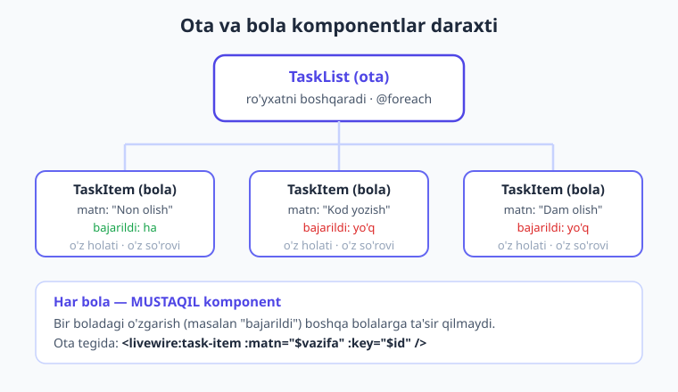
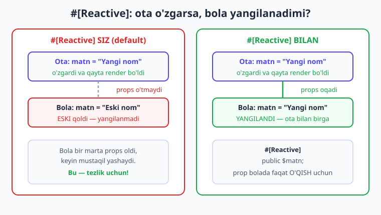
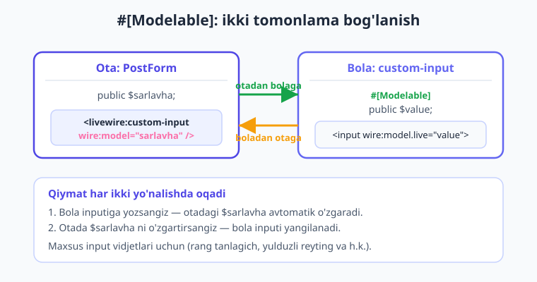

# 17 — Nested (ichma-ich) komponentlar

[⬅️ Oldingi: 16 — To'liq CRUD](./16-toliq-crud.md) · [🏠 Kitob boshi](./README.md) · [Keyingi: 18 — Events ➡️](./18-events.md)

> **Bu bobda:** bitta Livewire komponentini boshqasining ichiga joylashtirishni — ya'ni **nested (ichma-ich) komponentlarni** — o'rganasiz. Har bir bola komponent o'z holati va o'z hayot sikliga ega mustaqil komponent ekanini, ro'yxatlarda nega `wire:key` shartligini, ota o'zgartirganda bola yangilanishi uchun `#[Reactive]` ni, ikki tomonlama bog'lanish uchun `#[Modelable]` + `wire:model` ni, va eng muhimi — **qachon nested qilish kerak, qachon kerak emasligini** misollar bilan ko'rib chiqamiz.

---

## Matryoshka: komponent ichida komponent

O'sha mashhur ruscha qo'g'irchoq — **matryoshka**ni tasavvur qiling. Kattasini ochasiz, ichidan kichigi chiqadi, uni ochasiz — yana kichigi. Har biri alohida qo'g'irchoq, lekin ular bir-birining ichida joylashgan. Yoki binoni oling: bino ichida qavatlar, qavatlarda xonalar, xonalarda mebellar. Har biri o'zicha butun narsa, ammo biri ikkinchisining ichida turadi.

Livewire komponentlari ham aynan shunday joylashishi mumkin. Bir komponentni (**ota** komponent) yozasiz, uning Blade qismi ichiga esa boshqa komponentni (**bola** komponent) qo'yasiz. Bu — **nested (ichma-ich) komponentlar**. *Nested* — inglizchada "uyalangan, ichma-ich joylashgan" degani.

> **Hayotiy o'xshatish.** Vazifalar ro'yxatini tasavvur qiling. Butun ro'yxat — bu **ota** komponent (`TaskList`). Ro'yxatdagi har bir alohida vazifa esa — **bola** komponent (`TaskItem`). Ota ro'yxatni boshqaradi (nechta vazifa bor, qaysi tartibda), har bir bola esa faqat o'zini boshqaradi (bajarildimi, tahrirlanyaptimi). Xuddi katta matryoshka ichida kichik matryoshkalar turganidek.

**Ota (parent) komponent** — boshqa komponentni o'z ichiga oladigan komponent. **Bola (child) komponent** — boshqa komponent ichiga joylashtirilgan komponent. Bitta ota bir nechta bolaga ega bo'lishi, bola esa o'z navbatida yana boshqa komponentlarning otasi bo'lishi mumkin — daraxt kabi.



---

## Komponentni komponent ichiga qo'yish

Aslida buni siz 4-bobda ([Komponent anatomiyasi](./04-komponent-anatomiyasi.md)) allaqachon ko'rgansiz: komponentni sahifaga `<livewire:nom />` tegi bilan qo'yardik. **Nested** ham aynan shu — faqat bu safar komponentni oddiy Blade sahifasiga emas, **boshqa Livewire komponentining Blade qismiga** qo'yamiz.

Avval bola komponentni yarataylik — bitta vazifani ko'rsatadigan `TaskItem`:

```php
{{-- resources/views/components/⚡task-item.blade.php --}}
<?php

use Livewire\Component;

new class extends Component
{
    public string $matn = '';

    public bool $bajarildi = false;

    // bu metod faqat SHU bolaning holatini o'zgartiradi
    public function belgila(): void
    {
        $this->bajarildi = ! $this->bajarildi;
    }
};
?>

<div>
    <span style="{{ $bajarildi ? 'text-decoration: line-through' : '' }}">
        {{ $matn }}
    </span>
    <button wire:click="belgila">
        {{ $bajarildi ? 'Qaytarish' : 'Bajarildi' }}
    </button>
</div>
```

Endi ota komponent — vazifalar ro'yxatini boshqaradigan `TaskList`. Uning Blade qismida bolani `<livewire:task-item ... />` tegi bilan qo'yamiz va `matn` propsini uzatamiz:

```php
{{-- resources/views/components/⚡task-list.blade.php --}}
<?php

use Livewire\Component;

new class extends Component
{
    public array $vazifalar = [
        'Non sotib olish',
        'Kod yozish',
        'Dam olish',
    ];
};
?>

<div>
    <h1>Vazifalar ({{ count($vazifalar) }} ta)</h1>

    @foreach ($vazifalar as $vazifa)
        {{-- har bir vazifa uchun bitta bola komponent --}}
        <livewire:task-item :matn="$vazifa" />
    @endforeach
</div>
```

Bu yerda eng muhim qator — `<livewire:task-item :matn="$vazifa" />`. Bola komponentga `matn` qiymatini **props** sifatida uzatyapmiz. Props uzatishni siz 4-bobda batafsil ko'rgansiz: ikki nuqta (`:`) bilan dinamik qiymat (o'zgaruvchi), ikki nuqtasiz esa oddiy matn uzatiladi. Bola bu qiymatni o'zining bir xil nomli public xususiyatiga (`public string $matn`) qabul qiladi.

> **Hayotiy o'xshatish.** Ota — ofitsiant, bola — taom. Ofitsiant har bir mijozga (`@foreach`) alohida taom (`task-item`) keltiradi va har biriga "buyurtma" (`matn`) beradi. Har bir taom alohida tayyorlangan — biri sovuq bo'lsa, ikkinchisi issiq qolaveradi.

!!! note "Eslatma: teg o'zini yopishi shart"
    `<livewire:task-item :matn="$vazifa" />` — oxiridagi `/` ni unutmang. Livewire 4 da komponent tegi **o'zini yopishi SHART**. `<livewire:task-item></livewire:task-item>` yoki yopilmagan teg xato beradi.

---

## Eng muhim haqiqat: har bola — mustaqil komponent

Mana bobning **eng muhim** g'oyasi. Uni yaxshi tushunsangiz, qolgan hammasi oson bo'ladi.

**Har bir bola komponent — to'liq mustaqil Livewire komponenti.** Bu degani:

- uning **o'z holati** bor (o'z public xususiyatlari),
- uning **o'z hayot sikli** bor (o'z `mount()`, `boot()`, `hydrate()` — 8-bobni eslang),
- u tugma bosilganda **o'z alohida so'rovini** serverga yuboradi,
- u serverda **alohida tiriltiriladi** (o'z snapshot'i bilan).

Ya'ni `TaskList` ichida 3 ta `TaskItem` bo'lsa — bular brauzerda **4 ta alohida Livewire komponenti** (1 ota + 3 bola). Birinchi vazifada "Bajarildi" tugmasini bossangiz, faqat **o'sha bitta bola** serverga so'rov yuboradi va yangilanadi. Qolgan ikki bola va ota — **umuman tegmaydi**.

> **Hayotiy o'xshatish.** Bir binodagi xonalarni tasavvur qiling. Har xonaning o'z chiroq tugmasi bor. Birinchi xonada chiroqni yoqsangiz, ikkinchi va uchinchi xona qorong'i qolaveradi — chunki har xonaning elektri **mustaqil**. Bir xonadagi o'zgarish boshqasiga ta'sir qilmaydi.

### Eng asosiy oqibat: ota yangilanganda bola AVTOMATIK yangilanmaydi

Mana shu mustaqillikning eng muhim natijasi: **ota komponent qayta render bo'lganda, bolalar AVTOMATIK qayta render bo'lmaydi.**

Tasavvur qiling, otadagi biror tugmani bosdingiz va ota `:matn="$vazifa"` orqali bolaga uzatayotgan qiymat o'zgardi. Sizning kutishingiz: bola ham yangilanadi. Lekin **yo'q** — bola eski qiymatda qolaveradi. Sababi: bola allaqachon bir marta yaratilgan, props faqat **birinchi marta** (bola `mount()` bo'lganda) uzatiladi. Keyingi safar ota o'zgarsa ham, bola "men allaqachon o'z qiymatimni oldim" deb yangilanmaydi.

Bu **xususiyat, kamchilik emas!** Aynan shu narsa Livewire'ni tez qiladi: ota har yangilanganda hamma bolalarni ham qayta yuklamasligi kerak — bu juda ko'p ortiqcha ish bo'lardi. Har komponent faqat **o'zi kerak bo'lganda** yangilanadi.

!!! info "Livewire 3 da qanday edi?"
    Bu mustaqillik printsipi Livewire 3 da ham xuddi shunday edi — har nested komponent alohida yashaydi va ota-bola avtomatik bog'lanmaydi. Demak bu bilim ikkala versiyada ham bir xil amal qiladi. (`#[Reactive]` atributi ham 3-versiyada paydo bo'lgan va 4-da saqlanib qolgan.)

!!! warning "Ehtiyot bo'ling: bu ko'pchilikni dovdiratadi"
    Yangi boshlovchilar ko'pincha "otada qiymatni o'zgartirdim, nega bolada ko'rinmayapti?" deb hayron bo'lishadi. Buni xato deb o'ylamang — bu Livewire'ning ataylab qilingan, tezlik uchun mo'ljallangan xulqi. Agar bola **rostdan ham** ota o'zgarishini kuzatishini xohlasangiz, pastda ko'radigan `#[Reactive]` atributini ishlatasiz.

---

## `wire:key` — ro'yxatdagi bolalar uchun SHART

Endi bitta texnik, lekin **juda muhim** qoidaga keldik. Yuqoridagi `TaskList` misolida `@foreach` ichida bolalarni chiqargandik. Ro'yxatda komponentlarni chiqarganda Livewire har biriga **noyob nom (kalit)** berishingizni talab qiladi — bu `wire:key`.

Buni tuzatamiz:

```blade
@foreach ($vazifalar as $id => $vazifa)
    {{-- har bir bolaga NOYOB key beramiz --}}
    <livewire:task-item :matn="$vazifa" :key="$id" />
@endforeach
```

### Nega `wire:key` kerak?

13-bobda ([Ro'yxatlar](./13-royxatlar.md)) oddiy Blade `@foreach` elementlari uchun nega `wire:key` kerakligini ko'rgandingiz. Komponentlar uchun bu yanada muhimroq.

Livewire ro'yxat qayta render bo'lganda, qaysi komponent qaysi ekanini **kalit orqali** taniydi. Kalit — bu har bir bolaning "shaxsiy passporti". Agar kalit bo'lmasa va siz ro'yxatdan o'rtadagi elementni o'chirsangiz, Livewire chalkashib qoladi: u komponentlarni **tartib raqami** bo'yicha sanaydi, holatlar esa boshqa bolaga "yopishib" qolishi mumkin. Masalan, 2-vazifani o'chirsangiz, 3-vazifaning "bajarildi" belgisi 2-o'ringa ko'chib qolishi mumkin.

`wire:key` har bolaga doimiy "passport" berib, Livewire'ga "bu — aynan o'sha komponent, o'rni o'zgargan bo'lsa ham" deyishga imkon beradi.

!!! tip "Maslahat: kalit DOIMO noyob va BARQAROR bo'lsin"
    Eng yaxshi kalit — ma'lumotning o'zgarmas ID'si: `:key="$task->id"`. Massiv indeksi (`$id`/`$loop->index`) ham ishlaydi, lekin element o'chirilsa indekslar siljiydi — shuning uchun bazadan kelgan ID barqarorroq. **Random qiymat (`rand()`, `uniqid()`) ishlatmang** — u har renderda o'zgaradi va Livewire komponentni har safar "yangi" deb o'ylab, butunlay qaytadan yaratadi (holatni yo'qotadi).

```blade
{{-- Eng yaxshi amaliyot: bazadagi ID ni kalit qilish --}}
@foreach ($tasks as $task)
    <livewire:task-item :task="$task" :key="$task->id" />
@endforeach
```

---

## `#[Reactive]` — bola otadagi o'zgarishni kuzatsin

Endi yuqoridagi muammoga qaytaylik: ota propsni o'zgartirdi, lekin bola yangilanmadi. Agar siz **rostdan ham** bola ota bilan birga yangilanishini xohlasangiz, bola tomonda o'sha props ustiga `#[Reactive]` atributini qo'yasiz.

**Reactive (reaktiv)** — "o'zgarishga darhol javob beradigan" degani. `#[Reactive]` qo'yilgan prop ota uni o'zgartirgan har safar **avtomatik yangilanadi**.

Avval atributni import qilasiz, keyin propga qo'yasiz:

```php
{{-- resources/views/components/⚡task-item.blade.php --}}
<?php

use Livewire\Component;
use Livewire\Attributes\Reactive;

new class extends Component
{
    // endi ota $matn ni o'zgartirsa, bu bola AVTOMATIK yangilanadi
    #[Reactive]
    public string $matn = '';

    public bool $bajarildi = false;

    public function belgila(): void
    {
        $this->bajarildi = ! $this->bajarildi;
    }
};
?>

<div>
    <span style="{{ $bajarildi ? 'text-decoration: line-through' : '' }}">
        {{ $matn }}
    </span>
    <button wire:click="belgila">
        {{ $bajarildi ? 'Qaytarish' : 'Bajarildi' }}
    </button>
</div>
```

Endi ota `$vazifalar` massivini o'zgartirib qayta render bo'lsa, har bir `task-item` ning `$matn` xususiyati ham yangi qiymatni oladi va bola qayta render bo'ladi.



### Nega bu default emas?

Mantiqiy savol: agar reaktivlik shunchalik foydali bo'lsa, nega Livewire uni har doim yoqib qo'ymagan?

Javob — **tezlik**. Agar har bola har doim ota bilan yangilansa, otadagi har bir kichik o'zgarish o'nlab, yuzlab bolani qayta render qilishga majbur qilardi. Bu sahifani sekinlashtiradi. Shuning uchun Livewire **mustaqillikni default** qilib qo'ygan: bola faqat o'ziga kerak bo'lganda yangilanadi. Agar sizga rostdan ham bog'lanish kerak bo'lsa — `#[Reactive]` ni **ataylab** qo'shasiz. Bu — "kerakmasligini bilmaganingcha yoqib qo'yma" tamoyili.

!!! warning "Ehtiyot bo'ling: `#[Reactive]` prop bolada faqat O'QISH uchun"
    `#[Reactive]` prop egasi — ota. Bola uni faqat **o'qishi** kerak. Agar bola `#[Reactive]` propni o'zi o'zgartirmoqchi bo'lsa, Livewire xato beradi (`CannotMutateReactivePropException`). Bola o'z holatini o'zgartirishi kerak bo'lsa — alohida, oddiy xususiyat ishlatsin (yuqoridagi `$bajarildi` kabi).

---

## `#[Modelable]` — ikki tomonlama bog'lanish (`wire:model` bolaga)

`#[Reactive]` faqat **bir tomonlama** — otadan bolaga ma'lumot oqadi. Lekin ba'zan **ikki tomonlama** bog'lanish kerak: bola qiymatni o'zgartirsa, ota ham bilsin. Bu ayniqsa **maxsus input komponentlari** uchun kerak — masalan, o'zingiz yasagan rangli tanlagich, reyting yulduzchalari, yoki bezatilgan matn maydoni.

Mana bunda Livewire sizga oddiy HTML inputlaridagidek `wire:model` ni ishlatishga imkon beradi. Buning kaliti — `#[Modelable]` atributi.

**Modelable** — "model qilsa bo'ladigan", ya'ni `wire:model` orqali ulanishga tayyor degani. Bola komponentda qaysidir public xususiyatga `#[Modelable]` qo'yasiz, ota esa bola tegida `wire:model="..."` yozadi. Shu bilan ikki komponent **ikki tomonlama** bog'lanadi.

Avval bola — maxsus input komponenti:

```php
{{-- resources/views/components/⚡custom-input.blade.php --}}
<?php

use Livewire\Component;
use Livewire\Attributes\Modelable;

new class extends Component
{
    // bu xususiyat ota bilan wire:model orqali bog'lanadi
    #[Modelable]
    public string $value = '';
};
?>

<div>
    {{-- bola ichidagi haqiqiy input --}}
    <input type="text" wire:model.live="value" placeholder="Yozing...">
</div>
```

Endi ota bola tegida `wire:model` ishlatadi — xuddi oddiy `<input wire:model="...">` kabi, lekin bu safar **o'z komponentimizga**:

```php
{{-- resources/views/components/⚡post-form.blade.php --}}
<?php

use Livewire\Component;

new class extends Component
{
    public string $sarlavha = '';
};
?>

<div>
    {{-- bizning maxsus inputni xuddi oddiy input kabi ishlatamiz --}}
    <livewire:custom-input wire:model="sarlavha" />

    <p>Joriy sarlavha: {{ $sarlavha }}</p>
</div>
```

Foydalanuvchi bola ichidagi inputga yozsa, qiymat avtomatik otadagi `$sarlavha` xususiyatiga ham o'tadi. Otada `$sarlavha` ni o'zgartirsangiz — bolaga qaytadi. To'liq ikki tomonlama, xuddi oddiy `wire:model` kabi.



!!! tip "Maslahat: qachon `#[Modelable]`?"
    `#[Modelable]` ni **maxsus input komponenti** yozganda ishlating — ya'ni siz HTML inputni bezab, qayta ishlatiladigan kichik vidjetga aylantirmoqchi bo'lganda (rang tanlagich, yulduzli reyting, teglar maydoni). Agar shunchaki oddiy matn yoki qiymat uzatmoqchi bo'lsangiz, alohida komponent shart emas — to'g'ridan-to'g'ri `wire:model` bilan oddiy `<input>` yetarli.

!!! note "Eslatma: bola ildiz elementida `wire:model` bo'lmasin"
    `#[Modelable]` bilan Livewire bola ildiz elementiga maxsus bog'lanish qo'shadi. Shuning uchun bola komponentning **eng tashqi `<div>`** iga o'zingiz `wire:model` qo'ymang — aks holda Livewire xato beradi. `wire:model` ni ichkaridagi `<input>` ga qo'ying (yuqoridagi misoldagidek).

---

## `$parent` — boladan otaga murojaat

Ba'zan bola boladan **otaga** biror narsa demoqchi bo'ladi — masalan, "meni ro'yxatdan o'chir". Buning bir yo'li — Livewire'ning `$parent` magic xususiyati. U boladan to'g'ridan-to'g'ri otaning metodini chaqirishga imkon beradi.

Blade ichida `$parent` orqali otaning metodini chaqirasiz:

```blade
{{-- bola ichida: otaning o'chir() metodini chaqiramiz --}}
<button wire:click="$parent.ochir({{ $taskId }})">O'chirish</button>
```

Bu yerda `$parent.ochir(...)` — "ota komponentning `ochir` metodini ishlat" degani. Ota tomonda esa oddiy metod:

```php
{{-- ota komponentda --}}
public function ochir(int $id): void
{
    // berilgan ID'li vazifani ro'yxatdan olib tashlaymiz
    unset($this->vazifalar[$id]);
}
```

> **Hayotiy o'xshatish.** Bola — sinfdagi o'quvchi, ota — o'qituvchi. O'quvchi "men ketishim mumkinmi?" deb **o'qituvchidan** so'raydi (`$parent`). Qaror o'qituvchida — o'quvchi o'zicha ketib qola olmaydi, lekin so'rashi mumkin.

!!! warning "Ehtiyot bo'ling: `$parent` ota-bolani QATTIQ bog'lab qo'yadi"
    `$parent` qulay ko'rinadi, lekin u bolani **aniq bir ota**ga bog'lab qo'yadi: bola endi "menda `ochir` nomli metodli ota bo'lishi shart" deb taxmin qiladi. Bu bolani boshqa joyda qayta ishlatishni qiyinlashtiradi va kodni mo'rt qiladi.

    **Ko'p hollarda yaxshiroq yo'l — Events (hodisalar).** Bola hodisa "e'lon qiladi" (`$this->dispatch('task-deleted', id: ...)`), ota esa uni "tinglaydi". Shunda bola otasi kimligini bilishi shart emas — u faqat "men o'chirildim!" deb baqiradi, kim eshitsa — o'sha. Bu — keyingi, 18-bobning ([Events](./18-events.md)) asosiy mavzusi. Boglanishni bo'shatish kerak bo'lsa, `$parent` o'rniga eventni tanlang.

---

## Eng muhim savol: qachon nested qilish KERAK, qachon EMAS?

Mana bobning amaliy yuragi. Yangi boshlovchilar tez-tez **hamma narsani komponent qilishga** intiladi — har bir ro'yxat elementi, har bir tugma alohida komponent. Bu **katta xato**.

Eslang: har bir nested komponent — **mustaqil komponent**, ya'ni:

- har biri o'z snapshot'ini saqlaydi (xotira),
- har biri tugma bosilganda **alohida so'rov** yuboradi (tarmoq),
- har biri serverda alohida tiriltiriladi (CPU).

Ro'yxatda 100 ta element bo'lsa va har biri komponent bo'lsa — bu 100 ta mustaqil komponent. Sahifa og'irlashadi, sekinlashadi.

### Qachon EMAS (oddiy Blade `@foreach` yetarli)

Agar element shunchaki **ma'lumotni ko'rsatsa** va uning o'z mustaqil holati yoki og'ir mantig'i bo'lmasa — komponent **shart emas**. Oddiy Blade `@foreach` (13-bob) ishlating:

```blade
{{-- TO'G'RI: shunchaki ko'rsatish — komponent SHART EMAS --}}
<ul>
    @foreach ($vazifalar as $vazifa)
        <li wire:key="{{ $vazifa->id }}">{{ $vazifa->matn }}</li>
    @endforeach
</ul>
```

### Qachon KERAK (nested komponent o'rinli)

Element **rostdan ham mustaqil** bo'lsa nested qiling. Belgilari:

- elementning **o'z holati** bor (masalan, har biri alohida "tahrirlanyapti / yopiq" rejimida bo'lishi mumkin),
- elementda **og'ir, alohida mantiq** bor (o'z so'rovlari, o'z validatsiyasi),
- element boshqa sahifalarda ham **qayta ishlatiladi**,
- element **mustaqil yangilanishi** kerak (masalan, har biri o'z `wire:poll` bilan yangilanadigan jonli karta).

> **Hayotiy o'xshatish.** Restoran menyusini eslang. Menyudagi taom nomlari ro'yxati — bu shunchaki matn, alohida "ofitsiant" kerak emas (oddiy `@foreach`). Lekin har bir mijoz stoli — alohida xizmat, alohida buyurtma, alohida hisob talab qiladi (nested komponent). Stolni alohida boshqarish o'rinli, taom nomini esa yo'q.

!!! warning "Ehtiyot bo'ling: ortiqcha nested = ko'p so'rov = sekinlik"
    Har bir nested komponent — alohida tarmoq so'rovi va alohida xotira. Kerakmas joyda komponent ishlatish sahifani sezilarli sekinlashtiradi. **Qoida:** agar oddiy Blade `@foreach` ish bajara olsa — komponent yaratmang. Komponent faqat **mustaqil holat yoki og'ir mantiq** rostdan kerak bo'lganda o'rinli.

!!! tip "Maslahat: ro'yxatda HAR DOIM `:key`"
    Komponentni ro'yxatda chiqarsangiz, `:key` ni **hech qachon** unutmang. Bu Livewire'ning komponentlarni to'g'ri tanishi uchun majburiy. Eng yaxshi kalit — bazadagi ID: `:key="$item->id"`.

---

## To'liq misol: TaskList + TaskItem

Endi hamma narsani bir joyga yig'ib, ishlaydigan to'liq misol qilamiz. Ota `task-list` vazifalarni boshqaradi, har bir `task-item` esa o'zini — "bajarildi" holatini — mustaqil boshqaradi.

Avval bola — `task-item`. U `$matn` ni otadan props sifatida oladi (`#[Reactive]` bilan, demak ota matnni o'zgartirsa yangilanadi), `$bajarildi` esa uning **o'z mustaqil holati**:

```php
{{-- resources/views/components/⚡task-item.blade.php --}}
<?php

use Livewire\Component;
use Livewire\Attributes\Reactive;

new class extends Component
{
    // otadan keladi; #[Reactive] tufayli ota o'zgartirsa yangilanadi
    #[Reactive]
    public string $matn = '';

    // BOLANING O'Z mustaqil holati
    public bool $bajarildi = false;

    // faqat shu bolaning holatini almashtiradi
    public function belgila(): void
    {
        $this->bajarildi = ! $this->bajarildi;
    }
};
?>

<div style="padding: 8px; border: 1px solid #ddd; margin: 4px 0;">
    <span style="{{ $bajarildi ? 'text-decoration: line-through; color: gray' : '' }}">
        {{ $matn }}
    </span>

    <button wire:click="belgila">
        {{ $bajarildi ? '↩️ Qaytarish' : '✅ Bajarildi' }}
    </button>
</div>
```

Endi ota — `task-list`. U vazifalar massivini saqlaydi, yangi vazifa qo'sha oladi va har birini bola sifatida chiqaradi:

```php
{{-- resources/views/components/⚡task-list.blade.php --}}
<?php

use Livewire\Component;

new class extends Component
{
    public array $vazifalar = [
        1 => 'Non sotib olish',
        2 => 'Kod yozish',
        3 => 'Dam olish',
    ];

    public string $yangi = '';

    public function qoshish(): void
    {
        if (trim($this->yangi) === '') {
            return;
        }

        // yangi ID — eng katta kalitdan keyingisi
        $id = empty($this->vazifalar) ? 1 : max(array_keys($this->vazifalar)) + 1;
        $this->vazifalar[$id] = $this->yangi;
        $this->yangi = '';
    }
};
?>

<div>
    <h1>Vazifalar ({{ count($vazifalar) }} ta)</h1>

    <form wire:submit="qoshish">
        <input type="text" wire:model="yangi" placeholder="Yangi vazifa...">
        <button type="submit">Qo'shish</button>
    </form>

    @foreach ($vazifalar as $id => $vazifa)
        {{-- HAR bolaga NOYOB :key — SHART! --}}
        <livewire:task-item :matn="$vazifa" :key="$id" />
    @endforeach
</div>
```

Bu misolda hamma muhim tushunchalar bir joyda:

1. **Ota-bola joylashuvi** — `task-list` ichida `task-item` lar.
2. **Props uzatish** — `:matn="$vazifa"` orqali.
3. **`:key`** — har bolaga noyob kalit (`$id`).
4. **`#[Reactive]`** — ota matnni o'zgartirsa, bola yangilanadi.
5. **Bolaning mustaqil holati** — har bir `$bajarildi` faqat o'sha bolaniki. Bir vazifani "bajarildi" qilsangiz, qolganlar tegmaydi.

Sinab ko'ring: bir vazifani "Bajarildi" qiling, keyin yangi vazifa qo'shing — birinchi vazifaning "bajarildi" holati saqlanib qoladi, chunki har bola o'z holatini mustaqil eslab turadi. **Aynan shu — nested komponentlarning kuchi.**

!!! question "Tekshirib ko'ring"
    Yuqoridagi misolda `:key="$id"` ni olib tashlab sinab ko'ring (faqat o'rganish uchun!). Bir nechta vazifani "bajarildi" belgilang, keyin yangi vazifa qo'shing yoki tartibni o'zgartiring. Holatlar qanday "chalkashib" ketishini kuzating. Keyin `:key` ni qaytaring va farqni ko'ring. Bu — `wire:key` nima uchun shartligini eng yaxshi tushuntiradigan tajriba.

---

## Daraxt qancha chuqur bo'lishi mumkin?

Nested faqat bir qavat bilan cheklanmaydi. Bola o'z navbatida boshqa bolalarning otasi bo'lishi mumkin: `TaskList → TaskItem → TaskComment`. Bu — **komponentlar daraxti**.

Lekin **ehtiyot bo'ling**: har qavat qo'shganingizda mustaqil komponentlar soni ko'payadi, demak so'rovlar va xotira ortadi. Amalda 2-3 qavatdan chuqur ketish kamdan-kam o'rinli bo'ladi. Daraxt qancha yassiroq (sayozroq) bo'lsa, sahifa shuncha tezroq ishlaydi.

!!! note "Eslatma: ota o'lsa, bola ham o'ladi"
    Ota komponent sahifadan olib tashlansa (yoki butun sahifa yangilansa), uning ostidagi barcha bolalar ham yo'qoladi — daraxtning shoxi kesilsa, barglari ham tushadi. Har bola otaga "bog'langan" holda yashaydi.

---

## Xulosa

- **Nested (ichma-ich) komponent** — bir Livewire komponentini boshqasining Blade qismiga `<livewire:bola :prop="$qiymat" />` tegi bilan joylashtirish. Matryoshka kabi: ota ichida bolalar.
- **Har bola — to'liq mustaqil komponent**: o'z holati, o'z hayot sikli, o'z so'rovi. Bir boladagi o'zgarish boshqalarga ta'sir qilmaydi.
- **Ota yangilanganda bola AVTOMATIK yangilanmaydi** (default). Bu — tezlik uchun ataylab qilingan xususiyat, kamchilik emas.
- **`:key` ro'yxatdagi bolalar uchun SHART.** Livewire komponentlarni kalit orqali taniydi. Eng yaxshi kalit — barqaror ID (`:key="$item->id"`), random emas.
- **`#[Reactive]`** — bola otadagi props o'zgarishini kuzatib, avtomatik yangilanishi uchun. Default emas, chunki har doim reaktivlik sahifani sekinlashtirardi. Reaktiv prop bolada faqat o'qish uchun.
- **`#[Modelable]` + `wire:model`** — ota va bola o'rtasida ikki tomonlama bog'lanish. Maxsus input komponentlari (rang tanlagich, reyting) uchun ideal.
- **`$parent`** — boladan ota metodini chaqirish (`$parent.metod(...)`). Ishlaydi, lekin ota-bolani qattiq bog'laydi — ko'p hollarda **Events** (18-bob) yaxshiroq.
- **Eng muhim qoida:** har element komponent qilish QIMMAT (har biri so'rov). Faqat element **mustaqil holat yoki og'ir mantiq** talab qilganda nested qiling. Aks holda oddiy Blade `@foreach` (13-bob).

## Amaliy mashqlar

1. **(Oson)** Ota-bola joylashuvi. `task-list` (ota) va `task-item` (bola) komponentlarini yarating. Ota massivda 3 ta vazifa saqlasin va har birini bola sifatida `:matn` props bilan chiqarsin. Har bolaga `:key` qo'shishni unutmang. Sahifaga `Route::livewire('/vazifalar', 'task-list')` bilan qo'yib, ekranda uch vazifa chiqishini ko'ring.

2. **(Oson)** Mustaqil holatni his qiling. 1-mashqdagi `task-item` ga `$bajarildi` xususiyati va `belgila()` metodini qo'shing (bu bobdagi to'liq misoldagidek). Bir vazifani "bajarildi" belgilang, keyin boshqasini — har bir "bajarildi" holati faqat o'z bolasida qolishiga e'tibor bering. Bu — mustaqillikning amaliy isboti.

3. **(O'rta)** `#[Reactive]` bilan sanagich. Ota komponentda `public int $sanoq = 0;` va uni oshiradigan tugma bo'lsin. Ota bu sonni bolaga `:son="$sanoq"` props bilan uzatsin. Avval bolada `#[Reactive]` **siz** sinab ko'ring (otada tugmani bossangiz, bola yangilanmaydi). Keyin bola propga `#[Reactive]` qo'shing va farqni ko'ring — endi bola ham yangilanadi.

4. **(O'rta)** `:key` ni sinash. 2-mashqdagi ro'yxatda `:key` ni olib tashlang. Bir necha vazifani "bajarildi" belgilab, keyin o'rtadagi vazifani o'chiring (otada `unset()` bilan). Holatlar qanday chalkashishini kuzating. So'ng `:key="$id"` ni qaytarib, muammo yo'qolishini tasdiqlang.

5. **(Qiyin)** `#[Modelable]` maxsus input. `custom-input` nomli bola komponent yarating: ichida bitta `<input wire:model.live="value">` bo'lsin va `value` xususiyatiga `#[Modelable]` qo'ying. Ota `post-form` komponentida uni `<livewire:custom-input wire:model="sarlavha" />` bilan ishlating. Otada `{{ $sarlavha }}` ni ekranga chiqaring va bola inputiga yozsangiz, otadagi matn ham o'zgarishini tasdiqlang. Maslahat: bolaning ildiz `<div>` iga `wire:model` qo'ymang — faqat ichki `<input>` ga.

---

[⬅️ Oldingi: 16 — To'liq CRUD](./16-toliq-crud.md) · [🏠 Kitob boshi](./README.md) · [Keyingi: 18 — Events ➡️](./18-events.md)
