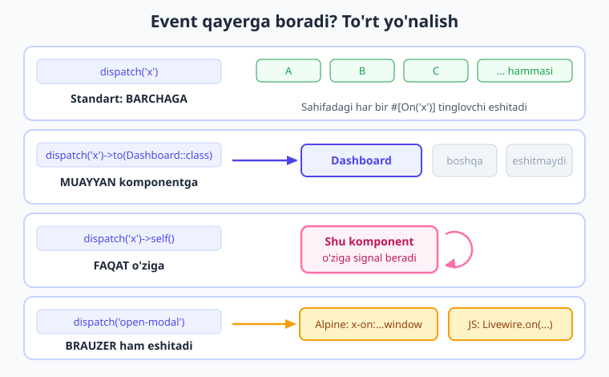

# 18 — Events: hodisalar bilan aloqa

[⬅️ Oldingi: 17 — Nested komponentlar](./17-nested-komponentlar.md) · [🏠 Kitob boshi](./README.md) · [Keyingi: 19 — URL va query string ➡️](./19-url-query-string.md)

> **Bu bobda:** bir-birini umuman "tanimaydigan" ikki komponent qanday qilib gaplashishini o'rganamiz. Masalan, `TaskForm` yangi vazifa qo'shadi — yonidagi `TaskList` esa darhol yangilanishi kerak. Buni **event** (hodisa) mexanizmi hal qiladi: bitta komponent xabar **tarqatadi** (`$this->dispatch(...)`), boshqalari uni **eshitadi** (`#[On(...)]`). Yuborish, tinglash, dinamik nom, yo'naltirish (`->to()`, `->self()`), brauzer/Alpine bilan aloqa, va uchta tayyor amaliy naqsh — hammasi shu bobda.

---

## Muammo: komponentlar bir-birini bilmaydi

Tasavvur qiling, sahifangizda ikkita mustaqil komponent bor:

- **`TaskForm`** — yangi vazifa qo'shish formasi.
- **`TaskList`** — mavjud vazifalar ro'yxati.

Foydalanuvchi formaga "Sut sotib olish" deb yozib "Qo'shish" tugmasini bosadi. `TaskForm` vazifani saqlaydi. Lekin yonidagi `TaskList` bu haqda hech narsa bilmaydi — u eski ro'yxatni ko'rsatib turaveradi. Yangi vazifa ekranda paydo bo'lmaydi. Foydalanuvchi sahifani qo'lda yangilamaguncha (F5) o'zgarishni ko'rmaydi. Bu yomon tajriba.

Muammoning ildizi shunda: **`TaskForm` va `TaskList` — bir-biridan mustaqil komponentlar.** Biri ikkinchisining ichida emas (u holda `$parent` bilan gaplashardik — [17-bob](./17-nested-komponentlar.md)). Ular yonma-yon turibdi, va biri ikkinchisining metodlarini to'g'ridan-to'g'ri chaqira olmaydi. Qanday qilib forma ro'yxatga "Hoy, yangi vazifa qo'shildi, yangilan!" deb ayta oladi?

> **Hayotiy o'xshatish — radio e'lon.** Aeroportni tasavvur qiling. Dispetcher mikrofonga gapiradi: "Toshkent reysiga chiqish boshlandi!" Dispetcher kim eshitayotganini **bilmaydi** — zalda 5 kishi ham, 500 kishi ham bo'lishi mumkin. Reysga chiqayotgan yo'lovchilar e'lonni eshitib o'rnidan turadi; qolganlari e'tibor bermaydi. Hech kim bir-biriga to'g'ridan-to'g'ri murojaat qilmadi. **Event ham aynan shunday:** bir komponent xabarni "efirga" chiqaradi, kim qiziqsa — eshitadi va javob qiladi. Yuboruvchi tinglovchilarni tanimaydi, tinglovchilar yuboruvchini tanimasligi mumkin.

Texnik ta'rif bilan: **event (hodisa) — bu nomli xabarni butun sahifaga tarqatish.** Yuboruvchi komponent uni `dispatch` qiladi (efirga chiqaradi), o'sha nomni tinglayotgan istalgan komponent javob beradi. Bu **bo'shashgan bog'lanish** (loose coupling) deyiladi — ya'ni komponentlar bir-biriga mahkam bog'lanmagan. `TaskForm` `TaskList` haqida hech nima bilmaydi; u faqat `'task-created'` degan xabarni e'lon qiladi. Ertaga yana uchta komponent (statistika, bildirishnoma, kalendar) shu xabarni tinglashga qaror qilsa — `TaskForm` ga **bironta ham** o'zgartirish kiritish shart emas.

![Event tarqalishi: bitta komponent dispatch qiladi va bir nechta tinglovchi komponent #[On] orqali bir vaqtda eshitadi](rasmlar/lw18-event-tarqalishi.svg)

> **Eslab qoling:** event — bu "qo'ng'iroq". Bir joyda bosiladi, boshqa joy(lar)da jiringlaydi. Yuboruvchi bilan tinglovchi bir-biridan **xabarsiz** — ularni faqat xabar **nomi** (`'task-created'`) bog'laydi.

---

## Yuborish: `$this->dispatch(...)`

Event yuborish uchun komponent ichidagi `public` metodda `$this->dispatch('nom')` ni chaqiramiz. Nom — bizning xabarimizning "kanali", istalgan satr (string) bo'lishi mumkin:

```php
{{-- resources/views/components/⚡task-form.blade.php --}}
<?php

use Livewire\Component;

new class extends Component
{
    public string $title = '';

    public function save(): void
    {
        // (haqiqiy loyihada bu yerda Task::create([...]) bo'lardi)

        $this->dispatch('task-created');   // xabarni efirga chiqaramiz
        $this->title = '';                 // formani tozalaymiz
    }
};
?>

<div>
    <form wire:submit="save">
        <input type="text" wire:model="title" placeholder="Yangi vazifa...">
        <button type="submit">Qo'shish</button>
    </form>
</div>
```

Bu yerda foydalanuvchi formani yuborganda `save` ishlaydi, vazifa saqlanadi, so'ng `$this->dispatch('task-created')` butun sahifaga "yangi vazifa qo'shildi!" degan xabarni tarqatadi. Forma kim eshitishini bilmaydi — bu uning ishi emas.

### Parametr bilan yuborish

Ko'pincha xabar bilan birga **ma'lumot** ham uzatish kerak — masalan, qaysi vazifa qo'shilganini. Buning uchun **nomli argument** (named argument) ishlatamiz:

```php
public function save(): void
{
    $this->dispatch('task-created', title: $this->title);   // nomli parametr
    $this->title = '';
}
```

Endi xabar bilan birga `title` qiymati ham boradi. Bir nechta parametr uzatish ham mumkin:

```php
$this->dispatch('post-created', id: $post->id, title: $post->title);
```

!!! tip "Maslahat — nomli argument ishlating"
    Livewire 4 da event parametrlarini **nomli argument** (`title: $value`) bilan uzatish tavsiya etiladi. Shunda tinglovchi metod parametrlarni **nom bo'yicha** oladi — tartibga bog'liq bo'lmaydi. Bu kodni o'qishni ham osonlashtiradi: `dispatch('post-created', id: 5)` o'qiganda `5` nima ekani darrov tushunarli.

---

## Tinglash: `#[On(...)]` atributi

Endi `TaskList` xabarni eshitishi kerak. Buning uchun **`#[On('event-nomi')]`** atributini istalgan `public` metod ustiga qo'yamiz. Avval `On` atributini import qilamiz:

```php
{{-- resources/views/components/⚡task-list.blade.php --}}
<?php

use Livewire\Component;
use Livewire\Attributes\On;     // On atributini import qilamiz

new class extends Component
{
    public array $tasks = [];

    #[On('task-created')]                      // shu nomli eventni tinglaymiz
    public function addTask(string $title): void
    {
        $this->tasks[] = $title;              // ro'yxatga yangi vazifani qo'shamiz
    }
};
?>

<div>
    <h2>Vazifalar</h2>
    <ul>
        @foreach ($tasks as $t)
            <li wire:key="task-{{ $loop->index }}">{{ $t }}</li>
        @endforeach
    </ul>
</div>
```

Mana butun sehr shu yerda. `TaskForm` `'task-created'` ni efirga chiqarganda, Livewire `#[On('task-created')]` atributiga ega bo'lgan **barcha** metodlarni topadi va ularni ishga soladi. `addTask` chaqiriladi, `$title` parametri eventdan keladi (nomli argument tufayli — `title:` nomi metoddagi `$title` ga mos), ro'yxatga yangi vazifa qo'shiladi va `TaskList` qayta render bo'ladi. Foydalanuvchi formani yuborishi bilanoq yangi vazifa ro'yxatda **darhol** paydo bo'ladi.

!!! note "Eslatma — metod nomi ixtiyoriy"
    Tinglovchi metodning nomi **istalgancha** bo'lishi mumkin — `addTask`, `refresh`, `qoshildi`, farqi yo'q. Livewire metodni nomiga qarab emas, ustidagi `#[On('...')]` atributiga qarab topadi. Atributdagi **event nomi** (`'task-created'`) yuborilgan nom bilan **aynan** mos kelishi shart.

> **Tasdiqlangan.** Bu naqsh jonli **Laravel 12 + Livewire v4.3.1** loyihada ishlab tekshirildi. `Livewire::test('task-form')->set('title', 'Sut sotib olish')->call('save')->assertDispatched('task-created', title: 'Sut sotib olish')` — o'tdi; `Livewire::test('task-list')->call('addTask', 'Non olish')->assertSee('Non olish')` — o'tdi.

### Parametrsiz tinglash: shunchaki yangilash

Ba'zan tinglovchiga ma'lumot kerak emas — u shunchaki "biror narsa o'zgardi, men o'zimni yangilab olay" deydi. Masalan, `TaskList` ma'lumotni har safar bazadan o'qisa, unga parametr kerak emas:

```php
use Livewire\Attributes\On;
use Livewire\Attributes\Computed;

#[Computed]
public function tasks()
{
    return \App\Models\Task::latest()->get();   // har render'da bazadan
}

#[On('task-created')]
public function refresh(): void
{
    unset($this->tasks);   // computed keshni tozalaymiz -> qayta o'qiladi
}
```

Bu yerda `refresh` parametrsiz. U faqat computed property keshini tozalaydi ([15 — Computed properties](./15-computed-properties.md)), shunda komponent qayta render bo'lganda ro'yxatni bazadan yangidan o'qiydi. Aslida metod tanasi bo'sh bo'lsa ham bo'ladi — Livewire eventni qabul qilgani uchun komponent baribir qayta render bo'ladi.

---

## Dinamik event nomi: muayyan ID uchun

Ba'zan biz **aniq bir** narsaga oid eventni tinglashni xohlaymiz. Masalan, sahifada ko'plab post kartochkalari bor, har biri alohida komponent. `post-updated` eventi kelganda **faqat o'sha postga tegishli** kartochka yangilanishi kerak, qolganlari emas.

Buning uchun `#[On]` ichida **jingalak qavs** bilan property qiymatini joylashtiramiz:

```php
new class extends Component
{
    public Post $post;

    // faqat shu komponentning post.id siga mos eventni tinglaymiz
    #[On('post-updated.{post.id}')]
    public function refresh(): void
    {
        $this->post->refresh();   // shu postni bazadan qayta o'qiymiz
    }
};
```

`{post.id}` — bu komponentning `$post->id` qiymatiga almashadi. Agar bu kartochka `post.id = 42` bo'lsa, atribut aslida `#[On('post-updated.42')]` ga aylanadi. Endi yuboruvchi:

```php
$this->dispatch('post-updated.' . $post->id);   // masalan 'post-updated.42'
```

deb yuborganda, **faqat** `id = 42` bo'lgan kartochka eshitadi. Boshqa postlar bu xabarga befarq qoladi. Bu juda foydali — keraksiz qayta render'lardan qutqaradi.

!!! tip "Maslahat — nuqta bilan ajrating"
    Dinamik qism `event-nomi.{property}` ko'rinishida — nom va dinamik qism orasida **nuqta**. Property nomi ichma-ich bo'lsa, nuqta bilan kirib boring: `{post.id}`, `{user.team.id}`.

---

## Yo'naltirish: event qayerga boradi?

Standart holatda `dispatch('x')` eventni **butun sahifadagi barcha** tinglovchilarga yuboradi. Lekin ba'zan biz yo'nalishni aniq nazorat qilmoqchimiz. Livewire `dispatch(...)` dan keyin zanjir (chain) metodlari beradi:



### Standart: barchaga

```php
$this->dispatch('task-created');   // sahifadagi HAR BIR tinglovchiga boradi
```

Bu eng ko'p ishlatiladigan variant. Bir nechta komponent bir xabarni tinglashi mumkin — masalan `task-created` ni ham `TaskList`, ham `TaskCounter`, ham `ActivityFeed` eshitadi.

### `->to(Class)` — muayyan komponentga

Faqat bitta aniq komponent turiga yuborish uchun:

```php
use App\Livewire\Dashboard;

$this->dispatch('refresh-stats')->to(Dashboard::class);
```

Bu yerda `refresh-stats` faqat `Dashboard` komponentiga boradi, boshqa hech kimga emas. Komponentni nomi bilan ham ko'rsatish mumkin: `->to('dashboard')`.

### `->self()` — faqat o'ziga

Eventni faqat **o'sha komponentning o'ziga** yuboradi (tashqi komponentlarga emas):

```php
$this->dispatch('reset-form')->self();
```

Bu kamroq kerak bo'ladi, lekin masalan ichki holatlarni boshqarishda foydali — komponent o'ziga "o'zingni tikla" deb signal yuboradi.

> **Hayotiy o'xshatish — yo'naltirish.** Standart `dispatch` — bu butun binoga e'lon (hammaga). `->to(Dashboard::class)` — bu aniq bir xonaga (faqat 305-xona) qo'ng'iroq. `->self()` — bu o'zingga eslatma yozib qoldirish (faqat o'zing uchun). Ko'pincha eng oddiy "hammaga e'lon" yetarli; aniq manzil kerak bo'lgandagina `->to()` yoki `->self()` ishlating.

!!! warning "Ehtiyot bo'ling — ortiqcha yo'naltirmang"
    Boshida `->to()` va `->self()` bilan o'ralashib ketmang. Aksariyat holatda oddiy `dispatch('x')` (barchaga) to'g'ri ishlaydi va kodi ham toza. Yo'naltirishni faqat **rostdan kerak bo'lganda** — masalan bir xil event nomini bir nechta joyda ishlatib, ularning chalkashib ketishini oldini olish uchun — qo'shing.

---

## Brauzer va Alpine event'ni eshitishi

Eng qiziq tomoni: event'ni faqat boshqa Livewire komponentlari emas, **brauzer (JavaScript / Alpine.js) ham** eshitishi mumkin. Bu modal oynalar, toast bildirishnomalar, animatsiyalar uchun juda qo'l keladi.

`$this->dispatch('open-modal')` chaqirilganda, Livewire bu eventni brauzer `window` obyektiga ham yuboradi. Endi uni ikki usulda tutib olamiz.

**1-usul — Alpine bilan** (`x-on:...window`):

```blade
{{-- Server eventini Alpine eshitadi --}}
<div x-data="{ open: false }" x-on:open-modal.window="open = true">
    <div x-show="open" class="modal">
        <p>Modal ochildi!</p>
        <button x-on:click="open = false">Yopish</button>
    </div>
</div>
```

Bu yerda `x-on:open-modal.window` — Alpine `window` da `open-modal` eventini kutadi. Server `$this->dispatch('open-modal')` qilishi bilan `open = true` bo'ladi va modal ochiladi. `.window` qo'shimchasi muhim: event `window` darajasida tarqaladi.

**2-usul — sof JavaScript bilan** (`Livewire.on`):

```html
<script>
    Livewire.on('open-modal', (event) => {
        console.log('Modal ochilsin!', event);
        // bu yerda istalgan JS: kutubxona modali, animatsiya va h.k.
    });
</script>
```

Alpine va `$wire` bilan to'liq integratsiyani [22 — Alpine.js bilan integratsiya](./22-alpine-js.md) bobida chuqur o'rganamiz. Hozircha eslab qoling: **server event yuborsa, brauzer ham eshitadi.**

### JavaScript'dan event yuborish

Yo'l teskari tomonga ham ishlaydi — brauzerdagi JavaScript ham event yuborib, Livewire komponentlarini "uyg'ota" oladi:

```html
<script>
    // brauzerdan Livewire komponentlariga event yuborish
    Livewire.dispatch('task-created', { title: 'JS dan kelgan vazifa' });
</script>
```

Bu yerda `Livewire.dispatch(...)` xuddi server `$this->dispatch(...)` kabi ishlaydi — `#[On('task-created')]` tinglovchilar uni eshitadi. Parametrlar JS obyekti (`{ title: ... }`) sifatida uzatiladi.

---

## Uchta amaliy naqsh

Endi eng muhim qismi — event'lar real loyihada qanday ishlatiladi. Mana eng ko'p uchraydigan uchta naqsh.

### Naqsh 1: Saqlangach ro'yxatni yangilash (TaskForm → TaskList)

Bu bobning bosh muammosi. Forma vazifa qo'shadi, ro'yxat darhol yangilanadi. Ikki komponent, bitta event.

![Amaliy naqsh: TaskForm save metodida dispatch('task-created') qiladi, TaskList esa #[On('task-created')] orqali eshitib refresh bo'ladi](rasmlar/lw18-event-naqsh.svg)

```php
{{-- resources/views/components/⚡task-form.blade.php --}}
<?php

use Livewire\Component;

new class extends Component
{
    public string $title = '';

    public function save(): void
    {
        // \App\Models\Task::create(['title' => $this->title]);  // haqiqiy saqlash

        $this->dispatch('task-created', title: $this->title);
        $this->title = '';
    }
};
?>

<div>
    <form wire:submit="save">
        <input type="text" wire:model="title" placeholder="Yangi vazifa...">
        <button type="submit">Qo'shish</button>
    </form>
</div>
```

```php
{{-- resources/views/components/⚡task-list.blade.php --}}
<?php

use Livewire\Component;
use Livewire\Attributes\On;

new class extends Component
{
    public array $tasks = [];

    #[On('task-created')]
    public function addTask(string $title): void
    {
        $this->tasks[] = $title;
    }
};
?>

<div>
    <h2>Vazifalar ro'yxati</h2>
    <ul>
        @forelse ($tasks as $i => $t)
            <li wire:key="task-{{ $i }}">{{ $t }}</li>
        @empty
            <li>Hali vazifa yo'q.</li>
        @endforelse
    </ul>
</div>
```

Ikkala komponentni bir sahifaga yonma-yon qo'yamiz:

```blade
{{-- resources/views/dashboard.blade.php yoki istalgan sahifa --}}
<div class="grid">
    <livewire:task-form />
    <livewire:task-list />
</div>
```

Tamom. Forma "Qo'shish" ni bosganda `task-created` efirga chiqadi, `TaskList` eshitadi va ro'yxat yangilanadi — sahifa qayta yuklanmaydi.

### Naqsh 2: Modal ochish/yopish event bilan

Modal oynani ochishni boshqa komponent boshlashi mumkin. Masalan "Tahrirlash" tugmasi bir komponentda, modal esa alohida komponent.

```php
{{-- Tugma bosilganda modal ochilishini so'raymiz --}}
<?php

use Livewire\Component;

new class extends Component
{
    public function edit(int $id): void
    {
        // modalga qaysi yozuvni tahrirlashni aytamiz
        $this->dispatch('open-edit-modal', postId: $id);
    }
};
?>

<div>
    <button wire:click="edit(42)">Tahrirlash</button>
</div>
```

```php
{{-- Modal komponenti eventni eshitib ochiladi --}}
<?php

use Livewire\Component;
use Livewire\Attributes\On;

new class extends Component
{
    public bool $show = false;
    public ?int $postId = null;

    #[On('open-edit-modal')]
    public function open(int $postId): void
    {
        $this->postId = $postId;
        $this->show = true;
    }

    public function close(): void
    {
        $this->show = false;
    }
};
?>

<div>
    @if ($show)
        <div class="modal-overlay" wire:click.self="close">
            <div class="modal">
                <p>#{{ $postId }} yozuvni tahrirlash</p>
                <button wire:click="close">Yopish</button>
            </div>
        </div>
    @endif
</div>
```

Modalni Alpine bilan (server so'rovisiz, tezroq) ochish ham mumkin — `x-on:open-edit-modal.window="..."` ([22-bob](./22-alpine-js.md)).

### Naqsh 3: Toast / bildirishnoma

Har qanday joyda biror amal muvaffaqiyatli bo'lganda "Saqlandi!" degan kichik bildirishnoma (toast) ko'rsatish — klassik naqsh. Buning uchun bitta global "notify" komponenti event tinglaydi:

```php
{{-- Istalgan komponentda amal muvaffaqiyatli bo'lganda --}}
public function save(): void
{
    // ... saqlash ...
    $this->dispatch('notify', message: 'Muvaffaqiyatli saqlandi!', type: 'success');
}
```

```php
{{-- resources/views/components/⚡toast.blade.php — global bildirishnoma --}}
<?php

use Livewire\Component;
use Livewire\Attributes\On;

new class extends Component
{
    public string $message = '';
    public string $type = 'info';
    public bool $visible = false;

    #[On('notify')]
    public function show(string $message, string $type = 'info'): void
    {
        $this->message = $message;
        $this->type = $type;
        $this->visible = true;
    }
};
?>

<div>
    @if ($visible)
        <div class="toast toast-{{ $type }}" wire:click="$set('visible', false)">
            {{ $message }}
        </div>
    @endif
</div>
```

Bu `toast` komponentini sahifa layoutiga **bir marta** qo'yasiz, va butun ilovangizdagi istalgan komponent `dispatch('notify', message: ...)` qilishi bilan bildirishnoma chiqadi. Mana bo'shashgan bog'lanishning go'zalligi: `toast` kim xabar yuborganini bilmaydi, yuboruvchilar `toast` borligini bilmasligi ham mumkin.

!!! tip "Maslahat — toast'ni avtomatik yopish"
    Toast'ni bir necha soniyadan keyin avtomatik yo'qotish uchun Alpine ishlatish qulay: `x-data x-init="setTimeout(() => $wire.set('visible', false), 3000)"`. Bunday "vaqtga bog'liq" UI mantig'i serverga emas, brauzerga (Alpine) yarashadi — [22-bob](./22-alpine-js.md).

---

## Event vs to'g'ridan-to'g'ri aloqa: qaysi birini tanlash?

Komponentlar orasida ma'lumot uzatishning bir necha yo'li bor. Qaysi birini qachon ishlatishni bilish muhim:

| Holat | Eng yaxshi yondashuv |
|---|---|
| **Ota → bola** ma'lumot berish | **Props** (atribut sifatida): `<livewire:child :post="$post" />` ([17-bob](./17-nested-komponentlar.md)) |
| **Bola → ota** ga signal | `$parent.metod()` yoki **event** |
| **Mustaqil komponentlar** (yonma-yon, bir-birini bilmaydi) | **Event** (`dispatch` / `#[On]`) |
| **Serverdan brauzer/JS** ga signal | **Event** (`dispatch` → `Livewire.on` / Alpine) |
| **Bir nechta komponent** bir o'zgarishga reaksiya bersin | **Event** (bittasi yuboradi, ko'pi eshitadi) |

> **Hayotiy o'xshatish — props vs event.** **Props** — bu ota o'z bolasiga tushlik beradi: aniq, ma'lum manzilga, "mana senga". **Event** — bu radio e'lon: kim eshitsa, o'sha javob beradi. Ota-bola munosabati aniq bo'lsa — props; komponentlar bir-biridan mustaqil bo'lsa va kim eshitishi noma'lum bo'lsa — event.

**Oddiy qoida:**

- Ikki komponent **ota-bola** munosabatida va ma'lumot **pastga** (otadan bolaga) oqsa — **props**.
- Komponentlar **mustaqil** (biri ikkinchisining ichida emas), yoki kim eshitishini aniq bilmasangiz, yoki bir nechta tinglovchi bo'lsa — **event**.

!!! warning "Ehtiyot bo'ling — event'dan suiiste'mol qilmang"
    Event qulay, lekin hamma narsa uchun event ishlatish kodni **kuzatib bo'lmas** holga keltiradi: "bu event qayerdan keldi? kim eshityapti?" degan savol qiyinlashadi. Ota-bola aloqasini props/`$parent` bilan hal qiling; event'ni faqat mustaqil komponentlar gaplashganda ishlating.

---

## Event nomlash: aniq va izchil bo'lsin

Event nomi — bu yuboruvchi va tinglovchini bog'lovchi yagona ip. Agar nom bir joyda `taskCreated`, boshqa joyda `task-created` deb yozilsa — ular **bir-birini topa olmaydi** va hech qanday xato ham chiqmaydi (jim qoladi). Bu juda chalkash xatolardan biri.

!!! tip "Maslahat — event nomlash qoidalari"
    - **Kichik harf va chiziqcha (kebab-case):** `post-created`, `task-deleted`, `modal-closed`. (Livewire JS event sifatida ham yuboradi, shuning uchun kebab-case eng xavfsiz.)
    - **Fe'l + holat:** odatda `narsa-harakat` shaklida — `post-created`, `user-updated`, `cart-cleared`. O'tgan zamon ("created", "deleted") ishlatish odat tusiga kirgan, chunki event "bo'lib o'tgan ish" haqida xabar beradi.
    - **Izchil bo'ling:** loyiha bo'ylab bitta uslubni saqlang. Bir joyda `post-created`, boshqa joyda `postCreated` (camelCase) yozmang — ular bir-biriga mos kelmaydi.
    - **Maxsus bo'lsin:** `refresh` o'rniga `task-list-refresh` — boshqa komponentning `refresh` eventi bilan to'qnashmasligi uchun.

---

## Testlash: event yuborilganini tekshirish

Event mexanizmini Livewire test API bilan oson tekshirish mumkin. Bu juda muhim — chunki event "ko'rinmas" aloqa, va test uni ishonchli qiladi:

```php
use Livewire\Livewire;

// 1) Forma to'g'ri event yuborganini tekshirish
Livewire::test('task-form')
    ->set('title', 'Sut sotib olish')
    ->call('save')
    ->assertDispatched('task-created', title: 'Sut sotib olish')   // event yuborildimi?
    ->assertSet('title', '');                                       // forma tozalandimi?

// 2) Ro'yxat eventni eshitib ro'yxatga qo'shganini tekshirish
Livewire::test('task-list')
    ->call('addTask', 'Non olish')
    ->assertSee('Non olish');
```

`assertDispatched('task-created', title: ...)` — komponent shu nomli (va shu parametrli) eventni yuborganini tasdiqlaydi. Yuborilmasligini tekshirish uchun `assertNotDispatched('task-created')`. To'liq testlash mavzusi — [24 — Testing](./24-testing.md) bobida.

> **Tasdiqlangan.** Yuqoridagi ikkala test jonli Livewire v4.3.1 loyihada **o'tdi** (2 ta test, 3 ta assertion).

---

## Xulosa

- **Event — mustaqil komponentlar gaplashish usuli.** Radio e'lon kabi: biri yuboradi (`dispatch`), kim eshitsa (`#[On]`) — o'sha javob beradi. Bu **bo'shashgan bog'lanish** (loose coupling).
- **Yuborish:** `$this->dispatch('post-created')`, parametr bilan **nomli argument**: `$this->dispatch('post-created', id: $post->id)`.
- **Tinglash:** `use Livewire\Attributes\On;` + `#[On('post-created')] public function refresh($id) { ... }`. Metod nomi ixtiyoriy, **event nomi** mos kelishi shart.
- **Dinamik nom:** `#[On('post-updated.{post.id}')]` — faqat muayyan ID uchun; keraksiz qayta render'larni oldini oladi.
- **Yo'naltirish:** standart — barchaga; `->to(Dashboard::class)` — muayyan komponentga; `->self()` — faqat o'ziga.
- **Brauzer/Alpine ham eshitadi:** `$this->dispatch('open-modal')` → Alpine `x-on:open-modal.window="..."` yoki JS `Livewire.on('open-modal', ...)`. JS'dan yuborish: `Livewire.dispatch('post-created', {...})` ([22-bob](./22-alpine-js.md)).
- **Uchta naqsh:** (1) saqlangach ro'yxat yangilash, (2) modal ochish/yopish, (3) toast/notify bildirishnoma.
- **Event vs props:** ota→bola ma'lumot uchun **props** ([17-bob](./17-nested-komponentlar.md)); mustaqil komponentlar uchun **event**. Hamma narsa uchun event ishlatib yubormang.
- **Nomlash:** kebab-case, aniq va izchil (`post-created`, `task-deleted`). Bir-biriga mos kelmagan nom — jim qoladigan eng chalkash xato.

## Amaliy mashqlar

1. **Forma → ro'yxat yangilash (oson).** `MessageForm` (matn maydoni + "Yuborish" tugmasi) va `MessageList` (xabarlar ro'yxati) komponentlarini yarating. Forma yuborilganda `dispatch('message-sent', text: ...)` qiling, ro'yxat esa `#[On('message-sent')]` bilan eshitib yangi xabarni qo'shsin. Ikkalasini bir sahifaga yonma-yon qo'ying va yuborilgan xabar ro'yxatda darhol paydo bo'lishini kuzating. *Yo'naltirish:* `wire:key` ni unutmang.

2. **Toast bildirishnoma (oson–o'rta).** Global `Toast` komponentini yarating: u `#[On('notify')]` bilan `message` va `type` parametrlarini eshitadi va matnni ko'rsatadi. Keyin 1-mashqdagi formaga `dispatch('notify', message: 'Yuborildi!', type: 'success')` qo'shing. Forma yuborilganda ham ro'yxat yangilansin, **ham** toast chiqsin (bir event ikki tinglovchiga emas — ikkita alohida event). *Yo'naltirish:* `Toast` ni sahifaga bir marta qo'ying.

3. **Modal event bilan (o'rta).** "Tahrirlash" tugmasi bo'lgan komponent va alohida `EditModal` komponentini yarating. Tugma bosilganda `dispatch('open-edit-modal', postId: $id)` qiling. Modal `#[On('open-edit-modal')]` bilan eshitib, `$show = true` va `$postId` ni o'rnatsin. Modal ichida `wire:click.self="close"` bilan fon bosilganda yopilishini qo'shing. *Yo'naltirish:* `close()` da `$show = false`.

4. **Dinamik event (o'rta–qiyin).** Postlar ro'yxatini ko'rsating, har bir post — alohida `PostCard` komponenti (`:post` props bilan). `PostCard` da `#[On('post-updated.{post.id}')]` bilan **faqat o'z postiga** oid yangilanishni tinglang. Boshqa joydan `dispatch('post-updated.' . $id)` yuborilganda **faqat o'sha** kartochka yangilanishini tekshiring (qolganlari yangilanmasin). *Yo'naltirish:* `wire:key` har kartochkada noyob bo'lsin; jingalak qavs sintaksisini diqqat bilan yozing.

5. **Test bilan tasdiqlash (qiyin — fikrlash uchun).** 1-mashqdagi `MessageForm` uchun Livewire test yozing: `set('text', '...')->call('save')->assertDispatched('message-sent', text: '...')`. Keyin o'ylab ko'ring: nega event'ni shunday testlash, uni "ko'z bilan ko'rish" dan ishonchliroq? Agar kelajakda event nomini `message-sent` dan `message-created` ga o'zgartirsangiz, qaysi testlar buni darhol ushlab oladi? (Maslahat: event nomlash bo'limini va testlash bo'limini qayta o'qing.)

---

[⬅️ Oldingi: 17 — Nested komponentlar](./17-nested-komponentlar.md) · [🏠 Kitob boshi](./README.md) · [Keyingi: 19 — URL va query string ➡️](./19-url-query-string.md)
