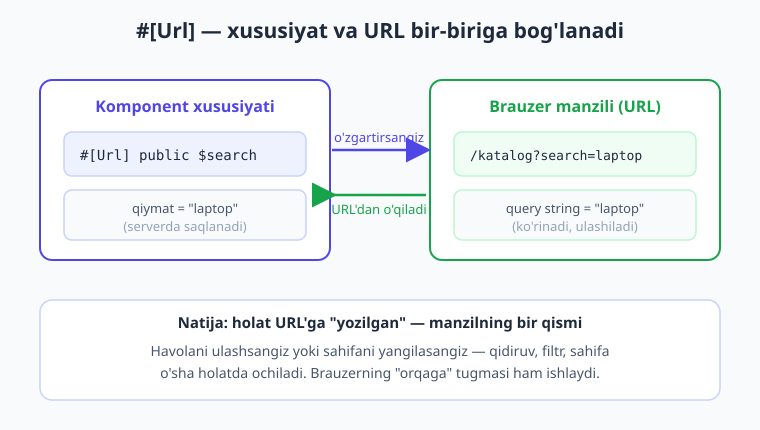
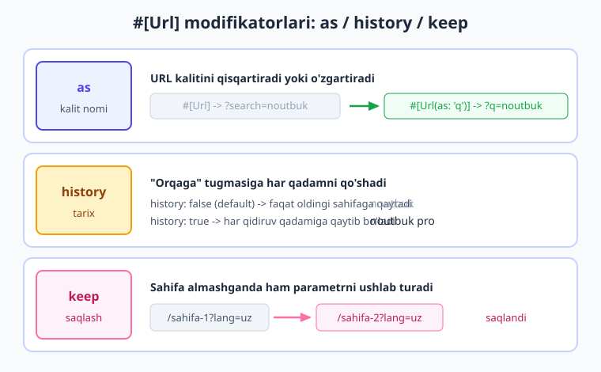
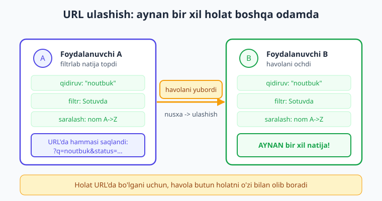

# 19 — URL va query string

[⬅️ Oldingi: 18 — Events](./18-events.md) · [🏠 Kitob boshi](./README.md) · [Keyingi: 20 — Loading holatlari ➡️](./20-loading-holatlar.md)

> **Bu bobda:** komponent holati (qidiruv, filtr, sahifa raqami) sahifa yangilanganda yoki havola ulashilganda nega "yo'qolib" qolishini va buning yechimi — `#[Url]` atributi ekanligini o'rganamiz. Xususiyatni URL query string bilan ikki tomonlama bog'lashni; `as`, `history`, `keep`, `except` modifikatorlarini; default qiymat nega URL'da ko'rinmasligini; qidiruv/filtr/saralashni birga URL'ga chiqarishni; SEO/UX foydasini va URL'dan keladigan qiymatni xavfsiz ishlatishni amalda ko'ramiz. Oxirida barcha filtri URL'da saqlanadigan to'liq katalog yasaymiz.

---

## Muammo: "adresi yo'q manzil"

Tasavvur qiling, do'kon saytida ajoyib mahsulot topdingiz. Uzoq qidirdingiz: "noutbuk" deb yozdingiz, "16GB" filtrini tanladingiz, narx bo'yicha saraladingiz, 3-sahifaga o'tdingiz — va nihoyat kerakli mahsulotni ko'rdingiz. Endi shu sahifa havolasini do'stingizga yubormoqchisiz. Manzil satridagi havolani nusxalab tashlaysiz.

Do'stingiz havolani ochadi — va... do'konning **bosh sahifasini** ko'radi. Hech qanday qidiruv yo'q, filtr yo'q, 3-sahifa yo'q. Sizning butun mehnatingiz yo'qoldi. Do'stingiz hammasini boshidan qidirishga majbur.

Yoki yana bir holat: siz o'sha sahifani tashlab, boshqa narsaga chalg'idingiz, keyin brauzerni **yangiladingiz** (F5). Yana hammasi nolga qaytdi. Yoki "orqaga" tugmasini bosdingiz — kutgan joyingizga emas, butunlay boshqa joyga tushib qoldingiz.

> **Hayotiy o'xshatish — adresi yo'q manzil.** Siz do'stingizni mehmonga chaqirmoqchisiz. Lekin uyingizning **manzili yo'q** — ko'cha nomi ham, uy raqami ham. "Kelaver, men shu yerdaman" deysiz. Do'stingiz qanday topadi? Hech qanday. U sizning oldingizga kela olmaydi, chunki **aytib bo'ladigan manzil yo'q**. Veb-sahifa ham xuddi shunday: agar qidiruv va filtr holati URL'da bo'lmasa, o'sha holatning **manzili yo'q** — uni hech kimga ko'rsatib, ulashib bo'lmaydi, hatto o'zingiz ham keyin qaytib kela olmaysiz.

Muammoning ildizi shunda: [14-bobda](./14-pagination-qidiruv.md) yasagan qidiruv-filtr-sahifalash komponenti holatni faqat **server xotirasida** (Livewire komponent holatida) saqlaydi. Bu holat **URL'da emas**. URL esa o'zgarmay turaveradi — masalan `/mahsulotlar`. Manzil satriga qaramaysizmi, qarayapsizmi — u bir xil. Demak:

- Havolani ulashsangiz — qabul qiluvchi faqat bo'sh `/mahsulotlar` ni ochadi.
- Sahifani yangilasangiz (F5) — holat yo'qoladi.
- "Orqaga"/"oldinga" tugmasi to'g'ri ishlamaydi.
- Sahifani xatcho'pga (bookmark) qo'shsangiz — keyin ochganingizda holat yo'q.

Holat bor, lekin uning **manzili** yo'q. Mana shuni hal qilamiz.

---

## Yechim: `#[Url]` atributi

Livewire bu muammoni bitta atribut bilan hal qiladi — **`#[Url]`**. Uni public xususiyat ustiga qo'yganingizda, Livewire o'sha xususiyatni **URL query string** bilan **ikki tomonlama** bog'laydi:

- Xususiyat **o'zgarsa** — URL avtomatik yangilanadi (`?search=noutbuk`).
- Sahifa **shu URL bilan ochilsa** — xususiyat o'sha qiymatdan boshlanadi.

Avval atributni import qilamiz, keyin xususiyat ustiga qo'yamiz:

```php
{{-- resources/views/components/⚡search.blade.php --}}
<?php

use Livewire\Component;
use Livewire\Attributes\Url;   // Url atributini import qilamiz

new class extends Component
{
    #[Url]                       // bu xususiyatni URL bilan bog'laymiz
    public $search = '';

    public function render()
    {
        return $this->view();
    }
};
?>

<div>
    <input type="text" wire:model.live="search" placeholder="Qidirish...">
    <p>Siz qidirayapsiz: {{ $search }}</p>
</div>
```

Endi foydalanuvchi inputga "noutbuk" deb yozsa, brauzer manzil satri avtomatik shunday bo'ladi:

```text
/search?search=noutbuk
```

Va aksincha — kimdir `/search?search=noutbuk` havolasini ochsa, `$search` xususiyati darrov `'noutbuk'` qiymatiga ega bo'ladi va natija ko'rsatiladi. Hech qanday qo'shimcha kod yozmaysiz — atributning o'zi yetarli.



> **Tasdiqlangan.** Bu naqsh jonli **Laravel 12 + Livewire v4.3.1** loyihada ishlab tekshirildi: `#[Url]` xususiyatli komponent `/url-test?search=laravel` bilan ochilganda sahifa **HTTP 200** qaytardi va `$search` xususiyati `'laravel'` qiymatidan boshlandi (render natijasida `search=laravel` ko'rindi).

!!! info "Livewire 3 da qanday edi?"
    Livewire 3 da ham `#[Url]` atributi bor edi va deyarli bir xil ishlaydi. Undan oldinroq (Livewire 2) esa `protected $queryString = ['search'];` degan massiv ishlatilardi. Livewire 4 da zamonaviy va tavsiya etilgan yo'l — **atribut**: `use Livewire\Attributes\Url;` + `#[Url]`. Eski kodda `$queryString` ko'rsangiz, uni atribut bilan almashtirish mumkin.

---

## To'rtta foyda: nega bu shunchalik muhim

`#[Url]` bitta kichik atribut, lekin u to'rtta katta muammoni bir vaqtda hal qiladi. Keling, har birini ko'rib chiqamiz.

**1. Ulashish (share).** Holat URL'da bo'lgani uchun, havolani nusxalab istalgan kishiga yuborishingiz mumkin. U havolani ochib **aynan siz ko'rgan** natijani ko'radi. Do'stingizga "qara, mana shu noutbuklar yaxshi ekan" deb to'g'ridan-to'g'ri filtrlangan ro'yxat havolasini yuborasiz.

**2. Brauzerning "orqaga" tugmasi.** Foydalanuvchi qidiruvni o'zgartirib turganda har bir holat URL tarixiga (history) yozilishi mumkin. Shunda "orqaga" tugmasi avvalgi qidiruvga qaytaradi — xuddi alohida sahifalar orasida yurganday. Bu juda tabiiy tuyuladi.

**3. Sahifa yangilanganda saqlash.** Foydalanuvchi F5 bossa yoki brauzerni yopib qaytib ochsa, holat URL'da bo'lgani uchun **saqlanib qoladi**. Hech narsa yo'qolmaydi.

**4. Xatcho'p (bookmark).** Foydalanuvchi yoqtirgan filtrlangan ko'rinishni xatcho'pga qo'shib qo'yishi mumkin: "arzon noutbuklar" degan xatcho'p aslida `?search=noutbuk&sortDir=asc` havolasiga ishora qiladi. Keyin bir bosishda o'sha holatga qaytadi.

> **Hayotiy o'xshatish — manzilli uy.** Endi uyingizning to'liq manzili bor: "Toshkent, Amir Temur ko'chasi, 12-uy". Do'stingizga shu manzilni berasiz — **u aniq topib keladi** (ulashish). Bir ketgan yo'lingizdan **qaytib kela olasiz** (orqaga tugmasi). Manzil **o'zgarmaydi**, ertaga ham shu yerda (yangilanishda saqlash). Va bu manzilni telefon daftaringizga **yozib qo'yasiz** (xatcho'p). `#[Url]` veb-sahifa holatiga aynan shunday "manzil" beradi.

!!! tip "Maslahat — qachon ishlatish kerak"
    Har xususiyatni URL'ga chiqarish shart emas. `#[Url]` ni faqat foydalanuvchi **ulashishi, saqlashi yoki qaytib kelishi** mantiqiy bo'lgan holatga qo'ying: qidiruv so'zi, tanlangan filtr, saralash tartibi, faol tab. Vaqtinchalik UI holatini (masalan, modal ochiq/yopiq, "yuklanyapti" bayrog'i) URL'ga chiqarmang — ular ulashishga arzimaydi va URL'ni iflos qiladi.

---

## Default qiymat URL'da KO'RINMAYDI

Bu juda muhim va chiroyli xususiyat. `#[Url]` qilingan xususiyat **default (boshlang'ich) qiymatida** bo'lsa, URL'ga **hech narsa qo'shilmaydi**. URL faqat xususiyat default'dan **farq qilganda** o'zgaradi.

Misol bilan ko'raylik. `$search = ''` (bo'sh) — bu default. Foydalanuvchi hali hech narsa yozmagan:

```text
/search                       ← toza URL, ?search= yo'q
```

Foydalanuvchi "noutbuk" deb yozdi — endi qiymat default'dan farq qiladi:

```text
/search?search=noutbuk        ← endi paydo bo'ldi
```

Foydalanuvchi qidiruvni o'chirib tashladi (yana bo'sh qildi) — qiymat yana default'ga qaytdi:

```text
/search                       ← yana toza, ?search= yo'qoldi
```

> **Hayotiy o'xshatish — faqat o'zgargani yoziladi.** Restoranda standart taom buyurtma qilsangiz, ofitsiant hech narsa yozib olmaydi — "odatdagidek" bo'ladi. Lekin "tuzsiz qiling, achchiq qo'shing" desangiz — mana endi yozib oladi, chunki bu standartdan **farqli**. URL ham shunday: default holat — "odatdagidek", yozilmaydi. Faqat o'zgartirilgan narsa URL'da paydo bo'ladi.

Bu naqadar foydali ekanini o'ylab ko'ring. Tasavvur qiling, sahifangizda 6 ta filtr bor. Agar har biri har doim URL'ga yozilsa, oddiy bosh sahifa ham shunday ko'rinardi:

```text
/mahsulotlar?search=&status=&category=&minPrice=&maxPrice=&sortBy=created_at&sortDir=desc
```

Bu dahshatli — uzun, chalkash, hech kim ulashgisi kelmaydi. Default qiymat yozilmagani uchun esa, foydalanuvchi hech narsani o'zgartirmasa, URL **toza** qoladi:

```text
/mahsulotlar
```

Va foydalanuvchi atigi bittasini o'zgartirsa, faqat **o'sha** ko'rinadi:

```text
/mahsulotlar?status=published
```

Aniq, toza, ulashishga tayyor.

!!! note "Eslatma — default qiymat qayerdan olinadi"
    Default qiymat — bu xususiyatga bergan boshlang'ich qiymatingiz: `public $search = '';` da default `''`, `public $sortDir = 'desc';` da default `'desc'`. Livewire shu boshlang'ich qiymat bilan joriy qiymatni taqqoslaydi. Teng bo'lsa — URL'ga yozmaydi; farq qilsa — yozadi.

---

## Modifikatorlar: URL'ni nozik sozlash

`#[Url]` ni to'rtta modifikator bilan moslashtirish mumkin. Ularni qavs ichida yozasiz: `#[Url(as: 'q')]`. Keling, har birini ko'rib chiqamiz.



### `as` — URL kalitining nomini o'zgartirish

Default holatda URL kaliti xususiyat nomi bilan bir xil bo'ladi: `$search` → `?search=`. Lekin ba'zan qisqaroq yoki chiroyliroq nom xohlaysiz. `as` shuni beradi:

```php
#[Url(as: 'q')]
public $search = '';
```

Endi URL `?search=` o'rniga `?q=` bo'ladi:

```text
/mahsulotlar?q=noutbuk
```

Bu qulay: `?q=` qisqaroq va Google kabi saytlarda odatiy. Xususiyat nomi (`$search`) kodda o'zgarmaydi — faqat URL'dagi ko'rinishi o'zgaradi.

> **Hayotiy o'xshatish — `as` taxallus.** Insonning rasmiy ismi "Abdusalom" bo'lishi mumkin, lekin do'stlari uni "Salom" deb chaqiradi. `as` — aynan shunday taxallus: kodda xususiyat o'z ismi (`$search`) bilan qoladi, URL'da esa qisqa taxallusi (`q`) bilan ko'rinadi.

### `history` — "orqaga" tugmasi uchun tarix

Default holatda Livewire URL'ni `replaceState` bilan yangilaydi — ya'ni joriy tarix yozuvini **almashtiradi**, yangi yozuv qo'shmaydi. Demak "orqaga" tugmasi bosilganda foydalanuvchi avvalgi qidiruv holatiga emas, balki bu sahifaga **kelishidan oldingi** sahifaga qaytadi.

`history: true` qo'ysangiz, har o'zgarish brauzer tarixiga **yangi yozuv** sifatida qo'shiladi (`pushState`). Endi "orqaga" tugmasi har bir qidiruv qadamini orqaga qaytaradi:

```php
#[Url(history: true)]
public $search = '';
```

```text
Foydalanuvchi yozdi:  noutbuk → noutbuk pro → noutbuk pro 16
"Orqaga" bosadi:      noutbuk pro 16 → noutbuk pro → noutbuk
```

> **Hayotiy o'xshatish — `history` izlar.** O'rmonda yurganingizda har qadamda iz qoldirsangiz — orqaga qaytishingiz oson, izlar bo'ylab yurasiz. `history: false` (default) — izsiz yurish: faqat boshlang'ich nuqtaga qaytasiz. `history: true` — har qadam iz qoldiradi, har qaysisiga qaytib bo'ladi.

!!! warning "Ehtiyot bo'ling — history har doim ham yaxshi emas"
    `history: true` ni o'ylab ishlating. Agar foydalanuvchi inputga har harf yozganda yangi tarix yozuvi qo'shilsa, "noutbuk" yozish 7 ta tarix yozuvini hosil qiladi — endi "orqaga" tugmasini 7 marta bosish kerak bo'ladi sahifadan chiqish uchun. Bu ba'zan asabga tegadi. `history` saralash, filtr, sahifa raqami kabi **kamroq tez-tez o'zgaradigan** holatlar uchun ko'proq mos.

### `keep` — sahifa almashganda ham saqlash

Default holatda, foydalanuvchi `wire:navigate` bilan boshqa sahifaga o'tsa ([21-bob](./21-lazy-poll-navigate.md)), URL parametri yo'qoladi. `keep: true` esa o'sha parametrni **keyingi sahifalarda ham** ushlab turadi:

```php
#[Url(keep: true)]
public $tab = 'all';
```

Bu masalan til tanlovi (`?lang=uz`) yoki ko'rinish rejimi (`?view=grid`) kabi — foydalanuvchi qaysi sahifaga o'tmasin, saqlanib qolishi kerak bo'lgan holatlar uchun foydali.

> **Hayotiy o'xshatish — `keep` ryukzak.** Xonadan xonaga o'tganingizda qo'lingizdagi narsalarni qoldirib ketasiz — bu default. Lekin ryukzakdagi narsalar siz bilan **birga yuradi**, qaysi xonaga kirmang. `keep: true` — holatni ryukzakka solib qo'yish: sahifalar almashsa ham, u siz bilan birga.

### `except` — qachon URL'dan olib tashlash

Default qoida — "default qiymat URL'da ko'rinmaydi". `except` esa **qaysi qiymatda** URL'dan olib tashlashni o'zingiz aytishingizga imkon beradi:

```php
#[Url(except: '')]
public $search = '';
```

Bu yerda `except: ''` — "qiymat bo'sh satr bo'lganda URL'ga yozma" degani. Ko'p hollarda bu default xulq bilan bir xil bo'ladi, lekin default qiymatingiz bo'sh **bo'lmaganda** kerak bo'lib qoladi. Masalan:

```php
#[Url(except: '')]
public $sortBy = 'created_at';   // default 'created_at', lekin '' bo'lsa URL'dan olib tashla
```

`except` — nozik holatlarni boshqarish uchun; boshlang'ich darajada ko'pincha kerak bo'lmaydi.

!!! note "Eslatma — modifikatorlarni birlashtirish"
    Modifikatorlarni birga ishlatish mumkin: `#[Url(as: 'q', history: true, keep: true)]`. Bu xususiyatni `?q=` kaliti bilan URL'ga chiqaradi, har o'zgarishni tarixga yozadi va sahifa almashganda saqlaydi. Faqat kerakligini qo'shing — ortiqcha modifikator URL'ni murakkablashtiradi.

> **Tasdiqlangan.** Yuqoridagi to'rtta modifikator (`as`, `history`, `keep`, `except`) jonli Livewire v4.3.1 loyihada bir komponentda birga ishlab tekshirildi: komponent muvaffaqiyatli mount bo'ldi, `as: 'q'` bilan bog'langan xususiyat to'g'ri o'rnatildi va sahifa `?q=hi` bilan ochilganda **HTTP 200** qaytarib, qiymatni to'g'ri o'qidi.

---

## Qidiruv, filtr va saralashni birga URL'ga chiqarish

Endi [14-bobdagi](./14-pagination-qidiruv.md) bilimimizni birlashtiramiz. U yerda biz qidiriladigan-filtrlanadigan-saralanadigan jadval yasagandik, lekin holatni URL'ga endi to'liq chiqaramiz. Har bir holat xususiyati ustiga `#[Url]` qo'yamiz:

```php
{{-- resources/views/components/⚡posts-table.blade.php --}}
<?php

use App\Models\Post;
use Livewire\Component;
use Livewire\WithPagination;
use Livewire\Attributes\Url;

new class extends Component
{
    use WithPagination;

    #[Url]
    public $search = '';        // ?search=...

    #[Url]
    public $status = '';        // ?status=...

    #[Url]
    public $sortBy = 'created_at';   // ?sortBy=...

    #[Url]
    public $sortDir = 'desc';        // ?sortDir=...

    public function updatingSearch()
    {
        $this->resetPage();     // qidiruv o'zgarsa -> 1-sahifaga (14-bob)
    }

    public function updatingStatus()
    {
        $this->resetPage();
    }

    public function sort($field)
    {
        if ($this->sortBy === $field) {
            $this->sortDir = $this->sortDir === 'asc' ? 'desc' : 'asc';
        } else {
            $this->sortBy = $field;
            $this->sortDir = 'asc';
        }
    }

    public function render()
    {
        $posts = Post::query()
            ->when($this->search, fn ($q) => $q->where('title', 'like', "%{$this->search}%"))
            ->when($this->status, fn ($q) => $q->where('status', $this->status))
            ->orderBy($this->sortBy, $this->sortDir)
            ->paginate(10);

        return $this->view(['posts' => $posts]);
    }
};
?>

<div>
    <input type="text" wire:model.live.debounce.300ms="search" placeholder="Qidirish...">

    <select wire:model.live="status">
        <option value="">Barchasi</option>
        <option value="published">Chop etilgan</option>
        <option value="draft">Qoralama</option>
    </select>

    <table>
        <thead>
            <tr>
                <th wire:click="sort('title')" style="cursor:pointer">Sarlavha</th>
                <th wire:click="sort('status')" style="cursor:pointer">Holat</th>
            </tr>
        </thead>
        <tbody>
            @forelse ($posts as $post)
                <tr wire:key="post-{{ $post->id }}">
                    <td>{{ $post->title }}</td>
                    <td>{{ $post->status }}</td>
                </tr>
            @empty
                <tr><td colspan="2">Hech narsa topilmadi.</td></tr>
            @endforelse
        </tbody>
    </table>

    {{ $posts->links() }}
</div>
```

Endi foydalanuvchi "Laravel" deb qidirib, "Chop etilgan" filtrni tanlab, sarlavha bo'yicha saralasa, manzil satri shunday bo'ladi:

```text
/jadval?search=Laravel&status=published&sortBy=title&sortDir=asc
```

Bu havolani nusxalab istalgan kishiga yuborsangiz — u **aynan o'sha** qidiruv, filtr va saralash bilan jadvalni ko'radi. Holat to'liq ulashiladigan bo'ldi.

!!! warning "Ehtiyot bo'ling — sahifa raqamini `#[Url]` qilmang"
    `$page` xususiyatini o'zingiz yaratib `#[Url]` qilmang. `WithPagination` trait sahifa raqamini **o'zi** boshqaradi va URL'ga `?page=` ni avtomatik qo'shadi ([14-bob](./14-pagination-qidiruv.md)). Siz faqat qidiruv, filtr va saralash xususiyatlarini `#[Url]` qiling. Sahifalash o'z-o'zidan URL'ga chiqadi.

!!! tip "Maslahat — `as` bilan URL'ni qisqartiring"
    Ko'p parametrli jadvalda URL juda uzun bo'lib ketishi mumkin. `as` bilan kalitlarni qisqartiring: `#[Url(as: 'q')] public $search`, `#[Url(as: 's')] public $status`. Shunda `?search=Laravel&status=published` o'rniga `?q=Laravel&s=published` — ancha ixcham bo'ladi.

---

## SEO va UX foydasi

`#[Url]` faqat ulashish uchun emas — u saytingizning **topilishiga** (SEO) va **qulayligiga** (UX) ham yordam beradi.

**SEO (qidiruv tizimlarida topilish).** Google kabi qidiruv tizimlari sahifalarni URL bo'yicha indekslaydi. Agar filtrlangan ko'rinishlaringizning alohida URL'i bo'lsa (`/mahsulotlar?category=noutbuk`), Google ularni alohida sahifa sifatida indekslashi mumkin. Foydalanuvchi Google'da "noutbuk do'koni" deb qidirganda to'g'ridan-to'g'ri filtrlangan sahifangizga tushishi mumkin. URL'da holat bo'lmasa, faqat bitta bo'sh sahifa indekslanadi.

**UX (foydalanuvchi qulayligi).** URL'da holat bo'lishi foydalanuvchiga tabiiy his beradi:

- "Orqaga" tugmasi kutilganidek ishlaydi.
- Sahifani yangilash holatni yo'qotmaydi.
- Bir xil filtrlangan ko'rinishga qaytib kelish oson (tarix, xatcho'p).
- Sahifani yangi tabda ochish (Ctrl+klik) holatni saqlab ochadi.

> **Hayotiy o'xshatish — ko'rsatkichli kitob.** Yaxshi kitobda har bobning sahifa raqami bor — "240-betga qara" deb ayta olasiz, do'stingiz aynan o'sha joyni ochadi. Raqamsiz kitobda esa "o'rtarog'idagi qizil rasmli sahifa" deyishga majbursiz — noaniq va noqulay. URL — veb-sahifaning sahifa raqami: u holatni aniq "manzil" qiladi.

---

## Xavfsizlik: URL'dan kelgan qiymatga ishonmang

Mana eng muhim ogohlantirish. `#[Url]` qilingan xususiyatning qiymati **foydalanuvchidan keladi** — to'g'ridan-to'g'ri URL orqali. Foydalanuvchi (yoki yomon niyatli kishi) manzil satriga **istalgan narsani** yozishi mumkin:

```text
/jadval?status=<script>alert(1)</script>
/jadval?sortBy=secret_column
/jadval?sortDir='; DROP TABLE posts; --
```

Demak URL'dan kelgan qiymatga **hech qachon ko'r-ko'rona ishonmang**. Uni xuddi formadan kelgan ma'lumotdek — ehtiyotkorlik bilan ko'ring.

!!! danger "Xavfsizlik — URL qiymatini tekshiring"
    `#[Url]` xususiyat qiymati foydalanuvchidan keladi va u **istalgan qiymat** bo'lishi mumkin. Buni har doim **validatsiya yoki cheklash** bilan himoyalang. Ayniqsa: bu qiymatni to'g'ridan-to'g'ri baza so'roviga (`orderBy`, `where`) yoki HTML'ga qo'ymang.

Eng xavfli holat — `sortBy` kabi xususiyatni to'g'ridan-to'g'ri `orderBy()` ga berish. Foydalanuvchi `?sortBy=parol_hash` deb yozsa, sizning so'rovingiz maxfiy ustun bo'yicha saralab, ma'lumotni oshkor qilishi mumkin. Yechim — qiymatni **ruxsat etilgan ro'yxat** bilan tekshirish:

```php
public function render()
{
    // faqat ruxsat etilgan ustunlarga yo'l qo'yamiz
    $allowedSorts = ['title', 'status', 'created_at'];
    $sortBy = in_array($this->sortBy, $allowedSorts) ? $this->sortBy : 'created_at';

    // yo'nalish faqat asc yoki desc bo'lsin
    $sortDir = $this->sortDir === 'asc' ? 'asc' : 'desc';

    $posts = Post::query()
        ->when($this->search, fn ($q) => $q->where('title', 'like', "%{$this->search}%"))
        ->orderBy($sortBy, $sortDir)   // tekshirilgan, xavfsiz qiymatlar
        ->paginate(10);

    return $this->view(['posts' => $posts]);
}
```

Bu yerda `in_array(...)` bilan `$sortBy` ni faqat oldindan belgilangan uchta ustundan biri bo'lishini ta'minladik. Boshqa har qanday qiymat — `created_at` ga qaytariladi. Xuddi shunday `$sortDir` faqat `'asc'` yoki `'desc'` bo'la oladi.

`#[Validate]` atributini ham ishlatish mumkin ([10-bob](./10-validatsiya.md)):

```php
use Livewire\Attributes\Url;
use Livewire\Attributes\Validate;

#[Url]
#[Validate('in:published,draft,archived')]   // faqat shu uchta qiymat
public $status = '';
```

> **Hayotiy o'xshatish — eshik qo'riqchisi.** URL — bu sizning saytingizga ochiq eshik: istalgan odam istalgan narsa bilan kirishga urinishi mumkin. `#[Url]` xususiyat eshikdan kelgan mehmon. Yaxshi qo'riqchi har kirgan odamni **tekshiradi** — ro'yxatda bormi, ruxsati bormi. Tekshirmasangiz — eshikdan kim kirib, nima qilishini bilmaysiz. URL qiymatini tekshirish — aynan shu qo'riqchilik.

!!! warning "Ehtiyot bo'ling — XSS va `like` so'rovi"
    `$search` qiymatini Blade'da `{{ $search }}` bilan chiqarsangiz, Laravel uni avtomatik ekranlaydi (XSS'dan himoya). Lekin `{!! $search !!}` (ekranlamasdan) **hech qachon** ishlatmang — bu XSS hujumiga yo'l ochadi. `where('title', 'like', "%{$this->search}%")` da Eloquent qiymatni parametr sifatida bog'laydi, shuning uchun SQL-injection xavfi yo'q — lekin `orderBy` ustun nomini bog'lamaydi, shuning uchun uni yuqoridagidek ro'yxat bilan tekshirish **shart**.

---

## To'liq misol: filtrlanadigan katalog

Endi bobning butun bilimini bitta to'liq, xavfsiz, ulashiladigan komponentga yig'amiz — **mahsulotlar katalogi**. Barcha filtr URL'da, barcha URL qiymati tekshiriladi.

```php
{{-- resources/views/components/⚡catalog.blade.php --}}
<?php

use App\Models\Post;
use Livewire\Component;
use Livewire\WithPagination;
use Livewire\Attributes\Url;

new class extends Component
{
    use WithPagination;

    #[Url(as: 'q')]                 // ?q=...  (qisqaroq URL)
    public $search = '';

    #[Url]                          // ?status=...
    public $status = '';

    #[Url]                          // ?sortBy=...
    public $sortBy = 'created_at';

    #[Url]                          // ?sortDir=...
    public $sortDir = 'desc';

    // qidiruv yoki filtr o'zgarsa -> har doim 1-sahifaga (14-bob)
    public function updatingSearch()
    {
        $this->resetPage();
    }

    public function updatingStatus()
    {
        $this->resetPage();
    }

    public function sort($field)
    {
        if ($this->sortBy === $field) {
            $this->sortDir = $this->sortDir === 'asc' ? 'desc' : 'asc';
        } else {
            $this->sortBy = $field;
            $this->sortDir = 'asc';
        }
    }

    public function render()
    {
        // --- XAVFSIZLIK: URL qiymatlarini tekshiramiz ---
        $allowedSorts = ['title', 'status', 'created_at'];
        $sortBy = in_array($this->sortBy, $allowedSorts) ? $this->sortBy : 'created_at';
        $sortDir = $this->sortDir === 'asc' ? 'asc' : 'desc';

        $posts = Post::query()
            ->when($this->search, fn ($q) => $q->where('title', 'like', "%{$this->search}%"))
            ->when($this->status, fn ($q) => $q->where('status', $this->status))
            ->orderBy($sortBy, $sortDir)
            ->paginate(9);

        return $this->view(['posts' => $posts]);
    }
};
?>

<div>
    {{-- Filtr paneli --}}
    <div class="filters">
        <input type="text" wire:model.live.debounce.300ms="search" placeholder="Mahsulot qidirish...">

        <select wire:model.live="status">
            <option value="">Barcha holatlar</option>
            <option value="published">Sotuvda</option>
            <option value="draft">Tayyorlanmoqda</option>
        </select>

        <button wire:click="sort('title')">
            Nomi bo'yicha
            @if ($sortBy === 'title') {{ $sortDir === 'asc' ? '↑' : '↓' }} @endif
        </button>
    </div>

    {{-- Mahsulotlar to'ri --}}
    <div class="grid">
        @forelse ($posts as $post)
            <div class="card" wire:key="product-{{ $post->id }}">
                <h3>{{ $post->title }}</h3>
                <span class="badge">{{ $post->status }}</span>
            </div>
        @empty
            <p>Hech qanday mahsulot topilmadi. Filtrlarni o'zgartirib ko'ring.</p>
        @endforelse
    </div>

    {{ $posts->links() }}
</div>
```

Va route ([04-bob](./04-komponent-anatomiyasi.md)):

```php
// routes/web.php
use Illuminate\Support\Facades\Route;

Route::livewire('/katalog', 'catalog');
```

Bu komponentda bobning **butun** bilimi jamlangan:

- `#[Url(as: 'q')]` — qidiruv qisqa `?q=` kalit bilan URL'da.
- `#[Url]` — `status`, `sortBy`, `sortDir` hammasi URL'da.
- Default qiymatlar URL'da **ko'rinmaydi** — toza `/katalog` bilan boshlanadi.
- `in_array(...)` va `'asc'`/`'desc'` tekshiruvi — **xavfsizlik**: URL qiymatiga ishonilmaydi.
- `updatingSearch/Status` da `resetPage()` — soxta bo'sh ekran muammosi yo'q (14-bob).
- `@forelse ... @empty` — natija bo'lmaganda chiroyli xabar.
- `wire:key` — ro'yxat elementlari uchun barqaror kalit (13-bob).

Endi foydalanuvchi "telefon" deb qidirib, "Sotuvda" ni tanlab, nom bo'yicha saralasa:

```text
/katalog?q=telefon&status=published&sortBy=title&sortDir=asc
```

Bu havola — to'liq, toza, xavfsiz va **ulashishga tayyor**. Boshqa odam ochsa, aynan o'sha katalog ko'rinishini ko'radi.



> **Tasdiqlangan.** Bu naqsh asosidagi komponent jonli Livewire v4.3.1 loyihada `/jadval?search=Laravel&status=published` URL'i bilan ochilganda **HTTP 200** qaytardi va holat URL'dan to'g'ri tiklandi ([14-bobda](./14-pagination-qidiruv.md) ham tasdiqlangan).

---

## Xulosa

- **Muammo:** qidiruv/filtr/sahifa holati faqat server xotirasida bo'lsa, havolani ulashganda yoki sahifani yangilaganda **yo'qoladi** — bu "adresi yo'q manzil".
- **Yechim:** `use Livewire\Attributes\Url;` + xususiyat ustiga `#[Url]`. Bu xususiyatni URL query string bilan **ikki tomonlama** bog'laydi: `#[Url] public $search` → `?search=...`.
- **To'rt foyda:** (1) havolani **ulashish**, (2) brauzer **"orqaga"** tugmasi, (3) sahifa **yangilanganda saqlash**, (4) **xatcho'p**.
- **Default qiymat URL'da KO'RINMAYDI** — URL faqat qiymat default'dan farq qilganda o'zgaradi. Shuning uchun toza URL: hech narsa o'zgarmasa `/sahifa`, faqat o'zgargani `?status=published`.
- **Modifikatorlar:** `as: 'q'` — URL kalitini qisqartirish; `history: true` — "orqaga" uchun tarixga yozish; `keep: true` — sahifa almashganda saqlash; `except` — qaysi qiymatda URL'dan olib tashlash.
- **Birga ishlatish:** `search`, `status`, `sortBy`, `sortDir` hammasini `#[Url]` qilib, to'liq ulashiladigan jadval; sahifa raqamini `WithPagination` o'zi boshqaradi (uni `#[Url]` qilmang).
- **SEO/UX:** filtrlangan ko'rinishlar alohida URL bilan indekslanadi; "orqaga", yangilash, xatcho'p tabiiy ishlaydi.
- **Xavfsizlik:** `#[Url]` qiymati foydalanuvchidan keladi — **ishonmang**. `sortBy` ni `in_array` bilan ruxsat etilgan ro'yxatdan tekshiring; `sortDir` ni `'asc'`/`'desc'` ga cheklang; `#[Validate]` ishlating; `{!! !!}` bilan chiqarmang.

## Amaliy mashqlar

1. **Birinchi `#[Url]` (oson).** Bitta `$search` xususiyatli komponent yarating, ustiga `#[Url]` qo'ying va `wire:model.live` bilan inputga bog'lang. Brauzerda yozing va manzil satrida `?search=...` paydo bo'lishini, qidiruvni o'chirganda esa **yo'qolishini** kuzating. So'ng URL'ni nusxalab yangi tabda oching — qidiruv saqlanib qolishi kerak.

2. **`as` bilan qisqartirish (oson–o'rta).** 1-mashqdagi `#[Url]` ni `#[Url(as: 'q')]` ga o'zgartiring. Endi URL `?search=` o'rniga `?q=` bo'lishini tekshiring. Kodda xususiyat nomi (`$search`) o'zgarmaganiga, faqat URL kaliti o'zgarganiga e'tibor bering.

3. **To'liq filtrlanadigan jadval (o'rta).** [14-bobdagi](./14-pagination-qidiruv.md) jadvalingizga `$search`, `$status`, `$sortBy`, `$sortDir` xususiyatlariga `#[Url]` qo'shing. Bir necha filtr qiling, URL'ni to'liq nusxalang va **boshqa brauzer oynasida** oching — aynan o'sha natija ko'rinishi kerak. *Yo'naltirish:* `$page` ni `#[Url]` qilmang — `WithPagination` o'zi qiladi.

4. **Xavfsizlik (o'rta–qiyin).** 3-mashqdagi jadvalda `render()` ga URL qiymatlarini tekshiruvchi kod qo'shing: `sortBy` faqat ruxsat etilgan ustunlardan biri bo'lsin (`in_array`), `sortDir` faqat `'asc'`/`'desc'` bo'lsin. So'ng manzil satriga qo'lda `?sortBy=secret_column` deb yozib ko'ring — komponent buni rad etib, default'ga qaytishini tasdiqlang. *Yo'naltirish:* tekshirilmagan `orderBy($this->sortBy)` nega xavfli ekanini o'ylab ko'ring.

5. **Modifikatorlarni taqqoslash (qiyin — fikrlash uchun).** `history: false` (default) va `history: true` bilan ikki xil qidiruv komponentini yasang. Har birida bir necha so'z yozing, so'ng brauzerning "orqaga" tugmasini bosing va farqni kuzating: qaysi biri har qadamga qaytadi, qaysi biri to'g'ridan-to'g'ri oldingi sahifaga? So'ng o'ylab ko'ring: tez yozadigan qidiruv inputi uchun `history: true` qulaymi yoki noqulay? Nega? (Maslahat: "orqaga" ni necha marta bosish kerakligini hisoblang.)

---

[⬅️ Oldingi: 18 — Events](./18-events.md) · [🏠 Kitob boshi](./README.md) · [Keyingi: 20 — Loading holatlari ➡️](./20-loading-holatlar.md)
