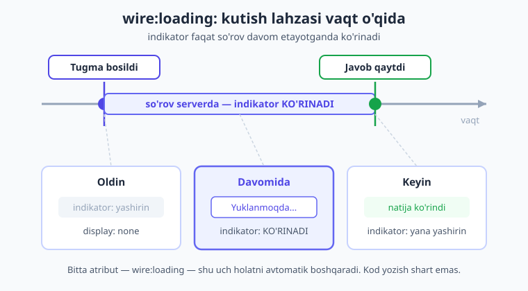
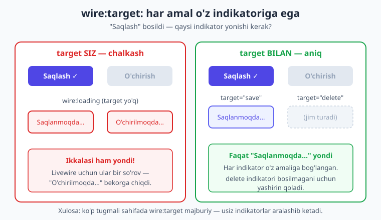
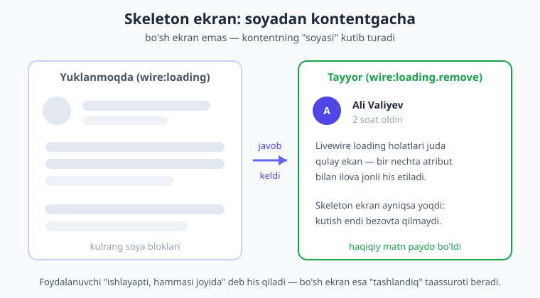

# 20 — Loading va progress holatlari

[⬅️ Oldingi: 19 — URL va query string](./19-url-query-string.md) · [🏠 Kitob boshi](./README.md) · [Keyingi: 21 — Lazy, polling, navigatsiya ➡️](./21-lazy-poll-navigate.md)

> **Bu bobda:** har bir Livewire so'rovi serverga borib-keladi — bu vaqt oladi. Shu vaqt davomida ekranda hech nima o'zgarmasa, foydalanuvchi ilova "qotib qoldi" deb o'ylaydi va tugmani qayta-qayta bosadi. Bu bobda biz ana shu "kutish lahzasini" ko'rinadigan qilamiz: `wire:loading` bilan spinner va matn ko'rsatamiz, `wire:target` bilan har bir amalga o'z indikatorini beramiz, `wire:loading.attr` bilan ikki marta bosishni butunlay to'xtatamiz, `wire:dirty` bilan saqlanmagan o'zgarishni belgilaymiz, `wire:offline` bilan internet yo'qolganini bildiramiz — va oxirida skeleton ekran bilan kutishni chiroyli qilamiz.

---

## Muammo: server javobi vaqt oladi

[7-bobda](./07-actions.md) ko'rganimizdek, `wire:click="save"` bosilganda Livewire serverga so'rov yuboradi, server javobni qaytaradi, keyin ekran yangilanadi. Bu jarayon ko'pincha tez — bir necha o'ndan soniya. Lekin har doim ham emas: server bandligi, sekin internet, og'ir hisob-kitob yoki katta fayl — bularning hammasi javobni sekinlashtiradi. Foydalanuvchi tugmani bosadi, lekin **ekranda hech narsa o'zgarmaydi.**

Foydalanuvchi nima o'ylaydi? "Bosildimi yo'qmi? Balki tegmadim?" — va yana bosadi. Yana. Va yana. Natijada bir marta bo'lishi kerak bo'lgan amal (masalan, "Buyurtma berish") uch marta bajariladi: uchta bir xil buyurtma, uchta SMS, uchta to'lov. Bu jiddiy xato — texnik tilda buni **takroriy yuborish** (double submission) deyiladi.

> **Hayotiy o'xshatish — lift tugmasi.** Liftni chaqirish uchun tugmani bosasiz. Yaxshi liftda tugma **darhol yonadi** — siz "qabul qilindi, lift kelyapti" degan signalni ko'rasiz va xotirjam kutasiz. Endi tasavvur qiling, tugma yonmaydi. Bosdingiz — hech nima. Yana bosasiz, yana hech nima. Lift kelyaptimi yo'qmi — bilmaysiz. Asabiylashib tugmani urib-urib turasiz. Mana shu — yonmagan lift tugmasi — sizning loading indikatori yo'q ilovangiz. Foydalanuvchiga **"qabul qildim, ishlayapman"** degan signalni darhol berish kerak.

Texnik ta'rif bilan: **loading holati (loading state) — bu so'rov serverga ketib, javob qaytguncha bo'lgan oraliqda foydalanuvchiga "kutilmoqda" signalini ko'rsatish.** Livewire buni hech qanday JavaScript yozmasdan, faqat HTML atributlari bilan hal qiladi. Eng asosiysi — `wire:loading`.



---

## `wire:loading` — kutish davomida ko'rinadi

`wire:loading` atributi qo'yilgan element **oddiy holatda yashirin** turadi va **faqat Livewire so'rovi davom etayotgan paytda ko'rinadi.** So'rov tugashi bilan u yana yashirinadi. Hech qanday kod, hech qanday holat (property) kerak emas — atributning o'zi yetadi:

```blade
{{-- resources/views/components/⚡loading-test.blade.php --}}
<div>
    <button wire:click="save">Saqlash</button>

    <span wire:loading>Yuklanmoqda...</span>
</div>
```

Bu yerda nima sodir bo'ladi:

1. Boshida `<span>` **ko'rinmaydi** (Livewire unga `display: none` qo'yadi).
2. Foydalanuvchi "Saqlash" tugmasini bosadi → so'rov serverga ketadi.
3. So'rov davom etayotganida `<span>` **paydo bo'ladi**: "Yuklanmoqda...".
4. Server javob qaytaradi → `<span>` **yana yashirinadi**.

Bu shunchalik sodda. Mana shu bitta qator butun sahifaga "men ishlayapman" degan signalni qo'shadi.

> **Eslatma — har qanday so'rovda yonadi.** `wire:target` belgilanmasa, `wire:loading` **shu komponentdagi istalgan** so'rov davomida ko'rinadi: tugma bosilishi ham, `wire:model.live` o'zgarishi ham, validatsiya ham. Tez orada `wire:target` bilan buni aniqlashtiramiz.

!!! tip "Spinner uchun ham"
    `wire:loading` matn bilan cheklanmaydi. Ichiga aylanuvchi spinner ikonkasini, progress chizig'ini yoki istalgan HTML qo'yishingiz mumkin:
    ```blade
    <div wire:loading>
        <svg class="animate-spin" ...><!-- aylanuvchi doira --></svg>
        <span>Yuborilmoqda...</span>
    </div>
    ```
    `animate-spin` — Tailwind klassi bo'lib, elementni aylantiradi. Tailwindsiz ham oddiy CSS animatsiya bilan qilsa bo'ladi.

---

## `wire:loading.remove` — teskari mantiq

Ba'zan teskari kerak bo'ladi: element **odatda ko'rinadi**, lekin so'rov davomida **yashirinishi** kerak. Buning uchun `.remove` modifikatorini qo'shamiz:

```blade
<div>
    {{-- odatda ko'rinadi, so'rov paytida YASHIRINADI --}}
    <span wire:loading.remove>Saqlashga tayyor</span>

    {{-- odatda yashirin, so'rov paytida KO'RINADI --}}
    <span wire:loading>Saqlanmoqda...</span>
</div>
```

Bu ikkovi birgalikda juda foydali naqshni beradi — **almashinuvchi matn.** So'rov yo'q paytida "Saqlashga tayyor", so'rov davomida "Saqlanmoqda..." ko'rinadi. Foydalanuvchi har lahzada ilova qaysi holatda ekanini biladi.

> **O'ylab ko'ring.** `wire:loading` "kutish paytida ko'rsat", `wire:loading.remove` esa "kutish paytida yashir". Ikkalasini bir element ustida bir vaqtda qo'ymang — bu mantiqsiz. Lekin ikkita **alohida** elementga qo'yib, biri ikkinchisining o'rnini egallashini ta'minlash — eng keng tarqalgan UI naqshi.

---

## `wire:target` — qaysi amalni kutyapmiz?

Endi muhim muammoga keldik. Tasavvur qiling, sahifada ikkita tugma bor: "Saqlash" va "O'chirish". Har biriga oddiy `wire:loading` qo'ysangiz, **istalgan biri** bosilganda **ikkalasining ham** indikatori yonadi. Chunki Livewire uchun ular bir komponentdagi "so'rov", farqi yo'q.

Lekin foydalanuvchi "Saqlash"ni bosgan bo'lsa, "O'chirilmoqda..." degan yozuvni ko'rishi mantiqsiz. Bu yerda **`wire:target`** yordamga keladi: u indikatorni **faqat muayyan amalga** bog'laydi.

```blade
<div>
    <button wire:click="save">Saqlash</button>
    <button wire:click="delete">O'chirish</button>

    {{-- faqat save() ishlayotganida ko'rinadi --}}
    <span wire:loading wire:target="save">Saqlanmoqda...</span>

    {{-- faqat delete() ishlayotganida ko'rinadi --}}
    <span wire:loading wire:target="delete">O'chirilmoqda...</span>
</div>
```

Endi har bir indikator faqat **o'z** amaliga javob beradi. "Saqlash"ni bossangiz — faqat "Saqlanmoqda..." chiqadi, "O'chirilmoqda..." jim turadi. Aynan kerakli xulq.



### Bir nechta amalni nishonga olish

Ba'zan bitta indikator **bir nechta** amalga javob berishi kerak. Masalan, "tarmoq band" degan umumiy belgi ham saqlashda, ham o'chirishda chiqsin. Amal nomlarini vergul bilan sanang:

```blade
<span wire:loading wire:target="save, delete, publish">
    Bajarilmoqda...
</span>
```

### Parametrli amalni nishonga olish

[7-bobda](./07-actions.md) parametr bilan amal chaqirishni ko'rgan edik: `wire:click="delete({{ $post->id }})"`. Bunday amalni nishonga olishda parametrni ham aniqlashtirsangiz bo'ladi — masalan, ro'yxatdagi har bir element o'z spinneriga ega bo'lsin:

```blade
@foreach ($posts as $post)
    <div wire:key="post-{{ $post->id }}">
        {{ $post->title }}
        <button wire:click="delete({{ $post->id }})">O'chirish</button>

        {{-- faqat AYNAN shu post o'chirilayotganda spinner --}}
        <span wire:loading wire:target="delete({{ $post->id }})">⏳</span>
    </div>
@endforeach
```

Endi ro'yxatda 5-postni o'chirsangiz, faqat **5-postning yonida** spinner chiqadi, qolgan 4 tasi tinch turadi. Bu — uzun ro'yxatlarda juda silliq tajriba.

> **Nega `wire:target` muhim?** `wire:loading`ning kuchi `wire:target`da. Usiz indikator "bir narsa yuklanmoqda" deydi — ammo nimaligi noma'lum. `wire:target` bilan u **aniq** "shu amal bajarilmoqda" deydi. Ko'p tugmali, ko'p elementli sahifalarda bu farq tartibsizlik bilan professional tajriba o'rtasidagi chegaradir.

!!! note "wire:model'ni ham nishonga olish mumkin"
    `wire:target` faqat amallar uchun emas. `wire:model.live` bilan bog'langan maydonni ham nishonga olsa bo'ladi — bu qidiruv maydonida juda asqotadi:
    ```blade
    <input wire:model.live.debounce.400ms="query">
    <span wire:loading wire:target="query">Qidirilmoqda...</span>
    ```
    Bu yerda `query` — bu amal emas, balki property nomi. Foydalanuvchi yozayotganda spinner chiqadi.

---

## `wire:loading.attr="disabled"` — ikki marta bosishni to'xtatish

Indikator ko'rsatish yaxshi, lekin u **takroriy bosishni o'zi to'xtatmaydi.** Foydalanuvchi "Saqlanmoqda..." yozuvini ko'rib turib ham tugmani yana bosishi mumkin. Buni butunlay oldini olish uchun tugmani so'rov davomida **o'chirib qo'yamiz** (disabled qilamiz). Buning uchun `wire:loading.attr` ishlatiladi — u so'rov davomida elementga atribut qo'shadi:

```blade
<button wire:click="save" wire:loading.attr="disabled" wire:target="save">
    Saqlash
</button>
```

Endi "Saqlash" bosilishi bilan tugma **bosilmaydigan** holatga o'tadi (`disabled` atributi qo'shiladi), so'rov tugagach yana faollashadi. Foydalanuvchi qancha bossa ham — ikkinchi so'rov ketmaydi. Bu **takroriy yuborishdan** himoyaning eng ishonchli usuli.

> **Hayotiy o'xshatish — bankomat.** Pul yechayotganingizda bankomat tugmalarini bloklaydi — "Iltimos, kuting" deb yozadi va siz boshqa tugma bosa olmaysiz. Agar bloklamasa, sabrsiz odam tugmalarni bosib, ikki marta pul yechib yuborardi. `wire:loading.attr="disabled"` — sizning ilovangizning ana shu bloki.

!!! warning "Faqat `disabled` emas — `wire:target`ni ham qo'shing"
    `wire:loading.attr="disabled"`ni yolg'iz qo'ysangiz, tugma **shu komponentdagi har qanday** so'rovda o'chadi — hatto yonidagi qidiruv maydoniga yozganingizda ham. Bu chalkash. **Doim `wire:target` bilan birga ishlating**, shunda tugma faqat o'z amalida bloklanadi:
    ```blade
    <button wire:click="save"
            wire:loading.attr="disabled"
            wire:target="save">Saqlash</button>
    ```

---

## `wire:loading.class` — uslubni o'zgartirish

Atribut qo'shish o'rniga so'rov davomida elementga **CSS klass** qo'shsangiz ham bo'ladi. Bu vizual fikr-bildirish (matni "xira"lashtirish, tugmani kulrang qilish va h.k.) uchun ideal:

```blade
{{-- so'rov davomida tugma yarim shaffof bo'ladi --}}
<button wire:click="save"
        wire:loading.class="opacity-50"
        wire:target="save">
    Saqlash
</button>
```

`opacity-50` — Tailwind klassi bo'lib, elementni 50% shaffof qiladi. So'rov tugashi bilan klass olib tashlanadi va tugma yana to'liq ko'rinadi. Bir nechta klass qo'shsa bo'ladi: `wire:loading.class="opacity-50 cursor-wait"`.

Teskari variant ham bor — `.class.remove` so'rov davomida klassni **olib tashlaydi**:

```blade
{{-- odatda "active" klassi bor, so'rov paytida olib tashlanadi --}}
<div class="card active"
     wire:loading.class.remove="active"
     wire:target="refresh">
    ...
</div>
```

!!! tip "Uchta vositani solishtiring"
    - `wire:loading` / `.remove` — elementni **ko'rsatadi/yashiradi** (matn, spinner).
    - `wire:loading.attr` — elementga **atribut** qo'shadi (`disabled`, `readonly`).
    - `wire:loading.class` / `.class.remove` — elementga **CSS klass** qo'shadi/oladi (vizual uslub).

    Uchalasini ham `wire:target` bilan birga ishlating. Ko'pincha bir tugmaga bir nechtasini birga qo'yamiz (pastdagi amaliy misolga qarang).

---

## `wire:dirty` — saqlanmagan o'zgarish bor

Hozirgacha biz **so'rov davomidagi** holatni ko'rdik. Lekin yana bir foydali holat bor: foydalanuvchi maydonni o'zgartirdi, lekin **hali saqlamadi.** Buni texnik tilda **"kir" (dirty)** holat deyiladi — ya'ni ekrandagi qiymat serverdagi qiymatdan farq qiladi.

`wire:dirty` atributi qo'yilgan element **faqat** shu farq mavjud paytda ko'rinadi:

```blade
<div>
    <input type="text" wire:model="title">

    {{-- faqat o'zgarish saqlanmagan paytda ko'rinadi --}}
    <span wire:dirty>● Saqlanmagan o'zgarishlar bor</span>

    <button wire:click="save">Saqlash</button>
</div>
```

Foydalanuvchi maydonga yozishni boshlashi bilan "● Saqlanmagan o'zgarishlar bor" belgisi paydo bo'ladi. "Saqlash" bosib, server qiymatni qabul qilgach — belgi yo'qoladi. Bu foydalanuvchini "ishingni saqlashni unutma" deb ogohlantiradi.

`wire:dirty` ham `wire:dirty.class` ko'rinishida CSS klass qo'sha oladi — masalan, o'zgartirilgan maydon chetini sariq qilish:

```blade
{{-- o'zgartirilganda maydon chetiga sariq ramka qo'shiladi --}}
<input type="text"
       wire:model="title"
       wire:dirty.class="border-yellow-500">
```

> **Eslab qoling.** `wire:dirty` so'rov bilan emas, **qiymat farqi** bilan ishlaydi. So'rov ketmagan bo'lsa ham, foydalanuvchi maydonni o'zgartirgan zahoti yonadi va saqlangach o'chadi. Bu uni `wire:loading`dan ajratib turadi.

!!! info "Livewire 3 da qanday edi?"
    `wire:dirty` Livewire 3 da ham bor edi va asosan xuddi shunday ishlardi. Livewire 4 da `wire:model`ning **standart xulqi deferred** bo'lib qolgani uchun (`.live` qo'shmasangiz, qiymat keyingi amalda yuboriladi — [6-bobga](./06-data-binding.md) qarang), `wire:dirty` bu deferred oraliqda — ya'ni "yozdim, lekin hali serverga ketmadi" lahzasida — ayniqsa qadrli bo'ldi.

---

## `wire:offline` — internet yo'qolganda

Foydalanuvchining interneti uzilib qolsa, hech qanday Livewire so'rovi ishlamaydi — tugma bosiladi, lekin javob kelmaydi. Foydalanuvchi nima bo'layotganini bilmaydi. `wire:offline` aynan shu holat uchun: u **faqat brauzer oflayn (internetsiz) bo'lganda** ko'rinadi:

```blade
<div wire:offline
     style="background:#dc2626; color:#fff; padding:8px; text-align:center;">
    ⚠️ Internet aloqasi yo'q. Ulanish tiklanmaguncha o'zgarishlar saqlanmaydi.
</div>
```

Brauzer internetni yo'qotishi bilan bu ogohlantirish chiqadi, ulanish tiklanishi bilan o'zi yo'qoladi. `wire:offline.class` va `wire:offline.attr` ham bor — masalan, oflaynda barcha tugmalarni o'chirib qo'yish:

```blade
<button wire:click="save" wire:offline.attr="disabled">Saqlash</button>
```

> **Maslahat.** `wire:offline`ni odatda **bitta joyga** — sahifa tepasiga global tasma sifatida qo'yish kifoya. Har bir elementga alohida qo'yish shart emas; bitta ko'zga tashlanadigan ogohlantirish foydalanuvchiga yetarli signal beradi.

---

## Skeleton ekran va spinner — UX'ni yaxshilash

Endi loading tajribasini **chiroyli** qilish haqida. Ikki keng tarqalgan naqsh bor:

**1. Spinner** — kichik aylanuvchi indikator. Qisqa kutishlar (tugma bosish, saqlash) uchun ideal. Yuqorida ko'rganimizdek, `wire:loading` ichiga aylanuvchi ikonka qo'yamiz.

**2. Skeleton ekran (skeleton screen)** — bu kontent yuklanguncha uning **kulrang "soyasi"ni** ko'rsatish. Tasavvur qiling, post ro'yxati yuklanmoqda: bo'sh ekran o'rniga siz kulrang to'rtburchaklar ko'rasiz — go'yo postlar joyida turibdi, faqat hali rangsiz. Kontent kelishi bilan soyalar haqiqiy matnga almashadi.



> **Hayotiy o'xshatish — restoran stoli.** Mehmonni kutayotgan restoran stolini tasavvur qiling: likopcha, vilka, qoshiq oldindan terib qo'yiladi — taom hali kelmagan bo'lsa ham. Mehmon "meni kutishyapti, hammasi tayyor" deb his qiladi. Skeleton ekran ham shunday: kontent kelmasdan oldin uning "joyini" tayyorlab qo'yadi. Bo'sh ekran esa — yalang'och stol kabi — "bu yer tashlandiq" degan taassurot qoldiradi.

Skeletonni odatda `wire:loading` bilan amal davomida ko'rsatamiz:

```blade
<div>
    {{-- yuklash davomida SKELETON soya --}}
    <div wire:loading wire:target="loadPosts">
        <div class="skeleton-line"></div>
        <div class="skeleton-line"></div>
        <div class="skeleton-line"></div>
    </div>

    {{-- yuklash tugagach HAQIQIY kontent --}}
    <div wire:loading.remove wire:target="loadPosts">
        @foreach ($posts as $post)
            <p wire:key="p-{{ $post->id }}">{{ $post->title }}</p>
        @endforeach
    </div>
</div>
```

`.skeleton-line` — bu shunchaki kulrang fonli, biroz yumaloq burchakli to'rtburchak (oddiy CSS). Eng yaxshi skeletonlar yengil "miltillash" (shimmer) animatsiyasiga ega bo'ladi, lekin oddiy kulrang ham bo'sh ekrandan ancha yaxshi.

!!! note "Skeleton qachon kerak?"
    Skeleton ekran **dastlabki yuklash** (sahifa yoki katta blok birinchi marta to'layotganida) uchun eng yaxshi. Kichik amallar (bir tugma bosish) uchun esa **spinner** yetarli. Skeleton ko'pincha **lazy** komponentlar bilan birga ishlatiladi — bu haqda keyingi, [21-bobda](./21-lazy-poll-navigate.md) (`placeholder()` metodi) batafsil gaplashamiz.

---

## Amaliy 1: to'liq submit tugmasi

Endi o'rgangan vositalarni birlashtirib, **professional submit tugmasini** yasaymiz. Yaxshi submit tugmasi bir vaqtning o'zida bir nechta ishni qiladi:

- so'rov davomida matnini "Saqlash" dan "Saqlanmoqda..." ga o'zgartiradi (`wire:loading` + `.remove`);
- ikki marta bosishni to'xtatadi (`wire:loading.attr="disabled"`);
- vizual jihatdan "band" ko'rinadi (`wire:loading.class`).

Quyidagi misol — **jonli Livewire v4.3.1 loyihada ishlab tekshirilgan** komponentdan olingan:

```blade
{{-- resources/views/components/⚡loading-test.blade.php --}}
<?php

use Livewire\Component;

new class extends Component
{
    public function save(): void
    {
        usleep(200000); // 0.2s — sekin serverni taqlid qilamiz
        // (haqiqiy loyihada bu yerda Post::create([...]) bo'lardi)
    }
};
?>

<div>
    <button wire:click="save"
            wire:loading.attr="disabled"
            wire:target="save">
        {{-- so'rov YO'Q paytida ko'rinadi --}}
        <span wire:loading.remove wire:target="save">Saqlash</span>

        {{-- so'rov DAVOMIDA ko'rinadi --}}
        <span wire:loading wire:target="save">Saqlanmoqda...</span>
    </button>
</div>
```

Diqqat qiling: tugma ichida **ikkita** `<span>` bor. Biri "Saqlash" (`wire:loading.remove` bilan — so'rov paytida yashirinadi), ikkinchisi "Saqlanmoqda..." (`wire:loading` bilan — so'rov paytida ko'rinadi). Ikkalasi ham bir xil `wire:target="save"` ga bog'langan. Natijada tugma matni so'rov boshlanganda "Saqlash" dan "Saqlanmoqda..." ga, tugaganda esa orqaga almashadi — va shu paytda tugmaning o'zi bosilmaydi.

> **Nega tugma ichida `wire:target` ham kerak?** Tugmaning o'zida `wire:click="save"` bor, demak u nishonni "biladi". Lekin ichidagi `<span>`lar nishonni bilmaydi — shuning uchun ularga ham `wire:target="save"` qo'yamiz. Aks holda ular komponentdagi har qanday so'rovga reaksiya berib qolardi.

---

## Amaliy 2: qidiruvda spinner

Ikkinchi keng tarqalgan holat — **jonli qidiruv** ([14-bobga](./14-pagination-qidiruv.md) ishora). Foydalanuvchi yozayotganida natijalar serverdan kelguncha biroz vaqt o'tadi. Shu oraliqda spinner ko'rsatish — foydalanuvchiga "qidiryapman, kuting" deb aytadi. Bu ham yuqoridagi jonli komponentdan:

```blade
{{-- resources/views/components/⚡loading-test.blade.php --}}
<?php

use Livewire\Component;

new class extends Component
{
    public string $query = '';
    public array $results = [];

    public function search(): void
    {
        usleep(300000); // 0.3s — sekin qidiruvni taqlid qilamiz
        $this->results = $this->query === ''
            ? []
            : ["Natija: {$this->query} (1)", "Natija: {$this->query} (2)"];
    }
};
?>

<div>
    <input type="text"
           wire:model.live.debounce.400ms="query"
           placeholder="Qidirish...">

    {{-- faqat "query" yangilanayotganida ko'rinadi --}}
    <span wire:loading wire:target="query">Qidirilmoqda...</span>

    <ul>
        @foreach ($results as $i => $r)
            <li wire:key="r-{{ $i }}">{{ $r }}</li>
        @endforeach
    </ul>
</div>
```

E'tibor bering: `wire:target="query"` — bu yerda `query` amal emas, balki **property nomi**. Foydalanuvchi yozganda `wire:model.live` serverga so'rov yuboradi, va shu so'rov davomida "Qidirilmoqda..." chiqadi. `.debounce.400ms` esa har bosishda emas, yozish to'xtaganidan 0.4 soniya keyin so'rov yuboradi — bu keraksiz so'rovlarni kamaytiradi ([6-bobga](./06-data-binding.md) qarang).

> **Tasdiqlangan.** Yuqoridagi ikkala misol (submit tugmasi va qidiruv spinneri) bir xil `⚡loading-test.blade.php` komponentida birga turibdi va jonli Livewire v4.3.1 loyihada **HTTP 200** bilan render bo'ldi: spinner so'rov davomida ko'rindi, submit tugmasi bloklandi.

---

## To'liq misol: CRUD ilovasida barcha loading holatlari

[16-bobda](./16-toliq-crud.md) qurgan CRUD ilovasini eslang — postlarni yaratish, tahrirlash, o'chirish. Endi unga shu bobda o'rgangan barcha loading holatlarini qo'shamiz, shunda har bir amalda foydalanuvchi nima bo'layotganini aniq ko'radi:

```blade
{{-- CRUD ilovasiga loading holatlarini qo'shish (qism) --}}
<div>
    {{-- 1) Oflayn ogohlantirish — sahifa tepasida bitta marta --}}
    <div wire:offline class="offline-banner">
        ⚠️ Internet yo'q — o'zgarishlar saqlanmaydi.
    </div>

    {{-- 2) Forma: submit tugmasi + dirty belgi --}}
    <form wire:submit="save">
        <input type="text" wire:model="title"
               wire:dirty.class="border-yellow-500">

        {{-- saqlanmagan o'zgarish belgisi --}}
        <span wire:dirty wire:target="title">● Saqlanmagan</span>

        {{-- band va matn almashinuvchi submit tugmasi --}}
        <button type="submit"
                wire:loading.attr="disabled"
                wire:target="save">
            <span wire:loading.remove wire:target="save">Saqlash</span>
            <span wire:loading wire:target="save">Saqlanmoqda...</span>
        </button>
    </form>

    {{-- 3) Postlar ro'yxati: har postda o'z o'chirish spinneri --}}
    <ul>
        @foreach ($posts as $post)
            <li wire:key="post-{{ $post->id }}">
                {{ $post->title }}

                <button wire:click="delete({{ $post->id }})"
                        wire:loading.attr="disabled"
                        wire:target="delete({{ $post->id }})">
                    O'chirish
                </button>

                {{-- faqat AYNAN shu post o'chirilayotganda --}}
                <span wire:loading wire:target="delete({{ $post->id }})">⏳</span>
            </li>
        @endforeach
    </ul>
</div>
```

Bu bitta blokda biz qo'shganlarimiz:

1. **Oflayn tasma** — internet uzilsa, sahifa tepasida qizil ogohlantirish (`wire:offline`).
2. **Dirty belgi** — maydon o'zgartirilganda "● Saqlanmagan" yonadi va maydon cheti sariqlashadi (`wire:dirty`, `wire:dirty.class`).
3. **Aqlli submit tugmasi** — so'rov davomida matni "Saqlanmoqda..." ga o'zgaradi va bloklanadi (`wire:loading` + `.attr` + `wire:target`).
4. **Har postda alohida spinner** — parametrli `wire:target="delete({{ $post->id }})"` tufayli faqat o'chirilayotgan post yonida ⏳ chiqadi.

Mana shunday — bir nechta sodda atribut bilan ilovangiz "tirik" va ishonchli his etiladi. Foydalanuvchi har lahzada nima bo'layotganini biladi, hech qachon "qotib qoldimi?" deb o'ylamaydi va hech qachon tasodifan ikki marta bosib yubormaydi.

---

## Xulosa

- **Loading holati — kutish lahzasini ko'rinadigan qilish.** Server javobi vaqt oladi; signal bo'lmasa, foydalanuvchi ilova qotgan deb o'ylab tugmani qayta bosadi (**takroriy yuborish**). "Yonmagan lift tugmasi" muammosi.
- **`wire:loading`** — element odatda yashirin, so'rov davomida ko'rinadi. **`wire:loading.remove`** — teskari: odatda ko'rinadi, so'rov davomida yashirinadi. Ikkovi birga "almashinuvchi matn" beradi.
- **`wire:target="save"`** — indikatorni faqat muayyan amalga bog'laydi. `wire:target` siz `wire:loading` "bir narsa" yuklanmoqda deydi; **u bilan aniq amalni** ko'rsatadi. Ko'p tugmali sahifalarda shart.
- **`wire:target="save, delete"`** — bir nechta amal; **`wire:target="delete({{ $id }})"`** — parametr bilan (ro'yxatda har element o'z spinneriga ega). `wire:model` property nomini ham nishonga olsa bo'ladi.
- **`wire:loading.attr="disabled"`** — so'rov davomida tugmani bloklaydi → ikki marta bosishni **butunlay** to'xtatadi. Doim `wire:target` bilan birga.
- **`wire:loading.class="..."`** / **`.class.remove`** — so'rov davomida CSS klass qo'shadi/oladi (vizual "band" ko'rinishi).
- **`wire:dirty`** — saqlanmagan o'zgarish belgisi (so'rov emas, **qiymat farqi** bilan ishlaydi). **`wire:offline`** — internet yo'qolganida ogohlantirish.
- **Skeleton ekran** — kontent kelmasdan oldin uning kulrang "soyasi"ni ko'rsatish ("tayyorlangan restoran stoli"). Dastlabki yuklash uchun spinnerdan yaxshiroq; ko'pincha lazy komponentlar bilan ([21-bob](./21-lazy-poll-navigate.md)).
- **Professional submit tugmasi** = `wire:loading.remove`/`wire:loading` (matn almashinuvi) + `wire:loading.attr="disabled"` (blok) + `wire:target` (aniqlik), hammasi birga.

## Amaliy mashqlar

1. **Almashinuvchi tugma (oson).** Bitta `wire:click="save"` tugmasini yarating. Ichiga ikkita `<span>` qo'ying: biri `wire:loading.remove` bilan "Yuborish", ikkinchisi `wire:loading` bilan "Yuborilmoqda...". `save()` metodi ichiga `usleep(1000000);` (1 soniya) qo'yib, so'rovni sekinlashtiring va matn almashishini ko'zingiz bilan ko'ring. *Yo'naltirish:* ikkala `<span>`ga ham `wire:target="save"` qo'shing.

2. **Ikki tugma, ikki indikator (oson–o'rta).** Sahifaga "Saqlash" (`save`) va "O'chirish" (`delete`) tugmalarini qo'ying. Har biriga alohida indikator yozing: `wire:loading wire:target="save"` → "Saqlanmoqda...", `wire:loading wire:target="delete"` → "O'chirilmoqda...". Bir tugmani bosganda faqat o'sha indikator chiqishini tekshiring. *Yo'naltirish:* `wire:target` bo'lmasa nima bo'lishini ham sinab ko'ring — ikkalasi ham yonadi.

3. **Takroriy yuborishni to'xtatish (o'rta).** Forma yarating, `save()` ichiga `usleep(2000000);` (2 soniya) qo'ying. Avval `wire:loading.attr="disabled"`siz tugmani bir necha marta tez-tez bosib, `save()` necha marta ishlaganini (masalan, hisoblagich property bilan) kuzating. Keyin `wire:loading.attr="disabled" wire:target="save"` qo'shib, qayta sinang — endi nechta? *Yo'naltirish:* `disabled` qo'shilgach, qancha bossangiz ham bitta so'rov ketadi.

4. **Dirty va offline (o'rta).** Matn maydoni va "Saqlash" tugmasi bo'lgan forma yarating. `wire:dirty` belgisi qo'shing — maydon o'zgartirilganda "Saqlanmagan o'zgarishlar" chiqsin, saqlangach yo'qolsin. Sahifa tepasiga `wire:offline` tasma qo'shing. Brauzer DevTools'ida tarmoqni "Offline" qilib (Network → Offline), tasma chiqishini tekshiring. *Yo'naltirish:* `wire:dirty` so'rovsiz, faqat qiymat o'zgarishida yonadi.

5. **Skeleton ekranli ro'yxat (qiyin).** Tugma bosilganda postlar ro'yxatini yuklaydigan (`usleep` bilan 1 soniya sekinlashtirilgan) komponent yozing. Yuklash davomida kulrang skeleton bloklarni (`wire:loading` + `wire:target`), tugagach esa haqiqiy postlarni (`wire:loading.remove` + `wire:target`) ko'rsating. `.skeleton-line` uchun oddiy CSS yozing (kulrang fon, yumaloq burchak). *Yo'naltirish:* skeleton va kontent bloklari bir xil `wire:target`ga bog'lansin; keyingi bobda (`#[Lazy]` + `placeholder()`) buni yanada chiroyli qilamiz.

---

[⬅️ Oldingi: 19 — URL va query string](./19-url-query-string.md) · [🏠 Kitob boshi](./README.md) · [Keyingi: 21 — Lazy, polling, navigatsiya ➡️](./21-lazy-poll-navigate.md)
