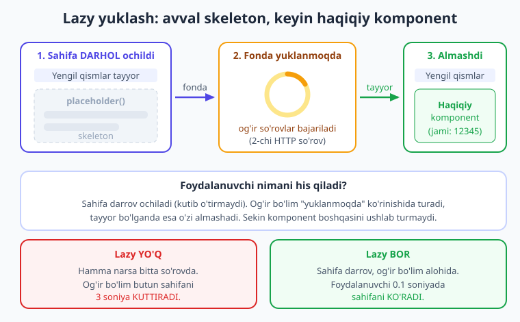
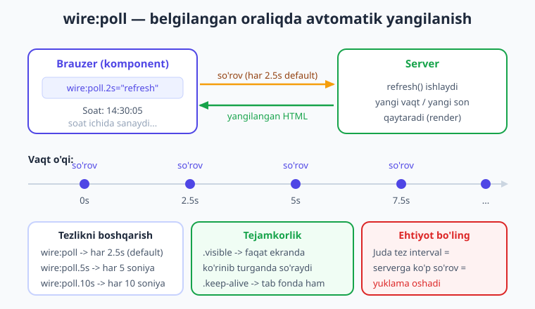
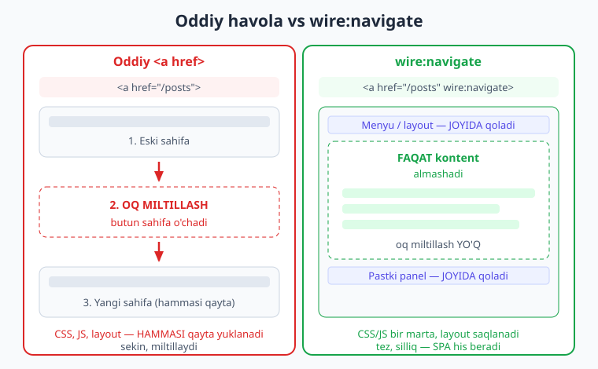

# 21 — Lazy yuklash, polling va SPA navigatsiya

[⬅️ Oldingi: 20 — Loading holatlari](./20-loading-holatlar.md) · [🏠 Kitob boshi](./README.md) · [Keyingi: 22 — Alpine.js integratsiyasi ➡️](./22-alpine-js.md)

> **Bu bobda:** ilovangizni tezroq va jonliroq qiladigan uchta vositani o'rganamiz. **Lazy** (`#[Lazy]`) — og'ir komponentni keyinroq, fonda yuklab, sahifa darrov ochilishini ta'minlaydi. **Polling** (`wire:poll`) — komponentni har bir necha soniyada o'zi yangilab turadi (jonli statistika, soat, bildirishnomalar uchun). **SPA navigatsiya** (`wire:navigate`) — havolalar bosilganda butun sahifa qayta yuklanmaydi, faqat kontent silliq almashadi va sayt mobil ilovadek tez his beradi. Uchalasi ham bir-biriga yaqin: hammasi **tezlik va UX** haqida.

---

## Nega bu uch vosita bir bobda?

Avvalgi boblarda biz komponentlarni **ishlatishni** o'rgandik — ma'lumot bog'lash, amallar, validatsiya, event. Ular ilovaning "ichki" tomoni. Bu bobdagi uch vosita esa ilovaning **his qilinishi** haqida — ya'ni foydalanuvchi nazarida sayt qanchalik tez va silliq tuyilishi.

Uchalasini bitta jumlaga sig'dirsak:

- **Lazy** — "sekin komponent boshqasini kuttirmasin."
- **Poll** — "ma'lumot o'zi yangilanib tursin."
- **Navigate** — "sahifadan sahifaga o'tish tez bo'lsin."

Ularning umumiy mavzusi: **foydalanuvchi kutmasin.** Har biri kutishning bir turini yo'qotadi. Keling, birma-bir ko'rib chiqaylik.

---

## 1-qism: Lazy yuklash — og'ir komponentni keyin yuklash

### Muammo: bitta sekin bo'lim butun sahifani kuttiradi

Tasavvur qiling, boshqaruv paneli (dashboard) sahifasi yaratyapsiz. Unda:

- yuqorida — foydalanuvchi ismi va menyu (yengil, darrov tayyor);
- o'rtada — **statistika paneli** (oxirgi 30 kunlik savdo, grafiklar — bazadan og'ir so'rovlar, 3 soniya ishlaydi);
- pastda — so'nggi buyurtmalar ro'yxati.

Muammo shundaki, Livewire sahifani render qilganda **hamma narsani birgalikda** tayyorlaydi. Ya'ni statistika paneli 3 soniya hisoblashini tugatmaguncha, butun sahifa **bo'm-bo'sh** turadi. Foydalanuvchi 3 soniya oq ekranga qarab o'tiradi — garchi menyu va ismi darrov tayyor bo'lsa ham. Bir sekin bo'lim butun sahifani garovga oladi.

> **Hayotiy o'xshatish — restoran.** Siz restoranga kirdingiz. Ofitsiant menyuni, suvni, nonni darrov keltirdi — chunki ular tayyor. Lekin asosiy taom (kabob) pishishiga 15 daqiqa kerak. Endi tasavvur qiling, ofitsiant: "Kabob tayyor bo'lmaguncha, men sizga **hech narsa** — suv ham, non ham bermayman" desa. Bu kulgili, to'g'rimi? Aqlli ofitsiant tayyor narsalarni darrov beradi, kabobni esa **keyin**, pishgach olib keladi. **Lazy yuklash ham aynan shu:** yengil qismlar darrov chiqadi, og'ir bo'lim esa "pishganda" — fonda yuklanib bo'lgach — keladi.

**Lazy yuklash** (ya'ni "dangasa", kechiktirib yuklash) shu muammoni hal qiladi: og'ir komponent **birinchi so'rovga qo'shilmaydi**. Uning o'rniga vaqtinchalik "joy egasi" — **placeholder** (skeleton, ya'ni kontur, yuklanish ko'rsatkichi) ko'rsatiladi. Sahifa darrov ochiladi. So'ng brauzer **ikkinchi, alohida so'rov** yuborib, og'ir komponentni fonda yuklaydi va tayyor bo'lgach placeholder o'rniga qo'yadi.



### Qanday yoqiladi: ikki usul

**1-usul — teg atributi (eng oson).** Komponentni sahifaga qo'yganda tegga shunchaki `lazy` so'zini qo'shing:

```blade
{{-- Statistika paneli og'ir — uni lazy qilamiz --}}
<livewire:stats-panel lazy />
```

Mana shu yetarli. Endi `stats-panel` birinchi so'rovga qo'shilmaydi, fonda alohida yuklanadi. Boshqa hech narsani o'zgartirish shart emas.

**2-usul — `#[Lazy]` atributi.** Agar komponent **doim** lazy bo'lishini xohlasangiz (qayerda ishlatilishidan qat'i nazar), uni komponentning o'zida belgilang. SFC (single-file component) da `#[Lazy]` atributi `new` so'zidan keyin, `class` so'zidan oldin turadi:

```php
{{-- resources/views/components/⚡stats-panel.blade.php --}}
<?php

use Livewire\Component;
use Livewire\Attributes\Lazy;     // Lazy atributini import qilamiz

new
#[Lazy]
class extends Component
{
    public int $jami = 0;

    public function mount(): void
    {
        // og'ir ishni taqlid qilamiz (haqiqatda bu bazaga so'rov bo'lardi)
        $this->jami = 12345;
    }
};
?>

<div>
    <h2>Statistika: {{ $jami }}</h2>
</div>
```

!!! warning "Ehtiyot bo'ling — SFC da `#[Lazy]` o'rni muhim"
    Single-file komponentda PHP klassi anonim (`new class extends ...`). Atributni **`new` bilan `class` orasiga** qo'ying:
    ```php
    new
    #[Lazy]
    class extends Component { ... }
    ```
    Agar `#[Lazy]` ni `new class` dan **yuqoriga** qo'ysangiz (`#[Lazy]` keyin yangi qatorda `new class`), bu xato (500) beradi — bu jonli loyihada tekshirildi. To'g'ri o'rni — `new` dan keyin.

> **Tasdiqlangan.** Yuqoridagi komponent jonli **Laravel 12 + Livewire v4.3.1** loyihada `<livewire:stats-panel lazy />` orqali render qilindi — HTTP 200, avval placeholder ko'rindi, so'ng haqiqiy "Statistika: 12345" almashdi.

### `placeholder()` — kutish paytida nima ko'rinadi

Lazy komponent yuklanmaguncha, foydalanuvchi nimani ko'radi? Standart holatda — bo'sh joy. Lekin biz **`placeholder()`** metodi bilan chiroyli "yuklanmoqda" ko'rinishini (skeleton) berishimiz mumkin. Bu metod yuklanish davomida ko'rsatiladigan HTML ni qaytaradi:

```php
{{-- resources/views/components/⚡stats-panel.blade.php --}}
<?php

use Livewire\Component;
use Livewire\Attributes\Lazy;

new
#[Lazy]
class extends Component
{
    public int $jami = 0;

    public function mount(): void
    {
        $this->jami = 12345;
    }

    // komponent yuklanmaguncha shu ko'rinadi
    public function placeholder(): string
    {
        return <<<'HTML'
        <div class="skeleton">
            <p>Yuklanmoqda...</p>
        </div>
        HTML;
    }
};
?>

<div>
    <h2>Statistika: {{ $jami }}</h2>
</div>
```

Bu yerda `placeholder()` oddiy "Yuklanmoqda..." matnini qaytaradi. Haqiqiy loyihada bu yerda **skeleton** — kulrang to'rtburchaklar (asl kontent shaklini eslatadigan kontur) bo'ladi. Bu foydalanuvchiga "shu yerda nimadir bo'ladi, biroz kutib turing" deb bildiradi va kutish jarayonini xushroq qiladi.

> **Tasdiqlangan.** Jonli loyihada `placeholder()` natijasi (`Yuklanmoqda...`, `skeleton`) birinchi javobda ko'rindi, so'ngra haqiqiy komponent bilan almashdi (HTTP 200).

!!! tip "Maslahat — skeleton asl shaklga o'xshasin"
    Eng yaxshi placeholder — asl kontentning **shaklini** taqlid qiladi: sarlavha uchun bitta kulrang chiziq, abzas uchun uch chiziq, rasm uchun kulrang kvadrat. Shunda yuklanganda "sakrash" (layout shift) kam bo'ladi — kontur o'rniga aynan o'sha o'lchamdagi haqiqiy kontent keladi. Foydalanuvchi ko'zi tinch qoladi.

### Lazy qanday ishlaydi (texnik tomoni)

Livewire 4 da lazy komponent **`x-intersect`** (Alpine.js ning ko'rinish kuzatuvchisi) bilan yuklanadi — ya'ni komponent ekranga **ko'ringanda** yuklanadi. Bu ayniqsa sahifa pastidagi og'ir bo'limlar uchun zo'r: foydalanuvchi pastga aylantirib (scroll) o'sha joyga yetganda yuklanadi, yetmasa — umuman yuklanmaydi. Bu serverga ortiqcha ish bermaydi.

> **Tasdiqlangan.** Render qilingan HTML da lazy komponent `x-intersect` atributi bilan keldi — demak komponent ko'rinish maydoniga kirgach yuklanadi.

### Qachon lazy ishlatish kerak (va qachon kerak emas)

| Lazy QO'Ying | Lazy KERAK EMAS |
|---|---|
| Og'ir bazaviy so'rovlar (statistika, hisobotlar) | Yengil, tez komponentlar |
| Tashqi API chaqiruvlari (ob-havo, kurslar) | Sahifaning eng muhim, birinchi ko'rinadigan qismi |
| Sahifa pastidagi, darrov ko'rinmaydigan bo'limlar | Foydalanuvchi darrov ko'rishi shart bo'lgan kontent |
| Modal/tab ichidagi, bosilganda kerak bo'ladigan kontent | Kichik widgetlar (sanagich, tugma) |

!!! note "Eslatma — lazy = ikkinchi so'rov"
    Lazy komponent **ikkita** HTTP so'rovga bo'linadi: birinchisi placeholder bilan sahifani beradi, ikkinchisi haqiqiy komponentni yuklaydi. Demak yengil komponentni lazy qilish **foyda bermaydi** — aksincha, keraksiz ikkinchi so'rov qo'shadi. Lazy faqat komponent **rostdan og'ir** bo'lganda mantiqli.

---

## 2-qism: Polling — komponentni o'zi yangilab turish

### Muammo: ekrandagi ma'lumot eskirib qoladi

Endi boshqa vaziyat. Sizda jonli statistika paneli bor — "Hozirgi onlayn foydalanuvchilar: 142". Bu son har soniya o'zgaradi. Lekin Livewire komponenti **faqat foydalanuvchi biror amal qilganda** (tugma bosganda, forma yuborganda) serverga so'rov yuboradi va yangilanadi. Agar foydalanuvchi shunchaki ekranga qarab tursa, hech narsa bosmasa — son **qotib qoladi**. "142" bir soat oldingi qiymat bo'lib turaveradi. Bu jonli panel uchun yaramaydi.

> **Hayotiy o'xshatish — devordagi soat vs qo'l soati.** Eski mexanik devor soati bor — lekin u to'xtab qolgan, 3:00 da qotib turibdi. Unga qancha qarasangiz ham, vaqt o'zgarmaydi. Endi tasavvur qiling, sizda kichik yordamchi bor — u **har 2.5 soniyada** soatga qarab keladi va aniq vaqtni aytadi: "hozir 14:30:05... 14:30:07...". Siz hech narsa qilmasangiz ham, yangi vaqtni eshitib turasiz. **Polling ham aynan shu:** komponent o'zi, belgilangan oraliqda, serverga "yangi ma'lumot bormi?" deb so'rab turadi.

**Polling** (ya'ni "muntazam so'rab turish") — bu komponentga `wire:poll` atributini berib, uni **belgilangan oraliqda avtomatik yangilanishga** majbur qilish. Foydalanuvchi hech narsa qilmasa ham, brauzer har necha soniyada serverga so'rov yuboradi, komponent qayta render bo'ladi va ekran yangilanadi.



### Eng oddiy holat: `wire:poll`

`wire:poll` ni komponentning ildiz elementiga qo'yamiz. Modifikator bermasak, u **har 2.5 soniyada** komponentni qayta render qiladi:

```php
{{-- resources/views/components/⚡live-clock.blade.php --}}
<?php

use Livewire\Component;

new class extends Component
{
    public string $vaqt = '';

    public function mount(): void
    {
        $this->vaqt = now()->format('H:i:s');
    }
};
?>

<div wire:poll>
    <h2>Soat: {{ $vaqt }}</h2>
</div>
```

Bu yerda qiziq narsa: biz hech qanday metod chaqirmadik. `wire:poll` shunchaki komponentni **qayta render qiladi** — ya'ni `render` qayta ishlaydi. Lekin `$vaqt` faqat `mount()` da bir marta o'rnatilgan, qayta render unga ta'sir qilmaydi. Demak vaqt yangilanishi uchun bizga **metod** kerak.

### Metod chaqirish: `wire:poll="metod"`

Har yangilanishda biror ish bajarish uchun (masalan vaqtni yangilash, bazadan yangi ma'lumot olish) metod nomini bering:

```php
{{-- resources/views/components/⚡live-clock.blade.php --}}
<?php

use Livewire\Component;

new class extends Component
{
    public string $vaqt = '';
    public int $hisob = 0;

    public function mount(): void
    {
        $this->vaqt = now()->format('H:i:s');
    }

    // har yangilanishda chaqiriladi
    public function refresh(): void
    {
        $this->vaqt = now()->format('H:i:s');   // vaqtni yangilaymiz
        $this->hisob++;                          // nechinchi yangilanish
    }
};
?>

<div wire:poll.2s="refresh">
    <h2>Soat: {{ $vaqt }}</h2>
    <p>Yangilanishlar: {{ $hisob }}</p>
</div>
```

Endi har 2 soniyada `refresh` ishlaydi, vaqt yangilanadi va `hisob` o'sib boradi. Foydalanuvchi hech narsa bosmaydi — son o'zi sanab turadi.

> **Tasdiqlangan.** Bu komponent jonli loyihada `/clock` manzilida render qilindi — HTTP 200, HTML da `wire:poll.2s="refresh"` atributi bilan keldi. Brauzerda har 2 soniyada vaqt va hisob avtomatik o'sdi.

### Interval (oraliq) ni boshqarish

Yangilanish chastotasini modifikator bilan belgilaysiz:

```blade
<div wire:poll>...</div>          {{-- har 2.5 soniya (default) --}}
<div wire:poll.5s="refresh">...</div>     {{-- har 5 soniya --}}
<div wire:poll.10s="refresh">...</div>    {{-- har 10 soniya --}}
<div wire:poll.500ms="refresh">...</div>  {{-- har yarim soniya (juda tez!) --}}
```

Oraliqni **ma'lumot qanchalik tez o'zgarishiga** qarab tanlang. Soat uchun 1 soniya, savdo statistikasi uchun 10-30 soniya, kamdan-kam o'zgaradigan hisobot uchun esa 1 daqiqa yetadi.

### Tejamkor modifikatorlar: `.visible` va `.keep-alive`

Polling foydali, lekin u **serverga muntazam yuk** beradi. Har bir poll — bu alohida HTTP so'rov. 1000 foydalanuvchi sahifani ochib qo'ysa va har biri har 2.5 soniyada so'rov yuborsa — bu sekundiga 400 so'rov. Livewire buni yumshatish uchun ikki modifikator beradi:

**`.visible`** — sahifa (yoki tab) **ko'rinib turganda** poll qiladi, foydalanuvchi boshqa tabga o'tsa — to'xtaydi:

```blade
<div wire:poll.visible.5s="refresh">...</div>
```

Bu juda foydali: foydalanuvchi sizning saytni ochiq qoldirib boshqa ish bilan ovora bo'lsa, server bekorga yuklanmaydi.

**`.keep-alive`** — aksincha: tab fonda bo'lsa **ham** poll davom etadi (default holatda Livewire fonni biroz sekinlashtirishi mumkin):

```blade
<div wire:poll.keep-alive="refresh">...</div>
```

!!! warning "Ehtiyot bo'ling — juda tez poll = server yuklamasi"
    Polling oraliqini imkon qadar **uzun** tuting. Har bir poll — bu to'liq Livewire so'rovi: server komponentni qayta hisoblaydi, render qiladi, javob qaytaradi. `wire:poll.500ms` (yarim soniya) bilan ko'p foydalanuvchi serverni **bo'g'ib** qo'yishi mumkin. O'zingizga savol bering: "Ma'lumot rostdan har yarim soniyada o'zgaradimi? Yoki 5 soniya ham yetadimi?" Ko'pincha sekinroq interval foydalanuvchi uchun **deyarli farqsiz**, lekin server uchun **ulkan tejamkorlik**.

!!! tip "Maslahat — polling o'rniga real-vaqt texnologiyalari"
    Agar sizga rostdan **bir zumlik** yangilanish kerak bo'lsa (masalan chat, jonli aksiya narxi), polling eng yaxshi yechim emas — u baribir kechikadi va serverni yuklaydi. Bunday holda **Laravel Echo + WebSocket** (server o'zgarishni "itarib" yuboradi) ko'proq mos keladi. Polling esa — oddiy, "yetarlicha jonli" yechim: dashboard, statistika, bildirishnoma soni kabilarga ideal.

---

## 3-qism: SPA navigatsiya — sahifalararo silliq o'tish

### Muammo: har bosishda oq miltillash

Oddiy veb-saytda bir sahifadan boshqasiga o'tganingizda nima bo'ladi? Brauzer **butun sahifani tashlaydi** va yangisini **noldan** yuklaydi: HTML, barcha CSS, barcha JavaScript, rasmlar — hammasi qayta. Bir lahzalik **oq miltillash** (ekran oqarib ketishi) ko'rinadi, menyu "sakraydi", aylantirilgan joy (scroll) yo'qoladi. Bu sayt "veb-sahifa" ekanini eslatib turadi — mobil ilovadek silliq emas.

> **Hayotiy o'xshatish — uy ichida xona almashtirish vs uydan chiqib qaytish.** Tasavvur qiling, mehmonxonadan oshxonaga o'tmoqchisiz. Oddiy yo'l: siz uydan **ko'chaga chiqasiz**, eshikni yopasiz, qaytadan kalit bilan **uyga kirasiz**, poyabzal yechasiz va oshxonaga borasiz. Kulgili va ortiqcha, to'g'rimi? Aqlli yo'l: siz shunchaki **xonadan xonaga** o'tasiz — uy o'sha-o'sha, faqat siz turgan xona o'zgaradi. **wire:navigate ham aynan shu:** butun "uy" (CSS, JS, layout) joyida qoladi, faqat ichidagi **kontent** almashadi. Ko'chaga chiqib qaytish (to'liq qayta yuklash) yo'q.

**`wire:navigate`** — havola (`<a>`) bosilganda butun sahifani qayta yuklamaslik, faqat **kontentni almashtirishni** ta'minlaydi. CSS va JavaScript bir marta yuklanadi va qoladi; o'tishlar **bir zumda**, oq miltillashsiz bo'ladi. Natijada Livewire sayti **SPA** (Single Page Application — yagona sahifali ilova) kabi his beradi — lekin siz hech qanday murakkab frontend kod yozmaysiz.



### Eng oddiy holat

Havolaga `wire:navigate` ni qo'shing, tamom:

```blade
<a href="/posts" wire:navigate>Postlar</a>
<a href="/about" wire:navigate>Biz haqimizda</a>
```

Endi bu havolalar bosilganda brauzer butun sahifani qayta yuklamaydi — Livewire fonda yangi sahifani oladi va faqat o'zgargan qismni almashtiradi. URL ham yangilanadi (manzil satrida `/posts` ko'rinadi), "Orqaga" tugmasi ham to'g'ri ishlaydi. Foydalanuvchi farqni faqat **tezlikda** sezadi: o'tish bir zumda, miltillashsiz.

!!! note "Eslatma — Route::livewire bilan ishlaydi"
    `wire:navigate` ishlashi uchun manzil Livewire boshqaradigan sahifa bo'lishi kerak — ya'ni `routes/web.php` da `Route::livewire('/posts', 'posts-table')` kabi e'lon qilingan ([3-bob](./03-birinchi-komponent.md) da ko'rgandik). Oddiy `<a href>` tashqi saytlarga ham boraveradi, lekin SPA effekti faqat o'z ilovangiz sahifalari orasida ishlaydi.

### Prefetch: `wire:navigate.hover`

Yana bir tezlik nayrangi. `wire:navigate.hover` qo'shsangiz, Livewire foydalanuvchi sichqonchani havola **ustiga olib kelganda** (hali bosmasdan!) keyingi sahifani **oldindan** yuklab qo'yadi. Foydalanuvchi bosguncha sahifa allaqachon tayyor bo'ladi — o'tish **shu zahoti**:

```blade
<a href="/stats" wire:navigate.hover>Statistika</a>
```

> **Hayotiy o'xshatish — prefetch.** Bu xuddi ofitsiant siz menyuga **qaray boshlaganingizda** oshxonaga "shu mehmon kabob buyurishi mumkin, tayyorlay boshla" deb signal berishiga o'xshaydi. Siz buyurtma berganingizda taom yarmi tayyor bo'ladi. Sichqoncha havola ustida = "ehtimol shuni bosadi" signali.

!!! tip "Maslahat — hover'ni o'lchab ishlating"
    `wire:navigate.hover` har bir hover'da so'rov yuboradi — agar foydalanuvchi ko'p havolalar ustidan sichqonchani yugurtirsa, bekorga so'rovlar ketadi. Shuning uchun uni **muhim, ehtimoli yuqori** havolalarga (asosiy menyu bandlari) qo'ying, har bir havolaga emas.

### `wire:current` — faol havolani belgilash

Menyularda odatda foydalanuvchi **qaysi sahifada** ekanini ko'rsatadigan belgi bo'ladi (faol band boshqacha rangda yoki ostiga chizilgan). `wire:current` shu ish uchun: hozirgi URL havolaning manziliga mos kelsa, unga belgilangan klassni qo'shadi:

```blade
<nav>
    <a href="/dashboard" wire:navigate wire:current="faol">Bosh sahifa</a>
    <a href="/posts" wire:navigate wire:current="faol">Postlar</a>
    <a href="/stats" wire:navigate wire:current="faol">Statistika</a>
</nav>
```

Bu yerda foydalanuvchi `/posts` sahifasida bo'lsa, "Postlar" havolasiga `faol` klassi qo'shiladi (boshqalariga yo'q). CSS da `.faol { font-weight: bold; color: indigo; }` deb yozsangiz, faol band ajralib turadi. `wire:navigate` bilan birga ishlatilganda, sahifa almashishi bilan faol belgi ham darrov ko'chadi.

### `@persist` — sahifa o'tishida elementni saqlab qolish

`wire:navigate` ning eng kuchli imkoniyatlaridan biri — ba'zi elementlarni sahifa o'tganda ham **o'chirmasdan saqlash**. Klassik misol: musiqa pleyeri. Foydalanuvchi qo'shiq tinglab turibdi, boshqa sahifaga o'tdi — qo'shiq **uzilmasligi** kerak. Oddiy sahifa yuklashda buni qilib bo'lmaydi (hamma narsa qayta yuklanadi). Lekin `@persist` bilan mumkin:

```blade
{{-- layout faylida, har sahifada bo'ladigan joyda --}}
@persist('player')
    <audio src="/qoshiq.mp3" controls></audio>
@endpersist
```

`@persist('player')` ichidagi element sahifa `wire:navigate` bilan o'tganda **o'zgarmaydi** — o'sha audio o'sha holatda (o'ynab turgan joyida) qoladi. Nom (`'player'`) bo'yicha Livewire uni yangi sahifada ham topadi va saqlaydi. Bu chat oynasi, video, yon panel kabi "sahifadan-sahifaga yashashi kerak" bo'lgan elementlar uchun ideal.

!!! note "Eslatma — @persist layoutda bo'lsin"
    `@persist` bloki har sahifada **bir xil joyda** (odatda umumiy layout faylida) bo'lishi kerak. Livewire elementni nomi bo'yicha eski va yangi sahifa orasida moslab oladi. Agar element faqat ba'zi sahifalarda bo'lsa, saqlanish ishlamaydi.

---

## To'liq misol: lazy dashboard + poll statistika + navigate menyu

Endi uchalasini bitta dashboard sahifasida birlashtiramiz. Bu real loyihada qanday ko'rinishini ko'rsatadi.

**1. Jonli statistika paneli (poll bilan yangilanadi va lazy yuklanadi):**

```php
{{-- resources/views/components/⚡stats-panel.blade.php --}}
<?php

use Livewire\Component;
use Livewire\Attributes\Lazy;

new
#[Lazy]                            // og'ir panel — fonda yuklanadi
class extends Component
{
    public int $onlayn = 0;
    public int $bugungiSavdo = 0;

    public function mount(): void
    {
        $this->yukla();
    }

    public function yukla(): void
    {
        // haqiqiy loyihada bu bazaga og'ir so'rovlar bo'lardi
        $this->onlayn = rand(100, 200);
        $this->bugungiSavdo = rand(5000, 9000);
    }

    public function placeholder(): string
    {
        return <<<'HTML'
        <div class="skeleton">
            <p>Statistika yuklanmoqda...</p>
        </div>
        HTML;
    }
};
?>

<div wire:poll.10s="yukla">    {{-- har 10 soniyada yangilanadi --}}
    <h2>Jonli statistika</h2>
    <p>Onlayn foydalanuvchilar: <strong>{{ $onlayn }}</strong></p>
    <p>Bugungi savdo: <strong>{{ $bugungiSavdo }} so'm</strong></p>
</div>
```

Diqqat qiling: bu komponent **ham lazy** (og'ir, fonda yuklanadi), **ham poll** (yuklangach har 10 soniyada yangilanadi). Ikkalasi birga ishlaydi.

**2. Bosh dashboard sahifasi (navigate menyu + lazy panel):**

```php
{{-- resources/views/components/⚡dashboard.blade.php --}}
<?php

use Livewire\Component;

new class extends Component
{
    //
};
?>

<div>
    {{-- SPA menyu: tez o'tish + faol belgi + prefetch --}}
    <nav>
        <a href="/dashboard" wire:navigate wire:current="faol">Bosh sahifa</a>
        <a href="/posts" wire:navigate wire:current="faol">Postlar</a>
        <a href="/stats" wire:navigate.hover wire:current="faol">Statistika</a>
    </nav>

    <h1>Boshqaruv paneli</h1>

    {{-- og'ir panel — lazy, sahifani kuttirmaydi --}}
    <livewire:stats-panel />
</div>
```

**3. Marshrutlar (`routes/web.php`):**

```php
use Illuminate\Support\Facades\Route;

Route::livewire('/dashboard', 'dashboard');
Route::livewire('/stats', 'stats-panel');
// /posts ham shunga o'xshash
```

Natija: foydalanuvchi `/dashboard` ni ochadi — sahifa **darrov** chiqadi (menyu, sarlavha), statistika paneli esa "yuklanmoqda" deb turib, fonda yuklanadi. Yuklangach har 10 soniyada o'zi yangilanadi. Menyudagi havolalar bosilganda sahifalar **miltillashsiz, bir zumda** almashadi. Bu — to'liq, jonli, SPA his beradigan dashboard, va biz deyarli faqat atributlar yozdik.

> **Tasdiqlangan.** `stats-panel` (lazy + `wire:poll`) va `wire:navigate` li menyu jonli **Livewire v4.3.1** loyihada render qilindi: lazy placeholder ko'rindi va haqiqiy panel bilan almashdi (HTTP 200), poll atributi HTML da keldi va har interval'da panel yangilandi.

---

## Uchalasi qachon: tez xulosa jadvali

Qaysi vositani qachon ishlatishni adashtirmaslik uchun:

| Muammo | Yechim | Atribut |
|---|---|---|
| Bitta og'ir komponent butun sahifani kuttiryapti | **Lazy** | `<livewire:x lazy />` yoki `#[Lazy]` |
| Ma'lumot o'zi yangilanib tursin (real-vaqtga yaqin) | **Poll** | `wire:poll.5s="refresh"` |
| Sahifalararo o'tish tez va silliq bo'lsin | **Navigate** | `<a href="..." wire:navigate>` |

Ularni **birga** ham ishlatish mumkin (yuqoridagi dashboard misolidagidek) — ular bir-biriga xalal bermaydi. Har biri kutishning bir turini yo'qotadi:

- **Lazy** — sahifa ochilishini kuttirmaydi.
- **Poll** — qo'lda yangilashni kuttirmaydi.
- **Navigate** — sahifa o'tishini kuttirmaydi.

> **Hayotiy o'xshatish — uch xil tezkorlik.** Lazy — "ofitsiant tayyor taomni darrov keltiradi, og'irini keyin". Poll — "yordamchi soatga qarab vaqtni aytib turadi". Navigate — "xonadan xonaga ko'chaga chiqmasdan o'tasiz". Uchalasi ham bitta maqsadga xizmat qiladi: **foydalanuvchi kutmasin.**

---

## Xulosa

- **Lazy yuklash** og'ir komponentni birinchi so'rovga qo'shmaydi: avval `placeholder()` (skeleton) ko'rsatiladi, og'ir qism esa fonda, alohida so'rovda yuklanadi. Sahifa **darrov** ochiladi.
- Lazy yoqish: teg atributi `<livewire:stats-panel lazy />` (eng oson) yoki komponentda `#[Lazy]`. SFC da atribut **`new` bilan `class` orasida** turadi — boshqa joyga qo'ysangiz xato beradi.
- Lazy komponent `x-intersect` bilan **ekranga ko'ringanda** yuklanadi. Faqat **og'ir** komponentlarga qo'ying — yengiliga lazy bekorga ikkinchi so'rov qo'shadi.
- **Polling** komponentni belgilangan oraliqda o'zi yangilab turadi: `wire:poll` (har 2.5s default), `wire:poll.5s="refresh"`, `wire:poll.10s`. Metod nomi bersangiz, har yangilanishda u chaqiriladi.
- Tejamkor modifikatorlar: `.visible` (faqat tab ko'rinib turganda), `.keep-alive` (fonda ham davom etadi). Oraliqni **imkon qadar uzun** tuting — juda tez poll serverni yuklaydi.
- **SPA navigatsiya** `wire:navigate` bilan: havola bosilganda butun sahifa qayta yuklanmaydi, faqat kontent almashadi — oq miltillashsiz, bir zumda. Sayt mobil ilovadek silliq his beradi.
- `wire:navigate.hover` — sichqoncha ustiga kelganda **oldindan yuklash** (prefetch). `wire:current="faol"` — faol menyu bandini belgilash. `@persist('player')` — sahifa o'tganda elementni (pleyer, chat) saqlab qolish.
- **Uchalasi bir maqsadga:** foydalanuvchi kutmasin. Lazy = sahifa kutmasin; poll = qo'lda yangilanmasin; navigate = o'tish tez bo'lsin. Ularni birga ishlatish mumkin.

## Amaliy mashqlar

1. **Lazy panel (oson).** Og'ir ishni taqlid qiladigan `OgirPanel` komponentini yarating (`mount()` da bir nechta `rand()` qiymat). Uni `#[Lazy]` qiling va `placeholder()` da "Yuklanmoqda..." matnini qaytaring. Komponentni biror sahifaga `<livewire:ogir-panel />` bilan qo'ying va sahifani ochganda avval placeholder, keyin haqiqiy kontent ko'rinishini kuzating. *Yo'naltirish:* SFC da `#[Lazy]` ni `new` bilan `class` orasiga qo'ying.

2. **Jonli sanagich (oson–o'rta).** `Sanagich` komponentini yarating: `public int $son = 0` va `qoshildi()` metodi (`$this->son++`). Ildiz elementga `wire:poll.2s="qoshildi"` qo'ying. Sahifani ochib, hech narsa bosmasdan sonning har 2 soniyada o'sishini kuzating. So'ng intervalni `.5s` ga o'zgartirib farqni sezing. *Yo'naltirish:* `wire:poll` ildiz `<div>` da bo'lsin.

3. **SPA menyu (o'rta).** Kamida uchta `Route::livewire(...)` sahifa yarating (masalan `/bosh`, `/postlar`, `/haqida`). Har sahifada bir xil menyu chiqaring va havolalarga `wire:navigate` hamda `wire:current="faol"` qo'shing. `faol` klassi uchun CSS yozing (qalin shrift yoki boshqa rang). Sahifalararo o'tib, oq miltillash yo'qligini va faol bandning ko'chishini kuzating. *Yo'naltirish:* menyu uchun umumiy `<nav>` ni har sahifada takrorlang yoki layoutga qo'ying.

4. **Tejamkor poll (o'rta–qiyin).** 2-mashqdagi `Sanagich` ga `.visible` modifikatorini qo'shing (`wire:poll.visible.2s="qoshildi"`). Sahifani ochib, son o'sayotganini ko'ring, so'ng boshqa brauzer tabiga o'ting va biroz kuting, qaytib keling. Son sizdan tashqarida bo'lgan vaqtda **o'smaganini** (yoki kamroq o'sganini) tekshiring. O'ylab ko'ring: nega bu serverga foydali? *Yo'naltirish:* tab ko'rinmaganda poll to'xtaydi.

5. **To'liq dashboard (qiyin — birlashtirish).** Uchalasini birlashtiring: `wire:navigate` menyusi bo'lgan `dashboard` sahifasi yarating; unga `#[Lazy]` va `wire:poll.10s` ga ega `stats-panel` ni joylashtiring (`mount()` da `rand()` bilan "og'ir" ma'lumot). Sahifa ochilganda panel lazy yuklanishini, so'ng o'zi yangilanishini, va menyu orqali tez o'tishni — hammasini bir sahifada ko'ring. O'ylab ko'ring: agar panel lazy bo'lmasa, sahifa qancha sekinroq ochilardi? *Yo'naltirish:* lazy va poll bir komponentda birga ishlay oladi.

---

[⬅️ Oldingi: 20 — Loading holatlari](./20-loading-holatlar.md) · [🏠 Kitob boshi](./README.md) · [Keyingi: 22 — Alpine.js integratsiyasi ➡️](./22-alpine-js.md)
