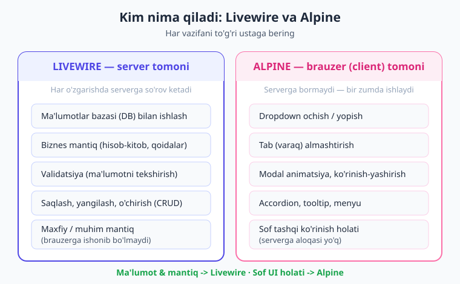
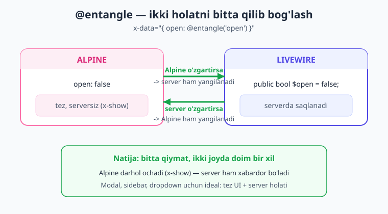

# 22 — Alpine.js integratsiyasi

[⬅️ Oldingi: 21 — Lazy, polling, navigatsiya](./21-lazy-poll-navigate.md) · [🏠 Kitob boshi](./README.md) · [Keyingi: 23 — Xavfsizlik ➡️](./23-xavfsizlik.md)

> **Bu bobda:** Livewire bilan yonma-yon keladigan kichik JavaScript frameworki — **Alpine.js** bilan tanishamiz. Nega ba'zi ishlarni serverga (Livewire) emas, brauzerga (Alpine) topshirish kerakligini, ikkalasi qanday qilib bitta jamoa bo'lib ishlashini o'rganamiz. `$wire` ko'prigi, `@entangle` bog'lash, `$dispatch` event, `@script` va `@assets` bloklari — barchasi jonli Livewire v4 misollarda.

---

## Nega bizga yana bir framework kerak?

Shu paytgacha Livewire bilan ko'p narsa qildik: forma, validatsiya, ro'yxat, qidiruv, modal, event. Va deyarli har safar bir narsa sodir bo'ldi — foydalanuvchi biror tugmani bosadi, **serverga so'rov ketadi**, server javob qaytaradi, sahifaning bir qismi yangilanadi. Bu Livewire'ning kuchi: butun mantiqni PHP'da yozasiz, JavaScript yozmaysiz.

Lekin kichik bir narsani o'ylab ko'ring. Sahifada **dropdown menyu** bor — ustiga bossangiz ochiladi, yana bossangiz yopiladi. Bu ishni Livewire'ga topshirsangiz nima bo'ladi? Har "ochish" va "yopish" uchun brauzer serverga so'rov yuboradi, server `$open = true` qiladi, javobni qaytaradi, sahifa yangilanadi. Menyuni ochish uchun internetga borib kelish! Bu xuddi **uydagi chiroqni yoqish uchun har safar elektr kompaniyasiga qo'ng'iroq qilishdek** — chiroq tugmasi yoningizda turibdi-ku.

> **Hayotiy o'xshatish — restoran.** Livewire'ni katta **oshpaz** deb tasavvur qiling: u oshxonada (serverda) ovqat pishiradi, mahsulot omborini (DB) boshqaradi, retseptlarni (mantiq) biladi. Alpine.js esa — **ofitsiant**: u oshxonaga yugurmasdan, joyida bajariladigan mayda ishlarni qiladi: dasturxonni yopadi, salfetka uzatadi, menyuni ochib ko'rsatadi. Mijoz "menyuni ko'rsating" desa, ofitsiant uni darhol ochadi — oshpazni bezovta qilmaydi. Lekin "buyurtma bering" desa — bu oshxonaga boradi (Livewire). **Har kim o'z ishini qiladi.**

Texnik ta'rif bilan: **Alpine.js — bu juda kichik (15 KB) JavaScript frameworki** bo'lib, HTML'ning o'zida atributlar (`x-data`, `x-show`, `@click`) orqali brauzer ichidagi xulq-atvorni boshqaradi. Eng yaxshi yangilik: **Alpine Livewire bilan AVTOMATIK keladi.** Siz Livewire o'rnatganingizda Alpine ham ichida bor — alohida o'rnatish, alohida import qilish shart emas. Ikkalasi bir oilada.

!!! note "Eslatma — Alpine'ni alohida o'rnatmang"
    Livewire v4 Alpine'ni o'zi bilan birga yuklaydi. Agar Alpine'ni `npm` orqali yana qo'shsangiz, ikki nusxa to'qnashadi va xatolar chiqadi. Livewire bor joyda Alpine **allaqachon** ishlaydi — to'g'ridan-to'g'ri `x-data` yozaverasiz.

---

## Mas'uliyatni bo'lish: kim nimani qiladi?

Bu bobning eng muhim fikri — bitta jumla bilan: **ma'lumot va mantiq serverga (Livewire), sof tashqi ko'rinish (UI) holati brauzerga (Alpine).** Buni yaxshi o'zlashtirsangiz, qachon qaysi birini ishlatishni hech qachon aralashtirmaysiz.



Sababini eslang: **Livewire'da har o'zgarish — bu serverga so'rov.** Bu ajoyib, chunki PHP'da xavfsiz, ishonchli mantiq yozasiz. Lekin so'rov — bu vaqt (bir necha o'n millisekund, ba'zan ko'proq) va tarmoq. Dropdown ochish, tab almashtirish, tooltip ko'rsatish kabi narsalar uchun serverga borishning hech qanday keragi yo'q — bu ma'lumotni o'zgartirmaydi, faqat ko'rinishni o'zgartiradi. Bularni brauzerda Alpine bir zumda, internetga bormasdan bajaradi.

Mana oddiy qoida:

| Vazifa | Kim qiladi | Nega |
|---|---|---|
| Ma'lumotni saqlash/o'qish (DB) | **Livewire** | Faqat server DB'ga kira oladi |
| Validatsiya, biznes qoidalar | **Livewire** | Brauzerga ishonib bo'lmaydi (xavfsizlik) |
| Dropdown / menyu ochish-yopish | **Alpine** | Sof ko'rinish, serverga bog'liq emas |
| Tab (varaq) almashtirish | **Alpine** | Mahalliy holat, tez bo'lishi kerak |
| Modal animatsiya, ko'rinish | **Alpine** | Brauzerda silliq, so'rovsiz |
| "Ko'rsatish/yashirish" tugmasi | **Alpine** | Faqat UI, ma'lumot o'zgarmaydi |

!!! tip "Maslahat — oddiy savol bering"
    Har bir interaktiv element uchun o'zingizga shu savolni bering: **"Bu serverdagi ma'lumotni o'zgartiradimi yoki shunchaki ko'rinishni?"** Agar ma'lumotni — Livewire. Agar faqat ko'rinishni — Alpine. Bu savol 90% holatda to'g'ri tanlovni beradi.

---

## Alpine asoslari: 7 ta atribut yetadi

Alpine'da o'nlab atributlar bor, lekin kundalik ishda asosan 7 tasi kerak. Hammasi HTML'ning o'zida yoziladi — alohida JS fayl ham, `<script>` teg ham shart emas. Keling, ularni qisqacha ko'rib chiqamiz.

### `x-data` — Alpine "miyasi"

Har bir Alpine bloki `x-data` bilan boshlanadi. Bu elementga "men Alpine boshqarayotgan blokman, mana mening holatim" deyish. Holat — oddiy JavaScript obyekti:

```html
<div x-data="{ open: false }">
    ...
</div>
```

Bu yerda `open` — bizning mahalliy o'zgaruvchimiz, boshlang'ich qiymati `false`. `x-data` ichidagi hamma narsa **faqat brauzerda** yashaydi, serverga aloqasi yo'q.

### `x-show` — ko'rsatish yoki yashirish

`x-show` element ko'rinadimi yoki yo'qmi shuni boshqaradi. Ichidagi ifoda `true` bo'lsa — element ko'rinadi, `false` bo'lsa — yashiriladi:

```html
<div x-show="open">Men faqat open=true bo'lganda ko'rinaman</div>
```

### `@click` (ya'ni `x-on:click`) — bosishni eshitish

`@click` — bu `x-on:click` ning qisqa shakli (ikkalasi bir xil). Element bosilganda biror ish qildiradi:

```html
<button @click="open = !open">Ochish / Yopish</button>
```

`open = !open` — "joriy qiymatni teskarisiga o'zgartir". `false` bo'lsa `true`, `true` bo'lsa `false` qiladi. Klassik "toggle" (almashtirish).

### Birinchi to'liq Alpine misoli: dropdown

Mana shu uchtasini birlashtirib, butun dropdown'ni yozamiz — **bitta qator PHP yozmasdan, serverga bormasdan:**

```blade
<div x-data="{ open: false }">
    <button @click="open = !open">Menyu ▾</button>

    <ul x-show="open">
        <li>Profil</li>
        <li>Sozlamalar</li>
        <li>Chiqish</li>
    </ul>
</div>
```

Tugmani bossangiz menyu ochiladi, yana bossangiz yopiladi — **bir zumda**, hech qanday so'rovsiz. Bu Alpine'ning butun mohiyati.

### Qolgan kerakli atributlar

Tez-tez ishlatadigan yana bir nechtasi:

- **`x-text`** — elementning matnini Alpine holatidan oladi: `<span x-text="open ? 'Ochiq' : 'Yopiq'"></span>`.
- **`x-model`** — input qiymatini Alpine o'zgaruvchisiga bog'laydi (Livewire'dagi `wire:model`ning brauzerdagi ukasi): `<input x-model="ism">`.
- **`x-if`** — shartli **render** (`x-show` faqat yashiradi; `x-if` umuman DOM'ga qo'shmaydi). `<template x-if="open">...</template>` ko'rinishida ishlatiladi.
- **`x-for`** — ro'yxat aylantirish: `<template x-for="item in items">...</template>`.

> **Hayotiy o'xshatish — accordion (akkordeon).** Telefoningizdagi "Tez-tez so'raladigan savollar" ro'yxatini eslang: savol ustiga bossangiz javob ochiladi, yana bossangiz yopiladi. Bu sof UI ishi — javob matni allaqachon sahifada, faqat ko'rinish o'zgaradi. Alpine uchun ideal:

```blade
<div x-data="{ ochiq: null }">
    <div>
        <button @click="ochiq = (ochiq === 1 ? null : 1)">Yetkazib berasizmi? ▾</button>
        <p x-show="ochiq === 1">Ha, butun shahar bo'ylab.</p>
    </div>
    <div>
        <button @click="ochiq = (ochiq === 2 ? null : 2)">To'lov qanday? ▾</button>
        <p x-show="ochiq === 2">Naqd yoki karta orqali.</p>
    </div>
</div>
```

Bularning hammasi brauzerda, server bilan gaplashmasdan ishlaydi. Endi eng qiziq qismi — **Alpine bilan Livewire qanday gaplashadi?**

---

## `$wire` — Alpine'dan Livewire'ga ko'prik

Ba'zan brauzerdagi Alpine kodi serverdagi Livewire bilan gaplashishi kerak bo'ladi. Masalan, Alpine ichida tugma bosilganda Livewire metodini chaqirish, yoki Livewire xususiyatining qiymatini Alpine ichida o'qish. Buning uchun Livewire sehrli bir narsa beradi: **`$wire`**.

> **Hayotiy o'xshatish — ichki telefon.** Katta ofisni tasavvur qiling: har xonada ichki telefon bor. Ofitsiant (Alpine) o'z stolida ishlayapti, lekin oshpaz (Livewire) bilan gaplashish kerak bo'lsa — qo'lini cho'zib ichki telefon go'shagini oladi. **`$wire` — aynan o'sha go'shak:** Alpine kodi ichida `$wire` deganingizda, yonidagi Livewire komponenti qo'lingizga keladi. Uning xususiyatlarini o'qiysiz, metodlarini chaqirasiz.


`$wire` bilan nima qila olamiz:

- **Xususiyatni o'qish:** `$wire.count` — Livewire'ning `public $count` qiymatini beradi.
- **Metodni chaqirish:** `$wire.increment()` — Livewire'ning `increment()` metodini ishga soladi (serverga so'rov ketadi).
- **Qiymat o'rnatish:** `$wire.$set('open', true)` — `public $open` ni `true` qiladi.
- **Qayta render:** `$wire.$refresh()` — komponentni qaytadan chizadi.
- **Event yuborish:** `$wire.$dispatch('saved')` — Livewire eventi yuboradi (pastda batafsil).

Diqqat: maxsus amallar (`$set`, `$refresh`, `$dispatch`) **dollar belgisi bilan** boshlanadi — `$wire.$set`, oddiy `$wire.set` emas.

Mana jonli misol — Alpine tugmasi Livewire metodini chaqiradi, va Livewire xususiyatini Alpine `x-text` bilan ko'rsatadi:

```php
{{-- resources/views/components/⚡alpine-test.blade.php --}}
<?php

use Livewire\Component;

new class extends Component
{
    public int $count = 0;

    public function increment(): void
    {
        $this->count++;
    }
};
?>

<div>
    <div x-data="{ local: 0 }">
        {{-- Alpine tugmasi Livewire metodini chaqiradi (serverga boradi) --}}
        <button x-on:click="$wire.increment()">+1 (serverda)</button>

        {{-- Livewire xususiyatini Alpine ichida o'qiymiz --}}
        <span>Server hisobi: <span x-text="$wire.count"></span></span>

        {{-- PHP orqali ham bir xil qiymat --}}
        <span>PHP hisobi: {{ $count }}</span>

        {{-- Bu esa sof Alpine — serverga umuman bormaydi --}}
        <button x-on:click="local++">Mahalliy: <span x-text="local"></span></button>
    </div>
</div>
```

Bu misolda ikki xil tugma bor va farqi muhim:

- **`$wire.increment()`** — serverga so'rov yuboradi, `$count` ortadi, sahifa yangilanadi. Bu **Livewire** ishi.
- **`local++`** — faqat brauzerda, bir zumda. Serverga umuman bormaydi. Bu **Alpine** ishi.

> **Tasdiqlangan.** Yuqoridagi komponent jonli Livewire v4.3.1 loyihada render qilindi va `increment()` chaqirilganda `$count` 0 dan 1 ga o'tdi — test o'tdi.

!!! note "Eslatma — `$wire.count` o'qish bilan o'zgartirishning farqi"
    `$wire.count` ni Alpine ichida **o'qiy** olasiz, lekin to'g'ridan-to'g'ri `$wire.count = 5` deb yozish o'rniga `$wire.$set('count', 5)` ishlating — bu Livewire'ga o'zgarishni to'g'ri yetkazadi.

---

## `@entangle` — ikki holatni bitta qilib bog'lash

`$wire` bilan Alpine Livewire'ni "chaqira" oladi. Lekin ba'zan biz boshqacha narsa xohlaymiz: **bir qiymat ham Alpine'da, ham Livewire'da bo'lsin va ikkalasi doim bir xil bo'lib tursin.** Masalan modal oynaning "ochiqmi" holati. Alpine uni darhol ochib-yopsin (tez), lekin Livewire ham bu holatni bilsin (server xabardor bo'lsin). Buni **`@entangle`** hal qiladi.

> **Hayotiy o'xshatish — sehrli daftar.** Ikki kishida bir xil ikkita daftar bor, lekin ular **sehrli**: bittasiga nimadir yozsangiz, ikkinchisida ham o'sha zahoti paydo bo'ladi. Birortasini o'chirsangiz — ikkalasidan ham o'chadi. **`@entangle` — aynan shunday:** Alpine'dagi `open` o'zgaruvchisi va Livewire'dagi `$open` xususiyatini bir-biriga "ulab" qo'yadi. Biri o'zgarsa — ikkinchisi avtomatik o'zgaradi.



Sintaksisi juda oddiy — `x-data` ichida Alpine o'zgaruvchisiga `@entangle('xususiyat')` ni beramiz:

```blade
<div x-data="{ open: @entangle('open') }">
    ...
</div>
```

Endi to'liq modal misoli. Modal'ni **ham Alpine** (`x-show` bilan, darhol), **ham Livewire** (`$toggle` bilan, serverdan) ochib-yopa olamiz — va ikkalasi har doim mos keladi:

```php
{{-- resources/views/components/⚡modal-misol.blade.php --}}
<?php

use Livewire\Component;

new class extends Component
{
    public bool $open = false;
};
?>

<div x-data="{ open: @entangle('open') }">
    {{-- Alpine bilan ochish: darhol, serversiz --}}
    <button x-on:click="open = !open">Ochish (Alpine — tez)</button>

    {{-- Livewire bilan ochish: serverdan --}}
    <button wire:click="$toggle('open')">Ochish (Livewire — serverdan)</button>

    {{-- x-show Alpine'da bir zumda ishlaydi --}}
    <div x-show="open">
        <p>Modal ochiq! Server tomonidagi qiymat: {{ $open ? 'true' : 'false' }}</p>
    </div>
</div>
```

Bu yerda sehr shundaki: birinchi tugma (Alpine) modalni **darhol** ochadi — animatsiya silliq, kutish yo'q. Va shu bilan birga `@entangle` tufayli server tomonidagi `$open` ham `true` bo'ladi. Agar Livewire boshqa sababga ko'ra qayta render bo'lsa — modal ochiq holida qoladi, chunki server uni "ochiq" deb biladi.

> **Tasdiqlangan.** `@entangle('open')` jonli loyihada brauzerga `window.Livewire.find('...').entangle('open')` ko'rinishida kompilyatsiya qilindi va ikki tomonlama bog'lanish ishladi.

!!! tip "Maslahat — qachon @entangle, qachon $wire?"
    - Faqat **bir marta** Livewire'ni chaqirish kerakmi (tugma bosilganda metod)? — `$wire.metod()`.
    - Bir **qiymat** doim ikki joyda bir xil bo'lib tursinmi (modal ochiq/yopiq holati)? — `@entangle`.
    `@entangle` ni asosan: modal, sidebar, dropdown holatini serverda ham bilish kerak bo'lganda ishlating.

!!! warning "Ehtiyot bo'ling — keraksiz @entangle"
    Agar holat **faqat** brauzerga kerak bo'lsa (server uni umuman bilmasa ham bo'ladi) — `@entangle` ishlatmang, oddiy `x-data="{ open: false }"` yeting. `@entangle` server bilan sinxronlash uchun, sof UI uchun emas. Keraksiz bog'lanish — keraksiz murakkablik.

---

## `$dispatch` — Alpine'dan Livewire eventiga

[18-bobda](./18-events.md) Livewire eventlarini o'rgangandik: bir komponent `dispatch` qiladi, boshqasi `#[On(...)]` bilan eshitadi. Eng yaxshi yangilik — **bu eventni Alpine ham yubora oladi.** Alpine ichidagi tugmadan to'g'ridan-to'g'ri Livewire eventini "efirga" chiqarish mumkin.

Buning uchun Alpine'ning `$dispatch` sehri ishlatiladi:

```blade
<button x-on:click="$dispatch('saved')">Saqlash</button>
```

Va Livewire tomonda — odatdagidek `#[On]` bilan eshitamiz:

```php
{{-- resources/views/components/⚡alpine-dispatch.blade.php --}}
<?php

use Livewire\Component;
use Livewire\Attributes\On;

new class extends Component
{
    public string $log = '';

    #[On('saved')]
    public function onSaved(): void
    {
        $this->log = 'saved eventi qabul qilindi';
    }
};
?>

<div>
    {{-- Alpine tugmasi Livewire eventini yuboradi --}}
    <button x-data x-on:click="$dispatch('saved')">Saqlash</button>

    <p>{{ $log }}</p>
</div>
```

Tugma bosilganda Alpine `'saved'` eventini chiqaradi, Livewire `#[On('saved')]` orqali uni ushlaydi va `onSaved()` ishga tushadi. **Brauzerdagi Alpine va serverdagi Livewire bir til — event — orqali gaplashdi.**

> **Tasdiqlangan.** Bu komponent jonli loyihada test qilindi: `onSaved()` chaqirilganda `$log` to'g'ri o'rnatildi — test o'tdi.

> **Hayotiy o'xshatish — qo'ng'iroq tugmasi.** `$dispatch` — bu eshik qo'ng'irog'i tugmasi. Alpine tugmani bosadi (qo'ng'iroqni chaladi), Livewire esa ichkarida o'tirib eshitadi va eshikni ochadi (`#[On]`). Tugma kim eshitayotganini bilmaydi — shunchaki ovoz chiqaradi.

!!! note "Teskari yo'nalish ham bor"
    Faqat Alpine -> Livewire emas, teskarisi ham mumkin: Livewire serverdan `$this->dispatch('open-modal')` yuborsa, Alpine uni `x-on:open-modal.window="..."` bilan eshitib, brauzerda darhol biror ish qiladi (masalan modalni animatsiya bilan ochadi). `.window` qo'shimchasi — eventni butun oyna bo'ylab tinglash degani.

---

## `@script` va `@assets` — JavaScript qo'shish

Ba'zan komponentingizga **maxsus JavaScript** kerak bo'ladi (masalan biror grafik chizish kutubxonasini sozlash). Livewire buning uchun ikki maxsus blok beradi.

### `@script` — komponentga JS

`@script ... @endscript` — bu komponentga tegishli JavaScript yozish joyi. U **Alpine yuklangach** ishga tushadi va ichida `$wire` mavjud bo'ladi (ya'ni shu komponentning Livewire qismiga ulanasiz):

```php
{{-- resources/views/components/⚡chart-misol.blade.php --}}
<?php

use Livewire\Component;

new class extends Component
{
    public array $data = [10, 20, 30];
};
?>

<div>
    <canvas id="mening-grafik"></canvas>

    @script
    <script>
        // Bu kod komponent yuklanganda bir marta ishlaydi.
        // $wire shu yerda mavjud — server xususiyatlariga kira olamiz.
        console.log('Grafik uchun ma\'lumot:', $wire.data);
        // Bu yerda grafik chizuvchi kutubxonani sozlash mumkin.
    </script>
    @endscript
</div>
```

`@script` ning oddiy `<script>` tegidan farqi: Livewire uni **to'g'ri vaqtda** (Alpine tayyor bo'lgach) ishga soladi va `$wire` ko'prigini avtomatik beradi.

> **Tasdiqlangan.** `@script` bloki bo'lgan SFC jonli loyihada muammosiz render qilindi va test o'tdi.

### `@assets` — global kutubxonani bir marta yuklash

Agar tashqi JS/CSS kutubxonasi kerak bo'lsa (masalan Chart.js), uni `@assets ... @endassets` ichiga qo'yasiz. Livewire uni **butun sahifada faqat bir marta** yuklashni kafolatlaydi — komponent o'nta marta ishlatilsa ham, kutubxona bir marta yuklanadi:

```php
<div>
    <canvas id="grafik"></canvas>

    @assets
    <script src="https://cdn.jsdelivr.net/npm/chart.js"></script>
    @endassets

    @script
    <script>
        // Chart.js bu yerda allaqachon yuklangan bo'ladi
        const ctx = document.getElementById('grafik');
        // new Chart(ctx, { ... });
    </script>
    @endscript
</div>
```

> **Tasdiqlangan.** `@assets` bilan tashqi kutubxona qo'shilgan komponent jonli loyihada to'g'ri render qilindi.

!!! tip "Maslahat — `@assets` global, `@script` mahalliy"
    - **`@assets`** — kutubxonalarni (CDN'dan kelgan JS/CSS) yuklash uchun. Bir marta, butun sahifaga.
    - **`@script`** — shu komponentning o'z mantig'i uchun. Har komponent nusxasida ishlaydi.
    Chart.js kabi katta kutubxonani `@assets`'ga, uni sozlovchi kodni `@script`'ga qo'ying.

---

## Eng kuchli holat: ikkalasi birga

Alpine va Livewire alohida ham foydali, lekin ularning haqiqiy kuchi **birga ishlaganda** ochiladi. Klassik misol: **qidiriladigan dropdown** (combobox). Bu yerda:

- **Alpine** ro'yxatni ochadi/yopadi, tashqariga bosilganda yopadi — sof UI, tez, serversiz.
- **Livewire** har yozilgan harfga qarab serverda (DB'dan) qidiradi — bu ma'lumot ishi.

Har biri o'z ishini qiladi, va natija — silliq, tez, va xavfsiz interfeys:

```php
{{-- resources/views/components/⚡qidiruv-dropdown.blade.php --}}
<?php

use Livewire\Component;

new class extends Component
{
    public string $qidiruv = '';

    public function natijalar(): array
    {
        if (strlen($this->qidiruv) < 1) {
            return [];
        }

        // Haqiqiy loyihada bu DB'dan keladi:
        // return Mahsulot::where('nom', 'like', "%{$this->qidiruv}%")->pluck('nom')->all();
        $hammasi = ['Olma', 'Anor', 'Banan', 'Uzum', 'Shaftoli', 'Apelsin'];

        return array_values(array_filter(
            $hammasi,
            fn ($n) => str_contains(mb_strtolower($n), mb_strtolower($this->qidiruv))
        ));
    }
};
?>

<div x-data="{ ochiq: false }" x-on:click.outside="ochiq = false">
    {{-- Input: Alpine ochadi, Livewire qidiradi --}}
    <input
        type="text"
        wire:model.live.debounce.300ms="qidiruv"
        x-on:focus="ochiq = true"
        placeholder="Mahsulot qidiring..."
    >

    {{-- Ro'yxat: Alpine ko'rsatadi/yashiradi (x-show) --}}
    <ul x-show="ochiq">
        @forelse ($this->natijalar() as $i => $natija)
            <li wire:key="natija-{{ $i }}">{{ $natija }}</li>
        @empty
            <li>Hech narsa topilmadi.</li>
        @endforelse
    </ul>
</div>
```

Bu misolda har bir narsaga e'tibor bering:

- `x-data="{ ochiq: false }"` — dropdown ochiqmi, bu **sof UI holati**, Alpine'da.
- `x-on:focus="ochiq = true"` — input'ga bosilganda ro'yxat ochiladi, **darhol** (Alpine).
- `x-on:click.outside="ochiq = false"` — tashqariga bosilsa yopiladi, **darhol** (Alpine). `.outside` — element tashqarisiga bosilishni eshitish.
- `wire:model.live.debounce.300ms="qidiruv"` — har yozilganda (300ms kutib) serverga yuboriladi va **DB'dan qidiriladi** (Livewire). `.debounce` haqida [6-bobda](./06-data-binding.md) gapirgandik.
- `$this->natijalar()` — server qidiruv natijalarini qaytaradi (Livewire mantig'i).

Mana mukammal hamkorlik: **ochish/yopish — Alpine (tez), qidiruv — Livewire (kuchli).** Hech qaysi biri ikkinchisining ishiga aralashmaydi.

!!! example "Misol — nega ikkalasi ham kerak"
    Tasavvur qiling, ro'yxat ochiq/yopiq holatini ham Livewire boshqarsa: har "ochish" va "yopish" uchun serverga so'rov ketardi, dropdown sekin ochilardi. Aksincha, qidiruvni Alpine qilsa — u DB'ga kira olmaydi (faqat server kira oladi). Shuning uchun **har kim o'z ishini qiladi** — interfeys ham tez, ham kuchli.

---

## Qaysi birini tanlash: yakuniy qoida

Bobni eng muhim maslahat bilan yakunlaymiz — buni doim yodda tuting:

!!! tip "Maslahat — oltin qoida"
    - **Toza UI holati** (ochiq/yopiq, faol tab, hover, animatsiya, ko'rsatish/yashirish) -> **Alpine.** Serverga aloqasi yo'q, bir zumda bo'lishi kerak.
    - **Ma'lumot va mantiq** (DB, validatsiya, hisob-kitob, saqlash, xavfsizlik) -> **Livewire.** Faqat server bunga ishonchli.
    - **Ikkovini ulash kerakmi?** Bir martalik chaqiruv — `$wire.metod()`; doimiy bog'langan qiymat — `@entangle`; xabar yuborish — `$dispatch`.

!!! danger "Xavfsizlik — Alpine'ga muhim mantiqni ishonmang"
    Alpine **brauzerda** ishlaydi, ya'ni foydalanuvchi uni ko'radi va o'zgartira oladi. Hech qachon xavfsizlik tekshiruvini ("bu foydalanuvchi o'chira oladimi?"), narx hisobini yoki maxfiy mantiqni faqat Alpine'da qilmang — uni **doim** serverda (Livewire) takror tekshiring. Bu haqda [keyingi, 23-bobda](./23-xavfsizlik.md) batafsil gaplashamiz.

---

## Xulosa

- **Alpine.js — kichik (15 KB) brauzer frameworki**, Livewire bilan **avtomatik keladi.** Alohida o'rnatmang, to'g'ridan-to'g'ri `x-data` yozaverasiz.
- **Mas'uliyatni bo'ling:** ma'lumot va mantiq -> Livewire (server); sof UI holati (dropdown, tab, modal animatsiya) -> Alpine (brauzer). Asosiy savol: "bu ma'lumotni o'zgartiradimi yoki shunchaki ko'rinishni?"
- **Alpine asoslari:** `x-data` (holat), `x-show` (ko'rsatish/yashirish), `@click`/`x-on:click` (bosish), `x-text`, `x-model`, `x-if`, `x-for`. Dropdown va accordion'ni bir qator PHP'siz yozadi.
- **`$wire` — Alpine'dan Livewire'ga ko'prik:** `$wire.count` (o'qish), `$wire.increment()` (metod), `$wire.$set('open', true)`, `$wire.$refresh()`, `$wire.$dispatch(...)`. Maxsus amallar `$` bilan boshlanadi.
- **`@entangle('open')` — bir qiymatni Alpine va Livewire'da bog'laydi:** `x-data="{ open: @entangle('open') }"`. Modal/sidebar holati uchun ideal — Alpine darhol o'zgartiradi, server ham xabardor bo'ladi.
- **`$dispatch` Alpine'dan Livewire eventiga:** `<button @click="$dispatch('saved')">` -> `#[On('saved')]`. Teskarisi ham bor: Livewire `dispatch` -> Alpine `x-on:saved.window`.
- **`@script ... @endscript`** — komponentga JS (`$wire` mavjud); **`@assets ... @endassets`** — tashqi kutubxonani butun sahifada bir marta yuklash.
- **Eng kuchli holat = ikkalasi birga:** qidiriladigan dropdown — Alpine ochadi/yopadi (tez), Livewire qidiradi (kuchli). Har kim o'z ishini qiladi.
- **Xavfsizlik:** Alpine brauzerda — uni foydalanuvchi o'zgartira oladi. Muhim/maxfiy mantiqni doim serverda takror tekshiring.

## Amaliy mashqlar

1. **Sof Alpine dropdown (oson).** Faqat Alpine ishlatib, profil menyusi yarating: "Profil ▾" tugmasi bosilganda ostida uchta havola (Sozlamalar, Yordam, Chiqish) ochilsin, tashqariga bosilganda yopilsin. *Yo'naltirish:* `x-data="{ open: false }"`, `@click="open = !open"`, `x-show="open"` va `x-on:click.outside="open = false"`. Serverga (Livewire) hech narsa yuborilmasligiga e'tibor bering.

2. **`$wire` bilan hisoblagich (oson–o'rta).** Livewire komponentida `public int $count` va `increment()` metodi bo'lsin. Sahifada **ikki** tugma yarating: biri `wire:click="increment"` (Livewire usuli), ikkinchisi `x-on:click="$wire.increment()"` (Alpine usuli). Ikkalasi ham bir xil ishlashini, va `x-text="$wire.count"` server qiymatini ko'rsatishini tekshiring. *Savol:* ikkalasining server uchun farqi bormi?

3. **`@entangle` modal (o'rta).** `public bool $open = false` xususiyatli komponent yarating. Modalni `x-data="{ open: @entangle('open') }"` bilan bog'lang. Ikki tugma qo'ying: biri Alpine bilan (`x-on:click="open = !open"`), biri Livewire bilan (`wire:click="$toggle('open')"`). Ikkalasi ham modalni ochib-yopishini, va modal ichida `{{ $open ? 'ochiq' : 'yopiq' }}` server qiymati ham mos o'zgarishini kuzating. *Yo'naltirish:* `x-show="open"` modal kontentida.

4. **Alpine'dan event (o'rta–qiyin).** Komponentda `#[On('tozalandi')]` eshitadigan metod bo'lsin (u biror xabar matnini o'rnatsin). Alpine tugmasi `x-on:click="$dispatch('tozalandi')"` bilan shu eventni yuborsin. Tugma bosilganda Livewire metodi ishga tushib, xabar paydo bo'lishini tekshiring. *Qo'shimcha:* keyin teskarisini qiling — Livewire `$this->dispatch('chiqdi')` yuborsin, Alpine uni `x-on:chiqdi.window` bilan eshitib, brauzerda biror narsa ko'rsatsin.

5. **Qidiriladigan dropdown (qiyin — birlashtirish).** Bobdagi qidiruv-dropdown misolini qaytadan yozing, lekin natijalarni haqiqiy modeldan oling (masalan `User` yoki o'zingiz yaratgan model). Alpine ro'yxatni `focus`'da ochsin, `click.outside`'da yopsin; Livewire `wire:model.live.debounce.300ms` bilan DB'dan qidirsin. *Fikrlash uchun:* nega ochish/yopishni Alpine, qidiruvni Livewire qiladi? Agar teskarisini qilsangiz, har biri qayerda "qoqiladi"? (Maslahat: Alpine DB'ga kira oladimi? Livewire har ochish-yopishda serverga borishi yaxshimi?)

---

[⬅️ Oldingi: 21 — Lazy, polling, navigatsiya](./21-lazy-poll-navigate.md) · [🏠 Kitob boshi](./README.md) · [Keyingi: 23 — Xavfsizlik ➡️](./23-xavfsizlik.md)
